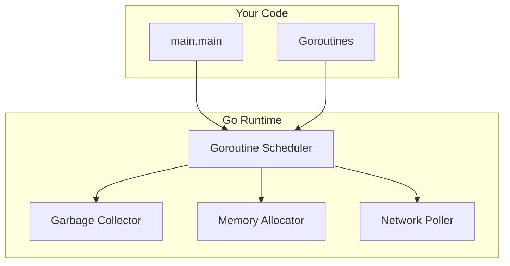

<Frame>
  
</Frame>

# Introduction to Go

Go (often referred to as Golang) is an open-source programming language supported by Google. It is statically typed, compiled, and designed for simplicity, concurrency, and performance.

## History and Philosophy

Go was designed at Google in 2007 by Robert Griesemer, Rob Pike, and Ken Thompson. It was announced in 2009 and reached version 1.0 in 2012.

The language was born out of frustration with existing languages (C++, Java, Python) used for large-scale systems. The designers wanted a language that combined:
- **Efficiency** of C++ (static typing, compiled)
- **Readability** and **Usability** of Python/JavaScript
- **High-performance networking** and **multiprocessing**

### Key Characteristics
- **Simplicity**: The specification is small enough to hold in your head.
- **Fast Compilation**: Designed to compile large projects in seconds.
- **Garbage Collection**: Automatic memory management.
- **Built-in Concurrency**: Goroutines and channels are core primitives.
- **Static Typing**: Type safety without the verbosity (type inference).
- **No Inheritance**: Composition over inheritance (structs and interfaces).

---

## Installation

To get started with Go, download and install the latest version from the official website.

1.  Visit [go.dev/dl](https://go.dev/dl/).
2.  Download the installer for your OS (Windows, macOS, Linux).
3.  Run the installer and follow the prompts.

### Verify Installation

Open your terminal and run:

```bash
go version
```

You should see output similar to `go version go1.21.0 windows/amd64`.

---

## Your First Go Program

Let's write the classic "Hello, World!" program.

1.  Create a file named `main.go`.
2.  Add the following code:

```go
package main

import "fmt"

func main() {
    fmt.Println("Hello, World!")
}
```

### Running the Program

You can run it directly using the `go run` command:

```bash
go run main.go
# Output: Hello, World!
```

Or compile it into a binary:

```bash
go build main.go
./main      # On macOS/Linux
main.exe    # On Windows
```

### Code Breakdown

-   `package main`: Defines the package name. The `main` package is special; it tells the Go compiler that this should compile as an executable program rather than a shared library.
-   `import "fmt"`: Imports the `fmt` (format) package, which contains functions for formatting text, including printing to the console.
-   `func main() { ... }`: The entry point of the program. When you run the executable, this function executes first.

---

## How Go Works: Compilation Deep Dive

Unlike interpreted languages (Python, JavaScript) that run code line-by-line, Go is a **compiled language**. Understanding the compilation process helps you write better code and debug issues.

### The Go Compilation Pipeline


| Stage | What Happens | Output |
|-------|-------------|--------|
| **Lexing** | Source code is broken into tokens (keywords, identifiers, operators) | Token stream |
| **Parsing** | Tokens are organized into an Abstract Syntax Tree (AST) | Parse tree structure |
| **Type Checking** | Types are verified, interfaces are checked | Type-annotated AST |
| **SSA Generation** | Code is converted to Static Single Assignment form | Intermediate representation |
| **Code Generation** | Platform-specific machine code is generated | Object files |
| **Linking** | Object files + runtime are combined | Final executable |

### Why Go Compiles Fast

Go was designed for **fast compilation**. Large projects at Google compile in seconds, not minutes. Key reasons:

1. **No header files**: Dependencies are resolved from packages directly
2. **Simple grammar**: Easy to parse, no ambiguous syntax
3. **No circular imports**: Dependency graph is always a DAG
4. **Package-level compilation**: Only recompile changed packages

```bash
# See compilation steps in action
go build -x main.go  # Shows all commands executed

# Compile without linking (faster for checking)
go build -c main.go
```

### Go Runtime Architecture

Unlike C/C++, Go includes a **runtime** in every binary. This runtime provides:



| Component | Purpose |
|-----------|---------|
| **Garbage Collector** | Automatic memory management (concurrent, low-latency) |
| **Goroutine Scheduler** | M:N scheduler maps goroutines to OS threads |
| **Memory Allocator** | Efficient allocation with TCMalloc-style design |
| **Network Poller** | Async I/O using epoll/kqueue/IOCP |

<Info>
**Binary Size**: The Go runtime adds ~2MB to every binary. This is why even a "Hello World" is larger than C. The trade-off is you get garbage collection, goroutines, and a full standard library.
</Info>

### Cross-Compilation

Go makes cross-compilation trivially easy:

```bash
# Compile for Linux from any OS
GOOS=linux GOARCH=amd64 go build -o myapp-linux main.go

# Compile for Windows
GOOS=windows GOARCH=amd64 go build -o myapp.exe main.go

# Compile for macOS ARM (Apple Silicon)
GOOS=darwin GOARCH=arm64 go build -o myapp-mac main.go
```

No extra tools or SDKs required—the Go toolchain includes everything.

---

## Go Toolchain

The `go` command is a powerful tool that manages source code, dependencies, and builds.

-   `go run`: Compiles and runs the Go program.
-   `go build`: Compiles the program into an executable binary.
-   `go fmt`: Automatically formats your code (standard style is enforced).
-   `go test`: Runs tests.
-   `go mod`: Manages modules and dependencies.
-   `go get`: Downloads and installs packages.

### Useful Build Flags

```bash
# Strip debug info for smaller binary
go build -ldflags="-s -w" main.go

# Build with race detector (for debugging concurrency)
go build -race main.go

# Show what would be built without building
go build -n main.go

# Verbose output
go build -v ./...
```

<Tip>
**Pro Tip**: Always run `go fmt` before committing your code. The Go community has a strict standard for code formatting, and `go fmt` ensures your code complies.
</Tip>
