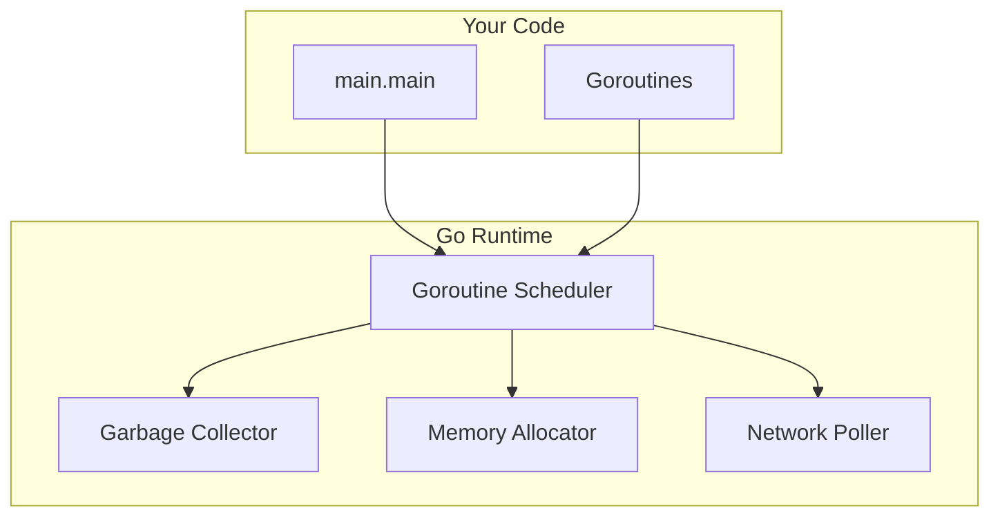

<Frame>
  
</Frame>

# Introduction to Go

Go (often referred to as Golang) is an open-source programming language supported by Google. It is statically typed, compiled, and designed for simplicity, concurrency, and performance.

Think of Go as the power tool of programming languages: it does not try to be everything to everyone, but for the jobs it targets -- networked services, CLI tools, infrastructure software -- it is exceptionally good. While languages like Rust give you fine-grained memory control at the cost of complexity, and Python gives you expressiveness at the cost of speed, Go sits in a deliberate sweet spot: fast enough for production servers, simple enough to onboard a new team member in a week.

## History and Philosophy

Go was designed at Google in 2007 by Robert Griesemer, Rob Pike, and Ken Thompson -- three engineers who had collectively built Unix, the B programming language, UTF-8, and the Java HotSpot compiler. It was announced in 2009 and reached version 1.0 in 2012.

The language was born out of frustration with existing languages (C++, Java, Python) used for large-scale systems. At Google, C++ builds were taking 45 minutes, Java codebases had become tangled webs of inheritance hierarchies, and Python could not handle the throughput requirements. The designers wanted a language that combined:
- **Efficiency** of C++ (static typing, compiled)
- **Readability** and **Usability** of Python/JavaScript
- **High-performance networking** and **multiprocessing**

### Key Characteristics
- **Simplicity**: The specification is small enough to hold in your head.
- **Fast Compilation**: Designed to compile large projects in seconds.
- **Garbage Collection**: Automatic memory management.
- **Built-in Concurrency**: Goroutines and channels are core primitives.
- **Static Typing**: Type safety without the verbosity (type inference).
- **No Inheritance**: Composition over inheritance (structs and interfaces).

---

## Installation

To get started with Go, download and install the latest version from the official website.

1.  Visit [go.dev/dl](https://go.dev/dl/).
2.  Download the installer for your OS (Windows, macOS, Linux).
3.  Run the installer and follow the prompts.

### Verify Installation

Open your terminal and run:

```bash
go version
```

You should see output similar to `go version go1.21.0 windows/amd64`.

---

## Your First Go Program

Let's write the classic "Hello, World!" program.

1.  Create a file named `main.go`.
2.  Add the following code:

```go
package main

import "fmt"

func main() {
    fmt.Println("Hello, World!")
}
```

### Running the Program

You can run it directly using the `go run` command:

```bash
go run main.go
# Output: Hello, World!
```

Or compile it into a binary:

```bash
go build main.go
./main      # On macOS/Linux
main.exe    # On Windows
```

### Code Breakdown

-   `package main`: Defines the package name. The `main` package is special; it tells the Go compiler that this should compile as an executable program rather than a shared library.
-   `import "fmt"`: Imports the `fmt` (format) package, which contains functions for formatting text, including printing to the console.
-   `func main() { ... }`: The entry point of the program. When you run the executable, this function executes first.

---

## How Go Works: Compilation Deep Dive

Unlike interpreted languages (Python, JavaScript) that run code line-by-line, Go is a **compiled language**. Understanding the compilation process helps you write better code and debug issues.

### The Go Compilation Pipeline


```mermaid
graph LR
    A[Source .go] -->|Lexer| B[Tokens]
    B -->|Parser| C[AST]
    C -->|Type Checker| D[Typed AST]
    D -->|SSA Backend| E[Machine Code]
    E -->|Linker| F[Executable Binary]
    
    style A fill:#00add8,stroke:#00758d,color:#fff
    style F fill:#00add8,stroke:#00758d,color:#fff
```

| Stage | What Happens | Output |
|-------|-------------|--------|
| **Lexing** | Source code is broken into tokens (keywords, identifiers, operators) | Token stream |
| **Parsing** | Tokens are organized into an Abstract Syntax Tree (AST) | Parse tree structure |
| **Type Checking** | Types are verified, interfaces are checked | Type-annotated AST |
| **SSA Generation** | Code is converted to Static Single Assignment form | Intermediate representation |
| **Code Generation** | Platform-specific machine code is generated | Object files |
| **Linking** | Object files + runtime are combined | Final executable |

### Why Go Compiles Fast

Go was designed for **fast compilation**. Large projects at Google compile in seconds, not minutes -- a deliberate design decision, since slow builds were a primary motivation for creating Go in the first place. Key reasons:

1. **No header files**: Dependencies are resolved from packages directly
2. **Simple grammar**: Easy to parse, no ambiguous syntax
3. **No circular imports**: Dependency graph is always a DAG
4. **Package-level compilation**: Only recompile changed packages

```bash
# See compilation steps in action
go build -x main.go  # Shows all commands executed

# Compile without linking (faster for checking)
go build -c main.go
```

### Go Runtime Architecture

Unlike C/C++, Go includes a **runtime** in every binary. This runtime provides:


```mermaid
graph TB
    subgraph "Go Runtime"
        GC[Garbage Collector]
        SCHED[Goroutine Scheduler]
        MEM[Memory Allocator]
        NET[Network Poller]
    end
    
    subgraph "Your Code"
        MAIN[main.main]
        GORO[Goroutines]
    end
    
    MAIN --> SCHED
    GORO --> SCHED
    SCHED --> GC
    SCHED --> MEM
    SCHED --> NET
```

| Component | Purpose |
|-----------|---------|
| **Garbage Collector** | Automatic memory management (concurrent, low-latency) |
| **Goroutine Scheduler** | M:N scheduler maps goroutines to OS threads (think of it as a dispatcher assigning thousands of lightweight tasks to a handful of workers) |
| **Memory Allocator** | Efficient allocation with TCMalloc-style design |
| **Network Poller** | Async I/O using epoll/kqueue/IOCP (the runtime handles waiting for network events so your code reads as synchronous) |

<Info>
**Binary Size**: The Go runtime adds ~2MB to every binary. This is why even a "Hello World" is larger than C. The trade-off is you get garbage collection, goroutines, and a full standard library.
</Info>

### Cross-Compilation

Go makes cross-compilation trivially easy:

```bash
# Compile for Linux from any OS
GOOS=linux GOARCH=amd64 go build -o myapp-linux main.go

# Compile for Windows
GOOS=windows GOARCH=amd64 go build -o myapp.exe main.go

# Compile for macOS ARM (Apple Silicon)
GOOS=darwin GOARCH=arm64 go build -o myapp-mac main.go
```

No extra tools or SDKs required—the Go toolchain includes everything.

---

## Go Toolchain

The `go` command is a powerful tool that manages source code, dependencies, and builds.

-   `go run`: Compiles and runs the Go program.
-   `go build`: Compiles the program into an executable binary.
-   `go fmt`: Automatically formats your code (standard style is enforced).
-   `go test`: Runs tests.
-   `go mod`: Manages modules and dependencies.
-   `go get`: Downloads and installs packages.

### Useful Build Flags

```bash
# Strip debug info for smaller binary
go build -ldflags="-s -w" main.go

# Build with race detector (for debugging concurrency)
go build -race main.go

# Show what would be built without building
go build -n main.go

# Verbose output
go build -v ./...
```

<Tip>
**Pro Tip**: Always run `go fmt` before committing your code. The Go community has a strict standard for code formatting, and `go fmt` ensures your code complies. Unlike most languages where formatting is a matter of team preference, Go made this a non-negotiable: there is one canonical format. This eliminates entire categories of code review bikeshedding.
</Tip>

<Warning>
**Common Beginner Pitfall**: Reaching for `go get` when you should use `go mod tidy`. In modern Go (1.16+), dependencies are managed through `go.mod` files. Run `go mod init` to start a new module, then `go mod tidy` to clean up dependencies. The `go get` command is now primarily for adding specific version requirements, not for general dependency management.
</Warning>

---

## Interview Deep-Dive

<AccordionGroup>
  <Accordion title="Go includes a runtime in every binary. What does that runtime do, and what are the trade-offs compared to languages like C that have no runtime?">
    **Strong Answer:**
    - The Go runtime is embedded in every compiled binary and provides four major subsystems: the goroutine scheduler (M:N mapping of goroutines to OS threads), the garbage collector (concurrent, tri-color mark-and-sweep), the memory allocator (TCMalloc-style with per-P caches), and the network poller (epoll/kqueue/IOCP for async I/O that appears synchronous to the programmer).
    - The trade-off is binary size -- even a "Hello World" program is roughly 2MB because of the runtime overhead. In contrast, an equivalent C program might be a few kilobytes. However, you get automatic memory management, lightweight concurrency, and cross-platform network I/O without linking any external libraries.
    - In practice, the binary size is rarely a problem for server-side applications. Where it matters is embedded systems or environments with strict storage constraints, where a language like C or Rust would be a better fit.
    - A subtlety: because the runtime is statically linked, Go binaries are self-contained with zero external dependencies, which makes deployment dramatically simpler compared to languages that depend on a shared runtime (JVM, Python interpreter, .NET CLR).

    **Follow-up: The Go compiler prohibits circular imports. Why is this a hard rule rather than a warning, and what design consequences does it have?**

    The circular import prohibition ensures the dependency graph is always a directed acyclic graph (DAG), which enables several important properties. First, it guarantees fast, predictable compilation because each package can be compiled exactly once in topological order -- there is no need for multi-pass compilation. Second, it forces better architectural boundaries: if package A and package B want to import each other, that is a signal that they are too tightly coupled and should either be merged or have their shared abstractions extracted into a third package. Third, it makes the build cache effective -- changing one package requires recompiling only its dependents, not a tangled web of mutual dependencies. In my experience, this constraint feels restrictive at first but quickly leads to cleaner codebases. The standard pattern when you hit a circular dependency is to introduce an interface package that both sides depend on.
  </Accordion>

  <Accordion title="Go is famous for fast compilation. Walk me through the specific design decisions that make this possible, and explain why languages like C++ cannot achieve the same speed.">
    **Strong Answer:**
    - Four key design decisions enable fast compilation. First, Go has no header files -- dependency information is read directly from compiled package objects, so there is no redundant re-parsing of the same declarations across translation units. In C++, a single header like `<iostream>` can transitively include thousands of lines across dozens of headers, all re-parsed for every source file.
    - Second, Go's grammar is deliberately simple and unambiguous. The parser never needs to backtrack or look ahead more than one token. C++ has an enormously complex grammar where parsing depends on semantic analysis (the "most vexing parse" problem), requiring multiple passes.
    - Third, the no-circular-imports rule means the compiler can process packages in a strict topological order, never needing to revisit a package. C++ allows arbitrary include cycles through forward declarations and include guards, which complicates compilation ordering.
    - Fourth, Go compiles at the package level and caches results. If you change one file in one package, only that package and its dependents need recompilation. Combined with Go's module system, incremental builds on large codebases take seconds rather than minutes.
    - The real-world impact is significant: at Google, the original motivation for Go was that C++ builds were taking 45+ minutes. The same-sized Go codebase compiles in under 10 seconds.

    **Follow-up: When would you use `go build -race` during development, and what is the runtime cost?**

    The race detector instruments all memory accesses during compilation, adding roughly 5-10x CPU overhead and 5-10x memory overhead. You should use it during development and in CI test pipelines (via `go test -race ./...`), but never in production binaries because of the performance penalty. The race detector works by maintaining "shadow memory" that tracks which goroutine last accessed each memory location, and it reports a data race when two goroutines access the same location concurrently with at least one write. It is not a static analysis tool -- it only detects races on code paths actually executed, so good test coverage is essential. In practice, making `-race` part of your CI pipeline catches the majority of concurrency bugs before they reach production.
  </Accordion>

  <Accordion title="Explain Go's M:N goroutine scheduling model. What are G, M, and P, and why does this design matter for real-world performance?">
    **Strong Answer:**
    - Go uses an M:N scheduler where M goroutines are multiplexed onto N OS threads. The three key entities are: G (goroutine -- a lightweight unit of work with its own stack), M (machine -- an OS thread that executes Go code), and P (processor -- a logical processor that holds a run queue of goroutines ready to execute). At any given moment, each M must be associated with a P to run goroutines.
    - The number of P's defaults to GOMAXPROCS, which defaults to the number of CPU cores. This means if you have 8 cores, you have 8 P's, and at most 8 goroutines executing simultaneously. However, you can have thousands of G's queued across those P's.
    - The scheduler uses work stealing: when a P's local run queue is empty, it steals goroutines from another P's queue. This provides automatic load balancing without programmer intervention. It also uses "hand-off": when a goroutine makes a blocking syscall (like file I/O), the M is detached from its P, and the P picks up another M to continue running goroutines. This prevents a blocking syscall from stalling all goroutines on that P.
    - Why this matters in practice: you can launch 100,000 goroutines for concurrent HTTP requests, and the scheduler efficiently maps them onto a handful of OS threads. Each goroutine starts with only 2KB of stack (dynamically growable), versus 1-2MB for an OS thread. This makes the "one goroutine per connection" pattern viable where "one thread per connection" would exhaust memory.

    **Follow-up: What happens when a goroutine does CPU-intensive work without yielding? How does Go handle that since Go 1.14?**

    Before Go 1.14, a goroutine doing pure CPU work (tight loop, no function calls, no channel operations) could monopolize its P and starve other goroutines. The scheduler could only preempt at function call boundaries. Since Go 1.14, the runtime uses asynchronous preemption based on OS signals (SIGURG on Unix). The runtime periodically sends a signal to long-running goroutines, which triggers a check that allows the scheduler to preempt them even in the middle of a tight loop. This was a critical improvement because before 1.14, a single CPU-bound goroutine could effectively cause a denial-of-service against other goroutines on the same P, leading to unpredictable latency spikes in production services.
  </Accordion>

  <Accordion title="You need to deploy a Go service that runs on Linux ARM64 but you develop on macOS x86. How does Go's cross-compilation work under the hood, and what pitfalls should you watch for?">
    **Strong Answer:**
    - Go makes cross-compilation trivial because the entire toolchain is self-contained. You set GOOS and GOARCH environment variables and the compiler generates code for the target platform: `GOOS=linux GOARCH=arm64 go build -o myservice`. No cross-compilers, no SDK downloads, no Docker-based build environments needed.
    - Under the hood, the Go compiler includes code generators for all supported architectures. When you set GOARCH=arm64, the SSA backend emits ARM64 instructions instead of x86. The linker similarly knows how to produce ELF binaries for Linux regardless of which OS you are on.
    - The main pitfall is CGO. If your code (or any dependency) uses cgo to call C code, cross-compilation becomes dramatically harder because you now need a C cross-compiler toolchain for the target platform. The fix is usually to set `CGO_ENABLED=0`, which disables cgo entirely. Most pure-Go programs work fine without cgo, but some packages like `net` have cgo variants for DNS resolution. With `CGO_ENABLED=0`, Go falls back to a pure-Go DNS resolver, which behaves slightly differently (for example, it reads `/etc/resolv.conf` directly rather than using libc's resolver).
    - Another pitfall: if you use `-race`, the race detector only works when the build platform matches the target platform. You cannot cross-compile a race-instrumented binary.

    **Follow-up: How does `go build -ldflags="-s -w"` reduce binary size, and when would you not want to use it?**

    The `-s` flag strips the symbol table and the `-w` flag strips DWARF debugging information from the binary. Together they can reduce binary size by 20-30%. You would use them in production builds where you want smaller Docker images and faster deployments. You would NOT use them in development or staging builds because the stripped binary cannot be profiled with `go tool pprof` effectively, and stack traces from panics will show memory addresses instead of function names. A common pattern is to strip in your CI production build step but keep full symbols in development and staging. Some teams also keep an unstripped copy of the production binary archived alongside each release so they can match it against production crash reports using `addr2line`.
  </Accordion>
</AccordionGroup>
