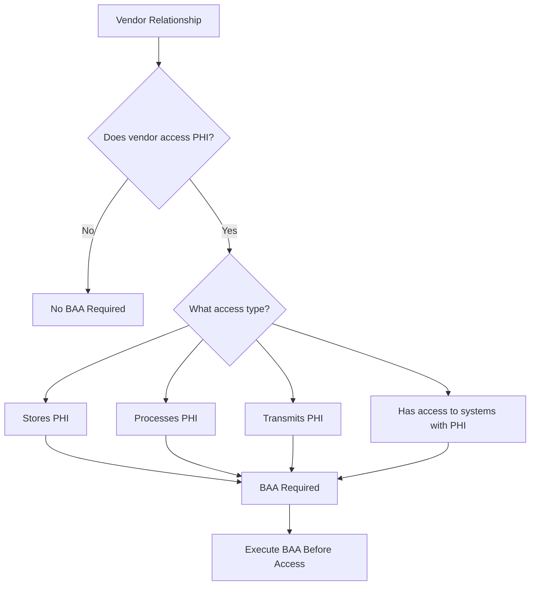

## Introduction

This module provides comprehensive checklists and frameworks to validate your organization's compliance readiness. Use these as both a planning tool and an ongoing compliance verification resource.

<Note>
**Audit-Ready Documentation**

These checklists are designed to be audit-ready. Complete them thoroughly and maintain evidence for each item.
</Note>

---

## Business Associate Agreements (BAA)

### Understanding BAAs

A Business Associate Agreement is a legally binding contract that ensures all parties handling PHI maintain appropriate safeguards.

<Warning>
**Critical Requirement**

You **MUST** have signed BAAs with EVERY vendor that can access, store, process, or transmit PHI before sharing any data with them.
</Warning>

### When You Need a BAA



### Common Vendors Requiring BAAs

| Vendor Type | Examples | BAA Considerations |
|-------------|----------|-------------------|
| **Cloud Providers** | AWS, Azure, GCP | All offer BAAs; must be signed before deployment |
| **Database Services** | MongoDB Atlas, Supabase | Verify HIPAA-eligible tiers |
| **Email Services** | SendGrid, Mailgun | Many don't sign BAAs; use HIPAA-compliant alternatives |
| **Analytics** | Google Analytics | Standard GA doesn't support BAA; use alternatives |
| **LLM Providers** | OpenAI, Anthropic | Check current BAA availability |
| **Payment Processors** | Stripe | May access names; evaluate if PHI |
| **Customer Support** | Zendesk, Intercom | Often contain PHI in tickets |

### BAA Essential Clauses Checklist

<AccordionGroup>
  <Accordion title="Required Safeguards Clause">
    ```text
    ☐ Specifies administrative safeguards implementation
    ☐ Specifies physical safeguards implementation  
    ☐ Specifies technical safeguards implementation
    ☐ References 45 CFR Part 164 compliance
    ☐ Includes encryption requirements
    ```
  </Accordion>

  <Accordion title="Breach Notification Clause">
    ```text
    ☐ Defines what constitutes a breach
    ☐ Specifies notification timeline (must be ≤60 days, prefer 24-72 hours)
    ☐ Details notification method and contact information
    ☐ Includes investigation cooperation requirements
    ☐ Specifies remediation responsibilities
    ```
  </Accordion>

  <Accordion title="Permitted Uses and Disclosures">
    ```text
    ☐ Clearly defines permitted uses
    ☐ Prohibits unauthorized disclosure
    ☐ Addresses minimum necessary standard
    ☐ Covers de-identification requirements
    ☐ Specifies subcontractor requirements
    ```
  </Accordion>

  <Accordion title="Termination Clause">
    ```text
    ☐ Defines termination for cause (compliance violations)
    ☐ Specifies data return or destruction requirements
    ☐ Includes certification of data destruction
    ☐ Addresses ongoing obligations post-termination
    ☐ Covers survival of certain provisions
    ```
  </Accordion>

  <Accordion title="Audit and Reporting Rights">
    ```text
    ☐ Grants right to audit BA compliance
    ☐ Specifies audit frequency and notice requirements
    ☐ Includes reporting requirements for compliance status
    ☐ Covers access to security documentation
    ☐ Addresses third-party audit acceptance (SOC 2, HITRUST)
    ```
  </Accordion>
</AccordionGroup>

### BAA Template Structure

```text
BUSINESS ASSOCIATE AGREEMENT

PARTIES:
- Covered Entity: [Your Organization]
- Business Associate: [Vendor Name]

EFFECTIVE DATE: [Date]

RECITALS:
- Purpose of the agreement
- Nature of services involving PHI
- HIPAA compliance acknowledgment

DEFINITIONS:
- "Protected Health Information" as defined by 45 CFR 160.103
- "Security Incident" as defined by 45 CFR 164.304
- "Breach" as defined by 45 CFR 164.402

ARTICLE I: OBLIGATIONS OF BUSINESS ASSOCIATE
1.1 Permitted Uses and Disclosures
1.2 Safeguards
1.3 Reporting Requirements
1.4 Subcontractors
1.5 Individual Rights

ARTICLE II: OBLIGATIONS OF COVERED ENTITY
2.1 Minimum Necessary Standard
2.2 Permissions and Restrictions
2.3 Changes in Authorization

ARTICLE III: TERMINATION
3.1 Termination for Cause
3.2 Automatic Termination
3.3 Return or Destruction of PHI

ARTICLE IV: GENERAL PROVISIONS
4.1 Regulatory References
4.2 Amendment
4.3 Survival
4.4 Interpretation

SIGNATURES:
[Authorized Representatives]
```

---

## Risk Assessment Framework

### HIPAA Risk Assessment Checklist

HIPAA requires documented risk assessments. Use this comprehensive framework:

<Steps>
  <Step title="Scope Definition">
    Document what systems, applications, and processes handle PHI:
    
    ```yaml
    risk_assessment_scope:
      applications:
        - name: "Patient Portal"
          phi_types: ["demographics", "medical_records", "billing"]
          data_stores: ["PostgreSQL", "S3"]
          access_methods: ["web", "mobile_api"]
          
        - name: "AI Chat Assistant"
          phi_types: ["chat_history", "health_queries"]
          data_stores: ["PostgreSQL", "Redis"]
          access_methods: ["api"]
          
      infrastructure:
        - "AWS us-east-1"
        - "AWS us-west-2 (DR)"
        
      third_parties:
        - name: "OpenAI"
          purpose: "LLM processing"
          baa_status: "signed"
          baa_date: "2024-01-15"
    ```
  </Step>

  <Step title="Threat Identification">
    Identify potential threats to PHI:
    
    | Threat Category | Specific Threats | Likelihood | Impact |
    |-----------------|------------------|------------|--------|
    | **External Attacks** | SQL injection, XSS | Medium | High |
    | **Unauthorized Access** | Credential theft | Medium | Critical |
    | **Insider Threats** | Employee misconduct | Low | High |
    | **Physical** | Server room breach | Low | High |
    | **Natural Disasters** | Fire, flood | Low | Critical |
    | **System Failures** | Database corruption | Medium | High |
    | **Human Error** | Misdirected emails | High | Medium |
  </Step>

  <Step title="Vulnerability Assessment">
    Document current vulnerabilities:
    
    ```python
    # Vulnerability Assessment Template
    vulnerabilities = [
        {
            "id": "VULN-001",
            "category": "access_control",
            "description": "Legacy system lacks MFA",
            "affected_systems": ["patient_portal_v1"],
            "cvss_score": 7.5,
            "remediation_plan": "Implement MFA by Q2 2024",
            "status": "in_progress"
        },
        {
            "id": "VULN-002", 
            "category": "encryption",
            "description": "Some backups not encrypted",
            "affected_systems": ["backup_server_1"],
            "cvss_score": 8.0,
            "remediation_plan": "Enable encryption at rest",
            "status": "remediated"
        }
    ]
    ```
  </Step>

  <Step title="Risk Analysis">
    Calculate risk levels:
    
    ```
    Risk Level = Likelihood × Impact
    
    ┌─────────────┬───────────────────────────────────┐
    │  Likelihood │           Impact                  │
    │             │  Low   │ Medium │  High │Critical │
    ├─────────────┼────────┼────────┼───────┼─────────┤
    │ Rare        │   1    │   2    │   3   │    4    │
    │ Unlikely    │   2    │   4    │   6   │    8    │
    │ Possible    │   3    │   6    │   9   │   12    │
    │ Likely      │   4    │   8    │  12   │   16    │
    │ Almost      │   5    │  10    │  15   │   20    │
    │ Certain     │        │        │       │         │
    └─────────────┴────────┴────────┴───────┴─────────┘
    
    Risk Ratings:
    1-4:   LOW (Accept with monitoring)
    5-9:   MEDIUM (Mitigation required)
    10-15: HIGH (Immediate action needed)
    16-20: CRITICAL (Stop processing until resolved)
    ```
  </Step>

  <Step title="Mitigation Planning">
    Create remediation plans for identified risks:
    
    ```yaml
    risk_mitigation_plan:
      - risk_id: "RISK-001"
        description: "Unauthorized access to patient records"
        current_risk_level: 12
        controls:
          - type: "preventive"
            control: "Implement role-based access control"
            status: "completed"
            
          - type: "detective"
            control: "Real-time access monitoring"
            status: "in_progress"
            
          - type: "corrective"
            control: "Automated session termination"
            status: "planned"
            
        residual_risk_level: 4
        owner: "Security Team"
        target_date: "2024-06-30"
    ```
  </Step>
</Steps>

---

## Technical Compliance Checklist

### Access Control Checklist

```text
ADMINISTRATIVE CONTROLS
☐ Written access control policies exist
☐ Role-based access control implemented
☐ Unique user identification required
☐ Emergency access procedures documented
☐ Automatic logoff configured (≤15 minutes)
☐ Password policies enforced (complexity, rotation)
☐ Access authorization process documented
☐ Access modification process documented
☐ Access termination process documented
☐ Regular access reviews scheduled (quarterly)

TECHNICAL CONTROLS
☐ Multi-factor authentication enabled
☐ Session management implemented
☐ IP allowlisting configured (if applicable)
☐ Failed login attempt lockout (max 5 attempts)
☐ Password hashing (bcrypt/argon2)
☐ Secure password reset process
☐ API key rotation policy
☐ Service account controls

AUDIT TRAIL
☐ All access attempts logged
☐ Login/logout events captured
☐ PHI access logged with user, time, data
☐ Admin actions logged
☐ Log integrity protection
☐ Log retention (minimum 6 years)
```

### Encryption Checklist

```text
DATA AT REST
☐ Database encryption enabled (AES-256)
☐ File system encryption (AES-256)
☐ Backup encryption enabled
☐ Key management solution (AWS KMS, Vault)
☐ Key rotation policy (annual minimum)
☐ Key access logging
☐ Secure key destruction process

DATA IN TRANSIT
☐ TLS 1.2+ required (prefer 1.3)
☐ Strong cipher suites only
☐ Certificate management process
☐ Certificate expiration monitoring
☐ Internal traffic encrypted
☐ API communications encrypted
☐ Email encryption (if PHI)

KEY MANAGEMENT
☐ HSM or KMS for key storage
☐ Key access strictly limited
☐ Key backup procedures
☐ Key recovery procedures tested
☐ Separation of duties for keys
```

### Audit Logging Checklist

```text
LOG CONTENT
☐ User identification
☐ Timestamp (UTC with timezone)
☐ Event type/action
☐ Resource accessed
☐ Success/failure status
☐ IP address/location
☐ Session identifier
☐ Request identifier (correlation)

LOG PROTECTION
☐ Immutable logging (append-only)
☐ Hash chain integrity
☐ Logs stored separately from application
☐ Log encryption at rest
☐ Log access restricted
☐ Log access audited

LOG MANAGEMENT
☐ Centralized log aggregation
☐ 6-year retention minimum
☐ Log backup procedures
☐ Log search capability
☐ Alerting on suspicious events
☐ Regular log review process
```

### Network Security Checklist

```text
PERIMETER SECURITY
☐ Web Application Firewall (WAF)
☐ DDoS protection
☐ Network segmentation
☐ Firewall rules documented
☐ Unnecessary ports blocked
☐ VPN for admin access

INTERNAL SECURITY
☐ Network monitoring
☐ Intrusion detection (IDS/IPS)
☐ Micro-segmentation for PHI systems
☐ Database not publicly accessible
☐ Jump boxes for server access

CLOUD SECURITY
☐ VPC properly configured
☐ Security groups restrictive
☐ Private subnets for data layer
☐ CloudTrail/Azure Activity Log enabled
☐ AWS Config/Azure Policy for compliance
```

---

## PDPL Compliance Checklist

### Saudi PDPL Specific Requirements

```text
DATA PROCESSING PRINCIPLES
☐ Lawful basis for processing documented
☐ Purpose limitation enforced
☐ Data minimization practiced
☐ Accuracy mechanisms in place
☐ Storage limitation policy
☐ Security measures implemented
☐ Accountability framework

CONSENT MANAGEMENT
☐ Clear consent language
☐ Consent obtained before collection
☐ Consent records maintained
☐ Consent withdrawal mechanism
☐ Re-consent for new purposes
☐ Child consent procedures (if applicable)

DATA SUBJECT RIGHTS
☐ Access request process (30 days)
☐ Correction request process
☐ Deletion request process
☐ Data portability capability
☐ Processing restriction option
☐ Objection handling process
☐ Request tracking system

CROSS-BORDER TRANSFERS
☐ Transfer impact assessment
☐ Adequate protection verification
☐ Standard contractual clauses
☐ SDAIA approval (if required)
☐ Data residency compliance
☐ Transfer logging
```

---

## Vendor Assessment Checklist

### Pre-Engagement Security Assessment

```yaml
vendor_assessment:
  general_information:
    - vendor_name: ""
    - service_description: ""
    - phi_access_required: true/false
    - data_processing_location: ""
    - subprocessors: []
    
  compliance_certifications:
    - name: "SOC 2 Type II"
      required: true
      status: ""
      expiration: ""
      
    - name: "HITRUST"
      required: false
      status: ""
      
    - name: "ISO 27001"
      required: false
      status: ""
      
  security_controls:
    encryption:
      - at_rest: ""
      - in_transit: ""
      - key_management: ""
      
    access_control:
      - mfa_required: true/false
      - sso_supported: true/false
      - rbac_available: true/false
      
    audit_logging:
      - comprehensive_logging: true/false
      - log_export: true/false
      - retention_period: ""
      
  incident_response:
    - breach_notification_sla: ""
    - security_contact: ""
    - incident_history: []
    
  baa_status:
    - available: true/false
    - signed: true/false
    - date_signed: ""
    - review_date: ""
```

### Ongoing Vendor Monitoring

```text
ANNUAL REVIEW
☐ Updated SOC 2 report reviewed
☐ Security questionnaire completed
☐ Incident history reviewed
☐ BAA still valid and current
☐ Subprocessor changes reviewed
☐ SLA compliance verified

CONTINUOUS MONITORING
☐ Security news/alerts monitored
☐ Vendor security advisories tracked
☐ Breach notifications received
☐ Service availability tracked
☐ Performance SLAs met
```

---

## Incident Response Checklist

### Breach Response Procedure

```text
IMMEDIATE RESPONSE (0-24 HOURS)
☐ Incident detected and confirmed
☐ Incident response team activated
☐ Initial scope assessment completed
☐ Containment measures implemented
☐ Evidence preservation initiated
☐ Initial documentation started
☐ Legal counsel notified

INVESTIGATION (24-72 HOURS)
☐ Full scope determined
☐ Number of affected individuals identified
☐ Types of PHI involved documented
☐ Root cause analysis started
☐ Forensic investigation (if needed)
☐ Remediation plan developed

NOTIFICATION (WITHIN 60 DAYS - BUT PREFER FASTER)
☐ HHS notification prepared (if >500 individuals)
☐ Individual notifications drafted
☐ Media notification (if >500 in state)
☐ State attorneys general notification
☐ BAA partners notified
☐ Notification delivery confirmed

POST-INCIDENT
☐ Root cause analysis completed
☐ Remediation implemented
☐ Policies/procedures updated
☐ Staff retraining (if needed)
☐ Lessons learned documented
☐ Follow-up audits scheduled
```

### Breach Notification Templates

<Tabs>
  <Tab title="Individual Notification">
    ```text
    [DATE]
    
    [RECIPIENT NAME]
    [ADDRESS]
    
    RE: Notice of Data Breach Affecting Your Protected Health Information
    
    Dear [RECIPIENT NAME],
    
    We are writing to inform you of an incident that may have affected the 
    privacy of your protected health information (PHI).
    
    WHAT HAPPENED:
    [Brief description of the incident, including date discovered]
    
    WHAT INFORMATION WAS INVOLVED:
    [Specific types of PHI potentially affected]
    
    WHAT WE ARE DOING:
    [Steps taken to investigate, remediate, and prevent future occurrences]
    
    WHAT YOU CAN DO:
    [Recommended actions: credit monitoring, password changes, etc.]
    
    We have arranged for [X] months of free credit monitoring through 
    [VENDOR]. To enroll, please visit [URL] or call [PHONE].
    
    FOR MORE INFORMATION:
    If you have questions, please contact our dedicated response line:
    Phone: [NUMBER]
    Email: [EMAIL]
    Hours: [HOURS]
    
    We sincerely apologize for any concern this may cause.
    
    Sincerely,
    [NAME]
    [TITLE]
    [ORGANIZATION]
    ```
  </Tab>
  
  <Tab title="HHS Notification">
    ```yaml
    hhs_breach_report:
      covered_entity:
        name: ""
        address: ""
        contact_name: ""
        contact_phone: ""
        contact_email: ""
        
      breach_details:
        discovery_date: ""
        breach_start_date: ""
        breach_end_date: ""
        type_of_breach:
          - "Hacking/IT Incident"
          - "Unauthorized Access/Disclosure"
          - "Theft"
          - "Loss"
          - "Other"
        location_of_breach:
          - "Network Server"
          - "Desktop Computer"
          - "Laptop"
          - "Email"
          - "Other"
          
      affected_information:
        approximate_number: ""
        types_of_phi:
          - "Demographic Information"
          - "Financial Information"
          - "Clinical Information"
          - "Other"
          
      safeguards_in_place:
        - "Encryption"
        - "Access Controls"
        - "Other"
        
      actions_taken:
        - ""
        
      individual_notification:
        date_notified: ""
        method: ""
        
      media_notification:
        required: true/false
        date_notified: ""
    ```
  </Tab>
</Tabs>

---

## Compliance Documentation Inventory

### Required Documentation Checklist

```text
POLICIES AND PROCEDURES
☐ HIPAA Security Policy
☐ HIPAA Privacy Policy
☐ Access Control Policy
☐ Encryption Policy
☐ Audit Logging Policy
☐ Incident Response Plan
☐ Business Continuity Plan
☐ Disaster Recovery Plan
☐ Workforce Training Policy
☐ Sanction Policy
☐ Termination Procedures
☐ Device and Media Controls
☐ Workstation Security Policy
☐ Mobile Device Policy
☐ BYOD Policy (if applicable)

RISK MANAGEMENT
☐ Risk Analysis (current, dated)
☐ Risk Management Plan
☐ Vulnerability Assessments
☐ Penetration Test Reports
☐ Remediation Tracking

BUSINESS ASSOCIATES
☐ BAA Inventory/Tracker
☐ Signed BAAs for all vendors
☐ Vendor Security Assessments
☐ Subprocessor List

TRAINING
☐ Training Materials
☐ Training Completion Records
☐ Acknowledgment Forms
☐ Annual Refresher Records

INCIDENT RESPONSE
☐ Incident Response Procedures
☐ Incident Log
☐ Breach Notification Templates
☐ Post-Incident Reports

AUDITS
☐ Internal Audit Schedule
☐ Internal Audit Reports
☐ External Audit Reports
☐ Corrective Action Plans
☐ Remediation Evidence
```

---

## Compliance Calendar

### Annual Compliance Activities

```yaml
compliance_calendar:
  january:
    - "Annual security awareness training kickoff"
    - "Risk assessment planning"
    
  february:
    - "Q1 access reviews"
    - "BAA inventory review"
    
  march:
    - "Annual penetration testing"
    - "Disaster recovery plan review"
    
  april:
    - "Risk assessment execution"
    - "Q2 access reviews"
    
  may:
    - "Policy annual review"
    - "Vendor reassessment planning"
    
  june:
    - "Mid-year compliance review"
    - "Training refresher for new hires"
    
  july:
    - "Q3 access reviews"
    - "Incident response tabletop exercise"
    
  august:
    - "Encryption key rotation review"
    - "Backup restoration testing"
    
  september:
    - "Annual vulnerability assessment"
    - "Vendor assessments"
    
  october:
    - "Q4 access reviews"
    - "Business continuity plan testing"
    
  november:
    - "Compliance documentation audit"
    - "BAA renewals review"
    
  december:
    - "Year-end compliance report"
    - "Next year planning"
    - "Training completion verification"
```

---

## Quick Reference Cards

### Emergency Contact Card

```text
╔══════════════════════════════════════════════════════════╗
║              HIPAA INCIDENT RESPONSE                     ║
╠══════════════════════════════════════════════════════════╣
║  Security Team:     security@company.com / +1-XXX-XXX    ║
║  Privacy Officer:   privacy@company.com / +1-XXX-XXX     ║
║  Legal Counsel:     legal@company.com / +1-XXX-XXX       ║
║  Executive Sponsor: ciso@company.com / +1-XXX-XXX        ║
╠══════════════════════════════════════════════════════════╣
║  BREACH REPORTING TIMELINE                               ║
║  • Contain immediately upon discovery                    ║
║  • Report to Security Team within 1 hour                 ║
║  • Initial assessment within 24 hours                    ║
║  • HHS notification within 60 days (if required)         ║
╠══════════════════════════════════════════════════════════╣
║  DO:                        DON'T:                       ║
║  • Preserve evidence        • Delete logs                ║
║  • Document everything      • Contact press              ║
║  • Contain the breach       • Speculate about cause      ║
║  • Follow the runbook       • Make promises              ║
╚══════════════════════════════════════════════════════════╝
```

### Developer Quick Reference

```text
╔══════════════════════════════════════════════════════════╗
║              DEVELOPER COMPLIANCE CHECKLIST              ║
╠══════════════════════════════════════════════════════════╣
║  BEFORE WRITING CODE:                                    ║
║  ☐ Understand what PHI you're handling                   ║
║  ☐ Verify you have minimum necessary access              ║
║  ☐ Check BAA status for any new vendors/APIs             ║
║                                                          ║
║  DURING DEVELOPMENT:                                     ║
║  ☐ Never log PHI                                         ║
║  ☐ Use parameterized queries                             ║
║  ☐ Encrypt all PHI at rest                               ║
║  ☐ Use TLS for all communications                        ║
║  ☐ Implement proper access controls                      ║
║  ☐ Add comprehensive audit logging                       ║
║                                                          ║
║  BEFORE DEPLOYMENT:                                      ║
║  ☐ Security review completed                             ║
║  ☐ Penetration testing passed                            ║
║  ☐ Audit logging verified                                ║
║  ☐ Encryption verified                                   ║
║  ☐ Access controls tested                                ║
║                                                          ║
║  IF YOU SEE SOMETHING WRONG:                             ║
║  Report to security@company.com immediately              ║
╚══════════════════════════════════════════════════════════╝
```

---

## Module Summary

<CardGroup cols={2}>
  <Card title="BAAs Protect You" icon="handshake">
    Every vendor with PHI access needs a signed BAA before any data is shared
  </Card>
  <Card title="Risk Assessment" icon="magnifying-glass-chart">
    Regular, documented risk assessments are required, not optional
  </Card>
  <Card title="Documentation" icon="file-lines">
    If it's not documented, it didn't happen—maintain comprehensive records
  </Card>
  <Card title="Continuous Process" icon="arrows-rotate">
    Compliance is ongoing—use the calendar to stay on track
  </Card>
</CardGroup>

---

## Next Steps

<Steps>
  <Step title="Conduct Initial Assessment">
    Use the checklists to identify gaps in your current compliance posture
  </Step>
  
  <Step title="Prioritize Remediation">
    Focus on high-risk items first: encryption, access controls, BAAs
  </Step>
  
  <Step title="Build Documentation">
    Create all required policies and procedures
  </Step>
  
  <Step title="Implement Controls">
    Deploy technical controls following the implementation guide
  </Step>
  
  <Step title="Establish Ongoing Processes">
    Set up the compliance calendar and monitoring
  </Step>
</Steps>

<Note>
**Certification Consideration**

For formal compliance validation, consider pursuing HITRUST certification, which combines HIPAA, NIST, and other frameworks into a single assessment.
</Note>

---

**Congratulations!** You've completed the HIPAA Compliance course. You now have the knowledge and tools to build healthcare-ready applications that protect sensitive patient data.
