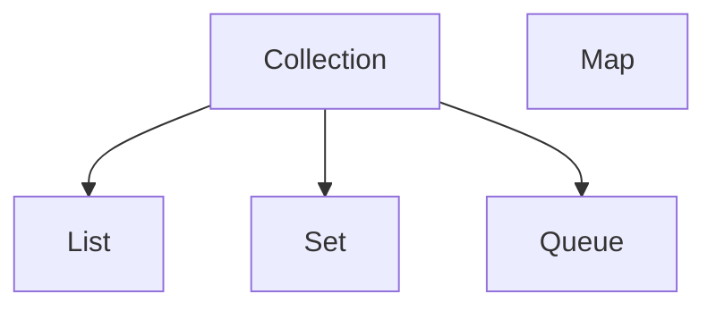

# The Collections Framework

The Java Collections Framework is a set of classes and interfaces that implement commonly used data structures. It is located in `java.util`. Instead of writing your own linked list or hash map, use these optimized versions.

---

## 1. The Hierarchy

The root interface is `Collection`.



<Note>
  `Map` is not technically a `Collection` (it doesn't extend the interface), but it is a core part of the framework.
</Note>

---

## 2. Lists (Ordered)

A `List` is an ordered collection (sequence). Elements have an index (0, 1, 2...). Duplicates are allowed.

### `ArrayList`
-   **Backed by**: A dynamic array.
-   **Pros**: Fast random access (`get(i)` is O(1)).
-   **Cons**: Slow to insert/remove from the middle (needs to shift elements).
-   **Use Case**: The default choice for almost everything.

```java
List<String> names = new ArrayList<>();
names.add("Alice");
names.add("Bob");
System.out.println(names.get(0)); // Alice
```

### `LinkedList`
-   **Backed by**: A doubly linked list.
-   **Pros**: Fast insertion/removal from ends.
-   **Cons**: Slow random access (must traverse nodes).
-   **Use Case**: Queues or stacks.

---

## 3. Sets (Unique)

A `Set` is a collection that contains **no duplicate elements**.

### `HashSet`
-   **Order**: Unordered. You cannot rely on the order of elements.
-   **Performance**: O(1) for add/remove/contains. Very fast.
-   **Use Case**: Removing duplicates, checking for existence.

```java
Set<Integer> uniqueIds = new HashSet<>();
uniqueIds.add(1);
uniqueIds.add(1); // Ignored
```

### `TreeSet`
-   **Order**: Sorted (Natural order or Comparator).
-   **Performance**: O(log n).
-   **Use Case**: When you need a sorted list of unique items.

---

## 4. Maps (Key-Value)

A `Map` stores **Key-Value pairs**. Keys must be unique; values can be duplicated.

### `HashMap`
-   **Order**: Unordered.
-   **Performance**: O(1).
-   **Use Case**: Caching, lookups, dictionaries.

```java
Map<String, Integer> scores = new HashMap<>();
scores.put("Alice", 100);
scores.put("Bob", 95);

System.out.println(scores.get("Alice")); // 100
```

### `TreeMap`
-   **Order**: Sorted by Key.
-   **Performance**: O(log n).

---

## 5. Iterating

### Enhanced For-Loop
The standard, readable way.

```java
for (String name : names) {
    System.out.println(name);
}
```

### For-Each (Functional)
Using lambda expressions.

```java
names.forEach(name -> System.out.println(name));
// Method reference (even cleaner)
names.forEach(System.out::println);
```

---

## 6. Immutable Collections (Java 9+)

Sometimes you want a list that cannot be changed (read-only). Java 9 introduced factory methods for this.

```java
List<String> list = List.of("A", "B", "C");
Set<Integer> set = Set.of(1, 2, 3);
Map<String, Integer> map = Map.of("A", 1, "B", 2);

// list.add("D"); // Throws UnsupportedOperationException at runtime!
```

---

## 7. Streams API (Java 8+)

Streams allow you to process collections in a declarative way (like SQL for objects). Instead of writing loops, you define a pipeline of operations.

```java
List<String> names = List.of("Alice", "Bob", "Charlie", "David");

// Goal: Find names starting with 'A', convert to uppercase, and collect to list
List<String> result = names.stream()
    .filter(name -> name.startsWith("A")) // 1. Filter
    .map(String::toUpperCase)             // 2. Transform
    .collect(Collectors.toList());        // 3. Collect
    
// result: ["ALICE"]
```

**Key Operations:**
-   **Intermediate** (`filter`, `map`, `sorted`): These are **lazy**. They don't execute until a terminal operation is called.
-   **Terminal** (`collect`, `forEach`, `reduce`): These trigger the pipeline execution.

---

## Summary

-   **List**: Ordered, duplicates allowed. Use `ArrayList`.
-   **Set**: Unique items. Use `HashSet`.
-   **Map**: Key-Value pairs. Use `HashMap`.
-   **Streams**: Powerful functional processing pipeline.

Next, we'll look at **Concurrency**, allowing our programs to do multiple things at once.
