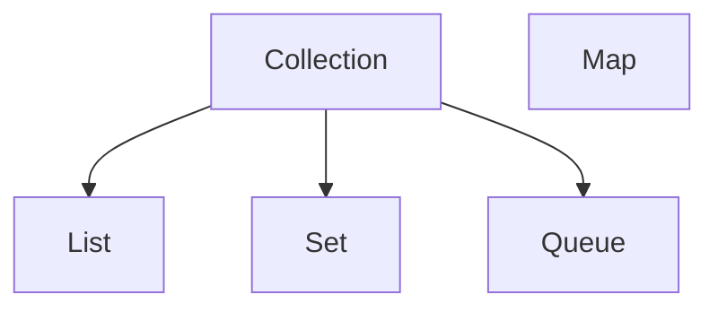

# The Collections Framework

The Java Collections Framework is a set of classes and interfaces that implement commonly used data structures. It is located in `java.util`. Instead of writing your own linked list or hash map, use these optimized versions.

---

## 1. The Hierarchy

The root interface is `Collection`.


```mermaid
graph TD
    Collection --> List
    Collection --> Set
    Collection --> Queue
    Map
```

<Note>
  `Map` is not technically a `Collection` (it doesn't extend the interface), but it is a core part of the framework.
</Note>

---

## 2. Lists (Ordered)

A `List` is an ordered collection (sequence). Elements have an index (0, 1, 2...). Duplicates are allowed.

### `ArrayList`
-   **Backed by**: A dynamic array.
-   **Pros**: Fast random access (`get(i)` is O(1)).
-   **Cons**: Slow to insert/remove from the middle (needs to shift elements).
-   **Use Case**: The default choice for almost everything.

```java
List<String> names = new ArrayList<>();
names.add("Alice");
names.add("Bob");
System.out.println(names.get(0)); // Alice
```

### `LinkedList`
-   **Backed by**: A doubly linked list.
-   **Pros**: Fast insertion/removal from ends.
-   **Cons**: Slow random access (must traverse nodes).
-   **Use Case**: Queues or stacks.

---

## 3. Sets (Unique)

A `Set` is a collection that contains **no duplicate elements**.

### `HashSet`
-   **Order**: Unordered. You cannot rely on the order of elements.
-   **Performance**: O(1) for add/remove/contains. Very fast.
-   **Use Case**: Removing duplicates, checking for existence.

```java
Set<Integer> uniqueIds = new HashSet<>();
uniqueIds.add(1);
uniqueIds.add(1); // Ignored
```

### `TreeSet`
-   **Order**: Sorted (Natural order or Comparator).
-   **Performance**: O(log n).
-   **Use Case**: When you need a sorted list of unique items.

---

## 4. Maps (Key-Value)

A `Map` stores **Key-Value pairs**. Keys must be unique; values can be duplicated.

### `HashMap`
-   **Order**: Unordered.
-   **Performance**: O(1).
-   **Use Case**: Caching, lookups, dictionaries.

```java
Map<String, Integer> scores = new HashMap<>();
scores.put("Alice", 100);
scores.put("Bob", 95);

System.out.println(scores.get("Alice")); // 100
```

### `TreeMap`
-   **Order**: Sorted by Key.
-   **Performance**: O(log n).

---

## 5. Iterating

### Enhanced For-Loop
The standard, readable way.

```java
for (String name : names) {
    System.out.println(name);
}
```

### For-Each (Functional)
Using lambda expressions.

```java
names.forEach(name -> System.out.println(name));
// Method reference (even cleaner)
names.forEach(System.out::println);
```

---

## 6. Immutable Collections (Java 9+)

Sometimes you want a list that cannot be changed (read-only). Java 9 introduced factory methods for this.

```java
List<String> list = List.of("A", "B", "C");
Set<Integer> set = Set.of(1, 2, 3);
Map<String, Integer> map = Map.of("A", 1, "B", 2);

// list.add("D"); // Throws UnsupportedOperationException at runtime!
```

---

## 7. Streams API (Java 8+)

Streams allow you to process collections in a declarative way (like SQL for objects). Instead of writing loops, you define a pipeline of operations.

```java
List<String> names = List.of("Alice", "Bob", "Charlie", "David");

// Goal: Find names starting with 'A', convert to uppercase, and collect to list
List<String> result = names.stream()
    .filter(name -> name.startsWith("A")) // 1. Filter
    .map(String::toUpperCase)             // 2. Transform
    .collect(Collectors.toList());        // 3. Collect
    
// result: ["ALICE"]
```

**Key Operations:**
-   **Intermediate** (`filter`, `map`, `sorted`): These are **lazy**. They don't execute until a terminal operation is called.
-   **Terminal** (`collect`, `forEach`, `reduce`): These trigger the pipeline execution.

---

## Summary

-   **List**: Ordered, duplicates allowed. Use `ArrayList`.
-   **Set**: Unique items. Use `HashSet`.
-   **Map**: Key-Value pairs. Use `HashMap`.
-   **Streams**: Powerful functional processing pipeline.

Next, we'll look at **Concurrency**, allowing our programs to do multiple things at once.

---

## Interview Deep-Dive

<AccordionGroup>
  <Accordion title="Explain how HashMap works internally. What happens when two keys have the same hash code?">
    **Strong Answer:**

    - Internally, `HashMap` is an array of buckets (called `Node[] table`). When you call `put(key, value)`, the map computes `key.hashCode()`, then applies a secondary hash function (called "spreading" -- it XORs the upper 16 bits with the lower 16 bits to reduce collision rates in small tables), and then computes the bucket index as `hash & (table.length - 1)` (this works because the table length is always a power of 2, making the modulo operation a bitwise AND).
    - When two keys hash to the same bucket (a collision), the entries are stored in a linked list at that bucket. Each node contains the key, value, hash, and a pointer to the next node. On lookup, the map finds the bucket, then walks the linked list comparing each key via `equals()` (after a fast hash comparison as a short-circuit).
    - In Java 8, a critical optimization was added: when a single bucket's linked list grows beyond 8 entries (the treeify threshold), the list is converted into a balanced red-black tree. This changes worst-case lookup from O(n) to O(log n) per bucket. This was motivated by a real denial-of-service attack vector: an attacker could craft keys that all hash to the same bucket, turning every `HashMap` operation into O(n) and degrading the server to a crawl. The tree conversion makes this attack O(log n) instead.
    - When the total number of entries exceeds `capacity * loadFactor` (default load factor is 0.75), the map resizes: it creates a new array of double the size and rehashes all entries into the new array. Resizing is O(n) and involves rehashing every entry. This is why specifying an initial capacity is important for performance-critical code -- if you know you will insert 1 million entries, initialize with `new HashMap<>(1_400_000)` (accounting for load factor) to avoid ~20 resize operations.

    **Follow-up: How does ConcurrentHashMap achieve thread safety differently from Collections.synchronizedMap, and when would you pick each?**

    - `Collections.synchronizedMap()` wraps a regular `HashMap` and synchronizes every method call on a single mutex. This means every `get()`, `put()`, `remove()`, and iteration acquires the same lock. Under high concurrency, this creates severe contention -- all threads queue up to access the single lock, effectively serializing all operations.
    - `ConcurrentHashMap` (CHM) uses a fundamentally different strategy. In Java 8+, it uses fine-grained locking at the bucket level (each bucket has its own lock, implemented via `synchronized` on the first node of the bucket, or via CAS operations for simple cases). Reads are entirely lock-free -- they use `volatile` reads of the node array and entries. This means many threads can read simultaneously with zero contention, and writes only block other writes to the same bucket.
    - The practical choice: use `ConcurrentHashMap` for shared caches, concurrent accumulators, and any map accessed by multiple threads in a server application. Use `synchronizedMap` only if you need synchronized iteration (CHM's iterators are weakly consistent -- they may not reflect concurrent modifications) or if the map is rarely accessed concurrently and you want simplicity. In 15 years of Java development, I have used `synchronizedMap` in production exactly zero times -- `ConcurrentHashMap` is almost always the better choice.
    - A subtlety: CHM does not allow `null` keys or values (unlike `HashMap`), because `null` is ambiguous in concurrent contexts -- does `get(key)` returning `null` mean the key is absent or the value is null? Use `Optional` or a sentinel value instead.
  </Accordion>

  <Accordion title="When should you use a TreeMap instead of a HashMap? What about LinkedHashMap?">
    **Strong Answer:**

    - `HashMap` is the default choice. O(1) average for `get`/`put`/`remove`, no ordering guarantees, backed by a hash table. Use it when you just need fast key-value lookups and do not care about the order of entries.
    - `TreeMap` is a red-black tree implementing `NavigableMap`. It provides O(log n) for all operations, but the entries are sorted by key (natural ordering or a custom `Comparator`). Use it when you need range queries (`subMap`, `headMap`, `tailMap`), finding the closest key (`floorKey`, `ceilingKey`), or iterating in sorted order. Real-world example: a rate limiter that tracks request timestamps and needs to efficiently query "all requests in the last 60 seconds" -- `treeMap.tailMap(now.minusSeconds(60))` gives you exactly that in O(log n).
    - `LinkedHashMap` is a `HashMap` with a doubly-linked list threading through all entries, maintaining insertion order (or optionally access order). Iteration is O(n) in the number of entries, not O(capacity) like `HashMap`. Use it when you need predictable iteration order or are building an LRU cache. `LinkedHashMap` has a hook method `removeEldestEntry()` that you can override to automatically evict the oldest entry when the map exceeds a size limit -- this is the simplest way to build a bounded LRU cache in Java without pulling in a library.
    - The decision framework: need sorted keys or range queries? `TreeMap`. Need insertion-order iteration or LRU eviction? `LinkedHashMap`. Neither? `HashMap`. In practice, 90% of the time the answer is `HashMap`, 8% is `LinkedHashMap` (for ordered responses in REST APIs or simple caches), and 2% is `TreeMap` (for range-based lookups).

    **Follow-up: You mentioned using LinkedHashMap as an LRU cache. Why might you choose Caffeine or Guava Cache instead?**

    - A `LinkedHashMap`-based LRU cache is single-threaded -- you need external synchronization for concurrent access, which creates a bottleneck. Caffeine and Guava's `Cache` are designed for concurrent access from the ground up, using striped locking and concurrent data structures internally.
    - Caffeine provides eviction policies beyond LRU: it uses a Window-TinyLFU algorithm that combines recency and frequency, achieving near-optimal hit rates. In benchmarks, Caffeine's hit rate is 5-15% better than pure LRU for most real-world access patterns. It also supports time-based expiration (after write, after access), maximum weight (not just count), async loading, and statistics (hit rate, miss rate, eviction count).
    - Guava Cache was the standard before Caffeine and has a similar API, but Caffeine is the recommended successor -- it is faster (lock-free reads), more memory-efficient, and has better eviction algorithms. Both integrate with Spring's `@Cacheable` annotation via `CacheManager` implementations.
    - The practical rule: use `LinkedHashMap` for simple, single-threaded, bounded maps (like the last 100 recent items in a UI). Use Caffeine for any production caching layer that needs concurrency, expiration, or monitoring. Do not build your own concurrent cache -- it is one of those problems that looks simple but has a dozen subtle correctness and performance pitfalls.
  </Accordion>

  <Accordion title="Explain the difference between intermediate and terminal operations in the Stream API. What does 'lazy evaluation' mean concretely?">
    **Strong Answer:**

    - Intermediate operations (`filter`, `map`, `flatMap`, `sorted`, `distinct`, `peek`) return a new `Stream` and do not execute anything. They build up a pipeline description -- essentially a chain of function objects. No data flows through the pipeline until a terminal operation is invoked. Terminal operations (`collect`, `forEach`, `reduce`, `count`, `findFirst`, `anyMatch`, `toArray`) trigger the actual processing and consume the stream.
    - Lazy evaluation means that elements are processed one at a time through the entire pipeline, not in batches per operation. If you have `.filter().map().findFirst()`, the stream does not filter all elements, then map all surviving elements, then pick the first. Instead, it takes the first element, applies filter, if it passes applies map, and if `findFirst` is satisfied, it short-circuits and stops. For a list of 1 million elements where the first element matches, only one element is processed -- the other 999,999 are never touched.
    - This has significant performance implications. Consider: `stream.filter(expensive).map(transform).limit(10).collect(toList())`. Without laziness, you would filter all N elements (N expensive calls), transform all survivors, then take 10. With laziness, the stream processes elements one at a time and stops after finding 10 that pass the filter. If the filter passes frequently, you might only process 12-15 elements instead of N.
    - A practical gotcha: `sorted()` is an intermediate operation but it is a barrier -- it must consume the entire stream to sort it, breaking the element-by-element laziness. Placing `sorted()` before `limit()` means you sort everything before taking a few. Placing `limit()` before `sorted()` means you take a few, then sort only those. The order of operations in a stream pipeline matters enormously for performance, and careless ordering is one of the most common Stream API performance mistakes.

    **Follow-up: When is parallelStream actually faster than a sequential stream, and when does it make things worse?**

    - `parallelStream()` uses the common `ForkJoinPool` to split the work across available CPU cores. It is faster when: (1) the data source splits efficiently (arrays and `ArrayList` split in O(1); `LinkedList` and `TreeSet` split poorly because they must traverse to find the midpoint), (2) the per-element work is CPU-bound and non-trivial (at least microseconds per element -- if the work is trivial, the thread coordination overhead dominates), and (3) there is no shared mutable state or ordering requirement.
    - It makes things worse when: the data set is small (under ~10,000 elements for most workloads -- the thread scheduling overhead exceeds the parallelism benefit), the pipeline involves blocking I/O (parallel streams use the common ForkJoinPool with limited threads; blocking I/O saturates the pool and starves other parallel operations in the entire application), the operations have side effects or require ordering (like writing to a shared list), or the stream source has poor spliterator characteristics.
    - The common ForkJoinPool is shared across the entire JVM. If one piece of code launches a `parallelStream()` with blocking operations, it can starve every other `parallelStream()` in the application. I have seen production incidents where a parallel stream doing database calls blocked all threads in the common pool, causing unrelated parallel streams to hang. The fix is either: do not use parallel streams for I/O, or submit the parallel stream to a custom `ForkJoinPool` (though this is a workaround, not officially supported).
    - My rule of thumb: sequential streams are correct by default. Only switch to `parallelStream()` when you have measured a performance problem, the workload is CPU-bound, the data set is large, and you have benchmarked that parallel is actually faster. In my experience, fewer than 5% of stream pipelines benefit from parallelism.
  </Accordion>

  <Accordion title="Why does ArrayList outperform LinkedList in almost every real-world scenario, despite LinkedList having O(1) insertion at the head?">
    **Strong Answer:**

    - The theoretical analysis says `LinkedList` wins for insertions/deletions at arbitrary positions (O(1) once you have the node reference vs. O(n) for shifting in `ArrayList`). But this analysis ignores the single most important performance factor in modern hardware: CPU cache locality. An `ArrayList` stores elements in a contiguous array in memory. When you iterate or access elements, the CPU prefetcher loads adjacent memory into cache lines, giving you effectively free access to nearby elements. A `LinkedList` stores each element in a separate `Node` object scattered across the heap, and each access requires following a pointer to a random memory location -- a cache miss.
    - The numbers are stark. On modern hardware, an L1 cache hit is ~1 nanosecond, but a main memory access (cache miss) is ~100 nanoseconds. Iterating a million-element `ArrayList` is essentially sequential memory access with near-perfect cache behavior. Iterating a million-element `LinkedList` is a million random pointer dereferences, each potentially a cache miss. In benchmarks, `ArrayList` iteration is 5-10x faster than `LinkedList` iteration.
    - Memory overhead is another factor. Each `LinkedList` node contains: the element reference (8 bytes), a `next` pointer (8 bytes), a `prev` pointer (8 bytes), and the object header (12-16 bytes). That is 36-40 bytes of overhead per element, compared to 4-8 bytes per element in an `ArrayList` (just the reference in the backing array, plus amortized array overhead). For a million elements, `LinkedList` uses roughly 5x more memory.
    - The only scenario where `LinkedList` genuinely wins: when you have an iterator positioned in the middle of the list and need to perform many insertions/removals at that position without traversing. But if you need to find that position first (which requires traversal), `ArrayList` is faster because its traversal is cache-friendly. In practice, I have never used `LinkedList` in production Java code. `ArrayDeque` is a better choice even for queue/deque operations because it is backed by a circular array with cache-friendly access.

    **Follow-up: You mentioned ArrayDeque. Why is it preferred over LinkedList even for Queue implementations?**

    - `ArrayDeque` is backed by a resizable circular array. Both `addFirst`/`addLast` and `removeFirst`/`removeLast` are O(1) amortized (just like `ArrayList`'s `add`). It has the same cache locality advantages as `ArrayList` because elements are stored contiguously in memory.
    - `LinkedList` implements both `List` and `Deque`, which seems convenient but is actually a design smell -- it means you can accidentally call `get(i)` (O(n) traversal) on a data structure you intended to use as a queue. `ArrayDeque` only implements `Deque`, which constrains the API to the efficient operations.
    - In the official Java documentation (since Java 6), `ArrayDeque` is explicitly recommended over `LinkedList` for stack and queue use cases. Benchmarks consistently show `ArrayDeque` is 2-3x faster for queue operations due to cache locality, and it uses significantly less memory (no per-element node objects).
    - The only advantage `LinkedList` retains: it supports `null` elements (which `ArrayDeque` does not) and implements the `List` interface (which `ArrayDeque` does not). If you need positional access by index and queue semantics on the same collection -- which is a code smell indicating unclear data structure choice -- `LinkedList` is the only built-in option.
  </Accordion>

  <Accordion title="What are the pitfalls of using Java's immutable collections (List.of, Map.of), and how do they differ from Guava's ImmutableList?">
    **Strong Answer:**

    - `List.of()` and `Map.of()` (Java 9+) create unmodifiable collections that throw `UnsupportedOperationException` on any mutating operation (`add`, `remove`, `put`). They do not allow `null` elements or keys, which is a deliberate design choice to prevent ambiguity but catches people migrating from mutable collections that previously contained nulls. They also have a hidden behavioral difference: they are value-based, meaning the JVM may deduplicate instances and the `==` operator should not be used for identity comparison.
    - A critical pitfall: `Collections.unmodifiableList(mutableList)` creates a read-only view of the underlying mutable list. If someone else holds a reference to the original mutable list and modifies it, the "unmodifiable" view sees those changes. This is a common source of bugs: a method returns `Collections.unmodifiableList(internalList)`, thinking it is safe, but the caller gets a live view that changes unpredictably. `List.of()` and `List.copyOf()` create true copies, so they are immune to this, but `Collections.unmodifiableList()` is not -- it is just a wrapper.
    - Guava's `ImmutableList.of()` and `ImmutableList.copyOf()` predate the JDK versions and have slightly different semantics. Guava's versions also reject nulls and are truly immutable (copies, not views). The main difference is that Guava's immutable types are concrete classes that extend `ImmutableCollection`, so you can use them as type declarations (`ImmutableList<String>`) to communicate immutability in method signatures. The JDK's `List.of()` returns a plain `List` -- the caller has no way to know from the type that the list is unmodifiable without reading the documentation or encountering the exception.
    - A production consideration: serialization behavior differs. Guava's immutable collections have custom serialization that preserves immutability on deserialization. JDK's `List.of()` collections serialize into a form that deserializes as the same unmodifiable type, but third-party serialization frameworks (Jackson, Kryo) may not handle them correctly without explicit configuration. I have seen REST APIs that returned `List.of()` results serialize fine with Jackson but fail when the client tried to deserialize them into a mutable `ArrayList` and then modify the result -- the server's contract was immutable, but the client assumed mutable.

    **Follow-up: If a method returns List.of() but the caller needs a mutable list, what is the idiomatic way to handle this?**

    - The idiomatic approach is `new ArrayList<>(List.of(...))`. The `ArrayList` copy constructor creates a mutable copy of any collection. This is O(n) in the size of the source collection but is explicit about the intent: "I received an immutable list and I need a mutable copy to work with."
    - In stream-based code, you can use `.collect(Collectors.toList())` or `.collect(Collectors.toCollection(ArrayList::new))`. Note that `Collectors.toList()` does not guarantee mutability in its specification (the returned list's mutability is unspecified), though in practice the current implementation returns an `ArrayList`. If you need a guaranteed mutable list, use `Collectors.toCollection(ArrayList::new)`.
    - Java 16 added `Stream.toList()` which explicitly returns an unmodifiable list. This catches people who migrate from `collect(Collectors.toList())` to `.toList()` expecting the same behavior -- calling `add()` on the result throws `UnsupportedOperationException`. This is a common source of bugs in codebases migrating to Java 16+.
  </Accordion>
</AccordionGroup>
