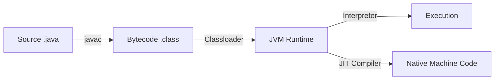

# Java Fundamentals

To write good Java code, you must understand the machine it runs on: the **JVM**. Java is unique because it doesn't compile to machine code directly; it compiles to a universal intermediate language.

---

## 1. How Java Works (The JVM)

Unlike C++ which compiles to machine code specific to your CPU (e.g., x86 Windows), Java compiles to **Bytecode**.



### The Process
1.  **javac**: The compiler translates your human-readable source code into **Bytecode** (`.class` files). This bytecode is platform-agnostic.
2.  **Classloader**: When you run the app, the JVM loads these classes into memory.
3.  **Interpreter**: Initially, the JVM interprets bytecode line-by-line. This allows fast startup but is slower than native code.
4.  **JIT (Just-In-Time) Compiler**: This is the magic. The JVM watches your code run. If it sees a block of code running frequently ("hot spot"), it compiles it to **Native Machine Code** on the fly. This gives Java near-native performance.

**Key Takeaway**: Java starts slow (interpretation) but gets faster as it runs (JIT compilation).

---

## 2. Anatomy of a Java Program

Everything in Java is a class. There are no global functions or variables.

```java
// Package declaration: Organizes code (like folders). Prevents name collisions.
package com.example;

// Import statements: Bring in code from other packages.
import java.util.Date;

// Class declaration: Must match filename (HelloWorld.java)
public class HelloWorld {
    
    // Main method: The entry point.
    // public: The JVM can call it from outside.
    // static: It exists without creating an object of the class.
    // void: It returns nothing.
    public static void main(String[] args) {
        System.out.println("Hello, World!");
    }
}
```

---

## 3. Variables & Data Types

Java has a strict distinction between **Primitives** and **Reference Types**. This is a common source of confusion.

### Primitive Types (Stored on Stack)

These hold the **actual value**. They are fast, lightweight, and not objects.

| Type | Size | Description |
| :--- | :--- | :--- |
| `byte` | 8-bit | Very small numbers (-128 to 127) |
| `short` | 16-bit | Small numbers |
| `int` | 32-bit | **Default for numbers**. (-2B to 2B) |
| `long` | 64-bit | Huge numbers. Use suffix `L` (e.g., `100L`) |
| `float` | 32-bit | Decimal. Use suffix `f` (e.g., `10.5f`) |
| `double` | 64-bit | **Default for decimals**. Precise. |
| `boolean` | ? | `true` or `false` |
| `char` | 16-bit | Single Unicode character |

```java
int age = 25;
long population = 8_000_000_000L; // Underscores for readability
double price = 19.99;
boolean isActive = true;
```

### Reference Types (Stored on Heap)

These hold a **reference** (memory address) to an object on the Heap. The variable itself is just a pointer.

-   `String`, `Integer` (Wrapper), `ArrayList`, `MyClass`
-   **Default value**: `null`.

```java
String name = "Alice"; // 'name' is a reference on Stack -> Object on Heap
int[] numbers = {1, 2, 3};
```

### Type Inference (`var`)

Since Java 10, you can use `var` to let the compiler infer the type. This reduces boilerplate but keeps type safety.

```java
var message = "Hello"; // Inferred as String
var list = new ArrayList<String>(); // Inferred as ArrayList<String>
```

---

## 4. Control Flow

### Branching

```java
if (score >= 90) {
    System.out.println("A");
} else {
    System.out.println("B");
}

// Ternary Operator: Concise if-else
String status = (age >= 18) ? "Adult" : "Minor";
```

### Switch Expressions (Java 14+)

The modern, concise way to switch. It returns a value and doesn't need `break` statements (no fall-through).

```java
String dayType = switch (day) {
    case MONDAY, TUESDAY, WEDNESDAY, THURSDAY, FRIDAY -> "Weekday";
    case SATURDAY, SUNDAY -> "Weekend";
    default -> throw new IllegalArgumentException("Invalid day: " + day);
};
```

### Loops

**1. Enhanced For-Loop (For-Each)**
The preferred way to iterate over arrays and collections. Readability is king.

```java
String[] names = {"Alice", "Bob"};

for (String name : names) {
    System.out.println(name);
}
```

**2. Standard For-Loop**
Use this only when you need the index (e.g., `i`).

```java
for (int i = 0; i < names.length; i++) {
    System.out.println(names[i]);
}
```

---

## 5. Methods

Methods define behavior. In Java, methods must belong to a class.

```java
// Access Modifier | Return Type | Name | Parameters
public static int add(int a, int b) {
    return a + b;
}
```

### Overloading
You can have multiple methods with the same name but different parameters.

```java
void print(String s) { ... }
void print(int i) { ... }
```

### Varargs
Pass a variable number of arguments. Internally, it's treated as an array.

```java
void printAll(String... items) {
    for (String item : items) {
        System.out.println(item);
    }
}

printAll("A", "B", "C"); // Valid
printAll();              // Valid (empty array)
```

---

## Summary

-   **JVM**: The engine that runs Java. Compiles bytecode to native code.
-   **Primitives**: Stack-allocated values (`int`, `boolean`).
-   **References**: Heap-allocated objects (`String`, `List`).
-   **Control Flow**: Use modern switch expressions and enhanced for-loops for cleaner code.

Next, we'll dive into **Object-Oriented Programming**, the paradigm Java was built for.
