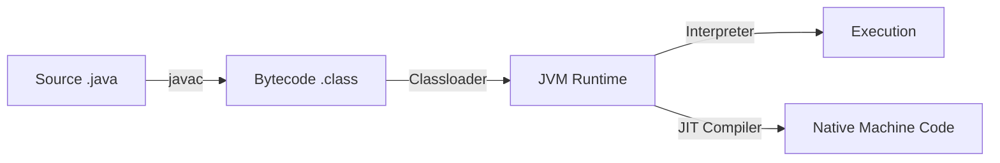

# Java Fundamentals

To write good Java code, you must understand the machine it runs on: the **JVM**. Think of the JVM as a universal translator that sits between your code and the operating system -- like a diplomat posted in different countries who speaks every local language fluently. Your Java code does not talk directly to Windows, Linux, or macOS -- it talks to the JVM, and the JVM translates for the operating system. This is why the same `.class` file can run anywhere a JVM exists.

Java is unique because it doesn't compile to machine code directly; it compiles to a universal intermediate language called **bytecode**. If traditional compiled languages (C, C++) are like writing a letter in the recipient's native language, Java is like writing in Esperanto -- a universal language that any JVM-speaking country can translate locally.

---

## 1. How Java Works (The JVM)

Unlike C++ which compiles to machine code specific to your CPU (e.g., x86 Windows), Java compiles to **Bytecode**.


```mermaid
graph LR
    A[Source .java] -->|javac| B[Bytecode .class]
    B -->|Classloader| C[JVM Runtime]
    C -->|Interpreter| D[Execution]
    C -->|JIT Compiler| E[Native Machine Code]
```

### The Process
1.  **javac**: The compiler translates your human-readable source code into **Bytecode** (`.class` files). This bytecode is platform-agnostic -- it contains instructions for an abstract stack machine, not for any specific CPU.
2.  **Classloader**: When you run the app, the JVM loads these classes into memory on demand (lazy loading). Classes are loaded the first time they are referenced, not all at once. The classloader also enforces security -- it verifies that bytecode has not been tampered with before execution.
3.  **Interpreter**: Initially, the JVM interprets bytecode line-by-line. This allows fast startup but is slower than native code. Think of it as reading a recipe step by step each time you cook -- accurate but not fast.
4.  **JIT (Just-In-Time) Compiler**: This is the magic. The JVM watches your code run and counts how many times each method is called. If it sees a block of code running frequently (a "hot spot" -- this is literally where the name "HotSpot JVM" comes from), it compiles that code to **Native Machine Code** on the fly. Think of it as memorizing a recipe you cook every night -- eventually you do not need to read the instructions at all. This gives Java near-native performance.

**Key Takeaway**: Java starts slow (interpretation) but gets faster as it runs (JIT compilation). This is why long-running Java servers often outperform expectations -- the JVM continuously optimizes the hottest code paths. It is also why benchmarking Java requires a "warm-up" period: the first few thousand invocations are not representative of steady-state performance.

### JVM Memory Model at a Glance

The JVM divides memory into distinct regions, each with a specific purpose:

- **Stack**: Each thread gets its own stack. It stores local variables and method call frames. When a method finishes, its frame is popped off the stack automatically. Stack memory is fast but limited in size (typically 512KB to 1MB per thread).
- **Heap**: Shared across all threads. This is where all objects live. The Garbage Collector manages the heap. It is much larger than the stack (configured with `-Xmx`, e.g., `-Xmx4g` for 4 GB).
- **Metaspace** (replaced PermGen in Java 8): Stores class metadata -- the blueprints for your classes. It grows dynamically and uses native memory, not the heap.

The analogy: the **Stack** is your desk (small, personal, fast to access, automatically cleaned up when you finish a task), the **Heap** is the warehouse (huge shared storage that needs a cleanup crew -- the GC -- to stay organized), and **Metaspace** is the filing cabinet of blueprints (class definitions and method signatures).

<Note>
  **Practical Tip**: You can inspect what the JIT compiler is doing with the flag `-XX:+PrintCompilation`. In production, the JVM flag `-XX:+TieredCompilation` (enabled by default since Java 8) lets the JVM use a mix of interpreted, lightly compiled, and heavily optimized code depending on how "hot" each method is. There are five compilation tiers (0 through 4), where tier 0 is pure interpretation and tier 4 is the most aggressively optimized native code produced by the C2 compiler.
</Note>

<Warning>
  **Pitfall -- Benchmarking without warmup**: If you measure Java performance by timing the first run of a method, you are measuring the interpreter, not your actual production performance. Always use a framework like JMH (Java Microbenchmark Harness) that handles warmup iterations, dead-code elimination, and JIT optimization automatically. Naive `System.currentTimeMillis()` benchmarks are almost always misleading.
</Warning>

---

## 2. Anatomy of a Java Program

Everything in Java is a class. There are no global functions or variables floating in the void. If you come from Python or JavaScript, this feels restrictive at first -- like being told every tool must go in a labeled drawer. But that rigidity pays off in codebases with hundreds of files and dozens of contributors: every piece of code has a clear home, and you can always find where something lives by following the package and class structure.

```java
// Package declaration: Organizes code into namespaces (like folders on disk).
// Convention: reverse domain name (com.example) prevents collisions across organizations.
// If your company is "acme.com" and the project is "billing", use com.acme.billing.
package com.example;

// Import statements: Bring in code from other packages.
// Without this, you would have to write java.util.Date every single time.
// Wildcard imports (java.util.*) import everything -- convenient but can cause
// name collisions and makes it harder to see what a file actually depends on.
import java.util.Date;

// Class declaration: MUST match the filename (HelloWorld.java).
// One public class per file -- this is enforced by the compiler.
// Non-public classes can share a file, but in practice, one class per file
// is the universal convention in professional Java code.
public class HelloWorld {
    
    // Main method: The entry point. The JVM looks for exactly this signature.
    // Every keyword here is load-bearing:
    //   public  -- The JVM can call it from outside the class.
    //   static  -- It belongs to the class itself, not to an instance.
    //              The JVM does not create a HelloWorld object to call this.
    //   void    -- It returns nothing to the caller (exit codes use System.exit()).
    //   String[] args -- Command-line arguments passed when running the program.
    //                    e.g., "java HelloWorld foo bar" -> args = ["foo", "bar"]
    public static void main(String[] args) {
        System.out.println("Hello, World!");
    }
}
```

<Note>
  **Java 21+ Shortcut**: If you just want to run a quick script, Java 21 introduced unnamed classes and instance main methods. You can write `void main() { System.out.println("Hello"); }` in a file and run it directly with `java HelloWorld.java` -- no class declaration, no `String[] args`, no `static`. This is great for learning and scripting, but production code still uses the traditional structure.
</Note>

---

## 3. Variables & Data Types

Java has a strict distinction between **Primitives** and **Reference Types**. This is a common source of confusion and a frequent interview topic. The analogy: a primitive is like writing a number directly on a sticky note (the value is right there), while a reference is like writing an address on a sticky note (it points you to a house where the actual data lives).

### Primitive Types (Stored on Stack)

These hold the **actual value**. They are fast, lightweight, and not objects.

| Type | Size | Description |
| :--- | :--- | :--- |
| `byte` | 8-bit | Very small numbers (-128 to 127) |
| `short` | 16-bit | Small numbers |
| `int` | 32-bit | **Default for numbers**. (-2B to 2B) |
| `long` | 64-bit | Huge numbers. Use suffix `L` (e.g., `100L`) |
| `float` | 32-bit | Decimal. Use suffix `f` (e.g., `10.5f`) |
| `double` | 64-bit | **Default for decimals**. Precise. |
| `boolean` | ? | `true` or `false` |
| `char` | 16-bit | Single Unicode character |

```java
int age = 25;                      // 32-bit signed integer, enough for most counting
long population = 8_000_000_000L;  // Underscores for readability -- compiler ignores them
                                   // The 'L' suffix is required; without it, the compiler
                                   // treats this as an int literal and overflows
double price = 19.99;              // 64-bit floating point, default for decimals
boolean isActive = true;           // Only two possible values: true or false
                                   // JVM implementation detail: booleans are stored as
                                   // int (0 or 1) internally -- there is no 1-bit type
char letter = 'A';                 // 16-bit Unicode character (UTF-16 code unit)
                                   // Single quotes for char, double quotes for String
```

<Warning>
  **Common Pitfall -- floating-point precision**: `0.1 + 0.2` does not equal `0.3` in Java (or any IEEE 754 language). This is not a Java bug -- it is how binary floating-point works. The number 0.1 cannot be represented exactly in binary, just like 1/3 cannot be represented exactly in decimal. For financial calculations, always use `java.math.BigDecimal` instead of `double`. Getting this wrong has caused real production billing bugs where pennies go missing across millions of transactions.
</Warning>

<Warning>
  **Common Pitfall -- integer overflow is silent**: Java does not throw an error when an `int` overflows. `Integer.MAX_VALUE + 1` silently wraps around to `Integer.MIN_VALUE` (-2,147,483,648). This has caused real bugs in systems that count beyond 2 billion (user IDs, transaction counters). If overflow is a concern, use `Math.addExact()` which throws `ArithmeticException` on overflow, or switch to `long`.
</Warning>

### Reference Types (Stored on Heap)

These hold a **reference** (memory address) to an object on the Heap. The variable itself is just a pointer -- like a TV remote that controls a TV across the room. The remote (reference) sits on your coffee table (stack), but the actual TV (object) is across the room (heap).

-   `String`, `Integer` (Wrapper), `ArrayList`, `MyClass`
-   **Default value**: `null` (the remote exists but points at nothing -- pressing buttons will cause a `NullPointerException`).

```java
String name = "Alice"; // 'name' is a reference on Stack -> Object on Heap
int[] numbers = {1, 2, 3}; // Arrays are objects too -- this lives on the Heap
Integer boxed = 42;    // Autoboxing: the compiler wraps the primitive int
                       // into an Integer object automatically.
                       // Useful because generics (List<Integer>) cannot use primitives.
```

### Autoboxing and Unboxing

Java automatically converts between primitives and their wrapper classes (int to Integer, double to Double, etc.). This is called **autoboxing** (primitive to wrapper) and **unboxing** (wrapper to primitive). It is convenient but comes with a hidden cost: each boxing creates an object on the heap.

```java
// Autoboxing: int -> Integer (compiler inserts Integer.valueOf(5))
Integer wrapped = 5;

// Unboxing: Integer -> int (compiler inserts wrapped.intValue())
int unwrapped = wrapped;

// DANGER: unboxing null throws NullPointerException
Integer maybeNull = null;
int boom = maybeNull; // NullPointerException at runtime!
```

<Warning>
  **Common Pitfall -- comparing references vs. values**: The `==` operator compares references (memory addresses) for objects, not their content. Use `.equals()` to compare the actual values. This is the single most common Java beginner bug:
  ```java
  String a = new String("hello");
  String b = new String("hello");
  System.out.println(a == b);      // false -- different objects in memory
  System.out.println(a.equals(b)); // true -- same content
  ```
</Warning>

### Type Inference (`var`)

Since Java 10, you can use `var` to let the compiler infer the type. This reduces boilerplate but keeps full type safety -- the type is determined at compile time, not at runtime. This is nothing like Python's dynamic typing or JavaScript's `var`.

```java
var message = "Hello";                // Inferred as String at compile time
var list = new ArrayList<String>();   // Inferred as ArrayList<String>
// var x;                             // COMPILE ERROR: cannot infer without initializer
// var nothing = null;                // COMPILE ERROR: cannot infer type from null
```

<Warning>
  **Common Pitfall -- var does not mean untyped**: Some developers coming from JavaScript assume `var` makes Java dynamically typed. It does not. The type is still fixed at compile time. You cannot reassign `var x = "hello"` to `x = 42` -- that is a compile error. It is syntactic sugar, not a type system change.
</Warning>

---

## 4. Control Flow

### Branching

```java
if (score >= 90) {
    System.out.println("A");
} else {
    System.out.println("B");
}

// Ternary Operator: Concise if-else
String status = (age >= 18) ? "Adult" : "Minor";
```

### Switch Expressions (Java 14+)

The modern, concise way to switch. It returns a value and doesn't need `break` statements (no fall-through). The arrow `->` syntax is the key difference from classic `switch` -- it prevents the infamous fall-through bug where forgetting a `break` causes unintended execution of the next case.

```java
// Modern switch expression: returns a value, no break needed, no fall-through
String dayType = switch (day) {
    case MONDAY, TUESDAY, WEDNESDAY, THURSDAY, FRIDAY -> "Weekday";
    case SATURDAY, SUNDAY -> "Weekend";
    // If 'day' is an enum, the compiler checks exhaustiveness --
    // you get a compile error if you miss a case (no default needed).
    default -> throw new IllegalArgumentException("Invalid day: " + day);
};
```

<Warning>
  **Common Pitfall -- mixing arrow and colon syntax**: Java still supports the classic `case X:` (colon) syntax alongside the new `case X ->` (arrow) syntax, but you cannot mix them in the same switch. Pick one. The arrow syntax is almost always what you want in new code because it prevents fall-through bugs and is more concise.
</Warning>

### Loops

**1. Enhanced For-Loop (For-Each)**
The preferred way to iterate over arrays and collections. Readability is king.

```java
String[] names = {"Alice", "Bob"};

for (String name : names) {
    System.out.println(name);
}
```

**2. Standard For-Loop**
Use this only when you need the index (e.g., `i`).

```java
for (int i = 0; i < names.length; i++) {
    System.out.println(names[i]);
}
```

---

## 5. Methods

Methods define behavior. In Java, every method must belong to a class -- there are no free-floating functions. A method signature tells you everything about how to call it: who can access it, what it returns, what it is called, and what inputs it needs.

```java
// Access Modifier | Return Type | Name | Parameters
public static int add(int a, int b) {
    return a + b;
    // 'static' means this method belongs to the class, not to an instance.
    // You call it as ClassName.add(1, 2), not object.add(1, 2).
}
```

### Overloading
You can have multiple methods with the same name but different parameter lists (different number, types, or order of parameters). The compiler decides which version to call based on the arguments you pass. This is resolved at **compile time** (static dispatch), not at runtime.

```java
void print(String s) { /* prints a string */ }
void print(int i)    { /* prints an integer */ }
void print(String s, int count) { /* prints string 'count' times */ }
// NOTE: Return type alone does NOT distinguish overloads.
// void print(int i) and int print(int i) cannot coexist -- compile error.
```

### Varargs
Pass a variable number of arguments. Internally, it is treated as an array. The varargs parameter must be the last parameter in the method signature.

```java
void printAll(String... items) {
    // 'items' is a String[] under the hood
    for (String item : items) {
        System.out.println(item);
    }
}

printAll("A", "B", "C"); // Valid: items = ["A", "B", "C"]
printAll();              // Valid: items = [] (empty array)
printAll(new String[]{"X", "Y"}); // Valid: you can also pass an explicit array
```

### Pass-by-Value (A Common Source of Confusion)

Java is **always pass-by-value**. But what gets passed depends on the type:

- **Primitives**: The actual value is copied. Changing the parameter inside the method does not affect the original variable.
- **References**: The reference (memory address) is copied. The method receives a copy of the remote control -- it can change the TV's channel (mutate the object), but it cannot make the original remote point at a different TV (reassigning the parameter does not affect the caller's variable).

```java
void tryToChange(int x, StringBuilder sb) {
    x = 999;             // Changes the local copy only -- caller's int is unaffected
    sb.append(" World"); // Mutates the SAME object the caller sees
    sb = new StringBuilder("New"); // Reassigns local copy only -- caller still
                                   // points at the original StringBuilder
}
```

---

## Common Pitfalls Summary

<AccordionGroup>
  <Accordion title="Beginner: Using == to compare Strings">
    This is the single most common Java beginner bug. The `==` operator checks if two references point to the same object in memory, not whether the content is the same. String literals from the same source file may share an object (due to the String Pool), which makes `==` appear to work -- until it suddenly does not when strings come from user input, a database, or concatenation. Always use `.equals()` for content comparison. A senior engineer would say: "I use `Objects.equals(a, b)` to also handle null safely."
  </Accordion>
  <Accordion title="Beginner: Forgetting that arrays are zero-indexed">
    Arrays start at index 0, and the last element is at `length - 1`. Accessing `array[array.length]` throws `ArrayIndexOutOfBoundsException`. This is a runtime error, not a compile-time error. Use enhanced for-loops (`for (var item : array)`) whenever you do not need the index to avoid this entirely.
  </Accordion>
  <Accordion title="Intermediate: Ignoring the String Pool">
    Java interns string literals -- identical string literals share the same object in a special area of heap memory called the **String Pool**. This means `"hello" == "hello"` is `true` (same pooled object), but `new String("hello") == "hello"` is `false` (new object bypasses the pool). This inconsistency is why you should always use `.equals()` and never rely on `==` for strings, even when it happens to work in your tests.
  </Accordion>
  <Accordion title="Intermediate: Confusing final with immutability">
    The `final` keyword prevents reassignment of a variable, but it does not make objects immutable. A `final List` means you cannot point the variable at a different list, but you can still add and remove elements from the list it points to. True immutability requires using immutable collections (`List.of()`) or designing your classes to be immutable (all fields `final`, no setters, defensive copies).
  </Accordion>
  <Accordion title="Senior: Not understanding escape analysis">
    The JVM's JIT compiler can perform **escape analysis**: if it determines that an object never escapes a method (no other thread or method can see it), it can allocate it on the stack instead of the heap, or eliminate the allocation entirely. This means not every `new` creates a heap object in optimized code. Understanding this matters when profiling -- do not prematurely optimize by avoiding object creation. Let the JIT do its job.
  </Accordion>
</AccordionGroup>

---

## Summary

-   **JVM**: The engine that runs Java. Interprets bytecode initially, then JIT-compiles hot paths to native code for near-C++ performance.
-   **Memory Model**: Stack for local variables (per-thread, fast, auto-cleaned), Heap for objects (shared, GC-managed), Metaspace for class metadata.
-   **Primitives**: Stack-allocated values (`int`, `boolean`, `double`). Fast, no object overhead.
-   **References**: Heap-allocated objects (`String`, `List`). Always accessed via reference variables on the stack.
-   **Autoboxing**: Automatic conversion between primitives and wrappers. Convenient but creates hidden object allocations.
-   **Control Flow**: Use modern switch expressions (Java 14+) and enhanced for-loops for cleaner, safer code.
-   **Methods**: Always pass-by-value. Primitives copy the value; references copy the pointer.

Next, we'll dive into **Object-Oriented Programming**, the paradigm Java was built for.

---

## Interview Deep-Dive

<AccordionGroup>
  <Accordion title="Walk me through what happens from the moment you type 'java MyApp' until your main method executes. Be specific about class loading, linking, and initialization.">
    **Strong Answer:**

    - When you invoke `java MyApp`, the OS starts the JVM process, which initializes the runtime: allocates heap memory (based on `-Xms`/`-Xmx`), creates the main thread's stack, initializes the garbage collector, and sets up the JIT compiler infrastructure. This bootstrap phase takes tens of milliseconds and is one reason Java has slower startup than natively compiled languages.
    - Next, the classloader subsystem kicks in. The bootstrap classloader (written in native code, not Java) loads core JDK classes like `java.lang.Object`, `java.lang.String`, and `java.lang.System`. Then the platform classloader loads platform modules, and the application classloader loads your `MyApp.class` from the classpath. Classloading is lazy -- classes are loaded on first active use, not all at once. This is why you can have thousands of classes on the classpath but only pay the loading cost for the ones actually referenced during execution.
    - Loading is followed by linking, which has three phases: (1) verification -- the bytecode verifier checks structural correctness (valid opcodes, consistent stack depths, type safety) to prevent malicious or corrupted bytecode from crashing the JVM, (2) preparation -- static fields are allocated and initialized to default values (0 for `int`, `null` for references), and (3) resolution -- symbolic references in the constant pool (like `java/lang/System.out`) are resolved to direct memory references. Resolution can be eager or lazy depending on the JVM implementation.
    - Finally, initialization runs the static initializers and static blocks in the order they appear in the source. The `clinit` method (class initialization method) is generated by the compiler and executed exactly once per class, guaranteed to be thread-safe by the JVM. Only after `MyApp` is fully initialized does the JVM invoke `public static void main(String[] args)`.
    - A critical detail that trips up candidates: if `MyApp`'s static initializer references another class (say, `DatabaseConfig`), that class is loaded, linked, and initialized before `MyApp`'s initialization completes. This cascade of class initialization is how circular dependency bugs manifest at startup -- class A's static init references B, which references A, which is not yet fully initialized.

    **Follow-up: You mentioned the bytecode verifier. What specific guarantees does verification provide, and can it be bypassed?**

    - The verifier guarantees structural and type safety of bytecode: every jump target is a valid instruction, the operand stack never underflows or overflows, every local variable is assigned before use, and every method invocation matches the declared parameter types. This prevents a malicious `.class` file from performing arbitrary memory access or stack corruption. It is the JVM's first line of defense and runs before any code executes.
    - It can be disabled with `-noverify` or `-Xverify:none` (deprecated in Java 13, removed as an option in later versions), which was sometimes used to speed up startup in trusted environments. But disabling it is dangerous -- it opens the JVM to crashes from malformed bytecode. In production, you never disable verification. The JVM itself has been hardened around the assumption that verification always runs.
    - The verifier also catches certain classes of bugs at load time that would be silent in C/C++. For example, if you compile class A against version 1 of class B, then deploy with version 2 of class B where a method signature changed, the verifier will throw a `VerifyError` or `NoSuchMethodError` at load time rather than silently calling the wrong method or corrupting memory.
  </Accordion>

  <Accordion title="Explain JIT compilation tiers in HotSpot. Why does Java use tiered compilation instead of just compiling everything to optimized native code immediately?">
    **Strong Answer:**

    - HotSpot uses five compilation tiers (0 through 4). Tier 0 is pure interpretation -- the bytecode is read and executed instruction by instruction with no compilation. Tier 1-3 use the C1 (client) compiler with increasing levels of optimization and profiling instrumentation. Tier 4 uses the C2 (server) compiler, which produces the most aggressively optimized native code but takes the longest to compile.
    - The reason for this layered approach is a fundamental trade-off between startup latency and peak throughput. If you compiled everything with C2 immediately, your application would sit idle for seconds while the compiler works through thousands of methods. Most methods are called only a few times and do not justify the compilation cost. Tiered compilation lets the JVM start executing code immediately (interpreter), quickly produce "good enough" native code for warm methods (C1), and invest heavy compilation effort only in the truly hot methods that dominate runtime (C2).
    - The profiling data collected in the lower tiers is what makes C2 so effective. By the time C2 compiles a method, it knows: which branches are taken, which types appear at virtual call sites, how often loops iterate, and which exceptions are actually thrown. This runtime profile lets C2 make speculative optimizations that an ahead-of-time compiler cannot -- for example, inlining a virtual method call because profiling shows only one concrete type ever appears at that call site.
    - In practice, a typical Java server application runs 95% of its code interpreted or C1-compiled. Only a small fraction of methods (the "hot spots") ever reach C2. The `-XX:+PrintCompilation` flag shows this in real time -- you will see thousands of methods compiled at tier 3 and only dozens promoted to tier 4. This is efficient resource allocation: spend compilation CPU where it has the highest return.

    **Follow-up: What is deoptimization, and when does the JVM throw away compiled code and fall back to the interpreter?**

    - Deoptimization occurs when the assumptions that the JIT compiler baked into the native code are violated at runtime. The most common case is speculative devirtualization: the JIT assumed a virtual call site was monomorphic (only one concrete type), inlined the method, and inserted a type guard. When a different type appears for the first time, the guard fails, the JIT discards the optimized code, and the JVM falls back to the interpreter for that method. It will later recompile with the updated profile, now knowing the call site is polymorphic.
    - Other triggers include: class loading that invalidates an inlined method (if class B overrides a method that was inlined assuming only class A existed), uncommon traps (a branch that was never taken during profiling is finally taken), and explicit `Thread.interrupt()` during safepoint polling.
    - Deoptimization is expensive but rare in steady state. However, in applications with very dynamic classloading (like application servers with hot-deploy) or heavy use of reflection and dynamic proxies, deoptimization can become a performance problem. I have seen production systems where frequent redeployments caused cascading deoptimizations that degraded throughput by 30% until the JIT re-warmed. The fix was to use a blue-green deployment model instead of hot-deploying into a running JVM.
  </Accordion>

  <Accordion title="What is the difference between the stack and the heap in the JVM? Can you describe a scenario where understanding this distinction prevented or caused a production issue?">
    **Strong Answer:**

    - The stack is per-thread, stores method call frames (local variables, operand stack, return address), and is automatically managed -- when a method returns, its frame is popped. Stack allocation is extremely fast (just a pointer bump) and deallocation is free (pointer moves back). The heap is shared across all threads, stores all object instances, and is managed by the garbage collector. Heap allocation is fast but not free (requires GC metadata bookkeeping), and deallocation happens asynchronously during GC pauses.
    - The key production-relevant insight: every thread consumes stack memory (default 512KB to 1MB, configurable with `-Xss`). If your application creates 5,000 threads with 1MB stacks, that is 5GB of memory consumed before a single object is allocated on the heap. I have seen services hit `OutOfMemoryError: unable to create new native thread` not because the heap was full, but because the OS ran out of memory for thread stacks. The fix was reducing `-Xss` to 256KB (sufficient for the workload) or, better, migrating to a thread pool or virtual threads.
    - Escape analysis is where stack vs. heap gets interesting from a performance perspective. The JIT compiler performs escape analysis to determine if an object allocated with `new` can be proven to never escape the current method. If it does not escape, the JVM can allocate it on the stack instead of the heap (scalar replacement), eliminating GC pressure entirely. For example, a `Point(x, y)` object created inside a tight computational loop and never returned or stored in a field can be decomposed into two stack-allocated `int` variables. This optimization can reduce GC pressure by orders of magnitude in numeric workloads.
    - A real-world scenario: a fintech application processing millions of trades per second was creating a small `TradeResult` object inside each processing loop iteration. Profiling with JFR (Java Flight Recorder) showed massive young generation GC pressure. The JIT's escape analysis should have stack-allocated these objects, but the `TradeResult` was accidentally leaked into a logging framework's `MDC` context map, preventing escape. Removing the MDC leak allowed escape analysis to kick in, eliminating 80% of young gen allocations and reducing GC pauses from 15ms to 2ms.

    **Follow-up: You mentioned escape analysis can be defeated by leaking a reference. How would you diagnose whether escape analysis is working for a specific allocation in production?**

    - The primary tool is `-XX:+PrintEscapeAnalysis` (debug JVM builds) or, more practically, Java Flight Recorder (JFR) with the `jdk.ObjectAllocationInNewTLAB` and `jdk.ObjectAllocationOutsideTLAB` events enabled. These events tell you exactly where heap allocations are happening. If an object you expect to be stack-allocated shows up in these events, escape analysis failed for it.
    - The `-XX:+PrintCompilation` flag combined with `-XX:+TraceDeoptimization` can reveal if the compiled code for a method includes heap allocation instructions. For more granular analysis, you can use JITWatch, an open-source tool that parses HotSpot's compilation logs and shows the JIT's inlining decisions, escape analysis results, and generated native code for each method.
    - The common reasons escape analysis fails: the object is stored in a field, passed to a method that is not inlined (inlining is a prerequisite for escape analysis -- if the JIT cannot see into the called method, it must assume the object escapes), passed to a `synchronized` block (monitor operations prevent scalar replacement), or the method is too large for the JIT to fully analyze.
  </Accordion>

  <Accordion title="Why does Java distinguish between primitives and reference types? What are the performance implications, and how is Project Valhalla trying to fix this?">
    **Strong Answer:**

    - The distinction exists because of a fundamental design decision from 1995: objects live on the heap and are accessed through references (pointers), while primitives are stored inline (directly on the stack or embedded in their containing object). This means an `int` is 4 bytes, but an `Integer` (the wrapper) is 16 bytes on a 64-bit JVM (12-byte object header + 4-byte int payload, padded to 16). The overhead is 4x for a single value. In an array of 1 million integers, `int[]` is ~4MB while `Integer[]` is ~16MB plus the cost of 1 million separate heap objects that the GC must track.
    - The practical impact shows up in collections. Before Project Valhalla, you cannot put primitives in generic collections -- `List<int>` is not legal Java. You must use `List<Integer>`, which means every `int` is autoboxed into a heap-allocated `Integer` object. For data-intensive applications processing millions of values, this boxing overhead is significant: more memory consumed, more GC pressure, more cache misses because `Integer` objects are scattered across the heap rather than laid out contiguously in memory.
    - This is why libraries like Eclipse Collections, HPPC, and Koloboke exist -- they provide specialized collections like `IntArrayList` and `IntIntHashMap` that store primitives directly without boxing. Trove was the original, and these libraries consistently benchmark 2-5x faster than their `java.util` counterparts for primitive-heavy workloads.
    - Project Valhalla introduces value types (value classes) -- user-defined types that behave like primitives: no identity, no heap allocation overhead, stored inline. A `value class Point(int x, int y)` would be stored as two adjacent ints, not as a heap-allocated object with a header. This also enables generic specialization: `List<int>` would store primitives directly without boxing. Valhalla has been in development for years because retrofitting value types into a language with 30 years of "every object has identity" assumptions is extraordinarily complex -- it touches the type system, generics, serialization, reflection, and the memory model.

    **Follow-up: Autoboxing can cause subtle bugs beyond performance. Give me a concrete example of a correctness bug caused by autoboxing.**

    - The classic one: `Integer` caching. Java caches `Integer` objects for values -128 to 127. So `Integer a = 127; Integer b = 127; a == b` returns `true` (same cached object), but `Integer a = 128; Integer b = 128; a == b` returns `false` (different heap objects). This has caused real production bugs in code that used `==` instead of `.equals()` -- the code worked in testing (with small IDs) and failed in production (with large IDs). I have personally seen a payment routing bug where transaction IDs above 127 were incorrectly classified as duplicates because of this.
    - Another subtle bug: `null` unboxing. If a method returns `Integer` and the value is `null`, assigning it to an `int` causes a `NullPointerException` at the unboxing point, not at the point where the null originated. The stack trace points to an innocent-looking assignment like `int x = getCount();` with no obvious null-producing code on that line. This makes debugging harder because the NPE location does not match the root cause.
    - A third category: performance cliffs in loops. `Long sum = 0L; for (long i = 0; i < 1_000_000; i++) sum += i;` creates roughly 1 million `Long` objects due to autoboxing on every `+=`. Changing the declaration to `long sum = 0L;` eliminates all allocations. This pattern shows up in real code, particularly in aggregation functions and metrics collection.
  </Accordion>

  <Accordion title="You are debugging a Java application that works correctly in development but throws ClassNotFoundException in production. Walk me through your debugging approach.">
    **Strong Answer:**

    - First, I check the exact exception message and stack trace. `ClassNotFoundException` means the classloader could not find the `.class` file on the classpath at runtime. The message will name the missing class (e.g., `com.example.util.Helper`). The critical question is: why is it available in development but not in production?
    - The most common cause is a missing dependency in the production deployment. In development, your IDE adds all transitive dependencies to the classpath automatically. In production, if you are running a fat JAR, a dependency might have been excluded by the build tool's shade/shadow plugin due to a conflict resolution. I run `jar tf myapp.jar | grep Helper` to verify whether the class exists in the JAR. If it is missing, I check the Maven/Gradle dependency tree (`mvn dependency:tree` or `gradle dependencies`) for exclusions or version conflicts.
    - The second common cause is classpath ordering and classloader hierarchy issues, particularly in application servers (Tomcat, WildFly) where each web application has its own classloader. A class might exist in a library in `WEB-INF/lib`, but the application server's parent classloader loads a different version of the same class from its own `lib/` directory, and the child classloader's version gets shadowed. Adding `-verbose:class` to the JVM flags shows exactly which classloader loaded each class and from which JAR, which immediately reveals these conflicts.
    - A less obvious cause: runtime class generation or dynamic loading. If the code uses `Class.forName("com.example.Plugin")` or a service loader, the class name might be configured via a properties file or environment variable that differs between environments. I check all configuration sources for the class name string.
    - My systematic approach: (1) confirm the class exists in the deployment artifact, (2) verify the classpath with `-verbose:class`, (3) check for classloader hierarchy conflicts, (4) check for dynamic loading configuration differences between environments.

    **Follow-up: What is the difference between ClassNotFoundException and NoClassDefFoundError? When does each occur?**

    - `ClassNotFoundException` is a checked exception thrown by explicit class loading calls -- `Class.forName()`, `ClassLoader.loadClass()`, or reflection-based lookup. It means the classloader searched its classpath and could not find the `.class` file at all. It is a "the file does not exist" error.
    - `NoClassDefFoundError` is an `Error` (not an Exception) thrown when the JVM itself needs a class that was available at compile time but is not available at runtime. For example, your code compiled against `Helper.class`, but at runtime the JVM cannot find or load it. The subtle difference: this also occurs if the class was found but its static initializer threw an exception. The first attempt to load the class throws `ExceptionInInitializerError`, and all subsequent attempts throw `NoClassDefFoundError`. This is a common production gotcha -- the root cause error scrolled off the log buffer, and you only see the `NoClassDefFoundError` on subsequent requests.
    - The practical rule: `ClassNotFoundException` means "I asked for a class and it was not there." `NoClassDefFoundError` means "the JVM expected a class to exist (because the code was compiled against it) and it was not there, or it failed to initialize." The latter is more insidious because it can be caused by initialization failures that are not immediately obvious.
  </Accordion>
</AccordionGroup>
