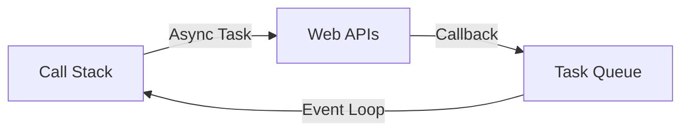

# Async JavaScript

JavaScript is **single-threaded** but **non-blocking**. It achieves this through the **Event Loop**. Understanding async is essential for handling I/O, API calls, timers, and user events.

---

## 1. The Event Loop

JavaScript has one main thread. Long operations would block everything. The solution? **Asynchronous callbacks**.



### How It Works

1. **Call Stack**: Synchronous code executes here (LIFO).
2. **Web APIs**: Browser handles async operations (setTimeout, fetch, DOM events).
3. **Task Queue**: Callbacks wait here when async operations complete.
4. **Event Loop**: Moves callbacks from queue to stack when stack is empty.

```javascript
console.log('1');

setTimeout(() => console.log('2'), 0);

console.log('3');

// Output: 1, 3, 2
// Why? setTimeout callback goes to queue, runs after sync code
```

### Microtasks vs Macrotasks

**Microtasks** (Promises, queueMicrotask) have higher priority than **Macrotasks** (setTimeout, setInterval).

```javascript
console.log('1');

setTimeout(() => console.log('2'), 0);

Promise.resolve().then(() => console.log('3'));

console.log('4');

// Output: 1, 4, 3, 2
// Promise (microtask) runs before setTimeout (macrotask)
```

---

## 2. Callbacks

A callback is a function passed to another function to be executed later.

```javascript
function fetchData(callback) {
    setTimeout(() => {
        callback('Data loaded');
    }, 1000);
}

fetchData((result) => {
    console.log(result); // 'Data loaded' (after 1 second)
});
```

### Callback Hell

Nested callbacks become unreadable and hard to maintain.

```javascript
getUser(userId, (user) => {
    getOrders(user.id, (orders) => {
        getOrderDetails(orders[0].id, (details) => {
            getProduct(details.productId, (product) => {
                console.log(product);
                // This is callback hell 🔥
            });
        });
    });
});
```

---

## 3. Promises

A **Promise** represents a value that may be available now, later, or never. It's a cleaner alternative to callbacks.

### Promise States

| State | Description |
| :--- | :--- |
| `pending` | Initial state, neither fulfilled nor rejected |
| `fulfilled` | Operation completed successfully |
| `rejected` | Operation failed |

### Creating a Promise

```javascript
const promise = new Promise((resolve, reject) => {
    const success = true;
    
    setTimeout(() => {
        if (success) {
            resolve('Data loaded');
        } else {
            reject(new Error('Failed to load'));
        }
    }, 1000);
});
```

### Consuming a Promise

```javascript
promise
    .then((result) => {
        console.log(result); // 'Data loaded'
        return result.toUpperCase();
    })
    .then((upper) => {
        console.log(upper); // 'DATA LOADED'
    })
    .catch((error) => {
        console.error(error);
    })
    .finally(() => {
        console.log('Cleanup'); // Always runs
    });
```

### Chaining Promises

Each `.then()` returns a new Promise, enabling chaining.

```javascript
fetch('/api/user')
    .then(response => response.json())
    .then(user => fetch(`/api/orders/${user.id}`))
    .then(response => response.json())
    .then(orders => console.log(orders))
    .catch(error => console.error(error));
```

### Promise Static Methods

```javascript
// Promise.all: Wait for all (fail fast)
const results = await Promise.all([
    fetch('/api/users'),
    fetch('/api/products'),
    fetch('/api/orders')
]);

// Promise.allSettled: Wait for all (no fail fast)
const results = await Promise.allSettled([
    Promise.resolve(1),
    Promise.reject('error'),
    Promise.resolve(3)
]);
// [{status: 'fulfilled', value: 1}, {status: 'rejected', reason: 'error'}, ...]

// Promise.race: First to settle wins
const first = await Promise.race([
    fetch('/api/fast'),
    fetch('/api/slow')
]);

// Promise.any: First to fulfill wins (ignores rejections)
const first = await Promise.any([
    Promise.reject('fail'),
    Promise.resolve('success')
]); // 'success'
```

---

## 4. async/await (ES2017)

`async/await` is syntactic sugar over Promises. It makes async code look synchronous.

### Basic Usage

```javascript
async function fetchUser() {
    try {
        const response = await fetch('/api/user');
        const user = await response.json();
        return user;
    } catch (error) {
        console.error('Failed to fetch user:', error);
        throw error;
    }
}

// Usage
const user = await fetchUser();
```

### Comparison

```javascript
// Promise chain
function getUser() {
    return fetch('/api/user')
        .then(res => res.json())
        .then(user => {
            console.log(user);
            return user;
        });
}

// async/await (cleaner)
async function getUser() {
    const res = await fetch('/api/user');
    const user = await res.json();
    console.log(user);
    return user;
}
```

### Error Handling

```javascript
async function riskyOperation() {
    try {
        const result = await mightFail();
        return result;
    } catch (error) {
        console.error('Operation failed:', error);
        return null; // Graceful fallback
    } finally {
        console.log('Cleanup');
    }
}
```

### Parallel Execution

**Sequential (Slow):**
```javascript
// Each await waits for the previous one
const user = await fetchUser();
const orders = await fetchOrders();
const products = await fetchProducts();
// Total time: user + orders + products
```

**Parallel (Fast):**
```javascript
// Start all at once, await together
const [user, orders, products] = await Promise.all([
    fetchUser(),
    fetchOrders(),
    fetchProducts()
]);
// Total time: max(user, orders, products)
```

### Top-Level Await

In ES modules, you can use `await` at the top level.

```javascript
// In an ES module (.mjs or type="module")
const config = await fetch('/config.json').then(r => r.json());
console.log(config);
```

---

## 5. Common Async Patterns

### Retry with Exponential Backoff

```javascript
async function fetchWithRetry(url, retries = 3) {
    for (let i = 0; i < retries; i++) {
        try {
            return await fetch(url);
        } catch (error) {
            if (i === retries - 1) throw error;
            await sleep(2 ** i * 1000); // 1s, 2s, 4s
        }
    }
}

function sleep(ms) {
    return new Promise(resolve => setTimeout(resolve, ms));
}
```

### Debounce

Wait for a pause before executing (e.g., search input).

```javascript
function debounce(fn, delay) {
    let timeoutId;
    return (...args) => {
        clearTimeout(timeoutId);
        timeoutId = setTimeout(() => fn(...args), delay);
    };
}

const search = debounce((query) => {
    fetch(`/api/search?q=${query}`);
}, 300);

// In event handler
input.addEventListener('input', (e) => search(e.target.value));
```

### Throttle

Limit execution to once per interval (e.g., scroll handler).

```javascript
function throttle(fn, limit) {
    let inThrottle;
    return (...args) => {
        if (!inThrottle) {
            fn(...args);
            inThrottle = true;
            setTimeout(() => inThrottle = false, limit);
        }
    };
}

const handleScroll = throttle(() => {
    console.log('Scrolled');
}, 100);
```

### Async Queue

Process items one at a time.

```javascript
class AsyncQueue {
    constructor() {
        this.queue = [];
        this.processing = false;
    }
    
    add(task) {
        this.queue.push(task);
        this.process();
    }
    
    async process() {
        if (this.processing) return;
        this.processing = true;
        
        while (this.queue.length > 0) {
            const task = this.queue.shift();
            await task();
        }
        
        this.processing = false;
    }
}
```

---

## 6. Fetch API

The modern way to make HTTP requests.

```javascript
// GET request
const response = await fetch('/api/users');
const users = await response.json();

// POST request
const response = await fetch('/api/users', {
    method: 'POST',
    headers: {
        'Content-Type': 'application/json'
    },
    body: JSON.stringify({ name: 'Alice', email: 'alice@example.com' })
});

// Check for errors (fetch doesn't throw on 4xx/5xx)
if (!response.ok) {
    throw new Error(`HTTP error! status: ${response.status}`);
}

const newUser = await response.json();
```

---

## Summary

- **Event Loop**: Enables non-blocking I/O on a single thread.
- **Callbacks**: Simple but lead to callback hell.
- **Promises**: Chainable, cleaner error handling with `.catch()`.
- **async/await**: Synchronous-looking async code. Use `try/catch` for errors.
- **Parallel Execution**: Use `Promise.all()` to run independent operations concurrently.

Next, we'll explore **Modern JavaScript (ES6+)** features that make the language more powerful and expressive.
