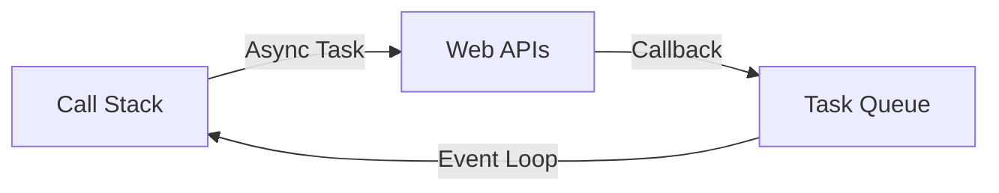

# Async JavaScript

JavaScript is **single-threaded** but **non-blocking**. It achieves this through the **Event Loop**. Understanding async is essential for handling I/O, API calls, timers, and user events.

This is the chapter where JavaScript goes from "a scripting language" to "the engine that powers the modern web." Every network request, every animation, every user interaction relies on the async machinery described here. Master this and you will never be confused by a weird `setTimeout` output order again.

---

## 1. The Event Loop

JavaScript has one main thread. Long operations would block everything. The solution? **Asynchronous callbacks**.

**The restaurant host analogy**: Imagine a restaurant with a single waiter (the main thread). If the waiter stood at the kitchen window waiting for every dish to be cooked before taking the next order, the restaurant would be unbearably slow. Instead, the waiter takes your order, hands it to the kitchen (Web APIs), and immediately goes to serve the next table. When the kitchen rings the bell (task queue), the waiter picks up the dish and delivers it -- but only when they are not in the middle of serving someone else. The event loop is the waiter checking: "Am I free? Is there a dish ready?" That is how JavaScript handles thousands of concurrent operations on a single thread.


```mermaid
graph LR
    A[Call Stack] -->|Async Task| B[Web APIs]
    B -->|Callback| C[Task Queue]
    C -->|Event Loop| A
```

### How It Works

1. **Call Stack**: Synchronous code executes here (LIFO). Think of it as the waiter's hands -- they can only carry one thing at a time.
2. **Web APIs**: The browser (or Node.js) handles async operations in separate threads (setTimeout, fetch, DOM events). This is the kitchen -- work happens in parallel, out of sight.
3. **Task Queue (Callback Queue)**: Completed callbacks wait in line here, like dishes on the pickup counter.
4. **Event Loop**: The loop continuously checks: "Is the call stack empty? If yes, move the next callback from the queue to the stack." This is the waiter glancing at the counter.

```javascript
console.log('1');                        // Runs immediately on the call stack

setTimeout(() => console.log('2'), 0);   // Handed to Web API, callback queued
                                         // Even with 0ms delay, it must wait for
                                         // the current synchronous code to finish!

console.log('3');                        // Runs immediately on the call stack

// Output: 1, 3, 2
// The 0ms setTimeout does NOT mean "run immediately" -- it means
// "run as soon as possible AFTER the current call stack is empty."
```

### Microtasks vs Macrotasks

There are actually *two* queues, and understanding the difference is what separates junior from senior JavaScript developers.

**Microtasks** (Promises, `queueMicrotask`, `MutationObserver`) have higher priority than **Macrotasks** (`setTimeout`, `setInterval`, I/O, UI rendering). After every macrotask (or after the call stack empties), the event loop drains the *entire* microtask queue before moving to the next macrotask. This means a microtask can starve macrotasks if it keeps creating more microtasks.

```javascript
console.log('1');                                    // Sync -- runs first

setTimeout(() => console.log('2'), 0);               // Macrotask queue

Promise.resolve().then(() => console.log('3'));       // Microtask queue

console.log('4');                                    // Sync -- runs second

// Output: 1, 4, 3, 2
// After all synchronous code finishes (1, 4), the event loop drains
// the microtask queue (3) before touching the macrotask queue (2).
```

<Warning>
  **Practical gotcha**: Because microtasks drain completely before the next render frame, an infinite chain of `.then()` calls can freeze the UI just as badly as a synchronous `while(true)` loop. If you need to yield to the browser for rendering, use `setTimeout` (macrotask) or `requestAnimationFrame` instead of a Promise chain.
</Warning>

---

## 2. Callbacks

A callback is a function passed to another function to be executed later.

```javascript
function fetchData(callback) {
    setTimeout(() => {
        callback('Data loaded');
    }, 1000);
}

fetchData((result) => {
    console.log(result); // 'Data loaded' (after 1 second)
});
```

### Callback Hell

Nested callbacks become unreadable and hard to maintain. Each level of nesting adds indentation and makes error handling nearly impossible -- you would need a separate error callback at every level.

```javascript
getUser(userId, (user) => {
    getOrders(user.id, (orders) => {
        getOrderDetails(orders[0].id, (details) => {
            getProduct(details.productId, (product) => {
                console.log(product);
                // This is "callback hell" -- also called the "pyramid of doom."
                // Error handling? You would need error callbacks at every level.
                // Testing? Nearly impossible to isolate any step.
            });
        });
    });
});
// Promises and async/await were created specifically to solve this problem.
```

---

## 3. Promises

A **Promise** represents a value that may be available now, later, or never. It's a cleaner alternative to callbacks.

### Promise States

| State | Description |
| :--- | :--- |
| `pending` | Initial state, neither fulfilled nor rejected |
| `fulfilled` | Operation completed successfully |
| `rejected` | Operation failed |

### Creating a Promise

```javascript
const promise = new Promise((resolve, reject) => {
    // The executor function runs IMMEDIATELY (synchronously).
    // resolve() and reject() are callbacks provided by the Promise machinery.
    const success = true;
    
    setTimeout(() => {
        if (success) {
            resolve('Data loaded');    // Transition: pending -> fulfilled
        } else {
            reject(new Error('Failed to load')); // Transition: pending -> rejected
        }
        // Once settled (fulfilled or rejected), the state is permanent.
        // Calling resolve() or reject() again has no effect.
    }, 1000);
});
```

### Consuming a Promise

```javascript
promise
    .then((result) => {
        console.log(result); // 'Data loaded'
        return result.toUpperCase();
    })
    .then((upper) => {
        console.log(upper); // 'DATA LOADED'
    })
    .catch((error) => {
        console.error(error);
    })
    .finally(() => {
        console.log('Cleanup'); // Always runs
    });
```

### Chaining Promises

Each `.then()` returns a new Promise, enabling chaining.

```javascript
fetch('/api/user')
    .then(response => response.json())
    .then(user => fetch(`/api/orders/${user.id}`))
    .then(response => response.json())
    .then(orders => console.log(orders))
    .catch(error => console.error(error));
```

### Promise Static Methods

These are your tools for orchestrating multiple async operations. Choosing the right one matters.

```javascript
// Promise.all: Wait for ALL to fulfill. If ANY rejects, the whole thing rejects.
// Use when: you need all results and any failure should abort the operation.
const results = await Promise.all([
    fetch('/api/users'),
    fetch('/api/products'),
    fetch('/api/orders')
]);
// If /api/products fails, you lose the results from /api/users too!

// Promise.allSettled: Wait for ALL to settle (fulfill or reject). Never short-circuits.
// Use when: you want to know the outcome of every operation regardless of failures.
const results = await Promise.allSettled([
    Promise.resolve(1),
    Promise.reject('error'),
    Promise.resolve(3)
]);
// [{status: 'fulfilled', value: 1}, {status: 'rejected', reason: 'error'}, ...]
// You can inspect each result individually.

// Promise.race: First to SETTLE (fulfill or reject) wins. Others are ignored.
// Use when: implementing timeouts or picking the fastest source.
const first = await Promise.race([
    fetch('/api/fast'),
    fetch('/api/slow')
]);

// Promise.any: First to FULFILL wins. Rejections are ignored unless ALL reject.
// Use when: you have multiple fallback sources and want the first success.
const first = await Promise.any([
    Promise.reject('fail'),     // Ignored
    Promise.resolve('success')  // This wins
]); // 'success'
```

### Promise Static Methods -- Complete Comparison

| Method | Resolves when | Rejects when | Short-circuits? | Use case |
| :--- | :--- | :--- | :--- | :--- |
| `Promise.all` | All fulfill | Any one rejects | Yes (first rejection) | Need all results; any failure is fatal |
| `Promise.allSettled` | All settle (fulfill or reject) | Never rejects | No | Need outcome of every operation regardless |
| `Promise.race` | First to settle (fulfill or reject) | First to settle is a rejection | Yes (first settlement) | Timeouts, fastest source wins |
| `Promise.any` | First to fulfill | All reject (`AggregateError`) | Yes (first fulfillment) | Fallback sources, try until one works |

```javascript
// Common pattern: implementing a timeout with Promise.race
function fetchWithTimeout(url, timeoutMs = 5000) {
    const timeout = new Promise((_, reject) =>
        setTimeout(() => reject(new Error('Request timed out')), timeoutMs)
    );
    return Promise.race([fetch(url), timeout]);
}

// Edge case: Promise.all with an empty array
await Promise.all([]);        // [] -- resolves immediately with empty array
await Promise.allSettled([]); // [] -- resolves immediately
await Promise.race([]);       // NEVER settles! Hangs forever. This is a spec requirement.
await Promise.any([]);        // Rejects with AggregateError (no promises to fulfill)
```

---

## 4. async/await (ES2017)

`async/await` is syntactic sugar over Promises. It makes async code look synchronous.

### Basic Usage

```javascript
async function fetchUser() {
    try {
        const response = await fetch('/api/user');
        const user = await response.json();
        return user;
    } catch (error) {
        console.error('Failed to fetch user:', error);
        throw error;
    }
}

// Usage
const user = await fetchUser();
```

### The Evolution of Async JavaScript

| Pattern | Era | Error Handling | Readability | Composability |
| :--- | :--- | :--- | :--- | :--- |
| Callbacks | Pre-2015 | Error-first convention (manual) | Poor (pyramid of doom) | Difficult |
| Promises (`.then`) | ES2015 | `.catch()` (chainable) | Moderate (chain can grow long) | Good (chaining, `Promise.all`) |
| async/await | ES2017 | `try/catch` (familiar) | Excellent (reads like sync code) | Good (combine with `Promise.all`) |

**Decision guide -- when to use which:**
- **async/await**: Your default for all async code. Readable, debuggable, supports try/catch.
- **Promise chains (`.then`)**: When you need to transform a value inline without naming intermediate variables, or when building reusable Promise pipelines.
- **Callbacks**: Only when forced by an older API (some Node.js APIs, third-party libraries). Wrap in a Promise immediately using `util.promisify` (Node.js) or a manual `new Promise()` wrapper.

```javascript
// Wrapping a callback API in a Promise (Node.js example)
const fs = require('fs');
const { promisify } = require('util');

// Old way: callback
fs.readFile('file.txt', 'utf8', (err, data) => {
    if (err) throw err;
    console.log(data);
});

// Modern way: promisify + await
const readFile = promisify(fs.readFile);
const data = await readFile('file.txt', 'utf8');
// Or just use fs.promises (Node.js 10+):
const data2 = await fs.promises.readFile('file.txt', 'utf8');
```

### Error Handling

```javascript
async function riskyOperation() {
    try {
        const result = await mightFail();
        return result;
    } catch (error) {
        console.error('Operation failed:', error);
        return null; // Graceful fallback
    } finally {
        console.log('Cleanup');
    }
}
```

### Parallel Execution

This is one of the most common performance mistakes in async JavaScript. The difference between sequential and parallel can be the difference between a 3-second page load and a 1-second page load.

**Sequential (Slow):**
```javascript
// Each await PAUSES execution until the previous call finishes.
// These three calls happen one after another, like standing in three lines.
const user = await fetchUser();       // Wait 1 second
const orders = await fetchOrders();   // Wait 1 second
const products = await fetchProducts(); // Wait 1 second
// Total time: 3 seconds (1 + 1 + 1)
```

**Parallel (Fast):**
```javascript
// All three fetches START simultaneously. We only wait for the slowest one.
// Like ordering food, drinks, and dessert at the same time from different stations.
const [user, orders, products] = await Promise.all([
    fetchUser(),      // All three start at the same time
    fetchOrders(),
    fetchProducts()
]);
// Total time: ~1 second (max of the three)
```

<Tip>
  **Rule of thumb**: If async operations do not depend on each other's results, use `Promise.all` to run them in parallel. Only use sequential `await` when the next call needs data from the previous one (e.g., fetching a user *then* fetching that user's orders).
</Tip>

### Async Error Handling Edge Cases

```javascript
// Edge case 1: Forgetting to await -- the "floating Promise" bug
async function saveThenRedirect() {
    saveData();     // BUG: no await! This fires and is immediately forgotten.
                    // If it rejects, nothing catches it. If it fails, you
                    // already redirected before it finished.
    redirect('/home');

    // Fix:
    await saveData();
    redirect('/home');
}

// Edge case 2: Unhandled Promise rejections crash Node.js (v15+)
// In browsers they log a warning; in Node they terminate the process.
Promise.reject('oops'); // No .catch() -- unhandled rejection!

// Always handle: add a .catch(), use try/catch with await, or add a global handler:
process.on('unhandledRejection', (reason, promise) => {
    console.error('Unhandled rejection:', reason);
    // Log, alert, but DO NOT swallow silently in production
});

// Edge case 3: try/catch does NOT catch errors in unawaited Promises
async function example() {
    try {
        const p = riskyFetch(); // No await -- returns a Promise, does not throw
        doSomethingElse();
    } catch (err) {
        // This NEVER catches errors from riskyFetch!
        // The Promise rejects asynchronously, outside this try block.
    }
}

// Edge case 4: async functions ALWAYS return a Promise
async function getValue() { return 42; }
getValue();          // Promise (resolved with 42), NOT 42
await getValue();    // 42
```

### Top-Level Await

In ES modules, you can use `await` at the top level.

```javascript
// In an ES module (.mjs or type="module")
const config = await fetch('/config.json').then(r => r.json());
console.log(config);
```

<Warning>
  **Top-level await blocks module loading.** If you `await` a slow operation at the top level of a module, any module that imports it will also be blocked until that await resolves. Use it for essential setup (loading config, establishing database connections), not for optional operations. In application entry points it is fine; in library modules it can cause surprising slowdowns for consumers.
</Warning>

---

## 5. Common Async Patterns

### Retry with Exponential Backoff

A production-essential pattern. Network requests fail, servers hiccup, and connections drop. Retrying with increasing delays (1s, 2s, 4s) avoids hammering a struggling server while still recovering from transient failures.

```javascript
async function fetchWithRetry(url, retries = 3) {
    for (let i = 0; i < retries; i++) {
        try {
            return await fetch(url);
        } catch (error) {
            if (i === retries - 1) throw error;   // Final attempt failed, give up
            const delay = 2 ** i * 1000;           // Exponential: 1s, 2s, 4s
            console.warn(`Attempt ${i + 1} failed, retrying in ${delay}ms...`);
            await sleep(delay);
        }
    }
}

// sleep() is the standard way to "pause" in async code.
// It wraps setTimeout in a Promise so you can await it.
function sleep(ms) {
    return new Promise(resolve => setTimeout(resolve, ms));
}
```

### Debounce

Wait for a pause in activity before executing. Think of it like an elevator door: it resets its close timer every time someone walks in. It only closes after nobody has entered for a set period.

```javascript
function debounce(fn, delay) {
    let timeoutId;
    return (...args) => {
        clearTimeout(timeoutId);  // Cancel the previous timer
        timeoutId = setTimeout(() => fn(...args), delay); // Start a new one
    };
    // The closure keeps timeoutId alive between calls -- this is closures in action!
}

// Practical use: search-as-you-type without flooding the server
const search = debounce((query) => {
    fetch(`/api/search?q=${query}`);
}, 300); // Only fires 300ms after the user STOPS typing

input.addEventListener('input', (e) => search(e.target.value));
```

### Throttle

Limit execution to at most once per interval, no matter how many times it is triggered. Think of it like a rate limiter: "You may only do this once every N milliseconds."

```javascript
function throttle(fn, limit) {
    let inThrottle;
    return (...args) => {
        if (!inThrottle) {
            fn(...args);            // Execute immediately
            inThrottle = true;      // Lock the gate
            setTimeout(() => inThrottle = false, limit); // Unlock after 'limit' ms
        }
        // Calls during the throttle window are silently dropped
    };
}

// Practical use: scroll position tracking without killing performance
const handleScroll = throttle(() => {
    console.log('Scrolled at', window.scrollY);
}, 100); // At most 10 times per second, even if scroll fires 60+ times/sec
```

### Debounce vs Throttle -- Complete Comparison

| Feature | Debounce | Throttle |
| :--- | :--- | :--- |
| Fires when | Activity STOPS for N ms | At most once every N ms during activity |
| During rapid calls | Keeps resetting, never fires until pause | Fires at regular intervals, drops extras |
| First call | Delayed (unless using leading edge variant) | Immediate (then locked for N ms) |
| Best for | Search input, form validation, window resize end | Scroll tracking, mouse move, game loops, API rate limiting |
| Analogy | Elevator door (waits for no one else to enter) | Heartbeat (steady pulse regardless of stimulus) |

<Tip>
  **Debounce vs Throttle**: Use debounce when you want to wait until activity *stops* (search input, window resize). Use throttle when you want *steady updates during continuous activity* (scroll position, mouse movement, game loop ticks).
</Tip>

### Async Queue

Process items one at a time.

```javascript
class AsyncQueue {
    constructor() {
        this.queue = [];
        this.processing = false;
    }
    
    add(task) {
        this.queue.push(task);
        this.process();
    }
    
    async process() {
        if (this.processing) return;
        this.processing = true;
        
        while (this.queue.length > 0) {
            const task = this.queue.shift();
            await task();
        }
        
        this.processing = false;
    }
}
```

---

## 6. Fetch API

The modern way to make HTTP requests, built into every browser and Node.js 18+.

```javascript
// GET request
const response = await fetch('/api/users');
const users = await response.json();  // .json() is also async -- it returns a Promise!

// POST request
const response = await fetch('/api/users', {
    method: 'POST',
    headers: {
        'Content-Type': 'application/json'  // Always set this for JSON bodies
    },
    body: JSON.stringify({ name: 'Alice', email: 'alice@example.com' })
});

// CRITICAL GOTCHA: fetch does NOT throw on HTTP errors (4xx/5xx).
// It only throws on network failures (DNS errors, server unreachable, etc.).
// A 404 or 500 response is still a "successful" fetch -- you must check manually.
if (!response.ok) {
    throw new Error(`HTTP error! status: ${response.status}`);
}

const newUser = await response.json();
```

<Warning>
  **The most common fetch mistake**: Assuming `fetch` throws on 404 or 500 responses. It does not. A `try/catch` around `fetch` only catches *network failures*, not HTTP error codes. Always check `response.ok` or `response.status` before processing the body.
</Warning>

---

## Summary

- **Event Loop**: Enables non-blocking I/O on a single thread.
- **Callbacks**: Simple but lead to callback hell.
- **Promises**: Chainable, cleaner error handling with `.catch()`.
- **async/await**: Synchronous-looking async code. Use `try/catch` for errors.
- **Parallel Execution**: Use `Promise.all()` to run independent operations concurrently.

Next, we'll explore **Modern JavaScript (ES6+)** features that make the language more powerful and expressive.

---

## Interview Deep-Dive

<AccordionGroup>
  <Accordion title="Walk me through the exact execution order of this code and explain why. Include microtask and macrotask reasoning.">
    ```javascript
    console.log('A');
    setTimeout(() => console.log('B'), 0);
    Promise.resolve().then(() => console.log('C'));
    Promise.resolve().then(() => setTimeout(() => console.log('D'), 0));
    Promise.resolve().then(() => console.log('E'));
    console.log('F');
    ```

    **Strong Answer:**

    - Output: A, F, C, E, B, D. Here is the step-by-step reasoning:
    - **Synchronous phase**: `console.log('A')` executes immediately -- output: A. `setTimeout` is called, its callback is registered with the Web API timer and will be placed on the macrotask queue after 0ms. `Promise.resolve().then(...)` -- the promise is already resolved, so the `.then` callback is placed on the microtask queue (not executed yet). Same for the second and third `.then` callbacks -- all three go onto the microtask queue. `console.log('F')` executes immediately -- output: F. The synchronous call stack is now empty.
    - **Microtask drain phase**: The event loop checks the microtask queue before touching the macrotask queue. First microtask: `console.log('C')` -- output: C. Second microtask: `setTimeout(() => console.log('D'), 0)` -- this schedules another macrotask. No console output. Third microtask: `console.log('E')` -- output: E. Microtask queue is now empty.
    - **Macrotask phase**: The event loop picks the first macrotask: the `setTimeout` callback for 'B' -- output: B. After each macrotask, the microtask queue is drained (it is empty). Next macrotask: the `setTimeout` callback for 'D' (which was scheduled during the microtask phase) -- output: D.
    - The critical insight: microtasks that are added during the microtask drain phase are also drained in the same cycle. And microtasks can schedule macrotasks, but those macrotasks always run after the current microtask drain is complete. This is why C and E appear before B, even though the setTimeout for B was registered before any of the promise callbacks.

    **Follow-up: Can a microtask starve macrotasks? What would that look like, and how would it manifest as a bug?**

    Yes. If a `.then()` callback schedules another `.then()`, and that one schedules another, the microtask queue never empties. The event loop never reaches the macrotask queue, which means `setTimeout` callbacks never fire, DOM rendering never happens (the browser renders between macrotasks), and the UI freezes completely. Example: `function loop() { Promise.resolve().then(loop); } loop();` -- this is an infinite microtask loop that freezes the tab just as effectively as `while(true){}`. I have seen this in production when a recursive promise chain had no base case -- a function that retried a failed API call by chaining another `.then()` without ever falling through to a `setTimeout`-based backoff. The fix was introducing `setTimeout` in the retry path to yield to the macrotask queue and let the browser breathe.
  </Accordion>

  <Accordion title="What is the difference between Promise.all, Promise.allSettled, Promise.race, and Promise.any? When would you use each in production?">
    **Strong Answer:**

    - **`Promise.all`**: Waits for all promises to fulfill. If any single promise rejects, the entire `Promise.all` rejects immediately (fail-fast). Use when you need all results and a single failure means the whole operation is useless. Example: loading a dashboard that needs user data, permissions, and feature flags -- if any fails, the dashboard cannot render.
    - **`Promise.allSettled`**: Waits for all promises to settle (fulfill or reject). Never short-circuits. Returns an array of `{status, value}` or `{status, reason}` objects. Use when failures are expected and you want to handle each result independently. Example: sending analytics events to three different providers -- if one is down, you still want the other two results. Or a batch API migration where you want a report of which items succeeded and which failed.
    - **`Promise.race`**: Returns the result of the first promise to settle (fulfill OR reject). Use for timeouts: `Promise.race([fetch(url), timeout(5000)])` -- if the fetch takes longer than 5 seconds, the timeout promise rejects first, and you handle the timeout. Caveat: if the losing promise is a fetch, it is not actually cancelled -- it continues running in the background. You need `AbortController` for true cancellation.
    - **`Promise.any`**: Returns the first promise to fulfill. Rejections are ignored unless ALL promises reject (then it throws `AggregateError`). Use when you have multiple fallback sources and want the fastest success. Example: fetching from a CDN and an origin server simultaneously -- use whichever responds successfully first.
    - Production decision framework: Do you need all results? Use `all` if any failure is fatal, `allSettled` if you want per-item status. Do you need just one result? Use `race` if you care about the first settlement (even failures), `any` if you only care about the first success.

    **Follow-up: Promise.all rejects on the first failure, but the other promises keep running. How do you actually cancel in-flight requests when one fails?**

    `Promise.all` does not cancel anything -- promises are not cancellable by design. The other fetches continue running, consuming bandwidth and server resources. The solution is `AbortController`. Create one controller, pass its `signal` to every `fetch`, and call `controller.abort()` in the `.catch()`. Example: `const controller = new AbortController(); try { await Promise.all(urls.map(url => fetch(url, { signal: controller.signal }))); } catch (e) { controller.abort(); }`. Each aborted fetch throws an `AbortError`, which you can distinguish from real errors by checking `error.name === 'AbortError'`. In Node.js, you can also pass abort signals to stream pipelines and database queries. Without this pattern, I have seen production systems where a failed dashboard load left 12 orphaned API calls running, each holding open a database connection for their full timeout duration.
  </Accordion>

  <Accordion title="Implement a debounce function from scratch. Then explain how it uses closures, and tell me the difference between leading-edge and trailing-edge debounce.">
    **Strong Answer:**

    - Basic trailing-edge debounce:
    ```javascript
    function debounce(fn, delay) {
      let timeoutId;
      return function(...args) {
        clearTimeout(timeoutId);
        timeoutId = setTimeout(() => fn.apply(this, args), delay);
      };
    }
    ```
    - Closure analysis: the returned function closes over `timeoutId` and `fn`. Every call to the debounced function accesses the same `timeoutId` variable through the closure. When called rapidly, each call clears the previous timeout (via `clearTimeout(timeoutId)`) and sets a new one. Only the last call's timeout actually fires. The `fn` reference is also captured in the closure, so the original function is available when the timeout finally executes.
    - The `fn.apply(this, args)` detail matters: using `apply` preserves the `this` context and the arguments from the call site. If you just wrote `fn(...args)`, you would lose `this` -- which matters when the debounced function is used as an object method.
    - **Trailing-edge** (default): the function fires after the delay, once activity stops. Use case: search-as-you-type -- fire the API call 300ms after the user stops typing.
    - **Leading-edge**: the function fires immediately on the first call, then ignores subsequent calls for the delay period. Use case: a submit button -- execute immediately, then prevent double-clicks for 500ms.
    - Leading-edge implementation adds an `immediate` flag:
    ```javascript
    function debounce(fn, delay, immediate) {
      let timeoutId;
      return function(...args) {
        const callNow = immediate && !timeoutId;
        clearTimeout(timeoutId);
        timeoutId = setTimeout(() => { timeoutId = null; }, delay);
        if (callNow) fn.apply(this, args);
      };
    }
    ```
    - Production consideration: Lodash's `_.debounce` supports both leading and trailing (and both simultaneously), a `maxWait` option (fire at least every N ms even if activity continues), and a `.cancel()` method to abort a pending invocation. If you need more than basic debounce, use the library.

    **Follow-up: What happens if the debounced function is called with different arguments during the delay period? Which arguments "win"?**

    In a trailing-edge debounce, the last call's arguments win. Each call to the debounced function clears the previous timeout and sets a new one with the latest `args`. When the timeout finally fires, it uses the arguments from the final invocation. This is correct for search-as-you-type: the query "hel" is replaced by "hell" is replaced by "hello", and only "hello" is sent to the API. If you needed to accumulate all arguments (for example, batching analytics events), you would modify the debounce to collect args into an array and pass the array to `fn` when the timeout fires.
  </Accordion>

  <Accordion title="The fetch API does not throw on 404 or 500 responses. Why is this a design decision, not a bug? How should you handle it in production?">
    **Strong Answer:**

    - `fetch` only rejects on network-level failures: DNS resolution failure, server unreachable, CORS blocked, connection reset. HTTP error responses (4xx, 5xx) are successful network operations -- the server received the request and sent back a response. From the network layer's perspective, that is a success. The error is at the application layer, which is your responsibility to handle.
    - This design aligns with the separation of concerns principle: `fetch` is a network transport API, not an application-level HTTP client. It tells you "I got a response from the server." What that response means is your domain logic.
    - In production, the standard pattern is a wrapper:
    ```javascript
    async function api(url, options) {
      const response = await fetch(url, options);
      if (!response.ok) {
        const body = await response.text();
        throw new HttpError(response.status, body);
      }
      return response.json();
    }
    ```
    - The custom `HttpError` class preserves the status code and response body, so calling code can distinguish between a 401 (redirect to login), 404 (show not-found UI), and 500 (show error page with retry button).
    - Libraries like Axios throw on non-2xx status codes by default, which is why many teams prefer Axios -- it matches the "throw on error" mental model. The trade-off is an additional dependency and a slightly different API. In modern code, a thin `fetch` wrapper gives you the same behavior with zero dependencies.
    - Production gotcha I have encountered: a team had `try { const data = await fetch(url).then(r => r.json()); } catch (e) { showError(); }`. The `fetch` succeeded with a 500 status, `.json()` tried to parse an HTML error page, threw a `SyntaxError`, and the catch block showed a generic error message with no status code context. The fix was checking `response.ok` before calling `.json()`.

    **Follow-up: How do you implement a timeout for fetch? The native API has no timeout option.**

    Use `AbortController` with `setTimeout`: `const controller = new AbortController(); const timeoutId = setTimeout(() => controller.abort(), 5000); try { const response = await fetch(url, { signal: controller.signal }); clearTimeout(timeoutId); return response; } catch (e) { if (e.name === 'AbortError') throw new Error('Request timed out'); throw e; }`. The `signal` option was added to fetch specifically for cancellation. When `abort()` is called, the fetch rejects with an `AbortError`. You clear the timeout on success to prevent it from firing after the response arrives. In Node.js 18+, fetch also supports the `signal` option natively. Some teams wrap this into a `fetchWithTimeout` utility that is used project-wide.
  </Accordion>

  <Accordion title="Explain the difference between concurrency and parallelism in JavaScript. Is Promise.all truly parallel?">
    **Strong Answer:**

    - Concurrency means multiple tasks make progress over the same time period, but not necessarily at the same instant. Parallelism means multiple tasks execute simultaneously, at the same instant, on different CPU cores.
    - JavaScript's event loop provides concurrency, not parallelism. When you call `Promise.all([fetch(a), fetch(b), fetch(c)])`, three network requests are initiated. The JavaScript main thread does not process them simultaneously -- it fires off three I/O operations to the browser/OS networking layer (which may use multiple threads internally), then goes idle. As responses arrive, their callbacks are queued and processed one at a time on the main thread.
    - So `Promise.all` is concurrent but not parallel *at the JavaScript level*. The network I/O itself happens in parallel (the OS handles multiple TCP connections simultaneously), but the JavaScript callback execution is serial -- one `.then()` handler runs, then the next.
    - True parallelism in JavaScript requires `Web Workers` (browser) or `worker_threads` (Node.js). These run JavaScript on separate OS threads with their own event loops. Communication happens via `postMessage` (structured cloning) or `SharedArrayBuffer` (shared memory with `Atomics` for synchronization).
    - The practical implication: `Promise.all` is "parallel enough" for I/O-bound work (API calls, database queries, file reads) because the I/O subsystem handles the actual parallelism. It is not enough for CPU-bound work (parsing a 100MB JSON file, running a complex algorithm) because those computations happen on the main thread sequentially. For CPU-bound parallel work, you need worker threads.

    **Follow-up: If I create 1000 fetch calls with Promise.all, will they all fire at once? What limits them?**

    They will all be initiated immediately at the JavaScript level, but the browser and OS impose limits. Browsers enforce a per-origin connection limit (Chrome allows 6 concurrent HTTP/1.1 connections per host). Requests beyond the limit are queued internally by the browser's networking stack. With HTTP/2, multiple requests share a single TCP connection via multiplexing, so the per-connection limit is less relevant, but the browser still limits the total number of concurrent streams. In Node.js, the limit comes from the underlying libuv thread pool (default 4 threads for DNS resolution) and OS socket limits. In production, blindly firing 1000 concurrent requests can overwhelm the target server, trigger rate limiting, or exhaust local file descriptors. The solution is a concurrency limiter: process in batches of N (e.g., 10) using a pattern like p-limit or a manual semaphore with async/await.
  </Accordion>
</AccordionGroup>
