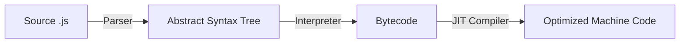

# JavaScript Fundamentals

JavaScript is a **dynamically typed**, **interpreted** language. Understanding its type system and how values behave is critical to writing bug-free code.

---

## 1. How JavaScript Works

Unlike compiled languages like Java or C++, JavaScript is **interpreted** at runtime. Modern engines like V8 (Chrome, Node.js) use **Just-In-Time (JIT) compilation** for performance.



### The Process
1. **Parsing**: Your code is parsed into an Abstract Syntax Tree (AST).
2. **Interpreter**: The AST is converted to bytecode and executed immediately.
3. **JIT Compiler**: Hot code paths are compiled to optimized machine code.

**Key Takeaway**: JavaScript is fast enough for most use cases thanks to JIT compilation.

---

## 2. Variables & Declarations

JavaScript has three ways to declare variables. **Use `const` by default, `let` when you need to reassign, and avoid `var`.**

### `const` (Block-scoped, No Reassignment)
```javascript
const PI = 3.14159;
PI = 3; // ❌ TypeError: Assignment to constant variable

// Note: Objects and arrays are still mutable!
const user = { name: 'Alice' };
user.name = 'Bob'; // ✅ This works
user = {};         // ❌ This fails
```

### `let` (Block-scoped, Reassignable)
```javascript
let count = 0;
count = 1; // ✅ Works fine

if (true) {
    let message = 'Hello';
}
console.log(message); // ❌ ReferenceError: message is not defined
```

### `var` (Function-scoped, Hoisted) — Avoid!
```javascript
console.log(x); // undefined (hoisted, but not initialized)
var x = 5;

// var ignores block scope
if (true) {
    var leaked = 'I escaped!';
}
console.log(leaked); // 'I escaped!' — This is a bug waiting to happen
```

<Warning>
  **Why avoid `var`?** It's function-scoped, not block-scoped, and hoisted. This leads to confusing bugs. Modern JavaScript uses `const` and `let`.
</Warning>

---

## 3. Data Types

JavaScript has **8 data types**: 7 primitives and 1 object type.

### Primitive Types

| Type | Example | Notes |
| :--- | :--- | :--- |
| `number` | `42`, `3.14`, `Infinity`, `NaN` | All numbers are 64-bit floats |
| `bigint` | `9007199254740993n` | For integers beyond safe range |
| `string` | `'hello'`, `"world"`, `` `template` `` | Immutable sequence of characters |
| `boolean` | `true`, `false` | Logical values |
| `undefined` | `undefined` | Variable declared but not assigned |
| `null` | `null` | Intentional absence of value |
| `symbol` | `Symbol('id')` | Unique identifiers (ES6) |

```javascript
let age = 25;              // number
let price = 19.99;         // number (no separate float type)
let name = 'Alice';        // string
let isActive = true;       // boolean
let nothing = null;        // null
let notDefined;            // undefined
let id = Symbol('id');     // symbol
let bigNumber = 9007199254740993n; // bigint
```

### Reference Type: Object

Everything that's not a primitive is an **Object**. This includes arrays, functions, dates, and regular objects.

```javascript
const person = { name: 'Alice', age: 25 };
const numbers = [1, 2, 3];
const greet = function() { return 'Hello'; };
const today = new Date();
```

---

## 4. Type Coercion

JavaScript tries to be helpful by automatically converting types. This can lead to unexpected results.

### Implicit Coercion (Automatic)
```javascript
'5' + 3;      // '53' (number → string, concatenation)
'5' - 3;      // 2 (string → number, subtraction)
'5' * '2';    // 10 (both → numbers)
true + true;  // 2 (true → 1)
[] + {};      // '[object Object]' (both → strings)
```

### Explicit Coercion (Intentional)
```javascript
Number('42');     // 42
String(42);       // '42'
Boolean(0);       // false
Boolean('hello'); // true
parseInt('42px'); // 42 (parses until non-digit)
```

### Truthy & Falsy Values
In boolean context, values are coerced to `true` or `false`.

**Falsy values** (evaluate to `false`):
- `false`, `0`, `-0`, `0n`, `''`, `null`, `undefined`, `NaN`

**Everything else is truthy** (including `[]`, `{}`, `'0'`).

```javascript
if ('') console.log('truthy');   // Not printed
if ([]) console.log('truthy');   // Printed! Empty array is truthy
```

---

## 5. Operators

### Comparison: `==` vs `===`

**Always use `===`** (strict equality). It checks value AND type.

```javascript
5 == '5';    // true (type coercion happens)
5 === '5';   // false (different types)

null == undefined;  // true
null === undefined; // false
```

### Logical Operators

```javascript
// AND: Returns first falsy or last value
true && 'hello';  // 'hello'
false && 'hello'; // false

// OR: Returns first truthy or last value
null || 'default';  // 'default'
'value' || 'default'; // 'value'

// Nullish Coalescing (ES2020): Only null/undefined
null ?? 'default';  // 'default'
0 ?? 'default';     // 0 (0 is not null/undefined)
'' ?? 'default';    // '' (empty string is not null/undefined)
```

### Optional Chaining (ES2020)

Safely access nested properties without checking each level.

```javascript
const user = { profile: { name: 'Alice' } };

// Old way
const name = user && user.profile && user.profile.name;

// New way
const name = user?.profile?.name; // 'Alice'
const age = user?.profile?.age;   // undefined (no error)
```

---

## 6. Control Flow

### Conditionals

```javascript
if (score >= 90) {
    grade = 'A';
} else if (score >= 80) {
    grade = 'B';
} else {
    grade = 'C';
}

// Ternary operator
const status = age >= 18 ? 'Adult' : 'Minor';
```

### Switch

```javascript
switch (day) {
    case 'Monday':
    case 'Tuesday':
        console.log('Weekday');
        break;
    case 'Saturday':
    case 'Sunday':
        console.log('Weekend');
        break;
    default:
        console.log('Unknown');
}
```

### Loops

```javascript
// For loop
for (let i = 0; i < 5; i++) {
    console.log(i);
}

// For...of (iterate over values) — Use this!
const fruits = ['apple', 'banana', 'cherry'];
for (const fruit of fruits) {
    console.log(fruit);
}

// For...in (iterate over keys/indices) — Avoid for arrays
for (const index in fruits) {
    console.log(index); // '0', '1', '2' (strings!)
}

// While
let count = 0;
while (count < 3) {
    console.log(count++);
}
```

---

## Summary

- **Variables**: Use `const` by default, `let` when needed. Avoid `var`.
- **Types**: 7 primitives (`number`, `string`, `boolean`, `null`, `undefined`, `symbol`, `bigint`) + Object.
- **Coercion**: JavaScript auto-converts types. Use `===` to avoid surprises.
- **Operators**: Use `??` for null/undefined, `?.` for safe property access.

Next, we'll dive deep into **Functions & Scope**, the heart of JavaScript.
