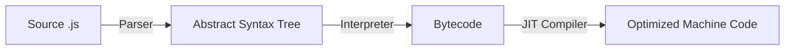

# JavaScript Fundamentals

JavaScript is a **dynamically typed**, **interpreted** language. Understanding its type system and how values behave is critical to writing bug-free code.

Think of JavaScript's type system like a helpful but overeager assistant: it will try to make things work even when you hand it mismatched types, silently converting a string to a number or a number to a boolean behind your back. Sometimes that is convenient. Sometimes it produces bugs that are maddening to track down. This chapter gives you the foundation to always know what JavaScript is doing with your values and why.

---

## 1. How JavaScript Works

Unlike compiled languages like Java or C++, JavaScript is **interpreted** at runtime. Modern engines like V8 (Chrome, Node.js) use **Just-In-Time (JIT) compilation** for performance.


```mermaid
graph LR
    A[Source .js] -->|Parser| B[Abstract Syntax Tree]
    B -->|Interpreter| C[Bytecode]
    C -->|JIT Compiler| D[Optimized Machine Code]
```

### The Process
1. **Parsing**: Your code is parsed into an Abstract Syntax Tree (AST).
2. **Interpreter**: The AST is converted to bytecode and executed immediately.
3. **JIT Compiler**: Hot code paths are compiled to optimized machine code.

**Key Takeaway**: JavaScript is fast enough for most use cases thanks to JIT compilation.

---

## 2. Variables & Declarations

JavaScript has three ways to declare variables. **Use `const` by default, `let` when you need to reassign, and avoid `var`.**

### `const` (Block-scoped, No Reassignment)
```javascript
const PI = 3.14159;
PI = 3; // ❌ TypeError: Assignment to constant variable

// Note: Objects and arrays are still mutable!
const user = { name: 'Alice' };
user.name = 'Bob'; // ✅ This works
user = {};         // ❌ This fails
```

### `let` (Block-scoped, Reassignable)
```javascript
let count = 0;
count = 1; // ✅ Works fine

if (true) {
    let message = 'Hello';
}
console.log(message); // ❌ ReferenceError: message is not defined
```

### `var` (Function-scoped, Hoisted) -- Avoid!
```javascript
console.log(x); // undefined (hoisted, but not initialized)
var x = 5;

// What actually happens behind the scenes (hoisting):
// JavaScript rewrites the above as:
//   var x;              <-- declaration is "hoisted" to the top
//   console.log(x);     <-- x exists but has no value yet: undefined
//   x = 5;              <-- assignment stays in place

// var ignores block scope -- it leaks out of if/for/while blocks
if (true) {
    var leaked = 'I escaped!';
}
console.log(leaked); // 'I escaped!' -- This is a bug waiting to happen
```

<Warning>
  **Why avoid `var`?** It is function-scoped, not block-scoped, and its declaration is hoisted to the top of the function. This means a variable can appear to exist before the line where you wrote it, and it can leak out of `if` and `for` blocks. These two behaviors are the source of a huge class of bugs in legacy JavaScript. Modern code uses `const` and `let`, which are block-scoped and behave the way you would expect coming from any other language.
</Warning>

### var vs let vs const -- Complete Comparison

| Feature | `var` | `let` | `const` |
| :--- | :--- | :--- | :--- |
| Scope | Function | Block | Block |
| Hoisting | Hoisted (initialized as `undefined`) | Hoisted (but in Temporal Dead Zone) | Hoisted (but in Temporal Dead Zone) |
| Reassignment | Yes | Yes | No |
| Redeclaration in same scope | Yes (silently overwrites) | No (`SyntaxError`) | No (`SyntaxError`) |
| Mutable value | Yes | Yes | Object/Array contents: yes. Primitive: no |
| Use in `for` loop | Shared across iterations | New binding per iteration | Not reassignable (use in `for...of`) |

**Decision guide -- which declaration to use:**
- **Start with `const`** for every variable. This is your default. It signals intent: "this binding will not change."
- **Switch to `let`** only when you need to reassign: loop counters, accumulators, values that change over time.
- **Never use `var`** in new code. If you see it in a codebase, it is legacy or a bug. The only exception is if you are targeting an environment that does not support ES6 (extremely rare today).

```javascript
// Temporal Dead Zone (TDZ) -- unique to let/const
// The variable is "hoisted" but NOT initialized. Accessing it before
// the declaration line throws a ReferenceError, not undefined.
console.log(a); // undefined -- var is hoisted and initialized
console.log(b); // ReferenceError: Cannot access 'b' before initialization
var a = 1;
let b = 2;

// Why TDZ exists: it catches bugs. With var, accessing a variable before
// its declaration silently gives you undefined, hiding real errors.
// TDZ makes those errors loud and immediate.
```

---

## 3. Data Types

JavaScript has **8 data types**: 7 primitives and 1 object type.

### Primitive Types

| Type | Example | Notes |
| :--- | :--- | :--- |
| `number` | `42`, `3.14`, `Infinity`, `NaN` | All numbers are 64-bit floats |
| `bigint` | `9007199254740993n` | For integers beyond safe range |
| `string` | `'hello'`, `"world"`, `` `template` `` | Immutable sequence of characters |
| `boolean` | `true`, `false` | Logical values |
| `undefined` | `undefined` | Variable declared but not assigned |
| `null` | `null` | Intentional absence of value |
| `symbol` | `Symbol('id')` | Unique identifiers (ES6) |

```javascript
let age = 25;              // number
let price = 19.99;         // number (no separate float type)
let name = 'Alice';        // string
let isActive = true;       // boolean
let nothing = null;        // null
let notDefined;            // undefined
let id = Symbol('id');     // symbol
let bigNumber = 9007199254740993n; // bigint
```

### Reference Type: Object

Everything that's not a primitive is an **Object**. This includes arrays, functions, dates, and regular objects.

```javascript
const person = { name: 'Alice', age: 25 };
const numbers = [1, 2, 3];
const greet = function() { return 'Hello'; };
const today = new Date();
```

### typeof -- Results and Gotchas

The `typeof` operator returns a string indicating the type. It has a few famous surprises.

| Expression | `typeof` result | Surprise? |
| :--- | :--- | :--- |
| `typeof 42` | `'number'` | |
| `typeof 'hello'` | `'string'` | |
| `typeof true` | `'boolean'` | |
| `typeof undefined` | `'undefined'` | |
| `typeof Symbol()` | `'symbol'` | |
| `typeof 42n` | `'bigint'` | |
| `typeof null` | `'object'` | Yes -- this is a 25-year-old bug that can never be fixed |
| `typeof []` | `'object'` | Yes -- arrays are objects. Use `Array.isArray()` instead |
| `typeof {}` | `'object'` | |
| `typeof function(){}` | `'function'` | Functions get their own type, but arrays do not |
| `typeof NaN` | `'number'` | Yes -- "Not a Number" is a number |
| `typeof undeclaredVar` | `'undefined'` | Does not throw, unlike accessing `undeclaredVar` directly |

```javascript
// Reliable type checking patterns:
Array.isArray([1, 2, 3]);              // true (the only reliable array check)
value === null;                         // check for null specifically
typeof value === 'function';            // works correctly for functions
value instanceof Date;                  // check for specific object types
Object.prototype.toString.call(value);  // '[object Array]', '[object Null]', etc.
                                        // The most reliable universal type check
```

---

## 4. Type Coercion

JavaScript tries to be helpful by automatically converting types. This can lead to unexpected results.

Think of it like an overly accommodating waiter: you order "five plus three" and instead of asking whether you meant the number five or the string "5", the waiter just guesses. Sometimes the guess is right. Sometimes you get a concatenated string when you wanted arithmetic. The key rule to remember: **the `+` operator prefers strings** (if either side is a string, it concatenates), while `-`, `*`, and `/` **always convert to numbers**.

### Number Edge Cases -- Floating Point and Safe Integers

```javascript
// The infamous floating point problem -- JavaScript uses 64-bit IEEE 754 floats
0.1 + 0.2;             // 0.30000000000000004 (not 0.3!)
0.1 + 0.2 === 0.3;     // false

// Fix: compare with a small tolerance (epsilon)
Math.abs(0.1 + 0.2 - 0.3) < Number.EPSILON; // true

// For money, NEVER use floats. Use integers (cents) instead:
const priceInCents = 1999; // $19.99
const total = priceInCents * 3; // 5997 cents = $59.97 (exact)

// Safe integer range -- beyond this, integers lose precision
Number.MAX_SAFE_INTEGER;  // 9007199254740991 (2^53 - 1)
9007199254740992 === 9007199254740993; // true (!) -- precision lost
// Use BigInt for integers beyond safe range:
9007199254740992n === 9007199254740993n; // false (correct)

// Special number values
Infinity + 1;           // Infinity
1 / 0;                  // Infinity
-1 / 0;                 // -Infinity
Infinity - Infinity;    // NaN
0 / 0;                  // NaN
parseInt('hello');      // NaN
```

### Implicit Coercion (Automatic)
```javascript
'5' + 3;      // '53'  -- + sees a string, so it concatenates (number becomes string)
'5' - 3;      // 2     -- - only works with numbers, so '5' becomes 5
'5' * '2';    // 10    -- * forces both to numbers
true + true;  // 2     -- booleans coerce to 1/0 in numeric context
[] + {};      // '[object Object]' -- both coerced to strings, then concatenated
```

### Explicit Coercion (Intentional)
```javascript
Number('42');     // 42
String(42);       // '42'
Boolean(0);       // false
Boolean('hello'); // true
parseInt('42px'); // 42 (parses until non-digit)
```

### Truthy and Falsy Values
In boolean context, values are coerced to `true` or `false`. Memorize the falsy list -- everything else is truthy.

**Falsy values** (evaluate to `false`):
- `false`, `0`, `-0`, `0n`, `''`, `null`, `undefined`, `NaN`

**Everything else is truthy** (including `[]`, `{}`, `'0'`, `new Boolean(false)`).

```javascript
if ('') console.log('truthy');   // Not printed -- empty string is falsy
if ([]) console.log('truthy');   // Printed! Empty array is truthy (this surprises everyone)
if ('0') console.log('truthy');  // Printed! The string '0' is truthy (it is not empty)
if (0) console.log('truthy');    // Not printed -- the number 0 is falsy
```

**Edge cases that confuse everyone:**

```javascript
// document.all is the only "falsy object" in JavaScript -- a historical quirk
// to maintain backward compatibility with ancient IE code that checked
// if (document.all) to detect Internet Explorer.
Boolean(document.all);  // false (in browsers)
typeof document.all;    // 'undefined' (yet it exists and is usable!)

// Boolean objects vs boolean primitives
Boolean(new Boolean(false));  // true! -- it is an object, and objects are truthy
Boolean(false);               // false -- the primitive is falsy
// Never use 'new Boolean()' -- it creates a truthy wrapper around a falsy value.

// Empty objects and arrays are ALWAYS truthy -- check their contents instead
if ([].length)    {} // false (correct way to check empty array)
if ({}.keys)      {} // true (wrong -- this checks if the method exists)
if (Object.keys({}).length) {} // false (correct way to check empty object)
```

<Tip>
  **Practical tip**: The truthy/falsy distinction matters most in conditional checks. A common bug is checking `if (list.length)` when the list has zero items -- `0` is falsy, so this works. But if you write `if (list)` on an empty array, it is truthy because the array *exists*, even though it is empty. Always check `.length` for arrays.
</Tip>

---

## 5. Operators

### Comparison: `==` vs `===`

**Always use `===`** (strict equality). It checks value AND type.

```javascript
5 == '5';    // true (type coercion happens)
5 === '5';   // false (different types)

null == undefined;  // true
null === undefined; // false
```

**== vs === -- Complete Comparison**

| Expression | `==` (loose) | `===` (strict) | Why |
| :--- | :--- | :--- | :--- |
| `5 == '5'` | `true` | `false` | Loose coerces string to number |
| `0 == ''` | `true` | `false` | Both coerce to `0` |
| `0 == false` | `true` | `false` | `false` coerces to `0` |
| `'' == false` | `true` | `false` | Both coerce to `0` |
| `null == undefined` | `true` | `false` | Special case: `==` treats these as equal |
| `null == 0` | `false` | `false` | `null` only `==` equals `undefined` and itself |
| `NaN == NaN` | `false` | `false` | `NaN` is not equal to anything, including itself |
| `[] == false` | `true` | `false` | `[]` coerces to `''`, then to `0`, which equals `false` |
| `[] == ![]` | `true` | `false` | The most infamous JS quirk: `![]` is `false`, `[]` coerces to `0`, `false` coerces to `0` |

**When to use `==`**: Almost never. The only defensible use case is `value == null`, which checks for both `null` and `undefined` in a single comparison. Some style guides (including jQuery's internal guide) allow this shorthand. Everything else should use `===`.

```javascript
// The one place == is arguably cleaner:
if (value == null) {
    // Catches both null and undefined
}
// Equivalent strict version requires two checks:
if (value === null || value === undefined) {
    // Same logic, more verbose
}
// Or use the nullish coalescing operator:
const result = value ?? 'default'; // Handles both null and undefined
```

### Edge Cases That Bite: NaN and -0

```javascript
// NaN is the only JavaScript value that is not equal to itself
NaN === NaN;          // false
NaN == NaN;           // false
Number.isNaN(NaN);    // true -- the CORRECT way to check for NaN
isNaN('hello');       // true -- WRONG: coerces 'hello' to NaN first
Number.isNaN('hello'); // false -- correct: only true for actual NaN

// -0 exists and === treats it as equal to 0
-0 === 0;             // true (they look identical in most comparisons)
Object.is(-0, 0);     // false (Object.is distinguishes them)
Object.is(NaN, NaN);  // true (Object.is also fixes the NaN problem)

// When does -0 matter? Math operations can produce it:
Math.round(-0.1);     // -0
JSON.stringify(-0);   // '0' -- JSON silently loses the sign!
```

### Logical Operators

```javascript
// AND (&&): Returns first falsy value, or last value if all truthy.
// Think of it as a chain of gates -- it stops at the first closed gate.
true && 'hello';  // 'hello' -- true is truthy, so it continues to 'hello'
false && 'hello'; // false   -- stops immediately at the falsy value

// OR (||): Returns first truthy value, or last value if all falsy.
// Think of it as a fallback chain -- it takes the first option that works.
null || 'default';    // 'default' -- null is falsy, falls through to 'default'
'value' || 'default'; // 'value'   -- 'value' is truthy, takes it immediately

// Nullish Coalescing (??) (ES2020): Only falls through on null/undefined.
// This is the "did this value actually get set?" operator.
null ?? 'default';  // 'default' -- null triggers the fallback
0 ?? 'default';     // 0         -- 0 is a real value, not null/undefined
'' ?? 'default';    // ''        -- empty string is a real value, not null/undefined
```

<Tip>
  **When to use `||` vs `??`**: Use `||` when you want to fall back on *any* falsy value (including `0`, `''`, `false`). Use `??` when you only want to fall back if the value is `null` or `undefined`. In practice, `??` is almost always what you actually want for default values, because `0` and `''` are often valid values you want to keep.
</Tip>

### Optional Chaining (ES2020)

Safely access nested properties without checking each level.

```javascript
const user = { profile: { name: 'Alice' } };

// Old way
const name = user && user.profile && user.profile.name;

// New way
const name = user?.profile?.name; // 'Alice'
const age = user?.profile?.age;   // undefined (no error)
```

---

## 6. Control Flow

### Conditionals

```javascript
if (score >= 90) {
    grade = 'A';
} else if (score >= 80) {
    grade = 'B';
} else {
    grade = 'C';
}

// Ternary operator
const status = age >= 18 ? 'Adult' : 'Minor';
```

### Switch

```javascript
switch (day) {
    case 'Monday':
    case 'Tuesday':
        console.log('Weekday');
        break;
    case 'Saturday':
    case 'Sunday':
        console.log('Weekend');
        break;
    default:
        console.log('Unknown');
}
```

### Loops

```javascript
// For loop -- classic C-style, use when you need the index
for (let i = 0; i < 5; i++) {
    console.log(i);
}

// For...of (iterate over values) -- the modern default for arrays
const fruits = ['apple', 'banana', 'cherry'];
for (const fruit of fruits) {
    console.log(fruit); // 'apple', 'banana', 'cherry'
}

// For...in (iterate over keys/indices) -- designed for OBJECTS, not arrays
for (const index in fruits) {
    console.log(index); // '0', '1', '2' -- note: these are STRINGS, not numbers!
}

// While
let count = 0;
while (count < 3) {
    console.log(count++);
}
```

<Warning>
  **`for...in` on arrays is a classic gotcha.** It iterates over *enumerable property keys* (as strings), not values. Worse, it walks the prototype chain, so if anyone has added properties to `Array.prototype`, those will show up too. Use `for...of` for arrays, and reserve `for...in` for plain objects.
</Warning>

### Loop Comparison -- When to Use Which

| Loop | Iterates Over | Works On | Use When |
| :--- | :--- | :--- | :--- |
| `for (let i = 0; ...)` | Index (you control it) | Anything with length | You need the index, or need to skip/reverse/step by 2 |
| `for...of` | Values | Arrays, strings, Maps, Sets, iterables | Default choice for arrays and iterables |
| `for...in` | Enumerable property keys (strings) | Objects | Iterating object properties (never use on arrays) |
| `.forEach()` | Values (with index) | Arrays | Simple iteration, but cannot `break` or `return` early |
| `.map()` | Values (transforms) | Arrays | Transforming every element into a new array |
| `while` | Condition-based | Any condition | Unknown number of iterations, polling, game loops |

```javascript
// Edge case: for...of does NOT work on plain objects by default
const obj = { a: 1, b: 2 };
for (const val of obj) {} // TypeError: obj is not iterable

// Fix: iterate over Object.entries(), Object.keys(), or Object.values()
for (const [key, val] of Object.entries(obj)) {
    console.log(key, val); // 'a' 1, 'b' 2
}

// Edge case: forEach cannot break early
[1, 2, 3, 4, 5].forEach(n => {
    if (n === 3) return; // This only skips the current iteration, not the loop!
    console.log(n);       // Prints 1, 2, 4, 5 (not 1, 2 as you might expect)
});
// Use for...of with break if you need to exit early
```

---

### || vs ?? vs &&= vs ??= -- Default Value Operators

| Operator | Falls through on | Use case | Example |
| :--- | :--- | :--- | :--- |
| `\|\|` | Any falsy value (`0`, `''`, `false`, `null`, `undefined`, `NaN`) | Broad default: "give me something truthy" | `name \|\| 'Anonymous'` |
| `??` | Only `null` or `undefined` | Precise default: "give me a real value if one was set" | `port ?? 3000` (keeps `0`) |
| `\|\|=` | Any falsy value | Assign default if current value is falsy | `config.debug \|\|= false` |
| `??=` | Only `null` or `undefined` | Assign default if missing | `config.timeout ??= 5000` |

```javascript
// The difference matters when 0, '', or false are valid values:
function createServer(port) {
    // BUG: port || 3000 would override port=0 (a valid port!)
    const actualPort = port ?? 3000;
    // 0 ?? 3000 = 0 (correct -- 0 is a valid port)
    // undefined ?? 3000 = 3000 (correct -- no port was provided)
}
```

---

## Summary

- **Variables**: Use `const` by default, `let` when needed. Avoid `var`.
- **Types**: 7 primitives (`number`, `string`, `boolean`, `null`, `undefined`, `symbol`, `bigint`) + Object.
- **Coercion**: JavaScript auto-converts types. Use `===` to avoid surprises.
- **Operators**: Use `??` for null/undefined, `?.` for safe property access.
- **typeof**: Watch out for `typeof null === 'object'` and `typeof [] === 'object'`.
- **Numbers**: `0.1 + 0.2 !== 0.3` -- use integer arithmetic for money.

Next, we'll dive deep into **Functions & Scope**, the heart of JavaScript.

---

## Interview Deep-Dive

<AccordionGroup>
  <Accordion title="Walk me through what happens when V8 executes a JavaScript file. What is JIT compilation and why does it matter?">
    **Strong Answer:**

    - V8 (Chrome, Node.js) does not simply interpret JavaScript line by line. The process has multiple stages. First, the source code is parsed into an Abstract Syntax Tree (AST). The AST is then fed to Ignition, V8's interpreter, which generates bytecode and begins executing it immediately. This gives fast startup -- you do not wait for full compilation before seeing output.
    - As the code runs, V8's profiler (the "feedback vector") monitors which functions are called frequently ("hot" code paths) and what types of arguments they receive. When a function becomes hot enough, TurboFan (V8's optimizing compiler) kicks in and compiles that specific function to highly optimized machine code, using the type information it has observed.
    - The critical gotcha is "deoptimization." If TurboFan compiled a function assuming the first argument is always a number, and then you call it with a string, V8 must discard the optimized code and fall back to the interpreter. This is called a "bailout" or "deopt." In a high-throughput service processing millions of events, deoptimizations can cause visible latency spikes. This is why writing "monomorphic" code (where functions always receive the same types) matters for performance-critical paths.
    - In practice, you rarely need to think about this directly. But when profiling a Node.js service and seeing unexplained latency, V8's `--trace-deopt` flag can reveal deoptimizations. I have seen a production case where a utility function was being deoptimized on every call because it received both `null` and `undefined` as inputs -- the types were polymorphic, preventing TurboFan from optimizing.

    **Follow-up: What is the Temporal Dead Zone, and why does it exist from a language design perspective?**

    The TDZ is the period between a `let`/`const` variable being hoisted (the engine knows it exists) and the line where it is actually initialized. Accessing it in that window throws a `ReferenceError`. It exists because `var`'s behavior of silently returning `undefined` before initialization was a prolific bug source. The TDZ makes these bugs loud and immediate. From a specification standpoint, `let` and `const` bindings are created when the enclosing lexical environment is instantiated (hoisted), but they are not initialized until the declaration is evaluated. This is a deliberate design choice to catch "use before declaration" errors that `var` would silently swallow.
  </Accordion>

  <Accordion title="Explain every falsy value in JavaScript. Why is an empty array truthy but an empty string falsy?">
    **Strong Answer:**

    - The complete falsy list in JavaScript is: `false`, `0`, `-0`, `0n` (BigInt zero), `""` (empty string), `null`, `undefined`, `NaN`, and the historical oddity `document.all`. Everything else is truthy, including empty arrays `[]`, empty objects `{}`, the string `"0"`, the string `"false"`, and `new Boolean(false)`.
    - An empty array is truthy because truthiness in JavaScript is about the nature of the value, not its "emptiness." Arrays and objects are reference types -- they point to a location in memory. That reference exists and is not null, so it is truthy. An empty string, by contrast, is a primitive with no characters -- it is conceptually "nothing," like zero.
    - This distinction creates one of the most common bugs in JavaScript: `if (myArray)` is always true, even when the array is empty. You must check `if (myArray.length)` or `if (myArray.length > 0)`. Similarly, `if (myObject)` does not tell you if the object has properties -- you need `if (Object.keys(myObject).length > 0)`.
    - In production, this bites people most often with API responses. An endpoint returns `{ items: [] }` and the code checks `if (response.items)` -- always true, so the UI renders an empty container instead of a "no results" message. The fix is always checking the actual content, not the container.

    **Follow-up: What would happen if you use `==` to compare `null` and `0`? Walk me through the coercion steps.**

    `null == 0` evaluates to `false`. This surprises people because `null == undefined` is `true` and `null` in numeric context is `0`. But the `==` algorithm has a special rule: `null` is only loosely equal to `undefined` and to itself. It does not trigger numeric coercion when compared to numbers, strings, or booleans. The spec explicitly defines `null == 0` as `false` without going through the `ToNumber` path. This is one of the reasons `==` is treacherous -- the rules are not consistently "convert to a common type and compare." There are special cases baked into the algorithm.
  </Accordion>

  <Accordion title="When would you use the nullish coalescing operator (??) instead of logical OR (||), and what real bug does it prevent?">
    **Strong Answer:**

    - The `||` operator returns the first truthy value. The `??` operator returns the first value that is not `null` or `undefined`. The difference matters when `0`, `""`, or `false` are valid, intentional values.
    - The classic bug: `const port = config.port || 3000`. If `config.port` is `0` (a valid port, though unusual), `||` treats `0` as falsy and returns `3000`. The user explicitly set port to `0` and the code silently overwrites it. With `const port = config.port ?? 3000`, the value `0` is preserved because it is not `null` or `undefined`.
    - I have seen this in production with a feature flag system. A flag called `maxRetries` was set to `0` for a specific client to disable retries entirely. The code used `const retries = flagValue || 3`, which silently replaced `0` with `3`, causing that client's failed requests to retry three times and hammer a downstream service. The fix was a one-character change: `flagValue ?? 3`.
    - The mental model: use `||` when you want to fall back on any "empty-ish" value (falsy). Use `??` when you only want to fall back when the value genuinely was not provided (null/undefined). In modern codebases, `??` is almost always what you actually want for default values.

    **Follow-up: Can you combine optional chaining with nullish coalescing? Give me a practical example and explain the evaluation order.**

    Yes, they are designed to work together. A common pattern is `const city = user?.address?.city ?? "Unknown"`. The evaluation: `user?.address` -- if `user` is null/undefined, short-circuit to `undefined`. If not, access `.address`. Then `?.city` -- if `address` is null/undefined, short-circuit to `undefined`. If not, access `.city`. Now `??` kicks in: if the result is `null` or `undefined`, use `"Unknown"`. Otherwise, keep the value. The key detail: optional chaining produces `undefined` on short-circuit (never `null`), and `??` catches both. This is the modern replacement for the verbose `const city = user && user.address && user.address.city ? user.address.city : "Unknown"` pattern.
  </Accordion>

  <Accordion title="Explain NaN. Why is NaN !== NaN, and how do you correctly check for it?">
    **Strong Answer:**

    - `NaN` stands for "Not a Number" but its type is `number` (`typeof NaN === 'number'`). It represents the result of a nonsensical numeric operation: `0/0`, `parseInt("hello")`, `Math.sqrt(-1)`, `undefined + 1`.
    - `NaN !== NaN` is true because the IEEE 754 floating-point specification (which JavaScript follows) defines NaN as not equal to anything, including itself. The rationale: NaN represents an indeterminate value. `0/0` and `parseInt("hello")` both produce NaN, but they are not "the same value" in any meaningful sense. Making NaN unequal to itself prevents false equivalences between fundamentally different failed computations.
    - To check for NaN: use `Number.isNaN(value)`. Do NOT use the global `isNaN()` function, which coerces its argument to a number first. `isNaN("hello")` returns `true` because `Number("hello")` is NaN. `Number.isNaN("hello")` returns `false` because `"hello"` is not NaN -- it is a string. `Number.isNaN` only returns `true` for the actual NaN value.
    - A lesser-known check: `value !== value` is `true` only for `NaN` (since NaN is the only value not equal to itself). This was the idiomatic check before `Number.isNaN` existed, and you still see it in older codebases and polyfills.
    - Production gotcha: NaN propagates through calculations silently. `NaN + 5` is `NaN`. `NaN * 100` is `NaN`. If an early step in a financial calculation produces NaN (say, parsing a user input that is not a number), the final result is NaN, displayed as "NaN" in the UI or stored as `null` in the database. Always validate inputs at the boundary.

    **Follow-up: What about -0? When does it show up in practice and why does JavaScript have it?**

    JavaScript uses IEEE 754 double-precision floats, which distinguish between `+0` and `-0`. They are `===` equal (`-0 === 0` is `true`), but `Object.is(-0, 0)` returns `false`. `-0` appears from operations like `Math.round(-0.1)`, `-1 * 0`, or `parseFloat("-0")`. In practice, `-0` matters in mathematical contexts where the sign carries directional information (e.g., a velocity of `-0` means "stopped but was moving left"). The sneaky bug: `JSON.stringify(-0)` produces `"0"`, losing the sign. If you round-trip through JSON, the sign is lost. `String(-0)` also returns `"0"`. The only reliable ways to detect `-0` are `Object.is(value, -0)` or checking `1/value === -Infinity`.
  </Accordion>
</AccordionGroup>
