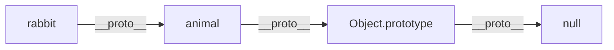

# Objects & Prototypes

JavaScript is an **object-oriented language**, but it uses **prototypal inheritance** instead of classical inheritance (like Java). Understanding objects and prototypes is essential for mastering JavaScript.

---

## 1. Objects

An object is a collection of **key-value pairs**. Keys are strings (or Symbols), values can be anything.

### Creating Objects

```javascript
// Object literal (most common)
const person = {
    name: 'Alice',
    age: 25,
    greet() {
        return `Hello, I'm ${this.name}`;
    }
};

// Accessing properties
person.name;       // 'Alice' (dot notation)
person['age'];     // 25 (bracket notation)
person.greet();    // "Hello, I'm Alice"

// Adding/modifying properties
person.email = 'alice@example.com';
person.age = 26;

// Deleting properties
delete person.email;
```

### Computed Property Names (ES6)
```javascript
const key = 'dynamicKey';
const obj = {
    [key]: 'value',
    [`prefix_${key}`]: 'another value'
};
// { dynamicKey: 'value', prefix_dynamicKey: 'another value' }
```

### Shorthand Properties (ES6)
```javascript
const name = 'Alice';
const age = 25;

// Old way
const person = { name: name, age: age };

// Shorthand
const person = { name, age };
```

---

## 2. The `this` Keyword

`this` is one of the most confusing parts of JavaScript. Its value depends on **how a function is called**, not where it's defined.

### Rules for `this`

| Call Type | `this` Value |
| :--- | :--- |
| Method call (`obj.fn()`) | The object before the dot |
| Simple call (`fn()`) | `undefined` (strict) or `window` (sloppy) |
| Arrow function | Inherits from enclosing scope |
| Constructor (`new Fn()`) | The newly created object |
| `call`/`apply`/`bind` | Explicitly set |

### Examples

```javascript
const person = {
    name: 'Alice',
    greet() {
        console.log(`Hello, ${this.name}`);
    }
};

person.greet(); // 'Hello, Alice' — this = person

const greet = person.greet;
greet(); // 'Hello, undefined' — this is lost!
```

### Arrow Functions & `this`

Arrow functions **don't have their own `this`**. They inherit `this` from the enclosing scope.

```javascript
const person = {
    name: 'Alice',
    friends: ['Bob', 'Charlie'],
    
    // Regular function: this = person
    listFriends() {
        // Arrow function: this = inherited from listFriends
        this.friends.forEach(friend => {
            console.log(`${this.name} knows ${friend}`);
        });
    }
};

person.listFriends();
// 'Alice knows Bob'
// 'Alice knows Charlie'
```

### Binding `this`

```javascript
const person = { name: 'Alice' };

function greet() {
    console.log(`Hello, ${this.name}`);
}

// call: invoke immediately with this
greet.call(person); // 'Hello, Alice'

// apply: same as call, but args as array
greet.apply(person, []);

// bind: return a new function with this bound
const boundGreet = greet.bind(person);
boundGreet(); // 'Hello, Alice'
```

---

## 3. Prototypes

Every JavaScript object has a hidden property called `[[Prototype]]` (accessible via `__proto__` or `Object.getPrototypeOf()`). When you access a property, JavaScript looks up the **prototype chain**.

```javascript
const animal = {
    eats: true,
    walk() {
        console.log('Walking...');
    }
};

const rabbit = {
    jumps: true,
    __proto__: animal // Set prototype (not recommended in production)
};

rabbit.jumps; // true (own property)
rabbit.eats;  // true (inherited from animal)
rabbit.walk(); // 'Walking...' (inherited method)
```

### The Prototype Chain



When accessing `rabbit.toString()`:
1. Check `rabbit` → Not found
2. Check `animal` → Not found
3. Check `Object.prototype` → Found!

### `Object.create()`

The proper way to create an object with a specific prototype.

```javascript
const animal = {
    eats: true
};

const rabbit = Object.create(animal);
rabbit.jumps = true;

Object.getPrototypeOf(rabbit) === animal; // true
```

---

## 4. Constructor Functions

Before ES6 classes, constructor functions were the standard way to create objects with shared behavior.

```javascript
function Person(name, age) {
    // 'this' refers to the new object being created
    this.name = name;
    this.age = age;
}

// Methods on the prototype (shared, memory efficient)
Person.prototype.greet = function() {
    return `Hello, I'm ${this.name}`;
};

const alice = new Person('Alice', 25);
const bob = new Person('Bob', 30);

alice.greet(); // "Hello, I'm Alice"
bob.greet();   // "Hello, I'm Bob"

// Both share the same greet function
alice.greet === bob.greet; // true
```

### The `new` Keyword

When you call `new Person()`:
1. Creates a new empty object `{}`
2. Sets the prototype to `Person.prototype`
3. Binds `this` to the new object
4. Executes the constructor
5. Returns the object (unless constructor returns an object)

---

## 5. ES6 Classes

Classes are **syntactic sugar** over constructor functions and prototypes. They don't introduce a new OOP model.

```javascript
class Person {
    // Constructor
    constructor(name, age) {
        this.name = name;
        this.age = age;
    }
    
    // Instance method (on prototype)
    greet() {
        return `Hello, I'm ${this.name}`;
    }
    
    // Static method (on class itself)
    static species() {
        return 'Homo sapiens';
    }
    
    // Getter
    get birthYear() {
        return new Date().getFullYear() - this.age;
    }
    
    // Setter
    set birthYear(year) {
        this.age = new Date().getFullYear() - year;
    }
}

const alice = new Person('Alice', 25);
alice.greet();        // "Hello, I'm Alice"
Person.species();     // 'Homo sapiens'
alice.birthYear;      // 2000 (calculated)
```

### Inheritance with `extends`

```javascript
class Animal {
    constructor(name) {
        this.name = name;
    }
    
    speak() {
        console.log(`${this.name} makes a sound`);
    }
}

class Dog extends Animal {
    constructor(name, breed) {
        super(name); // Call parent constructor
        this.breed = breed;
    }
    
    speak() {
        console.log(`${this.name} barks`);
    }
}

const rex = new Dog('Rex', 'German Shepherd');
rex.speak(); // 'Rex barks'
rex instanceof Dog;    // true
rex instanceof Animal; // true
```

### Private Fields (ES2022)

```javascript
class BankAccount {
    #balance = 0; // Private field
    
    deposit(amount) {
        this.#balance += amount;
    }
    
    getBalance() {
        return this.#balance;
    }
}

const account = new BankAccount();
account.deposit(100);
account.getBalance(); // 100
account.#balance;     // ❌ SyntaxError: Private field
```

---

## 6. Object Methods

### Object.keys/values/entries
```javascript
const person = { name: 'Alice', age: 25 };

Object.keys(person);    // ['name', 'age']
Object.values(person);  // ['Alice', 25]
Object.entries(person); // [['name', 'Alice'], ['age', 25]]
```

### Object.assign & Spread
```javascript
// Shallow copy / merge
const defaults = { theme: 'dark', lang: 'en' };
const userPrefs = { theme: 'light' };

const settings = Object.assign({}, defaults, userPrefs);
// { theme: 'light', lang: 'en' }

// Spread operator (ES2018)
const settings = { ...defaults, ...userPrefs };
```

### Object.freeze & Object.seal
```javascript
const frozen = Object.freeze({ x: 1 });
frozen.x = 2;     // Silently fails (or error in strict mode)
frozen.y = 3;     // Silently fails

const sealed = Object.seal({ x: 1 });
sealed.x = 2;     // ✅ Works (can modify)
sealed.y = 3;     // ❌ Fails (can't add)
```

---

## Summary

- **Objects**: Key-value pairs. Use dot or bracket notation.
- **`this`**: Depends on how a function is called. Arrow functions inherit `this`.
- **Prototypes**: Objects inherit from other objects via the prototype chain.
- **Classes**: Syntactic sugar over prototypes. Use `extends` for inheritance.
- **Private Fields**: Use `#` prefix for true encapsulation (ES2022).

Next, we'll dive into **Async JavaScript**, understanding callbacks, Promises, and async/await.
