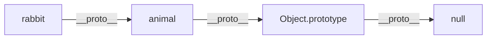

# Objects & Prototypes

JavaScript is an **object-oriented language**, but it uses **prototypal inheritance** instead of classical inheritance (like Java or C++). Understanding objects and prototypes is essential for mastering JavaScript.

In most languages you learn, objects are created from classes -- you define a blueprint, then stamp out instances. JavaScript flips this on its head. Here, objects inherit directly from other objects. Think of it like learning a skill from a mentor rather than reading a textbook: there is no abstract blueprint, just a real existing object that a new object can look to for guidance. When the new object cannot find a property on itself, it asks its mentor (prototype). If the mentor does not have it either, the mentor asks *its* mentor, all the way up the chain. This is prototypal inheritance, and once you internalize it, the entire language makes more sense.

---

## 1. Objects

An object is a collection of **key-value pairs**. Keys are strings (or Symbols), values can be anything.

### Creating Objects

```javascript
// Object literal (most common)
const person = {
    name: 'Alice',
    age: 25,
    greet() {
        return `Hello, I'm ${this.name}`;
    }
};

// Accessing properties
person.name;       // 'Alice' (dot notation)
person['age'];     // 25 (bracket notation)
person.greet();    // "Hello, I'm Alice"

// Adding/modifying properties
person.email = 'alice@example.com';
person.age = 26;

// Deleting properties
delete person.email;
```

### Computed Property Names (ES6)
```javascript
const key = 'dynamicKey';
const obj = {
    [key]: 'value',
    [`prefix_${key}`]: 'another value'
};
// { dynamicKey: 'value', prefix_dynamicKey: 'another value' }
```

### Shorthand Properties (ES6)
```javascript
const name = 'Alice';
const age = 25;

// Old way
const person = { name: name, age: age };

// Shorthand
const person = { name, age };
```

---

## 2. The `this` Keyword

`this` is one of the most confusing parts of JavaScript. Its value depends on **how a function is called**, not where it is defined.

Here is the mental model that makes `this` predictable: **look at the call site, not the function definition.** When you see `obj.fn()`, the dot before `fn` tells you `this` is `obj`. When you see `fn()` with no dot, there is no object, so `this` falls back to `undefined` (in strict mode) or `window` (in sloppy mode). Every time you are confused about `this`, find the call site and ask: "What is to the left of the dot?"

### Rules for `this` (in priority order)

| Call Type | `this` Value | Example |
| :--- | :--- | :--- |
| `new Fn()` | The newly created object | `new Person('Alice')` |
| `call`/`apply`/`bind` | Explicitly set | `fn.call(obj)` |
| Method call (`obj.fn()`) | The object before the dot | `person.greet()` |
| Simple call (`fn()`) | `undefined` (strict) or `window` (sloppy) | `greet()` |
| Arrow function | Inherits from enclosing scope (always) | `() => this.name` |

### Examples

```javascript
const person = {
    name: 'Alice',
    greet() {
        console.log(`Hello, ${this.name}`);
    }
};

person.greet(); // 'Hello, Alice' -- this = person (look left of the dot)

const greet = person.greet; // Detach the function from the object
greet(); // 'Hello, undefined' -- this is lost! No dot, no object.
// This is the #1 source of "this" bugs in JavaScript.
```

### Arrow Functions and `this`

Arrow functions **do not have their own `this`**. They capture `this` from the enclosing scope at the time they are *defined*, not called. This is what makes them ideal for callbacks inside methods.

```javascript
const person = {
    name: 'Alice',
    friends: ['Bob', 'Charlie'],
    
    // Regular function method: this = person (because person.listFriends())
    listFriends() {
        // Arrow function callback: this = inherited from listFriends (which is person)
        this.friends.forEach(friend => {
            console.log(`${this.name} knows ${friend}`);
        });
        
        // If we used a regular function here instead, this would be undefined:
        // this.friends.forEach(function(friend) {
        //     console.log(`${this.name} knows ${friend}`); // this.name = undefined!
        // });
    }
};

person.listFriends();
// 'Alice knows Bob'
// 'Alice knows Charlie'
```

<Warning>
  **Do not use arrow functions as object methods.** Since arrow functions capture `this` from the enclosing scope, `this` inside an arrow method points to whatever `this` was *outside the object literal* -- usually `window` or `undefined`. Use regular method shorthand (`greet() {}`) for object methods, and arrow functions for callbacks inside those methods.
</Warning>

### Binding `this`

When you need to control `this` explicitly, JavaScript gives you three tools. Think of them as three ways to hand a function its "context badge" -- telling it who it should report to.

```javascript
const person = { name: 'Alice' };

function greet(greeting) {
    console.log(`${greeting}, ${this.name}`);
}

// call: invoke immediately, pass args individually
greet.call(person, 'Hello');  // 'Hello, Alice'

// apply: invoke immediately, pass args as an array
// (useful when you have arguments in an array already)
greet.apply(person, ['Hi']); // 'Hi, Alice'

// bind: return a NEW function with this permanently bound
// The original function is not modified
const boundGreet = greet.bind(person);
boundGreet('Hey'); // 'Hey, Alice'

// Practical use: fixing "this" when passing methods as callbacks
const button = document.querySelector('button');
button.addEventListener('click', person.greet);         // this = button (wrong!)
button.addEventListener('click', person.greet.bind(person)); // this = person (correct)
```

### call vs apply vs bind -- Complete Comparison

| Method | Invokes immediately? | Arguments | Returns | Use when |
| :--- | :--- | :--- | :--- | :--- |
| `fn.call(thisArg, a, b, c)` | Yes | Listed individually | Function's return value | You know the arguments at call time |
| `fn.apply(thisArg, [a, b, c])` | Yes | As an array | Function's return value | Arguments are already in an array |
| `fn.bind(thisArg, a, b)` | No | Partially applied (optional) | A new function | You need a reusable bound function (event handlers, callbacks) |

```javascript
// Edge case: bind creates a permanently bound function -- it cannot be re-bound
const bound = greet.bind(person);
const reBound = bound.bind(otherPerson); // DOES NOTHING -- still bound to person
bound.call(otherPerson, 'Hey');          // DOES NOTHING -- still uses person as this

// Edge case: bind supports partial application (currying)
function multiply(a, b) { return a * b; }
const double = multiply.bind(null, 2);  // Pre-fill first argument
double(5);  // 10
double(10); // 20

// With spread, apply is less needed than it used to be:
const args = [1, 2, 3];
Math.max.apply(null, args);  // Old way
Math.max(...args);           // Modern way -- cleaner
```

### `this` Decision Guide

When you are confused about what `this` is, check these rules in order (first match wins):

1. **`new` keyword?** -- `this` is the newly created object.
2. **`call`/`apply`/`bind`?** -- `this` is whatever you passed as the first argument.
3. **Method call (`obj.fn()`)?** -- `this` is the object to the left of the dot.
4. **Arrow function?** -- `this` is whatever `this` was in the enclosing scope when the arrow was defined.
5. **Plain function call (`fn()`)?** -- `this` is `undefined` (strict mode) or `window`/`globalThis` (sloppy mode).

```javascript
// Edge case: this in nested functions
const team = {
    name: 'Engineering',
    members: ['Alice', 'Bob'],
    list() {
        // 'this' here is 'team' (method call rule)
        this.members.forEach(function(member) {
            // 'this' here is undefined (strict) or window (sloppy)
            // because this is a plain function call, not a method call
            console.log(this.name);  // undefined, not 'Engineering'
        });
    },
    listFixed() {
        // Fix: arrow function inherits 'this' from listFixed
        this.members.forEach((member) => {
            console.log(this.name);  // 'Engineering' (correct)
        });
    }
};

// Edge case: this in a callback passed to setTimeout
class Timer {
    constructor() { this.seconds = 0; }
    start() {
        // BUG: regular function loses 'this'
        setInterval(function() { this.seconds++; }, 1000); // this = window

        // FIX: arrow function inherits 'this' from start()
        setInterval(() => { this.seconds++; }, 1000); // this = Timer instance
    }
}
```

---

## 3. Prototypes

Every JavaScript object has a hidden property called `[[Prototype]]` (accessible via `__proto__` or `Object.getPrototypeOf()`). When you access a property, JavaScript looks up the **prototype chain**.

Think of the prototype chain like a family tree of knowledge. When you (the object) need to answer a question (access a property), you first check if you know the answer yourself. If not, you ask your parent. If they do not know either, they ask their parent, all the way up to the root ancestor (`Object.prototype`). If nobody in the chain knows, the answer is `undefined`.

```javascript
const animal = {
    eats: true,
    walk() {
        console.log('Walking...');
    }
};

const rabbit = {
    jumps: true,
    __proto__: animal // Set prototype (not recommended in production -- use Object.create)
};

rabbit.jumps;  // true (own property -- found on rabbit itself)
rabbit.eats;   // true (inherited -- not on rabbit, found on animal)
rabbit.walk(); // 'Walking...' (inherited method -- found on animal)
```

### The Prototype Chain


```mermaid
graph LR
    A[rabbit] -->|__proto__| B[animal]
    B -->|__proto__| C[Object.prototype]
    C -->|__proto__| D[null]
```

When accessing `rabbit.toString()`:
1. Check `rabbit` -- Not found
2. Check `animal` -- Not found
3. Check `Object.prototype` -- Found! (this is why every object has `toString()`)

### `Object.create()`

The proper way to create an object with a specific prototype.

```javascript
const animal = {
    eats: true
};

const rabbit = Object.create(animal);
rabbit.jumps = true;

Object.getPrototypeOf(rabbit) === animal; // true
```

---

## 4. Constructor Functions

Before ES6 classes, constructor functions were the standard way to create objects with shared behavior.

```javascript
function Person(name, age) {
    // 'this' refers to the new object being created
    this.name = name;
    this.age = age;
}

// Methods on the prototype (shared, memory efficient)
Person.prototype.greet = function() {
    return `Hello, I'm ${this.name}`;
};

const alice = new Person('Alice', 25);
const bob = new Person('Bob', 30);

alice.greet(); // "Hello, I'm Alice"
bob.greet();   // "Hello, I'm Bob"

// Both share the same greet function
alice.greet === bob.greet; // true
```

### The `new` Keyword

When you call `new Person()`, JavaScript does five things behind the scenes:
1. Creates a new empty object `{}`
2. Sets the new object's `[[Prototype]]` to `Person.prototype`
3. Binds `this` inside the constructor to the new object
4. Executes the constructor function body
5. Returns the new object (unless the constructor explicitly returns a different object)

<Warning>
  **Forgetting `new` is a silent bug.** If you call `Person('Alice', 25)` without `new`, `this` will be `undefined` (strict mode) or `window` (sloppy mode), and the constructor will either throw an error or silently attach properties to the global object. ES6 classes fix this by throwing a `TypeError` if you call them without `new`.
</Warning>

---

## 5. ES6 Classes

Classes are **syntactic sugar** over constructor functions and prototypes. They do not introduce a new OOP model -- under the hood, a `class` declaration creates a constructor function with methods on its `.prototype`, exactly like the manual approach above. The benefit is cleaner syntax and built-in guardrails (like requiring `new`).

```javascript
class Person {
    // Constructor
    constructor(name, age) {
        this.name = name;
        this.age = age;
    }
    
    // Instance method (on prototype)
    greet() {
        return `Hello, I'm ${this.name}`;
    }
    
    // Static method (on class itself)
    static species() {
        return 'Homo sapiens';
    }
    
    // Getter
    get birthYear() {
        return new Date().getFullYear() - this.age;
    }
    
    // Setter
    set birthYear(year) {
        this.age = new Date().getFullYear() - year;
    }
}

const alice = new Person('Alice', 25);
alice.greet();        // "Hello, I'm Alice"
Person.species();     // 'Homo sapiens'
alice.birthYear;      // 2000 (calculated)
```

### Inheritance with `extends`

```javascript
class Animal {
    constructor(name) {
        this.name = name;
    }
    
    speak() {
        console.log(`${this.name} makes a sound`);
    }
}

class Dog extends Animal {
    constructor(name, breed) {
        super(name); // Call parent constructor
        this.breed = breed;
    }
    
    speak() {
        console.log(`${this.name} barks`);
    }
}

const rex = new Dog('Rex', 'German Shepherd');
rex.speak(); // 'Rex barks'
rex instanceof Dog;    // true
rex instanceof Animal; // true
```

### Private Fields (ES2022)

```javascript
class BankAccount {
    #balance = 0; // Private field
    
    deposit(amount) {
        this.#balance += amount;
    }
    
    getBalance() {
        return this.#balance;
    }
}

const account = new BankAccount();
account.deposit(100);
account.getBalance(); // 100
account.#balance;     // SyntaxError: Private field
```

### Object Creation Patterns -- When to Use Which

| Pattern | Syntax | Inheritance | Private state | `new` required | Use when |
| :--- | :--- | :--- | :--- | :--- | :--- |
| Object literal | `{ key: val }` | No (unless `__proto__`) | No (closure trick needed) | No | One-off objects, config, data |
| `Object.create(proto)` | `Object.create(animal)` | Yes (sets prototype directly) | No | No | Prototypal delegation, dictionary objects |
| Constructor function | `function Foo() {}` | Yes (via `.prototype`) | Closure-based only | Yes | Legacy code, pre-ES6 patterns |
| ES6 Class | `class Foo {}` | Yes (via `extends`) | Yes (`#field`) | Yes (enforced) | Modern code -- the default choice |
| Factory function | `function create() { return {} }` | Optional (compose as needed) | Yes (closures) | No | When you want composition over inheritance |

**Decision guide:**
- **Simple data objects** (API responses, config): Object literals. No ceremony needed.
- **Shared behavior via inheritance**: ES6 classes. Cleanest syntax, enforces `new`, supports `#private`.
- **Composition over inheritance**: Factory functions. Avoid class hierarchies; compose behavior from small functions.
- **Delegation without constructors**: `Object.create()`. Useful for dictionary-like objects (`Object.create(null)` creates an object with no prototype -- no `toString`, no `hasOwnProperty`, nothing inherited).

```javascript
// Object.create(null) -- the "pure dictionary" pattern
const cache = Object.create(null);
cache.toString = 'a value';  // Safe! No conflict with Object.prototype.toString
// In a regular object, 'toString' would shadow the inherited method.
// Libraries like Express use this for URL parameter objects.

// hasOwnProperty edge case -- why Object.hasOwn() was introduced
const user = { hasOwnProperty: 'oops' };
user.hasOwnProperty('name');         // TypeError: not a function!
Object.hasOwn(user, 'name');         // false (safe -- ES2022)
Object.prototype.hasOwnProperty.call(user, 'name'); // false (safe -- old way)
```

---

## 6. Object Methods

### Object.keys/values/entries
```javascript
const person = { name: 'Alice', age: 25 };

Object.keys(person);    // ['name', 'age']
Object.values(person);  // ['Alice', 25]
Object.entries(person); // [['name', 'Alice'], ['age', 25]]
```

### Object.assign and Spread
```javascript
// Shallow copy / merge -- later sources override earlier ones
const defaults = { theme: 'dark', lang: 'en' };
const userPrefs = { theme: 'light' };

const settings = Object.assign({}, defaults, userPrefs);
// { theme: 'light', lang: 'en' }

// Spread operator (ES2018) -- same result, cleaner syntax
const settings2 = { ...defaults, ...userPrefs };
```

<Warning>
  **Both `Object.assign` and spread create SHALLOW copies.** Nested objects are shared by reference, not cloned. If you modify a nested object in the copy, the original changes too. For deep copies, use `structuredClone(obj)` (available in modern browsers and Node 17+) or a library.
</Warning>

```javascript
const original = { user: { name: 'Alice' } };
const copy = { ...original };
copy.user.name = 'Bob';
console.log(original.user.name); // 'Bob' -- the nested object was shared!

// Fix: use structuredClone for deep copies
const deepCopy = structuredClone(original);
```

### Copying Objects -- When to Use Which Method

| Method | Depth | Handles circular refs? | Handles functions? | Handles Dates/RegExp? | Speed |
| :--- | :--- | :--- | :--- | :--- | :--- |
| `{ ...obj }` (spread) | Shallow | N/A | Yes (copies reference) | No (copies reference) | Fastest |
| `Object.assign({}, obj)` | Shallow | N/A | Yes (copies reference) | No (copies reference) | Fast |
| `structuredClone(obj)` | Deep | Yes | No (throws) | Yes (properly clones) | Medium |
| `JSON.parse(JSON.stringify(obj))` | Deep | No (throws) | No (drops them) | No (Dates become strings) | Slow |

**Decision guide:**
- **Flat object, no nesting**: Use spread `{ ...obj }`. Simplest and fastest.
- **Nested objects, no functions**: Use `structuredClone()`. Correct deep copy with circular reference support.
- **Nested objects with functions**: No built-in solution. Use a library like Lodash `_.cloneDeep()`, or write a custom recursive clone.
- **Never use `JSON.parse(JSON.stringify())` in production**: It silently drops functions, converts Dates to strings, loses `undefined` properties, and throws on circular references. It is only acceptable as a quick hack in debugging.

```javascript
// structuredClone edge cases:
structuredClone({ fn: () => {} });  // ERROR: DataCloneError (cannot clone functions)
structuredClone({ el: document.body }); // ERROR: cannot clone DOM nodes
structuredClone(new Map([['a', 1]]));   // Works -- properly clones Maps and Sets

// JSON.parse/stringify edge cases:
JSON.parse(JSON.stringify({
    date: new Date(),          // Becomes a string: "2025-01-15T..."
    undef: undefined,          // Property is DROPPED entirely
    fn: function() {},         // Property is DROPPED entirely
    nan: NaN,                  // Becomes null
    infinity: Infinity,        // Becomes null
    regex: /pattern/g          // Becomes empty object {}
}));
```

### Object.freeze and Object.seal

| Operation | `Object.freeze` | `Object.seal` | Normal object |
| :--- | :--- | :--- | :--- |
| Modify existing properties | No | Yes | Yes |
| Add new properties | No | No | Yes |
| Delete properties | No | No | Yes |
| Reconfigure properties | No | No | Yes |
| Depth | Shallow only | Shallow only | N/A |

```javascript
const frozen = Object.freeze({ x: 1 });
frozen.x = 2;     // Silently fails (or throws in strict mode)
frozen.y = 3;     // Silently fails

const sealed = Object.seal({ x: 1 });
sealed.x = 2;     // Works (can modify existing properties)
sealed.y = 3;     // Fails (cannot add new properties)

// GOTCHA: freeze is SHALLOW -- nested objects are NOT frozen
const config = Object.freeze({ db: { host: 'localhost' } });
config.db.host = 'production'; // This works! The nested object is not frozen.

// Deep freeze utility (use when you need truly immutable config):
function deepFreeze(obj) {
    Object.freeze(obj);
    Object.values(obj).forEach(val => {
        if (typeof val === 'object' && val !== null && !Object.isFrozen(val)) {
            deepFreeze(val);
        }
    });
    return obj;
}
```

---

## Summary

- **Objects**: Key-value pairs. Use dot or bracket notation.
- **`this`**: Depends on how a function is called. Arrow functions inherit `this`.
- **Prototypes**: Objects inherit from other objects via the prototype chain.
- **Classes**: Syntactic sugar over prototypes. Use `extends` for inheritance.
- **Private Fields**: Use `#` prefix for true encapsulation (ES2022).

Next, we'll dive into **Async JavaScript**, understanding callbacks, Promises, and async/await.

---

## Interview Deep-Dive

<AccordionGroup>
  <Accordion title="Explain prototypal inheritance to me. How is it fundamentally different from classical inheritance in Java or C++?">
    **Strong Answer:**

    - In classical inheritance (Java, C++), you define a class (a blueprint), and objects are instances stamped from that blueprint. The class hierarchy is static -- defined at compile time. A `Dog extends Animal` relationship is baked into the type system.
    - In prototypal inheritance, there are no classes at the fundamental level (ES6 `class` is syntactic sugar). Objects inherit directly from other objects. Every object has an internal `[[Prototype]]` link pointing to another object. When you access a property on an object and it is not found, the engine walks up the prototype chain -- checking the prototype, then the prototype's prototype -- until it finds the property or reaches `null`.
    - The key practical difference: prototypal inheritance is dynamic. You can modify a prototype at runtime and all objects that inherit from it immediately see the change. In classical inheritance, adding a method to a base class after compilation requires recompilation. In JavaScript, `Animal.prototype.breathe = function() {}` instantly gives every existing animal instance the `breathe` method. This is powerful but dangerous -- monkey-patching built-in prototypes (like `Array.prototype`) is how libraries historically caused conflicts.
    - Another difference: prototypal inheritance naturally supports "mixins" and composition. You can copy methods from multiple source objects onto a single target using `Object.assign(target.prototype, mixin1, mixin2)`. Classical inheritance typically supports single inheritance, requiring interfaces or abstract classes for multiple behavior contracts.
    - Real-world implication: when you write `class Dog extends Animal` in JavaScript, behind the scenes, `Dog.prototype.__proto__ === Animal.prototype` is `true`. The `extends` keyword sets up the prototype chain. The `super` keyword navigates it. Understanding this means you can debug inheritance bugs by inspecting the actual prototype chain with `Object.getPrototypeOf()` instead of guessing at class hierarchies.

    **Follow-up: If I modify Object.prototype, what happens to every object in the application?**

    Every object in JavaScript (except those created with `Object.create(null)`) has `Object.prototype` at the top of its prototype chain. If you add `Object.prototype.hack = true`, then `{}.hack`, `[].hack`, `new Date().hack`, and even `(function(){}).hack` all return `true`. This is why modifying `Object.prototype` is considered one of the most dangerous things you can do in JavaScript. It also breaks `for...in` loops (the new property becomes enumerable and shows up in every loop) unless you use `Object.defineProperty` with `enumerable: false`. Libraries like Prototype.js (early 2000s) did this aggressively and caused conflicts with every other library. Modern best practice: never modify built-in prototypes except for polyfills in specific, controlled environments.
  </Accordion>

  <Accordion title="Explain the 'this' keyword. Give me a scenario where a senior engineer would get tripped up by it.">
    **Strong Answer:**

    - `this` in JavaScript is not determined by where a function is written, but by how it is called (the call site). The four rules, in priority order: (1) `new` binding -- `this` is the newly created object. (2) Explicit binding -- `call`, `apply`, `bind` set `this` directly. (3) Implicit binding -- `obj.fn()` sets `this` to `obj`. (4) Default binding -- standalone `fn()` gets `this = undefined` in strict mode, or `window`/`globalThis` in sloppy mode. Arrow functions are the exception: they have no `this` of their own and inherit it lexically from the enclosing scope.
    - Senior engineer trap: destructuring a method from an object. Consider: `const { greet } = person; greet();`. This looks clean and is common in modern JavaScript. But it detaches `greet` from `person`, so `this` inside `greet` is no longer `person`. It is `undefined` (strict mode). This happens constantly in React class components: `onClick={this.handleClick}` passes the method as a bare function reference, losing `this`. The fix is `.bind(this)` in the constructor or using arrow function class fields.
    - Another senior trap: passing a method to `setTimeout` or `setInterval`. `setTimeout(person.greet, 1000)` does not call `person.greet()` -- it stores the function reference and calls it later as a bare function. Same `this` loss. Same fix: `.bind(person)` or wrap in an arrow function `() => person.greet()`.
    - The deepest gotcha: `this` in a nested function inside a method. Even if the outer method has the correct `this`, a regular function defined inside it gets its own `this` (default binding). This is why the `const self = this` pattern existed before arrow functions, and why arrow functions are now the standard for callbacks inside methods.

    **Follow-up: What happens to `this` when you bind a function twice? Does the second bind override the first?**

    No. `bind` creates a new function with a permanently fixed `this`. Calling `.bind()` again on an already-bound function wraps it in another layer but does NOT override the original binding. `const bound1 = fn.bind(objA); const bound2 = bound1.bind(objB); bound2()` -- `this` inside `fn` is still `objA`, not `objB`. The second `bind` creates a wrapper that calls `bound1` with `objB` as `this`, but `bound1` ignores that because it is already hard-bound to `objA`. This is specified in the ECMAScript spec: a bound function's `[[BoundThis]]` cannot be overridden by another `bind`. The only exception: `new` can override a `bind` -- `new bound1()` creates a new object for `this`, ignoring the bound `objA`.
  </Accordion>

  <Accordion title="What does Object.create(null) do, and why would you use it?">
    **Strong Answer:**

    - `Object.create(null)` creates an object with absolutely no prototype. Its `[[Prototype]]` is `null`, not `Object.prototype`. This means it has no inherited properties at all: no `toString`, no `hasOwnProperty`, no `constructor`, no `__proto__` getter/setter. It is a truly blank dictionary.
    - The primary use case is creating a "clean" hash map. When you use a plain object `{}` as a dictionary, keys like `toString`, `constructor`, `__proto__`, and `hasOwnProperty` are already "occupied" by inherited properties. If a user-provided key happens to be `"constructor"` or `"__proto__"`, you get subtle bugs or even security vulnerabilities (`__proto__` pollution attacks). `Object.create(null)` eliminates this entire class of bugs.
    - Real-world usage: Express.js and many routing libraries internally use `Object.create(null)` for route lookup tables. V8 also optimizes `Object.create(null)` objects as "dictionary mode" objects, which can be faster for highly dynamic key access patterns (frequent additions/deletions) compared to regular objects which V8 tries to optimize with hidden classes.
    - The trade-off: you lose all `Object.prototype` methods. `obj.hasOwnProperty("key")` throws because `hasOwnProperty` does not exist on the object. You must use `Object.hasOwn(obj, "key")` (ES2022) or `Object.prototype.hasOwnProperty.call(obj, "key")`. You also cannot use `obj.toString()` -- you must handle serialization explicitly.
    - Since ES6, `Map` is generally the better choice for dynamic key-value lookups because it handles any key type, has no prototype pollution risk, and provides `.size`, iteration, and better performance for frequent add/delete operations. `Object.create(null)` is still useful when you need an object (for JSON serialization, for example) but want prototype safety.

    **Follow-up: What is prototype pollution, and how does it become a security vulnerability?**

    Prototype pollution is when an attacker injects properties into `Object.prototype` (or another prototype) through user-controlled input. The classic vector: a deep merge function that recursively copies properties from untrusted JSON into an object. If the attacker sends `{"__proto__": {"isAdmin": true}}`, a naive merge copies `isAdmin` onto `Object.prototype`. Now every object in the application has `isAdmin === true`, potentially bypassing authorization checks. Real CVEs have been filed against lodash's `_.merge`, jQuery's `$.extend`, and many other libraries for exactly this vulnerability. Mitigations: (1) never allow `__proto__`, `constructor`, or `prototype` as keys in user input, (2) use `Object.create(null)` for lookup tables, (3) use `Map` instead of plain objects for user-controlled keys, (4) freeze prototypes in security-critical code, (5) validate and sanitize all deeply-merged input.
  </Accordion>

  <Accordion title="ES6 classes are 'syntactic sugar over prototypes.' Prove it. What do classes compile to under the hood?">
    **Strong Answer:**

    - When you write `class Person { constructor(name) { this.name = name; } greet() { return this.name; } }`, the engine creates: (1) a constructor function `Person` whose body is the `constructor` method, (2) `Person.prototype.greet = function() { return this.name; }` -- methods are placed on the prototype, not on each instance. (3) `Person.prototype.constructor = Person` -- the circular reference that constructors have by convention.
    - You can verify: `typeof Person` is `"function"`. `Person.prototype.greet` exists. `new Person("Alice").__proto__ === Person.prototype` is `true`. All of this is identical to the pre-class constructor function pattern.
    - The differences (not just sugar): (1) Classes enforce `new` -- calling `Person("Alice")` without `new` throws `TypeError`. Constructor functions silently bind `this` to `window`/`undefined`. (2) Class methods are non-enumerable by default (`Object.keys(Person.prototype)` returns `[]`). Constructor function prototype methods are enumerable. (3) Class bodies are always in strict mode, even without `"use strict"`. (4) Classes are not hoisted in the same way -- they have a TDZ like `let`/`const`. (5) `extends` properly sets up the prototype chain including the constructor's own prototype (`Dog.__proto__ === Animal`), enabling `static` method inheritance.
    - The `extends` keyword does two things: `Dog.prototype.__proto__ = Animal.prototype` (instance method inheritance) and `Dog.__proto__ = Animal` (static method inheritance). The second one is unique to classes -- pre-ES6, static method inheritance required manual setup.
    - Private fields (`#field`) are genuinely new -- they are not sugar over anything. They use a WeakMap-like internal mechanism that provides hard privacy, not the convention-based `_underscore` pattern.

    **Follow-up: Can you mix class syntax with manual prototype manipulation? What happens?**

    Yes, they are fully interoperable. After defining `class Person {}`, you can do `Person.prototype.legacyMethod = function() { return "works"; }` and `new Person().legacyMethod()` returns `"works"`. You can also do `Object.getPrototypeOf(new Person()) === Person.prototype` to inspect the chain. In practice, this interop is how polyfills and legacy code coexist with modern classes. The only caveat: if you overwrite `Person.prototype` entirely (not just add to it), you break the prototype chain for existing instances and lose the `constructor` reference. This is true for both classes and constructor functions.
  </Accordion>
</AccordionGroup>
