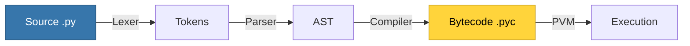

# Python Fundamentals

Python is an interpreted, high-level, dynamically typed language. It emphasizes code readability with its use of significant indentation.

---

## 1. How Python Works: Under the Hood

Unlike compiled languages (C++, Go, Rust) that produce standalone executables, Python uses a **two-stage process**: compilation to bytecode, then interpretation.

### The Python Execution Pipeline



| Stage | What Happens | Can You See It? |
|-------|-------------|-----------------|
| **Lexing** | Source code → tokens (keywords, identifiers, operators) | Internal |
| **Parsing** | Tokens → Abstract Syntax Tree (AST) | `ast.parse()` |
| **Compiling** | AST → Bytecode instructions | `dis.dis()` |
| **Interpreting** | PVM executes bytecode | Your program runs! |

### Why is Python "Interpreted"?

Python is actually **both compiled and interpreted**:

1. **Compilation** (happens automatically): Your `.py` → bytecode (`.pyc`)
2. **Interpretation**: The Python Virtual Machine (PVM) executes bytecode

```python
# You can see the bytecode!
import dis

def add(a, b):
    return a + b

dis.dis(add)
# Output:
#   2           0 LOAD_FAST                0 (a)
#               2 LOAD_FAST                1 (b)
#               4 BINARY_ADD
#               6 RETURN_VALUE
```

### The `__pycache__` Folder

When you import a module, Python saves the compiled bytecode:

```
myproject/
├── main.py
├── utils.py
└── __pycache__/
    └── utils.cpython-311.pyc  ← Compiled bytecode
```

- `cpython-311` = CPython interpreter, Python 3.11
- Bytecode is cached for faster imports (no recompilation if source unchanged)
- **Delete safely**: Python will regenerate if needed

### CPython vs Other Implementations

| Implementation | Description | Use Case |
|---------------|-------------|----------|
| **CPython** | Reference implementation (C) | Default, most libraries |
| **PyPy** | JIT-compiled Python (faster) | Performance-critical |
| **Jython** | Python on JVM (Java bytecode) | Java integration |
| **MicroPython** | Tiny Python for microcontrollers | IoT, embedded |

<Info>
**Performance Tip**: Python is slower than compiled languages because the PVM interprets bytecode at runtime. For CPU-intensive tasks, consider:
- **NumPy/Pandas**: Uses C under the hood
- **Cython**: Compile Python to C
- **PyPy**: JIT compilation for speedups
</Info>

---

## 2. Variables & Types

Python is **dynamically typed**. You don't declare types (like `int x`), but types definitely exist.

```python
x = 10          # int
price = 19.99   # float
name = "Alice"  # str
is_active = True # bool
nothing = None  # NoneType (represents the absence of a value)
```

### Type Hints (Python 3.5+)
While Python doesn't enforce types at runtime, you can (and should) use **Type Hints**. They act as documentation and allow tools (like VS Code or `mypy`) to catch errors.

```python
age: int = 25
name: str = "Bob"

# This is valid Python code (no runtime error), but a linter will warn you.
age = "Twenty" 
```

### Mutable vs. Immutable
This is a critical concept in Python that trips up beginners.
-   **Immutable** (Cannot change): `int`, `float`, `str`, `tuple`, `bool`.
-   **Mutable** (Can change): `list`, `dict`, `set`.

```python
# Immutable
s = "hello"
# s[0] = "H" # TypeError! You cannot change a string. You must create a new one.
s = "H" + s[1:] # This creates a NEW string object.

# Mutable
l = [1, 2, 3]
l[0] = 100 # OK. The list object is modified in place.
```

---

## 3. Input & Output

```python
# Output
print("Hello", "World") # Prints "Hello World" (space separated by default)
print("Hello", "World", sep="-") # Prints "Hello-World"

# Input
# input() ALWAYS returns a string. You must convert it if you need a number.
name = input("Enter your name: ")
age_str = input("Enter your age: ")
age = int(age_str) # Convert to integer
```

### f-Strings (Python 3.6+)
The "Formatted String Literal" is the modern way to insert variables into strings. It's fast and readable.

```python
name = "Alice"
age = 30
print(f"Hello, {name}. You are {age} years old.")
```

---

## 4. Control Flow

Python uses **indentation** (whitespace) to define blocks of code. There are no curly braces `{}` or semicolons `;`.

### If-Elif-Else

```python
score = 85

if score >= 90:
    print("A")
elif score >= 80:
    print("B")
else:
    print("C")
```

### Loops

**For Loop**
Python's for loop is actually a "for-each" loop. It iterates over a sequence.

```python
# range(5) generates: 0, 1, 2, 3, 4
for i in range(5):
    print(i)

# Iterate over a list
names = ["Alice", "Bob"]
for name in names:
    print(name)

# Need the index? Use enumerate()
for i, name in enumerate(names):
    print(f"Index {i}: {name}")
```

**While Loop**
Runs as long as the condition is true.

```python
count = 0
while count < 5:
    print(count)
    count += 1
```

---

## 5. Functions

Functions are defined using `def`.

```python
# Type hints are optional but recommended
def add(a: int, b: int) -> int:
    """
    Returns the sum of two numbers.
    This is a docstring - used for documentation.
    """
    return a + b

result = add(5, 3)
```

### Default Arguments
You can provide default values for parameters.

```python
def greet(name="Guest"):
    print(f"Hello, {name}")

greet()         # Hello, Guest
greet("Alice")  # Hello, Alice
```

### *args and **kwargs
These allow functions to accept an arbitrary number of arguments.
-   `*args`: Collects positional arguments into a **Tuple**.
-   `**kwargs`: Collects keyword arguments into a **Dictionary**.

```python
def log(message, *args, **kwargs):
    print(f"MSG: {message}")
    print(f"Extra Args: {args}")
    print(f"Config: {kwargs}")

log("Error", 1, 2, user="admin", code=500)
# Output:
# MSG: Error
# Extra Args: (1, 2)
# Config: {'user': 'admin', 'code': 500}
```

---

## Summary

-   **Dynamic Typing**: Variables can change type, but Type Hints help maintain order.
-   **Indentation**: Whitespace is syntactically significant.
-   **Immutability**: Strings and numbers cannot be changed in place; lists can.
-   **f-Strings**: The best way to format text.

Next, we'll explore Python's powerful built-in **Data Structures**.
