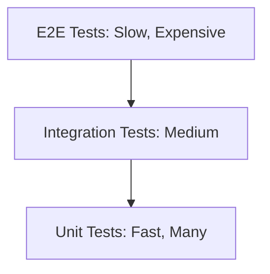

# Spring Boot Testing Mastery

Testing is what separates "demo code" from **production code**. Spring has a powerful testing framework.

## 1. The Test Pyramid



- **Unit Tests:** Test a single class in isolation. Use Mocks.
- **Integration Tests:** Test multiple components together (e.g., Controller + Service + DB).
- **E2E Tests:** Full system test (Browser automation, etc.).

## 2. Unit Testing with JUnit 5 & Mockito

No Spring context. Pure Java testing.

```java
@ExtendWith(MockitoExtension.class) // JUnit 5
class OrderServiceTest {

    @Mock
    private OrderRepository orderRepository;

    @Mock
    private PaymentClient paymentClient;

    @InjectMocks // Inject the mocks into OrderService
    private OrderService orderService;

    @Test
    void shouldCreateOrder() {
        // Given
        Order order = new Order(1L, "Product", 100.0);
        when(paymentClient.charge(100.0)).thenReturn(true);
        when(orderRepository.save(any())).thenReturn(order);

        // When
        Order result = orderService.createOrder(order);

        // Then
        assertThat(result.getId()).isEqualTo(1L);
        verify(paymentClient, times(1)).charge(100.0);
    }
}
```

**Key Tools:**
- `@Mock`: Create a mock object.
- `when(...).thenReturn(...)`: Define mock behavior.
- `verify(...)`: Assert that a method was called.
- **AssertJ** (`assertThat`): Fluent assertions (better than JUnit's `assertEquals`).

## 3. Slice Testing (@WebMvcTest, @DataJpaTest)

Spring Boot provides **Test Slices** that load ONLY the relevant parts of the context.

### @WebMvcTest (Controller Layer)

```java
@WebMvcTest(UserController.class)
class UserControllerTest {

    @Autowired
    private MockMvc mockMvc; // Simulates HTTP requests

    @MockBean
    private UserService userService; // Mock the service layer

    @Test
    void shouldReturnUser() throws Exception {
        UserDto user = new UserDto(1L, "John");
        when(userService.getUser(1L)).thenReturn(user);

        mockMvc.perform(get("/users/1"))
               .andExpect(status().isOk())
               .andExpect(jsonPath("$.name").value("John"));
    }
}
```

- **`MockMvc`**: Simulates HTTP calls without starting the server.
- **`@MockBean`**: Replaces a real bean with a mock in the test context.

### @DataJpaTest (Repository Layer)

```java
@DataJpaTest
class ProductRepositoryTest {

    @Autowired
    private ProductRepository repository;

    @Autowired
    private TestEntityManager em; // JPA Test helper

    @Test
    void shouldFindByPrice() {
        Product p = new Product("Phone", 500.0);
        em.persist(p);
        em.flush();

        List<Product> found = repository.findByPriceLessThan(600.0);
        assertThat(found).hasSize(1);
    }
}
```

By default, uses an **in-memory H2 database**. Transactions are rolled back after each test.

## 4. Integration Testing (@SpringBootTest)

Loads the **full application context**. Closest to production.

```java
@SpringBootTest(webEnvironment = SpringBootTest.WebEnvironment.RANDOM_PORT)
@AutoConfigureMockMvc
class OrderIntegrationTest {

    @Autowired
    private MockMvc mockMvc;

    @Autowired
    private OrderRepository orderRepository;

    @Test
    void shouldCreateOrderEndToEnd() throws Exception {
        String json = """
            {"productName": "Laptop", "price": 1000}
        """;

        mockMvc.perform(post("/orders")
                .contentType(MediaType.APPLICATION_JSON)
                .content(json))
               .andExpect(status().isCreated());

        assertThat(orderRepository.findAll()).hasSize(1);
    }
}
```

## 5. Testcontainers (Real Databases)

H2 is convenient, but it's NOT PostgreSQL. Differences in SQL dialects can cause bugs.

**Testcontainers** spins up a **real Postgres container** via Docker.

### Dependency
```xml
<dependency>
    <groupId>org.testcontainers</groupId>
    <artifactId>postgresql</artifactId>
    <scope>test</scope>
</dependency>
```

### Usage

```java
@SpringBootTest
@Testcontainers
class OrderRepositoryTestWithPostgres {

    @Container
    static PostgreSQLContainer<?> postgres = new PostgreSQLContainer<>("postgres:15")
            .withDatabaseName("testdb")
            .withUsername("test")
            .withPassword("test");

    @DynamicPropertySource
    static void configureProperties(DynamicPropertyRegistry registry) {
        registry.add("spring.datasource.url", postgres::getJdbcUrl);
        registry.add("spring.datasource.username", postgres::getUsername);
        registry.add("spring.datasource.password", postgres::getPassword);
    }

    @Autowired
    private OrderRepository repository;

    @Test
    void testWithRealPostgres() {
        Order order = repository.save(new Order("Item", 100.0));
        assertThat(order.getId()).isNotNull();
    }
}
```

**First run is slow** (downloads Postgres image). Subsequent runs are fast (cached).

## 6. Mocking External APIs (WireMock)

If your service calls an external HTTP API, you don't want to hit the real API in tests.

```java
@SpringBootTest
@AutoConfigureWireMock(port = 0)
class PaymentClientTest {

    @Autowired
    private PaymentClient paymentClient;

    @Test
    void shouldCallPaymentAPI() {
        stubFor(post("/charge")
                .willReturn(aResponse()
                        .withStatus(200)
                        .withBody("{\"success\": true}")));

        boolean result = paymentClient.charge(100.0);
        assertThat(result).isTrue();
    }
}
```

## 7. Best Practices

1. **Don't overuse `@SpringBootTest`**: It's slow. Use slices (`@WebMvcTest`, `@DataJpaTest`) when possible.
2. **Use Testcontainers for DB tests**: H2 is good for unit tests, but integration tests should use the real DB.
3. **Test *behavior*, not implementation**: Don't test private methods.
4. **Avoid `Thread.sleep()` in tests**: Use `Awaitility` for async assertions.
