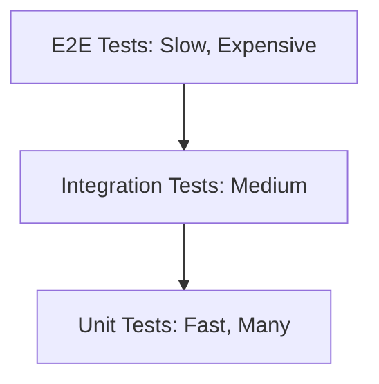

# Spring Boot Testing Mastery

Testing is what separates "demo code" from **production code**. Spring has a powerful testing framework.

**Real-world analogy:** Think of the test pyramid like quality control in car manufacturing. Unit tests are like testing individual components on a bench -- does the brake pad grip? Does the piston fire? These are fast, cheap, and you run thousands of them. Integration tests are like putting the engine, transmission, and brakes together on a test rig -- do they work as a system? Fewer of these, more expensive, but they catch wiring problems that component tests miss. E2E tests are like a full test drive on a track -- the most realistic, but also the slowest and most expensive. You run a handful, not hundreds.

## 1. The Test Pyramid



- **Unit Tests:** Test a single class in isolation. Use Mocks.
- **Integration Tests:** Test multiple components together (e.g., Controller + Service + DB).
- **E2E Tests:** Full system test (Browser automation, etc.).

## 2. Unit Testing with JUnit 5 & Mockito

No Spring context. Pure Java testing.

```java
@ExtendWith(MockitoExtension.class) // Enables Mockito annotations in JUnit 5
class OrderServiceTest {

    @Mock // Creates a fake implementation -- all methods return null/0/false by default
    private OrderRepository orderRepository;

    @Mock
    private PaymentClient paymentClient;

    @InjectMocks // Creates a real OrderService, injecting the mocks via constructor
    private OrderService orderService;

    @Test
    void shouldCreateOrder() {
        // Given -- set up test data and define mock behavior
        Order order = new Order(1L, "Product", 100.0);
        when(paymentClient.charge(100.0)).thenReturn(true);
        when(orderRepository.save(any())).thenReturn(order);

        // When -- execute the method under test
        Order result = orderService.createOrder(order);

        // Then -- verify the result AND the interactions
        assertThat(result.getId()).isEqualTo(1L);
        // verify() confirms the payment was charged exactly once.
        // This catches bugs where the service accidentally double-charges.
        verify(paymentClient, times(1)).charge(100.0);
        // Also verify the order was saved -- catches "logic works but forgot to persist" bugs
        verify(orderRepository).save(any(Order.class));
    }
}
```

**Key Tools:**
- `@Mock`: Create a mock object. All methods return default values (null, 0, false) unless you stub them.
- `when(...).thenReturn(...)`: Define mock behavior ("when this method is called, return this").
- `verify(...)`: Assert that a method was called (and how many times). Tests behavior, not just state.
- **AssertJ** (`assertThat`): Fluent assertions (better than JUnit's `assertEquals`). Reads like English: `assertThat(list).hasSize(3).contains("a", "b")`.

**Production pitfall:** Do not over-mock. If you mock everything, your test verifies your mocking setup, not your business logic. A good rule of thumb: mock external boundaries (databases, HTTP clients, message brokers) but keep your domain logic real.

## 3. Slice Testing (@WebMvcTest, @DataJpaTest)

Spring Boot provides **Test Slices** that load ONLY the relevant parts of the context.

### @WebMvcTest (Controller Layer)

`@WebMvcTest` loads ONLY the web layer: controllers, `@ControllerAdvice`, `@JsonComponent`, filters, and `WebMvcConfigurer`. No services, no repositories, no database. This is why it starts in 2-3 seconds instead of 15-30.

```java
@WebMvcTest(UserController.class) // Only loads this one controller
class UserControllerTest {

    @Autowired
    private MockMvc mockMvc; // Simulates HTTP calls in-memory (no real server, no real port)

    @MockBean // Replaces the real UserService bean in the Spring context with a Mockito mock
    private UserService userService;

    @Test
    void shouldReturnUser() throws Exception {
        UserDto user = new UserDto(1L, "John");
        when(userService.getUser(1L)).thenReturn(user);

        // MockMvc lets you test the full HTTP contract: status codes, headers, JSON paths
        mockMvc.perform(get("/users/1"))
               .andExpect(status().isOk())
               .andExpect(jsonPath("$.name").value("John"));
    }

    @Test
    void shouldReturn404WhenUserNotFound() throws Exception {
        // Test your error handling too -- not just the happy path
        when(userService.getUser(999L)).thenThrow(new UserNotFoundException(999L));

        mockMvc.perform(get("/users/999"))
               .andExpect(status().isNotFound())
               .andExpect(jsonPath("$.message").exists());
    }
}
```

- **`MockMvc`**: Simulates HTTP calls without starting a server. Tests serialization, validation, status codes, and headers.
- **`@MockBean`**: Replaces a real bean with a mock in the Spring test context. Scoped to the test class.

**Production tip -- @MockBean vs @Mock:** `@MockBean` creates the mock inside the Spring context (replaces the real bean). `@Mock` creates a standalone Mockito mock with no Spring involvement. Use `@Mock` for unit tests (no Spring context), `@MockBean` for slice/integration tests (Spring context is running).

### @DataJpaTest (Repository Layer)

```java
@DataJpaTest
class ProductRepositoryTest {

    @Autowired
    private ProductRepository repository;

    @Autowired
    private TestEntityManager em; // JPA Test helper

    @Test
    void shouldFindByPrice() {
        Product p = new Product("Phone", 500.0);
        em.persist(p);
        em.flush();

        List<Product> found = repository.findByPriceLessThan(600.0);
        assertThat(found).hasSize(1);
    }
}
```

By default, uses an **in-memory H2 database**. Transactions are rolled back after each test.

## 4. Integration Testing (@SpringBootTest)

Loads the **full application context**. Closest to production.

```java
@SpringBootTest(webEnvironment = SpringBootTest.WebEnvironment.RANDOM_PORT)
@AutoConfigureMockMvc
class OrderIntegrationTest {

    @Autowired
    private MockMvc mockMvc;

    @Autowired
    private OrderRepository orderRepository;

    @Test
    void shouldCreateOrderEndToEnd() throws Exception {
        String json = """
            {"productName": "Laptop", "price": 1000}
        """;

        mockMvc.perform(post("/orders")
                .contentType(MediaType.APPLICATION_JSON)
                .content(json))
               .andExpect(status().isCreated());

        assertThat(orderRepository.findAll()).hasSize(1);
    }
}
```

## 5. Testcontainers (Real Databases)

H2 is convenient, but it is NOT PostgreSQL. Differences in SQL dialects, JSON column handling, window functions, and constraint enforcement can cause bugs that pass H2 tests but fail in production. If your production database is Postgres, your integration tests should run against Postgres.

**Testcontainers** spins up a **real Postgres container** via Docker. Your test starts a disposable database, runs queries against it, and tears it down when done. No shared state between test runs, no "works on my machine" problems.

### Dependency
```xml
<dependency>
    <groupId>org.testcontainers</groupId>
    <artifactId>postgresql</artifactId>
    <scope>test</scope>
</dependency>
```

### Usage

```java
@SpringBootTest
@Testcontainers // JUnit 5 extension that manages container lifecycle
class OrderRepositoryTestWithPostgres {

    @Container // Start this container before tests, stop after
    static PostgreSQLContainer<?> postgres = new PostgreSQLContainer<>("postgres:15")
            .withDatabaseName("testdb")
            .withUsername("test")
            .withPassword("test");

    @DynamicPropertySource // Inject the container's random port/URL into Spring config
    static void configureProperties(DynamicPropertyRegistry registry) {
        // These override application.yml at test time -- no hardcoded ports needed
        registry.add("spring.datasource.url", postgres::getJdbcUrl);
        registry.add("spring.datasource.username", postgres::getUsername);
        registry.add("spring.datasource.password", postgres::getPassword);
    }

    @Autowired
    private OrderRepository repository;

    @Test
    void testWithRealPostgres() {
        Order order = repository.save(new Order("Item", 100.0));
        assertThat(order.getId()).isNotNull();
    }
}
```

**First run is slow** (downloads Postgres image). Subsequent runs are fast (Docker caches the image locally).

**Production tip -- Reusable containers:** Starting a fresh container per test class is reliable but slow. For large test suites, use Testcontainers' `reuse` feature or Spring Boot 3.1+'s `@ServiceConnection` annotation with a shared container:

```java
// Spring Boot 3.1+ simplified approach
@TestConfiguration(proxyBeanMethods = false)
public class TestcontainersConfig {
    @Bean
    @ServiceConnection // Auto-configures datasource from container -- no @DynamicPropertySource needed
    static PostgreSQLContainer<?> postgres() {
        return new PostgreSQLContainer<>("postgres:15");
    }
}
```

## 6. Mocking External APIs (WireMock)

If your service calls an external HTTP API, you don't want to hit the real API in tests.

```java
@SpringBootTest
@AutoConfigureWireMock(port = 0)
class PaymentClientTest {

    @Autowired
    private PaymentClient paymentClient;

    @Test
    void shouldCallPaymentAPI() {
        stubFor(post("/charge")
                .willReturn(aResponse()
                        .withStatus(200)
                        .withBody("{\"success\": true}")));

        boolean result = paymentClient.charge(100.0);
        assertThat(result).isTrue();
    }
}
```

## 7. Best Practices

1. **Don't overuse `@SpringBootTest`**: It loads the entire application context and can take 15-30 seconds to start. Use slices (`@WebMvcTest`, `@DataJpaTest`) when you only need a specific layer. Reserve `@SpringBootTest` for true end-to-end integration tests.
2. **Use Testcontainers for DB tests**: H2 is fine for unit tests that barely touch SQL, but integration tests should use the real database engine. The SQL dialect differences between H2 and PostgreSQL have caused more production bugs than most teams care to admit.
3. **Test *behavior*, not implementation**: Test what the method does (given this input, expect this output), not how it does it. Do not test private methods. If you feel compelled to, it usually means the private method should be extracted into its own class.
4. **Avoid `Thread.sleep()` in tests**: Use `Awaitility` for async assertions. It polls a condition with configurable timeout and interval instead of hoping 500ms is enough.
5. **Use `@Transactional` on test classes with caution**: Spring rolls back transactions in tests by default, which is great for isolation. But it can mask bugs -- your production code might not be `@Transactional` when it should be, and the test-level transaction hides the problem. For integration tests that verify transactional behavior, do not use `@Transactional` on the test class.
6. **Name tests descriptively**: `shouldReturn404WhenUserNotFound` tells the next developer exactly what broke. `testUser3` tells them nothing.

**A senior engineer would note:** The most valuable tests are not the ones that verify your code works today -- they are the ones that will catch regressions when someone modifies the code six months from now. Write tests that describe the contract your code promises, not the implementation details it happens to use right now.

---

## Interview Deep-Dive

<AccordionGroup>
  <Accordion title="What is the difference between @Mock, @MockBean, and @SpyBean? When would you use each, and what are the performance implications?">
    **Strong Answer:**

    - `@Mock` (Mockito): Creates a pure Mockito mock with no Spring context. Used with `@ExtendWith(MockitoExtension.class)`. All methods return null/0/false by default. Fastest option because no ApplicationContext is loaded. Use when testing a single class in isolation.
    - `@MockBean` (Spring Boot Test): Replaces a real bean in the ApplicationContext with a Mockito mock. Used in slice tests (`@WebMvcTest`, `@DataJpaTest`). Performance catch: every unique combination of `@MockBean` declarations creates a new ApplicationContext. If Test A mocks ServiceX and Test B mocks ServiceY, Spring boots a new context for each. With 200 test classes, inconsistent mocking can add 30+ minutes.
    - `@SpyBean` (Spring Boot Test): Wraps the real bean with a Mockito spy. Real implementation runs by default; specific methods can be overridden. Use when you want mostly real behavior but need to stub one method (like an external API call).
    - Strategy: create abstract base test classes per slice with standardized `@MockBean` declarations. All controller tests extend `BaseControllerTest`, sharing one cached context. This alone can cut test suite time by 60-70%.

    **Follow-up: Your @MockBean integration test passes, but the same flow fails in production. What went wrong?**

    The mock hid a real failure. Common causes: (1) The mock returns data in a format the real service does not -- mock returns non-null list, real service returns null for empty results, causing NPE. (2) Mock executes synchronously but real service is async with race conditions. (3) Mock ignores exceptions the real service throws (constraint violations, timeouts). Mocks verify your code handles happy-path data correctly; they cannot test that real integrations work. That is why you need Testcontainers and WireMock in addition to mocked tests.
  </Accordion>

  <Accordion title="Explain test slicing in Spring Boot. Why does @WebMvcTest exist when @SpringBootTest can do everything?">
    **Strong Answer:**

    - `@SpringBootTest` loads everything: all beans, auto-configurations, embedded server, DB connections. Typical startup: 5-15 seconds per unique context. Multiply by 100 test classes and you spend 25 minutes on context startup alone.
    - Slices load only the relevant layer. `@WebMvcTest(UserController.class)` loads the specified controller, `@ControllerAdvice`, `WebMvcConfigurer`, JSON converters, and MockMvc. No `@Service`, `@Repository`, or database config. Boots in 1-3 seconds.
    - Other slices: `@DataJpaTest` (repositories, EntityManager, H2), `@DataMongoTest`, `@JsonTest` (serialization), `@WebFluxTest`. Each auto-configures only what its layer needs.
    - Architectural benefit: slices enforce layer boundaries. If your controller test needs a repository, that is a code smell -- your controller reaches through the service layer. The slice fails because repos are not loaded, forcing you to fix the design.

    **Follow-up: You have 500 test classes. How do you maximize context caching to minimize execution time?**

    Spring caches contexts across test classes with identical configuration. Standardize: create base classes per slice (`BaseControllerTest`, `BaseRepositoryTest`) with consistent `@MockBean` and `@TestPropertySource` declarations. All controller tests share one cached context. Group execution: run all `@WebMvcTest` first, then `@DataJpaTest`, then `@SpringBootTest`. For singleton Testcontainers, use `@ServiceConnection` with a shared container in a `@TestConfiguration` -- one container for the entire suite, 3 seconds total overhead instead of 3 seconds per class.
  </Accordion>

  <Accordion title="Why should you use Testcontainers instead of H2 for database integration tests? Give a concrete example of a bug H2 would miss.">
    **Strong Answer:**

    - H2's "compatibility mode" covers basic SQL syntax, not engine behavior. It does not support PostgreSQL JSONB operators (`->`, `->>`, `@>`), array types, `LISTEN/NOTIFY`, partial indexes, or exclusion constraints.
    - Concrete bug: your app uses a JSONB column with GIN index and `WHERE metadata @> '{"status": "active"}'`. H2 either fails with syntax error or you rewrite the query for compatibility -- meaning you are not testing your actual query. A subtle JSONB path typo passes H2 but fails in Postgres.
    - Case sensitivity: PostgreSQL string comparisons are case-sensitive by default. H2 may handle `LIKE` and `=` differently. Tests pass because `'John' = 'john'` on H2, but fail in production.
    - DDL differences: Hibernate generates different DDL for H2 vs. PostgreSQL. Column types, auto-increment strategies, Flyway migrations with Postgres-specific SQL simply do not run on H2.
    - Cost: first run downloads the image (~200MB, one-time). Subsequent runs take 3-5 seconds for container startup -- slower than H2's milliseconds but catches bugs H2 fundamentally cannot detect.

    **Follow-up: How do you make Testcontainers tests fast enough for the development loop?**

    Singleton containers. Define a static `PostgreSQLContainer` in a shared `@TestConfiguration` with `@ServiceConnection`. One container boots once, all tests share it. Combined with `@Transactional` rollback, you get full isolation without restart. Total overhead: 3 seconds for the entire suite. In CI, pre-pull Docker images in the pipeline setup step for near-instant startup.
  </Accordion>

  <Accordion title="How would you test a service that calls an external REST API? Compare WireMock, MockRestServiceServer, and @MockBean approaches.">
    **Strong Answer:**

    - `@MockBean` the client interface (e.g., Feign): Fastest, simplest. You stub the Java method. But you skip HTTP serialization, error codes, headers, and timeouts. If the real API returns 503 with Retry-After and your client should handle it, `@MockBean` cannot verify this.
    - `MockRestServiceServer` (Spring Test): Intercepts `RestTemplate` calls at the HTTP client level. Verifies correct HTTP method, URL, headers, body. Tightly coupled to `RestTemplate` -- does not work with `WebClient` or Feign.
    - WireMock: Starts a real HTTP server on a random port. Your code makes real HTTP calls. Tests the full stack: serialization, connection handling, timeouts, retries, error codes. Can simulate slow responses (`withFixedDelay(5000)`), connection resets, malformed JSON. Works with any HTTP client.
    - Recommendation: WireMock for HTTP client integration tests. It catches real bugs: wrong Content-Type header, missing retry logic for 429, timeout configured at 30s instead of 5s. Use `@MockBean` only in controller tests where you test controller behavior, not client behavior.

    **Follow-up: How do you test that your circuit breaker actually opens when the external API fails repeatedly?**

    Use WireMock to return 500 errors for consecutive requests matching your `slidingWindowSize`. Assert subsequent calls return fallback values. Verify via WireMock request count that after the circuit opens, zero additional requests hit the mock server. After `waitDurationInOpenState`, verify exactly one probe request (half-open). On success, verify the circuit closes. This requires exercising the real Resilience4j state machine -- impossible with `@MockBean`.
  </Accordion>
</AccordionGroup>
