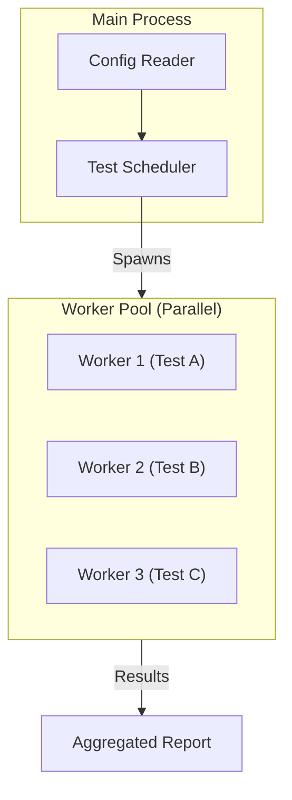

# Jest Mastery

Jest changed the JavaScript testing landscape by bundling everything (runner, assertions, mocks, coverage) into one package with a great developer experience.

<Info>
**Why Jest?**:
*   **Speed**: Parallel execution with isolated processes.
*   **Snapshots**: "Free" regression testing for large objects/UI.
*   **Mocking**: Best-in-class module mocking system.
</Info>



---

## 1. Mocking Strategies (The Hard Part)

Jest's strongest feature is its ability to mock dependencies out of existence.

### `jest.fn()` vs `jest.spyOn()`

*   `jest.fn()`: Creates a completely new mock function.
*   `jest.spyOn()`: Wraps an existing method. **Preferred** because it can be restored.

```javascript
// spying
const spy = jest.spyOn(video, 'play');
video.play();
expect(spy).toHaveBeenCalled();
spy.mockRestore(); // Restore original implementation
```

### Module Mocking (`jest.mock`)
This is magic. It hoists the mock to the top of the file and replaces the `require/import`.

```javascript
import axios from 'axios';
import { fetchUsers } from './users';

jest.mock('axios'); // Takes over the entire library

test('should fetch users', async () => {
  // Define behavior
  axios.get.mockResolvedValue({ data: [{ id: 1 }] });

  const users = await fetchUsers();
  expect(users[0].id).toBe(1);
});
```

### Manual Mocks (`__mocks__`)
For complex libraries, define the mock in a file `__mocks__/fs.js` (next to `node_modules`). Jest will automatically use this file instead of the real node module if you call `jest.mock('fs')`.

---

## 2. Advanced Snapshots

Snapshots are great, but they can include volatile data (Timestamps, IDs) that break tests.

### Property Matchers
Tell Jest: "I expect a Date here, but I don't care *which* date."

```javascript
it('will check the matchers and pass', () => {
  const user = {
    createdAt: new Date(),
    id: Math.floor(Math.random() * 20),
    name: 'LeBron James',
  };

  expect(user).toMatchSnapshot({
    createdAt: expect.any(Date),
    id: expect.any(Number),
  });
});
```
**Result Snapshot**:
```javascript
Object {
  "createdAt": Any<Date>,
  "id": Any<Number>,
  "name": "LeBron James",
}
```

### Inline Snapshots
Writes the snapshot *inside* your test file using Prettier. Good for valid small outputs.
```javascript
expect(link).toMatchInlineSnapshot(`
  <a className="link" href="/home">Home</a>
`);
```

---

## 3. Timer Mocking (Fake Timers)

Jest allows you to fast-forward time, handle intervals, and debounce.

```javascript
// Enable fake timers
jest.useFakeTimers();

test('executes after 1 second', () => {
  const callback = jest.fn();
  runLater(callback); // calls setTimeout(callback, 1000)

  // Before 1s
  expect(callback).not.toBeCalled();

  // Fast-forward
  jest.advanceTimersByTime(1000);
  // OR: jest.runAllTimers();

  expect(callback).toBeCalled();
});
```

**System Time**: You can even mock `Date.now()`.
```javascript
jest.setSystemTime(new Date('2020-01-01'));
```

---

## 4. Test Environment & Setup

Jest runs in Node, but creates a simulated browser environment using `jsdom`.

### Environment Configuration
If you differ per project:
```javascript
// jest.config.js
module.exports = {
  // Default: "jsdom" (simulates browser)
  // Use "node" for backend tests (Faster startup!)
  testEnvironment: "node", 
};
```

### Setup Files
Use `setupFilesAfterEnv` to configure global settings (like extending matchers) before tests run.

```javascript
// jest.config.js
setupFilesAfterEnv: ['<rootDir>/jest.setup.js']

// jest.setup.js
import '@testing-library/jest-dom'; // Adds matchers like .toBeInTheDocument()
```

---

## 5. React Integration Patterns

Jest + React Testing Library (RTL) is the standard.

### Custom Render Wrapper
If your app uses Providers (Redux, Theme, Auth), generic `render` will fail. Create a custom render:

```javascript
// test-utils.js
import { render } from '@testing-library/react';
import { ThemeProvider } from 'my-ui-lib';
import { StoreProvider } from 'my-redux';

const AllTheProviders = ({ children }) => {
  return (
    <ThemeProvider theme="light">
      <StoreProvider>
        {children}
      </StoreProvider>
    </ThemeProvider>
  )
}

const customRender = (ui, options) =>
  render(ui, { wrapper: AllTheProviders, ...options })

// re-export everything
export * from '@testing-library/react'
export { customRender as render }
```
Now use `render` from `test-utils` and tests automatically have context!

### Asynchronous UI
Wait for elements to appear.

```javascript
// Button click triggers API fetch -> updates list
fireEvent.click(button);

// Use findBy* (returns Promise) instead of getBy* (Sync)
const item = await screen.findByText('New Item');
```

---

## 6. Monorepo Support

Jest is great for monorepos through the `projects` key.

```javascript
// jest.config.js
module.exports = {
  projects: [
    {
      displayName: 'backend',
      testEnvironment: 'node',
      testMatch: ['<rootDir>/packages/server/**/*.test.js'],
    },
    {
      displayName: 'frontend',
      testEnvironment: 'jsdom',
      testMatch: ['<rootDir>/packages/client/**/*.test.js'],
    },
  ],
};
```
Running `jest` runs both. Running `jest --selectProjects backend` runs only one.

---

## 7. Debugging & Performance

### Debugging with VS Code
Add this to `.vscode/launch.json`:
```json
{
  "type": "node",
  "request": "launch",
  "name": "Jest Current File",
  "program": "${workspaceFolder}/node_modules/.bin/jest",
  "args": ["${fileBasenameNoExtension}", "--runInBand"],
  "console": "integratedTerminal"
}
```
Now you can set breakpoints inside your tests! `runInBand` (serial execution) is required for breakpoints to work reliably.

### Memory Leaks
Jest leaks memory. If your CI crashes on large suites:
1.  Run with `--logHeapUsage` to identify leaks.
2.  Use `--workerIdleMemoryLimit=512MB` to restart workers when they get bloated.

---

## 8. Common Pitfalls & Debugging

<AccordionGroup>
  <Accordion title="Implicit Globals">
    **Symptom**: `ReferenceError: expect is not defined`.
    **Cause**: Using a library that assumes Jest globals are present, but your ESLint/TSConfig doesn't know about them.
    **Fix**: Install `@types/jest` and add `"types": ["jest"]` to `tsconfig.json`.
  </Accordion>

  <Accordion title="Open Handles">
    **Symptom**: `Jest did not exit one second after the test run has completed`.
    **Cause**: You left a database connection or server listener open.
    **Fix**: Always close resources in `afterAll()`. Use `jest --detectOpenHandles` to find the culprit.
  </Accordion>

  <Accordion title="Mock Pollution">
    **Symptom**: Test A passes. Test B fails. Running Test B alone passes.
    **Cause**: A mock set in Test A wasn't cleared.
    **Fix**: Set `clearMocks: true` in `jest.config.js` to automatically clear call counts between tests.
  </Accordion>
</AccordionGroup>

---

## 9. Interview Questions

<AccordionGroup>
  <Accordion title="How does Jest achieve parallelization?">
    Jest uses a **Runner** that spawns multiple Node.js **Worker Processes**.
    *   The main process reads the config and orchestrates the run.
    *   It assigns test files (`.spec.js`) to workers.
    *   Each worker runs in its own isolated memory space.
    This prevents tests from interfering with each other's global state but adds memory overhead.
  </Accordion>

  <Accordion title="Explain the difference between `jest.fn()`, `jest.mock()`, and `jest.spyOn()`.">
    *   `jest.fn()`: Creates a standalone mock function. Good for callbacks.
    *   `jest.mock()`: Automatically replaces an entire module (e.g., `axios`) with auto-mocked versions of its exports.
    *   `jest.spyOn()`: Wraps an *existing* method on an object. Allows you to track calls while optionally keeping the original implementation.
  </Accordion>

  <Accordion title="What is Snapshot Testing and when should you avoid it?">
    Snapshot testing serializes a JS object/React tree to a string and compares it to a stored file.
    **Avoid it for**:
    *   Highly volatile UI (timestamps, random IDs).
    *   As a replacement for specific assertions (Don't just snapshot a huge object; assert `user.isAdmin` explicitly if that's what matters).
  </Accordion>
</AccordionGroup>

---

## 10. Cheat Sheet

```javascript
/* Mocks */
const spy = jest.spyOn(video, 'play');
jest.mock('axios');
const func = jest.fn();

/* Async Assertions */
await expect(promise).resolves.toBe('data');
await expect(promise).rejects.toThrow('Error');

/* Time Travel */
jest.useFakeTimers();
jest.advanceTimersByTime(1000);

/* Snapshots */
expect(tree).toMatchSnapshot();
expect(user).toMatchSnapshot({
  id: expect.any(Number)
});

/* CLI Flags */
// npx jest --watch
// npx jest -t "login" (Run tests matching name)
// npx jest --coverage
// npx jest --detectOpenHandles
```
