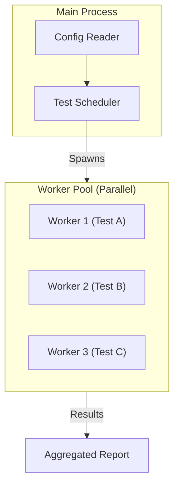

# Jest Mastery

Jest changed the JavaScript testing landscape by bundling everything (runner, assertions, mocks, coverage) into one package with a great developer experience. Think of Jest as an "all-inclusive resort" for testing -- while other tools like Mocha require you to pick your own assertion library, mocking library, and coverage tool (like booking flights, hotels, and meals separately), Jest gives you everything in one box, pre-configured and ready to go.

<Info>
**Why Jest?**:
*   **Speed**: Parallel execution with isolated processes.
*   **Snapshots**: "Free" regression testing for large objects/UI.
*   **Mocking**: Best-in-class module mocking system.
</Info>


```mermaid
flowchart TD
    subgraph Orchestrator["Main Process"]
        Reader["Config Reader"]
        Scheduler["Test Scheduler"]
        Reader --> Scheduler
    end

    subgraph Workers["Worker Pool (Parallel)"]
        W1["Worker 1 (Test A)"]
        W2["Worker 2 (Test B)"]
        W3["Worker 3 (Test C)"]
    end

    Scheduler -- Spawns --> Workers
    Workers -- Results --> Reporter["Aggregated Report"]
```

---

## 1. Mocking Strategies (The Hard Part)

Jest's strongest feature is its ability to mock dependencies out of existence. Mocking in testing is like using a stunt double in a movie -- you replace the real actor (your database, API, or file system) with a stand-in that behaves predictably, so you can test the scene (your code) without real-world risks.

### `jest.fn()` vs `jest.spyOn()`

*   `jest.fn()`: Creates a completely new mock function from scratch. Use this when you need a standalone fake callback or dependency.
*   `jest.spyOn()`: Wraps an existing method, letting you observe calls while keeping the original behavior available. **Preferred** because it can be restored and you are testing closer to reality.

```javascript
// spyOn wraps the real method -- like putting a wiretap on a phone call
const spy = jest.spyOn(video, 'play');
video.play(); // The real play() still executes, but now we're watching it
expect(spy).toHaveBeenCalled(); // Verify it was called
spy.mockRestore(); // Remove the wiretap -- original method is fully restored
```

### Module Mocking (`jest.mock`)
This is where Jest does something no other test tool does as cleanly. It hoists the mock to the top of the file and replaces the `require/import`, so every file that imports the mocked module gets the fake version.

```javascript
import axios from 'axios';
import { fetchUsers } from './users';

// jest.mock hoists this to the very top of the file at compile time.
// Every import of 'axios' in this file (and in ./users) now gets the mock.
jest.mock('axios');

test('should fetch users', async () => {
  // Define what the mock should return when .get() is called.
  // mockResolvedValue is shorthand for: () => Promise.resolve(...)
  axios.get.mockResolvedValue({ data: [{ id: 1 }] });

  const users = await fetchUsers();
  expect(users[0].id).toBe(1);
  // Verify the correct URL was called -- catches regressions in endpoint paths
  expect(axios.get).toHaveBeenCalledWith('/api/users');
});
```

**Practical tip**: If you only want to mock *part* of a module while keeping the rest real, use `jest.mock` with a factory that spreads the actual module:

```javascript
jest.mock('./utils', () => ({
  ...jest.requireActual('./utils'), // Keep all real exports
  fetchConfig: jest.fn(),           // Override only this one
}));
```

### Manual Mocks (`__mocks__`)
For complex libraries, define the mock in a file `__mocks__/fs.js` (next to `node_modules`). Jest will automatically use this file instead of the real node module if you call `jest.mock('fs')`.

---

## 2. Advanced Snapshots

Snapshots are great for catching unexpected changes, but they become a liability when they include volatile data (timestamps, random IDs) that changes on every run. A snapshot with volatile data is like a "spot the difference" puzzle where the picture changes every time -- you will just blindly update the snapshot and it stops catching real bugs.

### Property Matchers
Tell Jest: "I expect a Date here, but I don't care *which* date." This lets you lock down the structure while allowing dynamic values to vary.

```javascript
it('will check the matchers and pass', () => {
  const user = {
    createdAt: new Date(),
    id: Math.floor(Math.random() * 20),
    name: 'LeBron James',
  };

  expect(user).toMatchSnapshot({
    createdAt: expect.any(Date),
    id: expect.any(Number),
  });
});
```
**Result Snapshot**:
```javascript
Object {
  "createdAt": Any<Date>,
  "id": Any<Number>,
  "name": "LeBron James",
}
```

### Inline Snapshots
Writes the snapshot *inside* your test file using Prettier. Good for valid small outputs.
```javascript
expect(link).toMatchInlineSnapshot(`
  <a className="link" href="/home">Home</a>
`);
```

---

## 3. Timer Mocking (Fake Timers)

Jest allows you to fast-forward time, handle intervals, and debounce logic without actually waiting. This is essential for testing anything that uses `setTimeout`, `setInterval`, or `Date.now()` -- you do not want a test suite that literally waits 30 seconds for a debounce to fire.

```javascript
// Enable fake timers -- replaces setTimeout, setInterval, Date.now with fakes
jest.useFakeTimers();

test('executes after 1 second', () => {
  const callback = jest.fn();
  runLater(callback); // calls setTimeout(callback, 1000)

  // Before 1s
  expect(callback).not.toBeCalled();

  // Fast-forward
  jest.advanceTimersByTime(1000);
  // OR: jest.runAllTimers();

  expect(callback).toBeCalled();
});
```

**System Time**: You can even mock `Date.now()`.
```javascript
jest.setSystemTime(new Date('2020-01-01'));
```

---

## 4. Test Environment & Setup

Jest runs in Node, but creates a simulated browser environment using `jsdom` -- a pure JavaScript implementation of the DOM. Think of it as a "fake browser" that runs entirely in Node.js, giving you `document`, `window`, and DOM APIs without launching Chrome.

### Environment Configuration
Choose the right environment for your project -- using `jsdom` for backend tests wastes startup time, and using `node` for frontend tests means no DOM APIs:
```javascript
// jest.config.js
module.exports = {
  // Default: "jsdom" (simulates browser)
  // Use "node" for backend tests (Faster startup!)
  testEnvironment: "node", 
};
```

### Setup Files
Use `setupFilesAfterEnv` to configure global settings (like extending matchers) before tests run.

```javascript
// jest.config.js
setupFilesAfterEnv: ['<rootDir>/jest.setup.js']

// jest.setup.js
import '@testing-library/jest-dom'; // Adds matchers like .toBeInTheDocument()
```

---

## 5. React Integration Patterns

Jest + React Testing Library (RTL) is the standard.

### Custom Render Wrapper
If your app uses Providers (Redux, Theme, Auth), generic `render` will fail. Create a custom render:

```javascript
// test-utils.js
import { render } from '@testing-library/react';
import { ThemeProvider } from 'my-ui-lib';
import { StoreProvider } from 'my-redux';

const AllTheProviders = ({ children }) => {
  return (
    <ThemeProvider theme="light">
      <StoreProvider>
        {children}
      </StoreProvider>
    </ThemeProvider>
  )
}

const customRender = (ui, options) =>
  render(ui, { wrapper: AllTheProviders, ...options })

// re-export everything
export * from '@testing-library/react'
export { customRender as render }
```
Now use `render` from `test-utils` and tests automatically have context. This is one of the most impactful patterns in a React codebase -- without it, you will duplicate Provider wrappers in every single test file.

### Asynchronous UI
Wait for elements to appear. This is the number one source of flaky React tests -- using `getBy*` (synchronous) when the element has not rendered yet.

```javascript
// Button click triggers API fetch -> updates list
fireEvent.click(button);

// getBy* is synchronous -- it throws immediately if the element is missing.
// findBy* returns a Promise -- it retries until the element appears or times out.
// RULE: Use findBy* for anything that appears after an async operation.
const item = await screen.findByText('New Item');

// waitFor is the escape hatch for complex async assertions
await waitFor(() => {
  expect(screen.getByText('Loaded')).toBeInTheDocument();
});
```

---

## 6. Monorepo Support

Jest is great for monorepos through the `projects` key.

```javascript
// jest.config.js
module.exports = {
  projects: [
    {
      displayName: 'backend',
      testEnvironment: 'node',
      testMatch: ['<rootDir>/packages/server/**/*.test.js'],
    },
    {
      displayName: 'frontend',
      testEnvironment: 'jsdom',
      testMatch: ['<rootDir>/packages/client/**/*.test.js'],
    },
  ],
};
```
Running `jest` runs both. Running `jest --selectProjects backend` runs only one.

---

## 7. Debugging & Performance

### Debugging with VS Code
Add this to `.vscode/launch.json`:
```json
{
  "type": "node",
  "request": "launch",
  "name": "Jest Current File",
  "program": "${workspaceFolder}/node_modules/.bin/jest",
  "args": ["${fileBasenameNoExtension}", "--runInBand"],
  "console": "integratedTerminal"
}
```
Now you can set breakpoints inside your tests! `runInBand` (serial execution) is required for breakpoints to work reliably.

### Memory Leaks
Jest is known to leak memory, especially in large test suites. If your CI crashes or slows dramatically after hundreds of tests:
1.  Run with `--logHeapUsage` to identify which test files consume the most memory.
2.  Use `--workerIdleMemoryLimit=512MB` to restart workers when they get bloated.
3.  Check for module-level closures that capture large objects -- these persist across tests within the same worker.

**Common pitfall**: Importing large fixtures at the module level (outside `beforeEach`) means they stay in memory for the entire worker lifetime. Move large data into `beforeEach`/`afterEach` blocks instead.

---

## 8. Common Pitfalls & Debugging

<AccordionGroup>
  <Accordion title="Implicit Globals">
    **Symptom**: `ReferenceError: expect is not defined`.
    **Cause**: Using a library that assumes Jest globals are present, but your ESLint/TSConfig doesn't know about them.
    **Fix**: Install `@types/jest` and add `"types": ["jest"]` to `tsconfig.json`.
  </Accordion>

  <Accordion title="Open Handles">
    **Symptom**: `Jest did not exit one second after the test run has completed`.
    **Cause**: You left a database connection or server listener open.
    **Fix**: Always close resources in `afterAll()`. Use `jest --detectOpenHandles` to find the culprit.
  </Accordion>

  <Accordion title="Mock Pollution">
    **Symptom**: Test A passes. Test B fails. Running Test B alone passes.
    **Cause**: A mock set in Test A wasn't cleared.
    **Fix**: Set `clearMocks: true` in `jest.config.js` to automatically clear call counts between tests.
  </Accordion>
</AccordionGroup>

---

## 9. Interview Questions

<AccordionGroup>
  <Accordion title="How does Jest achieve parallelization?">
    Jest uses a **Runner** that spawns multiple Node.js **Worker Processes**.
    *   The main process reads the config and orchestrates the run.
    *   It assigns test files (`.spec.js`) to workers.
    *   Each worker runs in its own isolated memory space.
    This prevents tests from interfering with each other's global state but adds memory overhead.
  </Accordion>

  <Accordion title="Explain the difference between `jest.fn()`, `jest.mock()`, and `jest.spyOn()`.">
    *   `jest.fn()`: Creates a standalone mock function. Good for callbacks.
    *   `jest.mock()`: Automatically replaces an entire module (e.g., `axios`) with auto-mocked versions of its exports.
    *   `jest.spyOn()`: Wraps an *existing* method on an object. Allows you to track calls while optionally keeping the original implementation.
  </Accordion>

  <Accordion title="What is Snapshot Testing and when should you avoid it?">
    Snapshot testing serializes a JS object/React tree to a string and compares it to a stored file.
    **Avoid it for**:
    *   Highly volatile UI (timestamps, random IDs).
    *   As a replacement for specific assertions (Don't just snapshot a huge object; assert `user.isAdmin` explicitly if that's what matters).
  </Accordion>
</AccordionGroup>

---

## 10. Cheat Sheet

```javascript
/* Mocks */
const spy = jest.spyOn(video, 'play');
jest.mock('axios');
const func = jest.fn();

/* Async Assertions */
await expect(promise).resolves.toBe('data');
await expect(promise).rejects.toThrow('Error');

/* Time Travel */
jest.useFakeTimers();
jest.advanceTimersByTime(1000);

/* Snapshots */
expect(tree).toMatchSnapshot();
expect(user).toMatchSnapshot({
  id: expect.any(Number)
});

/* CLI Flags */
// npx jest --watch
// npx jest -t "login" (Run tests matching name)
// npx jest --coverage
// npx jest --detectOpenHandles
```

---

## Interview Deep-Dive

<AccordionGroup>
  <Accordion title="Q: Your team has a test suite where Test A passes in isolation but fails when Test B runs before it. Walk me through how you would diagnose and fix this.">
    **Strong Answer:**

    The way I think about this is "test pollution" -- one test is leaking state into another. In Jest specifically, there are three common culpr){' '}

    - **Mock pollution**: Test B sets up a `jest.mock()` or `jest.spyOn()` and does not clean up. Since Jest reuses workers across test files, the mock persists. The fix is setting `clearMocks: true` and `restoreMocks: true` in `jest.config.js`, which automatically resets all mocks between tests. In my experience, this single config change eliminates 80% of inter-test failures.
    - **Module-level state**: If a module has a top-level variable like `let cache = {}` and Test B mutates it, Test A sees the mutated state. The fix is resetting that state in `beforeEach`, or restructuring the module to expose a `reset()` function for testing.
    - **Shared database or external state**: If both tests hit the same database row, one test's writes can corrupt the other's expectations. The fix is using unique fixtures per test or wrapping each test in a transaction that rolls back.

    The diagnostic tool I would reach for first is `jest --runInBand`, which runs tests serially and makes the ordering deterministic. Then I would use `jest --verbose` to see the exact execution order. If the failure only happens with parallelism, it points to shared external resources rather than in-memory state.

    **Follow-up: How does Jest's worker model contribute to or prevent test isolation?**

    Jest spawns multiple Node.js worker processes, and each worker runs test files in its own isolated V8 context. This means global variables in one test file cannot directly leak to another test file running in a different worker. However, within a single worker, Jest may run multiple test files sequentially, and module-level mocks set via `jest.mock()` are hoisted and can persist if not cleared. The key gotcha is that `jest.mock()` affects the module registry for that worker's entire lifetime, not just the current test file. That is why `clearMocks` and `restoreMocks` exist at the config level -- they hook into Jest's lifecycle to clean up between test files within the same worker.
  </Accordion>

  <Accordion title="Q: When would you argue against using snapshot testing on a team, and what would you propose instead?">
    **Strong Answer:**

    I would push back on snapshot testing in three specific scenarios:

    - **Large, volatile component trees**: If a React component renders a 500-line DOM tree with timestamps, user-specific data, or random keys, the snapshot becomes a maintenance burden. Developers blindly press `u` to update snapshots without reviewing changes, which defeats the entire purpose. I have seen teams where 100% of snapshot updates were approved without review -- at that point, the snapshot is testing nothing.
    - **Business-critical assertions**: If what matters is "the submit button is disabled when the form is invalid," a snapshot of the entire form is the wrong tool. A targeted assertion like `expect(screen.getByRole('button')).toBeDisabled()` communicates intent, survives refactors, and produces a clear failure message. Snapshots fail with a giant diff that forces you to play "spot the difference."
    - **API response shapes**: Snapshotting API responses couples your tests to every field in the response. Add one field to the API and 40 snapshots break. Property matchers help (`expect.any(Date)`), but at that point you are doing so much work to make the snapshot useful that explicit assertions would be simpler.

    What I would propose instead: targeted assertions for behavior, property matchers for structure validation where snapshots are genuinely useful (design system component libraries, serialized config output), and inline snapshots for small, stable outputs. The rule I follow is: if you can describe what the test checks in one sentence, use an assertion. If you are checking "nothing changed unexpectedly in a large stable structure," snapshots are appropriate.

    **Follow-up: In what scenario are snapshots genuinely the best tool?**

    Component libraries and design systems. If you maintain a `<Button>` component used by 15 teams, a snapshot catches unintended changes to the rendered HTML structure, CSS classes, and ARIA attributes. The snapshot is small (one component, not an entire page), stable (the component API rarely changes), and the team reviewing it knows exactly what they are looking at. Inline snapshots are particularly good here because the expected output lives right next to the test, making review trivial.
  </Accordion>

  <Accordion title="Q: You inherit a large React codebase where every test file has its own Provider wrapper setup duplicated. How do you refactor this, and what patterns do you introduce?">
    **Strong Answer:**

    This is one of the most common tech debt patterns in React test suites. The fix is the custom render pattern from React Testing Library's documentation, but the execution matters more than the concept.

    - **Step 1: Create a `test-utils.ts` file** that re-exports everything from `@testing-library/react` but overrides `render` with a version that wraps components in all necessary Providers (Redux store, theme, router, auth context). This file becomes the single import for all test files.
    - **Step 2: Make the wrapper configurable**. The custom render should accept options like `{ initialState: {...}, route: '/dashboard' }` so individual tests can customize the environment without rebuilding the wrapper. For example, `render(<Dashboard />, { initialState: { user: mockAdmin } })` gives you a logged-in admin context in one line.
    - **Step 3: Migrate incrementally**. I would not rewrite 200 test files in one PR. Instead, create the utility, update the team's test template, and migrate files as they are touched during normal development. Add a lint rule that warns on direct imports from `@testing-library/react` to guide adoption.

    The key thing most people miss is that the custom render should also handle cleanup of any side effects the Providers introduce. For instance, if your Redux store subscribes to a WebSocket on mount, your wrapper needs to handle disconnection in the cleanup phase. Otherwise you get the classic "open handles" warning from Jest.

    **Follow-up: How would you handle tests that need different Provider configurations -- for example, testing unauthenticated vs authenticated states?**

    The custom render accepts an options object, so I would design it with sensible defaults that tests can override. For authentication, the default might be "logged in as a regular user," and individual tests pass `{ user: null }` for unauthenticated or `{ user: adminUser }` for admin. The wrapper function destructures these options and conditionally wraps with the appropriate context value. This keeps 90% of tests simple (zero configuration) while giving the remaining 10% full control.
  </Accordion>

  <Accordion title="Q: Compare jest.fn(), jest.spyOn(), and jest.mock() -- when would you specifically choose each, and what are the pitfalls of each approach?">
    **Strong Answer:**

    These three serve fundamentally different purposes, and misusing them is the root cause of most brittle tests.

    - **`jest.fn()`**: Creates a standalone mock function with no connection to any real implementation. Use it for callbacks, event handlers, or any dependency you inject directly. For example, passing a mock `onSubmit` prop to a form component: `render(<Form onSubmit={jest.fn()} />)`. The pitfall is using `jest.fn()` when you should be using `spyOn` -- if you replace a real function with `jest.fn()`, you lose the ability to test that the real implementation is correct, and you have to manually define return values that may drift from reality.
    - **`jest.spyOn()`**: Wraps an existing method on an object. The original implementation still runs unless you explicitly call `.mockImplementation()` or `.mockReturnValue()`. This is my default choice because it tests closer to reality -- you observe the real behavior while gaining the ability to assert on calls. The pitfall is forgetting to call `spy.mockRestore()` or relying on `clearMocks` config. If you mock the implementation but forget to restore, subsequent tests in the same file see the mock, not the real method.
    - **`jest.mock()`**: Replaces an entire module at the import level. Jest hoists this call to the top of the file, so every import of the mocked module gets the fake version. Use it for heavy external dependencies (HTTP clients, database drivers, file system). The pitfall is over-mocking: if you `jest.mock('axios')` and then hand-write return values for every endpoint, your tests become a parallel implementation of your API contract. When the real API changes, the tests still pass because they are testing against your hand-written mocks.

    The judgment call I make is: mock at the boundary, spy on the internals, and use `jest.fn()` for injected dependencies. If I find myself mocking more than two modules in a single test file, that is a design smell -- the code under test has too many hard dependencies.

    **Follow-up: What happens internally when Jest hoists `jest.mock()` to the top of the file?**

    Jest uses a Babel transform (or its own code transform) that literally moves the `jest.mock()` call above all import statements in the compiled output. This means the mock is registered in Jest's module registry before any `import` or `require` resolves. When `./users` internally does `import axios from 'axios'`, it gets the mocked version because the registry already has it. The consequence is that you cannot use variables defined outside the `jest.mock()` factory unless they are prefixed with `mock` (Jest has a special naming convention exception). This hoisting behavior is unique to Jest and does not exist in Vitest or other test runners.
  </Accordion>

  <Accordion title="Q: Your CI pipeline runs 3,000 Jest tests and takes 25 minutes. Walk me through your optimization strategy.">
    **Strong Answer:**

    I approach this in layers, from cheapest wins to most expensive changes.

    - **Layer 1 -- Configuration (free)**: First, check if `--runInBand` is accidentally enabled in CI (forces serial execution). Verify `maxWorkers` is set appropriately -- on a CI machine with 4 cores, `--maxWorkers=4` or `--maxWorkers=50%` is typical. Check if the `testEnvironment` is `jsdom` globally when many tests are backend-only; switching those to `node` saves the jsdom startup cost per worker.
    - **Layer 2 -- Memory and worker health**: Run with `--logHeapUsage` to find test files that consume excessive memory. Large fixtures imported at module scope stay in memory for the worker's lifetime. Move them into `beforeEach`. Set `--workerIdleMemoryLimit=512MB` to recycle bloated workers. In one project, this alone cut CI time by 30% because workers were spending time in garbage collection.
    - **Layer 3 -- Test structure**: Use Jest's `projects` configuration to split the suite into backend and frontend projects with different environments and transforms. This avoids loading unnecessary Babel/TypeScript transforms for tests that do not need them. Use `--shard` to distribute across multiple CI machines: `jest --shard=1/4` on four parallel jobs cuts wall-clock time by roughly 4x.
    - **Layer 4 -- Test quality**: Profile individual slow tests with `--verbose`. Look for tests that use `waitFor` with long timeouts, tests that spawn real servers, or tests with excessive `beforeAll` setup. A single integration test that starts an Express server can add 3-5 seconds. Consider whether those belong in a separate "integration" suite that runs less frequently.
    - **Layer 5 -- Caching**: Jest has a built-in cache (`--cache` is on by default). Ensure your CI preserves the Jest cache directory between runs (usually in `/tmp/jest_*` or configurable via `cacheDirectory`). Also cache `node_modules` and the TypeScript build output.

    The most impactful single change I have seen is sharding. Going from 1 CI job to 4 parallel sharded jobs typically reduces a 25-minute suite to 7-8 minutes with minimal effort.

    **Follow-up: How does Jest decide which tests to run first, and can you influence that?**

    Jest prioritizes test files that failed in the previous run (stored in the cache), then runs the slowest files first. This ensures that if a test is going to fail, you find out as early as possible, and the slowest files start on workers immediately rather than being the last to finish. You can influence this with `--bail` (stop after first failure) for fast feedback, or with custom sequencers if you need a specific ordering.
  </Accordion>
</AccordionGroup>
