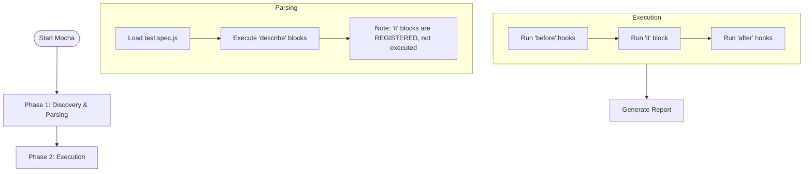

# Mocha Mastery

Mocha is the "Swiss Army Knife" of JavaScript testing. Unlike Jest, which is an "Framework" (Runner + Assertions + Mocks), Mocha is primarily a **Test Runner**. This gives you the flexibility to choose your own tools, but requires more setup.

<Info>
**Ecosystem**:
*   **Runner**: Mocha
*   **Assertions**: Chai (Expect/Should)
*   **Mocks**: Sinon
*   **Coverage**: NYC (Istanbul)
</Info>

---

## 1. The Mocha Runtime

Understanding how Mocha executes files is crucial for avoiding "it works on my machine" errors.

### Discovery Phase vs Execution Phase
When you run `mocha`:
1.  **Discovery**: Mocha scans directories.
2.  **Parsing**: It `require()`s every test file. `describe()` blocks execute **IMMEDIATELY** at this stage.
3.  **Execution**: `it()`, `before()`, `after()` hooks execute.



**Common Mistake**:
```javascript
describe('My Test', function() {
  // THIS RUNS IMMEDIATELY (Parsing Phase)
  const db = connectToDatabase(); 
  
  it('should query', function() {
    // This runs later. DB connection might not be ready!
  });
});
```
**Fix**: Always do setup in `before()` hooks.

### Dynamic Test Generation
Since `describe` runs during parsing, you can generate tests dynamically:

```javascript
const testCases = [1, 2, 3, 4];

describe('Math', function() {
  testCases.forEach(function(num) {
    it(`should square ${num} correctly`, function() {
      expect(num * num).to.equal(Math.pow(num, 2));
    });
  });
});
```

---

## 2. Advanced Assertions (Chai)

Chai offers three styles. `expect` is the most modern and readable.

### Deep Equality vs Strict Equality
```javascript
const objA = { a: 1 };
const objB = { a: 1 };

// PASS: checks content (deep equality)
expect(objA).to.deep.equal(objB); 

// FAIL: checks reference (memory address)
expect(objA).to.equal(objB);
```

### Chaining
Chai chains are readable English.
```javascript
expect(user)
  .to.be.an('object')
  .that.has.property('email')
  .that.is.not.empty;
```

### Plugins
Chai functionality is extended via plugins.
*   `chai-as-promised`: `await expect(promise).to.be.rejectedWith(Error)`
*   `chai-http`: Integration testing for API endpoints.

---

## 3. Spies, Stubs, and Mocks (Sinon)

Sinon is powerful but confusing. Here's exactly when to use what.

### 1. Spies (Observation)
Use when you **don't want to change behavior**, just check if called.
```javascript
const spy = sinon.spy(console, 'log');
myFunction();
expect(spy.calledWith('Hello')).to.be.true;
spy.restore(); // CRITICAL: Stop spying!
```

### 2. Stubs (Control)
Use when you **want to force behavior** (e.g., force DB error).
```javascript
const stub = sinon.stub(database, 'query');

// Scenario 1: Force return
stub.returns({ id: 1 });

// Scenario 2: Force throw
stub.throws(new Error('Connection Failed'));

// Scenario 3: Different return on 2nd call
stub.onCall(0).returns(true);
stub.onCall(1).returns(false);

stub.restore();
```

### 3. Mocks (Expectation Manager)
Combines spying and verification. "This method *MUST* be called X times".
```javascript
const mock = sinon.mock(database);
mock.expects('save').once().withArgs({ id: 1 });

saveUser({ id: 1 });

mock.verify(); // Fails if expectation not met
mock.restore();
```

### 4. Sinon Sandbox
Manually restoring every stub is painful and error-prone. Use Sandboxes.

```javascript
describe('User Service', function() {
  let sandbox;
  
  beforeEach(() => {
    sandbox = sinon.createSandbox();
  });
  
  afterEach(() => {
    sandbox.restore(); // Restores EVERYTHING created by sandbox
  });
  
  it('test', () => {
    // Created on sandbox, auto-cleaned later
    const stub = sandbox.stub(api, 'get'); 
  });
});
```

---

## 4. Async & Time

### Handling Timeouts
Default timeout is 2000ms. For slow integration tests:

1.  **Global Command**: `mocha --timeout 10000`
2.  **Per Suite**: `this.timeout(5000)` inside describe.
3.  **Per Test**: `this.timeout(5000)` inside it.

<Warning>
**Fat Arrow Warning**: Do NOT use arrow functions `() => {}` if you need `this.timeout()` or `this.retries()`. Mocha binds context to `this`.
</Warning>

### Fake Timers (Sinon)
Don't wait 5 seconds in a unit test.

```javascript
let clock;
before(() => { clock = sinon.useFakeTimers(); });
after(() => { clock.restore(); });

it('should timeout', () => {
  startTimer();
  clock.tick(5000); // Fast-forward 5000ms instantly
  expect(timeoutHappened).to.be.true;
});
```

---

## 5. Root Hooks & Global Fixtures

For setting up Database connections or Web Servers *once* for the entire suite.

Create a file `test/hooks.js`:

```javascript
// Mocha Root Hook Plugin pattern
exports.mochaHooks = {
  async beforeAll() {
    console.log('Global Setup: Starting Server');
    await server.start();
  },
  async afterAll() {
    console.log('Global Teardown: Stopping Server');
    await server.stop();
  }
};
```
Run with: `mocha --require test/hooks.js`

---

## 6. Code Coverage (NYC)

Istanbul (NYC) instruments code to count line execution.

**Gatekeeping**:
Fail CI if coverage drops.
```json
// package.json
"nyc": {
  "check-coverage": true,
  "lines": 80,
  "functions": 80
}
```

**Exclusions**:
Create `.nycrc` or `nyc.config.js`.
```javascript
module.exports = {
  exclude: [
    "**/*.test.js",
    "coverage/**",
    "docs/**"
  ]
};
```

---

## 7. Running in the Browser (Karma vs Headless)

Mocha runs in Node.js by default. To test frontend DOM logic:

### Option 1: JSDOM (Fast, Simulated)
Simulate browser in Node.
```javascript
const jsdom = require('jsdom-global');
before(function() {
  this.cleanup = jsdom();
});
after(function() {
  this.cleanup();
});

it('uses document', () => {
  const div = document.createElement('div'); // Works!
});
```

### Option 2: Karma (Real Browser)
Karma launches Chrome, injects Mocha + tests, reporting back to terminal.
Complex setup, but 100% accurate.

### Option 3: Playwright/Puppeteer
Use Mocha just to drive Playwright automation (See Playwright course).

---

## 8. Common Pitfalls & Debugging

<AccordionGroup>
  <Accordion title="The Arrow Function Context Trap">
    **Symptom**: `TypeError: this.timeout is not a function` or `this.retries` fails.
    **Cause**: Arrow functions `() => {}` bind `this` lexically (from the parent scope), ignoring Mocha's context.
    **Fix**: Always use `function()` syntax when accessing `this`.
    ```javascript
    // BAD
    it('slow test', () => { this.timeout(5000); });

    // GOOD
    it('slow test', function() { this.timeout(5000); });
    ```
  </Accordion>

  <Accordion title="Mixing 'done' and Promises">
    **Symptom**: `Error: Resolution method is overspecified`.
    **Cause**: Your test accepts a `done` callback BUT also returns a Promise (async function). Mocha doesn't know which one to listen to.
    **Fix**: Use one or the other, never both.
    ```javascript
    // BAD
    it('saves', async (done) => {
      await save();
      done(); 
    });
    ```
  </Accordion>

  <Accordion title="Global Variable Leaks">
    **Symptom**: Test B fails only when Test A runs.
    **Cause**: Modifying a global variable (or module-level variable) without resetting it.
    **Fix**: Use `afterEach()` to clean up state or Sinon Sandboxes to restore mocks.
  </Accordion>
</AccordionGroup>

---

## 9. Interview Questions

<AccordionGroup>
  <Accordion title="Explain the difference between TDD, BDD, and Exports interfaces in Mocha.">
    *   **BDD**: `describe()`, `it()`, `before()`. Reads like behavior specs. (Most popular).
    *   **TDD**: `suite()`, `test()`, `setup()`. Closer to traditional unit testing.
    *   **Exports**: Exporting an object where keys are descriptions. values are functions.
    Mocha supports all of them via the `--ui` flag (default is `bdd`).
  </Accordion>

  <Accordion title="Why do we need a separate assertion library like Chai?">
    Mocha is unopinionated. It only handles running the tests and reporting results. It does not know how to check if `2 + 2 = 4`.
    You can use Node's built-in `assert` module, but **Chai** provides expressive, legible assertions (`expect(x).to.be.true`) that make failure messages easier to read.
  </Accordion>

  <Accordion title="How does Mocha handle asynchronous code differently from synchronous code?">
    If a test function takes a parameter (conventionally named `done`), Mocha pauses execution until `done()` is called.
    If a test function returns a **Promise**, Mocha waits for resolution/rejection.
    If neither, it assumes synchronous execution and passes immediately if no error is thrown.
  </Accordion>
</AccordionGroup>

---

## 10. Cheat Sheet

```javascript
/* Structure */
describe('User', function() {
  before(function() { /* run once */ });
  after(function() { /* run once */ });
  beforeEach(function() { /* run before each */ });
  afterEach(function() { /* run after each */ });

  it('should save', function() {
    // Test Body
  });
});

/* Assertions (Chai) */
expect(foo).to.be.a('string');
expect(foo).to.equal('bar');
expect(foo).to.have.lengthOf(3);
expect(foo).to.have.property('tea').with.lengthOf(3);

/* Mocks (Sinon) */
const spy = sinon.spy(object, 'method');
const stub = sinon.stub(object, 'method').returns(42);
const mock = sinon.mock(object);

/* Execution Control */
describe.only('Focus', ...); // Run ONLY this
describe.skip('Ignore', ...); // Skip this
this.retries(3); // Retry flaky test
this.timeout(5000); // 5s timeout
```
