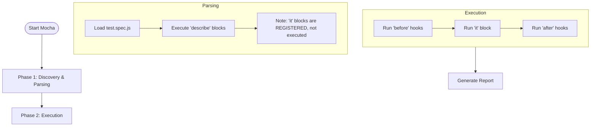

# Mocha Mastery

Mocha is the "Swiss Army Knife" of JavaScript testing. Unlike Jest, which is an all-in-one framework (Runner + Assertions + Mocks), Mocha is primarily a **Test Runner**. Think of it like buying a gaming PC as individual components versus buying a pre-built one: Mocha lets you pick your own assertion library, mock library, and coverage tool, giving maximum flexibility at the cost of more assembly. This makes Mocha particularly popular in teams that have strong opinions about their toolchain or need specialized integrations.

<Info>
**Ecosystem**:
*   **Runner**: Mocha
*   **Assertions**: Chai (Expect/Should)
*   **Mocks**: Sinon
*   **Coverage**: NYC (Istanbul)
</Info>

---

## 1. The Mocha Runtime

Understanding how Mocha executes files is crucial for avoiding "it works on my machine" errors. Mocha's two-phase execution model is the single most misunderstood aspect of the framework, and it causes the majority of confusing test failures.

### Discovery Phase vs Execution Phase
When you run `mocha`, it does **not** execute your tests top-to-bottom like a regular script. Instead, it uses two distinct phases:
1.  **Discovery**: Mocha scans directories for test files matching the configured pattern.
2.  **Parsing**: It `require()`s every test file. `describe()` blocks execute **IMMEDIATELY** at this stage -- they are just function calls that register suites and tests.
3.  **Execution**: Only after all files are parsed does Mocha run `it()`, `before()`, `after()` hooks in the order it discovered them.


```mermaid
flowchart TD
    Start([Start Mocha]) --> Phase1[Phase 1: Discovery & Parsing]
    
    subgraph P1 [Parsing]
        File1[Load test.spec.js]
        Desc1[Execute 'describe' blocks]
        Note1[Note: 'it' blocks are REGISTERED, not executed]
        
        File1 --> Desc1 --> Note1
    end
    
    Phase1 --> Phase2[Phase 2: Execution]
    
    subgraph P2 [Execution]
        Hook1[Run 'before' hooks]
        Test1[Run 'it' block]
        Hook2[Run 'after' hooks]
        
        Hook1 --> Test1 --> Hook2
    end
    
    P2 --> Report[Generate Report]
```

**Common Mistake**:
```javascript
describe('My Test', function() {
  // THIS RUNS IMMEDIATELY (Parsing Phase)
  const db = connectToDatabase(); 
  
  it('should query', function() {
    // This runs later. DB connection might not be ready!
  });
});
```
**Fix**: Always do setup in `before()` hooks.

### Dynamic Test Generation
Since `describe` runs during parsing, you can generate tests dynamically:

```javascript
const testCases = [1, 2, 3, 4];

describe('Math', function() {
  testCases.forEach(function(num) {
    it(`should square ${num} correctly`, function() {
      expect(num * num).to.equal(Math.pow(num, 2));
    });
  });
});
```

---

## 2. Advanced Assertions (Chai)

Chai offers three assertion styles: `expect`, `should`, and `assert`. The `expect` style is the most popular because it reads like natural English and works consistently across all environments (unlike `should`, which modifies `Object.prototype`).

### Deep Equality vs Strict Equality
This distinction trips up nearly every beginner. JavaScript has two notions of "equal" for objects, and Chai exposes both:
```javascript
const objA = { a: 1 };
const objB = { a: 1 };

// PASS: checks content -- are the values the same? (like comparing photocopies)
expect(objA).to.deep.equal(objB); 

// FAIL: checks reference -- are these the exact same object in memory? (like asking "is this the same piece of paper?")
expect(objA).to.equal(objB);
```

### Chaining
Chai chains are readable English.
```javascript
expect(user)
  .to.be.an('object')
  .that.has.property('email')
  .that.is.not.empty;
```

### Plugins
Chai functionality is extended via plugins.
*   `chai-as-promised`: `await expect(promise).to.be.rejectedWith(Error)`
*   `chai-http`: Integration testing for API endpoints.

---

## 3. Spies, Stubs, and Mocks (Sinon)

Sinon is powerful but confusing because it offers three things that sound similar: spies, stubs, and mocks. Think of them on a spectrum of control:
- **Spy** = Security camera (watches, does not interfere)
- **Stub** = Stunt double (replaces behavior entirely)
- **Mock** = Strict contract (expects specific calls, fails if not met)

### 1. Spies (Observation)
Use when you **don't want to change behavior**, just verify that a function was called, how many times, and with what arguments.
```javascript
const spy = sinon.spy(console, 'log'); // Wrap the real console.log
myFunction(); // Call the code under test -- console.log still works normally
expect(spy.calledWith('Hello')).to.be.true; // But now we can check what was logged
spy.restore(); // CRITICAL: Remove the spy, or it leaks into other tests!
```

### 2. Stubs (Control)
Use when you **want to force behavior** -- making a function return a specific value, throw an error, or behave differently on successive calls. Stubs completely replace the original function.
```javascript
const stub = sinon.stub(database, 'query');

// Scenario 1: Force a specific return value (happy path testing)
stub.returns({ id: 1 });

// Scenario 2: Force an error (test your error handling!)
stub.throws(new Error('Connection Failed'));

// Scenario 3: Simulate changing behavior across calls
// Useful for testing retry logic or pagination
stub.onCall(0).returns(true);   // First call succeeds
stub.onCall(1).returns(false);  // Second call fails

stub.restore(); // Always restore -- stubs are permanent until you undo them
```

### 3. Mocks (Expectation Manager)
Combines spying and verification. "This method *MUST* be called X times".
```javascript
const mock = sinon.mock(database);
mock.expects('save').once().withArgs({ id: 1 });

saveUser({ id: 1 });

mock.verify(); // Fails if expectation not met
mock.restore();
```

### 4. Sinon Sandbox
Manually restoring every stub is painful and error-prone -- miss one `restore()` call and you have a "test pollution" bug that only surfaces when tests run in a specific order. Sandboxes solve this by tracking every spy/stub/mock you create and restoring them all in one call.

```javascript
describe('User Service', function() {
  let sandbox;
  
  beforeEach(() => {
    sandbox = sinon.createSandbox();
  });
  
  afterEach(() => {
    sandbox.restore(); // Restores EVERYTHING created by sandbox
  });
  
  it('test', () => {
    // Created on sandbox, auto-cleaned later
    const stub = sandbox.stub(api, 'get'); 
  });
});
```

---

## 4. Async & Time

### Handling Timeouts
Default timeout is 2000ms. For slow integration tests:

1.  **Global Command**: `mocha --timeout 10000`
2.  **Per Suite**: `this.timeout(5000)` inside describe.
3.  **Per Test**: `this.timeout(5000)` inside it.

<Warning>
**Fat Arrow Warning**: Do NOT use arrow functions `() => {}` if you need `this.timeout()` or `this.retries()`. Mocha binds context to `this`.
</Warning>

### Fake Timers (Sinon)
Don't wait 5 seconds in a unit test.

```javascript
let clock;
before(() => { clock = sinon.useFakeTimers(); });
after(() => { clock.restore(); });

it('should timeout', () => {
  startTimer();
  clock.tick(5000); // Fast-forward 5000ms instantly
  expect(timeoutHappened).to.be.true;
});
```

---

## 5. Root Hooks & Global Fixtures

For setting up Database connections or Web Servers *once* for the entire suite.

Create a file `test/hooks.js`:

```javascript
// Mocha Root Hook Plugin pattern
exports.mochaHooks = {
  async beforeAll() {
    console.log('Global Setup: Starting Server');
    await server.start();
  },
  async afterAll() {
    console.log('Global Teardown: Stopping Server');
    await server.stop();
  }
};
```
Run with: `mocha --require test/hooks.js`

---

## 6. Code Coverage (NYC)

Istanbul (NYC) instruments your source code by inserting counters at every branch, function, and line. When tests run, these counters record which code paths were executed, producing a coverage report.

**Gatekeeping**:
Set minimum coverage thresholds so CI fails if coverage drops. This prevents the slow erosion of test quality over time -- without a gate, coverage tends to creep downward as deadline pressure mounts.
```json
// package.json
"nyc": {
  "check-coverage": true,
  "lines": 80,
  "functions": 80
}
```

**Exclusions**:
Create `.nycrc` or `nyc.config.js`.
```javascript
module.exports = {
  exclude: [
    "**/*.test.js",
    "coverage/**",
    "docs/**"
  ]
};
```

---

## 7. Running in the Browser (Karma vs Headless)

Mocha runs in Node.js by default. To test frontend DOM logic:

### Option 1: JSDOM (Fast, Simulated)
Simulate browser in Node.
```javascript
const jsdom = require('jsdom-global');
before(function() {
  this.cleanup = jsdom();
});
after(function() {
  this.cleanup();
});

it('uses document', () => {
  const div = document.createElement('div'); // Works!
});
```

### Option 2: Karma (Real Browser)
Karma launches Chrome, injects Mocha + tests, reporting back to terminal.
Complex setup, but 100% accurate.

### Option 3: Playwright/Puppeteer
Use Mocha just to drive Playwright automation (See Playwright course).

---

## 8. Common Pitfalls & Debugging

<AccordionGroup>
  <Accordion title="The Arrow Function Context Trap">
    **Symptom**: `TypeError: this.timeout is not a function` or `this.retries` fails.
    **Cause**: Arrow functions `() => {}` bind `this` lexically (from the parent scope), ignoring Mocha's context.
    **Fix**: Always use `function()` syntax when accessing `this`.
    ```javascript
    // BAD
    it('slow test', () => { this.timeout(5000); });

    // GOOD
    it('slow test', function() { this.timeout(5000); });
    ```
  </Accordion>

  <Accordion title="Mixing 'done' and Promises">
    **Symptom**: `Error: Resolution method is overspecified`.
    **Cause**: Your test accepts a `done` callback BUT also returns a Promise (async function). Mocha doesn't know which one to listen to.
    **Fix**: Use one or the other, never both.
    ```javascript
    // BAD
    it('saves', async (done) => {
      await save();
      done(); 
    });
    ```
  </Accordion>

  <Accordion title="Global Variable Leaks">
    **Symptom**: Test B fails only when Test A runs.
    **Cause**: Modifying a global variable (or module-level variable) without resetting it.
    **Fix**: Use `afterEach()` to clean up state or Sinon Sandboxes to restore mocks.
  </Accordion>
</AccordionGroup>

---

## 9. Interview Questions

<AccordionGroup>
  <Accordion title="Explain the difference between TDD, BDD, and Exports interfaces in Mocha.">
    *   **BDD**: `describe()`, `it()`, `before()`. Reads like behavior specs. (Most popular).
    *   **TDD**: `suite()`, `test()`, `setup()`. Closer to traditional unit testing.
    *   **Exports**: Exporting an object where keys are descriptions. values are functions.
    Mocha supports all of them via the `--ui` flag (default is `bdd`).
  </Accordion>

  <Accordion title="Why do we need a separate assertion library like Chai?">
    Mocha is unopinionated. It only handles running the tests and reporting results. It does not know how to check if `2 + 2 = 4`.
    You can use Node's built-in `assert` module, but **Chai** provides expressive, legible assertions (`expect(x).to.be.true`) that make failure messages easier to read.
  </Accordion>

  <Accordion title="How does Mocha handle asynchronous code differently from synchronous code?">
    If a test function takes a parameter (conventionally named `done`), Mocha pauses execution until `done()` is called.
    If a test function returns a **Promise**, Mocha waits for resolution/rejection.
    If neither, it assumes synchronous execution and passes immediately if no error is thrown.
  </Accordion>
</AccordionGroup>

---

## 10. Cheat Sheet

```javascript
/* Structure */
describe('User', function() {
  before(function() { /* run once */ });
  after(function() { /* run once */ });
  beforeEach(function() { /* run before each */ });
  afterEach(function() { /* run after each */ });

  it('should save', function() {
    // Test Body
  });
});

/* Assertions (Chai) */
expect(foo).to.be.a('string');
expect(foo).to.equal('bar');
expect(foo).to.have.lengthOf(3);
expect(foo).to.have.property('tea').with.lengthOf(3);

/* Mocks (Sinon) */
const spy = sinon.spy(object, 'method');
const stub = sinon.stub(object, 'method').returns(42);
const mock = sinon.mock(object);

/* Execution Control */
describe.only('Focus', ...); // Run ONLY this
describe.skip('Ignore', ...); // Skip this
this.retries(3); // Retry flaky test
this.timeout(5000); // 5s timeout
```

---

## Interview Deep-Dive

<AccordionGroup>
  <Accordion title="Q: You are evaluating whether to use Mocha+Chai+Sinon or Jest for a new Node.js microservice. What factors drive your decision, and when would you pick Mocha?">
    **Strong Answer:**

    The way I think about this is: Jest is the right default for most teams, but Mocha wins in specific situations where flexibility matters more than convenience.

    - **Pick Mocha when**: You need fine-grained control over the test toolchain. For example, if the team has a custom assertion library, a specialized reporter for compliance auditing, or needs to run tests in a real browser via Karma. Mocha's "bring your own everything" model means you are never fighting the framework's opinions. I have also seen Mocha chosen in enterprise environments where the security team mandates auditing every dependency -- Mocha's smaller surface area (it is just a runner) means fewer transitive dependencies to vet.
    - **Pick Jest when**: You want zero-config setup, built-in mocking, snapshot testing, and a single `package.json` dependency. For a team of 5 building a React app or a standard Node API, Jest's batteries-included approach eliminates "which assertion library?" debates and gets tests running in minutes.
    - **The hidden factor**: Migration cost. If the codebase already has 2,000 Mocha tests with Sinon stubs, switching to Jest means rewriting every `sinon.stub()` to `jest.spyOn()`, every `expect(x).to.equal(y)` to `expect(x).toBe(y)`, and dealing with subtle behavioral differences (Jest's module mocking vs Sinon's object-level stubs). That rewrite rarely delivers enough value to justify the risk.

    The trade-off boils down to: Mocha gives you architectural flexibility at the cost of assembly time. Jest gives you speed-to-first-test at the cost of being opinionated.

    **Follow-up: What is the biggest operational headache you have seen with the Mocha+Sinon combination?**

    Sinon restore leaks. Unlike Jest's `clearMocks` config that handles cleanup globally, Sinon requires explicit `stub.restore()` calls or sandbox usage. In a 500-test suite, a single missed `restore()` causes Test N+1 to see a stubbed method instead of the real one. The failure message gives no hint that a stub is involved -- it just looks like the function returned the wrong value. The fix is mandatory sandbox usage in `beforeEach`/`afterEach`, but teams learn this the hard way after debugging a "phantom failure" for two hours.
  </Accordion>

  <Accordion title="Q: Explain Mocha's two-phase execution model. A junior developer put database connection code inside a describe() block and tests are failing intermittently -- why?">
    **Strong Answer:**

    This is the single most misunderstood aspect of Mocha, and it catches every new user at least once.

    - **Phase 1 (Parsing)**: When Mocha loads a test file, it executes the file top-to-bottom. `describe()` callbacks run immediately -- they are just function calls that register suites. But `it()` callbacks are not executed; they are registered for later. This means any code inside `describe()` but outside `it()`, `before()`, or `beforeEach()` runs at parse time, potentially before any setup hooks.
    - **Phase 2 (Execution)**: After all files are parsed, Mocha runs the registered tests in order, executing `before()` hooks, then `it()` blocks, then `after()` hooks.

    The junior developer's bug: `const db = connectToDatabase()` inside `describe()` runs during Phase 1. If the connection is async and returns a Promise, that Promise is never awaited -- Mocha does not know about it. By the time `it()` blocks run in Phase 2, the connection might be established, partially open, or failed, depending on timing. This is why tests pass sometimes and fail other times.

    The fix is to move all setup into `before()` hooks: `before(async () => { db = await connectToDatabase(); })`. This runs during Phase 2, Mocha awaits the Promise, and tests only proceed once the connection is confirmed.

    - **Broader lesson**: Treat `describe()` as a pure registration function. It should contain only `it()`, `before()`, `after()`, and nested `describe()` calls. Any side effects (network calls, file I/O, global mutations) belong in hooks.

    **Follow-up: How does this two-phase model enable dynamic test generation, and what is the gotcha?**

    Because `describe()` runs at parse time, you can use loops or data arrays to generate `it()` blocks dynamically: `testCases.forEach(tc => it('should...', ...))`. The gotcha is that the data must be available synchronously at parse time. You cannot fetch test cases from an API and then generate tests from them -- by the time the API responds, Mocha has already finished Phase 1 and will not register new tests. If you need dynamic test data, you must load it synchronously (e.g., `require('./fixtures.json')`) or use Mocha's `--delay` flag, which defers Phase 2 until you explicitly call `run()`.
  </Accordion>

  <Accordion title="Q: Walk me through the difference between a Sinon spy, stub, and mock. A candidate who says 'they are all the same' is wrong -- why, and when do you reach for each?">
    **Strong Answer:**

    They exist on a spectrum of control, and choosing the wrong one leads to either under-testing or over-specification.

    - **Spy (observation only)**: Wraps a real function. The original implementation still executes. You use it when you want to verify a function was called without changing its behavior. Example: Spying on `console.log` to verify your logger calls it with the right format, while still seeing the actual log output. The real function runs; you are just watching.
    - **Stub (behavior replacement)**: Replaces a function entirely. The original implementation does not run. You use it to control return values, force errors, or simulate different behaviors across calls. Example: Stubbing `database.query()` to return `{ rows: [] }` so your test does not need a real database. Stubs are the workhorse of unit testing.
    - **Mock (expectation-driven verification)**: Combines observation with strict expectations. You declare upfront: "this method MUST be called exactly once with these arguments." If the expectation is not met, `mock.verify()` throws. Mocks are the strictest tool and the most controversial. Overusing them leads to "implementation tests" that break every time you refactor the code's internal calling pattern, even if the external behavior is correct.

    My rule of thumb: **spy by default** (observe without interfering), **stub when you need control** (force specific return values or errors), and **almost never use mocks** (they couple tests to implementation details). In 10 years, I have used Sinon mocks in maybe 5% of tests. Stubs with explicit assertions (`expect(stub.calledWith(...))`{''}) give you the same verification power without the rigidity.

    **Follow-up: What is the "Sinon sandbox" pattern, and why is it non-negotiable for any serious test suite?**

    A sandbox is a container that tracks every spy, stub, and mock you create. When you call `sandbox.restore()`, it restores all of them in one shot. Without sandboxes, you must manually call `.restore()` on every individual spy and stub in `afterEach`. Miss one, and the stub leaks into the next test. Sandboxes eliminate this entire class of bugs. The pattern is: create the sandbox in `beforeEach`, create all test doubles from the sandbox (`sandbox.stub(...)` instead of `sinon.stub(...)`), and restore in `afterEach`. This is the Sinon equivalent of Jest's `clearMocks: true` config.
  </Accordion>

  <Accordion title="Q: Why must you avoid arrow functions in Mocha test callbacks, and how does this relate to JavaScript's 'this' binding?">
    **Strong Answer:**

    This is one of the most subtle JavaScript gotchas, and Mocha makes it visible because it relies heavily on `this` binding.

    - **The mechanism**: Mocha binds a context object to `this` inside `describe()`, `it()`, `before()`, and `after()` callbacks. This context object provides methods like `this.timeout(5000)` and `this.retries(3)`. Arrow functions (`() => {}`) lexically capture `this` from the enclosing scope -- they ignore Mocha's binding entirely. So `this.timeout(5000)` inside an arrow function refers to whatever `this` is in the outer scope (often `undefined` in strict mode or `module.exports` in Node), not Mocha's context.
    - **The symptom**: `TypeError: this.timeout is not a function` or `this.retries is not a function`.
    - **The fix**: Use `function()` syntax for any callback where you need Mocha's context: `it('test', function() { this.timeout(5000); })`.
    - **The nuance**: If you do not use `this.timeout()` or `this.retries()` in a particular test, arrow functions are technically fine. But I recommend `function()` everywhere in Mocha for consistency, because debugging a `this` binding issue in a 300-line test file is painful.

    This is also why Mocha and Jest have fundamentally different ergonomics. Jest does not use `this` binding at all -- timeouts and retries are configured via `jest.setTimeout()` or config-level settings. Jest deliberately avoided the `this` pattern because arrow functions had become the community default by the time Jest gained popularity.

    **Follow-up: Does this same arrow function issue apply to Sinon sandboxes or Chai assertions?**

    No. Sinon and Chai do not use `this` binding in their APIs. `sinon.createSandbox()` returns a plain object, and Chai's `expect()` is a function call, not a method on `this`. The arrow function issue is exclusively a Mocha concern because Mocha chose to put test configuration on the `this` context. This is one of the design decisions that makes Mocha feel dated compared to modern runners that use explicit function calls for configuration.
  </Accordion>
</AccordionGroup>
