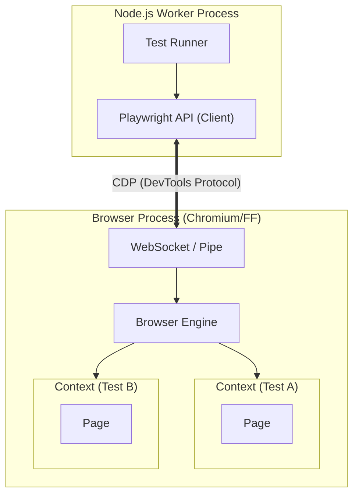

# Playwright Mastery

Playwright has revolutionized browser automation by fixing the "flakiness" inherent in older tools like Selenium. The key difference is architectural: Selenium talks to the browser through an HTTP middleman (WebDriver), like giving instructions through a translator. Playwright communicates directly with the browser engine via Chrome DevTools Protocol over a WebSocket -- a direct phone line. This bi-directional connection means Playwright can listen for events, intercept network requests, and react instantly instead of polling.

<Info>
**Goal**: Build a test suite that runs reliably in CI, executes in parallel, and handles complex authentication flows.
</Info>

---

## 1. Core Concepts & Architecture

### Browser, Context, Page
Understanding this three-layer hierarchy is the single most important concept in Playwright. Get this wrong and your tests will either be slow (launching too many browsers) or flaky (sharing state between tests).

1.  **Browser**: The heavy OS process (e.g., Chromium.exe). Think of it as opening the Chrome application. Expensive to start (~1-2 seconds).
2.  **Context**: An "Incognito Window" within that browser. Cheap to create (milliseconds). Each context has its own cookies, localStorage, and session -- complete isolation. **Tests usually run here.**
3.  **Page**: A single tab within a context. Most tests interact at this level.

**Playwright Test Runner Strategy**:
It launches the Browser *once* per worker, then creates a fresh *Context* for every test. This gives you **isolation** (no shared cookies) with **maximum speed** (no restarting browser).


```mermaid
flowchart TD
    subgraph Worker["Node.js Worker Process"]
        Runner["Test Runner"]
        API["Playwright API (Client)"]
        Runner --> API
    end

    subgraph Browser["Browser Process (Chromium/FF)"]
        WS["WebSocket / Pipe"]
        Engine["Browser Engine"]
        
        subgraph Context1["Context (Test A)"]
            Page1["Page"]
        end
        
        subgraph Context2["Context (Test B)"]
            Page2["Page"]
        end
    end

    API <== "CDP (DevTools Protocol)" ==> WS
    WS --> Engine
    Engine --> Context1
    Engine --> Context2
```

### Auto-Waiting (The "Flake Killer")
This is what makes Playwright fundamentally different from Selenium. Before every action, Playwright automatically performs "Actionability Checks" -- no more manual `sleep(2000)` or `waitForElement()` calls scattered throughout your tests.

Before `await page.click('#submit')`, Playwright automatically ensures:
1.  Element is attached to DOM (exists in the page).
2.  Element is visible (not `display: none` or `visibility: hidden`).
3.  Element is stable (not mid-animation or CSS transition).
4.  Element receives events (not covered by a modal, overlay, or loading spinner).
5.  Element is enabled (not `disabled` attribute).

If any check fails, Playwright retries until the timeout (default 30s). This alone eliminates the majority of flaky tests.

---

## 2. Advanced Selectors & Locators

Stop using XPath or fragile CSS selectors like `div > span:nth-child(3)`. These break the moment anyone touches the HTML structure. Playwright's locator engine encourages selectors that match how a user sees the page, not how a developer built it.

### User-Facing Locators (ARIA)
Always prefer these. They survive CSS refactors, component library changes, and even complete frontend rewrites -- because they are based on what the user sees and interacts with, not implementation details.

```typescript
// Best: Accessible Role -- matches what screen readers see
// Also tests your accessibility for free!
await page.getByRole('button', { name: /submit/i }).click();

// Good: Label text (for form inputs) -- matches the <label> element
await page.getByLabel('Email Address').fill('user@example.com');

// Good: Text content -- matches visible text on the page
await page.getByText('Welcome back').isVisible();

// Good: Test IDs -- fallback when no semantic locator works
// Requires data-testid attribute in your HTML
await page.getByTestId('checkout-btn').click();
```

### Layout Selectors
Find elements relative to others.
```typescript
await page.locator('input')
    .filter({ hasText: 'Name' }) // Filter list of inputs
    .click();

// Right-of, Left-of
await page.locator('button:right-of(:text("Username"))').click();
```

### Shadow DOM
Playwright pierces Shadow DOM by default.
`page.locator('my-custom-element button')` works automatically, even if `button` is in `#shadow-root`.

---

## 3. The Page Object Model (POM)

For any suite larger than 5 tests, you need the Page Object Model. Without it, you end up with selectors duplicated across dozens of test files -- and when a single CSS class or label changes, you are fixing 40 files instead of one. POM centralizes page interactions into reusable classes, giving you a single source of truth for each page's selectors and actions.

### Base Page Pattern

```typescript
// pages/BasePage.ts
import { Page } from '@playwright/test';

export class BasePage {
  constructor(protected page: Page) {}

  async navigate(path: string) {
    await this.page.goto(path);
  }
}
```

### Feature Page

```typescript
// pages/LoginPage.ts
import { BasePage } from './BasePage';
import { Locator } from '@playwright/test';

export class LoginPage extends BasePage {
  readonly usernameInput: Locator;
  readonly passwordInput: Locator;
  readonly submitBtn: Locator;

  constructor(page: Page) {
    super(page);
    this.usernameInput = page.getByLabel('Username');
    this.passwordInput = page.getByLabel('Password');
    this.submitBtn = page.getByRole('button', { name: 'Sign In' });
  }

  async login(user: string, pass: string) {
    await this.usernameInput.fill(user);
    await this.passwordInput.fill(pass);
    await this.submitBtn.click();
  }
}
```

### Usage in Test

```typescript
test('should login', async ({ page }) => {
  const loginPage = new LoginPage(page);
  await loginPage.navigate('/login');
  await loginPage.login('admin', '1234');
});
```

---

## 4. Network Control & API Testing

Playwright is a full HTTP client -- it can intercept, modify, or fabricate any network request the browser makes. This is incredibly powerful for testing: you can simulate server errors, test loading states, and eliminate backend dependencies entirely.

### Interception (Mocking)
Don't wait for your slow backend or wrestle with test data setup. Mock the API responses directly in the browser.

```typescript
// Mock specific endpoint -- intercept all requests matching this pattern
// and return a controlled response instead of hitting the real server
await page.route('**/api/user/profile', async route => {
  const json = { id: 1, name: 'Mocked User', plan: 'PRO' };
  await route.fulfill({ json }); // Respond with fake data
});

// Abort blocking resources (speeds up tests by skipping images/ads)
await page.route('**/*.{png,jpg,jpeg}', route => route.abort());

// Modify a real response (useful for testing edge cases)
await page.route('**/api/products', async route => {
  const response = await route.fetch(); // Get the real response
  const json = await response.json();
  json.products = json.products.slice(0, 1); // Trim to 1 product
  await route.fulfill({ json }); // Return the modified version
});
```

### API Testing (No Browser)
You can use Playwright as a replacement for Postman/Axios.

```typescript
test('create user via API', async ({ request }) => {
  const response = await request.post('https://api.example.com/users', {
    data: { name: 'Alice', job: 'Engineer' }
  });
  
  expect(response.ok()).toBeTruthy();
  expect(await response.json()).toMatchObject({ 
    name: 'Alice', 
    id: expect.any(String) 
  });
});
```

---

## 5. Global Setup & Authentication

Don't log in before *every* test. Authentication is the most common bottleneck in E2E test suites -- if every test navigates to the login page, fills in credentials, and clicks "Sign In", you are wasting 3-5 seconds per test. Instead, log in *once*, save the browser state (cookies + localStorage) to a file, and inject it into every subsequent test.

### 1. Global Setup (`global-setup.ts`)

```typescript
import { chromium, FullConfig } from '@playwright/test';

async function globalSetup(config: FullConfig) {
  const browser = await chromium.launch();
  const page = await browser.newPage();
  
  await page.goto('https://example.com/login');
  await page.getByLabel('User').fill('admin');
  await page.getByLabel('Pass').fill('secret');
  await page.click('button');
  
  // Save cookies/localstorage to file
  await page.context().storageState({ path: 'storageState.json' });
  await browser.close();
}
export default globalSetup;
```

### 2. Config (`playwright.config.ts`)

```typescript
export default defineConfig({
  globalSetup: require.resolve('./global-setup'),
  use: {
    // Inject auth state into all tests
    storageState: 'storageState.json',
  },
});
```

Now every test starts as "Logged In"!

---

## 6. Visual Regression Testing

Detect pixel-perfect changes by comparing screenshots against approved baselines. This catches subtle CSS regressions that functional tests miss entirely -- a button shifting 10px to the right, a font-weight change, or a z-index overlap.

```typescript
test('landing page visual check', async ({ page }) => {
  await page.goto('/');
  // Takes a screenshot and compares it pixel-by-pixel with the stored reference.
  // First run creates the baseline; subsequent runs compare against it.
  await expect(page).toHaveScreenshot('landing-page.png', {
    maxDiffPixels: 100, // Tolerance for minor anti-aliasing differences across OS/GPU
  });
});
```
**Updating Snapshots**: When the UI changes intentionally, run:
`npx playwright test --update-snapshots`

**Practical tip**: Visual tests are sensitive to OS-level font rendering differences. Run visual tests in CI (Linux) only, or use Docker containers locally to match the CI environment. Otherwise you will get false positives between your Mac and the CI server.

---

## 7. Scaling with CI/CD

### Parallelism & Sharding
Playwright tests are inherently parallelizable because each test gets its own Context (isolated browser state). Sharding takes this further by splitting your test files across multiple CI machines. A suite taking 1 hour on one machine can take 10-15 minutes with 4 shards running in parallel.

**GitHub Actions Sharding Example**:

```yaml
jobs:
  test:
    strategy:
      fail-fast: false
      matrix:
        shardIndex: [1, 2, 3, 4]
        shardTotal: [4]
    runs-on: ubuntu-latest
    steps:
      - uses: actions/checkout@v3
      - uses: actions/setup-node@v3
      - run: npm ci
      - run: npx playwright install --with-deps
      
      - name: Run Playwright Tests
        run: npx playwright test --shard=${{ matrix.shardIndex }}/${{ matrix.shardTotal }}
        
      - name: Upload Blob Report
        if: always()
        uses: actions/upload-artifact@v3
        with:
          name: all-blob-reports
          path: blob-report
          retention-days: 1
```

**Merge Reports**: After all shards finish, you download the "blobs" and merge them into one HTML report using `npx playwright merge-reports`.

---

## 8. Common Pitfalls & Debugging

<AccordionGroup>
  <Accordion title="Hydration Errors (React/Next.js)">
    **Symptom**: Test fails immediately because button "is not stable" or clicks do nothing.
    **Cause**: Playwright is too fast. It clicks before React attaches event listeners (Hydration).
    **Fix**:
    1.  Use `await expect(locator).toBeEnabled()` to wait for hydration.
    2.  Check for a specific hydration indicator (e.g., `data-hydrated="true"`).
  </Accordion>

  <Accordion title="Multiple Tabs / New Windows">
    **Symptom**: `await page.click('#open-new-tab')` works, but subsequent commands fail.
    **Cause**: Playwright stays on the *old* page. It does not automatically switch focus.
    **Fix**:
    ```typescript
    const [newPage] = await Promise.all([
      context.waitForEvent('page'),
      page.click('#open-new-tab') // Triggers the event
    ]);
    await newPage.waitForLoadState();
    ```
  </Accordion>

  <Accordion title="Element Not Visible">
    **Symptom**: `Timeout 30000ms waiting for locator(...)`
    **Cause**: Element is technically in DOM but hidden by CSS `display:none` or behind a sticky header.
    **Fix**: Use `.scrollIntoViewIfNeeded()` or check `force: true` (use sparingly).
  </Accordion>
</AccordionGroup>

---

## 9. Interview Questions

<AccordionGroup>
  <Accordion title="How does Playwright differ from Selenium architecture?">
    **Selenium** uses the WebDriver protocol (HTTP JSON wire protocol). Commands are sent via HTTP, which is slower and flaky.
    **Playwright** uses the **Chrome DevTools Protocol (CDP)** (and similar for FF/WebKit) over a WebSocket. This allows bi-directional communication, enabling features like Auto-waiting, Network Interception, and capturing Console logs directly.
  </Accordion>

  <Accordion title="Explain the difference between Browser, Context, and Page.">
    *   **Browser**: The OS process (Expensive). Launched once.
    *   **Context**: An isolation layer (Incognito profile). Stores cookies/storage. Created for each test.
    *   **Page**: A single tab/window within a context.
    Running tests in new **Contexts** (instead of new Browsers) allows Playwright to run hundreds of tests in parallel efficiently.
  </Accordion>

  <Accordion title="How do you handle flaky tests in Playwright?">
    1.  **Auto-waiting**: Ensure I'm avoiding manual sleeps.
    2.  **Web-First Assertions**: Use `await expect(loc).toBeVisible()` instead of `loc.isVisible()`.
    3.  **Tracing**: Enable Trace Viewer on CI to see the snapshot *exactly* when it failed.
    4.  **Retries**: Configure `retries: 2` in config for known unstable environments.
  </Accordion>
</AccordionGroup>

---

## 10. Cheat Sheet

```typescript
// Selectors
page.getByRole('button', { name: 'Submit' });
page.getByLabel('User Name');
page.locator('div').filter({ hasText: 'Item' });

// Actions
await page.goto('https://example.com');
await page.click('#btn');
await page.fill('#input', 'text');
await page.check('#checkbox');
await page.dragAndDrop('#source', '#target');

// Assertions
await expect(locator).toBeVisible();
await expect(locator).toHaveText(/Welcome/);
await expect(locator).toHaveValue('123');
await expect(page).toHaveURL(/dashboard/);

// Network Mocking
await page.route('**/api/data', route =>
  route.fulfill({
    status: 200,
    body: JSON.stringify({ key: 'value' })
  })
);

// Debugging
await page.pause(); // Opens Inspector
// command: npx playwright test --ui
```

---

## Interview Deep-Dive

<AccordionGroup>
  <Accordion title="Q: Your E2E test suite has a 15% flakiness rate in CI. Walk me through your systematic approach to diagnosing and reducing flaky Playwright tests.">
    **Strong Answer:**

    A 15% flake rate means roughly 1 in 7 test runs has at least one spurious failure. That is high enough to erode team trust in CI -- developers start ignoring failures and merging anyway. Here is how I would attack it systematically.

    - **Step 1 -- Enable Trace Viewer on all CI failures**: Configure `trace: 'on-first-retry'` in `playwright.config.ts`. This captures a DOM snapshot, network log, and screenshot at every action for failed tests. Trace Viewer is the single most valuable debugging tool because it shows you exactly what the page looked like when the assertion failed, not what you imagine it looked like.
    - **Step 2 -- Categorize flake sources**: In my experience, flaky E2E tests fall into three buckets: (a) timing issues -- the test acts before the page is ready, (b) test data pollution -- tests depend on shared state (a database row, a user session), and (c) environment instability -- CI machines have different performance characteristics than local dev.
    - **Step 3 -- Fix timing issues**: Replace any manual `page.waitForTimeout(2000)` with web-first assertions: `await expect(locator).toBeVisible()` instead of `await locator.isVisible()`. The former retries automatically until the timeout; the latter checks once and returns immediately. Also check for hydration races in React/Next.js apps -- Playwright can click a button before React attaches the event handler. The fix is waiting for a hydration indicator: `await page.locator('[data-hydrated=true]').waitFor()`.
    - **Step 4 -- Fix data pollution**: Each test should get a fresh browser context (Playwright does this by default), but if tests share a backend database, one test's writes can corrupt another. The fix is either API-level test isolation (each test creates its own user/data via API calls in `beforeEach`) or database transactions that roll back after each test.
    - **Step 5 -- Add retries as a last resort**: `retries: 2` in config gives failing tests two more chances. This is a band-aid, not a fix, but it reduces the impact while you address root causes. Track which tests use retries and treat them as tech debt.

    **Follow-up: How does Playwright's auto-waiting mechanism work under the hood, and why does it not eliminate all flakiness?**

    Before every action (click, fill, check), Playwright runs "actionability checks" in a retry loop: is the element attached to the DOM, visible, stable (not animating), receiving events (not covered by an overlay), and enabled? It retries until all checks pass or the timeout expires. This eliminates the majority of flakes caused by element readiness. But it cannot fix application-level race conditions -- for example, a click that triggers an API call whose response updates the DOM. If your assertion runs before the API responds, Playwright's auto-waiting on the action is irrelevant because the action completed successfully; the data just has not arrived yet. That is why you need `await expect(locator).toHaveText('...')` web-first assertions for post-action verification.
  </Accordion>

  <Accordion title="Q: Compare Playwright's architecture with Selenium's. Why does the protocol choice (CDP vs WebDriver) matter in practice?">
    **Strong Answer:**

    The architectural difference is not just academic -- it directly explains why Playwright tests are faster and less flaky.

    - **Selenium (WebDriver protocol)**: Commands travel over HTTP. The test sends a JSON-encoded command to a WebDriver server, which translates it into browser-specific instructions, executes the command, and returns a JSON response. This is a request-response model -- the test cannot receive events from the browser unless it polls. Want to know when a network request completes? You poll. Want to intercept a request? You cannot, at least not natively. The HTTP middleman also adds latency per command.
    - **Playwright (Chrome DevTools Protocol / equivalent)**: Communication happens over a persistent WebSocket connection. This is bidirectional -- the browser can push events to the test (network request started, console message logged, page navigated) without the test asking. This enables features that are architecturally impossible in Selenium: network interception (route and modify requests in-flight), console log capture, auto-waiting (the browser tells Playwright when an element becomes stable), and tracing.
    - **Practical impact**: In Selenium, intercepting a network request to mock an API response requires setting up a proxy server (like BrowserMob Proxy) as a separate process. In Playwright, it is `page.route('**/api/*', handler)` -- one line, in-process, no external dependencies. Similarly, Selenium's `WebDriverWait` polls the DOM at intervals (typically 500ms); Playwright's auto-wait is event-driven, reacting within milliseconds of a change.

    The trade-off: Selenium supports more browsers through its standardized WebDriver protocol (it works with any browser that implements the WebDriver spec). Playwright supports Chromium, Firefox, and WebKit, which covers the vast majority of real-world usage but excludes niche browsers.

    **Follow-up: Can Playwright do anything that is genuinely impossible in Selenium, not just harder?**

    Yes. Modifying an in-flight network response (intercepting the real response, changing the JSON body, and forwarding the modified version to the browser) is architecturally impossible in standard WebDriver because the protocol has no concept of request interception. Playwright's `route.fetch()` followed by `route.fulfill()` with modified data does this natively. Similarly, capturing browser-level performance metrics (Layout Shift, First Contentful Paint) requires CDP access that Selenium does not provide through its protocol.
  </Accordion>

  <Accordion title="Q: You are designing a Playwright test suite for a large e-commerce application with authentication, multiple user roles, and complex checkout flows. Walk me through your architecture decisions.">
    **Strong Answer:**

    For a large E2E suite, architecture decisions made in week one determine whether the suite is maintainable in month six. Here is how I would structure it.

    - **Authentication strategy**: Log in once in `global-setup.ts`, save the storage state (cookies + localStorage) to JSON files -- one per role (`admin-state.json`, `customer-state.json`, `guest-state.json`). Tests declare which role they need via the `storageState` option. This eliminates the 3-5 second login flow from every test. For tests that specifically test the login flow itself, use a project with no `storageState`.
    - **Page Object Model with composition**: Create page objects for each page (`LoginPage`, `ProductPage`, `CheckoutPage`) and component objects for reusable UI elements (`NavBar`, `CartDrawer`, `SearchModal`). Page objects encapsulate selectors and actions; they never contain assertions. Tests compose page objects: `const checkout = new CheckoutPage(page); await checkout.addItem('SKU-123'); await checkout.applyPromoCode('SAVE20');`. This means when the checkout flow changes, you update one class, not 40 test files.
    - **Test data strategy**: Use API calls in `beforeEach` to create test-specific data (products, orders, users) rather than relying on seed data. This makes each test independent and parallelizable. For example: `const product = await api.createProduct({ name: 'Test Widget', price: 9.99 })` at the start of a checkout test. Clean up in `afterEach` or rely on ephemeral test environments.
    - **Parallelism configuration**: Use Playwright's `projects` to split by browser (Chromium, Firefox, WebKit) and by category (smoke tests, full regression). Smoke tests run on every PR; full regression runs nightly. Configure `fullyParallel: true` and set `workers` to match CI machine cores.
    - **Network mocking boundary**: Mock third-party services (payment gateways, email providers, analytics) at the network level using `page.route()`. Never mock your own application's APIs in E2E tests -- the whole point is testing the full stack. The exception is simulating error conditions (500 responses, timeout scenarios) that are hard to trigger against a real backend.

    **Follow-up: How do you handle tests that require multiple users interacting simultaneously, like a chat application?**

    Playwright supports multiple browser contexts within a single test. You create two contexts (one per user), each with its own storage state, and drive them in parallel: `const aliceContext = await browser.newContext({ storageState: 'alice-state.json' }); const bobContext = await browser.newContext({ storageState: 'bob-state.json' })`. Then `alicePage.getByRole('textbox').fill('Hello'); await bobPage.waitForText('Hello')`. This runs in a single test, giving you deterministic control over the interaction sequence without needing separate test processes.
  </Accordion>

  <Accordion title="Q: When would you choose Playwright's API testing capabilities over a dedicated tool like Postman or a unit-test-level HTTP client like supertest?">
    **Strong Answer:**

    Playwright's `request` fixture is surprisingly powerful for API testing, but it occupies a specific niche.

    - **Choose Playwright API testing when**: You need API tests that share authentication state with your E2E tests. Since Playwright's `request` context can use the same `storageState` as browser tests, you get cookie-based auth for free. This is ideal for testing authenticated API endpoints alongside the UI that calls them -- same test suite, same auth setup, no duplication. It is also the right choice when you want to set up test data via API before running a browser test, all within a single Playwright project.
    - **Choose supertest when**: You are testing a Node.js server in isolation, especially during development. Supertest spins up your Express/Fastify app in-process, so there is no network overhead and you get sub-millisecond response times. It is a unit/integration testing tool, not an E2E tool.
    - **Choose Postman/Insomnia when**: You need a manual exploration tool, team-shared collections, or documentation-as-tests for an API contract. Postman excels at developer workflow and API documentation, not CI automation.

    The key insight is that Playwright API testing is not trying to replace Postman or supertest -- it fills the gap of "API tests that run in the same CI pipeline as browser tests and share infrastructure." If your test needs to call an API and then verify the result in the browser, Playwright lets you do both without switching tools.

    **Follow-up: Can you use Playwright's network interception and API testing together in a single test?**

    Yes, and this is a powerful pattern. You can call `request.post('/api/orders', { data: orderPayload })` to create an order via the real API, then use `page.route('**/api/shipping', handler)` to mock only the shipping calculation response, and finally navigate the browser to the order page to verify the UI renders correctly with the mocked shipping cost. This gives you real data flow for most of the stack while controlling specific edge cases at the network boundary.
  </Accordion>
</AccordionGroup>
