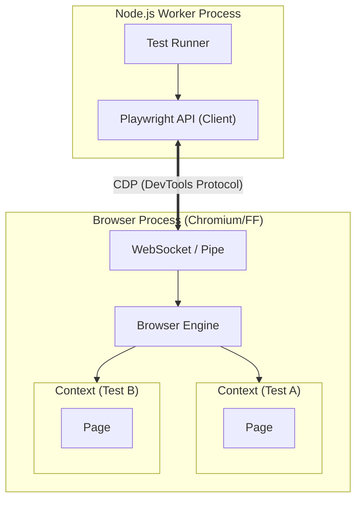

# Playwright Mastery

Playwright has revolutionized browser automation by fixing the "flakiness" inherent in older tools like Selenium. It communicates directly with the browser engine (via Chrome DevTools Protocol), bypassing the slow WebDriver HTTP layer.

<Info>
**Goal**: Build a test suite that runs reliably in CI, executes in parallel, and handles complex authentication flows.
</Info>

---

## 1. Core Concepts & Architecture

### Browser, Context, Page
Understanding this hierarchy is key to speed and isolation.

1.  **Browser**: The heavy OS process (e.g., Chromium.exe). Expensive to start.
2.  **Context**: An "Incognito Window". Cheap to create (milliseconds). Stores cookies/storage. **Tests usually run here.**
3.  **Page**: A single tab within a context.

**Playwright Test Runner Strategy**:
It launches the Browser *once* per worker, then creates a fresh *Context* for every test. This gives you **isolation** (no shared cookies) with **maximum speed** (no restarting browser).



### Auto-Waiting (The "Flake Killer")
Playwright performs "Actionability Checks" before actions.
Before `await page.click('#submit')`, it ensures:
1.  Element is attached to DOM.
2.  Element is visible.
3.  Element is stable (not animating).
4.  Element receives events (not covered by a modal).
5.  Element is enabled.

---

## 2. Advanced Selectors & Locators

Stop using XPath. Playwright's locator engine is powerful.

### User-Facing Locators (ARIA)
Always prefer these. They withstand refactors.

```typescript
// Best: Accessible Role
await page.getByRole('button', { name: /submit/i }).click();

// Good: Label text (for form inputs)
await page.getByLabel('Email Address').fill('user@example.com');

// Good: Text content
await page.getByText('Welcome back').isVisible();
```

### Layout Selectors
Find elements relative to others.
```typescript
await page.locator('input')
    .filter({ hasText: 'Name' }) // Filter list of inputs
    .click();

// Right-of, Left-of
await page.locator('button:right-of(:text("Username"))').click();
```

### Shadow DOM
Playwright pierces Shadow DOM by default.
`page.locator('my-custom-element button')` works automatically, even if `button` is in `#shadow-root`.

---

## 3. The Page Object Model (POM)

For any suite larger than 5 tests, you need POM. Avoid spaghetti code.

### Base Page Pattern

```typescript
// pages/BasePage.ts
import { Page } from '@playwright/test';

export class BasePage {
  constructor(protected page: Page) {}

  async navigate(path: string) {
    await this.page.goto(path);
  }
}
```

### Feature Page

```typescript
// pages/LoginPage.ts
import { BasePage } from './BasePage';
import { Locator } from '@playwright/test';

export class LoginPage extends BasePage {
  readonly usernameInput: Locator;
  readonly passwordInput: Locator;
  readonly submitBtn: Locator;

  constructor(page: Page) {
    super(page);
    this.usernameInput = page.getByLabel('Username');
    this.passwordInput = page.getByLabel('Password');
    this.submitBtn = page.getByRole('button', { name: 'Sign In' });
  }

  async login(user: string, pass: string) {
    await this.usernameInput.fill(user);
    await this.passwordInput.fill(pass);
    await this.submitBtn.click();
  }
}
```

### Usage in Test

```typescript
test('should login', async ({ page }) => {
  const loginPage = new LoginPage(page);
  await loginPage.navigate('/login');
  await loginPage.login('admin', '1234');
});
```

---

## 4. Network Control & API Testing

Playwright is a full HTTP client.

### Interception (Mocking)
Don't wait for your slow backend. Mock it.

```typescript
// Mock specific endpoint
await page.route('**/api/user/profile', async route => {
  const json = { id: 1, name: 'Mocked User', plan: 'PRO' };
  await route.fulfill({ json });
});

// Abort blocking resources (Ads/Analytics)
await page.route('**/*.{png,jpg,jpeg}', route => route.abort());
```

### API Testing (No Browser)
You can use Playwright as a replacement for Postman/Axios.

```typescript
test('create user via API', async ({ request }) => {
  const response = await request.post('https://api.example.com/users', {
    data: { name: 'Alice', job: 'Engineer' }
  });
  
  expect(response.ok()).toBeTruthy();
  expect(await response.json()).toMatchObject({ 
    name: 'Alice', 
    id: expect.any(String) 
  });
});
```

---

## 5. Global Setup & Authentication

Don't log in before *every* test. Log in *once*, save the state, and reuse.

### 1. Global Setup (`global-setup.ts`)

```typescript
import { chromium, FullConfig } from '@playwright/test';

async function globalSetup(config: FullConfig) {
  const browser = await chromium.launch();
  const page = await browser.newPage();
  
  await page.goto('https://example.com/login');
  await page.getByLabel('User').fill('admin');
  await page.getByLabel('Pass').fill('secret');
  await page.click('button');
  
  // Save cookies/localstorage to file
  await page.context().storageState({ path: 'storageState.json' });
  await browser.close();
}
export default globalSetup;
```

### 2. Config (`playwright.config.ts`)

```typescript
export default defineConfig({
  globalSetup: require.resolve('./global-setup'),
  use: {
    // Inject auth state into all tests
    storageState: 'storageState.json',
  },
});
```

Now every test starts as "Logged In"!

---

## 6. Visual Regression Testing

Detect pixel-perfect changes.

```typescript
test('landing page visual check', async ({ page }) => {
  await page.goto('/');
  // Takes screenshot and compares with reference in file system
  await expect(page).toHaveScreenshot('landing-page.png', {
    maxDiffPixels: 100, // Tolerance for minor anti-aliasing diffs
  });
});
```
**Updating Snapshots**: When the UI changes intentionally, run:
`npx playwright test --update-snapshots`

---

## 7. Scaling with CI/CD

### Parallelism & Sharding
A suite taking 1 hour can take 10 minutes with sharding.

**GitHub Actions Sharding Example**:

```yaml
jobs:
  test:
    strategy:
      fail-fast: false
      matrix:
        shardIndex: [1, 2, 3, 4]
        shardTotal: [4]
    runs-on: ubuntu-latest
    steps:
      - uses: actions/checkout@v3
      - uses: actions/setup-node@v3
      - run: npm ci
      - run: npx playwright install --with-deps
      
      - name: Run Playwright Tests
        run: npx playwright test --shard=${{ matrix.shardIndex }}/${{ matrix.shardTotal }}
        
      - name: Upload Blob Report
        if: always()
        uses: actions/upload-artifact@v3
        with:
          name: all-blob-reports
          path: blob-report
          retention-days: 1
```

**Merge Reports**: After all shards finish, you download the "blobs" and merge them into one HTML report using `npx playwright merge-reports`.

---

## 8. Common Pitfalls & Debugging

<AccordionGroup>
  <Accordion title="Hydration Errors (React/Next.js)">
    **Symptom**: Test fails immediately because button "is not stable" or clicks do nothing.
    **Cause**: Playwright is too fast. It clicks before React attaches event listeners (Hydration).
    **Fix**:
    1.  Use `await expect(locator).toBeEnabled()` to wait for hydration.
    2.  Check for a specific hydration indicator (e.g., `data-hydrated="true"`).
  </Accordion>

  <Accordion title="Multiple Tabs / New Windows">
    **Symptom**: `await page.click('#open-new-tab')` works, but subsequent commands fail.
    **Cause**: Playwright stays on the *old* page. It does not automatically switch focus.
    **Fix**:
    ```typescript
    const [newPage] = await Promise.all([
      context.waitForEvent('page'),
      page.click('#open-new-tab') // Triggers the event
    ]);
    await newPage.waitForLoadState();
    ```
  </Accordion>

  <Accordion title="Element Not Visible">
    **Symptom**: `Timeout 30000ms waiting for locator(...)`
    **Cause**: Element is technically in DOM but hidden by CSS `display:none` or behind a sticky header.
    **Fix**: Use `.scrollIntoViewIfNeeded()` or check `force: true` (use sparingly).
  </Accordion>
</AccordionGroup>

---

## 9. Interview Questions

<AccordionGroup>
  <Accordion title="How does Playwright differ from Selenium architecture?">
    **Selenium** uses the WebDriver protocol (HTTP JSON wire protocol). Commands are sent via HTTP, which is slower and flaky.
    **Playwright** uses the **Chrome DevTools Protocol (CDP)** (and similar for FF/WebKit) over a WebSocket. This allows bi-directional communication, enabling features like Auto-waiting, Network Interception, and capturing Console logs directly.
  </Accordion>

  <Accordion title="Explain the difference between Browser, Context, and Page.">
    *   **Browser**: The OS process (Expensive). Launched once.
    *   **Context**: An isolation layer (Incognito profile). Stores cookies/storage. Created for each test.
    *   **Page**: A single tab/window within a context.
    Running tests in new **Contexts** (instead of new Browsers) allows Playwright to run hundreds of tests in parallel efficiently.
  </Accordion>

  <Accordion title="How do you handle flaky tests in Playwright?">
    1.  **Auto-waiting**: Ensure I'm avoiding manual sleeps.
    2.  **Web-First Assertions**: Use `await expect(loc).toBeVisible()` instead of `loc.isVisible()`.
    3.  **Tracing**: Enable Trace Viewer on CI to see the snapshot *exactly* when it failed.
    4.  **Retries**: Configure `retries: 2` in config for known unstable environments.
  </Accordion>
</AccordionGroup>

---

## 10. Cheat Sheet

```typescript
// Selectors
page.getByRole('button', { name: 'Submit' });
page.getByLabel('User Name');
page.locator('div').filter({ hasText: 'Item' });

// Actions
await page.goto('https://example.com');
await page.click('#btn');
await page.fill('#input', 'text');
await page.check('#checkbox');
await page.dragAndDrop('#source', '#target');

// Assertions
await expect(locator).toBeVisible();
await expect(locator).toHaveText(/Welcome/);
await expect(locator).toHaveValue('123');
await expect(page).toHaveURL(/dashboard/);

// Network Mocking
await page.route('**/api/data', route =>
  route.fulfill({
    status: 200,
    body: JSON.stringify({ key: 'value' })
  })
);

// Debugging
await page.pause(); // Opens Inspector
// command: npx playwright test --ui
```
