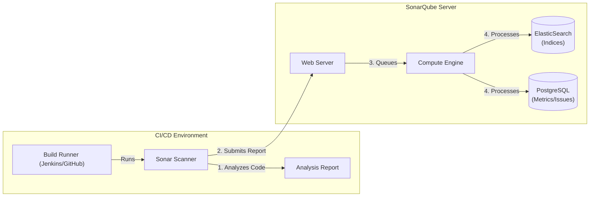

# Sonarqube Mastery

SonarQube is the industry standard for automated code analysis. While a linter like ESLint is like a spell-checker (catches surface-level mistakes in individual files), SonarQube is more like a full editorial review -- it analyzes data flow across your entire codebase, tracks technical debt over time, and enforces quality standards at the CI/CD gate. It moves beyond simple linting to provide a comprehensive view of "Code Health" across bugs, vulnerabilities, and maintainability.

<Info>
**Prerequisites**: Basic understanding of CI/CD concepts and Docker.
**Goal**: Transform from "running a scanner" to "managing technical debt" at scale.
</Info>

---

## 1. Architecture & Internals

Understanding how SonarQube works under the hood is critical for debugging analysis failures and optimizing performance. Most teams treat SonarQube as a black box ("run scanner, check dashboard"), but when the analysis silently drops coverage data or takes 45 minutes, you need to know which component is responsible.

### The Component View
The SonarQube platform is composed of four main components that work together in a pipeline:

1.  **SonarQube Server**:
    *   **Web Server**: Serves the UI and API.
    *   **Search Server**: An embedded Elasticsearch instance. It indexes issues and metrics for instant retrieval.
    *   **Compute Engine (CE)**: The workhorse. It processes reports submitted by scanners. This is where the heavy lifting (diff calculations, issue persistence) happens.

2.  **Database**:
    *   Stores configuration (Quality profiles, user settings).
    *   Stores snapshots of code metrics.
    *   *Supported DBs*: PostgreSQL (Recommended), Oracle, SQL Server.
    *   *Warning*: The embedded `H2` database is for testing **only**. It cannot scale.

3.  **Scanner**:
    *   Runs on your Build Agent (Jenkins, GitHub Actions runner).
    *   Parses source code files.
    *   Runs language specific sensors (e.g., Java Sensor, JS Sensor).
    *   Sends a "Report" bundle to the Server for processing.

4.  **Plugins**:
    *   Language support (Java, C#, Python, etc.).
    *   Integration (LDAP, GitHub Auth).



### The Analysis Lifecycle

1.  **Checkout**: CI Server checks out code.
2.  **Scan**: Scanner runs. It downloads "Quality Profiles" (Rules) from the server.
3.  **Report**: Scanner finds issues locally and bundles them into a report.
4.  **Submit**: Report sent to Server.
5.  **Queue**: Server puts report in a queue.
6.  **Processing**: Compute Engine picks up report, calculates "New Code" diffs, applies Quality Gates.
7.  **Webhook**: Server notifies CI system of Pass/Fail status.

---

## 2. Production Installation (Docker Compose)

Running `docker run sonarqube` is fine for testing, but for production, you need persistence and performance tuning.

### `docker-compose.yml`

```yaml
version: "3"

services:
  sonarqube:
    image: sonarqube:lts-community
    depends_on:
      - db
    environment:
      SONAR_JDBC_URL: jdbc:postgresql://db:5432/sonar
      SONAR_JDBC_USERNAME: sonar
      SONAR_JDBC_PASSWORD: sonar
    volumes:
      - sonarqube_data:/opt/sonarqube/data
      - sonarqube_extensions:/opt/sonarqube/extensions
      - sonarqube_logs:/opt/sonarqube/logs
    ports:
      - "9000:9000"
    ulimits:
      nofile:
        soft: 65536
        hard: 65536

  db:
    image: postgres:15
    environment:
      POSTGRES_USER: sonar
      POSTGRES_PASSWORD: sonar
    volumes:
      - postgresql:/var/lib/postgresql/data
    volumes:
      - postgresql_data:/var/lib/postgresql/data

volumes:
  sonarqube_data:
  sonarqube_extensions:
  sonarqube_logs:
  postgresql_data:
```

### Kernel Tuning (Crucial!)
Elasticsearch requires specific system settings. On the host machine (Linux):

```bash
# Increase mapped memory areas
sysctl -w vm.max_map_count=262144

# Increase file descriptors
ulimit -n 65536
```
If you don't do this, SonarQube will crash on startup with ES errors.

---

## 3. Analysis Strategies

### The Token System
Never use username/password for scanners -- if they leak (and they will, in CI logs or config files), an attacker gets full access to your SonarQube instance. Tokens are revocable, scopeable, and auditable. Generate tokens at the appropriate scope:
*   **User Token**: Tied to a user account. If the person leaves the company, the token dies with their account.
*   **Project Analysis Token**: Specific to a single project (Best for automated pipelines -- principle of least privilege).
*   **Global Analysis Token**: Can scan any project. Use sparingly and rotate regularly.

### Scanner Selection

| Build Tool | Method | Pros | Cons |
|:---|:---|:---|:---|
| **Maven** | `mvn sonar:sonar` | Auto-detects modules, tests, binaries | Requires full build |
| **Gradle** | `./gradlew sonar` | excellent multi-module support | Slow configuration |
| **NPM** | `sonarqube-scanner` npm package | easy integration for JS apps | Manual config needed |
| **CLI** | `sonar-scanner` | Generic, works for everything | Must download binary |

### Configuration: `sonar-project.properties`
For CLI usage, this file is mandatory.

```properties
sonar.projectKey=my-org_frontend
sonar.organization=my-org
sonar.sources=src
sonar.tests=tests

# Exclusions are CRITICAL for speed and noise reduction
sonar.exclusions=**/*.test.js,**/coverage/**,**/dist/**
sonar.coverage.exclusions=**/config/**,**/dto/**

# LCOV report path (generated by Jest/PyTest)
sonar.javascript.lcov.reportPaths=coverage/lcov.info
```

---

## 4. Quality Gates Strategy

A **Quality Gate** is the boolean PASS/FAIL check that determines whether a build is safe for production. Think of it as a bouncer at a club door -- it does not care about the people already inside (existing code), it only checks the people trying to enter (new code).

### The "New Code" Philosophy
This is the single most important concept in SonarQube strategy, and it is what separates teams that successfully manage technical debt from those that drown in it. The most important metrics are on **New Code**. You cannot fix 5 years of technical debt in a day, but you *can* ensure no **new** debt is added. Over time, as old code gets refactored naturally, the overall quality improves without requiring a dedicated "fix all the bugs" sprint.

**Recommended Setup**:
*   **New Code Definition**: "Previous Version" or "Number of days" (e.g., 30 days).
*   **Gate Conditions**:
    *   Coverage on New Code < 80% → **FAIL**
    *   Duplication on New Code < 3% → **FAIL**
    *   Maintainability Rating on New Code is worse than A → **FAIL**
    *   Blocker Issues on New Code > 0 → **FAIL**

### Monorepo Strategy
If you have one repo with 10 services:
1.  **One Project**: Analyze root. Good for overview, bad for ownership.
2.  **Multiple Projects**: Run scanner separately for `services/a`, `services/b`.
    *   Use `sonar.projectKey=monorepo:service-a`
    *   Use `sonar.sources=services/a`

---

## 5. Security Analysis (SAST) & Clean Code

### Taint Analysis
SonarQube Community Edition includes basic SAST (Static Application Security Testing). Developer Edition adds Taint Analysis, which is a fundamentally more powerful approach to finding security vulnerabilities.

Think of taint analysis like tracking a dye through a water system:
*   **Source**: Where "tainted" (untrusted) data enters -- user input (e.g., `req.query.id`), file reads, API responses.
*   **Sink**: Where tainted data is dangerous -- sensitive functions (e.g., `db.query()`, `eval()`, `innerHTML`).
*   **Sanitizer**: Code that removes the "taint" by cleaning or validating the input (e.g., parameterized queries, escaping functions).

SonarQube builds a control flow graph of your entire application to trace whether data flows from a Source to a Sink without passing through a Sanitizer. If it does, that is a potential injection vulnerability (SQL injection, XSS, path traversal, etc.).

### Cognitive Complexity vs Cyclomatic Complexity
These two metrics answer fundamentally different questions about your code:
*   **Cyclomatic Complexity**: "How many paths exist through this code?" A mathematical count of branches. Useful for determining minimum test cases needed.
*   **Cognitive Complexity**: "How hard is this code for a human to understand?" It penalizes nesting and control flow breaks (like `break`, `continue`, `goto`) that force the reader to hold more context in their head.

*Example*:
A switch statement with 10 cases has Cyclomatic=10 (high), but Cognitive=1 (low) because it is a flat, easy-to-read structure -- each case is independent.
Three nested `if` statements inside a `for` loop have Cyclomatic=4 (modest), but Cognitive complexity is much higher because the reader must mentally track all the conditions simultaneously. A senior engineer would say: "Cognitive complexity better reflects the actual maintenance burden of code."

---

## 6. CI/CD Integration (Jenkins & GitHub)

### The "Break The Build" Pattern
The most common mistake teams make with SonarQube is treating it as an advisory dashboard -- developers check the results when they feel like it (which is never). The correct pattern is to make the pipeline **block** on SonarQube's verdict: if the Quality Gate fails, the build fails, and the code cannot be merged. This is non-negotiable for teams serious about code quality.

### Jenkins Pipeline

```groovy
pipeline {
    agent any
    stages {
        stage('Build & Test') {
            steps {
                sh 'npm install && npm test' // Generates coverage
            }
        }
        stage('SonarQube Analysis') {
            steps {
                withSonarQubeEnv('SonarQube-Server') {
                    sh 'npm run sonar' // Runs scanner
                }
            }
        }
        stage('Quality Gate') {
            steps {
                timeout(time: 5, unit: 'MINUTES') {
                    // Polls SonarQube for status
                    waitForQualityGate abortPipeline: true
                }
            }
        }
    }
}
```
*Note*: The `waitForQualityGate` step requires the SonarQube Server to define a **Webhook** pointing back to Jenkins.

### GitHub Actions

```yaml
jobs:
  sonar:
    runs-on: ubuntu-latest
    steps:
      - uses: actions/checkout@v3
        with:
          fetch-depth: 0  # REQUIRED: Shallow clones break 'New Code' detection
      
      - name: SonarQube Scan
        uses: sonarsource/sonarqube-scan-action@master
        env:
          SONAR_TOKEN: ${{ secrets.SONAR_TOKEN }}
          SONAR_HOST_URL: ${{ secrets.SONAR_HOST_URL }}
      
      - name: Quality Gate Check
        uses: sonarsource/sonarqube-quality-gate-action@master
        timeout-minutes: 5
        env:
          SONAR_TOKEN: ${{ secrets.SONAR_TOKEN }}
```

---

## 7. Advanced Administration

### Webhooks for ChatOps
Configure a Webhook in **Administration > Configuration > Webhooks**.
*   **URL**: Your custom bot endpoint.
*   **Event**: Analysis Completed.

**Payload Example**:
```json
{
  "serverUrl": "http://localhost:9000",
  "taskId": "AX123...",
  "status": "SUCCESS",
  "qualityGate": {
    "status": "ERROR",
    "conditions": [
      { "metric": "new_coverage", "operator": "LESS_THAN", "value": "50", "errorThreshold": "80", "status": "ERROR" }
    ]
  }
}
```

### Permission Templates
Don't assign permissions manually. Create a **Template**.
*   **Pattern**: `.*-finance`
*   **Permissions**: Grant `Finance-Group` Admin access.
When a new project `my-app-finance` is created, it auto-inherits these rules.

### Housekeeping
Database size grows fast. Configure **Database Cleaner**:
*   Delete analysis history older than 5 years.
*   Delete closed issues after 30 days.

---

## 8. Common Pitfalls & Debugging

<AccordionGroup>
  <Accordion title="The 'New Code' Trap">
    **Symptom**: Pull Request shows 0 new lines, or "New Code" quality gate passes even when adding bugs.
    **Cause**: CI performs a shallow clone (`git clone --depth 1`). SonarQube cannot compute the diff.
    **Fix**: Always fetch full history or at least the target branch.
    ```yaml
    - uses: actions/checkout@v3
      with:
        fetch-depth: 0  # CRITICAL
    ```
  </Accordion>

  <Accordion title="ES_JAVA_OPTS Errors">
    **Symptom**: SonarQube container crashes immediately. Log says `max virtual memory areas vm.max_map_count [65530] is too low`.
    **Cause**: Elasticsearch requirement.
    **Fix**: Run `sysctl -w vm.max_map_count=262144` on the HOST machine.
  </Accordion>

  <Accordion title="Missing Coverage">
    **Symptom**: Analysis succeeds but Coverage is 0.0%.
    **Cause**: SonarQube does NOT run tests. It only *reads* reports.
    **Fix**: Ensure your build step (Maven/Jest) actually generates the `.xml` or `.lcov` file before the scanner runs.
  </Accordion>
</AccordionGroup>

---

## 9. Interview Questions

<AccordionGroup>
  <Accordion title="How does SonarQube differ from a Linter (ESLint/Pylint)?">
    **Linters** analyze single files for syntax and basic style errors.
    **SonarQube** performs **Static Application Security Testing (SAST)**. It builds a Control Flow Graph of the entire application to find complex issues like:
    *   **Taint Analysis**: Data flow from User Input -> SQL Query (Injection).
    *   **Cross-File Duplication**: Copy-pasted blocks across different modules.
    *   **Cognitive Complexity**: Architectural maintainability metrics.
  </Accordion>

  <Accordion title="What is the difference between a Quality Profile and a Quality Gate?">
    *   **Quality Profile**: "The Rules". A set of active rules (e.g., "Field names must be camelCase") used during analysis.
    *   **Quality Gate**: "The Verdict". A set of boolean conditions (e.g., "Blocker Issues > 0" = FAIL) used to determine if usage is safe for production.
  </Accordion>

  <Accordion title="Explain the concept of 'Leak Period' (New Code).">
    The Leak Period defines what constitutes "New Code" (e.g., "Code changed in the last 30 days" or "Since version 1.0").
    Focusing on the Leak Period is the most effective way to improve legacy codebases. Instead of trying to fix 10,000 existing bugs, you enforce a strict Quality Gate only on the *new* code, ensuring technical debt stops growing.
  </Accordion>
</AccordionGroup>

---

## 10. Cheat Sheet

```bash
# Docker Quickstart
docker run -d -p 9000:9000 sonarqube:lts-community

# Maven Analysis
mvn clean verify sonar:sonar \
  -Dsonar.projectKey=my-app \
  -Dsonar.host.url=http://localhost:9000 \
  -Dsonar.login=sqp_...

# Gradle Analysis
./gradlew sonar \
  -Dsonar.projectKey=my-app

# CLI Scanner (sonar-project.properties)
sonar.projectKey=my-app
sonar.sources=src
sonar.exclusions=**/*.test.js
sonar.tests=tests
sonar.test.inclusions=**/*.test.js
sonar.javascript.lcov.reportPaths=coverage/lcov.info
```

---

## Interview Deep-Dive

<AccordionGroup>
  <Accordion title="Q: Your team's SonarQube Quality Gate passes consistently, but production bugs are still getting through. What is wrong with your quality gate strategy, and how would you fix it?">
    **Strong Answer:**

    A passing Quality Gate that does not prevent production bugs is a false sense of security. In my experience, this happens for three specific reasons.

    - **The gate is too lenient on new code coverage**: If the gate requires 60% coverage on new code, developers can write tests that exercise the happy path and skip edge cases entirely. I would raise the new code coverage threshold to 80% and add a condition for branch coverage specifically, not just line coverage.
    - **The gate ignores cognitive complexity**: Most default quality gates check for bugs and vulnerabilities but not cognitive complexity. A 200-line function with 15 nested conditionals will pass the gate as long as it has no "bug" patterns. But that function is where production bugs live because humans cannot reason about it correctly during code review. I would add a condition: "Cognitive Complexity on New Code worse than B = FAIL."
    - **Tests are testing the wrong things**: SonarQube measures coverage quantity, not quality. If tests assert trivial things or snapshot entire components without meaningful assertions, coverage is high but defect detection is zero. SonarQube cannot fix this -- it requires a cultural change: code reviewers must review tests as critically as production code.
    - **The "New Code" period is misconfigured**: If the New Code period is set to "previous version" but your team deploys continuously, every commit is a "version" and the new code window is tiny. I would set the new code period to a rolling 30-day window or tie it to a meaningful release branch.

    The deeper issue is treating SonarQube as a quality guarantee rather than a quality signal. It catches a specific class of defects but cannot catch business logic errors, race conditions, or integration failures.

    **Follow-up: How would you handle pushback from a team that says "the quality gate is blocking our velocity"?**

    This is almost always a sign that the gate is correctly doing its job. I would pull data: look at how many gate failures are caused by missing coverage versus actual bugs. If it is primarily coverage, the team needs better testing habits, not a lower gate. If the gate is triggering on false positives, tune the Quality Profile. The non-negotiable stance: the gate exists because we decided we care about quality. Lowering it because it is inconvenient is the same as removing your seatbelt because it is uncomfortable.
  </Accordion>

  <Accordion title="Q: Explain how SonarQube's taint analysis works and why it catches vulnerabilities that a linter like ESLint cannot.">
    **Strong Answer:**

    Taint analysis is a fundamentally different approach to finding security vulnerabilities compared to pattern-matching linters.

    - **What ESLint does**: Pattern matching on a single file. ESLint can flag `eval(userInput)` but has no concept of where `userInput` came from. It cannot trace that `userInput` originated from `req.query.search` three files and four function calls ago.
    - **What SonarQube taint analysis does**: It builds a Control Flow Graph (CFG) of your entire application -- across files, across function boundaries. It labels certain entry points as "sources" (user input: `req.query`, `req.body`) and certain operations as "sinks" (dangerous functions: `db.query()`, `eval()`). It traces whether any data can flow from a source to a sink without passing through a "sanitizer."
    - **Concrete example**: In file A, `const id = req.params.id`. In file B, `function getUser(id) { return db.query('SELECT * FROM users WHERE id = ' + id) }`. In file C, `app.get('/user/:id', (req) => getUser(req.params.id))`. ESLint sees three files that each look fine individually. SonarQube traces the full data flow and flags the SQL injection vulnerability.

    The trade-off is performance and cost. Taint analysis requires building the entire application graph and is only available in SonarQube's Developer Edition.

    **Follow-up: What are the limitations of taint analysis? When does it produce false positives?**

    Common false positives include: data that passes through a custom validation function SonarQube does not recognize as a sanitizer, data validated at the framework level (e.g., an ORM that parameterizes queries automatically), and data flowing through complex generic abstractions. The fix is tuning: register custom sanitizers, suppress known false positives, and review the "won't fix" category periodically.
  </Accordion>

  <Accordion title="Q: What is the difference between Cognitive Complexity and Cyclomatic Complexity, and why does SonarQube prefer Cognitive Complexity?">
    **Strong Answer:**

    These metrics answer fundamentally different questions about your code.

    - **Cyclomatic Complexity**: Counts linearly independent paths. Every `if`, `for`, `while`, `case` adds 1. A switch with 10 cases scores 10. Useful for determining minimum test cases, but does not reflect readability.
    - **Cognitive Complexity**: Measures how hard the code is for a human to process. A `switch` with 10 flat cases scores 1 (easy to read). Three nested `if` statements inside a `for` loop score much higher because the reader must hold all conditions in working memory simultaneously.
    - **Why SonarQube prefers Cognitive Complexity**: It better predicts where bugs will occur. The 10-case switch is not where bugs hide. The nested conditionals are where developers make mistakes.

    **Example**: Refactoring a flat `if/else if` chain (Cyclomatic 8, Cognitive ~8) to a lookup table drops Cognitive to 0 while keeping the same behavior. Cyclomatic complexity cannot express that improvement.

    **Follow-up: How would you use cognitive complexity metrics practically in a code review?**

    I set a threshold in the Quality Profile: any function exceeding cognitive complexity of 15 is flagged. In code review, I use it as an objective signal: "this function has cognitive complexity 22 -- can we extract the validation logic to bring it under 15?" In CI, I configure the quality gate to fail if new code introduces any function with cognitive complexity above 20.
  </Accordion>

  <Accordion title="Q: Your CI shows 0% coverage in SonarQube even though Jest reports 85% locally. What went wrong?">
    **Strong Answer:**

    This is one of the top three SonarQube support issues, and the root cause is almost always a pipeline ordering or pathing problem.

    - **Most likely cause: Coverage report not generated before the scanner ran**. SonarQube does not run tests -- it only reads reports. If the workflow runs `sonar-scanner` before `npm test -- --coverage`, the scanner sees no report file.
    - **Second: The `sonar.javascript.lcov.reportPaths` property points to the wrong path**. Jest might output to a different location than the scanner expects. Verify the actual path in CI, then update properties to match.
    - **Third: Shallow clone breaks coverage mapping**. If `fetch-depth: 1` is used, set `fetch-depth: 0` in the checkout step for proper new code detection.
    - **Fourth: Source path mismatch**. If `sonar.sources=src` but the LCOV report uses different relative or absolute paths, the scanner cannot match coverage to source files.

    The diagnostic approach: Check scanner logs for "Analysing 0 coverage reports" (report not found) or "Coverage report has no coverage data" (found but empty or mismatched).

    **Follow-up: How do you verify coverage data was correctly ingested?**

    Check the SonarQube dashboard "Measures" tab for "Coverage." If 0.0%, click into per-file breakdown. No files listed means the report was not found. Files listed with 0% means path mapping failed. You can also use the API: `curl "http://sonar:9000/api/measures/component?component=project-key&metricKeys=coverage"` for programmatic checks in CI.
  </Accordion>
</AccordionGroup>
