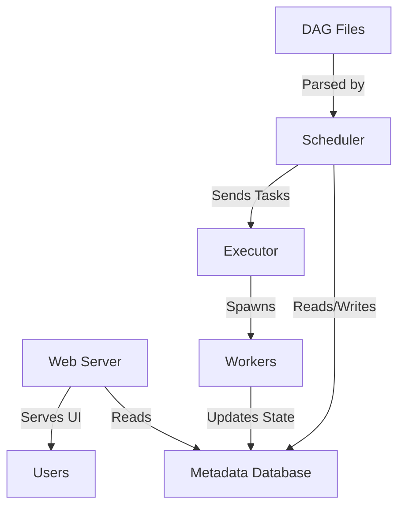

# Apache Airflow: Workflow Orchestration Mastery

<Info>
**Module Level**: Foundation
**Prerequisites**: Python basics, understanding of data pipelines
**Duration**: 2-3 hours
**Key Concepts**: Workflow orchestration, DAGs, Airflow architecture, use cases
</Info>

## What is Apache Airflow?

Apache Airflow is an **open-source workflow orchestration platform** for programmatically authoring, scheduling, and monitoring complex data pipelines. Created by Airbnb in 2014 and donated to Apache Software Foundation in 2016, Airflow has become the industry standard for data pipeline orchestration.

<Note>
**Core Philosophy**: "Workflows as Code" - Define pipelines programmatically using Python, enabling version control, testing, and dynamic generation.
</Note>

### The Problem Airflow Solves

Before Airflow, data teams faced several challenges:

<AccordionGroup>
  <Accordion title="1. Complex Dependencies" icon="project-diagram">
    **The Challenge**: Managing task dependencies in ETL pipelines.

    Example: A reporting pipeline needs to:
    1. Extract data from 3 different databases
    2. Wait for all extractions to complete
    3. Transform and merge the data
    4. Load to data warehouse
    5. Generate reports
    6. Send email notifications

    **Without Airflow**: Cron jobs with sleep statements, brittle shell scripts, manual coordination.

    **With Airflow**: Declarative dependency management through DAGs (Directed Acyclic Graphs).
  </Accordion>

  <Accordion title="2. Lack of Visibility" icon="eye">
    **The Challenge**: No centralized view of pipeline status, failures, or execution history.

    **Without Airflow**: Scattered logs, manual monitoring, discovering failures hours later.

    **With Airflow**: Rich web UI showing real-time status, execution history, logs, and metrics.
  </Accordion>

  <Accordion title="3. Error Handling & Retries" icon="rotate">
    **The Challenge**: Networks fail, APIs timeout, databases become unavailable.

    **Without Airflow**: Custom retry logic in every script, inconsistent behavior.

    **With Airflow**: Built-in retry mechanisms, exponential backoff, alerting on failures.
  </Accordion>

  <Accordion title="4. Scalability Issues" icon="chart-line">
    **The Challenge**: Running pipelines at scale across distributed infrastructure.

    **Without Airflow**: Resource contention, manual parallelization, cluster management complexity.

    **With Airflow**: Multiple executor options (Celery, Kubernetes) for distributed execution.
  </Accordion>
</AccordionGroup>

## Workflow Orchestration vs ETL Tools

Understanding the distinction is crucial for choosing the right tool.

### Workflow Orchestrator (Airflow)

```python
# Airflow: Orchestrates WHERE and WHEN tasks run, not HOW they process data

from airflow import DAG
from airflow.operators.bash import BashOperator
from airflow.providers.apache.spark.operators.spark_submit import SparkSubmitOperator
from airflow.providers.google.cloud.operators.bigquery import BigQueryInsertJobOperator
from datetime import datetime

with DAG(
    'etl_orchestration',
    start_date=datetime(2024, 1, 1),
    schedule='@daily',
    catchup=False
) as dag:

    # Airflow orchestrates external tools
    extract_postgres = BashOperator(
        task_id='extract_from_postgres',
        bash_command='python /scripts/extract_postgres.py'
    )

    # Spark does the heavy transformation
    transform_spark = SparkSubmitOperator(
        task_id='transform_data',
        application='/spark_jobs/transform.py',
        conn_id='spark_cluster'
    )

    # BigQuery loads the data
    load_bigquery = BigQueryInsertJobOperator(
        task_id='load_to_bigquery',
        configuration={
            'load': {
                'sourceUris': ['gs://bucket/transformed/*'],
                'destinationTable': {'projectId': 'my-project', 'datasetId': 'analytics', 'tableId': 'sales'}
            }
        }
    )

    extract_postgres >> transform_spark >> load_bigquery
```

**Airflow's Role**:
- Schedule when jobs run
- Manage dependencies between tasks
- Handle failures and retries
- Monitor execution
- Coordinate multiple tools (Spark, dbt, SQL databases, APIs)

### ETL Tool (Talend, Informatica, SSIS)

```python
# ETL Tools: Define HOW data is transformed (visual or code)
# They are the WORKERS, not the ORCHESTRATOR

# Example: Talend Job (conceptual)
# 1. GUI-based job design
# 2. Drag-and-drop components
# 3. Built-in transformations
# 4. Usually handles: Extract → Transform → Load in one tool

# Limitations:
# - Often proprietary and expensive
# - Limited scheduling capabilities
# - Harder to version control (XML-based)
# - Less flexible for complex workflows
```

### Comparison Matrix

<CardGroup cols={3}>
  <Card title="Airflow (Orchestrator)" icon="wind">
    **Strengths**:
    - Complex workflow coordination
    - Multi-tool integration
    - Programmatic (Python)
    - Open source, extensible
    - Strong community

    **Weaknesses**:
    - Doesn't transform data itself
    - Steeper learning curve
    - Requires infrastructure
  </Card>

  <Card title="ETL Tools (Workers)" icon="gears">
    **Strengths**:
    - Built-in transformations
    - Visual development
    - Pre-built connectors
    - Integrated metadata

    **Weaknesses**:
    - Often expensive
    - Vendor lock-in
    - Limited orchestration
    - Hard to test/version
  </Card>

  <Card title="Modern Stack" icon="layer-group">
    **Best Practice**:
    - Airflow for orchestration
    - dbt for SQL transformations
    - Spark for big data
    - Python for custom logic
    - Cloud services (S3, BigQuery)

    **Result**: Best tool for each job
  </Card>
</CardGroup>

## Airflow Architecture Overview

Understanding Airflow's architecture is crucial for production deployments.

### Core Components



<Steps>
  <Step title="Web Server">
    **Purpose**: Provides the user interface for monitoring and managing workflows.

    **Responsibilities**:
    - Render DAG structures
    - Display task execution status
    - Show logs and task duration
    - Trigger manual DAG runs
    - Manage connections and variables

    **Technology**: Flask-based web application

    **Note**: The web server only reads from the metadata database, it doesn't schedule tasks.
  </Step>

  <Step title="Scheduler">
    **Purpose**: The brain of Airflow - determines what tasks need to run and when.

    **Responsibilities**:
    - Parse DAG files to discover tasks
    - Determine task dependencies
    - Check if tasks are ready to run (dependencies satisfied, schedule met)
    - Submit tasks to the executor
    - Handle task retries and failures

    **How it works**:
    ```python
    # Simplified scheduler logic
    while True:
        # 1. Parse DAG files
        dags = parse_dag_directory()

        # 2. Create DAG runs for schedules
        for dag in dags:
            if should_create_dag_run(dag):
                create_dag_run(dag)

        # 3. Schedule tasks that are ready
        for dag_run in active_dag_runs:
            for task in dag_run.get_runnable_tasks():
                executor.queue_task(task)

        # 4. Handle task state changes
        process_executor_events()

        sleep(scheduler_interval)  # Default: 5 seconds
    ```

    **Critical**: Only ONE scheduler should be active (multi-scheduler support in Airflow 2.0+).
  </Step>

  <Step title="Executor">
    **Purpose**: Defines HOW and WHERE tasks actually run.

    **Types**:

    1. **SequentialExecutor** (Default, Development Only)
       - Runs one task at a time
       - SQLite compatible
       - NOT for production

    2. **LocalExecutor** (Single Machine)
       - Runs tasks in parallel on same machine
       - Requires PostgreSQL/MySQL
       - Good for small-medium workloads

    3. **CeleryExecutor** (Distributed)
       - Runs tasks across multiple worker machines
       - Requires message broker (Redis/RabbitMQ)
       - Horizontal scalability

    4. **KubernetesExecutor** (Cloud Native)
       - Spawns a Kubernetes pod per task
       - Dynamic scaling
       - Resource isolation

    We'll deep dive into executors in Module 7.
  </Step>

  <Step title="Metadata Database">
    **Purpose**: Single source of truth for all Airflow state.

    **Stores**:
    - DAG definitions and schedules
    - Task instances and their states
    - Task execution history
    - Variables, connections, and configuration
    - User permissions and roles

    **Supported Databases**:
    - PostgreSQL (recommended)
    - MySQL
    - SQLite (dev only)

    **Schema Example**:
    ```sql
    -- Key tables in Airflow metadata DB

    -- DAGs and their configuration
    SELECT * FROM dag;

    -- Individual DAG executions
    SELECT * FROM dag_run
    WHERE dag_id = 'my_pipeline'
    ORDER BY execution_date DESC;

    -- Task execution instances
    SELECT task_id, state, start_date, end_date, duration
    FROM task_instance
    WHERE dag_id = 'my_pipeline'
      AND execution_date = '2024-01-15'
    ORDER BY start_date;

    -- Connection configurations (encrypted)
    SELECT conn_id, conn_type, host, port
    FROM connection;
    ```
  </Step>

  <Step title="Workers">
    **Purpose**: Processes that actually execute tasks.

    **Behavior varies by executor**:
    - **LocalExecutor**: Subprocesses on scheduler machine
    - **CeleryExecutor**: Separate machines running Celery workers
    - **KubernetesExecutor**: Kubernetes pods

    **Worker Process**:
    ```python
    # What happens when a worker executes a task

    # 1. Receive task from executor
    task = get_task_from_queue()

    # 2. Update task state to RUNNING
    update_task_state(task, State.RUNNING)

    # 3. Execute the task logic
    try:
        result = task.execute(context)
        update_task_state(task, State.SUCCESS)
    except Exception as e:
        if task.retries < task.max_retries:
            update_task_state(task, State.UP_FOR_RETRY)
        else:
            update_task_state(task, State.FAILED)
        log_error(e)
    ```
  </Step>
</Steps>

### Execution Flow: DAG to Task Completion

```python
# Detailed execution flow

"""
1. DAG FILE PARSING (Scheduler)
   - Scheduler scans dag_folder every min_file_process_interval
   - Parses Python files to discover DAG objects
   - Updates metadata DB with DAG structure
"""

# Example DAG file
from airflow import DAG
from airflow.operators.python import PythonOperator
from datetime import datetime

def extract():
    print("Extracting data...")

def transform():
    print("Transforming data...")

with DAG('etl_pipeline', start_date=datetime(2024, 1, 1), schedule='@daily') as dag:
    extract_task = PythonOperator(task_id='extract', python_callable=extract)
    transform_task = PythonOperator(task_id='transform', python_callable=transform)
    extract_task >> transform_task


"""
2. DAG RUN CREATION (Scheduler)
   - Scheduler checks if schedule interval has passed
   - Creates DagRun in metadata DB
   - DagRun represents one execution of the entire DAG
"""

# Scheduler logic (simplified)
if current_time >= (last_run_time + schedule_interval):
    dag_run = DagRun(
        dag_id='etl_pipeline',
        execution_date=logical_date,
        state=State.RUNNING
    )
    save_to_db(dag_run)


"""
3. TASK SCHEDULING (Scheduler)
   - For each DagRun, scheduler creates TaskInstances
   - Checks dependencies (upstream tasks completed?)
   - Queues tasks that are ready
"""

for task in dag.tasks:
    if all(upstream_task.state == State.SUCCESS for upstream_task in task.upstream_tasks):
        task_instance = TaskInstance(
            task=task,
            execution_date=dag_run.execution_date,
            state=State.QUEUED
        )
        executor.queue_task(task_instance)


"""
4. TASK EXECUTION (Executor → Worker)
   - Executor sends task to worker
   - Worker runs task logic
   - Updates task state in DB
"""

# Worker execution
task_instance.state = State.RUNNING
try:
    task_instance.task.execute(context={'execution_date': dag_run.execution_date})
    task_instance.state = State.SUCCESS
except Exception:
    task_instance.state = State.FAILED

"""
5. DAG RUN COMPLETION (Scheduler)
   - When all tasks complete, DagRun marked as SUCCESS or FAILED
   - Triggers cleanup, callbacks, and next schedule
"""
```

## When to Use Airflow

### Ideal Use Cases

<CardGroup cols={2}>
  <Card title="Batch ETL/ELT Pipelines" icon="database">
    **Perfect Fit**

    Daily/hourly data ingestion from multiple sources to data warehouse.

    ```python
    with DAG('daily_etl', schedule='@daily') as dag:
        extract_salesforce = SalesforceToS3Operator(...)
        extract_postgres = PostgresToS3Operator(...)
        transform_dbt = BashOperator(bash_command='dbt run')
        load_snowflake = S3ToSnowflakeOperator(...)

        [extract_salesforce, extract_postgres] >> transform_dbt >> load_snowflake
    ```

    **Why Airflow?**
    - Complex dependencies
    - Multiple data sources
    - Needs retry logic
    - Requires monitoring
  </Card>

  <Card title="Machine Learning Pipelines" icon="brain">
    **Perfect Fit**

    Scheduled model training, evaluation, and deployment.

    ```python
    with DAG('ml_pipeline', schedule='@weekly') as dag:
        fetch_new_data = PythonOperator(...)
        validate_data = GreatExpectationsOperator(...)
        train_model = BashOperator(bash_command='python train.py')
        evaluate_model = PythonOperator(...)
        deploy_model = KubernetesPodOperator(...)

        fetch_new_data >> validate_data >> train_model >> evaluate_model >> deploy_model
    ```

    **Why Airflow?**
    - Schedule regular retraining
    - Data validation gates
    - A/B testing coordination
    - Model versioning
  </Card>

  <Card title="Data Quality Monitoring" icon="clipboard-check">
    **Perfect Fit**

    Scheduled data quality checks and alerting.

    ```python
    with DAG('data_quality', schedule='0 */4 * * *') as dag:  # Every 4 hours
        check_completeness = SQLCheckOperator(
            sql="SELECT COUNT(*) FROM orders WHERE date = {{ ds }}",
            pass_value=lambda count: count > 1000
        )
        check_duplicates = SQLValueCheckOperator(...)
        alert_on_failure = SlackWebhookOperator(...)

        [check_completeness, check_duplicates] >> alert_on_failure
    ```
  </Card>

  <Card title="Multi-System Orchestration" icon="project-diagram">
    **Perfect Fit**

    Coordinating tasks across different platforms.

    ```python
    with DAG('cross_platform', schedule='@daily') as dag:
        trigger_spark = SparkSubmitOperator(...)
        run_dbt = BashOperator(bash_command='dbt run')
        update_tableau = TableauRefreshWorkbookOperator(...)
        send_report = EmailOperator(...)

        trigger_spark >> run_dbt >> update_tableau >> send_report
    ```
  </Card>
</CardGroup>

### When NOT to Use Airflow

<Warning>
Airflow is not always the right choice. Avoid using it for:
</Warning>

<AccordionGroup>
  <Accordion title="Real-Time Event Processing" icon="bolt">
    **Problem**: Airflow schedules tasks at intervals (seconds at minimum), not instant event reaction.

    **Example Bad Use**:
    ```python
    # BAD: Trying to use Airflow for real-time
    with DAG('process_events', schedule_interval='@once') as dag:
        # This won't work for real-time!
        process_event = PythonOperator(...)
    ```

    **Use Instead**:
    - **Kafka + Flink**: For true real-time stream processing
    - **AWS Lambda**: For event-driven serverless
    - **Spark Streaming**: For micro-batch processing

    **When Airflow Fits**: Batch processing results from real-time systems
    ```python
    # GOOD: Hourly aggregation of Kafka topics
    with DAG('aggregate_events', schedule='@hourly') as dag:
        aggregate_kafka = SparkSubmitOperator(
            application='aggregate_kafka_to_warehouse.py'
        )
    ```
  </Accordion>

  <Accordion title="Simple Cron Jobs" icon="clock">
    **Problem**: Airflow adds complexity for simple scheduled scripts.

    **Example Overkill**:
    ```python
    # OVERKILL: Just run a backup script daily
    with DAG('simple_backup', schedule='@daily') as dag:
        backup = BashOperator(bash_command='/scripts/backup.sh')
    ```

    **Use Instead**: Regular cron job
    ```bash
    # crontab
    0 2 * * * /scripts/backup.sh
    ```

    **When Airflow Fits**: When you need monitoring, retries, or task dependencies
    ```python
    # JUSTIFIED: Backup with validation and notification
    with DAG('backup_pipeline', schedule='@daily') as dag:
        backup = BashOperator(bash_command='/scripts/backup.sh')
        validate = PythonOperator(python_callable=validate_backup)
        upload_offsite = S3UploadOperator(...)
        notify = SlackWebhookOperator(...)

        backup >> validate >> upload_offsite >> notify
    ```
  </Accordion>

  <Accordion title="Infinite Running Services" icon="infinity">
    **Problem**: Airflow tasks should complete, not run indefinitely.

    **Example Bad Use**:
    ```python
    # BAD: API server as Airflow task
    def run_api_server():
        app = Flask(__name__)
        app.run(port=5000)  # Never returns!

    with DAG('api_service') as dag:
        api = PythonOperator(python_callable=run_api_server)  # Will never finish
    ```

    **Use Instead**:
    - Docker containers
    - Kubernetes deployments
    - Systemd services

    **When Airflow Fits**: Deploying/updating those services
    ```python
    # GOOD: Deploy new API version
    with DAG('deploy_api', schedule=None, catchup=False) as dag:
        build_image = DockerOperator(...)
        deploy_k8s = KubernetesPodOperator(...)
        health_check = HttpSensor(...)

        build_image >> deploy_k8s >> health_check
    ```
  </Accordion>

  <Accordion title="Complex Branching Logic" icon="code-branch">
    **Problem**: Airflow DAGs are meant to be acyclic; complex conditional flows get messy.

    **Example Difficult in Airflow**:
    ```python
    # DIFFICULT: Complex business logic with many conditions
    with DAG('complex_workflow') as dag:
        check = BranchPythonOperator(python_callable=lambda: ...)
        path_a = PythonOperator(...)
        path_b = PythonOperator(...)
        path_c = PythonOperator(...)
        # 10 more branches...
        # Hard to visualize and maintain
    ```

    **Better Tool**: Apache Beam, AWS Step Functions

    **When Airflow Fits**: Clear, predictable workflow with minimal branching
  </Accordion>
</AccordionGroup>

## Airflow vs Alternatives

### Feature Comparison

| Feature | Airflow | Prefect | Dagster | Luigi | AWS Step Functions |
|---------|---------|---------|---------|-------|-------------------|
| **Open Source** | ✅ Yes | ✅ Yes (Hybrid) | ✅ Yes | ✅ Yes | ❌ Proprietary |
| **Language** | Python | Python | Python | Python | JSON (States) |
| **DAG Definition** | Code | Code | Code | Code | Visual/JSON |
| **Dynamic DAGs** | ✅ Excellent | ✅ Excellent | ✅ Excellent | ⚠️ Limited | ❌ No |
| **UI Quality** | ⭐⭐⭐⭐ | ⭐⭐⭐⭐⭐ | ⭐⭐⭐⭐⭐ | ⭐⭐⭐ | ⭐⭐⭐⭐ |
| **Scalability** | ⭐⭐⭐⭐ | ⭐⭐⭐⭐⭐ | ⭐⭐⭐⭐ | ⭐⭐⭐ | ⭐⭐⭐⭐⭐ |
| **Learning Curve** | Steep | Moderate | Moderate | Easy | Easy |
| **Community** | Huge | Growing | Growing | Moderate | N/A |
| **Managed Service** | Astronomer, MWAA | Prefect Cloud | Dagster+ | ❌ No | Built-in AWS |
| **Best For** | General ETL | Modern workflows | Data platforms | Simple pipelines | AWS-native |

### When to Choose Each

<CardGroup cols={2}>
  <Card title="Choose Airflow If..." icon="wind">
    - Established enterprise with existing Airflow
    - Need maximum flexibility and extensibility
    - Strong Python team
    - Want proven, battle-tested solution
    - Open source is critical
    - Rich provider ecosystem needed
  </Card>

  <Card title="Choose Prefect If..." icon="water">
    - Starting fresh (no legacy)
    - Want modern developer experience
    - Need dynamic workflows
    - Prefer cloud-native approach
    - Value better UI/UX
    - Negative engineering appeals to you
  </Card>

  <Card title="Choose Dagster If..." icon="layer-group">
    - Building data platform
    - Heavy focus on data quality
    - Need strong typing and testing
    - Asset-oriented thinking
    - Want integrated data catalog
  </Card>

  <Card title="Choose AWS Step Functions If..." icon="aws">
    - Fully on AWS
    - Serverless preferred
    - Simple workflows
    - Don't want to manage infrastructure
    - Need AWS service integrations
  </Card>
</CardGroup>

## Key Concepts: The Mental Model

### DAG (Directed Acyclic Graph)

```python
"""
DAG: A collection of tasks with defined dependencies

DIRECTED: Tasks have order (A → B → C)
ACYCLIC: No loops (can't go back to previous task)
GRAPH: Visual representation of workflow
"""

from airflow import DAG
from airflow.operators.python import PythonOperator
from datetime import datetime

# The DAG is the container
with DAG(
    dag_id='my_pipeline',           # Unique identifier
    start_date=datetime(2024, 1, 1), # When DAG becomes active
    schedule='@daily',               # How often to run
    catchup=False                    # Don't backfill historical runs
) as dag:

    # Tasks are the nodes
    task_a = PythonOperator(task_id='task_a', python_callable=lambda: print('A'))
    task_b = PythonOperator(task_id='task_b', python_callable=lambda: print('B'))
    task_c = PythonOperator(task_id='task_c', python_callable=lambda: print('C'))

    # Dependencies define the edges
    task_a >> task_b >> task_c  # A then B then C

    # Equivalent to:
    # task_a.set_downstream(task_b)
    # task_b.set_downstream(task_c)
```

**Visualization**:
```
    ┌─────────┐
    │ Task A  │ (Extract)
    └────┬────┘
         │
         ▼
    ┌─────────┐
    │ Task B  │ (Transform)
    └────┬────┘
         │
         ▼
    ┌─────────┐
    │ Task C  │ (Load)
    └─────────┘
```

### Operators: The Building Blocks

```python
"""
Operators define WHAT each task does
Airflow has 100+ built-in operators for different systems
"""

from airflow.operators.bash import BashOperator
from airflow.operators.python import PythonOperator
from airflow.providers.postgres.operators.postgres import PostgresOperator
from airflow.providers.http.operators.http import SimpleHttpOperator

with DAG('operator_examples', start_date=datetime(2024, 1, 1), schedule=None) as dag:

    # Execute shell commands
    bash_task = BashOperator(
        task_id='run_script',
        bash_command='python /scripts/process.py'
    )

    # Execute Python functions
    def process_data(**context):
        print(f"Processing for {context['ds']}")  # ds = execution date

    python_task = PythonOperator(
        task_id='process',
        python_callable=process_data
    )

    # Execute SQL queries
    sql_task = PostgresOperator(
        task_id='insert_data',
        postgres_conn_id='my_postgres',
        sql="INSERT INTO table VALUES (...)"
    )

    # Call HTTP APIs
    api_task = SimpleHttpOperator(
        task_id='call_api',
        http_conn_id='my_api',
        endpoint='/trigger',
        method='POST'
    )
```

### Task Instance: Execution Record

```python
"""
TaskInstance = Task + Execution Date
Records one execution of a task for a specific DAG run
"""

# Conceptual example
task_instance = TaskInstance(
    task=extract_task,
    execution_date=datetime(2024, 1, 15),
    state='running',  # queued, running, success, failed, up_for_retry
    start_date=datetime(2024, 1, 15, 2, 0, 0),
    end_date=None,
    duration=None,
    try_number=1,
    max_tries=3
)

# Query task instances
from airflow.models import TaskInstance as TI

# Get all failed task instances
failed_tasks = TI.query.filter(
    TI.state == 'failed',
    TI.execution_date >= datetime(2024, 1, 1)
).all()
```

## Real-World Architecture Example

```python
"""
Complete E-commerce Data Pipeline
Runs daily at 2 AM to process previous day's data
"""

from airflow import DAG
from airflow.operators.python import PythonOperator
from airflow.providers.postgres.operators.postgres import PostgresOperator
from airflow.providers.amazon.aws.transfers.s3_to_redshift import S3ToRedshiftOperator
from airflow.providers.slack.operators.slack_webhook import SlackWebhookOperator
from datetime import datetime, timedelta

default_args = {
    'owner': 'data-team',
    'depends_on_past': False,
    'email': ['data-alerts@company.com'],
    'email_on_failure': True,
    'email_on_retry': False,
    'retries': 2,
    'retry_delay': timedelta(minutes=5),
}

with DAG(
    'ecommerce_daily_pipeline',
    default_args=default_args,
    description='Daily ETL for e-commerce analytics',
    schedule='0 2 * * *',  # 2 AM daily
    start_date=datetime(2024, 1, 1),
    catchup=False,
    tags=['production', 'analytics', 'daily']
) as dag:

    # Extract from operational databases
    extract_orders = PostgresOperator(
        task_id='extract_orders',
        postgres_conn_id='prod_db',
        sql="""
            COPY (
                SELECT * FROM orders
                WHERE order_date = '{{ ds }}'  -- Templated execution date
            ) TO '/tmp/orders_{{ ds }}.csv' WITH CSV HEADER;
        """
    )

    extract_customers = PostgresOperator(
        task_id='extract_customers',
        postgres_conn_id='prod_db',
        sql="COPY (SELECT * FROM customers WHERE updated_at >= '{{ ds }}') TO '/tmp/customers_{{ ds }}.csv';"
    )

    # Upload to S3 (data lake)
    def upload_to_s3(**context):
        import boto3
        s3 = boto3.client('s3')
        ds = context['ds']
        s3.upload_file(f'/tmp/orders_{ds}.csv', 'data-lake', f'raw/orders/{ds}/orders.csv')
        s3.upload_file(f'/tmp/customers_{ds}.csv', 'data-lake', f'raw/customers/{ds}/customers.csv')

    upload = PythonOperator(
        task_id='upload_to_s3',
        python_callable=upload_to_s3
    )

    # Transform with dbt (running in separate container)
    transform = BashOperator(
        task_id='transform_dbt',
        bash_command='cd /dbt && dbt run --models tag:daily'
    )

    # Load to Redshift data warehouse
    load_orders = S3ToRedshiftOperator(
        task_id='load_orders_to_redshift',
        s3_bucket='data-lake',
        s3_key='transformed/orders/{{ ds }}/orders.parquet',
        redshift_conn_id='redshift',
        schema='analytics',
        table='fact_orders',
        copy_options=['PARQUET']
    )

    # Data quality checks
    def check_data_quality(**context):
        from airflow.providers.postgres.hooks.postgres import PostgresHook
        hook = PostgresHook(postgres_conn_id='redshift')

        # Check record count
        result = hook.get_first("SELECT COUNT(*) FROM analytics.fact_orders WHERE date = '{{ ds }}'")
        if result[0] < 100:
            raise ValueError(f"Only {result[0]} orders found - expected at least 100")

        # Check for nulls
        null_check = hook.get_first("SELECT COUNT(*) FROM analytics.fact_orders WHERE date = '{{ ds }}' AND customer_id IS NULL")
        if null_check[0] > 0:
            raise ValueError(f"Found {null_check[0]} orders with null customer_id")

    quality_check = PythonOperator(
        task_id='quality_check',
        python_callable=check_data_quality
    )

    # Notify on success
    notify_success = SlackWebhookOperator(
        task_id='notify_success',
        http_conn_id='slack_webhook',
        message=':white_check_mark: Daily pipeline completed for {{ ds }}',
        channel='#data-alerts'
    )

    # Define dependencies
    [extract_orders, extract_customers] >> upload >> transform >> load_orders >> quality_check >> notify_success
```

**Pipeline Visualization**:
```
┌──────────────────┐  ┌──────────────────┐
│ Extract Orders   │  │ Extract Customers│
└────────┬─────────┘  └────────┬─────────┘
         │                     │
         └──────────┬──────────┘
                    ▼
            ┌──────────────┐
            │ Upload to S3 │
            └──────┬───────┘
                   ▼
            ┌──────────────┐
            │ Transform dbt│
            └──────┬───────┘
                   ▼
         ┌─────────────────┐
         │ Load to Redshift│
         └────────┬────────┘
                  ▼
         ┌─────────────────┐
         │ Quality Check   │
         └────────┬────────┘
                  ▼
         ┌─────────────────┐
         │ Notify Success  │
         └─────────────────┘
```

## Summary: Why Airflow Matters

<Check>
**You should use Airflow when you need**:
- Complex task dependencies and orchestration
- Reliability with automatic retries
- Visibility into pipeline execution
- Scalability across distributed systems
- Integration with multiple data tools
- Programmatic workflow definition
- Active monitoring and alerting
</Check>

<Note>
**Key Takeaways**:
1. Airflow is an **orchestrator**, not a transformation tool
2. Best for **batch processing**, not real-time streams
3. Workflows are **code** (Python), enabling version control and testing
4. Architecture: Scheduler → Executor → Workers → Metadata DB
5. DAGs define **WHAT** runs, **WHEN** it runs, and **dependencies**
</Note>

## Next Steps

Now that you understand what Airflow is and when to use it, let's dive into the core concepts that power every Airflow pipeline.

<Card
  title="Module 2: Core Concepts - DAGs, Tasks, and Dependencies"
  icon="project-diagram"
  href="/distributed-systems-tools/airflow-core-concepts"
>
  Master DAG creation, TaskFlow API, dynamic DAG generation, and dependency management
</Card>

---

## Quick Reference: Installation

```bash
# Install Airflow (Python 3.8+)
pip install "apache-airflow==2.8.1" \
  --constraint "https://raw.githubusercontent.com/apache/airflow/constraints-2.8.1/constraints-3.11.txt"

# Initialize database
airflow db init

# Create admin user
airflow users create \
  --username admin \
  --firstname Admin \
  --lastname User \
  --role Admin \
  --email admin@example.com

# Start web server (port 8080)
airflow webserver

# Start scheduler (in separate terminal)
airflow scheduler
```

Access UI at: `http://localhost:8080`

<Info>
For production deployments, we'll cover Docker, Kubernetes, and managed services (AWS MWAA, Google Cloud Composer, Astronomer) in Module 8.
</Info>
