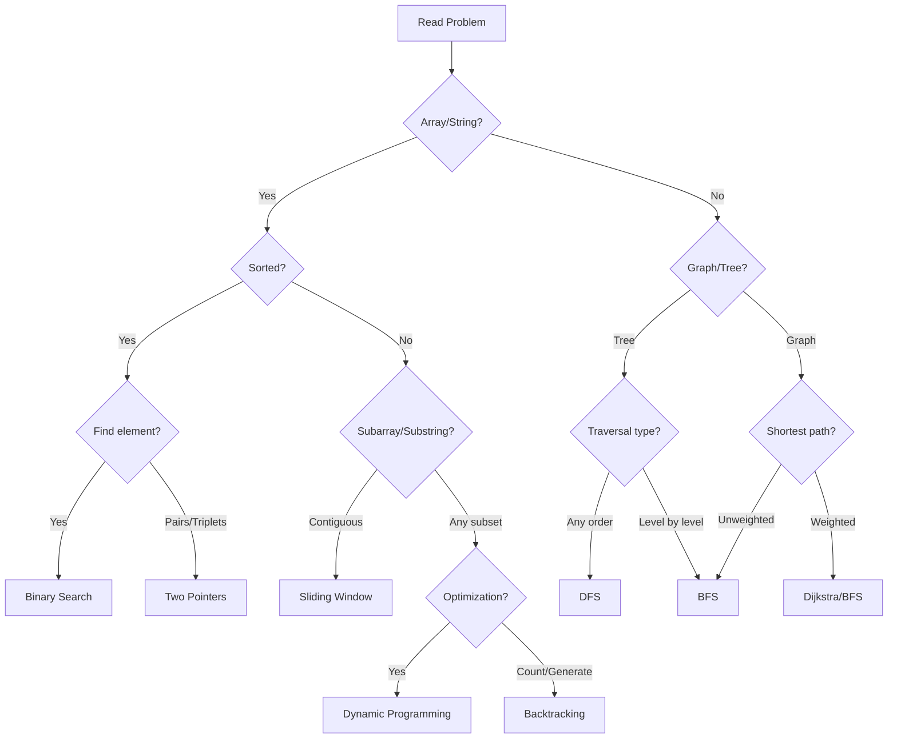

## Why Learn by Patterns?

Most coding interviews test the same **22 core patterns** repeatedly. Instead of solving 1000+ random problems, understanding these patterns helps you:

- **Recognize** problem types instantly
- **Apply** proven templates to new problems
- **Optimize** solutions systematically
- **Explain** your thought process clearly

<Tip>
**The 80/20 Rule**: 80% of interview problems can be solved using just 6 patterns: Two Pointers, Sliding Window, HashMap, Binary Search, DFS/BFS, and Dynamic Programming. Master these first!
</Tip>

## Pattern Categories

<CardGroup cols={2}>
  <Card title="Array & String Patterns" icon="table-cells" href="/dsa-patterns/two-pointers">
    Two Pointers, Sliding Window, Prefix Sum
  </Card>
  <Card title="Search & Sort" icon="magnifying-glass" href="/dsa-patterns/binary-search">
    Binary Search, Sorting Algorithms
  </Card>
  <Card title="Graph Patterns" icon="share-nodes" href="/dsa-patterns/dfs">
    DFS, BFS, Union Find, Graph Algorithms
  </Card>
  <Card title="Dynamic Programming" icon="layer-group" href="/dsa-patterns/dynamic-programming">
    Memoization, Tabulation, State Transitions
  </Card>
  <Card title="Data Structure Patterns" icon="database" href="/dsa-patterns/hashmap">
    HashMap, Stack, Queue, Heap, Trie
  </Card>
  <Card title="Advanced Techniques" icon="wand-magic-sparkles" href="/dsa-patterns/backtracking">
    Backtracking, Greedy, Divide & Conquer
  </Card>
</CardGroup>

## Pattern Selection Flowchart

Use this decision tree when you encounter a new problem:

## Quick Pattern Recognition Cheat Sheet

<AccordionGroup>
  <Accordion title="Keywords that Signal Each Pattern" icon="lightbulb">
    | If you see... | Think... |
    |---------------|----------|
    | "sorted array", "find pair with sum" | Two Pointers |
    | "contiguous subarray", "window of size k" | Sliding Window |
    | "find in sorted", "minimize/maximize" | Binary Search |
    | "frequency", "anagram", "contains" | HashMap |
    | "all paths", "connected components" | DFS |
    | "shortest path", "level order" | BFS |
    | "maximum/minimum with constraints" | Dynamic Programming |
    | "generate all", "permutations", "combinations" | Backtracking |
    | "optimal choice at each step" | Greedy |
    | "k largest/smallest", "merge sorted" | Heap |
    | "matching brackets", "undo" | Stack |
    | "prefix/autocomplete" | Trie |
    | "connected groups", "union/merge" | Union Find |
  </Accordion>
  
  <Accordion title="Memory Tricks (Mnemonics)" icon="brain">
    **STAMPS** - For Two Pointer problems:
    - **S**orted array?
    - **T**wo elements needed?
    - **A**void nested loops?
    - **M**ove based on comparison?
    - **P**airs/Triplets?
    - **S**pace O(1) possible?
    
    **SLIDE** - For Sliding Window:
    - **S**ubarray/Substring problem?
    - **L**ength constraints?
    - **I**terate once?
    - **D**ynamic window possible?
    - **E**xpand and shrink?
    
    **DREAD** - For Dynamic Programming:
    - **D**ecision at each step?
    - **R**ecurrence relation possible?
    - **E**very subproblem needed?
    - **A**nswer from subproblems?
    - **D**uplicate subproblems?
  </Accordion>
</AccordionGroup>

## Learning Path

<Steps>
  <Step title="Foundation (Week 1-2)">
    Start with **Two Pointers**, **Sliding Window**, and **HashMap** patterns. These appear in 40% of interview questions.
    
    **Daily Goals**: 2-3 easy problems + 1 medium problem
  </Step>
  <Step title="Core Patterns (Week 3-4)">
    Master **Binary Search**, **DFS/BFS**, and **Stack/Queue** patterns. Build intuition for when to apply each.
    
    **Daily Goals**: 1-2 easy + 2 medium problems
  </Step>
  <Step title="Intermediate (Week 5-6)">
    Tackle **Dynamic Programming**, **Backtracking**, and **Greedy** approaches. Focus on state definition.
    
    **Daily Goals**: 2-3 medium problems + analyze solutions
  </Step>
  <Step title="Advanced (Week 7-8)">
    Learn **Trie**, **Union Find**, **Monotonic Stack**, and **Bit Manipulation** for specialized problems.
    
    **Daily Goals**: 1-2 medium + 1 hard problem
  </Step>
</Steps>

## 8-Week Study Calendar

<Tabs>
  <Tab title="Week 1-2: Foundation">
    | Day | Topic | Problems to Solve |
    |-----|-------|-------------------|
    | 1 | Two Pointers Intro | Two Sum II, Valid Palindrome |
    | 2 | Two Pointers Practice | 3Sum, Container With Most Water |
    | 3 | Sliding Window Fixed | Max Sum Subarray, Avg of Subarrays |
    | 4 | Sliding Window Variable | Longest Substring Without Repeat |
    | 5 | HashMap Basics | Two Sum, Contains Duplicate |
    | 6 | HashMap + Frequency | Valid Anagram, Group Anagrams |
    | 7 | Review + Mixed Practice | Solve 3 random problems |
  </Tab>
  <Tab title="Week 3-4: Core">
    | Day | Topic | Problems to Solve |
    |-----|-------|-------------------|
    | 1 | Binary Search Classic | Search Insert Position, First Bad Version |
    | 2 | Binary Search Bounds | Find First and Last Position |
    | 3 | DFS on Trees | Max Depth, Path Sum |
    | 4 | DFS on Graphs | Number of Islands, Clone Graph |
    | 5 | BFS Basics | Level Order Traversal, Rotting Oranges |
    | 6 | Stack Patterns | Valid Parentheses, Daily Temperatures |
    | 7 | Review + Contest | Participate in weekly contest |
  </Tab>
  <Tab title="Week 5-6: Intermediate">
    | Day | Topic | Problems to Solve |
    |-----|-------|-------------------|
    | 1 | DP 1D Basics | Climbing Stairs, House Robber |
    | 2 | DP 1D Practice | Coin Change, Longest Increasing Subseq |
    | 3 | DP 2D Grid | Unique Paths, Min Path Sum |
    | 4 | DP Strings | Longest Common Subsequence |
    | 5 | Backtracking Intro | Subsets, Permutations |
    | 6 | Backtracking Practice | N-Queens, Word Search |
    | 7 | Greedy + Review | Jump Game, Merge Intervals |
  </Tab>
  <Tab title="Week 7-8: Advanced">
    | Day | Topic | Problems to Solve |
    |-----|-------|-------------------|
    | 1 | Heap Basics | Kth Largest, Top K Frequent |
    | 2 | Heap Advanced | Merge K Sorted Lists, Find Median |
    | 3 | Trie | Implement Trie, Word Search II |
    | 4 | Union Find | Number of Provinces, Redundant Connection |
    | 5 | Monotonic Stack | Next Greater Element, Largest Rectangle |
    | 6 | Bit Manipulation | Single Number, Counting Bits |
    | 7 | Mock Interview | 2-3 random problems under time pressure |
  </Tab>
</Tabs>

## Pattern Difficulty Matrix

| Pattern | Difficulty | Frequency | Time to Learn | Interview Importance |
|---------|------------|-----------|---------------|----------------------|
| Two Pointers | Easy | Very High | 2-3 days | Very High |
| Sliding Window | Easy | Very High | 2-3 days | Very High |
| HashMap | Easy | Very High | 1-2 days | Very High |
| Binary Search | Medium | Very High | 3-4 days | Very High |
| DFS/BFS | Medium | High | 4-5 days | Very High |
| Stack/Queue | Easy | High | 2-3 days | High |
| Heap | Medium | Medium | 3-4 days | High |
| Dynamic Programming | Hard | Very High | 2-3 weeks | Very High |
| Backtracking | Medium | Medium | 4-5 days | High |
| Greedy | Medium | Medium | 3-4 days | Medium |
| Trie | Medium | Low | 2-3 days | Medium |
| Union Find | Medium | Medium | 3-4 days | High |
| Monotonic Stack | Hard | Low | 3-4 days | Medium |
| Bit Manipulation | Medium | Low | 2-3 days | Low |

## Company-Wise Pattern Frequency

<Tabs>
  <Tab title="Google">
    1. Dynamic Programming (25%)
    2. Graph Algorithms (20%)
    3. Binary Search (15%)
    4. Two Pointers/Sliding Window (15%)
    5. HashMap/HashSet (10%)
    6. Others (15%)
  </Tab>
  <Tab title="Amazon">
    1. BFS/DFS (25%)
    2. HashMap/HashSet (20%)
    3. Two Pointers (15%)
    4. Sliding Window (15%)
    5. Heap/Priority Queue (10%)
    6. Others (15%)
  </Tab>
  <Tab title="Meta">
    1. Arrays/Strings (30%)
    2. BFS/DFS (20%)
    3. Binary Search (15%)
    4. Dynamic Programming (15%)
    5. Two Pointers (10%)
    6. Others (10%)
  </Tab>
  <Tab title="Microsoft">
    1. Arrays/Strings (25%)
    2. Trees/Graphs (25%)
    3. Dynamic Programming (15%)
    4. Two Pointers (15%)
    5. Stack/Queue (10%)
    6. Others (10%)
  </Tab>
</Tabs>

## Success Tips

<CardGroup cols={2}>
  <Card title="Spaced Repetition" icon="calendar-days">
    Review solved problems after 1 day, 3 days, 7 days, and 14 days to build long-term memory.
  </Card>
  <Card title="Teach Others" icon="chalkboard-user">
    Explain your solutions out loud or write blog posts. Teaching reinforces understanding.
  </Card>
  <Card title="Time Yourself" icon="stopwatch">
    Practice with 45-minute limits. Real interviews are time-constrained.
  </Card>
  <Card title="Debug Without IDE" icon="bug">
    Practice tracing code on paper. Build mental debugging skills.
  </Card>
</CardGroup>

<Warning>
**Common Mistakes to Avoid**:
- Jumping to code without understanding the problem
- Not considering edge cases (empty input, single element, duplicates)
- Ignoring time/space complexity until asked
- Memorizing solutions instead of understanding patterns
</Warning>

<Tip>
**Pro Tip**: Focus on understanding the **why** behind each pattern, not just the **how**. This helps you adapt patterns to novel problems.
</Tip>
