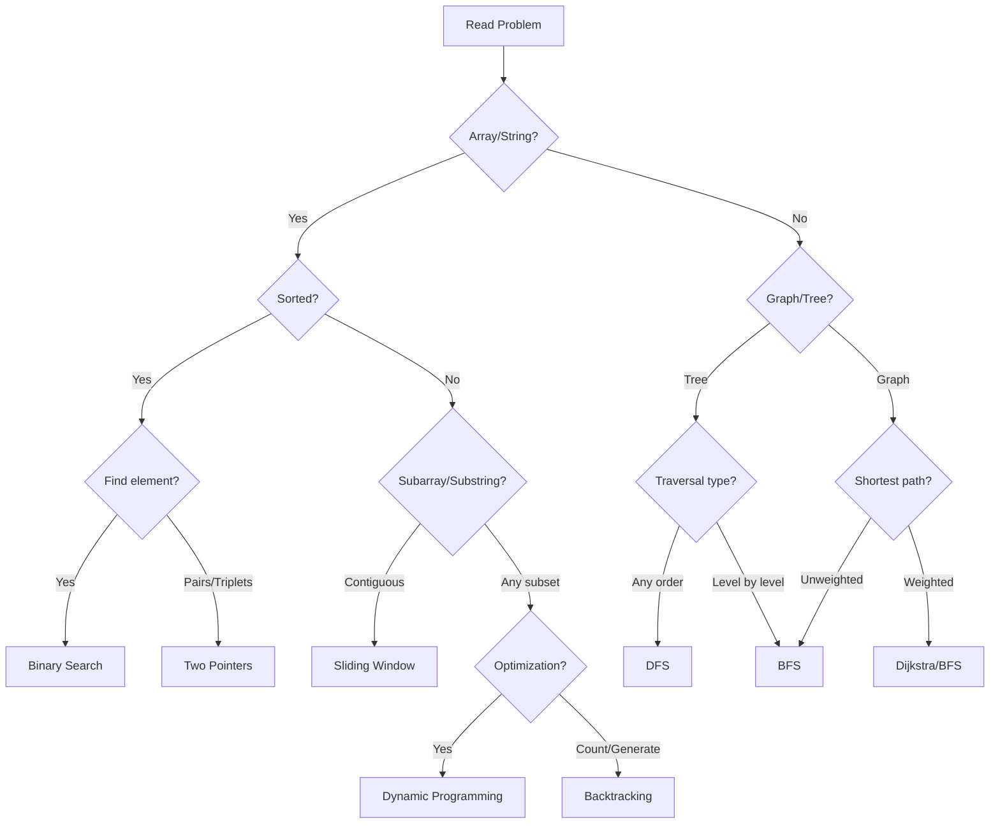

## Pattern Recognition Cheatsheet (Read This First)

<Tip>
**The 30-Second Rule:** When you read a problem, your goal is to map it to a pattern within 30 seconds. The table below is the lookup. Memorize the left column. The phrasings here are exactly how LeetCode problems are worded -- not abstract ideas.

| Problem statement contains... | Reach for... |
|---|---|
| "sorted array" + "find pair with sum X" / "two numbers that..." | **Two Pointers** (converging) |
| "remove duplicates in-place", "move zeroes", "partition array around X" | **Two Pointers** (fast/slow) |
| "all unique triplets / quadruplets that sum to X" | **Two Pointers** (fixed + converging) |
| "is palindrome", "reverse string in-place" | **Two Pointers** (converging) |
| "longest / shortest substring with at most K distinct" | **Sliding Window** (variable, shrink when invalid) |
| "minimum window containing all chars of T" | **Sliding Window** (variable, shrink while valid) |
| "max sum / min sum of subarray of size K" | **Sliding Window** (fixed) |
| "subarrays with exactly K distinct" | **Sliding Window**, atMost(K) - atMost(K-1) trick |
| "subarray sum equals K" (with negatives) | **Prefix Sum + HashMap** |
| "range sum query", "sum of elements between i and j" | **Prefix Sum** |
| "count submatrices summing to target" | **2D Prefix Sum + HashMap** |
| "find element in sorted array / rotated array" | **Binary Search** |
| "minimize the maximum / find smallest X such that..." | **Binary Search on Answer** |
| "first / last position of X in sorted array" | **Binary Search on Bounds** |
| "all paths from source to target", "connected components" | **DFS** |
| "shortest path in unweighted graph", "level by level", "minimum steps" | **BFS** |
| "shortest path in weighted graph" | **Dijkstra** (BFS + min heap) |
| "are these elements in the same group?" / "merge sets" | **Union Find** |
| "K largest / K smallest / top K frequent" | **Heap** (min heap of size K) |
| "merge K sorted lists / streams" | **Heap** (min heap) |
| "find median of stream" | **Two Heaps** (max + min) |
| "next greater element", "stock span", "largest rectangle" | **Monotonic Stack** |
| "matching brackets", "evaluate expression", "undo" | **Stack** |
| "implement recently used / hit counter / sliding window max" | **Deque** (or LinkedHashMap for LRU) |
| "longest increasing / common subsequence", "edit distance" | **DP** (1D / 2D table) |
| "min coins to make X", "ways to climb N stairs" | **DP** (1D, unbounded knapsack flavor) |
| "0/1 knapsack", "partition into equal subsets" | **DP** (2D, with item dimension) |
| "generate all permutations / subsets / combinations" | **Backtracking** |
| "N-Queens", "Sudoku solver", "word search" | **Backtracking** with pruning |
| "prefix matching", "autocomplete", "word dictionary" | **Trie** |
| "single number among pairs", "count set bits" | **Bit Manipulation** |
| "detect cycle in linked list", "find middle of list" | **Two Pointers** (Floyd's, fast/slow) |
| "reverse linked list", "merge two sorted lists" | **Linked List manipulation** |
| "level order traversal", "right side view" | **BFS** on tree |
| "lowest common ancestor", "path sum" | **DFS** on tree (recursion) |
| "serialize / deserialize tree" | **DFS** preorder + sentinel |
| "minimum cost to connect all points" | **MST** (Kruskal / Prim) |

**Pattern over problem:** if the same keyword appears, the pattern almost certainly applies. Stop reading the problem looking for "the trick"; start reading it looking for the keyword.
</Tip>

## Why Learn by Patterns?

Most coding interviews test the same **22 core patterns** repeatedly. Solving 1000 random LeetCode problems without a framework is like learning a language by memorizing individual sentences -- you never learn the grammar. Patterns *are* the grammar of algorithmic problem-solving. Understanding them helps you:

- **Recognize** problem types in seconds by matching keywords and constraints to a known pattern
- **Apply** proven templates to problems you have never seen before
- **Optimize** solutions systematically by knowing what each pattern trades off (time vs space, simplicity vs generality)
- **Explain** your thought process clearly in interviews, which matters as much as getting the right answer

A senior engineer once said: "I don't remember the solution to every LeetCode problem. I remember 20 patterns and how to adapt them." That is exactly the mindset this guide builds.

<Tip>
**The 80/20 Rule**: About 80% of interview problems can be solved using just 6 patterns: Two Pointers, Sliding Window, HashMap, Binary Search, DFS/BFS, and Dynamic Programming. Master these six first, then layer in the rest. Do not spread yourself thin across all patterns simultaneously.
</Tip>

## Pattern Categories

<CardGroup cols={2}>
  <Card title="Array & String Patterns" icon="table-cells" href="/dsa-patterns/two-pointers">
    Two Pointers, Sliding Window, Prefix Sum
  </Card>
  <Card title="Search & Sort" icon="magnifying-glass" href="/dsa-patterns/binary-search">
    Binary Search, Sorting Algorithms
  </Card>
  <Card title="Graph Patterns" icon="share-nodes" href="/dsa-patterns/dfs">
    DFS, BFS, Union Find, Graph Algorithms
  </Card>
  <Card title="Dynamic Programming" icon="layer-group" href="/dsa-patterns/dynamic-programming">
    Memoization, Tabulation, State Transitions
  </Card>
  <Card title="Data Structure Patterns" icon="database" href="/dsa-patterns/hashmap">
    HashMap, Stack, Queue, Heap, Trie
  </Card>
  <Card title="Advanced Techniques" icon="wand-magic-sparkles" href="/dsa-patterns/backtracking">
    Backtracking, Greedy, Divide & Conquer
  </Card>
</CardGroup>

## Pattern Selection Flowchart

Use this decision tree when you encounter a new problem:

```mermaid
flowchart TD
    A[Read Problem] --> B{Array/String?}
    B -->|Yes| C{Sorted?}
    B -->|No| D{Graph/Tree?}
    
    C -->|Yes| E{Find element?}
    C -->|No| F{Subarray/Substring?}
    
    E -->|Yes| G[Binary Search]
    E -->|Pairs/Triplets| H[Two Pointers]
    
    F -->|Contiguous| I[Sliding Window]
    F -->|Any subset| J{Optimization?}
    
    J -->|Yes| K[Dynamic Programming]
    J -->|Count/Generate| L[Backtracking]
    
    D -->|Tree| M{Traversal type?}
    D -->|Graph| N{Shortest path?}
    
    M -->|Any order| O[DFS]
    M -->|Level by level| P[BFS]
    
    N -->|Unweighted| P
    N -->|Weighted| Q[Dijkstra/BFS]
```

## Quick Pattern Recognition Cheat Sheet

<AccordionGroup>
  <Accordion title="Keywords that Signal Each Pattern" icon="lightbulb">
    | If you see... | Think... |
    |---------------|----------|
    | "sorted array", "find pair with sum" | Two Pointers |
    | "contiguous subarray", "window of size k" | Sliding Window |
    | "find in sorted", "minimize/maximize" | Binary Search |
    | "frequency", "anagram", "contains" | HashMap |
    | "all paths", "connected components" | DFS |
    | "shortest path", "level order" | BFS |
    | "maximum/minimum with constraints" | Dynamic Programming |
    | "generate all", "permutations", "combinations" | Backtracking |
    | "optimal choice at each step" | Greedy |
    | "k largest/smallest", "merge sorted" | Heap |
    | "matching brackets", "undo" | Stack |
    | "prefix/autocomplete" | Trie |
    | "connected groups", "union/merge" | Union Find |
  </Accordion>
  
  <Accordion title="Memory Tricks (Mnemonics)" icon="brain">
    **STAMPS** - For Two Pointer problems:
    - **S**orted array?
    - **T**wo elements needed?
    - **A**void nested loops?
    - **M**ove based on comparison?
    - **P**airs/Triplets?
    - **S**pace O(1) possible?
    
    **SLIDE** - For Sliding Window:
    - **S**ubarray/Substring problem?
    - **L**ength constraints?
    - **I**terate once?
    - **D**ynamic window possible?
    - **E**xpand and shrink?
    
    **DREAD** - For Dynamic Programming:
    - **D**ecision at each step?
    - **R**ecurrence relation possible?
    - **E**very subproblem needed?
    - **A**nswer from subproblems?
    - **D**uplicate subproblems?
  </Accordion>
</AccordionGroup>

## Learning Path

<Steps>
  <Step title="Foundation (Week 1-2)">
    Start with **Two Pointers**, **Sliding Window**, and **HashMap** patterns. These appear in 40% of interview questions.
    
    **Daily Goals**: 2-3 easy problems + 1 medium problem
  </Step>
  <Step title="Core Patterns (Week 3-4)">
    Master **Binary Search**, **DFS/BFS**, and **Stack/Queue** patterns. Build intuition for when to apply each.
    
    **Daily Goals**: 1-2 easy + 2 medium problems
  </Step>
  <Step title="Intermediate (Week 5-6)">
    Tackle **Dynamic Programming**, **Backtracking**, and **Greedy** approaches. Focus on state definition.
    
    **Daily Goals**: 2-3 medium problems + analyze solutions
  </Step>
  <Step title="Advanced (Week 7-8)">
    Learn **Trie**, **Union Find**, **Monotonic Stack**, and **Bit Manipulation** for specialized problems.
    
    **Daily Goals**: 1-2 medium + 1 hard problem
  </Step>
</Steps>

## 8-Week Study Calendar

<Tabs>
  <Tab title="Week 1-2: Foundation">
    | Day | Topic | Problems to Solve |
    |-----|-------|-------------------|
    | 1 | Two Pointers Intro | Two Sum II, Valid Palindrome |
    | 2 | Two Pointers Practice | 3Sum, Container With Most Water |
    | 3 | Sliding Window Fixed | Max Sum Subarray, Avg of Subarrays |
    | 4 | Sliding Window Variable | Longest Substring Without Repeat |
    | 5 | HashMap Basics | Two Sum, Contains Duplicate |
    | 6 | HashMap + Frequency | Valid Anagram, Group Anagrams |
    | 7 | Review + Mixed Practice | Solve 3 random problems |
  </Tab>
  <Tab title="Week 3-4: Core">
    | Day | Topic | Problems to Solve |
    |-----|-------|-------------------|
    | 1 | Binary Search Classic | Search Insert Position, First Bad Version |
    | 2 | Binary Search Bounds | Find First and Last Position |
    | 3 | DFS on Trees | Max Depth, Path Sum |
    | 4 | DFS on Graphs | Number of Islands, Clone Graph |
    | 5 | BFS Basics | Level Order Traversal, Rotting Oranges |
    | 6 | Stack Patterns | Valid Parentheses, Daily Temperatures |
    | 7 | Review + Contest | Participate in weekly contest |
  </Tab>
  <Tab title="Week 5-6: Intermediate">
    | Day | Topic | Problems to Solve |
    |-----|-------|-------------------|
    | 1 | DP 1D Basics | Climbing Stairs, House Robber |
    | 2 | DP 1D Practice | Coin Change, Longest Increasing Subseq |
    | 3 | DP 2D Grid | Unique Paths, Min Path Sum |
    | 4 | DP Strings | Longest Common Subsequence |
    | 5 | Backtracking Intro | Subsets, Permutations |
    | 6 | Backtracking Practice | N-Queens, Word Search |
    | 7 | Greedy + Review | Jump Game, Merge Intervals |
  </Tab>
  <Tab title="Week 7-8: Advanced">
    | Day | Topic | Problems to Solve |
    |-----|-------|-------------------|
    | 1 | Heap Basics | Kth Largest, Top K Frequent |
    | 2 | Heap Advanced | Merge K Sorted Lists, Find Median |
    | 3 | Trie | Implement Trie, Word Search II |
    | 4 | Union Find | Number of Provinces, Redundant Connection |
    | 5 | Monotonic Stack | Next Greater Element, Largest Rectangle |
    | 6 | Bit Manipulation | Single Number, Counting Bits |
    | 7 | Mock Interview | 2-3 random problems under time pressure |
  </Tab>
</Tabs>

## Pattern Difficulty Matrix

| Pattern | Difficulty | Frequency | Time to Learn | Interview Importance |
|---------|------------|-----------|---------------|----------------------|
| Two Pointers | Easy | Very High | 2-3 days | Very High |
| Sliding Window | Easy | Very High | 2-3 days | Very High |
| HashMap | Easy | Very High | 1-2 days | Very High |
| Binary Search | Medium | Very High | 3-4 days | Very High |
| DFS/BFS | Medium | High | 4-5 days | Very High |
| Stack/Queue | Easy | High | 2-3 days | High |
| Heap | Medium | Medium | 3-4 days | High |
| Dynamic Programming | Hard | Very High | 2-3 weeks | Very High |
| Backtracking | Medium | Medium | 4-5 days | High |
| Greedy | Medium | Medium | 3-4 days | Medium |
| Trie | Medium | Low | 2-3 days | Medium |
| Union Find | Medium | Medium | 3-4 days | High |
| Monotonic Stack | Hard | Low | 3-4 days | Medium |
| Bit Manipulation | Medium | Low | 2-3 days | Low |

## Company-Wise Pattern Frequency

<Tabs>
  <Tab title="Google">
    1. Dynamic Programming (25%)
    2. Graph Algorithms (20%)
    3. Binary Search (15%)
    4. Two Pointers/Sliding Window (15%)
    5. HashMap/HashSet (10%)
    6. Others (15%)
  </Tab>
  <Tab title="Amazon">
    1. BFS/DFS (25%)
    2. HashMap/HashSet (20%)
    3. Two Pointers (15%)
    4. Sliding Window (15%)
    5. Heap/Priority Queue (10%)
    6. Others (15%)
  </Tab>
  <Tab title="Meta">
    1. Arrays/Strings (30%)
    2. BFS/DFS (20%)
    3. Binary Search (15%)
    4. Dynamic Programming (15%)
    5. Two Pointers (10%)
    6. Others (10%)
  </Tab>
  <Tab title="Microsoft">
    1. Arrays/Strings (25%)
    2. Trees/Graphs (25%)
    3. Dynamic Programming (15%)
    4. Two Pointers (15%)
    5. Stack/Queue (10%)
    6. Others (10%)
  </Tab>
</Tabs>

## Success Tips

<CardGroup cols={2}>
  <Card title="Spaced Repetition" icon="calendar-days">
    Review solved problems after 1 day, 3 days, 7 days, and 14 days to build long-term memory.
  </Card>
  <Card title="Teach Others" icon="chalkboard-user">
    Explain your solutions out loud or write blog posts. Teaching reinforces understanding.
  </Card>
  <Card title="Time Yourself" icon="stopwatch">
    Practice with 45-minute limits. Real interviews are time-constrained.
  </Card>
  <Card title="Debug Without IDE" icon="bug">
    Practice tracing code on paper. Build mental debugging skills.
  </Card>
</CardGroup>

<Warning>
**Common Mistakes to Avoid**:
- **Jumping to code without understanding the problem** -- Spend at least 2-3 minutes clarifying inputs, outputs, constraints, and edge cases. Interviewers evaluate your process, not just your code.
- **Not considering edge cases** -- Empty input, single element, all duplicates, negative numbers, and integer overflow are the usual suspects. Mention them out loud before coding.
- **Ignoring time/space complexity until asked** -- Always state your expected complexity *before* coding, then verify afterward. This shows intentionality.
- **Memorizing solutions instead of understanding patterns** -- If you cannot explain *why* a technique works, you will fail the moment the interviewer adds a twist. Aim for understanding, not recall.
- **Skipping the brute-force step** -- Even if you see the optimal approach, briefly mention the brute force. It proves you can reason about the problem space and makes your optimization feel earned.
</Warning>

<Tip>
**Pro Tip**: Focus on understanding the **why** behind each pattern, not just the **how**. If you can explain to a friend why a monotonic stack gives O(n) for "next greater element" (each element is pushed and popped at most once), you truly own the pattern. That depth of understanding lets you adapt when the interview question is not a copy-paste of a LeetCode problem.
</Tip>

## What To Do When The Pattern Is Not Obvious

You will get problems where the pattern is not in the cheatsheet. Here is the exact 6-step playbook senior engineers run when stuck. Use it as a script.

<Steps>
  <Step title="Restate the problem in one sentence">
    Force yourself to compress it. "Given an array of intervals, return the minimum number of meeting rooms." If you cannot compress it, you do not understand the problem yet.
  </Step>
  <Step title="Identify the input shape">
    Array? Sorted? Graph? Tree? String? Stream? Each shape unlocks 2-3 candidate patterns. Sorted array unlocks Two Pointers and Binary Search. String/array with "contiguous" unlocks Sliding Window. Graph unlocks DFS/BFS/Union Find.
  </Step>
  <Step title="Identify the goal type">
    Optimization (max/min)? Counting? Existence (yes/no)? Generation (all)? Each maps to different patterns. Optimization on sequences is often DP or Sliding Window. Generation is almost always Backtracking. Existence on graphs is DFS/BFS.
  </Step>
  <Step title="Solve brute force out loud">
    Always state the brute force first. "I could check all pairs in O(n squared)." This buys you thinking time and signals to the interviewer that you can reason. It also reveals what the optimization needs to remove (a redundant scan, a duplicate computation, a sort step).
  </Step>
  <Step title="Look for redundancy">
    Optimization comes from removing redundancy. Are you re-summing the same subarray? Use Prefix Sum. Are you re-comparing pairs that you already know are not optimal? Use Two Pointers. Are you re-solving the same subproblem? Use DP / memoization.
  </Step>
  <Step title="Match to a pattern by transformation">
    If still stuck, transform the problem. "Find longest subarray with equal 0s and 1s" becomes "find longest subarray with sum 0" by converting 0 to -1. Now Prefix Sum + HashMap fits. Many hard problems are easy patterns wearing a costume.
  </Step>
</Steps>

<Warning>
**Caveats and Traps -- Pattern Recognition**

- **Forcing a known pattern onto a problem that does not fit.** You see "subarray sum" and reach for sliding window, but the array has negatives -- now you need Prefix Sum + HashMap. Always check the constraint that makes the pattern work (sliding window requires monotonic state).
- **Skipping the brute force step.** Candidates jump straight to "optimal" and miss edge cases the brute force would have caught. The brute force is your scaffolding.
- **Treating LeetCode as memorization.** If you can only solve LC 76 because you have seen it before, you fail the moment the interviewer renames variables. Aim to re-derive, not recall.
- **Getting stuck silently.** Ten seconds of silence in an interview feels like a minute. If you do not see the pattern, narrate: "I am looking for a sliding window fit but the negatives break it. Let me try prefix sums instead." Interviewers grade your *process*, not your stoicism.
- **Mismatching pattern to constraint.** "All elements positive" unlocks Sliding Window for sum problems. "May contain negatives" unlocks Prefix Sum + HashMap. "Sorted" unlocks Two Pointers and Binary Search. Read constraints first, not last.
</Warning>

<Tip>
**Solutions and Patterns -- Getting Unstuck Fast**

- **Talk through the input/output mapping.** "Input is an array of integers, output is one integer. The array is unsorted, so I cannot rely on order. I need O(n) time per the constraints." This narration alone surfaces the pattern 70% of the time.
- **Try the smallest non-trivial example.** For arrays, that is usually n=3. Walk through it manually. The structure of your manual solution often reveals the pattern.
- **Anchor on the constraint that hurts.** Constraints are clues. "n up to 10 to the 5" rules out O(n squared). "1 to 10 to the 4 queries" screams "preprocessing" (Prefix Sum, Sparse Table). "values fit in 32-bit int" hints at bit tricks.
- **Pick a candidate pattern, code 3 lines, see if it fits.** You do not need certainty before writing. The act of writing scaffolding (left, right, while loop) often reveals whether the pattern fits within seconds.
- **Use the pattern that is one level "weaker" first.** If sliding window seems forced, try a simpler nested-loop solution and look for what you can cache. The optimization often emerges naturally.
</Tip>

## Interview Q&A: Pattern Recognition Under Pressure

<AccordionGroup>
  <Accordion title="Walk me through how you decide which DSA pattern to apply when you read a new problem.">
    **Strong Answer Framework:**

    1. **Restate in one sentence to confirm understanding.** Repeat the problem in your own words. This buys time and confirms input/output shape.
    2. **Read constraints before solution.** "n up to 10 to the 5" demands O(n log n) or better. "n up to 20" hints at exponential / bitmask DP / backtracking. The constraints narrow the search dramatically.
    3. **Match shape to candidate patterns.** Array (sorted? sliding? prefix?), graph (DFS / BFS / Union Find?), tree (recursion?), string (sliding window? hash?). Pick 2-3 candidates.
    4. **State the brute force explicitly.** Always. It anchors your reasoning and reveals the redundancy to remove.
    5. **Look for invariants the pattern needs.** Sliding window needs monotonic state. Two pointers needs sorted (or sortable) input. Greedy needs an exchange argument. If the invariant fails, the pattern fails.
    6. **Code the pattern and verify with the smallest example.** Trace through n=2 or n=3 by hand. If output matches, scale up. If not, the pattern was wrong -- back to step 3.

    **Real LeetCode Example:**

    LC 560 -- Subarray Sum Equals K. Input: array of integers (can be negative), target K. Output: count of subarrays summing to K.

    - **Restate:** count contiguous subarrays summing to K.
    - **Constraints:** n up to 2 * 10 to the 4, values from negative 1000 to 1000. Quadratic is borderline acceptable but optimal is expected.
    - **Shape candidates:** Array + "contiguous subarray" + sum -> Sliding Window? But values can be negative, so sliding window is out. Prefix Sum + HashMap is the universal tool.
    - **Brute force:** all pairs O(n squared).
    - **Optimization:** for each prefix sum P, count how many earlier prefix sums equal P - K. HashMap of prefix sums to frequency.
    - **Pattern matched:** Prefix Sum + HashMap. O(n) time, O(n) space.

    <Note>
    **Senior Follow-up 1:** What if the problem said "all elements are positive"? Would you change your approach? (Yes -- with positives, Sliding Window also works in O(n) with O(1) space, beating HashMap on space. Always optimize for the constraint set.)
    </Note>

    <Note>
    **Senior Follow-up 2:** What if values were floats? (HashMap of floats is unreliable due to floating-point equality. You would need to round to a fixed precision or use an exact rational representation. Often a sign that the problem is not really about floats -- check constraints.)
    </Note>

    <Note>
    **Senior Follow-up 3:** What if you needed the *longest* subarray with sum K instead of the count? (Same prefix sum, but the HashMap stores the *first occurrence* of each sum, not its frequency. Then the answer is max(j - first_occurrence[prefix - K]).)
    </Note>

    **Common Wrong Answers:**

    - "I look at the data structure and pick a pattern." Too shallow. Constraints + goal + invariants matter more than shape alone.
    - "I try every pattern until one works." Time is finite. Narrowing to 2-3 candidates is the skill.
    - "I see if I have solved this exact problem before." Pattern matching, not pattern reasoning. Fails on rephrased problems.

    **Further Reading:**
    - LC 560 (Subarray Sum Equals K), LC 1248 (Count Number of Nice Subarrays) -- both prefix sum + HashMap.
    - "How to Approach a Problem" -- NeetCode YouTube playlist.
  </Accordion>

  <Accordion title="How do you avoid getting stuck for 20 minutes if you do not see the pattern immediately?">
    **Strong Answer Framework:**

    1. **Set a 3-minute "ideation budget."** If you do not have a candidate pattern after 3 minutes, switch tactic: stop staring, start computing.
    2. **Compute a small example by hand.** Walk through n=3 or n=4. The structure of your manual solution usually reveals the pattern within 60 seconds.
    3. **Narrate continuously.** Silence is the enemy. "I see this looks like a graph problem because there are dependencies. BFS or DFS? The problem asks for shortest path, so BFS." Even partial narration earns credit and often unsticks you.
    4. **Reach for a brute force.** Code the O(n squared) or exponential solution. Once you see the redundancy, the optimization pattern often becomes obvious. "I am re-summing the same window, so I can use prefix sum."
    5. **Ask the interviewer one targeted question.** "Are values bounded?" "Can the array be modified?" "Is there a constraint on space?" Each question narrows candidate patterns. Asking 5 vague questions hurts; asking 1 sharp question helps.
    6. **Pick a wrong pattern and proceed anyway.** Even a wrong pattern often produces partial credit. Senior interviewers grade your process and recovery, not just final correctness.

    **Real LeetCode Example:**

    LC 992 -- Subarrays with K Different Integers. Hard problem. Many candidates freeze.

    - **First instinct:** sliding window with exactly K distinct? Try to maintain invariant. After 60 seconds you realize "exactly K" is not monotonic -- expanding can add a new distinct, shrinking might keep distinct count the same.
    - **Pivot:** narrate "The exact-K window is not monotonic. Let me try at-most-K instead -- that one is monotonic."
    - **Insight:** exactly(K) = atMost(K) - atMost(K-1). Sliding window for atMost is standard.
    - **Total time:** under 8 minutes if you narrate. 25 minutes if you stay silent.

    <Note>
    **Senior Follow-up 1:** What if the interviewer says "I do not want to hear at-most-K, find a direct solution"? (You can use two pointers tracking distinct count and deliberately maintain a "leftmost left" -- but this is more error-prone. The atMost trick is standard for a reason.)
    </Note>

    <Note>
    **Senior Follow-up 2:** Have you used this trick on any other problem? (Yes -- LC 904 Fruit Into Baskets is just atMost(2). LC 1248 is essentially atMost(K) on odd numbers. The decomposition is reusable.)
    </Note>

    <Note>
    **Senior Follow-up 3:** What if the array were a stream and you could not look back? (Stream version is much harder -- you cannot run two passes. You would need approximate counting like HyperLogLog plus a smarter sliding state. Worth raising as a real-system caveat.)
    </Note>

    **Common Wrong Answers:**

    - "I just keep thinking until I see it." Dangerous. After 5 minutes of silence, you have lost the interviewer.
    - "I write the brute force and ship it." OK for partial credit but you must explicitly narrate the optimization path even if you do not finish.
    - "I ask for hints right away." Hints are fine after 5-10 minutes of visible effort. Earlier signals you did not try.

    **Further Reading:**
    - LC 992 (K Different), LC 904 (Fruit Into Baskets), LC 1248 (Nice Subarrays) -- all the atMost decomposition family.
    - "How to Solve It" by George Polya -- the original problem-solving framework.
  </Accordion>

  <Accordion title="When you have multiple candidate patterns, how do you choose between them under interview time pressure?">
    **Strong Answer Framework:**

    1. **Compare time and space complexity for each candidate.** Often one dominates the other. HashMap O(n) time + O(n) space vs sorting + Two Pointers O(n log n) time + O(1) space -- pick based on stated constraint.
    2. **Pick the simpler implementation when complexity ties.** Under interview pressure, fewer moving parts means fewer bugs. Prefer prefix sum + HashMap over a custom segment tree if both work.
    3. **Pick the pattern you have practiced more recently.** If sliding window and prefix sum both fit, go with whichever feels mechanical. You are racing the clock.
    4. **State the trade-off out loud.** "Both work. I am picking sliding window because it is O(1) space, which the constraints emphasize." This shows judgment, not just code.
    5. **Verify with the smallest example.** Even after picking, trace through n=3 to confirm the chosen pattern's invariant holds.

    **Real LeetCode Example:**

    LC 209 -- Minimum Size Subarray Sum. Positive integers, find shortest subarray with sum >= target.

    - **Candidate A:** Sliding Window. O(n) time, O(1) space. Works because all values positive (monotonic).
    - **Candidate B:** Prefix Sum + Binary Search. O(n log n), O(n) space. Works for any sign.
    - **Decision:** sliding window wins on both axes for the stated constraint. Pick it. Mention B as alternative when discussing trade-offs.

    <Note>
    **Senior Follow-up 1:** What if values could be negative? (Sliding window dies. Now Prefix Sum + Monotonic Deque works in O(n), or Prefix Sum + sorted structure in O(n log n).)
    </Note>

    <Note>
    **Senior Follow-up 2:** What if you needed to answer Q queries on the same array? (Now build prefix sums once, answer each query in O(log n) via binary search. Sliding window does not amortize across queries.)
    </Note>

    <Note>
    **Senior Follow-up 3:** What if memory is tight (embedded device)? (Sliding window O(1) space wins decisively. Prefix sum's O(n) auxiliary array might not fit.)
    </Note>

    **Common Wrong Answers:**

    - "I always pick the lowest time complexity." Ignores space and constants. O(n log n) with low constants often beats O(n) with high constants in practice.
    - "I pick the most clever pattern." Cleverness costs implementation time and bugs. Boring is good in interviews.
    - "I pick whichever pattern I see first." Skips the comparison, signals shallow analysis.

    **Further Reading:**
    - LC 209, LC 862 (Shortest Subarray with Sum at Least K, the negative-values variant).
    - "Algorithm Design Manual" by Steven Skiena -- chapters on trade-offs between algorithm classes.
  </Accordion>

  <Accordion title="What is your strategy for the last 10 minutes of an interview if you have not finished?">
    **Strong Answer Framework:**

    1. **Stop adding new code.** New code introduces new bugs. Focus on what exists.
    2. **Trace through your code with one example out loud.** Catch off-by-ones, edge cases, and missed initializations. Senior interviewers reward visible verification.
    3. **State known limitations.** "This handles the positive case but I have not verified negatives -- let me add that test." Owning gaps beats hiding them.
    4. **Discuss optimization paths even if you cannot implement them.** "If I had more time I would replace the linear scan with binary search to get O(n log n)." Shows depth without overcommitting.
    5. **Prepare the closing summary.** End with: "My solution is O(n) time, O(n) space, handles positives and negatives, and would need adjustment for streaming input. Known edge cases: empty array, all duplicates."

    **Real LeetCode Example:**

    Mid-interview on LC 76 (Minimum Window Substring), 35 minutes in, you have 10 minutes left. You have a working but slow O(n*m) solution.

    - **Stop coding.** The shrink loop has a bug you have not located. Fixing it under time pressure risks breaking what works.
    - **Trace example "ADOBECODEBANC" with target "ABC"** by hand. Notice you are not collapsing repeated frequency comparisons.
    - **Articulate the optimization:** "I should track 'matches' instead of comparing full frequency maps each step. That gets us to O(n + m)."
    - **Closing:** "Current code is O(n*m), correct for the example. The fix is the matches counter, which I can sketch but not fully implement in remaining time."

    <Note>
    **Senior Follow-up 1:** "What is the riskiest bug in your current code?" (Answer: shrink condition might be `>=` when it should be `>`, or vice versa. Always identify your highest-risk line.)
    </Note>

    <Note>
    **Senior Follow-up 2:** "If I gave you 5 more minutes, what would you do?" (Have an answer ready: "Add the matches counter and re-test on the example." Specificity wins.)
    </Note>

    <Note>
    **Senior Follow-up 3:** "How would you test this in production?" (Property-based testing on random inputs vs brute force is a great answer. Shows you think beyond the interview.)
    </Note>

    **Common Wrong Answers:**

    - "I rush to add features." Adds bugs. Last 10 minutes is for stabilization, not exploration.
    - "I stay silent and keep typing." Interviewers grade thinking, not code. Narrate.
    - "I claim it works without verifying." If you cannot trace it, you do not know.

    **Further Reading:**
    - "Cracking the Coding Interview" by Gayle McDowell -- chapter on time management.
    - NeetCode "Mock Interview" series on YouTube for closing-time strategies.
  </Accordion>
</AccordionGroup>
