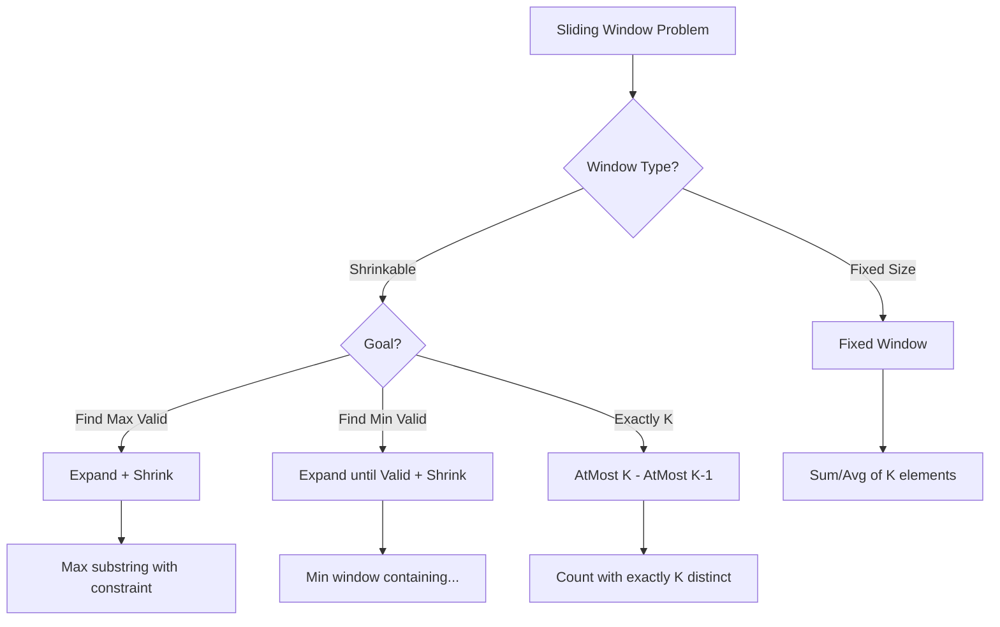

## Pattern Recognition Cheatsheet (Read This First)

<Tip>
**Reach for Sliding Window when the problem statement says...**

| Problem phrasing | Variant |
|---|---|
| "max / min sum of subarray of size K" | Fixed window (LC 643) |
| "longest substring with at most K distinct characters" | Variable window, shrink when invalid (LC 340, LC 159) |
| "longest substring without repeating characters" | Variable window with HashSet/HashMap (LC 3) |
| "minimum window substring containing all chars of T" | Variable window, shrink while valid (LC 76) |
| "longest substring with same letter after K replacements" | Variable window with most-frequent-char trick (LC 424) |
| "max consecutive 1s if you can flip at most K zeros" | Variable window counting zeros (LC 1004) |
| "longest subarray of 1s after deleting one element" | Variable window with at most one zero (LC 1493) |
| "subarrays with exactly K distinct integers" | atMost(K) - atMost(K-1) trick (LC 992) |
| "subarrays with sum exactly K" (positive only) | Variable window expand/shrink |
| "minimum size subarray with sum greater than or equal to target" (positive) | Variable window, shrink while valid (LC 209) |
| "find all anagrams of P in S" | Fixed window of size len(P) + frequency match (LC 438) |
| "permutation in string" | Fixed window + frequency match (LC 567) |
| "fruit into baskets" / "longest subarray with at most 2 distinct" | Variable window with K=2 (LC 904) |
| "max points from cards (pick from either end)" | Convert to fixed window of size n-K (LC 1423) |
| "sliding window maximum / minimum" | Fixed window + monotonic deque (LC 239, LC 862) |
| "number of subarrays with K odd numbers" | atMost(K) trick or prefix sum (LC 1248) |

**Hard signal:** the words "contiguous", "subarray", or "substring" appear -- AND the problem asks for an aggregate (max, min, count, longest, shortest). If elements can be reordered, sliding window does not apply. If the array has negatives and the problem is "sum equals K", use Prefix Sum + HashMap instead.

**Critical rule:** Sliding Window requires *monotonic* state. If adding an element does not predictably move the state in one direction (because of negatives, for example), the pattern breaks.
</Tip>

## What is Sliding Window?

The **Sliding Window** pattern maintains a dynamic "window" (a contiguous range) over a sequence, expanding and contracting it to find optimal subarrays or substrings. It reduces nested loops from O(n squared) to O(n) by reusing computations: instead of recalculating from scratch for every possible subarray, you update the window state incrementally -- add the new element entering the window, remove the element leaving it.

Think of it like looking through a physical window on a train. As the train moves forward, new scenery enters on one side and old scenery leaves on the other. You never need to go back and look at all the scenery from the start -- you just update what you see as the window slides.

<Note>
**Quick Recognition**: If you see **"contiguous subarray"** or **"substring"** combined with a goal like **max/min length, count, or sum**, Sliding Window should be your first thought. The word "contiguous" is the strongest signal.
</Note>

## Pattern Recognition Checklist

<CardGroup cols={2}>
  <Card title="Use Sliding Window When" icon="check">
    - Problem mentions **contiguous** elements
    - Need **subarray** or **substring**
    - Looking for **maximum/minimum** length
    - Constraint on window (**at most K**, **exactly K**)
    - Can solve by **expanding** and **shrinking**
  </Card>
  <Card title="Don't Use When" icon="xmark">
    - Elements don't need to be **contiguous**
    - Need **all subsets** (use Backtracking)
    - **Sorted** array hints (use Two Pointers)
    - Need **position of elements** (use HashMap)
  </Card>
</CardGroup>

## Canonical Template Code

Three templates cover 95% of sliding window problems. Memorize all three. The choice depends on whether the window size is fixed or variable, and (for variable) whether you are maximizing or minimizing the window.

<CodeGroup>
```python Python
# Template A: FIXED window of size K. Slide one step at a time.
def fixed_window(arr, k):
    # Initialize: compute aggregate over the FIRST window of size K
    window_sum = sum(arr[:k])     # could also be a Counter for character problems
    best = window_sum             # track the optimal seen so far

    # Slide: for each new right boundary, update by adding the entering element
    # and removing the exiting element. O(1) per step instead of O(k).
    for right in range(k, len(arr)):
        window_sum += arr[right] - arr[right - k]   # add entering, remove exiting
        best = max(best, window_sum)
    return best


# Template B: VARIABLE window, MAXIMIZE valid window length.
# Use when problem says "longest [thing] with [constraint]".
# Shrink WHILE the window is INVALID. Update result AFTER the shrink loop.
def max_variable_window(arr, k):
    from collections import defaultdict
    left = 0
    state = defaultdict(int)               # whatever bookkeeping the constraint needs
    best = 0

    for right in range(len(arr)):
        state[arr[right]] += 1              # expand: add the entering element

        while len(state) > k:               # invariant violated -> shrink from the left
            state[arr[left]] -= 1
            if state[arr[left]] == 0:
                del state[arr[left]]        # CRUCIAL: drop zero-count keys for accurate distinct count
            left += 1

        # When we exit the while, the window is valid. Update the best length.
        best = max(best, right - left + 1)
    return best


# Template C: VARIABLE window, MINIMIZE valid window length.
# Use when problem says "shortest [thing] with [constraint]" (LC 209, LC 76).
# Shrink WHILE the window is VALID. Update result INSIDE the shrink loop.
def min_variable_window(arr, target):
    left = 0
    current = 0
    best = float('inf')

    for right in range(len(arr)):
        current += arr[right]               # expand

        while current >= target:            # window is VALID -> shrink to find a smaller one
            best = min(best, right - left + 1)   # record before shrinking, every valid size counts
            current -= arr[left]
            left += 1
            # loop continues -- window may still be valid even after one shrink

    return best if best != float('inf') else 0
```

```java Java
// Template A: FIXED window of size K
public int fixedWindow(int[] arr, int k) {
    int windowSum = 0;
    for (int i = 0; i < k; i++) windowSum += arr[i];   // first window
    int best = windowSum;

    for (int right = k; right < arr.length; right++) {
        windowSum += arr[right] - arr[right - k];      // add entering, remove exiting
        best = Math.max(best, windowSum);
    }
    return best;
}

// Template B: VARIABLE window, MAXIMIZE
public int maxVariableWindow(int[] arr, int k) {
    java.util.Map<Integer, Integer> state = new java.util.HashMap<>();
    int left = 0, best = 0;

    for (int right = 0; right < arr.length; right++) {
        state.merge(arr[right], 1, Integer::sum);       // expand

        while (state.size() > k) {                      // shrink while invalid
            state.merge(arr[left], -1, Integer::sum);
            if (state.get(arr[left]) == 0) state.remove(arr[left]);  // drop zero-count keys
            left++;
        }
        best = Math.max(best, right - left + 1);        // window is valid here
    }
    return best;
}

// Template C: VARIABLE window, MINIMIZE
public int minVariableWindow(int[] arr, int target) {
    int left = 0, current = 0, best = Integer.MAX_VALUE;
    for (int right = 0; right < arr.length; right++) {
        current += arr[right];                          // expand
        while (current >= target) {                     // shrink while VALID
            best = Math.min(best, right - left + 1);    // record before each shrink
            current -= arr[left];
            left++;
        }
    }
    return best == Integer.MAX_VALUE ? 0 : best;
}
```
</CodeGroup>

<Note>
**The single most important distinction in sliding window:**
- **Maximize** valid window: shrink WHILE INVALID, update AFTER shrink loop.
- **Minimize** valid window: shrink WHILE VALID, update INSIDE shrink loop.

Mixing these up is the #1 sliding window bug. Maximize is "expand greedily, shrink only when forced." Minimize is "expand minimally, then keep shrinking as long as you can."
</Note>

## Three Types of Sliding Window



## When to Use

<CardGroup cols={2}>
  <Card title="Contiguous Subarrays" icon="grip-lines">
    Finding max/min sum, average, or product of k elements
  </Card>
  <Card title="Substring Problems" icon="text">
    Longest/shortest substring with certain properties
  </Card>
  <Card title="Fixed Size Window" icon="arrows-left-right-to-line">
    Problems asking about "exactly k" or "window of size k"
  </Card>
  <Card title="Variable Size Window" icon="arrows-maximize">
    Problems with "at most k" or "minimum length"
  </Card>
</CardGroup>

## Pattern Variations

### 1. Fixed Size Window

The window size remains constant throughout. You initialize the window with the first k elements, then slide it one position at a time: add the element entering on the right, subtract the element leaving on the left.

**When to use:** Problems that explicitly mention "window of size k," "subarray of length k," or "every group of k consecutive elements."

**Complexity:** O(n) time, O(1) space.

<CodeGroup>
```python Python
def max_sum_subarray_k(arr, k):
    """Find maximum sum of any contiguous subarray of size k.
    
    Example: arr = [2, 1, 5, 1, 3, 2], k = 3
      Window [2,1,5] sum=8, [1,5,1] sum=7, [5,1,3] sum=9, [1,3,2] sum=6
      Maximum sum = 9
    """
    if len(arr) < k:
        return -1
    
    # Initialize: compute the sum of the first window
    window_sum = sum(arr[:k])
    max_sum = window_sum
    
    # Slide: add the new element entering the window, remove the one leaving
    for i in range(k, len(arr)):
        window_sum += arr[i] - arr[i - k]  # O(1) update instead of recalculating
        max_sum = max(max_sum, window_sum)
    
    return max_sum
```

```java Java
public int maxSumSubarrayK(int[] arr, int k) {
    // Find maximum sum of subarray with exactly k elements
    if (arr.length < k) {
        return -1;
    }
    
    // Calculate sum of first window
    int windowSum = 0;
    for (int i = 0; i < k; i++) {
        windowSum += arr[i];
    }
    int maxSum = windowSum;
    
    // Slide the window
    for (int i = k; i < arr.length; i++) {
        windowSum += arr[i] - arr[i - k];  // Add new, remove old
        maxSum = Math.max(maxSum, windowSum);
    }
    
    return maxSum;
}
```

```cpp C++
int maxSumSubarrayK(vector<int>& arr, int k) {
    // Find maximum sum of subarray with exactly k elements
    if (arr.size() < k) {
        return -1;
    }
    
    // Calculate sum of first window
    int windowSum = 0;
    for (int i = 0; i < k; i++) {
        windowSum += arr[i];
    }
    int maxSum = windowSum;
    
    // Slide the window
    for (int i = k; i < arr.size(); i++) {
        windowSum += arr[i] - arr[i - k];  // Add new, remove old
        maxSum = max(maxSum, windowSum);
    }
    
    return maxSum;
}
```
</CodeGroup>

### 2. Variable Size Window (Expand and Shrink)

The window grows (right pointer advances) until some condition is met, then shrinks (left pointer advances) to optimize the result. The expand-then-shrink dance is the heart of variable sliding window.

**Critical distinction:** For "find the minimum valid window," shrink **while** the window is valid (to minimize). For "find the maximum valid window," shrink **while** the window is invalid (to restore validity), then the valid window before shrinking was a candidate.

**Complexity:** O(n) time -- each pointer moves at most n times. O(1) space for sum-based problems.

<CodeGroup>
```python Python
def min_subarray_sum(arr, target):
    """Find the shortest contiguous subarray with sum >= target.
    Return 0 if no such subarray exists.
    
    Example: arr = [2, 3, 1, 2, 4, 3], target = 7
      Window [2,3,1,2] sum=8 >= 7, length=4 -> shrink
      Window [3,1,2] sum=6 < 7 -> expand
      Window [3,1,2,4] sum=10 >= 7, length=4 -> shrink
      Window [1,2,4] sum=7 >= 7, length=3 -> shrink
      ...eventually find [4,3] sum=7 >= 7, length=2
    Answer: 2
    """
    left = 0
    current_sum = 0
    min_length = float('inf')
    
    for right in range(len(arr)):
        current_sum += arr[right]       # Expand: add new element
        
        while current_sum >= target:    # Shrink while the window is valid
            min_length = min(min_length, right - left + 1)
            current_sum -= arr[left]    # Remove leftmost element
            left += 1
    
    return min_length if min_length != float('inf') else 0
```

```java Java
public int minSubarraySum(int[] arr, int target) {
    // Find minimum length subarray with sum >= target
    int left = 0;
    int currentSum = 0;
    int minLength = Integer.MAX_VALUE;
    
    for (int right = 0; right < arr.length; right++) {
        currentSum += arr[right];  // Expand window
        
        while (currentSum >= target) {  // Shrink while valid
            minLength = Math.min(minLength, right - left + 1);
            currentSum -= arr[left];
            left++;
        }
    }
    
    return minLength != Integer.MAX_VALUE ? minLength : 0;
}
```

```cpp C++
int minSubarraySum(vector<int>& arr, int target) {
    // Find minimum length subarray with sum >= target
    int left = 0;
    int currentSum = 0;
    int minLength = INT_MAX;
    
    for (int right = 0; right < arr.size(); right++) {
        currentSum += arr[right];  // Expand window
        
        while (currentSum >= target) {  // Shrink while valid
            minLength = min(minLength, right - left + 1);
            currentSum -= arr[left];
            left++;
        }
    }
    
    return minLength != INT_MAX ? minLength : 0;
}
```
</CodeGroup>

### 3. Window with HashMap/Counter

Track element frequencies within the window.

<CodeGroup>
```python Python
def longest_substring_k_unique(s, k):
    """Longest substring with exactly k unique characters"""
    from collections import defaultdict
    
    if k == 0:
        return 0
    
    left = 0
    char_count = defaultdict(int)
    max_length = 0
    
    for right in range(len(s)):
        char_count[s[right]] += 1
        
        while len(char_count) > k:
            char_count[s[left]] -= 1
            if char_count[s[left]] == 0:
                del char_count[s[left]]
            left += 1
        
        if len(char_count) == k:
            max_length = max(max_length, right - left + 1)
    
    return max_length
```

```java Java
public int longestSubstringKUnique(String s, int k) {
    // Longest substring with exactly k unique characters
    if (k == 0) {
        return 0;
    }
    
    int left = 0;
    Map<Character, Integer> charCount = new HashMap<>();
    int maxLength = 0;
    
    for (int right = 0; right < s.length(); right++) {
        char c = s.charAt(right);
        charCount.put(c, charCount.getOrDefault(c, 0) + 1);
        
        while (charCount.size() > k) {
            char leftChar = s.charAt(left);
            charCount.put(leftChar, charCount.get(leftChar) - 1);
            if (charCount.get(leftChar) == 0) {
                charCount.remove(leftChar);
            }
            left++;
        }
        
        if (charCount.size() == k) {
            maxLength = Math.max(maxLength, right - left + 1);
        }
    }
    
    return maxLength;
}
```

```cpp C++
int longestSubstringKUnique(string s, int k) {
    // Longest substring with exactly k unique characters
    if (k == 0) {
        return 0;
    }
    
    int left = 0;
    unordered_map<char, int> charCount;
    int maxLength = 0;
    
    for (int right = 0; right < s.size(); right++) {
        charCount[s[right]]++;
        
        while (charCount.size() > k) {
            charCount[s[left]]--;
            if (charCount[s[left]] == 0) {
                charCount.erase(s[left]);
            }
            left++;
        }
        
        if (charCount.size() == k) {
            maxLength = max(maxLength, right - left + 1);
        }
    }
    
    return maxLength;
}
```
</CodeGroup>

## Classic Problems

<AccordionGroup>
  <Accordion title="1. Maximum Sum Subarray of Size K" icon="arrow-up">
    **Problem**: Find the maximum sum of any contiguous subarray of size k.
    
    **Approach**: Fixed window - slide and update sum by adding new element and removing old.
    
    **Time**: O(n) | **Space**: O(1)
  </Accordion>
  
  <Accordion title="2. Longest Substring Without Repeating Characters" icon="text">
    **Problem**: Find length of longest substring without duplicate characters.
    
    **Approach**: Variable window with HashSet. Shrink when duplicate found.
    
    **Time**: O(n) | **Space**: O(min(n, m)) where m is charset size
  </Accordion>
  
  <Accordion title="3. Minimum Window Substring" icon="minimize">
    **Problem**: Find smallest substring containing all characters of another string.
    
    **Approach**: Variable window with character frequency tracking. Expand to include all, shrink to minimize.
    
    **Time**: O(n + m) | **Space**: O(m)
  </Accordion>
  
  <Accordion title="4. Fruit Into Baskets" icon="apple-whole">
    **Problem**: Maximum fruits you can collect with only 2 baskets (2 types).
    
    **Approach**: Longest subarray with at most 2 distinct elements.
    
    **Time**: O(n) | **Space**: O(1)
  </Accordion>
  
  <Accordion title="5. Permutation in String" icon="shuffle">
    **Problem**: Check if s2 contains a permutation of s1.
    
    **Approach**: Fixed window of size len(s1), compare character frequencies.
    
    **Time**: O(n) | **Space**: O(1)
  </Accordion>
</AccordionGroup>

## Template Code

<CodeGroup>
```python Python
# Template 1: Fixed Window
def fixed_window_template(arr, k):
    # Initialize first window
    window_result = sum(arr[:k])
    best = window_result
    
    for i in range(k, len(arr)):
        # Slide: remove arr[i-k], add arr[i]
        window_result = window_result - arr[i-k] + arr[i]
        best = max(best, window_result)
    
    return best

# Template 2: Variable Window (At Most K Pattern)
def variable_window_template(arr, k):
    left = 0
    count = {}
    result = 0
    
    for right in range(len(arr)):
        # Expand: add arr[right] to state
        count[arr[right]] = count.get(arr[right], 0) + 1
        
        # Shrink while invalid
        while len(count) > k:
            count[arr[left]] -= 1
            if count[arr[left]] == 0:
                del count[arr[left]]
            left += 1
        
        # Update result
        result = max(result, right - left + 1)
    
    return result

# Template 3: Minimum Window (Find Smallest Valid)
def min_window_template(arr, target):
    left = 0
    current_sum = 0
    min_length = float('inf')
    
    for right in range(len(arr)):
        current_sum += arr[right]
        
        while current_sum >= target:  # While window is valid
            min_length = min(min_length, right - left + 1)
            current_sum -= arr[left]
            left += 1
    
    return min_length if min_length != float('inf') else 0
```

```java Java
// Template 1: Fixed Window
public int fixedWindowTemplate(int[] arr, int k) {
    // Initialize first window
    int windowResult = 0;
    for (int i = 0; i < k; i++) {
        windowResult += arr[i];
    }
    int best = windowResult;
    
    for (int i = k; i < arr.length; i++) {
        // Slide: remove arr[i-k], add arr[i]
        windowResult = windowResult - arr[i - k] + arr[i];
        best = Math.max(best, windowResult);
    }
    
    return best;
}

// Template 2: Variable Window (At Most K Pattern)
public int variableWindowTemplate(int[] arr, int k) {
    int left = 0;
    Map<Integer, Integer> count = new HashMap<>();
    int result = 0;
    
    for (int right = 0; right < arr.length; right++) {
        // Expand: add arr[right] to state
        count.put(arr[right], count.getOrDefault(arr[right], 0) + 1);
        
        // Shrink while invalid
        while (count.size() > k) {
            count.put(arr[left], count.get(arr[left]) - 1);
            if (count.get(arr[left]) == 0) {
                count.remove(arr[left]);
            }
            left++;
        }
        
        // Update result
        result = Math.max(result, right - left + 1);
    }
    
    return result;
}

// Template 3: Minimum Window (Find Smallest Valid)
public int minWindowTemplate(int[] arr, int target) {
    int left = 0;
    int currentSum = 0;
    int minLength = Integer.MAX_VALUE;
    
    for (int right = 0; right < arr.length; right++) {
        currentSum += arr[right];
        
        while (currentSum >= target) {
            minLength = Math.min(minLength, right - left + 1);
            currentSum -= arr[left];
            left++;
        }
    }
    
    return minLength != Integer.MAX_VALUE ? minLength : 0;
}
```

```cpp C++
// Template 1: Fixed Window
int fixedWindowTemplate(vector<int>& arr, int k) {
    // Initialize first window
    int windowResult = 0;
    for (int i = 0; i < k; i++) {
        windowResult += arr[i];
    }
    int best = windowResult;
    
    for (int i = k; i < arr.size(); i++) {
        // Slide: remove arr[i-k], add arr[i]
        windowResult = windowResult - arr[i - k] + arr[i];
        best = max(best, windowResult);
    }
    
    return best;
}

// Template 2: Variable Window (At Most K Pattern)
int variableWindowTemplate(vector<int>& arr, int k) {
    int left = 0;
    unordered_map<int, int> count;
    int result = 0;
    
    for (int right = 0; right < arr.size(); right++) {
        // Expand: add arr[right] to state
        count[arr[right]]++;
        
        // Shrink while invalid
        while (count.size() > k) {
            count[arr[left]]--;
            if (count[arr[left]] == 0) {
                count.erase(arr[left]);
            }
            left++;
        }
        
        // Update result
        result = max(result, right - left + 1);
    }
    
    return result;
}

// Template 3: Minimum Window (Find Smallest Valid)
int minWindowTemplate(vector<int>& arr, int target) {
    int left = 0;
    int currentSum = 0;
    int minLength = INT_MAX;
    
    for (int right = 0; right < arr.size(); right++) {
        currentSum += arr[right];
        
        while (currentSum >= target) {
            minLength = min(minLength, right - left + 1);
            currentSum -= arr[left];
            left++;
        }
    }
    
    return minLength != INT_MAX ? minLength : 0;
}
```
</CodeGroup>

## Sliding Window Decision Tree

```
Is it about subarray/substring?
|
+-- YES --> Is it asking for min/max/count?
|           |
|           +-- Fixed size k? --> Fixed Window
|           |
|           +-- Variable size? 
|               |
|               +-- "At most K" --> Expand + Shrink when > K
|               |
|               +-- "At least K" --> Expand + Count valid extensions
|               |
|               +-- "Exactly K" --> AtMost(K) - AtMost(K-1)
|
+-- NO --> Consider other patterns
```

## Common Mistakes

<Warning>
**Avoid These Pitfalls:**
1. **Forgetting to shrink**: If you only expand, you will get wrong answers. The left pointer must advance when the window violates its constraint.
2. **Wrong window update order**: The correct sequence is: expand (add `arr[right]` to state), then shrink (while invalid, remove `arr[left]`), then update result. Updating the result before shrinking for "minimum" problems, or after shrinking for "maximum" problems, is a common source of bugs.
3. **Not handling empty result**: If no valid window exists (e.g., target sum is impossible), make sure you return the correct default (0, -1, or empty string -- read the problem carefully).
4. **Counting exactly K wrong**: Do NOT try to maintain exactly K distinct elements directly -- the bookkeeping is painful. Instead, use the elegant identity: `exactlyK(k) = atMostK(k) - atMostK(k-1)`.
5. **Confusing `>` vs `>=` in shrink condition**: For "at most K distinct," shrink when `distinct > k`. For "sum >= target" (minimum window), shrink when `sum >= target`. One character changes the answer.
</Warning>

## Debugging Checklist

When your Sliding Window solution fails:

<Steps>
  <Step title="Check Expand Logic">
    Are you correctly adding the new element to your window state?
  </Step>
  <Step title="Check Shrink Condition">
    Is the while condition correct? (`> k` vs `>= k` matters!)
  </Step>
  <Step title="Check Shrink Logic">
    Are you correctly removing the left element from state?
  </Step>
  <Step title="Check Result Update">
    Are you updating result at the right time? (Usually after shrink)
  </Step>
  <Step title="Check Edge Cases">
    Empty string? K = 0? All same characters?
  </Step>
</Steps>

## Complexity Quick Reference

| Problem Type | Time | Space | Window Type |
|-------------|------|-------|-------------|
| Max sum of K elements | O(n) | O(1) | Fixed |
| Longest substring no repeat | O(n) | O(min(n,m)) | Variable |
| Min window substring | O(n+m) | O(m) | Variable |
| Subarrays with K distinct | O(n) | O(K) | Variable |
| Max consecutive ones with K flips | O(n) | O(1) | Variable |

## Interview Problems by Company

<Tabs>
  <Tab title="Easy">
    | Problem | Company | Key Concept |
    |---------|---------|-------------|
    | Max Average Subarray I | Amazon | Fixed window basics |
    | Contains Duplicate II | Meta | Fixed window + set |
    | Max Consecutive Ones | Google | Simple sliding |
    | Find All Anagrams | Amazon, Meta | Fixed window + frequency |
  </Tab>
  <Tab title="Medium">
    | Problem | Company | Key Concept |
    |---------|---------|-------------|
    | Longest Substring No Repeat | All FAANG | Variable + HashMap |
    | Longest Repeating Replacement | Google | Variable + count |
    | Max Ones with K Flips | Meta | Variable window |
    | Permutation in String | Microsoft | Fixed + frequency |
    | Fruit Into Baskets | Google | At most 2 distinct |
  </Tab>
  <Tab title="Hard">
    | Problem | Company | Key Concept |
    |---------|---------|-------------|
    | Minimum Window Substring | All FAANG | Classic min window |
    | Sliding Window Maximum | Amazon, Google | Window + Deque |
    | Subarrays K Different | Google | Exactly K trick |
    | Substring Concatenation | Amazon | Complex fixed window |
  </Tab>
</Tabs>

## Interview Tips

<AccordionGroup>
  <Accordion title="How to Explain Your Approach" icon="comments">
    **Script for interviews:**
    
    1. "I see this is about contiguous subarrays, so I'll use Sliding Window."
    2. "I'll maintain a window with two pointers: left and right."
    3. "Right pointer expands the window, left pointer shrinks it."
    4. "I'll track [state] to know when window is valid/invalid."
    5. "This gives us O(n) time since each element is visited at most twice."
  </Accordion>
  
  <Accordion title="When Interviewer Says..." icon="user-tie">
    | Interviewer Says | You Should Think |
    |-----------------|------------------|
    | "Find contiguous subarray" | Sliding Window! |
    | "Longest/shortest substring" | Sliding Window! |
    | "At most K distinct" | Variable window + shrink when > K |
    | "Exactly K" | AtMost(K) - AtMost(K-1) |
    | "All subarrays of size K" | Fixed window |
    | "Contains permutation" | Fixed window + frequency match |
  </Accordion>
  
  <Accordion title="The AtMost Trick Explained" icon="wand-magic-sparkles">
    **Why "Exactly K = AtMost(K) - AtMost(K-1)"?**
    
    - `AtMost(K)` counts all windows with 0, 1, 2, ... K distinct elements
    - `AtMost(K-1)` counts all windows with 0, 1, 2, ... K-1 distinct elements
    - Subtracting gives us ONLY windows with exactly K distinct elements
    
    This trick works because directly counting "exactly K" is hard, but "at most K" is easy!
  </Accordion>
</AccordionGroup>

## The "Exactly K" Trick

<CodeGroup>
```python Python
from collections import defaultdict

def subarrays_exactly_k_distinct(arr, k):
    """Count subarrays with exactly k distinct elements"""
    def at_most_k(arr, k):
        left = 0
        count = defaultdict(int)
        result = 0
        
        for right in range(len(arr)):
            count[arr[right]] += 1
            
            while len(count) > k:
                count[arr[left]] -= 1
                if count[arr[left]] == 0:
                    del count[arr[left]]
                left += 1
            
            result += right - left + 1
        
        return result
    
    return at_most_k(arr, k) - at_most_k(arr, k - 1)
```

```java Java
public int subarraysExactlyKDistinct(int[] arr, int k) {
    // Count subarrays with exactly k distinct elements
    return atMostK(arr, k) - atMostK(arr, k - 1);
}

private int atMostK(int[] arr, int k) {
    int left = 0;
    Map<Integer, Integer> count = new HashMap<>();
    int result = 0;
    
    for (int right = 0; right < arr.length; right++) {
        count.put(arr[right], count.getOrDefault(arr[right], 0) + 1);
        
        while (count.size() > k) {
            count.put(arr[left], count.get(arr[left]) - 1);
            if (count.get(arr[left]) == 0) {
                count.remove(arr[left]);
            }
            left++;
        }
        
        result += right - left + 1;
    }
    
    return result;
}
```

```cpp C++
int atMostK(vector<int>& arr, int k) {
    int left = 0;
    unordered_map<int, int> count;
    int result = 0;
    
    for (int right = 0; right < arr.size(); right++) {
        count[arr[right]]++;
        
        while (count.size() > k) {
            count[arr[left]]--;
            if (count[arr[left]] == 0) {
                count.erase(arr[left]);
            }
            left++;
        }
        
        result += right - left + 1;
    }
    
    return result;
}

int subarraysExactlyKDistinct(vector<int>& arr, int k) {
    // Count subarrays with exactly k distinct elements
    return atMostK(arr, k) - atMostK(arr, k - 1);
}
```
</CodeGroup>

## Practice Problems

| Problem | Difficulty | Link |
|---------|------------|------|
| Maximum Average Subarray I | Easy | [LeetCode 643](https://leetcode.com/problems/maximum-average-subarray-i/) |
| Longest Substring Without Repeating | Medium | [LeetCode 3](https://leetcode.com/problems/longest-substring-without-repeating-characters/) |
| Minimum Window Substring | Hard | [LeetCode 76](https://leetcode.com/problems/minimum-window-substring/) |
| Sliding Window Maximum | Hard | [LeetCode 239](https://leetcode.com/problems/sliding-window-maximum/) |
| Subarrays with K Different Integers | Hard | [LeetCode 992](https://leetcode.com/problems/subarrays-with-k-different-integers/) |

## Practice Roadmap

<Steps>
  <Step title="Day 1: Fixed Window">
    - Solve: Max Average Subarray, Contains Duplicate II
    - Focus: Understanding the slide (add new, remove old)
  </Step>
  <Step title="Day 2: Variable Window - Max">
    - Solve: Longest Substring Without Repeat, Longest Repeating Replacement
    - Focus: Expand + shrink when invalid
  </Step>
  <Step title="Day 3: Variable Window - Min">
    - Solve: Minimum Size Subarray Sum, Minimum Window Substring
    - Focus: Shrink while valid (opposite of max)
  </Step>
  <Step title="Day 4: Exactly K Problems">
    - Solve: Subarrays with K Different Integers
    - Focus: The AtMost(K) - AtMost(K-1) trick
  </Step>
</Steps>

## Memory Trick: SLIDE

Remember **SLIDE** for Sliding Window:

- **S**ubarray/Substring problem?
- **L**ength constraints?
- **I**terate with two pointers?
- **D**ynamic window size?
- **E**xpand and shrink?

<Tip>
**Interview Tip**: When you see "contiguous", "subarray", or "substring" with an optimization goal, Sliding Window should be your first thought. If the constraint involves a count of distinct elements, immediately ask: "Is it 'at most K' or 'exactly K'?" For "exactly K," deploy the `atMost(K) - atMost(K-1)` trick -- do not try to maintain exactly K distinct elements directly, as the bookkeeping is error-prone under interview pressure.
</Tip>

## Worked LeetCode Problems

Five canonical problems. For each: signal, brute force first, optimized solution, common bugs.

### LC 3 -- Longest Substring Without Repeating Characters

**Problem.** Given a string, find the length of the longest substring without repeating characters.

**Pattern fit.** "Longest substring with [constraint]" -> variable sliding window, maximize.

**Brute force.** For each starting index, scan forward checking duplicates. O(n squared) time, O(min(n, sigma)) space.

**Optimized.**

```python
def lengthOfLongestSubstring(s):
    last_index = {}                          # char -> most recent index
    left = 0
    best = 0
    for right, ch in enumerate(s):
        # If ch is in the window, jump left past the previous occurrence
        if ch in last_index and last_index[ch] >= left:
            left = last_index[ch] + 1
        last_index[ch] = right                # update to latest position
        best = max(best, right - left + 1)
    return best
```

**Why `last_index[ch] >= left`?** Because the stored index might be from before the current window; ignoring stale indices would shrink the window incorrectly.

**Complexity.** O(n) time, O(min(n, sigma)) space (sigma is the alphabet size).

**Common bugs.**
- **Forgetting the `>= left` guard.** Causes `left` to jump backward on stale indices, returning oversized windows.
- **Updating `last_index[ch]` before checking it.** Self-references the current `right`, breaking the jump logic.

---

### LC 76 -- Minimum Window Substring

**Problem.** Given strings `s` and `t`, return the smallest substring of `s` that contains every character of `t` (with multiplicity). Return `""` if none exists.

**Pattern fit.** "Smallest window containing all of T" -> variable window, MINIMIZE valid.

**Brute force.** All substrings, check each, O(n cubed).

**Optimized.**

```python
from collections import Counter

def minWindow(s, t):
    if not t or not s:
        return ""
    need = Counter(t)
    required = len(need)                     # number of distinct chars to satisfy
    have = 0                                  # number of chars in window currently satisfied

    window = {}
    left = 0
    best_len = float('inf')
    best_range = (0, 0)

    for right, ch in enumerate(s):
        window[ch] = window.get(ch, 0) + 1
        if ch in need and window[ch] == need[ch]:
            have += 1                         # this char's count just hit the requirement

        # While the window is VALID (covers t), try to shrink for the smallest valid
        while have == required:
            if right - left + 1 < best_len:
                best_len = right - left + 1
                best_range = (left, right)
            window[s[left]] -= 1
            if s[left] in need and window[s[left]] < need[s[left]]:
                have -= 1                     # we just lost coverage on this char
            left += 1

    l, r = best_range
    return s[l:r+1] if best_len != float('inf') else ""
```

**Why the `have` counter?** Comparing two full Counters every step would be O(sigma) per step. Maintaining a single `have` integer that increments only when a character's count *exactly* hits its requirement makes each expand/shrink step O(1).

**Complexity.** O(|s| + |t|) time, O(|s| + |t|) space.

**Common bugs.**
- **Comparing full Counters every iteration.** Gives O(n * sigma); times out on long strings.
- **Decrementing `have` when count drops below required.** Use strict `<` not `<=`. If you use `<=`, you decrement on every removal of a character T does not need.
- **Forgetting to handle `t` longer than `s`.** Should return `""`.

---

### LC 209 -- Minimum Size Subarray Sum

**Problem.** Given an array of positive integers and a target, return the minimal length of a contiguous subarray whose sum is greater than or equal to target. Return 0 if none.

**Pattern fit.** "Shortest subarray with sum >= target", positive integers -> variable window, MINIMIZE valid.

**Brute force.** All subarrays O(n squared). Or prefix sum + binary search for O(n log n).

**Optimized (Sliding Window).**

```python
def minSubArrayLen(target, nums):
    left = 0
    current = 0
    best = float('inf')
    for right in range(len(nums)):
        current += nums[right]
        while current >= target:               # window is VALID, try to shrink
            best = min(best, right - left + 1)
            current -= nums[left]
            left += 1
    return best if best != float('inf') else 0
```

**Why positives matter.** With negative values, removing an element from the left can *increase* the sum, so "shrink while valid" no longer terminates when expected. For negatives, use Prefix Sum + Monotonic Deque (LC 862).

**Complexity.** O(n) time, O(1) space.

**Common bugs.**
- **Using `if` instead of `while`.** You only shrink once per iteration, missing smaller valid windows.
- **Updating best after the shrink loop.** Then you miss the smallest window because `current` already fell below target.

---

### LC 340 -- Longest Substring With At Most K Distinct Characters

**Problem.** Given a string, return the length of the longest substring that contains at most K distinct characters.

**Pattern fit.** "Longest [substring] with at most K distinct" -> variable window, MAXIMIZE.

**Brute force.** For each start, expand until distinct > K. O(n squared).

**Optimized.**

```python
from collections import defaultdict

def lengthOfLongestSubstringKDistinct(s, k):
    if k == 0:
        return 0
    count = defaultdict(int)
    left = 0
    best = 0
    for right, ch in enumerate(s):
        count[ch] += 1
        while len(count) > k:                  # invalid -> shrink
            count[s[left]] -= 1
            if count[s[left]] == 0:
                del count[s[left]]             # MUST delete, otherwise len(count) overcounts
            left += 1
        best = max(best, right - left + 1)
    return best
```

**Complexity.** O(n) time, O(K) space.

**Common bugs.**
- **Leaving zero-count keys in the dict.** `len(count)` then includes stale chars, shrinking too aggressively.
- **Hardcoding K=2 when interviewer asks for K=3.** Always parameterize.

---

### LC 567 -- Permutation in String

**Problem.** Given strings `s1` and `s2`, return true if `s2` contains a permutation of `s1`.

**Pattern fit.** "Find anagram of fixed-length pattern in string" -> FIXED window of size `|s1|` + frequency match.

**Brute force.** Check every length-|s1| substring of s2 by sorting or hashing. O(n * m log m) with sort.

**Optimized.**

```python
def checkInclusion(s1, s2):
    if len(s1) > len(s2):
        return False
    need = [0] * 26
    have = [0] * 26
    for ch in s1:
        need[ord(ch) - ord('a')] += 1

    matches = sum(1 for i in range(26) if need[i] == 0)  # chars with 0 required start matched

    for i, ch in enumerate(s2):
        idx = ord(ch) - ord('a')
        have[idx] += 1
        if have[idx] == need[idx]:
            matches += 1
        elif have[idx] == need[idx] + 1:
            matches -= 1                       # we just exceeded the required count for this char

        if i >= len(s1):
            out_idx = ord(s2[i - len(s1)]) - ord('a')
            have[out_idx] -= 1
            if have[out_idx] == need[out_idx]:
                matches += 1
            elif have[out_idx] == need[out_idx] - 1:
                matches -= 1

        if matches == 26:
            return True
    return False
```

**Complexity.** O(|s2|) time (each step is O(1) with the matches counter), O(1) extra space (26-letter alphabet).

**Common bugs.**
- **Forgetting that `matches` should track all 26 characters, not just chars in s1.** Otherwise you miss the validity check.
- **Off-by-one in the window-removal step.** Remove `s2[i - len(s1)]` only after `i >= len(s1)`, not `>`.

---

<Warning>
**Caveats and Traps -- Sliding Window**

- **Shrinking before checking validity drops valid windows.** For maximize, the order is: expand, shrink while invalid, update best. Reversing the last two steps means you record an invalid window length.
- **Off-by-one between "exactly K" and "at most K".** "At most K" shrinks when `count > K`. "Exactly K" cannot be done directly cleanly -- use `atMost(K) - atMost(K-1)`. Trying to maintain "exactly K" with a single window is brittle and almost always wrong.
- **Using a Counter / HashMap and forgetting to delete zero-count keys.** `len(counter)` then overcounts distinct elements. Always `if counter[k] == 0: del counter[k]`.
- **Sliding Window on arrays with negatives for sum problems.** Breaks the monotonicity invariant. Use Prefix Sum + HashMap (or Monotonic Deque for "at least K") instead.
- **Comparing full frequency maps each step in anagram problems.** Use a `matches` integer counter instead of a Counter equality check. Equality check is O(sigma) per step; matches counter is O(1).
- **Forgetting positive-numbers requirement on LC 209.** With negatives, the sliding window approach is wrong by construction. Always ask "can values be negative?" before reaching for sliding window on sum problems.
- **Updating result before the shrink loop in MINIMIZE problems.** You record the largest valid window, not the smallest. Update inside the while loop.
- **Updating result inside the shrink loop in MAXIMIZE problems.** You record windows that you are about to invalidate. Update after the while loop.
- **Mixing fast/slow with sliding window.** They look similar but are different patterns. Sliding window keeps a contiguous *range* with state; fast/slow tracks a *single position* (write head).
- **Using sliding window on "exact subarray sum K" with negatives.** Even with sliding window, this is wrong. Use Prefix Sum + HashMap.
</Warning>

<Tip>
**Solutions and Patterns -- Sliding Window Idioms**

- **Always start by classifying:** fixed or variable? maximize or minimize? at-most or exactly? Each combination maps to a specific template.
- **For "at most K" maximize:** shrink while `state > K`, update after.
- **For "shortest with sum >= target" minimize:** shrink while `sum >= target`, update inside.
- **For "exactly K":** decompose to `atMost(K) - atMost(K-1)`. The atMost helper is a standard maximize-style window where you also count `right - left + 1` per right.
- **Use a `matches` counter** to compare frequency states in O(1). Never compare two Counters or two arrays inside the inner loop.
- **For fixed window of size K:** initialize sum/state on first K elements, then slide one step at a time updating in O(1).
- **For string problems with bounded alphabet (lowercase, ASCII):** prefer fixed-size arrays of 26 or 128 over HashMap. Faster and avoids the zero-count-key bug.
- **For maximum/minimum-of-window queries (LC 239):** use a monotonic deque, not a heap. Heap gives O(n log k); deque gives O(n).
- **For "K flips" or "K replacements" problems:** the constraint is "window has at most K of [bad thing]". Track count of bad elements; shrink when bad_count > K.
- **For "longest substring with at most K replacements such that all chars are equal":** track the most frequent char's count. Window is valid when `(window length - max_freq) <= K`.
</Tip>

## Curated LeetCode Practice List

### Easy (warm-up, 5-7 problems)

| LC # | Title | Variant tested |
|---|---|---|
| LC 643 | Maximum Average Subarray I | Fixed window basics |
| LC 1456 | Maximum Number of Vowels in Substring of Given Length | Fixed window character count |
| LC 219 | Contains Duplicate II | Fixed window with HashSet |
| LC 1004 | Max Consecutive Ones III | Variable window with K zeros (warm-up) |
| LC 121 | Best Time to Buy and Sell Stock | Single-pass with running min (sliding cousin) |
| LC 2090 | K Radius Subarray Averages | Fixed window with average |

### Medium (the core, 7-9 problems)

| LC # | Title | Variant tested |
|---|---|---|
| LC 3 | Longest Substring Without Repeating Characters | Variable + HashMap |
| LC 209 | Minimum Size Subarray Sum | Variable + minimize, positive only |
| LC 567 | Permutation in String | Fixed window + frequency match |
| LC 438 | Find All Anagrams in a String | Fixed window + frequency match (multiple results) |
| LC 424 | Longest Repeating Character Replacement | Variable + most-frequent-char trick |
| LC 904 | Fruit Into Baskets | At most 2 distinct (LC 340 with K=2) |
| LC 159 | Longest Substring with At Most Two Distinct | At most K with K=2 |
| LC 1493 | Longest Subarray of 1s After Deleting One Element | Variable, at most one zero |
| LC 1248 | Count Number of Nice Subarrays | atMost(K) trick on odd numbers |

### Hard (after Medium feels mechanical, 5-7 problems)

| LC # | Title | Variant tested |
|---|---|---|
| LC 76 | Minimum Window Substring | Variable minimize + frequency map + matches counter |
| LC 239 | Sliding Window Maximum | Fixed window + monotonic deque |
| LC 992 | Subarrays with K Different Integers | atMost(K) - atMost(K-1) |
| LC 862 | Shortest Subarray with Sum at Least K | Prefix sum + monotonic deque (negatives allowed) |
| LC 30 | Substring with Concatenation of All Words | Multiple fixed windows offset by word length |
| LC 1234 | Replace the Substring for Balanced String | Variable window with outside-window count |
| LC 1838 | Frequency of the Most Frequent Element | Sort + sliding window with K-replacement budget |

## Interview Questions

<AccordionGroup>
  <Accordion title="Q1: You have an array of integers and a number K. Find the maximum sum of any contiguous subarray of size K. Walk me through your approach." icon="circle-question">
    **What interviewers are really testing:** Can you recognize the simplest sliding window variant, explain the O(n) optimization over brute force clearly, and handle the window mechanics without bugs? This is the baseline -- if you stumble here, the interview is over early.

    **Strong Answer:**

    - **Recognize the pattern instantly.** "Fixed size, contiguous subarray, optimization goal -- this is textbook fixed sliding window."
    - **Approach:** Compute the sum of the first K elements. Then slide: add `arr[i]`, subtract `arr[i - k]`. Track the maximum seen. One pass, done.
    - **Why it works:** Instead of recomputing the sum from scratch for each window (O(n*k)), we reuse the previous sum and just adjust the two edges. Each element is added once and removed once.
    - **Edge cases to mention:** Array shorter than K (return -1 or handle gracefully), K = 0, all negative numbers (the max sum is still the least negative window), integer overflow for large values.
    - **Complexity:** O(n) time, O(1) space.

    **Red flag answer:** Writing a nested loop that recalculates the sum for each window position. Not mentioning the "add new, remove old" mechanic. Saying O(n*k) is acceptable.

    **Follow-ups:**
    1. What if I now ask for the maximum *average* of a subarray of size K? Does your approach change? (Answer: barely -- divide the max sum by K at the end, no structural change.)
    2. What if the array contains negative numbers -- does your sliding window still work? Why or why not? (Answer: yes, it works perfectly because we are looking at a fixed window size and just tracking sums. Negatives do not break the invariant.)
  </Accordion>

  <Accordion title="Q2: Given a string, find the length of the longest substring without repeating characters." icon="circle-question">
    **What interviewers are really testing:** Can you transition from fixed to variable window? Do you understand how to maintain window state with a hash structure? Can you get the shrink condition right on the first try?

    **Strong Answer:**

    - **Pattern recognition.** "Substring plus longest plus a constraint on uniqueness -- variable sliding window with a HashSet or HashMap."
    - **Approach:** Use two pointers `left` and `right`. Expand `right` one character at a time. If `s[right]` is already in our set, shrink from the left until it is not. At each step, update `max_length = max(max_length, right - left + 1)`.
    - **HashMap optimization.** Instead of shrinking one by one, store the last index of each character. When you hit a duplicate, jump `left` directly to `max(left, last_index[char] + 1)`. This avoids redundant shrink iterations.
    - **Why `max(left, ...)`?** Because the stored index might be from *before* the current window's left boundary. Without this check, you could accidentally move left backwards.
    - **Complexity:** O(n) time (each character visited at most twice with the set approach, exactly once with the jump approach), O(min(n, m)) space where m is the character set size (26 for lowercase, 128 for ASCII).

    **Red flag answer:** Using a set but forgetting to remove characters from the left during shrinking. Not handling the case where `left` could jump backwards. Saying space is O(n) without acknowledging the charset bound.

    **Follow-ups:**
    1. What is the difference between using a HashSet with incremental shrinking versus a HashMap with index jumping? When does it matter? (Answer: both are O(n) amortized, but the HashMap approach has fewer operations in practice when there are long runs of unique characters followed by a repeat deep in the window.)
    2. If the input could be Unicode with millions of distinct code points, how does that affect your space analysis? (Answer: space becomes O(min(n, U)) where U is the Unicode range. In practice, you might use a HashMap instead of a fixed-size array to avoid allocating a huge array for a sparse charset.)
  </Accordion>

  <Accordion title="Q3: Find the minimum length subarray whose sum is greater than or equal to a given target. All elements are positive." icon="circle-question">
    **What interviewers are really testing:** Do you understand the critical difference between "find maximum" and "find minimum" sliding windows? Specifically: when maximizing you shrink when *invalid*, when minimizing you shrink while *valid*. This is where most candidates make a subtle logic error.

    **Strong Answer:**

    - **Key insight.** "For minimum-length problems, the shrink condition is *inverted* compared to maximum-length problems. I shrink *while the window is valid* to find the smallest valid window."
    - **Approach:** Expand `right`, adding elements to `current_sum`. Whenever `current_sum >= target`, record the window length, then shrink from the left (subtract `arr[left]`, increment `left`) and keep checking. This tries every possible left boundary for each right boundary.
    - **Why `while` not `if`?** After removing one element from the left, the window might still be valid. We need to keep shrinking until it becomes invalid.
    - **Why positive numbers matter.** This approach relies on the monotonicity property: adding an element always increases the sum, removing always decreases it. With negative numbers, this invariant breaks and the sliding window approach fails entirely -- you would need a different technique (like prefix sums + deque or Kadane's variant).
    - **Complexity:** O(n) time (each element added and removed at most once), O(1) space.

    **Red flag answer:** Using `if` instead of `while` for the shrink step. Not mentioning why positive elements are required. Updating the result *after* the shrink loop instead of *during* it.

    **Follow-ups:**
    1. What happens if the array can contain negative numbers? Can you still use sliding window? (Answer: no. Negative numbers break the monotonicity. `current_sum` can decrease as you expand, so you cannot guarantee that shrinking improves the answer. You would need prefix sums with a deque or a binary search approach for O(n log n).)
    2. What if I change the problem to "minimum length subarray with sum *exactly equal* to target"? Does your approach still work? (Answer: not directly. "Exactly equal" is harder because you cannot stop shrinking at "still valid." You would need prefix sums + HashMap for O(n) on this variant.)
  </Accordion>

  <Accordion title="Q4: Given a string S and a string T, find the minimum window in S that contains all characters of T (including duplicates). This is LeetCode 76." icon="circle-question">
    **What interviewers are really testing:** This is the canonical hard sliding window problem. It tests whether you can manage dual frequency maps, define "valid" precisely, and optimize the validity check. It also tests whether you can keep your code clean under complexity pressure.

    **Strong Answer:**

    - **High-level plan.** "Build a frequency map of T. Use a variable window on S, expanding right to include characters, tracking how many characters of T are satisfied. Once all characters are covered, shrink from the left to minimize."
    - **The `formed` counter trick.** Instead of comparing two entire frequency maps on every step (which would be O(m) per step), maintain a single integer `formed` that tracks how many *unique characters* from T are currently satisfied in the window. The window is valid when `formed == required` (the number of unique characters in T). This keeps each expand/shrink step at O(1).
    - **Shrink logic.** When the window is valid, record it if it is the smallest seen, then remove `s[left]` from the window frequency. If that character's count drops below what T needs, decrement `formed`. Move `left` forward.
    - **Edge cases:** T longer than S (return empty), T has duplicate characters (frequency matters, not just presence), empty strings.
    - **Complexity:** O(|S| + |T|) time, O(|S| + |T|) space in the worst case for the frequency maps. In practice O(1) extra space if the charset is fixed (e.g., 128 ASCII characters).

    **Red flag answer:** Comparing full frequency maps on every iteration (O(m*n) total). Not handling duplicate characters in T. Forgetting the `formed` optimization and getting an O(26*n) or worse solution.

    **Follow-ups:**
    1. Walk me through how you handle duplicates. If T = "AABC", and your window has one A, is it valid? (Answer: no. You need frequency-based tracking, not just presence. The window needs at least 2 A's, 1 B, and 1 C.)
    2. Can you optimize this further for the case where |S| is very large but |T| is small? (Answer: yes, you can pre-filter S to only include positions where the character exists in T, creating a "filtered S" list. Then run sliding window on this smaller list. This helps when S has many irrelevant characters.)
  </Accordion>

  <Accordion title="Q5: Count the number of subarrays with exactly K distinct integers." icon="circle-question">
    **What interviewers are really testing:** This is the single most important advanced sliding window technique. The `atMost(K) - atMost(K-1)` decomposition is non-obvious and separates candidates who have memorized templates from those who *understand* why the math works.

    **Strong Answer:**

    - **Why direct counting fails.** "With 'at most K', the window is monotonic: if a window has too many distinct elements, I shrink. But 'exactly K' is not monotonic -- I might need to *expand* to get more distinct elements or *shrink* to remove some. The window does not have a clean valid/invalid boundary."
    - **The decomposition.** `exactly(K) = atMost(K) - atMost(K-1)`. The set of subarrays with at most K distinct includes those with 0, 1, 2, ..., K distinct. Subtracting the set with at most K-1 distinct leaves only those with exactly K.
    - **Counting subarrays in atMost.** At each position of `right`, the number of valid subarrays ending at `right` is `right - left + 1`. This counts every subarray from `[left, right]` to `[right, right]`.
    - **Why `right - left + 1`?** Each new rightmost element creates new subarrays: the subarray ending at `right` starting from `left`, from `left+1`, ..., from `right` itself. That is exactly `right - left + 1` new subarrays.
    - **Complexity:** O(n) time for each `atMost` call, O(n) total since we call it twice. O(K) space for the frequency map.

    **Red flag answer:** Trying to directly count exactly-K subarrays with a single pass (gets stuck). Not being able to explain *why* the subtraction works. Getting the counting formula wrong (using `max_length` instead of summing `right - left + 1`).

    **Follow-ups:**
    1. Can you generalize this trick? Where else does the "exactly K = atMost(K) - atMost(K-1)" pattern apply? (Answer: it works for any problem where "at most K" has a monotonic window property but "exactly K" does not. Examples: count subarrays with exactly K zeros, count substrings with exactly K vowels.)
    2. What if I asked you to count subarrays with *at least* K distinct integers? (Answer: `atLeast(K) = total - atMost(K-1)`. Total subarrays = `n*(n+1)/2`. You only need one `atMost` call.)
  </Accordion>

  <Accordion title="Q6: Find the maximum of every contiguous subarray of size K (Sliding Window Maximum, LeetCode 239)." icon="circle-question">
    **What interviewers are really testing:** This is the classic problem where a naive sliding window is O(nk) and the real challenge is the *data structure augmentation*. It tests whether you know the monotonic deque technique and can explain why it maintains the O(n) amortized bound.

    **Strong Answer:**

    - **Why the basic approach fails.** "A basic sliding window gives O(nk) because finding the max within each window is O(k). We need a way to track the max that supports add, remove, and query in O(1) amortized."
    - **Monotonic deque approach.** Maintain a deque that stores *indices* in decreasing order of their values. When adding `arr[right]`: pop all indices from the back whose values are less than or equal to `arr[right]` (they can never be the max for any future window). Then push `right`. When the front of the deque is outside the window (index less than or equal to `right - k`), pop it from the front. The front always holds the current window max.
    - **Why O(n) total.** Each element is pushed onto the deque exactly once and popped at most once. Across all n elements, there are at most n pushes and n pops: O(n) total, O(1) amortized per operation.
    - **Alternative approaches.** A balanced BST (like a TreeMap) gives O(n log k). A segment tree also works but is overkill. The deque is the optimal and expected solution.
    - **Complexity:** O(n) time, O(k) space for the deque.

    **Red flag answer:** Only knowing the O(nk) brute force. Storing values instead of indices in the deque (makes removal by index impossible). Not being able to explain the amortized O(n) argument.

    **Follow-ups:**
    1. What if I want the maximum of every subarray of *variable* size, not fixed K? How would you adapt this? (Answer: the deque approach generalizes. You just pop from the front when the index falls outside your current variable window's left boundary instead of a fixed `right - k`.)
    2. Can you solve this problem in O(n) without a deque, using a different strategy? (Answer: yes, there is a block decomposition approach. Divide the array into blocks of size K, compute prefix max and suffix max within each block in O(n), then the max for any window spanning two blocks can be found in O(1). Total: O(n) time, O(n) space.)
  </Accordion>

  <Accordion title="Q7: Given an array of 0s and 1s, find the longest contiguous subarray of 1s if you can flip at most K zeros." icon="circle-question">
    **What interviewers are really testing:** Can you *reframe* a problem into a sliding window formulation that is not immediately obvious? The original problem says "flip zeros" but the sliding window solution never actually flips anything -- it reframes as "longest window with at most K zeros."

    **Strong Answer:**

    - **The reframing.** "Flipping at most K zeros is equivalent to finding the longest window that contains at most K zeros. I do not need to actually track which zeros I flip."
    - **Approach.** Maintain a variable window. Expand `right`. If `arr[right] == 0`, increment a `zero_count`. When `zero_count > K`, shrink from the left: if `arr[left] == 0`, decrement `zero_count`; move `left` forward. At each step, `right - left + 1` is a candidate answer.
    - **Why this works.** The window invariant is "at most K zeros inside." As long as that holds, every element in the window *could* be a 1 (either it already is, or we "use" a flip on it). We want the longest such window.
    - **No HashMap needed.** A single integer counter suffices because we are only tracking one thing (count of zeros). This gives O(1) space.
    - **Complexity:** O(n) time, O(1) space.

    **Red flag answer:** Actually trying to simulate flipping zeros and tracking which ones were flipped. Using a HashMap to count frequencies when a simple counter works. Not seeing the reframing and instead attempting a DP solution.

    **Follow-ups:**
    1. What if the problem changes to "at most K flips" but now the array has values 0, 1, 2 and you want the longest subarray of all-same values? Does sliding window still apply? (Answer: you would need to try each target value (0, 1, 2) separately and for each, find the longest window with at most K non-target elements. Still O(n) per target value, O(3n) = O(n) total.)
    2. What if the array is a stream and you do not know its length? Can you still use sliding window? (Answer: yes, sliding window naturally works on streams because it only needs the current element and the left boundary. You never need to look back beyond `left`. You just need to store the window's state, not the whole array.)
  </Accordion>

  <Accordion title="Q8: Given an array of positive and negative integers, find the subarray with the largest sum. Should you use sliding window?" icon="circle-question">
    **What interviewers are really testing:** This is a *trap question*. They want to see if you blindly apply sliding window to every subarray problem, or if you understand *when the pattern breaks*. Maximum subarray sum (Kadane's problem) is NOT a sliding window problem, and knowing why demonstrates real understanding.

    **Strong Answer:**

    - **The answer is no.** "Sliding window does not work here because the array contains negative numbers, which breaks the monotonicity that sliding window depends on."
    - **Why it breaks.** Sliding window's shrink step assumes that removing an element from the left makes the window "worse" (smaller sum) or "better" depending on a monotonic direction. With negatives, removing a negative element from the left *increases* the sum, and adding a negative element on the right *decreases* it. There is no consistent direction to shrink.
    - **What to use instead.** Kadane's algorithm: maintain `current_sum` and `max_sum`. At each element, `current_sum = max(arr[i], current_sum + arr[i])` -- either extend the current subarray or start fresh. This is O(n) time, O(1) space, but it is *not* sliding window. It is a DP recurrence.
    - **The general principle.** Sliding window requires a *monotonic condition*: expanding always moves the window state in one direction, shrinking moves it in the other. When this breaks (negatives in sum problems, non-comparable elements), you need a different pattern.

    **Red flag answer:** Attempting to use sliding window and getting confused about when to shrink. Not knowing Kadane's algorithm. Saying "just use prefix sums" without explaining the O(n) approach.

    **Follow-ups:**
    1. What if all elements are *positive*? Does sliding window apply to max subarray sum then? (Answer: if all elements are positive, the max sum subarray is the entire array. The problem becomes trivial -- it is not that sliding window now works, it is that the problem is no longer interesting.)
    2. What if I modify the problem to "find the maximum sum subarray of length at most K"? Now can you use sliding window? (Answer: partially. You can use a sliding window of size K to find the max sum of exactly K, but "at most K" is trickier. A prefix sum + deque approach in O(n) is cleaner. The key insight is that this constraint *bounds* the window size, which partially restores the structure sliding window needs.)
  </Accordion>

  <Accordion title="Q9: You are given a string and need to find all starting indices of anagrams of a pattern P within it. How do you approach this?" icon="circle-question">
    **What interviewers are really testing:** Can you combine fixed-size windows with frequency matching efficiently? The naive approach compares sorted strings or full frequency arrays at each step. The strong candidate maintains a running match count that updates in O(1) per slide.

    **Strong Answer:**

    - **Pattern recognition.** "Anagrams have the same character frequencies. Pattern P has a fixed length, so this is a fixed-size sliding window with frequency matching."
    - **Approach.** Build a frequency map for P. Maintain a window of size `len(P)` over the string. As you slide, add the incoming character and remove the outgoing character. Instead of comparing full frequency maps each time (O(26) or O(m) per step), maintain a `matches` counter: the number of characters whose frequency in the window exactly equals the frequency in P. When `matches == number of unique characters in P`, you have found an anagram.
    - **Updating matches in O(1).** When adding a character: if its new count now equals P's count, increment `matches`. If it was equal before and now exceeds, decrement `matches`. Symmetric logic for removal. This makes each slide step O(1).
    - **Complexity:** O(n) time where n is the length of the string (each slide is O(1)), O(1) space (at most 26 entries in the frequency maps for lowercase English letters).

    **Red flag answer:** Sorting each window and comparing (O(n * m log m)). Comparing full frequency arrays at every step without the matches counter optimization. Not recognizing this as a fixed window.

    **Follow-ups:**
    1. What if the pattern P is very long, say 100,000 characters? Does your approach still work efficiently? (Answer: yes. Building P's frequency map is O(m), and the sliding step is still O(1) per position regardless of P's length. Total is O(n + m), which is optimal.)
    2. How would you modify this if the problem asked for anagrams allowing at most K character *substitutions*? (Answer: this changes from exact match to approximate match. You would count mismatches instead of exact matches, and the window is valid when mismatches are at most K. Still fixed window, still O(n), but the counting logic changes.)
  </Accordion>

  <Accordion title="Q10: Given a string, find the length of the longest substring that contains at most 2 distinct characters. Now generalize to K." icon="circle-question">
    **What interviewers are really testing:** This is the bread-and-butter variable window + HashMap problem. The real test is whether you can generalize cleanly from K=2 to arbitrary K without rewriting your approach, and whether your shrink logic correctly maintains the frequency map (especially the critical step of deleting keys with zero count).

    **Strong Answer:**

    - **Approach.** "Variable sliding window with a HashMap tracking character frequencies. Expand right, adding characters. When the map has more than K keys (more than K distinct characters), shrink from the left until we are back to K or fewer."
    - **Critical detail: deleting zero-count entries.** When shrinking, decrement `freq[s[left]]`. If it hits 0, you *must* delete the key from the map. If you leave zero-count entries, `map.size()` will overcount distinct characters and your window will shrink too aggressively.
    - **Generalization.** The code for K=2 and arbitrary K is identical -- just parameterize the threshold. This is why interviewers start with K=2: they want to see if you hardcode or generalize.
    - **Real-world parallel.** "This is like the 'Fruit Into Baskets' problem on LeetCode, which is just K=2 with a story wrapper."
    - **Complexity:** O(n) time (each character added and removed at most once), O(K) space for the frequency map.

    **Red flag answer:** Hardcoding logic for exactly 2 characters instead of using a map. Forgetting to delete zero-count keys (the number one bug in sliding window + HashMap problems). Saying the space is O(n) instead of O(K).

    **Follow-ups:**
    1. What is the difference between "at most K distinct" and "exactly K distinct"? How do you solve the "exactly" variant? (Answer: "exactly K" = `atMost(K) - atMost(K-1)`. You reuse the same function twice. This is the standard decomposition trick.)
    2. What if the characters are not letters but arbitrary objects (like words in a stream)? Does your approach change? (Answer: structurally identical, but the HashMap key type changes. The time complexity stays O(n) and space becomes O(K) where K is the distinct-elements bound. The sliding window pattern is agnostic to what the elements are -- it only cares about expand, shrink, and state tracking.)
  </Accordion>
</AccordionGroup>
