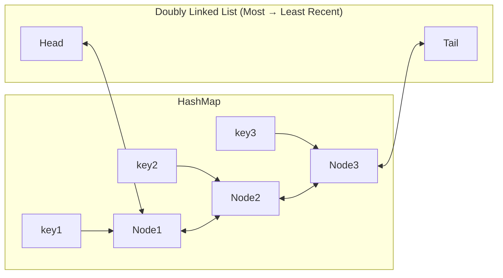
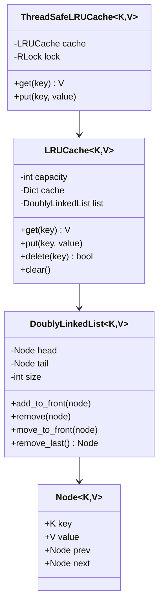

<Frame>
  
</Frame>

# Design LRU Cache

<Info>
**Difficulty**: 🟡 Intermediate | **Time**: 25-35 min | **Key Concepts**: Data Structures, HashMap + Doubly Linked List
</Info>

Design and implement an LRU (Least Recently Used) Cache with O(1) time complexity for both get and put operations. This is a classic data structure problem frequently asked in interviews.

---

## 1. Requirements

### Functional Requirements

| Operation | Description | Time Complexity |
|-----------|-------------|-----------------|
| `get(key)` | Return value if key exists, else -1 | O(1) |
| `put(key, value)` | Insert or update key-value pair | O(1) |
| **Eviction** | Remove least recently used item when capacity exceeded | O(1) |

### Constraints

- Fixed capacity (specified at creation)
- Thread-safe (for production use)
- Generic key and value types

---

## 2. The Problem with Simple Approaches

### Approach 1: Array/List
```
put: O(1) - append to end
get: O(n) - search through list
evict: O(n) - find and remove oldest
```
❌ Get is too slow

### Approach 2: HashMap Only
```
put: O(1) - direct insert
get: O(1) - direct lookup
evict: O(n) - which key is oldest?
```
❌ No ordering information

### The Solution: HashMap + Doubly Linked List

```
HashMap: key → Node reference  (O(1) lookup)
DLL: maintains access order    (O(1) move to front, O(1) remove from tail)
```

---

## 3. Data Structure Design



- **Head**: Most recently used (MRU)
- **Tail**: Least recently used (LRU) - eviction candidate
- **HashMap**: O(1) access to any node

---

## 4. Implementation

### 4.1 Node Class

```python
from typing import TypeVar, Generic, Optional, Dict
from threading import RLock

K = TypeVar('K')  # Key type
V = TypeVar('V')  # Value type

class Node(Generic[K, V]):
    """
    Doubly linked list node storing key-value pair.
    Key is stored to enable removal from HashMap during eviction.
    """
    
    def __init__(self, key: K, value: V):
        self.key = key
        self.value = value
        self.prev: Optional[Node[K, V]] = None
        self.next: Optional[Node[K, V]] = None
    
    def __repr__(self) -> str:
        return f"Node({self.key}: {self.value})"
```

### 4.2 Doubly Linked List

```python
class DoublyLinkedList(Generic[K, V]):
    """
    Doubly linked list with dummy head and tail for easier operations.
    
    Structure: HEAD <-> node1 <-> node2 <-> ... <-> TAIL
    - HEAD.next = most recently used
    - TAIL.prev = least recently used (eviction candidate)
    """
    
    def __init__(self):
        # Dummy nodes simplify edge cases
        self.head = Node(None, None)  # type: ignore
        self.tail = Node(None, None)  # type: ignore
        self.head.next = self.tail
        self.tail.prev = self.head
        self.size = 0
    
    def add_to_front(self, node: Node[K, V]) -> None:
        """
        Add node right after HEAD (most recently used position).
        
        Before: HEAD <-> old_first <-> ...
        After:  HEAD <-> node <-> old_first <-> ...
        """
        node.prev = self.head
        node.next = self.head.next
        self.head.next.prev = node
        self.head.next = node
        self.size += 1
    
    def remove(self, node: Node[K, V]) -> None:
        """
        Remove node from its current position.
        
        Before: ... <-> prev <-> node <-> next <-> ...
        After:  ... <-> prev <-> next <-> ...
        """
        node.prev.next = node.next
        node.next.prev = node.prev
        node.prev = None
        node.next = None
        self.size -= 1
    
    def move_to_front(self, node: Node[K, V]) -> None:
        """Move existing node to front (mark as most recently used)."""
        self.remove(node)
        self.add_to_front(node)
    
    def remove_last(self) -> Optional[Node[K, V]]:
        """
        Remove and return the last node (least recently used).
        Returns None if list is empty.
        """
        if self.size == 0:
            return None
        
        last = self.tail.prev
        self.remove(last)
        return last
    
    def __len__(self) -> int:
        return self.size
```

### 4.3 LRU Cache

```python
class LRUCache(Generic[K, V]):
    """
    LRU Cache with O(1) get and put operations.
    
    Uses HashMap for O(1) key lookup and Doubly Linked List for O(1) ordering.
    """
    
    def __init__(self, capacity: int):
        if capacity <= 0:
            raise ValueError("Capacity must be positive")
        
        self.capacity = capacity
        self.cache: Dict[K, Node[K, V]] = {}
        self.list = DoublyLinkedList[K, V]()
    
    def get(self, key: K) -> Optional[V]:
        """
        Get value by key.
        
        Returns:
            Value if key exists, None otherwise.
            
        Side effect:
            Moves accessed key to front (most recently used).
        """
        if key not in self.cache:
            return None
        
        node = self.cache[key]
        # Move to front (mark as recently used)
        self.list.move_to_front(node)
        return node.value
    
    def put(self, key: K, value: V) -> None:
        """
        Insert or update key-value pair.
        
        If key exists: Update value and move to front.
        If key is new:
            - If at capacity: Evict least recently used
            - Add new node to front
        """
        if key in self.cache:
            # Update existing key
            node = self.cache[key]
            node.value = value
            self.list.move_to_front(node)
        else:
            # Check capacity
            if len(self.list) >= self.capacity:
                # Evict least recently used
                evicted = self.list.remove_last()
                if evicted:
                    del self.cache[evicted.key]
            
            # Add new node
            node = Node(key, value)
            self.cache[key] = node
            self.list.add_to_front(node)
    
    def delete(self, key: K) -> bool:
        """
        Explicitly remove a key from cache.
        
        Returns:
            True if key was present and removed, False otherwise.
        """
        if key not in self.cache:
            return False
        
        node = self.cache[key]
        self.list.remove(node)
        del self.cache[key]
        return True
    
    def clear(self) -> None:
        """Remove all entries from cache."""
        self.cache.clear()
        self.list = DoublyLinkedList[K, V]()
    
    def __len__(self) -> int:
        return len(self.list)
    
    def __contains__(self, key: K) -> bool:
        return key in self.cache
    
    def __repr__(self) -> str:
        items = []
        current = self.list.head.next
        while current != self.list.tail:
            items.append(f"{current.key}: {current.value}")
            current = current.next
        return f"LRUCache([{', '.join(items)}])"
```

---

## 5. Thread-Safe Version

For production use, we need thread safety:

```python
from threading import RLock
from contextlib import contextmanager

class ThreadSafeLRUCache(Generic[K, V]):
    """
    Thread-safe LRU Cache using RLock for reentrancy.
    
    Uses RLock (reentrant lock) instead of Lock to allow
    the same thread to acquire the lock multiple times.
    """
    
    def __init__(self, capacity: int):
        self._cache = LRUCache[K, V](capacity)
        self._lock = RLock()
    
    @contextmanager
    def _locked(self):
        self._lock.acquire()
        try:
            yield
        finally:
            self._lock.release()
    
    def get(self, key: K) -> Optional[V]:
        with self._locked():
            return self._cache.get(key)
    
    def put(self, key: K, value: V) -> None:
        with self._locked():
            self._cache.put(key, value)
    
    def delete(self, key: K) -> bool:
        with self._locked():
            return self._cache.delete(key)
    
    def clear(self) -> None:
        with self._locked():
            self._cache.clear()
    
    def __len__(self) -> int:
        with self._locked():
            return len(self._cache)
    
    def __contains__(self, key: K) -> bool:
        with self._locked():
            return key in self._cache
```

---

## 6. LeetCode Style Implementation

For interviews, a more compact version:

```python
class LRUCache:
    """
    LeetCode-style implementation.
    - get(key): Return value or -1
    - put(key, value): Insert/update
    """
    
    def __init__(self, capacity: int):
        self.capacity = capacity
        self.cache = {}  # key -> node
        
        # Dummy head and tail
        self.head = {'key': 0, 'val': 0, 'prev': None, 'next': None}
        self.tail = {'key': 0, 'val': 0, 'prev': None, 'next': None}
        self.head['next'] = self.tail
        self.tail['prev'] = self.head
    
    def _remove(self, node):
        """Remove node from linked list"""
        prev, nxt = node['prev'], node['next']
        prev['next'] = nxt
        nxt['prev'] = prev
    
    def _add_to_front(self, node):
        """Add node right after head"""
        node['prev'] = self.head
        node['next'] = self.head['next']
        self.head['next']['prev'] = node
        self.head['next'] = node
    
    def get(self, key: int) -> int:
        if key not in self.cache:
            return -1
        
        node = self.cache[key]
        self._remove(node)
        self._add_to_front(node)
        return node['val']
    
    def put(self, key: int, value: int) -> None:
        if key in self.cache:
            node = self.cache[key]
            node['val'] = value
            self._remove(node)
            self._add_to_front(node)
        else:
            if len(self.cache) >= self.capacity:
                # Evict LRU (tail.prev)
                lru = self.tail['prev']
                self._remove(lru)
                del self.cache[lru['key']]
            
            # Add new node
            node = {'key': key, 'val': value, 'prev': None, 'next': None}
            self.cache[key] = node
            self._add_to_front(node)
```

---

## 7. Python's Built-in OrderedDict

Python's `OrderedDict` can simplify LRU cache implementation:

```python
from collections import OrderedDict

class LRUCacheSimple:
    """
    Simplified LRU Cache using OrderedDict.
    
    OrderedDict maintains insertion order and supports
    move_to_end() for O(1) reordering.
    """
    
    def __init__(self, capacity: int):
        self.capacity = capacity
        self.cache = OrderedDict()
    
    def get(self, key):
        if key not in self.cache:
            return -1
        
        # Move to end (most recently used)
        self.cache.move_to_end(key)
        return self.cache[key]
    
    def put(self, key, value):
        if key in self.cache:
            # Update and move to end
            self.cache.move_to_end(key)
        elif len(self.cache) >= self.capacity:
            # Remove first item (least recently used)
            self.cache.popitem(last=False)
        
        self.cache[key] = value
```

<Warning>
**Interview Note**: Using OrderedDict is acceptable for a quick solution, but interviewers often want to see the HashMap + DLL implementation to verify you understand the underlying data structures.
</Warning>

---

## 8. Usage Example

```python
# Create cache with capacity 3
cache = LRUCache[str, int](3)

# Add items
cache.put("a", 1)
cache.put("b", 2)
cache.put("c", 3)
print(cache)  # LRUCache([c: 3, b: 2, a: 1])

# Access 'a' - moves to front
cache.get("a")
print(cache)  # LRUCache([a: 1, c: 3, b: 2])

# Add 'd' - evicts 'b' (least recently used)
cache.put("d", 4)
print(cache)  # LRUCache([d: 4, a: 1, c: 3])

# 'b' is gone
print(cache.get("b"))  # None

# Update existing key
cache.put("c", 30)
print(cache)  # LRUCache([c: 30, d: 4, a: 1])
```

---

## 9. Complexity Analysis

| Operation | Time | Space |
|-----------|------|-------|
| `get(key)` | O(1) | - |
| `put(key, value)` | O(1) | - |
| `delete(key)` | O(1) | - |
| **Overall Space** | - | O(capacity) |

**Why O(1)?**
- HashMap: O(1) lookup to find node
- DLL add/remove: O(1) with direct node reference
- No iteration needed for eviction

---

## 10. Variations

### 10.1 LRU with TTL (Time-To-Live)

```python
import time

class LRUCacheWithTTL(Generic[K, V]):
    """LRU Cache where entries expire after TTL seconds."""
    
    def __init__(self, capacity: int, ttl_seconds: float):
        self.capacity = capacity
        self.ttl = ttl_seconds
        self.cache: Dict[K, tuple[Node[K, V], float]] = {}
        self.list = DoublyLinkedList[K, V]()
    
    def _is_expired(self, key: K) -> bool:
        if key not in self.cache:
            return True
        _, timestamp = self.cache[key]
        return time.time() - timestamp > self.ttl
    
    def get(self, key: K) -> Optional[V]:
        if key not in self.cache or self._is_expired(key):
            if key in self.cache:
                self._evict(key)
            return None
        
        node, _ = self.cache[key]
        self.list.move_to_front(node)
        # Update timestamp on access (optional, based on requirements)
        self.cache[key] = (node, time.time())
        return node.value
    
    def put(self, key: K, value: V) -> None:
        if key in self.cache:
            node, _ = self.cache[key]
            node.value = value
            self.list.move_to_front(node)
            self.cache[key] = (node, time.time())
        else:
            while len(self.list) >= self.capacity:
                self._evict_lru()
            
            node = Node(key, value)
            self.cache[key] = (node, time.time())
            self.list.add_to_front(node)
```

### 10.2 LFU Cache (Least Frequently Used)

```python
from collections import defaultdict

class LFUCache:
    """
    Least Frequently Used cache.
    Evicts the key with lowest access frequency.
    On tie, evicts the least recently used among them.
    """
    
    def __init__(self, capacity: int):
        self.capacity = capacity
        self.min_freq = 0
        
        # key -> (value, frequency)
        self.key_val = {}
        
        # frequency -> OrderedDict of keys (for LRU within same frequency)
        self.freq_keys = defaultdict(OrderedDict)
    
    def get(self, key: int) -> int:
        if key not in self.key_val:
            return -1
        
        val, freq = self.key_val[key]
        
        # Remove from current frequency
        del self.freq_keys[freq][key]
        if not self.freq_keys[freq]:
            del self.freq_keys[freq]
            if self.min_freq == freq:
                self.min_freq += 1
        
        # Add to next frequency
        self.key_val[key] = (val, freq + 1)
        self.freq_keys[freq + 1][key] = None
        
        return val
    
    def put(self, key: int, value: int) -> None:
        if self.capacity <= 0:
            return
        
        if key in self.key_val:
            self.key_val[key] = (value, self.key_val[key][1])
            self.get(key)  # Update frequency
            return
        
        if len(self.key_val) >= self.capacity:
            # Evict LFU (least recently used among min frequency)
            evict_key, _ = self.freq_keys[self.min_freq].popitem(last=False)
            del self.key_val[evict_key]
        
        self.key_val[key] = (value, 1)
        self.freq_keys[1][key] = None
        self.min_freq = 1
```

---

## 11. Class Diagram



---

## 12. Key Takeaways

| Concept | Details |
|---------|---------|
| **Data Structure** | HashMap + Doubly Linked List |
| **Time Complexity** | O(1) for all operations |
| **Space Complexity** | O(capacity) |
| **Key Insight** | HashMap for lookup, DLL for ordering |
| **Eviction** | Remove from tail (LRU position) |
| **Access** | Move to head (MRU position) |

---

## 13. Interview Tips

<AccordionGroup>
  <Accordion title="Why doubly linked list instead of singly?" icon="list">
    - **Singly linked list**: O(n) to remove a node (need to find previous)
    - **Doubly linked list**: O(1) to remove (have direct access to prev and next)
  </Accordion>
  
  <Accordion title="Why store key in the Node?" icon="key">
    When evicting from the tail, we need to also remove from HashMap.
    Without the key stored in the node, we'd need O(n) to find which key maps to this node.
  </Accordion>
  
  <Accordion title="What about cache invalidation?" icon="clock">
    - Add TTL per entry
    - Lazy invalidation: check TTL on access
    - Active invalidation: background thread cleans expired entries
  </Accordion>
</AccordionGroup>
