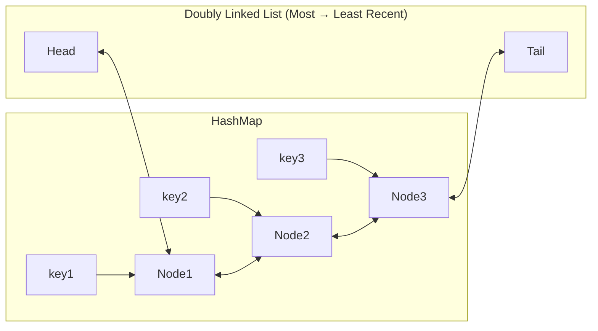
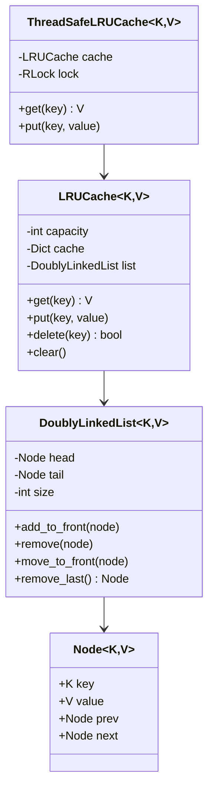

<Frame>
  
</Frame>

# Design LRU Cache

<Info>
**Difficulty**: 🟡 Intermediate | **Time**: 25-35 min | **Key Concepts**: Data Structures, HashMap + Doubly Linked List
</Info>

Design and implement an LRU (Least Recently Used) Cache with O(1) time complexity for both get and put operations. This is a classic data structure problem frequently asked in interviews.

---

## 1. Requirements

### Functional Requirements

| Operation | Description | Time Complexity |
|-----------|-------------|-----------------|
| `get(key)` | Return value if key exists, else -1 | O(1) |
| `put(key, value)` | Insert or update key-value pair | O(1) |
| **Eviction** | Remove least recently used item when capacity exceeded | O(1) |

### Constraints

- Fixed capacity (specified at creation)
- Thread-safe (for production use)
- Generic key and value types

---

## 2. The Problem with Simple Approaches

### Approach 1: Array/List
```
put: O(1) - append to end
get: O(n) - search through list
evict: O(n) - find and remove oldest
```
❌ Get is too slow

### Approach 2: HashMap Only
```
put: O(1) - direct insert
get: O(1) - direct lookup
evict: O(n) - which key is oldest?
```
❌ No ordering information

### The Solution: HashMap + Doubly Linked List

```
HashMap: key → Node reference  (O(1) lookup)
DLL: maintains access order    (O(1) move to front, O(1) remove from tail)
```

---

## 3. Data Structure Design


```mermaid
graph LR
    subgraph HashMap
        K1[key1] --> N1
        K2[key2] --> N2
        K3[key3] --> N3
    end
    
    subgraph "Doubly Linked List (Most → Least Recent)"
        HEAD[Head] <--> N1[Node1]
        N1 <--> N2[Node2]
        N2 <--> N3[Node3]
        N3 <--> TAIL[Tail]
    end
```

- **Head**: Most recently used (MRU)
- **Tail**: Least recently used (LRU) - eviction candidate
- **HashMap**: O(1) access to any node

---

## 4. Implementation

### 4.1 Node Class

```python
from typing import TypeVar, Generic, Optional, Dict
from threading import RLock

K = TypeVar('K')  # Key type
V = TypeVar('V')  # Value type

class Node(Generic[K, V]):
    """
    Doubly linked list node storing key-value pair.
    Key is stored to enable removal from HashMap during eviction.
    """
    
    def __init__(self, key: K, value: V):
        self.key = key
        self.value = value
        self.prev: Optional[Node[K, V]] = None
        self.next: Optional[Node[K, V]] = None
    
    def __repr__(self) -> str:
        return f"Node({self.key}: {self.value})"
```

### 4.2 Doubly Linked List

```python
class DoublyLinkedList(Generic[K, V]):
    """
    Doubly linked list with dummy head and tail for easier operations.
    
    Structure: HEAD <-> node1 <-> node2 <-> ... <-> TAIL
    - HEAD.next = most recently used
    - TAIL.prev = least recently used (eviction candidate)
    """
    
    def __init__(self):
        # Dummy nodes simplify edge cases
        self.head = Node(None, None)  # type: ignore
        self.tail = Node(None, None)  # type: ignore
        self.head.next = self.tail
        self.tail.prev = self.head
        self.size = 0
    
    def add_to_front(self, node: Node[K, V]) -> None:
        """
        Add node right after HEAD (most recently used position).
        
        Before: HEAD <-> old_first <-> ...
        After:  HEAD <-> node <-> old_first <-> ...
        """
        node.prev = self.head
        node.next = self.head.next
        self.head.next.prev = node
        self.head.next = node
        self.size += 1
    
    def remove(self, node: Node[K, V]) -> None:
        """
        Remove node from its current position.
        
        Before: ... <-> prev <-> node <-> next <-> ...
        After:  ... <-> prev <-> next <-> ...
        """
        node.prev.next = node.next
        node.next.prev = node.prev
        node.prev = None
        node.next = None
        self.size -= 1
    
    def move_to_front(self, node: Node[K, V]) -> None:
        """Move existing node to front (mark as most recently used)."""
        self.remove(node)
        self.add_to_front(node)
    
    def remove_last(self) -> Optional[Node[K, V]]:
        """
        Remove and return the last node (least recently used).
        Returns None if list is empty.
        """
        if self.size == 0:
            return None
        
        last = self.tail.prev
        self.remove(last)
        return last
    
    def __len__(self) -> int:
        return self.size
```

### 4.3 LRU Cache

```python
class LRUCache(Generic[K, V]):
    """
    LRU Cache with O(1) get and put operations.
    
    Uses HashMap for O(1) key lookup and Doubly Linked List for O(1) ordering.
    """
    
    def __init__(self, capacity: int):
        if capacity <= 0:
            raise ValueError("Capacity must be positive")
        
        self.capacity = capacity
        self.cache: Dict[K, Node[K, V]] = {}
        self.list = DoublyLinkedList[K, V]()
    
    def get(self, key: K) -> Optional[V]:
        """
        Get value by key.
        
        Returns:
            Value if key exists, None otherwise.
            
        Side effect:
            Moves accessed key to front (most recently used).
        """
        if key not in self.cache:
            return None
        
        node = self.cache[key]
        # Move to front (mark as recently used)
        self.list.move_to_front(node)
        return node.value
    
    def put(self, key: K, value: V) -> None:
        """
        Insert or update key-value pair.
        
        If key exists: Update value and move to front.
        If key is new:
            - If at capacity: Evict least recently used
            - Add new node to front
        """
        if key in self.cache:
            # Update existing key
            node = self.cache[key]
            node.value = value
            self.list.move_to_front(node)
        else:
            # Check capacity
            if len(self.list) >= self.capacity:
                # Evict least recently used
                evicted = self.list.remove_last()
                if evicted:
                    del self.cache[evicted.key]
            
            # Add new node
            node = Node(key, value)
            self.cache[key] = node
            self.list.add_to_front(node)
    
    def delete(self, key: K) -> bool:
        """
        Explicitly remove a key from cache.
        
        Returns:
            True if key was present and removed, False otherwise.
        """
        if key not in self.cache:
            return False
        
        node = self.cache[key]
        self.list.remove(node)
        del self.cache[key]
        return True
    
    def clear(self) -> None:
        """Remove all entries from cache."""
        self.cache.clear()
        self.list = DoublyLinkedList[K, V]()
    
    def __len__(self) -> int:
        return len(self.list)
    
    def __contains__(self, key: K) -> bool:
        return key in self.cache
    
    def __repr__(self) -> str:
        items = []
        current = self.list.head.next
        while current != self.list.tail:
            items.append(f"{current.key}: {current.value}")
            current = current.next
        return f"LRUCache([{', '.join(items)}])"
```

---

## 5. Thread-Safe Version

For production use, we need thread safety:

```python
from threading import RLock
from contextlib import contextmanager

class ThreadSafeLRUCache(Generic[K, V]):
    """
    Thread-safe LRU Cache using RLock for reentrancy.
    
    Uses RLock (reentrant lock) instead of Lock to allow
    the same thread to acquire the lock multiple times.
    """
    
    def __init__(self, capacity: int):
        self._cache = LRUCache[K, V](capacity)
        self._lock = RLock()
    
    @contextmanager
    def _locked(self):
        self._lock.acquire()
        try:
            yield
        finally:
            self._lock.release()
    
    def get(self, key: K) -> Optional[V]:
        with self._locked():
            return self._cache.get(key)
    
    def put(self, key: K, value: V) -> None:
        with self._locked():
            self._cache.put(key, value)
    
    def delete(self, key: K) -> bool:
        with self._locked():
            return self._cache.delete(key)
    
    def clear(self) -> None:
        with self._locked():
            self._cache.clear()
    
    def __len__(self) -> int:
        with self._locked():
            return len(self._cache)
    
    def __contains__(self, key: K) -> bool:
        with self._locked():
            return key in self._cache
```

---

## 6. LeetCode Style Implementation

For interviews, a more compact version:

```python
class LRUCache:
    """
    LeetCode-style implementation.
    - get(key): Return value or -1
    - put(key, value): Insert/update
    """
    
    def __init__(self, capacity: int):
        self.capacity = capacity
        self.cache = {}  # key -> node
        
        # Dummy head and tail
        self.head = {'key': 0, 'val': 0, 'prev': None, 'next': None}
        self.tail = {'key': 0, 'val': 0, 'prev': None, 'next': None}
        self.head['next'] = self.tail
        self.tail['prev'] = self.head
    
    def _remove(self, node):
        """Remove node from linked list"""
        prev, nxt = node['prev'], node['next']
        prev['next'] = nxt
        nxt['prev'] = prev
    
    def _add_to_front(self, node):
        """Add node right after head"""
        node['prev'] = self.head
        node['next'] = self.head['next']
        self.head['next']['prev'] = node
        self.head['next'] = node
    
    def get(self, key: int) -> int:
        if key not in self.cache:
            return -1
        
        node = self.cache[key]
        self._remove(node)
        self._add_to_front(node)
        return node['val']
    
    def put(self, key: int, value: int) -> None:
        if key in self.cache:
            node = self.cache[key]
            node['val'] = value
            self._remove(node)
            self._add_to_front(node)
        else:
            if len(self.cache) >= self.capacity:
                # Evict LRU (tail.prev)
                lru = self.tail['prev']
                self._remove(lru)
                del self.cache[lru['key']]
            
            # Add new node
            node = {'key': key, 'val': value, 'prev': None, 'next': None}
            self.cache[key] = node
            self._add_to_front(node)
```

---

## 7. Python's Built-in OrderedDict

Python's `OrderedDict` can simplify LRU cache implementation:

```python
from collections import OrderedDict

class LRUCacheSimple:
    """
    Simplified LRU Cache using OrderedDict.
    
    OrderedDict maintains insertion order and supports
    move_to_end() for O(1) reordering.
    """
    
    def __init__(self, capacity: int):
        self.capacity = capacity
        self.cache = OrderedDict()
    
    def get(self, key):
        if key not in self.cache:
            return -1
        
        # Move to end (most recently used)
        self.cache.move_to_end(key)
        return self.cache[key]
    
    def put(self, key, value):
        if key in self.cache:
            # Update and move to end
            self.cache.move_to_end(key)
        elif len(self.cache) >= self.capacity:
            # Remove first item (least recently used)
            self.cache.popitem(last=False)
        
        self.cache[key] = value
```

<Warning>
**Interview Note**: Using OrderedDict is acceptable for a quick solution, but interviewers often want to see the HashMap + DLL implementation to verify you understand the underlying data structures.
</Warning>

---

## 8. Usage Example

```python
# Create cache with capacity 3
cache = LRUCache[str, int](3)

# Add items
cache.put("a", 1)
cache.put("b", 2)
cache.put("c", 3)
print(cache)  # LRUCache([c: 3, b: 2, a: 1])

# Access 'a' - moves to front
cache.get("a")
print(cache)  # LRUCache([a: 1, c: 3, b: 2])

# Add 'd' - evicts 'b' (least recently used)
cache.put("d", 4)
print(cache)  # LRUCache([d: 4, a: 1, c: 3])

# 'b' is gone
print(cache.get("b"))  # None

# Update existing key
cache.put("c", 30)
print(cache)  # LRUCache([c: 30, d: 4, a: 1])
```

---

## 9. Complexity Analysis

| Operation | Time | Space |
|-----------|------|-------|
| `get(key)` | O(1) | - |
| `put(key, value)` | O(1) | - |
| `delete(key)` | O(1) | - |
| **Overall Space** | - | O(capacity) |

**Why O(1)?**
- HashMap: O(1) lookup to find node
- DLL add/remove: O(1) with direct node reference
- No iteration needed for eviction

---

## 10. Variations

### 10.1 LRU with TTL (Time-To-Live)

```python
import time

class LRUCacheWithTTL(Generic[K, V]):
    """LRU Cache where entries expire after TTL seconds."""
    
    def __init__(self, capacity: int, ttl_seconds: float):
        self.capacity = capacity
        self.ttl = ttl_seconds
        self.cache: Dict[K, tuple[Node[K, V], float]] = {}
        self.list = DoublyLinkedList[K, V]()
    
    def _is_expired(self, key: K) -> bool:
        if key not in self.cache:
            return True
        _, timestamp = self.cache[key]
        return time.time() - timestamp > self.ttl
    
    def get(self, key: K) -> Optional[V]:
        if key not in self.cache or self._is_expired(key):
            if key in self.cache:
                self._evict(key)
            return None
        
        node, _ = self.cache[key]
        self.list.move_to_front(node)
        # Update timestamp on access (optional, based on requirements)
        self.cache[key] = (node, time.time())
        return node.value
    
    def put(self, key: K, value: V) -> None:
        if key in self.cache:
            node, _ = self.cache[key]
            node.value = value
            self.list.move_to_front(node)
            self.cache[key] = (node, time.time())
        else:
            while len(self.list) >= self.capacity:
                self._evict_lru()
            
            node = Node(key, value)
            self.cache[key] = (node, time.time())
            self.list.add_to_front(node)
```

### 10.2 LFU Cache (Least Frequently Used)

```python
from collections import defaultdict

class LFUCache:
    """
    Least Frequently Used cache.
    Evicts the key with lowest access frequency.
    On tie, evicts the least recently used among them.
    """
    
    def __init__(self, capacity: int):
        self.capacity = capacity
        self.min_freq = 0
        
        # key -> (value, frequency)
        self.key_val = {}
        
        # frequency -> OrderedDict of keys (for LRU within same frequency)
        self.freq_keys = defaultdict(OrderedDict)
    
    def get(self, key: int) -> int:
        if key not in self.key_val:
            return -1
        
        val, freq = self.key_val[key]
        
        # Remove from current frequency
        del self.freq_keys[freq][key]
        if not self.freq_keys[freq]:
            del self.freq_keys[freq]
            if self.min_freq == freq:
                self.min_freq += 1
        
        # Add to next frequency
        self.key_val[key] = (val, freq + 1)
        self.freq_keys[freq + 1][key] = None
        
        return val
    
    def put(self, key: int, value: int) -> None:
        if self.capacity <= 0:
            return
        
        if key in self.key_val:
            self.key_val[key] = (value, self.key_val[key][1])
            self.get(key)  # Update frequency
            return
        
        if len(self.key_val) >= self.capacity:
            # Evict LFU (least recently used among min frequency)
            evict_key, _ = self.freq_keys[self.min_freq].popitem(last=False)
            del self.key_val[evict_key]
        
        self.key_val[key] = (value, 1)
        self.freq_keys[1][key] = None
        self.min_freq = 1
```

---

## 11. Class Diagram


```mermaid
classDiagram
    class LRUCache~K,V~ {
        -int capacity
        -Dict cache
        -DoublyLinkedList list
        +get(key) V
        +put(key, value)
        +delete(key) bool
        +clear()
    }
    
    class DoublyLinkedList~K,V~ {
        -Node head
        -Node tail
        -int size
        +add_to_front(node)
        +remove(node)
        +move_to_front(node)
        +remove_last() Node
    }
    
    class Node~K,V~ {
        +K key
        +V value
        +Node prev
        +Node next
    }
    
    class ThreadSafeLRUCache~K,V~ {
        -LRUCache cache
        -RLock lock
        +get(key) V
        +put(key, value)
    }
    
    LRUCache --> DoublyLinkedList
    DoublyLinkedList --> Node
    ThreadSafeLRUCache --> LRUCache
```

---

## 12. Key Takeaways

| Concept | Details |
|---------|---------|
| **Data Structure** | HashMap + Doubly Linked List |
| **Time Complexity** | O(1) for all operations |
| **Space Complexity** | O(capacity) |
| **Key Insight** | HashMap for lookup, DLL for ordering |
| **Eviction** | Remove from tail (LRU position) |
| **Access** | Move to head (MRU position) |

---

## 13. Interview Tips

<AccordionGroup>
  <Accordion title="Why doubly linked list instead of singly?" icon="list">
    - **Singly linked list**: O(n) to remove a node (need to find previous)
    - **Doubly linked list**: O(1) to remove (have direct access to prev and next)
  </Accordion>
  
  <Accordion title="Why store key in the Node?" icon="key">
    When evicting from the tail, we need to also remove from HashMap.
    Without the key stored in the node, we'd need O(n) to find which key maps to this node.
  </Accordion>
  
  <Accordion title="What about cache invalidation?" icon="clock">
    - Add TTL per entry
    - Lazy invalidation: check TTL on access
    - Active invalidation: background thread cleans expired entries
  </Accordion>
</AccordionGroup>

---

## Interview Deep-Dive Questions

<AccordionGroup>
  <Accordion title="Q1: Why does an LRU cache require both a HashMap and a doubly linked list? Could you achieve O(1) with just one of them?" icon="circle-question">
    **Strong Answer:**
    - The HashMap alone gives us O(1) key lookups but has no concept of ordering -- you cannot efficiently determine which entry was accessed least recently. You would need to scan every entry and compare timestamps, making eviction O(n).
    - The doubly linked list alone gives us O(1) insertion at the head, O(1) removal from the tail for eviction, and O(1) node relocation *if you already have a pointer to the node*. But finding a node by key in a linked list is O(n) because you must traverse.
    - The combination is what makes every operation O(1): the HashMap maps keys directly to node references in the DLL, so `get` is a HashMap lookup (O(1)) followed by a `move_to_front` on the DLL (O(1) since we have the node pointer). Eviction is removing `tail.prev` from the DLL (O(1)) and deleting the corresponding HashMap entry using the key stored in the evicted node (O(1)).
    - The reason the list must be *doubly* linked and not singly linked: when we remove a node from the middle of the list, we need to update `node.prev.next` and `node.next.prev`. With a singly linked list, we do not have `node.prev`, so removal requires O(n) traversal to find the predecessor.
    - A subtle but important detail: the Node must store the key (not just the value) because during eviction from the tail, we need to know which key to delete from the HashMap. Without the key in the node, we would need an O(n) reverse lookup.

    **Red flag answer:** "You just need a HashMap with timestamps and sort by timestamp when evicting." This reveals a misunderstanding of time complexity -- sorting is O(n log n) and even finding the minimum timestamp is O(n), which violates the O(1) eviction requirement.

    **Follow-ups:**
    1. What would happen if you used a singly linked list with a `prev` pointer hack (storing the previous node's reference in the HashMap alongside the node itself)? What are the trade-offs?
    2. Python's `OrderedDict` uses a different internal implementation than a raw HashMap + DLL. How does `OrderedDict` achieve `move_to_end` in O(1), and why might an interviewer still ask you to implement the DLL version manually?
  </Accordion>

  <Accordion title="Q2: Walk me through what happens internally when you call `put` on a full LRU cache with a brand new key. Every pointer change, every HashMap operation." icon="circle-question">
    **Strong Answer:**
    - Starting state: cache is at capacity, say 3 entries. The DLL looks like `HEAD <-> A <-> B <-> C <-> TAIL` and the HashMap has `{keyA: nodeA, keyB: nodeB, keyC: nodeC}`.
    - Step 1 -- Eviction: We remove the node at `tail.prev`, which is node C. This means: set `C.prev.next = C.next` (which is `B.next = TAIL`) and `C.next.prev = C.prev` (which is `TAIL.prev = B`). Then null out C's pointers. Decrement the DLL size. Then use `C.key` to do `del cache[keyC]` from the HashMap. This is why the key is stored in the node.
    - Step 2 -- Create new node: Allocate `Node(newKey, newValue)`.
    - Step 3 -- Add to front: Set `node.prev = HEAD`, `node.next = HEAD.next` (which is A). Then update `HEAD.next.prev = node` (so `A.prev = node`) and `HEAD.next = node`. The DLL is now `HEAD <-> new <-> A <-> B <-> TAIL`. Increment size.
    - Step 4 -- Update HashMap: `cache[newKey] = node`.
    - Total: 4 pointer updates for eviction, 4 pointer updates for insertion, 1 HashMap delete, 1 HashMap insert. All O(1). No iteration, no searching.
    - The dummy head and tail nodes are critical here -- they eliminate edge cases. Without them, adding to an empty list or removing the only node requires special-case code for null checks.

    **Red flag answer:** Describing the operation at a high level ("it removes the oldest and adds the new one") without being able to trace the pointer manipulations. In an interview, the interviewer wants to see that you can actually implement this, not just describe it conceptually.

    **Follow-ups:**
    1. What happens if `put` is called with a key that already exists in the cache? How does the operation differ?
    2. What would go wrong if you forgot to null out the evicted node's `prev` and `next` pointers? Could this cause a memory leak or a subtle bug?
  </Accordion>

  <Accordion title="Q3: The thread-safe version uses a single RLock around every operation. What are the performance problems with this approach, and how would you improve concurrency?" icon="circle-question">
    **Strong Answer:**
    - A single global lock serializes all operations. If you have 100 threads doing `get` calls, only one can proceed at a time -- even though reads that do not modify the same node could theoretically run concurrently. Under high throughput (say 500K ops/sec on a web server's local cache), this becomes a bottleneck.
    - Improvement 1 -- Read-write lock (`ReadWriteLock`): Allow multiple concurrent readers, exclusive access for writers. But for LRU cache this is tricky because even `get` is a write operation (it moves the node to the front). So a naive RWLock does not help much.
    - Improvement 2 -- Sharded/segmented locks: Split the cache into N segments (like Java's `ConcurrentHashMap` pre-Java 8). Each segment has its own lock. `key.hash() % N` determines the segment. This reduces contention by a factor of N. Trade-off: eviction becomes more complex since you need a global LRU ordering across segments, or you accept per-segment LRU (which is an approximation).
    - Improvement 3 -- Lock-free approaches: Use a `ConcurrentHashMap` for lookups and a probabilistic/approximate LRU policy. For example, Redis does not maintain a true LRU linked list. It samples K random keys and evicts the one with the oldest access time. This is O(K) per eviction but avoids all linked list contention. In benchmarks, K=10 gives an eviction accuracy very close to true LRU.
    - Improvement 4 -- Batched reordering: Instead of moving to front on every `get`, buffer the "recently accessed" keys in a lock-free queue and periodically flush them to update the DLL order in a single batch under one lock acquisition. Caffeine (Java's high-performance cache) uses this approach with a ring buffer.
    - The choice of `RLock` (reentrant) vs `Lock` matters: `RLock` allows the same thread to acquire the lock multiple times (useful if `put` internally calls `get`), but it has slightly higher overhead than a plain `Lock` due to tracking the owning thread and recursion count.

    **Red flag answer:** "Just use a lock, it is fine for most cases." This shows no awareness of concurrency trade-offs. Even worse: "Use a read-write lock since `get` is a read operation" -- this misses that `get` mutates the DLL.

    **Follow-ups:**
    1. In the sharded lock approach, how would you handle the case where you need to evict the globally least-recently-used entry, not just the least-recently-used within a single shard?
    2. How does Redis actually implement its LRU eviction? Why did the Redis team choose approximate LRU over true LRU?
  </Accordion>

  <Accordion title="Q4: Compare LRU, LFU, and ARC eviction policies. When would you pick each one in a production system?" icon="circle-question">
    **Strong Answer:**
    - **LRU (Least Recently Used)**: Evicts the entry that has not been accessed for the longest time. Best when recent access is a good predictor of future access (temporal locality). Simple to implement. Weakness: a single full-table scan (e.g., a batch analytics query reading every row) can flush the entire hot working set from the cache. This is called "cache pollution."
    - **LFU (Least Frequently Used)**: Evicts the entry with the lowest access count. Better when some items are consistently popular over time (frequency locality). Used by CDNs for static assets -- a viral video accessed 10M times should not be evicted just because it was not accessed in the last 5 seconds. Weakness: "frequency aging" -- an item that was popular yesterday but irrelevant today can linger because its count is high. You need a decay mechanism (e.g., halve all counts periodically, or use a time-windowed frequency).
    - **ARC (Adaptive Replacement Cache)**: Maintains two LRU lists -- one for entries accessed once (recency) and one for entries accessed multiple times (frequency). Dynamically adjusts the size ratio between them based on which list is producing more hits. Used by ZFS and IBM DB2. It adapts to workload changes without manual tuning. Downside: more memory overhead (tracks "ghost entries" for recently evicted items) and more complex implementation.
    - **W-TinyLFU** (used by Caffeine, the gold standard Java cache): Uses a small LRU "window" admission filter + a segmented LRU main space, with a frequency sketch (Count-Min Sketch) to decide whether a new entry should replace an existing one. Near-optimal hit rates across diverse workloads. This is what you would use in a modern JVM application.
    - Rule of thumb: LRU for general-purpose caching (web sessions, database query results). LFU for CDN and content caching. ARC or W-TinyLFU when you need best-in-class hit rates and can afford the implementation complexity.

    **Red flag answer:** Only knowing LRU, or saying "LFU is always better because it tracks frequency." The best policy depends on the access pattern, and any strong candidate should know that no single policy wins on all workloads.

    **Follow-ups:**
    1. How would you implement a frequency decay mechanism for LFU so that stale-but-once-popular items eventually get evicted?
    2. You are building a cache for a social media feed service where some posts go viral for 2 hours then drop off completely. Which eviction policy would you choose, and why?
  </Accordion>

  <Accordion title="Q5: How would you extend a single-node LRU cache into a distributed cache system? What are the key design decisions?" icon="circle-question">
    **Strong Answer:**
    - Moving from single-node to distributed introduces several fundamental challenges: data partitioning, consistency, replication, and cache coherence.
    - **Partitioning (sharding)**: Use consistent hashing to distribute keys across N cache nodes. Each key hashes to a position on the ring, and the first node clockwise from that position owns the key. When a node is added or removed, only ~1/N of keys need to be remapped instead of all of them (which would happen with simple `hash(key) % N`). Virtual nodes (each physical node gets 100-200 positions on the ring) improve balance.
    - **Replication**: For availability, replicate each key to the next R nodes on the hash ring. Decide on consistency model: strong consistency (all replicas must agree before returning -- slow but safe) vs eventual consistency (write to primary, async replicate -- fast but stale reads possible). Most production caches (Memcached, Redis) choose eventual consistency or single-leader replication because cache misses can always fall through to the source of truth.
    - **Cache coherence**: When data is updated in the source of truth, how do you invalidate/update the cache? Options: (a) write-through -- update cache and DB together, (b) write-behind -- update cache immediately, batch-write to DB later (risk of data loss), (c) cache-aside -- application manages cache manually (read: check cache, miss -> query DB -> populate cache; write: update DB, invalidate cache). Cache-aside is the most common pattern because it is simple and the cache layer does not need to know about the DB.
    - **Hot key problem**: Some keys (e.g., a celebrity's profile, a trending product) receive disproportionate traffic. If one node owns that key, it becomes a hotspot. Solutions: local caching (each app server caches hot keys locally with short TTL), key replication (replicate hot keys to multiple nodes), or key splitting (split `celebrity:123` into `celebrity:123:shard0` through `celebrity:123:shard9`).
    - **Failure handling**: What happens when a cache node dies? With consistent hashing, its keys redistribute to the next node. If using replication, the replica takes over. Without replication, those keys experience cache misses and the DB sees a "thundering herd" of requests. Mitigation: request coalescing (only one request per key goes to DB, others wait), probabilistic early expiration (each client independently decides to refresh a key slightly before TTL expires, spreading the load).

    **Red flag answer:** "Just run multiple instances of the LRU cache behind a load balancer." This completely misses the partitioning problem -- with naive load balancing, key X might go to any node, so you get no cache hits. The candidate does not understand the difference between stateless services (where load balancing works) and stateful caches (where key affinity is essential).

    **Follow-ups:**
    1. Explain the thundering herd problem in detail. You have a cache key that 10,000 requests per second depend on, and it just expired. What happens, and how do you prevent it?
    2. Compare Redis Cluster's approach to sharding with Memcached's client-side consistent hashing. What are the trade-offs of server-side vs client-side partitioning?
  </Accordion>

  <Accordion title="Q6: In the implementation, dummy head and tail nodes are used. Why? What bugs would occur without them?" icon="circle-question">
    **Strong Answer:**
    - Dummy (sentinel) nodes eliminate all null-check edge cases in linked list operations. Without them, every operation (`add_to_front`, `remove`, `remove_last`) needs special-case code for: (a) empty list, (b) single-element list, (c) removing the head, (d) removing the tail.
    - For example, `add_to_front` without sentinels: if the list is empty, you must set both `head = node` and `tail = node`. If the list is not empty, you set `node.next = head`, `head.prev = node`, `head = node`. That is two code paths. With sentinels, it is always the same four pointer assignments regardless of list state.
    - `remove` without sentinels: if the node is the head, you must update `head = node.next`. If the node is the tail, update `tail = node.prev`. If the node is in the middle, update `node.prev.next` and `node.next.prev`. With sentinels, it is always just `node.prev.next = node.next` and `node.next.prev = node.prev` -- the sentinels absorb the edge cases.
    - The bugs that occur without sentinels are classic: `NullPointerException` (or `AttributeError` in Python) when removing the last element and then trying to access `head.next`, or silently corrupting the list by not updating `tail` when removing the tail node. These bugs are insidious because they only trigger in edge cases (empty list, single-element list) that are easy to miss in testing.
    - Sentinels cost two extra node allocations (trivial memory) but eliminate an entire class of bugs. In a production cache handling millions of operations, those edge-case bugs would eventually surface as data corruption or crashes.

    **Red flag answer:** "They are just there for convenience, you could do it without them." Technically true, but this misses the *why*. The sentinel pattern is a deliberate engineering choice to reduce bug surface area, and dismissing it as optional shows the candidate does not appreciate defensive data structure design.

    **Follow-ups:**
    1. If you were implementing this in a language without garbage collection (C/C++), what additional concerns would the sentinel nodes introduce around memory management?
    2. Can you think of other data structures that use sentinel or dummy nodes for the same reason? How does this pattern generalize?
  </Accordion>

  <Accordion title="Q7: You deploy your LRU cache in production and notice the hit rate is only 40% when you expected 85%. How do you diagnose and fix this?" icon="circle-question">
    **Strong Answer:**
    - Step 1 -- Instrument the cache: Add metrics for hit rate, miss rate, eviction rate, and current size. If the eviction rate is very high (close to the request rate), the cache is too small for the working set. The fix is straightforward: increase capacity.
    - Step 2 -- Analyze the access pattern: Log a sample of keys being accessed. Look at the key distribution. If it follows a Zipfian distribution (a small number of keys are accessed very frequently), LRU should work well. If the distribution is nearly uniform (many keys each accessed rarely), no cache will help much -- the working set is larger than the cache.
    - Step 3 -- Check for cache pollution: Look for periodic full scans or batch operations that access many keys once and then never again. For example, a nightly analytics job reading every user record would flush the hot working set. Solutions: use a separate cache for batch workloads, or switch to an eviction policy that resists scan pollution (like LRU-K, 2Q, or ARC which require an item to be accessed K times before it enters the main cache).
    - Step 4 -- Check key cardinality: If the key space is too large relative to cache size (e.g., caching per-user data for 10M users in a cache that holds 100K entries), the hit rate will be low because the "long tail" of users constantly evicts each other. Solutions: cache only for active users (determined by a Bloom filter or activity window), or segment users by activity tier.
    - Step 5 -- Check for TTL issues: If entries have short TTLs, they may be expiring before they are re-accessed. Analyze the gap between consecutive accesses to the same key and adjust TTL accordingly. A TTL that is shorter than the median inter-access time for popular keys will destroy hit rate.
    - Step 6 -- Check for key fragmentation: If the same logical data is cached under multiple keys (e.g., `user:123` and `USER:123` and `user:123:v2`), you are wasting capacity on duplicates. Normalize keys.

    **Red flag answer:** "Just make the cache bigger." While increasing size can help, jumping straight to this answer without diagnosing the root cause shows a lack of systematic debugging ability. A 40% hit rate could be caused by access pattern issues that no amount of memory will fix.

    **Follow-ups:**
    1. How would you implement a hit-rate monitoring system for the cache that has minimal performance overhead? What metrics would you track and alert on?
    2. You discover the low hit rate is caused by a batch job running every hour that scans 500K keys. The cache capacity is 100K. How do you solve this without increasing cache size?
  </Accordion>

  <Accordion title="Q8: How does Python's `OrderedDict` work internally, and why is it not the same as your HashMap + DLL implementation even though it achieves the same interface?" icon="circle-question">
    **Strong Answer:**
    - Python's `OrderedDict` is implemented as a regular dict (hash table) combined with a doubly linked list that tracks insertion order. In CPython, since Python 3.7, even regular `dict` maintains insertion order, but `OrderedDict` additionally provides `move_to_end()` and `popitem(last=True/False)` for O(1) reordering, which regular `dict` does not.
    - Internally, `OrderedDict` uses a circular doubly linked list. Each entry in the dict has a corresponding link node. The `move_to_end(key)` operation does exactly what our `move_to_front` does: unlinks the node from its current position and relinks it at the end (or beginning if `last=False`).
    - So at the data structure level, `OrderedDict` is essentially HashMap + DLL -- the same combination. The difference is *abstraction level and purpose*. When you use `OrderedDict` in an interview, you are using a library that hides the data structure. The interviewer wants to see that you understand *why* this combination works, how the pointers are manipulated, and what the complexity is. Using `OrderedDict` proves you know the Python standard library; implementing from scratch proves you understand the data structure.
    - There are also subtle behavioral differences: `OrderedDict` equality comparison considers order (`OrderedDict(a=1, b=2) != OrderedDict(b=2, a=1)`), while regular `dict` since 3.7 does not. `OrderedDict` also has higher memory overhead than a regular `dict` because of the additional linked list nodes.
    - In production Python code, you would actually use `functools.lru_cache` (for function memoization) or a library like `cachetools` rather than rolling your own. `functools.lru_cache` uses a circular doubly linked list internally -- same principle, battle-tested implementation.

    **Red flag answer:** "`OrderedDict` is just a dict that remembers order, so you can use it as an LRU cache directly." This skips the *how* and *why*. It also misses that `OrderedDict` without the `move_to_end` calls is insertion-ordered, not access-ordered -- you must explicitly call `move_to_end` on every `get` to make it behave as LRU.

    **Follow-ups:**
    1. What is the difference between `functools.lru_cache` and a manually implemented LRU cache? When would you use each?
    2. If you were implementing an LRU cache in a language without an `OrderedDict` equivalent (say, C++), what standard library data structures would you use, and what is the equivalent combination?
  </Accordion>
</AccordionGroup>
