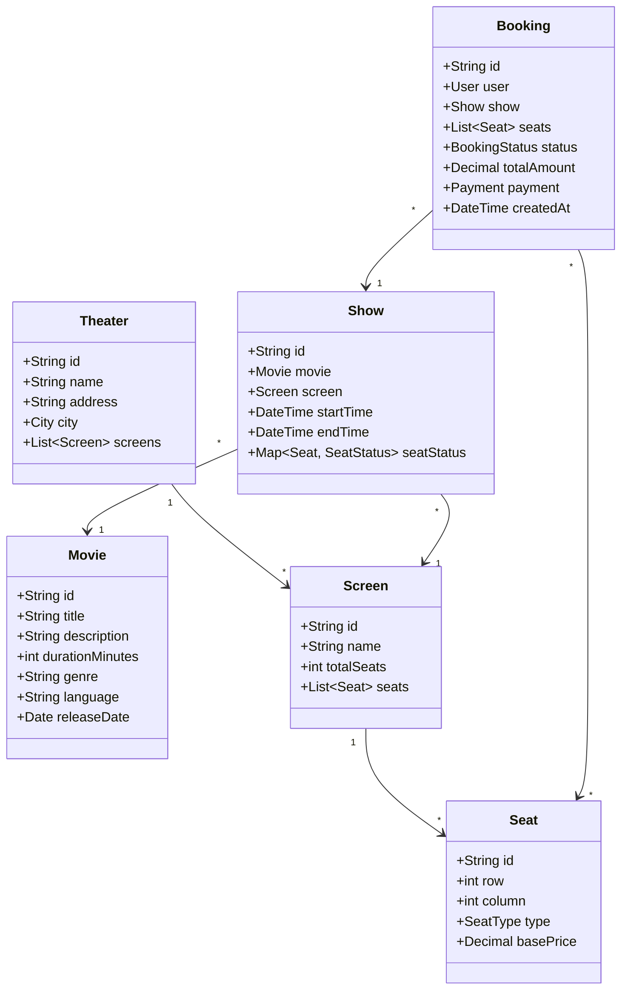
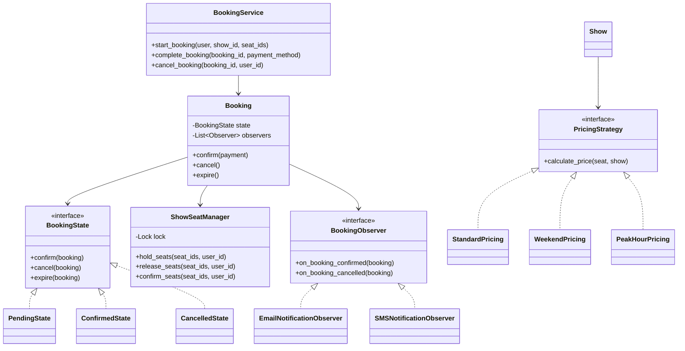

# Design Movie Ticket Booking System

<Info>
**Difficulty**: 🟡 Intermediate | **Time**: 35-45 min | **Key Patterns**: Strategy, State, Observer, Singleton
</Info>

Design the low-level architecture for an online movie ticket booking system like BookMyShow or Fandango. Focus on seat selection, concurrent booking handling, and payment processing.

---

## 1. Requirements

### Functional Requirements

| Feature | Description |
|---------|-------------|
| **Browse Movies** | List movies by theater, city, date, time |
| **View Seats** | Display seat map with availability status |
| **Select Seats** | Users can select/deselect available seats |
| **Temporary Hold** | Lock selected seats for limited time |
| **Book Tickets** | Complete booking with payment |
| **Cancel Booking** | Cancel and refund tickets |
| **View Bookings** | User can see their booking history |

### Non-Functional Requirements

- Handle **concurrent seat selection** (prevent double booking)
- **Scalable** for high-traffic movie releases
- Support multiple **pricing strategies** (weekday, weekend, premium)

---

## 2. Identify Core Entities



---

## 3. Enums and Value Objects

```python
from enum import Enum
from dataclasses import dataclass
from decimal import Decimal
from datetime import datetime
from typing import List, Dict, Optional

class SeatType(Enum):
    REGULAR = "regular"
    PREMIUM = "premium"
    VIP = "vip"
    RECLINER = "recliner"

class SeatStatus(Enum):
    AVAILABLE = "available"
    HELD = "held"        # Temporarily locked
    BOOKED = "booked"    # Confirmed booking
    BLOCKED = "blocked"  # Maintenance/reserved

class BookingStatus(Enum):
    PENDING = "pending"          # Seats held, awaiting payment
    CONFIRMED = "confirmed"      # Payment successful
    CANCELLED = "cancelled"      # User cancelled
    EXPIRED = "expired"          # Hold timeout

class PaymentStatus(Enum):
    PENDING = "pending"
    SUCCESS = "success"
    FAILED = "failed"
    REFUNDED = "refunded"

@dataclass
class City:
    id: str
    name: str
    state: str
    country: str

@dataclass
class Address:
    street: str
    city: City
    zipcode: str
    latitude: float
    longitude: float
```

---

## 4. Core Classes

### 4.1 Movie and Show

```python
@dataclass
class Movie:
    id: str
    title: str
    description: str
    duration_minutes: int
    genre: str
    language: str
    release_date: datetime
    poster_url: str
    rating: float

@dataclass
class Seat:
    id: str
    row: int
    column: int
    seat_type: SeatType
    label: str  # e.g., "A1", "B5"

class Screen:
    def __init__(self, id: str, name: str, seats: List[Seat]):
        self.id = id
        self.name = name
        self.seats = seats
        self._seat_map = {seat.id: seat for seat in seats}
    
    def get_seat(self, seat_id: str) -> Optional[Seat]:
        return self._seat_map.get(seat_id)
    
    def get_seats_by_type(self, seat_type: SeatType) -> List[Seat]:
        return [s for s in self.seats if s.seat_type == seat_type]

class Show:
    def __init__(
        self, 
        id: str, 
        movie: Movie, 
        screen: Screen, 
        start_time: datetime,
        pricing_strategy: 'PricingStrategy'
    ):
        self.id = id
        self.movie = movie
        self.screen = screen
        self.start_time = start_time
        self.end_time = start_time + timedelta(minutes=movie.duration_minutes)
        self.pricing_strategy = pricing_strategy
        
        # Initialize all seats as available
        self._seat_status: Dict[str, SeatStatus] = {
            seat.id: SeatStatus.AVAILABLE for seat in screen.seats
        }
        self._seat_holds: Dict[str, SeatHold] = {}  # seat_id -> hold info
    
    def get_seat_status(self, seat_id: str) -> SeatStatus:
        return self._seat_status.get(seat_id, SeatStatus.BLOCKED)
    
    def get_available_seats(self) -> List[Seat]:
        return [
            self.screen.get_seat(seat_id) 
            for seat_id, status in self._seat_status.items()
            if status == SeatStatus.AVAILABLE
        ]
    
    def get_seat_price(self, seat: Seat) -> Decimal:
        return self.pricing_strategy.calculate_price(seat, self)
```

### 4.2 Seat Hold (Temporary Lock)

```python
from threading import Lock
import time

@dataclass
class SeatHold:
    seat_id: str
    user_id: str
    created_at: float
    expires_at: float

class ShowSeatManager:
    """
    Manages seat status for a single show.
    Thread-safe for concurrent access.
    """
    
    HOLD_DURATION_SECONDS = 600  # 10 minutes
    
    def __init__(self, show: Show):
        self.show = show
        self._lock = Lock()
        self._seat_status: Dict[str, SeatStatus] = {
            seat.id: SeatStatus.AVAILABLE for seat in show.screen.seats
        }
        self._holds: Dict[str, SeatHold] = {}
    
    def hold_seats(self, seat_ids: List[str], user_id: str) -> bool:
        """
        Attempt to hold multiple seats atomically.
        Returns True if all seats were held, False otherwise.
        """
        with self._lock:
            # First, clean up expired holds
            self._cleanup_expired_holds()
            
            # Check if all seats are available
            for seat_id in seat_ids:
                if self._seat_status.get(seat_id) != SeatStatus.AVAILABLE:
                    return False
            
            # Hold all seats atomically
            now = time.time()
            expires_at = now + self.HOLD_DURATION_SECONDS
            
            for seat_id in seat_ids:
                self._seat_status[seat_id] = SeatStatus.HELD
                self._holds[seat_id] = SeatHold(
                    seat_id=seat_id,
                    user_id=user_id,
                    created_at=now,
                    expires_at=expires_at
                )
            
            return True
    
    def release_seats(self, seat_ids: List[str], user_id: str) -> bool:
        """Release held seats (e.g., user cancelled selection)"""
        with self._lock:
            for seat_id in seat_ids:
                hold = self._holds.get(seat_id)
                if hold and hold.user_id == user_id:
                    self._seat_status[seat_id] = SeatStatus.AVAILABLE
                    del self._holds[seat_id]
            return True
    
    def confirm_seats(self, seat_ids: List[str], user_id: str) -> bool:
        """Convert held seats to booked (after payment)"""
        with self._lock:
            # Verify user holds all seats
            for seat_id in seat_ids:
                hold = self._holds.get(seat_id)
                if not hold or hold.user_id != user_id:
                    return False
                if time.time() > hold.expires_at:
                    return False  # Hold expired
            
            # Confirm all seats
            for seat_id in seat_ids:
                self._seat_status[seat_id] = SeatStatus.BOOKED
                del self._holds[seat_id]
            
            return True
    
    def _cleanup_expired_holds(self):
        """Release seats with expired holds"""
        now = time.time()
        expired = [
            seat_id for seat_id, hold in self._holds.items()
            if now > hold.expires_at
        ]
        for seat_id in expired:
            self._seat_status[seat_id] = SeatStatus.AVAILABLE
            del self._holds[seat_id]
    
    def get_seat_map(self) -> Dict[str, SeatStatus]:
        """Return current status of all seats"""
        with self._lock:
            self._cleanup_expired_holds()
            return dict(self._seat_status)
```

---

## 5. Design Patterns Applied

### 5.1 Strategy Pattern - Pricing

```python
from abc import ABC, abstractmethod

class PricingStrategy(ABC):
    """Strategy pattern for flexible pricing"""
    
    @abstractmethod
    def calculate_price(self, seat: Seat, show: Show) -> Decimal:
        pass

class StandardPricing(PricingStrategy):
    """Base pricing by seat type"""
    
    SEAT_MULTIPLIERS = {
        SeatType.REGULAR: Decimal("1.0"),
        SeatType.PREMIUM: Decimal("1.5"),
        SeatType.VIP: Decimal("2.0"),
        SeatType.RECLINER: Decimal("2.5"),
    }
    
    def calculate_price(self, seat: Seat, show: Show) -> Decimal:
        base_price = Decimal("10.00")
        multiplier = self.SEAT_MULTIPLIERS.get(seat.seat_type, Decimal("1.0"))
        return base_price * multiplier

class WeekendPricing(PricingStrategy):
    """Higher prices on weekends"""
    
    def __init__(self, base_strategy: PricingStrategy):
        self.base_strategy = base_strategy
    
    def calculate_price(self, seat: Seat, show: Show) -> Decimal:
        base_price = self.base_strategy.calculate_price(seat, show)
        
        # Check if weekend
        if show.start_time.weekday() >= 5:  # Saturday = 5, Sunday = 6
            return base_price * Decimal("1.25")
        return base_price

class PeakHourPricing(PricingStrategy):
    """Surge pricing for prime time shows"""
    
    PEAK_HOURS = range(18, 22)  # 6 PM to 10 PM
    
    def __init__(self, base_strategy: PricingStrategy):
        self.base_strategy = base_strategy
    
    def calculate_price(self, seat: Seat, show: Show) -> Decimal:
        base_price = self.base_strategy.calculate_price(seat, show)
        
        if show.start_time.hour in self.PEAK_HOURS:
            return base_price * Decimal("1.20")
        return base_price

# Usage: Compose strategies
pricing = PeakHourPricing(WeekendPricing(StandardPricing()))
```

### 5.2 State Pattern - Booking Status

```python
class BookingState(ABC):
    """State pattern for booking lifecycle"""
    
    @abstractmethod
    def confirm(self, booking: 'Booking') -> bool:
        pass
    
    @abstractmethod
    def cancel(self, booking: 'Booking') -> bool:
        pass
    
    @abstractmethod
    def expire(self, booking: 'Booking') -> bool:
        pass

class PendingState(BookingState):
    """Seats held, awaiting payment"""
    
    def confirm(self, booking: 'Booking') -> bool:
        if booking.payment and booking.payment.status == PaymentStatus.SUCCESS:
            booking._state = ConfirmedState()
            booking.status = BookingStatus.CONFIRMED
            return True
        return False
    
    def cancel(self, booking: 'Booking') -> bool:
        booking._state = CancelledState()
        booking.status = BookingStatus.CANCELLED
        # Release held seats
        booking.show.seat_manager.release_seats(
            [s.id for s in booking.seats], 
            booking.user.id
        )
        return True
    
    def expire(self, booking: 'Booking') -> bool:
        booking._state = ExpiredState()
        booking.status = BookingStatus.EXPIRED
        # Release held seats
        booking.show.seat_manager.release_seats(
            [s.id for s in booking.seats], 
            booking.user.id
        )
        return True

class ConfirmedState(BookingState):
    """Booking confirmed with payment"""
    
    def confirm(self, booking: 'Booking') -> bool:
        return False  # Already confirmed
    
    def cancel(self, booking: 'Booking') -> bool:
        # Initiate refund
        if booking.payment:
            booking.payment.refund()
        booking._state = CancelledState()
        booking.status = BookingStatus.CANCELLED
        # Note: Seats remain booked (refund policy may vary)
        return True
    
    def expire(self, booking: 'Booking') -> bool:
        return False  # Confirmed bookings don't expire

class CancelledState(BookingState):
    def confirm(self, booking): return False
    def cancel(self, booking): return False
    def expire(self, booking): return False

class ExpiredState(BookingState):
    def confirm(self, booking): return False
    def cancel(self, booking): return False
    def expire(self, booking): return False
```

### 5.3 Observer Pattern - Notifications

```python
class BookingObserver(ABC):
    @abstractmethod
    def on_booking_confirmed(self, booking: 'Booking'):
        pass
    
    @abstractmethod
    def on_booking_cancelled(self, booking: 'Booking'):
        pass

class EmailNotificationObserver(BookingObserver):
    def __init__(self, email_service):
        self.email_service = email_service
    
    def on_booking_confirmed(self, booking: 'Booking'):
        self.email_service.send(
            to=booking.user.email,
            subject=f"Booking Confirmed - {booking.show.movie.title}",
            body=self._format_confirmation(booking)
        )
    
    def on_booking_cancelled(self, booking: 'Booking'):
        self.email_service.send(
            to=booking.user.email,
            subject=f"Booking Cancelled - {booking.show.movie.title}",
            body=self._format_cancellation(booking)
        )

class SMSNotificationObserver(BookingObserver):
    def __init__(self, sms_service):
        self.sms_service = sms_service
    
    def on_booking_confirmed(self, booking: 'Booking'):
        self.sms_service.send(
            to=booking.user.phone,
            message=f"Booking confirmed! {booking.show.movie.title} on {booking.show.start_time}"
        )
    
    def on_booking_cancelled(self, booking: 'Booking'):
        self.sms_service.send(
            to=booking.user.phone,
            message=f"Booking cancelled. Refund initiated."
        )

class AnalyticsObserver(BookingObserver):
    def __init__(self, analytics_service):
        self.analytics = analytics_service
    
    def on_booking_confirmed(self, booking: 'Booking'):
        self.analytics.track("booking_confirmed", {
            "movie_id": booking.show.movie.id,
            "theater_id": booking.show.screen.theater_id,
            "amount": booking.total_amount
        })
    
    def on_booking_cancelled(self, booking: 'Booking'):
        self.analytics.track("booking_cancelled", {
            "booking_id": booking.id
        })
```

---

## 6. Booking Class with State & Observers

```python
class Booking:
    def __init__(
        self,
        id: str,
        user: 'User',
        show: Show,
        seats: List[Seat],
    ):
        self.id = id
        self.user = user
        self.show = show
        self.seats = seats
        self.status = BookingStatus.PENDING
        self.payment: Optional['Payment'] = None
        self.total_amount = self._calculate_total()
        self.created_at = datetime.now()
        
        # State pattern
        self._state: BookingState = PendingState()
        
        # Observer pattern
        self._observers: List[BookingObserver] = []
    
    def add_observer(self, observer: BookingObserver):
        self._observers.append(observer)
    
    def _calculate_total(self) -> Decimal:
        return sum(
            self.show.get_seat_price(seat) for seat in self.seats
        )
    
    def confirm(self, payment: 'Payment') -> bool:
        self.payment = payment
        if self._state.confirm(self):
            # Confirm seats in show
            self.show.seat_manager.confirm_seats(
                [s.id for s in self.seats],
                self.user.id
            )
            # Notify observers
            for observer in self._observers:
                observer.on_booking_confirmed(self)
            return True
        return False
    
    def cancel(self) -> bool:
        if self._state.cancel(self):
            for observer in self._observers:
                observer.on_booking_cancelled(self)
            return True
        return False
    
    def expire(self) -> bool:
        return self._state.expire(self)
```

---

## 7. Booking Service

```python
class BookingService:
    """
    Orchestrates the booking flow
    """
    
    def __init__(
        self,
        show_repository,
        booking_repository,
        payment_service,
        notification_observers: List[BookingObserver]
    ):
        self.show_repo = show_repository
        self.booking_repo = booking_repository
        self.payment_service = payment_service
        self.observers = notification_observers
    
    def start_booking(
        self, 
        user: 'User', 
        show_id: str, 
        seat_ids: List[str]
    ) -> Optional[Booking]:
        """
        Step 1: Hold seats and create pending booking
        """
        show = self.show_repo.get(show_id)
        if not show:
            raise ShowNotFoundError(show_id)
        
        # Attempt to hold seats
        if not show.seat_manager.hold_seats(seat_ids, user.id):
            raise SeatsNotAvailableError(seat_ids)
        
        # Create booking
        seats = [show.screen.get_seat(sid) for sid in seat_ids]
        booking = Booking(
            id=generate_uuid(),
            user=user,
            show=show,
            seats=seats
        )
        
        # Attach observers
        for observer in self.observers:
            booking.add_observer(observer)
        
        self.booking_repo.save(booking)
        return booking
    
    def complete_booking(
        self, 
        booking_id: str, 
        payment_method: dict
    ) -> Booking:
        """
        Step 2: Process payment and confirm booking
        """
        booking = self.booking_repo.get(booking_id)
        if not booking:
            raise BookingNotFoundError(booking_id)
        
        if booking.status != BookingStatus.PENDING:
            raise InvalidBookingStateError(booking.status)
        
        # Process payment
        payment = self.payment_service.process(
            amount=booking.total_amount,
            method=payment_method,
            metadata={"booking_id": booking.id}
        )
        
        if payment.status == PaymentStatus.SUCCESS:
            booking.confirm(payment)
        else:
            booking.cancel()
            raise PaymentFailedError(payment.error_message)
        
        self.booking_repo.save(booking)
        return booking
    
    def cancel_booking(self, booking_id: str, user_id: str) -> Booking:
        """Cancel a booking and process refund if applicable"""
        booking = self.booking_repo.get(booking_id)
        
        if booking.user.id != user_id:
            raise UnauthorizedError()
        
        if not booking.cancel():
            raise CancellationNotAllowedError(booking.status)
        
        self.booking_repo.save(booking)
        return booking
```

---

## 8. Class Diagram Summary



---

## 9. Key Design Decisions

| Decision | Pattern Used | Why |
|----------|-------------|-----|
| Seat locking | Mutex + Timeout | Prevent double booking |
| Pricing flexibility | Strategy | Easy to add new pricing rules |
| Booking lifecycle | State | Clean state transitions |
| Notifications | Observer | Decouple from booking logic |
| Seat status | Fine-grained locking | Per-show concurrency |

---

## 10. Extensions

<AccordionGroup>
  <Accordion title="How to handle high concurrency for blockbuster releases?" icon="fire">
    1. **Distributed locking** with Redis instead of in-memory lock
    2. **Queue-based booking** - add to queue, process in order
    3. **Pre-allocation** - reserve blocks of seats to different servers
    4. **Virtual waiting room** - limit concurrent users
  </Accordion>
  
  <Accordion title="How to implement seat recommendations?" icon="wand-magic-sparkles">
    1. **Best available algorithm** - find contiguous seats closest to center
    2. **Social groups** - keep friends together
    3. **Accessibility** - prioritize accessible seats for users who need them
  </Accordion>
</AccordionGroup>
