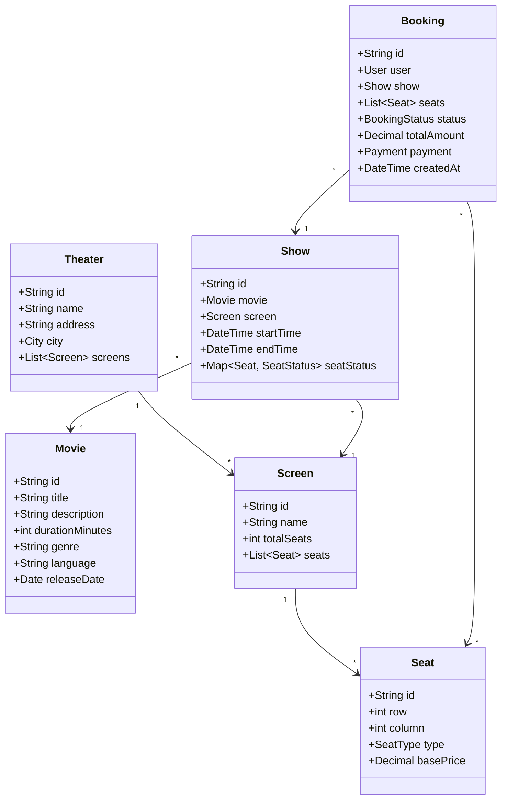
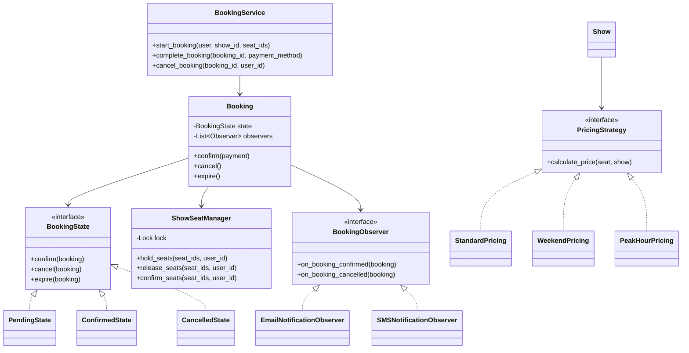

# Design Movie Ticket Booking System

<Info>
**Difficulty**: 🟡 Intermediate | **Time**: 35-45 min | **Key Patterns**: Strategy, State, Observer, Singleton
</Info>

Design the low-level architecture for an online movie ticket booking system like BookMyShow or Fandango. Focus on seat selection, concurrent booking handling, and payment processing.

---

## 1. Requirements

### Functional Requirements

| Feature | Description |
|---------|-------------|
| **Browse Movies** | List movies by theater, city, date, time |
| **View Seats** | Display seat map with availability status |
| **Select Seats** | Users can select/deselect available seats |
| **Temporary Hold** | Lock selected seats for limited time |
| **Book Tickets** | Complete booking with payment |
| **Cancel Booking** | Cancel and refund tickets |
| **View Bookings** | User can see their booking history |

### Non-Functional Requirements

- Handle **concurrent seat selection** (prevent double booking)
- **Scalable** for high-traffic movie releases
- Support multiple **pricing strategies** (weekday, weekend, premium)

---

## 2. Identify Core Entities


```mermaid
classDiagram
    class Movie {
        +String id
        +String title
        +String description
        +int durationMinutes
        +String genre
        +String language
        +Date releaseDate
    }
    
    class Theater {
        +String id
        +String name
        +String address
        +City city
        +List~Screen~ screens
    }
    
    class Screen {
        +String id
        +String name
        +int totalSeats
        +List~Seat~ seats
    }
    
    class Seat {
        +String id
        +int row
        +int column
        +SeatType type
        +Decimal basePrice
    }
    
    class Show {
        +String id
        +Movie movie
        +Screen screen
        +DateTime startTime
        +DateTime endTime
        +Map~Seat, SeatStatus~ seatStatus
    }
    
    class Booking {
        +String id
        +User user
        +Show show
        +List~Seat~ seats
        +BookingStatus status
        +Decimal totalAmount
        +Payment payment
        +DateTime createdAt
    }
    
    Theater "1" --> "*" Screen
    Screen "1" --> "*" Seat
    Show "*" --> "1" Movie
    Show "*" --> "1" Screen
    Booking "*" --> "1" Show
    Booking "*" --> "*" Seat
```

---

## 3. Enums and Value Objects

```python
from enum import Enum
from dataclasses import dataclass
from decimal import Decimal
from datetime import datetime
from typing import List, Dict, Optional

class SeatType(Enum):
    REGULAR = "regular"
    PREMIUM = "premium"
    VIP = "vip"
    RECLINER = "recliner"

class SeatStatus(Enum):
    AVAILABLE = "available"
    HELD = "held"        # Temporarily locked
    BOOKED = "booked"    # Confirmed booking
    BLOCKED = "blocked"  # Maintenance/reserved

class BookingStatus(Enum):
    PENDING = "pending"          # Seats held, awaiting payment
    CONFIRMED = "confirmed"      # Payment successful
    CANCELLED = "cancelled"      # User cancelled
    EXPIRED = "expired"          # Hold timeout

class PaymentStatus(Enum):
    PENDING = "pending"
    SUCCESS = "success"
    FAILED = "failed"
    REFUNDED = "refunded"

@dataclass
class City:
    id: str
    name: str
    state: str
    country: str

@dataclass
class Address:
    street: str
    city: City
    zipcode: str
    latitude: float
    longitude: float
```

---

## 4. Core Classes

### 4.1 Movie and Show

```python
@dataclass
class Movie:
    id: str
    title: str
    description: str
    duration_minutes: int
    genre: str
    language: str
    release_date: datetime
    poster_url: str
    rating: float

@dataclass
class Seat:
    id: str
    row: int
    column: int
    seat_type: SeatType
    label: str  # e.g., "A1", "B5"

class Screen:
    def __init__(self, id: str, name: str, seats: List[Seat]):
        self.id = id
        self.name = name
        self.seats = seats
        self._seat_map = {seat.id: seat for seat in seats}
    
    def get_seat(self, seat_id: str) -> Optional[Seat]:
        return self._seat_map.get(seat_id)
    
    def get_seats_by_type(self, seat_type: SeatType) -> List[Seat]:
        return [s for s in self.seats if s.seat_type == seat_type]

class Show:
    def __init__(
        self, 
        id: str, 
        movie: Movie, 
        screen: Screen, 
        start_time: datetime,
        pricing_strategy: 'PricingStrategy'
    ):
        self.id = id
        self.movie = movie
        self.screen = screen
        self.start_time = start_time
        self.end_time = start_time + timedelta(minutes=movie.duration_minutes)
        self.pricing_strategy = pricing_strategy
        
        # Initialize all seats as available
        self._seat_status: Dict[str, SeatStatus] = {
            seat.id: SeatStatus.AVAILABLE for seat in screen.seats
        }
        self._seat_holds: Dict[str, SeatHold] = {}  # seat_id -> hold info
    
    def get_seat_status(self, seat_id: str) -> SeatStatus:
        return self._seat_status.get(seat_id, SeatStatus.BLOCKED)
    
    def get_available_seats(self) -> List[Seat]:
        return [
            self.screen.get_seat(seat_id) 
            for seat_id, status in self._seat_status.items()
            if status == SeatStatus.AVAILABLE
        ]
    
    def get_seat_price(self, seat: Seat) -> Decimal:
        return self.pricing_strategy.calculate_price(seat, self)
```

### 4.2 Seat Hold (Temporary Lock)

```python
from threading import Lock
import time

@dataclass
class SeatHold:
    seat_id: str
    user_id: str
    created_at: float
    expires_at: float

class ShowSeatManager:
    """
    Manages seat status for a single show.
    Thread-safe for concurrent access.
    """
    
    HOLD_DURATION_SECONDS = 600  # 10 minutes
    
    def __init__(self, show: Show):
        self.show = show
        self._lock = Lock()
        self._seat_status: Dict[str, SeatStatus] = {
            seat.id: SeatStatus.AVAILABLE for seat in show.screen.seats
        }
        self._holds: Dict[str, SeatHold] = {}
    
    def hold_seats(self, seat_ids: List[str], user_id: str) -> bool:
        """
        Attempt to hold multiple seats atomically.
        Returns True if all seats were held, False otherwise.
        """
        with self._lock:
            # First, clean up expired holds
            self._cleanup_expired_holds()
            
            # Check if all seats are available
            for seat_id in seat_ids:
                if self._seat_status.get(seat_id) != SeatStatus.AVAILABLE:
                    return False
            
            # Hold all seats atomically
            now = time.time()
            expires_at = now + self.HOLD_DURATION_SECONDS
            
            for seat_id in seat_ids:
                self._seat_status[seat_id] = SeatStatus.HELD
                self._holds[seat_id] = SeatHold(
                    seat_id=seat_id,
                    user_id=user_id,
                    created_at=now,
                    expires_at=expires_at
                )
            
            return True
    
    def release_seats(self, seat_ids: List[str], user_id: str) -> bool:
        """Release held seats (e.g., user cancelled selection)"""
        with self._lock:
            for seat_id in seat_ids:
                hold = self._holds.get(seat_id)
                if hold and hold.user_id == user_id:
                    self._seat_status[seat_id] = SeatStatus.AVAILABLE
                    del self._holds[seat_id]
            return True
    
    def confirm_seats(self, seat_ids: List[str], user_id: str) -> bool:
        """Convert held seats to booked (after payment)"""
        with self._lock:
            # Verify user holds all seats
            for seat_id in seat_ids:
                hold = self._holds.get(seat_id)
                if not hold or hold.user_id != user_id:
                    return False
                if time.time() > hold.expires_at:
                    return False  # Hold expired
            
            # Confirm all seats
            for seat_id in seat_ids:
                self._seat_status[seat_id] = SeatStatus.BOOKED
                del self._holds[seat_id]
            
            return True
    
    def _cleanup_expired_holds(self):
        """Release seats with expired holds"""
        now = time.time()
        expired = [
            seat_id for seat_id, hold in self._holds.items()
            if now > hold.expires_at
        ]
        for seat_id in expired:
            self._seat_status[seat_id] = SeatStatus.AVAILABLE
            del self._holds[seat_id]
    
    def get_seat_map(self) -> Dict[str, SeatStatus]:
        """Return current status of all seats"""
        with self._lock:
            self._cleanup_expired_holds()
            return dict(self._seat_status)
```

---

## 5. Design Patterns Applied

### 5.1 Strategy Pattern - Pricing

```python
from abc import ABC, abstractmethod

class PricingStrategy(ABC):
    """Strategy pattern for flexible pricing"""
    
    @abstractmethod
    def calculate_price(self, seat: Seat, show: Show) -> Decimal:
        pass

class StandardPricing(PricingStrategy):
    """Base pricing by seat type"""
    
    SEAT_MULTIPLIERS = {
        SeatType.REGULAR: Decimal("1.0"),
        SeatType.PREMIUM: Decimal("1.5"),
        SeatType.VIP: Decimal("2.0"),
        SeatType.RECLINER: Decimal("2.5"),
    }
    
    def calculate_price(self, seat: Seat, show: Show) -> Decimal:
        base_price = Decimal("10.00")
        multiplier = self.SEAT_MULTIPLIERS.get(seat.seat_type, Decimal("1.0"))
        return base_price * multiplier

class WeekendPricing(PricingStrategy):
    """Higher prices on weekends"""
    
    def __init__(self, base_strategy: PricingStrategy):
        self.base_strategy = base_strategy
    
    def calculate_price(self, seat: Seat, show: Show) -> Decimal:
        base_price = self.base_strategy.calculate_price(seat, show)
        
        # Check if weekend
        if show.start_time.weekday() >= 5:  # Saturday = 5, Sunday = 6
            return base_price * Decimal("1.25")
        return base_price

class PeakHourPricing(PricingStrategy):
    """Surge pricing for prime time shows"""
    
    PEAK_HOURS = range(18, 22)  # 6 PM to 10 PM
    
    def __init__(self, base_strategy: PricingStrategy):
        self.base_strategy = base_strategy
    
    def calculate_price(self, seat: Seat, show: Show) -> Decimal:
        base_price = self.base_strategy.calculate_price(seat, show)
        
        if show.start_time.hour in self.PEAK_HOURS:
            return base_price * Decimal("1.20")
        return base_price

# Usage: Compose strategies
pricing = PeakHourPricing(WeekendPricing(StandardPricing()))
```

### 5.2 State Pattern - Booking Status

```python
class BookingState(ABC):
    """State pattern for booking lifecycle"""
    
    @abstractmethod
    def confirm(self, booking: 'Booking') -> bool:
        pass
    
    @abstractmethod
    def cancel(self, booking: 'Booking') -> bool:
        pass
    
    @abstractmethod
    def expire(self, booking: 'Booking') -> bool:
        pass

class PendingState(BookingState):
    """Seats held, awaiting payment"""
    
    def confirm(self, booking: 'Booking') -> bool:
        if booking.payment and booking.payment.status == PaymentStatus.SUCCESS:
            booking._state = ConfirmedState()
            booking.status = BookingStatus.CONFIRMED
            return True
        return False
    
    def cancel(self, booking: 'Booking') -> bool:
        booking._state = CancelledState()
        booking.status = BookingStatus.CANCELLED
        # Release held seats
        booking.show.seat_manager.release_seats(
            [s.id for s in booking.seats], 
            booking.user.id
        )
        return True
    
    def expire(self, booking: 'Booking') -> bool:
        booking._state = ExpiredState()
        booking.status = BookingStatus.EXPIRED
        # Release held seats
        booking.show.seat_manager.release_seats(
            [s.id for s in booking.seats], 
            booking.user.id
        )
        return True

class ConfirmedState(BookingState):
    """Booking confirmed with payment"""
    
    def confirm(self, booking: 'Booking') -> bool:
        return False  # Already confirmed
    
    def cancel(self, booking: 'Booking') -> bool:
        # Initiate refund
        if booking.payment:
            booking.payment.refund()
        booking._state = CancelledState()
        booking.status = BookingStatus.CANCELLED
        # Note: Seats remain booked (refund policy may vary)
        return True
    
    def expire(self, booking: 'Booking') -> bool:
        return False  # Confirmed bookings don't expire

class CancelledState(BookingState):
    def confirm(self, booking): return False
    def cancel(self, booking): return False
    def expire(self, booking): return False

class ExpiredState(BookingState):
    def confirm(self, booking): return False
    def cancel(self, booking): return False
    def expire(self, booking): return False
```

### 5.3 Observer Pattern - Notifications

```python
class BookingObserver(ABC):
    @abstractmethod
    def on_booking_confirmed(self, booking: 'Booking'):
        pass
    
    @abstractmethod
    def on_booking_cancelled(self, booking: 'Booking'):
        pass

class EmailNotificationObserver(BookingObserver):
    def __init__(self, email_service):
        self.email_service = email_service
    
    def on_booking_confirmed(self, booking: 'Booking'):
        self.email_service.send(
            to=booking.user.email,
            subject=f"Booking Confirmed - {booking.show.movie.title}",
            body=self._format_confirmation(booking)
        )
    
    def on_booking_cancelled(self, booking: 'Booking'):
        self.email_service.send(
            to=booking.user.email,
            subject=f"Booking Cancelled - {booking.show.movie.title}",
            body=self._format_cancellation(booking)
        )

class SMSNotificationObserver(BookingObserver):
    def __init__(self, sms_service):
        self.sms_service = sms_service
    
    def on_booking_confirmed(self, booking: 'Booking'):
        self.sms_service.send(
            to=booking.user.phone,
            message=f"Booking confirmed! {booking.show.movie.title} on {booking.show.start_time}"
        )
    
    def on_booking_cancelled(self, booking: 'Booking'):
        self.sms_service.send(
            to=booking.user.phone,
            message=f"Booking cancelled. Refund initiated."
        )

class AnalyticsObserver(BookingObserver):
    def __init__(self, analytics_service):
        self.analytics = analytics_service
    
    def on_booking_confirmed(self, booking: 'Booking'):
        self.analytics.track("booking_confirmed", {
            "movie_id": booking.show.movie.id,
            "theater_id": booking.show.screen.theater_id,
            "amount": booking.total_amount
        })
    
    def on_booking_cancelled(self, booking: 'Booking'):
        self.analytics.track("booking_cancelled", {
            "booking_id": booking.id
        })
```

---

## 6. Booking Class with State & Observers

```python
class Booking:
    def __init__(
        self,
        id: str,
        user: 'User',
        show: Show,
        seats: List[Seat],
    ):
        self.id = id
        self.user = user
        self.show = show
        self.seats = seats
        self.status = BookingStatus.PENDING
        self.payment: Optional['Payment'] = None
        self.total_amount = self._calculate_total()
        self.created_at = datetime.now()
        
        # State pattern
        self._state: BookingState = PendingState()
        
        # Observer pattern
        self._observers: List[BookingObserver] = []
    
    def add_observer(self, observer: BookingObserver):
        self._observers.append(observer)
    
    def _calculate_total(self) -> Decimal:
        return sum(
            self.show.get_seat_price(seat) for seat in self.seats
        )
    
    def confirm(self, payment: 'Payment') -> bool:
        self.payment = payment
        if self._state.confirm(self):
            # Confirm seats in show
            self.show.seat_manager.confirm_seats(
                [s.id for s in self.seats],
                self.user.id
            )
            # Notify observers
            for observer in self._observers:
                observer.on_booking_confirmed(self)
            return True
        return False
    
    def cancel(self) -> bool:
        if self._state.cancel(self):
            for observer in self._observers:
                observer.on_booking_cancelled(self)
            return True
        return False
    
    def expire(self) -> bool:
        return self._state.expire(self)
```

---

## 7. Booking Service

```python
class BookingService:
    """
    Orchestrates the booking flow
    """
    
    def __init__(
        self,
        show_repository,
        booking_repository,
        payment_service,
        notification_observers: List[BookingObserver]
    ):
        self.show_repo = show_repository
        self.booking_repo = booking_repository
        self.payment_service = payment_service
        self.observers = notification_observers
    
    def start_booking(
        self, 
        user: 'User', 
        show_id: str, 
        seat_ids: List[str]
    ) -> Optional[Booking]:
        """
        Step 1: Hold seats and create pending booking
        """
        show = self.show_repo.get(show_id)
        if not show:
            raise ShowNotFoundError(show_id)
        
        # Attempt to hold seats
        if not show.seat_manager.hold_seats(seat_ids, user.id):
            raise SeatsNotAvailableError(seat_ids)
        
        # Create booking
        seats = [show.screen.get_seat(sid) for sid in seat_ids]
        booking = Booking(
            id=generate_uuid(),
            user=user,
            show=show,
            seats=seats
        )
        
        # Attach observers
        for observer in self.observers:
            booking.add_observer(observer)
        
        self.booking_repo.save(booking)
        return booking
    
    def complete_booking(
        self, 
        booking_id: str, 
        payment_method: dict
    ) -> Booking:
        """
        Step 2: Process payment and confirm booking
        """
        booking = self.booking_repo.get(booking_id)
        if not booking:
            raise BookingNotFoundError(booking_id)
        
        if booking.status != BookingStatus.PENDING:
            raise InvalidBookingStateError(booking.status)
        
        # Process payment
        payment = self.payment_service.process(
            amount=booking.total_amount,
            method=payment_method,
            metadata={"booking_id": booking.id}
        )
        
        if payment.status == PaymentStatus.SUCCESS:
            booking.confirm(payment)
        else:
            booking.cancel()
            raise PaymentFailedError(payment.error_message)
        
        self.booking_repo.save(booking)
        return booking
    
    def cancel_booking(self, booking_id: str, user_id: str) -> Booking:
        """Cancel a booking and process refund if applicable"""
        booking = self.booking_repo.get(booking_id)
        
        if booking.user.id != user_id:
            raise UnauthorizedError()
        
        if not booking.cancel():
            raise CancellationNotAllowedError(booking.status)
        
        self.booking_repo.save(booking)
        return booking
```

---

## 8. Class Diagram Summary


```mermaid
classDiagram
    class BookingService {
        +start_booking(user, show_id, seat_ids)
        +complete_booking(booking_id, payment_method)
        +cancel_booking(booking_id, user_id)
    }
    
    class Booking {
        -BookingState state
        -List~Observer~ observers
        +confirm(payment)
        +cancel()
        +expire()
    }
    
    class BookingState {
        <<interface>>
        +confirm(booking)
        +cancel(booking)
        +expire(booking)
    }
    
    class PendingState
    class ConfirmedState
    class CancelledState
    
    class ShowSeatManager {
        -Lock lock
        +hold_seats(seat_ids, user_id)
        +release_seats(seat_ids, user_id)
        +confirm_seats(seat_ids, user_id)
    }
    
    class PricingStrategy {
        <<interface>>
        +calculate_price(seat, show)
    }
    
    class StandardPricing
    class WeekendPricing
    class PeakHourPricing
    
    class BookingObserver {
        <<interface>>
        +on_booking_confirmed(booking)
        +on_booking_cancelled(booking)
    }
    
    BookingService --> Booking
    Booking --> BookingState
    BookingState <|.. PendingState
    BookingState <|.. ConfirmedState
    BookingState <|.. CancelledState
    
    Booking --> ShowSeatManager
    Show --> PricingStrategy
    PricingStrategy <|.. StandardPricing
    PricingStrategy <|.. WeekendPricing
    PricingStrategy <|.. PeakHourPricing
    
    Booking --> BookingObserver
    BookingObserver <|.. EmailNotificationObserver
    BookingObserver <|.. SMSNotificationObserver
```

---

## 9. Key Design Decisions

| Decision | Pattern Used | Why |
|----------|-------------|-----|
| Seat locking | Mutex + Timeout | Prevent double booking |
| Pricing flexibility | Strategy | Easy to add new pricing rules |
| Booking lifecycle | State | Clean state transitions |
| Notifications | Observer | Decouple from booking logic |
| Seat status | Fine-grained locking | Per-show concurrency |

---

## 10. Extensions

<AccordionGroup>
  <Accordion title="How to handle high concurrency for blockbuster releases?" icon="fire">
    1. **Distributed locking** with Redis instead of in-memory lock
    2. **Queue-based booking** - add to queue, process in order
    3. **Pre-allocation** - reserve blocks of seats to different servers
    4. **Virtual waiting room** - limit concurrent users
  </Accordion>
  
  <Accordion title="How to implement seat recommendations?" icon="wand-magic-sparkles">
    1. **Best available algorithm** - find contiguous seats closest to center
    2. **Social groups** - keep friends together
    3. **Accessibility** - prioritize accessible seats for users who need them
  </Accordion>
</AccordionGroup>

---

## Interview Deep-Dive Questions

<AccordionGroup>
  <Accordion title="Q1: Two users select the same seat at the same instant. Walk me through exactly what happens in the ShowSeatManager, and where the concurrency guarantee comes from.">
    **Strong answer:**
    - The `ShowSeatManager.hold_seats()` method acquires `self._lock` (a `threading.Lock`) at the very top of the method. Threading.Lock is a mutex -- only one thread can hold it at a time. So even if two requests arrive at the same nanosecond, one thread acquires the lock first and the other blocks.
    - Thread A acquires the lock, checks that seat "A5" is AVAILABLE, marks it as HELD, creates a `SeatHold` with Thread A's user_id, and releases the lock. Thread B then acquires the lock, checks seat "A5", finds it is now HELD (not AVAILABLE), and the method returns False. Thread B's user sees "Seats not available."
    - The critical design decision is that the check-and-set is atomic because both happen inside the same lock acquisition. If you checked availability outside the lock and then set inside the lock (a common mistake), you would have a TOCTOU (time-of-check-to-time-of-use) race condition.
    - The method also holds seats atomically as a batch: if a user selects seats A5, A6, A7 and A6 is already taken, none of the three are held. This is important for user experience -- you do not want to partially hold seats, leaving the user with A5 and A7 but not the middle seat. The check loop runs first for all seats, and only if all pass does the hold loop execute.
    - At scale (think: Avengers opening night with 100K concurrent users), an in-process mutex is insufficient because you have multiple server instances. You would replace the `threading.Lock` with a distributed lock (Redis `SETNX` with TTL, or a Redlock implementation). The logic stays the same but the lock coordination happens across processes.

    **Red flag answer:** "We just check if the seat is available before booking it." This misses the atomicity requirement entirely -- checking and setting must be a single indivisible operation. Without mentioning locking, mutex, or atomic compare-and-swap, the candidate does not understand concurrency.

    **Follow-ups:**
    1. The in-memory Lock works for a single process. If BookMyShow runs on 50 server instances behind a load balancer, how do you prevent two instances from holding the same seat?
    2. The current design locks the entire `ShowSeatManager` for one show. If a blockbuster has 10 shows running across 5 screens, what is the lock contention profile, and could you use more granular locking?
  </Accordion>

  <Accordion title="Q2: The seat hold expires after 10 minutes (HOLD_DURATION_SECONDS = 600). How is expiration actually enforced, and what are the edge cases?">
    **Strong answer:**
    - Expiration is enforced lazily, not proactively. The `_cleanup_expired_holds()` method is called at the start of `hold_seats()` and `get_seat_map()`. This means expired holds are only cleaned up when someone else tries to interact with the seat manager. If no one calls these methods, expired holds sit there indefinitely.
    - Edge case 1: A user holds seats at 10:00 AM, the hold expires at 10:10 AM, but no other user looks at this show until 10:30 AM. For 20 minutes, the seats appear as HELD on the backend even though the hold is logically expired. This is not functionally wrong (the next `hold_seats` call will clean it up), but it means the seat map shown to users could display stale "held" seats, reducing perceived availability.
    - Edge case 2: A user holds seats, starts payment at 10:09 AM, and the payment gateway takes 90 seconds to respond. By the time `confirm_seats()` is called at 10:10:30, the hold has expired. The `confirm_seats` method correctly checks `time.time() > hold.expires_at` and returns False. But now the user has been charged, and the seats were released. You need to handle this by refunding the payment -- the `BookingService` does not currently handle the case where `confirm_seats` returns False after a successful payment.
    - A production system would use an active expiration mechanism: a background thread or scheduled task that runs every 30-60 seconds, scans for expired holds, and releases them. This keeps the seat map accurate in real-time. Alternatively, with Redis, you can use key TTL so expiration is handled by the data store itself without any application-level cleanup.
    - Edge case 3: Clock skew. If `time.time()` is used and the server's clock jumps forward (NTP correction), holds could expire prematurely. Using monotonic clocks (`time.monotonic()`) prevents this.

    **Red flag answer:** "The hold has a 10-minute timeout, so it automatically releases after 10 minutes." The word "automatically" hides the fact that nothing proactively enforces the expiration -- it is purely lazy cleanup. This distinction is critical for system correctness.

    **Follow-ups:**
    1. The payment succeeds but `confirm_seats()` returns False because the hold expired 2 seconds ago. The user is charged but has no tickets. How does your system detect and resolve this?
    2. How would you implement active hold expiration using Redis TTL, and what happens if Redis itself is temporarily unreachable?
  </Accordion>

  <Accordion title="Q3: Walk me through the complete booking flow from seat selection to ticket confirmation, identifying every point where the process can fail.">
    **Strong answer:**
    - Step 1: User calls `BookingService.start_booking()`. This calls `show.seat_manager.hold_seats()`. Failure point: seats already held or booked by another user. Response: raise `SeatsNotAvailableError`.
    - Step 2: A `Booking` object is created in PENDING status and saved to the repository. Failure point: database write failure. Response: release the just-held seats and return an error. The current code does not handle this -- if `booking_repo.save()` fails, the seats remain held with no associated booking, creating orphaned holds that only expire by timeout.
    - Step 3: User calls `BookingService.complete_booking()` with payment details. Failure point: booking not found or not in PENDING status. Response: raise appropriate error.
    - Step 4: `payment_service.process()` is called. Failure point: payment gateway timeout, card declined, insufficient funds, fraud detection block. Response: on failure, `booking.cancel()` is called, which releases seats. But what about a timeout? If the payment service hangs for 60 seconds and then succeeds, but the client has already timed out and the user retried with a new booking, you could end up with a double charge.
    - Step 5: On payment success, `booking.confirm(payment)` is called, which calls `show.seat_manager.confirm_seats()`. Failure point: the hold expired between payment initiation and confirmation (the 10-minute window elapsed during payment processing). Response: the current code would get a False from `confirm_seats`, but `booking.confirm()` does not check this return value -- it proceeds to notify observers. This is a bug: the booking is marked CONFIRMED but the seats are not actually confirmed.
    - Step 6: Observers are notified (email, SMS). Failure point: notification service down. Response: this should be asynchronous and non-blocking -- a failed email should never cause a booking failure. The current synchronous observer notification could throw and leave the booking in a half-confirmed state.
    - The missing piece is idempotency. If `complete_booking` is called twice for the same booking (user double-clicked, network retry), the second call should be a no-op, not a double charge. The current code checks `booking.status != BookingStatus.PENDING` which provides this guard.

    **Red flag answer:** "The user selects seats, pays, and gets a ticket." Listing the happy path without identifying failure points shows no production mindset. Interviewers are specifically testing whether you think about what goes wrong, not what goes right.

    **Follow-ups:**
    1. How would you implement an idempotency key to prevent the payment gateway from charging the user twice on a network retry?
    2. The `booking.confirm()` method calls `seat_manager.confirm_seats()` and then notifies observers synchronously. If the email service throws an exception, what is the booking status? How would you fix this?
  </Accordion>

  <Accordion title="Q4: The pricing uses a Decorator-style Strategy composition: PeakHourPricing(WeekendPricing(StandardPricing())). What are the benefits and dangers of this approach?">
    **Strong answer:**
    - The composition is using the Decorator pattern layered on top of Strategy. Each pricing strategy wraps another, adding its multiplier on top. This means you can mix and match pricing rules freely: weekend + peak hour = 1.25 x 1.20 = 1.50x base price. Adding a new rule (e.g., holiday pricing, new-release surcharge) is just wrapping another layer -- no existing code changes.
    - Benefit 1: Open/Closed Principle at its best. You literally never touch existing pricing classes to add new rules.
    - Benefit 2: Order-independence within multiplication. Since all strategies are multipliers, `PeakHour(Weekend(Standard))` and `Weekend(PeakHour(Standard))` produce the same result. This is a happy accident of the current implementation, not a guarantee of the pattern.
    - Danger 1: Order does matter if strategies are not purely multiplicative. If one strategy adds a flat fee (+$2 convenience charge) and another applies a percentage (x1.25), the order matters: `(base + 2) * 1.25` is not the same as `(base * 1.25) + 2`. The current code does not document or enforce ordering, which is a time bomb for the next developer.
    - Danger 2: Debugging opacity. If a customer complains that their ticket was $37.50 instead of the expected $25, tracing through 3-4 nested strategy layers to figure out which multipliers were applied is painful. You need logging at each layer, or a `PricingBreakdown` object that each strategy appends to, showing the audit trail.
    - Danger 3: Multiplicative compounding can produce absurd prices. Weekend (1.25x) + peak hour (1.20x) + new release (1.30x) + holiday (1.25x) = 2.44x base price. A $10 regular seat becomes $24.40. There should be a price cap or a sanity check in the outermost layer.

    **Red flag answer:** "Strategy pattern lets you swap algorithms at runtime." This is the textbook definition but misses the specific Decorator composition being used here and all of the real-world pitfalls. It is a "read the GoF book" answer, not an "I have built this" answer.

    **Follow-ups:**
    1. How would you add a `PricingBreakdown` that returns not just the final price but a human-readable explanation like "Base: $10 + Weekend: +$2.50 + Peak: +$3.00 = $15.50"?
    2. A product manager says "Tuesday is discount day -- all tickets are flat $5, regardless of seat type or time." How does this interact with the decorator chain, and where does it short-circuit?
  </Accordion>

  <Accordion title="Q5: The ShowSeatManager uses an in-memory dictionary for seat status. How would you redesign this for a system handling 50,000 concurrent users for a blockbuster release?">
    **Strong answer:**
    - An in-memory dictionary on a single server instance cannot handle 50K concurrent users. The fundamental bottleneck is that `threading.Lock` serializes all seat operations on a single core. Even if each operation takes 1ms, you can only process 1,000 operations per second.
    - Step 1: Move seat state to Redis. Each seat's status becomes a Redis key (e.g., `show:123:seat:A5` -> `"available"` or `"held:user456:expires:1680000000"`). Redis is single-threaded but processes 100K+ operations per second. Use `SETNX` (set-if-not-exists) for the hold operation -- this is an atomic compare-and-swap that replaces the in-memory lock.
    - Step 2: Use Redis key TTL for hold expiration instead of lazy cleanup. Set `EXPIRE show:123:seat:A5 600` when holding. Redis automatically deletes the key after 600 seconds, and the seat implicitly becomes available (absence of key = available).
    - Step 3: For the seat map display (showing all 200+ seats to the user), do not query Redis one key at a time. Use Redis hash maps: `HGETALL show:123:seats` returns the entire seat map in one round trip. Update individual seats with `HSET`.
    - Step 4: For the initial stampede (tickets go on sale at 10:00 AM sharp), even Redis can become a bottleneck. Pre-shard the seats: seats A1-A20 are managed by Redis shard 1, B1-B20 by shard 2, etc. Users selecting seats in different rows hit different shards, distributing load.
    - Step 5: Virtual waiting room. Before users even reach the seat selection page, place them in a queue (e.g., using Cloudflare Waiting Room or a custom implementation). Only admit N users per second to the seat selection flow, preventing the thundering herd from overwhelming the backend.

    **Red flag answer:** "Just add more servers." Horizontal scaling without explaining how shared seat state is coordinated across servers is hand-waving. You cannot just add servers when they all fight over the same seat lock.

    **Follow-ups:**
    1. Two Redis commands -- `SETNX` to hold and `EXPIRE` to set TTL -- are not atomic together. What happens if the process crashes between them? How does Redis `SET key value NX EX 600` solve this?
    2. With seat state in Redis and 50K users refreshing the seat map every 2 seconds, you are looking at 25K reads/second on the seat map. How would you reduce this load?
  </Accordion>

  <Accordion title="Q6: The booking can be in states: PENDING, CONFIRMED, CANCELLED, EXPIRED. What happens if a user tries to cancel a CONFIRMED booking 5 minutes before the show starts?">
    **Strong answer:**
    - The current `ConfirmedState.cancel()` unconditionally allows cancellation and initiates a refund. It does not check how close the show is. In reality, cancellation policies are time-dependent: full refund if cancelled 24+ hours before the show, 50% refund for 2-24 hours, no refund within 2 hours. This is a business rule that the State pattern alone does not capture.
    - You would introduce a `CancellationPolicy` (Strategy pattern) that the `ConfirmedState.cancel()` method consults before proceeding. The policy takes the booking and current time and returns a `CancellationResult` with `allowed: bool`, `refund_percentage: Decimal`, and `reason: str`. The state delegates the decision to the policy rather than hardcoding it.
    - The current code has another issue: `ConfirmedState.cancel()` includes the comment "Note: Seats remain booked (refund policy may vary)" -- meaning cancelled-but-confirmed seats are not released back to the pool. This is correct for some scenarios (e.g., the show is about to start and reselling is impossible) but wrong for early cancellations where the seats could be resold. The cancellation policy should also determine whether seats are released.
    - In production systems like BookMyShow, cancellation within a few hours of the show is typically blocked entirely because the theater has already committed resources (staff, food prep, etc.). Some platforms offer a "ticket transfer" option as an alternative to cancellation -- the user cannot get their money back, but they can transfer the booking to another user. This requires a new `TransferState` or a `transfer()` method on `ConfirmedState`.

    **Red flag answer:** "The cancel method initiates a refund." This ignores time-based policies, partial refunds, and seat release logic. It suggests the candidate has never dealt with real-world cancellation flows.

    **Follow-ups:**
    1. How would you model a tiered cancellation policy (full refund > 24h, 50% refund > 2h, no refund < 2h) using the Strategy pattern, and where does it integrate into the State pattern?
    2. If a cancelled booking's seats are released and immediately booked by another user, but the original user's refund fails, what is the correct system behavior?
  </Accordion>

  <Accordion title="Q7: How would you schedule shows to prevent overlaps on the same screen, accounting for cleaning time between shows?">
    **Strong answer:**
    - The current `Show` class has `start_time` and `end_time` (calculated as `start_time + movie.duration_minutes`). But it does not account for trailers (typically 15-20 minutes before the movie), interval breaks (common in Indian cinema for 3-hour films), or cleaning/turnover time (10-15 minutes after the show for the crew to clean).
    - You would model the full time block as: `block_start = start_time - trailer_duration` and `block_end = end_time + interval_duration + cleaning_duration`. The overlap check becomes: for the same screen, no two shows can have overlapping blocks. This is an interval scheduling validation: `show_a.block_end <= show_b.block_start OR show_b.block_end <= show_a.block_start`.
    - The scheduling service would have an `add_show()` method that first queries all existing shows for that screen on that date, checks for block overlaps, and rejects if there is a conflict. To make this efficient, store shows sorted by start_time per screen and use binary search to find potential conflicts.
    - A subtler issue: what if an admin needs to change a movie's runtime (director's cut, censored version)? This retroactively changes `end_time` for all future shows of that movie and could create overlaps with shows that were scheduled after. The system needs a cascade validation: when a movie's duration changes, re-validate all future shows and flag conflicts.
    - At scale, scheduling optimization becomes interesting. Given a set of movies with different durations and demand levels, and a set of screens, how do you maximize revenue? This is a variant of the job scheduling problem. Theaters use specialized software for this, but the core algorithm is: assign high-demand movies to peak time slots on larger screens, and fill gaps with shorter or lower-demand movies.

    **Red flag answer:** "Just check if start times overlap." This misses trailer time, cleaning time, interval breaks, and the concept of a full time block. It also does not address how to efficiently validate against all existing shows for a screen.

    **Follow-ups:**
    1. An admin accidentally schedules two shows with a 5-minute overlap. Instead of rejecting, the system should show a warning and allow override. How would you implement soft vs. hard scheduling constraints?
    2. How would you build an "auto-schedule" feature that, given a list of movies and their expected demand, fills a screen's daily schedule optimally?
  </Accordion>

  <Accordion title="Q8: The Observer pattern is used for notifications (email, SMS, analytics). What happens if the email service is down during booking confirmation?">
    **Strong answer:**
    - In the current implementation, observers are notified synchronously inside `booking.confirm()`. The loop `for observer in self._observers: observer.on_booking_confirmed(self)` runs inline. If `EmailNotificationObserver.on_booking_confirmed()` throws an exception (email service timeout, connection refused), the exception propagates up and potentially leaves the booking in an inconsistent state -- the seats are confirmed in the seat manager, but the booking might not be saved to the repository depending on exception handling.
    - The fix is to make observer notifications asynchronous and non-blocking. The booking confirmation should complete (state change + seat confirmation + repository save) before any notifications fire. Notifications should be dispatched to a message queue (e.g., RabbitMQ, SQS, or even an in-process background thread pool) and processed independently.
    - Each notification should be retried with exponential backoff. If the email service is down for 5 minutes, the email should be queued and sent when the service recovers. The user should not lose their booking because the notification system is degraded.
    - An important architectural principle here: separate the critical path (booking, payment, seat confirmation) from the non-critical path (notifications, analytics). The critical path must be synchronous, consistent, and never fail due to non-critical dependencies. The non-critical path can be eventual, retried, and gracefully degraded.
    - The analytics observer introduces another concern: if analytics tracking fails, you lose data but the user is not affected. However, if analytics is synchronous and slow (e.g., 500ms round trip to the analytics service), it adds latency to every booking confirmation. This is a hidden performance tax that only shows up under load testing.

    **Red flag answer:** "We wrap the observer calls in try/except so errors are swallowed." This prevents crashes but silently loses notifications -- the user never gets their confirmation email and has no idea their booking succeeded. It is a fix that creates a worse problem than it solves.

    **Follow-ups:**
    1. You move notifications to a message queue. The booking is confirmed, but the email message is lost due to a queue failure. The user never receives confirmation. How do you design a self-healing mechanism to detect and re-send missed notifications?
    2. The `AnalyticsObserver` adds 200ms of latency to every booking. How would you prove this is the culprit and what architectural change eliminates it?
  </Accordion>
</AccordionGroup>
