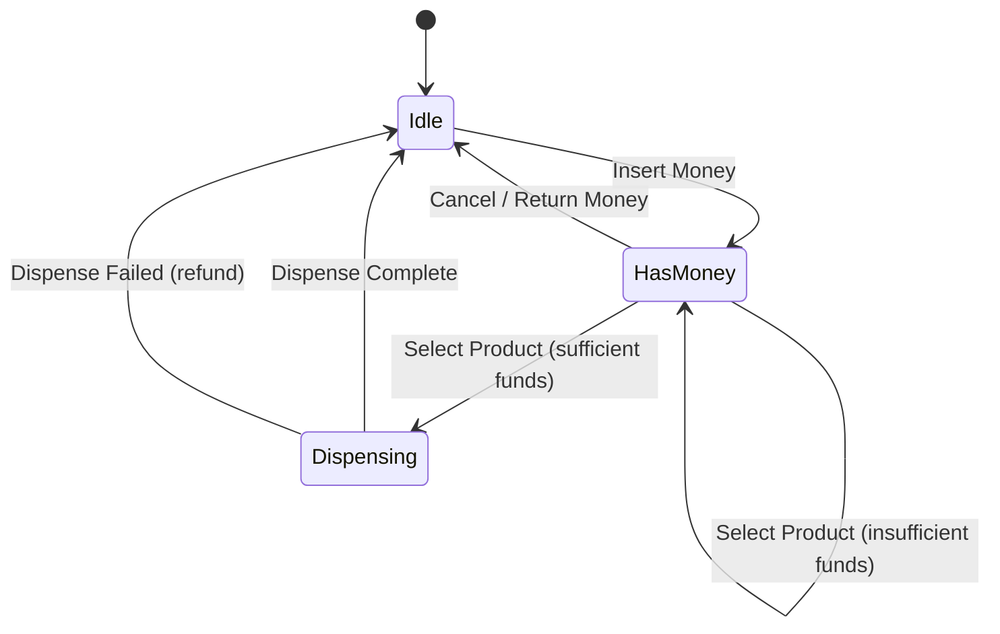
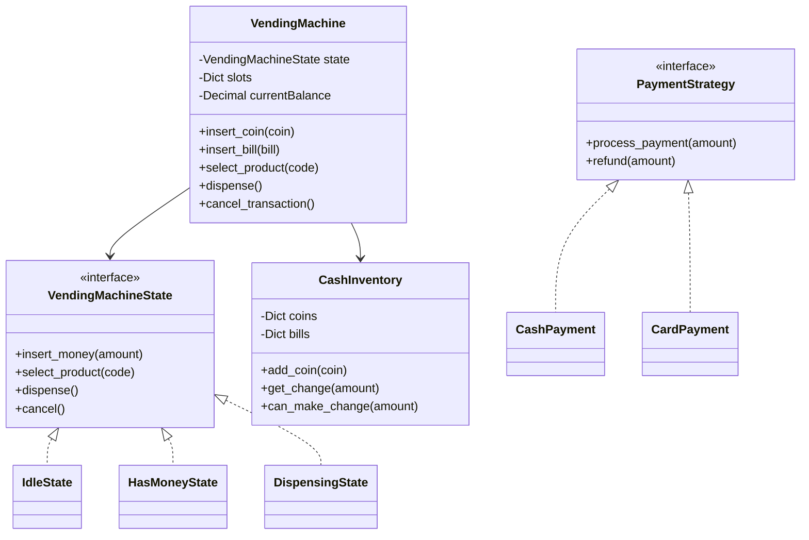

<Frame>
  
</Frame>

# Design Vending Machine

<Info>
**Difficulty**: 🟢 Beginner | **Time**: 25-35 min | **Key Patterns**: State, Strategy, Singleton
</Info>

Design a vending machine that dispenses products, handles payments, and manages inventory. This is a classic State pattern example.

---

## 1. Requirements

### Functional Requirements

| Feature | Description |
|---------|-------------|
| **Display Products** | Show available products with prices |
| **Accept Money** | Accept coins and bills |
| **Select Product** | User selects product by code |
| **Dispense Product** | Deliver product if sufficient payment |
| **Return Change** | Return excess money |
| **Cancel Transaction** | Return all inserted money |
| **Admin Operations** | Refill products, collect money |

### Constraints

- Support multiple payment methods (coins, bills, card)
- Handle exact change scenarios
- Track inventory per product slot
- Thread-safe operations

---

## 2. State Machine

The vending machine is a perfect example of the **State Pattern**. The machine's behavior changes based on its current state.



---

## 3. Core Entities

```python
from enum import Enum
from dataclasses import dataclass
from decimal import Decimal
from typing import List, Dict, Optional
from abc import ABC, abstractmethod
from threading import Lock

class Coin(Enum):
    PENNY = Decimal("0.01")
    NICKEL = Decimal("0.05")
    DIME = Decimal("0.10")
    QUARTER = Decimal("0.25")
    DOLLAR = Decimal("1.00")

class Bill(Enum):
    ONE = Decimal("1.00")
    FIVE = Decimal("5.00")
    TEN = Decimal("10.00")
    TWENTY = Decimal("20.00")

@dataclass
class Product:
    code: str           # e.g., "A1", "B2"
    name: str           # e.g., "Coca-Cola"
    price: Decimal      # e.g., 1.50
    category: str       # e.g., "beverage", "snack"

@dataclass
class Slot:
    code: str
    product: Optional[Product]
    quantity: int
    max_capacity: int = 10
    
    def is_empty(self) -> bool:
        return self.quantity == 0
    
    def dispense(self) -> Optional[Product]:
        if self.is_empty():
            return None
        self.quantity -= 1
        return self.product
    
    def refill(self, quantity: int):
        self.quantity = min(self.quantity + quantity, self.max_capacity)
```

---

## 4. State Pattern Implementation

### 4.1 State Interface

```python
class VendingMachineState(ABC):
    """
    Abstract state class for vending machine.
    Each state implements allowed operations differently.
    """
    
    def __init__(self, machine: 'VendingMachine'):
        self.machine = machine
    
    @abstractmethod
    def insert_money(self, amount: Decimal) -> str:
        """Handle money insertion"""
        pass
    
    @abstractmethod
    def select_product(self, code: str) -> str:
        """Handle product selection"""
        pass
    
    @abstractmethod
    def dispense(self) -> Optional[Product]:
        """Handle product dispensing"""
        pass
    
    @abstractmethod
    def cancel(self) -> Decimal:
        """Handle transaction cancellation"""
        pass
```

### 4.2 Idle State

```python
class IdleState(VendingMachineState):
    """
    Initial state - waiting for customer interaction.
    Only accepts money insertion.
    """
    
    def insert_money(self, amount: Decimal) -> str:
        self.machine.current_balance += amount
        self.machine.set_state(HasMoneyState(self.machine))
        return f"Inserted ${amount}. Balance: ${self.machine.current_balance}"
    
    def select_product(self, code: str) -> str:
        return "Please insert money first"
    
    def dispense(self) -> Optional[Product]:
        return None
    
    def cancel(self) -> Decimal:
        return Decimal("0")  # Nothing to cancel
```

### 4.3 Has Money State

```python
class HasMoneyState(VendingMachineState):
    """
    Customer has inserted money.
    Can insert more, select product, or cancel.
    """
    
    def insert_money(self, amount: Decimal) -> str:
        self.machine.current_balance += amount
        return f"Inserted ${amount}. Balance: ${self.machine.current_balance}"
    
    def select_product(self, code: str) -> str:
        slot = self.machine.get_slot(code)
        
        if not slot:
            return f"Invalid product code: {code}"
        
        if slot.is_empty():
            return f"Product {slot.product.name} is out of stock"
        
        if self.machine.current_balance < slot.product.price:
            needed = slot.product.price - self.machine.current_balance
            return f"Insufficient funds. Need ${needed} more"
        
        # Sufficient funds - prepare to dispense
        self.machine.selected_product = slot.product
        self.machine.selected_slot = slot
        self.machine.set_state(DispensingState(self.machine))
        return f"Dispensing {slot.product.name}..."
    
    def dispense(self) -> Optional[Product]:
        return None  # Must select product first
    
    def cancel(self) -> Decimal:
        refund = self.machine.current_balance
        self.machine.current_balance = Decimal("0")
        self.machine.set_state(IdleState(self.machine))
        return refund
```

### 4.4 Dispensing State

```python
class DispensingState(VendingMachineState):
    """
    Product selected, dispensing in progress.
    No other operations allowed during dispensing.
    """
    
    def insert_money(self, amount: Decimal) -> str:
        return "Please wait, dispensing in progress"
    
    def select_product(self, code: str) -> str:
        return "Please wait, dispensing in progress"
    
    def dispense(self) -> Optional[Product]:
        product = self.machine.selected_slot.dispense()
        
        if product:
            # Deduct price and calculate change
            self.machine.current_balance -= product.price
            change = self.machine.current_balance
            
            # Reset state
            self.machine.current_balance = Decimal("0")
            self.machine.selected_product = None
            self.machine.selected_slot = None
            self.machine.set_state(IdleState(self.machine))
            
            if change > 0:
                self.machine.dispense_change(change)
            
            return product
        else:
            # Dispense failed - refund
            refund = self.machine.current_balance
            self.machine.current_balance = Decimal("0")
            self.machine.set_state(IdleState(self.machine))
            self.machine.dispense_change(refund)
            return None
    
    def cancel(self) -> Decimal:
        return Decimal("0")  # Cannot cancel during dispensing
```

---

## 5. Vending Machine Class

```python
class VendingMachine:
    """
    Main vending machine class using State pattern.
    Thread-safe for concurrent operations.
    """
    
    def __init__(self, machine_id: str):
        self.machine_id = machine_id
        self.slots: Dict[str, Slot] = {}
        self.current_balance = Decimal("0")
        self.selected_product: Optional[Product] = None
        self.selected_slot: Optional[Slot] = None
        self.cash_inventory = CashInventory()
        
        self._state: VendingMachineState = IdleState(self)
        self._lock = Lock()
    
    def set_state(self, state: VendingMachineState):
        self._state = state
    
    def get_slot(self, code: str) -> Optional[Slot]:
        return self.slots.get(code)
    
    # Public API - Thread-safe operations
    
    def insert_coin(self, coin: Coin) -> str:
        with self._lock:
            self.cash_inventory.add_coin(coin)
            return self._state.insert_money(coin.value)
    
    def insert_bill(self, bill: Bill) -> str:
        with self._lock:
            self.cash_inventory.add_bill(bill)
            return self._state.insert_money(bill.value)
    
    def select_product(self, code: str) -> str:
        with self._lock:
            return self._state.select_product(code)
    
    def dispense(self) -> Optional[Product]:
        with self._lock:
            return self._state.dispense()
    
    def cancel_transaction(self) -> Decimal:
        with self._lock:
            return self._state.cancel()
    
    def dispense_change(self, amount: Decimal) -> List[Coin]:
        """Calculate and dispense change using available coins"""
        return self.cash_inventory.get_change(amount)
    
    def get_available_products(self) -> List[Dict]:
        """Return list of available products with stock status"""
        return [
            {
                "code": slot.code,
                "name": slot.product.name if slot.product else "Empty",
                "price": slot.product.price if slot.product else 0,
                "available": not slot.is_empty()
            }
            for slot in self.slots.values()
        ]
    
    # Admin operations
    
    def add_slot(self, code: str, product: Product, quantity: int):
        """Admin: Add or update a product slot"""
        self.slots[code] = Slot(
            code=code,
            product=product,
            quantity=quantity
        )
    
    def refill_slot(self, code: str, quantity: int):
        """Admin: Refill a slot"""
        if slot := self.slots.get(code):
            slot.refill(quantity)
    
    def collect_cash(self) -> Decimal:
        """Admin: Collect all cash from machine"""
        return self.cash_inventory.collect_all()
```

---

## 6. Cash Inventory & Change Calculation

```python
class CashInventory:
    """
    Manages coins and bills in the machine.
    Uses Greedy algorithm for optimal change.
    """
    
    def __init__(self):
        self.coins: Dict[Coin, int] = {coin: 0 for coin in Coin}
        self.bills: Dict[Bill, int] = {bill: 0 for bill in Bill}
    
    def add_coin(self, coin: Coin, count: int = 1):
        self.coins[coin] += count
    
    def add_bill(self, bill: Bill, count: int = 1):
        self.bills[bill] += count
    
    def get_total(self) -> Decimal:
        """Total value of all cash"""
        total = sum(coin.value * count for coin, count in self.coins.items())
        total += sum(bill.value * count for bill, count in self.bills.items())
        return total
    
    def get_change(self, amount: Decimal) -> List[Coin]:
        """
        Calculate change using greedy algorithm.
        Returns coins to dispense, or empty list if exact change not possible.
        """
        change_coins = []
        remaining = amount
        
        # Try from largest to smallest coin
        for coin in sorted(Coin, key=lambda c: c.value, reverse=True):
            while remaining >= coin.value and self.coins[coin] > 0:
                remaining -= coin.value
                self.coins[coin] -= 1
                change_coins.append(coin)
        
        # Check if we could make exact change
        if remaining > Decimal("0.001"):  # Allow small floating point error
            # Cannot make exact change - restore coins
            for coin in change_coins:
                self.coins[coin] += 1
            return []  # Caller should handle "exact change only" scenario
        
        return change_coins
    
    def can_make_change(self, amount: Decimal) -> bool:
        """Check if exact change is possible without modifying inventory"""
        remaining = amount
        temp_counts = dict(self.coins)
        
        for coin in sorted(Coin, key=lambda c: c.value, reverse=True):
            while remaining >= coin.value and temp_counts[coin] > 0:
                remaining -= coin.value
                temp_counts[coin] -= 1
        
        return remaining < Decimal("0.001")
    
    def collect_all(self) -> Decimal:
        """Remove all cash and return total"""
        total = self.get_total()
        self.coins = {coin: 0 for coin in Coin}
        self.bills = {bill: 0 for bill in Bill}
        return total
```

---

## 7. Strategy Pattern for Payment

```python
class PaymentStrategy(ABC):
    """Strategy pattern for different payment methods"""
    
    @abstractmethod
    def process_payment(self, amount: Decimal) -> bool:
        pass
    
    @abstractmethod
    def refund(self, amount: Decimal) -> bool:
        pass

class CashPayment(PaymentStrategy):
    def __init__(self, machine: VendingMachine):
        self.machine = machine
    
    def process_payment(self, amount: Decimal) -> bool:
        # Cash is already inserted via insert_coin/insert_bill
        return self.machine.current_balance >= amount
    
    def refund(self, amount: Decimal) -> bool:
        coins = self.machine.dispense_change(amount)
        return len(coins) > 0 or amount == 0

class CardPayment(PaymentStrategy):
    def __init__(self, payment_gateway):
        self.payment_gateway = payment_gateway
    
    def process_payment(self, amount: Decimal) -> bool:
        # Simulate card payment
        try:
            result = self.payment_gateway.charge(amount)
            return result.success
        except Exception:
            return False
    
    def refund(self, amount: Decimal) -> bool:
        try:
            result = self.payment_gateway.refund(amount)
            return result.success
        except Exception:
            return False

class MobilePayment(PaymentStrategy):
    """Apple Pay, Google Pay, etc."""
    
    def __init__(self, mobile_gateway):
        self.gateway = mobile_gateway
    
    def process_payment(self, amount: Decimal) -> bool:
        return self.gateway.process_nfc_payment(amount)
    
    def refund(self, amount: Decimal) -> bool:
        return self.gateway.refund(amount)
```

---

## 8. Complete Usage Example

```python
# Create vending machine
machine = VendingMachine("VM-001")

# Stock the machine (admin operation)
machine.add_slot("A1", Product("A1", "Coca-Cola", Decimal("1.50"), "beverage"), 10)
machine.add_slot("A2", Product("A2", "Pepsi", Decimal("1.50"), "beverage"), 10)
machine.add_slot("B1", Product("B1", "Snickers", Decimal("1.25"), "snack"), 8)
machine.add_slot("B2", Product("B2", "Doritos", Decimal("2.00"), "snack"), 5)

# Add coins for change
machine.cash_inventory.add_coin(Coin.QUARTER, 20)
machine.cash_inventory.add_coin(Coin.DIME, 20)
machine.cash_inventory.add_coin(Coin.NICKEL, 20)

# Customer transaction
print(machine.get_available_products())
# [{'code': 'A1', 'name': 'Coca-Cola', 'price': 1.50, 'available': True}, ...]

print(machine.insert_coin(Coin.DOLLAR))
# "Inserted $1.00. Balance: $1.00"

print(machine.insert_coin(Coin.QUARTER))
# "Inserted $0.25. Balance: $1.25"

print(machine.select_product("A1"))
# "Insufficient funds. Need $0.25 more"

print(machine.insert_coin(Coin.QUARTER))
# "Inserted $0.25. Balance: $1.50"

print(machine.select_product("A1"))
# "Dispensing Coca-Cola..."

product = machine.dispense()
# Returns Product("A1", "Coca-Cola", ...)

# Cancel example
print(machine.insert_coin(Coin.DOLLAR))
# "Inserted $1.00. Balance: $1.00"

refund = machine.cancel_transaction()
# Returns Decimal("1.00") - money returned
```

---

## 9. Class Diagram



---

## 10. Key Takeaways

| Concept | Implementation |
|---------|----------------|
| **State Pattern** | Machine behavior changes based on current state |
| **Strategy Pattern** | Multiple payment methods without changing core logic |
| **Thread Safety** | Lock protects concurrent operations |
| **Greedy Algorithm** | Optimal change calculation |
| **SRP** | Separate classes for state, payment, inventory |

---

## 11. Extensions

<AccordionGroup>
  <Accordion title="How to handle 'exact change only' scenarios?" icon="coins">
    1. Before each transaction, check `can_make_change()` for potential change amounts
    2. Display warning if machine cannot make change
    3. Reject high-denomination bills when low on change
    4. Allow admin to set minimum change reserve
  </Accordion>
  
  <Accordion title="How to add a display/UI layer?" icon="display">
    1. Create `Display` interface with methods like `showMessage()`, `showProducts()`
    2. Inject display into VendingMachine
    3. Call display methods at appropriate points in state transitions
    4. Support different display types (LCD, LED, touchscreen) via abstraction
  </Accordion>
</AccordionGroup>
