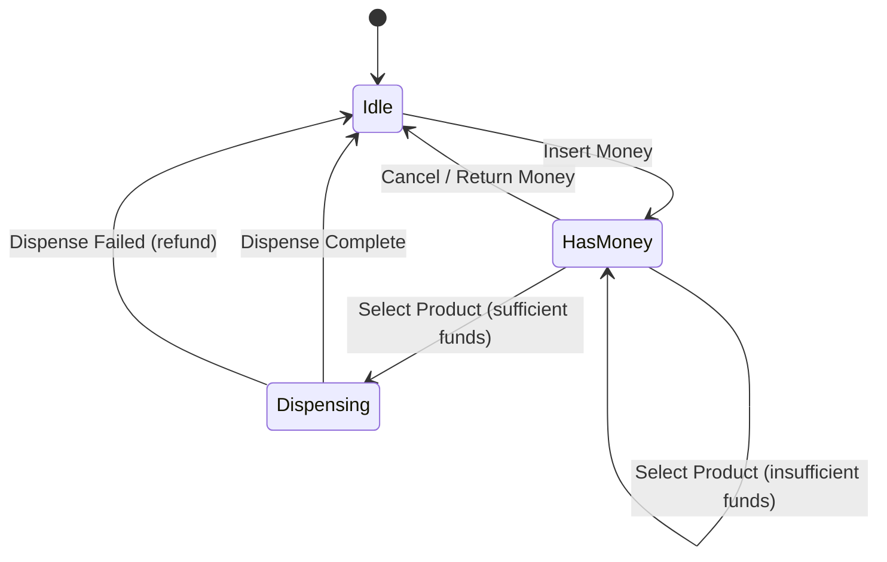
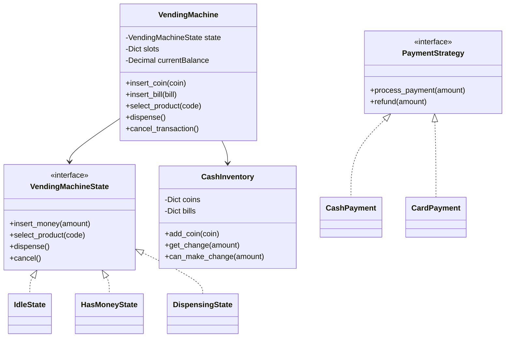

<Frame>
  
</Frame>

# Design Vending Machine

<Info>
**Difficulty**: 🟢 Beginner | **Time**: 25-35 min | **Key Patterns**: State, Strategy, Singleton
</Info>

Design a vending machine that dispenses products, handles payments, and manages inventory. This is a classic State pattern example.

---

## 1. Requirements

### Functional Requirements

| Feature | Description |
|---------|-------------|
| **Display Products** | Show available products with prices |
| **Accept Money** | Accept coins and bills |
| **Select Product** | User selects product by code |
| **Dispense Product** | Deliver product if sufficient payment |
| **Return Change** | Return excess money |
| **Cancel Transaction** | Return all inserted money |
| **Admin Operations** | Refill products, collect money |

### Constraints

- Support multiple payment methods (coins, bills, card)
- Handle exact change scenarios
- Track inventory per product slot
- Thread-safe operations

---

## 2. State Machine

The vending machine is a perfect example of the **State Pattern**. The machine's behavior changes based on its current state.


```mermaid
stateDiagram-v2
    [*] --> Idle
    Idle --> HasMoney: Insert Money
    HasMoney --> Idle: Cancel / Return Money
    HasMoney --> HasMoney: Insert More Money
    HasMoney --> Dispensing: Select Product (sufficient funds)
    HasMoney --> HasMoney: Select Product (insufficient funds)
    Dispensing --> Idle: Dispense Complete
    Dispensing --> Idle: Dispense Failed (refund)
```

---

## 3. Core Entities

```python
from enum import Enum
from dataclasses import dataclass
from decimal import Decimal
from typing import List, Dict, Optional
from abc import ABC, abstractmethod
from threading import Lock

class Coin(Enum):
    PENNY = Decimal("0.01")
    NICKEL = Decimal("0.05")
    DIME = Decimal("0.10")
    QUARTER = Decimal("0.25")
    DOLLAR = Decimal("1.00")

class Bill(Enum):
    ONE = Decimal("1.00")
    FIVE = Decimal("5.00")
    TEN = Decimal("10.00")
    TWENTY = Decimal("20.00")

@dataclass
class Product:
    code: str           # e.g., "A1", "B2"
    name: str           # e.g., "Coca-Cola"
    price: Decimal      # e.g., 1.50
    category: str       # e.g., "beverage", "snack"

@dataclass
class Slot:
    code: str
    product: Optional[Product]
    quantity: int
    max_capacity: int = 10
    
    def is_empty(self) -> bool:
        return self.quantity == 0
    
    def dispense(self) -> Optional[Product]:
        if self.is_empty():
            return None
        self.quantity -= 1
        return self.product
    
    def refill(self, quantity: int):
        self.quantity = min(self.quantity + quantity, self.max_capacity)
```

---

## 4. State Pattern Implementation

### 4.1 State Interface

```python
class VendingMachineState(ABC):
    """
    Abstract state class for vending machine.
    Each state implements allowed operations differently.
    """
    
    def __init__(self, machine: 'VendingMachine'):
        self.machine = machine
    
    @abstractmethod
    def insert_money(self, amount: Decimal) -> str:
        """Handle money insertion"""
        pass
    
    @abstractmethod
    def select_product(self, code: str) -> str:
        """Handle product selection"""
        pass
    
    @abstractmethod
    def dispense(self) -> Optional[Product]:
        """Handle product dispensing"""
        pass
    
    @abstractmethod
    def cancel(self) -> Decimal:
        """Handle transaction cancellation"""
        pass
```

### 4.2 Idle State

```python
class IdleState(VendingMachineState):
    """
    Initial state - waiting for customer interaction.
    Only accepts money insertion.
    """
    
    def insert_money(self, amount: Decimal) -> str:
        self.machine.current_balance += amount
        self.machine.set_state(HasMoneyState(self.machine))
        return f"Inserted ${amount}. Balance: ${self.machine.current_balance}"
    
    def select_product(self, code: str) -> str:
        return "Please insert money first"
    
    def dispense(self) -> Optional[Product]:
        return None
    
    def cancel(self) -> Decimal:
        return Decimal("0")  # Nothing to cancel
```

### 4.3 Has Money State

```python
class HasMoneyState(VendingMachineState):
    """
    Customer has inserted money.
    Can insert more, select product, or cancel.
    """
    
    def insert_money(self, amount: Decimal) -> str:
        self.machine.current_balance += amount
        return f"Inserted ${amount}. Balance: ${self.machine.current_balance}"
    
    def select_product(self, code: str) -> str:
        slot = self.machine.get_slot(code)
        
        if not slot:
            return f"Invalid product code: {code}"
        
        if slot.is_empty():
            return f"Product {slot.product.name} is out of stock"
        
        if self.machine.current_balance < slot.product.price:
            needed = slot.product.price - self.machine.current_balance
            return f"Insufficient funds. Need ${needed} more"
        
        # Sufficient funds - prepare to dispense
        self.machine.selected_product = slot.product
        self.machine.selected_slot = slot
        self.machine.set_state(DispensingState(self.machine))
        return f"Dispensing {slot.product.name}..."
    
    def dispense(self) -> Optional[Product]:
        return None  # Must select product first
    
    def cancel(self) -> Decimal:
        refund = self.machine.current_balance
        self.machine.current_balance = Decimal("0")
        self.machine.set_state(IdleState(self.machine))
        return refund
```

### 4.4 Dispensing State

```python
class DispensingState(VendingMachineState):
    """
    Product selected, dispensing in progress.
    No other operations allowed during dispensing.
    """
    
    def insert_money(self, amount: Decimal) -> str:
        return "Please wait, dispensing in progress"
    
    def select_product(self, code: str) -> str:
        return "Please wait, dispensing in progress"
    
    def dispense(self) -> Optional[Product]:
        product = self.machine.selected_slot.dispense()
        
        if product:
            # Deduct price and calculate change
            self.machine.current_balance -= product.price
            change = self.machine.current_balance
            
            # Reset state
            self.machine.current_balance = Decimal("0")
            self.machine.selected_product = None
            self.machine.selected_slot = None
            self.machine.set_state(IdleState(self.machine))
            
            if change > 0:
                self.machine.dispense_change(change)
            
            return product
        else:
            # Dispense failed - refund
            refund = self.machine.current_balance
            self.machine.current_balance = Decimal("0")
            self.machine.set_state(IdleState(self.machine))
            self.machine.dispense_change(refund)
            return None
    
    def cancel(self) -> Decimal:
        return Decimal("0")  # Cannot cancel during dispensing
```

---

## 5. Vending Machine Class

```python
class VendingMachine:
    """
    Main vending machine class using State pattern.
    Thread-safe for concurrent operations.
    """
    
    def __init__(self, machine_id: str):
        self.machine_id = machine_id
        self.slots: Dict[str, Slot] = {}
        self.current_balance = Decimal("0")
        self.selected_product: Optional[Product] = None
        self.selected_slot: Optional[Slot] = None
        self.cash_inventory = CashInventory()
        
        self._state: VendingMachineState = IdleState(self)
        self._lock = Lock()
    
    def set_state(self, state: VendingMachineState):
        self._state = state
    
    def get_slot(self, code: str) -> Optional[Slot]:
        return self.slots.get(code)
    
    # Public API - Thread-safe operations
    
    def insert_coin(self, coin: Coin) -> str:
        with self._lock:
            self.cash_inventory.add_coin(coin)
            return self._state.insert_money(coin.value)
    
    def insert_bill(self, bill: Bill) -> str:
        with self._lock:
            self.cash_inventory.add_bill(bill)
            return self._state.insert_money(bill.value)
    
    def select_product(self, code: str) -> str:
        with self._lock:
            return self._state.select_product(code)
    
    def dispense(self) -> Optional[Product]:
        with self._lock:
            return self._state.dispense()
    
    def cancel_transaction(self) -> Decimal:
        with self._lock:
            return self._state.cancel()
    
    def dispense_change(self, amount: Decimal) -> List[Coin]:
        """Calculate and dispense change using available coins"""
        return self.cash_inventory.get_change(amount)
    
    def get_available_products(self) -> List[Dict]:
        """Return list of available products with stock status"""
        return [
            {
                "code": slot.code,
                "name": slot.product.name if slot.product else "Empty",
                "price": slot.product.price if slot.product else 0,
                "available": not slot.is_empty()
            }
            for slot in self.slots.values()
        ]
    
    # Admin operations
    
    def add_slot(self, code: str, product: Product, quantity: int):
        """Admin: Add or update a product slot"""
        self.slots[code] = Slot(
            code=code,
            product=product,
            quantity=quantity
        )
    
    def refill_slot(self, code: str, quantity: int):
        """Admin: Refill a slot"""
        if slot := self.slots.get(code):
            slot.refill(quantity)
    
    def collect_cash(self) -> Decimal:
        """Admin: Collect all cash from machine"""
        return self.cash_inventory.collect_all()
```

---

## 6. Cash Inventory & Change Calculation

```python
class CashInventory:
    """
    Manages coins and bills in the machine.
    Uses Greedy algorithm for optimal change.
    """
    
    def __init__(self):
        self.coins: Dict[Coin, int] = {coin: 0 for coin in Coin}
        self.bills: Dict[Bill, int] = {bill: 0 for bill in Bill}
    
    def add_coin(self, coin: Coin, count: int = 1):
        self.coins[coin] += count
    
    def add_bill(self, bill: Bill, count: int = 1):
        self.bills[bill] += count
    
    def get_total(self) -> Decimal:
        """Total value of all cash"""
        total = sum(coin.value * count for coin, count in self.coins.items())
        total += sum(bill.value * count for bill, count in self.bills.items())
        return total
    
    def get_change(self, amount: Decimal) -> List[Coin]:
        """
        Calculate change using greedy algorithm.
        Returns coins to dispense, or empty list if exact change not possible.
        """
        change_coins = []
        remaining = amount
        
        # Try from largest to smallest coin
        for coin in sorted(Coin, key=lambda c: c.value, reverse=True):
            while remaining >= coin.value and self.coins[coin] > 0:
                remaining -= coin.value
                self.coins[coin] -= 1
                change_coins.append(coin)
        
        # Check if we could make exact change
        if remaining > Decimal("0.001"):  # Allow small floating point error
            # Cannot make exact change - restore coins
            for coin in change_coins:
                self.coins[coin] += 1
            return []  # Caller should handle "exact change only" scenario
        
        return change_coins
    
    def can_make_change(self, amount: Decimal) -> bool:
        """Check if exact change is possible without modifying inventory"""
        remaining = amount
        temp_counts = dict(self.coins)
        
        for coin in sorted(Coin, key=lambda c: c.value, reverse=True):
            while remaining >= coin.value and temp_counts[coin] > 0:
                remaining -= coin.value
                temp_counts[coin] -= 1
        
        return remaining < Decimal("0.001")
    
    def collect_all(self) -> Decimal:
        """Remove all cash and return total"""
        total = self.get_total()
        self.coins = {coin: 0 for coin in Coin}
        self.bills = {bill: 0 for bill in Bill}
        return total
```

---

## 7. Strategy Pattern for Payment

```python
class PaymentStrategy(ABC):
    """Strategy pattern for different payment methods"""
    
    @abstractmethod
    def process_payment(self, amount: Decimal) -> bool:
        pass
    
    @abstractmethod
    def refund(self, amount: Decimal) -> bool:
        pass

class CashPayment(PaymentStrategy):
    def __init__(self, machine: VendingMachine):
        self.machine = machine
    
    def process_payment(self, amount: Decimal) -> bool:
        # Cash is already inserted via insert_coin/insert_bill
        return self.machine.current_balance >= amount
    
    def refund(self, amount: Decimal) -> bool:
        coins = self.machine.dispense_change(amount)
        return len(coins) > 0 or amount == 0

class CardPayment(PaymentStrategy):
    def __init__(self, payment_gateway):
        self.payment_gateway = payment_gateway
    
    def process_payment(self, amount: Decimal) -> bool:
        # Simulate card payment
        try:
            result = self.payment_gateway.charge(amount)
            return result.success
        except Exception:
            return False
    
    def refund(self, amount: Decimal) -> bool:
        try:
            result = self.payment_gateway.refund(amount)
            return result.success
        except Exception:
            return False

class MobilePayment(PaymentStrategy):
    """Apple Pay, Google Pay, etc."""
    
    def __init__(self, mobile_gateway):
        self.gateway = mobile_gateway
    
    def process_payment(self, amount: Decimal) -> bool:
        return self.gateway.process_nfc_payment(amount)
    
    def refund(self, amount: Decimal) -> bool:
        return self.gateway.refund(amount)
```

---

## 8. Complete Usage Example

```python
# Create vending machine
machine = VendingMachine("VM-001")

# Stock the machine (admin operation)
machine.add_slot("A1", Product("A1", "Coca-Cola", Decimal("1.50"), "beverage"), 10)
machine.add_slot("A2", Product("A2", "Pepsi", Decimal("1.50"), "beverage"), 10)
machine.add_slot("B1", Product("B1", "Snickers", Decimal("1.25"), "snack"), 8)
machine.add_slot("B2", Product("B2", "Doritos", Decimal("2.00"), "snack"), 5)

# Add coins for change
machine.cash_inventory.add_coin(Coin.QUARTER, 20)
machine.cash_inventory.add_coin(Coin.DIME, 20)
machine.cash_inventory.add_coin(Coin.NICKEL, 20)

# Customer transaction
print(machine.get_available_products())
# [{'code': 'A1', 'name': 'Coca-Cola', 'price': 1.50, 'available': True}, ...]

print(machine.insert_coin(Coin.DOLLAR))
# "Inserted $1.00. Balance: $1.00"

print(machine.insert_coin(Coin.QUARTER))
# "Inserted $0.25. Balance: $1.25"

print(machine.select_product("A1"))
# "Insufficient funds. Need $0.25 more"

print(machine.insert_coin(Coin.QUARTER))
# "Inserted $0.25. Balance: $1.50"

print(machine.select_product("A1"))
# "Dispensing Coca-Cola..."

product = machine.dispense()
# Returns Product("A1", "Coca-Cola", ...)

# Cancel example
print(machine.insert_coin(Coin.DOLLAR))
# "Inserted $1.00. Balance: $1.00"

refund = machine.cancel_transaction()
# Returns Decimal("1.00") - money returned
```

---

## 9. Class Diagram


```mermaid
classDiagram
    class VendingMachine {
        -VendingMachineState state
        -Dict slots
        -Decimal currentBalance
        +insert_coin(coin)
        +insert_bill(bill)
        +select_product(code)
        +dispense()
        +cancel_transaction()
    }
    
    class VendingMachineState {
        <<interface>>
        +insert_money(amount)
        +select_product(code)
        +dispense()
        +cancel()
    }
    
    class IdleState
    class HasMoneyState
    class DispensingState
    
    class CashInventory {
        -Dict coins
        -Dict bills
        +add_coin(coin)
        +get_change(amount)
        +can_make_change(amount)
    }
    
    class PaymentStrategy {
        <<interface>>
        +process_payment(amount)
        +refund(amount)
    }
    
    class CashPayment
    class CardPayment
    
    VendingMachine --> VendingMachineState
    VendingMachine --> CashInventory
    VendingMachineState <|.. IdleState
    VendingMachineState <|.. HasMoneyState
    VendingMachineState <|.. DispensingState
    
    PaymentStrategy <|.. CashPayment
    PaymentStrategy <|.. CardPayment
```

---

## 10. Key Takeaways

| Concept | Implementation |
|---------|----------------|
| **State Pattern** | Machine behavior changes based on current state |
| **Strategy Pattern** | Multiple payment methods without changing core logic |
| **Thread Safety** | Lock protects concurrent operations |
| **Greedy Algorithm** | Optimal change calculation |
| **SRP** | Separate classes for state, payment, inventory |

---

## 11. Extensions

<AccordionGroup>
  <Accordion title="How to handle 'exact change only' scenarios?" icon="coins">
    1. Before each transaction, check `can_make_change()` for potential change amounts
    2. Display warning if machine cannot make change
    3. Reject high-denomination bills when low on change
    4. Allow admin to set minimum change reserve
  </Accordion>
  
  <Accordion title="How to add a display/UI layer?" icon="display">
    1. Create `Display` interface with methods like `showMessage()`, `showProducts()`
    2. Inject display into VendingMachine
    3. Call display methods at appropriate points in state transitions
    4. Support different display types (LCD, LED, touchscreen) via abstraction
  </Accordion>
</AccordionGroup>

---

## Interview Deep-Dive Questions

<AccordionGroup>
  <Accordion title="Q1: Compare the State pattern used in this vending machine vs. a simple enum-based state check. When would you actually prefer the enum approach?">
    **Strong answer:**
    - The State pattern shines when each state has substantially different behavior for the same operation. In the vending machine, `insert_money()` does completely different things in IdleState (create a balance and transition), HasMoneyState (accumulate balance), and DispensingState (reject with a message). Encoding all of this in `if state == IDLE: ... elif state == HAS_MONEY: ...` blocks means every method has a growing switch statement, and adding a new state (e.g., `OutOfOrder`) means modifying every single method.
    - However, the enum approach is genuinely preferable when: (a) the state machine is small (2-3 states), (b) the behavior differences are trivial (e.g., just a boolean check), or (c) the states need to be serialized and persisted frequently. Serializing an enum to a database is trivial; serializing a State object requires additional infrastructure.
    - A practical hybrid is common in production: use an enum for persistence and external APIs (the state stored in the DB is always `"idle"`, `"has_money"`, `"dispensing"`), but internally in the running process, map that enum to a State object that encapsulates behavior. This gives you the best of both: clean behavior dispatch in-process and simple persistence.
    - The State pattern also introduces a subtle coupling: each state class holds a reference to the machine (`self.machine`), which creates a bidirectional dependency. In the current code, the state constructor takes the machine as a parameter, meaning states cannot be reused across machines without rebuilding them. This is fine for a vending machine but becomes a concern in systems with many concurrent state machines.

    **Red flag answer:** "Always use State pattern when there are states." This is dogmatic. A strong candidate recognizes that patterns have costs (more classes, indirection, harder debugging) and can articulate when the simpler approach is better.

    **Follow-ups:**
    1. If you needed to persist the vending machine's state across power outages, how would you serialize and deserialize the current State pattern implementation?
    2. In the current design, each state transition creates a new state object (e.g., `HasMoneyState(self.machine)`). What is the garbage collection impact if the machine processes 10,000 transactions per day, and how would you optimize it?
  </Accordion>

  <Accordion title="Q2: The payment handling uses a Strategy pattern with CashPayment, CardPayment, and MobilePayment. But the current state machine only models the cash flow. How would you integrate card and mobile payments into the state transitions?">
    **Strong answer:**
    - The current state machine assumes a sequential cash flow: insert money incrementally, then select product. Card and mobile payments break this model because the full payment happens atomically after product selection, not incrementally before it.
    - You need a fork in the state machine. From IdleState, there should be two paths: (1) `insert_money` -> HasMoneyState (cash flow, as-is), and (2) `select_product` -> ProductSelectedState (card/mobile flow). In the card/mobile path, the user selects a product first, then pays the exact amount in one step. This means IdleState's `select_product()` should no longer blindly return "Please insert money first" -- it should check if a non-cash payment method is available.
    - You could introduce a `ProductSelectedState` that sits between selection and dispensing, where the machine waits for card tap or mobile confirmation. This state has a timeout (e.g., 30 seconds) after which it returns to Idle.
    - The Strategy pattern and State pattern interact here: the current state determines which payment strategies are valid. In HasMoneyState, only CashPayment applies. In ProductSelectedState, only CardPayment and MobilePayment apply. The state can hold a reference to the valid `PaymentStrategy` and delegate to it.
    - A real-world concern: card payments require network connectivity. The machine needs a way to gracefully degrade -- if the card reader or network is down, only the cash flow should be available. This means the state machine's available transitions are dynamic based on hardware health status, not just hardcoded.

    **Red flag answer:** "Just call `CardPayment.process_payment()` inside HasMoneyState." This misses that the cash flow and card flow have fundamentally different state sequences, and jamming card logic into the cash-oriented states creates a conceptual mess.

    **Follow-ups:**
    1. Card payments can fail due to network timeouts. How does the state machine handle a payment that is in-flight for 10 seconds -- do you block the machine, show a spinner, or allow cancellation?
    2. If the card payment succeeds but the dispenser jams, how do you initiate an automatic refund, and which class is responsible for that coordination?
  </Accordion>

  <Accordion title="Q3: The inventory system uses a simple Slot with a quantity counter. How would you redesign it to support expiration dates, dynamic pricing, and product recommendations?">
    **Strong answer:**
    - The current `Slot` is essentially a dumb container: it knows its product, quantity, and max capacity. For a production vending machine, each individual item in a slot could have different expiration dates (e.g., front items expire sooner). You would change `Slot` from tracking a `quantity: int` to maintaining a `List[ProductItem]` where each `ProductItem` has its own `expiration_date`. Dispensing always takes the item with the nearest expiration (FIFO or earliest-expiry-first).
    - Dynamic pricing connects the `PricingStrategy` concept to inventory state. When a product is near expiration, you apply a discount; when inventory is low and demand is high, you increase the price. This requires the `Slot` (or an `InventoryManager`) to expose signals like `days_until_earliest_expiry()` and `stock_percentage()`, which the pricing strategy consumes.
    - Product recommendations require the machine to track purchase history. A simple approach: maintain a co-purchase matrix -- "people who bought A1 also bought B2" -- and display a suggestion on screen after dispensing. This is an Observer pattern application: the `DispenseEvent` triggers a `RecommendationObserver` that queries the matrix and calls `screen.display_suggestion()`.
    - An important real-world constraint is that vending machine hardware is resource-constrained. You cannot run a full recommendation engine on-device. The pattern is: sync a precomputed recommendation table from a central server during off-peak hours, and look it up locally. This keeps the on-device logic simple while enabling sophisticated recommendations.

    **Red flag answer:** "Add an expiration field to Product." This is a model-level confusion -- a Product is a type (Coca-Cola, $1.50), not a physical item. The expiration belongs to each individual physical item in the slot, not the product template.

    **Follow-ups:**
    1. If the machine detects that all items in a slot expire within 24 hours, should it automatically apply a 50% discount, block the slot, or alert the operator? How would you make this configurable?
    2. How would you design an A/B test framework for testing different recommendation strategies on a fleet of 500 vending machines?
  </Accordion>

  <Accordion title="Q4: The change-making algorithm uses a greedy approach. Show me a specific input where this fails, and walk through how you'd fix it.">
    **Strong answer:**
    - The current coins are PENNY (0.01), NICKEL (0.05), DIME (0.10), QUARTER (0.25), DOLLAR (1.00). For these denominations, greedy always works because they form a canonical coin system. But let us say a machine in a different market has denominations of 1, 15, and 25 cents. If a customer needs 30 cents in change, greedy picks 25 + 1 + 1 + 1 + 1 + 1 = six coins. The optimal answer is 15 + 15 = two coins.
    - The fix is dynamic programming. Build a table `dp[0..amount]` where `dp[i]` is the minimum number of coins to make amount `i`. Initialize `dp[0] = 0` and all others to infinity. For each amount from 1 to target, try each coin denomination and take `dp[i] = min(dp[i], dp[i - coin] + 1)`. Then backtrack to find which coins were used.
    - But there is a subtlety the greedy-vs-DP framing misses: the machine has limited coin inventory. Even with standard denominations, greedy can fail not because it picks the wrong coins but because it runs out. If the machine has zero quarters but 20 dimes, greedy for 50 cents would try 2 quarters (fail), then what? The current `get_change` method handles this by checking `self.coins[coin] > 0` in the while loop, which naturally falls through to smaller coins. But for non-canonical denominations with limited supply, you need DP with inventory constraints, which is essentially the bounded knapsack problem.
    - In the current code, there is a safety net: if `remaining > 0.001` after the greedy pass, it restores all coins and returns an empty list. This is correct behavior (refuse to make change rather than short-change the customer), but the user experience is terrible -- the customer inserted money but cannot buy anything. A better approach: before accepting money, check `can_make_change()` for the maximum possible change amount and display "EXACT CHANGE ONLY" proactively.

    **Red flag answer:** "Greedy always works for coins." Demonstrably false, and this is a well-known CS fundamental. Even a candidate who knows greedy works for US coins should acknowledge the general case.

    **Follow-ups:**
    1. The `get_change` method uses `Decimal("0.001")` as a floating-point error tolerance. What specific bug could this mask, and how would you eliminate the tolerance entirely?
    2. If the machine is low on change, how would you implement a proactive "EXACT CHANGE ONLY" mode that activates before any customer is affected?
  </Accordion>

  <Accordion title="Q5: The DispensingState's cancel() method returns Decimal('0') -- meaning the user cannot cancel during dispensing. Is this the right design choice?">
    **Strong answer:**
    - It is the correct choice for physical dispensing because the mechanical process is essentially irreversible once started. The motor has already pushed the product to the delivery slot. You cannot un-dispense a bag of chips. This is different from a software transaction where you can roll back.
    - However, there is a timing gap between "product selected, transitioning to DispensingState" and "physical dispenser motor engaged." In this gap, cancellation should theoretically still be possible. The current design does not model this sub-state. A more precise implementation would have `DispensingPendingState` (cancellable) and `DispensingActiveState` (not cancellable), with the transition triggered by a hardware callback from the dispenser motor.
    - The broader design question is: what should happen if the dispensing mechanism jams or fails? The current `dispense()` method handles this by refunding the full amount if `slot.dispense()` returns None. But there is a race condition: the slot's quantity was already decremented by `dispense()` before the physical mechanism might fail. You need to separate the logical inventory decrement from the physical dispense confirmation.
    - In real vending machines, there are sensors at the delivery chute that confirm the product actually fell. The sequence is: (1) command the motor, (2) wait for the delivery sensor, (3) if confirmed within timeout, decrement inventory and complete; if not confirmed, retry once, then refund and mark the slot as potentially jammed.

    **Red flag answer:** "Cancellation should always be available for good UX." This ignores the physical reality that a dispense in progress cannot be reversed, and shows a purely software-centric mindset that does not account for hardware constraints.

    **Follow-ups:**
    1. If the product gets stuck (detected by a delivery chute sensor timeout), should the machine refund the customer, retry the dispense, or move to an out-of-order state? Walk me through the decision tree.
    2. How would you design the `Slot.dispense()` method to separate the logical inventory reservation from the physical delivery confirmation?
  </Accordion>

  <Accordion title="Q6: How would you add extensibility for a new product category like hot beverages (coffee, tea) that require preparation time?">
    **Strong answer:**
    - Hot beverages break the current synchronous dispensing model. A bag of chips dispenses in 1-2 seconds. A coffee takes 30-60 seconds to brew. The DispensingState needs to become asynchronous -- it cannot block the entire machine state for 60 seconds.
    - You would introduce a `ProductDispenser` interface with an `async_dispense()` method. `SimpleDispenser` (for snacks) calls the motor and returns immediately. `BrewingDispenser` (for coffee) starts the brewing process and returns a future/callback. The DispensingState transitions based on the dispenser callback, not a synchronous return value.
    - The state machine needs a new state: `PreparingState`. The flow becomes: `HasMoney -> ProductSelected -> PreparingState -> DispensingState -> Idle`. In PreparingState, the screen shows a progress indicator, and the machine continues monitoring for hardware events (cup placed, brew complete, error).
    - This also introduces new failure modes: what if the coffee machine runs out of water or milk mid-brew? You need a `PartialDispenseError` concept where the machine has committed resources (water, coffee grounds) but cannot complete. The refund policy here is different from a snack dispenser jam -- you might refund the money but you have already used consumables. The machine needs to track consumable inventory separately from product inventory.
    - For the class structure, each `Slot` would hold a reference to its `ProductDispenser` implementation. This follows the Strategy pattern at the slot level, making the vending machine agnostic to how each product is actually dispensed.

    **Red flag answer:** "Just increase the timeout in DispensingState." This ignores the architectural mismatch -- a 60-second synchronous block prevents the machine from responding to any other input, including an emergency stop.

    **Follow-ups:**
    1. If two hot beverages are ordered back-to-back, should the machine start brewing the second while the first is being picked up, or enforce a sequential flow? What are the trade-offs?
    2. How would you model consumable ingredients (water, milk, coffee beans) that are shared across multiple product types, and how does this affect the `is_empty()` check?
  </Accordion>

  <Accordion title="Q7: The VendingMachine class uses a single threading.Lock for all operations. What are the performance implications, and how would you improve it?">
    **Strong answer:**
    - A single lock means all operations are fully serialized: if one customer is in the middle of inserting a coin, another thread (e.g., a background inventory check, a network health ping, or an admin refill operation) is completely blocked. For a physical vending machine with one customer at a time this is acceptable, but for a virtual vending machine (think: an API-based system managing multiple kiosk screens on the same backend), this is a bottleneck.
    - The improvement is fine-grained locking. The cash inventory (`CashInventory`) should have its own lock, separate from the slot inventory lock. The state machine transitions should be protected by a state lock. This allows, for example, an admin to check inventory levels without blocking a customer mid-transaction.
    - Read-write locks (`threading.RWLock` or equivalent) are another improvement: `get_available_products()` is a read-only operation and should not block other readers. Only write operations (dispensing, refilling) need exclusive access.
    - But there is a deeper issue: the `_state` field and `current_balance` are logically coupled. You cannot safely update one without considering the other. Fine-grained locking introduces the risk of deadlocks if locks are acquired in inconsistent order. The disciplined approach is to define a lock ordering protocol: always acquire the state lock before the inventory lock, never the reverse.
    - In production vending machine firmware, the common pattern is an event loop (single-threaded) with a message queue. Hardware events (coin inserted, button pressed, dispenser sensor) are enqueued as messages, and the main loop processes them sequentially. This eliminates locking entirely through the actor model. The current threading approach is the OOP-textbook solution; the event loop is the production-firmware solution.

    **Red flag answer:** "Use `asyncio` instead of threads." This confuses I/O concurrency with CPU concurrency and does not address the fundamental problem of protecting shared mutable state.

    **Follow-ups:**
    1. If you moved this to an event loop architecture, how would you handle a long-running hardware operation (e.g., the dispenser motor takes 3 seconds) without blocking the event loop?
    2. The `dispense_change()` method is called outside the lock in `DispensingState.dispense()`. Is this a bug? What could go wrong?
  </Accordion>

  <Accordion title="Q8: A customer inserts $10 but only buys a $1.50 soda. Walk me through the exact change-making process and identify every failure point.">
    **Strong answer:**
    - The customer inserts a $10 bill. `CashInventory.add_bill(Bill.TEN)` increments the bill count. `current_balance` becomes $10.00. They select product A1 (Coca-Cola, $1.50). After dispensing, `change = $10.00 - $1.50 = $8.50`. Now `dispense_change($8.50)` is called.
    - The greedy algorithm in `get_change()` tries: DOLLAR coins first. If the machine has 8 dollar coins, it dispenses 8 x $1.00 = $8.00, then 1 x QUARTER = $8.25, then 1 x QUARTER = $8.50. That is 10 coins total for $8.50 in change. This is a lot of coins clinking out, which is already a bad user experience.
    - Failure point 1: The machine might not have enough coins. If it has only 3 dollar coins and 5 quarters, it can make $3.00 + $1.25 = $4.25, far short of $8.50. The `get_change` method returns an empty list, and... then what? The current code in `DispensingState.dispense()` does not check whether change was successfully dispensed. The product is already given, money is deducted, and the customer is simply shorted their change. This is a bug.
    - Failure point 2: The `can_make_change()` check should happen before dispensing, not after. The correct flow is: (1) check if change can be made for `balance - price`, (2) only then dispense the product, (3) then dispense the change. The current code does it backwards.
    - Failure point 3: Bills cannot be used as change in the current model. The `get_change()` method only iterates over `Coin` values, not `Bill` values. So even if the machine is full of $1 bills, it cannot use them for change. This is a significant gap.
    - Failure point 4: The $10 bill the customer just inserted is now in the machine's bill inventory, but bills are never used for change. The machine's coin supply is being depleted without replenishment. Over time, the machine accumulates bills and runs out of coins -- a classic vending machine operator headache.

    **Red flag answer:** "The machine gives back $8.50 in coins." This is technically correct but misses every failure point, showing no systems-thinking or adversarial mindset about what could go wrong.

    **Follow-ups:**
    1. How would you redesign the system to reject a $10 bill for a $1.50 purchase upfront, before the customer inserts it?
    2. Vending machine operators typically "seed" the machine with a change float (e.g., $20 in quarters). How would you model this in the design, and when should the machine automatically switch to "exact change only" mode?
  </Accordion>
</AccordionGroup>
