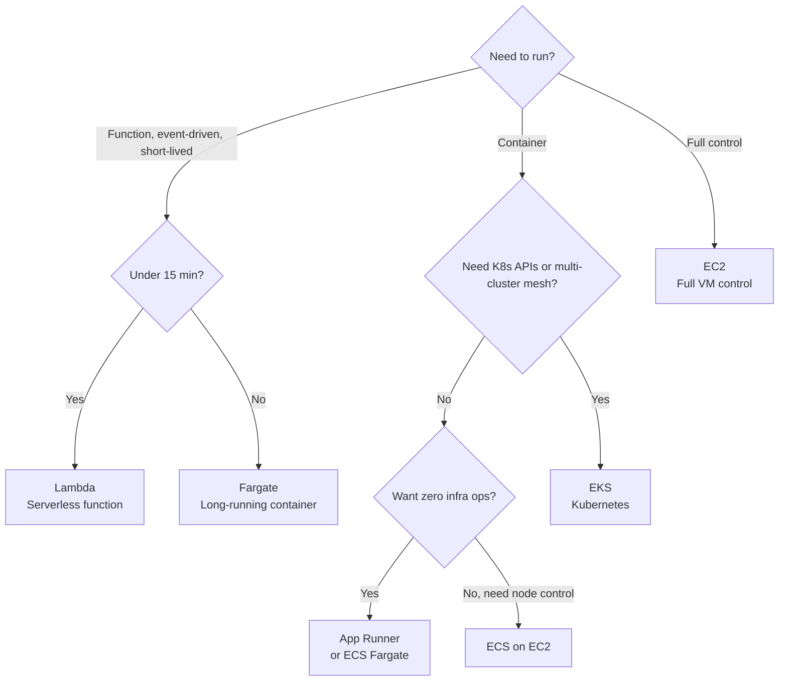

# AWS Interview Questions (50+ Detailed Q&A)

<Note>
**Senior vs Staff -- What separates them on AWS?**

**Senior Engineer**: Builds solutions on AWS services. Selects the right compute/storage/networking primitives for a given workload. Writes CDK/Terraform modules. Debugs production issues using CloudWatch and X-Ray. Designs for a single team's domain, usually within one AWS account or a small handful of accounts.

**Staff Engineer**: Designs multi-account AWS Organizations structures (landing zones), org-level SCP and permission boundary hierarchies, and cost governance frameworks (Cost Categories, RI/Savings Plan pooling). Owns the Transit Gateway / shared networking topology and the guardrails that let hundreds of teams self-serve safely. Defines organization-wide policies (region restrictions, encryption standards, tagging enforcement, IAM Identity Center federation). Makes build-vs-buy decisions (EKS vs. ECS vs. a managed PaaS). Runs Well-Architected Reviews across business units. Negotiates Enterprise Discount Program (EDP) commitments with finance.
</Note>

## 1. Compute & Containers

<AccordionGroup>
<Accordion title="1. EC2 vs Lambda vs Fargate vs App Runner vs Elastic Beanstalk">
**What interviewers are really testing:** Can you match workload characteristics to the right compute primitive? Do you understand the operational burden spectrum from IaaS to fully managed, and can you make cost-aware architectural decisions?

**Answer:**
*   **EC2**: IaaS -- raw VMs where you own everything from OS patches to autoscaling configuration. You pick instance family, storage, network. Full root/administrator access. Think of it as renting a physical server in the cloud, with the hypervisor abstracted away by the Nitro System.
*   **Elastic Beanstalk**: PaaS -- you upload code or a container image, AWS provisions and manages the underlying EC2, load balancer, and Auto Scaling group for you. You still see and can tweak the underlying resources (it is not fully serverless). Good for teams that want managed infrastructure but still want SSH access when something breaks.
*   **App Runner**: Fully managed container/source-to-URL service. Point it at a container image in ECR or a GitHub repo, it builds, deploys, scales (including to near-zero with a minimum instance floor), and fronts it with HTTPS. No VPC knowledge required by default (VPC connector needed for private resources). The closest AWS analog to Cloud Run, but with a narrower feature set (no gRPC/WebSockets support until recently, simpler concurrency model).
*   **Fargate (on ECS or EKS)**: Serverless containers. You give it a task definition (container image + CPU/memory), AWS runs it without you managing EC2 instances. No node patching, no cluster capacity planning. Billed per vCPU-second and GB-second of the task, rounded to the second.
*   **Lambda**: Fully serverless functions. You give it a handler function, AWS manages everything below the runtime. Scales to zero automatically. Max execution time 15 minutes. Billed per 1ms of execution time and configured memory (which also determines proportional CPU/network).

**Decision Matrix**:


**Use Case Comparison**:
| Service | Best For | Scale to Zero | Cold Start | Cost Model | Ops Burden |
|:--------|:---------|:--------------|:-----------|:-----------|:-----------|
| **Lambda** | Event handlers, APIs, glue code | Yes | ~100ms-1s (varies by runtime) | Pay per ms + memory | Very Low |
| **App Runner** | Simple web services, APIs | Near-zero (min instance floor) | ~seconds | Pay per vCPU/GB-hour | Low |
| **Fargate (ECS)** | Microservices, batch jobs, no node mgmt | No | None (task pre-warmed) | Pay per vCPU/GB-second | Low-Medium |
| **Elastic Beanstalk** | Traditional web apps, teams wanting managed EC2 | No | None | Pay per EC2/ELB-hour | Medium |
| **EC2** | Databases, legacy apps, full control, licensing | No | None (always on) | Pay per instance-hour | High |
| **EKS (Fargate or EC2 nodes)** | Complex microservices, need K8s ecosystem | Depends on node group | None (pods pre-warmed) | Pay per node/pod + $0.10/hr cluster fee | Medium-High |

**Example Scenarios**:
- **Lambda**: Processing S3 upload events, resizing thumbnails. A webhook receiver for Stripe that runs a few thousand times a day and should cost pennies.
- **App Runner**: A small internal dashboard or API where the team wants a `git push`-to-URL experience without touching ECS task definitions.
- **Fargate**: A fleet of 15 stateless microservices behind an ALB, none of which need custom kernel tuning or DaemonSets.
- **Elastic Beanstalk**: A Rails or Django monolith migrated from on-prem where the team wants managed infra but still occasionally needs to SSH into a box.
- **EC2**: Self-managed PostgreSQL with specific kernel tuning, or a legacy Windows Server app with per-core licensing that requires Dedicated Hosts.
- **EKS**: A fintech platform with 50+ microservices, Istio or App Mesh, mTLS between services, and canary deployments via Argo Rollouts.

**Production gotcha**: Elastic Beanstalk's "managed" abstraction leaks the moment you need something it did not anticipate -- custom `.ebextensions` config becomes its own maintenance burden, and platform version upgrades can silently change the underlying AMI in ways that break custom hooks. Many teams that start on Beanstalk migrate to ECS/Fargate once they need more than a single web tier + worker tier topology.

**Cost reality check**: A startup processing 50K requests/day with avg 200ms response time: Lambda costs ~$3-5/month (well within free tier for the first million requests). The same on Fargate (1 task, 0.25 vCPU/0.5GB, always on) costs ~$9/month. On App Runner: ~$25-40/month (minimum instance floor keeps something warm). On a 2-node EKS cluster (t3.medium) plus the $0.10/hr control plane fee: ~$140/month minimum before any workload cost. Lambda is the clear winner for low-to-moderate, spiky traffic.

**Red flag answer:** "I would just use EKS for everything because Kubernetes is the standard." This shows no understanding of operational cost. A 2-node EKS cluster costs ~$140/mo minimum (control plane fee plus EC2) vs. near-zero on Lambda for low, event-driven traffic.

**Follow-up:**
- *"Your Lambda function is experiencing 3-second cold starts. How do you debug and fix this?"* -- Check deployment package size (prefer container images under 250MB unzipped, or trim dependencies for zip packages), check the runtime (Java and .NET have notably worse cold starts than Node/Python/Go), enable Provisioned Concurrency for latency-sensitive paths, and profile the init phase (SDK client creation, DB connection setup) which runs once per cold start but can still dominate if it does something slow like a synchronous Secrets Manager call.
- *"When would you migrate FROM EKS TO Fargate/ECS, and what breaks?"* -- When services are simple, stateless, and you want to shed the burden of managing node groups, AMI patching, and cluster upgrades. What breaks: DaemonSets, custom CNI/CSI plugins, privileged containers, and any Kubernetes-native tooling your team has built around `kubectl`-based workflows (Helm charts mostly still work, but some operators assume node-level access).
- *"A team is running 200 microservices on EKS. They want to move to Lambda for cost savings. What is your advice?"* -- Likely a bad idea at that scale for anything with sustained traffic or complex inter-service networking. Lambda lacks persistent connections, has per-invocation cold start risk at scale, and 200 independently deployed functions can become an operational nightmare without strong platform tooling (SAM/CDK conventions, centralized observability). The cost savings are illusory once you account for engineering time managing 200 function deployments. Recommend evaluating Fargate first as the middle ground.

**Follow-up chain (cost optimization and failure modes):**
- *"Walk me through how you would calculate the total cost of ownership for Lambda vs Fargate vs EKS for 20 microservices averaging 500 RPM."* -- This is not just compute cost. Factor in: engineering time managing node groups and cluster upgrades (EKS), per-invocation cost at sustained volume (Lambda can get expensive above a certain steady RPS compared to a warm container), NAT Gateway data processing charges if functions/tasks need VPC access to reach private resources (~$0.045/GB), and observability tooling differences (X-Ray vs CloudWatch Container Insights). Build a spreadsheet with all these dimensions before committing.
- *"Your Lambda functions need to reach an RDS instance in a private subnet. Cold starts get worse and you start seeing connection exhaustion. What are your options?"* -- Use RDS Proxy to pool and share connections across concurrent Lambda invocations instead of each invocation opening its own connection. Ensure the function is in the same VPC/subnets as the database to avoid NAT traversal. Consider whether the workload actually needs VPC attachment at all (Lambda-to-VPC networking via Hyperplane ENIs adds a small amount of cold start latency, though this has improved significantly since 2019).
- *"How would you design a disaster recovery plan for Lambda-based services across regions?"* -- Deploy the function and its dependent resources (event sources, DynamoDB tables) in two regions. Use Route 53 with health checks and failover routing, or a Global Accelerator in front of two regional API Gateways. Lambda itself has no built-in cross-region failover -- you configure it at the routing layer. The data layer is the hard part: DynamoDB Global Tables give you multi-region active-active with eventual consistency; anything requiring strong cross-region consistency needs a different approach (Aurora Global Database with limited RPO). Test failover quarterly by disabling one region's routing weight.

<Note>
**Work-sample prompt**: "Your Lambda-based API is hitting cold start latency that violates your 2-second SLA at the 500ms mark. Walk through your diagnosis and fix, including the exact `aws lambda` configuration you would change, how you would measure the improvement, and how you would justify the cost of Provisioned Concurrency to your finance team."
</Note>

<Tip>
**Structured Answer Template:**
1. Anchor on the workload dimension (stateful? container? event-driven? ops maturity of the team?) -> 2. Match to compute primitive using the decision matrix -> 3. Quantify cost at your actual traffic (Lambda tiny/spiky, EKS >20 services) -> 4. Call out the one-way-door risks (Beanstalk custom-hook lock-in, EKS minimum cluster cost) -> 5. Name the migration path if requirements change.
</Tip>
</Accordion>

<Accordion title="2. Spot vs On-Demand vs Reserved Instances vs Savings Plans">
**What interviewers are really testing:** Do you understand AWS's pricing models well enough to actually save your company money, and do you know the operational risk that comes with each discount mechanism?

**Answer:**
*   **On-Demand**: Pay by the second (Linux) or hour, no commitment. Most expensive per unit, most flexible. Baseline for anything unpredictable.
*   **Spot Instances**: Spare EC2 capacity at up to 90% off On-Demand, but AWS can reclaim it with a 2-minute interruption warning (via EventBridge/instance metadata). Best for fault-tolerant, stateless, or checkpointable workloads: batch processing, CI/CD runners, stateless web tiers behind an ASG, big data (EMR), and Fargate Spot for containers.
*   **Reserved Instances (RIs)**: Commit to a specific instance family/region (Standard RI) or with more flexibility across instance size within a family (Convertible RI) for 1 or 3 years, in exchange for up to ~72% off. Standard RIs can be sold on the RI Marketplace if no longer needed; Convertible RIs cannot.
*   **Savings Plans**: A newer, more flexible commitment model -- you commit to a $/hour spend for 1 or 3 years, and it automatically applies to any EC2 usage (Compute Savings Plans, most flexible, covers EC2/Fargate/Lambda) or any usage within a specific instance family in a region (EC2 Instance Savings Plans, deeper discount but less flexible). Most organizations now prefer Savings Plans over RIs because they do not lock you into a specific instance family across your entire fleet.

**Practical strategy**: Layer them. Baseline steady-state compute (databases, always-on services) -> Compute Savings Plans covering ~60-70% of baseline. Bursty, fault-tolerant workloads -> Spot with a diversified instance pool (multiple instance types/AZs to reduce simultaneous interruption risk) via EC2 Fleet or Spot Fleet, or simply Fargate Spot for containers. Unpredictable or short-lived workloads -> On-Demand.

**Production gotcha**: Convertible RIs and Savings Plans commitments do not automatically shrink if you right-size or decommission workloads -- you are on the hook for the committed spend regardless. Teams that over-commit based on a traffic peak end up paying for unused capacity for the remaining 11 months of the term.

**Red flag answer:** "We buy 3-year Standard RIs for everything to save the most money." This ignores the flexibility cost -- a 3-year Standard RI locks you to a specific instance family in a specific region. If the team migrates to Graviton (ARM) instances 6 months in, or a new instance generation launches with better price/performance, you are stuck paying for instances you no longer want to run.

**Follow-up:**
- *"Your Spot-based CI/CD fleet keeps getting interrupted mid-build, wasting compute. How do you fix this?"* -- Diversify across instance types and AZs (Spot Fleet / EC2 Fleet with multiple pools reduces correlated interruption risk), use the 2-minute interruption notice to checkpoint and gracefully drain the build, and consider a small On-Demand or Reserved baseline for time-sensitive builds while using Spot for the bulk of parallel/non-urgent jobs.
- *"How do Savings Plans interact with Reserved Instances if you have both?"* -- AWS applies discounts in a specific order (billing conflicts are resolved automatically): existing RIs are applied first to matching usage, then Savings Plans apply to remaining eligible usage, then On-Demand rates apply to anything left over. You generally should not need to actively manage the interaction -- AWS Cost Explorer's RI/SP coverage reports show you the blended result.
- *"How would you decide how much Savings Plan commitment to buy for a growing startup?"* -- Look at 30-90 days of stable, non-spiky usage in Cost Explorer as the floor. Commit to roughly 70-80% of that floor (leaving headroom for On-Demand/Spot to absorb growth and spikes without over-committing), start with 1-year terms until usage patterns stabilize, and re-evaluate quarterly as the baseline grows.
</Accordion>

<Accordion title="3. ECS vs EKS (and Fargate vs EC2 launch type)">
**What interviewers are really testing:** Can you reason about container orchestration trade-offs on AWS specifically, separate from generic "which is better" opinions? Do you understand the two independent axes here: orchestrator (ECS vs EKS) and compute (Fargate vs EC2)?

**Answer:**
These are two separate decisions that get conflated:

**Orchestrator: ECS vs EKS**
*   **ECS**: AWS's proprietary, simpler orchestrator. Task definitions instead of Pod specs, Services instead of Deployments. Deep native integration with ALB/NLB, Cloud Map for service discovery, and IAM (task roles map cleanly to IAM). Smaller learning curve, no separate control plane cost.
*   **EKS**: Managed Kubernetes. Use it when you need the Kubernetes API surface itself -- portability across clouds, existing Helm charts/operators, a team that already knows `kubectl`, or ecosystem tools that assume Kubernetes (Argo CD, Istio, KEDA). Control plane costs $0.10/hour (~$73/month) regardless of workload size.

**Compute: Fargate vs EC2 launch type** (applies to both ECS and EKS)
*   **Fargate**: No node management. AWS runs your containers on infrastructure you never see. Simpler, but less control over instance type, no GPU support on ECS Fargate historically limited (EKS Fargate also cannot run GPU workloads), higher per-vCPU cost than equivalent EC2.
*   **EC2 launch type**: You manage the underlying instances (or use Managed Node Groups on EKS, or Capacity Providers on ECS to automate scaling). Needed for GPU workloads, DaemonSets, specific instance types (memory-optimized, Graviton for cost savings), or when you are already running enough containers that Fargate's per-task premium outweighs the ops savings.

**Decision guidance**: Default to ECS + Fargate for most application teams -- lowest ops burden, native AWS integration, good enough for 80% of use cases. Reach for EKS when you have a genuine Kubernetes-ecosystem requirement (multi-cloud portability, existing Helm-based tooling, ML workloads needing GPU node pools with Kubernetes-native scheduling like Kubeflow). Reach for EC2 launch type (on either orchestrator) when GPU access, DaemonSets, or cost at scale (Graviton instances are ~20% cheaper and Fargate does not support Graviton on all task types) matter more than the ops savings of Fargate.

**Production gotcha**: Teams that adopt EKS "because Kubernetes is the industry standard" often rebuild, poorly, the exact integrations (IAM-to-service-account mapping via IRSA, ALB ingress controller configuration, Cluster Autoscaler tuning) that ECS gives you for free. The Kubernetes ecosystem's flexibility is also its ops tax.

**Red flag answer:** "ECS is legacy, everyone should use EKS." This ignores that ECS is actively developed, has lower operational overhead for teams without existing Kubernetes investment, and is frequently the better choice for pure AWS shops that do not need cross-cloud portability.

**Follow-up:**
- *"Your ECS Fargate bill has grown to $8K/month for a workload that used to run on 3 EC2 instances for $600/month. What happened and what do you do?"* -- Fargate's per-task pricing includes a premium for not managing infrastructure; at sufficient scale and steady-state utilization, EC2 (especially with Savings Plans or Spot) becomes cheaper. Right-size task CPU/memory requests first (Fargate bills for what you request, not what you use), then evaluate ECS Capacity Providers with EC2 + Fargate Spot as a mixed strategy, moving steady baseline load to EC2 while keeping burst capacity on Fargate.
- *"How does IAM work differently between ECS and EKS?"* -- ECS task roles map directly to IAM roles -- straightforward, one task definition, one role. EKS requires IAM Roles for Service Accounts (IRSA) or the newer EKS Pod Identity feature to map a Kubernetes ServiceAccount to an IAM role via OIDC federation -- an extra layer of indirection that trips up teams new to EKS.
- *"A team wants to run GPU inference workloads. Which orchestrator and compute type do you recommend?"* -- EC2 launch type is required (Fargate does not support GPU instances on either ECS or EKS). Between ECS and EKS: if the team already uses Kubernetes-native ML tooling (KServe, Kubeflow, Triton Inference Server operators), EKS with a GPU-enabled managed node group is the better fit. If it is a simpler, single-model inference service, ECS with EC2 launch type on a `g5` instance is less operational overhead.
</Accordion>

<Accordion title="4. Lambda Cold Starts and Provisioned Concurrency">
**What interviewers are really testing:** Do you understand the actual mechanics of Lambda's execution environment lifecycle, or do you just know the word "cold start" without being able to fix one?

**Answer:**
A cold start happens when Lambda has to provision a brand-new execution environment: download the code, start the runtime, and run your handler's initialization code (anything outside the handler function -- SDK client construction, DB connections, config loading) before it can process the first invocation. A warm start reuses an existing execution environment (subsequent invocations on the same environment skip initialization entirely).

**What affects cold start duration**:
- **Runtime**: Interpreted languages with lightweight runtimes (Node.js, Python, Go, Rust via custom runtime) cold-start fastest (roughly 100-400ms). JVM-based runtimes (Java, and to a lesser extent .NET/C#) are notably slower (1-6+ seconds) due to class loading and JIT warmup, unless using SnapStart.
- **Package size**: Larger deployment packages (especially container images) take longer to download and initialize, though Lambda caches image layers.
- **VPC attachment**: Historically added significant cold start latency due to ENI creation; largely mitigated since 2019 with the Hyperplane networking model, but still a factor at high concurrency scale-out.
- **Init code**: Synchronous calls during initialization (fetching a secret from Secrets Manager, establishing a DB connection) run once per cold start but block that specific invocation.

**Mitigations**:
- **Provisioned Concurrency**: Pre-initializes a specified number of execution environments so they are always warm, eliminating cold starts for that pool (at a cost -- you pay for provisioned environments whether invoked or not). Best for latency-sensitive, predictable-traffic APIs.
- **SnapStart** (Java, and now available for other runtimes): Takes a Firecracker microVM snapshot after initialization, restoring from the snapshot instead of re-running init on every cold start. Can reduce Java cold starts by 90%+ with no extra cost beyond a small caching charge.
- **Reduce init work**: Lazy-load non-critical dependencies, move expensive setup outside the hot path, use lighter SDK clients.
- **Keep functions warm** (older technique, mostly superseded by Provisioned Concurrency): scheduled EventBridge pings -- generally a workaround, not a real fix, since it does not guarantee warmth under concurrent bursts.

**Production gotcha**: Provisioned Concurrency does not eliminate cold starts entirely -- if traffic exceeds the provisioned pool, Lambda still cold-starts additional environments on demand. Sizing the provisioned pool requires understanding your actual concurrency profile (CloudWatch's `ConcurrentExecutions` metric), not just average RPS.

**Red flag answer:** "Just set Provisioned Concurrency to a high number and cold starts go away." This ignores cost (you pay per provisioned environment per hour regardless of invocation) and the fact that traffic bursts above the provisioned level still cold-start.

**Follow-up:**
- *"Your Java Lambda has a 4-second p99 latency during traffic spikes, but average latency is 200ms. What is happening and how do you fix it?"* -- Classic cold-start-at-the-tail signature: most requests hit warm environments (200ms), but scale-out events during spikes trigger new cold starts (4s, dominated by JVM class loading). Fix with SnapStart first (near-free, big impact for Java specifically), and/or Provisioned Concurrency sized to the p99 concurrency level, not the average.
- *"How would you decide between Provisioned Concurrency and just accepting cold starts?"* -- Depends on the SLA and traffic shape. User-facing synchronous APIs with strict latency SLAs justify the cost. Async/event-driven processing (SQS consumers, S3 event handlers) that tolerates a few hundred extra milliseconds usually does not need it -- spend the money elsewhere.
- *"Can you explain why a Lambda function inside a VPC with a NAT Gateway might time out under load, unrelated to cold starts?"* -- NAT Gateway has connection and bandwidth limits, and Lambda's automatic concurrency scaling can create far more simultaneous outbound connections than NAT Gateway (or the security group's ephemeral port range) can handle, causing connection failures that look like timeouts. Consider VPC endpoints for AWS service calls (bypassing NAT entirely) or scaling NAT Gateway capacity.
</Accordion>

<Accordion title="5. Lambda Event Sources and Invocation Models">
**What interviewers are really testing:** Do you understand the difference between synchronous, asynchronous, and poll-based invocation, and can you reason about retry/failure behavior for each?

**Answer:**
Lambda's behavior on error depends entirely on how it was invoked:

*   **Synchronous** (API Gateway, ALB, Function URLs, direct SDK `Invoke`): Caller waits for a response. On error, Lambda returns the error to the caller directly -- no automatic retry by Lambda itself (though the caller, e.g., API Gateway, may have its own retry logic, and clients should implement their own).
*   **Asynchronous** (S3 events, SNS, EventBridge, CloudWatch Logs subscriptions): Lambda queues the event internally and returns immediately to the caller. On failure, Lambda automatically retries twice (configurable) with a delay, then sends the event to a configured Dead Letter Queue (SQS/SNS) or, more commonly today, an on-failure Destination.
*   **Poll-based / event source mapping** (SQS, Kinesis, DynamoDB Streams, Kafka/MSK): Lambda's polling infrastructure reads batches from the source and invokes your function. For SQS: failed messages become visible again after the visibility timeout and are retried up to `maxReceiveCount`, after which they go to a configured DLQ. For Kinesis/DynamoDB Streams: this is where it gets dangerous -- by default, a failing record blocks the entire shard from progressing (retries indefinitely) unless you configure `bisectBatchOnFunctionError`, `maximumRetryAttempts`, and an on-failure Destination.

**Production gotcha**: The Kinesis/DynamoDB Streams "poison pill" problem is one of the most common Lambda production incidents -- a single malformed record can block an entire shard's processing indefinitely if failure handling is not explicitly configured, silently halting downstream processing while CloudWatch shows the function as "healthy" (it is just endlessly retrying).

**Red flag answer:** "Lambda automatically retries failures the same way regardless of trigger." This misses that synchronous invocations do not auto-retry at all, asynchronous invocations retry a fixed small number of times, and stream-based invocations can retry indefinitely and block the entire partition if not configured correctly.

**Follow-up:**
- *"Your DynamoDB Streams-triggered Lambda has been stuck processing the same batch for an hour. What is your diagnosis and fix?"* -- Almost certainly a poison pill: one record in the batch is causing every invocation to fail (e.g., a malformed payload throwing an unhandled exception), and without `bisectBatchOnFunctionError` or a retry limit configured, Lambda retries the same batch forever, blocking the shard. Fix immediately by identifying and manually skipping the offending sequence number if urgent, then configure `MaximumRetryAttempts` and an on-failure Destination (SQS DLQ) going forward so this fails gracefully instead of blocking.
- *"When would you choose SQS event source mapping over SNS-to-Lambda for fan-out?"* -- SNS-to-Lambda is push-based fan-out to multiple independent subscribers, each processed at-least-once with its own retry. SQS gives you built-in buffering, backpressure (Lambda concurrency scaling is naturally rate-limited by the queue), and easier reprocessing (messages stay in the queue until successfully processed or moved to a DLQ). A common pattern: SNS fans out to multiple SQS queues (fan-out with buffering per consumer) rather than directly to multiple Lambdas.
- *"How do Lambda Destinations differ from a DLQ?"* -- A DLQ only captures failed asynchronous invocations after retries are exhausted. Destinations can route both success and failure outcomes to SQS, SNS, another Lambda, or EventBridge, carrying richer context (including the original event and error details), making them better suited for building event-driven pipelines that need to react to both outcomes, not just failures.
</Accordion>

<Accordion title="6. EC2 Instance Families and Sizing">
**What interviewers are really testing:** Can you match instance families to workload profiles? Do you understand the cost/performance spectrum, including where Graviton fits in?

**Answer:**
AWS organizes EC2 instance types into families optimized for different workload profiles, identified by a letter + generation number (e.g., `m6i`, `c7g`):

*   **General Purpose (M, T, A1)**:
    - **M-family (M6i, M7g)**: Balanced CPU/memory ratio. Best for web servers, app servers, small-medium databases. The `g` suffix (M7g) means Graviton (ARM-based, ~20% cheaper, often better price/performance for compatible workloads).
    - **T-family (T3, T4g)**: Burstable performance -- accumulate CPU credits during low usage, spend them during bursts. Cheapest option for variable, non-sustained workloads (dev/test, small web apps). Sustained high CPU usage burns through credits and throttles performance -- a common production gotcha for teams that provision T-instances for steady-state workloads.

*   **Compute-Optimized (C-family)**:
    - **C6i/C7g**: High CPU-to-memory ratio. For CPU-bound workloads: batch processing, gaming servers, ad serving, scientific modeling, high-performance web servers.

*   **Memory-Optimized (R, X, z1d)**:
    - **R-family (R6i, R7g)**: High memory-to-CPU ratio. For in-memory caches, real-time big data analytics.
    - **X-family (X2iedn)**: Extreme memory, up to several TB of RAM. Purpose-built for SAP HANA and large in-memory databases.
    - **z1d**: High frequency (up to 4.0GHz) plus high memory, for relational databases and EDA workloads that benefit from single-thread performance.

*   **Storage-Optimized (I, D, H1)**: High-speed local NVMe storage for workloads needing very high random I/O (NoSQL databases, data warehousing, distributed file systems).

*   **Accelerated Computing (P, G, Inf, Trn)**:
    - **P-family (P5)**: NVIDIA H100 GPUs. Large-scale ML training.
    - **G-family (G5)**: NVIDIA A10G GPUs. Cost-optimized for ML inference, graphics workloads.
    - **Inf/Trn (Inferentia/Trainium)**: AWS's custom ML silicon. Inferentia for inference, Trainium for training, at significantly lower cost per operation than equivalent GPU instances for supported frameworks.

**Graviton consideration**: ARM-based Graviton instances (any family with a `g` suffix) generally offer ~20% better price/performance than equivalent Intel/AMD instances for workloads that support ARM (most modern runtimes and container base images do, but check for x86-specific binary dependencies first).

**Red flag answer:** "I just use m5.xlarge for everything." Shows no awareness of cost optimization or workload matching. A `t4g.medium` could be 40-60% cheaper for a bursty dev/test workload, and a compute-bound workload on `m5` is leaving performance on the table compared to `c6i`.

**Follow-up:**
- *"Your team runs 500 EC2 instances for a web application. How would you optimize instance selection?"* -- Profile actual CPU/memory usage with CloudWatch and Compute Optimizer (AWS's built-in recommendation service, similar in spirit to GCP's Recommender). Most web servers use 20-40% of allocated resources. Evaluate migrating to Graviton if the application stack supports ARM (most do, via multi-arch container builds). Consider T-family for genuinely bursty tiers.
- *"When would you avoid Graviton despite the cost savings?"* -- When the application depends on x86-specific compiled binaries or libraries with no ARM build, when using specialized instruction sets unavailable on ARM, or when the migration/testing effort outweighs the savings for a small, stable fleet.
- *"What is the difference between `m6i.xlarge` and `r6i.xlarge`?"* -- Same 4 vCPUs but different memory ratios: M-family gives roughly 4GB per vCPU (16GB total), R-family gives roughly 8GB per vCPU (32GB total). Choose based on whether the workload is memory-bound or balanced.
</Accordion>

<Accordion title="7. Auto Scaling Groups and Launch Templates">
**What interviewers are really testing:** Do you understand AWS's approach to EC2 fleet management, health-based replacement, and how ASGs integrate with load balancing and deployment strategies?

**Answer:**
An **Auto Scaling Group (ASG)** manages a fleet of EC2 instances launched from a **Launch Template** (the modern replacement for the older Launch Configuration, which is deprecated). It provides:
- **Scaling policies**: Target tracking (maintain a metric like CPU utilization at 50%), step scaling (add/remove capacity in steps based on CloudWatch alarm thresholds), scheduled scaling (predictable traffic patterns), and predictive scaling (ML-based forecasting of future load).
- **Health checks and replacement**: EC2 status checks by default, or ELB health checks (checks the actual application, not just the instance) when integrated with a load balancer. Unhealthy instances are automatically terminated and replaced.
- **Multi-AZ distribution**: ASGs spread instances across the Availability Zones you configure for high availability. If one AZ has an issue, capacity rebalances to healthy AZs.
- **Instance refresh**: Rolling replacement of instances when you update the Launch Template (e.g., new AMI), with configurable minimum healthy percentage to control rollout speed -- AWS's equivalent of a rolling deployment.
- **Mixed instances policy**: Combine multiple instance types and purchase options (On-Demand + Spot) within a single ASG, with configurable base On-Demand capacity plus a Spot-heavy overflow for cost optimization.
- **Warm pools**: Pre-initialized (but stopped or running) instances kept ready to reduce scale-out latency for workloads with slow boot times.

**Production pattern**: A typical web tier uses an ASG behind an Application Load Balancer with target tracking on `ALBRequestCountPerTarget` or CPU utilization. Health check grace period is set to allow for application startup time (commonly 60-300 seconds) before the ASG starts evaluating health, to avoid killing instances that are still booting.

**Red flag answer:** "Auto Scaling Groups automatically know when to scale." Wrong -- ASGs do nothing without explicit scaling policies attached (target tracking, step, scheduled, or predictive). A bare ASG with no policy just maintains whatever desired capacity you set.

**Follow-up:**
- *"Your ASG keeps launching and terminating instances repeatedly (flapping). What is the likely cause?"* -- Usually a target tracking policy with a metric that overshoots and undershoots the target rapidly, often because the cooldown period is too short relative to how long it takes new instances to actually start handling load and affecting the metric. Increase the cooldown, or switch to a metric with less noise, or use step scaling with wider thresholds.
- *"How does an Instance Refresh differ from just terminating instances manually and letting the ASG replace them?"* -- Instance Refresh is a managed, gradual rolling process with configurable minimum healthy percentage and checkpoints, so you never drop below your capacity/availability requirements mid-rollout. Manually terminating instances gives no such guarantee and can cause a capacity dip if instances are terminated faster than replacements become healthy.
- *"When would you use a Mixed Instances Policy with Spot, and what is the risk?"* -- For fault-tolerant, horizontally-scaled tiers where cost matters (e.g., a stateless API tier). Risk: if you allocate too much Spot capacity and multiple instance pools get reclaimed simultaneously (correlated interruptions, e.g., all `m5.large` in one AZ), you can lose significant capacity at once. Mitigate with diversification across instance types/AZs and a sufficient On-Demand base capacity for critical minimum availability.
</Accordion>

<Accordion title="8. The Nitro System and Nitro Enclaves">
**What interviewers are really testing:** Do you understand what actually underpins modern EC2 security and performance claims, and can you distinguish the Nitro System from Nitro Enclaves (a common point of confusion)?

**Answer:**
The **Nitro System** is the underlying hardware/software platform for almost all current-generation EC2 instances. It offloads virtualization functions (networking, storage, security) from the host CPU to dedicated Nitro Cards, meaning the hypervisor has minimal involvement in the data path -- this is why current-generation EC2 instances deliver near bare-metal performance and why AWS states that even AWS operators cannot access the memory or storage of a running instance. It is the foundation for EBS-optimized-by-default performance, enhanced networking, and Nitro's security model (no persistent local storage, no interactive access to the hypervisor).

**Nitro Enclaves** are a separate, opt-in feature built on top of the Nitro System: an isolated, hardened compute environment carved out of an EC2 instance, with no persistent storage, no interactive access (not even by the instance's own OS), and no external networking except through a secure local channel (`vsock`) to the parent instance. Used for processing highly sensitive data (PII, cryptographic key material, PCI/HIPAA workloads) where you want to minimize the attack surface, including from the parent instance's own OS and any user with instance access. Enclaves get cryptographic attestation documents that let a service (e.g., KMS) verify the code running inside the enclave before releasing a decryption key.

**Red flag answer:** "The Nitro System encrypts my data at rest." Wrong -- that is EBS encryption (backed by KMS). The Nitro System is about the virtualization architecture and host-level isolation, not data-at-rest encryption specifically (though it does contribute to the overall security model, including in-flight encryption between instance and EBS by default on Nitro instances).

**Follow-up:**
- *"When would you actually reach for Nitro Enclaves versus just trusting standard EC2 isolation?"* -- When you need to prove (via attestation) to a third party or a service like KMS that specific, unmodified code processed sensitive data, with no possibility of access even by the parent instance's root user -- common in regulated industries handling cardholder data or private keys, or multi-tenant SaaS platforms isolating per-customer key material.
- *"How does the Nitro System's isolation compare to GCP's Confidential VMs?"* -- Different mechanisms, similar goal for parts of the problem. Confidential VMs encrypt VM memory at the hardware level (AMD SEV/Intel TDX) so even the cloud provider's hypervisor cannot read it, applying to the whole VM. Nitro Enclaves carve out a separate, smaller isolated compute environment alongside a normal EC2 instance rather than encrypting the whole VM's memory; AWS's closer analog to Confidential VMs is Nitro's general host-isolation model plus, for full memory encryption, newer Nitro instance capabilities.
- *"What is the operational cost of adopting Nitro Enclaves?"* -- Non-trivial: applications must be re-architected to split sensitive processing into the enclave (which cannot access the network directly or persistent storage), communicate over `vsock`, and integrate with the attestation/KMS flow. This is real engineering effort, not a flag you flip -- reserve it for cases where the compliance or security requirement genuinely demands it.
</Accordion>

<Accordion title="9. Dedicated Hosts vs Dedicated Instances">
**What interviewers are really testing:** Do you know when physical isolation is actually required vs. when it is unnecessary spend? Can you distinguish licensing/compliance needs from perceived security needs?

**Answer:**
*   **Dedicated Hosts**: A physical EC2 server fully dedicated to your account, with visibility into and control over the physical sockets and cores. You can bring your own per-core/per-socket-licensed software (Windows Server, SQL Server, Oracle) and use AWS License Manager to track compliance against the actual physical hardware you control.
*   **Dedicated Instances**: Instances that run on hardware dedicated to your account, but without the visibility into or control over specific physical server placement that Dedicated Hosts provide -- you cannot target a specific host, and you cannot use host-level licensing tools the same way. Simpler to use, still avoids co-tenancy with other AWS customers, but not sufficient for BYOL scenarios that require counting physical cores/sockets precisely.

**When physical isolation is actually required**:
- **BYOL (Bring Your Own License)**: The most common real-world driver. Software licensed per-core/per-socket needs Dedicated Hosts specifically, since License Manager needs to see and track the physical hardware.
- **Compliance mandates**: Some regulatory frameworks or specific auditor (QSA) requirements call for documented physical isolation, though this is less common than teams assume -- most compliance frameworks (including most interpretations of PCI-DSS and HIPAA) are satisfiable with AWS's standard multi-tenant isolation plus encryption and access controls.

**Cost**: Dedicated Hosts are billed for the entire physical server, roughly comparable to running that server at full On-Demand capacity regardless of actual utilization -- typically the most expensive EC2 purchasing option per unit of compute delivered, unless the BYOL savings offset it.

**What most people get wrong**: They assume Dedicated Hosts/Instances are needed for "extra security." In reality, the Nitro System already provides strong hardware-level isolation between tenants on standard shared-tenancy instances. Dedicated Hosts primarily solve a licensing and specific-compliance-checkbox problem, not a general data security gap.

**Red flag answer:** "We need Dedicated Hosts for security because we handle sensitive customer data." This conflates physical isolation with data protection. IAM, encryption (KMS), VPC network controls, and Nitro's hardware isolation model address data security far more directly than paying for an entire dedicated physical server.

**Follow-up:**
- *"Your company runs Oracle Database on-prem with per-core licensing and is migrating to AWS. How do Dedicated Hosts help?"* -- Oracle licensing is tied to physical core counts, and AWS License Manager on a Dedicated Host lets you prove exactly how many physical cores your workload runs on, avoiding disputes during an Oracle license audit where the vendor might otherwise argue you need to license an entire shared physical host you do not control.
- *"Can you use Spot pricing with Dedicated Hosts?"* -- No. Dedicated Hosts are allocated, dedicated capacity billed On-Demand or via a Host Reservation (similar in concept to Reserved Instances but for the physical host) -- the "spare capacity at a discount" model does not apply.
- *"What is the alternative if a team just wants stronger isolation without BYOL requirements?"* -- Standard EC2 on the Nitro System (already strongly isolated at the hardware level), Nitro Enclaves for isolating specific sensitive workloads, or VPC-level network isolation. For most compliance frameworks these provide equivalent or better security posture at a fraction of the cost of Dedicated Hosts.
</Accordion>

<Accordion title="10. Lambda Concurrency Model: Reserved vs Provisioned vs Account Limits">
**What interviewers are really testing:** Do you understand how Lambda's concurrency model actually works end-to-end, including account-level limits, and can you contrast it with the container concurrency model (Fargate/App Runner) the way you would contrast it with Cloud Run?

**Answer:**
Lambda's default concurrency model is **one request per execution environment** -- if 100 requests arrive simultaneously for a function with no reserved concurrency, Lambda can spin up 100 separate execution environments (each with its own cold start, if not already warm) up to the account's concurrency limits. This is fundamentally different from a container/service-based model (ECS/Fargate, App Runner, or GCP Cloud Run) where a single running instance can handle many concurrent requests via internal threading or an async event loop.

**The three concurrency controls**:
- **Account concurrency limit**: A soft limit (default 1,000 concurrent executions per region, raisable via support request) shared across all functions in the account unless reserved.
- **Reserved concurrency**: Carves out a guaranteed slice of the account limit for a specific function, and simultaneously caps that function at that number (a ceiling, not just a floor) -- useful both to guarantee capacity for a critical function and to protect downstream systems (like a database) from being overwhelmed by unbounded Lambda scale-out.
- **Provisioned concurrency**: Pre-initializes a set number of warm execution environments (see the cold starts entry above) -- this is about latency, not just capacity.

**Why this matters**:
- **Cost and connection handling**: Because each Lambda execution environment handles one request at a time, high-throughput scenarios create far more simultaneous outbound connections (e.g., to a database) than an equivalent container-based service would. This is the root cause of the well-known "Lambda connection exhaustion" problem, where 1,000 concurrent Lambda invocations can open 1,000 separate database connections, unlike a Fargate service with internal connection pooling shared across many requests per task.
- **Noisy neighbor protection**: Reserved concurrency is commonly used defensively -- capping a non-critical function's concurrency so a traffic spike on it cannot starve the account-wide concurrency pool that other, more critical functions depend on.

**Production gotcha**: A function with no reserved concurrency limit and a sudden traffic spike (e.g., a retry storm from an upstream service) can consume the entire account's concurrency pool, causing unrelated, otherwise-healthy functions in the same account/region to start throttling with `TooManyRequestsException`. This is a classic multi-tenant-within-one-account failure mode.

**Red flag answer:** "Lambda scales infinitely so I don't need to think about concurrency limits." Wrong on two counts: the account has a real (though raisable) concurrency ceiling, and even below that ceiling, unbounded concurrency can overwhelm downstream systems like databases that were never designed for thousands of simultaneous connections.

**Follow-up:**
- *"A downstream RDS database is getting overwhelmed by connections whenever a particular Lambda function has a traffic spike. How do you fix this without redesigning the whole system?"* -- Set reserved concurrency on that function to a level the database can handle (based on max connections and RDS Proxy's pooling behavior), and put RDS Proxy in front of the database to multiplex the (now-capped) concurrent Lambda connections into a much smaller pool of actual database connections.
- *"How does Lambda's concurrency model change your database connection strategy compared to a traditional container-based service?"* -- Traditional services can maintain a small, long-lived connection pool per instance/process, shared across many requests. Lambda's per-invocation model means you either need RDS Proxy (or a similar external pooler) to avoid connection storms, or you need to use a database designed for high-connection-count access patterns (DynamoDB, Aurora Serverless v2 with its own scaling characteristics).
- *"When would you deliberately choose Fargate over Lambda specifically because of the concurrency model, independent of the 15-minute execution limit?"* -- When the workload benefits from sharing state or connections across many concurrent requests within a single process (e.g., an in-memory cache warmed once and reused, or a connection pool amortized across hundreds of requests) -- a long-running container-based service handles this natively, while Lambda would require external infrastructure (RDS Proxy, ElastiCache) to approximate the same efficiency.
</Accordion>
</AccordionGroup>

## 2. Storage & Database

<AccordionGroup>
<Accordion title="11. S3 Storage Classes">
**What interviewers are really testing:** Do you understand the cost-access frequency trade-off, and can you design a lifecycle policy that saves real money instead of accidentally costing more?

**Answer:**
S3 offers several storage classes plus intelligent tiering:

*   **S3 Standard**: Hot data accessed frequently. Highest storage cost (~$0.023/GB/month), no retrieval fee, millisecond first-byte latency. Use for active application data, frequently accessed website assets.
*   **S3 Standard-IA (Infrequent Access)**: Data accessed less than monthly but needing millisecond access when it is. ~$0.0125/GB/month plus a per-GB retrieval fee. 30-day minimum storage duration. Use for backups you rarely restore, DR files.
*   **S3 One Zone-IA**: Same as Standard-IA but stored in a single AZ instead of replicated across 3+ AZs. ~20% cheaper than Standard-IA, but you lose AZ-level durability. Use for easily recreatable data.
*   **S3 Glacier Instant Retrieval**: Archive pricing (~$0.004/GB/month) but with millisecond retrieval, unlike other Glacier tiers. 90-day minimum. Best for archive data that must still be queryable instantly on the rare occasion it is needed.
*   **S3 Glacier Flexible Retrieval**: ~$0.0036/GB/month, retrieval takes minutes to hours (configurable expedited/standard/bulk speed tiers). 90-day minimum. Use for backups accessed a few times a year.
*   **S3 Glacier Deep Archive**: Cheapest tier (~$0.00099/GB/month), retrieval takes 12+ hours. 180-day minimum. Use for regulatory retention, tape replacement.
*   **S3 Intelligent-Tiering**: Automatically moves objects between access tiers based on 30/90-day access patterns, with a small monitoring fee per object and no retrieval fees for automatic transitions. Ideal when access patterns are unpredictable.

**Critical cost calculation most people miss**: A 10TB dataset on S3 Standard costs ~$230/month. Moving to Glacier Flexible Retrieval saves ~$194/month in storage but a full-dataset restore costs real money and takes hours, plus a 90-day minimum applies regardless of when you delete. If you retrieve the full dataset even once a quarter, the "savings" can evaporate.

**Lifecycle policies**: Automate transitions with S3 Lifecycle rules:
```json
{
  "Rules": [
    {"ID": "TransitionToIA", "Status": "Enabled", "Filter": {}, "Transitions": [{"Days": 30, "StorageClass": "STANDARD_IA"}]},
    {"ID": "TransitionToGlacier", "Status": "Enabled", "Filter": {}, "Transitions": [{"Days": 90, "StorageClass": "GLACIER"}]},
    {"ID": "ExpireOldObjects", "Status": "Enabled", "Filter": {}, "Expiration": {"Days": 2555}}
  ]
}
```

**Important nuances**: Storage class is set per-object, not per-bucket. A single bucket can hold Standard and Deep Archive objects side by side. Cross-Region Replication (CRR) adds geo-redundancy on top of any storage class, at extra storage and transfer cost.

**Monitoring storage spend**: Use S3 Storage Lens for account-wide usage/cost visibility. Export Cost and Usage Reports (CUR) to Athena and query spend by storage class. Set CloudWatch alarms on `BucketSizeBytes` to catch unexpected growth.

**Red flag answer:** "Just put everything on Glacier Deep Archive to save money." This ignores retrieval time (12+ hours) and the 180-day minimum storage charge -- a 1TB object deleted after 1 day still incurs 180 days of storage cost.

**Follow-up:**
- *"Your company stores 500TB of application log data. How would you design the storage lifecycle?"* -- Hot logs (last 7 days) in Standard for active debugging, Standard-IA at 30 days, Glacier Flexible Retrieval at 90 days for compliance, Deep Archive at 1 year, expire at 7 years or per retention policy. Also consider streaming structured logs into a queryable store (Athena over Parquet, or OpenSearch) instead of relying solely on raw file retrieval.
- *"What is the difference between S3 CRR and same-region replication, and when do you need either?"* -- CRR replicates to a bucket in a different region (DR, latency reduction for distant readers, jurisdictional compliance). SRR replicates within a region (log aggregation across accounts, separate ownership/lifecycle). Neither is enabled by default or retroactive without S3 Batch Replication.
- *"How does S3 pricing compare to GCS?"* -- Similar tier structure. S3 charges per-request fees on every tier including Standard, while GCS historically had no per-request charge on Standard reads. At very high request volume this can tip the calculus; egress pricing is close to identical.

**Follow-up chain (storage cost optimization and DR):**
- *"Your company stores 2PB of data in S3. How do you optimize cost without losing access?"* -- Tiered lifecycle policy across Standard/Standard-IA/Glacier Flexible/Deep Archive, or Intelligent-Tiering where access patterns are unpredictable. For 2PB, moving 1.5PB to Deep Archive can save well over $30,000/month, but verify retrieval patterns first -- monthly retrieval on even 100TB becomes a real cost and latency problem.
- *"How do you design cross-region DR for S3?"* -- CRR to a second-region bucket with Versioning enabled on both sides (required for CRR), RPO typically seconds to minutes. RTO depends on how quickly you redirect traffic (Route 53 failover to the DR bucket/CloudFront distribution). For jurisdictional control, choose the destination region explicitly since S3 has no native multi-region bucket like GCS.
- *"A developer accidentally deleted a critical object. How do you recover?"* -- If Versioning is enabled, the delete created a delete marker -- remove it or restore the prior version. Without Versioning, recover from backup/replica if one exists. Prevention: Versioning, MFA Delete, S3 Object Lock for compliance data, and restricting delete permissions via IAM.

<Tip>
**Structured Answer Template:**
1. Anchor on access frequency, not just object age -> 2. Model total cost (storage + retrieval + request fees + replication) at YOUR read pattern -> 3. Name the minimum-storage-duration trap for each tier -> 4. Propose a lifecycle policy rather than a one-time class pick -> 5. Mention Intelligent-Tiering for unknown access patterns -> 6. Address durability/DR as a separate axis.
Never quote storage cost without retrieval cost and retrieval time in the same breath.
</Tip>

**Real-World Example:** Netflix has publicly described tiering encoded video assets across S3 Standard for actively-served titles and Glacier tiers for long-tail catalog content, with lifecycle rules driving most movement automatically. A common failure pattern: setting up Deep Archive for backups, then needing a full restore during an actual incident and discovering the 12+ hour retrieval time is far too slow for the promised recovery SLA.

<Note>
**Big Word Alert -- Minimum Storage Duration Charge:** each tier below Standard charges for a minimum retention period even if you delete earlier. Standard-IA and Glacier Flexible Retrieval = 90 days, Deep Archive = 180 days. Uploading a 1TB object to Deep Archive and deleting it the next day still costs roughly six months of storage.
</Note>

<Note>
**Big Word Alert -- S3 Intelligent-Tiering:** automatically moves objects between frequent-access, infrequent-access, and optionally archive tiers based on actual access patterns, with no retrieval fees on automatic transitions. Best when access patterns are unpredictable. Downside: a small monthly monitoring fee per object.
</Note>

**Follow-up Q&A Chain:**

**Q:** Your lifecycle policy transitions objects to Glacier Flexible Retrieval at 30 days. A team starts re-reading 6-month-old data for a new ML training run. What goes wrong?
**A:** Retrieval is not instant (minutes to hours) and incurs a per-GB fee. Scanning 50TB means a meaningful cost and a multi-hour wait before the data is usable. Fix: move the training data to Standard ahead of the run, or switch that bucket to Intelligent-Tiering so genuinely hot data gets auto-promoted without manual intervention.

**Q:** You enable Versioning to prevent accidental deletes. Six months later storage costs jumped 3x. Why?
**A:** Every overwrite creates a new version, and old versions never expire without a targeted lifecycle rule. A pipeline rewriting `latest.tar.gz` daily accumulates 180 old versions over 6 months. Fix: add a `NoncurrentVersionExpiration` rule.

**Q:** Compliance says your logs must be immutable and retained 7 years. How do you implement this on S3 cheaply?
**A:** Glacier Deep Archive plus S3 Object Lock in Compliance mode set to 7 years. Even the account root user cannot delete or overwrite locked objects until retention expires. 10TB of compliance logs costs roughly $10/month in storage.

<Info>
**Further Reading:**
- AWS docs: "Amazon S3 Storage Classes" and "Managing your storage lifecycle" (docs.aws.amazon.com/s3).
- AWS docs: "Locking objects using S3 Object Lock" (docs.aws.amazon.com/s3).
- AWS Well-Architected: "Storage checklist" (aws.amazon.com/architecture/well-architected).
- AWS re:Invent talk: "Deep dive on Amazon S3 storage classes and cost optimization" (AWS Events YouTube channel).
</Info>
</Accordion>

<Accordion title="12. RDS vs Aurora vs DynamoDB">
**What interviewers are really testing:** Can you pick the right database for a given workload? Do you understand the consistency, scalability, and cost trade-offs that drive database selection in production?

**Answer:**
This is one of the most common AWS architecture questions. The three services solve fundamentally different problems:

*   **RDS**: Managed MySQL, PostgreSQL, MariaDB, SQL Server, or Oracle. Runs on standard EC2/EBS underneath, with AWS handling patching, backups, and Multi-AZ synchronous standby for HA. Vertical scaling only. Supports read replicas (including cross-region, asynchronous) but writes go to one primary. Cost: starts at ~$15/month for `db.t3.micro`, production instances ~$200-3000+/month.
    - **Best for**: Traditional OLTP workloads, existing MySQL/PostgreSQL/SQL Server/Oracle applications being lifted-and-shifted to cloud.
    - **Limits**: Cannot horizontally scale writes. Cross-region failover requires manually promoting a read replica. Max write throughput bounded by a single primary instance.

*   **Aurora**: MySQL/PostgreSQL-compatible engine with a re-architected storage layer -- distributed across 6 copies in 3 AZs automatically, decoupled from compute, giving faster failover (typically under 30 seconds) and up to 15 low-latency read replicas sharing the same storage. Aurora Serverless v2 scales compute automatically, billed per ACU. Cost: roughly 20% more than equivalent RDS, but often cheaper overall due to fewer read replicas needed.
    - **Best for**: Teams wanting RDS compatibility with better availability and faster failover, without a full migration to a different paradigm.
    - **Key gotcha**: Aurora Global Database gives cross-region reads with typically sub-second lag and fast regional failover, but is NOT synchronous multi-region writes.

*   **DynamoDB**: Fully managed NoSQL key-value/document store. Single-digit millisecond latency at any scale, horizontally scales automatically. No JOINs, no ad-hoc queries -- access patterns must be designed into the partition key/sort key and GSIs upfront. Usage-based cost, no minimum instance cost.
    - **Best for**: High-throughput, predictable-access-pattern workloads: session state, shopping carts, IoT device state, gaming leaderboards.
    - **Key gotcha**: Partition key design is everything. A low-cardinality key (e.g., `status`) causes hot partitions, since throughput scaling depends on distributing load evenly.

**Decision framework**:
| Criteria | RDS | Aurora | DynamoDB |
|:---------|:----|:-------|:---------|
| Data model | Relational (SQL) | Relational (SQL) | Key-value/document (NoSQL) |
| Scale | Vertical (single write primary) | Vertical writes, horizontal reads | Horizontal (both reads and writes) |
| Consistency | Strong (single region) | Strong writes, fast-lagging reads | Strong or eventual (per-request) |
| Min cost | ~$15/month | ~$45/month (or per-ACU Serverless) | ~$0 (on-demand, usage-based) |
| Best at | OLTP, complex queries | OLTP with HA needs, read-heavy scaling | Extreme throughput, predictable access patterns |

**Red flag answer:** "Use DynamoDB for everything because it scales infinitely." Its lack of JOINs and ad-hoc query flexibility makes it a poor fit for workloads with evolving reporting needs or complex relational data.

**Follow-up:**
- *"Your e-commerce platform is hitting write throughput limits on RDS MySQL. What is your migration path?"* -- First evaluate Aurora (same compatibility, minimal changes) -- often the fastest fix via its distributed storage layer. If the bottleneck is genuinely a well-understood key-value access pattern, migrate specific hot tables (cart, sessions) to DynamoDB while keeping relational data on Aurora -- polyglot persistence rather than an all-or-nothing migration.
- *"When would you use DynamoDB Global Tables over Aurora Global Database?"* -- Global Tables give multi-region active-active writes with eventual consistency. Aurora Global Database gives one primary writer region with fast-replicating read replicas elsewhere; writes from a non-primary region route back to the primary. Choose based on whether you need true multi-region writes or fast global reads with a single write region.
- *"How does Aurora achieve faster failover than RDS Multi-AZ?"* -- RDS Multi-AZ failover promotes a physically separate standby with its own storage (60-120s). Aurora's storage layer is already shared and distributed across AZs, so failover is mostly redirecting connections to an existing reader -- typically under 30 seconds.

**Follow-up chain (database selection deep dive):**
- *"When is Aurora the right choice over RDS MySQL?"* -- When you need faster failover/higher availability, more read replicas without unmanageable lag, or Serverless v2's automatic scaling. Aurora's ~20% premium means for small, stable workloads RDS may still be more cost-effective.
- *"DynamoDB vs self-managed MongoDB for a document-oriented workload?"* -- DynamoDB: fully managed, no ops, seamless scaling, tight IAM integration, but requires upfront access-pattern design. MongoDB (Atlas): richer query language, but you own more ops unless managed. AWS-only with extreme scale needs -> DynamoDB. Query flexibility across evolving patterns -> MongoDB.
- *"Migrating from RDS to DynamoDB as access patterns shift to simple high-throughput lookups?"* -- Requires access-pattern-first schema redesign (single-table design). Use DMS with a DynamoDB target for bulk load plus CDC during a dual-write validation period. Budget several months for careful validation before cutover.

<Note>
**Senior vs Staff perspective**
- **Senior**: Matches the workload to the right database -- RDS/Aurora for OLTP with relational needs, DynamoDB for extreme-scale predictable-access workloads.
- **Staff**: Owns the data platform strategy -- standardizes on Aurora as the default relational engine, defines escape-valve criteria for DynamoDB, designs the CDC pipeline to Redshift/S3 for analytics, negotiates RI/Savings Plan coverage for baseline database compute, and builds a migration playbook teams can execute independently. Thinks about data gravity: once an access pattern is baked into a DynamoDB single-table design, changing it later is expensive.
</Note>

<Note>
**Work-sample scenario**: Your startup is on RDS MySQL with 5TB data and 3K writes/sec. Growth projections show 30K writes/sec in 18 months, with EU users needing low-latency reads. Walk through your database evolution plan.

- Phase 0: Profile hotspots, add read replicas for reporting, add ElastiCache to reduce read load.
- Phase 1: Migrate to Aurora MySQL (minimal app changes). Add an EU read replica.
- Phase 2: If write throughput is still the bottleneck, identify which tables actually drive writes. High-throughput, simple-access tables migrate to DynamoDB; relational core data stays on Aurora.
- Phase 3: Execute the DynamoDB migration via DMS with CDC, cut over reads then writes, keep Aurora tables available for rollback for 30 days.
</Note>

**What weak candidates say**: "I would use DynamoDB for everything because it scales infinitely."

**What strong candidates say**: "DynamoDB is right when you have a well-understood, high-throughput access pattern and are willing to design the schema around queries. For most applications with evolving reporting needs, Aurora is the right default. I treat DynamoDB adoption as a per-table decision driven by evidence, not a wholesale architecture choice made upfront."

<Tip>
**Structured Answer Template:**
1. Clarify write/read throughput, query complexity, multi-region requirement, consistency requirement, team's SQL vs NoSQL experience -> 2. Map to the three archetypes -> 3. Give cost floor and scaling ceiling for each -> 4. Name the schema-redesign cost for DynamoDB -> 5. Propose an evolution path (RDS -> Aurora -> selective DynamoDB) so the choice is not all-or-nothing.
Never recommend DynamoDB for a whole application without first identifying which specific tables actually need it.
</Tip>

**Real-World Example:** Amazon's retail platform moved shopping cart data from an Oracle relational database to DynamoDB because cart access patterns (simple key-value lookups, extreme peak throughput) were a near-perfect fit, while keeping order history and catalog data on RDS/Aurora for relational querying. This "right tool per access pattern" split is the norm at scale.

<Note>
**Big Word Alert -- Single-table design (DynamoDB):** a modeling technique where multiple entity types are stored in one table using composite keys and overloaded GSIs to support multiple access patterns without JOINs. Multi-table designs in DynamoDB usually indicate access patterns were not modeled upfront.
</Note>
</Accordion>

<Accordion title="13. Redshift Architecture">
**What interviewers are really testing:** Can you explain how Redshift achieves data warehouse performance at scale? Do you understand its columnar, MPP architecture and why that shapes schema and query design?

**Answer:**
Redshift is a columnar, massively parallel processing (MPP) data warehouse, architecturally different from OLTP databases like RDS:

- **Columnar storage**: Data stored column-by-column rather than row-by-row, so a query needing 3 of 50 columns only reads those 3 -- dramatically reducing I/O for analytical queries.
- **MPP architecture**: A leader node parses queries and coordinates; compute nodes each hold a data slice and execute their portion in parallel. Performance scales roughly with node count for well-distributed data.
- **Distribution styles**: `KEY` distribution co-locates matching join keys on the same slice (avoiding shuffling). `ALL` distribution replicates small dimension tables to every node. `EVEN` distribution round-robins but can force data movement for joins. Wrong distribution style is the most common cause of slow Redshift queries.
- **Sort keys**: Determine physical row ordering, enabling zone maps (min/max per block) that let Redshift skip blocks that cannot match a filter -- critical for time-range-filtered queries.
- **Redshift Spectrum**: Query data directly in S3 as external tables without loading it into the cluster.
- **Redshift Serverless**: Removes cluster management, auto-scales compute (RPUs), billed per second -- good for variable analytical workloads.

**Production gotcha**: Choosing `ALL` distribution for a table that turns out to be large replicates its full data to every node, wasting storage and slowing loads. Choosing `EVEN` for a large fact table frequently joined on a key forces expensive shuffling on every such query.

**Red flag answer:** "Redshift is just Postgres, so I'll design the schema the same way I would for RDS." Normalized, row-oriented patterns that work for OLTP often perform poorly on Redshift -- denormalization and thoughtful distribution/sort key choices matter far more.

**Follow-up:**
- *"A dashboard query joining a 500M-row fact table with a 50-row dimension table is slow. What's wrong?"* -- Likely a distribution style problem: if the dimension table isn't `ALL` distribution, every query forces a shuffle of dimension data across nodes. Setting it to `ALL` eliminates the shuffle since a full copy exists locally on each node.
- *"How does Redshift Spectrum change the cost/performance trade-off for historical data?"* -- Keep only recent hot data in the cluster; store historical data as Parquet in S3, queried via Spectrum. You pay cheap S3 storage plus per-TB-scanned compute only when those queries run, rather than year-round cluster capacity.
- *"When would you choose Redshift Serverless over a provisioned cluster?"* -- Spiky or unpredictable workloads where you don't want constant provisioned capacity. Provisioned clusters remain more cost-effective for sustained, predictable, high-utilization workloads with Reserved pricing.
</Accordion>

<Accordion title="14. DynamoDB Capacity Modes">
**What interviewers are really testing:** Do you understand the operational and cost trade-offs between DynamoDB's two capacity modes, and can you reason about when auto-scaling provisioned capacity falls short?

**Answer:**
DynamoDB offers two capacity modes, set per table:

*   **On-Demand**: Pay per request, no capacity planning. Instantly accommodates up to double the previous traffic peak, scales further given time. Best for new tables with unknown patterns or spiky workloads. Higher per-request cost.
*   **Provisioned**: You specify RCUs/WCUs, optionally with Auto Scaling adjusting within a min/max range based on utilization. Cheaper per-unit at high, predictable utilization, but under-provisioning throttles and over-provisioning wastes money.

**Auto Scaling nuance**: Reacts to CloudWatch alarms on consumed-vs-provisioned ratio -- reactive, not instant. A sudden step-function traffic increase can still throttle in the window before Auto Scaling reacts (minutes). On-Demand handles sudden spikes more gracefully, at a cost premium.

**Production gotcha**: A table with Auto Scaling that experiences a true instant 10x spike will throttle during the reaction window even though it "has auto scaling enabled."

**Red flag answer:** "On-Demand is strictly better since it requires no management." For mature, stable-traffic tables, Provisioned with modest Auto Scaling headroom is usually more cost-effective -- On-Demand's per-request price is often several times higher at steady high volume.

**Follow-up:**
- *"A table throttles despite Auto Scaling with headroom. What's likely happening?"* -- Possibly a hot-partition problem, not a capacity problem -- throughput is divided per-partition, so a single hot key can throttle while table-level utilization looks fine. Fix partition key distribution, not just the capacity ceiling.
- *"On-Demand vs Provisioned for a launch with unknown traffic?"* -- Start On-Demand when traffic is genuinely unknown and throttling risk is unacceptable. Switch to Provisioned with Auto Scaling once real traffic data shows a predictable pattern.
- *"Can you mix capacity modes across GSIs on the same table?"* -- No, capacity mode is table-level; each GSI has its own RCU/WCU allocation under Provisioned mode, but the mode itself applies table-wide.
</Accordion>

<Accordion title="15. S3 Consistency Model">
**What interviewers are really testing:** Do you know S3's current consistency guarantees, and can you reason about what this means for application design (a common source of outdated answers, since this changed in 2020)?

**Answer:**
As of December 2020, S3 provides **strong read-after-write consistency** for all operations automatically, at no extra cost. This applies to new-object PUTs, overwrites, and DELETEs -- a read immediately after any of these reflects the latest state, with no eventual-consistency window to design around.

**Historical context (why this is still asked)**: Before December 2020, overwrites and DELETEs were eventually consistent. Older patterns (always append a version suffix instead of overwriting) were built around this and are no longer strictly necessary, though some remain good practice for other reasons (audit trails).

**What is still eventually consistent**: Cross-Region Replication is inherently asynchronous -- replicated copies lag behind the source, sometimes by minutes, and that lag is a real consistency boundary to design around.

**Red flag answer:** "S3 is eventually consistent, so build in retry logic or delays after writes." True before December 2020 for overwrites/deletes, but outdated today -- a signal of stale knowledge.

**Follow-up:**
- *"What consistency problems can still bite you in a multi-region S3 architecture?"* -- CRR lag: a downstream consumer reading from a replicated destination bucket can see a real (usually short) window where the destination hasn't caught up. Design around it with same-region reads where possible, or explicit replication-status checks.
- *"How does strong consistency change write-then-immediately-read design compared to pre-2020?"* -- You can now safely read immediately after write without workarounds. Versioned-key patterns purely for that reason are no longer necessary (though still useful for auditability).
- *"Does this extend to S3 Object Lambda or S3 Select?"* -- Object Lambda inherits the consistency of the underlying object it transforms. S3 Select queries the current object state at query time, same guarantees as a normal GET.
</Accordion>

<Accordion title="16. DynamoDB Partition Keys, GSIs, and LSIs">
**What interviewers are really testing:** Can you actually design a DynamoDB table for a real access pattern, not just recite the definitions of partition key and sort key?

**Answer:**
DynamoDB's performance and scalability depend entirely on key design, since there are no ad-hoc query optimizations to fall back on:

- **Partition key**: Determines which physical partition an item lives on via a hash function. High-cardinality, evenly-distributed keys are essential -- throughput scaling depends on spreading load across partitions. A low-cardinality key (e.g., `orderStatus`) creates hot partitions regardless of provisioned capacity.
- **Sort key**: Combined with the partition key for a composite primary key, letting multiple items share a partition key while being range-queryable (e.g., `userId` + `timestamp` for "this user's events between two dates").
- **GSI**: An index with a different partition/sort key than the base table, for alternate query patterns. Own provisioned capacity, eventually consistent. Can be added/removed on an existing table without downtime.
- **LSI**: Shares the base table's partition key with a different sort key. Must be defined at table creation (cannot add later), shares base table throughput, can be strongly consistent. Limited to 5 per table.

**Design approach**: Start from actual query patterns, not entity relationships -- the "access-pattern-first" / single-table design philosophy central to effective DynamoDB use.

**Production gotcha**: Adding a GSI to a production table under load can itself cause a burst of write activity (backfilling) that competes with live traffic for capacity.

**Red flag answer:** "I'll design like a normalized relational schema and add GSIs later as needed." Usually results in a proliferation of GSIs (each adding cost and write amplification) or application-side joins, defeating DynamoDB's performance model.

**Follow-up:**
- *"A table with partition key `userId` is hot-partitioning despite table-level headroom. Why, and how do you fix it?"* -- A small number of `userId` values get disproportionate traffic; per-partition throughput caps independently of table capacity. Fix with write sharding (append a calculated/random suffix for hot keys) or DAX for read-heavy hot keys.
- *"When would you choose an LSI over a GSI?"* -- When you need strongly consistent reads on the alternate pattern and know it at table creation. GSIs are used far more in practice due to their flexibility.
- *"How do you model many-to-many relationships without JOINs?"* -- Adjacency list / single-table design: partition key `USER#123` with sort keys `PROFILE`, `ORDER#456`, `ORDER#789` fetches a user and all orders in one Query, avoiding a JOIN entirely.
</Accordion>

<Accordion title="17. ElastiCache (Redis vs Memcached)">
**What interviewers are really testing:** Can you choose the right in-memory caching engine and deployment topology for a given caching or session-management need?

**Answer:**
ElastiCache offers two distinct engines:

*   **Redis (or Valkey)**: Rich data structures (hashes, lists, sets, sorted sets, streams), persistence options, Multi-AZ automatic failover, pub/sub, Cluster mode for horizontal sharding. Use for anything beyond simple caching: leaderboards, rate limiting, durable session stores, real-time pub/sub features.
*   **Memcached**: Simpler, pure key-value cache. Multi-threaded, no persistence, no replication, no built-in HA. Simpler to reason about, lower operational surface.

**Decision guidance**: Default to Redis/Valkey for anything beyond trivial caching -- the operational maturity is worth the added complexity. Reach for Memcached specifically for pure, high-throughput key-value caching with no persistence/replication needs.

**Production gotcha**: Redis Cluster Mode Disabled (single shard with read replicas) caps write throughput and memory since all writes go to one primary. Teams that outgrow this need Cluster Mode Enabled, requiring cluster-aware client logic.

**Red flag answer:** "ElastiCache is just for caching, so data loss is always fine." True for regenerable data, but Redis is often used for session state or rate-limiting counters where data loss has real impact -- persistence and Multi-AZ matter there.

**Follow-up:**
- *"Your Redis session store loses all sessions on primary failover. Fix?"* -- Enable Multi-AZ automatic failover and AOF persistence. Also consider whether DynamoDB is a better fit than treating a cache as durable storage.
- *"When would you choose ElastiCache Serverless over provisioned?"* -- Unpredictable workloads where you want to avoid capacity planning, trading some cost efficiency at high steady-state utilization for less ops overhead.
- *"How do you handle cache stampede after a node restart?"* -- Jittered TTLs, lock-and-single-recompute patterns, pre-warming the cache before routing production traffic after planned restarts.
</Accordion>

<Accordion title="18. EBS Volume Types">
**What interviewers are really testing:** Can you match EBS volume types to workload IOPS/throughput profiles, and do you understand the cost implications of over- or under-provisioning?

**Answer:**
*   **gp3 (General Purpose SSD)**: Current default for most workloads. Baseline 3,000 IOPS/125 MB/s included, independently scalable up to 16,000 IOPS/1,000 MB/s. IOPS scale independently of size, unlike gp2.
*   **io2 Block Express**: Highest performance/durability, up to 256,000 IOPS, sub-millisecond latency, 99.999% durability. For the most demanding production databases.
*   **st1 (Throughput Optimized HDD)**: Cannot be a boot volume. Optimized for throughput over IOPS -- big data, log processing, sequential-scan data warehouses.
*   **sc1 (Cold HDD)**: Lowest cost, lowest performance, for infrequently accessed data.

**Decision guidance**: Default to gp3 for nearly everything. Reach for io2 only when a measured workload genuinely needs sustained high IOPS with very low latency. Reach for st1/sc1 only for large sequential-throughput or archival workloads.

**Production gotcha**: Under gp2's legacy model, IOPS were tied to volume size, so teams over-provisioned storage purely to buy more IOPS. Migrating to gp3 lets you set IOPS independently.

**Red flag answer:** "I'll just use io2 for everything since it's the highest performance tier." Meaningfully more expensive per-GB and per-IOPS than gp3, and most workloads never need gp3's ceiling, let alone io2's.

**Follow-up:**
- *"A database's EBS volume shows consistent IOPS throttling. Diagnosis and fix?"* -- Check CloudWatch `VolumeQueueLength` and IOPS utilization. Migrate gp2 to gp3 for an independent IOPS ceiling raise; if already maxed on gp3, evaluate io2 Block Express, or check whether a missing index is the real root cause.
- *"Can you resize or change EBS volume type without downtime?"* -- Yes, EBS Elastic Volumes allows modifying size/IOPS/throughput or migrating types on a running, attached volume, though the file system itself may need separate extension.
- *"How does EBS multi-attach change architecture options?"* -- Allows one io1/io2 volume attached to multiple instances in the same AZ, but the application must handle write coordination itself -- used for specific clustered applications, not general multi-writer scenarios.
</Accordion>

<Accordion title="19. AWS Database Migration Service (DMS)">
**What interviewers are really testing:** Do you understand how to plan and execute a production database migration with minimal downtime, and can you reason about homogeneous vs heterogeneous migrations?

**Answer:**
DMS migrates databases to AWS (or between AWS databases) with support for one-time bulk migration and ongoing Change Data Capture (CDC) for near-zero-downtime cutovers:

- **Full Load**: Reads existing source data into the target. Can take hours for large databases, during which the source keeps taking live writes needing separate capture.
- **CDC**: Reads the source's transaction log and continuously replicates ongoing changes, keeping the target in sync until cutover.
- **Full Load + CDC**: The standard production pattern -- full load establishes the baseline, CDC catches up and stays synced, cutover happens once lag is near zero.
- **Homogeneous migrations** (MySQL to RDS MySQL): Straightforward, schema largely unchanged.
- **Heterogeneous migrations** (Oracle to Aurora PostgreSQL): Requires the AWS Schema Conversion Tool (SCT) first to translate schema, procedures, and functions -- usually the hardest, most time-consuming part.

**Production gotcha**: CDC replication lag can grow unexpectedly during high-write periods, and teams that plan cutover without monitoring `CDCLatencySource`/`CDCLatencyTarget` can cut over with stale data or wait far longer than planned.

**Red flag answer:** "We'll just do a full load migration over a maintenance window." For any database with continuous write traffic, full-load-only means either downtime or data loss. Full Load + CDC exists specifically to avoid this trade-off.

**Follow-up:**
- *"DMS CDC lag keeps growing and never catches up. What do you check?"* -- Target instance sizing/IOPS, unindexed target tables slowing apply, Full Load still competing for replication instance resources, or splitting into multiple parallel tasks by table/schema.
- *"Oracle to Aurora PostgreSQL -- what percentage of effort is schema conversion vs data movement?"* -- Schema conversion usually dominates -- Oracle-specific PL/SQL, triggers, sequences often need manual rework SCT cannot fully automate. Data movement via DMS is largely automated once the target schema is ready.
- *"How do you validate a migrated database before cutover?"* -- DMS's built-in data validation (row counts, content comparison), application-level smoke tests, and for critical migrations, a dual-write or shadow-read validation period before full cutover.
</Accordion>

<Accordion title="20. Amazon EFS">
**What interviewers are really testing:** Do you understand when a shared, elastic file system is the right choice versus block storage (EBS) or object storage (S3), and what its performance/cost trade-offs are?

**Answer:**
EFS is a fully managed, elastic NFS file system mountable concurrently by many EC2 instances, Lambda functions, ECS/Fargate tasks, or on-prem servers -- something EBS and S3 cannot do natively.

**Performance modes**: General Purpose (lowest per-operation latency, most workloads) and Max I/O (higher aggregate throughput/IOPS, slightly higher per-op latency, for highly parallelized workloads across many instances).

**Throughput modes**: Bursting (scales with file system size, credit-based bursts), Elastic (auto-scales independent of size based on actual workload), Provisioned (fixed throughput independent of size, for predictable high-throughput needs).

**Storage classes**: Standard and Infrequent Access (EFS-IA, cheaper with a small retrieval fee), with lifecycle management automatically moving files to IA based on access-time thresholds.

**Best for**: Shared configuration/content across a fleet, Lambda functions needing shared persistent storage beyond ephemeral `/tmp`, container workloads needing a shared volume, and lift-and-shift of on-prem apps expecting POSIX semantics.

**Production gotcha**: EFS's per-GB cost is meaningfully higher than S3 or gp3 EBS. Teams reaching for EFS purely as "cheap shared storage" without needing POSIX semantics or multi-writer concurrency often overpay compared to S3-based or single-owner EBS architectures.

**Red flag answer:** "EFS is basically S3 but mountable, so I'll use it for all shared file storage." EFS is meaningfully more expensive per-GB than S3 -- it's the right choice specifically when you need POSIX semantics and concurrent multi-writer access, not general blob storage.

**Follow-up:**
- *"Lambda functions need shared state exceeding /tmp's ephemeral limit. Is EFS the right fit?"* -- Often yes for genuinely shared, persistent, POSIX-semantics needs. But first confirm the need -- a shared read-only reference dataset might be simpler and cheaper via S3.
- *"How would you optimize EFS costs for a small hot dataset with a large, rarely-accessed archive?"* -- Enable EFS Lifecycle Management to move files to EFS-IA after a configurable no-access period, similar to S3 lifecycle tiering.
- *"When is EBS multi-attach preferable to EFS?"* -- EBS multi-attach is limited to a few instances in one AZ with no built-in file locking, suited only to specific clustered applications. EFS provides genuine POSIX semantics across many instances and even AZs, making it the right choice for general shared file access.
</Accordion>
</AccordionGroup>