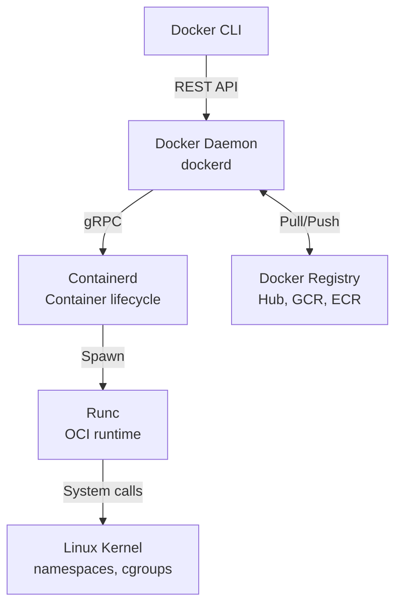

# Docker Interview Questions (50+ Detailed Q&A)

## 1. Fundamentals & Architecture

<AccordionGroup>
<Accordion title="1. VM vs Container">
**Answer**:
*   **VM**: Hardware virtualization. Has Guest OS (Heavy). Isolation: Hypervisor level.
*   **Container**: OS Virtualization. Shares Host Kernel (Light). Isolation: Namespaces & Cgroups.
</Accordion>

<Accordion title="2. Docker Architecture Components">
**Answer**:
*   **Daemon (dockerd)**: Background process. Manages objects.
*   **Client (docker)**: CLI. Sends API requests to Daemon.
*   **Registry**: Stores images (Hub, GCR).
*   **Containerd**: High-level runtime (Manages lifecycle).
*   **Runc**: Low-level runtime (Spawns container using Kernel APIs).



**Image Pull Flow**:
1. `docker pull nginx` → CLI sends request to Daemon
2. Daemon queries Registry for manifest
3. Downloads layers (parallel)
4. Stores in local cache (`/var/lib/docker`)

**Container Creation Flow**:
1. `docker run` → Daemon creates container config
2. Containerd prepares filesystem (union mount)
3. Runc creates namespaces and cgroups
4. Runc executes entrypoint process
</Accordion>

<Accordion title="3. Image Layers (Union File System)">
**Answer**:
Images are read-only layers.
Each instruction (`RUN`, `COPY`) creates a layer.
**CoW (Copy on Write)**: If a container wants to modify a file from the image, it copies it up to the Writable Layer first.
</Accordion>

<Accordion title="4. Dockerfile: COPY vs ADD">
**Answer**:
*   `COPY`: Local file -> Container. (Preferred).
*   `ADD`: Can extract tarballs (`add file.tar.gz`) and download URLs. (Security risk if downloading from internet).
</Accordion>

<Accordion title="5. ENTRYPOINT vs CMD">
**Answer**:
*   `ENTRYPOINT`: The executable to run. (Not easily overridden).
*   `CMD`: Default arguments to the ENTRYPOINT. (Easily overridden).
**Pattern**: `ENTRYPOINT ["npm"]`, `CMD ["start"]`.
</Accordion>

<Accordion title="6. What happens when you run `docker run`?">
**Answer**:
1.  Check local cache for image.
2.  If missing, pull from Registry.
3.  Create new container (`runc`).
4.  Allocate File System (RW layer).
5.  Assign IP (Bridge).
6.  Execute entry process.
</Accordion>

<Accordion title="7. Detached vs Interactive Mode">
**Answer**:
*   `b -d`: Detached (Background).
*   `b -it`: Interactive TTY (Shell access).
</Accordion>

<Accordion title="8. Docker Context">
**Answer**:
Switching the CLI to talk to a different Daemon (e.g., Remote Server, Minikube).
`docker context use my-remote-server`.
</Accordion>

<Accordion title="9. Image vs Container">
**Answer**:
*   Image: Class (Blueprint). Read-only.
*   Container: Object (Instance). Read-Write.
</Accordion>

<Accordion title="10. Multi-Architecture Builds">
**Answer**:
`docker buildx`.
Builds images for amd64 and arm64 (M1 Mac) simultaneously using QEMU emulation.
Manifest list points to correct hash for arch.
</Accordion>
</AccordionGroup>

## 2. Networking & Storage

<AccordionGroup>
<Accordion title="11. Docker Network Drivers">
**Answer**:
1.  **Bridge** (Default): Private network. NAT. Port Mapping required.
2.  **Host**: Shares Host IP. Fast. No port mapping.
3.  **None**: No network.
4.  **Overlay**: Cross-host (Swarm/K8s).
5.  **Macvlan**: Container gets real physical MAC address on LAN.
</Accordion>

<Accordion title="12. How Bridge Network works (Internals)">
**Answer**:
Creates `docker0` bridge (virtual switch).
Creates `veth` pair (virtual cable). One end in Container (`eth0`), one on Bridge (`vethXXX`).
Uses **IP Tables** for NAT (Masquerading) to allow outgoing traffic.
</Accordion>

<Accordion title="13. Container to Container Communication">
**Answer**:
*   **Same Bridge**: By IP or Container Name (if using User-defined Bridge).
*   **Different Bridge**: Cannot communicate by default.
*   **Legacy**: `--link` (Deprecated).
</Accordion>

<Accordion title="14. Exposing Ports (`-p`)">
**Answer**:
`-p 8080:80`.
Maps Host Port 8080 to Container Port 80.
Traffic -> Host IP:8080 -> Docker Proxy -> Container IP:80.
</Accordion>

<Accordion title="15. Volumes vs Bind Mounts">
**Answer**:
*   **Volume**: Managed by Docker (`/var/lib/docker/volumes`). Best for data persistence.
*   **Bind Mount**: Maps arbitrary host path (`/home/user/code`) to container. Best for Dev (Live reload).
</Accordion>

<Accordion title="16. Tmpfs Mount">
**Answer**:
Stored in Host Memory (RAM). Never written to disk.
Good for secrets or high-speed cache. Lost on stop.
</Accordion>

<Accordion title="17. Dangling Images/Volumes">
**Answer**:
*   **Dangling Image**: `<none>:<none>`. Result of overwriting a tag (building v1 again).
*   **Dangling Volume**: Volume not attached to any container.
*   **Cleanup**: `docker system prune`.
</Accordion>

<Accordion title="18. DNS in Docker">
**Answer**:
Docker runs an embedded DNS server (`127.0.0.11`).
Resolves container names to IPs within User-defined networks.
Default bridge does NOT support name resolution (Legacy).
</Accordion>

<Accordion title="19. IPv6 Support">
**Answer**:
Disabled by default. Must enable in `daemon.json`.
</Accordion>

<Accordion title="20. Backup/Restore Volume">
**Answer**:
Run a temporary container mounting the volume AND a local folder.
`tar` the volume content to the local folder.
</Accordion>
</AccordionGroup>

## 3. Best Practices & Optimization

<AccordionGroup>
<Accordion title="21. Minimize Image Size">
**Answer**:
1.  Use `alpine` base.
2.  Multi-stage builds (Discard build tools).
3.  Combine `RUN` commands (One layer).
4.  Remove cache (`apt-get clean`).
5.  `.dockerignore`.
</Accordion>

<Accordion title="22. Layer Caching">
**Answer**:
Docker caches intermediate layers.
If a line changes, cache for that line + ALL following lines is broken.
**Pattern**: Copy `package.json` -> Install -> Copy Source. (Prevents re-installing npm modules when code changes).
</Accordion>

<Accordion title="23. Multi-Stage Builds">
**Answer**:
```dockerfile
FROM node AS builder
RUN npm run build
FROM nginx
COPY --from=builder /app/dist /html
```
Result: Tiny generic Nginx image with just static files.

**Real-World Example with Size Comparison**:
```dockerfile
# Single-stage (BAD): 1.2GB
FROM node:18
WORKDIR /app
COPY package*.json ./
RUN npm install  # Includes dev dependencies!
COPY . .
RUN npm run build
CMD ["npm", "start"]

# Multi-stage (GOOD): 150MB
FROM node:18 AS builder
WORKDIR /app
COPY package*.json ./
RUN npm install
COPY . .
RUN npm run build

# Production stage
FROM node:18-alpine  # Smaller base
WORKDIR /app
COPY package*.json ./
RUN npm install --production  # Only prod dependencies
COPY --from=builder /app/dist ./dist
USER node  # Security: non-root
CMD ["node", "dist/server.js"]
```

**Benefits**:
1. **Size**: 87% smaller (1.2GB → 150MB)
2. **Security**: No build tools in production image
3. **Speed**: Faster pulls and deployments
4. **Secrets**: Build-time secrets don't leak to final image

**Advanced Pattern (Multiple Outputs)**:
```dockerfile
# Build stage
FROM golang:1.20 AS builder
WORKDIR /app
COPY . .
RUN go build -o server .

# Test stage (not included in final)
FROM builder AS tester
RUN go test ./...

# Production
FROM alpine:3.18
COPY --from=builder /app/server /server
ENTRYPOINT ["/server"]

# Build with: docker build --target=tester .  (runs tests)
# Build with: docker build .  (production image)
```
</Accordion>

<Accordion title="24. Handling PID 1 (Init Process)">
**Answer**:
If app runs as PID 1, it might not handle Signals (SIGTERM) correctly (Won't exit gracefully).
**Fix**: Use `tini` (`--init` flag) or `dumb-init` as entrypoint.
</Accordion>

<Accordion title="25. Non-Root User">
**Answer**:
Default is Root (Security risk).
Create user in Dockerfile:
`RUN adduser -D myuser`
`USER myuser`
</Accordion>

<Accordion title="26. Health Checks">
**Answer**:
`HEALTHCHECK CMD curl -f http://localhost/ || exit 1`.
Daemon polls container. Status becomes `unhealthy`.
</Accordion>

<Accordion title="27. .dockerignore">
**Answer**:
Exclude `node_modules`, `.git`, `.env`, `Dockerfile`.
Reduces build context size (Faster upload to daemon).
Prevents leaking secrets.
</Accordion>

<Accordion title="28. Tagging Strategy">
**Answer**:
Don't use `latest` (Unpredictable).
Use Semantic Versioning (`v1.0.1`) or Commit SHA.
</Accordion>

<Accordion title="29. ARG vs ENV">
**Answer**:
*   `ARG`: Available during Build time only.
*   `ENV`: Available during Run time (and Build time).
</Accordion>

<Accordion title="30. Flattening Images">
**Answer**:
`docker export` -> `docker import`.
Merges all layers into one. Loses history. Good for distribution size.
</Accordion>
</AccordionGroup>

## 4. Troubleshooting & Operations

<AccordionGroup>
<Accordion title="31. Docker Exec">
**Answer**:
Spawns a new process inside running container.
`docker exec -it <id> /bin/sh`.
Debug files/network inside.
</Accordion>

<Accordion title="32. Logs">
**Answer**:
`docker logs -f <id>`.
Reads from STDOUT/STDERR.
**Driver**: Default `json-file`. Can change to `syslog`, `awslogs`.
</Accordion>

<Accordion title="33. Inspect">
**Answer**:
`docker inspect <id>`.
Returns big JSON: IP address, Env vars, Mounts, State (OOMKilled?).
</Accordion>

<Accordion title="34. Container Exits Immediately">
**Answer**:
The main process finished.
(e.g., used `CMD ["echo", "hi"]` -> Prints hi -> Exits).
**Fix**: Must run a foreground process (Web server).
</Accordion>

<Accordion title="35. Connection Refused (Localhost)">
**Answer**:
App listening on `127.0.0.1` inside container.
**Fix**: Must listen on `0.0.0.0` to accept traffic from outside (Host).
</Accordion>

<Accordion title="36. OOMKilled">
**Answer**:
Exit Code 137.
Container exceeded RAM limit.
Check `docker stats`.
</Accordion>

<Accordion title="37. Pruning">
**Answer**:
`docker system prune -a`.
Dangerous. Deletes stopped containers, unused networks, and unused images.
</Accordion>

<Accordion title="38. Docker Events">
**Answer**:
`docker events`.
Stream of real-time server actions (create, die, pull).
Good for monitoring tools.
</Accordion>

<Accordion title="39. Stats">
**Answer**:
`docker stats`.
Live stream of CPU/RAM/Net I/O usage per container.
</Accordion>

<Accordion title="40. Restart Policies">
**Answer**:
*   `no` (Default).
*   `always` (Even if manually stopped? No, only on crash/daemon restart).
*   `on-failure` (Only if exit code != 0).
*   `unless-stopped`.
</Accordion>
</AccordionGroup>

## 5. Security & Ecosystem

<AccordionGroup>
<Accordion title="41. Namespaces">
**Answer**:
Kernel feature providing Isolation.
*   `PID`: Process IDs.
*   `NET`: Networking.
*   `MNT`: Filesystem.
*   `User`: User IDs.
</Accordion>

<Accordion title="42. Cgroups (Control Groups)">
**Answer**:
Kernel feature providing Resource Limiting.
Restricts CPU, RAM, Disk I/O per container.
</Accordion>

<Accordion title="43. Docker Socket Security">
**Answer**:
Mounting `/var/run/docker.sock` lets container control the Host Docker Daemon.
**Risk**: Container can delete host containers, spawn privileged containers (Root on host).
**Avoid unless necessary** (CI/CD agents).
</Accordion>

<Accordion title="44. Privileged Mode">
**Answer**:
`--privileged`. Gives container all Capabilities (Root on Host). Access to devices (`/dev`).
**Security Nightmare**.
</Accordion>

<Accordion title="45. Content Trust (Notary)">
**Answer**:
Signing images.
`export DOCKER_CONTENT_TRUST=1`.
Only run signed images.
</Accordion>

<Accordion title="46. Docker Compose">
**Answer**:
Tool for defining multi-container apps (`docker-compose.yml`).
Services, Networks, Volumes.
One command startup (`up`).
</Accordion>

<Accordion title="47. Docker Swarm">
**Answer**:
Docker's native orchestration (built-in).
Simpler than K8s. Manager/Worker nodes. Overlay network.
Mostly superseded by K8s.
</Accordion>

<Accordion title="48. Podman vs Docker">
**Answer**:
*   **Podman**: Daemonless. Rootless by default. OCI Compliant.
*   **Docker**: Daemon required. Root by default.
</Accordion>

<Accordion title="49. Distroless Images">
**Answer**:
Google images containing ONLY application dependencies. NO Shell. NO Package manager.
Hard to debug, but very secure.
</Accordion>

<Accordion title="50. Seccomp Profiles">
**Answer**:
Secure Computing Mode. Whitelist syscalls container can make to Kernel.
Blocks `reboot()`, `swapoff()`, etc.
</Accordion>
</AccordionGroup>

## 5. Docker Medium Level Questions

<AccordionGroup>
<Accordion title="41. Docker Compose Services">
**Answer**:
```yaml
version: '3.8'
services:
  web:
    image: nginx
    ports:
      - "8080:80"
    depends_on:
      - db
  db:
    image: postgres:14
    environment:
      POSTGRES_PASSWORD: secret
    volumes:
      - db-data:/var/lib/postgresql/data

volumes:
  db-data:
```
</Accordion>

<Accordion title="42. Docker Compose Networks">
**Answer**:
```yaml
services:
  frontend:
    networks:
      - frontend-net
  backend:
    networks:
      - frontend-net
      - backend-net
  database:
    networks:
      - backend-net

networks:
  frontend-net:
  backend-net:
```
</Accordion>

<Accordion title="43. Environment Variables">
**Answer**:
```yaml
# docker-compose.yml
services:
  app:
    environment:
      - NODE_ENV=production
      - API_KEY=${API_KEY}
    env_file:
      - .env
```

```bash
# .env file
API_KEY=secret123
DATABASE_URL=postgres://localhost/db
```
</Accordion>

<Accordion title="44. Health Checks">
**Answer**:
```dockerfile
HEALTHCHECK --interval=30s --timeout=3s --retries=3 \
  CMD curl -f http://localhost/ || exit 1
```

```yaml
# docker-compose.yml
services:
  web:
    healthcheck:
      test: ["CMD", "curl", "-f", "http://localhost"]
      interval: 30s
      timeout: 3s
      retries: 3
```
</Accordion>

<Accordion title="45. Build Args vs ENV">
**Answer**:
```dockerfile
# ARG: build-time only
ARG NODE_VERSION=18
FROM node:${NODE_VERSION}

# ENV: runtime available
ENV NODE_ENV=production
ENV PORT=3000
```
</Accordion>

<Accordion title="46. Docker Registry">
**Answer**:
```bash
# Tag image
docker tag myapp:latest registry.example.com/myapp:v1.0

# Push
docker push registry.example.com/myapp:v1.0

# Pull
docker pull registry.example.com/myapp:v1.0
```
</Accordion>

<Accordion title="47. Docker Prune">
**Answer**:
```bash
# Remove unused images
docker image prune -a

# Remove stopped containers
docker container prune

# Remove unused volumes
docker volume prune

# Remove everything
docker system prune -a --volumes
```
</Accordion>

<Accordion title="48. Container Logs">
**Answer**:
```bash
# View logs
docker logs container-name

# Follow logs
docker logs -f container-name

# Last 100 lines
docker logs --tail 100 container-name

# With timestamps
docker logs -t container-name
```
</Accordion>

<Accordion title="49. Docker Stats">
**Answer**:
```bash
# Real-time stats
docker stats

# Specific container
docker stats container-name

# Format output
docker stats --format "table {{.Name}}\t{{.CPUPerc}}\t{{.MemUsage}}"
```
</Accordion>

<Accordion title="50. Docker Inspect">
**Answer**:
```bash
# Full details
docker inspect container-name

# Specific field
docker inspect -f '{{.NetworkSettings.IPAddress}}' container-name

# Multiple containers
docker inspect $(docker ps -q)
```
</Accordion>
</AccordionGroup>

## 6. Docker Advanced Level Questions

<AccordionGroup>
<Accordion title="51. Multi-Architecture Builds">
**Answer**:
```bash
# Enable buildx
docker buildx create --use

# Build for multiple platforms
docker buildx build --platform linux/amd64,linux/arm64 \
  -t myapp:latest --push .
```
</Accordion>

<Accordion title="52. BuildKit Cache Mounts">
**Answer**:
```dockerfile
# syntax=docker/dockerfile:1
FROM node:18

# Cache npm packages
RUN --mount=type=cache,target=/root/.npm \
    npm install

# Cache apt packages
RUN --mount=type=cache,target=/var/cache/apt \
    apt-get update && apt-get install -y python3
```
</Accordion>

<Accordion title="53. Docker Content Trust">
**Answer**:
```bash
# Enable signing
export DOCKER_CONTENT_TRUST=1

# Push signed image
docker push myapp:latest

# Pull only signed images
docker pull myapp:latest
```
</Accordion>

<Accordion title="54. User Namespaces">
**Answer**:
```json
// /etc/docker/daemon.json
{
  "userns-remap": "default"
}
```

**Benefit**: Root in container maps to non-root on host.
</Accordion>

<Accordion title="55. AppArmor Profiles">
**Answer**:
```bash
# Run with profile
docker run --security-opt apparmor=docker-default nginx

# Custom profile
docker run --security-opt apparmor=my-profile nginx
```
</Accordion>

<Accordion title="56. Resource Constraints">
**Answer**:
```bash
docker run \
  --cpus="1.5" \
  --memory="512m" \
  --memory-swap="1g" \
  --pids-limit=100 \
  nginx
```
</Accordion>

<Accordion title="57. Docker Swarm Mode">
**Answer**:
```bash
# Initialize swarm
docker swarm init

# Deploy stack
docker stack deploy -c docker-compose.yml myapp

# Scale service
docker service scale myapp_web=5

# Update service
docker service update --image nginx:latest myapp_web
```
</Accordion>

<Accordion title="58. Docker Secrets">
**Answer**:
```bash
# Create secret
echo "my-secret" | docker secret create db_password -

# Use in service
docker service create \
  --secret db_password \
  --env DB_PASSWORD_FILE=/run/secrets/db_password \
  myapp
```
</Accordion>

<Accordion title="59. Distroless Images">
**Answer**:
```dockerfile
FROM golang:1.20 AS builder
WORKDIR /app
COPY . .
RUN CGO_ENABLED=0 go build -o app

FROM gcr.io/distroless/static
COPY --from=builder /app/app /app
ENTRYPOINT ["/app"]
```

**Benefits**: Smaller size, fewer vulnerabilities.
</Accordion>

<Accordion title="60. Docker Socket Security">
**Answer**:
```bash
# Avoid mounting Docker socket
# BAD:
docker run -v /var/run/docker.sock:/var/run/docker.sock app

# GOOD: Use Docker API with TLS
docker run --env DOCKER_HOST=tcp://docker:2376 \
  --env DOCKER_TLS_VERIFY=1 app
```
</Accordion>
</AccordionGroup>
