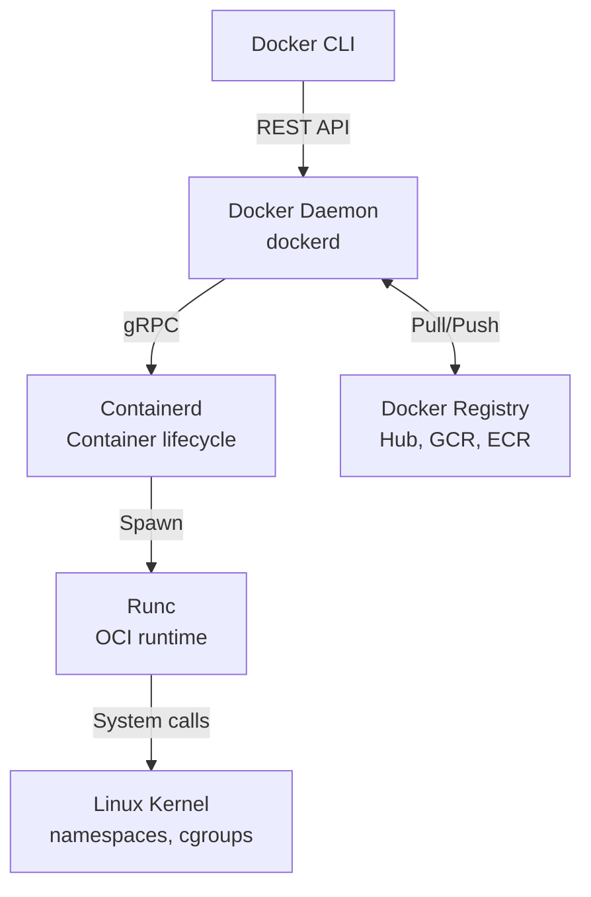

# Docker Interview Questions (70+ Detailed Q&A)

<Note>
**Senior vs Staff -- What This Section Tests At Each Level**

**Senior Engineer**: Builds and ships production containers daily. Writes efficient multi-stage Dockerfiles, debugs networking and OOM issues, sets up CI image builds, and configures health checks. Understands layer caching, security basics (non-root, minimal images), and can troubleshoot a failing container at 3 AM.

**Staff Engineer**: Defines container standards and image governance for the entire organization. Owns the base image strategy (approved bases, scanning policies, digest pinning), registry architecture (pull-through caches, replication, RBAC), build infrastructure (BuildKit remote builders, cross-platform strategy), and runtime security posture (seccomp profiles, rootless enforcement, image signing with cosign). Makes decisions that affect 50+ engineers and 100+ services.
</Note>

## 1. Fundamentals & Architecture

<AccordionGroup>
<Accordion title="1. VM vs Container">
**Answer**:

This is one of the most fundamental questions in Docker interviews, and the interviewer wants to see that you understand the isolation boundary difference -- not just "containers are lighter."

| Feature | Virtual Machine | Container |
| :--- | :--- | :--- |
| **Virtualization level** | Hardware (hypervisor emulates CPU, memory, I/O) | OS-level (shares host kernel directly) |
| **Isolation mechanism** | Hypervisor (Type 1: bare-metal like ESXi, KVM; Type 2: hosted like VirtualBox) | Linux namespaces (PID, NET, MNT, UTS, IPC, USER) + cgroups (resource limits) |
| **Guest OS** | Full OS per VM (kernel + userland) -- each VM boots its own kernel | No guest OS -- containers share the host kernel and only package userland (libs + app) |
| **Size** | Typically 1-40 GB per VM image | Typically 5-500 MB per container image |
| **Boot time** | 30 seconds to several minutes | Milliseconds to a few seconds |
| **Density** | ~10-50 VMs per host (limited by memory for each guest OS) | ~100-1000+ containers per host |
| **Security isolation** | Stronger -- separate kernel per VM means kernel exploits are contained | Weaker by default -- a kernel vulnerability affects all containers on the host |

**The deeper story**: Containers achieve their lightweight nature by leveraging two Linux kernel features. **Namespaces** give each container its own view of the system -- its own process tree (PID namespace), network stack (NET namespace), filesystem mounts (MNT namespace), hostname (UTS namespace), and user IDs (USER namespace). **Cgroups** (control groups) limit and account for resource usage -- CPU, memory, disk I/O, and network bandwidth per container.

**When VMs are still the right call**: Multi-tenant environments where you cannot trust workloads (different customers on the same hardware), running different OS kernels (Windows containers on a Linux host need a VM), or regulatory requirements that mandate hardware-level isolation (some financial and healthcare compliance standards).

**Real-world hybrid**: In production, most companies run containers *inside* VMs. AWS ECS runs your Docker containers on EC2 instances (VMs). GKE runs Kubernetes pods on Compute Engine VMs. The VM provides the security boundary between tenants; containers provide the density and speed within that boundary.

**What interviewers are really testing:** Whether you understand that the isolation trade-off is the fundamental difference -- containers sacrifice some isolation for speed and density. Senior candidates mention namespaces and cgroups by name.

**Red flag answer:** "Containers are lightweight VMs." They are not -- they share the host kernel, which is a fundamentally different architecture with different security implications.

**Follow-up chain:**
1. *"You said containers share the host kernel. What specific attack vector does that create that VMs do not have?"* (A kernel exploit like Dirty Pipe (CVE-2022-0847) in the shared kernel affects every container on the host. In a VM, the kernel is per-VM so a guest kernel exploit is contained. This is why multi-tenant SaaS platforms run containers inside VMs -- the VM is the trust boundary, containers are the density mechanism.)
2. *"If containers share the kernel, how can you run a Linux container on macOS or Windows?"* (You cannot -- Docker Desktop runs a lightweight Linux VM (using Apple's Virtualization.framework on macOS or WSL2/Hyper-V on Windows) and runs containers inside that VM. The container still uses a Linux kernel, just one provided by the hidden VM.)
3. *"When would you choose Kata Containers or gVisor over standard runc-based containers?"* (When you need stronger isolation than namespaces but lighter weight than full VMs. gVisor intercepts syscalls in userspace via a custom kernel. Kata Containers spawn a lightweight VM per pod. Both are used in multi-tenant environments -- GKE Sandbox uses gVisor, AWS Fargate uses Firecracker microVMs.)
4. *"Your security team says containers are not secure enough for PCI-DSS workloads. How do you respond?"* (Defense-in-depth: non-root user + read-only root filesystem + seccomp profiles + AppArmor/SELinux + USER namespace remapping + running containers inside VMs. Many PCI-DSS compliant systems run containers -- the requirement is demonstrating equivalent isolation, not using VMs specifically. Reference the CIS Docker Benchmark.)
</Accordion>

<Accordion title="2. Docker Architecture Components">
**Answer**:

Docker uses a client-server architecture with several distinct components, each with a specific role in the container lifecycle. Understanding this layering is critical for debugging and for understanding why Docker can be replaced piece by piece (e.g., swapping runc for gVisor, or Docker CLI for nerdctl).

*   **Daemon (`dockerd`)**: The long-running background process that manages all Docker objects (containers, images, networks, volumes). It exposes a REST API on a Unix socket (`/var/run/docker.sock`) or optionally over TCP. Every `docker` CLI command translates to an API call to this daemon.
*   **Client (`docker`)**: The CLI binary. It serializes your command into an HTTP request and sends it to the daemon. The client and daemon can run on different machines -- this is the basis for Docker contexts and remote management.
*   **Registry**: A stateless server that stores and distributes Docker images. Docker Hub is the default public registry; private options include AWS ECR, GCP Artifact Registry, Azure ACR, and self-hosted Harbor. Images are stored as layers (blobs) plus a manifest that describes how to assemble them.
*   **Containerd**: The high-level container runtime. It manages the complete container lifecycle -- image pull/push, container creation, storage, and networking setup. Containerd is a graduated CNCF project and is used directly by Kubernetes (bypassing the Docker daemon entirely since Kubernetes 1.24).
*   **Runc**: The low-level OCI runtime. It is a small binary that takes a container configuration (OCI spec) and uses Linux kernel APIs (namespaces, cgroups) to actually create the isolated process. Alternatives to runc include `gVisor` (Google's sandboxed runtime) and `Kata Containers` (lightweight VMs).


```mermaid
graph TD
    CLI[Docker CLI]
    Daemon[Docker Daemon<br/>dockerd]
    Containerd[Containerd<br/>Container lifecycle]
    Runc[Runc<br/>OCI runtime]
    Kernel[Linux Kernel<br/>namespaces, cgroups]
    Registry[Docker Registry<br/>Hub, GCR, ECR]
    
    CLI -->|REST API| Daemon
    Daemon -->|gRPC| Containerd
    Containerd -->|Spawn| Runc
    Runc -->|System calls| Kernel
    Daemon <-->|Pull/Push| Registry
```

**Image Pull Flow**:
1. `docker pull nginx` -- CLI sends REST request to Daemon
2. Daemon queries Registry for the image manifest (JSON doc listing layers and their SHA256 digests)
3. Downloads layers in parallel, skipping any that already exist in local cache (content-addressable storage)
4. Stores layers in `/var/lib/docker/overlay2/` (on overlay2 storage driver)

**Container Creation Flow**:
1. `docker run` -- Daemon creates a container config (OCI spec JSON)
2. Containerd prepares the filesystem -- assembles the union mount from image layers + writable layer
3. Runc creates namespaces (PID, NET, MNT, UTS, IPC, USER) and cgroup for resource limits
4. Runc executes the entrypoint process as PID 1 inside the new namespaces

**Why this layering matters**: Since Kubernetes 1.24, the "dockershim" was removed. Kubernetes talks directly to containerd (or CRI-O), bypassing dockerd entirely. This means your production containers in K8s are not running "Docker" -- they are running containerd + runc. Docker is a development tool on top of the same runtime Kubernetes uses.

**What interviewers are really testing:** Whether you understand that Docker is not a monolith -- it is a stack of components, each replaceable. Senior candidates explain the containerd/runc split and mention that Kubernetes dropped Docker as a runtime (but still uses the same underlying tech).

**Red flag answer:** Describing Docker as a single program that "runs containers." Not knowing that containerd and runc exist, or confusing the Docker daemon with the container runtime.

**Follow-up:**
1. *"Kubernetes removed dockershim in 1.24. Does that mean Docker images stop working in Kubernetes?"* (No. Docker images are OCI-compliant. Kubernetes removed the Docker daemon dependency, not the image format. containerd pulls and runs the same images.)
2. *"If the Docker daemon crashes, do running containers die?"* (With containerd's `--live-restore` and Docker's `live-restore` daemon option, containers continue running even if dockerd restarts. This is critical for production upgrades.)
3. *"When would you replace runc with an alternative runtime like gVisor?"* (Multi-tenant environments where you need stronger isolation than Linux namespaces -- gVisor intercepts syscalls in userspace, adding a security boundary without the overhead of full VMs.)
</Accordion>

<Accordion title="3. Image Layers (Union File System)">
**Answer**:

Docker images are built as a stack of **read-only layers**, where each Dockerfile instruction (`RUN`, `COPY`, `ADD`) creates a new layer. These layers are stored and managed using a **Union File System** (OverlayFS on modern Linux, formerly AUFS).

**How layers work internally**:
1. Each layer is a filesystem diff -- it contains only the files that changed from the previous layer.
2. When you `docker pull`, layers are downloaded independently and cached by their content hash (SHA256). If two images share the same base layer (e.g., both use `node:18-alpine`), that layer is stored only once on disk.
3. When a container starts, Docker stacks all image layers (read-only) and adds a thin **writable layer** (also called the container layer) on top.

**Copy-on-Write (CoW)**: If a running container modifies a file that exists in a read-only image layer, the file is first copied up to the writable layer, then modified there. The original image layer is untouched. This means 100 containers from the same image share all read-only layers -- only their individual writes consume additional disk space.

**Practical implications**:
- **Layer ordering matters for cache**: Docker caches layers by instruction. If you change line 5 of a Dockerfile, layers 1-4 are cached but lines 5+ are rebuilt. This is why you `COPY package.json` and `RUN npm install` *before* `COPY . .` -- so dependency installation is cached when only source code changes.
- **Layer count affects pull time**: Each layer is a separate download. Combining `RUN` commands with `&&` reduces layer count and total image size (intermediate files created and deleted in the same `RUN` are never stored).
- **Size debugging**: `docker history <image>` shows each layer's size, which helps identify bloated layers.

**What interviewers are really testing:** Whether you understand that images are not monolithic blobs -- they are composable, cacheable layer stacks. This understanding directly impacts how you write efficient Dockerfiles.

**Red flag answer:** Not knowing that each Dockerfile instruction creates a layer, or not understanding why layer ordering affects build speed.

**Follow-up chain:**
1. *"You mentioned Copy-on-Write. A container writes 1 byte to a 500MB file that exists in the base image layer. How much additional disk space does this consume?"* (The entire 500MB file is copied to the writable layer, then the 1 byte is modified. CoW operates at the file level on overlay2, not at the block level. This is why writing to large files inside containers is expensive -- and why databases should always use volumes, not the container's writable layer.)
2. *"How does `docker history` differ from `docker image inspect` for debugging layer sizes?"* (`docker history` shows each layer's instruction and size but uses the compressed size. `docker image inspect` shows the full config and layer digests. For the most accurate size breakdown, use `dive` -- an open-source tool that shows file-level changes per layer and detects wasted space.)
3. *"Two teams both use `FROM node:18-alpine`. Team A's image is 400MB, Team B's is 180MB. Same base, same app framework. What is the most likely cause?"* (Team A is probably installing dev dependencies (`npm install` instead of `npm ci --production`), copying test fixtures or documentation into the image, or running `apt-get`/`apk` installs without cleanup. The base image is shared but everything above it differs.)
</Accordion>

<Accordion title="4. Dockerfile: COPY vs ADD">
**Answer**:

Both instructions copy files into the image, but they have different capabilities and the best practice is to **default to `COPY` unless you specifically need `ADD`'s extra features**.

*   **`COPY`**: Copies files or directories from the build context (your local filesystem) into the image. Does exactly what it says -- nothing more. Predictable and transparent.
    ```dockerfile
    COPY package.json /app/
    COPY src/ /app/src/
    ```

*   **`ADD`**: Does everything `COPY` does, plus two extra behaviors:
    1. **Auto-extracts compressed archives**: `ADD app.tar.gz /app/` automatically extracts the tarball into `/app/`. Supports tar, gzip, bzip2, and xz.
    2. **Downloads from URLs**: `ADD https://example.com/file.txt /app/` fetches the file. However, this is discouraged because it creates a layer that cannot be cached reliably, and you cannot verify checksums inline.

**Why `COPY` is preferred**: Docker's own best practices documentation recommends `COPY` because its behavior is explicit and predictable. `ADD`'s implicit extraction can cause surprises -- if you `ADD archive.tar.gz /data/` intending to place the archive file itself, you get extracted contents instead. For URL downloads, `RUN curl -O` gives you more control (you can verify checksums, set permissions, and clean up in the same layer).

**When `ADD` is appropriate**: When you specifically want auto-extraction of a local tarball into the image. This is the one legitimate use case.

**What interviewers are really testing:** Whether you follow Docker best practices and understand the principle of least surprise in Dockerfile instructions.

**Follow-up chain:**
1. *"A developer uses `ADD https://example.com/config.json /app/config.json` in a Dockerfile. Beyond the caching issue, what security concern does this create?"* (No checksum verification -- if the URL is compromised or MITM'd, you bake a malicious file into the image with no audit trail. With `RUN curl`, you can verify a SHA256 checksum inline: `curl -o file.tar.gz URL && echo "expected_sha256 file.tar.gz" | sha256sum -c -`.)
2. *"Does `COPY --from=builder /app/dist /html` work for copying between multi-stage build stages? Is it `COPY` or `ADD`?"* (Only `COPY` supports `--from`. This is another reason to default to `COPY` -- it has capabilities that `ADD` does not in the multi-stage context.)
</Accordion>

<Accordion title="5. ENTRYPOINT vs CMD">
**Answer**:

These two instructions work together to define what runs when a container starts, but they serve different roles and interact in specific ways.

*   **`ENTRYPOINT`**: Defines the **executable** that always runs. It is the fixed part of the command. To override it, you must use `docker run --entrypoint`. In practice, this means ENTRYPOINT defines *what program runs*.
*   **`CMD`**: Provides **default arguments** to the ENTRYPOINT. These are easily overridden by appending arguments to `docker run`. CMD defines *how the program runs by default*.

**The interaction pattern**:
```dockerfile
ENTRYPOINT ["python"]
CMD ["app.py"]
```
- `docker run myimage` executes `python app.py`
- `docker run myimage test.py` executes `python test.py` (CMD overridden)
- `docker run --entrypoint bash myimage` executes `bash` (ENTRYPOINT overridden)

**Shell form vs Exec form**: Always use the exec form (JSON array syntax) for both. The shell form (`CMD npm start`) wraps your command in `/bin/sh -c`, which means your process runs as a child of the shell. This causes PID 1 signal-handling issues -- `SIGTERM` from `docker stop` goes to the shell, not your app, leading to a 10-second hard kill instead of graceful shutdown.

```dockerfile
# BAD: Shell form -- signals don't reach node process
CMD npm start

# GOOD: Exec form -- node process is PID 1 and receives signals
CMD ["node", "server.js"]
```

**Common production patterns**:
- **Web server**: `ENTRYPOINT ["node"]` + `CMD ["server.js"]` -- lets you run `docker run myimage --inspect server.js` for debugging
- **CLI tool**: `ENTRYPOINT ["aws"]` + `CMD ["help"]` -- container acts like the AWS CLI itself
- **Only CMD**: Many images skip ENTRYPOINT entirely and use only CMD. This is fine for simple cases where you want the entire command to be easily overridden.

**What interviewers are really testing:** Whether you understand the exec vs shell form distinction and can explain signal handling implications. The PID 1 issue is a real production concern that separates candidates who have actually debugged container shutdown behavior.

**Red flag answer:** "ENTRYPOINT cannot be overridden." It can, with `--entrypoint`. Also, not knowing the shell form vs exec form distinction.

**Follow-up chain:**
1. *"Your container takes exactly 10 seconds to stop with `docker stop`. What is happening?"* (The process is not handling SIGTERM. Docker sends SIGTERM, waits the grace period (default 10s), then sends SIGKILL. This is the shell form vs exec form issue -- if CMD uses shell form, SIGTERM goes to `/bin/sh`, not your app. Or the app simply has no SIGTERM handler.)
2. *"Can you have both ENTRYPOINT and CMD specified, where ENTRYPOINT comes from the base image and CMD from your Dockerfile?"* (Yes. This is a common pattern -- the base image sets the ENTRYPOINT and your Dockerfile overrides CMD to provide different default arguments. `docker inspect` shows both, and you can trace which layer set each with `docker history`.)
3. *"What happens if you specify both CMD and ENTRYPOINT in shell form?"* (This is a trap. In shell form, CMD is completely ignored when ENTRYPOINT is set. Only the exec form (JSON array) allows CMD to append arguments to ENTRYPOINT. Shell form ENTRYPOINT runs `/bin/sh -c <entrypoint>` and CMD never gets invoked.)
</Accordion>

<Accordion title="6. What happens when you run `docker run`?">
**Answer**:

When you type `docker run nginx`, a surprisingly complex chain of events fires in rapid succession. Understanding this sequence is essential for debugging containers that fail to start or behave unexpectedly.

**The complete sequence:**
1. **CLI parses the command** -- The Docker client validates flags, serializes the request, and sends it to the Docker daemon via the REST API (`POST /containers/create` followed by `POST /containers/{id}/start`).
2. **Image resolution** -- The daemon checks if `nginx:latest` (or whatever tag) exists in the local image cache (`/var/lib/docker/overlay2/`). If not, it pulls from the configured registry (Docker Hub by default), downloading the manifest and then each layer in parallel.
3. **Container config creation** -- The daemon generates an OCI runtime specification: a JSON document defining the root filesystem, environment variables, namespace configuration, cgroup limits, mount points, and the entrypoint command.
4. **Filesystem assembly** -- Containerd creates a union mount: all image layers stacked read-only, with a thin writable (copy-on-write) layer on top. This is the container's root filesystem.
5. **Network setup** -- Docker creates a `veth` pair (virtual ethernet cable). One end goes inside the container's network namespace as `eth0`, the other attaches to the bridge network (`docker0` or a user-defined bridge). The embedded IPAM assigns an IP address. If `-p` was specified, iptables DNAT rules are added for port forwarding.
6. **Namespace creation** -- Runc creates Linux namespaces: PID (isolated process tree), NET (isolated network stack), MNT (isolated filesystem), UTS (isolated hostname), IPC (isolated shared memory), and optionally USER (UID remapping).
7. **Cgroup setup** -- Runc creates a cgroup for the container and applies resource limits (`--memory`, `--cpus`, `--pids-limit`).
8. **Process execution** -- Runc executes the entrypoint/CMD as PID 1 inside the new namespaces. The container is now running.

**Time breakdown**: Steps 1-8 take milliseconds to a few seconds (excluding image pull). This is why containers boot 100x faster than VMs -- there is no kernel to boot, no init system to start.

**What interviewers are really testing:** Whether you can trace the full lifecycle from CLI to kernel, not just parrot "it starts a container." Strong candidates mention namespaces, cgroups, the veth pair, and the union filesystem. This question also tests whether you can debug startup failures -- knowing the sequence tells you *where* to look.

**Red flag answer:** Only listing 3-4 high-level steps without any mention of namespaces, the writable layer, or network setup. Saying "Docker creates a VM" is an immediate red flag.

**Follow-up:**
1. *"Your `docker run` hangs for 45 seconds before starting. The image is already cached locally. What could cause this?"* (DNS resolution timeout if the daemon is trying to resolve the image tag against a slow/unreachable registry. Also possible: slow storage driver, exhausted IP pool on the bridge network, or iptables lock contention.)
2. *"What is the difference between `docker create` and `docker run`?"* (`docker create` does steps 1-4 only -- creates the container but does not start it. `docker start` then does steps 5-8. `docker run` is `create` + `start` combined.)
3. *"If you run `docker run --rm`, at what point is the container removed?"* (After the main process exits and the container stops. The `--rm` flag registers a cleanup hook that removes the container and its writable layer upon exit.)
</Accordion>

<Accordion title="7. Detached vs Interactive Mode">
**Answer**:

*   **`-d` (Detached)**: Runs the container in the background. The container starts and your terminal is immediately returned. Use this for long-running services (web servers, databases). You interact with it via `docker logs`, `docker exec`, or `docker attach`.
*   **`-it` (Interactive + TTY)**: Two flags combined. `-i` keeps STDIN open (you can type input), `-t` allocates a pseudo-TTY (gives you a formatted terminal). Together, they give you an interactive shell session inside the container. Use this for debugging, running one-off commands, or exploring an image's filesystem.

**Practical usage**:
```bash
# Run a web server in the background
docker run -d -p 8080:80 nginx

# Get a shell inside an Alpine image for debugging
docker run -it alpine /bin/sh

# Attach to a running container for debugging
docker exec -it <container_id> /bin/bash
```

**The subtlety**: `docker run -d` and then `docker exec -it` is the standard production debugging workflow. You never run production containers in interactive mode -- they always run detached. Interactive mode is a development and troubleshooting tool.

**What interviewers are really testing:** Whether you know the practical debugging workflow and understand that `-i` and `-t` are separate flags with distinct purposes. Bonus points for explaining when you would use `-i` without `-t` (piping data into a container) or `-t` without `-i` (getting formatted output without needing input).

**Red flag answer:** Confusing `-d` with backgrounding a process inside the container (like `CMD node server.js &`). Detached mode runs the container in the background; the process inside still runs in the foreground of its namespace.

**Follow-up:**
1. *"You run `docker run -d myapp` but the container exits immediately. `docker ps` shows nothing. How do you debug?"* (Use `docker ps -a` to see stopped containers, then `docker logs <id>` to see what the process printed before exiting. Check `docker inspect -f '{{.State.ExitCode}}' <id>` for the exit code.)
2. *"What is the difference between `docker attach` and `docker exec -it bash`?"* (`attach` connects to PID 1's STDIN/STDOUT -- if you press Ctrl+C, you send SIGINT to the main process and may stop the container. `exec` spawns a *new* process -- exiting the exec shell does not affect the main container process.)
</Accordion>

<Accordion title="8. Docker Context">
**Answer**:

A Docker context is a named configuration that tells the Docker CLI which Docker daemon to communicate with. By default, the CLI talks to the local daemon via a Unix socket (`/var/run/docker.sock`), but contexts let you switch targets seamlessly.

**Use cases**:
- **Remote server management**: `docker context create prod --docker "host=ssh://user@prod-server"` lets you run `docker ps` against your production host without SSH-ing in.
- **Minikube/Kind**: Switch between local Kubernetes clusters and the default Docker daemon.
- **Docker Desktop vs Colima**: On macOS, switch between different container runtimes.

```bash
docker context ls                          # List all contexts
docker context create staging --docker "host=ssh://deploy@staging.example.com"
docker context use staging                 # All subsequent commands target staging
docker ps                                  # Shows containers on staging server
docker context use default                 # Switch back to local
```

**Production relevance**: Contexts replace the older pattern of setting `DOCKER_HOST` environment variables, which was error-prone (forgetting you had it set could lead to accidentally running commands against production).

**What interviewers are really testing:** Whether you have managed Docker across multiple environments and understand the operational tooling beyond basic `docker run`. This question separates developers who only run Docker locally from those who manage remote Docker hosts.

**Red flag answer:** Not knowing Docker contexts exist, or confusing Docker contexts with Kubernetes contexts (`kubectl config use-context`). They are similar concepts but for different tools.

**Follow-up:**
1. *"You accidentally ran `docker rm -f $(docker ps -q)` while your context was set to production. How do you prevent this in the future?"* (Use context naming conventions with color-coded terminal prompts, require confirmation for destructive operations on production contexts, or use read-only socket proxies for production.)
2. *"How do Docker contexts differ from Kubernetes contexts, and can you use both simultaneously?"* (Docker contexts switch the Docker daemon target; K8s contexts switch the cluster/namespace. They are independent -- you can have Docker pointing at production while kubectl points at staging.)
</Accordion>

<Accordion title="9. Image vs Container">
**Answer**:

The class/object analogy is the simplest way to think about it, but the reality is more nuanced:

*   **Image**: A read-only, layered filesystem template. It contains everything needed to run an application -- OS libraries, runtime, application code, and configuration. Images are immutable and identified by a content-addressable hash (SHA256). You can think of it as a compiled binary that captures an entire runtime environment.
*   **Container**: A running (or stopped) instance of an image. It adds a thin **writable layer** on top of the image layers (using Copy-on-Write), plus an isolated process space with its own PID namespace, network stack, and filesystem view. Multiple containers can share the same image layers, each with their own writable layer.

**Key distinction**: An image is a build artifact; a container is a runtime entity. You `docker build` an image, `docker push` it to a registry, and `docker run` it to create a container. Images are portable and reproducible; containers are ephemeral and disposable.

**Practical implication**: This is why you should never store important data in a container's writable layer. When the container is removed, that layer is gone. Use volumes for persistent data. The container should be cattle (replaceable), not a pet (irreplaceable).

**What interviewers are really testing:** Whether you understand the immutability model -- images are immutable artifacts, containers are ephemeral processes. This mental model drives correct decisions about data persistence, deployment strategies, and debugging approaches.

**Red flag answer:** "An image is a stopped container" or "You save a container to create an image." While `docker commit` exists, using it is an anti-pattern -- images should be built from Dockerfiles for reproducibility, not by capturing container state.

**Follow-up:**
1. *"Can you modify a running container's filesystem and then create a new image from it? Should you?"* (Yes, `docker commit` does this. No, you should not -- it creates unreproducible images with no audit trail. Always use Dockerfiles.)
2. *"Two containers are running from the same image. Container A writes a file. Can Container B see it?"* (No. Each container has its own writable layer. The image layers are shared and read-only. To share data between containers, use a shared volume.)
</Accordion>

<Accordion title="10. Multi-Architecture Builds">
**Answer**:

With the rise of ARM-based servers (AWS Graviton, Apple M-series), building images for multiple CPU architectures is now a production requirement, not a niche concern.

**`docker buildx`** is the tool that makes this possible. It extends the standard `docker build` with multi-platform support.

**How it works**:
1. You create a buildx builder instance: `docker buildx create --use`
2. Build for multiple platforms in one command: `docker buildx build --platform linux/amd64,linux/arm64 -t myapp:latest --push .`
3. Docker uses **QEMU emulation** to build for architectures different from your host. An amd64 machine can build arm64 images (slowly) via QEMU user-mode emulation.
4. The result is a **manifest list** (also called a multi-arch manifest) -- a single tag (`myapp:latest`) that points to multiple platform-specific images. When a user pulls the image, Docker automatically selects the correct variant for their architecture.

**Performance note**: QEMU emulation is 5-10x slower than native builds. For CI pipelines building large images, use native ARM runners (GitHub Actions has `ubuntu-latest` on ARM, GitLab offers ARM runners) or cross-compilation in your build stage (Go's `GOARCH=arm64` compiles natively without emulation).

**Why this matters**: AWS Graviton instances are 20-40% cheaper than equivalent x86 instances. If your images only support amd64, you cannot take advantage of this cost saving. Multi-arch builds are table stakes for modern cloud deployments.
</Accordion>
</AccordionGroup>

## 2. Networking & Storage

<AccordionGroup>
<Accordion title="11. Docker Network Drivers">
**Answer**:

Docker provides five network drivers, each serving a different isolation and connectivity model:

| Driver | Scope | Use Case | Performance | Isolation |
| :--- | :--- | :--- | :--- | :--- |
| **Bridge** (default) | Single host | Standard container-to-container communication | Good (slight NAT overhead) | Containers are on a private subnet |
| **Host** | Single host | Performance-critical apps (eliminate NAT overhead) | Best (no network translation) | None -- container shares host's network stack entirely |
| **None** | Single host | Containers that need no network (batch jobs, security-sensitive compute) | N/A | Complete network isolation |
| **Overlay** | Multi-host | Swarm services or multi-host container communication | Moderate (VXLAN encapsulation overhead) | Encrypted cross-host communication |
| **Macvlan** | Single host | Containers that need to appear as physical devices on the LAN (legacy app integration) | Excellent (no NAT, no bridge) | Each container gets a real MAC and IP on the physical network |

**When to use each in practice**: Bridge is the default for 90% of single-host workloads. Host mode is for performance-critical services where NAT overhead matters. Overlay is for multi-node Swarm deployments. Macvlan is rare but useful for legacy apps that expect real network interfaces.

**What interviewers are really testing:** Whether you can recommend the right network driver for a given scenario, not just list them.

**Follow-up chain:**
1. *"Your application needs the absolute lowest possible network latency. You are currently using bridge networking. What do you change and what do you lose?"* (Switch to `--network host`. You eliminate NAT/bridge overhead, but lose port isolation -- two containers cannot both bind to port 80. You also lose the embedded DNS service for container name resolution. Measure the actual improvement; for most apps, the bridge overhead is &lt;0.1ms.)
2. *"You need containers across 3 hosts to communicate without Kubernetes. What network driver do you use and how?"* (Overlay network with Docker Swarm. `docker swarm init` on one host, join the others, create an overlay: `docker network create -d overlay mynet`. Under the hood, VXLAN encapsulates L2 frames in UDP for cross-host communication. Alternative: use a third-party CNI like Weave or Flannel without Swarm.)
3. *"A legacy application expects to have its own MAC address and appear directly on the physical LAN. Can Docker do this?"* (Yes -- Macvlan driver. Each container gets a unique MAC and IP on the physical network. The trade-off: the host cannot communicate with its own macvlan containers without a separate macvlan sub-interface, and you need the physical switch to accept multiple MACs per port.)

**What weak candidates say:** Memorize the five drivers as a list without understanding when or why to pick each one. Cannot explain what VXLAN is or why overlay has performance overhead.

**What strong candidates say:** "The way I think about it is: bridge is your default for single-host, overlay for multi-host Swarm, host for latency-sensitive workloads where you trade isolation for speed, and macvlan for the rare legacy case. In practice, 95% of my containers run on user-defined bridges."
</Accordion>

<Accordion title="12. How Bridge Network works (Internals)">
**Answer**:

Understanding bridge networking internals is what separates someone who uses Docker from someone who can debug Docker networking issues at 2 AM.

**Step by step, what Docker creates**:
1. **`docker0` bridge**: When Docker starts, it creates a virtual Ethernet bridge called `docker0` (or a custom name for user-defined networks). Think of this as a virtual network switch that all containers on this network plug into.
2. **`veth` pair**: For each container, Docker creates a virtual Ethernet pair -- a "virtual cable" with two ends. One end (`eth0`) is placed inside the container's network namespace. The other end (`vethXXXXX`) is attached to the `docker0` bridge on the host.
3. **IP allocation**: Docker's built-in IPAM (IP Address Management) assigns each container an IP from the bridge's subnet (default: `172.17.0.0/16`).
4. **iptables NAT**: For outbound traffic, Docker adds masquerade rules so container traffic appears to come from the host's IP. For inbound traffic with port mapping (`-p 8080:80`), Docker adds DNAT rules that forward packets from the host port to the container IP.

**Why user-defined bridges are better than the default**: The default `docker0` bridge does not provide DNS resolution between containers -- you must use IP addresses or the deprecated `--link` flag. User-defined bridges (`docker network create mynet`) include an embedded DNS server that resolves container names to IPs automatically, which is essential for service discovery.

**Follow-up chain:**
1. *"You run `iptables -L -t nat` on the host and see dozens of DNAT rules from Docker port mappings. A new team member is confused about where these come from. Explain."* (Every `-p host:container` flag creates two iptables rules: a DNAT rule in the nat table that rewrites incoming packets' destination IP/port to the container's IP/port, and a masquerade rule for outbound traffic. `docker-proxy` also listens on the host port as a userspace fallback for hairpin NAT. This is why Docker requires root or `NET_ADMIN` capability.)
2. *"Two containers on the same bridge can communicate. Can a container on bridge A reach a container on bridge B?"* (No, not by default. Each bridge is an isolated L2 domain. To allow it: either connect a container to both networks (`docker network connect bridgeB mycontainer`) or route between bridges at the host level. The isolation is the entire point of separate networks.)
3. *"How does Docker handle DNS for containers on a user-defined bridge?"* (Docker runs an embedded DNS server at `127.0.0.11` inside each container. It resolves container names and network aliases to their internal IPs. For external DNS, it forwards to the host's configured DNS servers. The `127.0.0.11` address is intercepted by iptables rules in the container's network namespace.)
</Accordion>

<Accordion title="13. Container to Container Communication">
**Answer**:

*   **Same user-defined bridge network**: Containers can reach each other by **container name** (DNS resolution is automatic) or by IP address. This is the recommended approach. Example: a Node.js app connects to `mongodb://mongo:27017` where `mongo` is the container name on the same network.
*   **Same default bridge**: Containers can communicate by IP address only. No DNS resolution. You would need the deprecated `--link` flag for name resolution -- avoid this.
*   **Different bridge networks**: Containers **cannot communicate** by default. Network isolation is the whole point. To allow it, connect a container to multiple networks: `docker network connect network2 mycontainer`.
*   **Host network**: Containers on the host network communicate via `localhost` like regular processes.

**Production pattern**: Create a dedicated network per application stack. Your API, database, and cache share one network. A separate monitoring stack uses its own network. This provides network-level isolation between unrelated services without any firewall rules.

```bash
docker network create app-net
docker run -d --name api --network app-net myapi
docker run -d --name db --network app-net postgres
# api can reach db at hostname "db" -- no IP addresses needed
```
</Accordion>

<Accordion title="14. Exposing Ports (`-p`)">
**Answer**:

Port mapping connects the outside world to your containerized application. The syntax is `-p [host_ip:]host_port:container_port[/protocol]`.

**Common patterns**:
```bash
-p 8080:80            # Map host 8080 to container 80 (all interfaces)
-p 127.0.0.1:8080:80  # Bind to localhost only (not accessible from network)
-p 8080:80/udp        # UDP instead of TCP
-p 8080-8090:80-90    # Port range mapping
```

**`EXPOSE` vs `-p`**: The `EXPOSE` instruction in a Dockerfile is **documentation only** -- it does not actually publish the port. The `-p` flag at runtime is what actually creates the port mapping. This distinction confuses many beginners.

**Security note**: `-p 8080:80` binds to `0.0.0.0` by default, meaning the port is accessible from any network interface, including public IPs. In production, either use `-p 127.0.0.1:8080:80` to bind to localhost only, or place containers behind a reverse proxy and do not publish ports directly.
</Accordion>

<Accordion title="15. Volumes vs Bind Mounts">
**Answer**:

Both allow containers to persist data beyond the container lifecycle, but they differ in management and use case:

| Feature | Volume | Bind Mount |
| :--- | :--- | :--- |
| **Managed by** | Docker engine (`/var/lib/docker/volumes/`) | Host filesystem (any path) |
| **Portability** | Can be shared across containers, backed up with `docker volume` commands | Tied to host directory structure |
| **Performance** | Optimized by Docker (especially on macOS/Windows where Docker uses a VM) | Native filesystem speed on Linux; can be slow on Docker Desktop |
| **Best for** | Production data persistence (databases, uploads) | Development workflows (live code reloading) |

**Production recommendation**: Always use named volumes for databases and persistent state. Bind mounts are a development tool.

```bash
# Named volume (production)
docker run -d -v pgdata:/var/lib/postgresql/data postgres

# Bind mount (development -- hot reload)
docker run -d -v $(pwd)/src:/app/src myapp-dev
```

**Docker Desktop performance gotcha**: On macOS and Windows, bind mounts go through a filesystem-sharing layer that adds latency. A Node.js project with 50,000 files in `node_modules` can see operations take 5-10x longer in a bind-mounted container vs. a volume. The fix: mount `node_modules` as a separate anonymous volume so it stays in the Linux VM.

**Follow-up chain:**
1. *"Your Postgres container's data volume is 200GB. You need to migrate it to a new host. What is your approach?"* (Use `pg_dump`/`pg_restore` for a logical backup (portable, can change schema), not a filesystem copy. For large volumes, `pg_basebackup` with streaming replication is faster. Never `docker cp` or `tar` a running database's volume -- you risk inconsistent state.)
2. *"A developer says 'I deleted a file in my container but the image is still the same size.' Explain why."* (Deleting a file in the writable layer does not affect the read-only image layers. The deletion is recorded as a "whiteout" file in the writable layer. The original file still exists in its image layer. This is Union FS semantics -- layers are additive, never modified.)
3. *"When would you use a volume driver other than the default `local` driver?"* (Remote storage backends: `rexray/ebs` for AWS EBS volumes, `netapp` for NFS, `portworx` for distributed storage across nodes. In Swarm or when containers move between hosts, volumes need to follow them. Kubernetes handles this with PersistentVolumes and CSI drivers instead.)
</Accordion>

<Accordion title="16. Tmpfs Mount">
**Answer**:

A tmpfs mount stores data in the host machine's **RAM only** -- nothing is ever written to disk. When the container stops, the tmpfs mount is removed and the data is gone.

**When to use it**:
- **Secrets and sensitive data**: Temporary credentials or encryption keys that should never touch persistent storage.
- **High-speed scratch space**: Intermediate computation results or caches that benefit from memory-speed I/O and do not need to survive a restart.
- **Security compliance**: Some compliance frameworks require that certain data never be written to a persistent filesystem.

```bash
docker run -d --tmpfs /tmp:rw,noexec,nosuid,size=100m myapp
```
</Accordion>

<Accordion title="17. Dangling Images/Volumes">
**Answer**:

Dangling resources are leftovers that consume disk space without serving any purpose.

*   **Dangling Image** (`<none>:<none>`): Created when you rebuild an image with the same tag. The old layers lose their tag and become "dangling." Also created by interrupted multi-stage builds.
*   **Dangling Volume**: A volume that is not referenced by any container (including stopped containers). This happens when you `docker rm` a container without the `-v` flag.

**Cleanup commands** (in order of aggressiveness):
```bash
docker image prune          # Remove dangling images only
docker image prune -a       # Remove ALL unused images (not just dangling)
docker volume prune         # Remove dangling volumes
docker system prune         # Remove dangling images + stopped containers + unused networks
docker system prune -a      # Nuclear option: remove everything not actively in use
```

**Production tip**: Schedule `docker system prune -f --filter "until=168h"` as a weekly cron job on build servers. Without this, disk usage grows unbounded and eventually causes builds to fail with "no space left on device."
</Accordion>

<Accordion title="18. DNS in Docker">
**Answer**:

Docker runs an **embedded DNS server** at `127.0.0.11` inside every container connected to a user-defined network. This server resolves container names and network aliases to their internal IP addresses, enabling service discovery without hardcoding IPs.

**Important limitation**: The **default bridge network** (`docker0`) does **not** provide DNS resolution. Containers on the default bridge can only communicate by IP address. This is one of the most common "why can't my containers talk to each other" debugging issues. The fix is always to use a user-defined bridge: `docker network create mynet`.

**Network aliases**: You can give a container multiple DNS names using `--network-alias`. Multiple containers with the same alias create round-robin service discovery.
</Accordion>

<Accordion title="19. IPv6 Support">
**Answer**:

IPv6 is **disabled by default** in Docker. To enable it, configure `daemon.json` with `"ipv6": true` and a `"fixed-cidr-v6"` subnet, then restart the Docker daemon. User-defined networks also need `--ipv6` and `--subnet` flags.

**Why this matters**: As IPv4 addresses become scarcer and cloud providers charge for public IPv4 (AWS began charging $0.005/hour per public IPv4 address in 2024), running dual-stack or IPv6-only container networks is increasingly relevant for cost optimization.
</Accordion>

<Accordion title="20. Backup/Restore Volume">
**Answer**:

Since Docker volumes live inside Docker-managed directories, you cannot simply `cp` them. The standard approach is to use a temporary container as a bridge:

**Backup**:
```bash
docker run --rm -v myvolume:/data -v $(pwd):/backup alpine \
  tar czf /backup/myvolume-backup.tar.gz -C /data .
```

**Restore**:
```bash
docker run --rm -v myvolume:/data -v $(pwd):/backup alpine \
  tar xzf /backup/myvolume-backup.tar.gz -C /data
```

**Production consideration**: For database volumes, always use the database's native backup tool (`pg_dump`, `mongodump`, `mysqldump`) rather than filesystem-level copies. Filesystem backups of a running database can capture inconsistent state. Native tools ensure transactional consistency.
</Accordion>
</AccordionGroup>

## 3. Best Practices & Optimization

<AccordionGroup>
<Accordion title="21. Minimize Image Size">
**What interviewers are really testing:** Whether you have actually optimized Docker images in production and understand the cascading effects of image size on pull times, storage costs, cold start latency, and attack surface.

**Answer:**

**The optimization ladder (from easiest to most aggressive):**

1. **Use minimal base images**: `node:18` is ~900MB. `node:18-slim` is ~200MB. `node:18-alpine` is ~180MB. `gcr.io/distroless/nodejs18` is ~120MB. For Go/Rust, you can use `scratch` (literally 0 bytes) since the binary is statically compiled.
2. **Multi-stage builds**: Build in a full image (compilers, dev tools), copy only the artifact to a minimal runtime image. A Go service goes from ~800MB to ~15MB with `alpine` or ~5MB with `scratch`.
3. **Combine RUN commands**: Files deleted in a later `RUN` still exist in earlier layers. This is the most common mistake:
   ```dockerfile
   # BAD: apt cache exists in layer 1 even though layer 2 deletes it
   RUN apt-get update && apt-get install -y curl
   RUN rm -rf /var/lib/apt/lists/*

   # GOOD: Created and deleted in same layer -- never stored
   RUN apt-get update && apt-get install -y --no-install-recommends curl \
       && rm -rf /var/lib/apt/lists/*
   ```
4. **`.dockerignore`**: Exclude `.git` (can be 100MB+), `node_modules`, `dist`, `*.log`, `.env`. These are never needed in the image.
5. **Install only production deps**: `npm ci --production` instead of `npm install`. `pip install --no-cache-dir`.
6. **`--no-install-recommends`** with `apt-get` skips suggested packages, cutting 50-100MB from Debian images.

**Production impact**: A 1.2GB image takes ~25s to pull on 100Mbps. A 50MB image takes ~1s. In Kubernetes autoscaling, this directly impacts how fast new pods can serve traffic during a spike.

**Red flag answer:** Only saying "use alpine" without discussing multi-stage builds or the layer deletion trap. Not understanding that `RUN rm` in a separate layer does not reduce image size.

**Follow-up questions:**
- *"You have a Python ML service with a 3GB image due to PyTorch. How do you reduce it?"* (Multi-stage: copy only needed `.so` files. Use `pytorch/pytorch:*-runtime`. Store model weights in a volume or S3 instead of baking into image.)
- *"What is the difference between `docker image ls` reported size and actual disk usage?"* (Shared layers are counted once on disk but shown fully per image. `docker system df` shows true usage.)
</Accordion>

<Accordion title="22. Layer Caching">
**What interviewers are really testing:** Whether you can write Dockerfiles that build fast in CI. Layer caching is the single biggest lever for CI build speed, and getting it wrong means your team waits 10 minutes for every build instead of 30 seconds.

**Answer:**

Docker caches each layer by the instruction's hash and the filesystem state from previous layers. If anything changes in a layer, that layer AND every subsequent layer is rebuilt from scratch.

**The golden rule**: Order your Dockerfile instructions from **least frequently changing** to **most frequently changing**.

```dockerfile
# GOOD: Dependencies cached when only source code changes
FROM node:18-alpine
WORKDIR /app
COPY package.json package-lock.json ./    # Changes rarely (only when deps update)
RUN npm ci                                 # Cached when package files unchanged
COPY . .                                   # Changes on every commit -- but npm ci is cached
RUN npm run build

# BAD: npm ci reruns on every code change
FROM node:18-alpine
WORKDIR /app
COPY . .                                   # Changes on every commit
RUN npm ci                                 # Cache busted EVERY time
RUN npm run build
```

**Cache busters to watch for:**
- `COPY . .` before dependency install is the most common mistake
- `ARG` or `ENV` changes invalidate all subsequent layers
- `RUN apt-get update` without pinning creates a layer that Docker considers "unchanged" even when the package index is stale -- combine it with `apt-get install` in one layer
- Build arguments like `--build-arg BUILD_DATE=$(date)` bust the cache by design

**CI-specific optimization**: Use `--cache-from` with a registry-cached image so CI runners can pull previous layers instead of rebuilding from scratch. GitHub Actions and GitLab CI support this natively with BuildKit cache backends.

**Red flag answer:** Not knowing why `COPY . .` should come after dependency installation, or thinking that Docker caches based on file timestamps (it uses content hashes).

**Follow-up chain:**
1. *"Your CI builds take 12 minutes. Locally they take 30 seconds. Same Dockerfile. What is wrong?"* (CI runners start with an empty Docker cache on every run (ephemeral runners). Locally, you have the cache from previous builds. Fix: use `--cache-from type=registry,ref=myapp:cache` to pull the previous build's layers from the registry. BuildKit also supports `--cache-to` to push the cache after building.)
2. *"You change an `ENV` value in the middle of your Dockerfile. What happens to caching?"* (All layers after the `ENV` change are invalidated. ENV changes modify the layer's metadata hash. This is why ENV instructions should be near the top (rarely changing) or near the bottom (application-specific config). Same applies to `ARG`.)
3. *"How does BuildKit's cache differ from the legacy builder's cache?"* (BuildKit can: export/import cache from registries, use content-aware caching for `COPY` (checks file content hashes, not just filenames), build independent stages in parallel, and use cache mount types that persist between builds without being stored in layers. The legacy builder was linear and local-only.)
</Accordion>

<Accordion title="23. Multi-Stage Builds">
**Answer**:
```dockerfile
FROM node AS builder
RUN npm run build
FROM nginx
COPY --from=builder /app/dist /html
```
Result: Tiny generic Nginx image with just static files.

**Real-World Example with Size Comparison**:
```dockerfile
# Single-stage (BAD): 1.2GB
FROM node:18
WORKDIR /app
COPY package*.json ./
RUN npm install  # Includes dev dependencies!
COPY . .
RUN npm run build
CMD ["npm", "start"]

# Multi-stage (GOOD): 150MB
FROM node:18 AS builder
WORKDIR /app
COPY package*.json ./
RUN npm install
COPY . .
RUN npm run build

# Production stage
FROM node:18-alpine  # Smaller base
WORKDIR /app
COPY package*.json ./
RUN npm install --production  # Only prod dependencies
COPY --from=builder /app/dist ./dist
USER node  # Security: non-root
CMD ["node", "dist/server.js"]
```

**Benefits**:
1. **Size**: 87% smaller (1.2GB → 150MB)
2. **Security**: No build tools in production image
3. **Speed**: Faster pulls and deployments
4. **Secrets**: Build-time secrets don't leak to final image

**Advanced Pattern (Multiple Outputs)**:
```dockerfile
# Build stage
FROM golang:1.20 AS builder
WORKDIR /app
COPY . .
RUN go build -o server .

# Test stage (not included in final)
FROM builder AS tester
RUN go test ./...

# Production
FROM alpine:3.18
COPY --from=builder /app/server /server
ENTRYPOINT ["/server"]

# Build with: docker build --target=tester .  (runs tests)
# Build with: docker build .  (production image)
```

**What interviewers are really testing:** Whether you can write Dockerfiles that produce lean, secure production images while keeping the build process efficient. Multi-stage is the single most impactful Dockerfile technique.

**Red flag answer:** "I just use one stage and delete the build tools with `RUN rm -rf`." This does not work -- deleted files still exist in earlier layers. The only way to exclude build tools from the final image is to never include them in the final stage.

**Follow-up chain:**
1. *"Your multi-stage build copies `node_modules` from the builder but the final image is still 600MB. Where is the size coming from?"* (Likely copying dev dependencies. The builder ran `npm install` (all deps). The final stage should run `npm ci --production` or use `npm prune --production` before copying. Alternatively, copy only `dist/` and run a fresh `npm ci --production` in the final stage.)
2. *"Can you use more than two stages? When would you?"* (Yes. Common pattern: Stage 1 (deps) -- install dependencies. Stage 2 (builder) -- compile/build. Stage 3 (tester) -- run tests. Stage 4 (production) -- final image. Each stage can be built independently with `--target`. CI runs `--target=tester` for tests, production deploys build without `--target` to get the last stage.)
3. *"How do you handle build-time secrets (like an NPM token for private packages) in a multi-stage build without leaking them?"* (Use BuildKit's `--mount=type=secret`. The secret is mounted as a tmpfs file during the `RUN` instruction and never written to any layer. Even if the builder stage is leaked, the secret is not in any layer. Never use `ARG` for secrets -- they appear in `docker history`.)
</Accordion>

<Accordion title="24. Handling PID 1 (Init Process)">
**What interviewers are really testing:** Whether you understand Unix signal handling in containers and have debugged slow shutdowns in production. This is a subtle but impactful issue -- it causes Kubernetes pod terminations to timeout at 30 seconds instead of shutting down gracefully in milliseconds.

**Answer:**

In a container, your application process is PID 1 -- the init process. In a normal Linux system, PID 1 is `systemd` or `init`, which has special signal-handling behavior: it only responds to signals it explicitly handles. Most application processes are not designed to be PID 1 and do not set up signal handlers for `SIGTERM`.

**What goes wrong:** When Kubernetes or Docker sends `SIGTERM` to stop a container, the signal goes to PID 1. If your app does not handle `SIGTERM`, the signal is ignored. Docker waits for the grace period (default 10 seconds), then sends `SIGKILL` (force kill). This means every container shutdown takes a full 10 seconds instead of being instant, and your app does not get a chance to close database connections, flush logs, or finish in-flight requests.

**The zombie process problem:** PID 1 is also responsible for reaping zombie (orphaned) child processes. If your app forks child processes (common in Python, Ruby, or shell scripts), dead children accumulate as zombies because your app does not call `wait()`.

**Solutions:**
```dockerfile
# Option 1: Docker's built-in tini (simplest)
# Tini becomes PID 1, forwards signals, reaps zombies
ENTRYPOINT ["tini", "--"]
CMD ["node", "server.js"]

# Option 2: Use --init flag at runtime (no Dockerfile change)
docker run --init myimage

# Option 3: Handle signals in your application code (best for graceful shutdown)
process.on('SIGTERM', async () => {
  console.log('Graceful shutdown initiated');
  await server.close();
  await db.disconnect();
  process.exit(0);
});
```

**Red flag answer:** Not knowing what PID 1 means in a container, or saying "just use `docker stop -t 0`" (which sends SIGKILL immediately, which is the opposite of graceful).

**Follow-up questions:**
- *"Your Kubernetes pods take exactly 30 seconds to terminate (the terminationGracePeriodSeconds default). What is likely happening?"* (The app is not handling SIGTERM. Kubernetes sends SIGTERM, waits 30s, then sends SIGKILL. Fix: add a signal handler or use tini.)
- *"What is the difference between shell form CMD and exec form CMD in terms of signal handling?"* (Shell form wraps in `/bin/sh -c`, so SIGTERM goes to the shell, not your app. Exec form runs your app directly as PID 1.)
</Accordion>

<Accordion title="25. Non-Root User">
**What interviewers are really testing:** Whether you understand container security beyond the application level. Running as root in a container is one of the most common security misconfigurations in production, and it is a direct vector for container escape vulnerabilities.

**Answer:**

By default, containers run as `root` (UID 0). This means if an attacker exploits your application, they have root privileges inside the container. Combined with a kernel vulnerability, this can lead to container escape -- gaining root on the host machine.

**Best practice -- create and use a non-root user:**
```dockerfile
FROM node:18-alpine

# Create a system group and user
RUN addgroup -S appgroup && adduser -S appuser -G appgroup

WORKDIR /app
COPY --chown=appuser:appgroup . .
RUN npm ci --production

# Switch to non-root user BEFORE CMD
USER appuser

CMD ["node", "server.js"]
```

**Key details:**
- Place `USER` after `RUN` commands that need root (installing packages, creating directories) but before `CMD`.
- Use `COPY --chown=appuser:appgroup` to set ownership during copy, avoiding a separate `RUN chown` layer.
- In Kubernetes, enforce non-root with `securityContext: { runAsNonRoot: true }` at the pod level. This will reject any container that tries to run as root.
- Some base images (like `node:18`) include a built-in `node` user (UID 1000) -- use it instead of creating your own.

**Production enforcement**: Use OPA Gatekeeper or Kyverno policies in Kubernetes to block any pod that runs as root or has `privileged: true`. This is a standard security baseline at companies with SOC 2 or ISO 27001 compliance.

**Red flag answer:** "Containers are already isolated, so root inside a container is fine." This ignores container escape vulnerabilities and shows no awareness of defense-in-depth security principles.
</Accordion>

<Accordion title="26. Health Checks">
**What interviewers are really testing:** Whether you understand the difference between liveness and readiness semantics, and how health checks integrate with orchestrators like Docker Swarm and Kubernetes to enable self-healing infrastructure.

**Answer:**

**Dockerfile HEALTHCHECK:**
```dockerfile
HEALTHCHECK --interval=30s --timeout=5s --retries=3 --start-period=60s \
  CMD curl -f http://localhost:3000/health || exit 1
```

**Parameters explained:**
- `--interval=30s`: Check every 30 seconds
- `--timeout=5s`: If the check takes longer than 5s, it is a failure
- `--retries=3`: After 3 consecutive failures, container status becomes `unhealthy`
- `--start-period=60s`: Grace period after container start (for slow-starting apps like JVM services) during which failures do not count

**How orchestrators use health status:**
- **Docker Swarm**: Unhealthy containers are killed and replaced automatically.
- **Docker standalone**: The `unhealthy` status is visible in `docker ps` but Docker does NOT automatically restart the container. You need restart policies (`--restart=unless-stopped`) combined with health checks for self-healing.
- **Kubernetes**: Does NOT use Dockerfile HEALTHCHECK. It uses its own probe system: `livenessProbe` (restart if failed), `readinessProbe` (remove from load balancer if failed), and `startupProbe` (disable other probes until app has started).

**Best practice for the health endpoint itself:**
```javascript
app.get('/health', async (req, res) => {
  try {
    await db.query('SELECT 1');  // Check database connectivity
    // Optionally check Redis, external APIs
    res.status(200).json({ status: 'healthy', uptime: process.uptime() });
  } catch (err) {
    res.status(503).json({ status: 'unhealthy', error: err.message });
  }
});
```

**Common mistake:** Using `curl` in HEALTHCHECK requires `curl` to be installed in the image. Alpine images do not include it by default. Use `wget -q --spider` instead, or better yet, write a small health-check binary or use the application's own health endpoint.

**Red flag answer:** "Just use `HEALTHCHECK CMD curl localhost`" without understanding the parameters, or not knowing that Kubernetes ignores Dockerfile HEALTHCHECK entirely.
</Accordion>

<Accordion title="27. .dockerignore">
**Answer**:

`.dockerignore` works like `.gitignore` but for the Docker build context -- the directory tree sent to the Docker daemon before building. Without it, everything in your project directory is uploaded.

**What to exclude and why:**
- `.git/` -- can be 100MB+ and is never needed inside an image. One team I worked with shaved 600MB from their build context just by adding this.
- `node_modules/` -- your Dockerfile should `RUN npm ci` inside the image. Copying the host's `node_modules` causes platform-mismatch bugs (Linux container, macOS host).
- `.env` files -- secrets should never be baked into images. Use runtime env vars or secrets management.
- `Dockerfile` and `docker-compose.yml` -- meta files, not application code.
- Test directories, documentation, IDE configs (`.vscode/`, `.idea/`).
- Build artifacts (`dist/`, `build/`, `*.log`).

```
# .dockerignore
.git
node_modules
.env*
Dockerfile*
docker-compose*
*.md
.vscode
.idea
coverage
dist
```

**The security angle**: Without `.dockerignore`, `COPY . .` copies `.env` files containing API keys and database passwords into the image layer. That layer is stored permanently in the image -- even if you `RUN rm .env` in a later layer. Anyone with access to the registry can extract it with `docker save | tar`.

**What interviewers are really testing:** Whether you understand that the build context is a security boundary, not just a performance optimization.

**Red flag answer:** Not knowing `.dockerignore` exists, or saying "I just copy the files I need with multiple COPY commands" (which is fragile and misses the point).
</Accordion>

<Accordion title="28. Tagging Strategy">
**Answer**:

Image tagging directly impacts deployment reliability, rollback speed, and auditability. The wrong tagging strategy causes "works on my machine but not in production" at the registry level.

**Why `latest` is dangerous:**
- `latest` is not a special tag -- it is just the default when no tag is specified. It does not mean "most recent." If you push `v2.0` without also pushing `latest`, `latest` still points to whatever it pointed to before.
- Two developers pull `latest` an hour apart and get different images. Debugging becomes impossible.
- Kubernetes `imagePullPolicy: Always` with `latest` tags causes non-deterministic deployments.

**Recommended strategies:**
1. **Semantic versioning**: `myapp:1.2.3`, `myapp:1.2`, `myapp:1`. The more specific tag is immutable; the less specific floats. Users who pin to `1.2.3` get determinism. Users who pin to `1.2` get patch updates.
2. **Git commit SHA**: `myapp:a1b2c3d`. Every image is traceable to exact source code. Combined with CI, this creates a full audit trail. This is the strategy used by most mature CI/CD pipelines.
3. **Hybrid**: Tag with both semver and SHA: `myapp:1.2.3` and `myapp:a1b2c3d` pointing to the same manifest. Semver for human readability, SHA for automation.

**Production enforcement**: In Kubernetes, use admission policies (Kyverno/OPA) to reject any pod using `:latest` or untagged images. Require digest pinning (`@sha256:...`) for the highest security.

**What interviewers are really testing:** Whether you think about image identity as a deployment concern, not just a naming convention.

**Red flag answer:** "I always use `latest` and just rebuild." No awareness of immutable tags or deployment traceability.
</Accordion>

<Accordion title="29. ARG vs ENV">
**Answer**:

Both set variables in a Dockerfile, but their scope and lifecycle differ fundamentally:

| Feature | `ARG` | `ENV` |
| :--- | :--- | :--- |
| **Available during** | Build time only | Build time AND run time |
| **Persists in image** | No -- gone after build completes | Yes -- baked into the image metadata |
| **Override at build** | `--build-arg KEY=value` | Cannot override at build time |
| **Override at run** | N/A (does not exist at runtime) | `-e KEY=value` or `--env-file` |
| **Layer caching** | Changing an ARG value busts cache for all subsequent layers | Changing ENV busts cache similarly |

**Common pattern -- combining both:**
```dockerfile
ARG NODE_VERSION=18
FROM node:${NODE_VERSION}

ARG BUILD_DATE
ENV APP_BUILD_DATE=${BUILD_DATE}
```
The `ARG` controls which base image to use (build-time decision). The `ENV` bakes metadata into the image that the running container can read.

**Security gotcha**: Never use `ARG` for secrets. ARG values are visible in `docker history` even though they do not persist at runtime. Use BuildKit's `--mount=type=secret` instead:
```dockerfile
# syntax=docker/dockerfile:1
RUN --mount=type=secret,id=npm_token \
    NPM_TOKEN=$(cat /run/secrets/npm_token) npm ci
```

**What interviewers are really testing:** Whether you understand the build-time vs run-time boundary and the security implications of each.

**Red flag answer:** "ARG and ENV are the same thing." Or using `ARG` to pass API keys into the build.
</Accordion>

<Accordion title="30. Flattening Images">
**Answer**:

Flattening merges all layers into a single layer using `docker export` (which exports a container's filesystem) and `docker import` (which creates a new image from that filesystem).

```bash
docker export mycontainer | docker import - myimage:flat
```

**Trade-offs**: Flattening reduces image size by eliminating intermediate layer overhead and removes duplicate files that exist in multiple layers. However, you lose all layer caching (future builds start from scratch), Dockerfile history (`docker history` shows nothing useful), and the ability to share base layers with other images. In practice, multi-stage builds are a better optimization than flattening.
</Accordion>
</AccordionGroup>

## 4. Troubleshooting & Operations

<AccordionGroup>
<Accordion title="31. Docker Exec">
**Answer**:

`docker exec` spawns a **new process** inside an already-running container. This is the primary tool for debugging containers in real time.

```bash
docker exec -it <container_id> /bin/sh      # Interactive shell
docker exec <container_id> cat /etc/hosts   # Run a single command
docker exec -u root <container_id> bash     # Exec as root even if container runs as non-root
```

**Important**: `exec` does not restart the container or affect the main process. It creates an additional process that shares the container's namespaces (filesystem, network, PID space). This means you can inspect files, run `curl localhost:3000/health`, check environment variables, or install debugging tools -- all without disrupting the running application.

**Production tip**: If your image is distroless (no shell), you cannot exec into it. Use ephemeral debug containers in Kubernetes (`kubectl debug -it pod/myapp --image=busybox`) or build a debug variant of your image for staging environments.
</Accordion>

<Accordion title="32. Logs">
**Answer**:

Docker captures everything written to **STDOUT** and **STDERR** by the container's PID 1 process. This is the foundation of the "12-Factor App" logging principle -- applications should not manage their own log files; they write to stdout and the platform handles routing.

```bash
docker logs <container_id>            # All logs
docker logs -f <container_id>         # Follow (tail -f equivalent)
docker logs --since 10m <container_id> # Last 10 minutes
docker logs --tail 100 <container_id>  # Last 100 lines
```

**Logging drivers** determine where logs are stored and forwarded:
- **`json-file`** (default): Logs stored as JSON in `/var/lib/docker/containers/<id>/`. Supports `docker logs`. Can grow unbounded -- set `max-size` and `max-file` to prevent disk exhaustion.
- **`syslog`**: Forward to a syslog server.
- **`awslogs`**: Forward directly to CloudWatch (no agent needed).
- **`fluentd`**: Forward to Fluentd/Fluent Bit for aggregation.

**Production gotcha**: If you switch to a non-default logging driver (like `fluentd`), `docker logs` **no longer works** for that container. This trips up many operators during incident debugging. The workaround is to use the `dual-logging` feature (Docker 20.10+) or keep a local `json-file` driver alongside the remote driver.
</Accordion>

<Accordion title="33. Inspect">
**Answer**:

`docker inspect` returns a comprehensive JSON blob with every detail about a container, image, network, or volume. It is the single most useful debugging command.

```bash
docker inspect <container_id>

# Extract specific fields with Go templates:
docker inspect -f '{{.NetworkSettings.IPAddress}}' <container_id>
docker inspect -f '{{.State.OOMKilled}}' <container_id>
docker inspect -f '{{range .Mounts}}{{.Source}} -> {{.Destination}}{{end}}' <container_id>
```

**Key fields to look for during debugging**:
- `State.OOMKilled`: Was the container killed for exceeding memory limits?
- `State.ExitCode`: Non-zero means the process crashed. 137 = OOMKilled/SIGKILL, 143 = SIGTERM.
- `NetworkSettings.IPAddress`: The container's IP on the bridge network.
- `Config.Env`: All environment variables (check for misconfiguration).
- `Mounts`: Volume and bind mount mappings.
- `HostConfig.RestartPolicy`: Current restart policy.
</Accordion>

<Accordion title="34. Container Exits Immediately">
**Answer**:

A container runs only as long as its main process (PID 1) is running. When that process exits, the container stops. This is the most common confusion for Docker beginners.

**Common causes**:
1. **CMD runs a short-lived command**: `CMD ["echo", "hello"]` prints "hello" and exits. The container stops immediately.
2. **Application crashes on startup**: Missing env vars, bad config, port conflict. Check `docker logs`.
3. **Shell form without foreground process**: `CMD node server.js &` backgrounds the process, so the shell has nothing to wait for and exits.

**Fix**: Ensure your CMD/ENTRYPOINT runs a **foreground process** that stays alive. Use `docker logs <id>` to see what the process printed before exiting, and `docker inspect -f '{{.State.ExitCode}}'` to check the exit code.
</Accordion>

<Accordion title="35. Connection Refused (Localhost)">
**Answer**:

This is the most common networking mistake in Docker. Your application inside the container listens on `127.0.0.1:3000`, but when you try to reach it from the host via `-p 3000:3000`, you get "connection refused."

**Why it happens**: `127.0.0.1` means "only accept connections from this network namespace." Since the host is in a different namespace than the container, connections from the host are rejected. Inside the container, `localhost` is the container's own loopback, not the host's.

**Fix**: Configure your application to listen on `0.0.0.0` (all interfaces), which accepts connections from any network namespace -- including the host via the bridge network.

```bash
# Node.js
server.listen(3000, '0.0.0.0');

# Python Flask
app.run(host='0.0.0.0', port=3000)

# Rails
rails server -b 0.0.0.0
```

This catches experienced developers too -- frameworks like Rails and Django often default to `127.0.0.1` in development mode.
</Accordion>

<Accordion title="36. OOMKilled">
**Answer**:

Exit code **137** typically indicates the container was killed by the kernel's OOM (Out of Memory) killer because it exceeded its memory limit (set via `--memory` flag or Kubernetes resource limits).

**Diagnosis workflow**:
1. `docker inspect -f '{{.State.OOMKilled}}' <id>` -- confirms OOM kill.
2. `docker stats` -- shows real-time memory usage per container.
3. `docker logs <id>` -- check if the application logged memory warnings before death.

**Common causes**: Memory leak in application code, loading large files entirely into memory, unbounded caching, or simply setting the limit too low for the workload. In JVM-based containers, the heap size must be set lower than the container memory limit to leave room for off-heap memory (thread stacks, native allocations, metaspace).

**Fix**: Either increase the memory limit, fix the leak, or use streaming I/O instead of loading entire datasets into memory.
</Accordion>

<Accordion title="37. Pruning">
**Answer**:

Docker does not automatically clean up stopped containers, dangling images, or unused networks. Over time, this accumulates significant disk usage.

| Command | What it removes |
| :--- | :--- |
| `docker container prune` | Stopped containers |
| `docker image prune` | Dangling images (untagged) |
| `docker image prune -a` | All unused images |
| `docker volume prune` | Volumes not attached to any container |
| `docker network prune` | Unused networks |
| `docker system prune` | Containers + images + networks (not volumes) |
| `docker system prune -a --volumes` | Everything unused |

**Safety note**: `docker volume prune` is the most dangerous -- it deletes data volumes with no confirmation beyond the initial prompt. Always verify with `docker volume ls` first. In production, schedule automated pruning with the `--filter "until=168h"` flag to preserve recent resources.
</Accordion>

<Accordion title="38. Docker Events">
**Answer**:

`docker events` streams a real-time feed of actions happening on the Docker daemon -- container lifecycle events (create, start, die, destroy), image events (pull, push, tag), volume and network events.

```bash
docker events                                           # Stream all events
docker events --filter 'event=die'                      # Only container death events
docker events --filter 'container=myapp' --since 1h     # Events for specific container
```

**Use case**: Integration with monitoring systems. You can pipe `docker events` to a log aggregator to track container restarts, OOM kills, and image pulls. This is how some teams detect crashlooping containers before Kubernetes restarts mask the problem.
</Accordion>

<Accordion title="39. Stats">
**Answer**:

`docker stats` provides a live-updating view of resource consumption per container, similar to `top` for Docker.

```bash
docker stats                     # All running containers
docker stats myapp mydb          # Specific containers
docker stats --no-stream         # Single snapshot (useful for scripting)
docker stats --format "table {{.Name}}\t{{.CPUPerc}}\t{{.MemUsage}}"  # Custom columns
```

**Columns**: Container name/ID, CPU %, memory usage/limit, network I/O, disk I/O, PIDs. This is your first stop when investigating performance issues. If a container shows 95%+ CPU, you know to profile the application. If memory usage steadily climbs toward the limit, you likely have a leak.
</Accordion>

<Accordion title="40. Restart Policies">
**Answer**:

Restart policies determine what happens when a container's main process exits.

| Policy | Behavior |
| :--- | :--- |
| `no` (default) | Never restart. Container stays stopped. |
| `on-failure[:max-retries]` | Restart only if exit code is non-zero. `on-failure:5` retries up to 5 times. |
| `always` | Always restart, including after daemon restart. Does NOT restart if manually stopped with `docker stop`. |
| `unless-stopped` | Like `always`, but does not restart if it was manually stopped before the daemon restarted. |

**Production recommendation**: Use `unless-stopped` for services you want to survive host reboots (the Docker daemon restarts automatically via systemd). Use `on-failure:5` for batch jobs where infinite restarts would be harmful. Never use `always` in Kubernetes -- the kubelet handles restarts via the pod spec's `restartPolicy`.

**Backoff behavior**: Docker applies an exponential backoff delay between restarts, starting at 100ms and doubling up to a cap of 1 minute. This prevents a crashlooping container from consuming all system resources.
</Accordion>
</AccordionGroup>

## 5. Security & Ecosystem

<AccordionGroup>
<Accordion title="41. Namespaces">
**Answer**:

Namespaces are the Linux kernel feature that provides **isolation** for containers. Each namespace type gives the container its own isolated view of a specific system resource:

| Namespace | Isolates | Effect |
| :--- | :--- | :--- |
| **PID** | Process IDs | Container sees its own process tree starting at PID 1. Cannot see or signal host processes. |
| **NET** | Network stack | Container gets its own IP address, routing table, and port space. Two containers can both listen on port 80. |
| **MNT** | Filesystem mounts | Container has its own root filesystem. Cannot see host files unless explicitly mounted. |
| **UTS** | Hostname | Container can have its own hostname distinct from the host. |
| **IPC** | Inter-process communication | Shared memory and semaphores are isolated per container. |
| **USER** | User/Group IDs | Root (UID 0) inside the container can map to a non-root UID on the host. This is the foundation of rootless containers. |

**The security story**: Namespaces create the *illusion* of a dedicated machine, but containers still share the host kernel. A kernel vulnerability (like Dirty Pipe, CVE-2022-0847) can potentially escape namespace isolation. This is why defense-in-depth (non-root user + seccomp + AppArmor/SELinux + read-only filesystem) matters.

**Follow-up chain:**
1. *"What is the USER namespace and why is it not enabled by default in Docker?"* (USER namespace remaps UIDs: root (UID 0) inside the container maps to an unprivileged UID (e.g., 100000) on the host. Even if an attacker escapes the container as "root," they are nobody on the host. Docker does not enable it by default because it breaks volume permissions -- files created by the remapped UID are not owned by the expected host user. Enable with `"userns-remap": "default"` in `daemon.json`.)
2. *"Can you create a container that shares the host's PID namespace? When would you want this?"* (Yes, `--pid=host`. The container can see all host processes. Useful for monitoring/debugging tools like `strace`, process managers, and sidecar containers that need to send signals to host processes. Security risk: the container can `kill -9` any host process.)
3. *"How do namespaces interact with capabilities? If a container has `NET_ADMIN` capability, does it affect the host network?"* (Only if the container shares the host's NET namespace. With a separate NET namespace (the default), `NET_ADMIN` only allows modifying the container's own network stack. Capabilities are scoped to the namespace they operate in -- this is the layered security model.)
</Accordion>

<Accordion title="42. Cgroups (Control Groups)">
**Answer**:

While namespaces provide **isolation** (what a container can see), cgroups provide **resource limiting** (how much a container can use). They are the other half of the container security and performance model.

**What cgroups control**:
- **CPU**: Limit to N cores or a percentage of host CPU. Throttling (not killing) when exceeded.
- **Memory**: Hard limit -- kernel OOM-kills the container's process if exceeded. Soft limit -- triggers reclaim but does not kill.
- **Disk I/O**: Limit read/write bandwidth to storage devices (BPS and IOPS).
- **PIDs**: Limit the number of processes a container can create (prevents fork bombs).

```bash
docker run --cpus="1.5" --memory="512m" --pids-limit=100 myapp
```

**cgroup v1 vs v2**: Linux distributions are migrating to cgroup v2 (unified hierarchy), which provides better resource accounting and the ability to limit resources on a per-thread basis. Docker and Kubernetes both support cgroup v2 on modern kernels. If you are on an older kernel with cgroup v1, be aware that memory accounting can be slightly inaccurate.

**Follow-up chain:**
1. *"You set `--cpus=2` on a container. The host has 8 cores. Does the container see 2 cores or 8?"* (It sees 8 cores -- cgroups limit *time*, not *visibility*. `/proc/cpuinfo` inside the container shows all host CPUs. The container gets 200% of a single core's CPU time, distributed across any available cores. This confuses JVM and Go runtime auto-detection -- they may spawn 8 threads thinking they have 8 cores, then contend for 2 cores' worth of CPU time. Use `GOMAXPROCS` or `-XX:ActiveProcessorCount` to override.)
2. *"What is the difference between CPU `--cpus` (quota) and `--cpuset-cpus` (pinning)?"* (`--cpus=2` gives you 2 cores' worth of time on any core (scheduler decides). `--cpuset-cpus="0,1"` pins the container to physical cores 0 and 1 only. Pinning is useful for latency-sensitive workloads (avoids cache misses from core migration) but reduces scheduling flexibility. In practice, combine them: `--cpuset-cpus="0,1" --cpus=2`.)
3. *"A container is set to `--memory=1g` but `free -m` inside the container shows 32GB (the host's RAM). Why?"* (`/proc/meminfo` is not namespaced in cgroup v1 -- it shows the host's memory. This breaks applications that auto-tune based on available memory (JVM, Node.js, Python ML libraries). cgroup v2 with `lxcfs` or setting `MALLOC_ARENA_MAX` can mitigate this. Modern JVMs (11+) read from `/sys/fs/cgroup/memory.max` instead.)
</Accordion>

<Accordion title="43. Docker Socket Security">
**Answer**:

The Docker socket (`/var/run/docker.sock`) is the API endpoint for the Docker daemon. Mounting it inside a container gives that container **full control over Docker on the host** -- it can create, delete, and inspect any container, pull images, mount host filesystems, and effectively gain root access to the host machine.

**Why teams mount it**: CI/CD agents (Jenkins, GitLab Runner), monitoring tools (Portainer, cAdvisor), and log collectors sometimes need Docker API access.

**The risk**: A compromised container with socket access can run `docker run -v /:/host --privileged alpine` to mount the entire host filesystem with root access. This is a complete host compromise.

**Mitigations**:
- Use **Docker-in-Docker (DinD)** instead of socket mounting for CI/CD. DinD runs a separate Docker daemon inside the container.
- Use **Podman** or **Kaniko** for building images without a daemon.
- If you must mount the socket, use a **TCP proxy** (like `tecnativa/docker-socket-proxy`) that restricts which API endpoints the container can access.
- In Kubernetes, avoid mounting the socket entirely -- use Kaniko for in-cluster image builds.

**Follow-up chain:**
1. *"A monitoring tool requires Docker API access to list containers. The security team vetoes socket mounting. What alternatives exist?"* (1. Use `tecnativa/docker-socket-proxy` -- a HAProxy-based proxy that exposes only safe read-only endpoints. 2. Use the Docker REST API over TLS instead of the socket. 3. Use cAdvisor or the Prometheus node exporter which read from cgroups and `/proc` directly, no Docker socket needed. 4. In Kubernetes, use the Kubelet API or metrics-server instead.)
2. *"Can you detect if a container has the Docker socket mounted?"* (Yes. `docker inspect -f '{{range .Mounts}}{{.Source}}{{end}}' <id>` shows all mounts. In Kubernetes, OPA Gatekeeper or Kyverno policies can block any pod mounting `/var/run/docker.sock`. At the host level, audit `inotify` watches on the socket or use Falco for runtime detection.)
</Accordion>

<Accordion title="44. Privileged Mode">
**Answer**:

`docker run --privileged` disables virtually all security features: it grants the container all Linux capabilities, access to all host devices (`/dev`), and disables seccomp, AppArmor, and SELinux profiles. The container can do anything the host root can do, including loading kernel modules, modifying iptables rules, and mounting filesystems.

**When it is legitimately needed**: Running Docker-in-Docker, running certain system monitoring tools, or managing host networking. These cases are rare.

**Better alternatives**: Instead of `--privileged`, grant only the specific capabilities needed with `--cap-add`. For example, a container that needs to modify network settings only needs `--cap-add=NET_ADMIN`, not full privileged mode. This follows the principle of least privilege.

**Red flag in production**: Any container running with `--privileged` in production is a security audit failure. Use Kubernetes PodSecurityStandards or OPA Gatekeeper to block privileged containers at the admission level.
</Accordion>

<Accordion title="45. Content Trust (Notary)">
**Answer**:

Docker Content Trust (DCT) provides **image signing and verification** using Notary. When enabled, Docker only pulls and runs images that have been signed by a trusted publisher.

```bash
export DOCKER_CONTENT_TRUST=1
docker pull myregistry/myimage:latest   # Fails if image is not signed
docker push myregistry/myimage:latest   # Automatically signs the image
```

**Why this matters**: Without DCT, a compromised registry or a man-in-the-middle attack could serve a tampered image. DCT ensures cryptographic verification that the image you pull is exactly what the publisher pushed. In regulated industries (finance, healthcare), image signing is often a compliance requirement.

**Alternative**: **Cosign** (from Sigstore) is increasingly preferred over Notary for image signing because it integrates with OCI registries, supports keyless signing via OIDC, and has better Kubernetes integration via policy controllers.

**Follow-up chain:**
1. *"What is the difference between Docker Content Trust (Notary v1) and cosign? Which would you recommend for a new project?"* (Cosign. Notary v1 requires running your own Notary server, has a complex key management model, and is tightly coupled to Docker. Cosign stores signatures as OCI artifacts in the same registry as the image, supports keyless signing via GitHub Actions OIDC (no long-lived keys to manage), and integrates with Kyverno/OPA for Kubernetes admission control. Notary v2 (now called Notation) is a newer standard but cosign has broader adoption.)
2. *"How does keyless signing with cosign work? Where is the private key?"* (There is no persistent private key. Cosign uses the Sigstore transparency log (Rekor) and a short-lived certificate from Fulcio. The CI job authenticates via OIDC (e.g., GitHub Actions identity token), Fulcio issues an ephemeral signing certificate, the image is signed, and the signature is recorded in the Rekor transparency log. Verification checks the Rekor log entry and the OIDC identity. The key exists only for milliseconds.)
3. *"An attacker pushes a malicious image with the same tag to your registry. How does signing prevent this from reaching production?"* (Your Kubernetes admission controller (Kyverno or OPA) verifies the cosign signature before allowing a pod to run. The attacker's image is not signed by your CI pipeline's OIDC identity, so the signature check fails and the pod is rejected. Without signing, tag-based pulls are vulnerable to tag overwriting attacks.)
</Accordion>

<Accordion title="46. Docker Compose">
**Answer**:

Docker Compose is a tool for defining and running **multi-container applications** using a declarative YAML file. Instead of running multiple `docker run` commands with complex flags, you describe your entire application stack in `docker-compose.yml` and bring it up with one command.

```yaml
services:
  api:
    build: ./api
    ports: ["3000:3000"]
    environment:
      DATABASE_URL: postgres://db:5432/myapp
    depends_on:
      db:
        condition: service_healthy
  db:
    image: postgres:15
    volumes: ["pgdata:/var/lib/postgresql/data"]
    healthcheck:
      test: ["CMD-SHELL", "pg_isready -U postgres"]
      interval: 5s
volumes:
  pgdata:
```

**Compose v2**: The `docker-compose` Python-based CLI has been replaced by `docker compose` (a Go plugin built into Docker CLI). Compose v2 is faster and supports profiles, service dependencies with health checks, and watch mode for development (`docker compose watch`).

**Production note**: Compose is excellent for development, testing, and single-host deployments. For multi-host production orchestration, use Kubernetes. Some teams use Compose for local dev and generate Kubernetes manifests from the same service definitions using tools like Kompose.

**Follow-up chain:**
1. *"What is the difference between `depends_on` and health-check-based ordering in Compose v2?"* (`depends_on` without conditions only waits for the container to *start*, not for the service to be *ready*. Your database container might start in 100ms but take 5 seconds to accept connections. Compose v2 supports `depends_on: { db: { condition: service_healthy } }` which waits until the healthcheck passes. This eliminates the need for hacky `wait-for-it.sh` scripts.)
2. *"When would you use Compose profiles?"* (Profiles let you define optional services that only start when explicitly requested. Example: a `debug` profile that includes a pgAdmin container and a Redis Commander UI. `docker compose --profile debug up` starts everything including debug tools. Without the flag, only the core services start. This keeps your default startup fast.)
3. *"Your team uses Compose for local dev. How do you keep the Compose file and Kubernetes manifests in sync?"* (Three approaches: 1. Use `kompose convert` to generate K8s manifests from Compose files (good for simple cases, breaks on Compose-specific features). 2. Maintain both separately with CI checks that compare exposed ports, env vars, and volume mounts. 3. Use a shared values layer -- Helm chart values and Compose `.env` files sourced from the same config. In practice, most teams maintain both separately because the environments have fundamentally different needs.)

**What weak candidates say:** "Compose is for production." It is not designed for multi-host production. Or confuse Compose v1 (`docker-compose`) with v2 (`docker compose`) syntax differences.

**What strong candidates say:** "I use Compose as my local development contract -- it defines the services, networks, and volumes my app needs. The same service topology is replicated in Kubernetes manifests for staging and production, but with different resource limits, health checks, and scaling policies."
</Accordion>

<Accordion title="47. Docker Swarm">
**Answer**:

Docker Swarm is Docker's **built-in orchestration** tool. It turns a pool of Docker hosts into a single virtual host with service discovery, load balancing, rolling updates, and encrypted overlay networking.

**Why it lost to Kubernetes**: Swarm was simpler to set up (a single `docker swarm init`) but lacked the extensibility, ecosystem, and community momentum that Kubernetes built. By 2020, most cloud providers had dropped or deprioritized Swarm support in favor of managed Kubernetes. Swarm is still maintained and included in Docker, but new projects overwhelmingly choose Kubernetes.

**When Swarm still makes sense**: Very small teams (1-3 people) running fewer than 10 services who want orchestration without the operational complexity of Kubernetes. The learning curve is hours, not weeks.
</Accordion>

<Accordion title="48. Podman vs Docker">
**Answer**:

| Feature | Docker | Podman |
| :--- | :--- | :--- |
| **Architecture** | Client-server (requires a daemon running as root) | Daemonless (each container is a child process of Podman) |
| **Root requirement** | Daemon runs as root by default (rootless mode available since 20.10) | Rootless by default (no daemon = no root process) |
| **OCI compliance** | OCI-compatible | Fully OCI-compliant |
| **CLI compatibility** | N/A | Drop-in replacement (`alias docker=podman` works for most commands) |
| **Systemd integration** | Requires separate configuration | Generates systemd unit files natively (`podman generate systemd`) |
| **Compose** | Native support | Supports `docker-compose.yml` via `podman-compose` or `podman compose` |

**Why Podman is gaining traction**: The daemonless architecture eliminates the security risk of a privileged daemon process. Red Hat, SUSE, and other enterprise Linux distributions ship Podman instead of Docker by default. In RHEL 8+, Docker is not even available in the default repositories.

**Practical impact**: For most developers, the choice between Docker and Podman is transparent -- the CLI and Dockerfile format are identical. The difference matters most for security-conscious environments and enterprise Linux deployments.
</Accordion>

<Accordion title="49. Distroless Images">
**Answer**:

Distroless images (from Google, `gcr.io/distroless/`) contain **only your application and its runtime dependencies** -- no shell, no package manager, no `ls`, no `curl`, no `bash`. The image has the bare minimum to run your application.

**Available base images**: `distroless/static` (for statically compiled binaries like Go/Rust), `distroless/base` (with glibc), `distroless/java`, `distroless/nodejs`, `distroless/python3`.

**Why use them**:
- **Security**: No shell means an attacker who gains code execution inside the container cannot easily pivot -- no `wget` to download tools, no `bash` to run scripts. CVE scanners typically find 80-90% fewer vulnerabilities in distroless vs. Debian-based images.
- **Size**: `distroless/static` is ~2 MB vs. `alpine` at ~5 MB vs. `debian` at ~120 MB.

**Trade-off**: Debugging is significantly harder. You cannot `docker exec -it ... /bin/sh`. The workaround is Kubernetes debug containers (`kubectl debug`) or building a debug variant image for staging environments that includes a shell.
</Accordion>

<Accordion title="50. Seccomp Profiles">
**Answer**:

Seccomp (Secure Computing Mode) is a Linux kernel feature that **filters which system calls** a process can make. Docker applies a default seccomp profile that blocks ~44 of the ~300+ available syscalls -- dangerous ones like `reboot()`, `swapon()`, `mount()`, `kexec_load()`, and `ptrace()`.

**How it works**: When a container process makes a blocked syscall, the kernel immediately terminates it with SIGKILL. The process never gets to execute the dangerous operation.

**Custom profiles**: You can create stricter profiles for security-sensitive containers. For example, a stateless API server that only needs network I/O and file reads can be restricted to a very narrow set of syscalls. The Docker default profile is a good baseline, but production-grade security uses custom profiles generated by tools like `strace` (to capture which syscalls your application actually uses) or OCI runtime spec generators.

```bash
docker run --security-opt seccomp=custom-profile.json myapp
```

**Kubernetes integration**: Kubernetes supports seccomp profiles via the `securityContext.seccompProfile` field. Since Kubernetes 1.27, the `RuntimeDefault` seccomp profile is applied by default when using the restricted Pod Security Standard.
</Accordion>
</AccordionGroup>

## 5. Docker Medium Level Questions

<AccordionGroup>
<Accordion title="41. Docker Compose Services">
**Answer**:
```yaml
version: '3.8'
services:
  web:
    image: nginx
    ports:
      - "8080:80"
    depends_on:
      - db
  db:
    image: postgres:14
    environment:
      POSTGRES_PASSWORD: secret
    volumes:
      - db-data:/var/lib/postgresql/data

volumes:
  db-data:
```
</Accordion>

<Accordion title="42. Docker Compose Networks">
**Answer**:
```yaml
services:
  frontend:
    networks:
      - frontend-net
  backend:
    networks:
      - frontend-net
      - backend-net
  database:
    networks:
      - backend-net

networks:
  frontend-net:
  backend-net:
```
</Accordion>

<Accordion title="43. Environment Variables">
**Answer**:
```yaml
# docker-compose.yml
services:
  app:
    environment:
      - NODE_ENV=production
      - API_KEY=${API_KEY}
    env_file:
      - .env
```

```bash
# .env file
API_KEY=secret123
DATABASE_URL=postgres://localhost/db
```
</Accordion>

<Accordion title="44. Health Checks">
**Answer**:
```dockerfile
HEALTHCHECK --interval=30s --timeout=3s --retries=3 \
  CMD curl -f http://localhost/ || exit 1
```

```yaml
# docker-compose.yml
services:
  web:
    healthcheck:
      test: ["CMD", "curl", "-f", "http://localhost"]
      interval: 30s
      timeout: 3s
      retries: 3
```
</Accordion>

<Accordion title="45. Build Args vs ENV">
**Answer**:
```dockerfile
# ARG: build-time only
ARG NODE_VERSION=18
FROM node:${NODE_VERSION}

# ENV: runtime available
ENV NODE_ENV=production
ENV PORT=3000
```
</Accordion>

<Accordion title="46. Docker Registry">
**Answer**:
```bash
# Tag image
docker tag myapp:latest registry.example.com/myapp:v1.0

# Push
docker push registry.example.com/myapp:v1.0

# Pull
docker pull registry.example.com/myapp:v1.0
```
</Accordion>

<Accordion title="47. Docker Prune">
**Answer**:
```bash
# Remove unused images
docker image prune -a

# Remove stopped containers
docker container prune

# Remove unused volumes
docker volume prune

# Remove everything
docker system prune -a --volumes
```
</Accordion>

<Accordion title="48. Container Logs">
**Answer**:
```bash
# View logs
docker logs container-name

# Follow logs
docker logs -f container-name

# Last 100 lines
docker logs --tail 100 container-name

# With timestamps
docker logs -t container-name
```
</Accordion>

<Accordion title="49. Docker Stats">
**Answer**:
```bash
# Real-time stats
docker stats

# Specific container
docker stats container-name

# Format output
docker stats --format "table {{.Name}}\t{{.CPUPerc}}\t{{.MemUsage}}"
```
</Accordion>

<Accordion title="50. Docker Inspect">
**Answer**:
```bash
# Full details
docker inspect container-name

# Specific field
docker inspect -f '{{.NetworkSettings.IPAddress}}' container-name

# Multiple containers
docker inspect $(docker ps -q)
```
</Accordion>
</AccordionGroup>

## 6. Docker Advanced Level Questions

<AccordionGroup>
<Accordion title="51. Multi-Architecture Builds">
**Answer**:
```bash
# Enable buildx
docker buildx create --use

# Build for multiple platforms
docker buildx build --platform linux/amd64,linux/arm64 \
  -t myapp:latest --push .
```
</Accordion>

<Accordion title="52. BuildKit Deep Dive — Cache Mounts, Secrets, and SSH">
**Answer**:

BuildKit is Docker's next-generation build engine, enabled by default since Docker 23.0. It replaces the legacy builder with parallel build execution, better caching, and new Dockerfile features that are impossible with the old builder.

**Cache mounts** -- persistent build caches that survive between builds but are never stored in the final image:
```dockerfile
# syntax=docker/dockerfile:1
FROM node:18

# Cache npm packages across builds -- /root/.npm persists between builds
RUN --mount=type=cache,target=/root/.npm \
    npm ci

# Cache apt packages -- avoids re-downloading on every build
RUN --mount=type=cache,target=/var/cache/apt \
    --mount=type=cache,target=/var/lib/apt \
    apt-get update && apt-get install -y python3
```

**Secret mounts** -- inject secrets at build time without leaking them into image layers:
```dockerfile
# syntax=docker/dockerfile:1
RUN --mount=type=secret,id=npm_token \
    NPM_TOKEN=$(cat /run/secrets/npm_token) npm ci --registry=https://npm.example.com

# Build with: docker build --secret id=npm_token,src=.npmrc .
```
The secret is mounted as a tmpfs file. It never appears in `docker history` or any layer.

**SSH mounts** -- forward SSH agent for private git repo access during build:
```dockerfile
RUN --mount=type=ssh git clone git@github.com:private/repo.git
# Build with: docker build --ssh default .
```

**Parallel builds**: BuildKit analyzes the Dockerfile DAG and builds independent stages in parallel. In a multi-stage build with 3 independent builder stages, BuildKit runs all 3 simultaneously. The legacy builder ran them sequentially.

**What interviewers are really testing:** Whether you know BuildKit exists, use its features (especially secrets and cache mounts), and understand why it replaced the legacy builder. This separates engineers who wrote Dockerfiles in 2019 from those who write them today.

**Follow-up chain:**
1. *"How do you enable BuildKit in CI if the runner has an older Docker version?"* (Set `DOCKER_BUILDKIT=1` environment variable before Docker 23.0. On 23.0+, it is the default. In GitHub Actions, the `docker/build-push-action` uses BuildKit by default.)
2. *"What is the difference between `--mount=type=cache` and `--cache-from`?"* (Cache mounts persist build-time dependencies (npm cache, apt cache) across builds locally. `--cache-from` imports layer cache from a remote registry image, enabling cache sharing across CI runners. They solve different problems -- use both together for maximum speed.)
3. *"A developer adds `RUN --mount=type=secret` but forgets to pass `--secret` at build time. What happens?"* (The build fails with an error about missing secret. This is the safe behavior -- builds fail closed, not open. You can make secrets optional with `RUN --mount=type=secret,id=token,required=false`.)
</Accordion>

<Accordion title="53. Image Signing — Content Trust, Cosign, and Notation">
**Answer**:

Image signing ensures that the image you deploy is the exact image your CI pipeline built -- no tampering, no substitution.

**Docker Content Trust (Notary v1):**
```bash
export DOCKER_CONTENT_TRUST=1
docker push myapp:latest   # Signs automatically
docker pull myapp:latest   # Fails if not signed
```
Limited adoption because it requires running your own Notary server and managing long-lived signing keys.

**Cosign (modern standard):**
```bash
# Sign after CI build
cosign sign --key cosign.key registry.example.com/myapp:v1.0

# Verify before deploy
cosign verify --key cosign.pub registry.example.com/myapp:v1.0

# Keyless signing with GitHub Actions OIDC (recommended)
cosign sign --yes registry.example.com/myapp@sha256:abc123
```

**Notation (Notary v2 / OCI standard):**
```bash
notation sign registry.example.com/myapp:v1.0
notation verify registry.example.com/myapp:v1.0
```
Notation stores signatures as OCI reference artifacts. It is backed by AWS (used in ECR) and Microsoft (used in ACR).

**Enforcement in Kubernetes:**
```yaml
# Kyverno policy -- reject unsigned images
apiVersion: kyverno.io/v1
kind: ClusterPolicy
metadata:
  name: verify-image-signature
spec:
  rules:
  - name: check-cosign
    match:
      resources:
        kinds: [Pod]
    verifyImages:
    - imageReferences: ["registry.example.com/*"]
      attestors:
      - entries:
        - keyless:
            issuer: "https://token.actions.githubusercontent.com"
            subject: "https://github.com/myorg/*"
```

**What interviewers are really testing:** Whether you understand supply chain security beyond "use official images." Staff-level candidates explain the full chain: CI builds image, signs it with cosign (keyless via OIDC), attaches an SBOM, and Kubernetes admission control rejects unsigned images.

**Red flag answer:** "We trust Docker Hub because they have official images." Official images have had CVEs and supply chain issues. Trust but verify.
</Accordion>

<Accordion title="54. Rootless Containers and User Namespaces">
**Answer**:

Rootless containers eliminate the single biggest Docker security risk: the Docker daemon running as root on the host. There are two distinct approaches, and strong candidates explain both.

**Approach 1 -- User Namespace Remapping (Docker daemon still runs as root):**
```json
// /etc/docker/daemon.json
{
  "userns-remap": "default"
}
```
Root (UID 0) inside the container maps to an unprivileged UID (e.g., 100000) on the host. If an attacker escapes the container as "root," they land as UID 100000 on the host -- no privileges. The daemon still runs as root, so host compromise through the daemon is still possible.

**Approach 2 -- Rootless Docker (daemon runs as non-root user):**
```bash
# Install rootless Docker
curl -fsSL https://get.docker.com/rootless | sh

# Run Docker as your unprivileged user
export DOCKER_HOST=unix:///run/user/1000/docker.sock
docker run -d nginx
```
The entire Docker daemon, containerd, and runc all run as your unprivileged user. No root process anywhere. This is the strongest Docker security posture available.

**Rootless limitations:**
- Cannot bind to privileged ports (&lt;1024) without `sysctl net.ipv4.ip_unprivileged_port_start=0`
- Overlay2 storage driver requires kernel 5.11+ for rootless. Older kernels fall back to `fuse-overlayfs` (slower).
- Cannot use `--network host` (requires CAP_NET_ADMIN which non-root does not have)
- AppArmor and some cgroup features may not work in rootless mode

**Podman's advantage:** Podman is rootless by default with no daemon, making it the simplest path to rootless containers. `alias docker=podman` and you get rootless containers without changing any workflows.

**What interviewers are really testing:** Whether you understand that "running as non-root inside the container" (USER instruction) is different from "running the Docker daemon as non-root" (rootless Docker). Both are important; they address different threat vectors.

**Follow-up chain:**
1. *"You enable userns-remap and your volume mounts break. Files are owned by UID 100000 instead of UID 0. How do you fix it?"* (The remapped UID does not match the host UID. Fix: `chown` the volume directory to the remapped UID range, or use named volumes instead of bind mounts. In Kubernetes, `fsGroup` in the security context handles this.)
2. *"What is the difference between rootless Docker, rootless Podman, and rootless Kubernetes (usernetes)?"* (Rootless Docker: daemon as non-root. Rootless Podman: no daemon at all, each container is a direct child process. Usernetes: Kubernetes components (kubelet, containerd) run as non-root. All aim to eliminate root processes from the container stack, but at different layers.)
</Accordion>

<Accordion title="55. Seccomp and AppArmor — Runtime Security Profiles">
**Answer**:

These are Linux kernel security mechanisms that add layers of defense beyond namespaces and cgroups. They are the "what the container is allowed to do" controls, complementing the "what the container can see" (namespaces) and "how much it can use" (cgroups).

**Seccomp (System Call Filtering):**
Docker applies a default seccomp profile that blocks ~44 dangerous syscalls out of 300+. This prevents a compromised container from calling `reboot()`, `mount()`, `kexec_load()`, `ptrace()`, etc.

```bash
# Use Docker's default profile (applied automatically)
docker run nginx

# Use a custom stricter profile
docker run --security-opt seccomp=custom.json nginx

# Disable seccomp entirely (dangerous, needed for some debugging tools)
docker run --security-opt seccomp=unconfined nginx
```

**Generating a custom seccomp profile**: Use `strace` or `seccomp-profiler` to record which syscalls your app actually uses, then whitelist only those. A Node.js HTTP server needs ~60 syscalls. A Go static binary needs ~30. Everything else can be blocked.

**AppArmor (Mandatory Access Control):**
AppArmor restricts which files, capabilities, and network operations a process can use. Docker applies the `docker-default` AppArmor profile automatically.

```bash
# Run with Docker's default AppArmor profile
docker run --security-opt apparmor=docker-default nginx

# Run with a custom profile
docker run --security-opt apparmor=my-custom-profile nginx

# Disable AppArmor (dangerous)
docker run --security-opt apparmor=unconfined nginx
```

**SELinux (alternative to AppArmor):** Used on RHEL/CentOS/Fedora instead of AppArmor. `docker run --security-opt label=type:my_container_t nginx`. SELinux uses labels and type enforcement; AppArmor uses path-based rules. Same goal, different mechanism.

**Defense-in-depth stack for production containers:**
1. Non-root user (`USER appuser`)
2. Read-only root filesystem (`--read-only`)
3. Drop all capabilities, add back only what is needed (`--cap-drop=ALL --cap-add=NET_BIND_SERVICE`)
4. Custom seccomp profile (whitelist only needed syscalls)
5. AppArmor/SELinux profile (restrict file and network access)
6. No new privileges (`--security-opt no-new-privileges:true`)

**What interviewers are really testing:** Whether you understand that container security is layered and each mechanism addresses a different attack vector. Senior candidates mention at least 3 of these layers. Staff candidates can design the enforcement policy for an organization.

**Red flag answer:** "Namespaces isolate containers, so we do not need seccomp or AppArmor." Namespaces isolate *visibility*, not *capability*. A container with access to dangerous syscalls can still exploit kernel vulnerabilities.
</Accordion>

<Accordion title="56. Resource Constraints">
**Answer**:
```bash
docker run \
  --cpus="1.5" \
  --memory="512m" \
  --memory-swap="1g" \
  --pids-limit=100 \
  nginx
```
</Accordion>

<Accordion title="57. Docker Swarm Mode">
**Answer**:
```bash
# Initialize swarm
docker swarm init

# Deploy stack
docker stack deploy -c docker-compose.yml myapp

# Scale service
docker service scale myapp_web=5

# Update service
docker service update --image nginx:latest myapp_web
```
</Accordion>

<Accordion title="58. Docker Secrets">
**Answer**:
```bash
# Create secret
echo "my-secret" | docker secret create db_password -

# Use in service
docker service create \
  --secret db_password \
  --env DB_PASSWORD_FILE=/run/secrets/db_password \
  myapp
```
</Accordion>

<Accordion title="59. Distroless Images — Deep Dive">
**Answer**:

Distroless images are the logical conclusion of "minimize your attack surface." They contain your application runtime and nothing else -- no shell, no package manager, no coreutils.

**Available bases from Google (`gcr.io/distroless/`):**
| Image | Contents | Size | Use case |
| :--- | :--- | :--- | :--- |
| `distroless/static` | CA certs, timezone data | ~2 MB | Statically compiled Go, Rust binaries |
| `distroless/base` | glibc, libssl, CA certs | ~20 MB | Dynamically linked C/C++ binaries |
| `distroless/cc` | libstdc++ on top of base | ~25 MB | C++ applications |
| `distroless/nodejs18` | Node.js runtime | ~120 MB | Node.js applications |
| `distroless/java17` | OpenJDK 17 runtime | ~220 MB | Java applications |
| `distroless/python3` | Python 3 runtime | ~50 MB | Python applications |

**Multi-stage build with distroless:**
```dockerfile
# Build stage -- full toolchain
FROM golang:1.21 AS builder
WORKDIR /app
COPY . .
RUN CGO_ENABLED=0 GOOS=linux go build -ldflags="-s -w" -o app .

# Production stage -- distroless, no shell
FROM gcr.io/distroless/static:nonroot
COPY --from=builder /app/app /app
USER nonroot:nonroot
ENTRYPOINT ["/app"]
```

**Why `:nonroot` tag matters**: Distroless images come in `:latest` (runs as root) and `:nonroot` (runs as UID 65534) variants. Always use `:nonroot` unless your app specifically needs root.

**The debugging trade-off and how to work around it:**
```bash
# You CANNOT do this with distroless:
docker exec -it myapp /bin/sh   # Error: no shell

# Kubernetes debug container workaround:
kubectl debug -it pod/myapp --image=busybox --target=myapp

# Build a debug variant for staging:
FROM gcr.io/distroless/static:debug   # Includes busybox shell
```

**Chainguard Images** -- the next generation of distroless: Chainguard provides `cgr.dev/chainguard/` images with similar philosophy but better supply chain guarantees (signed with cosign, daily CVE updates, SBOM attached). Many teams are migrating from Google distroless to Chainguard for better security posture.

**CVE comparison (real numbers):**
- `node:18` (Debian): ~280 known vulnerabilities (Trivy scan)
- `node:18-alpine`: ~15 known vulnerabilities
- `cgr.dev/chainguard/node:18`: 0-3 known vulnerabilities

**What interviewers are really testing:** Whether you understand the full trade-off spectrum from Debian to Alpine to distroless, and can make the right choice for each service type. Staff candidates also explain how they enforce distroless as an org-wide standard via base image policies.

**Red flag answer:** "Distroless is always better." It is not -- some applications need a shell for health checks (`curl`), runtime configuration (`sed`/`envsubst`), or debugging. The right answer is "distroless for production, debug variant for staging, and Alpine as a pragmatic middle ground."
</Accordion>

<Accordion title="60. Docker Socket Security">
**Answer**:
```bash
# Avoid mounting Docker socket
# BAD:
docker run -v /var/run/docker.sock:/var/run/docker.sock app

# GOOD: Use Docker API with TLS
docker run --env DOCKER_HOST=tcp://docker:2376 \
  --env DOCKER_TLS_VERIFY=1 app
```

See question 43 for the full deep dive on Docker socket risks and mitigations including socket proxies, Kaniko, and authorization plugins.
</Accordion>

<Accordion title="61. OCI Specification — The Standard Behind Containers">
**Answer**:

The Open Container Initiative (OCI) defines three specifications that make containers portable across runtimes, registries, and orchestrators. Understanding OCI is what separates "I use Docker" from "I understand containers."

**The three OCI specs:**
1. **OCI Image Spec**: Defines the format for container images -- the manifest (JSON metadata), config (runtime settings), and layer blobs (filesystem diffs). This is why a Docker-built image works in Podman, containerd, CRI-O, or any OCI-compliant runtime.
2. **OCI Runtime Spec**: Defines how to configure and run a container from an image. It specifies the JSON config file format that runc (or any OCI runtime) reads: root filesystem path, environment variables, namespaces, cgroups, mounts, capabilities. This is the `config.json` you see when you `runc spec`.
3. **OCI Distribution Spec**: Defines the HTTP API for pushing and pulling images to/from registries. This is why Docker images work in ECR, GCR, ACR, GHCR, Harbor, and any OCI-compliant registry.

**Why OCI matters practically:**
- **Docker images work in Kubernetes** because both follow OCI Image Spec. Kubernetes does not need Docker -- it needs an OCI-compliant runtime (containerd, CRI-O).
- **You can switch runtimes** without changing images. Run the same image with runc (default), gVisor (sandboxed), or Kata Containers (micro-VM).
- **Registry portability**: Push to Docker Hub, pull from a Harbor mirror. The wire protocol is the same.
- **OCI Artifacts**: The Distribution Spec now supports storing arbitrary artifacts (Helm charts, Wasm modules, SBOMs, cosign signatures) alongside images. `oras push` lets you push anything to an OCI registry.

**What interviewers are really testing:** Whether you understand that Docker is an implementation of a standard, not the standard itself. Staff-level candidates explain OCI when discussing vendor portability, runtime selection, and registry architecture.

**Follow-up chain:**
1. *"If OCI standardizes images, why do some images work with Docker but not Podman, or vice versa?"* (They almost always work. The rare exceptions involve Docker-specific extensions not in the OCI spec, like Docker Compose labels or Docker's legacy v1 manifest format. OCI v2 manifests are universal.)
2. *"What is an OCI manifest list (index), and how does it enable multi-architecture images?"* (A manifest list is a JSON document that points to multiple platform-specific manifests under a single tag. When a client pulls, it sends its platform in the `Accept` header. The registry returns the matching manifest. This is how `docker pull nginx` gets arm64 on Graviton and amd64 on Intel -- same tag, different layers.)
3. *"How do OCI Artifacts differ from container images, and what would you store as an artifact?"* (OCI Artifacts use the same registry API but with different media types. Store: Helm charts, Wasm modules, SBOMs, cosign signatures, policy bundles. Benefit: single registry for all your supply chain artifacts, with the same auth, replication, and scanning infrastructure.)
</Accordion>

<Accordion title="62. Init Systems in Containers — Beyond Tini">
**Answer**:

Most applications are not designed to be PID 1. Understanding why, and knowing the solutions, is a critical production skill.

**Why PID 1 is special in Linux:**
- PID 1 does not receive default signal disposition. If your app does not explicitly handle SIGTERM, the signal is silently ignored (unlike any other PID, which would be terminated).
- PID 1 is responsible for reaping orphaned child processes. If it does not call `wait()`, zombies accumulate.
- PID 1 receives SIGCHLD for every orphan, regardless of who spawned the child.

**The spectrum of solutions (from simplest to most capable):**

| Solution | Size | Zombie reaping | Signal forwarding | Process supervision | Use case |
| :--- | :--- | :--- | :--- | :--- | :--- |
| `tini` | 30 KB | Yes | Yes | No | 90% of containers (recommended default) |
| `dumb-init` (Yelp) | 50 KB | Yes | Yes (rewrites signals) | No | Similar to tini, slightly different signal behavior |
| `s6-overlay` | ~2 MB | Yes | Yes | Yes (full supervisor) | Multi-process containers (app + cron + sidecar) |
| `supervisord` | ~50 MB (Python) | Yes | Limited | Yes | Legacy, not recommended for new containers |

**When you need more than tini:**
```dockerfile
# Single-process container (most common): tini is sufficient
ENTRYPOINT ["tini", "--"]
CMD ["node", "server.js"]

# Multi-process container (app + nginx + cron): use s6-overlay
FROM alpine
ADD https://github.com/just-containers/s6-overlay/releases/download/v3.1.6.2/s6-overlay-noarch.tar.xz /tmp
RUN tar -C / -Jxpf /tmp/s6-overlay-noarch.tar.xz
ENTRYPOINT ["/init"]
# Define services in /etc/s6-overlay/s6-rc.d/
```

**The Docker `--init` flag**: Injects `tini` at runtime without modifying the Dockerfile. Kubernetes equivalent: `shareProcessNamespace: true` with a sidecar that reaps zombies, or simply handle SIGTERM in your application code.

**What interviewers are really testing:** Whether you have debugged slow container shutdowns or zombie process accumulation in production. This is a practical problem, not theoretical -- it manifests as Kubernetes pods stuck in "Terminating" for 30 seconds on every deploy.

**Follow-up chain:**
1. *"Your container needs to run both nginx and a background worker process. Is a multi-process container the right approach, or should you use separate containers?"* (Separate containers is the Docker/Kubernetes best practice -- one process per container. But sometimes a tightly-coupled pair (like envoy sidecar + app) benefits from sharing a container for performance. If you must go multi-process, use s6-overlay, never bare `supervisord` or shell scripts with `&`.)
2. *"What is the difference between `tini`'s signal forwarding and `dumb-init`'s signal rewriting?"* (Tini forwards signals directly to PID 2 (your app). Dumb-init rewrites SIGTERM to the child process group, which ensures all descendants receive the signal even if your app does not propagate it. For process groups (forking servers), dumb-init's behavior is more correct.)
</Accordion>
</AccordionGroup>

## Advanced Scenario-Based Questions

<AccordionGroup>
<Accordion title="Scenario 1: Image Layer Bloat — The 2GB Node.js Image">
**Scenario:**
Your team's Node.js API image ballooned from 180MB to 2.1GB over six months. Deploys now take 14 minutes instead of 3. The Dockerfile has 22 `RUN` instructions, installs `build-essential` for native modules, copies the entire repo, and nobody has touched it since the original author left. You are asked to fix it this sprint. Walk me through your approach.

**What weak candidates say:**
*   "Just switch to Alpine." (Breaks native modules like `bcrypt` and `sharp` that depend on glibc.)
*   "Delete the node_modules folder." (Shows no understanding of layers vs runtime filesystem.)
*   Cannot explain *why* layers accumulate size or how `docker history` works.

**What strong candidates say:**
*   **Step 1 — Diagnose before cutting.** Run `docker history --no-trunc myapp:latest` to see per-layer sizes. In my experience, 80% of the bloat comes from 2-3 layers: the `apt-get install build-essential` layer (400MB+), a `COPY . .` that drags in `.git` (sometimes 500MB+), and leftover `npm cache` inside a `RUN npm install` layer.
*   **Step 2 — Add `.dockerignore` immediately.** Excluding `.git`, `node_modules`, `dist`, `*.log`, and test fixtures often shaves 30-50% of build context size. I once cut build context from 1.8GB to 90MB just with this file.
*   **Step 3 — Multi-stage build.** Stage 1 (`node:18`) installs build-essential, runs `npm ci` (not `npm install` — deterministic, respects lockfile), and compiles native addons. Stage 2 (`node:18-slim` or `node:18-alpine` if musl-compatible) copies only `node_modules` and `dist` from the builder. This eliminates gcc, make, python, and all build artifacts from the final image.
*   **Step 4 — Collapse and clean in the same layer.** `RUN apt-get update && apt-get install -y build-essential && npm ci && apt-get purge -y build-essential && rm -rf /var/lib/apt/lists/*` — if you split these across layers, the deleted files still exist in earlier layers due to Union FS semantics.
*   **Step 5 — Use BuildKit cache mounts.** `RUN --mount=type=cache,target=/root/.npm npm ci` avoids re-downloading the npm cache on every build while keeping it out of the final layer entirely.
*   **Metrics from real cleanup:** Took a 2.1GB image down to 220MB. Deploy time went from 14 minutes to 2.5 minutes. ECR storage costs dropped by ~$180/month across 40 image tags.

**Follow-up:**
1.  After switching to Alpine, `bcrypt` throws `Error: /lib/x86_64-linux-gnu/libc.so.6: version GLIBC_2.28 not found`. What happened and how do you fix it without abandoning Alpine?
2.  You have a monorepo with 12 services sharing a root `package.json`. How do you structure the Dockerfile to avoid invalidating layer cache for Service A when Service B's code changes?
3.  Your CI is rebuilding the entire image from scratch on every push despite no dependency changes. What is wrong with your layer caching strategy?
</Accordion>

<Accordion title="Scenario 2: Multi-Stage Build Failures — The Missing Binary">
**Scenario:**
A Go microservice builds fine locally on your M1 Mac. In CI (GitHub Actions, `ubuntu-latest`), the multi-stage build succeeds but the final container crashes on startup with `exec format error` or `not found` (for a statically linked binary that clearly exists in the image). The Dockerfile looks correct. What is happening?

**What weak candidates say:**
*   "The binary must not have been copied correctly." (Does not investigate architecture or linking.)
*   "Try rebuilding with `--no-cache`." (Cargo cult debugging.)
*   Cannot explain the difference between static and dynamic linking in the context of containers.

**What strong candidates say:**
*   **`exec format error` is almost always an architecture mismatch.** Building on an M1 Mac produces `linux/arm64` binaries. If CI runs on `linux/amd64` or the final image's platform is amd64, you get this error. The fix: explicitly set `--platform=linux/amd64` in the `FROM` line of your builder stage, or use `docker buildx build --platform linux/amd64`.
*   **`not found` on a binary that exists is a dynamic linking issue.** The Go binary was compiled with `CGO_ENABLED=1` (the default when cgo dependencies like `net` or `os/user` are imported). It linked against glibc in the builder stage (`golang:1.20` is Debian-based). The final stage uses `alpine` (musl libc) or `scratch` (no libc). The dynamic linker (`/lib/x86_64-linux-gnu/ld-linux-x86-64.so.2`) does not exist.
*   **Fix for the linking issue:**
    ```dockerfile
    # Force static compilation
    FROM golang:1.20 AS builder
    WORKDIR /app
    COPY . .
    RUN CGO_ENABLED=0 GOOS=linux GOARCH=amd64 go build -ldflags="-s -w" -o server .

    FROM scratch
    COPY --from=builder /app/server /server
    ENTRYPOINT ["/server"]
    ```
    The `-ldflags="-s -w"` strips debug info and DWARF symbols, reducing binary size by 30-40%.
*   **If you genuinely need CGO** (e.g., SQLite via `mattn/go-sqlite3`), your final stage must have a compatible libc. Use `alpine` with `RUN apk add --no-cache libc6-compat`, or use `gcr.io/distroless/base` which includes glibc.
*   **War story:** We had a service that built fine for 8 months. Then a developer added `import "os/user"` which silently enabled CGO. Builds still passed in CI but the container crashed in staging at 2 AM. We added `CGO_ENABLED=0` as a mandatory linter check in CI after that.

**Follow-up:**
1.  Your Go binary needs to make HTTPS calls but runs in a `scratch` container. It fails with `x509: certificate signed by unknown authority`. Why, and what is the minimal fix?
2.  How would you set up a CI pipeline that builds and pushes both `linux/amd64` and `linux/arm64` images from a single Dockerfile, and what does the manifest list look like in the registry?
</Accordion>

<Accordion title="Scenario 3: Container Networking Mysteries — Containers Cannot Talk">
**Scenario:**
You have three containers in a `docker-compose.yml`: `api`, `worker`, and `redis`. The `api` container tries to connect to `redis:6379` and gets `Connection refused`. You have verified Redis is running inside its container. `docker ps` shows all three containers are up. What do you check?

**What weak candidates say:**
*   "Expose port 6379 to the host with `-p 6379:6379`." (Misunderstands container-to-container networking entirely — you do not need host port mapping for inter-container communication on the same Docker network.)
*   "Use the container's IP address instead of hostname." (Fragile, misses the point of Docker DNS.)
*   Cannot explain how Docker DNS resolution works.

**What strong candidates say:**
*   **Step 1 — Verify they are on the same network.** `docker network inspect <network_name>` and confirm all three containers appear in the `Containers` section. Compose creates a default network named `<project>_default`, but if someone defined custom networks and forgot to attach a service, that container is isolated.
*   **Step 2 — Check if Redis is binding to `127.0.0.1` vs `0.0.0.0`.** This is the number one cause of "Connection refused" between containers. Redis 7+ defaults to `bind 127.0.0.1 -::1` with `protected-mode yes`. Inside the Redis container, it only accepts connections from its own loopback. Fix: set `bind 0.0.0.0` in `redis.conf` or pass `--bind 0.0.0.0` as a command argument. This is the exact same problem as Q35 in this doc but people forget it applies to every service, not just web servers.
*   **Step 3 — DNS resolution.** Exec into the `api` container: `docker exec -it api sh -c "getent hosts redis"`. If it does not resolve, the containers may be on the default bridge network (which does not support DNS — only user-defined bridges do). Compose normally creates a user-defined bridge, but if someone used `network_mode: bridge` explicitly, they bypassed this.
*   **Step 4 — Check `depends_on` race condition.** `depends_on` only waits for the container to *start*, not for the service to be *ready*. Redis might not be accepting connections yet when `api` tries to connect. Fix: use `depends_on` with `condition: service_healthy` and define a healthcheck for Redis: `test: ["CMD", "redis-cli", "ping"]`.
*   **Step 5 — Firewall / iptables.** On production Linux hosts, `iptables` rules or firewalld can silently block Docker bridge traffic. Run `iptables -L -n` and check for DROP rules on the `docker0` or `br-*` interfaces.
*   **Debugging toolkit:** `docker exec api ping redis`, `docker exec api nc -zv redis 6379`, `docker network inspect`, `docker logs redis`.

**Follow-up:**
1.  You now need `api` to communicate with a container running in a *different* Compose project on the same host. How do you set this up without host networking?
2.  Your containers can talk to each other by IP but not by hostname. What specific Docker network type causes this, and why?
3.  In production, you switch from Compose to Kubernetes. How does service discovery change, and what breaks if you hardcode container hostnames?
</Accordion>

<Accordion title="Scenario 4: OOMKill Debugging — The Memory Leak at 3 AM">
**Scenario:**
Your alerting fires at 3 AM: a Java Spring Boot container running in production (ECS Fargate, 2GB memory limit) is in a restart loop. `docker inspect` shows `"OOMKilled": true` and exit code 137 on every restart. The application was running fine for weeks. No recent code deployments. Diagnose and fix.

**What weak candidates say:**
*   "Just increase the memory limit to 4GB." (Treats the symptom, not the cause. The leak will consume 4GB too, just slower.)
*   "Java has garbage collection so it cannot have memory leaks." (Fundamentally wrong — GC handles heap, but off-heap memory, thread stacks, metaspace, and native allocations can all leak.)
*   Cannot distinguish between container memory limit and JVM heap.

**What strong candidates say:**
*   **Understand the memory stack.** Container memory limit (2GB via `--memory` or ECS task definition) caps the *total* RSS of the process, which for Java includes: JVM Heap (`-Xmx`), Metaspace, Thread Stacks (1MB per thread by default), Code Cache, Direct ByteBuffers (NIO), Native memory (JNI, gzip, TLS), and the OS overhead. A common mistake: setting `-Xmx2g` in a 2GB container — the JVM needs 2g for heap *plus* 300-500MB for everything else, guaranteeing OOMKill.
*   **Step 1 — Check if it is a JVM heap issue.** Look at the container's memory usage over time with `docker stats` or CloudWatch/Prometheus metrics. If memory grows linearly, it is likely a leak. If it spikes suddenly, it could be a burst of traffic creating threads or loading data.
*   **Step 2 — Capture a heap dump before it dies.** Add `-XX:+HeapDumpOnOutOfMemoryError -XX:HeapDumpPath=/tmp/heap.hprof` to JVM args. Mount `/tmp` to a volume so the dump survives the container restart. Analyze with Eclipse MAT or `jhat`.
*   **Step 3 — Check for common non-heap culprits.** Native Memory Tracking: add `-XX:NativeMemoryTracking=summary` and query with `jcmd <pid> VM.native_memory summary`. I once found a service leaking 50MB/hour in Direct ByteBuffers because a library was allocating NIO buffers in a loop without closing them.
*   **Step 4 — Right-size JVM for the container.** Modern JVMs (11+) respect container limits with `-XX:+UseContainerSupport` (on by default). Set `-XX:MaxRAMPercentage=75.0` instead of a fixed `-Xmx`. This gives the JVM 75% of the container limit (1.5GB) and leaves 500MB for non-heap.
*   **Step 5 — Investigate "no recent deployment" claim.** Check if a dependency was auto-updated (Dependabot, Renovate), if a feature flag changed (enabling a new code path), or if data volume increased (more users, bigger payloads, cache not evicting).
*   **War story:** A Spring Boot app OOMKilled every 3 days. Heap was fine. Turned out `logback` was configured with an `AsyncAppender` that created a new thread per log destination, and someone added a dynamic logger that created a new appender per tenant. 2000 tenants = 2000 threads = 2GB in thread stacks alone.

**Follow-up:**
1.  Your Node.js container (not Java) is OOMKilled with exit code 137, but `process.memoryUsage()` shows only 200MB heap. Where is the missing memory?
2.  How does the Linux kernel's OOM killer decide *which* process to kill when the cgroup limit is hit? Can you influence this?
3.  You set `--memory=2g --memory-swap=2g`. What does this mean, and how does it differ from `--memory=2g --memory-swap=4g`?
</Accordion>

<Accordion title="Scenario 5: Docker-in-Docker Pitfalls — CI Pipeline Madness">
**Scenario:**
Your CI pipeline runs inside a Docker container (e.g., GitLab CI runner or Jenkins agent). The pipeline needs to build Docker images and push them to a registry. A junior engineer mounted `/var/run/docker.sock` into the CI container. It works, but your security team flagged it. Another engineer suggests using `docker:dind` (Docker-in-Docker). You need to advise the team on the correct approach.

**What weak candidates say:**
*   "Just mount the socket, it is fine for CI." (Ignores the security implications entirely.)
*   "Use DinD, it is designed for this." (Does not understand the operational complexity of DinD.)
*   Cannot articulate the difference between socket mounting and true DinD.

**What strong candidates say:**
*   **Socket mounting (`/var/run/docker.sock`) — fast but dangerous.**
    *   The CI container gets full root access to the host's Docker daemon. It can `docker run --privileged` to escape to the host, `docker rm -f` any container, or `docker exec` into production containers sharing that host.
    *   Builds share the host's layer cache (fast), but also share the host's image namespace (CI builds can accidentally overwrite production images by tag).
    *   Build artifacts (layers, volumes) accumulate on the host and are never cleaned up by CI.
    *   **Mitigation if you must use it:** Run the CI container with a read-only socket (`ro`), use `--userns-remap` to limit root inside the container, and scope daemon access with authorization plugins.
*   **True DinD (`docker:dind`) — isolated but operationally painful.**
    *   Runs a full Docker daemon inside a container. Requires `--privileged` (which the security team will also flag).
    *   Layer cache is *inside* the DinD container. When the CI job finishes and the container dies, cache is gone. Every build starts cold. This makes builds 3-5x slower.
    *   Storage driver conflicts: the inner Docker's overlay2 running on top of the outer Docker's overlay2 can cause data corruption. You must use `--storage-driver=vfs` which is extremely slow but safe.
    *   **Mitigation:** Use a persistent volume for `/var/lib/docker` inside DinD to retain cache across jobs.
*   **The modern answer: rootless build tools.**
    *   **Kaniko** (Google): Builds images in userspace, no Docker daemon needed, runs as unprivileged container. Perfect for Kubernetes-based CI. Downside: no support for `RUN --mount` or all BuildKit features.
    *   **Buildah**: Daemonless, rootless image builder. OCI-compliant. Works well in Podman-based CI.
    *   **BuildKit (`docker buildx`) with remote builder**: Run a BuildKit daemon as a separate service, connect to it over TCP/TLS. CI container does not need Docker at all — it only needs the `buildctl` client.
*   **War story:** A team using socket mounting in their GitLab runner had a rogue CI job (from a fork PR) that ran `docker run -it --pid=host --privileged ubuntu` and gained root on the build server. They moved to Kaniko within a week.

**Follow-up:**
1.  Your Kaniko-based CI build is 4x slower than the old socket-mounted approach. How do you optimize Kaniko build caching?
2.  Explain the security implications of `--privileged` in the context of Linux capabilities. What specific capabilities does it grant that make it dangerous?
3.  How would you design a CI/CD pipeline that can build Docker images inside Kubernetes pods without any privileged access?
</Accordion>

<Accordion title="Scenario 6: Registry Security — Pulling Malicious Images">
**Scenario:**
A security audit reveals that developers on your team have been pulling base images directly from Docker Hub (e.g., `FROM python:3.11`) in production Dockerfiles. The security team demands you lock this down within two weeks. What is your plan?

**What weak candidates say:**
*   "Just tell developers to use official images, they are safe." (Official images have had CVEs. "Official" does not mean "vulnerability-free".)
*   "Enable Docker Content Trust." (Partial solution — only verifies image was signed, not that it is free of vulnerabilities.)
*   No awareness of supply chain attacks or image provenance.

**What strong candidates say:**
*   **The threat model is real.** In 2023-2024, multiple attacks targeted Docker Hub: typosquatting (e.g., `pythonn` instead of `python`), compromised maintainer accounts uploading backdoored images, and cryptominer payloads in popular images. One study found 51% of Docker Hub images had critical CVEs.
*   **Step 1 — Stand up a private registry (or use a managed one).** Harbor (open-source, supports vulnerability scanning, RBAC, replication), AWS ECR, GCP Artifact Registry, or Azure ACR. Configure it as a pull-through cache for Docker Hub so developers still get upstream images but through your gateway.
*   **Step 2 — Image scanning in the registry.** Integrate Trivy, Grype, or the registry's built-in scanner (Harbor has built-in Trivy). Set a policy: images with Critical or High CVEs cannot be pulled/deployed. In Harbor, this is a "Prevent vulnerable images from running" policy at the project level.
*   **Step 3 — Pin image digests, not tags.** Tags are mutable — `python:3.11` can point to a different image tomorrow. Pin to digest:
    ```dockerfile
    FROM python:3.11@sha256:a1b2c3d4e5f6...
    ```
    Use `docker pull python:3.11` then `docker inspect --format='{{.RepoDigests}}' python:3.11` to get the digest. Automate digest updates with Dependabot or Renovate.
*   **Step 4 — Enforce via admission control.** In Kubernetes: OPA Gatekeeper or Kyverno policy that rejects any pod with an image not from your approved registry. In Docker directly: use the `--registry-mirror` daemon config and block Docker Hub at the network level (firewall/proxy).
*   **Step 5 — Sign your own images.** Use `cosign` (from Sigstore) to sign images after CI builds them. Verify signatures in your admission controller. This creates a full chain of trust: you built it, you scanned it, you signed it.
*   **Step 6 — SBOM (Software Bill of Materials).** Generate SBOMs with `syft` or `docker sbom` for every image. Attach them to images via OCI artifacts. When a new CVE drops (like Log4Shell), you can query your SBOM database to find every affected image in minutes instead of days.
*   **Metrics:** After implementing this at a previous company (200 engineers, ~80 microservices), we went from 340 critical CVEs across production images to 12 within 6 weeks.

**Follow-up:**
1.  A developer argues that pinning digests makes it impossible to get security patches automatically. How do you balance pinning with staying up to date?
2.  Your pull-through cache goes down. All CI builds fail because they cannot pull base images. How do you design for this failure mode?
3.  Explain how a tag-based image substitution attack works and how digest pinning prevents it.
</Accordion>

<Accordion title="Scenario 7: PID 1 and Init Process — Zombie Apocalypse">
**Scenario:**
Your Python web application container (Flask + Gunicorn with 4 workers) has been running for two weeks. Monitoring shows that the container's process count has grown from 5 to 847. `docker top` reveals hundreds of `defunct` (zombie) processes. The application itself is still responding but getting slower. Explain what is happening and how to fix it.

**What weak candidates say:**
*   "Restart the container." (Fixes the symptom temporarily. Zombies will come back.)
*   "Increase the PID limit." (Delays the crash, does not fix the cause.)
*   Cannot explain what a zombie process is or why PID 1 matters in containers.

**What strong candidates say:**
*   **What is happening:** In a container, the ENTRYPOINT process becomes PID 1. In a normal Linux system, PID 1 is `init`/`systemd`, which has a special responsibility: *reaping orphaned child processes*. When a child process exits, it becomes a zombie (it has exited but its entry remains in the process table) until its parent calls `wait()` on it. If the parent dies before calling `wait()`, the orphan is re-parented to PID 1, which must reap it. Gunicorn spawns worker processes. Those workers may spawn subprocesses (e.g., via `subprocess.run()`, health check scripts, shell commands). If a worker dies or those subprocesses are orphaned, they get re-parented to PID 1 (Gunicorn master). But Gunicorn is not designed to be an init system — it only reaps its *own* workers, not arbitrary orphans.
*   **Why 847 processes:** The Flask app likely has a code path that spawns subprocesses (maybe calling an external tool, running a shell command, or forking for background tasks). Those subprocesses finish but are never reaped because Gunicorn does not call `wait()` for processes it did not create. Each zombie consumes a PID and a small amount of kernel memory. Eventually you hit the PID limit (`--pids-limit` or kernel default of 32768) and the container cannot spawn new processes at all.
*   **Fix 1 — Use `tini` as the init process.**
    ```dockerfile
    # Option A: Docker's built-in (recommended)
    # Run with: docker run --init myapp

    # Option B: Install tini in the image
    FROM python:3.11-slim
    RUN apt-get update && apt-get install -y tini && rm -rf /var/lib/apt/lists/*
    ENTRYPOINT ["tini", "--"]
    CMD ["gunicorn", "-w", "4", "app:app"]
    ```
    `tini` is a tiny (~30KB) init process that does exactly two things: forward signals to child processes and reap zombies. It calls `waitpid(-1, ...)` in a loop.
*   **Fix 2 — Fix the root cause.** Find the code spawning subprocesses and ensure they are properly waited on. In Python: `subprocess.run()` automatically waits, but `subprocess.Popen()` without `.wait()` or `.communicate()` will create zombies. Check for `os.fork()` without `os.waitpid()`.
*   **Fix 3 — Signal handling.** Without a proper init, SIGTERM sent to the container (`docker stop`) goes to PID 1. If PID 1 does not have a SIGTERM handler (common in Python scripts), the signal is *ignored* (PID 1 is special — it does not get default signal handling). Docker waits 10 seconds, then sends SIGKILL. This means your app never gets a graceful shutdown. `tini` fixes this by forwarding SIGTERM to the child process group.
*   **War story:** A data pipeline container ran Python scripts that shelled out to `ffmpeg` for video processing. Each `Popen()` call without `.wait()` left a zombie. After 3 days, the container hit its PID limit (4096), new `ffmpeg` calls failed with `OSError: [Errno 11] Resource temporarily unavailable`, and the pipeline silently dropped videos. Took 2 hours to diagnose, 5 minutes to fix (added `tini` + fixed the missing `.wait()` calls).

**Follow-up:**
1.  Your application needs to handle SIGTERM for graceful shutdown (drain connections, finish in-flight requests). With `tini` as PID 1, how does the signal reach your application? What is signal forwarding vs signal rewriting?
2.  Why does PID 1 not get default signal handling in Linux? What kernel behavior makes this different from any other PID?
3.  You are using a `scratch` base image (no package manager). How do you add `tini` without apt-get?
</Accordion>

<Accordion title="Scenario 8: Buildx Cross-Platform — The ARM64 Production Migration">
**Scenario:**
Your company is migrating production from x86 EC2 instances to Graviton (ARM64) for 40% cost savings. You have 30 microservices, all with x86-only Docker images. Your task is to make all images build for both `linux/amd64` and `linux/arm64`, keep CI build times under 15 minutes, and ensure developers on both Intel Macs and M1/M2 Macs can build locally. Lay out your strategy.

**What weak candidates say:**
*   "Just use `docker buildx build --platform linux/amd64,linux/arm64`." (Technically correct but ignores the 15 real-world problems that come with it.)
*   "QEMU handles everything." (Does not understand the 10-20x performance penalty of emulation.)
*   No awareness of native compilation vs emulation trade-offs.

**What strong candidates say:**
*   **Understand the build strategies:**
    *   **QEMU emulation:** `docker buildx` uses QEMU to emulate the target architecture. Simple to set up (`docker run --privileged --rm tonistiigi/binfmt --install all`). But `RUN` steps for the non-native architecture are 10-20x slower. A Go compile that takes 30 seconds natively takes 5-8 minutes under QEMU. For 30 services, this blows past your 15-minute CI budget.
    *   **Cross-compilation (preferred for compiled languages):** Build the binary for the target platform on the native platform. Go supports this natively: `GOOS=linux GOARCH=arm64 go build`. Rust uses `cross`. This avoids QEMU entirely for the expensive compile step. Only the final `FROM` stage needs the target platform.
    *   **Native remote builders:** Set up ARM64 build nodes (Graviton spot instances at ~$0.02/hr) and register them as `buildx` remote builders. `docker buildx create --name multiarch --driver docker-container --platform linux/arm64 ssh://build@arm-builder`. BuildKit will dispatch the arm64 build to the native node and amd64 to the local CI runner. Both run at full native speed.
*   **Dockerfile pattern for cross-compilation (Go example):**
    ```dockerfile
    FROM --platform=$BUILDPLATFORM golang:1.21 AS builder
    ARG TARGETPLATFORM TARGETOS TARGETARCH
    WORKDIR /app
    COPY go.mod go.sum ./
    RUN go mod download
    COPY . .
    RUN CGO_ENABLED=0 GOOS=${TARGETOS} GOARCH=${TARGETARCH} go build -o server .

    FROM alpine:3.18
    COPY --from=builder /app/server /server
    ENTRYPOINT ["/server"]
    ```
    Key detail: `FROM --platform=$BUILDPLATFORM` makes the builder stage run on the *CI runner's native architecture*, while `TARGETOS`/`TARGETARCH` cross-compile for the *target*. No QEMU needed for the compile step.
*   **For interpreted languages (Node.js, Python):**
    Cross-compilation does not apply. The code is the same, but native dependencies (e.g., `sharp`, `bcrypt`, `grpc`) have platform-specific binaries. Strategy: use `npm ci --platform=linux --arch=arm64` in the build stage, or rely on QEMU for the `RUN npm ci` step (slower but correct). Alternatively, use multi-stage with `--platform=$TARGETPLATFORM` on the install stage and cache aggressively with BuildKit cache mounts.
*   **Registry and manifest list:**
    `docker buildx build --platform linux/amd64,linux/arm64 -t registry/app:v1 --push .` creates a *manifest list* (also called a fat manifest). When a Graviton node pulls `registry/app:v1`, the registry returns the arm64 layer hashes. When an x86 node pulls the same tag, it gets amd64 layers. The client and registry negotiate this via the `Accept` header and `mediaType` in the manifest.
*   **CI optimization for 30 services:**
    1.  Use BuildKit remote cache: `--cache-from type=registry,ref=registry/app:cache --cache-to type=registry,ref=registry/app:cache,mode=max`. Shares layer cache across CI runs.
    2.  Only rebuild services whose code changed (monorepo path filtering in CI).
    3.  Parallelize: build all 30 services concurrently across multiple CI runners.
    4.  For the migration, build amd64+arm64 simultaneously so you can canary-deploy arm64 pods alongside amd64 pods and compare behavior.
*   **Metrics from a real migration:** 30 services, all dual-arch, CI builds averaging 8 minutes (down from 22 minutes with naive QEMU approach). Graviton3 instances gave 38% cost reduction and 15% latency improvement for compute-heavy services.

**Follow-up:**
1.  One of your 30 services depends on a C library (`librdkafka` for Kafka) that does not provide pre-built ARM64 binaries. How do you handle this in your multi-arch build?
2.  A developer on an M1 Mac runs `docker build` locally and gets an amd64 image. Why, and how do you configure their environment so `docker build` produces the correct architecture by default?
3.  You push a multi-arch image and notice the arm64 variant is 20% larger than the amd64 variant of the same code. What could cause this and does it matter?
</Accordion>
</AccordionGroup>

## Work-Sample Patterns

These are open-ended prompts designed to test real-world problem-solving. Give the candidate 5-10 minutes to think through each one.

<AccordionGroup>
<Accordion title="Work Sample 1: Your Docker image is 3GB — Walk through how you would reduce it">
**How to present this:** "Here is a Dockerfile for a Node.js API. The resulting image is 3GB. You have 10 minutes to analyze it and propose changes. Talk me through your process."

```dockerfile
FROM ubuntu:22.04
RUN apt-get update
RUN apt-get install -y nodejs npm python3 build-essential git curl wget
RUN npm install -g yarn
COPY . /app
WORKDIR /app
RUN yarn install
RUN yarn build
RUN apt-get install -y nginx
COPY nginx.conf /etc/nginx/nginx.conf
EXPOSE 3000 80
CMD ["sh", "-c", "nginx && node /app/dist/server.js"]
```

**What weak candidates do:**
- Jump straight to "use Alpine" without analyzing the Dockerfile first
- Miss the `.git` directory being copied in via `COPY . /app`
- Do not mention multi-stage builds
- Do not notice the shell-form CMD or the multi-process anti-pattern

**What strong candidates do:**
1. **Diagnose first**: "I would run `docker history` to see which layers are biggest. But just reading this, I can already see several problems."
2. **Identify the big wins in order of impact:**
   - `COPY . /app` copies everything including `.git`, `node_modules`, test files. Add `.dockerignore`.
   - `ubuntu:22.04` as base is ~77MB, but after `apt-get install`, this will be 500MB+. Switch to `node:18-slim` or multi-stage.
   - Every `RUN` is a separate layer. The `apt-get update` and `apt-get install` are split -- intermediate state persists.
   - `build-essential`, `git`, `curl`, `wget` are build-time tools that should not be in the production image.
   - `yarn install` includes dev dependencies unless `--production` is specified.
3. **Propose a multi-stage rewrite:**
   - Stage 1: `node:18` with build-essential for native modules, `yarn install`, `yarn build`
   - Stage 2: `node:18-alpine` with only production `node_modules` and `dist/`
   - Separate nginx into its own container (one process per container principle)
4. **Estimate the result:** "I would expect this to go from 3GB to ~200-250MB, maybe lower with aggressive pruning."

**Staff-level bonus:** Mentions BuildKit cache mounts for `yarn install`, proposes a shared base image for the org's Node.js services, and suggests CI-side image size checks (fail the build if image exceeds 500MB).
</Accordion>

<Accordion title="Work Sample 2: A container is exiting with code 137 in production — What do you check?">
**How to present this:** "PagerDuty fires at 2 AM. Your production container on ECS Fargate is restart-looping. Exit code 137. No recent deploys. Walk me through your investigation."

**What weak candidates do:**
- "Increase the memory and go back to sleep." (Band-aid, leak will consume the new limit too.)
- Do not know what exit code 137 means.
- Cannot distinguish between OOMKill from Docker/cgroup vs the Linux kernel's OOM killer.

**What strong candidates do:**
1. **Decode the exit code**: "137 = 128 + 9 = SIGKILL. The process was killed with signal 9. This is almost always an OOM kill, but could also be `docker kill` or Kubernetes eviction."
2. **Confirm OOMKill**: `docker inspect -f '{{.State.OOMKilled}}' <id>` -- if true, it is a memory limit issue. On ECS, check CloudWatch for `MemoryUtilization` spikes.
3. **Investigate why memory spiked:**
   - Was there a traffic spike? Check request rate metrics.
   - Is it a gradual leak? Memory usage graph over the last 24 hours will show a sawtooth pattern (restart-recover-leak-kill).
   - Did a dependency change? Check if Dependabot or Renovate merged something.
   - Language-specific: JVM heap vs off-heap, Node.js `--max-old-space-size`, Python process count.
4. **Immediate mitigation**: Increase memory limit temporarily while investigating. Set up CloudWatch alarm on `MemoryUtilization > 85%` to catch it before OOMKill.
5. **Root cause**: "In my experience, the top 3 causes are: unbounded caches (in-memory LRU without eviction), loading entire datasets into memory (should stream), and connection pool leaks (each connection holds buffers)."

**Staff-level bonus:** Sets up container memory metrics dashboards across all services, proposes memory budgets per service tier, and establishes runbooks for OOMKill investigation.
</Accordion>

<Accordion title="Work Sample 3: Design the container image strategy for a 50-service organization">
**How to present this:** "You just joined as the platform engineer for a company with 50 microservices, 6 teams, and no container standards. Images range from 2GB to 50MB. Some use `latest`, some use commit SHAs. Three different base images. No scanning. Design the container image strategy."

**What weak candidates do:**
- Propose a single standard without considering team diversity (Java team, Python team, Go team have different needs)
- Focus only on Dockerfiles, ignore registry, scanning, signing, and governance
- No migration plan -- just "everyone should switch"

**What strong candidates do:**
1. **Approved base images**: Create 4-5 "golden" base images maintained by the platform team: `company/node:18`, `company/python:3.11`, `company/java:17`, `company/go-builder:1.21`, `company/static:latest` (distroless). Auto-rebuild weekly with latest security patches. Scan with Trivy, sign with cosign.
2. **Registry architecture**: Harbor or ECR with pull-through cache for Docker Hub. RBAC per team. Vulnerability scanning on push. Policy: block images with Critical CVEs from being pulled in production.
3. **Tagging standard**: `<service>:<semver>-<git-sha>`. No `latest` in production (enforce via admission controller). Pin base images by digest in Dockerfiles.
4. **Image scanning pipeline**: Scan on push (gate deployments) + nightly full-catalog scan (catch newly discovered CVEs in already-deployed images). Alert owners via Slack when their running image has a new Critical CVE.
5. **Build standardization**: Shared CI templates (GitHub Actions reusable workflow or GitLab CI includes) that enforce multi-stage builds, non-root user, health checks, and SBOM generation.
6. **Migration plan**: Do not mandate everything at once. Phase 1: approved base images + scanning (2 weeks). Phase 2: tagging standard + cosign signing (4 weeks). Phase 3: admission controller enforcement (8 weeks). Support teams with office hours and migration PRs.
7. **Metrics**: Track median image size, CVE count per image, build time p95, percentage of services on approved bases. Report monthly.

**Staff-level bonus:** Builds the platform as an internal product with documentation, Slack support channel, and self-service onboarding. Considers cost: ECR storage costs at scale, build minute costs, Graviton cost savings from multi-arch images.
</Accordion>

<Accordion title="Work Sample 4: Debug a Docker networking mystery in 5 minutes">
**How to present this:** "Here is a `docker-compose.yml`. The `api` container logs say 'Connection refused' when connecting to `redis:6379`. Redis is running and healthy. You have 5 minutes to find the issue."

```yaml
services:
  api:
    build: ./api
    ports: ["3000:3000"]
    networks:
      - frontend
  redis:
    image: redis:7-alpine
    networks:
      - backend
  worker:
    build: ./worker
    networks:
      - frontend
      - backend

networks:
  frontend:
  backend:
```

**The bug:** `api` is on `frontend` network only. `redis` is on `backend` network only. They cannot communicate because they are on different Docker networks. DNS resolution for `redis` fails inside the `api` container.

**What weak candidates do:**
- "Expose port 6379 with `-p`" (host port mapping is irrelevant for container-to-container communication)
- Do not read the network configuration carefully
- Suggest hardcoding IP addresses

**What strong candidates do:**
1. Read the compose file carefully and immediately spot: "api is on `frontend`, redis is on `backend` -- they are isolated."
2. Fix: Either add `api` to the `backend` network, or add `redis` to the `frontend` network, or create a shared network.
3. Verify with: `docker exec api getent hosts redis` -- should resolve once the network is fixed.
4. Bonus: Note that `worker` can already reach both `api` and `redis` because it is on both networks. This is correct for a worker that processes jobs from Redis and calls back to the API.
</Accordion>
</AccordionGroup>

## Candidate Comparison Patterns

<Note>
**What separates Senior from Staff in Docker interviews**

**Senior engineers** demonstrate: writing production-quality Dockerfiles, debugging container issues (networking, OOM, startup failures), understanding layer caching and multi-stage builds, configuring health checks, and managing images in CI/CD pipelines.

**Staff engineers** demonstrate everything above, plus: designing container standards for an organization, registry architecture and governance, base image supply chain security (scanning, signing, SBOM), build infrastructure strategy (BuildKit remote builders, multi-arch), runtime security posture (seccomp profiles, rootless enforcement, admission policies), and cost optimization (image size budgets, Graviton migration, registry storage).

The key difference: a senior engineer solves their team's Docker problems. A staff engineer prevents Docker problems across 10 teams by building the right platform and policies.
</Note>

<AccordionGroup>
<Accordion title="Weak vs Strong: Image Optimization">
**What weak candidates say:** "Use Alpine and you are done. Alpine is always smaller."

**What strong candidates say:** "The way I approach image optimization is in layers of aggressiveness. First, `.dockerignore` -- it is free and often cuts 30%+ from the build context. Second, multi-stage builds to separate build tools from runtime. Third, minimal base images -- but Alpine is not always the answer. If your app has native dependencies that link against glibc, Alpine's musl libc will break things silently. I have seen `bcrypt` and `sharp` fail on Alpine. For those cases, `slim` variants or distroless are better choices. Fourth, BuildKit cache mounts to keep dependency caches out of layers entirely. I always measure with `docker history` and `dive` before and after."
</Accordion>

<Accordion title="Weak vs Strong: Container Security">
**What weak candidates say:** "Containers are isolated, so security is built-in. We scan for CVEs and that is enough."

**What strong candidates say:** "Container isolation is a floor, not a ceiling. I think about it in layers: the image (minimal base, no shell, scanned, signed), the build (BuildKit secrets, no ARG for credentials, pinned digests), the runtime (non-root, read-only root FS, dropped capabilities, seccomp profile), and the platform (admission control rejecting privileged containers, image pull policies, network policies). The gotcha most people miss is that scanning catches known CVEs but not supply chain attacks -- a malicious base image maintainer can inject a backdoor that does not match any CVE signature. That is why image signing and provenance verification matter."
</Accordion>

<Accordion title="Weak vs Strong: Docker Networking">
**What weak candidates say:** "Everything runs on the default bridge. If containers cannot talk, just expose ports."

**What strong candidates say:** "I always use user-defined bridge networks because the default bridge does not support DNS resolution between containers. For multi-service applications, I create dedicated networks per application boundary -- this gives me network-level isolation without firewall rules. When debugging connectivity, my first three checks are: are they on the same network (`docker network inspect`), is the service binding to `0.0.0.0` not `127.0.0.1`, and is DNS resolving (`getent hosts <name>` from inside the container). The number one issue I have seen in production is services binding to localhost inside the container -- Redis, PostgreSQL, and many frameworks default to this."
</Accordion>

<Accordion title="Weak vs Strong: Multi-Stage Builds">
**What weak candidates say:** "Multi-stage is when you have two FROM statements. It makes images smaller."

**What strong candidates say:** "Multi-stage builds solve three problems at once: image size (build tools do not ship to production), security (compilers and source code are not in the final image), and secrets hygiene (build-time credentials like NPM tokens in stage 1 never leak to the final stage). The pattern I use for Go services gets images down to 5-15MB: full `golang` base for building with `CGO_ENABLED=0`, then `distroless/static` for production. For Node.js, it is trickier because you still need the runtime -- I use `node:18-slim` as the final stage with only production `node_modules`. The advanced technique is `--target` -- I define a `test` stage that runs `go test` and a `prod` stage for deployment. CI runs `docker build --target=test` for testing and `docker build --target=prod` for the release image, all from the same Dockerfile."
</Accordion>
</AccordionGroup>
