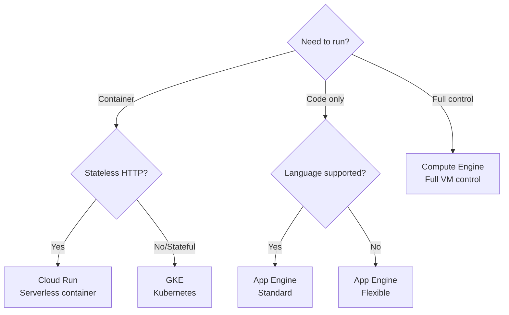

# GCP Interview Questions (50+ Detailed Q&A)

## 1. Compute & GKE

<AccordionGroup>
<Accordion title="1. Compute Engine (GCE) vs Cloud Run vs App Engine">
**Answer**:
*   **GCE**: IaaS. Raw VM. You manage OS, patch, scaling script.
*   **App Engine**: PaaS. Code focus. Standard (Sandbox) vs Flexible (Docker).
*   **Cloud Run**: Serverless Containers. Scale to zero. Protocol: HTTP/Knative.

**Decision Matrix**:


**Use Case Comparison**:
| Service | Best For | Scale to Zero | Cold Start | Cost |
|:--------|:---------|:--------------|:-----------|:-----|
| **Cloud Run** | APIs, webhooks, microservices | Yes | ~1s | Pay per request |
| **App Engine Std** | Web apps (Python, Node, Go) | Yes | ~100ms | Pay per instance-hour |
| **App Engine Flex** | Custom runtimes, background workers | No | ~2min | Pay per instance-hour |
| **GCE** | Databases, legacy apps, full control | No | None | Pay per VM-hour |
| **GKE** | Complex microservices, stateful apps | No | None | Pay per node |

**Example Scenarios**:
- **Cloud Run**: REST API with sporadic traffic (100 req/day)
- **App Engine**: Production web app with steady traffic
- **GCE**: PostgreSQL database, Redis cache
- **GKE**: 50+ microservices with service mesh
</Accordion>


<Accordion title="2. Preemptible vs Spot VMs">
**Answer**:
Both are spare capacity (~91% off).
*   **Preemptible**: Old. Max 24h life.
*   **Spot**: New. No max duration. Variable price.
**Behavior**: Google terminates with 30s notice.
</Accordion>

<Accordion title="3. GKE Standard vs Autopilot">
**Answer**:
*   **Standard**: You manage Nodes (Upgrades, Packing). Pay per Node.
*   **Autopilot**: Fully managed. Google manages Nodes. Pay per Pod (CPU/RAM). Locked down security (No privileged containers).
</Accordion>

<Accordion title="4. Live Migration">
**Answer**:
GCP differentiator.
VM works continue running even while Google updates host hardware/software. VM is moved to new host without reboot.
</Accordion>

<Accordion title="5. Cloud Functions">
**Answer**:
FaaS. Event-driven (Pub/Sub trigger, Storage trigger).
Single purpose code.
v1 vs v2 (v2 built on Cloud Run).
</Accordion>

<Accordion title="6. Machine Types">
**Answer**:
*   **N1/N2**: General Purpose.
*   **E2**: Cost optimized (Dynamic resource mgmt).
*   **C2**: Compute (Gaming/AdTech).
*   **M2**: Memory (SAP HANA).
</Accordion>

<Accordion title="7. Instance Groups (MIG vs Unmanaged)">
**Answer**:
*   **MIG (Managed)**: Scalable, Auto-healing, Identical VMs (Template).
*   **Unmanaged**: Different VMs grouped. For legacy LB.
</Accordion>

<Accordion title="8. Shielded VMs">
**Answer**:
Hardened VM.
Secure Boot (Signature check).
vTPM.
Integrity Monitoring.
</Accordion>

<Accordion title="9. Sole Tenancy">
**Answer**:
Dedicated hardware host.
Compliance (PCI/HIPAA) requiring physical isolation.
</Accordion>

<Accordion title="10. Cloud Run Concurrency">
**Answer**:
AWS Lambda = 1 req/instance.
Cloud Run = 80 req/instance (Default).
Better utilization, lower cold starts.
</Accordion>
</AccordionGroup>

## 2. Storage & Database

<AccordionGroup>
<Accordion title="11. Storage Classes">
**Answer**:
*   **Standard**: Hot.
*   **Nearline**: 30 days. Backup.
*   **Coldline**: 90 days. DR.
*   **Archive**: 365 days. Tape replacement.
*   **Autoclass**: Auto-move based on access.
</Accordion>

<Accordion title="12. Cloud SQL vs Spanner vs Bigtable">
**Answer**:
*   **Cloud SQL**: MySQL/PG/SQL Server. Regional. Vertical scale.
*   **Spanner**: Global SQL. Horizontal scale. Strong consistency. Expensive.
*   **Bigtable**: NoSQL Wide-column (HBase). IoT/TimeSeries. High throughput.
</Accordion>

<Accordion title="13. BigQuery Architecture">
**Answer**:
Serverless Data Warehouse.
Separation of Compute (Dremel) and Storage (Colossus).
Columnar.
Network: Petabit bisectional bandwidth (Jupiter).
</Accordion>

<Accordion title="14. Firestore modes">
**Answer**:
*   **Native**: Modern, document, real-time sync.
*   **Datastore**: Old mode compatibility.
</Accordion>

<Accordion title="15. Cloud Storage Consistency">
**Answer**:
Strong global consistency (even for list operations).
Unlike AWS S3 (which used to be eventual).
</Accordion>

<Accordion title="16. BigQuery Partitioning vs Clustering">
**Answer**:
*   **Partition**: Physical split (Day/Hour). Reduces cost (Scans less).
*   **Cluster**: Sorting within partition. Faster filter/agg.
</Accordion>

<Accordion title="17. Memorystore">
**Answer**:
Managed Redis or Memcached.
In-memory cache. VPC connected.
</Accordion>

<Accordion title="18. Persistent Disk Types">
**Answer**:
*   **pd-standard**: HDD.
*   **pd-balanced**: SSD (Best value).
*   **pd-ssd**: High IOPS.
*   **Local SSD**: Physically attached, ephemeral (Lost on stop). Super fast.
</Accordion>

<Accordion title="19. Database Migration Service (DMS)">
**Answer**:
Serverless migration to Cloud SQL. Uses replication. Minimal downtime.
</Accordion>

<Accordion title="20. Filestore">
**Answer**:
Managed NFS. Shared file system for GCE/GKE.
</Accordion>
</AccordionGroup>

## 3. Networking

<AccordionGroup>
<Accordion title="21. Global VPC">
**Answer**:
GCP VPC is Global (Subnets in any region). AWS is Regional.
Simplifies cross-region communication (Private IP by default).
</Accordion>

<Accordion title="22. Load Balancer Types">
**Answer**:
*   **External HTTP(S)**: Global (Anycast IP). Layer 7.
*   **Internal HTTP(S)**: Regional (Envoy proxies).
*   **Network (TCP/UDP)**: Pass-through or Proxy.
</Accordion>

<Accordion title="23. Cloud Armor">
**Answer**:
WAF (Web App Firewall).
DDoS protection. IP Blacklist. Geo-blocking. SQLi rules.
Attached to Global LB.
</Accordion>

<Accordion title="24. Cloud CDN">
**Answer**:
Edge caching. Integrated with Load Balancer.
Static assets.
</Accordion>

<Accordion title="25. Interconnect vs Peering vs VPN">
**Answer**:
*   **VPN**: over Internet (IPSec). 3 Gbps. Cheap.
*   **Interconnect**: Physical cable. Dedicated (SLA) or Partner. 10G/100G. Expensive.
*   **Peering**: Direct connection to Google Network (Workspace/Youtube), not GCP private IP.
</Accordion>

<Accordion title="26. Private Service Connect (PSC)">
**Answer**:
Access services (managed or internal) via private Endpoint IP in your VPC.
No VPC Peering needed.
</Accordion>

<Accordion title="27. Shared VPC">
**Answer**:
Organization pattern. 1 Host Project (Network Admin). X Service Projects.
Departments share the network but manage their resources.
</Accordion>

<Accordion title="28. VPC Flow Logs">
**Answer**:
Record sample of network flows (IP, Port, Protocol) for debugging/audit.
</Accordion>

<Accordion title="29. Firewalls in GCP">
**Answer**:
Stateful. Distributed (Enforced at instance level).
Tag based. Priority rules.
</Accordion>

<Accordion title="30. Cloud NAT">
**Answer**:
Outbound internet access for Private VMs.
"One to many" address translation.
</Accordion>
</AccordionGroup>

## 4. IAM & Security

<AccordionGroup>
<Accordion title="31. IAM Hierarchy">
**Answer**:
Org -> Folder -> Project -> Resource.
Policies inherit downwards.
</Accordion>

<Accordion title="32. Primitive vs Predefined vs Custom Roles">
**Answer**:
*   **Primitive**: Owner, Editor, Viewer (Too broad, avoid).
*   **Predefined**: `roles/storage.objectViewer` (Google managed).
*   **Custom**: You pick permissions.
</Accordion>

<Accordion title="33. Service Accounts">
**Answer**:
Identity for Machines.
Has an email.
Can use Keys (JSON) or Workload Identity (K8s).
</Accordion>

<Accordion title="34. Workload Identity Federation">
**Answer**:
AWS/Azure/GitHub Actions authenticate to GCP without Service Account Keys.
Exchanges OIDC Token for GCP Token.
</Accordion>

<Accordion title="35. IAP (Identity Aware Proxy)">
**Answer**:
Zero Trust.
Access VMs (SSH/RDP) or Web Apps via HTTPS without VPN.
Verifies Cloud Identity.
</Accordion>

<Accordion title="36. VPC Service Controls">
**Answer**:
Security Perimeter.
Prevents data exfiltration (Copying from my bucket to personal bucket).
</Accordion>

<Accordion title="37. KMS (Key Management Service)">
**Answer**:
Manage Cryptographic Keys (Create, Rotate, Disable).
Symmetric/Asymmetric.
</Accordion>

<Accordion title="38. Secret Manager">
**Answer**:
Store passwords/API keys. Versioned.
Better than Env vars.
</Accordion>

<Accordion title="39. Audit Logs">
**Answer**:
Who did What, Where, When.
Admin Activity (Always on). Data Access (Optional, High volume).
</Accordion>

<Accordion title="40. Forseti Policy / Security Command Center">
**Answer**:
SCC: Native security/risk dashboard.
Forseti: Open source tool to monitor inventory and enforce policy.
</Accordion>
</AccordionGroup>

## 5. Operations & Tools

<AccordionGroup>
<Accordion title="41. Cloud Operations (Stackdriver)">
**Answer**:
Logging + Monitoring + Trace + Debugger + Profiler.
</Accordion>

<Accordion title="42. Cloud Build">
**Answer**:
Serverless CI/CD.
Steps define Docker container executions.
`cloudbuild.yaml`.
</Accordion>

<Accordion title="43. Deployment Manager vs Terraform">
**Answer**:
*   **DM**: GCP native (YAML/Python).
*   **Terraform**: Multi-cloud, Standard. (Recommended).
</Accordion>

<Accordion title="44. Anthos">
**Answer**:
Correcting K8s clusters anywhere (GCP, AWS, On-prem) via single pane of glass.
</Accordion>

<Accordion title="45. Pub/Sub">
**Answer**:
Global Async Messaging.
At-least-once delivery.
Push or Pull subscriptions.
</Accordion>

<Accordion title="46. Dataflow (Apache Beam)">
**Answer**:
ETL pipeline. Batch and Streaming unified.
Fully managed autoscaling.
</Accordion>

<Accordion title="47. Dataproc">
**Answer**:
Managed Hadoop/Spark. Lift and shift migration.
</Accordion>

<Accordion title="48. Billing: Committed Use Discounts (CUD)">
**Answer**:
Spend based (Commit $10/h) or Resource based (Commit 100 CPUs).
1 or 3 year term.
</Accordion>

<Accordion title="49. Cloud Scheduler">
**Answer**:
Managed Cron jobs.
</Accordion>

<Accordion title="50. Vertex AI">
**Answer**:
Unified ML platform. AutoML + Custom Training + MLOps.
</Accordion>
</AccordionGroup>

## 6. GCP Medium Level Questions

<AccordionGroup>
<Accordion title="51. VPC Network Peering">
**Answer**:
Connect two VPC networks privately.

```bash
gcloud compute networks peerings create peer-ab \
    --network=network-a \
    --peer-network=network-b
```

**Use cases**: Multi-project connectivity, hybrid cloud.
</Accordion>

<Accordion title="52. Cloud NAT">
**Answer**:
Allows private instances to access internet without public IPs.

```bash
gcloud compute routers nats create my-nat \
    --router=my-router \
    --region=us-central1 \
    --nat-all-subnet-ip-ranges
```
</Accordion>

<Accordion title="53. Cloud Armor">
**Answer**:
DDoS protection and WAF for Load Balancers.

```bash
gcloud compute security-policies create my-policy
gcloud compute security-policies rules create 1000 \
    --security-policy=my-policy \
    --expression="origin.region_code == 'US'" \
    --action=allow
```
</Accordion>

<Accordion title="54. IAM Custom Roles">
**Answer**:
Create granular permissions.

```yaml
title: "Custom Storage Admin"
description: "Custom role for storage"
stage: "GA"
includedPermissions:
- storage.buckets.create
- storage.buckets.delete
- storage.objects.create
```

```bash
gcloud iam roles create customStorageAdmin \
    --project=PROJECT_ID \
    --file=role.yaml
```
</Accordion>

<Accordion title="55. Service Accounts">
**Answer**:
Identity for applications.

```bash
# Create
gcloud iam service-accounts create my-sa

# Grant role
gcloud projects add-iam-policy-binding PROJECT_ID \
    --member="serviceAccount:my-sa@PROJECT_ID.iam.gserviceaccount.com" \
    --role="roles/storage.admin"

# Create key
gcloud iam service-accounts keys create key.json \
    --iam-account=my-sa@PROJECT_ID.iam.gserviceaccount.com
```
</Accordion>

<Accordion title="56. Cloud SQL High Availability">
**Answer**:
Regional HA with automatic failover.

```bash
gcloud sql instances create my-instance \
    --database-version=POSTGRES_14 \
    --tier=db-n1-standard-2 \
    --region=us-central1 \
    --availability-type=REGIONAL
```

**Features**: Automatic failover, synchronous replication.
</Accordion>

<Accordion title="57. Cloud Spanner">
**Answer**:
Globally distributed, horizontally scalable SQL database.

**When to use**: Global applications, strong consistency, unlimited scale.

```sql
CREATE TABLE Users (
    UserId INT64 NOT NULL,
    Name STRING(100),
) PRIMARY KEY (UserId);
```
</Accordion>

<Accordion title="58. BigQuery Partitioning">
**Answer**:
Improve query performance and reduce costs.

```sql
CREATE TABLE dataset.table
PARTITION BY DATE(timestamp)
AS SELECT * FROM source_table;

-- Query specific partition
SELECT * FROM dataset.table
WHERE DATE(timestamp) = '2024-01-01';
```
</Accordion>

<Accordion title="59. BigQuery Clustering">
**Answer**:
Further optimize partitioned tables.

```sql
CREATE TABLE dataset.table
PARTITION BY DATE(timestamp)
CLUSTER BY user_id, country
AS SELECT * FROM source_table;
```
</Accordion>

<Accordion title="60. Cloud Functions Triggers">
**Answer**:
Event-driven serverless functions.

```javascript
// HTTP trigger
exports.helloHttp = (req, res) => {
    res.send('Hello World!');
};

// Pub/Sub trigger
exports.helloPubSub = (message, context) => {
    const data = Buffer.from(message.data, 'base64').toString();
    console.log(data);
};

// Cloud Storage trigger
exports.helloGCS = (file, context) => {
    console.log(`File: ${file.name}`);
};
```
</Accordion>

<Accordion title="61. Cloud Run Autoscaling">
**Answer**:
Scale to zero, pay per request.

```bash
gcloud run deploy my-service \
    --image=gcr.io/PROJECT_ID/image \
    --min-instances=0 \
    --max-instances=100 \
    --concurrency=80
```
</Accordion>

<Accordion title="62. GKE Autopilot vs Standard">
**Answer**:
*   **Autopilot**: Fully managed, Google manages nodes.
*   **Standard**: More control, you manage nodes.

```bash
# Autopilot
gcloud container clusters create-auto my-cluster

# Standard
gcloud container clusters create my-cluster \
    --num-nodes=3 \
    --machine-type=n1-standard-2
```
</Accordion>

<Accordion title="63. GKE Workload Identity">
**Answer**:
Bind Kubernetes service accounts to GCP service accounts.

```bash
# Enable on cluster
gcloud container clusters update CLUSTER \
    --workload-pool=PROJECT_ID.svc.id.goog

# Bind accounts
gcloud iam service-accounts add-iam-policy-binding \
    GSA_NAME@PROJECT_ID.iam.gserviceaccount.com \
    --role roles/iam.workloadIdentityUser \
    --member "serviceAccount:PROJECT_ID.svc.id.goog[NAMESPACE/KSA_NAME]"
```
</Accordion>

<Accordion title="64. Cloud Monitoring Alerts">
**Answer**:
```yaml
displayName: "High CPU Alert"
conditions:
  - displayName: "CPU > 80%"
    conditionThreshold:
      filter: 'resource.type="gce_instance"'
      comparison: COMPARISON_GT
      thresholdValue: 0.8
      duration: 300s
notificationChannels:
  - projects/PROJECT_ID/notificationChannels/CHANNEL_ID
```
</Accordion>

<Accordion title="65. Cloud Logging Sinks">
**Answer**:
Export logs to BigQuery, Cloud Storage, or Pub/Sub.

```bash
gcloud logging sinks create my-sink \
    bigquery.googleapis.com/projects/PROJECT_ID/datasets/DATASET \
    --log-filter='resource.type="gce_instance"'
```
</Accordion>

<Accordion title="66. Cloud CDN">
**Answer**:
Content delivery network for low latency.

```bash
gcloud compute backend-services update my-backend \
    --enable-cdn \
    --cache-mode=CACHE_ALL_STATIC
```
</Accordion>

<Accordion title="67. Cloud Load Balancing Types">
**Answer**:
*   **Global HTTP(S)**: Layer 7, global, URL-based routing
*   **Global SSL/TCP**: Layer 4, global
*   **Regional Network**: Layer 4, regional
*   **Regional Internal**: Layer 4, internal only
</Accordion>

<Accordion title="68. Managed Instance Groups">
**Answer**:
Auto-scaling and auto-healing.

```bash
gcloud compute instance-groups managed create my-mig \
    --template=my-template \
    --size=3 \
    --zone=us-central1-a

# Autoscaling
gcloud compute instance-groups managed set-autoscaling my-mig \
    --max-num-replicas=10 \
    --target-cpu-utilization=0.6
```
</Accordion>

<Accordion title="69. Cloud Scheduler">
**Answer**:
Cron jobs in the cloud.

```bash
gcloud scheduler jobs create http my-job \
    --schedule="0 */2 * * *" \
    --uri="https://example.com/api" \
    --http-method=POST
```
</Accordion>

<Accordion title="70. Secret Manager">
**Answer**:
Store API keys, passwords, certificates.

```bash
# Create secret
echo -n "my-secret-value" | gcloud secrets create my-secret \
    --data-file=-

# Access in code
from google.cloud import secretmanager
client = secretmanager.SecretManagerServiceClient()
name = "projects/PROJECT_ID/secrets/my-secret/versions/latest"
response = client.access_secret_version(request={"name": name})
secret = response.payload.data.decode("UTF-8")
```
</Accordion>
</AccordionGroup>

## 7. GCP Advanced Level Questions

<AccordionGroup>
<Accordion title="71. Shared VPC">
**Answer**:
Centralized network management across projects.

```bash
# Enable in host project
gcloud compute shared-vpc enable HOST_PROJECT

# Attach service project
gcloud compute shared-vpc associated-projects add SERVICE_PROJECT \
    --host-project=HOST_PROJECT
```

**Use case**: Enterprise multi-project architecture.
</Accordion>

<Accordion title="72. VPC Service Controls">
**Answer**:
Create security perimeters around GCP resources.

```bash
gcloud access-context-manager perimeters create my-perimeter \
    --title="Production Perimeter" \
    --resources=projects/PROJECT_ID \
    --restricted-services=storage.googleapis.com,bigquery.googleapis.com
```
</Accordion>

<Accordion title="73. Organization Policy Constraints">
**Answer**:
Enforce governance across organization.

```yaml
# Disable serial port access
constraint: compute.disableSerialPortAccess
listPolicy:
  allValues: DENY
```

```bash
gcloud resource-manager org-policies set-policy policy.yaml \
    --organization=ORG_ID
```
</Accordion>

<Accordion title="74. Cloud Interconnect">
**Answer**:
Dedicated physical connection to GCP.

*   **Dedicated**: 10 Gbps or 100 Gbps
*   **Partner**: 50 Mbps to 10 Gbps

**vs VPN**: Lower latency, higher throughput, more expensive.
</Accordion>

<Accordion title="75. Cloud Router and BGP">
**Answer**:
Dynamic routing with BGP.

```bash
gcloud compute routers create my-router \
    --network=my-network \
    --region=us-central1 \
    --asn=65001
```

**Use case**: Hybrid cloud, dynamic route propagation.
</Accordion>

<Accordion title="76. Binary Authorization">
**Answer**:
Deploy only trusted container images.

```bash
gcloud container binauthz policy import policy.yaml

# Attestation
gcloud beta container binauthz attestations create \
    --artifact-url=gcr.io/PROJECT_ID/image@sha256:DIGEST \
    --attestor=my-attestor
```
</Accordion>

<Accordion title="77. GKE Multi-Cluster Ingress">
**Answer**:
Single load balancer across multiple clusters.

```yaml
apiVersion: networking.gke.io/v1
kind: MultiClusterIngress
metadata:
  name: my-mci
spec:
  template:
    spec:
      backend:
        serviceName: my-service
        servicePort: 80
```
</Accordion>

<Accordion title="78. GKE Vertical Pod Autoscaler">
**Answer**:
Automatically adjust CPU/memory requests.

```yaml
apiVersion: autoscaling.k8s.io/v1
kind: VerticalPodAutoscaler
metadata:
  name: my-vpa
spec:
  targetRef:
    apiVersion: apps/v1
    kind: Deployment
    name: my-deployment
  updatePolicy:
    updateMode: "Auto"
```
</Accordion>

<Accordion title="79. Cloud Composer (Airflow)">
**Answer**:
Managed Apache Airflow for workflows.

```python
from airflow import DAG
from airflow.operators.bash import BashOperator

dag = DAG('my_dag', schedule_interval='@daily')

task = BashOperator(
    task_id='my_task',
    bash_command='echo "Hello"',
    dag=dag
)
```
</Accordion>

<Accordion title="80. Dataflow (Apache Beam)">
**Answer**:
Unified batch and streaming data processing.

```python
import apache_beam as beam

with beam.Pipeline() as p:
    (p
     | beam.io.ReadFromText('gs://bucket/input.txt')
     | beam.Map(lambda x: x.upper())
     | beam.io.WriteToText('gs://bucket/output.txt'))
```
</Accordion>

<Accordion title="81. Pub/Sub Message Ordering">
**Answer**:
Guarantee message order with ordering keys.

```python
from google.cloud import pubsub_v1

publisher = pubsub_v1.PublisherClient()
topic_path = publisher.topic_path('PROJECT_ID', 'TOPIC')

future = publisher.publish(
    topic_path,
    b'Message data',
    ordering_key='user-123'
)
```
</Accordion>

<Accordion title="82. Pub/Sub Dead Letter Topics">
**Answer**:
Handle failed message processing.

```bash
gcloud pubsub subscriptions create my-subscription \
    --topic=my-topic \
    --dead-letter-topic=dead-letter-topic \
    --max-delivery-attempts=5
```
</Accordion>

<Accordion title="83. Cloud Tasks">
**Answer**:
Asynchronous task execution with rate limiting.

```python
from google.cloud import tasks_v2

client = tasks_v2.CloudTasksClient()
parent = client.queue_path('PROJECT_ID', 'LOCATION', 'QUEUE')

task = {
    'http_request': {
        'http_method': tasks_v2.HttpMethod.POST,
        'url': 'https://example.com/api',
    }
}

client.create_task(request={'parent': parent, 'task': task})
```
</Accordion>

<Accordion title="84. Cloud Build Triggers">
**Answer**:
CI/CD with automated builds.

```yaml
# cloudbuild.yaml
steps:
  - name: 'gcr.io/cloud-builders/docker'
    args: ['build', '-t', 'gcr.io/$PROJECT_ID/image', '.']
  - name: 'gcr.io/cloud-builders/docker'
    args: ['push', 'gcr.io/$PROJECT_ID/image']
  - name: 'gcr.io/cloud-builders/gcloud'
    args: ['run', 'deploy', 'my-service', '--image', 'gcr.io/$PROJECT_ID/image']
```
</Accordion>

<Accordion title="85. Artifact Registry">
**Answer**:
Next-gen container and package registry.

```bash
# Create repository
gcloud artifacts repositories create my-repo \
    --repository-format=docker \
    --location=us-central1

# Push image
docker tag my-image us-central1-docker.pkg.dev/PROJECT_ID/my-repo/my-image
docker push us-central1-docker.pkg.dev/PROJECT_ID/my-repo/my-image
```
</Accordion>

<Accordion title="86. Cloud Profiler">
**Answer**:
Continuous CPU and memory profiling.

```python
import googlecloudprofiler

googlecloudprofiler.start(
    service='my-service',
    service_version='1.0.0',
    verbose=3
)
```
</Accordion>

<Accordion title="87. Cloud Trace">
**Answer**:
Distributed tracing for latency analysis.

```python
from google.cloud import trace_v1

client = trace_v1.TraceServiceClient()
project_id = 'PROJECT_ID'

trace = {
    'project_id': project_id,
    'spans': [...]
}
client.patch_traces(project_id=project_id, traces={'traces': [trace]})
```
</Accordion>

<Accordion title="88. Cost Optimization: Committed Use Discounts">
**Answer**:
1-year or 3-year commitments for 57% discount.

```bash
gcloud compute commitments create my-commitment \
    --region=us-central1 \
    --plan=12-month \
    --resources=vcpu=100,memory=400GB
```
</Accordion>

<Accordion title="89. Cost Optimization: Preemptible VMs">
**Answer**:
Up to 80% discount, can be terminated anytime.

```bash
gcloud compute instances create my-instance \
    --preemptible \
    --maintenance-policy=TERMINATE
```

**Use case**: Batch jobs, fault-tolerant workloads.
</Accordion>

<Accordion title="90. Multi-Region Deployment Strategy">
**Answer**:
```yaml
# Traffic Director for global load balancing
apiVersion: networking.gke.io/v1
kind: MultiClusterService
metadata:
  name: my-service
spec:
  template:
    spec:
      selector:
        app: my-app
      ports:
      - port: 80
  clusters:
  - link: "us-central1/my-cluster"
  - link: "europe-west1/my-cluster"
```

**Benefits**: Low latency, high availability, disaster recovery.
</Accordion>
</AccordionGroup>
