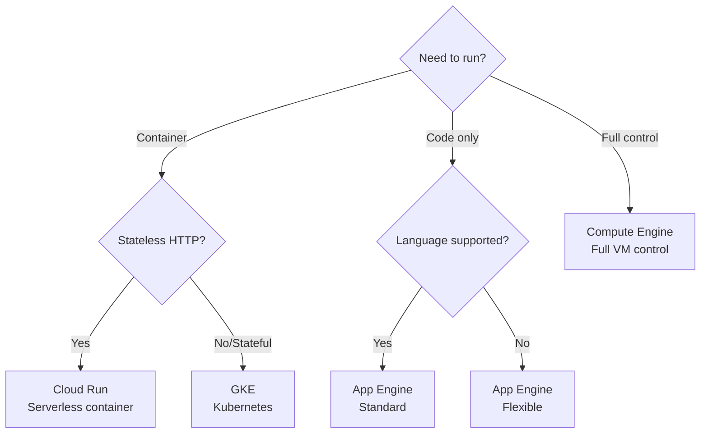

# GCP Interview Questions (50+ Detailed Q&A)

<Note>
**Senior vs Staff -- What separates them on GCP?**

**Senior Engineer**: Builds solutions on GCP services. Selects the right compute/storage/networking primitives for a given workload. Writes Terraform modules. Debugs production issues using Cloud Operations. Designs for a single team's domain.

**Staff Engineer**: Designs GCP landing zones, org-level IAM hierarchies, and cost governance frameworks. Owns the Shared VPC topology and VPC Service Controls perimeter strategy. Defines organization-wide policies (region restrictions, encryption standards, service account hygiene). Makes build-vs-buy decisions (Anthos vs open-source multi-cluster). Negotiates CUD commitments with finance. Influences Google's product roadmap via TAM relationships.
</Note>

## 1. Compute & GKE

<AccordionGroup>
<Accordion title="1. Compute Engine (GCE) vs Cloud Run vs App Engine">
**What interviewers are really testing:** Can you match workload characteristics to the right compute primitive? Do you understand the operational burden spectrum from IaaS to serverless, and can you make cost-aware architectural decisions?

**Answer:**
*   **GCE (Compute Engine)**: IaaS -- raw VMs where you own everything from OS patches to autoscaling scripts. You pick machine type, disk, network. Full `root` access. Think of it as renting a physical server in the cloud.
*   **App Engine**: PaaS -- you deploy code, Google handles infrastructure. **Standard** environment is a sandboxed runtime (Python, Node, Go, Java, PHP, Ruby) with fast cold starts (~100ms) and scale-to-zero. **Flexible** environment runs custom Docker containers but does NOT scale to zero and has ~2min cold starts. Key gotcha: App Engine Standard has request timeout of 10 minutes (background tasks up to 24h), while Flexible has 60 minutes.
*   **Cloud Run**: Serverless containers built on Knative. You give it a Docker image, it handles scaling (including to zero). Supports HTTP/1.1, HTTP/2, gRPC, and WebSockets. Max concurrency of 1000 per instance. Billed per 100ms of actual request processing time. The sweet spot: you want container flexibility without managing Kubernetes.
*   **GKE**: Full Kubernetes. For when you need service mesh (Istio/Anthos Service Mesh), stateful workloads (StatefulSets), complex scheduling (node affinity, taints/tolerations), or when you have 20+ microservices that need fine-grained networking control.

**Decision Matrix**:

```mermaid
graph TD
    Start{Need to run?}
    Start -->|Container| ContainerQ{Stateless HTTP?}
    Start -->|Code only| CodeQ{Language supported?}
    Start -->|Full control| GCE[Compute Engine<br/>Full VM control]
    
    ContainerQ -->|Yes| CloudRun[Cloud Run<br/>Serverless container]
    ContainerQ -->|No/Stateful| GKE[GKE<br/>Kubernetes]
    
    CodeQ -->|Yes| AppEngine[App Engine<br/>Standard]
    CodeQ -->|No| AppFlex[App Engine<br/>Flexible]
```

**Use Case Comparison**:
| Service | Best For | Scale to Zero | Cold Start | Cost Model | Ops Burden |
|:--------|:---------|:--------------|:-----------|:-----------|:-----------|
| **Cloud Run** | APIs, webhooks, microservices | Yes | ~1s | Pay per request (CPU-seconds) | Very Low |
| **App Engine Std** | Web apps (Python, Node, Go) | Yes | ~100ms | Pay per instance-hour | Low |
| **App Engine Flex** | Custom runtimes, background workers | No | ~2min | Pay per instance-hour | Low-Medium |
| **GCE** | Databases, legacy apps, full control | No | None (always on) | Pay per VM-hour | High |
| **GKE** | Complex microservices, stateful apps | No (unless scale-down) | None (pods pre-warmed) | Pay per node | Medium-High |

**Example Scenarios**:
- **Cloud Run**: REST API with sporadic traffic (100 req/day). A startup processing webhook callbacks from Stripe -- pays $0 when no webhooks arrive.
- **App Engine Standard**: Production web app with steady 10K RPM traffic. An e-commerce frontend where predictable latency matters more than container flexibility.
- **App Engine Flexible**: A video transcoding service using FFmpeg that needs custom system libraries.
- **GCE**: Self-managed PostgreSQL with specific kernel tuning, or a legacy .NET Framework app that requires Windows Server.
- **GKE**: A fintech platform with 50+ microservices, Istio service mesh, mTLS between services, and canary deployments.

**Production gotcha**: App Engine has a single `app.yaml` per project limitation for the default service. Many teams hit this and wish they had started with Cloud Run, which has no such constraint. Migration from App Engine to Cloud Run is common but non-trivial due to differences in routing, cron handling (`cron.yaml` vs. Cloud Scheduler), and task queues (App Engine Task Queues vs. Cloud Tasks).

**Cost reality check**: A startup processing 50K requests/day with avg 200ms response time: Cloud Run costs ~$5/month. The same on GKE Autopilot costs ~$70/month (cluster management fee alone). On a 3-node GKE Standard cluster: ~$200/month. On App Engine Standard: ~$25/month. Cloud Run is the clear winner for low-to-moderate traffic stateless workloads.

**Red flag answer:** "I would just use GKE for everything because Kubernetes is the standard." This shows no understanding of operational cost. Running a single API on a 3-node GKE cluster costs ~$200/mo minimum vs. near-zero on Cloud Run for low traffic.

**Follow-up:**
- *"Your Cloud Run service is experiencing 5-second cold starts. How do you debug and fix this?"* -- Check container image size (use distroless/alpine), set `--min-instances=1` to keep a warm instance, enable CPU boost (`--cpu-boost`), profile startup code for heavy initialization (DB connection pools, ML model loading). Also check if the container is pulling from Artifact Registry in the same region.
- *"When would you migrate FROM GKE TO Cloud Run, and what breaks?"* -- When services are stateless HTTP and you want to reduce ops burden. What breaks: persistent volumes, sidecar containers (Cloud Run now supports multi-container but limited), custom scheduling, DaemonSets, and any reliance on Kubernetes-native service discovery.
- *"A team is running 200 microservices. They want to move from GKE to Cloud Run for cost savings. What is your advice?"* -- Likely a bad idea at that scale. Cloud Run lacks service mesh, shared in-cluster networking, and the operational consistency of a single Kubernetes cluster. The cost savings are illusory because you trade infrastructure cost for operational complexity of managing 200 independent Cloud Run services. Recommend evaluating GKE Autopilot first.

**Follow-up chain (cost optimization and failure modes):**
- *"Walk me through how you would calculate the total cost of ownership for Cloud Run vs GKE Autopilot vs GKE Standard for 20 microservices averaging 500 RPM."* -- This is not just compute cost. Factor in: engineering time managing node pools (Standard), per-pod premium (Autopilot), idle min-instance cost (Cloud Run), networking (Cloud Run needs VPC connectors at $7/month each for VPC access), and observability tooling differences. Build a spreadsheet with all five cost dimensions before committing.
- *"Your Cloud Run service uses a VPC connector to reach Memorystore. The connector becomes a bottleneck at 1000 RPS. What are your options?"* -- Scale up the connector tier (e2-micro to e2-standard-4). Use Direct VPC Egress (newer feature, eliminates the connector entirely). Or redesign to avoid VPC dependency entirely (use Firestore instead of Memorystore for session state).
- *"How would you design a disaster recovery plan for Cloud Run services across regions?"* -- Deploy services in two regions. Use Global HTTP(S) LB with health checks. Cloud Run has no built-in cross-region failover -- you must configure it at the LB layer. Data layer is the hard part: ensure your database (Cloud SQL, Spanner) has cross-region replication. Test failover quarterly by removing one region from the LB backend.

<Note>
**Work-sample prompt**: "Your Cloud Run service is hitting cold start latency that violates your 2-second SLA. Walk through your diagnosis and fix, including the exact `gcloud` flags you would set, how you would measure the improvement, and how you would justify the cost of min-instances to your finance team."
</Note>
</Accordion>


<Accordion title="2. Preemptible vs Spot VMs">
**What interviewers are really testing:** Do you understand cost optimization beyond "use cheaper VMs"? Can you design fault-tolerant architectures that exploit interruptible compute?

**Answer:**
Both use Google's spare capacity at up to 60-91% discount vs. on-demand pricing. The key difference:
*   **Preemptible VMs (Legacy)**: Hard cap of 24-hour maximum lifetime. Google WILL terminate them at 24h even if capacity is available. Fixed discount (~80% off). Being phased out in favor of Spot.
*   **Spot VMs (Current)**: No maximum duration -- they run until Google needs the capacity back OR you stop them. Dynamic pricing that can vary by region and machine type. Same 30-second termination notice. Support for `STOP` action (not just `TERMINATE`), meaning you can resume them later.

**Termination behavior**: Google sends a 30-second ACPI G2 soft-off signal. Your shutdown script must complete within this window. In practice, you get a metadata server notification at `http://metadata.google.internal/computeMetadata/v1/instance/preempted` that returns `TRUE` before termination.

**Architecture patterns for Spot VMs**:
- **Batch processing**: Dataproc clusters with Spot workers. If a worker dies, the task retries on another node. A data pipeline processing 10TB/day saved one team ~$15K/month by using 80% Spot workers.
- **CI/CD build agents**: Jenkins/GitLab runners on Spot. If preempted, the build restarts. Acceptable for 15-minute builds.
- **GKE node pools**: Mix of on-demand (for critical pods) and Spot (for batch/dev workloads) using node affinity and taints.
- **Training ML models with checkpointing**: Save model checkpoints every N epochs to GCS. If preempted, resume from last checkpoint on a new Spot VM.

**Red flag answer:** "Spot VMs are just cheaper VMs, I would use them for production databases." This shows fundamental misunderstanding -- you never run stateful, non-replaceable workloads on interruptible compute.

**Follow-up:**
- *"How would you design a system that uses Spot VMs for 80% of its compute but maintains 99.9% availability?"* -- Use a Managed Instance Group with a mix: 20% on-demand as baseline, 80% Spot for burst. Configure the MIG with `--preemptible` on the Spot template and autohealing. Use regional MIG across 3 zones so preemption in one zone is absorbed by others. The key insight: Google rarely preempts across all zones simultaneously.
- *"Your Spot VM batch job keeps getting preempted at the same time every day. Why?"* -- Likely a demand pattern. Enterprise customers spin up workloads at business hours, consuming spare capacity. Solution: run jobs during off-peak hours (nights/weekends), or spread across regions, or use a different machine type family that has more spare capacity.
- *"What is the difference between Spot VMs on GCP vs. Spot Instances on AWS?"* -- AWS Spot has a 2-minute warning (vs. 30 seconds on GCP). AWS has Spot Fleet and Spot Blocks (deprecated). GCP integrates Spot natively into MIGs and GKE node pools more seamlessly. AWS historically had more volatile pricing; GCP Spot pricing is more predictable.

**Follow-up chain (cost optimization and fault tolerance):**
- *"Your ML training job takes 4 hours on a regular VM. If you use Spot VMs, how do you handle preemption at hour 3?"* -- Implement checkpointing: save model state to GCS every 30 minutes. On preemption (30-second ACPI signal), save a final checkpoint. On restart (new Spot VM), resume from the last checkpoint. Frameworks like TensorFlow and PyTorch have built-in checkpoint/restore. Worst case: you lose 30 minutes of training, not 3 hours. The cost savings (60-80%) far outweigh the occasional 30-minute loss.
- *"Your GKE cluster uses Spot node pools for batch workloads. During a busy period, all Spot nodes get preempted simultaneously. How do you prevent this from causing an outage?"* -- (1) Set a minimum number of on-demand nodes (`--min-nodes` on the on-demand pool) to handle baseline load. (2) Spread Spot nodes across multiple zones (regional node pool). (3) Use multiple machine type families in the Spot pool (if `n2-standard-4` is preempted, `e2-standard-4` might still have capacity). (4) Taint Spot nodes and only schedule fault-tolerant workloads on them -- critical pods go to on-demand nodes via `nodeAffinity`.
</Accordion>

<Accordion title="3. GKE Standard vs Autopilot">
**What interviewers are really testing:** Do you understand the trade-off between control and operational overhead in Kubernetes? Can you recommend the right mode for a given team size and workload profile?

**Answer:**
*   **GKE Standard**: You manage node pools -- machine types, scaling policies, OS patching, node upgrades, bin-packing efficiency. Pay per node regardless of pod utilization (a half-empty n1-standard-8 still costs full price). You get full control: privileged containers, custom kernel parameters (`sysctl`), DaemonSets, HostNetwork, node-level SSH access.
*   **GKE Autopilot**: Google manages the entire node infrastructure. You only define Pod specs (CPU/memory requests). Google provisions right-sized nodes automatically. Pay per pod resource request (not per node). Security is hardened by default: no privileged containers, no `hostPath` volumes, no SSH to nodes, mandatory resource requests/limits.

**Cost comparison (real-world)**:
- A team running 20 pods requesting 500m CPU each on Standard might use 3x `n1-standard-4` nodes (12 vCPUs). They pay for all 12 vCPUs even though pods only request 10 vCPU total. With Autopilot, they pay for exactly 10 vCPUs.
- However, Autopilot has a per-pod premium (~20-30% higher per vCPU-hour vs. Standard). The breakeven point: if your Standard cluster utilization is below ~65%, Autopilot is cheaper. Above 65% utilization (which requires active bin-packing optimization), Standard wins.

**When to choose Standard**:
- You need privileged containers (e.g., running Docker-in-Docker for CI)
- Custom node configurations (GPU nodes, high-memory nodes with specific taints)
- You have a dedicated platform team that actively optimizes node utilization
- Workloads need `hostPath` volumes or `hostNetwork`

**When to choose Autopilot**:
- Small team without dedicated Kubernetes ops expertise
- Variable workloads where cluster utilization would be low on Standard
- Security-conscious environments that benefit from locked-down defaults
- You want to avoid the "forgot to upgrade nodes" operational risk

**Diagnostic tools**: Use `kubectl top nodes` and `kubectl top pods` for live resource usage. Use `gcloud recommender recommendations list --recommender=google.compute.instance.MachineTypeRecommender` for right-sizing suggestions. In Cloud Monitoring, track `kubernetes.io/container/cpu/request_utilization` -- if this is consistently below 30%, you are over-provisioned.

**Red flag answer:** "Autopilot is always better because it is managed." This ignores real constraints -- Autopilot blocks many legitimate workload patterns. Also: "Standard is better because you have more control" without acknowledging the ops cost of that control.

**Follow-up:**
- *"Your Autopilot cluster is rejecting a deployment. The error says the pod spec is not allowed. What are common causes?"* -- Privileged security context, `hostPath` mounts, `hostNetwork: true`, missing resource requests/limits, or using a DaemonSet (not supported in Autopilot). The fix depends on whether you can redesign the workload or need to switch to Standard.
- *"How does Autopilot handle node scaling differently from Standard with Cluster Autoscaler?"* -- Standard uses Cluster Autoscaler which adds/removes nodes based on pending pods. It has a reaction delay (30s-2min to provision new nodes). Autopilot pre-provisions capacity more aggressively and provisions nodes of exactly the right size for pending pods, reducing waste and scheduling latency.
- *"A team is spending $50K/month on a GKE Standard cluster that averages 30% node utilization. What do you recommend?"* -- Migrate to Autopilot. At 30% utilization, they are paying for 3.3x the compute they need. Even with Autopilot's per-pod premium, they will likely save 40-50%. Alternatively, if they must stay on Standard: implement Vertical Pod Autoscaler to right-size resource requests, enable node auto-provisioning, and consolidate to fewer, larger nodes.

**Follow-up chain (GKE deep dive):**
- *"How does GKE Autopilot handle GPU workloads?"* -- Autopilot added GPU support (A100, L4, T4) via specific compute classes. You request a GPU in the pod spec and Autopilot provisions a GPU node automatically. However, the selection of GPU types is more limited than Standard, and you cannot use custom driver versions or CUDA toolkit configurations.
- *"Your GKE Standard cluster has 50 nodes but 20% are consistently idle. The Cluster Autoscaler is not scaling down. Why?"* -- Common causes: pods with `PodDisruptionBudget` that prevents eviction, pods using local storage (`emptyDir` with `sizeLimit`), pods with restrictive anti-affinity rules that cannot be rescheduled, or system pods (kube-system) holding nodes. Check `kubectl describe configmap cluster-autoscaler-status -n kube-system` for scale-down blockers.
- *"How do you implement cost allocation (chargeback) across teams sharing a GKE cluster?"* -- Use GKE cost allocation: enable the `enable-cost-allocation` flag on the cluster. This attributes costs to Kubernetes namespaces and labels. Export to BigQuery billing tables. Each team's namespace gets a cost line item. Combine with resource quotas per namespace to enforce budgets.

<Note>
**Work-sample prompt**: "You are the platform engineer for a company with 8 product teams sharing a single GKE Standard cluster. Three teams are complaining about noisy neighbors and one team just deployed a pod requesting 64GB RAM that pushed out other pods. Design the namespace isolation, resource quotas, network policies, and cost allocation strategy. Would you recommend splitting into Autopilot, and what would you lose?"
</Note>
</Accordion>

<Accordion title="4. Live Migration">
**What interviewers are really testing:** Do you understand GCP's unique infrastructure differentiator and how it affects availability design? Can you articulate what this means for SLA guarantees?

**Answer:**
Live Migration is a GCP-specific capability where a running VM is transparently moved from one physical host to another with zero downtime. The VM continues executing -- no reboot, no visible interruption to the guest OS. This happens during:
- Planned host maintenance (hardware/firmware updates, security patches)
- Host hardware degradation (predictive failure detection)
- Infrastructure rebalancing

**How it works internally**:
1. Google identifies a VM that needs to move (maintenance event on current host)
2. A new host is prepared with identical configuration
3. Memory pages are iteratively copied while the VM keeps running (pre-copy phase -- multiple rounds to converge on dirty pages)
4. A brief pause (typically 50-300ms) for the final memory state transfer and CPU register sync
5. VM resumes on the new host with the same network identity (IP, MAC preserved via SDN)
6. The old host is decommissioned for maintenance

**Why this matters**: On AWS, equivalent events require either a reboot (maintenance event) or designing for instance replacement. GCP's Live Migration means a single VM can achieve higher practical uptime without redundancy. Google claims &lt;1 second total pause during migration.

**Limitations**:
- Does NOT work with Local SSDs (ephemeral storage is tied to physical host). VMs with Local SSDs are terminated, not migrated.
- Does NOT work with GPUs/TPUs attached (hardware passthrough cannot be migrated).
- Preemptible/Spot VMs do not benefit from Live Migration (they are terminated instead).
- Very large VMs (multi-TB memory) may experience longer migration times.

**Production impact**: A financial services company running SAP HANA on `m2-ultramem-416` (5.8TB RAM) relied on Live Migration for maintenance windows. When they added Local SSDs for temp space, they lost this capability and had to redesign their HA architecture with failover replicas.

**Red flag answer:** "Live Migration means VMs never go down" -- wrong. GPU VMs, Local SSD VMs, and Spot VMs are exceptions. Also, the sub-second pause can affect latency-sensitive workloads (HFT, real-time gaming).

**Follow-up:**
- *"How would you design for high availability on GCP vs. AWS given this difference?"* -- On GCP, a single VM with Live Migration can tolerate host maintenance. On AWS, you must always design for instance replacement (Auto Scaling Groups, multi-AZ). GCP still benefits from redundancy for application-level failures, but the baseline single-VM reliability is higher.
- *"You notice your VM experienced 200ms of packet loss. How do you determine if it was a Live Migration?"* -- Check `gcloud compute operations list --filter="operationType=compute.instances.migrateOnHostMaintenance"`. Also check serial port logs and the instance's metadata for maintenance events. Cloud Monitoring shows a `system_event` metric for migrations.
- *"Your application is latency-critical (p99 &lt; 10ms). Should you rely on Live Migration or design around it?"* -- Design around it. The 50-300ms pause is unacceptable for sub-10ms p99 requirements. Run multiple instances behind a load balancer. Set the maintenance policy to `TERMINATE` and let the MIG auto-heal, which gives you predictable failover rather than unpredictable migration pauses.
</Accordion>

<Accordion title="5. Cloud Functions">
**What interviewers are really testing:** Do you understand FaaS trade-offs, the evolution from v1 to v2, and when serverless functions are the wrong choice?

**Answer:**
Cloud Functions is Google's FaaS (Function-as-a-Service) offering -- event-driven, single-purpose code execution without server management. You write a function, attach a trigger, and Google handles scaling, patching, and infrastructure.

**v1 vs v2 (critical distinction)**:
*   **v1**: Built on a proprietary runtime. Limited to 540s timeout, 8GB memory, 1 request per instance (no concurrency). Triggers: HTTP, Pub/Sub, Cloud Storage, Firestore, Firebase events.
*   **v2**: Built on Cloud Run under the hood (Knative). Up to 60min timeout, 32GB memory, up to 1000 concurrent requests per instance. Supports Eventarc triggers (100+ event sources). Traffic splitting for canary deployments. Better cold start performance.

**When to use Cloud Functions**:
- Glue logic: "When a file lands in GCS bucket X, process it and write to BigQuery"
- Lightweight webhooks: Slack bot, GitHub webhook processor
- Event fan-out: Pub/Sub message triggers a function that calls 3 downstream APIs
- Scheduled tasks: Cloud Scheduler triggers a function every hour to generate reports

**When NOT to use Cloud Functions**:
- Long-running processes (use Cloud Run or GKE)
- Anything requiring persistent connections (WebSockets, gRPC streaming)
- High-throughput, steady-state workloads (the per-invocation cost exceeds always-on compute)
- Complex multi-step workflows (use Cloud Workflows or Cloud Composer instead)

**Cost trap**: A function invoked 10M times/month at 256MB, 200ms avg duration costs ~$40/month. The same workload on a single `e2-small` Cloud Run instance costs ~$15/month. Functions are cheaper only at low, sporadic invocation rates. The crossover point is roughly 1M-5M invocations/month -- below that, functions win; above that, Cloud Run wins.

**Deployment example (v2)**:
```bash
gcloud functions deploy processFile \
    --gen2 \
    --runtime=nodejs20 \
    --region=us-central1 \
    --trigger-event-filters="type=google.cloud.storage.object.v1.finalized" \
    --trigger-event-filters="bucket=my-upload-bucket" \
    --memory=512MiB \
    --timeout=300s \
    --min-instances=1 \
    --max-instances=100
```

**Red flag answer:** "Cloud Functions and Cloud Run are basically the same thing." While v2 is built on Cloud Run, Functions enforce a specific programming model (single function entry point, event-driven) while Cloud Run accepts any container with any number of endpoints.

**Follow-up:**
- *"Your Cloud Function is timing out after 60 seconds processing large files from GCS. What are your options?"* -- Increase timeout (up to 540s v1, 60min v2). If still not enough, refactor: use the function to kick off a Cloud Run Job or Dataflow pipeline for heavy processing. Or split the file into chunks and process each chunk with a separate function invocation via Pub/Sub fan-out.
- *"How do you handle cold starts in Cloud Functions?"* -- Set `--min-instances` to keep warm instances (costs money). Use smaller dependencies (avoid importing TensorFlow for a simple API). Use v2 for better cold start performance. Lazy-initialize expensive resources inside the function (connection pools) so they persist across invocations on the same instance.
- *"When would you choose Cloud Functions over Cloud Run for a new project?"* -- When the workload is genuinely event-driven with a single trigger, the code is simple (under ~500 lines), and you want the simplest possible deployment (`gcloud functions deploy`). If you need multiple endpoints, custom middleware, or container-level control, Cloud Run is better.
</Accordion>

<Accordion title="6. Machine Types">
**What interviewers are really testing:** Can you match machine families to workload profiles? Do you understand the cost/performance spectrum and when custom machine types make sense?

**Answer:**
GCP organizes machine types into families optimized for different workload profiles:

*   **General Purpose (N1, N2, N2D, E2, T2D, T2A)**:
    - **N2/N2D**: Latest generation general purpose. N2D uses AMD EPYC (cheaper than Intel N2). Best for web servers, app servers, microservices, small-medium databases. Up to 224 vCPUs.
    - **E2**: Cost-optimized with dynamic resource management -- GCP can transparently migrate your workload between Intel and AMD processors to optimize cost. Up to 32 vCPUs. Cheapest option, best for dev/test, small production workloads.
    - **T2D/T2A**: Tau VMs. Optimized for scale-out workloads (web servers, containerized microservices, media transcoding). T2A is Arm-based (up to 20% cheaper). Cannot use GPUs.
    - **N1**: Previous generation. Still available but N2 is preferred for new workloads. Only N1 supports GPUs.

*   **Compute-Optimized (C2, C2D, H3)**:
    - **C2**: Highest per-core performance on Intel. For CPU-bound workloads: gaming servers, ad serving, HPC, scientific modeling. Up to 60 vCPUs.
    - **C2D**: AMD EPYC Milan. Up to 112 vCPUs. Better price/performance ratio than C2 for most compute workloads.
    - **H3**: Latest HPC-optimized. 200Gbps networking. For tightly-coupled HPC workloads.

*   **Memory-Optimized (M1, M2, M3)**:
    - **M2**: Up to 12TB RAM. Purpose-built for SAP HANA, large in-memory databases, genomics analysis. Costs $10K+/month for the largest configs.
    - **M3**: Newer generation with better price/performance.

*   **Accelerator-Optimized (A2, A3, G2)**:
    - **A2**: NVIDIA A100 GPUs (40GB or 80GB). ML training. Up to 16 GPUs per VM.
    - **A3**: NVIDIA H100 GPUs. Latest generation for large-scale ML training.
    - **G2**: NVIDIA L4 GPUs. Cost-optimized for ML inference, video transcoding.

*   **Custom Machine Types**: You specify exact vCPUs and memory (in 256MB increments). Useful when predefined types waste resources -- e.g., you need 4 vCPUs and 10GB RAM, but `n2-standard-4` gives you 16GB.

**Red flag answer:** "I just use n1-standard-4 for everything." Shows no awareness of cost optimization. An `e2-medium` is 30-40% cheaper for workloads that do not need guaranteed clock speed.

**Follow-up:**
- *"Your team runs 500 VMs for a web application. How would you optimize the machine type selection?"* -- Profile actual CPU and memory usage with Cloud Monitoring. Most web servers use 20-40% of allocated resources. Right-size by switching to E2 (cheapest) or custom machine types. Consider T2D for scale-out web tier. Use Recommender API (`gcloud recommender recommendations list`) which analyzes actual usage and suggests right-sizing.
- *"When would you choose N1 over N2?"* -- Only when you need GPU attachment (NVIDIA T4, V100, P4). N2 does not support GPU passthrough. For everything else, N2 has better performance and similar or lower cost.
- *"What is the difference between `n2-standard-4` and `n2-highmem-4`?"* -- Same 4 vCPUs but different memory ratios. Standard gives 4GB per vCPU (16GB total), highmem gives 8GB per vCPU (32GB total). Highcpu gives 1GB per vCPU (4GB total). Choose based on whether your workload is memory-bound or CPU-bound.
</Accordion>

<Accordion title="7. Instance Groups (MIG vs Unmanaged)">
**What interviewers are really testing:** Do you understand GCP's approach to VM fleet management, auto-healing, and how MIGs integrate with load balancing and deployment strategies?

**Answer:**
*   **MIG (Managed Instance Group)**: A fleet of identical VMs created from a single instance template. Provides:
    - **Autoscaling**: Based on CPU, memory, custom Cloud Monitoring metrics, load balancing capacity, or Pub/Sub queue depth. Can scale from 0 to N instances.
    - **Auto-healing**: Configurable health check (HTTP endpoint, TCP port). If a VM fails the health check, MIG automatically deletes and recreates it. Default initial delay: 300 seconds (to allow boot time).
    - **Rolling updates**: Deploy new instance template with configurable `maxSurge` (extra instances during update) and `maxUnavailable` (instances allowed to be down). Enables canary deployments.
    - **Regional MIG**: Distributes VMs across multiple zones within a region for HA. If one zone goes down, VMs are rebalanced to healthy zones.
    - **Stateful MIG**: Preserves instance names, persistent disks, and metadata across recreation. Used for databases, Kafka brokers, Elasticsearch nodes.

*   **Unmanaged Instance Group**: A logical grouping of heterogeneous VMs. No autoscaling, no auto-healing, no rolling updates. The only use case: you have existing VMs with different configurations that need to sit behind a single load balancer. Essentially legacy -- avoid for new architectures.

**Production pattern**: A typical web tier uses a Regional MIG behind an External HTTP(S) Load Balancer. The MIG autoscales on `loadBalancingUtilization` (target 0.6 = scale when LB utilization hits 60%). Health check pings `/healthz` every 10 seconds with a 5-second timeout and 3 consecutive failures before marking unhealthy.

**Red flag answer:** "I would use unmanaged instance groups for flexibility." This is almost always wrong -- it means you lose auto-healing, autoscaling, and rolling updates. The "flexibility" is really just lack of automation.

**Follow-up:**
- *"Your MIG auto-healer is in a restart loop -- VMs keep getting replaced. What is happening?"* -- The health check is failing on newly created VMs before they finish initialization. Fix: increase `initialDelaySec` on the auto-healer to give VMs time to boot and pass health checks. Also check if the health check endpoint is correct and if startup scripts are failing.
- *"How do you do a canary deployment with MIGs?"* -- Create a new instance template with the updated image/config. Use `gcloud compute instance-groups managed rolling-action start-update` with `--max-surge=1 --max-unavailable=0`. This creates one new instance, keeps all old ones running. Monitor the canary. If healthy, increase the rollout. If not, `stop-proactive-update` and rollback.
- *"When would you use a Stateful MIG vs. a regular MIG?"* -- When VMs need persistent disk state that survives recreation (database replicas, Kafka brokers with log segments on persistent disk, Elasticsearch data nodes). Without stateful config, MIG recreation creates fresh VMs with empty disks.
</Accordion>

<Accordion title="8. Shielded VMs">
**What interviewers are really testing:** Do you understand hardware-level security, boot integrity, and when compliance requirements mandate these features?

**Answer:**
Shielded VMs provide verifiable integrity of your VM instances through three mechanisms:

*   **Secure Boot**: Ensures only authenticated software runs during boot. Each boot component (bootloader, kernel, kernel modules) is verified against Google's Certificate Authority and your own custom certificates. Blocks rootkits and bootkits that tamper with the boot chain. If a boot component fails verification, the VM refuses to start.

*   **vTPM (Virtual Trusted Platform Module)**: A virtualized TPM 2.0 chip. Generates and stores cryptographic keys, performs measurements of the boot sequence (PCR values), and enables features like disk encryption tied to the VM identity. Used by Integrity Monitoring for baseline comparison.

*   **Integrity Monitoring**: Compares each boot's measurements against a known-good baseline stored via vTPM. If the boot sequence changes (new kernel, modified bootloader, tampered initramfs), Cloud Monitoring generates an alert. You get `earlyBootReportEvent` and `lateBootReportEvent` logs.

**When it matters**:
- PCI-DSS requires evidence that system integrity is maintained (Requirement 11.5)
- HIPAA security rule requires integrity controls on ePHI-handling systems
- FedRAMP mandates measured boot for government workloads
- Financial services regulators often require proof of boot-chain integrity

**What most people miss**: Shielded VM is the default for most GCP VM images now. The real question is whether you have Integrity Monitoring *alerts* configured in Cloud Monitoring and whether you are *acting* on `setShieldedInstanceIntegrityPolicy` events.

**Red flag answer:** "Shielded VMs encrypt the disk." Wrong -- that is CMEK/CSEK (Customer-Managed/Supplied Encryption Keys). Shielded VMs protect boot integrity, not data-at-rest encryption. They are complementary features.

**Follow-up:**
- *"A VM fails Integrity Monitoring. What is your incident response?"* -- Treat as a potential security incident. Check the specific PCR values that changed. If it was a known OS update or kernel upgrade, update the integrity baseline (`gcloud compute instances update --shielded-integrity-monitoring-enabled`). If unexpected, isolate the VM, snapshot the disk for forensic analysis, and recreate from a known-good image.
- *"How do Shielded VMs compare to AWS Nitro Enclaves?"* -- Different problems. Shielded VMs protect boot integrity. Nitro Enclaves provide an isolated compute environment for sensitive data processing (no persistent storage, no network, no operator access). GCP's equivalent to Enclaves is Confidential VMs (memory encryption via AMD SEV).
- *"What is the relationship between Shielded VMs and Confidential VMs?"* -- Shielded VMs protect boot integrity. Confidential VMs protect data-in-use by encrypting VM memory with AMD SEV or Intel TDX. A Confidential VM is also a Shielded VM (it gets all three protections plus memory encryption). Use Confidential VMs when you need to protect against the cloud provider itself accessing your data in memory.
</Accordion>

<Accordion title="9. Sole Tenancy">
**What interviewers are really testing:** Do you know when physical isolation is actually required vs. when it is security theater? Can you distinguish compliance needs from perceived needs?

**Answer:**
Sole-tenant nodes are physical Compute Engine servers dedicated exclusively to your project. No other customer's VMs run on the same hardware. You pay for the entire physical node regardless of how many VMs you place on it.

**When it is actually required**:
- **BYOL (Bring Your Own License)**: Software like Windows Server, SQL Server, or Oracle that has per-core/per-socket licensing tied to physical hardware. Sole tenancy lets you count physical cores accurately for license compliance. This is the most common real-world use case.
- **Compliance mandates**: PCI-DSS Level 1 merchants whose QSA (Qualified Security Assessor) specifically requires physical isolation documentation. HIPAA does NOT typically require physical isolation -- logical isolation is sufficient per HHS guidance.
- **Performance isolation**: Workloads that are extremely sensitive to noisy-neighbor effects (HPC, real-time trading) where even Cloud's hardware-level performance isolation is not sufficient.

**Node types**: You select a node template (e.g., `n2-node-80-640` = 80 vCPUs, 640GB RAM) and then schedule VMs onto that node. You can overcommit (place more vCPU requests than physical cores) for non-CPU-bound workloads.

**Cost**: Roughly 1.5-2x the cost of equivalent shared-tenancy VMs. A `n1-node-96-624` costs ~$3,300/month vs. ~$2,200 for equivalent standard VMs.

**What most people get wrong**: They think Sole Tenancy is needed for "security." In reality, GCP's hypervisor-level isolation is already extremely strong (hardware-assisted virtualization, per-VM memory encryption on newer platforms). Sole Tenancy solves licensing and specific regulatory checkbox requirements, not security gaps.

**Red flag answer:** "We need Sole Tenancy for security because we handle sensitive data." This suggests conflating physical isolation with data security. Encryption, IAM, and network controls are far more impactful than physical isolation for data protection.

**Follow-up:**
- *"Your company runs Oracle Database on-prem with per-core licensing. How does Sole Tenancy help with the cloud migration?"* -- Oracle licenses are infamously tied to physical core counts. On shared-tenancy, Oracle could argue you need to license the entire physical host (which you do not control). With Sole Tenancy, you know exactly how many physical cores your node has, and you only run your VMs on it. This gives you a defensible position for Oracle license audits. Also look into Sole Tenant Node affinity labels to pin Oracle VMs to specific nodes.
- *"Can you use Sole Tenancy with Preemptible/Spot VMs?"* -- No. Sole-tenant nodes are dedicated capacity -- the concept of "spare capacity at a discount" does not apply. However, you can use Committed Use Discounts (CUDs) with sole-tenant nodes to reduce cost.
- *"What is the alternative to Sole Tenancy if you just need stronger isolation?"* -- Confidential VMs (memory encryption, no physical isolation needed) or VPC Service Controls (network-level isolation). For most compliance frameworks, these provide equivalent or better security posture at lower cost.
</Accordion>

<Accordion title="10. Cloud Run Concurrency">
**What interviewers are really testing:** Do you understand how concurrency models affect cost, performance, and architecture? Can you explain why Cloud Run's model is fundamentally different from AWS Lambda?

**Answer:**
Cloud Run's concurrency model is one of its biggest advantages over AWS Lambda:
- **AWS Lambda**: Each instance handles exactly 1 concurrent request. If 100 requests arrive simultaneously, Lambda spins up 100 instances. Each instance has its own cold start, memory allocation, and billing.
- **Cloud Run**: Each instance handles up to 80 concurrent requests by default (configurable from 1 to 1000). If 100 requests arrive, Cloud Run might use just 2 instances (50 requests each).

**Why this matters**:
- **Cost**: Fewer instances = less billing. A Cloud Run service handling 1000 RPM with 80 concurrency needs ~13 instances. The same on Lambda needs up to 1000 instances during burst.
- **Cold starts**: Fewer instances means fewer cold starts. If you already have 2 warm instances handling 80 requests each, the 161st request triggers ONE new cold start, not one per request.
- **Connection pooling**: A Cloud Run instance can share a single database connection pool across 80 concurrent requests. On Lambda, each instance needs its own connection, leading to the infamous "Lambda connection exhaustion" problem where 1000 concurrent Lambdas open 1000 DB connections.

**When to lower concurrency**:
- CPU-intensive workloads (image processing, ML inference): Set concurrency to 1-4 so each request gets full CPU.
- Memory-intensive workloads: If each request loads large objects, high concurrency causes OOM.
- Single-threaded runtimes: Python with `gunicorn` using 1 worker should match concurrency to request handling capacity.

**When to raise concurrency**:
- I/O-bound workloads (API proxies, database queries): The instance is mostly waiting, so it can handle many requests.
- Async runtimes (Node.js, Go): The event loop or goroutines naturally handle concurrent requests efficiently. Set concurrency to 250-1000.

**Production gotcha**: Setting concurrency too high without adequate CPU causes request queuing inside the instance. Cloud Run allocates CPU proportionally to the configured CPU/memory, not per-request. A 1-vCPU instance with 250 concurrency and CPU-bound work will have terrible latency because 250 requests fight for 1 CPU.

**Red flag answer:** "Higher concurrency is always better because it saves money." Wrong -- it depends on the workload. CPU-bound workloads with high concurrency will have terrible p99 latency because requests are serialized on limited CPU.

**Follow-up:**
- *"You set concurrency to 1000 on a Python Flask app and latency spiked. What happened?"* -- Python's GIL (Global Interpreter Lock) means only one thread executes Python bytecode at a time. With 1000 concurrent requests, 999 are blocked waiting for the GIL. Solution: lower concurrency to match `gunicorn` worker count (typically 2-4 workers per vCPU), or switch to an async framework (FastAPI with uvicorn).
- *"How does Cloud Run decide when to scale out vs. handle more requests on existing instances?"* -- Cloud Run's autoscaler monitors request queue depth and latency per instance. When the number of concurrent requests per instance approaches the configured max concurrency, it provisions new instances. The `--cpu-throttling` flag matters: if CPU is NOT always allocated, the instance only gets CPU while processing requests, so it cannot pre-warm during idle time.
- *"How would you migrate a Lambda-based architecture to Cloud Run, and what concurrency setting would you choose?"* -- Start with concurrency=1 (matches Lambda behavior), verify correctness, then gradually increase while monitoring p99 latency and error rates. Most Go/Node.js services can safely run at 80-250. Python/Ruby services typically cap at 4-8 per worker process. Key migration consideration: Lambda's 1-request model means code often uses module-level globals unsafely -- these become race conditions under Cloud Run's concurrent model.
</Accordion>
</AccordionGroup>

## 2. Storage & Database

<AccordionGroup>
<Accordion title="11. Storage Classes">
**What interviewers are really testing:** Do you understand the cost-access frequency trade-off, and can you design a lifecycle policy that saves real money?

**Answer:**
Cloud Storage offers four storage classes plus an automatic tier:

*   **Standard**: Hot data accessed frequently. Highest storage cost (~$0.020/GB/month in US multi-region), no retrieval fee. Use for serving website assets, active application data, frequently accessed analytics datasets.
*   **Nearline**: Data accessed less than once per 30 days. ~$0.010/GB/month but charges $0.01/GB retrieval fee. 30-day minimum storage duration (you pay for 30 days even if you delete on day 2). Use for monthly backups, data accessed for monthly reporting.
*   **Coldline**: Data accessed less than once per 90 days. ~$0.004/GB/month with $0.02/GB retrieval fee. 90-day minimum storage duration. Use for quarterly DR snapshots, compliance archives accessed during audits.
*   **Archive**: Data accessed less than once per 365 days. ~$0.0012/GB/month with $0.05/GB retrieval fee. 365-day minimum storage duration. Use for regulatory retention (7-year financial records), legal hold data, tape replacement.
*   **Autoclass**: Automatically moves objects between Standard and Archive based on access patterns. No retrieval fees for Autoclass-managed transitions. Ideal when you cannot predict access patterns -- e.g., a data lake where some datasets go cold unpredictably.

**Critical cost calculation most people miss**: A 10TB dataset on Standard costs ~$200/month. Moving to Coldline saves ~$160/month in storage but costs $200 per full retrieval. If you retrieve the full dataset even once per quarter, Coldline is MORE expensive. The breakeven point depends on retrieval frequency and volume.

**Lifecycle policies**: Automate transitions with Object Lifecycle Management rules:
```json
{
  "rule": [
    {"action": {"type": "SetStorageClass", "storageClass": "NEARLINE"}, "condition": {"age": 30}},
    {"action": {"type": "SetStorageClass", "storageClass": "COLDLINE"}, "condition": {"age": 90}},
    {"action": {"type": "Delete"}, "condition": {"age": 365}}
  ]
}
```

**Important nuances**: Storage class is per-object, not per-bucket (though you set a default). You can have Standard and Archive objects in the same bucket. Dual-region and multi-region locations have higher storage costs but provide automatic geo-redundancy.

**Monitoring storage spend**: Use `gsutil du -s gs://bucket-name` for size. Export billing data to BigQuery and query: `SELECT sku.description, SUM(cost) FROM billing_export WHERE service.description='Cloud Storage' GROUP BY 1 ORDER BY 2 DESC`. Use Cloud Monitoring metric `storage.googleapis.com/storage/total_bytes` to track growth trends and alert when approaching budget thresholds.

**Red flag answer:** "Just put everything on Archive to save money." This ignores retrieval costs and minimum storage duration charges. A 1TB file deleted after 1 day on Archive still incurs 365 days of storage charges (~$4.38 wasted).

**Follow-up:**
- *"Your company stores 500TB of log data. How would you design the storage lifecycle?"* -- Hot logs (last 7 days) in Standard for active debugging. Transition to Nearline at 30 days for ad-hoc investigations. Coldline at 90 days for compliance. Archive at 1 year. Delete at 7 years (or whatever retention policy requires). Also consider exporting structured logs to BigQuery for analysis instead of reading raw files from GCS.
- *"What is the difference between multi-region, dual-region, and regional buckets?"* -- Regional: single region, cheapest, lowest latency for co-located compute. Dual-region: two specific regions (e.g., US-EAST1 and US-WEST1), synchronous replication, turbo replication option (RPO of 15 minutes vs. default RPO). Multi-region: broad geography (US, EU, ASIA), highest redundancy, highest cost. Choose based on DR requirements and data residency laws.
- *"How does Cloud Storage pricing compare to AWS S3?"* -- Very similar tier structure. GCP has no per-request charge for reads on Standard (S3 charges $0.0004 per 1000 GET requests). GCP charges for Class A (mutating) and Class B (read) operations. At high request volume (billions of GETs), GCP can be cheaper. Egress pricing is nearly identical between providers.

**Follow-up chain (storage cost optimization and DR):**
- *"Your company stores 2PB of data in Cloud Storage. How do you optimize cost without losing access to the data?"* -- Implement a tiered lifecycle policy: hot data (last 30 days) in Standard, warm (30-90 days) in Nearline, cold (90-365 days) in Coldline, archive (1+ year) in Archive class. Enable Autoclass on buckets where access patterns are unpredictable. For the 2PB scenario, moving 1.5PB from Standard to Archive saves ~$28,000/month in storage cost. But verify retrieval patterns first: if any department retrieves archive data monthly, the retrieval fees ($0.05/GB) on even 100TB would cost $5,000 per retrieval.
- *"How do you design a cross-region disaster recovery strategy for Cloud Storage?"* -- Option 1: Dual-region bucket (e.g., `nam4` = Iowa + South Carolina). Synchronous replication, automatic failover, turbo replication for 15-minute RPO. Cost: ~1.5x single-region. Option 2: Two single-region buckets with Storage Transfer Service running scheduled copies. Asynchronous, RPO depends on copy frequency. Cheaper but more complex. Option 3: Multi-region bucket (`us`). Highest durability, data replicated across 2+ regions. Cannot control which specific regions. For compliance-sensitive data, dual-region gives you control over exact locations.
- *"A developer accidentally deleted a critical file from a Cloud Storage bucket. How do you recover?"* -- If versioning is enabled: restore the previous version with `gsutil cp gs://bucket/file#GENERATION gs://bucket/file`. If soft delete is enabled (default 7 days): recover from the soft-delete window. If neither: restore from the most recent backup/snapshot. Prevention: enable Object Versioning on all production buckets, enable Soft Delete, set Object Lock retention policies on compliance-critical data, restrict `storage.objects.delete` permission to a small admin group.
</Accordion>

<Accordion title="12. Cloud SQL vs Spanner vs Bigtable">
**What interviewers are really testing:** Can you pick the right database for a given workload? Do you understand the consistency, scalability, and cost trade-offs that drive database selection in production?

**Answer:**
This is one of the most common GCP architecture questions. The three services solve fundamentally different problems:

*   **Cloud SQL**: Managed MySQL, PostgreSQL, or SQL Server. **Regional** (single-region, multi-zone HA). Vertical scaling (up to 96 vCPUs, 624GB RAM). Supports read replicas (including cross-region) but writes go to one primary. Max storage: 64TB. Cost: starts at ~$7/month for `db-f1-micro`, production instances ~$200-2000/month.
    - **Best for**: Traditional OLTP workloads, web app backends, moderate query complexity with JOINs, existing MySQL/PostgreSQL applications being migrated to cloud.
    - **Limits**: Cannot horizontally scale writes. Cross-region failover requires manual promotion of read replica. Max ~10K write TPS depending on workload.

*   **Cloud Spanner**: Globally distributed, horizontally scalable SQL database with strong consistency (external consistency via TrueTime). Unlimited horizontal scaling by adding nodes. Each node provides ~10K reads/sec or 2K writes/sec. Minimum cost: 1 node = ~$650/month (single-region) or ~$2,600/month (multi-region).
    - **Best for**: Global applications needing strong consistency across regions (global financial ledgers, inventory systems), workloads exceeding Cloud SQL's vertical limits, applications needing 99.999% availability SLA (multi-region config).
    - **Key gotcha**: Spanner requires careful schema design -- no auto-increment primary keys (causes hotspots). Use UUIDs or bit-reversed sequential IDs. Interleaved tables replace JOINs for parent-child relationships.

*   **Cloud Bigtable**: NoSQL wide-column store (HBase API compatible). Designed for massive throughput: each node handles 10K+ reads/sec or 10K+ writes/sec with single-digit millisecond latency. Scales linearly by adding nodes. No SQL, no JOINs, no multi-row transactions. Single row key index only.
    - **Best for**: IoT time-series data (billions of sensor readings), financial tick data, ad-tech user event streams, large-scale analytics backing (serving layer for ML features). Minimum cost: 1 node = ~$460/month.
    - **Key gotcha**: Row key design is everything. A bad row key (e.g., timestamp-prefixed) causes hotspotting on a single node. Best practice: reverse the domain or hash the timestamp prefix.

**Decision framework**:
| Criteria | Cloud SQL | Spanner | Bigtable |
|:---------|:----------|:--------|:---------|
| Data model | Relational (SQL) | Relational (SQL) | Wide-column (NoSQL) |
| Scale | Vertical (single write master) | Horizontal (unlimited) | Horizontal (unlimited) |
| Consistency | Strong (single region) | Strong (global, TrueTime) | Strong (single row), eventual (cross-row) |
| Min cost | ~$7/month | ~$650/month | ~$460/month |
| Best at | OLTP, complex queries | Global OLTP, strong consistency | High-throughput reads/writes, time-series |

**Red flag answer:** "Use Spanner for everything because it scales." Spanner's minimum cost is $650/month for a single node. For a startup's 100-user app, Cloud SQL at $50/month is the right choice. Choosing Spanner prematurely is a classic over-engineering mistake.

**Follow-up:**
- *"Your e-commerce platform is growing from 1 region to 5 regions globally. You currently use Cloud SQL. What is your migration path?"* -- First evaluate if you truly need multi-region writes (most apps can tolerate reading from a local read replica with slight lag). If yes: migrate to Spanner, but plan for schema redesign (no auto-increment PKs, interleaved tables for orders/order-items). Budget 3-6 months for the migration. If reads-only need global presence: add Cloud SQL cross-region read replicas.
- *"When would you use Bigtable over Spanner for time-series data?"* -- When you need raw throughput over query flexibility. Bigtable at 10 nodes handles 100K writes/sec at $4,600/month. Spanner at 50 nodes for comparable write throughput costs $32,500/month. If your queries are simple (range scans by row key, no JOINs), Bigtable is 7x cheaper.
- *"How does Spanner achieve strong consistency across regions without sacrificing performance?"* -- TrueTime API: atomic clocks and GPS receivers in every Google datacenter provide a globally synchronized clock with bounded uncertainty (typically &lt;7ms). Spanner uses this to assign globally meaningful timestamps to transactions, enabling external consistency (if transaction T1 commits before T2 starts, T1's timestamp &lt; T2's timestamp everywhere). The trade-off: write latency includes a "commit wait" equal to the TrueTime uncertainty (a few milliseconds).

**Follow-up chain (database selection deep dive):**
- *"Your CTO read that AlloyDB is '4x faster than standard PostgreSQL.' When is AlloyDB the right choice over Cloud SQL PostgreSQL?"* -- AlloyDB makes sense when: (a) you need HTAP -- transactional writes plus analytical queries on the same data (AlloyDB's columnar engine handles OLAP without ETL to BigQuery), (b) write throughput exceeds Cloud SQL's single-node limits (~10K TPS), or (c) you need ultra-low replication lag to read replicas (sub-millisecond vs seconds for Cloud SQL). AlloyDB's minimum cost (~$200/month) means Cloud SQL wins for small-medium workloads under $200/month. AlloyDB does NOT support MySQL or SQL Server -- PostgreSQL only.
- *"A team is choosing between Spanner and CockroachDB on GKE for a globally distributed SQL workload. What factors drive this decision?"* -- Spanner: fully managed, no ops overhead, TrueTime for consistency, 99.999% SLA (multi-region). CockroachDB: PostgreSQL-compatible (Spanner is not), portable across clouds, no vendor lock-in, you control the infrastructure. Cost: Spanner at 10 nodes costs ~$6,500/month managed; CockroachDB on GKE at equivalent capacity costs ~$3,000/month compute plus your ops time. If you are GCP-only and want zero ops, Spanner. If multi-cloud or PostgreSQL compatibility is critical, CockroachDB.
- *"How would you migrate from Bigtable to Spanner if your access patterns evolved from simple key-value lookups to requiring SQL JOINs?"* -- This is a significant migration. Export Bigtable data to GCS (Avro format) using Dataflow. Redesign the schema for Spanner (normalize data, define interleaved tables, choose distributed primary keys). Import into Spanner. Rewrite application queries from Bigtable's single-row-key scans to Spanner SQL. Budget 3-6 months for a production migration with dual-write period for validation.

<Note>
**What weak candidates say**: "I would use Spanner for everything because it scales infinitely."

**What strong candidates say**: "Spanner is the right tool when you have proven you have outgrown Cloud SQL's vertical limits AND you need strong consistency across regions. For 95% of applications, Cloud SQL at $50-500/month is the right answer. Spanner at $650/month minimum is a commitment that should be justified by traffic projections, not aspirational architecture."
</Note>
</Accordion>

<Accordion title="13. BigQuery Architecture">
**What interviewers are really testing:** Can you explain how BigQuery achieves its performance at scale? Do you understand separation of compute and storage, and why it matters for data warehouse design?

**Answer:**
BigQuery is GCP's serverless data warehouse, and its architecture is one of the most interesting distributed systems in production. It separates into distinct layers:

**Storage layer (Colossus)**: Google's distributed file system (successor to GFS). Data is stored in a columnar format called **Capacitor** (proprietary, similar to Parquet/ORC). Each column is stored, compressed, and encrypted independently. This enables column pruning -- a query selecting 3 columns from a 200-column table reads only those 3 columns' data. Colossus automatically handles replication (3 copies across zones), re-encryption, and erasure coding.

**Compute layer (Dremel)**: The query execution engine. Dremel uses a multi-level serving tree: a root node receives the SQL query, rewrites it into an optimized execution plan, then distributes sub-queries to intermediate nodes (mixers), which further distribute to leaf nodes that read data from Colossus. Thousands of leaf nodes can execute a single query in parallel. Each leaf processes a subset of the data (a "slot").

**Network layer (Jupiter)**: Google's datacenter network providing petabit bisectional bandwidth between storage and compute. This is why BigQuery can scan terabytes in seconds -- the network is never the bottleneck. Jupiter enables the separation of compute and storage to work at scale.

**Orchestration (Borg)**: Google's cluster manager schedules Dremel jobs across the fleet. When you submit a query, you get access to a massive shared compute pool. On-demand pricing: you pay per TB scanned. Flat-rate pricing: you buy dedicated "slots" (2000 slots = ~$40K/month).

**Why separation of compute and storage matters**:
- **Cost**: Store PBs cheaply in Colossus (~$20/TB/month). Only pay for compute when querying.
- **Concurrency**: Multiple users can query the same data simultaneously without contention.
- **Elasticity**: Compute scales to thousands of nodes for a single query, then releases them.
- **Zero maintenance**: No indexes to build, no vacuuming, no query planner tuning.

**Performance features**: Automatic query caching (24h, free), automatic table clustering over time ("auto-clustering"), BI Engine (in-memory analysis layer for sub-second dashboard queries), materialized views.

**Key monitoring queries**:
```sql
-- Find most expensive queries in the last 7 days
SELECT user_email, query, total_bytes_processed, total_slot_ms,
       ROUND(total_bytes_processed / POW(10,12) * 5, 2) as estimated_cost_usd
FROM `region-us`.INFORMATION_SCHEMA.JOBS_BY_PROJECT
WHERE creation_time > TIMESTAMP_SUB(CURRENT_TIMESTAMP(), INTERVAL 7 DAY)
ORDER BY total_bytes_processed DESC LIMIT 20;
```

**Red flag answer:** "BigQuery is just a cloud database." This misses the fundamental architecture. BigQuery is not a database -- it is a massively parallel query engine over a distributed file system. It has no indexes, no row-level updates (until recently), and is optimized for analytical scans, not OLTP point lookups.

**Follow-up:**
- *"Your BigQuery query scans 10TB and costs $50. How do you reduce cost without changing the business logic?"* -- Partition the table by date (query only scans relevant partitions). Cluster by frequently filtered columns. Use `SELECT specific_columns` instead of `SELECT *`. Create materialized views for repeated aggregations. Set up a cost control: max bytes billed per query (`--maximum_bytes_billed`). Move to flat-rate pricing if you scan &gt;50TB/month consistently.
- *"What are BigQuery slots, and how do they affect query performance?"* -- A slot is a unit of compute capacity (roughly 0.5 vCPU + some RAM). On-demand gives you up to 2000 slots with auto-scaling. A simple query might use 50 slots, a complex one 2000+. If a query needs more slots than available, stages queue. Flat-rate customers buy guaranteed slots (100, 500, 2000) and can burst above. Monitor slot utilization in `INFORMATION_SCHEMA.JOBS_BY_PROJECT`.
- *"How would you design a real-time analytics pipeline that feeds into BigQuery?"* -- Use Pub/Sub to ingest events, Dataflow (Apache Beam) for stream processing and transformation, and BigQuery Storage Write API for streaming inserts (replaces legacy `tabledata.insertAll`). The Storage Write API supports exactly-once semantics and handles ~1GB/sec per stream. For dashboards, layer BI Engine on top for sub-second query response.

**Follow-up chain (BigQuery optimization):**
- *"Your organization scans 200TB/month on BigQuery. What pricing model should you use and how do you optimize?"* -- At $6.25/TB on-demand, that is $1,250/month. Consider BigQuery Editions (Standard/Enterprise/Enterprise Plus) with autoscaling slots. At 200TB/month, 100 slots ($0.04/slot-hour = ~$2,880/month) might be more expensive unless you have high concurrency. The decision depends on query patterns: on-demand is cheaper for infrequent large scans; editions are cheaper for frequent small queries competing for slots. Optimize regardless: enforce partition filters with `require_partition_filter=true`, mandate `SELECT column_list` (never `SELECT *`), use materialized views for repeated aggregations, and set `maximumBytesBilled` per project.
- *"A data engineer writes a query that performs a `CROSS JOIN` on two 1TB tables. What happens and how do you prevent it?"* -- BigQuery processes 1TB x 1TB = potentially petabytes of intermediate data. The query will either fail with a resource exceeded error or consume enormous slot-seconds. Prevention: set `maximumBytesBilled` quotas per user/project, use BigQuery Policy Tags and column-level security to restrict access to large tables, set up alerts on `INFORMATION_SCHEMA.JOBS` for queries exceeding a bytes threshold, and educate the team with query cost estimations (dry run with `--dry_run` flag).
- *"How does BigQuery handle schema evolution for streaming tables?"* -- BigQuery supports schema auto-detection on load jobs. For streaming, you can add new columns (backward compatible) but cannot remove or rename columns without recreating the table. Use `WRITE_APPEND` with relaxed schema mode. For breaking changes, create a new table version and update consumers. Tip: use a JSON string column as a catch-all for rapidly evolving schemas, then extract fields with `JSON_EXTRACT` in queries.

<Note>
**Work-sample prompt**: "Your company's BigQuery bill jumped from $2K to $45K in one month. Walk me through your exact investigation steps using `INFORMATION_SCHEMA.JOBS`, how you identify the top cost drivers, what guardrails you implement, and how you present the findings to finance with a concrete cost reduction plan."
</Note>
</Accordion>

<Accordion title="14. Firestore modes">
**What interviewers are really testing:** Do you understand the evolution from Datastore to Firestore, and can you articulate when a document database is the right choice vs. a relational database?

**Answer:**
Firestore is GCP's fully managed, serverless NoSQL document database. It operates in two mutually exclusive modes per project (you choose at creation and cannot change):

*   **Native mode (Firestore)**: Full-featured document database with:
    - Real-time listeners: clients subscribe to document/collection changes and get updates pushed via WebSocket. Killer feature for mobile/web apps (chat, collaborative editing, live dashboards).
    - Offline support: mobile SDKs cache data locally and sync when connectivity returns.
    - Hierarchical data model: documents contain fields, documents live in collections, collections can have subcollections (up to 100 levels deep).
    - Strong consistency for all reads (as of 2021 update -- previously eventually consistent for certain queries).
    - Multi-region replication with 99.999% availability SLA.
    - Limitations: 1MB max document size, 1 write per second per document, 10K property limit per document, max 200 composite indexes.

*   **Datastore mode**: Backward-compatible mode for applications built on the legacy Cloud Datastore API. Same underlying storage engine as Native mode but:
    - No real-time listeners.
    - No offline SDK support.
    - Uses the old Datastore API and data model (entities, kinds, ancestor paths).
    - Better for server-to-server workloads that do not need real-time sync.
    - Higher write throughput for batch operations.

**When to use Firestore vs. Cloud SQL**:
- Firestore: Flexible schema, hierarchical data, real-time sync to mobile/web clients, auto-scaling without capacity planning. A mobile app with 10K-1M users with varying activity patterns.
- Cloud SQL: Complex queries with JOINs, strict schema enforcement, existing SQL expertise, reporting/analytics queries. An enterprise ERP backend with 50-table relational schema.

**Production gotcha**: Firestore's 1-write-per-second-per-document limit catches teams off guard. A "global counter" document that every user increments will fail at scale. Solution: use distributed counters (shard the count across N documents, sum on read).

**Red flag answer:** "Firestore is MongoDB but on GCP." While both are document databases, Firestore's real-time sync, offline support, and serverless auto-scaling are fundamentally different. Also, Firestore has no aggregation pipeline equivalent -- you pre-compute aggregations or use BigQuery.

**Follow-up:**
- *"Your Firestore database is hitting the 1-write-per-second per document limit on a popular product page counter. How do you solve this?"* -- Distributed counters: create a subcollection of N shard documents (e.g., 10 shards). Each write goes to a random shard. Reads sum all shards. This gives N writes/second. For very high throughput, combine with Memorystore (Redis) for real-time counting with periodic flush to Firestore.
- *"Can you migrate from Datastore mode to Native mode?"* -- No, not in-place. You must export data from Datastore-mode project, create a new project with Native mode, and import. Google provides migration tools but it requires application changes (different API, different query semantics).
- *"How does Firestore pricing work, and what are the cost traps?"* -- You pay per document read, write, and delete (not per query). A query returning 1000 documents costs 1000 reads. The trap: a collection listener on a 10K-document collection triggers 10K reads on initial load, then 1 read per change. At scale with many active listeners, read costs explode. Use pagination and targeted queries to limit read volume.
</Accordion>

<Accordion title="15. Cloud Storage Consistency">
**What interviewers are really testing:** Do you understand consistency models in distributed storage systems, and can you explain why GCP's strong consistency is architecturally significant?

**Answer:**
Cloud Storage provides **strong global consistency** for all operations:
- After a successful `PUT` (upload), any subsequent `GET` returns the new object. Immediately. Globally.
- After a successful `DELETE`, any subsequent `GET` returns 404. Immediately. Globally.
- After a successful `PUT`, a `LIST` on the bucket includes the new object. Immediately. Globally.
- Metadata updates are also strongly consistent.

**Why this is noteworthy**: AWS S3 had eventual consistency for overwrite PUTs and DELETEs until December 2020 (when they announced strong consistency). Before that, you could overwrite an S3 object and still get the old version on a subsequent read for up to a few seconds. This caused real production bugs: a deployment pipeline would upload a new config file to S3, immediately read it back, and get the old config. GCP Cloud Storage never had this problem.

**How GCP achieves this**: Cloud Storage is backed by Colossus (Google's distributed file system) and uses consensus protocols (similar to Paxos/Raft) for metadata operations. Object metadata is managed by a strongly consistent metadata service. Since data and metadata are both in Colossus, read-after-write consistency is guaranteed by the underlying distributed consensus.

**Performance implication**: Strong consistency does NOT mean slow. GCP achieves this without sacrificing throughput. Cloud Storage supports thousands of requests per second per bucket (10K+ writes/sec, unlimited reads/sec with proper distribution of object names).

**Edge case awareness**: Strong consistency applies to the Cloud Storage API. If you put a Cloud CDN or caching proxy in front of a bucket, the CDN cache may serve stale objects until TTL expires. This is a CDN consistency issue, not a storage consistency issue.

**Red flag answer:** "All cloud storage is eventually consistent." This was a common misconception from the pre-2020 S3 era. Modern cloud object stores (GCS, S3, Azure Blob) all provide strong consistency now. However, understanding the historical difference shows depth.

**Follow-up:**
- *"If Cloud Storage is strongly consistent, why would you ever need a separate metadata database?"* -- Cloud Storage has limited query capability on object metadata. You cannot query "find all objects where custom metadata field `status` equals `processed`" without listing all objects. For complex metadata queries, use Firestore or Cloud SQL as a metadata index with GCS paths as references.
- *"You have a bucket with 10 billion objects. A LIST operation is slow. Is this a consistency issue?"* -- No, it is a pagination issue. LIST returns up to 1000 objects per page and is consistent for each page. But iterating 10 billion objects takes millions of API calls. Solution: maintain a metadata index in BigQuery or Firestore rather than relying on LIST. Use object name prefixes to partition listings.
- *"How does Cloud Storage handle concurrent writes to the same object?"* -- Last writer wins. There is no locking. If two clients upload the same object simultaneously, one will overwrite the other. For safe concurrent access, use generation numbers (optimistic concurrency): set `ifGenerationMatch` on the upload so it fails if the object was modified since you last read it. This is similar to ETags in HTTP.
</Accordion>

<Accordion title="16. BigQuery Partitioning vs Clustering">
**What interviewers are really testing:** Do you understand how physical data layout affects query cost and performance in a columnar warehouse? Can you design an optimal table schema?

**Answer:**
Both partitioning and clustering control how BigQuery physically organizes data, but they work at different levels:

*   **Partitioning**: Divides a table into segments (partitions) based on a column value. BigQuery completely skips partitions that do not match the query's `WHERE` clause (partition pruning). Types:
    - **Time-unit partitioning**: By `DATE`, `TIMESTAMP`, or `DATETIME` column (day, hour, month, year granularity). Most common pattern.
    - **Ingestion-time partitioning**: By `_PARTITIONTIME` pseudo-column (when data was loaded).
    - **Integer-range partitioning**: By an integer column with specified start, end, and interval.
    - **Limit**: Max 4,000 partitions per table. A daily-partitioned table covers ~11 years.

*   **Clustering**: Sorts data within each partition (or the entire table if unpartitioned) by up to 4 columns. When you filter on a clustered column, BigQuery reads only the relevant sorted blocks. Unlike partitioning, clustering does not have a hard partition boundary -- it is more like a sorted index.

**When to use each**:
| Scenario | Use Partitioning | Use Clustering | Use Both |
|:---------|:----------------|:--------------|:---------|
| Always filter by date | Yes (date partition) | Optional | Best |
| Filter by high-cardinality column (user_id) | No (too many values) | Yes | Yes (date + cluster by user_id) |
| Small table (&lt;1GB) | No benefit | No benefit | Skip both |
| Filter by multiple columns | Partition on most common | Cluster on remaining | Yes |

**Cost impact example**: A 10TB table with 365 daily partitions. A query filtering `WHERE date = '2025-01-15'` scans ~27GB (one partition) instead of 10TB. Cost drops from $50 to $0.14. Adding clustering by `user_id` can further reduce scan to ~5GB if the query also filters on `user_id`.

**Key differences**:
- Partitioning: strict boundaries, exact pruning, limited to 1 column
- Clustering: approximate pruning (block-level), up to 4 columns, no limit on distinct values
- Partitioning prunes before query starts; clustering prunes during query execution
- Clustering is free (no extra storage cost); partitioning is also free

**Red flag answer:** "Partition by user_id for a table with 10 million users." This exceeds the 4,000 partition limit and would fail. High-cardinality columns should be used for clustering, not partitioning.

**Follow-up:**
- *"Your team created a table partitioned by hour but most queries filter by day. What is the impact?"* -- Hourly partitions create 24x more partition metadata. Query planning is slower (evaluating 24 partitions instead of 1 per day). Unless you need sub-day granularity queries, daily partitioning is better. You can change partitioning granularity by recreating the table with `CREATE TABLE ... AS SELECT`.
- *"Does the order of clustering columns matter?"* -- Yes, significantly. BigQuery sorts by the first clustering column, then by the second within ties, etc. If you cluster by `(country, user_id)`, a query filtering only on `user_id` gets minimal benefit because `user_id` is a secondary sort key. Put the most frequently filtered column first.
- *"How does BigQuery auto-clustering work?"* -- BigQuery automatically re-clusters data in the background as new data is inserted. You do not need to manually trigger re-clustering (unlike traditional databases where you'd `CLUSTER` or `OPTIMIZE TABLE`). However, very recently inserted data may not be fully clustered yet, so the cost benefit of clustering is slightly reduced for the latest data.
</Accordion>

<Accordion title="17. Memorystore">
**What interviewers are really testing:** Do you understand in-memory caching architectures, when to use Redis vs. Memcached, and the operational trade-offs of managed cache services?

**Answer:**
Memorystore is GCP's managed in-memory data store, offering two engines:

*   **Memorystore for Redis**: Fully managed Redis (supports up to Redis 7.x). Features:
    - Instances up to 300GB memory.
    - Standard tier: single-zone, no replication (dev/test). HA tier: cross-zone replication with automatic failover (&lt;30 second failover).
    - Supports Redis commands, Lua scripting, pub/sub, streams, sorted sets.
    - VPC-connected only (no public IP). Access from GCE, GKE, Cloud Run (via Serverless VPC Access connector), Cloud Functions.
    - Read replicas (up to 5) for read-heavy workloads.
    - RDB snapshots for backup (automated daily + manual).

*   **Memorystore for Memcached**: Fully managed Memcached. Features:
    - Distributed cache with auto-discovery of nodes.
    - Scales horizontally by adding nodes (1-20 nodes, 1-32 vCPUs per node).
    - No persistence, no replication -- pure ephemeral cache.
    - Best for: simple key-value caching where data loss is acceptable (cache-aside pattern).

**Redis vs. Memcached decision**:
| Criteria | Redis | Memcached |
|:---------|:------|:----------|
| Data structures | Strings, hashes, lists, sets, sorted sets, streams | Strings only |
| Persistence | Yes (RDB snapshots) | No |
| Replication/HA | Yes (automatic failover) | No |
| Pub/Sub | Yes | No |
| Multi-threaded | No (single-threaded event loop) | Yes (multi-threaded) |
| Best for | Session store, leaderboards, rate limiting, queues | Simple page/query caching |

**Production pattern**: A typical setup has Cloud Run services connecting to Memorystore Redis via a VPC connector. Cache database query results with a 5-minute TTL. Monitor cache hit rate in Cloud Monitoring -- below 80% indicates either cold cache issues or poor cache key design. At one company, adding a Memorystore Redis tier between their Cloud SQL and Cloud Run services reduced p99 API latency from 800ms to 45ms and cut Cloud SQL read replicas from 5 to 1.

**Red flag answer:** "Just use Memcached, it is simpler." This ignores that Memcached has no persistence, no replication, and no failover. If the node dies, all cached data is lost and your database gets hammered by a thundering herd. Redis Standard tier is a much safer default for production.

**Follow-up:**
- *"Your Memorystore Redis instance is at 90% memory. What do you do?"* -- Immediate: check for key bloat with `redis-cli --bigkeys`, set TTLs on keys without them, evict large unused keys. Short-term: scale up the instance (vertical scaling, zero-downtime resize available on HA tier). Long-term: implement a tiered caching strategy (hot keys in Redis, warm keys in application-level LRU cache, cold keys direct from database).
- *"How do you handle cache invalidation in a microservices architecture using Memorystore?"* -- The classic hard problem. Options: TTL-based expiration (simple but stale data during TTL window), event-driven invalidation via Pub/Sub (service writes to DB + publishes event, cache listener invalidates the key), write-through caching (writes go to cache AND database atomically). Most teams use TTL + event-driven hybrid.
- *"Can Cloud Run connect to Memorystore?"* -- Yes, but it requires a Serverless VPC Access connector (creates a small VM that bridges Cloud Run's serverless network to your VPC). The connector adds ~2ms latency and costs ~$7/month for the `f1-micro` connector. For high-throughput services, use the `e2-standard-4` connector tier. This is a common interview gotcha -- many candidates do not realize Cloud Run cannot directly access VPC resources without a connector.
</Accordion>

<Accordion title="18. Persistent Disk Types">
**What interviewers are really testing:** Can you match storage performance tiers to workload requirements? Do you understand IOPS, throughput, and the ephemeral vs. persistent trade-off?

**Answer:**
GCP offers four disk types with very different performance profiles:

*   **pd-standard (Standard Persistent Disk)**: HDD-backed. 0.75 read IOPS/GB, 1.5 write IOPS/GB. Max 7,500 read IOPS, 15,000 write IOPS. Throughput: 240 MB/s read, 400 MB/s write. Cost: ~$0.04/GB/month. Use for: bulk storage, logs, batch processing where IOPS does not matter.

*   **pd-balanced (Balanced Persistent Disk)**: SSD-backed. 6 IOPS/GB (read and write). Max 80,000 IOPS, 1,200 MB/s throughput. Cost: ~$0.10/GB/month. Use for: most production workloads -- the default choice for databases, boot disks, general application data. Best price/performance ratio.

*   **pd-ssd (SSD Persistent Disk)**: SSD-backed, highest performance. 30 IOPS/GB read, 30 IOPS/GB write. Max 100,000 IOPS, 1,200 MB/s throughput. Cost: ~$0.17/GB/month. Use for: high-performance databases (PostgreSQL, MySQL with heavy random I/O), latency-sensitive applications.

*   **Local SSD**: NVMe SSDs physically attached to the host machine. 900,000 read IOPS, 800,000 write IOPS per instance (with 24 Local SSDs). Sub-100 microsecond latency. Capacity: fixed 375GB per disk, up to 24 disks (9TB total). Cost: ~$0.08/GB/month. **Critical limitation**: data is EPHEMERAL -- lost when the VM stops, is preempted, or the host fails. No snapshots, no Live Migration support.

**IOPS scaling rule**: Persistent Disk IOPS scales linearly with disk size up to the maximum. A 100GB pd-ssd gives 3,000 IOPS. A 1TB pd-ssd gives 30,000 IOPS. To get max IOPS (100K), you need a 3,334GB+ pd-ssd. Common mistake: allocating a small disk and wondering why IOPS is low.

**Key architectural differences**:
- Persistent Disks are network-attached (can be detached and reattached to different VMs, support snapshots, can be resized online)
- Local SSDs are physically attached (cannot be detached, no snapshots, fixed size, but 10-100x lower latency)
- Persistent Disks support multi-reader mode (attach one disk read-only to multiple VMs)
- Regional Persistent Disks replicate across 2 zones for HA (at 2x cost)

**Red flag answer:** "Just use pd-ssd for everything." This wastes money. A log ingestion pipeline writing sequentially does not benefit from SSD random I/O performance. pd-standard at 4 cents/GB is fine for sequential workloads.

**Follow-up:**
- *"Your PostgreSQL database on a 500GB pd-balanced disk is hitting IOPS limits. What are your options?"* -- Option 1: Increase disk size to get more IOPS (1TB pd-balanced = 6,000 IOPS vs. 500GB = 3,000 IOPS). Option 2: Switch to pd-ssd (500GB = 15,000 IOPS). Option 3: Add read replicas to offload read IOPS. Option 4: Use Hyperdisk (GCP's newest tier with configurable IOPS independent of disk size). Check Cloud Monitoring `disk/read_ops_count` and `disk/write_ops_count` to confirm the bottleneck.
- *"When would you use Local SSDs for a database?"* -- Only for ephemeral/scratch data: temp tablespace, sort/hash operations, caching tier. Or for databases with built-in replication where data loss on one node is recoverable (Cassandra, Elasticsearch, CockroachDB). Never for a single-node database where disk loss means data loss.
- *"How do Persistent Disk snapshots work, and what is the cost?"* -- Snapshots are incremental (only changed blocks since last snapshot). First snapshot copies entire disk. Subsequent snapshots are delta-only. Stored in Cloud Storage (multi-regional by default). Cost: ~$0.026/GB/month for the stored snapshot data (after dedup). Snapshots can be used to create new disks in any region -- great for cross-region DR.
</Accordion>

<Accordion title="19. Database Migration Service (DMS)">
**What interviewers are really testing:** Have you actually migrated databases to the cloud? Do you understand the replication-based migration pattern and its failure modes?

**Answer:**
Database Migration Service (DMS) is a serverless, fully managed service for migrating databases to Cloud SQL (MySQL, PostgreSQL, SQL Server) and AlloyDB with minimal downtime. It uses continuous replication (CDC -- Change Data Capture) rather than dump-and-restore.

**How it works**:
1. **Create a connection profile** for the source database (on-prem MySQL, AWS RDS, Azure SQL, etc.) and the destination (Cloud SQL instance).
2. **Create a migration job** that specifies source, destination, and migration type (one-time or continuous).
3. **Initial full dump**: DMS performs an initial full data load from source to destination.
4. **Continuous replication (CDC)**: DMS reads the source database's binary log (MySQL) or WAL (PostgreSQL) and replays changes to the destination in near-real-time. Replication lag is typically seconds.
5. **Cutover**: When you are ready, promote the destination to primary. Application connections switch to Cloud SQL. Downtime is limited to the promotion time (typically minutes).

**Source databases supported**: MySQL (5.5-8.0), PostgreSQL (9.4-15), SQL Server (2008-2022), Oracle (to PostgreSQL), Amazon RDS, Amazon Aurora, Azure SQL.

**What DMS does NOT handle**:
- Schema changes during migration (DDL statements may cause replication errors)
- Stored procedures, triggers, functions, and views (must be manually recreated and tested)
- Application connection string changes (you must update application config during cutover)
- Cross-engine migration (MySQL to PostgreSQL) -- use DMS for homogeneous, use Dataflow or custom ETL for heterogeneous

**Production migration playbook**:
1. Pre-flight: Run DMS connectivity test. Verify binary log / WAL retention is sufficient (at least 7 days). Check for unsupported data types.
2. Set up monitoring: Watch replication lag metric in Cloud Monitoring. Alert if lag exceeds 60 seconds.
3. Test cutover: Do a dry-run promotion on a test instance.
4. Cutover window: Stop application writes to source, wait for replication to catch up (lag = 0), promote destination, update connection strings, resume application.
5. Rollback plan: Keep source database running for 48 hours after cutover in case of issues.

**Red flag answer:** "Just do a mysqldump and restore." This requires extended downtime (hours for large databases). DMS enables near-zero-downtime migration by replicating changes in real-time during the migration.

**Follow-up:**
- *"During migration, you notice replication lag climbing to 30 minutes. What do you investigate?"* -- Check: (1) Source database binary log throughput -- heavy write load generates more log data than DMS can replay. (2) Network bandwidth between source and GCP (VPN or Interconnect throughput limits). (3) Destination Cloud SQL instance size -- an undersized destination cannot apply changes fast enough (increase vCPUs/RAM). (4) Large transactions (ALTERing a billion-row table generates massive log entries). (5) DMS worker capacity -- check if the migration job needs a larger VM tier.
- *"How do you handle schema differences between source and destination during migration?"* -- DMS requires schema compatibility. For homogeneous migration, schemas should match. Common issues: MySQL 5.7 to 8.0 has reserved word changes; PostgreSQL version upgrades may deprecate certain extensions. Best practice: create the destination schema manually (do not let DMS create it), test all application queries against the destination schema before migration.
- *"What is the alternative to DMS for migrating a 5TB Oracle database to Cloud SQL PostgreSQL?"* -- This is a heterogeneous migration. DMS does not support Oracle-to-PostgreSQL directly. Options: (1) Use Ora2Pg (open-source schema + data converter) + manual migration. (2) Use AWS SCT / Google Database Migration Assessment tool to evaluate conversion complexity. (3) Use Striim or Attunity for real-time heterogeneous CDC. Budget 6-12 months for a 5TB Oracle migration with schema rewrite -- this is one of the hardest migration problems in the industry.
</Accordion>

<Accordion title="20. Filestore">
**What interviewers are really testing:** Do you understand shared file systems in the cloud, when NFS is the right choice vs. object storage, and the performance/cost trade-offs?

**Answer:**
Filestore is GCP's managed NFS (Network File System) service. It provides a POSIX-compliant shared file system that can be mounted by multiple GCE instances and GKE pods simultaneously with read-write access.

**Service tiers**:
- **Basic HDD**: 1-63.9 TB capacity, 100 MB/s read throughput, 100 MB/s write. Cheapest option (~$0.20/GB/month). Good for general file sharing, home directories.
- **Basic SSD**: 2.5-63.9 TB, 1,200 MB/s read, 350 MB/s write. ~$0.30/GB/month. Good for latency-sensitive workloads, media processing.
- **Zonal (High Scale SSD)**: 10-100 TB, up to 24 GB/s read throughput, 5 GB/s write. For HPC, ML training data loading, video rendering farms.
- **Enterprise**: Multi-zone HA, 1-10 TB, auto-scales capacity. 99.99% availability SLA. For mission-critical shared storage.

**When to use Filestore vs. Cloud Storage**:
| Criteria | Filestore (NFS) | Cloud Storage (Object) |
|:---------|:----------------|:----------------------|
| Access pattern | POSIX file I/O (open, read, seek, write) | HTTP API (GET, PUT) |
| Mount as filesystem | Yes | No (but FUSE via gcsfuse -- slow) |
| Concurrent access | Yes (NFS protocol) | Yes (HTTP) |
| Performance | Consistent low latency (sub-ms) | Variable (10-100ms per request) |
| Cost (1TB) | ~$200-300/month | ~$20/month |
| Best for | Legacy apps needing shared filesystem, media rendering, GKE shared volumes | Unstructured data, backups, data lake, web assets |

**Common use cases**:
- **GKE shared volume**: Multiple pods in a Deployment mounting the same Filestore for shared config, ML model files, or media assets. Use `ReadWriteMany` PersistentVolume.
- **Media/rendering pipeline**: Render farm VMs reading input frames from Filestore, writing output to the same share.
- **Legacy application migration**: On-prem apps that depend on NFS mounts (e.g., WordPress with shared `wp-content` directory).
- **ML training**: Loading large datasets (TFRecords, images) that need POSIX filesystem access for training frameworks that do not support GCS natively.

**Production gotcha**: Filestore pricing is per-provisioned-capacity, not per-used-capacity. If you provision a 10TB Basic HDD instance and only use 100GB, you still pay for 10TB (~$2,000/month). Always right-size. Enterprise tier auto-scales capacity to help with this.

**Red flag answer:** "Use Filestore for storing application logs." Logs are append-only, write-once data -- Cloud Storage is 10x cheaper and better suited. Filestore is for workloads that need actual filesystem semantics (random reads, in-place writes, directory traversal).

**Follow-up:**
- *"Your GKE application needs shared storage. Would you use Filestore or a GCS FUSE mount?"* -- Filestore for performance-sensitive workloads (consistent sub-ms latency). GCS FUSE (`gcsfuse`) for cost-sensitive workloads where latency tolerance is higher (10-100ms per operation). FUSE translates POSIX calls to GCS HTTP calls, so random seeks and small reads are very slow. Sequential reads of large files are acceptable. In practice, gcsfuse works for ML training data loading but fails for database-like access patterns.
- *"How do you back up Filestore?"* -- Built-in backup feature creates point-in-time snapshots stored independently from the instance. Backups can be restored to a new Filestore instance (even in a different region for DR). Schedule backups with Cloud Scheduler triggering a Cloud Function. Backup cost: ~$0.03/GB/month for the stored backup data (incremental after first backup).
- *"What is the maximum number of connected clients for Filestore?"* -- Basic tier supports up to a few hundred NFS clients. Enterprise and Zonal tiers support thousands. At extreme scale (1000+ clients), consider client-side caching or splitting into multiple Filestore instances behind a load-balancing strategy.
</Accordion>
</AccordionGroup>

## 3. Networking

<AccordionGroup>
<Accordion title="21. Global VPC">
**What interviewers are really testing:** Do you understand GCP's networking model and how it fundamentally differs from AWS? Can you leverage Global VPC for multi-region architectures?

**Answer:**
GCP's VPC is **global by default** -- a single VPC spans all regions worldwide. Subnets are regional (exist in one region with IPs spanning all zones in that region), but the VPC itself is not region-bound. This is a major architectural difference from AWS, where VPCs are regional and you must set up VPC Peering or Transit Gateway to communicate across regions.

**What this means in practice**:
- A VM in `us-central1` can communicate with a VM in `europe-west1` using private IP addresses, within the same VPC, with zero additional configuration. No peering, no VPN, no gateway.
- Firewall rules are global -- one rule can apply to instances in any region (using network tags or service accounts).
- Routes are global or regional -- you can create global routes that apply to all subnets.
- Internal DNS (`*.internal`) resolves across regions within the same VPC.

**Networking comparison (GCP vs AWS)**:
| Feature | GCP | AWS |
|:--------|:----|:----|
| VPC scope | Global | Regional |
| Cross-region private comms | Built-in (same VPC) | Requires VPC Peering / Transit Gateway |
| Subnets | Regional (all zones) | Availability Zone scoped |
| Firewall | Global, distributed, tag-based | Security Groups (instance-level) + NACLs (subnet-level) |
| Load Balancer | Global (single anycast IP) | Regional (or Global Accelerator for cross-region) |

**Design implication**: On GCP, you typically use ONE VPC for your entire organization (via Shared VPC) with regional subnets. On AWS, you create separate VPCs per region and connect them. GCP's model is simpler for multi-region architectures but requires careful subnet CIDR planning upfront since all subnets share one routing table.

**Production gotcha**: Because GCP VPCs are global, a misconfigured firewall rule affects ALL regions. An overly permissive rule created for testing in `us-central1` also opens access in `asia-east1`. Firewall policy hierarchy and organization-level firewall policies help mitigate this.

**Red flag answer:** "GCP VPC is basically the same as AWS VPC." This misses the most important architectural distinction in GCP networking.

**Follow-up:**
- *"You are designing a multi-region application on GCP. How many VPCs do you create?"* -- Typically one Shared VPC with regional subnets. This avoids the complexity of inter-VPC peering while allowing centralized network management. Create separate VPCs only for strong isolation requirements (e.g., a completely separate network for PCI-scoped resources with VPC Service Controls).
- *"What are the CIDR planning challenges with a Global VPC?"* -- All subnets in a VPC share the same IP space. You must plan CIDR ranges upfront for all current and future regions. Overlapping CIDRs are not allowed. Best practice: allocate a `/16` per region (e.g., `10.0.0.0/16` for us-central1, `10.1.0.0/16` for europe-west1). Leave room for expansion. Subnet expansion (increasing CIDR range) is supported but requires careful planning to avoid overlaps.
- *"How does cross-region traffic billing work in a Global VPC?"* -- Traffic between regions within the same VPC is billed at inter-region rates (~$0.01/GB within the same continent, ~$0.02-0.08/GB across continents). It is NOT free just because it is the same VPC. This catches teams off guard when they have chatty services communicating cross-region.

**Follow-up chain (networking architecture):**
- *"Your company has 100 GCP projects across 5 business units. Design the VPC topology."* -- One Shared VPC per environment (prod: 1, non-prod: 1). Each business unit gets dedicated subnets in each environment's VPC. Subnet-level IAM controls access. This gives you: centralized network governance, no peering complexity, consistent firewall policies, and single-point VPN/Interconnect to on-prem. Alternative: one Shared VPC per business unit for stronger isolation, but this multiplies Interconnect/VPN connections.
- *"Two teams deployed services in different regions of the same VPC. They are transferring 10TB/month of data cross-region and the bill is $800/month just for network egress. How do you reduce this?"* -- First, question whether cross-region communication is necessary. Often a team can deploy a read replica or cache in the remote region instead of cross-region API calls. If cross-region is necessary, consider: co-locating the services in the same region, batching and compressing data transfers, using Pub/Sub (which handles cross-region routing internally at lower per-message cost than raw API calls). Also check if Premium Tier networking is needed -- Standard Tier is cheaper for traffic that does not need Google's backbone.
- *"You need to connect your GCP VPC to an AWS VPC. What are your options?"* -- (1) HA VPN between GCP and AWS (IPSec tunnels over internet, encrypted, ~3Gbps per tunnel). (2) Equinix/Megaport network fabric connecting GCP Interconnect and AWS Direct Connect (private, higher bandwidth, more expensive). (3) Third-party SD-WAN overlay. For most hybrid-cloud setups, HA VPN is sufficient. For high-bandwidth or latency-sensitive connections, use a cross-connect provider.

<Note>
**What weak candidates say**: "GCP networking is basically the same as AWS but with different names."

**What strong candidates say**: "The fundamental difference is VPC scope. GCP's Global VPC eliminates an entire class of cross-region networking problems that AWS engineers spend significant time solving with Transit Gateway and VPC Peering. But it also means a single firewall misconfiguration has global blast radius. The trade-off is simplicity vs. isolation."
</Note>
</Accordion>

<Accordion title="22. Load Balancer Types">
**What interviewers are really testing:** Can you navigate GCP's complex load balancer taxonomy and pick the right one for a given scenario? Do you understand the Layer 4 vs Layer 7 trade-off?

**Answer:**
GCP has a rich but initially confusing load balancer lineup. The key dimensions are: external vs. internal, global vs. regional, Layer 4 vs. Layer 7.

**External Load Balancers (internet-facing)**:
*   **External HTTP(S) Load Balancer (Global, Layer 7)**: The flagship. Single anycast IP routes traffic to the nearest healthy backend globally. URL-based routing (path rules, host rules), SSL termination, Cloud CDN integration, Cloud Armor (WAF) integration. Backend types: MIGs, NEGs (for GKE, Cloud Run, serverless). Uses Google's global network -- traffic enters at the nearest Google edge PoP and travels on Google's backbone.
*   **External TCP/SSL Proxy Load Balancer (Global, Layer 4)**: For non-HTTP TCP traffic that needs a global anycast IP. Terminates SSL or proxies raw TCP. Use for: non-HTTP protocols, IoT device connections.
*   **External Network Load Balancer (Regional, Layer 4)**: Pass-through (no proxy -- client IP preserved). For UDP traffic, non-standard protocols, or when you need client IP without X-Forwarded-For headers. Extremely high throughput (&gt;1M packets/sec per backend).

**Internal Load Balancers (VPC-only)**:
*   **Internal HTTP(S) Load Balancer (Regional, Layer 7)**: Envoy-based proxy for internal microservice traffic. URL-based routing between services. Supports traffic management (weighted routing, header-based routing). The backbone of service mesh patterns without Istio.
*   **Internal TCP/UDP Load Balancer (Regional, Layer 4)**: Pass-through load balancer for internal services. Use for: internal databases, gRPC services, any non-HTTP internal traffic.

**Decision tree**:
1. Internet-facing? -> External. Internal services only? -> Internal.
2. Need URL routing, SSL termination, or WAF? -> HTTP(S) (Layer 7).
3. Need raw TCP/UDP with client IP preservation? -> Network LB (Layer 4).
4. Need global single IP? -> External Global HTTP(S) or TCP Proxy.
5. Need regional with pass-through? -> External Network LB or Internal TCP/UDP.

**Red flag answer:** "Just use the HTTP(S) load balancer for everything." This ignores that Layer 7 LBs add latency (proxy hop), cannot handle non-HTTP protocols (MQTT, custom TCP), and are overkill for simple TCP pass-through scenarios.

**Follow-up:**
- *"Your global application serves users from 5 continents. Which load balancer do you choose and why?"* -- External HTTP(S) Load Balancer (Global). Single anycast IP means DNS returns one IP globally. Users connect to the nearest Google edge PoP (130+ locations). Traffic routes over Google's private backbone to the nearest healthy backend region. This gives lower latency than DNS-based load balancing because routing decisions happen at the network level, not DNS TTL level.
- *"What is the difference between a pass-through and a proxy load balancer?"* -- Pass-through: packets go directly from client to backend (LB rewrites destination IP but does not terminate the connection). Backend sees client IP natively. Proxy: LB terminates the client connection, opens a new connection to the backend. Backend sees LB IP (client IP in X-Forwarded-For header). Pass-through has lower latency but no Layer 7 features.
- *"How does GKE expose services through these load balancers?"* -- Kubernetes `Service type: LoadBalancer` creates a Regional Network LB by default. Kubernetes `Ingress` creates a Global HTTP(S) LB. GKE also supports Network Endpoint Groups (NEGs) for direct pod-level load balancing (bypasses kube-proxy, lower latency).
</Accordion>

<Accordion title="23. Cloud Armor">
**What interviewers are really testing:** Do you understand WAF/DDoS protection at the infrastructure level? Can you design security policies for a production web application?

**Answer:**
Cloud Armor is GCP's edge security service providing DDoS protection and WAF (Web Application Firewall) capabilities. It attaches to the **External HTTP(S) Load Balancer**, which means protection is applied at Google's edge before traffic reaches your backends.

**Key capabilities**:
- **DDoS protection**: Automatic Layer 3/4 DDoS mitigation (volumetric attacks -- SYN floods, UDP floods) is always-on for all Google Cloud services. Cloud Armor Managed Protection Plus adds adaptive Layer 7 DDoS defense (HTTP floods, slow loris) with automatic rule deployment.
- **IP allow/deny lists**: Block or allow specific IPs, CIDR ranges, or entire countries/regions by geo-IP. Useful for compliance (block traffic from sanctioned countries) or access control (allow only office IPs).
- **WAF rules (preconfigured)**: OWASP Top 10 rules: SQLi detection, XSS detection, remote code execution, local file inclusion. Also custom rules using CEL (Common Expression Language).
- **Rate limiting**: Limit requests per IP, per header value, or per path. Essential for API abuse prevention.
- **Bot management**: reCAPTCHA Enterprise integration for bot detection and challenge-response.

**Security policy structure**:
```
Policy -> Rules (evaluated by priority, lowest number first)
Rule = Match Condition + Action (allow/deny/rate_limit/redirect/throttle)
```

**Real-world policy example** for a production API:
1. Priority 1000: Allow office IP ranges (`192.168.1.0/24`)
2. Priority 2000: Block sanctioned countries (`origin.region_code in ['KP', 'IR']`)
3. Priority 3000: Enable SQLi and XSS WAF rules
4. Priority 4000: Rate limit to 100 req/min per IP
5. Priority 2147483647 (default): Allow all remaining traffic

**Cost**: Standard tier is free (basic IP rules). Managed Protection Plus is ~$3,000/month + per-request fees. Enterprise tier includes adaptive protection and DDoS response team.

**Red flag answer:** "Cloud Armor is just a firewall." It is much more than VPC firewall rules. Cloud Armor operates at Layer 7 at the edge, understands HTTP request content, and provides adaptive ML-based DDoS detection. VPC firewalls operate at Layer 3/4 at the instance level.

**Follow-up:**
- *"Your application is under a Layer 7 DDoS attack (HTTP flood from rotating IPs). IP blocking is ineffective. What do you do?"* -- Enable Cloud Armor Adaptive Protection, which uses ML to detect traffic anomalies and automatically generates blocking rules. Set up rate limiting by header fingerprint (User-Agent + Accept-Language combination). Enable reCAPTCHA Enterprise challenge for suspicious traffic. Use Cloud Armor's `evaluateThreatIntelligence` to block known-bad IPs from Google's threat intelligence feed.
- *"How does Cloud Armor differ from Cloud Firewall (VPC Firewalls)?"* -- Cloud Armor: Layer 7, at the edge, HTTP-aware, WAF rules, DDoS protection, attached to External LB. VPC Firewalls: Layer 3/4, at the instance level, IP/port-based rules, no HTTP inspection, no DDoS protection. Use both: Cloud Armor at the edge for public traffic, VPC firewalls for internal network segmentation.
- *"Can you use Cloud Armor with Cloud Run or Cloud Functions?"* -- Yes, but only if they are behind an External HTTP(S) Load Balancer. Cloud Run services with their default `*.run.app` URL do NOT go through the LB and thus are not protected by Cloud Armor. You must configure a serverless NEG and route traffic through the LB to get Cloud Armor protection.

**Follow-up chain (security at the edge):**
- *"Your public API is getting hit by a credential stuffing attack -- 50,000 login attempts per minute from a botnet with rotating IPs. How do you mitigate with Cloud Armor?"* -- IP blocking is ineffective (IPs rotate). Instead: (1) Enable rate limiting by a combination of headers (`User-Agent` + `Accept-Language` fingerprint). (2) Enable reCAPTCHA Enterprise integration with Cloud Armor -- legitimate users pass challenge, bots fail. (3) Use Adaptive Protection (ML-based) which detects traffic anomalies and auto-generates blocking rules. (4) Add a WAF rule that blocks requests matching credential stuffing patterns (high rate of 401 responses from the same IP prefix). (5) Implement exponential backoff on the login endpoint at the application level as defense-in-depth.
- *"How do you test Cloud Armor rules in production without blocking legitimate users?"* -- Use preview mode (`--preview` flag). Preview rules log matches to Cloud Logging but do not enforce. Monitor for false positives for 24-48 hours. Analyze with: `gcloud compute security-policies rules describe RULE --security-policy=POLICY` to see hit counts. Only promote to enforcement after confirming zero false positives.
</Accordion>

<Accordion title="24. Cloud CDN">
**What interviewers are really testing:** Do you understand CDN caching strategies, cache invalidation, and when a CDN helps vs. hurts?

**Answer:**
Cloud CDN is Google's content delivery network, integrated with the External HTTP(S) Load Balancer. It caches HTTP(S) content at Google's 130+ edge locations worldwide to reduce latency and backend load.

**How it works**:
1. Client request hits the nearest Google edge PoP.
2. Edge checks if the response is cached (cache key = URI + headers based on cache mode).
3. **Cache HIT**: Return cached response directly. Latency: 1-5ms.
4. **Cache MISS**: Forward request to origin (your backend via LB), cache the response based on `Cache-Control` headers, return to client.

**Cache modes**:
- `CACHE_ALL_STATIC`: Caches common static file types (images, CSS, JS, fonts) regardless of `Cache-Control` headers. Simplest setup.
- `USE_ORIGIN_HEADERS`: Respects `Cache-Control` and `Expires` headers from your backend. Most flexible -- you control what gets cached.
- `FORCE_CACHE_ALL`: Caches everything, overriding origin headers. Use with extreme caution -- can cache authenticated responses.

**Cache key configuration**: By default, the cache key includes the full URI. You can customize to include/exclude:
- Query string parameters (cache `?page=1` separately from `?page=2`)
- HTTP headers (cache different versions for different `Accept-Encoding`)
- Cookies (dangerous -- can serve one user's response to another)

**Cache invalidation**: `gcloud compute url-maps invalidate-cdn-cache` purges cached content by URL path or pattern. Takes 1-2 minutes to propagate globally. Do NOT rely on frequent invalidation -- design your caching strategy with proper TTLs and versioned URLs (e.g., `app.v2.js` instead of `app.js`).

**When NOT to use a CDN**:
- Personalized/authenticated content (user dashboards, account pages)
- Real-time data (stock prices, live scores)
- Write-heavy APIs (CDN only caches GET/HEAD responses)
- Content that changes every few seconds

**Red flag answer:** "Put everything behind Cloud CDN to make it faster." Caching authenticated or dynamic content leads to serving one user's data to another -- a severe security and privacy bug.

**Follow-up:**
- *"Your CDN cache hit rate is only 15%. How do you improve it?"* -- Analyze cache miss reasons in Cloud Logging (`cdn.cacheStatus`). Common causes: `Cache-Control: no-cache` or `private` headers from the origin, unique query strings per request (cache busting), `Vary` header set too broadly, low-traffic paths that never warm up. Fix: set appropriate `Cache-Control: public, max-age=3600` for static content, normalize query parameters in cache key config, increase TTLs.
- *"How do you handle cache invalidation after a deployment?"* -- Use content-addressed URLs: `bundle.[hash].js`. New deployments produce new URLs that are cache-miss by design, so old cached content is never served. For HTML pages that reference these bundles, set a short TTL (60 seconds) so the HTML refreshes quickly but the heavy assets (JS, CSS, images) are cached long-term.
- *"What is the difference between Cloud CDN and using a multi-region Cloud Storage bucket for static assets?"* -- Cloud CDN caches at edge PoPs (130+ locations, &lt;5ms latency). Multi-region GCS stores data in a broad geography (e.g., "US") but serves from a few datacenters, not edge PoPs. CDN is faster for repeat access. For first access, both have similar latency. CDN also reduces egress costs because cached responses do not incur GCS egress fees.
</Accordion>

<Accordion title="25. Interconnect vs Peering vs VPN">
**What interviewers are really testing:** Can you design hybrid cloud connectivity? Do you understand bandwidth, latency, cost, and SLA trade-offs between connectivity options?

**Answer:**
Three primary ways to connect your on-premises network to GCP:

*   **Cloud VPN (IPSec over Internet)**:
    - Encrypted tunnel over the public internet. HA VPN uses 2 tunnels across 2 gateways for 99.99% SLA. Classic VPN uses 1 tunnel (99.9% SLA, deprecated for new setups).
    - Bandwidth: up to 3 Gbps per tunnel. Multiple tunnels can aggregate for more.
    - Latency: variable (depends on internet path). Typically 10-50ms.
    - Cost: ~$0.05/hr per tunnel (~$36/month) + standard egress fees.
    - Setup time: hours (software configuration only).
    - Best for: development/test environments, small offices, quick connectivity, budget-constrained hybrid.

*   **Cloud Interconnect (Physical connection)**:
    - **Dedicated Interconnect**: Physical fiber cable from your datacenter/colo to a Google edge facility. 10 Gbps or 100 Gbps circuits. 99.99% SLA (with redundant connections). Setup time: weeks to months (physical installation). Cost: ~$1,700/month per 10G link + reduced egress pricing (~75% discount vs. internet egress).
    - **Partner Interconnect**: Connection through a supported ISP/partner. 50 Mbps to 50 Gbps. No physical presence at Google edge needed. 99.9% or 99.99% SLA depending on config. Setup time: days to weeks.
    - Both provide private connectivity (traffic never touches the public internet) with consistent latency.
    - Best for: production hybrid workloads, large data transfers (&gt;10TB/month), latency-sensitive applications, compliance requiring private connectivity.

*   **Direct Peering / Carrier Peering**:
    - Direct connection to Google's edge network (NOT into your VPC). Provides access to Google public services (Workspace, YouTube, Google APIs) with lower latency.
    - Does NOT provide private IP access to your GCP VPC resources.
    - Free (no Google charges, you pay your ISP for the port).
    - Best for: high-volume access to Google public services, CDN egress optimization.

**Decision matrix**:
| Criteria | Cloud VPN | Partner Interconnect | Dedicated Interconnect |
|:---------|:----------|:--------------------|:----------------------|
| Bandwidth | Up to 3 Gbps/tunnel | 50 Mbps - 50 Gbps | 10/100 Gbps |
| Latency | Variable (internet) | Consistent (private) | Consistent (private) |
| Monthly cost | ~$36/tunnel | ~$50-1,500/month | ~$1,700/month per 10G |
| Setup time | Hours | Days-weeks | Weeks-months |
| SLA | 99.99% (HA VPN) | 99.9-99.99% | 99.99% |
| Encryption | Yes (IPSec) | No (add MACsec or VPN) | No (add MACsec or VPN) |

**Red flag answer:** "Interconnect is always better because it is faster." Interconnect requires significant upfront planning, physical infrastructure, and monthly commitment. For a startup with &lt;1 Gbps of hybrid traffic, Cloud VPN is the right choice. Over-provisioning Interconnect is a common cost mistake.

**Follow-up:**
- *"Your company transfers 50TB/month between on-prem and GCP. Should you use VPN or Interconnect?"* -- Interconnect, likely Dedicated. At 50TB/month, VPN bandwidth is a bottleneck (3 Gbps = ~32TB/month max at full utilization). Also, egress pricing through Interconnect is ~$0.02/GB vs. ~$0.08-0.12/GB through internet. At 50TB, the egress savings alone (~$3,000-5,000/month) likely pay for the Interconnect link ($1,700/month for 10G).
- *"How do you encrypt traffic over Interconnect?"* -- Interconnect provides private connectivity but NOT encryption by default (unlike VPN). Options: (1) MACsec encryption at Layer 2 (available on Dedicated Interconnect, hardware-based, no performance impact). (2) HA VPN over Interconnect -- run IPSec tunnels over the Interconnect link for software encryption. (3) Application-layer encryption (TLS/mTLS between services).
- *"You need 99.99% availability for your hybrid connection. What is the minimum topology?"* -- Two Dedicated Interconnect links in two different edge facilities (metros), each with at least two VLAN attachments. This provides redundancy against both link failure and facility failure. Google publishes specific topology requirements for 99.99% SLA in their documentation -- the key is no single point of failure at any level (link, router, facility).

**Follow-up chain (hybrid connectivity and DR):**
- *"Your Interconnect link costs $1,700/month but is only 30% utilized. Should you downgrade to VPN?"* -- Calculate egress savings first. If you transfer 20TB/month, Interconnect egress is $400 (at $0.02/GB) vs. VPN internet egress at $1,600 (at $0.08/GB). The Interconnect saves $1,200/month in egress, nearly paying for itself. Factor in latency: Interconnect provides consistent &lt;5ms, VPN is variable 10-50ms. If any workload is latency-sensitive, keep Interconnect. If it is purely batch data transfer that tolerates variable latency, VPN plus aggressive transfer scheduling during off-peak might be cheaper.
- *"Your company acquires another company that uses AWS. You now need GCP-to-AWS connectivity. What is the fastest path to production?"* -- Fastest: HA VPN between GCP and AWS (IPSec, both sides support BGP-based VPN). Set up in hours. Provides encrypted, private-ish connectivity at up to 3Gbps per tunnel. For higher bandwidth: use a cross-connect provider (Equinix, Megaport) that interconnects to both Google and AWS at the same facility. Most expensive but highest performance.
</Accordion>

<Accordion title="26. Private Service Connect (PSC)">
**What interviewers are really testing:** Do you understand modern private networking patterns in GCP? Can you explain why PSC is replacing VPC Peering for service connectivity?

**Answer:**
Private Service Connect (PSC) allows you to access Google managed services (Cloud SQL, BigQuery, GCS, etc.) and your own internal services through a **private endpoint IP address** within your VPC. Traffic never leaves Google's network and never traverses the public internet.

**Two modes**:
1. **PSC for Google APIs**: Instead of accessing `storage.googleapis.com` via public IP, you create a PSC endpoint that maps to a private IP in your VPC (e.g., `10.0.0.5`). All traffic to Google APIs goes through this private IP, staying entirely within your VPC. Replaces the older Private Google Access feature.
2. **PSC for Consumer/Producer services**: A service producer (another team, another project, a third-party SaaS) publishes a service via a Service Attachment. Consumers create a PSC endpoint in their VPC to access it. Traffic flows privately without VPC Peering.

**Why PSC over VPC Peering**:
| Issue with VPC Peering | How PSC solves it |
|:-----------------------|:-----------------|
| CIDR overlaps block peering | PSC uses a single endpoint IP -- no CIDR overlap possible |
| Transitive peering not supported (A peers B, B peers C, A cannot reach C) | PSC endpoints work regardless of VPC topology |
| Peering exposes entire network (all routes exchanged) | PSC exposes a single service endpoint -- zero network exposure |
| Limit of 25 peering connections per VPC | No peering limit with PSC |
| Both sides must coordinate CIDR ranges | Consumer picks any available IP in their VPC |

**Real-world pattern**: A SaaS company provides a database service to 500 customers. Without PSC: 500 VPC Peering connections (exceeds limit, CIDR management nightmare). With PSC: one Service Attachment, 500 customers each create their own PSC endpoint with their own IP. Zero network overlap, zero routing complexity.

**Red flag answer:** "VPC Peering is the standard way to connect services across projects." VPC Peering works but has fundamental scaling and security limitations. PSC is the modern replacement for service-to-service connectivity, especially at scale.

**Follow-up:**
- *"How does PSC work under the hood?"* -- PSC uses Google's Software Defined Network (Andromeda) to create a forwarding rule that maps the endpoint IP to the service's internal load balancer. Packets are encapsulated and routed through Google's network fabric. The consumer VPC never learns the producer's internal IP routes -- complete network isolation.
- *"When would you still use VPC Peering instead of PSC?"* -- When you need full bidirectional network connectivity between two VPCs (e.g., two teams that need to communicate freely across many services). PSC is service-oriented (one endpoint per service). If two VPCs need to discover and communicate with dozens of services in each direction, VPC Peering is simpler. Also, VPC Peering has lower latency overhead (direct routing vs. PSC's encapsulation).
- *"How do you use PSC to privately access Cloud SQL?"* -- Create a PSC endpoint targeting the Cloud SQL service attachment. Configure Cloud SQL to use PSC connectivity (instead of Private IP). In your application, connect to the PSC endpoint IP instead of the Cloud SQL private IP. This provides DNS-based service discovery and avoids the need for Cloud SQL Private IP (which requires VPC Peering to the Google-managed VPC).
</Accordion>

<Accordion title="27. Shared VPC">
**What interviewers are really testing:** Do you understand enterprise network architecture on GCP? Can you design a multi-team, multi-project network topology?

**Answer:**
Shared VPC is GCP's enterprise networking pattern where a central **Host Project** owns the VPC network, and multiple **Service Projects** deploy their resources (VMs, GKE clusters, Cloud Run services) into subnets of that shared network.

**Architecture**:
- **Host Project**: Owned by the network/infrastructure team. Contains the VPC, subnets, firewall rules, Cloud NAT, VPN/Interconnect configurations. Network admins have `roles/compute.networkAdmin` here.
- **Service Projects**: Owned by individual teams/departments. They deploy compute resources but use subnets from the Host Project. Developers have `roles/compute.networkUser` on specific subnets.

**Why this pattern exists**:
- **Centralized network governance**: One team controls IP address allocation, firewall rules, routing. Prevents teams from creating conflicting network configurations.
- **IP space management**: Without Shared VPC, each project creates its own VPC with potentially overlapping CIDRs. Connecting them later requires peering and CIDR deconfliction -- a nightmare at scale.
- **Shared connectivity**: VPN/Interconnect to on-prem is configured once in the Host Project. All Service Projects can reach on-prem through the shared network.
- **Security boundaries**: Network-level isolation is centralized while application-level permissions remain decentralized. Each team manages their own IAM within their project.

**Subnet-level access control**: You can grant `compute.networkUser` at the project level (access to all subnets) or at the individual subnet level (team A can only deploy to subnet-a). This enables network segmentation per team or environment.

**Common topology**: One Shared VPC per environment (prod, staging, dev). Or one Shared VPC for everything with subnet-level access control separating environments. The first approach provides stronger isolation; the second is simpler to manage.

**Red flag answer:** "Each team should create their own VPC and we will peer them." This creates an unmanageable mesh of peering connections, CIDR overlaps, and inconsistent firewall rules. For organizations with more than 5-10 projects, Shared VPC is the established pattern.

**Follow-up:**
- *"You have 50 teams, each with their own GCP project. How do you structure the network?"* -- One Shared VPC Host Project per environment (prod, non-prod). Allocate subnet CIDRs per team/region (e.g., team-payments gets `10.10.0.0/20` in us-central1). Grant `compute.networkUser` at the subnet level so teams can only deploy to their subnets. Use Hierarchical Firewall Policies at the org/folder level for baseline rules (block SSH from internet) with project-level firewall rules for team-specific needs.
- *"How does GKE work with Shared VPC?"* -- GKE clusters in a Service Project can use subnets from the Host Project. You must grant the GKE service account (`service-PROJECT_NUM@container-engine-robot.iam.gserviceaccount.com`) the `compute.networkUser` and `container.hostServiceAgentUser` roles on the Host Project. Pod and Service IP ranges must be pre-allocated as secondary ranges on the subnet.
- *"What is the maximum number of Service Projects per Host Project?"* -- The default quota is 1,000 Service Projects per Host Project. This can be increased by requesting a quota bump. For very large organizations (5,000+ projects), consider multiple Host Projects organized by business unit or environment.
</Accordion>

<Accordion title="28. VPC Flow Logs">
**What interviewers are really testing:** Do you understand network observability? Can you use flow data for debugging, security analysis, and compliance?

**Answer:**
VPC Flow Logs capture a sample of network flows (packets) for each VM's network interface. Each log entry records: source/destination IP and port, protocol, bytes transferred, timestamps, and the action (allowed/denied by firewall). Logs are sent to Cloud Logging and can be exported to BigQuery, GCS, or Pub/Sub.

**Key configuration options**:
- **Sampling rate**: 50% by default (captures every other flow). Configurable from 10% to 100%. Higher sampling = more complete data but higher Cloud Logging cost.
- **Aggregation interval**: 5 seconds (default), 10s, 15s, or 30s. Shorter intervals = more granular data, more log volume.
- **Metadata annotations**: Optionally include GKE pod info, instance name, VM zone. Essential for Kubernetes environments where pod-level visibility matters.

**What Flow Logs capture vs. what they do not**:
- Captures: L3/L4 header data (IPs, ports, protocol, bytes). Direction (ingress/egress).
- Does NOT capture: Packet payload, L7 data (HTTP URLs, DNS queries), intra-VM traffic (localhost).

**Use cases**:
- **Network debugging**: "Why can't service A reach service B?" Export flow logs to BigQuery, query for denied flows between the two IPs. If you see `reporter=DEST` with `disposition=DENIED`, a firewall rule is blocking it.
- **Security monitoring**: Export to SIEM (Chronicle, Splunk). Alert on unexpected outbound connections (data exfiltration indicator), connections to known-bad IPs, or unusual port usage.
- **Compliance**: Many frameworks (SOC 2, PCI-DSS) require network traffic logging. Flow Logs provide the audit trail.
- **Cost optimization**: Identify cross-region traffic patterns (billed at inter-region rates). Find services communicating unnecessarily across regions.

**Cost consideration**: Flow logs can generate massive volume. A busy VPC with 1000 VMs at 100% sampling can produce 10+ TB/month of log data. At Cloud Logging ingestion pricing (~$0.50/GB), that is $5,000/month just for flow logs. Use sampling rate and log exclusion filters to control cost.

**Red flag answer:** "Enable flow logs at 100% on all subnets." This is a cost bomb. Production best practice is 50% sampling on critical subnets, with aggregation interval of 10-15 seconds. Only increase to 100% during active incident investigation.

**Follow-up:**
- *"How would you use VPC Flow Logs to detect a data exfiltration attempt?"* -- Export flow logs to BigQuery. Query for: (1) Large outbound data transfers (&gt;1GB) to external IPs that are not known partners/CDNs. (2) Connections to IP ranges in unusual geographies. (3) Unusual ports (data exfiltration often uses DNS/port 53 or HTTPS/443 tunneling). Set up Cloud Monitoring alerts on these patterns. Also cross-reference with Cloud Audit Logs to correlate network activity with API activity.
- *"How do Flow Logs work with GKE?"* -- By default, Flow Logs capture traffic at the node VM level, not the pod level. To get pod-level visibility, enable metadata annotations (`enable-metadata-annotations=true`) which adds pod name, namespace, and service info to flow log entries. For deeper GKE network visibility, consider also deploying Cilium or Calico with their built-in flow visibility.
- *"What is the difference between VPC Flow Logs and Packet Mirroring?"* -- Flow Logs capture metadata (header info, bytes transferred). Packet Mirroring captures the full packet (including payload) and sends a copy to a collector instance. Packet Mirroring is for deep packet inspection (IDS/IPS, protocol analysis). Flow Logs are for traffic analysis and auditing. Packet Mirroring is much more expensive and typically used only for specific security use cases.
</Accordion>

<Accordion title="29. Firewalls in GCP">
**What interviewers are really testing:** Do you understand GCP's distributed firewall model, the difference from traditional firewalls, and how to design a defense-in-depth network policy?

**Answer:**
GCP firewalls are fundamentally different from traditional appliance-based firewalls:

**Key characteristics**:
- **Distributed**: Rules are enforced at each VM's virtual NIC, not at a central appliance. This means firewall rules scale automatically with your fleet -- no bottleneck.
- **Stateful**: If you allow an outbound connection, the return traffic is automatically allowed (connection tracking). No need for explicit return rules.
- **Default behavior**: Default-deny for ingress, default-allow for egress. Every VPC has two implied rules: deny all ingress (priority 65535) and allow all egress (priority 65535).
- **Priority-based**: Rules are evaluated from lowest priority number (highest priority) to highest number. First matching rule wins. Range: 0-65535.

**Targeting mechanisms** (how rules apply to specific VMs):
- **Network tags**: Attach string tags to VMs, reference in firewall rules. Example: tag `web-server` -> allow port 443 from `0.0.0.0/0`. Limitation: any project member who can edit a VM can add tags (privilege escalation risk).
- **Service accounts**: Target VMs by the service account they run as. More secure than tags because service account assignment requires IAM permission. Recommended for production.
- **Source/destination ranges**: CIDR-based rules for IP ranges.

**Hierarchical Firewall Policies**: Organization or folder-level firewall policies that are evaluated BEFORE VPC-level rules. Use for: baseline security rules that cannot be overridden by project-level rules (e.g., "always block SSH from internet," "always allow health check IPs"). Structure: Org policy -> Folder policy -> VPC firewall rules -> Implied rules.

**Firewall Insights**: Cloud Intelligence feature that analyzes firewall rule usage and identifies: overly permissive rules (allow-all rules), shadowed rules (rules that never match because a higher-priority rule catches all traffic first), unused rules (rules with zero hit count).

**Red flag answer:** "GCP firewalls are like AWS Security Groups." Partially true (both are stateful, instance-level), but GCP firewalls also have priority-based evaluation (Security Groups have no priority -- all rules are permissive-only), network tag targeting, and hierarchical policies. GCP has no equivalent to AWS NACLs (subnet-level stateless firewalls) because GCP firewalls are already distributed.

**Follow-up:**
- *"A developer added a firewall rule `allow all ingress from 0.0.0.0/0` with priority 100 for debugging. How do you prevent this?"* -- Use Hierarchical Firewall Policies at the organization level with a `deny ingress 0.0.0.0/0` rule at priority 50 (lower number = higher priority). This overrides any VPC-level rule. Also use Organization Policy Constraints to restrict who can create firewall rules. Set up Firewall Insights alerts for overly permissive rules. Require security review for all firewall changes via IaC (Terraform) with PR-based approval.
- *"How do you migrate from tag-based firewall rules to service-account-based rules?"* -- Create new rules targeting service accounts that mirror existing tag-based rules. Run both in parallel. Use Firewall Insights to verify the new rules match the same traffic. Remove tag-based rules after validation period. The key risk: ensure all VMs run with the correct service account before removing tag-based rules.
- *"What are GCP Firewall Policies vs. VPC Firewall Rules?"* -- Firewall Policies (newer) are containers for rules that can be applied to multiple VPCs or at org/folder level. VPC Firewall Rules (classic) are individual rules attached to a single VPC. Firewall Policies support batch rule management, IAM-based access control per policy, and dry-run mode. Google recommends migrating to Firewall Policies for new deployments.
</Accordion>

<Accordion title="30. Cloud NAT">
**What interviewers are really testing:** Do you understand outbound connectivity patterns for private VMs? Can you design egress architecture that balances security with functionality?

**Answer:**
Cloud NAT (Network Address Translation) provides outbound internet access for VMs that have only private (internal) IP addresses. It translates private source IPs to public NAT IPs, allowing private VMs to initiate connections to the internet (e.g., downloading packages, calling external APIs) without exposing them to inbound internet traffic.

**How it works**:
1. VM with private IP (e.g., `10.0.1.5`) sends a packet to an external IP (e.g., `142.250.80.46`).
2. Cloud NAT (running on the Cloud Router) rewrites the source IP to a NAT IP (e.g., `35.192.0.1`) and assigns a source port.
3. External server responds to `35.192.0.1:port`.
4. Cloud NAT translates the destination back to `10.0.1.5` and forwards the response.

**Key configuration**:
- **NAT IP allocation**: Automatic (Google assigns IPs) or Manual (you provide static IPs). Manual is important when external services whitelist your IP addresses.
- **Subnet selection**: NAT all subnets in the region or specific subnets only.
- **Port allocation**: Minimum 64 ports per VM (default). For VMs making many concurrent outbound connections (e.g., a web scraper), increase to 1024-4096 ports. Each port maps to one concurrent connection.
- **Logging**: Optional logging of NAT translations for debugging and auditing.

**Production gotchas**:
- **Port exhaustion**: A VM making 10,000+ concurrent outbound connections can exhaust its NAT port allocation. Symptoms: intermittent connection timeouts to external services. Fix: increase `minPortsPerVm` or enable Dynamic Port Allocation.
- **IP address limits**: Each NAT IP supports ~64K concurrent connections (port range). If you have 1000 VMs each making 1000 concurrent connections, you need ~16 NAT IPs.
- **Endpoint-Independent Mapping**: Cloud NAT uses endpoint-independent mapping by default (the same internal IP:port always maps to the same external IP:port). This is important for protocols that require consistent source IP/port (SIP, certain game protocols).

**Cloud NAT vs. giving VMs public IPs**: NAT is more secure (no inbound attack surface), centralized egress management, and works with VPC Service Controls. Public IPs are simpler but expose each VM to internet-facing attacks.

**Red flag answer:** "Just give all VMs public IPs." This exposes unnecessary attack surface. Security best practice is private-only VMs with Cloud NAT for outbound connectivity. Only load balancers and bastions should have public IPs.

**Follow-up:**
- *"Your application behind Cloud NAT intermittently fails to connect to a third-party API. How do you debug?"* -- Check Cloud NAT logs for port exhaustion errors (`OUT_OF_RESOURCES`). Check `allocated_ports` vs. `used_ports` metrics in Cloud Monitoring. If ports are exhausted, increase `minPortsPerVm`. Also check if the third-party is rate-limiting your NAT IPs (all VMs share the same small pool of external IPs -- the third-party sees all traffic from 1-2 IPs).
- *"How does Cloud NAT work with GKE?"* -- Cloud NAT can NAT GKE node IPs and/or Pod IPs. For GKE clusters with `--enable-ip-alias` (VPC-native), you configure NAT for the pod IP ranges. Important: GKE Autopilot clusters with private nodes require Cloud NAT for pods to reach the internet (e.g., pulling images from Docker Hub). Configure NAT to include both node and pod IP ranges.
- *"What is the alternative to Cloud NAT for controlled egress?"* -- A proxy VM (forward proxy like Squid) that all outbound traffic is routed through. This provides URL-level filtering (allow only `api.stripe.com`, block everything else) vs. Cloud NAT which is IP-level only. Some enterprises use both: Cloud NAT for general outbound + proxy for HTTP/HTTPS with URL filtering.
</Accordion>
</AccordionGroup>

## 4. IAM & Security

<AccordionGroup>
<Accordion title="31. IAM Hierarchy">
**What interviewers are really testing:** Do you understand GCP's resource hierarchy and how IAM policy inheritance shapes enterprise security? Can you design a multi-team permission model?

**Answer:**
GCP's resource hierarchy determines how IAM policies are inherited and enforced:

**Hierarchy (top to bottom)**: Organization -> Folders -> Projects -> Resources

- **Organization**: The root node, tied to a Google Workspace or Cloud Identity domain (e.g., `mycompany.com`). Org-level IAM policies apply to everything. The Organization Admin role here is the most powerful role in GCP -- equivalent to AWS root account.
- **Folders**: Logical grouping for departments, teams, or environments. Example: `Production` folder, `Development` folder, `Finance` folder. Folders can be nested (up to 10 levels). IAM policies on a folder apply to all projects within it.
- **Projects**: The fundamental unit of resource ownership. Every GCP resource belongs to exactly one project. Projects have a project ID (globally unique, immutable), project name (mutable), and project number. Billing is per-project.
- **Resources**: Individual services (a VM, a bucket, a Cloud SQL instance). Fine-grained IAM can be set on specific resources (e.g., `roles/storage.objectViewer` on a single bucket).

**Policy inheritance rules**:
- Policies are additive going downward. A role granted at the folder level applies to all projects in that folder.
- You CANNOT remove a parent-level permission at a child level (no explicit deny in basic IAM). If someone has Editor at the org level, they have Editor on every project. This is why Org-level roles must be extremely restricted.
- **IAM Deny Policies** (newer feature) allow explicit deny rules that override allow policies. These are the exception to the additive rule and are essential for guardrails.
- **Conditions**: IAM bindings can include conditions (e.g., "this role only applies during business hours" or "only for resources tagged `env=dev`"). Enables time-based access and attribute-based access control (ABAC).

**Enterprise pattern**: Org -> Folders by business unit (Engineering, Finance, Marketing) -> Sub-folders by environment (Prod, Staging, Dev) -> Projects per team/service. Apply baseline security roles at the Org level, environment-specific policies at the folder level, and team-specific roles at the project level.

**Red flag answer:** "Grant Editor at the organization level for convenience." This gives full read/write access to every resource in every project -- a massive security violation. The principle of least privilege means granting roles at the lowest possible level.

**Follow-up:**
- *"A developer needs access to Cloud SQL in the production project but should not be able to delete anything. How do you set this up?"* -- Grant `roles/cloudsql.viewer` (read-only) at the production project level. If they need to run queries, grant `roles/cloudsql.client` (connect and query but not modify schema). Never grant `roles/cloudsql.admin` or `roles/editor` in production. Use IAM Conditions to restrict by time window if needed (e.g., only during business hours).
- *"How do you prevent accidental deletion of critical projects?"* -- Enable project lien (`gcloud alpha resource-manager liens create`). Use Organization Policy Constraints to restrict project deletion. Set up IAM Deny Policies to deny `resourcemanager.projects.delete` for all principals except a break-glass admin group. Enable Cloud Audit Logs to track all IAM changes.
- *"What is the difference between IAM Deny Policies and Organization Policy Constraints?"* -- IAM Deny Policies deny specific IAM permissions for specific principals (e.g., "deny anyone except group X from deleting buckets"). Organization Policy Constraints restrict what resources can be created or configured, regardless of IAM (e.g., "VMs can only be created in us-central1 and europe-west1"). They are complementary: IAM controls who, Org Policies control what.

**Follow-up chain (IAM deep dive):**
- *"Your organization has 500 users across 12 teams. Design the IAM strategy without using primitive roles."* -- Group-based access: create Google Groups per team and role (e.g., `payments-developers`, `payments-sre`, `data-engineers`). Map groups to predefined roles at the appropriate hierarchy level. SRE team gets `roles/monitoring.admin` at the folder level. Developers get `roles/run.developer` at the project level. Use IAM Conditions to add time-based restrictions (production access only during business hours for non-SRE). Quarterly IAM reviews using IAM Recommender to identify and remove unused permissions.
- *"An engineer needs temporary elevated access to production for incident debugging. How do you implement just-in-time (JIT) access on GCP?"* -- Use Privileged Access Manager (PAM) or build a custom solution: engineer requests access via a Slack bot or internal tool. A Cloud Function grants `roles/editor` with an IAM Condition that expires in 2 hours. The grant and all subsequent actions are logged in Cloud Audit Logs. After expiry, the conditional binding automatically stops granting access. Alert if the temporary binding is used for destructive operations.
- *"How do IAM policies interact when a user has both an allow and a deny?"* -- IAM Deny Policies are evaluated BEFORE allow policies. If a deny policy matches, access is denied regardless of any allow policies. This is a critical departure from GCP's traditional "additive-only" IAM model. Deny policies are essential for guardrails: deny `resourcemanager.projects.delete` for everyone except a break-glass admin group, regardless of what roles they have.

<Note>
**Work-sample prompt**: "During a security audit, you discover that 15 service accounts have `roles/editor` on your production project. The original developers have left. You have one week to reduce to least-privilege without breaking anything. Walk through your discovery process, your testing strategy, and your rollout plan."
</Note>
</Accordion>

<Accordion title="32. Primitive vs Predefined vs Custom Roles">
**What interviewers are really testing:** Do you understand the principle of least privilege, and can you design a role-based access control strategy that balances security with developer productivity?

**Answer:**
GCP IAM has three categories of roles:

*   **Primitive (Basic) Roles**: `Owner`, `Editor`, `Viewer`. These predate GCP's IAM system and are extremely broad:
    - `Viewer`: Read access to ALL resources in the project.
    - `Editor`: Read/write access to ALL resources (create VMs, modify databases, deploy code). Does NOT include IAM management or billing.
    - `Owner`: Everything in Editor + IAM management + billing management.
    - **Why to avoid**: Editor grants `compute.instances.delete`, `storage.objects.delete`, `cloudsql.instances.delete` -- all in one role. A developer who just needs to deploy Cloud Run services gets permission to delete your production database. Google recommends never using primitive roles in production.

*   **Predefined Roles**: Google-managed roles with curated sets of permissions for specific services. Examples:
    - `roles/storage.objectViewer`: Read objects in Cloud Storage (5 permissions).
    - `roles/cloudsql.client`: Connect to Cloud SQL instances (3 permissions).
    - `roles/run.developer`: Deploy and manage Cloud Run services (15 permissions).
    - `roles/container.developer`: Deploy workloads to GKE (25 permissions).
    - Google maintains ~800+ predefined roles. They are updated as new permissions are added.

*   **Custom Roles**: You select the exact permissions you need. Created at the project or organization level. Use when predefined roles are either too broad or too narrow.
    - Example: You want a "deploy-only" role for Cloud Run that can deploy new revisions but cannot delete services or modify IAM. Create a custom role with only `run.services.update` and `run.revisions.create`.
    - **Gotcha**: Custom roles require ongoing maintenance. When Google adds new features/permissions, your custom role does not automatically include them. You must manually update.

**Best practice hierarchy**:
1. First try predefined roles (most common, least maintenance).
2. If a predefined role is too broad, create a custom role with fewer permissions.
3. Never use primitive roles in production. Use them only in personal sandbox projects.
4. Use IAM Recommender (`gcloud recommender recommendations list`) to identify over-permissioned principals and suggest tighter roles.

**Red flag answer:** "We use Editor for all developers because it is easier." This violates least privilege and creates a blast radius where any developer can affect any service. It also means every compromised developer credential gives full project access.

**Follow-up:**
- *"A team of 20 developers all need slightly different permissions. How do you manage this without 20 custom roles?"* -- Use Google Groups. Create groups by function (backend-devs, data-engineers, SRE) and grant predefined roles to the group. Most developers fit into 3-5 role profiles. For edge cases, use IAM Conditions rather than new roles (e.g., "backend-devs get `run.developer` only on services tagged `team=backend`").
- *"What is the IAM Recommender and how does it work?"* -- IAM Recommender analyzes 90 days of policy usage via Cloud Audit Logs. It identifies principals that have permissions they never use and recommends tighter roles. Example: if a service account has `roles/editor` but only uses 3 permissions in `roles/storage.objectViewer`, Recommender suggests downgrading. This is a critical tool for continuous least-privilege enforcement.
- *"Can a custom role include permissions from multiple services?"* -- Yes. A custom role can combine permissions from any GCP services (e.g., `storage.objects.get` + `bigquery.jobs.create` + `run.services.update`). However, a custom role at the project level can only include permissions that are grantable at the project level (some permissions are org-only). Check `gcloud iam roles describe` for the `supportedService` field.
</Accordion>

<Accordion title="33. Service Accounts">
**What interviewers are really testing:** Do you understand machine identity in GCP? Do you know the security risks of service account keys and how to avoid them?

**Answer:**
Service accounts are GCP's identity mechanism for non-human principals (applications, VMs, containers, CI/CD pipelines). Every service account has:
- An email address (e.g., `my-service@my-project.iam.gserviceaccount.com`)
- An IAM principal that can be granted roles
- Optionally, cryptographic key pairs for authentication

**Types of service accounts**:
- **Default service accounts**: Automatically created when you enable certain APIs. The Compute Engine default SA (`PROJECT_NUM-compute@developer.gserviceaccount.com`) is granted `roles/editor` by default -- a massive security risk. First thing in any new project: remove the Editor role from the default SA or disable automatic role grants via Organization Policy.
- **User-created service accounts**: You create them for specific workloads with specific, limited roles. Best practice: one SA per workload (one for the payment service, one for the analytics pipeline, one for CI/CD).
- **Google-managed service accounts**: Used by GCP services internally (e.g., `service-PROJECT_NUM@container-engine-robot.iam.gserviceaccount.com` for GKE). Do not modify these unless you know what you are doing.

**Authentication methods (from most to least secure)**:
1. **Attached service account (best)**: VM, Cloud Run, or GKE pod runs "as" the service account. Credentials are automatically available via the metadata server. No keys to manage, rotate, or leak.
2. **Workload Identity (GKE)**: Kubernetes ServiceAccount bound to a GCP Service Account. Pods authenticate without keys.
3. **Workload Identity Federation**: External identities (AWS roles, GitHub Actions, Azure AD) exchange their token for a GCP access token. No keys.
4. **Service account keys (avoid)**: JSON key file downloaded and stored somewhere. The key does not expire (unless manually rotated). If leaked, attacker has permanent access until the key is deleted. Keys are the #1 cause of GCP security incidents.

**Key management if you must use keys**:
- Rotate every 90 days minimum. Automate rotation with Cloud Scheduler + Cloud Functions.
- Store in Secret Manager, never in code repos, environment variables, or config files.
- Monitor for key usage anomalies in Cloud Audit Logs.
- Set Organization Policy `iam.disableServiceAccountKeyCreation` to prevent key creation entirely (enforce alternatives).

**Red flag answer:** "We download the JSON key and put it in the environment variable." This is the most common security anti-pattern. Keys in env vars get logged, leaked in error reports, and persist in container images. Use attached service accounts or Workload Identity instead.

**Follow-up:**
- *"A service account key was committed to a public GitHub repo. What is your incident response?"* -- Immediately: delete the key via `gcloud iam service-accounts keys delete KEY_ID`. Rotate any secrets the SA had access to. Audit Cloud Audit Logs for the SA's recent activity (look for unauthorized resource access). Revoke any tokens issued with the key. Review what IAM roles the SA had and assess blast radius. Post-incident: enable `iam.disableServiceAccountKeyCreation` org policy, set up GitHub secret scanning alerts, switch to Workload Identity.
- *"How does service account impersonation work?"* -- A user or SA can "impersonate" another SA by having the `roles/iam.serviceAccountTokenCreator` role on it. This generates short-lived tokens (1 hour max) for the target SA. This is more secure than key distribution because: tokens expire automatically, impersonation is logged in Audit Logs, and the original identity is traceable. Use for: CI/CD systems that need temporary elevated access, developers testing with production-like permissions.
- *"What is the maximum number of service accounts per project?"* -- 100 by default (can be increased to 200 via quota request). This limit encourages shared SAs for similar workloads. However, the security best practice of one SA per workload can conflict with this limit in large projects. Solution: use more projects (microservice per project) or request quota increase.

**Follow-up chain (service account security):**
- *"Your organization has 300 service account JSON keys across all projects. Design a migration plan to eliminate all keys."* -- Phase 1 (discovery): Use `gcloud asset search-all-resources --asset-types=iam.googleapis.com/ServiceAccountKey` to inventory all keys. Note which SA each key belongs to and where it is used. Phase 2 (categorization): For GCE/Cloud Run/GKE workloads, replace with attached SAs or Workload Identity. For external CI/CD (GitHub Actions, Jenkins), replace with Workload Identity Federation. For on-prem applications, replace with WIF with OIDC provider. Phase 3 (migration): start with non-production. Disable (do not delete) old keys for 30 days while monitoring for breakage. Phase 4 (enforcement): enable org policy `iam.disableServiceAccountKeyCreation` to prevent new keys.
- *"How do you detect if a service account is being used from an unexpected location?"* -- Set up Cloud Audit Log analysis: query `protoPayload.requestMetadata.callerIp` for the SA's API calls. Build a baseline of expected IPs (GCE metadata service, Cloud Run internal, your office VPN). Alert on calls from IPs outside the baseline. Also check `protoPayload.requestMetadata.callerSuppliedUserAgent` for unexpected clients. SCC Event Threat Detection can automatically flag anomalous SA behavior.

<Note>
**Work-sample prompt**: "A service account key for your production data pipeline was found in a public Pastebin. The key was created 6 months ago. Walk through your incident response: what do you do in the first 5 minutes, the first hour, and the first day? What forensic evidence do you collect and how do you determine the blast radius?"
</Note>
</Accordion>

<Accordion title="34. Workload Identity Federation">
**What interviewers are really testing:** Do you understand modern cross-cloud and cross-platform authentication? Can you explain the OIDC/SAML token exchange flow?

**Answer:**
Workload Identity Federation allows external workloads (AWS, Azure, GitHub Actions, GitLab CI, Kubernetes clusters, any OIDC/SAML provider) to authenticate to GCP without service account keys. It exchanges an external identity token for a short-lived GCP access token.

**How it works (the flow)**:
1. External workload obtains an identity token from its platform (e.g., AWS instance metadata provides an STS token, GitHub Actions provides an OIDC token).
2. Workload presents this token to GCP's Security Token Service (STS) along with the Workload Identity Pool and Provider configuration.
3. GCP STS validates the token against the configured identity provider (verifies signature, issuer, audience).
4. If valid, STS returns a federated access token.
5. The workload uses this token to impersonate a GCP service account (via `roles/iam.workloadIdentityUser` binding).
6. The workload now has the permissions of that GCP service account. Token is short-lived (1 hour, auto-refreshable).

**Components**:
- **Workload Identity Pool**: A logical container for external identities. One pool can have multiple providers. Scoped to a project.
- **Workload Identity Provider**: Configuration for a specific external identity source (AWS, OIDC, SAML). Specifies the token issuer URL, audience, and attribute mapping.
- **Attribute mapping**: Maps external token claims to GCP attributes. Example: `google.subject = assertion.sub` maps the OIDC `sub` claim to the GCP principal identifier.
- **Attribute conditions**: CEL expressions that restrict which external identities can authenticate. Example: `assertion.repository == "my-org/my-repo"` for GitHub Actions -- only workflows from a specific repo can authenticate.

**Common integrations**:
- **GitHub Actions**: Workflow gets OIDC token from GitHub's identity provider, exchanges for GCP access. No secrets stored in GitHub.
- **AWS workloads**: EC2 instance or Lambda function uses its AWS IAM role token to authenticate to GCP. Enables hybrid/multi-cloud without cross-cloud key distribution.
- **On-prem Kubernetes**: Cluster's OIDC issuer provides pod identity tokens that federate to GCP.

**Red flag answer:** "We use service account keys in GitHub Actions secrets." This is the legacy approach. Workload Identity Federation is more secure (no long-lived secrets, token is scoped to the workflow run, automatic rotation).

**Follow-up:**
- *"How do you restrict which GitHub Actions workflows can access your production GCP resources?"* -- Use attribute conditions on the Workload Identity Provider. Set `attribute.repository = assertion.repository` and `attribute.ref = assertion.ref`. Then the attribute condition `assertion.repository == 'my-org/my-repo' && assertion.ref == 'refs/heads/main'` ensures only the main branch of a specific repo can authenticate. Further restrict the SA's IAM roles to only what the workflow needs.
- *"What happens if the external identity provider is compromised?"* -- An attacker could mint valid tokens that pass GCP's STS validation. Mitigation: use strict attribute conditions (repo, branch, environment), bind the federated identity to a least-privilege SA, monitor for unusual authentication patterns in Cloud Audit Logs, and have a break-glass procedure to disable the Workload Identity Provider immediately.
- *"Can you use Workload Identity Federation without impersonating a service account?"* -- Yes, with direct resource access. You grant IAM roles directly to the federated principal (`principalSet://iam.googleapis.com/projects/PROJECT_NUM/locations/global/workloadIdentityPools/POOL/attribute.repository/my-org/my-repo`). This avoids the SA impersonation step but is less common because most GCP services expect SA-based authentication.

**Follow-up chain (identity and federation):**
- *"Your company uses Azure AD as the primary IdP. How do you set up Workload Identity Federation so Azure VMs can access GCP resources?"* -- Create a Workload Identity Pool with an OIDC provider pointing to Azure AD's OIDC discovery endpoint (`https://login.microsoftonline.com/TENANT_ID/v2.0`). Map the Azure AD token's `sub` claim to `google.subject`. Set attribute conditions to restrict access to specific Azure AD app registrations or managed identities. The Azure VM obtains a managed identity token and exchanges it for a GCP access token. Zero secrets stored anywhere.
- *"What is the blast radius if a Workload Identity Pool is misconfigured to accept any GitHub repository's token?"* -- Any public GitHub Actions workflow can impersonate your GCP service account. The attacker creates a repo, runs a workflow, gets a valid OIDC token, exchanges it via your WIF pool, and gains whatever permissions the bound service account has. This is why attribute conditions are critical: always restrict `assertion.repository` and `assertion.ref` at minimum. Audit your pools regularly with `gcloud iam workload-identity-pools providers describe`.
- *"How does Workload Identity (GKE) differ from Workload Identity Federation?"* -- GKE Workload Identity binds a Kubernetes ServiceAccount to a GCP Service Account *within the same GCP project*. It uses the GKE metadata server to intercept credential requests. Workload Identity Federation bridges *external* identity systems (AWS, Azure, GitHub, on-prem K8s) to GCP. Conceptually similar (both eliminate keys) but different mechanisms and use cases. GKE Workload Identity is simpler to set up (no external IdP configuration).

<Note>
**Work-sample prompt**: "Your security team found 47 service account JSON keys across your CI/CD systems (GitHub Actions, Jenkins, ArgoCD). Design a migration plan to eliminate all keys using Workload Identity Federation. For each system, specify the identity provider configuration, attribute conditions, and the fallback plan if federation fails during a critical deployment."
</Note>
</Accordion>

<Accordion title="35. IAP (Identity Aware Proxy)">
**What interviewers are really testing:** Do you understand Zero Trust networking? Can you design secure access to internal resources without a VPN?

**Answer:**
Identity-Aware Proxy (IAP) is GCP's Zero Trust access gateway. It verifies a user's identity and context (device, location, risk score) before allowing access to applications and VMs, regardless of network location. The core principle: the network is not a trust boundary -- identity is.

**What IAP protects**:
- **Web applications**: IAP sits in front of App Engine, Cloud Run, GKE, or any backend behind an External HTTP(S) Load Balancer. Before any request reaches your app, IAP verifies the user's Google/Cloud Identity, checks IAM permissions (`roles/iap.httpsResourceAccessor`), and optionally evaluates Access Levels (device trust, IP range, OS version).
- **VM access (TCP Forwarding)**: IAP TCP Forwarding enables SSH and RDP access to VMs without public IPs or VPN. Traffic is tunneled through IAP's secure proxy. The user authenticates via their Google identity. No bastion host needed.
- **On-prem applications**: IAP Connector extends Zero Trust to on-prem web apps without exposing them to the internet.

**How IAP works for web apps**:
1. User navigates to `https://myapp.example.com`.
2. IAP intercepts the request (it is a reverse proxy in front of your backend).
3. IAP redirects the user to Google Sign-In if not already authenticated.
4. IAP checks if the user has `roles/iap.httpsResourceAccessor` on the resource.
5. IAP optionally evaluates Access Levels (from Access Context Manager): is the user on a corporate device? Is their device OS up to date? Are they in a trusted location?
6. If all checks pass, IAP forwards the request to the backend with the user's identity in `X-Goog-IAP-JWT-Assertion` header (cryptographically signed JWT).
7. Your application can read this header to know who the user is -- no need to implement authentication in the app.

**IAP vs. VPN**:
| Aspect | IAP (Zero Trust) | Traditional VPN |
|:-------|:-----------------|:----------------|
| Trust model | Verify every request | Trust the network |
| Granularity | Per-application, per-user | Network-level (all or nothing) |
| User experience | Browser-based SSO | VPN client install, connect/disconnect |
| Scaling | Google-managed, auto-scales | VPN concentrator capacity limits |
| Lateral movement risk | Low (each app requires separate authz) | High (once on VPN, access entire network) |

**Red flag answer:** "We use a VPN for all internal access." VPNs create a flat trust zone -- once an attacker compromises VPN credentials, they can access everything on the network. IAP enforces per-resource authentication and authorization, limiting blast radius.

**Follow-up:**
- *"How do you prevent IAP header spoofing?"* -- IAP sets the `X-Goog-IAP-JWT-Assertion` header on requests it proxies. Your backend MUST verify the JWT signature using Google's public keys. If your backend is directly accessible (bypassing IAP), an attacker could craft this header. Mitigation: ensure your backend only accepts traffic from the IAP proxy (firewall rules allowing only Google's IAP IP ranges, `35.235.240.0/20`), and always validate the JWT in your application.
- *"Can you use IAP for non-web protocols?"* -- Yes, via IAP TCP Forwarding. It tunnels TCP connections (SSH, RDP, databases, any TCP protocol) through IAP's proxy using `gcloud compute start-iap-tunnel`. This creates a local port that tunnels to the remote VM. However, it requires the IAP Desktop app or `gcloud` CLI -- it is not as seamless as web-based IAP.
- *"How do you implement context-aware access with IAP?"* -- Create Access Levels in Access Context Manager. Example: Access Level `corporate-device` requires the device to be corporate-managed (verified via Endpoint Verification agent), running a minimum OS version, and encrypted. Bind this Access Level to the IAP resource. Now, even authenticated users are denied if they are on a personal device. This is the "Beyond Corp" model that Google uses internally.
</Accordion>

<Accordion title="36. VPC Service Controls">
**What interviewers are really testing:** Do you understand data exfiltration risks in cloud environments? Can you design a security perimeter that prevents unauthorized data movement?

**Answer:**
VPC Service Controls (VPC-SC) create a security perimeter around GCP resources to prevent data exfiltration. Even if an attacker compromises an IAM credential, VPC-SC restricts WHERE data can be copied to.

**The problem VPC-SC solves**: An insider or compromised account with `roles/storage.admin` on a production bucket can use `gsutil cp` to copy all data to their personal GCP project. IAM alone cannot prevent this because the user has legitimate read access. VPC-SC adds a second layer: even with valid credentials, data cannot leave the defined perimeter.

**How it works**:
1. **Define a Service Perimeter**: A boundary around specific GCP projects and services. Example: perimeter includes `project-prod` and restricts `storage.googleapis.com` and `bigquery.googleapis.com`.
2. **Access restrictions**: API calls from inside the perimeter can access resources inside the perimeter. API calls from outside the perimeter are blocked (even with valid IAM credentials). API calls from inside the perimeter to resources outside the perimeter are also blocked.
3. **Access Levels**: Define exceptions (e.g., "allow access from corporate IP range" or "allow access from corporate-managed devices").
4. **Ingress/Egress Rules**: Fine-grained exceptions for specific identities, projects, and services that can cross the perimeter boundary. Example: allow the CI/CD service account in `project-cicd` to deploy to `project-prod`.

**What VPC-SC protects against**:
- Insider data theft (copying production data to personal project)
- Compromised credentials exfiltrating data to external storage
- Accidental data sharing (misconfigured IAM giving public access -- VPC-SC blocks public access even if the bucket ACL allows it)
- Supply chain attacks (compromised third-party library exfiltrating data)

**Supported services**: Cloud Storage, BigQuery, Cloud SQL, Spanner, Bigtable, Pub/Sub, Cloud Functions, Artifact Registry, and 100+ more. Not all services are supported -- check the documentation.

**Production gotcha**: VPC-SC breaks things. If your perimeter restricts `bigquery.googleapis.com` and a developer tries to query BigQuery from their laptop (outside the perimeter), it fails -- even with valid credentials. Plan for this: use dry-run mode first, analyze violation logs, create appropriate Access Levels and Ingress/Egress rules before enforcing.

**Red flag answer:** "IAM is sufficient for data protection." IAM controls WHO can access data but not WHERE data can flow. A user with legitimate read access can copy data anywhere. VPC-SC adds the WHERE constraint.

**Follow-up:**
- *"How do you roll out VPC-SC without breaking existing workflows?"* -- Use dry-run mode. Create the perimeter in dry-run, which logs violations without blocking them. Run for 2-4 weeks. Analyze the violation logs in Cloud Logging to identify all legitimate cross-perimeter traffic patterns. Create Ingress/Egress rules for each legitimate pattern. Only then switch to enforced mode.
- *"Your CI/CD pipeline (in a separate project) needs to deploy to production (inside the VPC-SC perimeter). How do you configure this?"* -- Create an Ingress Rule on the perimeter: allow the CI/CD service account identity from the CI/CD project to access specific services (Cloud Run, GKE, Artifact Registry) in the production project. Scope it to the specific API methods needed (e.g., `run.services.replaceService`). Never add the CI/CD project to the perimeter -- it has different security requirements.
- *"What is the difference between VPC-SC and VPC Firewalls?"* -- VPC Firewalls control network-level traffic (IPs, ports, protocols). VPC-SC controls API-level data access (which projects/identities can call which GCP APIs). A firewall cannot prevent `gsutil cp gs://prod-bucket gs://attacker-bucket` because it is an API call, not a network connection to the bucket. VPC-SC can.

**Follow-up chain (VPC Service Controls deep dive):**
- *"Your production perimeter includes BigQuery. A data scientist needs to query production data from their laptop (outside the perimeter). How do you enable this securely?"* -- Create an Access Level in Access Context Manager that requires: corporate-managed device (Endpoint Verification), VPN connection (IP range condition), and user is a member of a specific Google Group. Add this Access Level to the perimeter's access levels. The data scientist accesses BigQuery normally but must be on VPN and corporate device. Never add their personal project to the perimeter.
- *"You enabled VPC-SC in dry-run mode for 2 weeks. The violation logs show 500 violations per day. How do you prioritize which to fix?"* -- Group violations by: (1) service account identity (find the noisiest SA -- likely CI/CD or data pipelines), (2) source/destination project pairs (map cross-perimeter data flows), (3) API method (distinguish reads from writes -- writes are higher risk). Fix the top 10 patterns with ingress/egress rules. Mute violations from known-acceptable patterns. Only enforce when daily violations drop below 10 unexplained ones.
- *"How do VPC Service Controls interact with multi-region data?"* -- VPC-SC perimeters are project-based, not region-based. A perimeter around a project protects all resources in that project regardless of region. However, data residency is separate: VPC-SC prevents data exfiltration, but Organization Policy Constraints (`gcp.resourceLocations`) enforce where data can physically reside. Use both together: VPC-SC prevents copying data to external projects, org policies prevent creating resources in non-compliant regions.

<Note>
**What weak candidates say**: "We use IAM to control who can access production data, so we do not need VPC Service Controls."

**What strong candidates say**: "IAM and VPC-SC solve different problems. IAM controls WHO has access. VPC-SC controls WHERE data can flow. A compromised service account with `storage.admin` can exfiltrate your entire bucket to an external project -- IAM allows this because the SA has legitimate access. VPC-SC blocks it because the destination is outside the perimeter. You need both for defense in depth."
</Note>
</Accordion>

<Accordion title="37. KMS (Key Management Service)">
**What interviewers are really testing:** Do you understand encryption key management, the differences between encryption approaches, and how to design a key management strategy for compliance?

**Answer:**
Cloud KMS is GCP's managed cryptographic key management service. It provides centralized management of encryption keys used to protect data across GCP services and custom applications.

**Key types**:
- **Symmetric keys (AES-256-GCM)**: Single key for encryption and decryption. Used for envelope encryption (encrypting Data Encryption Keys). Most common for data-at-rest encryption.
- **Asymmetric keys (RSA, EC)**: Key pairs for encryption/decryption or signing/verification. Used for digital signatures (code signing, JWT signing), asymmetric encryption.
- **MAC keys (HMAC-SHA256)**: For message authentication codes.

**Encryption hierarchy in GCP**:
1. **Google Default Encryption**: All data at rest is encrypted with Google-managed keys. No customer action needed. You cannot control key rotation or access.
2. **CMEK (Customer-Managed Encryption Keys)**: You create and manage keys in Cloud KMS. GCP services use YOUR keys to encrypt data. You control rotation schedule (automatic every 90, 180, 365 days), can disable/destroy keys (rendering data inaccessible), and audit key usage. Supported by 60+ GCP services (BigQuery, Cloud SQL, GKE, Cloud Storage, etc.).
3. **CSEK (Customer-Supplied Encryption Keys)**: You provide the raw encryption key with each API request. GCP uses it transiently and does not store it. Maximum control but operational burden (you must manage key storage, backup, and availability). Only supported by Compute Engine and Cloud Storage.
4. **External Key Manager (EKM)**: Keys are stored in an external key manager (Thales, Fortanix, etc.) and never enter Google's infrastructure. GCP calls out to your external KM for every encryption/decryption operation. For organizations that require keys to remain under their physical control. Adds latency (external API call per crypto operation).

**Key rotation**: When you rotate a KMS key, a new key version is created. The old version remains active for decryption of previously encrypted data. New encryption operations use the new version. Rotation is seamless -- no need to re-encrypt existing data immediately.

**Compliance mapping**: CMEK satisfies most compliance requirements (SOC 2, PCI-DSS, HIPAA). EKM is needed for ultra-sensitive environments (government, some financial institutions) that require key custody outside the cloud provider.

**Red flag answer:** "Google encrypts everything by default, so we do not need KMS." Default encryption protects against physical disk theft from Google's datacenters, but the keys are Google-managed. If Google is compelled by a legal order or is compromised, they have the keys. CMEK puts you in control of the keys. If you destroy a CMEK key, even Google cannot decrypt the data.

**Follow-up:**
- *"Your compliance team requires that encryption keys are rotated every 90 days. How do you implement and enforce this?"* -- Set automatic rotation on each KMS key with a 90-day rotation period. Use Organization Policy Constraint `constraints/cloudkms.minimumDestroyScheduledDuration` to enforce minimum key destruction delay (prevent accidental destruction). Monitor key age in Cloud Monitoring and alert if any key exceeds 90 days without rotation. Use Forseti or SCC to scan for resources using Google-managed encryption instead of CMEK.
- *"What happens to your data if you accidentally destroy a KMS key?"* -- The data encrypted with that key becomes permanently inaccessible. KMS has a safeguard: keys are not destroyed immediately. They enter a "scheduled for destruction" state with a configurable delay (24 hours to 120 days, default 24 hours). During this window, you can cancel the destruction. After the delay, the key material is permanently deleted. Best practice: set the destruction delay to 30+ days and monitor for key destruction events.
- *"How does envelope encryption work with Cloud KMS?"* -- You do not encrypt your data directly with the KMS key (that would be slow for large data). Instead: (1) Generate a random Data Encryption Key (DEK) locally. (2) Encrypt your data with the DEK (fast, local AES). (3) Call KMS to encrypt (wrap) the DEK with your KMS key (Key Encryption Key / KEK). (4) Store the encrypted data + encrypted DEK together. To decrypt: call KMS to decrypt the DEK, then use the DEK to decrypt the data. This way, KMS only handles small key material, not bulk data.
</Accordion>

<Accordion title="38. Secret Manager">
**What interviewers are really testing:** Do you understand secrets management best practices? Can you differentiate between KMS, Secret Manager, and environment variables?

**Answer:**
Secret Manager is GCP's managed service for storing, accessing, and managing sensitive data: API keys, database passwords, TLS certificates, OAuth client secrets, SSH keys, and any other credentials.

**Key features**:
- **Versioned secrets**: Each secret can have multiple versions. Roll back to a previous version if a new password breaks something. Version aliases (e.g., `latest`) for easy access.
- **IAM-controlled access**: Fine-grained permissions per secret. `roles/secretmanager.secretAccessor` grants read access to secret payloads. `roles/secretmanager.admin` grants management. You can grant different teams access to different secrets.
- **Automatic replication**: Secrets are replicated across zones/regions based on replication policy (automatic or user-managed). 99.95% availability SLA.
- **Rotation**: Pub/Sub notifications on rotation events. Integrate with Cloud Functions for automatic secret rotation (e.g., rotate a database password and update it in Cloud SQL automatically).
- **Encryption**: Secret payloads are encrypted at rest with Google-managed keys by default, or with CMEK for additional control.
- **Audit logging**: Every access to a secret payload is logged in Cloud Audit Logs (Data Access Logs must be enabled). Know exactly which service account accessed which secret and when.

**Secret Manager vs. KMS vs. Environment Variables**:
| Aspect | Secret Manager | KMS | Env Vars |
|:-------|:--------------|:----|:---------|
| Purpose | Store and retrieve secret values | Encrypt/decrypt data with managed keys | Pass config to apps at runtime |
| Stores data? | Yes (secret payload) | No (only manages keys) | Yes (in container/VM config) |
| Versioning | Yes | Key versions (not data) | No |
| Audit trail | Yes (who accessed what) | Yes (who used which key) | No |
| Security | Encrypted, IAM-controlled | N/A (it IS the encryption) | Plaintext in process memory, logs, config |

**Why NOT environment variables**: Env vars are visible in process listings (`/proc/PID/environ`), get logged in crash reports, appear in container inspect output, and are inherited by child processes. A secrets leak from env vars is the #1 most common credential exposure vector. Secret Manager provides encrypted storage, access control, and audit trails that env vars cannot.

**Red flag answer:** "We store the database password in a Kubernetes Secret." Kubernetes Secrets are base64-encoded (NOT encrypted) by default and are visible to anyone with RBAC access to the namespace. Use external secrets operators (External Secrets Operator) to sync from Secret Manager to Kubernetes, or mount secrets directly via GKE's Secret Manager CSI driver.

**Follow-up:**
- *"How do you implement automatic database password rotation?"* -- Create a Cloud Scheduler job that triggers a Cloud Function every 30 days. The function: (1) generates a new random password, (2) updates the Cloud SQL user password via `gcloud sql users set-password`, (3) creates a new version of the secret in Secret Manager. Applications that fetch the secret at startup or with `latest` alias automatically get the new password on next restart. For zero-downtime rotation, use a "dual password" strategy: add the new password as an additional valid password, wait for all instances to pick it up, then remove the old one.
- *"A developer accidentally logged a secret value. What is your response?"* -- Immediately rotate the secret (create new version with new value, update all consumers). Delete or redact the log entries containing the secret. Investigate how the secret was logged (application code printing secrets, error handler dumping request bodies). Fix the code to prevent future leaks (use structured logging that excludes sensitive fields, set up log-based alerts for patterns matching secret formats).
- *"How do Cloud Run and GKE access Secret Manager differently?"* -- Cloud Run: mount secrets as environment variables or volumes directly in the service configuration (`--set-secrets`). The secret is fetched at instance startup. GKE: use the Secret Manager CSI driver to mount secrets as files in pods, or use External Secrets Operator to sync secrets to Kubernetes Secrets. CSI driver is preferred because it supports auto-rotation (pod gets updated secret without restart).
</Accordion>

<Accordion title="39. Audit Logs">
**What interviewers are really testing:** Do you understand cloud audit and compliance logging? Can you design an audit strategy that satisfies compliance requirements while managing cost?

**Answer:**
Cloud Audit Logs record administrative activities and data access events across GCP services, answering: who did what, where, and when.

**Four types of audit logs**:
1. **Admin Activity Logs**: Records all administrative actions (create/modify/delete resources, change IAM policies). Always enabled, always free, 400-day retention. Cannot be disabled. Examples: creating a VM, changing a firewall rule, modifying a bucket ACL.
2. **Data Access Logs**: Records when data is read (`DATA_READ`), written (`DATA_WRITE`), or when resource metadata is read. Disabled by default (except for BigQuery). Must be explicitly enabled per service. Can be extremely high volume and expensive.
3. **System Event Logs**: Records Google-initiated system events (Live Migration, automatic restart, spot VM preemption). Always enabled, always free. Useful for correlating application issues with infrastructure events.
4. **Policy Denied Logs**: Records when access is denied due to VPC Service Controls or IAM policy violations. Always enabled, always free.

**Log structure (every entry contains)**:
- `protoPayload.authenticationInfo.principalEmail`: Who (user or service account)
- `protoPayload.methodName`: What (API method called, e.g., `storage.objects.delete`)
- `resource.type` + `resource.labels`: Where (which resource was affected)
- `timestamp`: When
- `protoPayload.authorizationInfo`: What permissions were checked and granted/denied

**Cost management for Data Access Logs**: Enabling Data Access Logs on Cloud Storage for a busy bucket processing 100M reads/day generates ~30GB/day of logs at $0.50/GB = $15/day = $450/month just for one bucket's audit logs. Strategies: enable only for sensitive resources (PII buckets, production databases), use log exclusion filters to drop routine reads, export to Cloud Storage for cheaper long-term retention ($0.02/GB/month vs. $0.50/GB in Logging).

**Compliance mapping**: SOC 2 requires audit trails of administrative access. PCI-DSS Requirement 10 mandates logging of all access to cardholder data. HIPAA requires audit controls on ePHI access. Admin Activity Logs + selective Data Access Logs satisfy most compliance frameworks.

**Red flag answer:** "We enable all Data Access Logs on everything." This generates massive log volume and cost. A strategic approach enables Data Access Logs only on sensitive resources and uses sampling or filtering for high-volume services.

**Follow-up:**
- *"Your security team needs to investigate what a specific service account did over the last 30 days. How do you query this?"* -- Use the Logs Explorer with filter: `protoPayload.authenticationInfo.principalEmail="my-sa@project.iam.gserviceaccount.com"`. For aggregated analysis, export audit logs to BigQuery and run SQL: `SELECT timestamp, methodName, resourceName FROM audit_logs WHERE principalEmail = 'my-sa@...' AND timestamp > TIMESTAMP_SUB(CURRENT_TIMESTAMP(), INTERVAL 30 DAY)`. BigQuery enables complex analysis like "which resources did this SA access for the first time?" or "what is the SA's normal activity pattern?"
- *"How do you ensure audit logs are tamper-proof?"* -- Export logs to a separate "audit" project that only the security team has access to (log sinks with `gcloud logging sinks create`). Use a Cloud Storage bucket with Object Lock (retention policy) that prevents anyone from deleting or modifying logs for the retention period. The source project's admins cannot modify exported logs. This is a common SOC 2 and PCI-DSS control.
- *"Audit log retention is 400 days for Admin Activity but 30 days for Data Access. Your compliance requires 7-year retention. How do you handle this?"* -- Create aggregated log sinks that export to Cloud Storage with Coldline/Archive storage class. Set a 7-year retention policy with Object Lock. For queryable access, also export to BigQuery partitioned by date. Use lifecycle policies: keep 1 year in BigQuery for active queries, then delete BQ copies while GCS archive serves as the 7-year compliance store.
</Accordion>

<Accordion title="40. Security Command Center (SCC)">
**What interviewers are really testing:** Do you understand cloud security posture management (CSPM)? Can you design a security monitoring strategy using GCP-native tools?

**Answer:**
Security Command Center (SCC) is GCP's native security and risk management platform. It provides a centralized dashboard for identifying misconfigurations, vulnerabilities, threats, and compliance violations across your GCP organization. (Note: Forseti Security was an open-source alternative but has been deprecated in favor of SCC.)

**SCC tiers**:
- **Standard (free)**: Security Health Analytics (basic misconfiguration detection), Web Security Scanner (DAST for App Engine/GKE), anomaly detection.
- **Premium (~$0.0X per resource/month)**: Everything in Standard plus: Event Threat Detection (real-time threat analysis from audit logs), Container Threat Detection (runtime security for GKE), Virtual Machine Threat Detection (VM memory analysis), Vulnerability scanning, Compliance monitoring (CIS, PCI-DSS, NIST, ISO 27001 benchmarks).
- **Enterprise**: Everything in Premium plus: attack path simulation, toxic combination detection, Mandiant threat intelligence integration.

**Key capabilities**:
- **Security Health Analytics**: Scans for misconfigurations. Findings include: public buckets, firewall rules allowing `0.0.0.0/0`, VMs with public IPs, Cloud SQL instances with public access, service accounts with admin keys, MFA not enforced. Runs continuously -- findings appear within minutes of misconfiguration.
- **Event Threat Detection**: Analyzes Cloud Audit Logs in real-time for threat patterns. Detects: IAM anomalies (privilege escalation, unusual admin actions), data exfiltration attempts, cryptocurrency mining (GPU usage anomaly), brute-force SSH attempts, malware domain resolution.
- **Container Threat Detection**: Monitors GKE at runtime for: binary execution from unexpected locations, reverse shells, cryptocurrency miners, library loading anomalies. Works without modifying container images (agent runs as a DaemonSet).
- **Compliance dashboards**: Map findings to compliance frameworks. See your compliance posture for CIS GCP Benchmarks, PCI-DSS, NIST 800-53 in a single view.

**Integration with SIEM**: SCC findings can be exported to Chronicle (Google's SIEM), Splunk, or any SIEM via Pub/Sub. Most enterprise setups export SCC findings to their central SIEM for correlation with non-GCP security events.

**Red flag answer:** "We use SCC for compliance, so we do not need to do anything else." SCC identifies problems but does not fix them. You still need processes and automation to remediate findings. Also, SCC only covers GCP -- multi-cloud environments need additional CSPM tools (Prisma Cloud, Wiz, Orca) for AWS/Azure coverage.

**Follow-up:**
- *"SCC reports 500 findings across your organization. How do you prioritize remediation?"* -- Focus on: (1) Critical severity findings first (public-facing resources with known vulnerabilities). (2) Findings in production projects over dev/test. (3) Findings that appear in attack paths (SCC Enterprise shows which misconfigurations are exploitable in combination). (4) Compliance-failing findings for your relevant framework (PCI for payment systems, HIPAA for health). Use SCC's mute functionality to suppress accepted risks (e.g., intentionally public marketing website bucket).
- *"How would you automate remediation of common SCC findings?"* -- Create Pub/Sub notifications for SCC findings. A Cloud Function subscribes and auto-remediates: public bucket -> remove allUsers permission. Firewall rule with 0.0.0.0/0 SSH -> delete the rule. Cloud SQL with public IP -> disable public IP. Use Terraform for declarative remediation (drift detection + automatic apply). Be cautious: automated remediation can break things (that "public" bucket might be an intentional website).
- *"How does SCC compare to third-party CSPM tools like Wiz or Prisma Cloud?"* -- SCC is GCP-native, deeply integrated, and free for basic tier. Third-party tools offer multi-cloud coverage (AWS + Azure + GCP in one dashboard), agentless scanning, better attack graph visualization, and broader compliance framework support. For GCP-only environments, SCC Premium is sufficient. For multi-cloud, most enterprises complement SCC with a third-party CSPM.
</Accordion>
</AccordionGroup>

## 5. Operations & Tools

<AccordionGroup>
<Accordion title="41. Cloud Operations (Stackdriver)">
**What interviewers are really testing:** Do you understand the full observability stack on GCP? Can you design monitoring, logging, and tracing for a production microservices architecture?

**Answer:**
Cloud Operations Suite (formerly Stackdriver) is GCP's integrated observability platform with five core components:

*   **Cloud Logging**: Centralized log management. Ingests logs from GCP services (auto), VMs (Ops Agent), containers (GKE stdout/stderr), and custom applications. Supports structured logging (JSON), log-based metrics, log routing (sinks to BigQuery/GCS/Pub/Sub), and log exclusion filters. Retention: 30 days default (Admin Activity: 400 days). Query language: Logging Query Language (LQL) for filtering. Cost: $0.50/GB ingested after 50GB free/month.

*   **Cloud Monitoring**: Metrics collection, dashboards, alerting. Collects 1,500+ built-in metrics from GCP services. Custom metrics via OpenTelemetry or the Monitoring API. Alerting policies with multiple condition types (threshold, absence, rate-of-change). Notification channels: email, SMS, PagerDuty, Slack, Pub/Sub, webhook. Uptime checks: HTTP/TCP probes from 6 global locations every 1-15 minutes.

*   **Cloud Trace**: Distributed tracing for latency analysis. Traces requests across microservices (instrumented via OpenTelemetry). Shows end-to-end latency breakdown: "This API call took 500ms total, 200ms in Service A, 250ms in Cloud SQL, 50ms in network." Auto-instrumented for many GCP services (Cloud Run, App Engine, Cloud Functions). Essential for debugging latency issues in microservice architectures.

*   **Cloud Profiler**: Continuous CPU and memory profiling of production applications with negligible overhead (~0.5% CPU). Shows which functions consume the most CPU time or allocate the most memory. Flame graphs for visual analysis. Supported languages: Java, Go, Python, Node.js. Unlike Trace (which shows per-request latency), Profiler shows aggregate resource consumption patterns over time.

*   **Error Reporting**: Aggregates and deduplicates application errors. Groups identical errors, shows first/last occurrence, error count trend, and affected users. Integrates with popular frameworks (Python, Java, Go, Node.js). Links to the relevant log entry and trace for each error.

**Observability design pattern for microservices**: Use structured JSON logging (every log has `traceId`, `spanId`, `severity`, `service`). Configure Cloud Trace with OpenTelemetry for distributed tracing. Create dashboards per service with golden signals: latency (p50, p99), error rate, throughput, saturation. Set alerts on SLO violations (error budget burn rate) rather than static thresholds.

**Red flag answer:** "We use `console.log` for logging and check the Cloud Console for monitoring." This is the absence of an observability strategy. Production systems need structured logging, alerting, and distributed tracing to diagnose issues quickly.

**Follow-up:**
- *"Your microservice architecture has 20 services. An API call is slow but you do not know which service is the bottleneck. How do you investigate?"* -- Open Cloud Trace, find the slow trace by the API endpoint. The trace waterfall shows time spent in each service hop. Identify the slowest span. Drill into that service's logs (correlated by `traceId`). Check Cloud Profiler for that service to see if it is a code-level issue (expensive function) vs. an infrastructure issue (slow database query).
- *"Cloud Logging costs are $5,000/month. How do you reduce this?"* -- Identify the top log sources: `gcloud logging read "timestamp>\"2025-01-01\"" --format="value(resource.type)" | sort | uniq -c | sort -rn`. Create exclusion filters for verbose but low-value logs (health check logs, debug-level logs, repetitive status messages). Route high-volume logs directly to BigQuery or GCS (cheaper storage than Cloud Logging retention). Reduce log verbosity in application code.
- *"How do you set up SLO-based alerting instead of threshold-based alerting?"* -- Define SLOs in Cloud Monitoring (e.g., "99.9% of requests complete in &lt;500ms"). Cloud Monitoring calculates error budget burn rate. Alert when the burn rate exceeds a threshold (e.g., "consuming 10x normal error budget in the last hour"). This reduces alert fatigue: threshold alerts fire on transient spikes, SLO alerts fire only when reliability is genuinely at risk.

**Follow-up chain (observability at scale):**
- *"Your observability costs (Cloud Logging + Cloud Monitoring + Cloud Trace) are $8,000/month. How do you reduce this without losing visibility?"* -- Logging is usually the biggest cost. (1) Identify top log sources with `_Default` sink routing. Create exclusion filters for high-volume, low-value logs (health check responses, debug-level traces, repetitive status messages). (2) Route logs directly to GCS for archival (skip Cloud Logging retention for non-critical logs). (3) Reduce VPC Flow Log sampling from 100% to 50%. (4) For Trace, sample at 1% for high-traffic services (you do not need every trace -- statistical sampling is sufficient). (5) Check for noisy custom metrics that rarely trigger alerts.
- *"Your on-call engineer gets 50 alerts per day. 45 of them are noise. How do you fix the alerting strategy?"* -- Audit every alert: delete alerts that nobody acts on. Increase duration windows (require condition to persist 5+ minutes). Move from raw threshold alerts to SLO-based alerts (error budget burn rate). Consolidate related alerts (instead of 10 alerts for 10 services, one alert for the service tier). Create severity tiers: page for P1 (customer-impacting), Slack for P2 (degraded), dashboard for P3 (informational). Target: fewer than 2 pages per on-call shift.
- *"How do you implement end-to-end observability across Cloud Run, Cloud SQL, Pub/Sub, and BigQuery for a data pipeline?"* -- Structured logging with `traceId` propagation across all components. OpenTelemetry instrumentation in application code. Cloud Run auto-generates traces; Pub/Sub propagates trace context in message attributes. BigQuery jobs log to INFORMATION_SCHEMA with job IDs that you can correlate. Build a dashboard with four golden signals per component. The key insight: for data pipelines, "latency" means end-to-end data freshness (time from event occurrence to BigQuery availability), not just API response time.

<Note>
**What weak candidates say**: "We check Cloud Console when something goes wrong."

**What strong candidates say**: "We have proactive observability. Every service publishes structured logs with trace IDs. Dashboards show SLO compliance in real-time. Alerts fire on error budget burn rate, not raw thresholds. When an incident occurs, we start with the trace (find the slow span), correlate with logs (find the error), then check metrics (confirm it is a pattern, not a one-off). The investigation path is trace -> logs -> metrics -> code, in that order."
</Note>
</Accordion>

<Accordion title="42. Cloud Build">
**What interviewers are really testing:** Do you understand CI/CD on GCP? Can you design a build and deployment pipeline with proper security, testing, and rollback?

**Answer:**
Cloud Build is GCP's serverless CI/CD platform. Each build is a series of steps, where each step runs in a Docker container. Configured via `cloudbuild.yaml`.

**How it works**:
1. A trigger fires (Git push, tag, PR, manual, Pub/Sub event, or webhook).
2. Cloud Build creates a clean workspace, checks out source code.
3. Executes steps sequentially (or in parallel with `waitFor`). Each step is a Docker container.
4. Steps share a `/workspace` volume for passing artifacts between steps.
5. Built-in builder images: `gcr.io/cloud-builders/docker`, `gcr.io/cloud-builders/gcloud`, `gcr.io/cloud-builders/kubectl`, etc.

**Key features**:
- **Build triggers**: GitHub, GitLab, Bitbucket, Cloud Source Repos. Filter by branch, tag, or path (`includedFiles`/`ignoredFiles`). Separate triggers for CI (run tests on PR) and CD (deploy on merge to main).
- **Private pools**: Dedicated build workers in your VPC. Access private resources (internal registries, databases) during builds. Also provides guaranteed capacity and larger machine types.
- **Approval gates**: Require manual approval before deployment steps. Integrates with IAM for approval permissions.
- **Artifact management**: Push images to Artifact Registry with automatic vulnerability scanning. Store build artifacts in GCS.
- **Build caching**: Use `kaniko` cache or `--cache-from` flags to speed up Docker builds by reusing layers.

**Production pipeline pattern**:
```
PR created -> Trigger CI:
  1. Run linter (golangci-lint, eslint)
  2. Run unit tests
  3. Build container image
  4. Run integration tests (against test environment)
  5. Push image to Artifact Registry (tagged with commit SHA)

Merge to main -> Trigger CD:
  1. Pull tested image from Artifact Registry
  2. Binary Authorization attestation (sign the image)
  3. Deploy to staging (Cloud Run or GKE)
  4. Run smoke tests against staging
  5. Manual approval gate
  6. Deploy to production (canary -> full rollout)
```

**Red flag answer:** "We use Cloud Build to build and deploy directly from the main branch without any gates." No testing, no staging, no approval -- this is deploying untested code to production.

**Follow-up:**
- *"Your Cloud Build takes 15 minutes. How do you speed it up?"* -- Use Docker layer caching (kaniko with `--cache=true`). Parallelize independent steps with `waitFor: ['-']`. Use a larger machine type (`machineType: E2_HIGHCPU_32`). Cache dependencies (mount a GCS bucket for `node_modules` or `.m2`). Use multi-stage Docker builds to reduce image size (smaller images push/pull faster). Separate slow integration tests into a parallel step.
- *"How do you secure Cloud Build's access to production resources?"* -- Cloud Build runs as a service account (`PROJECT_NUM@cloudbuild.gserviceaccount.com`). Grant it only the minimum roles needed (e.g., `roles/run.developer` for Cloud Run deploys, `roles/artifactregistry.writer` for image pushes). Do NOT grant `roles/editor`. Use separate build triggers/SAs for staging vs. production. Store secrets in Secret Manager and access them via `availableSecrets` in `cloudbuild.yaml`.
- *"How does Cloud Build compare to GitHub Actions?"* -- Cloud Build: deeper GCP integration, private pools in your VPC, native Binary Authorization. GitHub Actions: broader ecosystem of community actions, tighter GitHub integration (PR checks, status), more flexible matrix builds. Many teams use GitHub Actions for CI (testing) and Cloud Build for CD (deployment to GCP), leveraging Workload Identity Federation to connect them.
</Accordion>

<Accordion title="43. Deployment Manager vs Terraform">
**What interviewers are really testing:** Do you understand Infrastructure as Code (IaC) on GCP, and can you justify a tool choice based on real engineering trade-offs?

**Answer:**
*   **Deployment Manager (DM)**: GCP's native IaC tool. Templates in YAML with optional Python/Jinja2 for logic. Only works with GCP resources. Uses the GCP API directly. State is managed by GCP (no separate state file). Being deprecated in favor of Terraform and Infrastructure Manager.
    - **When it was useful**: Teams 100% on GCP, simple deployments, Google solution guides/quickstarts that ship DM templates.
    - **Why it is losing**: Limited community, no multi-cloud support, slower feature updates (new GCP resources may not have DM support for months), no equivalent to Terraform's module ecosystem.

*   **Terraform (with Google provider)**: HashiCorp's multi-cloud IaC tool. HCL (HashiCorp Configuration Language). Works with GCP, AWS, Azure, Kubernetes, and 3,000+ providers. State file (stored in GCS backend for team collaboration). Massive module ecosystem (GCP-specific modules: `terraform-google-modules`).
    - **Why it is the industry standard**: Multi-cloud (real or aspirational), plan/apply workflow (preview changes before applying), state locking (prevent concurrent modifications), extensive module reuse, large community.

*   **Other options**:
    - **Pulumi**: IaC in real programming languages (Python, TypeScript, Go). Better for teams that dislike HCL. Same concepts as Terraform (state, plan, providers).
    - **Config Connector**: GCP tool that lets you manage GCP resources via Kubernetes-native YAML (CRDs). Good for teams that want to unify everything in Kubernetes.
    - **Infrastructure Manager (IM)**: GCP's managed Terraform service. You provide Terraform configs, GCP manages the execution and state. Bridges the gap between DM and Terraform.

**Production Terraform patterns for GCP**:
- State backend: GCS bucket with versioning enabled and encryption (CMEK). State locking via GCS object metadata.
- Workspace structure: separate workspaces or directories per environment (prod, staging, dev). Shared modules for common patterns.
- Authentication: service account with least-privilege roles, Workload Identity for CI/CD.
- Drift detection: scheduled `terraform plan` runs that alert if actual infrastructure differs from declared state.

**Red flag answer:** "We use Deployment Manager because it is built into GCP." DM is on a deprecation trajectory. Investing in DM templates today creates technical debt. The industry has standardized on Terraform (or Pulumi for teams that prefer programming languages).

**Follow-up:**
- *"Your team uses Terraform and the state file gets corrupted. What is your recovery plan?"* -- GCS backend with versioning: restore the previous state file version. If state and reality diverge: `terraform import` to re-associate existing resources with state. Never manually edit state files unless absolutely necessary (`terraform state` commands for safe manipulation). Prevention: enable state locking to prevent concurrent `apply` operations, and back up state to a separate bucket nightly.
- *"How do you manage Terraform across 50 GCP projects?"* -- Use Terragrunt or a monorepo with CI/CD that detects which directories changed. Shared modules for common patterns (VPC, GKE cluster, Cloud SQL). Central state bucket per environment. Use Terraform Cloud/Enterprise or Atlantis for PR-based plan/apply workflows. Service account per project for least-privilege.
- *"What is the role of Google's Infrastructure Manager (IM)?"* -- IM is a managed service that runs Terraform for you. You upload Terraform configs, IM handles execution, state management, and reconciliation. Benefits: no need to manage a Terraform execution environment, built-in state storage and locking, integration with Cloud Audit Logs. It is Google's answer to "DM is dying but not everyone wants to self-manage Terraform."

**Follow-up chain (Terraform on GCP deep dive):**
- *"How do you structure Terraform for a GCP organization with 100+ projects across 5 environments?"* -- Use a layered approach: (1) Bootstrap layer: creates the GCS state bucket, CI/CD service accounts, and org-level policies. (2) Foundation layer: creates folders, Shared VPCs, Interconnect, DNS. Uses `terraform-google-modules/project-factory`. (3) Application layers: one directory per service/project using shared modules. State is per-layer in separate GCS prefixes. Use Terragrunt for DRY configuration across environments. CI/CD runs `terraform plan` on PRs and `terraform apply` on merge to main.
- *"Your Terraform state file contains sensitive data (database passwords, IP addresses). How do you secure it?"* -- Store state in a GCS bucket with: versioning enabled (rollback corrupted state), CMEK encryption (your keys, not Google-managed), bucket-level IAM (only CI/CD SA and platform team have access), Object Lock retention policy (prevent accidental deletion), VPC Service Controls around the state bucket project. Never store state locally or in version control. Use `sensitive = true` on Terraform outputs containing secrets.
- *"A developer ran `terraform apply` locally and now the state is out of sync with the CI/CD pipeline. How do you recover?"* -- Compare the local state with the remote state: `terraform state list` vs. `terraform state pull` from GCS. If the local apply created resources not in the remote state, import them: `terraform import google_compute_instance.web my-instance`. If it modified existing resources, run `terraform plan` from CI/CD to see the drift. Prevention: enable state locking (GCS backend does this natively) and enforce that `terraform apply` only runs in CI/CD (revoke local apply credentials for production).

<Note>
**What weak candidates say**: "We use Terraform to create resources and the Cloud Console for one-off changes."

**What strong candidates say**: "In production, every change goes through Terraform. Console changes create drift that Terraform will try to revert on the next apply, causing outages. We enforce this with IAM: developers have `roles/viewer` in production (read-only console), and only the CI/CD service account has write permissions. For emergencies, we have a documented break-glass process that includes a post-incident `terraform import` step."
</Note>
</Accordion>

<Accordion title="44. Anthos">
**What interviewers are really testing:** Do you understand multi-cluster and hybrid Kubernetes management? Can you articulate when Anthos adds value vs. when it is overengineered?

**Answer:**
Anthos is Google's platform for managing Kubernetes clusters across multiple environments -- GCP, AWS, Azure, bare-metal, and edge -- from a single control plane. It is Google's play for hybrid and multi-cloud Kubernetes.

**Core components**:
- **Anthos on GKE (GCP)**: Enhanced GKE with Anthos features (Config Management, Service Mesh). This is the simplest deployment.
- **Anthos on AWS/Azure**: Managed Kubernetes clusters running natively on AWS/Azure infrastructure but managed from the GCP console. Uses GKE's managed control plane on the target cloud.
- **Anthos on Bare Metal**: Kubernetes on your own hardware (datacenter, edge locations). Google provides the K8s distribution and management plane.
- **Anthos on VMware**: Kubernetes on vSphere infrastructure. Common for enterprises with existing VMware investments.
- **Anthos Config Management**: GitOps-based policy and configuration management across all clusters. Define policies in a Git repo, Anthos enforces them everywhere.
- **Anthos Service Mesh**: Managed Istio service mesh across all clusters. mTLS, traffic management, observability.

**When Anthos makes sense**:
- Enterprise with 10+ Kubernetes clusters across multiple environments that needs consistent policy enforcement
- Regulated industry requiring workloads to run on-prem but wanting GCP management tools
- Multi-cloud strategy where you genuinely run workloads on AWS AND GCP (not just backup/DR)
- Edge computing (retail stores, factories) with local Kubernetes clusters managed centrally

**When Anthos is overkill**:
- GCP-only environments (standard GKE is sufficient)
- Small scale (fewer than 5 clusters)
- Teams without strong Kubernetes expertise (Anthos adds complexity)
- "Multi-cloud" that is really just DR to a second cloud (simpler solutions exist)

**Cost**: Anthos is expensive. ~$10K-15K/month per cluster for the Anthos platform fee, plus underlying compute costs. This is on top of GKE/infrastructure costs. ROI only makes sense at scale (10+ clusters with significant operational overhead that Anthos reduces).

**Red flag answer:** "We should use Anthos because multi-cloud is the future." Multi-cloud adds complexity and cost. Anthos is justified only when there is a concrete business requirement for running Kubernetes across multiple environments (compliance, latency, vendor diversification mandate from leadership).

**Follow-up:**
- *"Your company has 3 GKE clusters on GCP and 2 EKS clusters on AWS. Should you adopt Anthos?"* -- Evaluate: Are you actively managing policies across all 5 clusters? Is the operational burden of managing them separately significant? If the AWS clusters run fundamentally different workloads and each team manages their own, Anthos adds cost without clear value. If you need consistent security policies, service mesh, and deployment pipelines across all 5, Anthos could reduce ops burden. But also consider: Anthos on AWS has limitations compared to native EKS features.
- *"How does Anthos Config Management work?"* -- You create a Git repo with Kubernetes manifests, Namespaces, RBAC policies, and OPA Gatekeeper constraints. Each cluster runs a sync agent that watches the repo and applies changes. You can target configs to specific clusters or groups using ClusterSelector. It is essentially Flux or ArgoCD but Google-managed and multi-cluster aware.
- *"What is the alternative to Anthos for multi-cluster management?"* -- Open-source options: ArgoCD + Flux for GitOps, Crossplane for infrastructure, Linkerd or Istio for service mesh, OPA/Kyverno for policy. These are cheaper but require more operational investment. For multi-cloud Kubernetes, also consider Rancher (SUSE), OpenShift (Red Hat), or Tanzu (VMware).
</Accordion>

<Accordion title="45. Pub/Sub">
**What interviewers are really testing:** Do you understand asynchronous messaging patterns, delivery guarantees, and when to use Pub/Sub vs. other messaging systems?

**Answer:**
Cloud Pub/Sub is GCP's globally distributed, serverless messaging service for asynchronous communication between services. It decouples producers (publishers) from consumers (subscribers).

**Core concepts**:
- **Topic**: A named channel that publishers send messages to.
- **Subscription**: A named entity attached to a topic that receives copies of messages. Multiple subscriptions on one topic = fan-out (each subscription gets all messages).
- **Message**: Up to 10MB payload. Has attributes (key-value metadata) and a publish timestamp.

**Delivery modes**:
- **Pull**: Subscriber polls for messages. Better for: batch processing, variable-rate consumers, when subscriber controls processing rate. The subscriber calls `Pull` or uses streaming pull, processes the message, then sends an `Acknowledge`.
- **Push**: Pub/Sub sends messages to a configured HTTP endpoint (webhook). Better for: Cloud Run, Cloud Functions, App Engine (serverless targets). Pub/Sub handles retries on HTTP failure.

**Delivery guarantees**:
- **At-least-once delivery**: A message may be delivered more than once (in rare cases like subscriber crash before ack). Your consumer MUST be idempotent.
- **Ordering**: Messages are unordered by default. For ordered delivery, use **ordering keys** -- messages with the same ordering key are delivered in publish order. Different ordering keys can be processed in parallel.
- **Exactly-once delivery**: Available with `enable_exactly_once_delivery` on the subscription. Pub/Sub deduplicates acks, but your processing logic should still be idempotent as a safety net.

**Message lifecycle**:
1. Publisher sends message to topic.
2. Pub/Sub stores message durably (replicated across zones) with an ack deadline (default 10 seconds).
3. Subscriber receives message, processes it, and acks.
4. If no ack within the deadline, Pub/Sub redelivers the message.
5. Unacked messages are retained for up to 7 days (configurable), then deleted.

**Pub/Sub vs. other messaging systems**:
| Feature | Pub/Sub | Kafka | RabbitMQ | SQS |
|:--------|:--------|:------|:---------|:----|
| Managed | Fully serverless | Self-managed or Confluent Cloud | Self-managed | Fully managed |
| Ordering | Per ordering key | Per partition | Per queue | FIFO queues only |
| Replay | Seek to timestamp | Consumer offset | Limited | No |
| Throughput | Auto-scales (unlimited) | Depends on partitions | Depends on config | Auto-scales |
| Retention | Up to 31 days | Unlimited | Until consumed | Up to 14 days |
| Best for | GCP-native event-driven | High-throughput streaming, event sourcing | Complex routing (exchanges) | AWS workloads |

**Red flag answer:** "Pub/Sub is like Kafka." Similar concept but different guarantees. Kafka provides strict partition-level ordering and consumer offset management (replay). Pub/Sub provides at-least-once with optional ordering keys and seek-based replay. Kafka is better for event sourcing and stream processing; Pub/Sub is better for event-driven microservices on GCP.

**Follow-up:**
- *"Messages are being processed multiple times in your Pub/Sub consumer. How do you make it idempotent?"* -- Use a deduplication key: store processed message IDs in Memorystore (Redis) or Firestore with a TTL matching the Pub/Sub retention period. Before processing a message, check if its ID exists. If yes, ack and skip. Also consider enabling exactly-once delivery on the subscription. For database writes, use upserts (INSERT ON CONFLICT UPDATE) instead of blind inserts.
- *"Your Pub/Sub subscription has a growing backlog of 1M unacked messages. What do you do?"* -- Diagnose: check subscriber error rate (are messages failing and getting redelivered?). Check subscriber throughput (is it keeping up with publish rate?). Increase subscriber concurrency (more Cloud Run instances, more pull threads). Increase ack deadline if processing takes longer than 10 seconds. If the backlog is stale: use `gcloud pubsub subscriptions seek` to jump to a recent timestamp, discarding old messages.
- *"When would you use Cloud Tasks instead of Pub/Sub?"* -- Cloud Tasks is for task-level guarantees: schedule a specific task to execute at a specific time, with rate limiting and retry control per task. Pub/Sub is for event broadcasting: notify N subscribers of an event. Use Cloud Tasks when you need: delayed execution (`scheduleTime`), per-task deduplication, rate limiting (N tasks per second). Use Pub/Sub when you need: fan-out to multiple consumers, high-throughput event streaming, ordering keys.

**Follow-up chain (messaging architecture):**
- *"Your Pub/Sub subscription has 10M unacked messages. The subscriber is healthy but cannot keep up. Walk through your remediation."* -- (1) Increase subscriber concurrency: add more Cloud Run instances or pull worker threads. (2) Check if a single message is causing repeated processing failures (poison message blocking the queue). Set up a Dead Letter Topic with `--max-delivery-attempts=5`. (3) If the backlog is stale and can be discarded: use `gcloud pubsub subscriptions seek --time` to jump to current time. (4) If the backlog is valuable: temporarily increase `max-instances` on Cloud Run to drain the backlog, then scale back. (5) Long-term: right-size the subscriber to match publish rate.
- *"Your e-commerce system needs exactly-once processing for payment events. Can Pub/Sub guarantee this?"* -- Pub/Sub offers exactly-once delivery mode (`enable_exactly_once_delivery`). But exactly-once delivery != exactly-once processing. If your subscriber crashes after processing but before acking, the message is redelivered. Your processing logic must be idempotent: use database upserts with message ID as dedup key, or check a "processed" flag in Redis/Firestore before processing. The safest pattern for payments: idempotent handlers + unique payment ID stored in a transactional database.
- *"Compare Pub/Sub Lite vs standard Pub/Sub. When would you choose Lite?"* -- Pub/Sub Lite is a zonal (not global) messaging service with lower cost but fewer guarantees. You pre-provision capacity (throughput and storage). Best for: high-volume, cost-sensitive workloads where zonal availability is acceptable (logs, telemetry, analytics events). Not suitable for: cross-region messaging, workloads requiring global availability, or when you need automatic capacity scaling.
</Accordion>

<Accordion title="46. Dataflow (Apache Beam)">
**What interviewers are really testing:** Do you understand batch and stream data processing? Can you design an ETL pipeline and explain the Beam programming model?

**Answer:**
Cloud Dataflow is a fully managed service for executing Apache Beam pipelines. It handles both batch and streaming data processing with the same code (unified programming model). Dataflow manages worker provisioning, autoscaling, and rebalancing automatically.

**Apache Beam programming model**:
- **Pipeline**: The top-level container representing the entire data processing job.
- **PCollection**: A distributed dataset (similar to Spark RDD). Can be bounded (batch) or unbounded (stream).
- **Transform**: Operations on PCollections. Core transforms: `Map`, `FlatMap`, `Filter`, `GroupByKey`, `Combine`, `ParDo` (generic parallel processing).
- **I/O connectors**: Built-in readers/writers for Pub/Sub, BigQuery, GCS, Bigtable, Kafka, JDBC, Avro, Parquet.
- **Windowing**: For streaming, defines how unbounded data is grouped into finite chunks. Window types: fixed (tumbling), sliding, session, global.

**Dataflow vs. Dataproc (Spark)**:
| Feature | Dataflow (Beam) | Dataproc (Spark) |
|:--------|:---------------|:-----------------|
| Programming model | Apache Beam (Python, Java, Go) | Apache Spark (Python, Scala, Java) |
| Management | Fully serverless (no cluster management) | Managed clusters (you configure workers) |
| Stream processing | Native (Beam streaming) | Spark Structured Streaming |
| Autoscaling | Automatic, per-pipeline | Configurable, per-cluster |
| Best for | GCP-native ETL, Pub/Sub to BigQuery pipelines | Existing Spark jobs, complex ML pipelines (MLlib), ad-hoc analysis |
| Cost model | Pay per worker-hour (auto-provisioned) | Pay per cluster-hour |

**Common Dataflow patterns**:
- **Streaming ETL**: Pub/Sub -> Dataflow (transform, enrich, validate) -> BigQuery. Real-time analytics pipeline processing 100K events/sec.
- **Batch ETL**: GCS (CSV/Parquet files) -> Dataflow (clean, transform, join) -> BigQuery. Nightly data warehouse loading.
- **Event processing**: Pub/Sub -> Dataflow (windowed aggregation, dedup) -> Bigtable. Real-time metrics/feature store.

**Red flag answer:** "Dataflow is just a managed Spark." Wrong. Dataflow runs Apache Beam, which is a different programming model from Spark. Beam's unified batch/stream model, windowing semantics, and exactly-once processing guarantees are distinct from Spark's approach.

**Follow-up:**
- *"Your streaming Dataflow job is consuming from Pub/Sub but falling behind (backlog growing). How do you troubleshoot?"* -- Check Dataflow monitoring: system lag (how far behind real-time), data freshness, worker utilization. If workers are maxed: enable autoscaling with higher `maxNumWorkers`. If a specific step is slow: check for data skew (one key getting all events -> hot key). If external calls are slow: batch them or add a cache. Check for stuck messages (Pub/Sub messages that cause processing errors and are retried infinitely).
- *"What are Beam windowing strategies, and when do you use each?"* -- Fixed windows: aggregate events in non-overlapping time buckets (e.g., count events per minute). Sliding windows: overlapping buckets (e.g., "last 5 minutes, updated every 1 minute") for moving averages. Session windows: group events by activity sessions (no events for 30 minutes = new session). Global window: all events in one window (for batch processing or when you manage triggering manually).
- *"How do you handle late-arriving data in a streaming Dataflow pipeline?"* -- Configure allowed lateness on windows: `withAllowedLateness(Duration.standardMinutes(10))`. Late data arriving within this window triggers recomputation. Data arriving after the allowed lateness is dropped (or sent to a side output for separate handling). Configure triggers to control when results are emitted: `AfterWatermark.pastEndOfWindow()` for the main result, `.withLateFirings(AfterPane.elementCountAtLeast(1))` for late data updates.
</Accordion>

<Accordion title="47. Dataproc">
**What interviewers are really testing:** Do you understand when to use managed Hadoop/Spark vs. serverless alternatives? Can you design a cost-efficient big data processing architecture?

**Answer:**
Cloud Dataproc is GCP's managed Apache Hadoop and Apache Spark service. It provisions Hadoop/Spark clusters in ~90 seconds and handles configuration, patching, and monitoring.

**Key features**:
- **Fast cluster creation**: ~90 seconds to spin up a full Hadoop cluster vs. hours for on-prem.
- **Ephemeral cluster pattern**: Create cluster -> run job -> delete cluster. Pay only for processing time. Store data in GCS (not HDFS). This is the primary cost optimization pattern.
- **Preemptible/Spot workers**: Use Spot VMs as secondary workers for batch jobs. 60-80% cost savings. Primary workers on standard VMs for stability.
- **Component gateway**: Web interfaces for Spark UI, Jupyter, Zeppelin directly accessible via browser (no SSH tunnel needed).
- **Initialization actions**: Scripts that run during cluster startup to install additional software (Python packages, custom configs).
- **Auto-scaling**: Automatically adds/removes workers based on YARN metrics.

**Dataproc vs. Dataflow (when to use which)**:
- **Use Dataproc**: Existing Spark/Hadoop jobs being migrated to cloud (lift-and-shift). Complex Spark ML pipelines using MLlib, GraphX, or SparkR. Interactive analysis with Jupyter notebooks on Spark. Teams with deep Spark expertise.
- **Use Dataflow**: New GCP-native pipelines. Streaming ETL (Pub/Sub to BigQuery). When you want zero cluster management. When the Apache Beam programming model fits better.

**Dataproc Serverless**: A newer option that runs Spark jobs without cluster management (like Dataflow but for Spark code). You submit a PySpark job and Google handles the infrastructure. Best for: teams that want Spark APIs but do not want to manage clusters. Limitation: only PySpark (no Scala/Java Spark), limited custom configuration.

**Cost optimization patterns**:
- Ephemeral clusters: $10/hr cluster running for 2 hours = $20 vs. $7,200/month for always-on.
- Preemptible secondary workers: 80% discount on worker VMs. If preempted, Spark retries the task on remaining workers.
- Autoscaling: scale down during low-utilization phases of long-running jobs.
- GCS as storage layer: decouple storage from compute. Delete cluster, data persists.

**Red flag answer:** "We keep our Dataproc cluster running 24/7." Unless you have continuous processing needs, this wastes money. The ephemeral cluster pattern (create-process-destroy) with data stored in GCS is the standard cost-efficient approach.

**Follow-up:**
- *"Your team has 500 Spark jobs running on-prem. How do you migrate to GCP?"* -- Phase 1: Replace HDFS with GCS as the storage layer (change `hdfs://` paths to `gs://`). Phase 2: Use Dataproc to run existing Spark jobs with minimal code changes. Phase 3: Convert to ephemeral cluster pattern (job-specific clusters vs. shared cluster). Phase 4: Evaluate migrating suitable jobs to Dataproc Serverless or Dataflow for operational simplification.
- *"Dataproc cluster creation takes 90 seconds, but your job only runs for 30 seconds. Is Dataproc the right choice?"* -- No. The 90-second overhead makes Dataproc inefficient for very short jobs. Consider Dataproc Serverless (lower startup overhead) or Cloud Functions/Cloud Run for lightweight data processing. Alternatively, batch multiple short jobs on a single longer-lived cluster.
- *"How do you monitor Spark job performance on Dataproc?"* -- Spark UI (via Component Gateway) for job DAG, stage execution, and task metrics. Cloud Monitoring for cluster-level metrics (CPU, memory, YARN containers). Cloud Logging for driver and executor logs. Key metrics to watch: executor count vs. pending tasks, GC time (memory pressure), shuffle read/write (data skew indicator), task duration distribution (one slow task = data skew or straggler node).
</Accordion>

<Accordion title="48. Billing: Committed Use Discounts (CUD)">
**What interviewers are really testing:** Do you understand GCP cost optimization strategies? Can you make financial commitments that save money without over-committing?

**Answer:**
Committed Use Discounts (CUDs) are GCP's mechanism for cost savings in exchange for a 1-year or 3-year usage commitment. Two types:

*   **Resource-based CUDs**: Commit to a specific amount of vCPU and memory (e.g., 100 vCPUs, 400GB RAM) in a specific region. Applies to Compute Engine, GKE, Dataproc, and Cloud SQL. Discount: ~28% for 1-year, ~46% for 3-year. The commitment is fungible: 100 vCPU commitment can cover any combination of VMs, GKE nodes, or Cloud SQL instances using those resources.

*   **Spend-based CUDs**: Commit to a minimum spend per hour (e.g., $10/hour) on a specific service. Available for Cloud SQL, Cloud Run, GKE, Cloud Memorystore, and others. Discount: ~25% for 1-year, ~37% for 3-year. More flexible: you do not specify resource types, just spend level.

**CUDs vs. Sustained Use Discounts (SUDs)**:
- **SUDs** are automatic: Google gives up to 30% discount for VMs running &gt;25% of the month. No commitment needed. Applied automatically.
- **CUDs** are on top of SUDs: If a VM runs all month with a 1-year resource CUD, the effective discount is CUD rate (28%) which replaces the SUD. CUDs always provide a better rate than SUDs for committed workloads.
- **CUDs do not apply to Spot/Preemptible VMs** (already discounted separately).

**How to right-size CUD commitments**:
1. Analyze 3-6 months of historical usage in Billing Reports.
2. Identify the baseline: what is the minimum resource usage that is always present? (Your production workload that never scales to zero.)
3. Commit to 70-80% of the baseline (leave room for optimization and changes).
4. Use SUDs for the variable portion above the commitment.
5. Use Spot VMs for burst/batch workloads.

**Cost modeling example**: A team running 200 vCPUs steadily in `us-central1`. On-demand cost: ~$14,400/month. With SUDs (30%): ~$10,080/month. With 3-year resource CUD on 160 vCPUs (80% of baseline): ~$7,776/month for committed + ~$1,400/month for the remaining 40 vCPUs = ~$9,176/month total. Savings: ~$5,200/month over on-demand.

**Red flag answer:** "Commit to 100% of our current usage for 3 years." Over-commitment is a real risk. If you reduce usage (migration, optimization, rewrite), you still pay the commitment. Always leave a buffer and commit to the stable baseline, not the peak.

**Follow-up:**
- *"Your company just signed a 3-year CUD for 500 vCPUs, but after 6 months you migrated to Cloud Run and only use 200 vCPUs. What are your options?"* -- You are locked in. CUDs are non-cancellable and non-transferable (unlike AWS Reserved Instances marketplace). Options: (1) Find new workloads to use the committed capacity (move dev/test workloads from Spot to on-demand, covered by CUD). (2) Consolidate other teams' workloads onto the committed resources. (3) Accept the loss and learn -- next time, commit conservatively. This is the most important lesson about CUDs.
- *"How do CUDs work with GKE Autopilot?"* -- Autopilot charges per pod resource request (vCPU and memory). Resource-based CUDs apply to Autopilot pod resource usage. So if you have a CUD for 100 vCPUs and your Autopilot pods request 80 vCPUs total, 80 vCPUs are covered by the CUD at the discounted rate.
- *"Should you buy CUDs or use Spot VMs for a batch processing workload that runs 12 hours/day?"* -- Spot VMs. At 12 hours/day (50% utilization), a CUD is paying for 24 hours but only using 12. Spot VMs at ~60-80% discount apply only when running. The breakeven: CUDs are better when utilization exceeds ~70-80% of the month. Below that, SUDs + Spot is more cost-effective.

**Follow-up chain (cost optimization strategy):**
- *"Your CFO asks: should we sign a Google Cloud Enterprise Discount Program (EDP) agreement or buy CUDs individually? What data do you need?"* -- An EDP is a committed spend agreement at the organizational level (e.g., commit to $2M/year across all GCP services). CUDs are per-resource-type commitments. EDP gives a blanket discount on all services (typically 10-20%) and is simpler to manage. CUDs give deeper discounts (28-46%) but only on specific compute. Recommendation: use EDP for the total spend floor, then layer CUDs on top for the highest-cost compute resources. You need: 12-month spending trend, growth projections, and a breakdown of spend by service to model which approach yields the highest savings.
- *"How do you build a cost optimization culture where engineers care about cloud spend?"* -- (1) Make cost visible: per-team dashboards in Slack showing weekly spend and trend. (2) Make cost attributable: enforce resource labels and bill by team/service. (3) Set budgets per team with alerts. (4) Gamify: monthly "cost champion" recognition for teams that reduce waste. (5) Education: teach engineers to check query cost estimates, right-size VMs, and use spot/preemptible where possible. (6) Make it part of code review: "This Terraform creates 3 `n1-standard-8` VMs -- have you checked if `e2-standard-4` is sufficient?"
</Accordion>

<Accordion title="49. Cloud Scheduler">
**What interviewers are really testing:** Do you understand scheduled job orchestration in the cloud? Do you know when Cloud Scheduler is sufficient vs. when you need a full orchestrator?

**Answer:**
Cloud Scheduler is GCP's fully managed cron job service. It triggers actions on a schedule defined by cron expressions. Think of it as `crontab` but without a server to maintain.

**Targets**:
- **HTTP/HTTPS**: Call any URL (Cloud Run, Cloud Functions, external APIs, App Engine). Most common use case.
- **Pub/Sub**: Publish a message to a Pub/Sub topic. Use when you want to decouple the trigger from the handler (multiple subscribers can react to the schedule).
- **App Engine HTTP**: Specifically for App Engine targets with built-in IAM authentication.

**Key features**:
- Cron syntax with timezone support (`0 9 * * 1-5 America/New_York` = 9 AM Eastern weekdays).
- Retry configuration: max retries, min/max backoff, max retry duration.
- Authentication: Automatically includes OIDC or OAuth tokens for authenticating to GCP services (no need to manage credentials in the scheduler).
- Monitoring: Execution history, success/failure counts, last execution time in Cloud Console and Cloud Monitoring.

**Cloud Scheduler vs. alternatives**:
| Use case | Cloud Scheduler | Cloud Composer (Airflow) | Cloud Workflows |
|:---------|:---------------|:------------------------|:---------------|
| Simple cron job | Best choice | Overkill | Possible but unnecessary |
| Multi-step pipeline with dependencies | Not suited | Best choice | Good for simple chains |
| Complex DAG (10+ tasks, conditional logic) | Not suited | Best choice | Limited |
| Simple sequential steps (3-5 steps) | Trigger first step only | Overkill | Best choice |
| Cost | $0.10/job/month | $300+/month (Composer env) | $0.01/1K executions |

**Production pattern**: Cloud Scheduler triggers a Cloud Function every hour. The function checks for new data in GCS, processes it, and writes to BigQuery. For more complex workflows (multi-step, conditional, error handling), pair Cloud Scheduler with Cloud Workflows: Scheduler triggers a Workflow, which orchestrates multiple Cloud Functions/Cloud Run services in sequence with error handling and retry logic.

**Red flag answer:** "We use Cloud Composer for all our scheduled jobs." Cloud Composer (Airflow) costs $300+/month minimum for the environment. For a simple "call this URL every hour," that is a 3,000x cost overhead vs. Cloud Scheduler at $0.10/month.

**Follow-up:**
- *"Your Cloud Scheduler job fires but the target Cloud Function occasionally times out. How do you make this reliable?"* -- Configure retries on the Cloud Scheduler job (e.g., 3 retries with exponential backoff). Also configure retries on the Cloud Function itself. Make the function idempotent so retries are safe. For critical jobs, add monitoring: alert if the job has not succeeded within the expected window. If the function consistently times out, it may need more memory/CPU or the workload should be moved to Cloud Run (60-minute timeout vs. Cloud Functions' 9-minute limit on v1).
- *"How do you ensure a scheduled job runs exactly once, even if retries happen?"* -- Cloud Scheduler does not guarantee exactly-once execution -- it guarantees at-least-once. The target must be idempotent. Use a deduplication token: include a unique execution ID in the scheduler payload (e.g., schedule timestamp), and check in the target whether that execution was already processed (store in Firestore/Redis).
- *"Your team has 200 cron jobs running on a single VM. How do you migrate to GCP?"* -- Export the crontab. For each job, create a Cloud Scheduler job targeting a Cloud Function or Cloud Run service that implements the job logic. Group related jobs by creating shared Cloud Run services (one service for database maintenance tasks, one for report generation, etc.). Benefit: individual job failure does not affect other jobs (unlike crontab where the host VM dying kills all jobs).
</Accordion>

<Accordion title="50. Vertex AI">
**What interviewers are really testing:** Do you understand the ML platform landscape on GCP? Can you explain the end-to-end ML lifecycle and where Vertex AI fits?

**Answer:**
Vertex AI is GCP's unified machine learning platform that consolidates previously separate ML tools (AI Platform, AutoML, ML Engine) into a single service covering the entire ML lifecycle.

**Key capabilities**:
- **AutoML**: Train high-quality models without writing ML code. Supported data types: tabular (classification/regression), image (classification/detection/segmentation), text (classification/sentiment/entity extraction), video (classification/tracking). Good for: POCs, teams without ML engineers, baseline models to beat.
- **Custom Training**: Bring your own code (TensorFlow, PyTorch, scikit-learn, XGBoost, or any container). Run on GPUs/TPUs. Distributed training support. Hyperparameter tuning (Vizier). Managed notebooks (Workbench) for experimentation.
- **Model Registry**: Versioned model storage. Track model lineage, metrics, and metadata. A/B testing between model versions.
- **Prediction (Serving)**: Online prediction (real-time, low-latency REST API), batch prediction (offline, large dataset). Autoscaling, traffic splitting (canary deployments for models), model monitoring (data drift, feature drift).
- **Pipelines**: Kubeflow Pipelines-based ML workflow orchestration. Define end-to-end ML pipelines: data prep -> training -> evaluation -> deployment. Reproducible, versioned.
- **Feature Store**: Centralized repository for ML features. Serve features consistently for training (batch) and serving (online, low-latency). Prevents training-serving skew.
- **Model Monitoring**: Detect data drift (input distribution changes), prediction drift (output distribution changes), and feature attribution drift. Alerts when model performance may be degrading.
- **Generative AI**: Access to Google's foundation models (Gemini, PaLM) for text generation, embeddings, image generation. Model Garden for browsing and deploying open-source models (Llama, Mistral).

**Vertex AI vs. SageMaker (AWS)**:
| Feature | Vertex AI | SageMaker |
|:--------|:----------|:----------|
| AutoML | Strong (image, text, tabular, video) | SageMaker Autopilot (tabular only for auto) |
| Custom training | Any container + built-in TF/PyTorch | Any container + built-in frameworks |
| Feature Store | Vertex AI Feature Store | SageMaker Feature Store |
| MLOps Pipelines | Kubeflow Pipelines | SageMaker Pipelines (Step Functions) |
| Foundation models | Gemini, PaLM (Model Garden) | Bedrock (Claude, Llama, Titan) |
| Notebooks | Workbench (managed JupyterLab) | SageMaker Studio |

**Red flag answer:** "Vertex AI is just for training models." It covers the full lifecycle: data labeling, feature engineering, training, evaluation, deployment, monitoring, and retraining. Treating it as just a training service misses 80% of its value.

**Follow-up:**
- *"Your model accuracy dropped 10% in production over 3 months. How do you use Vertex AI to detect and fix this?"* -- Enable Vertex AI Model Monitoring: configure data drift detection (compare incoming feature distributions to training data distribution), prediction drift (compare prediction distribution over time). When drift is detected, trigger a retraining pipeline via Vertex AI Pipelines. The pipeline pulls recent data, retrains the model, evaluates on a holdout set, and if metrics improve, deploys the new model with traffic splitting (10% canary -> 50% -> 100%).
- *"When would you use AutoML vs. custom training?"* -- AutoML: when you have clean labeled data, standard ML tasks (classification, detection), tight timeline (days not weeks), no ML team available. Custom training: when you need custom architectures (transformers, GNNs), specific loss functions, distributed training across GPUs, or when AutoML's accuracy is insufficient. Best practice: start with AutoML to establish a baseline, then invest in custom training only if the baseline does not meet requirements.
- *"How does Vertex AI Feature Store prevent training-serving skew?"* -- Training-serving skew occurs when features are computed differently during training vs. serving (e.g., training uses a batch average but serving computes real-time). Feature Store provides a single feature definition used for both: batch serving (for training data) and online serving (for real-time prediction). Features are ingested once, stored once, and served consistently in both contexts.
</Accordion>
</AccordionGroup>

## 6. GCP Medium Level Questions (with CLI Examples)

<AccordionGroup>
<Accordion title="51. VPC Network Peering">
**What interviewers are really testing:** Can you set up cross-VPC connectivity and explain the limitations that make Private Service Connect a better alternative?

**Answer:**
VPC Peering creates a private, low-latency connection between two VPC networks. Each VPC's internal IPs become reachable from the other VPC. Non-transitive: if VPC-A peers with VPC-B, and VPC-B peers with VPC-C, VPC-A cannot reach VPC-C through VPC-B.

```bash
# Create peering from network-a to network-b (must be done on BOTH sides)
gcloud compute networks peerings create peer-ab \
    --network=network-a \
    --peer-network=network-b

gcloud compute networks peerings create peer-ba \
    --network=network-b \
    --peer-network=network-a
```

**Key limitations**: No overlapping CIDR ranges. Non-transitive. Maximum 25 peering connections per VPC. Both sides must configure the peering (mutual). Routes from one VPC's subnet are imported to the other (configurable). For these reasons, Private Service Connect is increasingly preferred for service-to-service connectivity.

**Use cases**: Multi-project connectivity within an org, connecting a shared services VPC (monitoring, logging) to application VPCs, connecting to a third-party managed service VPC.

**Red flag answer:** "Peering is like a VPN between VPCs." No -- peering uses Google's internal network fabric (no encryption overhead, no bandwidth limit beyond network capacity, sub-millisecond additional latency). VPN adds encryption, tunneling, and bandwidth caps.

**Follow-up:**
- *"You have 30 VPCs that all need to communicate. Is VPC Peering viable?"* -- No. Full mesh peering of 30 VPCs requires 30x29/2 = 435 peering connections, far exceeding the 25-per-VPC limit. Use a hub-and-spoke topology with a Shared VPC as the hub, or use Private Service Connect for service-oriented connectivity.
- *"What happens to existing connections during a peering creation or deletion?"* -- Creating peering has no impact on existing traffic. Deleting peering immediately drops all traffic between the VPCs -- existing TCP connections are severed. Plan peering deletion carefully and drain traffic first.
</Accordion>

<Accordion title="52. Cloud NAT (CLI Deep Dive)">
**What interviewers are really testing:** Can you configure NAT for production use, including port allocation and troubleshooting?

**Answer:**
Cloud NAT enables outbound internet access for VMs without public IPs, using the Cloud Router infrastructure.

```bash
# Step 1: Create a Cloud Router
gcloud compute routers create my-router \
    --network=my-network \
    --region=us-central1

# Step 2: Create NAT configuration
gcloud compute routers nats create my-nat \
    --router=my-router \
    --region=us-central1 \
    --nat-all-subnet-ip-ranges \
    --auto-allocate-nat-external-ips

# For specific subnets only + static IPs
gcloud compute routers nats create my-nat \
    --router=my-router \
    --region=us-central1 \
    --nat-custom-subnet-ip-ranges=my-subnet \
    --nat-external-ip-pool=my-static-ip
```

**Production configuration**: Set `--min-ports-per-vm=1024` for VMs making many outbound connections. Enable logging with `--enable-logging` for debugging. Use `--nat-external-ip-pool` with static IPs when external services need IP whitelisting. Enable Dynamic Port Allocation (`--enable-dynamic-port-allocation`) for bursty workloads.

**Red flag answer:** "Leave all defaults." Default minimum 64 ports per VM is insufficient for any service making concurrent outbound HTTP calls (a single HTTP/2 connection pool can use 100+ ports).

**Follow-up:**
- *"Your Cloud NAT shows `OUT_OF_RESOURCES` errors. Walk through your debugging steps."* -- Check `compute.googleapis.com/nat/port_usage` metric per VM. If any VM is at max, increase `--min-ports-per-vm`. Check total NAT IP port capacity (each IP provides ~64K ports). If total demand exceeds capacity, allocate additional NAT IPs. Enable Dynamic Port Allocation to redistribute unused ports from idle VMs to active ones.
- *"How do you use Cloud NAT with GKE pods?"* -- Configure NAT for both node IP ranges and pod IP ranges (secondary ranges on the subnet). Use `--nat-all-subnet-ip-ranges` to cover both, or specify `--nat-custom-subnet-ip-ranges=SUBNET:SECONDARY_RANGE_NAME` for fine-grained control.
</Accordion>

<Accordion title="53. Cloud Armor (CLI Deep Dive)">
**What interviewers are really testing:** Can you create and manage WAF security policies with real rule logic?

**Answer:**
Cloud Armor security policies are attached to backend services behind the External HTTP(S) Load Balancer.

```bash
# Create policy
gcloud compute security-policies create my-policy

# Allow only US traffic
gcloud compute security-policies rules create 1000 \
    --security-policy=my-policy \
    --expression="origin.region_code == 'US'" \
    --action=allow

# Block known bad IPs
gcloud compute security-policies rules create 900 \
    --security-policy=my-policy \
    --src-ip-ranges="203.0.113.0/24,198.51.100.0/24" \
    --action=deny-403

# Enable OWASP SQLi protection
gcloud compute security-policies rules create 2000 \
    --security-policy=my-policy \
    --expression="evaluatePreconfiguredExpr('sqli-v33-stable')" \
    --action=deny-403

# Rate limiting: max 100 requests per minute per IP
gcloud compute security-policies rules create 3000 \
    --security-policy=my-policy \
    --expression="true" \
    --action=rate-based-ban \
    --rate-limit-threshold-count=100 \
    --rate-limit-threshold-interval-sec=60 \
    --ban-duration-sec=300

# Attach to backend service
gcloud compute backend-services update my-backend \
    --security-policy=my-policy
```

**Policy evaluation order**: Rules are evaluated by priority (lowest number = highest priority). First matching rule determines the action. Default rule (priority 2147483647) should be `allow` or `deny` based on your security posture (default-deny is more secure).

**Red flag answer:** "Set the default rule to allow and add specific deny rules." For public-facing applications handling sensitive data, a default-deny posture with explicit allow rules for known-good patterns is more secure, though harder to manage.

**Follow-up:**
- *"How do you test Cloud Armor rules without blocking legitimate traffic?"* -- Use preview mode: add `--preview` flag to rules. Preview rules log matches but do not enforce them. Analyze logs for false positives, then enable enforcement. Also use `gcloud compute security-policies rules describe` to see hit counts per rule.
- *"Your Cloud Armor rule is blocking legitimate API calls with SQL-like content in the body (false positive). How do you fix it?"* -- Adjust the preconfigured WAF rule sensitivity level (e.g., use `sqli-v33-paranoia-level-1` instead of default). Or create an exception rule at a higher priority that allows traffic matching a specific path (`request.path.matches('/api/search')`) before the SQLi rule evaluates.
</Accordion>

<Accordion title="54. IAM Custom Roles (CLI Deep Dive)">
**What interviewers are really testing:** Can you implement least-privilege access by crafting custom roles with specific permissions?

**Answer:**
Custom roles let you bundle exactly the permissions needed for a specific job function, avoiding the over-permission that comes with predefined roles.

```yaml
# role.yaml
title: "Custom Storage Admin"
description: "Can manage buckets and objects but not IAM"
stage: "GA"
includedPermissions:
- storage.buckets.create
- storage.buckets.delete
- storage.buckets.get
- storage.buckets.list
- storage.objects.create
- storage.objects.delete
- storage.objects.get
- storage.objects.list
```

```bash
# Create at project level
gcloud iam roles create customStorageAdmin \
    --project=PROJECT_ID \
    --file=role.yaml

# Create at organization level (usable across projects)
gcloud iam roles create customStorageAdmin \
    --organization=ORG_ID \
    --file=role.yaml

# List permissions for a predefined role (to identify what to include)
gcloud iam roles describe roles/storage.admin
```

**Best practices**: Start by examining the predefined role's permissions (`gcloud iam roles describe`), then remove unnecessary ones. Use IAM Recommender to identify which permissions are actually used. Set `stage: "BETA"` initially, promote to `GA` after testing. Document why each permission is included.

**Red flag answer:** "Copy all permissions from `roles/editor` into a custom role." This defeats the purpose. Custom roles should have fewer permissions than the predefined role they replace.

**Follow-up:**
- *"You created a custom role 6 months ago. Google released a new Cloud Storage feature that requires a new permission. Your users cannot use it. What happened?"* -- Custom roles do not automatically inherit new permissions. When Google adds new permissions to predefined roles, your custom role is unchanged. You must manually add the new permission. This is the primary maintenance burden of custom roles. Monitor Google's IAM permission changelog and update custom roles accordingly.
- *"Can a custom role include permissions from multiple services?"* -- Yes. A deployment role might include `run.services.update`, `artifactregistry.repositories.downloadArtifacts`, and `iam.serviceAccounts.actAs`. This is a strength of custom roles -- cross-service bundles that no single predefined role covers.
</Accordion>

<Accordion title="55. Service Accounts (CLI Deep Dive)">
**What interviewers are really testing:** Can you properly create, configure, and secure service accounts for production workloads?

**Answer:**
Service accounts are the identity primitive for machines and applications in GCP.

```bash
# Create a dedicated service account
gcloud iam service-accounts create my-sa \
    --display-name="My Application Service Account"

# Grant a specific role (NEVER grant roles/editor)
gcloud projects add-iam-policy-binding PROJECT_ID \
    --member="serviceAccount:my-sa@PROJECT_ID.iam.gserviceaccount.com" \
    --role="roles/storage.objectViewer"

# Attach to a VM at creation (preferred over key files)
gcloud compute instances create my-vm \
    --service-account=my-sa@PROJECT_ID.iam.gserviceaccount.com \
    --scopes=cloud-platform

# AVOID: Creating downloadable keys (use only when no alternative)
gcloud iam service-accounts keys create key.json \
    --iam-account=my-sa@PROJECT_ID.iam.gserviceaccount.com
```

**Security hardening**:
- Disable key creation org-wide: `constraints/iam.disableServiceAccountKeyCreation`
- Disable default SA auto-grants: `constraints/iam.automaticIamGrantsForDefaultServiceAccounts`
- Use `--scopes=cloud-platform` with attached SAs (IAM roles, not scopes, control access)
- One SA per workload (payment-service-sa, analytics-pipeline-sa, ci-cd-sa)

**Red flag answer:** Creating keys and storing them in environment variables or code repos. The secure approach is attached service accounts for GCE/Cloud Run/GKE, Workload Identity for GKE pods, and Workload Identity Federation for external systems.

**Follow-up:**
- *"What is the `--scopes` flag and how does it interact with IAM roles?"* -- Scopes are a legacy access control mechanism. They set the maximum OAuth scope the VM can request. With `--scopes=cloud-platform` (the broadest scope), IAM roles become the sole access control. With narrower scopes, even if the SA has `roles/storage.admin`, the VM cannot access storage if the scope does not include storage. Best practice: always use `--scopes=cloud-platform` and rely entirely on IAM roles for access control.
- *"How do you audit which service accounts are unused or over-permissioned?"* -- Use Policy Analyzer: `gcloud asset analyze-iam-policy`. Use IAM Recommender for role downsizing suggestions. Check Service Account Insights for SAs with no activity in 90+ days. Delete unused SAs after a grace period. Disable key creation for SAs that should use attached identity.
</Accordion>

<Accordion title="56. Cloud SQL High Availability">
**What interviewers are really testing:** Do you understand database HA architecture, failover mechanics, and the trade-offs of synchronous replication?

**Answer:**
Cloud SQL HA uses a primary instance and a standby instance in a different zone within the same region. Replication is synchronous -- every write is committed to both instances before acknowledging to the client.

```bash
gcloud sql instances create my-instance \
    --database-version=POSTGRES_14 \
    --tier=db-n1-standard-2 \
    --region=us-central1 \
    --availability-type=REGIONAL \
    --enable-bin-log \
    --backup-start-time=02:00

# Add a cross-region read replica for DR
gcloud sql instances create my-replica \
    --master-instance-name=my-instance \
    --region=europe-west1
```

**HA failover mechanics**: When the primary fails (hardware failure, zone outage, unresponsive instance), Cloud SQL automatically promotes the standby. Failover takes 60-120 seconds. The instance IP address remains the same (no application config change). After failover, a new standby is created automatically.

**Key trade-offs**:
- **Synchronous replication latency**: Each write incurs cross-zone network round-trip (~1-2ms additional latency). For write-heavy workloads, this adds up.
- **Cost**: HA instances cost roughly 2x (you pay for the standby instance). The standby cannot serve read traffic.
- **Not multi-region**: HA protects against zone failure, NOT region failure. For regional DR, add cross-region read replicas and promote manually.

**Red flag answer:** "HA means zero downtime." Failover takes 60-120 seconds. Existing connections are dropped and must reconnect. Applications must handle connection retries gracefully (use connection poolers like PgBouncer or Cloud SQL Proxy with retry logic).

**Follow-up:**
- *"Your Cloud SQL HA failover took 3 minutes and your application was down the entire time. How do you reduce impact?"* -- (1) Use Cloud SQL Proxy with automatic reconnection. (2) Implement connection retry logic with exponential backoff in application code. (3) Use PgBouncer or ProxySQL as a connection pooler that handles failover transparently. (4) Set appropriate connection timeouts so the app does not wait indefinitely for a dead connection.
- *"When would you choose AlloyDB over Cloud SQL for PostgreSQL?"* -- AlloyDB: when you need higher write throughput (4x faster writes than standard PostgreSQL), better analytical query performance (100x faster for OLAP queries via columnar engine), or auto-scaling read replicas. Cloud SQL: when you need simplicity, lower cost for small-medium workloads, or MySQL/SQL Server support.
</Accordion>

<Accordion title="57. Cloud Spanner (Schema Design)">
**What interviewers are really testing:** Do you understand Spanner's unique schema constraints and how to design for distributed write performance?

**Answer:**
Spanner is globally distributed, strongly consistent, and horizontally scalable SQL. But it requires careful schema design to avoid performance pitfalls.

```sql
-- WRONG: Sequential primary key causes hotspotting
CREATE TABLE Users (
    UserId INT64 NOT NULL,
    Name STRING(100),
) PRIMARY KEY (UserId);

-- RIGHT: UUID or bit-reversed key distributes writes
CREATE TABLE Users (
    UserId STRING(36) NOT NULL,  -- UUID
    Name STRING(100),
) PRIMARY KEY (UserId);

-- Interleaved tables (replaces JOINs with co-located data)
CREATE TABLE Orders (
    UserId STRING(36) NOT NULL,
    OrderId STRING(36) NOT NULL,
    Total FLOAT64,
) PRIMARY KEY (UserId, OrderId),
  INTERLEAVE IN PARENT Users ON DELETE CASCADE;
```

**Critical schema rules**:
- **No auto-increment PKs**: Sequential IDs cause all writes to hit the same split (the last one). Spanner shards data by key range -- sequential keys concentrate writes.
- **Use UUIDs or hash-prefixed keys**: Distributes writes evenly across splits.
- **Interleaved tables**: Parent-child rows are stored physically together. `SELECT * FROM Orders WHERE UserId='abc'` reads from a single split instead of scanning the entire table. This is Spanner's replacement for JOINs on co-located data.

**Red flag answer:** "Use auto-increment IDs like in PostgreSQL." This is the #1 Spanner anti-pattern. It creates a write hotspot that negates horizontal scaling.

**Follow-up:**
- *"How does Spanner's TrueTime enable strong consistency without killing performance?"* -- TrueTime provides globally synchronized timestamps with bounded uncertainty (typically &lt;7ms). When a transaction commits, Spanner waits for the uncertainty window to pass ("commit wait") before reporting success. This ensures any subsequent transaction anywhere in the world will see this transaction's writes. The commit wait is a few milliseconds -- acceptable for most applications but visible in p99 write latency.
- *"You need to migrate a 500GB PostgreSQL database to Spanner. What are the biggest challenges?"* -- Schema redesign (remove auto-increment, add interleaving), query rewrite (Spanner SQL has limitations -- no CTEs in older versions, no `FULL OUTER JOIN`, different function names), stored procedure migration (Spanner uses different procedural language), and ORM compatibility (not all ORMs support Spanner dialect).
</Accordion>

<Accordion title="58. BigQuery Partitioning (CLI Deep Dive)">
**What interviewers are really testing:** Can you design cost-efficient BigQuery tables and demonstrate partition pruning?

**Answer:**
Partitioning is the most impactful cost optimization for BigQuery -- it can reduce query costs by 90%+ by eliminating unnecessary data scans.

```sql
-- Time-unit partitioning (most common)
CREATE TABLE dataset.events
PARTITION BY DATE(event_timestamp)
AS SELECT * FROM source_table;

-- Integer range partitioning
CREATE TABLE dataset.users
PARTITION BY RANGE_BUCKET(user_age, GENERATE_ARRAY(0, 100, 10))
AS SELECT * FROM source_table;

-- Query with partition pruning (scans only 1 partition)
SELECT * FROM dataset.events
WHERE DATE(event_timestamp) = '2024-01-15';

-- Check partition information
SELECT table_name, partition_id, total_rows, total_logical_bytes
FROM `dataset.INFORMATION_SCHEMA.PARTITIONS`
WHERE table_name = 'events';
```

**Cost impact**: A 10TB table queried daily costs ~$50/query without partitioning. With daily partitioning (365 partitions), a single-day query scans ~27GB = $0.14. Annual savings: ~$18,000 assuming one query per day.

**Red flag answer:** "Partition by a high-cardinality column like user_id." BigQuery limits to 4,000 partitions per table. Millions of user IDs cannot be partitions -- use clustering for high-cardinality columns.

**Follow-up:**
- *"How do you verify that partition pruning is actually working in your query?"* -- Check the query execution details in the BigQuery console: "Bytes processed" should be much less than the table size. Use `INFORMATION_SCHEMA.JOBS` to query `total_bytes_processed` for historical queries. If bytes processed equals total table size, your WHERE clause is not triggering partition pruning (common cause: using a function on the partition column like `WHERE YEAR(timestamp) = 2024` instead of `WHERE timestamp BETWEEN '2024-01-01' AND '2024-12-31'`).
- *"Should you partition by hour or by day?"* -- Day is the default and usually optimal. Hourly partitioning creates 24x more partitions (faster to hit the 4,000 limit) and adds query planning overhead. Use hourly only if you consistently query sub-day ranges AND have very large daily volumes (&gt;100GB per day).
</Accordion>

<Accordion title="59. BigQuery Clustering (Advanced)">
**What interviewers are really testing:** Do you understand how clustering and partitioning work together, and can you optimize column order?

**Answer:**
Clustering sorts data within partitions by up to 4 columns, enabling BigQuery to skip irrelevant data blocks during query execution.

```sql
-- Combined partitioning + clustering
CREATE TABLE dataset.events
PARTITION BY DATE(event_timestamp)
CLUSTER BY user_id, country, event_type
AS SELECT * FROM source_table;

-- This query benefits from both partition pruning AND clustering
SELECT user_id, COUNT(*) as event_count
FROM dataset.events
WHERE DATE(event_timestamp) = '2024-01-15'
  AND country = 'US'
GROUP BY user_id;
```

**Column order matters**: BigQuery sorts by the first clustering column, then the second within ties. Put the most frequently filtered and highest-cardinality column first. If you always filter by `country` and sometimes by `user_id`, cluster by `(country, user_id)`, NOT `(user_id, country)`.

**Auto-reclustering**: BigQuery automatically re-clusters data in the background as new data is inserted. No manual maintenance required, unlike traditional databases where you would need to run `OPTIMIZE TABLE`.

**Red flag answer:** "Clustering columns should be low cardinality." Actually, clustering works well with high-cardinality columns like `user_id` (unlike partitioning). The sorted block structure enables efficient range scans regardless of cardinality.

**Follow-up:**
- *"Your clustered table has 4 clustering columns but queries only filter on the 3rd and 4th columns. Is clustering helping?"* -- Minimally. Clustering is most effective when you filter on the first column(s) in order. Filtering on the 3rd column without filtering on the 1st and 2nd gets limited benefit because the data is primarily sorted by the first two columns. Reorder the clustering columns to match your most common query patterns.
- *"Can you change clustering columns on an existing table?"* -- Not in-place. You must recreate the table with the new clustering specification: `CREATE OR REPLACE TABLE ... CLUSTER BY new_columns AS SELECT * FROM old_table`. This incurs a full table scan cost for the copy.
</Accordion>

<Accordion title="60. Cloud Functions Triggers (Code Examples)">
**What interviewers are really testing:** Do you understand event-driven architecture patterns and can you implement them with Cloud Functions?

**Answer:**
Cloud Functions support multiple trigger types for building event-driven systems:

```javascript
// HTTP trigger (v2 -- built on Cloud Run)
const functions = require('@google-cloud/functions-framework');
functions.http('helloHttp', (req, res) => {
    const name = req.query.name || 'World';
    res.send(`Hello ${name}!`);
});

// Pub/Sub trigger (v2 -- CloudEvent format)
functions.cloudEvent('helloPubSub', (cloudEvent) => {
    const data = Buffer.from(cloudEvent.data.message.data, 'base64').toString();
    console.log(`Received: ${data}`);
});

// Cloud Storage trigger (v2 -- fires on object finalize)
functions.cloudEvent('helloGCS', (cloudEvent) => {
    const file = cloudEvent.data;
    console.log(`File: ${file.name}, Bucket: ${file.bucket}`);
    console.log(`Size: ${file.size}, Content-Type: ${file.contentType}`);
});
```

**v1 vs v2 trigger differences**: v2 uses CloudEvents standard (portable, well-typed events). v2 triggers via Eventarc (100+ event sources including Audit Log events, any GCP service). v1 uses a proprietary event format with limited trigger sources.

**Common pattern -- Image Processing Pipeline**:
1. User uploads image to GCS bucket
2. GCS `finalize` event triggers Cloud Function
3. Function resizes image using Sharp/ImageMagick
4. Function writes thumbnail to a separate GCS bucket
5. Function publishes metadata to Pub/Sub for indexing

**Red flag answer:** "Use HTTP triggers for everything." Event triggers provide automatic retry (Pub/Sub retries on failure), decoupled architecture, and better reliability than HTTP polling patterns.

**Follow-up:**
- *"Your Storage-triggered function processes the same file multiple times. Why?"* -- Cloud Functions guarantees at-least-once execution. Network timeouts or function crashes can cause retries. Implement idempotency: check if the output already exists before processing, or use a deduplication flag in Firestore/Memorystore keyed by the event ID (`cloudEvent.id`).
- *"How do you chain multiple Cloud Functions together?"* -- Use Pub/Sub as the glue: Function A publishes to Topic B, Function B subscribes. For complex chains with conditional logic, use Cloud Workflows to orchestrate multiple function calls with error handling and branching. Avoid direct HTTP calls between functions (tight coupling, no retry guarantees).
</Accordion>

<Accordion title="61. Cloud Run Autoscaling (Configuration)">
**What interviewers are really testing:** Can you configure Cloud Run for both cost efficiency and reliability in production?

**Answer:**
Cloud Run autoscales based on concurrent requests per instance, CPU utilization, or custom metrics.

```bash
# Production deployment with tuned autoscaling
gcloud run deploy my-service \
    --image=gcr.io/PROJECT_ID/image \
    --min-instances=2 \
    --max-instances=100 \
    --concurrency=80 \
    --cpu=2 \
    --memory=1Gi \
    --timeout=300 \
    --cpu-boost \
    --execution-environment=gen2
```

**Key autoscaling parameters**:
- `--min-instances=2`: Keep 2 warm instances to avoid cold starts for production APIs. Cost: you pay for idle CPU (unless `--no-cpu-throttling` is set).
- `--max-instances=100`: Cap scaling to prevent cost runaway from traffic spikes or retry storms.
- `--concurrency=80`: Target 80 concurrent requests per instance. Cloud Run scales out when instances approach this limit.
- `--cpu-boost`: Allocates extra CPU during instance startup to reduce cold start latency (~50% improvement).
- `--cpu-throttling` (default): CPU is only allocated while processing requests. Set `--no-cpu-throttling` for background work or startup initialization.

**Red flag answer:** "Set min-instances to 0 for everything." Scale-to-zero is great for cost savings but adds cold start latency (1-10 seconds). Production APIs with latency SLOs should have `min-instances >= 1`.

**Follow-up:**
- *"Your Cloud Run service gets a burst of 10,000 requests. How does autoscaling respond?"* -- Cloud Run calculates: 10,000 / 80 (concurrency) = 125 instances needed. It provisions new instances rapidly (within seconds) but there is a brief period where requests queue. If `max-instances=100`, some requests will queue longer. The `startup-cpu-boost` flag helps new instances warm up faster. For predictable bursts, pre-warm with `min-instances`.
- *"How do you autoscale Cloud Run based on Pub/Sub backlog instead of HTTP concurrency?"* -- Use Cloud Run with Pub/Sub push subscriptions. Cloud Run scales based on the push delivery rate. Alternatively, use Cloud Run Jobs (for batch processing) triggered by Pub/Sub with custom metrics-based scaling via KEDA or a custom scaler.
</Accordion>

<Accordion title="62. GKE Autopilot vs Standard (CLI)">
**What interviewers are really testing:** Can you create and configure GKE clusters with appropriate settings for different use cases?

**Answer:**
```bash
# Autopilot: Google manages everything below the pod level
gcloud container clusters create-auto my-autopilot \
    --region=us-central1 \
    --release-channel=regular

# Standard: You control node pools, machine types, scaling
gcloud container clusters create my-standard \
    --region=us-central1 \
    --num-nodes=3 \
    --machine-type=e2-standard-4 \
    --enable-autoscaling \
    --min-nodes=1 \
    --max-nodes=10 \
    --enable-autorepair \
    --enable-autoupgrade \
    --workload-pool=PROJECT_ID.svc.id.goog
```

**Production Standard cluster must-haves**: `--enable-autorepair` (replace failed nodes), `--enable-autoupgrade` (automatic security patches), `--workload-pool` (Workload Identity), `--enable-shielded-nodes`, `--release-channel=regular` (balanced between stability and features), regional cluster (multi-zone control plane).

**Red flag answer:** Creating a zonal cluster for production. Zonal clusters have a single control plane -- if that zone has an outage, you cannot manage the cluster (existing pods keep running but no deployments, scaling, or healing).

**Follow-up:**
- *"Your team argues Autopilot costs too much because of the per-pod premium. How do you evaluate?"* -- Calculate total cost including ops labor. Standard clusters require: node right-sizing, bin-packing optimization, OS patching, upgrade management, and monitoring for underutilized nodes. A platform engineer spending 10 hours/month on GKE management costs ~$5,000/month in salary. If Autopilot's premium is less than that, it is cheaper total-cost-of-ownership.
- *"How do you run a GPU workload on GKE?"* -- Standard mode only (Autopilot does not support GPUs). Create a node pool with GPU: `gcloud container node-pools create gpu-pool --accelerator type=nvidia-tesla-t4,count=1 --machine-type=n1-standard-4`. Install NVIDIA GPU device drivers via DaemonSet. Use `nodeSelector` or `tolerations` in pod specs to schedule onto GPU nodes.
</Accordion>

<Accordion title="63. GKE Workload Identity (Setup)">
**What interviewers are really testing:** Can you implement the recommended authentication pattern for GKE pods accessing GCP services?

**Answer:**
Workload Identity is the recommended way for GKE pods to authenticate to GCP APIs. It binds a Kubernetes ServiceAccount (KSA) to a GCP Service Account (GSA), eliminating the need for JSON key files.

```bash
# 1. Enable Workload Identity on cluster
gcloud container clusters update my-cluster \
    --workload-pool=PROJECT_ID.svc.id.goog

# 2. Create GCP Service Account
gcloud iam service-accounts create my-gsa \
    --display-name="My GKE Workload SA"

# 3. Grant GCP SA the required role
gcloud projects add-iam-policy-binding PROJECT_ID \
    --member="serviceAccount:my-gsa@PROJECT_ID.iam.gserviceaccount.com" \
    --role="roles/storage.objectViewer"

# 4. Bind KSA to GSA
gcloud iam service-accounts add-iam-policy-binding \
    my-gsa@PROJECT_ID.iam.gserviceaccount.com \
    --role="roles/iam.workloadIdentityUser" \
    --member="serviceAccount:PROJECT_ID.svc.id.goog[NAMESPACE/KSA_NAME]"

# 5. Annotate the KSA
kubectl annotate serviceaccount KSA_NAME \
    --namespace=NAMESPACE \
    iam.gke.io/gcp-service-account=my-gsa@PROJECT_ID.iam.gserviceaccount.com
```

**How it works internally**: The GKE metadata server intercepts calls from the pod to the instance metadata endpoint. Instead of returning the node's service account credentials, it returns credentials for the GSA bound to the pod's KSA. The pod's application code uses standard Google Cloud client libraries and gets the correct identity automatically.

**Red flag answer:** "Mount a JSON key file as a Kubernetes Secret." This is the legacy pattern with all the risks of key management (key rotation, leakage, no audit trail of key usage vs. API usage).

**Follow-up:**
- *"A pod with Workload Identity gets `403 Forbidden` when accessing Cloud Storage. How do you debug?"* -- (1) Verify the KSA annotation is correct: `kubectl describe sa KSA_NAME`. (2) Verify the IAM binding exists: `gcloud iam service-accounts get-iam-policy GSA`. (3) Verify the GSA has the correct role: `gcloud projects get-iam-policy PROJECT_ID`. (4) Check if the pod is actually using the KSA: `kubectl get pod POD -o jsonpath='{.spec.serviceAccountName}'`. (5) From inside the pod, check the identity: `curl -H "Metadata-Flavor: Google" http://169.254.169.254/computeMetadata/v1/instance/service-accounts/default/email`.
- *"Can different pods in the same namespace use different GCP service accounts?"* -- Yes. Create multiple KSAs in the same namespace, each bound to a different GSA. Assign the appropriate KSA to each deployment via `spec.serviceAccountName`. This enables fine-grained per-workload access control.
</Accordion>

<Accordion title="64. Cloud Monitoring Alerts (Configuration)">
**What interviewers are really testing:** Can you design actionable alerting that avoids alert fatigue while catching real incidents?

**Answer:**
```yaml
# Alert policy YAML for API latency SLO violation
displayName: "API P99 Latency > 500ms"
conditions:
  - displayName: "High P99 Latency"
    conditionThreshold:
      filter: 'resource.type="cloud_run_revision"
               AND metric.type="run.googleapis.com/request_latencies"'
      aggregations:
        - alignmentPeriod: 300s
          perSeriesAligner: ALIGN_PERCENTILE_99
      comparison: COMPARISON_GT
      thresholdValue: 500
      duration: 600s   # Must exceed threshold for 10 minutes (reduces flapping)
notificationChannels:
  - projects/PROJECT_ID/notificationChannels/CHANNEL_ID
documentation:
  content: "P99 latency exceeded 500ms for 10+ minutes. Check Cloud Trace for slow traces. Runbook: https://wiki/runbook/latency"
```

**Alert design best practices**:
- **Duration window**: Require the condition to persist (e.g., 5-10 minutes) to avoid alerting on transient spikes.
- **Percentile-based thresholds**: Alert on p99 latency, not average. Average hides tail latency issues.
- **Documentation**: Include runbook links and initial investigation steps in the alert documentation.
- **Multiple severity levels**: Page for critical (p99 &gt; 2s for 5 min), warn for degraded (p99 &gt; 500ms for 10 min).
- **SLO-based alerts**: Monitor error budget burn rate rather than raw metrics. Cloud Monitoring supports SLO monitoring natively.

**Red flag answer:** Alert on every metric threshold with a 0-second duration window. This generates hundreds of alerts for transient spikes, causing alert fatigue where real incidents get ignored.

**Follow-up:**
- *"Your team gets 50 alerts per day and ignores most of them. How do you fix this?"* -- Audit every alert: categorize as actionable (requires human intervention), informational (should be a dashboard, not an alert), or noise (remove). Increase duration windows to reduce flapping. Consolidate related alerts. Move to SLO-based alerting. Target: fewer than 5 pages per week, each requiring action.
- *"How do you alert on a metric that does not exist yet (new service with no baseline)?"* -- Start with absence alerts (alert if the metric STOPS being reported -- indicates service is down). After 2 weeks of baseline data, set thresholds at p99 of observed values + 20% buffer. Refine as you learn normal patterns.
</Accordion>

<Accordion title="65. Cloud Logging Sinks (Export Patterns)">
**What interviewers are really testing:** Can you design a log management architecture that balances cost, retention, and queryability?

**Answer:**
Log sinks route logs from Cloud Logging to external destinations for long-term storage, analysis, or real-time processing.

```bash
# Export to BigQuery for SQL analysis
gcloud logging sinks create bq-sink \
    bigquery.googleapis.com/projects/PROJECT_ID/datasets/logs_dataset \
    --log-filter='resource.type="gce_instance" severity>=WARNING'

# Export to GCS for cheap long-term archival
gcloud logging sinks create gcs-sink \
    storage.googleapis.com/my-log-bucket \
    --log-filter='logName:"cloudaudit.googleapis.com"'

# Export to Pub/Sub for real-time processing
gcloud logging sinks create pubsub-sink \
    pubsub.googleapis.com/projects/PROJECT_ID/topics/log-events \
    --log-filter='jsonPayload.severity="ERROR"'

# Aggregated sink (org-level, captures all projects)
gcloud logging sinks create org-audit-sink \
    storage.googleapis.com/org-audit-logs \
    --organization=ORG_ID \
    --include-children \
    --log-filter='logName:"cloudaudit.googleapis.com/activity"'
```

**Log routing architecture**:
- **Cloud Logging** (30-day retention): Active debugging, recent log search. Free up to 50GB/month.
- **BigQuery** (long-term, queryable): SQL analysis on historical logs, security investigations, compliance queries. ~$0.02/GB storage + query costs.
- **Cloud Storage** (cheapest long-term): Compliance archival, 7-year retention requirements. Coldline/Archive at $0.004-0.0012/GB/month.
- **Pub/Sub** (real-time): Feed logs to SIEM, trigger alerts on specific log patterns, real-time anomaly detection.

**Red flag answer:** "Keep everything in Cloud Logging." Cloud Logging charges $0.50/GB after the free tier and only retains logs for 30 days (Data Access) or 400 days (Admin Activity). For cost and retention, export to cheaper destinations.

**Follow-up:**
- *"How do you set up centralized logging for an organization with 100 projects?"* -- Create an aggregated sink at the organization level with `--include-children`. This captures logs from all projects without configuring sinks in each one. Route to a dedicated logging project's BigQuery dataset and GCS bucket. Use IAM to restrict who can access the centralized logs (security team only for audit logs).
- *"Your log export to BigQuery is failing with permission errors. How do you fix it?"* -- Log sinks create a writer identity (service account). This SA needs `roles/bigquery.dataEditor` on the destination dataset. Check the sink's writer identity: `gcloud logging sinks describe SINK_NAME --format='value(writerIdentity)'`. Grant the role: `gcloud projects add-iam-policy-binding PROJECT --member=WRITER_IDENTITY --role=roles/bigquery.dataEditor`.
</Accordion>

<Accordion title="66. Cloud CDN (Configuration)">
**What interviewers are really testing:** Can you configure CDN caching correctly and understand cache behavior in production?

**Answer:**
```bash
# Enable CDN on a backend service
gcloud compute backend-services update my-backend \
    --enable-cdn \
    --cache-mode=USE_ORIGIN_HEADERS \
    --default-ttl=3600 \
    --max-ttl=86400

# Enable CDN on a backend bucket (for GCS-hosted static sites)
gcloud compute backend-buckets update my-bucket-backend \
    --enable-cdn \
    --cache-mode=CACHE_ALL_STATIC

# Invalidate cache after deployment
gcloud compute url-maps invalidate-cdn-cache my-url-map \
    --path="/static/*"
```

**Cache mode selection**: `USE_ORIGIN_HEADERS` respects your backend's `Cache-Control` headers (recommended for dynamic content with explicit caching directives). `CACHE_ALL_STATIC` auto-caches common static file types regardless of headers (convenient for static sites). `FORCE_CACHE_ALL` caches everything (dangerous for authenticated content).

**Red flag answer:** Using `FORCE_CACHE_ALL` on an API backend. This can cache authenticated responses and serve one user's data to another -- a privacy/security disaster.

**Follow-up:**
- *"How do you monitor CDN cache effectiveness?"* -- Cloud CDN logs include `httpRequest.cacheHit` (true/false) and `httpRequest.cacheLookup` (true/false). Export to BigQuery and calculate hit ratio: `COUNT(CASE WHEN cacheHit THEN 1 END) / COUNT(*) * 100`. Target: &gt;80% for static content. Use the Cloud CDN dashboard in Cloud Monitoring for real-time metrics.
- *"Your CDN cache hit rate is 10% for an API that returns the same data for all users. Why?"* -- Check: (1) Backend sends `Cache-Control: private` or `no-cache` headers. (2) `Vary` header is set to `Cookie` or `Authorization` (creates unique cache keys per user). (3) Query strings vary per request (each unique URL is a separate cache entry). Fix by setting appropriate `Cache-Control: public, max-age=300` and normalizing cache keys.
</Accordion>

<Accordion title="67. Cloud Load Balancing Types (Decision Guide)">
**What interviewers are really testing:** Can you quickly select the right load balancer type given specific requirements?

**Answer:**
GCP load balancer selection decision framework:

*   **External HTTP(S) LB (Global, Layer 7)**: The default for web applications. Single anycast IP, URL-based routing, SSL termination, Cloud CDN, Cloud Armor. Use for: web apps, APIs, static sites.
*   **External TCP/SSL Proxy (Global, Layer 4)**: For non-HTTP TCP that needs global distribution. SSL offloading for custom TCP protocols. Use for: gaming servers, IoT gateways, custom protocols.
*   **External Network LB (Regional, Layer 4)**: Pass-through (preserves client IP). Ultra-high performance (&gt;1M packets/sec). Use for: UDP traffic, DNS servers, NTP, TURN/STUN servers.
*   **Internal HTTP(S) LB (Regional, Layer 7)**: Envoy-based. For internal microservice routing. URL-based routing between internal services. Use for: service mesh without Istio, internal API gateways.
*   **Internal TCP/UDP LB (Regional, Layer 4)**: Pass-through for internal services. Use for: internal databases, gRPC services, internal DNS.
*   **Internal Cross-Region LB**: Internal HTTP(S) that spans regions. For multi-region internal microservice architectures.

**Quick decision**: External and need HTTP features? -> Global HTTP(S). External and need raw TCP/UDP? -> Network LB. Internal and need HTTP routing? -> Internal HTTP(S). Internal and need TCP/UDP? -> Internal TCP/UDP.

**Red flag answer:** "Use Global HTTP(S) for internal services." Global HTTP(S) LB is external only. Internal services need Internal HTTP(S) or Internal TCP/UDP.

**Follow-up:**
- *"Your game server needs UDP load balancing with client IP preservation. Which LB?"* -- External Network Load Balancer (pass-through mode). It supports UDP, preserves client IP (no proxy), and provides high packet throughput. The trade-off: it is regional, not global. For global distribution, use DNS-based routing to regional Network LBs.
- *"How does the GCP load balancer work with Cloud Run?"* -- Cloud Run services get a default `*.run.app` URL with built-in load balancing. For custom domains, Cloud Armor, or CDN, route Cloud Run through the External HTTP(S) LB using a serverless NEG (Network Endpoint Group). The LB connects to Cloud Run's internal endpoint.
</Accordion>

<Accordion title="68. Managed Instance Groups (Autoscaling)">
**What interviewers are really testing:** Can you configure MIG autoscaling with appropriate policies for a production workload?

**Answer:**
```bash
# Create from template
gcloud compute instance-groups managed create my-mig \
    --template=my-template \
    --size=3 \
    --zone=us-central1-a

# CPU-based autoscaling
gcloud compute instance-groups managed set-autoscaling my-mig \
    --max-num-replicas=20 \
    --min-num-replicas=2 \
    --target-cpu-utilization=0.6 \
    --cool-down-period=120

# Custom metric autoscaling (scale on Pub/Sub backlog)
gcloud compute instance-groups managed set-autoscaling my-mig \
    --max-num-replicas=50 \
    --custom-metric-utilization=metric=pubsub.googleapis.com/subscription/num_undelivered_messages,utilization-target=1000,utilization-target-type=GAUGE
```

**Autoscaling parameters**:
- `--cool-down-period`: Wait this many seconds after a new VM is created before considering its metrics for scaling decisions. Prevents oscillation from startup CPU spikes. Default 60s; set to 120-300s for apps with slow startup.
- `--scale-in-control`: Limit how fast the MIG can scale down (`--max-scaled-in-replicas=2` means at most 2 VMs removed per minute). Prevents aggressive scale-down during traffic fluctuations.
- Multiple scaling signals: CPU utilization, LB utilization, Pub/Sub backlog, custom Cloud Monitoring metrics. MIG uses the signal that requires the most instances.

**Red flag answer:** Setting `--min-num-replicas=0` for a production web service. Scaling to zero means the next request waits for a full VM boot (~30-60 seconds). Set min to at least 2 for HA.

**Follow-up:**
- *"Your MIG scales up during a traffic spike but scaling takes 3 minutes. Users experience errors during this window. How do you improve?"* -- (1) Use a predictive autoscaling policy if traffic is periodic. (2) Use smaller VM types that boot faster. (3) Create a custom image with the application pre-installed (vs. startup script that installs on boot). (4) Set `--min-num-replicas` to handle expected baseline load. (5) Use Cloud CDN or caching to absorb spikes at the edge.
- *"How do you do a blue-green deployment with MIGs?"* -- Create a new MIG (green) with the updated template. Attach it to the load balancer backend service. Use traffic splitting (weight: 0% green, 100% blue initially). Gradually shift traffic (10% -> 50% -> 100% to green). Once green is validated, delete the blue MIG.
</Accordion>

<Accordion title="69. Cloud Scheduler (Patterns)">
**What interviewers are really testing:** Can you implement reliable scheduled jobs beyond basic cron?

**Answer:**
```bash
# Basic HTTP trigger
gcloud scheduler jobs create http my-job \
    --schedule="0 */2 * * *" \
    --uri="https://my-service-xyz.run.app/process" \
    --http-method=POST \
    --oidc-service-account-email=scheduler-sa@PROJECT_ID.iam.gserviceaccount.com

# Pub/Sub trigger (decoupled)
gcloud scheduler jobs create pubsub my-pub-job \
    --schedule="0 9 * * 1-5" \
    --topic=daily-report \
    --message-body='{"report_type": "weekly_summary"}' \
    --time-zone="America/New_York"

# With retry configuration
gcloud scheduler jobs create http my-reliable-job \
    --schedule="*/5 * * * *" \
    --uri="https://my-service.run.app/healthcheck" \
    --attempt-deadline=30s \
    --max-retry-attempts=3 \
    --min-backoff=5s \
    --max-backoff=60s
```

**Authentication**: Use `--oidc-service-account-email` to automatically include an OIDC token when calling Cloud Run or Cloud Functions. The target verifies the token -- no API keys or shared secrets needed.

**Red flag answer:** "Use a VM with crontab for scheduled jobs." This creates a single point of failure (VM dies = all jobs stop), requires OS maintenance, and has no built-in retry/monitoring.

**Follow-up:**
- *"Your scheduled job must complete within a specific time window and notify on failure. How do you implement this?"* -- Set `--attempt-deadline` to the maximum acceptable duration. Configure a Cloud Monitoring alert on the `cloud_scheduler_job` metric for failed executions. Use a Pub/Sub dead-letter topic pattern: Scheduler -> Pub/Sub -> Cloud Function (with `--dead-letter-topic` on the subscription for failed processing). For notification: configure PagerDuty or Slack notification channels in Cloud Monitoring.
- *"How do you prevent a scheduled job from overlapping with a previous execution that is still running?"* -- Cloud Scheduler does not track execution state -- it fires at the schedule regardless. Implement locking in the target: use Firestore or Memorystore to set a "processing" flag at the start, check it before executing, and clear it on completion (with a TTL for crash safety). Alternatively, use Cloud Tasks (which supports deduplication) as an intermediary.
</Accordion>

<Accordion title="70. Secret Manager (Code Integration)">
**What interviewers are really testing:** Can you implement secure secret access in application code and CI/CD pipelines?

**Answer:**
```bash
# Create and version secrets
echo -n "my-db-password" | gcloud secrets create db-password \
    --data-file=- \
    --replication-policy=automatic

# Add a new version (rotation)
echo -n "new-db-password" | gcloud secrets versions add db-password \
    --data-file=-

# Grant access to a service account
gcloud secrets add-iam-policy-binding db-password \
    --member="serviceAccount:my-sa@PROJECT_ID.iam.gserviceaccount.com" \
    --role="roles/secretmanager.secretAccessor"
```

```python
# Access in Python application code
from google.cloud import secretmanager

def get_secret(project_id, secret_id, version="latest"):
    client = secretmanager.SecretManagerServiceClient()
    name = f"projects/{project_id}/secrets/{secret_id}/versions/{version}"
    response = client.access_secret_version(request={"name": name})
    return response.payload.data.decode("UTF-8")

# Usage
db_password = get_secret("my-project", "db-password")
```

```bash
# Mount directly in Cloud Run (no code changes needed)
gcloud run deploy my-service \
    --set-secrets=DB_PASSWORD=db-password:latest \
    --set-secrets=/secrets/api-key=api-key:latest  # as volume mount
```

**Best practices**: Use `latest` alias for secrets that should auto-rotate. Use specific version numbers for secrets that require explicit promotion (e.g., `db-password:3`). Grant `secretAccessor` at the individual secret level, not at the project level. Enable Data Access audit logs to track who accessed which secrets.

**Red flag answer:** "Store secrets in Kubernetes Secrets or environment variables." K8s Secrets are base64-encoded (not encrypted) by default. Env vars appear in `docker inspect`, crash dumps, and child processes. Secret Manager provides encryption, access control, audit logging, and versioning.

**Follow-up:**
- *"How do you implement zero-downtime secret rotation for a database password?"* -- Phase 1: Create new password version in Secret Manager AND add it as an additional valid password in Cloud SQL (`ALTER USER SET PASSWORD` or create a second user). Phase 2: Update application to read the new version (restart pods or use CSI driver with rotation). Phase 3: After all instances are using the new password, remove the old password from Cloud SQL. Key: the database must accept both old and new passwords during the transition.
- *"A developer accidentally printed a secret value in application logs. How do you respond and prevent recurrence?"* -- Response: rotate the secret immediately, redact the logs. Prevention: use structured logging with a deny-list of sensitive field names, implement a log scrubbing pipeline (Cloud Function triggered by Pub/Sub log sink that redacts patterns matching secret formats), and add pre-commit hooks that detect secret patterns in code.
</Accordion>
</AccordionGroup>

## 7. GCP Advanced Level Questions

<AccordionGroup>
<Accordion title="71. Shared VPC (Enterprise Setup)">
**What interviewers are really testing:** Can you implement enterprise network architecture with centralized management and decentralized resource deployment?

**Answer:**
```bash
# Enable Shared VPC in host project
gcloud compute shared-vpc enable HOST_PROJECT

# Attach service projects
gcloud compute shared-vpc associated-projects add SERVICE_PROJECT_A \
    --host-project=HOST_PROJECT

gcloud compute shared-vpc associated-projects add SERVICE_PROJECT_B \
    --host-project=HOST_PROJECT

# Grant subnet-level access to service project team
gcloud projects add-iam-policy-binding HOST_PROJECT \
    --member="group:team-a@company.com" \
    --role="roles/compute.networkUser" \
    --condition="expression=resource.name.endsWith('/subnetworks/team-a-subnet'),title=team-a-subnet-only"
```

**Enterprise topology**: Host Project (VPC, subnets, firewall rules, VPN/Interconnect, Cloud NAT) -> Service Projects per team (VMs, GKE, Cloud Run deployed into host subnets). Network team manages the host project; application teams manage their service projects. Subnet-level IAM ensures Team A can only deploy to their designated subnet.

**Key configuration for GKE in Shared VPC**: GKE clusters in service projects need secondary IP ranges pre-allocated on the host subnet for pods and services. The GKE service agent needs `compute.networkUser` and `container.hostServiceAgentUser` on the host project.

**Red flag answer:** "Each team creates their own VPC." This creates IP address chaos, inconsistent firewall rules, and no centralized network policy. For organizations with &gt;5 projects, Shared VPC is the established pattern.

**Follow-up:**
- *"How do you handle IP address exhaustion in a Shared VPC with 50 GKE clusters?"* -- Each GKE cluster needs a subnet secondary range for pods (typically `/14` = 262K IPs per cluster). With 50 clusters, you need massive IP space. Solutions: use smaller pod CIDR ranges, enable GKE IP masquerading (SNAT for pod IPs), or use multiple VPCs with PSC for inter-VPC connectivity.
- *"A service project team needs a custom firewall rule that the network team has not approved. How do you handle this?"* -- Use Hierarchical Firewall Policies at the folder/org level for baseline rules. Allow project-level firewall rules for team-specific needs but apply an Organization Policy constraint that limits rule scope (e.g., cannot create allow-all rules). Implement a change request process for network modifications.
</Accordion>

<Accordion title="72. VPC Service Controls (Implementation)">
**What interviewers are really testing:** Can you implement data exfiltration prevention in a real enterprise environment with all the necessary exceptions?

**Answer:**
```bash
# Create Access Policy (org-level, one-time)
gcloud access-context-manager policies create \
    --organization=ORG_ID --title="My Org Policy"

# Create Access Level (who/what can cross the perimeter)
gcloud access-context-manager levels create corp-network \
    --policy=POLICY_ID \
    --title="Corporate Network" \
    --basic-level-spec=corp-access.yaml

# Create Service Perimeter
gcloud access-context-manager perimeters create prod-perimeter \
    --policy=POLICY_ID \
    --title="Production Perimeter" \
    --resources="projects/PROJECT_NUM_1,projects/PROJECT_NUM_2" \
    --restricted-services="storage.googleapis.com,bigquery.googleapis.com" \
    --access-levels="accessPolicies/POLICY_ID/accessLevels/corp-network"

# Add ingress rule for CI/CD
gcloud access-context-manager perimeters update prod-perimeter \
    --policy=POLICY_ID \
    --set-ingress-policies=ingress-policy.yaml
```

**Dry-run mode (critical for rollout)**: Always start with `--perimeter-type=PERIMETER_TYPE_REGULAR --dry-run-mode` first. This logs violations without blocking them. Analyze for 2-4 weeks before enforcing. A premature enforcement can break every service accessing the protected resources.

**Common ingress/egress rules needed**:
- CI/CD service account from a separate project deploying to production
- BigQuery scheduled queries accessing production datasets
- Data transfer between prod and analytics projects
- Cloud Build accessing Artifact Registry across perimeters

**Red flag answer:** "Enable VPC Service Controls and enforce immediately." This will break production. Every cross-perimeter access pattern (CI/CD, monitoring, data pipelines) needs an explicit ingress/egress rule. Dry-run first, always.

**Follow-up:**
- *"A Data Access audit log shows a VPC-SC violation from an IP address you do not recognize. How do you investigate?"* -- Check the violation log for `violationReason`, `accessLevels` attempted, and the service/method being called. Cross-reference the IP with your corporate CIDR ranges. If it is an employee on a personal network, they need to use the VPN to be within the Access Level's IP range. If unrecognized, treat as a potential unauthorized access attempt.
- *"How do VPC Service Controls interact with Shared VPC?"* -- VPC-SC perimeters are project-based. In a Shared VPC setup, you typically include both the host project and service projects in the same perimeter. If only service projects are in the perimeter but the host project is not, network-level resources might not be properly protected.
</Accordion>

<Accordion title="73. Organization Policy Constraints">
**What interviewers are really testing:** Can you implement guardrails that prevent misconfigurations across an organization?

**Answer:**
Organization Policy Constraints restrict what resources can be created and how they can be configured, regardless of IAM permissions.

```yaml
# Restrict VM creation to specific regions
constraint: constraints/gcp.resourceLocations
listPolicy:
  allowedValues:
    - in:us-central1-locations
    - in:europe-west1-locations
```

```yaml
# Disable service account key creation (enforce Workload Identity)
constraint: constraints/iam.disableServiceAccountKeyCreation
booleanPolicy:
  enforced: true
```

```yaml
# Require Shielded VMs
constraint: constraints/compute.requireShieldedVm
booleanPolicy:
  enforced: true
```

```bash
# Apply at organization level
gcloud resource-manager org-policies set-policy policy.yaml \
    --organization=ORG_ID

# Apply at folder level (overrides org for this folder)
gcloud resource-manager org-policies set-policy policy.yaml \
    --folder=FOLDER_ID
```

**Essential org policies for production**:
- `compute.disableSerialPortAccess`: Prevent console access backdoor
- `iam.disableServiceAccountKeyCreation`: Force Workload Identity
- `compute.requireShieldedVm`: Mandate boot integrity
- `gcp.resourceLocations`: Data residency enforcement
- `sql.restrictPublicIp`: Prevent public Cloud SQL instances
- `compute.vmExternalIpAccess`: Control which VMs can have public IPs
- `iam.automaticIamGrantsForDefaultServiceAccounts`: Disable auto-Editor on default SAs

**Red flag answer:** "We rely on IAM to prevent misconfigurations." IAM controls who can do things. Org Policies control what things can be done. A developer with `compute.instanceAdmin` can create a VM with a public IP unless org policy prevents it.

**Follow-up:**
- *"A team needs an exception to an org policy for a specific project. How do you handle it?"* -- Apply the exception at the project level by setting a less restrictive policy. Org Policies inherit but can be overridden at lower levels (unless the parent policy is set to `inheritFromParent: false` with `DENY` -- then it cannot be overridden). Document the exception and set a review date. Use tags and conditional org policies for more granular exceptions.
- *"How do you audit compliance with org policies?"* -- Use Cloud Asset Inventory to list all resources and their configurations. SCC Security Health Analytics checks for common policy violations. Create custom SCC findings for org-specific policies. Export Asset Inventory to BigQuery for SQL-based compliance queries.
</Accordion>

<Accordion title="74. Cloud Interconnect (Deep Dive)">
**What interviewers are really testing:** Can you design a production hybrid connectivity architecture with proper redundancy and SLA guarantees?

**Answer:**
*   **Dedicated Interconnect**: Physical cross-connect in a colocation facility where Google has a presence. 10 Gbps or 100 Gbps circuits. You need physical presence at the same facility (or use a partner for last-mile).
*   **Partner Interconnect**: Connection via a Google-supported ISP. 50 Mbps to 50 Gbps. Easier to set up -- no physical presence at Google's edge needed.

**99.99% SLA topology** (required for production):
- Minimum 4 VLAN attachments across 2 Cloud Routers in 2 different edge availability domains (metros)
- Each metro has its own physical Interconnect link
- BGP sessions on all 4 attachments with failover configured

```bash
# Create Interconnect attachment (VLAN)
gcloud compute interconnects attachments create my-attach-1 \
    --interconnect=my-interconnect \
    --router=my-router-metro1 \
    --region=us-central1 \
    --bandwidth=BPS_1G \
    --vlan=100

# Configure BGP on Cloud Router
gcloud compute routers add-bgp-peer my-router-metro1 \
    --peer-name=on-prem-router-1 \
    --peer-asn=65002 \
    --interface=my-attach-1-interface
```

**Cost comparison at 50TB/month egress**:
- Internet egress: 50TB x $0.08/GB = ~$4,000/month
- Interconnect egress: 50TB x $0.02/GB = ~$1,000/month + Interconnect cost (~$1,700/month for 10G Dedicated)
- Net savings: ~$1,300/month (breakeven at ~23TB/month for Dedicated)

**Red flag answer:** "Just use VPN for hybrid -- it is encrypted." VPN caps at 3 Gbps per tunnel with variable latency. For production workloads needing consistent performance and &gt;3 Gbps, Interconnect is required.

**Follow-up:**
- *"Your Interconnect link fails. What is the failover behavior?"* -- If you have the 99.99% topology (2 metros), BGP detects the link failure (hold timer, typically 60 seconds), and traffic automatically routes through the surviving link. Application sees a brief increase in latency (traffic now takes a longer path) but no outage. Without redundancy, the failover is to HA VPN (if configured as backup) or complete loss of hybrid connectivity.
- *"How do you encrypt traffic on Interconnect?"* -- MACsec (Layer 2 encryption, hardware-based, no performance impact) for Dedicated Interconnect. HA VPN over Interconnect (software IPSec tunnels riding on the Interconnect link) for Partner or when MACsec is not available. Application-layer TLS/mTLS as defense-in-depth regardless of link encryption.
</Accordion>

<Accordion title="75. Cloud Router and BGP">
**What interviewers are really testing:** Do you understand dynamic routing protocols and how they enable hybrid cloud networking?

**Answer:**
Cloud Router implements BGP (Border Gateway Protocol) for dynamic route exchange between your VPC and on-premises networks (or other clouds) via VPN or Interconnect.

```bash
# Create Cloud Router with custom ASN
gcloud compute routers create my-router \
    --network=my-network \
    --region=us-central1 \
    --asn=65001 \
    --advertise-mode=CUSTOM \
    --set-advertisement-ranges=10.0.0.0/8,172.16.0.0/12

# Add BGP peer (on-prem router)
gcloud compute routers add-bgp-peer my-router \
    --peer-name=on-prem \
    --peer-asn=65002 \
    --peer-ip-address=169.254.1.2 \
    --interface=tunnel-interface
```

**Why BGP matters**: Without BGP (static routes), every time you add a subnet on either side, you must manually update route tables. With BGP, new subnets are automatically advertised and learned. This is essential for large networks with frequent changes.

**Routing modes**: `--advertise-mode=DEFAULT` advertises all VPC subnets. `--advertise-mode=CUSTOM` lets you selectively advertise specific ranges (useful for route summarization or hiding internal subnets).

**Global vs Regional dynamic routing**: Set at the VPC level. Regional: Cloud Routers only share routes within their region. Global: routes learned in one region are propagated to all regions. For multi-region VPCs, use Global routing so all regions can reach on-prem.

**Red flag answer:** "We use static routes for our hybrid connection." Static routes do not detect link failures and require manual updates. BGP provides automatic failover and route convergence.

**Follow-up:**
- *"Your BGP session keeps flapping (going up and down). What do you check?"* -- (1) Check MTU mismatch between Cloud Router and on-prem (should be 1460 for VPN, 1500 for Interconnect). (2) Check if on-prem router BGP hold timer is too short (increase to 60 seconds). (3) Check for packet loss on the link (VPN over unstable internet). (4) Verify ASN configuration matches on both sides. Use `gcloud compute routers get-status my-router` to see BGP session status and learned routes.
- *"How does Cloud Router handle asymmetric routing?"* -- Cloud Router supports MED (Multi-Exit Discriminator) and AS-PATH prepending for traffic engineering. If you have two Interconnect links and want to prefer one for specific routes, set MED values or prepend AS-PATH on the less-preferred link.
</Accordion>

<Accordion title="76. Binary Authorization">
**What interviewers are really testing:** Do you understand supply chain security for container deployments?

**Answer:**
Binary Authorization ensures that only trusted, signed container images can be deployed to GKE, Cloud Run, or Anthos. It is a critical supply chain security control.

```bash
# Create an attestor (who can sign images)
gcloud container binauthz attestors create my-attestor \
    --attestation-authority-note=projects/PROJECT_ID/notes/my-note \
    --attestation-authority-note-project=PROJECT_ID

# Add a PGP or PKIX key to the attestor
gcloud container binauthz attestors public-keys add \
    --attestor=my-attestor \
    --pgp-public-key-file=public.pgp

# Attest (sign) an image after it passes tests
gcloud container binauthz attestations sign-and-create \
    --artifact-url=gcr.io/PROJECT_ID/image@sha256:DIGEST \
    --attestor=my-attestor \
    --keyversion=projects/PROJECT_ID/locations/global/keyRings/RING/cryptoKeys/KEY/cryptoKeyVersions/1

# Set policy to require attestation
gcloud container binauthz policy import policy.yaml
```

```yaml
# policy.yaml
defaultAdmissionRule:
  evaluationMode: REQUIRE_ATTESTATION
  enforcementMode: ENFORCED_BLOCK_AND_AUDIT_LOG
  requireAttestationsBy:
    - projects/PROJECT_ID/attestors/my-attestor
globalPolicyEvaluationMode: ENABLE
```

**CI/CD integration pattern**: Cloud Build runs tests -> if tests pass, Cloud Build signs the image with Binary Authorization attestation -> GKE/Cloud Run deployment checks for valid attestation -> only attested images are allowed to run. Unattested images (e.g., pulled directly from Docker Hub) are rejected.

**Red flag answer:** "We verify images by checking the tag (e.g., `latest` or `v2.1`)." Tags are mutable -- anyone can push a new image to the same tag. Binary Authorization uses image digests (SHA256), which are immutable. This prevents tag-based attacks where a malicious image is pushed to a legitimate tag.

**Follow-up:**
- *"A developer needs to deploy an emergency hotfix. Binary Authorization blocks it because CI did not run. How do you handle break-glass scenarios?"* -- Binary Authorization supports break-glass: set `enforcementMode: DRYRUN_AUDIT_LOG_ONLY` for a temporary policy exception. The deployment goes through but is logged as a policy violation. You can also create a "break-glass" attestor with a separate key held by the on-call lead. All break-glass events should trigger a post-incident review.
- *"How does Binary Authorization prevent supply chain attacks like the SolarWinds compromise?"* -- Binary Authorization verifies that the image was built by YOUR CI/CD pipeline (attested by YOUR key). If an attacker compromises a dependency but does not have your attestation key, they cannot deploy the compromised image. Combine with Artifact Registry vulnerability scanning and SLSA provenance verification for defense in depth.
</Accordion>

<Accordion title="77. GKE Multi-Cluster Ingress">
**What interviewers are really testing:** Can you design a multi-region Kubernetes architecture with global traffic management?

**Answer:**
Multi-Cluster Ingress (MCI) provides a single external IP address that routes traffic to services across multiple GKE clusters in different regions.

```yaml
apiVersion: networking.gke.io/v1
kind: MultiClusterIngress
metadata:
  name: my-mci
  namespace: my-namespace
  annotations:
    networking.gke.io/static-ip: "35.201.100.1"
spec:
  template:
    spec:
      backend:
        serviceName: my-service
        servicePort: 80
---
apiVersion: networking.gke.io/v1
kind: MultiClusterService
metadata:
  name: my-service
  namespace: my-namespace
spec:
  template:
    spec:
      selector:
        app: my-app
      ports:
      - port: 80
```

**How it works**: MCI configures a Global External HTTP(S) Load Balancer that routes to backend services across registered GKE clusters. Google's anycast network directs users to the nearest healthy cluster. Health checks run independently per cluster -- if `us-central1` cluster fails health checks, traffic automatically shifts to `europe-west1`.

**Prerequisites**: Clusters must be registered with a GKE Fleet. MCI uses a config cluster (one cluster designated to hold the MCI/MCS resources). Services must exist with the same name/namespace in all target clusters.

**Red flag answer:** "Use DNS-based load balancing across clusters." DNS-based routing has TTL delays (users can get routed to a failed cluster for minutes). MCI uses anycast at the network level -- failover happens in seconds, not minutes.

**Follow-up:**
- *"How do you handle stateful services in a multi-cluster setup?"* -- Stateful services (databases, caches) cannot simply be load-balanced across clusters. Use regional resources (Cloud SQL, Memorystore) that multiple clusters connect to. Or use Spanner for globally consistent state. The application services deployed via MCI should be stateless.
- *"A cluster in asia-east1 is healthy but has higher latency than us-central1. Can you weight traffic away from it?"* -- Not directly with MCI (it routes to the nearest healthy backend). For weighted routing, use Traffic Director (Envoy-based global LB) which supports traffic splitting by percentage across clusters.
</Accordion>

<Accordion title="78. GKE Vertical Pod Autoscaler (VPA)">
**What interviewers are really testing:** Do you understand resource right-sizing in Kubernetes, and the trade-offs between VPA and HPA?

**Answer:**
VPA automatically adjusts CPU and memory **requests** (not limits) for pods based on actual usage patterns.

```yaml
apiVersion: autoscaling.k8s.io/v1
kind: VerticalPodAutoscaler
metadata:
  name: my-vpa
spec:
  targetRef:
    apiVersion: apps/v1
    kind: Deployment
    name: my-deployment
  updatePolicy:
    updateMode: "Auto"      # Auto, Recreate, Initial, Off
  resourcePolicy:
    containerPolicies:
    - containerName: my-container
      minAllowed:
        cpu: 100m
        memory: 128Mi
      maxAllowed:
        cpu: 4
        memory: 8Gi
```

**Update modes**:
- `Off`: VPA only provides recommendations (in `status.recommendation`). Does not modify pods. Use for observation before enabling.
- `Initial`: Sets requests only at pod creation time. Running pods are not modified.
- `Auto`/`Recreate`: Updates running pods by evicting and recreating them with new requests. This causes brief downtime per pod (mitigated by PodDisruptionBudgets).

**VPA vs HPA -- they solve different problems**:
- **HPA (Horizontal Pod Autoscaler)**: Scales the number of pod replicas. Good for stateless services handling variable load.
- **VPA**: Scales the resources per pod. Good for right-sizing: a pod requesting 4 CPU but only using 0.5 CPU wastes 3.5 CPU.
- **Cannot use both on CPU/memory simultaneously**: HPA and VPA both adjust based on CPU usage. Running both causes oscillation. Use HPA for scaling out, VPA on non-CPU metrics, or VPA in `Off` mode just for recommendations alongside HPA.

**Red flag answer:** "Enable VPA in Auto mode alongside HPA on CPU." This creates a feedback loop: VPA increases CPU requests, HPA sees lower CPU utilization percentage (because the request is now higher), scales down replicas, load increases, HPA scales back up. Oscillation.

**Follow-up:**
- *"Your team over-provisions resource requests because 'it is safer.' How do you use VPA to right-size without risk?"* -- Run VPA in `Off` mode for 2 weeks to collect recommendations. Review the recommendations -- VPA suggests requests at the p95 of observed usage. Apply recommendations during a maintenance window with PodDisruptionBudgets to ensure availability. After one successful cycle, switch to `Initial` mode for new pods.
- *"A VPA recommendation shows 50m CPU but the pod occasionally spikes to 2 CPU during daily batch processing. How do you handle this?"* -- VPA recommendations are based on historical usage. If spikes are periodic and brief, VPA may undersize the request. Set `minAllowed.cpu=500m` to ensure a floor. Alternatively, use HPA to scale out additional pods during the batch window instead of relying on one oversized pod.
</Accordion>

<Accordion title="79. Cloud Composer (Airflow)">
**What interviewers are really testing:** Do you understand workflow orchestration for data pipelines, and can you distinguish when Composer is the right tool?

**Answer:**
Cloud Composer is a managed Apache Airflow service for authoring, scheduling, and monitoring complex workflows (DAGs -- Directed Acyclic Graphs).

```python
from airflow import DAG
from airflow.providers.google.cloud.operators.bigquery import BigQueryInsertJobOperator
from airflow.providers.google.cloud.operators.gcs import GCSDeleteObjectsOperator
from airflow.operators.bash import BashOperator
from datetime import datetime, timedelta

default_args = {
    'owner': 'data-team',
    'retries': 2,
    'retry_delay': timedelta(minutes=5),
    'email_on_failure': True,
    'email': ['oncall@company.com'],
}

with DAG(
    'daily_etl_pipeline',
    default_args=default_args,
    schedule_interval='@daily',
    start_date=datetime(2024, 1, 1),
    catchup=False,
) as dag:

    extract = BashOperator(
        task_id='extract_data',
        bash_command='python /dags/scripts/extract.py',
    )

    transform = BigQueryInsertJobOperator(
        task_id='transform_in_bq',
        configuration={
            "query": {
                "query": "SELECT * FROM staging.raw_events WHERE date = '{{ ds }}'",
                "destinationTable": {"projectId": "my-proj", "datasetId": "prod", "tableId": "events"},
                "writeDisposition": "WRITE_TRUNCATE",
            }
        },
    )

    cleanup = GCSDeleteObjectsOperator(
        task_id='cleanup_staging',
        bucket_name='staging-bucket',
        prefix='raw/{{ ds }}/',
    )

    extract >> transform >> cleanup
```

**Composer environments**: Composer 2 (recommended) uses GKE Autopilot under the hood. Environment sizes: Small (~$300/month), Medium (~$600/month), Large (~$1,200/month). Cost is significant -- do not use Composer for simple cron jobs.

**When to use Composer vs. alternatives**:
- **Composer (Airflow)**: Complex DAGs with 10+ tasks, conditional branching, dependencies, retries, backfill capability, cross-system orchestration.
- **Cloud Scheduler + Functions**: Simple "run this every hour." One or two steps.
- **Cloud Workflows**: 3-10 step sequential workflows with error handling. Serverless, pay-per-execution.
- **Dataflow**: Data transformation pipelines (Beam model). Not for orchestration.

**Red flag answer:** "Use Cloud Composer for every scheduled task." Composer's minimum cost is ~$300/month. For simple cron jobs, that is 3,000x more expensive than Cloud Scheduler.

**Follow-up:**
- *"Your Composer DAG runs nightly but occasionally fails on the BigQuery step with a timeout. How do you make it resilient?"* -- Set `retries=3` with `retry_delay=timedelta(minutes=5)`. Use `execution_timeout` to cap task duration. Add SLA miss alerts. For the BQ step specifically, use `BigQueryInsertJobOperator` (asynchronous, polls for completion) instead of the deprecated `BigQueryOperator` (synchronous, blocks the worker). If BQ is consistently slow, check if the query needs optimization (partitioning, clustering).
- *"How do you test DAG changes without affecting production?"* -- Use Composer's staging environment (separate Composer instance). Test DAGs locally with `airflow test` command. Use `DagBag` for syntax validation in CI. For integration testing, use a separate GCP project with test datasets.
</Accordion>

<Accordion title="80. Dataflow Streaming Pipeline">
**What interviewers are really testing:** Can you build a production streaming data pipeline with proper windowing and error handling?

**Answer:**
```python
import apache_beam as beam
from apache_beam.options.pipeline_options import PipelineOptions, StandardOptions
from apache_beam.transforms.window import FixedWindows

options = PipelineOptions()
options.view_as(StandardOptions).streaming = True

with beam.Pipeline(options=options) as p:
    (p
     | 'ReadFromPubSub' >> beam.io.ReadFromPubSub(
         topic='projects/PROJECT_ID/topics/events')
     | 'ParseJSON' >> beam.Map(lambda x: json.loads(x))
     | 'Window' >> beam.WindowInto(FixedWindows(60))  # 1-minute windows
     | 'CountByKey' >> beam.combiners.Count.PerKey()
     | 'FormatForBQ' >> beam.Map(lambda kv: {
         'key': kv[0], 'count': kv[1],
         'window_end': str(datetime.utcnow())})
     | 'WriteToBQ' >> beam.io.WriteToBigQuery(
         'PROJECT_ID:dataset.table',
         write_disposition=beam.io.BigQueryDisposition.WRITE_APPEND,
         create_disposition=beam.io.BigQueryDisposition.CREATE_IF_NEEDED))
```

**Streaming pipeline considerations**:
- **Windowing**: Defines how to group unbounded data. Fixed (tumbling), Sliding, Session windows. Without windowing, aggregations never complete.
- **Watermarks**: Beam's mechanism for tracking event-time progress. The watermark says "I believe all events up to time T have arrived." Late data triggers recomputation if within `allowedLateness`.
- **Triggers**: Control when to emit results. `AfterWatermark` (emit when window closes), `AfterProcessingTime` (emit after N seconds of processing time), `AfterPane` (emit after N elements). Combine for speculative early results + late data handling.
- **Exactly-once vs. at-least-once**: Dataflow provides exactly-once processing semantics for Beam pipelines. However, external sink writes (e.g., to BigQuery) should be idempotent in case of retries.

**Red flag answer:** "Just read from Pub/Sub and write to BigQuery without windowing." Without windowing, aggregations are meaningless in a streaming context -- you either never emit results or emit on every element (no aggregation).

**Follow-up:**
- *"Your streaming pipeline's system lag is 10 minutes. How do you investigate?"* -- Check the Dataflow monitoring console for: bottleneck step (step with highest wall time), autoscaling behavior (are workers being added?), data skew (one key getting disproportionate traffic), external system latency (BigQuery write latency, external API call latency). If one step is slow, consider adding a `Reshuffle` to redistribute work.
- *"How do you handle schema evolution in a streaming pipeline that writes to BigQuery?"* -- Use a flexible schema (JSON string column as a catch-all). Or use BigQuery schema auto-detection with `WRITE_APPEND` (BQ auto-adds new columns). For breaking changes, deploy a new pipeline version alongside the old one with traffic splitting.
</Accordion>

<Accordion title="81. Pub/Sub Message Ordering (Deep Dive)">
**What interviewers are really testing:** Do you understand the nuances of ordered messaging and the failure modes that break ordering guarantees?

**Answer:**
```python
from google.cloud import pubsub_v1
from google.api_core import retry

# Publisher with ordering enabled
publisher_options = pubsub_v1.types.BatchSettings(max_messages=100)
publisher = pubsub_v1.PublisherClient(
    publisher_options=publisher_options
)
topic_path = publisher.topic_path('PROJECT_ID', 'TOPIC')

# Publish with ordering key -- messages with same key are ordered
future = publisher.publish(
    topic_path,
    b'Order event: CREATED',
    ordering_key='order-12345'
)

# CRITICAL: Handle publish failures for ordering keys
try:
    result = future.result(timeout=30)
except Exception as e:
    # If publish fails, ordering for this key is broken
    # Must call resume_publish to continue
    publisher.resume_publish('PROJECT_ID', 'TOPIC', 'order-12345')
```

**Ordering guarantees and their limits**:
- Messages with the same ordering key from the **same publisher client** are delivered in publish order.
- Messages with **different ordering keys** can be processed in parallel (no ordering between keys).
- If a publish with an ordering key **fails**, the client library blocks all subsequent publishes for that key until `resume_publish()` is called. Forgetting this causes silent message loss or deadlocks.
- Ordering is per-subscription (each subscription gets ordered delivery independently).

**Common failure modes**: See Scenario 3 in the Scenarios section for a detailed breakdown of why 2% of ordered messages arrive out of sequence.

**Red flag answer:** "Pub/Sub guarantees message ordering when you set ordering keys." This is an oversimplification. Ordering is guaranteed only from the same publisher client, and the guarantee breaks on publish failures without proper `resume_publish()` handling.

**Follow-up:**
- *"How do you handle ordering across multiple publisher instances?"* -- Route all messages for the same ordering key to the same publisher instance (consistent hashing by key). Or use a transactional outbox: write events to a database table, and a single publisher tails the outbox and publishes in order. The database provides the ordering guarantee.
- *"Your subscriber processes ordered messages but sometimes takes 60 seconds for one message. How does this affect ordering?"* -- If processing exceeds the ack deadline (default 10s), Pub/Sub redelivers the message. The next message in sequence may already be delivered and processed. Solution: extend the ack deadline with `modify_ack_deadline` during long processing, or increase the subscription's `ackDeadlineSeconds` to exceed worst-case processing time.
</Accordion>

<Accordion title="82. Pub/Sub Dead Letter Topics">
**What interviewers are really testing:** Can you design fault-tolerant message processing with proper error handling?

**Answer:**
Dead Letter Topics (DLTs) capture messages that cannot be processed after multiple delivery attempts, preventing poison messages from blocking the entire subscription.

```bash
# Create dead letter topic and subscription
gcloud pubsub topics create my-dead-letter-topic
gcloud pubsub subscriptions create dead-letter-sub \
    --topic=my-dead-letter-topic

# Configure main subscription with DLT
gcloud pubsub subscriptions create my-subscription \
    --topic=my-topic \
    --dead-letter-topic=my-dead-letter-topic \
    --max-delivery-attempts=5 \
    --dead-letter-topic-project=PROJECT_ID
```

**How it works**: When a message is nacked or the ack deadline expires, the delivery attempt counter increments. After `max-delivery-attempts` (default 5), the message is forwarded to the dead letter topic. The subscriber to the DLT can: log the failed message, alert the team, or attempt remediation.

**Production DLT pattern**: Main topic -> Main subscription (processing logic) -> On failure: nack. After 5 failures -> DLT -> DLT subscription -> Cloud Function that: (1) logs the error to Cloud Logging, (2) stores the failed message in GCS for later analysis, (3) sends a Slack/PagerDuty alert, (4) optionally retries after a delay (re-publish to the main topic with a backoff attribute).

**Red flag answer:** "Just ack all messages and log errors." This loses failed messages permanently. DLTs preserve failed messages for investigation and retry.

**Follow-up:**
- *"Your DLT is accumulating thousands of messages. How do you triage and remediate?"* -- Export DLT messages to BigQuery for analysis (group by error type, identify patterns). Fix the root cause in the consumer (schema validation error, downstream service outage, malformed data). Then replay the DLT messages: subscribe to the DLT, reformat if needed, and re-publish to the main topic.
- *"What happens to ordering when a message goes to the DLT?"* -- The ordering guarantee breaks for that ordering key. Message N goes to DLT, messages N+1, N+2 are delivered and processed. When you replay message N from the DLT, it arrives after N+1 and N+2. Your application must handle out-of-order replay (use sequence numbers and application-level reordering).
</Accordion>

<Accordion title="83. Cloud Tasks (Rate Limiting and Scheduling)">
**What interviewers are really testing:** Do you understand task-level execution guarantees, and can you differentiate Cloud Tasks from Pub/Sub?

**Answer:**
Cloud Tasks is designed for asynchronous task execution with fine-grained control over rate, scheduling, and retries.

```python
from google.cloud import tasks_v2
from datetime import datetime, timedelta
import json

client = tasks_v2.CloudTasksClient()
parent = client.queue_path('PROJECT_ID', 'us-central1', 'my-queue')

# Create a task with scheduling and deduplication
task = {
    'http_request': {
        'http_method': tasks_v2.HttpMethod.POST,
        'url': 'https://my-service.run.app/process-order',
        'headers': {'Content-Type': 'application/json'},
        'body': json.dumps({'order_id': '12345'}).encode(),
        'oidc_token': {
            'service_account_email': 'tasks-sa@PROJECT.iam.gserviceaccount.com'
        }
    },
    'schedule_time': (datetime.utcnow() + timedelta(minutes=30)).isoformat() + 'Z',
}

# Deduplication: same task_name = idempotent creation
response = client.create_task(
    request={'parent': parent, 'task': task},
)
```

**Cloud Tasks vs Pub/Sub**:
| Feature | Cloud Tasks | Pub/Sub |
|:--------|:-----------|:--------|
| Delivery model | One task -> one handler | One message -> N subscribers |
| Rate limiting | Yes (per-queue: max dispatches/sec) | No native rate limiting |
| Scheduled delivery | Yes (`schedule_time`) | No (immediate delivery) |
| Deduplication | Yes (by task name, 1-hour window) | Optional (exactly-once delivery) |
| Best for | Background job processing, rate-limited API calls | Event broadcasting, fan-out, streaming |

**Use case**: You process 10K orders/hour but the downstream payment API rate-limits at 100 req/sec. Create a Cloud Tasks queue with `max_dispatches_per_second=100`. Each order creates a task. Cloud Tasks meters the execution to not exceed the rate limit.

**Red flag answer:** "Cloud Tasks and Pub/Sub are interchangeable." They have different strengths. Tasks: rate limiting, delayed execution, deduplication. Pub/Sub: fan-out, ordering keys, streaming, higher throughput.

**Follow-up:**
- *"Your Cloud Tasks queue has 100K tasks and the target service is down. What happens?"* -- Tasks retry with exponential backoff (configurable: `min_backoff`, `max_backoff`, `max_attempts`). After `max_attempts` exhausted, the task is dropped (no dead letter queue for Cloud Tasks -- this is a key difference from Pub/Sub). Solution: set high `max_attempts` (e.g., 100) and long `max_backoff` (e.g., 1 hour) to ride out outages.
- *"How do you migrate a Celery/Redis task queue to Cloud Tasks?"* -- Map Celery tasks to Cloud Tasks HTTP targets. Celery's `countdown` parameter maps to `schedule_time`. Celery's `rate_limit` maps to queue-level `max_dispatches_per_second`. The biggest change: Cloud Tasks uses HTTP (your worker must be an HTTP endpoint), while Celery uses a broker protocol. Refactor workers as Cloud Run services with HTTP endpoints.
</Accordion>

<Accordion title="84. Cloud Build CI/CD Pipeline">
**What interviewers are really testing:** Can you design a production-grade CI/CD pipeline with testing, security scanning, and deployment gates?

**Answer:**
```yaml
# cloudbuild.yaml -- production pipeline
steps:
  # Step 1: Run unit tests
  - name: 'golang:1.21'
    entrypoint: 'go'
    args: ['test', './...', '-v', '-count=1']
    id: 'unit-tests'

  # Step 2: Build container image (parallel with linting)
  - name: 'gcr.io/kaniko-project/executor:latest'
    args:
      - '--destination=us-central1-docker.pkg.dev/$PROJECT_ID/my-repo/my-service:$COMMIT_SHA'
      - '--cache=true'
      - '--cache-ttl=24h'
    id: 'build-image'
    waitFor: ['unit-tests']

  # Step 3: Vulnerability scanning
  - name: 'gcr.io/cloud-builders/gcloud'
    entrypoint: 'bash'
    args:
      - '-c'
      - |
        gcloud artifacts docker images scan \
          us-central1-docker.pkg.dev/$PROJECT_ID/my-repo/my-service:$COMMIT_SHA \
          --format='json' > /workspace/scan.json
        CRITICAL=$(cat /workspace/scan.json | jq '.response.scan.findings | map(select(.severity=="CRITICAL")) | length')
        if [ "$CRITICAL" -gt "0" ]; then
          echo "CRITICAL vulnerabilities found. Blocking deployment."
          exit 1
        fi
    id: 'vuln-scan'
    waitFor: ['build-image']

  # Step 4: Deploy to staging
  - name: 'gcr.io/cloud-builders/gcloud'
    args: ['run', 'deploy', 'my-service-staging',
           '--image', 'us-central1-docker.pkg.dev/$PROJECT_ID/my-repo/my-service:$COMMIT_SHA',
           '--region', 'us-central1']
    id: 'deploy-staging'
    waitFor: ['vuln-scan']

  # Step 5: Smoke test staging
  - name: 'curlimages/curl'
    entrypoint: 'sh'
    args: ['-c', 'curl -f https://my-service-staging-xyz.run.app/health || exit 1']
    id: 'smoke-test'
    waitFor: ['deploy-staging']

options:
  machineType: 'E2_HIGHCPU_8'
  logging: CLOUD_LOGGING_ONLY

availableSecrets:
  secretManager:
    - versionName: projects/$PROJECT_ID/secrets/deploy-key/versions/latest
      env: 'DEPLOY_KEY'
```

**Key practices**: Use kaniko for cache-efficient Docker builds. Run vulnerability scanning before deployment (shift-left security). Use `waitFor` for parallel execution where possible. Access secrets via `availableSecrets` (not environment variables). Tag images with `$COMMIT_SHA` (immutable) not `latest` (mutable).

**Red flag answer:** A pipeline that builds and deploys without any testing, scanning, or staging step. This is "YOLO deployment."

**Follow-up:**
- *"How do you add Binary Authorization attestation to this pipeline?"* -- Add a step after vulnerability scanning that creates an attestation: `gcloud container binauthz attestations sign-and-create --artifact-url=IMAGE@sha256:DIGEST --attestor=my-attestor --keyversion=KEY`. The GKE/Cloud Run deployment policy then verifies this attestation exists before allowing the image to run.
- *"Build times doubled after adding vulnerability scanning. How do you optimize?"* -- Run vuln-scan in parallel with smoke tests (if scan result is only a gate for production, not staging). Cache scan results (same image digest = same scan). Use on-demand scanning only for production deployments; use async scanning for development branches.
</Accordion>

<Accordion title="85. Artifact Registry (Container and Package Management)">
**What interviewers are really testing:** Do you understand container image management, vulnerability scanning, and artifact lifecycle in a production environment?

**Answer:**
Artifact Registry is GCP's universal artifact manager, replacing Container Registry (gcr.io). It supports Docker images, Maven, npm, Python, Go, Apt, and Yum packages.

```bash
# Create Docker repository
gcloud artifacts repositories create my-repo \
    --repository-format=docker \
    --location=us-central1 \
    --description="Production container images"

# Enable vulnerability scanning
gcloud artifacts repositories update my-repo \
    --location=us-central1 \
    --enable-vulnerability-scanning

# Configure Docker authentication
gcloud auth configure-docker us-central1-docker.pkg.dev

# Push image
docker tag my-image us-central1-docker.pkg.dev/PROJECT_ID/my-repo/my-image:v1.0
docker push us-central1-docker.pkg.dev/PROJECT_ID/my-repo/my-image:v1.0

# Cleanup: delete images older than 30 days
gcloud artifacts docker images list us-central1-docker.pkg.dev/PROJECT_ID/my-repo \
    --filter="UPDATE_TIME < $(date -d '30 days ago' -Iseconds)" \
    --format="value(IMAGE)" | xargs -I{} gcloud artifacts docker images delete {} --quiet
```

**Key features over gcr.io (Container Registry)**:
- Multi-format support (not just Docker)
- Fine-grained IAM at the repository level (gcr.io was bucket-level)
- VPC Service Controls support
- Built-in vulnerability scanning (continuously scans, not just on push)
- Cleanup policies (automatic deletion of old images)
- Regional repositories (data residency compliance)

**Red flag answer:** "We still use gcr.io." Container Registry is deprecated in favor of Artifact Registry. gcr.io images are actually stored in GCS buckets with coarser IAM controls. Migrate to Artifact Registry for better security and features.

**Follow-up:**
- *"How do you prevent developers from pulling unscanned images from Docker Hub?"* -- Configure remote repositories in Artifact Registry as a pull-through cache for Docker Hub. Set up an Org Policy to restrict container sources (`constraints/run.allowedIngress` or Binary Authorization). All pulls go through Artifact Registry, which scans images before caching them.
- *"Your Artifact Registry costs $500/month. How do you reduce it?"* -- Set cleanup policies to delete untagged images and images older than N days. Use lifecycle policies to remove old image versions. Ensure only production images are stored in the production registry -- dev/test images should be in a separate, aggressively-pruned repository.
</Accordion>

<Accordion title="86. Cloud Profiler (Production Performance)">
**What interviewers are really testing:** Can you use continuous profiling to identify and fix production performance issues?

**Answer:**
Cloud Profiler continuously collects CPU and heap profiling data from production applications with negligible overhead (~0.5% CPU).

```python
# Add to application startup (Python)
import googlecloudprofiler

try:
    googlecloudprofiler.start(
        service='payment-service',
        service_version='2.1.0',
        verbose=0  # 0 in production, 3 for debugging
    )
except (ValueError, NotImplementedError):
    pass  # Profiler not available in this environment

# For Go applications:
# import "cloud.google.com/go/profiler"
# profiler.Start(profiler.Config{Service: "payment-service", ServiceVersion: "2.1.0"})
```

**Profile types available**:
- **CPU time**: Which functions consume the most CPU. Flame graph shows call stack depth and time.
- **Heap (memory)**: Which allocations consume the most memory. Identifies memory leaks and excessive allocation.
- **Threads**: Thread contention (Java/Go). Shows where threads block waiting for locks.
- **Wall time**: Real elapsed time (including I/O waits). Different from CPU time -- a function waiting 500ms for a database call shows high wall time but low CPU time.
- **Contention**: Lock contention profiles (Go). Shows where goroutines compete for mutexes.

**How to use it**: Compare flame graphs between service versions. If v2.1 is 20% slower than v2.0, compare their profiles to find which function regressed. Filter by service version, time range, and profile type. The "comparison" view highlights functions that got slower (red) or faster (green).

**Red flag answer:** "We use logging timestamps to measure performance." Log-based timing is imprecise, misses function-level detail, and adds I/O overhead. Profiler provides statistical sampling with near-zero overhead and function-level granularity.

**Follow-up:**
- *"Your Cloud Run service p99 latency increased from 200ms to 800ms after a deployment. How do you use Profiler to diagnose?"* -- Filter Profiler by the new service version and select Wall Time profile. The flame graph shows which function(s) account for the extra 600ms. Common findings: a new JSON serialization library that is 3x slower, a database query that lost an index, or a new HTTP client with misconfigured timeout/retry settings. Compare side-by-side with the previous version's profile.
- *"Profiler shows 40% of CPU time is in `runtime.mallocgc` (Go garbage collection). What does this tell you?"* -- Excessive memory allocation is causing GC pressure. The fix is not to tune the GC -- it is to reduce allocations. Common causes: creating new objects in hot loops instead of reusing (sync.Pool), string concatenation instead of strings.Builder, unnecessary JSON marshal/unmarshal. Profile the heap to find the top allocators.
</Accordion>

<Accordion title="87. Cloud Trace (Distributed Tracing)">
**What interviewers are really testing:** Can you implement and use distributed tracing to debug latency in microservice architectures?

**Answer:**
Cloud Trace collects latency data from applications using OpenTelemetry instrumentation, showing end-to-end request flow across services.

```python
# Modern approach: OpenTelemetry (recommended over legacy trace API)
from opentelemetry import trace
from opentelemetry.exporter.cloud_trace import CloudTraceSpanExporter
from opentelemetry.sdk.trace import TracerProvider
from opentelemetry.sdk.trace.export import BatchSpanProcessor

# Setup (once at application startup)
tracer_provider = TracerProvider()
cloud_trace_exporter = CloudTraceSpanExporter()
tracer_provider.add_span_processor(BatchSpanProcessor(cloud_trace_exporter))
trace.set_tracer_provider(tracer_provider)
tracer = trace.get_tracer(__name__)

# Instrument code
with tracer.start_as_current_span("process-payment") as span:
    span.set_attribute("order.id", "12345")
    span.set_attribute("payment.amount", 99.99)
    # ... process payment
    with tracer.start_as_current_span("validate-card"):
        # ... validate
        pass
    with tracer.start_as_current_span("charge-gateway"):
        # ... call payment gateway
        pass
```

**Auto-instrumentation**: Many GCP services (Cloud Run, App Engine, Cloud Functions) automatically generate traces for incoming HTTP requests. The trace ID propagates via `X-Cloud-Trace-Context` header. OpenTelemetry SDKs automatically propagate trace context across HTTP calls.

**Key concepts**:
- **Trace**: End-to-end journey of a request (identified by trace ID).
- **Span**: A single operation within a trace (e.g., "database query," "HTTP call to service B"). Spans have parent-child relationships forming a tree.
- **Trace context propagation**: The trace ID must be passed in HTTP headers between services. Without propagation, you get disconnected per-service traces instead of an end-to-end view.

**Red flag answer:** "We measure latency by looking at timestamps in logs." Log-based timing cannot show you the parent-child relationship between service calls, does not account for parallel operations, and requires manual correlation across services.

**Follow-up:**
- *"You see a trace where Service A calls Service B, which calls Service C. The total latency is 500ms but Service C takes 400ms. How do you know if the problem is in C or between B and C?"* -- Check the span timeline. The B-to-C span shows network latency (gap between B's outbound span and C's inbound span) vs. C's processing time. If the gap is 200ms, it is network latency (check Cloud NAT, VPN, or DNS resolution). If C's span itself is 400ms, the issue is in C's processing.
- *"How do you correlate traces with logs?"* -- Include the trace ID in all log entries. Cloud Logging's `trace` field supports this natively. In the Cloud Console, clicking a trace shows related logs, and clicking a log entry shows the associated trace. With structured logging in JSON, set `logging.googleapis.com/trace` to the trace ID.
</Accordion>

<Accordion title="88. Cost Optimization: Committed Use Discounts (Advanced)">
**What interviewers are really testing:** Can you make financial commitment decisions that save money at scale without over-committing?

**Answer:**
```bash
# Resource-based CUD (specific vCPUs and memory)
gcloud compute commitments create prod-commitment \
    --region=us-central1 \
    --plan=36-month \
    --resources=vcpu=200,memory=800GB \
    --type=COMPUTE_OPTIMIZED  # or GENERAL_PURPOSE

# Spend-based CUD (for Cloud SQL, Cloud Run, etc.)
gcloud compute commitments create sql-commitment \
    --region=us-central1 \
    --plan=12-month \
    --category=DATABASE \
    --amount=5.00  # $5/hour spend commitment
```

**Advanced strategy**: Analyze 6 months of billing data to identify the stable baseline. Commit to 70% of baseline with 3-year CUDs (max discount). Cover the next 15% with 1-year CUDs (moderate discount, more flexibility). Leave 15% on-demand for variability. Layer Spot VMs for batch/burst workloads.

**CUD coverage analysis**:
```sql
-- BigQuery query against billing export
SELECT
  sku.description,
  SUM(usage.amount) as total_usage,
  PERCENTILE_CONT(usage.amount, 0.25) OVER() as p25_usage,
  PERCENTILE_CONT(usage.amount, 0.75) OVER() as p75_usage
FROM `billing_export.gcp_billing_export_v1_*`
WHERE service.description = 'Compute Engine'
  AND usage.unit = 'seconds'
GROUP BY sku.description
```

**Red flag answer:** "Commit to 100% of current usage for 3 years." Over-commitment is the #1 CUD mistake. If you optimize, migrate, or downsize, you are locked into paying for unused capacity.

**Follow-up:**
- *"Your CUD covers 200 vCPUs but you migrated 50% of workloads to Cloud Run. How do you handle the unused commitment?"* -- CUDs are non-cancellable. Find new workloads: move dev/test from Spot to on-demand (covered by CUD). Consolidate other teams' VMs onto the committed resources. Accept the loss for future planning. This is why conservative commitment (70% of baseline) is critical.
- *"How do CUDs interact with GKE Autopilot?"* -- Resource-based CUDs for vCPU and memory apply to Autopilot pod resource requests. If Autopilot pods request 100 vCPUs and you have a 200 vCPU CUD, 100 vCPUs are covered at the discounted rate. The remaining 100 vCPU commitment covers other Compute Engine workloads in the same region.
</Accordion>

<Accordion title="89. Cost Optimization: Spot VMs (Production Patterns)">
**What interviewers are really testing:** Can you design fault-tolerant architectures that safely exploit Spot pricing?

**Answer:**
```bash
# Create a Spot VM (replaces Preemptible)
gcloud compute instances create batch-worker \
    --provisioning-model=SPOT \
    --instance-termination-action=STOP \
    --maintenance-policy=TERMINATE \
    --machine-type=n2-standard-8

# GKE node pool with Spot VMs
gcloud container node-pools create spot-pool \
    --cluster=my-cluster \
    --machine-type=e2-standard-4 \
    --spot \
    --num-nodes=5 \
    --enable-autoscaling --min-nodes=0 --max-nodes=20 \
    --node-taints=cloud.google.com/gke-spot=true:NoSchedule
```

**Spot VM patterns for production**:
1. **GKE mixed pools**: On-demand pool (min 3 nodes) for critical pods. Spot pool (0-20 nodes) for batch, dev, and tolerant workloads. Use taints/tolerations to schedule appropriately.
2. **Dataproc secondary workers**: Primary workers on-demand (for HDFS NameNode, YARN ResourceManager). Secondary workers on Spot for actual processing. If preempted, Spark retries tasks.
3. **CI/CD build agents**: Cloud Build with private pools using Spot VMs. Build gets preempted? Retry the build.
4. **ML training with checkpointing**: Save model checkpoints to GCS every epoch. Preemption loses the current epoch but resumes from the last checkpoint.

**Handling preemption gracefully**: Register a shutdown script that completes within the 30-second ACPI warning. Example: finish the current batch item, flush metrics, deregister from the load balancer.

**Red flag answer:** "Use Spot VMs for databases." Single-node databases on Spot means data loss on preemption (if no replication). Only use Spot for databases with built-in distributed replication (Cassandra, CockroachDB, Elasticsearch) where losing one node is routine.

**Follow-up:**
- *"How do you handle the case where Spot VMs are unavailable in your zone?"* -- Use multi-zone MIGs or GKE node pools. Spread across 3 zones so preemption in one zone does not affect the others. Also diversify machine types (if `n2-standard-4` is unavailable, try `e2-standard-4` or `n2-standard-8`). GKE's node auto-provisioning can automatically try different machine types.
- *"What is the financial breakeven between Spot and CUDs for a workload running 24/7?"* -- Spot: ~60-80% discount but risk of preemption (availability not guaranteed). CUD 3-year: ~46% discount with guaranteed availability. For a 24/7 workload where uptime matters, CUDs are better because Spot preemption requires redundancy (extra instances), which erodes the savings. Spot is best for workloads that can tolerate interruption.
</Accordion>

<Accordion title="90. Multi-Region Deployment Strategy">
**What interviewers are really testing:** Can you design a globally distributed application with proper failover, data consistency, and cost management?

**Answer:**
```yaml
# Multi-Cluster Service for GKE
apiVersion: networking.gke.io/v1
kind: MultiClusterService
metadata:
  name: my-service
  namespace: production
spec:
  template:
    spec:
      selector:
        app: my-app
      ports:
      - port: 80
        targetPort: 8080
  clusters:
  - link: "us-central1/prod-us"
  - link: "europe-west1/prod-eu"
  - link: "asia-east1/prod-asia"
```

**Multi-region architecture layers**:

1. **Global Load Balancing**: External HTTP(S) LB with anycast IP. Routes users to nearest healthy region. Failover in seconds (not minutes like DNS).

2. **Compute**: GKE clusters or Cloud Run services in each region. Stateless services with identical deployments. Use CI/CD pipeline that deploys to all regions with canary per-region.

3. **Data layer** (the hard part):
   - **Spanner**: True multi-region with strong consistency. Most expensive but simplest for consistency.
   - **Cloud SQL + read replicas**: Primary in one region, read replicas in others. Writes always go to primary (cross-region latency for writes). Good for read-heavy workloads.
   - **Firestore**: Multi-region mode provides automatic replication with strong consistency. Good for document data.
   - **Memorystore**: Regional only. Each region needs its own cache instance. Cache invalidation across regions is your problem.

4. **Async communication**: Pub/Sub is global -- a topic in one region can have subscribers in any region. Messages replicate automatically.

**Cost consideration**: Multi-region roughly doubles infrastructure cost (2x compute, 2x databases, plus cross-region data transfer). Only go multi-region when business requirements demand it: global user base needing &lt;100ms latency, regulatory data residency, or RPO/RTO requirements that single-region cannot meet.

**Red flag answer:** "Deploy the same thing in multiple regions and use DNS to route." This ignores the data layer entirely. The compute tier is easy to replicate -- the data tier (consistency, replication lag, conflict resolution) is where multi-region gets hard.

**Follow-up:**
- *"During a region failover, users in the failed region get routed to a healthy region. But their session data was in the failed region's Memorystore. How do you handle this?"* -- Option 1: Stateless sessions using signed JWTs (no server-side session storage needed). Option 2: Store sessions in a global data store (Firestore, Spanner) instead of regional Memorystore. Option 3: Accept session loss during failover (users re-authenticate). Option 1 is the recommended pattern for multi-region apps.
- *"How do you test multi-region failover?"* -- Regularly (quarterly) simulate region failure: remove one region from the load balancer backend, verify traffic shifts to healthy regions, verify no data loss, measure failover time and impact on user experience. Automate this as a chaos engineering practice. Also test the restore: re-add the region and verify it catches up.
- *"Your multi-region app uses Cloud SQL with a primary in us-central1. US users get 5ms write latency but EU users get 120ms. How do you improve EU write latency?"* -- Options: (1) Migrate to Spanner (writes are distributed, all regions get low latency). (2) Write-behind pattern: EU writes go to a local queue (Pub/Sub), async replay to Cloud SQL primary. Eventual consistency for writes but low perceived latency. (3) CockroachDB on GKE for multi-region SQL with distributed consensus. Each option has different consistency trade-offs.
</Accordion>

<Accordion title="91. AlloyDB vs Cloud SQL vs Spanner -- When to Choose Which">
**What interviewers are really testing:** Can you navigate the increasingly complex GCP database portfolio and make a justified recommendation?

**Answer:**
AlloyDB is Google's newest managed PostgreSQL-compatible database, sitting between Cloud SQL and Spanner in the capability spectrum.

**AlloyDB differentiators**:
- PostgreSQL-compatible (unlike Spanner which has its own SQL dialect)
- 4x faster transactional writes, 100x faster analytical queries vs. standard PostgreSQL (uses a custom storage engine + columnar engine for analytics)
- Scales read replicas up to 20, each with sub-millisecond replication lag
- Machine learning integration (run ML models directly in the database)
- Regional HA with automatic failover

**Decision framework**:
| Criteria | Cloud SQL | AlloyDB | Spanner |
|:---------|:----------|:--------|:--------|
| PostgreSQL compatibility | Full | Full | Partial (GoogleSQL) |
| Max write throughput | ~10K TPS | ~40K TPS | Unlimited (horizontal) |
| Analytical queries | Slow (row-oriented) | Fast (columnar engine) | Medium |
| Multi-region writes | No | No (regional) | Yes |
| Minimum cost | ~$7/month | ~$200/month | ~$650/month |
| Best for | Small-medium apps, cost-sensitive | High-performance OLTP+OLAP, PostgreSQL migration | Global apps, unlimited scale |

**Red flag answer:** "Always use Spanner for maximum scale." Spanner is expensive ($650/month minimum) and requires schema redesign (no auto-increment PKs). For most applications, Cloud SQL or AlloyDB is the better choice. Spanner is justified only when you need multi-region writes or horizontal write scaling beyond a single node.

**Follow-up:**
- *"Your team uses Cloud SQL PostgreSQL and write performance is becoming a bottleneck. The application relies heavily on PostgreSQL-specific features (CTEs, partial indexes, JSONB). Should you migrate to AlloyDB or Spanner?"* -- AlloyDB. It is fully PostgreSQL-compatible, so your CTEs, partial indexes, and JSONB work without modification. Spanner does not support these features natively. AlloyDB's custom storage engine will give 4x write improvement without code changes.
- *"AlloyDB provides a columnar engine for analytical queries. How does this compare to running the same query in BigQuery?"* -- AlloyDB's columnar engine is for OLAP queries on your OLTP data (real-time analytics). BigQuery is for petabyte-scale analytical workloads. For ad-hoc analytics on data already in your operational database (latest 30 days, current inventory), AlloyDB eliminates the need to ETL into BigQuery. For historical analytics (years of data, joining with other datasets), BigQuery is the right tool.
</Accordion>

<Accordion title="92. Cloud Workflows vs Cloud Composer vs Cloud Functions Chaining">
**What interviewers are really testing:** Can you select the right orchestration tool for a given workflow complexity?

**Answer:**
GCP offers multiple workflow orchestration options with very different cost and complexity profiles:

*   **Cloud Workflows**: Serverless step orchestrator. YAML-based workflow definition. Supports HTTP calls, conditional logic, parallel branches, error handling, and retries. Pay-per-execution ($0.01 per 1000 steps). Best for: 3-15 step workflows like "call API A -> if success, call API B -> write result to Firestore."

*   **Cloud Composer (Airflow)**: Full DAG orchestration with dependency management, backfill, scheduling, and a rich operator library. Minimum cost ~$300/month for the environment. Best for: complex data pipelines with 10+ tasks, cross-system dependencies, and backfill requirements.

*   **Cloud Functions chaining (via Pub/Sub)**: Each function publishes to a topic, the next function subscribes. Serverless and cheap, but no built-in error handling, retry coordination, or workflow visibility. Best for: simple event-driven fan-out, not sequential orchestration.

**Decision matrix**:
| Workflow complexity | Best tool | Monthly cost |
|:-------------------|:----------|:------------|
| 1-2 steps, scheduled | Cloud Scheduler + Cloud Function | ~$1 |
| 3-10 steps, sequential/parallel | Cloud Workflows | ~$1-10 |
| 10-50 steps, complex DAG with backfill | Cloud Composer | ~$300+ |
| Event fan-out (not sequential) | Pub/Sub + Cloud Functions | ~$5-50 |

**Red flag answer:** "Use Cloud Composer for everything because it is the most capable." Composer's $300/month minimum is a massive overhead for simple workflows. A 5-step Cloud Workflow costs pennies per month.

**Follow-up:**
- *"Your 3-step Cloud Workflow calls an external API that sometimes takes 5 minutes to respond. How do you handle this?"* -- Cloud Workflows supports long-running operations with `call: http.get` and polling. Set `timeout` on the HTTP call. Use a callback pattern: start the external operation, get a callback URL, poll until completion. Cloud Workflows supports built-in `sys.sleep` for polling intervals. Max workflow execution time is 1 year.
- *"Your team uses Airflow on-prem. Should you migrate to Cloud Composer or rewrite in Cloud Workflows?"* -- If your DAGs are complex (50+ tasks, dynamic task generation, custom operators, backfill), migrate to Cloud Composer -- it is Airflow-compatible, so DAGs transfer with minimal changes. If most DAGs are simple API orchestration, evaluate rewriting in Cloud Workflows for significant cost savings.
</Accordion>

<Accordion title="93. GCP Landing Zone Architecture">
**What interviewers are really testing:** Can you design an enterprise-grade GCP foundation that supports multiple teams, environments, and compliance requirements?

**Answer:**
A GCP Landing Zone is the foundational organizational structure for a new GCP environment. It defines how projects, networks, identity, and security are organized.

**Standard landing zone components**:
1. **Organization structure**: Org -> Folders by environment (Production, Non-Production, Sandbox) -> Sub-folders by business unit -> Projects per workload/service.
2. **Identity**: Cloud Identity or Google Workspace. Federated with corporate IdP (Okta, Azure AD) via SAML/OIDC. Groups for role-based access (gcp-admins, gcp-developers, gcp-billing).
3. **Networking**: Shared VPC per environment. Hub-and-spoke topology with a network host project. VPN or Interconnect to on-prem in the host project. Cloud NAT for egress. Firewall policies at the org/folder level.
4. **Security**: Organization Policy Constraints (restrict regions, disable SA keys, require Shielded VMs). VPC Service Controls around production. SCC Premium enabled. Audit log sinks to a centralized project.
5. **Billing**: Billing account linked to the org. Budgets and alerts per project/folder. Billing export to BigQuery for analysis.
6. **Automation**: Terraform for all infrastructure. Cloud Build for CI/CD. IaC-only changes (no console-based modifications in production).

**Google's reference architectures**: Google Cloud Foundation Fabric (Terraform modules) and Google Cloud Foundation Toolkit provide opinionated landing zone implementations.

**Red flag answer:** "Just create projects as needed." Without a landing zone, you get inconsistent naming, unmanaged networks, unaudited access, and billing surprises. Retrofitting a landing zone on 50 existing projects is 10x harder than setting it up correctly from the start.

**Follow-up:**
- *"Your company has 200 existing GCP projects created ad-hoc over 3 years. How do you retrofit a landing zone?"* -- Phase 1: Create the org structure (folders, policies) without disrupting existing projects. Phase 2: Gradually migrate projects into the folder hierarchy. Phase 3: Consolidate networks into Shared VPCs (most disruptive -- requires network reconfiguration). Phase 4: Apply org policies progressively (start with audit-only). Budget 6-12 months for a large retrofit.
- *"How do you prevent a team from deploying outside the landing zone guardrails?"* -- Organization Policy Constraints prevent non-compliant resources. IAM Deny Policies prevent privilege escalation. Hierarchical Firewall Policies enforce network rules. SCC alerts on policy violations. If using IaC-only workflow, restrict console access in production via IAM conditions.
</Accordion>

<Accordion title="94. Disaster Recovery Strategies on GCP">
**What interviewers are really testing:** Can you design DR architectures with specific RPO/RTO targets and justify the cost trade-offs?

**Answer:**
DR strategy selection depends on two metrics:
- **RPO (Recovery Point Objective)**: Maximum acceptable data loss (how far back you can afford to lose). RPO=0 means zero data loss.
- **RTO (Recovery Time Objective)**: Maximum acceptable downtime (how fast you must recover). RTO=0 means instant failover.

**GCP DR patterns (increasing cost and capability)**:

1. **Backup & Restore (RPO: hours, RTO: hours)**:
   - Automated backups of Cloud SQL, GKE persistent volumes (snapshots), GCS data.
   - Cross-region backup storage. Restore in a new region during disaster.
   - Cost: backup storage only (~$0.02/GB/month). Cheapest option.
   - Example: Daily Cloud SQL backup to a different region. RPO = 24 hours. RTO = 2-4 hours (time to restore and reconfigure).

2. **Warm Standby (RPO: minutes, RTO: minutes)**:
   - Cloud SQL cross-region read replica (continuous async replication). Promote to primary during disaster.
   - Pre-configured infrastructure in DR region (Terraform ready to deploy compute).
   - Cost: replica instance + minimal standby compute.
   - Example: Cloud SQL replica with 1-minute replication lag. Manual promotion takes ~5 minutes. RTO = 10-15 minutes.

3. **Hot Standby / Active-Active (RPO: 0, RTO: seconds)**:
   - Spanner multi-region (zero data loss, automatic failover). Or Firestore multi-region.
   - Active compute in both regions behind global load balancer.
   - Cloud Run/GKE in both regions, traffic splits automatically on failure.
   - Cost: 2x infrastructure (full active compute in both regions).
   - Example: Spanner multi-region config. If one region fails, Spanner automatically serves from the other. User-facing latency increases briefly but no data loss or downtime.

**Cost comparison for a typical web application**:
| Strategy | Monthly cost premium | RPO | RTO |
|:---------|:--------------------|:----|:----|
| Backup & Restore | ~$100 (backups only) | 24 hours | 2-4 hours |
| Warm Standby | ~$500 (replica + standby) | 1-5 minutes | 10-15 minutes |
| Hot Standby | ~$3,000 (2x infra) | 0 | Seconds |

**Red flag answer:** "We have backups, so we are covered for DR." Backups protect against data loss but having a backup does not mean you have a tested recovery plan. Many teams discover during a real disaster that their backups are corrupted, incomplete, or take 12 hours to restore.

**Follow-up:**
- *"How do you test your DR plan?"* -- Quarterly DR drills: actually perform a failover to the DR region, run the application for 1-2 hours, then fail back. Measure actual RTO (was it within target?). Verify data integrity after failover. Document everything that went wrong. Many companies skip DR testing and discover their plan is broken during a real disaster.
- *"Your RPO requirement is 5 minutes but your Cloud SQL async replication sometimes lags 10 minutes during peak load. What do you do?"* -- Upgrade to Cloud SQL HA (synchronous replication within the region -- RPO=0 for zone failure). For cross-region, evaluate: (1) Increase replica compute resources to reduce replication lag. (2) Reduce write volume through write-behind/batching. (3) Migrate to AlloyDB (lower replication lag). (4) Migrate to Spanner multi-region (RPO=0 guarantee).
</Accordion>

<Accordion title="95. GCP vs AWS vs Azure -- Comparative Architecture">
**What interviewers are really testing:** Can you work across cloud providers and articulate GCP's unique strengths and weaknesses?

**Answer:**
Every senior GCP interview asks some form of "how does this compare to AWS/Azure?" Here are the key differentiators:

**GCP unique strengths**:
- **Global VPC**: Single VPC spans all regions (AWS/Azure VPCs are regional). Simplifies multi-region architectures.
- **Live Migration**: VMs move between hosts without downtime (AWS requires reboot for maintenance).
- **BigQuery**: Serverless warehouse with separation of compute/storage. AWS Redshift requires cluster management. Azure Synapse is competitive but less mature.
- **Spanner**: No true equivalent on AWS/Azure for globally consistent, horizontally scalable SQL.
- **Kubernetes (GKE)**: GCP invented Kubernetes. GKE is generally considered the most mature managed K8s (ahead of EKS/AKS in features and reliability).
- **Network**: Google's private backbone (Premium Tier) offers lower latency than internet routing. Anycast load balancing with a single global IP.
- **Pricing**: Sustained Use Discounts are automatic. Per-second billing. Custom machine types.

**GCP weaknesses vs AWS/Azure**:
- **Market share**: Smaller ecosystem, fewer third-party integrations, smaller community.
- **Enterprise features**: AWS has more enterprise-focused services (AWS Organizations is more mature, more compliance certifications historically).
- **Service breadth**: AWS has ~300+ services vs GCP ~200+. GCP lacks equivalents to some niche AWS services.
- **Azure Active Directory integration**: For Microsoft-heavy enterprises, Azure has unmatched AD/Office 365 integration.

**Service mapping**:
| Capability | GCP | AWS | Azure |
|:-----------|:----|:----|:------|
| Compute (VMs) | Compute Engine | EC2 | Virtual Machines |
| Kubernetes | GKE | EKS | AKS |
| Serverless containers | Cloud Run | App Runner / Fargate | Container Apps |
| FaaS | Cloud Functions | Lambda | Azure Functions |
| Object storage | Cloud Storage | S3 | Blob Storage |
| Relational DB | Cloud SQL / AlloyDB | RDS / Aurora | Azure SQL |
| Global SQL | Cloud Spanner | (none equivalent) | Cosmos DB (different model) |
| Data warehouse | BigQuery | Redshift | Synapse |
| Messaging | Pub/Sub | SNS/SQS | Service Bus |
| CDN | Cloud CDN | CloudFront | Azure CDN |
| IAM | Cloud IAM | AWS IAM | Azure AD / RBAC |

**Red flag answer:** "GCP is better than AWS in every way." No cloud provider is universally better. Each has strengths for different workloads. A strong candidate articulates trade-offs, not brand loyalty.

**Follow-up:**
- *"Your company runs on AWS but wants to evaluate GCP for a new project. What would you recommend as a first GCP workload?"* -- BigQuery for analytics (no equivalent AWS serverless warehouse experience), or GKE if the team is Kubernetes-heavy (GKE's developer experience is superior to EKS). Avoid migrating core production workloads as a first step -- start with a new, isolated workload to build team expertise.
- *"How would you design a multi-cloud architecture spanning GCP and AWS?"* -- Use Kubernetes as the abstraction layer (GKE + EKS) with consistent CI/CD. Use Terraform for both clouds. Connect via Interconnect or VPN. Keep data in the cloud where it is primarily consumed (avoid cross-cloud data transfer costs). Use cloud-agnostic services where possible (PostgreSQL instead of Spanner, Kafka instead of Pub/Sub) to reduce lock-in.
</Accordion>
</AccordionGroup>

## Advanced Scenario-Based Questions

<AccordionGroup>
<Accordion title="Scenario 1: Cloud Run Cold Start Latency Killing Your SLA">
**Scenario:**
Your team deployed a Java-based payment validation microservice on Cloud Run. During off-peak hours (2 AM - 6 AM), traffic drops to near zero and instances scale down. When the first morning request hits, your P99 latency spikes to 12 seconds. Your SLA requires sub-2-second responses. The on-call engineer gets paged every weekday morning. How do you fix this?

**What weak candidates say:**
- "Just increase `--min-instances` to keep instances warm." (Correct direction but shows zero cost awareness or understanding of *why* cold starts are slow for this specific stack.)
- "Switch to GKE." (Knee-jerk reaction that ignores the operational overhead trade-off.)
- "Use Cloud Functions instead." (Demonstrates fundamental misunderstanding -- Cloud Functions cold starts are worse, not better.)

**What strong candidates say:**
- **Root cause analysis first**: "The 12-second cold start tells me this is a JVM-based service. The JIT compiler, class loading, and dependency injection container (Spring Boot likely) are the real culprits -- not Cloud Run itself. A Go or Node service on Cloud Run cold-starts in under 1 second."
- **Layered mitigation strategy**:
  1. **Immediate fix**: Set `--min-instances=1` (or 2 for HA). This costs roughly $30-50/month for a single idle instance -- trivial compared to SLA breach penalties. Use `gcloud run deploy --min-instances=1`.
  2. **Medium-term optimization**: Switch to GraalVM native image or Quarkus to get JVM startup from 8-12 seconds down to 200-400ms. Alternatively, adopt Spring Boot 3.x with AOT compilation.
  3. **Concurrency tuning**: "Cloud Run defaults to 80 concurrent requests per instance. For a payment service doing blocking I/O to downstream APIs, I would benchmark at 20-40 concurrency to avoid thread starvation on warm instances, which creates *perceived* cold starts when all threads are blocked."
  4. **Startup probe configuration**: "I would set a proper startup probe so Cloud Run does not route traffic to an instance still initializing. Without this, the first request hits a half-initialized container and either times out or gets a 503."
- **Cost-aware thinking**: "At $0.00002400/vCPU-second, keeping 2 min-instances warm 24/7 costs about $120/month. Compare that to the engineering time debugging morning pages or the business cost of breaching our payment SLA."

**Follow-up:**
1. "Your min-instances fix works, but now finance complains about the idle cost across 40 Cloud Run services. How do you decide which services actually need min-instances vs. which can tolerate cold starts?"
2. "What is the difference between Cloud Run startup CPU boost and min-instances? When would you use one vs. the other?"
3. "You mentioned concurrency tuning. Walk me through how you would load test a Cloud Run service to find the optimal concurrency value. What metrics are you watching?"
</Accordion>

<Accordion title="Scenario 2: BigQuery Bill Jumps from $2K to $45K in One Month">
**Scenario:**
Your data team runs analytics on BigQuery. The monthly bill has been steady at $2K for six months. This month it spiked to $45K. The CFO is asking questions. You need to find the cause and prevent it from happening again. Walk me through your investigation and remediation.

**What weak candidates say:**
- "Check the billing dashboard." (Too vague. What specifically are you looking for?)
- "Someone probably ran a `SELECT *` on a big table." (Identifies one possible cause but shows no systematic debugging approach.)
- "Turn on partitioning." (Jumps to a solution without understanding the problem.)

**What strong candidates say:**
- **Investigation playbook, step by step**:
  1. **BigQuery INFORMATION_SCHEMA.JOBS**: "This is my first stop. I would query `INFORMATION_SCHEMA.JOBS_BY_PROJECT` to find the top queries by `total_bytes_processed` in the billing period. Sort by bytes billed descending."
     ```sql
     SELECT
       user_email,
       query,
       total_bytes_processed,
       total_bytes_billed,
       creation_time
     FROM `region-us`.INFORMATION_SCHEMA.JOBS
     WHERE creation_time > TIMESTAMP_SUB(CURRENT_TIMESTAMP(), INTERVAL 30 DAY)
     ORDER BY total_bytes_billed DESC
     LIMIT 20;
     ```
  2. **Identify the pattern**: "In my experience, 90% of cost explosions fall into three buckets: (a) a new scheduled query or dashboard that scans full tables without partition filters, (b) a BI tool like Looker or Tableau issuing unrestricted queries on every page load, or (c) a `CROSS JOIN` or `SELECT *` in a recurring pipeline that someone modified without realizing the cost impact."
  3. **Common culprit -- Looker/Metabase**: "I have seen Looker PDTs (Persistent Derived Tables) rebuild hourly and scan terabytes each time. One misconfigured Explore with no `sql_always_where` filter on a 50TB table generates $500/day easily."
- **Remediation, both immediate and structural**:
  1. **Immediate**: Set per-user and per-project `maximumBytesBilled` quotas. Example: `bq query --maximum_bytes_billed=10000000000` (10 GB cap per query).
  2. **Require partition filters**: `ALTER TABLE dataset.table SET OPTIONS (require_partition_filter = true)`. This prevents full-table scans entirely.
  3. **Slot reservations**: "If this is a data-heavy org, I would model switching from on-demand ($6.25/TB) to flat-rate slot reservations. At $45K/month on-demand, 500 slots at $10K/month would likely cover the workload and cap costs permanently."
  4. **Monitoring**: Set up Cloud Monitoring alerts on `bigquery.googleapis.com/query/scanned_bytes` with a threshold. Pipe `INFORMATION_SCHEMA.JOBS` to a daily Slack digest showing top spenders.
- **Cultural fix**: "The real problem is usually that data analysts do not see the cost of their queries. I would enable BigQuery cost estimates in the console, set up a monthly cost-per-team dashboard, and make query cost visible in the BI tool."

**Follow-up:**
1. "You find that 80% of the cost is from a single Dataflow pipeline writing to BigQuery via streaming inserts. The pipeline writes 500M rows/day. How does streaming insert pricing differ from load jobs, and what would you change?"
2. "Your team wants to use BigQuery BI Engine to speed up dashboards. How does BI Engine interact with costs, and what are its limitations?"
3. "A data scientist argues they need `SELECT *` because they are doing exploratory analysis. How do you balance cost control with enabling data exploration?"
</Accordion>

<Accordion title="Scenario 3: Pub/Sub Messages Arriving Out of Order Despite Ordering Keys">
**Scenario:**
You are building an event-sourcing system for an e-commerce platform. Order state transitions (CREATED, PAID, SHIPPED, DELIVERED) must be processed in sequence. You enabled Pub/Sub ordering keys, setting the ordering key to the order ID. In production, you discover that ~2% of orders have events processed out of sequence -- for example, SHIPPED arrives before PAID. The bug causes inventory miscounts and customer complaints. Diagnose and fix.

**What weak candidates say:**
- "Pub/Sub does not guarantee ordering." (Half-true for the general case, but ordering keys exist specifically for this. Shows the candidate has not actually used the feature.)
- "Use Kafka instead." (Classic deflection. Does not answer the question and ignores that Pub/Sub ordering keys are designed for exactly this use case.)

**What strong candidates say:**
- **Understanding the ordering contract**: "Pub/Sub ordering keys guarantee ordering *within a single publisher client and a single region*. The guarantee breaks in specific conditions that most people miss."
- **Diagnosing the 2% failure -- the likely root causes**:
  1. **Multiple publishers**: "If your CREATED event is published by the checkout service and the SHIPPED event is published by the warehouse service, and they use different publisher clients, the ordering guarantee does not hold across publishers. The ordering key only sequences messages from the *same publisher client instance*."
  2. **Publisher retries after failure**: "When a publish with an ordering key fails, the Pub/Sub client library pauses all subsequent messages with that key to preserve order. But if you do not call `resume_publish()` on the ordering key after handling the error, the client silently drops subsequent messages or they get requeued out of order."
  3. **Multiple subscriptions with different processing speeds**: "If you have two subscribers pulling from the same subscription with different processing latencies, `ack` timing can cause apparent reordering at the application layer even though delivery order was correct."
  4. **Ack deadline expiry**: "If a subscriber takes too long to ack a message (longer than the ack deadline), Pub/Sub redelivers it. Meanwhile the next message in sequence was already delivered and processed. Now you have message N+1 processed before message N."
- **Fix**:
  1. **Single publisher per ordering domain**: Route all state transitions for an order through a single publishing service, or use a transactional outbox pattern.
  2. **Extend ack deadlines**: Set `ack_deadline_seconds` to match your worst-case processing time, and use `modify_ack_deadline` for long-running handlers.
  3. **Application-level ordering**: "Honestly, for event sourcing I would add a sequence number to each event and have the consumer enforce ordering. If event N+1 arrives before event N, buffer it and wait. This makes you resilient regardless of the transport layer."
  4. **Dead letter topic**: Route unprocessable (out-of-order) messages to a DLT with `--max-delivery-attempts=5` and run a reconciliation job.

**Follow-up:**
1. "You mentioned the transactional outbox pattern. How would you implement that on GCP? Which database and what mechanism for tailing the outbox?"
2. "Your consumer now buffers out-of-order messages. What happens when message N never arrives? How do you handle that gap? What timeout do you set and what is your fallback?"
3. "The product team says 'just use Kafka on GCP' (Confluent Cloud or Managed Kafka). Compare Pub/Sub ordering keys vs. Kafka partition ordering for this use case. What do you gain and lose?"
</Accordion>

<Accordion title="Scenario 4: GKE Autopilot Blocking Your Deployment">
**Scenario:**
Your team migrated from GKE Standard to Autopilot to reduce operational overhead. After migration, three critical workloads fail to deploy. The first needs a DaemonSet for log collection (Fluentd). The second requires privileged containers for a network monitoring agent. The third uses `hostNetwork: true` for a custom CNI plugin. Your team lead asks if Autopilot was a mistake. How do you respond?

**What weak candidates say:**
- "Switch back to GKE Standard." (Gives up immediately without exploring alternatives.)
- "Autopilot supports everything Standard does." (Factually wrong. Shows they have never actually used Autopilot.)

**What strong candidates say:**
- **Acknowledging the constraints clearly**: "GKE Autopilot intentionally restricts these capabilities for security and multi-tenancy. These are not bugs -- they are design decisions. Privileged containers, `hostNetwork`, `hostPath` volumes, and custom DaemonSets are all blocked. The question is whether we can achieve the same outcomes differently."
- **Solving each workload**:
  1. **Log collection (Fluentd DaemonSet)**: "Autopilot has built-in Cloud Logging integration. Google runs its own log collection agent on every node. Instead of deploying your own Fluentd, configure Cloud Logging filters and sinks. If you need custom log processing, use a sidecar container per pod instead of a DaemonSet. Alternatively, use the `cloud.google.com/gke-allow-daemonset` annotation -- Autopilot *does* allow system-critical DaemonSets if they are in the `kube-system` namespace with the right annotations, though this is limited."
  2. **Privileged network monitor**: "Replace the privileged agent with a user-space eBPF-based solution or use GKE Dataplane V2 (powered by Cilium) which provides network visibility natively. You can also push this to the Cloud Operations suite -- VPC Flow Logs plus Cloud Monitoring custom metrics replace 80% of what in-cluster network agents do."
  3. **Custom CNI with hostNetwork**: "This is the hard one. Autopilot uses GKE's built-in CNI and does not allow replacing it. If you truly need a custom CNI (Calico Enterprise, Cilium with custom policies), Autopilot is not the right fit for *this specific workload*. My recommendation: run a mixed architecture. Keep Autopilot for stateless application workloads (which are likely 70-80% of your fleet) and run a small GKE Standard cluster for the workloads requiring privileged access."
- **Framing the decision**: "The question is not 'Autopilot vs Standard' as a binary. It is 'which workloads belong where.' Autopilot saves us ~40% on node management overhead and right-sizes pods automatically. The 3 workloads that do not fit represent maybe 10% of our total compute. Running a small Standard node pool alongside Autopilot is the pragmatic answer."

**Follow-up:**
1. "You mentioned mixed architecture. How do you handle networking and service discovery between an Autopilot cluster and a Standard cluster? Do they share a VPC?"
2. "Your Autopilot pods keep getting evicted with 'Unschedulable: insufficient resources.' But Autopilot is supposed to auto-provision nodes. What is going wrong and how do you debug it?"
3. "Autopilot charges per pod resource request. Your developers are setting CPU requests to 4 cores 'just in case' but actual usage is 0.3 cores. How do you enforce right-sizing?"
</Accordion>

<Accordion title="Scenario 5: Cloud SQL Hitting Connection Limits Under Load">
**Scenario:**
Your production Cloud SQL PostgreSQL instance (db-custom-4-16384) starts rejecting connections during peak hours. Your application logs show `FATAL: too many connections for role "appuser"`. You have 15 Cloud Run services, each with max 100 instances and each instance opening its own database connection. The database `max_connections` is set to the default 500. Do the math, explain what is happening, and fix it.

**What weak candidates say:**
- "Increase `max_connections` to 10000." (Shows no understanding of PostgreSQL internals. Each connection consumes ~10MB of RAM. On a 16GB instance, 10K connections would consume 100GB -- impossible, and even 2000 connections would severely degrade performance due to process forking overhead.)
- "Add read replicas." (Does not solve the connection count problem, only distributes read load.)

**What strong candidates say:**
- **The math that reveals the problem**: "15 services x 100 max instances x 1 connection each = 1,500 potential connections. The database allows 500. But it is actually worse -- if any service uses a connection pool of size 5 per instance, you are looking at 15 x 100 x 5 = 7,500 potential connections. The default Cloud SQL `max_connections` for this tier is around 500. The gap is massive."
- **Why just increasing max_connections fails**: "PostgreSQL uses a process-per-connection model. Each connection forks a backend process consuming 5-10MB of resident memory. At 2000 connections on a 16GB instance, you burn 20GB in backend processes alone, leaving nothing for shared buffers, work_mem, or OS. Performance collapses before you run out of connections."
- **The real fix -- connection pooling with Cloud SQL Auth Proxy or PgBouncer**:
  1. **Cloud SQL Auth Proxy sidecar**: "Deploy the proxy as a sidecar in each Cloud Run service. But this alone does not pool -- it only handles auth and SSL. You still need application-level pooling."
  2. **PgBouncer as a standalone pool**: "Deploy PgBouncer on a small GCE instance or as a Cloud Run service in front of Cloud SQL. Set it to transaction-mode pooling. 1,500 application connections multiplex down to ~100 actual database connections. PgBouncer holds idle connections cheaply in userspace."
  3. **AlloyDB or Cloud SQL Connection Pooling (built-in)**: "Google recently added built-in connection pooling to Cloud SQL. Enable it and set the pool size. This is the lowest-effort fix."
  4. **Application-side discipline**: "Set each Cloud Run service connection pool to `max_pool_size=2` instead of the default 5-20. With 80 concurrency per instance, most requests can share connections via transaction-mode pooling."
- **Monitoring the fix**: "I would track `pg_stat_activity` for active vs idle connections, Cloud SQL `cloudsql.googleapis.com/database/postgresql/num_backends` metric, and alert when connections exceed 70% of max."

**Follow-up:**
1. "You deploy PgBouncer in transaction mode. A developer reports that `SET statement_timeout` is not working anymore -- it resets between queries. Why, and how do you handle session-level settings in transaction-mode pooling?"
2. "Your Cloud Run services scale to zero. When they scale back up, 50 instances simultaneously open connections to PgBouncer. You see a thundering herd that overwhelms PgBouncer. How do you handle connection storms on cold start?"
3. "The team suggests moving to Spanner to avoid connection limits entirely. Walk me through the cost and architectural trade-offs of Cloud SQL plus PgBouncer vs. Spanner for a transactional e-commerce workload doing 5K TPS."
</Accordion>

<Accordion title="Scenario 6: IAM Least-Privilege Debugging -- Service Account Has Too Much Access">
**Scenario:**
During a security audit, you discover that a service account used by a data pipeline has `roles/editor` on the project. This service account has been running in production for 18 months. The security team demands you reduce it to least-privilege within one week without breaking the pipeline. The original developer who set it up has left the company. There is no documentation on what the pipeline actually accesses. How do you approach this?

**What weak candidates say:**
- "Remove `roles/editor` and add back permissions as the pipeline breaks." (The "break and fix" approach in production. This could cause data loss, SLA violations, or failed ETL runs that take hours to recover.)
- "Just give it `roles/viewer` plus storage access." (Guessing instead of analyzing.)

**What strong candidates say:**
- **Phase 1 -- Discover what the service account actually uses (days 1-3)**:
  1. **IAM Recommender**: "My first tool is the IAM Recommender in Security Command Center. Google analyzes 90 days of actual API calls made by this service account and recommends a reduced role set. For a service account with 18 months of history, this is highly reliable."
     ```bash
     gcloud recommender recommendations list \
       --project=PROJECT_ID \
       --location=global \
       --recommender=google.iam.policy.Recommender
     ```
  2. **Policy Analyzer / Activity Analyzer**: "I would use Policy Analyzer to query what permissions the service account actually exercised vs. what it has."
  3. **Audit Logs deep dive**: "Query Cloud Audit Logs for the service account email over the last 90 days. Group by `methodName` and `serviceName` to build a map of every API it calls."
     ```sql
     SELECT
       protopayload_auditlog.methodName,
       protopayload_auditlog.serviceName,
       COUNT(*) as call_count
     FROM `PROJECT_ID.audit_logs.cloudaudit_googleapis_com_activity_*`
     WHERE
       protopayload_auditlog.authenticationInfo.principalEmail
         = 'my-sa@PROJECT_ID.iam.gserviceaccount.com'
     GROUP BY 1, 2
     ORDER BY 3 DESC;
     ```
  4. **Check the pipeline code**: "Even though the dev left, the pipeline code is in version control. I would read the source to identify which GCP client libraries and API calls are used. Cross-reference with the audit log findings."

- **Phase 2 -- Build and test the new role (days 3-5)**:
  1. "Create a custom IAM role with only the permissions identified in Phase 1. Add a 10% buffer for infrequent operations (monthly aggregations, quarterly reports) that may not have appeared in the 90-day window."
  2. "Deploy the custom role in a staging environment first. Run the full pipeline end-to-end. Check for `PERMISSION_DENIED` errors in logs."

- **Phase 3 -- Safe rollout (days 5-7)**:
  1. "Do NOT remove `roles/editor` first. Instead, add the new custom role *alongside* `roles/editor`. Verify the pipeline still works."
  2. "Then apply a conditional IAM deny policy or use `iam.deniedPermissions` to progressively block permissions the pipeline should not need. Monitor for breakage."
  3. "Only after 48-72 hours of clean operation, remove `roles/editor`."
  4. "Set up alerts on `PERMISSION_DENIED` for this service account so you catch any edge case immediately."

- **Preventing this from happening again**: "Enforce an org policy that blocks `roles/editor` and `roles/owner` on service accounts. Require custom roles or predefined narrow roles. Add IAM Recommender reviews to quarterly security sprints."

**Follow-up:**
1. "The IAM Recommender suggests a role with 47 permissions. Your security team says that is still too many and wants you under 20. How do you further reduce it, and how do you handle the risk that you remove something the pipeline uses quarterly?"
2. "The pipeline uses Workload Identity Federation to impersonate this service account from an on-prem Airflow instance. How does that change your audit log analysis? Where do the audit entries land?"
3. "You discover the service account also has `roles/editor` on three *other* projects via inherited org-level bindings. Who do you need to coordinate with, and how does the IAM hierarchy affect your remediation plan?"
</Accordion>

<Accordion title="Scenario 7: Cloud Spanner Hotspot Causing Latency Spikes">
**Scenario:**
Your team runs a global Cloud Spanner instance for a financial trading platform. The primary key for the `Trades` table is an auto-incrementing `TradeId` (INT64). During market open (9:30 AM EST), write latency spikes from 5ms to 800ms and you see `DEADLINE_EXCEEDED` errors. The Spanner dashboard shows one split handling 90% of writes while other splits sit idle. Diagnose and fix.

**What weak candidates say:**
- "Add more nodes." (Throwing money at a hotspot does not fix it. Spanner distributes data across splits based on key ranges. If all writes go to one key range, more nodes still means one split gets all the traffic.)
- "Use a cache in front of Spanner." (You cannot cache writes. This answer shows the candidate does not understand the problem.)

**What strong candidates say:**
- **Immediate diagnosis**: "This is a textbook Spanner anti-pattern. Auto-incrementing or sequential primary keys (timestamps, monotonically increasing IDs) cause all new inserts to land on the *same split* -- the one owning the highest key range. Spanner splits data by key range, so sequential keys create a write hotspot on the tail split."
- **Why more nodes do not help**: "Spanner can have 100 nodes, but a single split lives on one node. Splits are the unit of parallelism. Until the split itself is divided (which Spanner does reactively, not instantly), all writes queue on one server."
- **Fix -- redesign the primary key**:
  1. **Bit-reverse the ID**: "If you must use an integer ID, bit-reverse it before storing. `TradeId = 1, 2, 3` becomes keys scattered across the key space. Spanner documents this pattern explicitly."
  2. **UUID v4 as primary key**: "Switch to a UUID v4 (random). Writes distribute uniformly across all splits. Trade-off: UUIDs use more storage (16 bytes vs 8) and range scans on TradeId become meaningless, but for a trading platform you are querying by time range or instrument, not by sequential ID."
  3. **Shard prefix**: "Prepend a hash-based shard key. For example, `PRIMARY KEY (ShardId, TradeId)` where `ShardId = FARM_FINGERPRINT(TradeId) MOD 10`. This gives you 10 logical shards that spread across splits."
  4. **Composite key with natural distribution**: "`PRIMARY KEY (InstrumentId, TradeTimestamp, TradeId)` -- if you have thousands of instruments trading simultaneously, the InstrumentId provides natural key distribution. Market open has high write volume across many instruments, so splits stay balanced."
- **Interleaving tables**: "If the `Trades` table has child rows (fills, allocations), use Spanner interleaved tables so parent and child are colocated on the same split. This avoids cross-split transactions, which are 2-5x slower."
- **Monitoring going forward**: "Use the Spanner Key Visualizer in the console. It shows a heatmap of read/write activity by key range over time. Hotspots show up as bright vertical lines. I would set up an alert on the `spanner.googleapis.com/api/request_latencies` metric with a threshold at 100ms for writes."

**Follow-up:**
1. "You switch to UUID primary keys. Now your analytics team complains that time-range queries on trades are slow because data is scattered randomly. How do you support both high-throughput writes and efficient time-range reads in Spanner?"
2. "Your Spanner instance has 5 nodes and you are at 70% CPU during market hours. Google recommends keeping Spanner under 65% CPU for single-region and 45% for multi-region. Why the difference, and what happens when you exceed these thresholds?"
3. "A developer proposes using Spanner commit timestamps as the primary key since 'Spanner optimizes for its own timestamps.' Is this true? What actually happens with commit timestamp primary keys?"
</Accordion>

<Accordion title="Scenario 8: Multi-Region GCS Bucket -- Data Sovereignty vs Availability">
**Scenario:**
Your company operates in the EU and US. You use a multi-region GCS bucket (`us` location) for serving user-uploaded content globally. The legal team informs you that under GDPR, EU customer data must not leave the EU. Simultaneously, the product team demands sub-100ms latency for content delivery in both regions. Your current setup violates compliance. Redesign the architecture.

**What weak candidates say:**
- "Move the bucket to EU multi-region." (Solves compliance for EU data but now US latency is terrible.)
- "Use Cloud CDN to cache everything at the edge." (CDN caches at edge PoPs globally, which means EU data is replicated to US edge nodes -- this *still violates GDPR* because the data physically resides outside the EU, even in a cache.)
- "Just create two buckets." (Right direction but shows no understanding of the routing, consistency, or application-layer complexity.)

**What strong candidates say:**
- **Architecture redesign with data-sovereign routing**:
  1. **Dual-region buckets with geo-fencing**: "Create two separate GCS buckets -- one in `eu` multi-region and one in `us` multi-region. Route uploads based on the user's residency (not their current location). EU-resident users' data goes exclusively to the EU bucket."
  2. **Application-layer routing**: "Store a `data_region` attribute on each user record. The upload service checks this attribute and writes to the correct regional bucket. The download service resolves the bucket by looking up the content owner's region. The URL structure might be `gs://myapp-eu-content/` vs `gs://myapp-us-content/`, but the application abstracts this behind a single API."
  3. **Cloud CDN with geo-restriction**: "Here is the nuance -- you *can* use Cloud CDN for the EU bucket, but configure it with Cloud Armor geo-restriction policies so EU bucket content is only cached at EU edge PoPs. This is achievable with a Cloud Armor security policy attached to the backend service."
     ```bash
     gcloud compute security-policies rules create 1000 \
       --security-policy=eu-content-policy \
       --expression="origin.region_code != 'EU' && origin.region_code != 'GB'" \
       --action=deny-403
     ```
  4. **US content can be served globally**: "US data does not have the same residency requirements (unless California CCPA applies, but CCPA does not mandate data localization). So the US bucket can use global CDN freely."

- **Handling edge cases**:
  1. **EU user traveling to the US**: "They still get served from the EU bucket. Latency is ~100-150ms cross-Atlantic, which is acceptable for content download. If not, you can use Cloud Interconnect or Premium Tier networking to optimize the path. But you *cannot* replicate their data to US servers."
  2. **User changes residency**: "You need a data migration pipeline. When a user's `data_region` changes, move their content from one bucket to the other. Use a Storage Transfer Service job, then update references. This is an async background process with a consistency window."
  3. **Shared content (EU user shares a file with US user)**: "The file stays in the EU bucket. The US user accesses it cross-region. You can mitigate latency with signed URLs and HTTP range requests for large files."

- **Monitoring and compliance verification**:
  1. "Enable VPC Service Controls around the EU bucket to prevent any GCP service outside the EU perimeter from accessing it."
  2. "Set up Organization Policy constraints: `constraints/gcp.resourceLocations` to enforce that only EU locations are allowed for the EU project."
  3. "Regular audit: Use Cloud Asset Inventory to verify no EU-designated resources have drifted to non-EU locations."

**Follow-up:**
1. "Your legal team now says the encryption keys for EU data must also reside in the EU. How do you configure Cloud KMS to ensure key material never leaves the EU? What is the difference between a regional KMS key ring and an CMEK for GCS?"
2. "A product manager asks: 'Can we use a dual-region bucket with EU-only locations like `eur4` (Netherlands + Finland) for better durability without leaving the EU?' What are the durability, availability, and cost differences between multi-region `eu`, dual-region `eur4`, and single-region `europe-west1`?"
3. "Six months later, you expand to Asia-Pacific. Now you have three data sovereignty zones. The application routing logic is getting complex. How do you refactor to avoid hardcoding regions? What abstraction layer or service would you build?"
</Accordion>
</AccordionGroup>

## Staff-Level Deep Dives

<Note>
**These questions target Staff+ engineers** who design platforms, set organizational standards, and make architectural decisions affecting multiple teams. A senior engineer solves the problem in front of them. A staff engineer solves the class of problems and prevents them from recurring.
</Note>

<AccordionGroup>
<Accordion title="Staff Q1: Designing a GCP Landing Zone from Scratch">
**What interviewers are really testing:** Can you design the foundational GCP architecture for an enterprise, balancing security, developer productivity, cost governance, and compliance?

**Scenario:** Your company is migrating from on-prem to GCP. You are the staff engineer responsible for designing the landing zone. There are 12 product teams, 3 environments (dev/staging/prod), regulatory requirements (SOC 2, GDPR for EU customers), and a $200K/month cloud budget. Walk through your design.

**What weak candidates say:**
- "Create one project per team and give them Editor access." (No governance, no network consistency, no cost control.)
- "Follow the Google Cloud Foundation Toolkit exactly." (Shows no independent judgment -- the toolkit is a starting point, not a final answer.)

**What strong candidates say:**
- **Organization hierarchy**:
  - Org root -> Environment folders (Production, Non-Production, Sandbox) -> Business unit sub-folders -> Service-level projects
  - Separate "Platform" folder for shared infrastructure: networking host projects, security tooling (SCC, log aggregation), CI/CD projects, Artifact Registry
  - Sandbox folder with relaxed policies and aggressive budget alerts ($500/project/month cap) for experimentation

- **Networking**:
  - One Shared VPC per environment (prod, non-prod). Host project per environment.
  - CIDR planning: allocate a `/16` per region per environment. Document in a CIDR registry (Terraform-managed).
  - Interconnect to on-prem via the production host project. Non-prod uses VPN (cheaper, sufficient for dev traffic).
  - Cloud NAT in each region. No public IPs on any workload VM -- only load balancers.
  - Private Google Access enabled on all subnets. PSC endpoints for Google APIs.

- **Identity and access**:
  - Federate with corporate IdP (Okta/Azure AD) via SAML. No standalone Google accounts.
  - Google Groups mapped to role profiles: `gcp-prod-viewers`, `gcp-prod-deployers`, `gcp-platform-admins`.
  - Org-level IAM Deny Policy: deny `roles/editor` and `roles/owner` on service accounts.
  - Workload Identity for all GKE pods. Workload Identity Federation for CI/CD. Zero service account keys.

- **Security guardrails**:
  - Organization Policies: restrict regions (`us-central1`, `europe-west1` only), disable SA key creation, require Shielded VMs, restrict public Cloud SQL, disable serial port access.
  - VPC Service Controls: production perimeter around all prod projects, restricting `storage`, `bigquery`, `spanner` APIs.
  - SCC Premium: enabled at org level. Security Health Analytics + Event Threat Detection.
  - Audit logs: aggregated sink from org to a dedicated security project's BigQuery dataset and Archive GCS bucket (7-year retention).

- **Cost governance**:
  - Billing account linked to org. Budget alerts per folder and project.
  - Billing export to BigQuery. Weekly cost report per team.
  - CUD strategy: 3-year commitments for baseline production compute (at 70% of steady state). SUDs for variable. Spot for batch.
  - Labeling standard enforced: `team`, `environment`, `cost-center` on all resources. Terraform modules inject labels automatically.

- **Automation**: "Everything in Terraform. No console changes in production. Cloud Build for CI/CD with Binary Authorization. Atlantis or Terraform Cloud for PR-based plan/apply."

**Follow-up:**
1. "How do you handle the 'day 2' problem -- the landing zone works great initially but teams start working around guardrails 6 months later?"
2. "Your CISO asks for a 'break-glass' procedure for production access during incidents. Design it with auditability and automatic expiration."
3. "Two years in, one business unit wants to use AWS for a specific workload. How does your landing zone accommodate multi-cloud without re-architecting?"
</Accordion>

<Accordion title="Staff Q2: GCP Cost Governance at Scale">
**What interviewers are really testing:** Can you design a cost management framework that provides visibility, accountability, and automated controls without slowing down engineering velocity?

**Scenario:** Your GCP spend is $180K/month across 60 projects. The CFO wants 20% cost reduction. Three teams do not know what they spend. Two teams have idle resources costing $15K/month. One team committed to a 3-year CUD that is 40% underutilized. Design the cost governance program.

**What weak candidates say:**
- "Turn off unused resources." (Correct but insufficient -- there is no system for ongoing governance.)
- "Use GCP's billing dashboards." (Passive. Dashboards do not enforce behavior.)

**What strong candidates say:**
- **Phase 1 -- Visibility (week 1-2)**:
  - Export billing data to BigQuery. Build dashboards in Looker/Data Studio by team, service, environment, and SKU.
  - Label audit: enforce `team`, `environment`, `service` labels on all resources via Terraform. Run a Cloud Asset Inventory export to find unlabeled resources.
  - IAM Recommender: run across all projects for over-permissioned service accounts (often correlates with over-provisioned resources).
  - Compute Recommender: right-sizing recommendations for VMs, disks, and Cloud SQL instances.

- **Phase 2 -- Quick wins (week 2-4)**:
  - Kill idle resources: VMs with &lt;5% CPU for 30 days, unattached persistent disks, unused static IPs ($7.30/month each), orphaned snapshots.
  - Right-size Cloud SQL: most instances are 2-4x over-provisioned. Use recommendations from `gcloud recommender`.
  - Downgrade dev/staging to E2 machine types (30% cheaper than N2).
  - Enable Autoclass on GCS buckets with unpredictable access patterns.
  - Delete old Artifact Registry images (30-day cleanup policy).

- **Phase 3 -- Structural changes (month 2-3)**:
  - CUD optimization: audit the underutilized 3-year CUD. Find workloads to absorb the committed capacity (move dev from Spot to on-demand, covered by CUD). Model whether to buy additional CUDs or wait.
  - GKE cost optimization: enable VPA in recommendation mode on all clusters. Implement resource quotas per namespace. Consider Autopilot for clusters under 65% utilization.
  - BigQuery: switch high-volume projects from on-demand to editions. Enforce `require_partition_filter` on all tables &gt;100GB.

- **Phase 4 -- Ongoing governance**:
  - Weekly automated cost report per team (Cloud Function reading BigQuery billing export, sending to Slack).
  - Budget alerts at 80%/100%/120% per project. Auto-disable billing on sandbox projects that exceed $500/month.
  - Quarterly CUD review with finance. Annual re-evaluation of committed baseline.
  - "Cost champion" per team: one engineer responsible for monitoring their team's spend.

**Follow-up:**
1. "A team argues their $40K/month GKE cluster is necessary because they run ML training workloads. How do you validate this and find savings without blocking their work?"
2. "The CFO asks: 'Should we negotiate an Enterprise Discount Program (EDP) with Google?' What data do you need to make this recommendation?"
3. "How do you prevent the cost governance program from becoming bureaucratic overhead that slows down development?"
</Accordion>

<Accordion title="Staff Q3: BigQuery Data Mesh -- Federated Governance at Scale">
**What interviewers are really testing:** Can you design a data platform on BigQuery that serves 20+ teams with self-service access, cost controls, and data governance?

**Answer:**

**The challenge**: In a large organization, a centralized data team becomes a bottleneck. A data mesh distributes ownership: each domain team owns their data products. BigQuery's architecture supports this with cross-project datasets, authorized views, and row/column-level security.

**Architecture**:
- **Domain-owned datasets**: Each team owns a BigQuery project with their datasets. The payments team owns `payments-prod.transactions`. The marketing team owns `marketing-prod.campaigns`.
- **Data contracts**: Each dataset publishes a data product with: schema documentation, SLA (freshness, completeness), quality checks (Great Expectations or dbt tests), and a designated data owner.
- **Cross-project access**: Use authorized views or BigQuery Analytics Hub for controlled sharing. Team A grants Team B access to a curated view (not the raw table) that excludes PII columns.
- **Row/column-level security**: BigQuery Policy Tags via Data Catalog. Tag columns as `PII`, `FINANCIAL`, `PUBLIC`. IAM bindings control who can query tagged columns.

**Cost governance in a data mesh**:
```sql
-- Per-team cost tracking via INFORMATION_SCHEMA
SELECT
  user_email,
  SPLIT(user_email, '@')[OFFSET(0)] as user,
  COUNT(*) as query_count,
  SUM(total_bytes_processed) / POW(10,12) as tb_processed,
  ROUND(SUM(total_bytes_processed) / POW(10,12) * 6.25, 2) as estimated_cost
FROM `region-us`.INFORMATION_SCHEMA.JOBS
WHERE creation_time > TIMESTAMP_SUB(CURRENT_TIMESTAMP(), INTERVAL 30 DAY)
GROUP BY 1, 2
ORDER BY tb_processed DESC;
```

- Set `maximumBytesBilled` per project via custom quotas.
- Use BigQuery Reservations (slot-based) per team: Team A gets 500 slots, Team B gets 200 slots. Idle slots can be shared.
- Enable `require_partition_filter` on all tables &gt;100GB.

**Red flag answer:** "Centralize all data in one BigQuery project with one dataset." This creates a data monolith -- no ownership, no accountability, and one misconfigured IAM policy exposes everything.

**Follow-up:**
1. "Two teams have conflicting definitions of 'active user.' How do you resolve this in a data mesh without creating a central team?"
2. "A data scientist in Team A needs to JOIN their data with Team B's data. Team B's table has PII. How do you enable the join without exposing PII?"
3. "Your BigQuery data mesh has 200 datasets across 30 projects. How do you discover what data exists? What tooling do you use?"
</Accordion>

<Accordion title="Staff Q4: Terraform GCP Module Design and State Management">
**What interviewers are really testing:** Can you design a Terraform module strategy for a GCP organization that scales across teams, enforces standards, and handles state safely?

**Answer:**

**Module hierarchy for GCP**:
1. **Foundation modules** (owned by platform team):
   - `terraform-google-project-factory`: creates projects with standard labels, APIs enabled, default service accounts locked down.
   - `terraform-google-network`: creates Shared VPC subnets with standard CIDR allocation, Cloud NAT, firewall rules.
   - `terraform-google-gke`: creates GKE clusters with org-standard settings (Workload Identity, Shielded Nodes, release channel).

2. **Service modules** (shared library):
   - `terraform-google-cloud-run-service`: deploys Cloud Run with standard alerts, IAM, VPC connector.
   - `terraform-google-cloud-sql`: deploys Cloud SQL with HA, backup, monitoring, and connection to Shared VPC.

3. **Application configurations** (owned by product teams):
   - Teams compose foundation and service modules. They configure but do not build infrastructure primitives.
   - Example: a team's `main.tf` calls the `cloud-run-service` module 3 times (one per microservice) and the `cloud-sql` module once.

**State management strategy**:
- One GCS bucket for all state, with prefix-based isolation: `gs://my-org-tf-state/foundation/networking/`, `gs://my-org-tf-state/teams/payments/prod/`.
- State locking via GCS (built-in). No two applies can run simultaneously for the same state prefix.
- State bucket encrypted with CMEK. IAM: only CI/CD service accounts have `storage.objects.get`/`create` on the state bucket. Developers have `storage.objects.get` only (can read state for debugging, cannot modify).
- State bucket protected by VPC Service Controls (prevent exfiltration of state which contains sensitive infra details).

**Drift detection**: Weekly scheduled `terraform plan` via Cloud Build. If plan shows changes (drift), alert the platform team. Common drift sources: console changes, API calls outside Terraform, Google-managed resource updates.

**Version pinning**: All modules pin the Google provider version and module source version. Upgrades are tested in non-prod first and rolled out via PR review.

**Red flag answer:** "We store Terraform state in the Git repo alongside the code." State files contain sensitive data (IP addresses, resource IDs, sometimes secrets). Git repos are widely accessible. State must be in a secured, access-controlled backend.

**Follow-up:**
1. "A junior developer runs `terraform destroy` on the wrong workspace and deletes the production database. How do you prevent and recover?"
2. "Your Terraform modules have grown to 50+ and version management is painful. How do you handle module versioning and backward compatibility?"
3. "Two teams need to reference each other's Terraform outputs (Team A needs Team B's VPC subnet ID). How do you handle cross-state references safely?"
</Accordion>

<Accordion title="Staff Q5: GCP Disaster Recovery -- Designing for RPO=0, RTO &lt; 60 Seconds">
**What interviewers are really testing:** Can you design a truly active-active multi-region architecture on GCP with zero data loss and near-instant failover? Do you understand the cost and complexity trade-offs?

**Answer:**

**Architecture for RPO=0, RTO &lt; 60s**:

1. **Compute layer**: Cloud Run or GKE in 2+ regions behind Global HTTP(S) LB with health checks. LB detects unhealthy region in 10-30 seconds (configurable health check interval and threshold). Traffic shifts automatically.

2. **Data layer (the hard part)**:
   - **Spanner multi-region** (`nam3`, `eur6`, `nam-eur-asia1`): Synchronous replication, RPO=0 guaranteed. Automatic failover. 99.999% SLA. Cost: 3x single-region (data replicated to 5 zones across 3 regions).
   - **Firestore multi-region**: Automatic replication, strong consistency, RPO=0. Good for document data.
   - **Cloud SQL**: Does NOT natively support RPO=0 cross-region. HA is intra-region (synchronous). Cross-region replicas are asynchronous (RPO &gt; 0). For RPO=0 with SQL: use Spanner, AlloyDB with planned multi-region support, or CockroachDB on GKE.
   - **Memorystore**: Regional only. For cross-region: use Firestore for session state, or accept cache loss during failover (cache rebuilds from source of truth).

3. **Messaging**: Pub/Sub is globally distributed. Publishers and subscribers can be in any region. Message durability is automatic.

4. **Static assets**: Multi-region GCS bucket (`us`, `eu`) with Cloud CDN. Content is automatically replicated.

**Testing failover**:
- Quarterly chaos drill: remove one region from the LB backend. Measure actual RTO (time from region removal to all traffic served by surviving region). Verify data integrity post-failover.
- Automated canary: continuously test cross-region read/write from both regions. Alert if cross-region latency exceeds baseline by 2x.

**Cost reality**: For a typical web application, active-active adds ~$5,000-15,000/month (2x compute, Spanner multi-region premium, cross-region data transfer). Justify by calculating the cost of downtime: if 1 hour of downtime costs $100K in revenue, and active-active prevents 4+ hours of annual downtime, the ROI is clear.

**Red flag answer:** "Active-active is just deploying in two regions." The compute layer is straightforward. The data layer -- achieving RPO=0 with strong consistency across regions -- is where 90% of the complexity lives. Any answer that does not address the data layer deeply is incomplete.

**Follow-up:**
1. "Your Spanner multi-region instance costs $20K/month. The CFO asks if you can achieve similar DR guarantees with Cloud SQL plus asynchronous replicas at $3K/month. Walk me through the RPO/RTO analysis and when the cheaper option is acceptable."
2. "During a DR drill, you discover that DNS propagation takes 5 minutes even though the LB failover is instant. How do you eliminate DNS as a bottleneck?"
3. "Your active-active design works for reads but writes always go to one region. A network partition between regions causes a split-brain scenario. How do Spanner and CockroachDB handle this differently?"
</Accordion>
</AccordionGroup>
