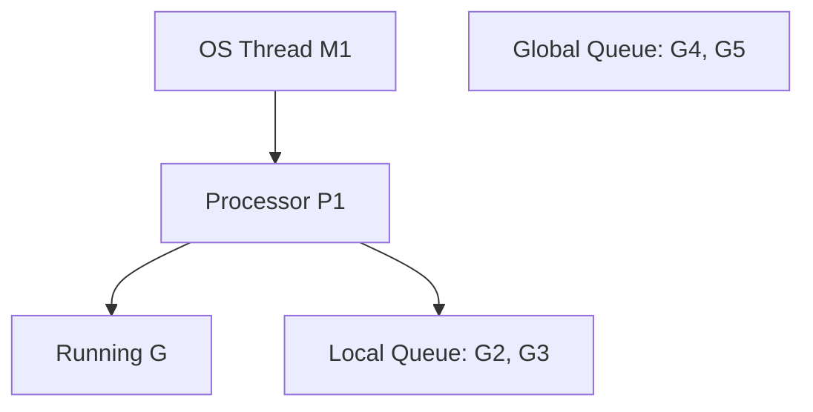

# Go (Golang) Interview Questions (60+ Deep Dive Q&A)

## 1. Core Architecture (GMP & Runtime)

<AccordionGroup>
<Accordion title="1. GMP Scheduler Model (Visualized)">
**Answer**:
Go uses an M:N scheduler (M Goroutines on N OS Threads).
**Components**:
*   **G (Goroutine)**: Stack (2KB). State.
*   **M (Machine)**: OS Thread. Executes instructions.
*   **P (Processor)**: Resource/Context required to run Go code. Has a Local Run Queue of Gs.
**Diagram**:

**Stealing**: If P1 empties its queue, it steals half of P2's queue.
</Accordion>

<Accordion title="2. Goroutine vs OS Thread">
**Answer**:
| Feature | Goroutine | OS Thread |
| :--- | :--- | :--- |
| **Size** | ~2KB (Growable) | ~1-2MB (Fixed) |
| **Creation** | Cheap (User space) | Expensive (Kernel call) |
| **Switching** | Fast (Registers only) | Slow (Context switch) |
| **Scheduler** | Go Runtime | OS Kernel |
</Accordion>

<Accordion title="3. Garbage Collection (Tricolor Mark & Sweep)">
**Answer**:
Concurrent, Non-generational (mostly).
1.  **Mark**: Starts from Roots (Globals, Stacks).
    *   **White**: Unreachable.
    *   **Grey**: Reachable, children not scanned.
    *   **Black**: Reachable, children scanned.
2.  **Write Barrier**: Ensures no "Black" object points to "White" object during concurrent run.
3.  **Sweep**: Reclaim White objects.
**Goal**: Low Latency (Stop The World < 500 microseconds).
</Accordion>

<Accordion title="4. Stack Growth (Contiguous vs Split)">
**Answer**:
Go uses **Contiguous Stacks**.
When 2KB is full, runtime allocates a larger stack (2x) and **copies** the data over.
Adjusts pointers to point to new stack.
(Old versions used "Split Stacks" / linked list chunks, but it caused "Hot Split" performance issues).
</Accordion>

<Accordion title="5. Panic vs Error">
**Answer**:
*   **Error**: Expected failure (File not found). Values returned as last argument. Checked explicitly.
*   **Panic**: Unexpected failure (Index out of range, Nil pointer). Aborts execution.
*   **Recover**: `recover()` inside `defer` catches panic and resumes normal flow.
</Accordion>

<Accordion title="6. `defer` Internals">
**Answer**:
LIFO (Last In First Out). Stack based.
Arguments evaluated **at call time**.
Execution happens **at return time**.
**Performance**: `defer` had overhead in Go 1.13, but in 1.14+ (Open Coded Defer) it is nearly zero-cost (inlined).
</Accordion>

<Accordion title="7. Map Internals">
**Answer**:
Hash Table with Buckets.
*   **Bucket**: Array of 8 top-hash bits. Array of 8 Keys. Array of 8 Values. Overflow pointer.
*   **Load Factor**: 6.5.
*   **Evacuation**: When growing, buckets are incrementally moved to new array (gradual resize).
</Accordion>

<Accordion title="8. Slice vs Array">
**Answer**:
*   **Array**: Value type. Fixed length. `[5]int`. Copying array copies all elements.
*   **Slice**: Reference type (Header). Dynamic. `[]int`.
    *   **Struct**: `{ ptr *array, len int, cap int }`.
    *   Passing slice to function copies the struct (cheap), but ptr points to same data.
</Accordion>

<Accordion title="9. Context Package (`context`)">
**Answer**:
Propagating Cancellation and Deadlines across API boundaries.
*   `WithCancel()`: Returns a function to cancel children.
*   `WithTimeout()`: Cancels after time.
*   `WithValue()`: Request-scoped data (Trace ID). **Don't abuse**.
```go
ctx, cancel := context.WithTimeout(context.Background(), 2*time.Second)
defer cancel()
req, _ := http.NewRequestWithContext(ctx, ...)
```
</Accordion>

<Accordion title="10. Pointers (Stack vs Heap Allocation)">
**Answer**:
Go does **Escape Analysis**.
If compiler proves variable is not used outside function -> **Stack** (Fast).
If `return &x` (escapes) -> **Heap** (GC pressure).
`go build -gcflags="-m"` shows escape analysis.
</Accordion>
</AccordionGroup>

## 2. Concurrency Primitives (Channels)

<AccordionGroup>
<Accordion title="11. Unbuffered vs Buffered Channels">
**Answer**:
*   **Unbuffered**: `make(chan int)`. Synchronous. Sender blocks until Receiver deals. Receiver blocks until Sender sends. "Rendezvous".
*   **Buffered**: `make(chan int, 5)`. Asynchronous. Sender blocks only if buffer full. Receiver blocks only if buffer empty.
</Accordion>

<Accordion title="12. `select` Statement">
**Answer**:
Like `switch` but for channels.
Blocks until **one** case is ready.
If multiple ready, picks **randomly** (Pseudo-random).
**Timeout Pattern**:
```go
select {
case msg := <-ch:
    process(msg)
case <-time.After(1 * time.Second):
    return "Timeout"
}
```
</Accordion>

<Accordion title="13. Nil Channel behavior">
**Answer**:
*   Send to nil: **Blocks Forever**.
*   Receive from nil: **Blocks Forever**.
*   Close nil: **Panic**.
**Use**: Disable a `select` case dynamically by setting channel var to nil.
</Accordion>

<Accordion title="14. Closing Channels">
**Answer**:
Sender closes. Receiver checks.
`val, ok := <-ch`. If closed, `ok` is false, `val` is zero-value.
Sending to closed chan: **Panic**.
Closing already closed: **Panic**.
</Accordion>

<Accordion title="15. Worker Pool Pattern">
**Answer**:
Limit concurrency (e.g., max 5 DB connections).
1.  **Jobs Channel**: Buffered.
2.  **Workers**: Loop `range jobs`.
3.  **WaitGroup**: Wait for workers to finish.
</Accordion>

<Accordion title="16. `sync.WaitGroup`">
**Answer**:
Wait for N goroutines.
`Add(1)`, `Done()`, `Wait()`.
**Trap**: Must pass pointer `*sync.WaitGroup` to functions, or it gets copied (deadlock).
</Accordion>

<Accordion title="17. `sync.Mutex` vs `RWMutex`">
**Answer**:
*   **Mutex**: `Lock()` blocks everyone.
*   **RWMutex**: `RLock()` (Read Lock) allows multiple readers. `Lock()` (Write Lock) blocks readers and writers.
Use RWMutex if Reads >> Writes (90/10 ratio).
</Accordion>

<Accordion title="18. `sync.Once`">
**Answer**:
Guarantees function runs exactly once (Singleton init).
Thread-safe.
```go
var once sync.Once
once.Do(func() { config = load() })
```
Uses atomic counters internally.
</Accordion>

<Accordion title="19. `atomic` Package">
**Answer**:
Low-level primitives (`AddInt64`, `CompareAndSwap`).
Faster than Mutex but harder to get right.
Safe for simple counters.
</Accordion>

<Accordion title="20. Race Detector">
**Answer**:
`go run -race app.go`.
Compiles with instrumentation to detect data races at runtime.
Performance hit (10x slow). Run in CI/Tests.
</Accordion>
</AccordionGroup>

## 3. Interfaces & Design

<AccordionGroup>
<Accordion title="21. Implicit Interface Implementation">
**Answer**:
Types don't declare `implements Interface`.
If Type has methods `Read()` and `Write()`, it implements `io.ReadWriter` automatically.
Decouples implementation from abstraction.
</Accordion>

<Accordion title="22. Empty Interface `interface{}` (any)">
**Answer**:
Holds **any** type.
Under the hood: struct `eface { _type, data }`.
*   `_type`: Pointer to type metadata.
*   `data`: Pointer to value.
**Use**: `fmt.Println`, JSON marshalling.
</Accordion>

<Accordion title="23. Type Assertion vs Type Switch">
**Answer**:
*   **Assertion**: `s, ok := val.(string)`. Check specific type.
*   **Switch**:
    ```go
    switch v := val.(type) {
    case int: ...
    case string: ...
    }
    ```
</Accordion>

<Accordion title="24. Interface Nil vs Value Nil">
**Answer**:
**Gotcha**: An interface containing a nil pointer is **NOT** nil.
```go
var p *int = nil
var i interface{} = p
i == nil // FALSE! (Contains type *int with value nil)
```
</Accordion>

<Accordion title="25. Embedding (Composition)">
**Answer**:
Go has no inheritance.
Struct embedding promotes methods.
```go
type Base struct {}
func (b Base) Say() {}

type Child struct { Base }
c := Child{}; c.Say() // Works
```
`Child` IS NOT `Base`. It HAS `Base`.
</Accordion>

<Accordion title="26. Functional Options Pattern">
**Answer**:
Clean API for config.
```go
func NewServer(opts ...Option) { ... }
func WithPort(p int) Option {
    return func(s *Server) { s.port = p }
}
```
Better than "Config Struct" or "Builder" in simple cases.
</Accordion>

<Accordion title="27. Meaning of `make` vs `new`">
**Answer**:
*   `new(T)`: Allocates memory (zeroed). Returns `*T`. Used for Structs, Ints.
*   `make(T)`: Initializes internal structure. Returns `T`. Used for **Slices, Maps, Channels**.
</Accordion>

<Accordion title="28. Standard Lib packages to know">
**Answer**:
*   `net/http`: Robust server/client.
*   `encoding/json`: Marshalling.
*   `io`, `bufio`: Readers/Writers.
*   `sync`: Primitives.
*   `time`: Durations, Tickers.
</Accordion>

<Accordion title="29. Error Handling Best Practices">
**Answer**:
1.  Check errors immediately.
2.  Wrap errors: `fmt.Errorf("reading file: %w", err)`.
3.  Use `errors.Is` (check type) and `errors.As` (unwrap).
4.  Don't panic.
</Accordion>

<Accordion title="30. Go Modules (`go.mod`)">
**Answer**:
Dependency Management.
Semantic Versioning (`v1.2.3`).
`go.sum`: Checksum database for security.
`replace` directive: Local development override.
</Accordion>
</AccordionGroup>

## 4. Coding Scenarios & Snippets

<AccordionGroup>
<Accordion title="31. Fan-In Pattern">
**Code**:
Multiplex multiple channels into one.
```go
func fanIn(ch1, ch2 <-chan string) <-chan string {
    out := make(chan string)
    go func() {
        for {
            select {
            case s := <-ch1: out <- s
            case s := <-ch2: out <- s
            }
        }
    }()
    return out
}
```
</Accordion>

<Accordion title="32. Pipeline Pattern">
**Code**:
Series of stages connected by channels.
Generator -> Square -> Print.
```go
func gen(nums ...int) <-chan int {
    out := make(chan int)
    go func() { for _, n := range nums { out <- n }; close(out) }()
    return out
}
```
</Accordion>

<Accordion title="33. Graceful Shutdown">
**Code**:
Catch SIGTERM/SIGINT.
```go
ctx, stop := signal.NotifyContext(context.Background(), os.Interrupt)
defer stop()

srv := &http.Server{}
go srv.ListenAndServe()

<-ctx.Done() // Wait for signal
srv.Shutdown(context.Background())
```
</Accordion>

<Accordion title="34. Reverse String (Rune aware)">
**Code**:
Go strings are UTF-8 bytes. Must convert to `rune`.
```go
func reverse(s string) string {
    runes := []rune(s)
    for i, j := 0, len(runes)-1; i < j; i, j = i+1, j-1 {
        runes[i], runes[j] = runes[j], runes[i]
    }
    return string(runes)
}
```
</Accordion>

<Accordion title="35. Check Map key existence">
**Code**:
```go
val, ok := m["key"]
if ok {
    // exists
}
```
</Accordion>

<Accordion title="36. Singleton (Thread Safe)">
**Code**:
```go
var once sync.Once
var instance *Config

func GetConfig() *Config {
    once.Do(func() {
        instance = &Config{}
    })
    return instance
}
```
</Accordion>

<Accordion title="37. Rate Limiter (Token Bucket)">
**Code**:
Use Buffered Channel or `time.Ticker`.
```go
limiter := time.Tick(200 * time.Millisecond) // 5 req/sec
for req := range requests {
    <-limiter
    process(req)
}
```
</Accordion>

<Accordion title="38. HTTP Middleware">
**Code**:
Function wrapping a Handler.
```go
func Logging(next http.Handler) http.Handler {
    return http.HandlerFunc(func(w http.ResponseWriter, r *http.Request) {
        log.Println(r.URL)
        next.ServeHTTP(w, r)
    })
}
```
</Accordion>

<Accordion title="39. Testing (Table Driven)">
**Code**:
```go
func TestAdd(t *testing.T) {
    tests := []struct{ a, b, want int }{
        {1, 2, 3},
        {0, 0, 0},
    }
    for _, tt := range tests {
        if got := Add(tt.a, tt.b); got != tt.want {
            t.Errorf("Add(%d, %d) = %d; want %d", tt.a, tt.b, got, tt.want)
        }
    }
}
```
</Accordion>

<Accordion title="40. JSON Custom Marshal">
**Code**:
```go
func (u User) MarshalJSON() ([]byte, error) {
    return json.Marshal(struct{
        Name string `json:"name"`
        Role string `json:"role"`
    }{
        Name: u.Name,
        Role: "Admin", // Force override
    })
}
```
</Accordion>
</AccordionGroup>

## 5. Edge Cases & Trivia

<AccordionGroup>
<Accordion title="41. `range` loop variable trap">
**Answer**:
(Fixed in Go 1.22!)
Before 1.22: Loop variable `v` is reused. Taking `&v` yields same pointer.
```go
for _, v := range items {
    go func() { print(v) }() // Printed same value for all
}
```
Fix: `v := v` (shadowing) inside loop.
</Accordion>

<Accordion title="42. Slice Capacity leak">
**Answer**:
Slicing a huge array `huge[:2]` keeps the underlying array in memory.
GC cannot collect the huge array.
**Fix**: `copy` small data to new slice.
</Accordion>

<Accordion title="43. `init()` function">
**Answer**:
Runs before `main()`.
Order: Imports -> Consts -> Vars -> Init.
Avoid side effects (DB connections) in init. Hard to test.
</Accordion>

<Accordion title="44. Stack vs Heap (size)">
**Answer**:
Goroutine Stack: Starts 2KB. Grows up to 1GB (64-bit).
Heap: Limited by RAM.
</Accordion>

<Accordion title="45. Why no Generics (until 1.18)?">
**Answer**:
Tradeoff between Compilation Speed, Execution Speed, and Programmer Time.
Go team waited for a design (Type Sets) that didn't slow down compile time (like C++ Templates) or runtime (like Java Erasure).
</Accordion>

<Accordion title="46. `struct{}` (Empty Struct)">
**Answer**:
Size: 0 Bytes.
Use:
1.  `map[string]struct{}`: Set (Hashset). Save memory vs bool (1 byte).
2.  `chan struct{}`: Signal only.
</Accordion>

<Accordion title="47. Method Receiver (Value vs Pointer)">
**Answer**:
*   `(s MyStruct)`: Copy. Immutable (changes lost).
*   `(s *MyStruct)`: Pointer. Mutable.
**Rule**: If you need to mutate, OR structure is large (> measureable bytes), uses pointer.
</Accordion>

<Accordion title="48. Can you recover from `fatal error: all goroutines are asleep - deadlock`?">
**Answer**:
No. Runtime detects deadlock and crashes.
WaitGroups/Channels mismatch.
</Accordion>

<Accordion title="49. Internal ABI (Application Binary Interface)">
**Answer**:
Go 1.17 switched to **Register-based calling convention** (from Stack-based).
~5% performance boost.
Arguments passed in registers (RAX, RBX, etc) instead of pushing to stack.
</Accordion>

<Accordion title="50. Reflect Package performance">
**Answer**:
Slow. Avoid if possible.
Used by `json`, `fmt`.
Bypasses type safety.
</Accordion>
</AccordionGroup>

## 6. Advanced Go 1.22+ Features

<AccordionGroup>
<Accordion title="51. Loop Variable Fix">
**Answer**:
Go 1.22 made `for i := range` create a NEW variable per iteration.
Removes common closure bug.
</Accordion>

<Accordion title="52. `Creating Slices` efficient">
**Answer**:
`slices` package (1.21).
`slices.Sort()`, `slices.Contains()`.
Written with Generics.
</Accordion>

<Accordion title="53. Range over Integers">
**Answer**:
Go 1.22:
`for i := range 10 { ... }`. (0 to 9).
</Accordion>

<Accordion title="54. `http.ServeMux` enhancements">
**Answer**:
Go 1.22 Mux supports methods and wildcards.
`mux.HandleFunc("POST /items/{id}", ...)`
Less need for `Chi` or `Gorilla`.
</Accordion>

<Accordion title="55. Arena (Experiment)">
**Answer**:
Manual memory management.
Allocate objects in a region, free region at once.
Bypasses GC. Extreme performance (HFT).
</Accordion>

<Accordion title="56. `sync.Map`">
**Answer**:
Optimized for:
1.  Write Once, Read Many (Cache).
2.  Disjoint keys (CPUs working on diff keys).
Generic `Map` causes cache contention on the Lock/Buckets. `sync.Map` reduces this.
</Accordion>

<Accordion title="57. Profile-Guided Optimization (PGO)">
**Answer**:
Go 1.20+.
Compile with a CPU profile (`default.pgo`).
Compiler inlines hot functions better. ~2-7% speedup.
</Accordion>

<Accordion title="58. Finalizers (`SetFinalizer`)">
**Answer**:
Run function when object is GC'd.
**Trap**: Unpredictable. Might never run. Delays GC.
Don't use for closing files. Use `defer`.
</Accordion>

<Accordion title="59. `unsafe` package">
**Answer**:
Bypass type system. Read memory arbitrarily.
`unsafe.Pointer` (void*).
Use: Serialization, Syscalls, Hacking private fields (Don't do it).
</Accordion>

<Accordion title="60. Go Assembly">
**Answer**:
Pseudo-assembly. Architecture independent (mostly).
Used in math/crypto/atomic packages for SIMD instructions.
</Accordion>
</AccordionGroup>
