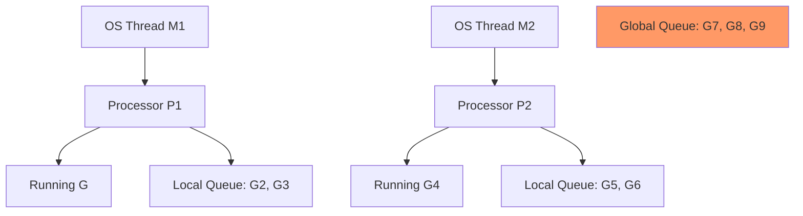

# Go (Golang) Interview Questions (70+ Deep Dive Q&A)

## 1. Core Architecture (GMP & Runtime)

<AccordionGroup>
<Accordion title="1. GMP Scheduler Model (Visualized)">
**Answer**:
Go uses an M:N scheduler — it multiplexes M Goroutines onto N OS Threads. This is the key design that lets Go handle millions of concurrent tasks on a handful of threads.

**Components**:
*   **G (Goroutine)**: The unit of work. Starts with a 2KB stack (grows dynamically up to 1GB on 64-bit). Contains function pointer, stack pointer, and status (runnable, running, waiting, dead).
*   **M (Machine)**: An actual OS thread. Executes machine instructions. The runtime caps M count at 10,000 by default (`GOMAXPROCS` does NOT control M count — it controls P count).
*   **P (Processor)**: A logical processor — the scheduling context required to execute Go code. Each P has a **Local Run Queue** (LRQ) of up to 256 Gs. Number of Ps = `GOMAXPROCS` (defaults to number of CPU cores).

**Diagram**:

```mermaid
graph TD
    M1[OS Thread M1] --> P1[Processor P1]
    P1 --> G1[Running G]
    P1 --> LQ1[Local Queue: G2, G3]
    M2[OS Thread M2] --> P2[Processor P2]
    P2 --> G4[Running G4]
    P2 --> LQ2[Local Queue: G5, G6]
    Global[Global Queue: G7, G8, G9]
    style Global fill:#f96
```

**Scheduling Flow** (what happens when `go func()` is called):
1.  New G is created and placed onto the **current P's local queue**
2.  If the local queue is full (256 Gs), half are moved to the **Global Run Queue**
3.  When P finishes running a G, it pops the next G from its local queue
4.  If local queue is empty, P tries to **steal half** of another P's local queue (work-stealing)
5.  If no other P has work, P checks the **Global Queue** (requires lock, so checked less frequently — every 61 scheduling ticks to prevent starvation)
6.  If still nothing, P checks the **network poller** for Gs waiting on I/O

**Key design decisions**:
*   **Work-stealing** avoids the bottleneck of a single global queue. Each P's local queue is a lock-free ring buffer
*   **Handoff**: If an M blocks on a syscall, the runtime detaches P from that M and assigns P to a new (or idle) M so other Gs keep running. This is why Go handles blocking I/O well despite multiplexing
*   **Spinning threads**: Idle Ms "spin" briefly before parking, reducing latency for newly created Gs (avoids the cost of waking a parked thread)

**What interviewers are really testing**: Whether you understand that GOMAXPROCS limits Ps not Ms, why work-stealing matters for throughput, and the handoff mechanism for blocking calls.

**Red flag answer**: "GOMAXPROCS sets how many threads Go uses" — wrong. It sets the number of Ps (logical processors). Ms (OS threads) can exceed GOMAXPROCS when threads are blocked in syscalls.

**Follow-up**:
1. What happens when a goroutine makes a blocking syscall like `file.Read()`? (Answer: M is parked, P is handed off to another M)
2. How does the network poller differ from blocking syscall handling? (Answer: `netpoll` uses epoll/kqueue — Gs waiting on network I/O are parked without blocking any M)
3. What would happen if you set GOMAXPROCS to 1 in a CPU-bound workload with 1000 goroutines? (Answer: All goroutines serialize on a single P — effectively single-threaded execution, no parallelism, but concurrency still works via cooperative scheduling)
</Accordion>

<Accordion title="2. Goroutine vs OS Thread">
**Answer**:

| Feature | Goroutine | OS Thread |
| :--- | :--- | :--- |
| **Size** | ~2KB initial (grows to 1GB) | ~1-8MB fixed (OS dependent, Linux default 8MB) |
| **Creation** | ~0.3 microseconds (user space) | ~10-30 microseconds (kernel syscall `clone()`) |
| **Context Switch** | ~50-200ns (save/restore ~15 registers, no kernel transition) | ~1-5 microseconds (full kernel context switch, TLB flush) |
| **Scheduler** | Go Runtime (cooperative + preemptive since Go 1.14) | OS Kernel (fully preemptive) |
| **Max count** | Millions (limited by memory) | Thousands (limited by kernel, default ~32K on Linux) |
| **Stack** | Dynamically grown (contiguous, copied) | Fixed at creation time |

**Real-world implication**: A typical Go HTTP server can handle 100K concurrent connections on a single machine with 100K goroutines consuming ~200MB of stack memory. Doing the same with OS threads would require 100K x 8MB = 800GB — impossible.

**Cooperative vs Preemptive scheduling**:
*   Before Go 1.14: Goroutines yielded only at function calls, channel ops, or syscalls. A tight `for` loop with no function calls could starve other goroutines (the "tight loop" problem)
*   Go 1.14+: **Asynchronous preemption** via signals (`SIGURG` on Linux). The runtime can interrupt any goroutine at safe points, even in tight loops. This was a major improvement for latency-sensitive workloads

**What interviewers are really testing**: Do you understand the cost model of goroutines vs threads, and can you explain WHY goroutines are cheaper (user-space scheduling, smaller stacks, no kernel transition)?

**Red flag answer**: "Goroutines are lightweight threads" without explaining what makes them lightweight — this is surface-level regurgitation.

**Follow-up**:
1. Can you have a goroutine leak? How would you detect it? (Answer: Yes — goroutines waiting on channels/locks that never resolve. Detect with `runtime.NumGoroutine()`, `pprof` goroutine profiles, or tools like `goleak` from Uber)
2. What changed in Go 1.14 regarding goroutine preemption? (Answer: Asynchronous preemption via OS signals — solves the tight-loop starvation problem)
3. If goroutines are so cheap, why would you ever use a worker pool instead of spawning unlimited goroutines? (Answer: To bound resource usage — e.g., max DB connections, file descriptors, or memory. Unbounded goroutines can overwhelm downstream systems or exhaust memory)
</Accordion>

<Accordion title="3. Garbage Collection (Tricolor Mark & Sweep)">
**Answer**:
Go's GC is **concurrent, non-generational, tricolor mark-and-sweep** with a **write barrier**. The core design goal is **low latency** over maximum throughput — sub-millisecond STW pauses even for heaps in the tens of GB range.

**Tricolor Algorithm**:
1.  **Mark Phase** (concurrent with application):
    *   Start from **roots**: globals, goroutine stacks, registers
    *   **White**: Not yet visited (potentially garbage)
    *   **Grey**: Visited, but children not yet scanned
    *   **Black**: Visited, all children scanned (definitely alive)
    *   Objects move: White -> Grey -> Black
2.  **Write Barrier** (critical for correctness):
    *   The **hybrid write barrier** (Go 1.8+) ensures the invariant: **no black object points directly to a white object**
    *   Without this, a concurrent mutator could hide a live object from the collector, causing it to be freed (use-after-free)
    *   The write barrier adds ~5-15% overhead to pointer writes during GC
3.  **Sweep Phase** (concurrent):
    *   All remaining white objects are garbage — their memory is reclaimed
    *   Sweeping happens lazily (on allocation) or in background goroutines

**STW (Stop The World) Pauses**:
*   Go's GC has two brief STW phases: (1) enabling the write barrier at mark start, (2) re-scanning stacks at mark termination
*   Target: &lt;500 microseconds per pause. In practice, Go 1.19+ achieves &lt;100 microseconds for most workloads
*   You can observe pauses via `GODEBUG=gctrace=1` or the `runtime/metrics` package

**Tuning**:
*   `GOGC` (default 100): Controls GC frequency. `GOGC=100` means GC triggers when heap grows 100% since last collection. `GOGC=200` means GC triggers at 200% growth (less frequent, more memory). `GOGC=off` disables GC (dangerous)
*   `GOMEMLIMIT` (Go 1.19+): Soft memory limit. The runtime will GC more aggressively to stay under this limit. This was a game-changer for containerized workloads where you know your memory budget
*   **Ballast pattern** (pre-1.19): Allocate a large `[]byte` to inflate heap size and reduce GC frequency. Obsoleted by `GOMEMLIMIT`

**Why non-generational?**:
*   Go allocates many short-lived objects on the **stack** (via escape analysis), which never touch the GC at all. This eliminates the main benefit of generational GC
*   Generational GC requires a write barrier for ALL pointer writes (not just during GC), which would add constant overhead to every pointer assignment

**What interviewers are really testing**: Can you explain the tricolor invariant, why the write barrier exists, and how to tune GC for production workloads?

**Red flag answer**: "Go uses mark-and-sweep" without mentioning concurrency, write barriers, or the tricolor model. Also: claiming Go has generational GC.

**Follow-up**:
1. Your Go service is experiencing GC pauses of 5ms. How do you diagnose and fix it? (Answer: Enable `gctrace`, use `pprof` heap profile, check allocation rate. Common fixes: reduce allocations with `sync.Pool`, increase `GOGC`, set `GOMEMLIMIT`, pre-allocate slices)
2. What is `sync.Pool` and how does it interact with GC? (Answer: A per-P pool of reusable objects. Pools are cleared every GC cycle. Good for reducing allocation rate of short-lived objects like buffers)
3. How does GOMEMLIMIT differ from setting GOGC=off with manual memory management? (Answer: GOMEMLIMIT is a soft limit — GC still runs but more aggressively near the limit. `GOGC=off` disables GC entirely, risking OOM. `GOMEMLIMIT` gives you the best of both: low GC overhead when memory is plentiful, aggressive collection when approaching the limit)
</Accordion>

<Accordion title="4. Stack Growth (Contiguous vs Split)">
**Answer**:
Go uses **contiguous stacks** (since Go 1.4). When a goroutine's 2KB stack is exhausted, the runtime:
1.  Allocates a **new stack 2x the size** of the current one
2.  **Copies** the entire old stack to the new stack
3.  **Adjusts all pointers** on the stack to point to the new locations (this is why Go doesn't allow interior pointers to stack-allocated objects from the heap)
4.  Frees the old stack

**Why not split stacks (the old approach)?**:
*   Go 1.0-1.3 used **segmented (split) stacks**: linked list of small stack chunks
*   Problem: **Hot split** — if a function call sits right at a stack boundary, it repeatedly allocates and frees a new segment on every call. This caused pathological performance (10x slowdown in tight loops near the boundary)
*   Contiguous stacks eliminate hot split entirely at the cost of occasional copies

**Stack shrinking**: Stacks also shrink. During GC, if a stack is using less than 1/4 of its capacity, the runtime copies it to a smaller allocation. This prevents goroutines that briefly needed a large stack from holding that memory forever.

**Practical implications**:
*   Deep recursion is fine — stacks grow dynamically. But each growth triggers a copy, so very deep recursion has hidden allocation costs
*   The stack growth check (`morestack`) is inserted by the compiler at function prologues. This is also the mechanism used for cooperative scheduling (pre-Go 1.14)
*   `runtime.debug.SetMaxStack` can limit maximum stack size (default 1GB on 64-bit)

**What interviewers are really testing**: Understanding that Go stacks are dynamic (not fixed like C/Java threads), why contiguous stacks replaced segmented stacks, and the performance implications of stack copying.

**Red flag answer**: "Goroutines have a fixed 2KB stack" — wrong, 2KB is the initial size, it grows dynamically.

**Follow-up**:
1. How does stack growth interact with escape analysis? (Answer: If the compiler can't prove a variable stays on the stack, it escapes to the heap. Stack-to-heap escape avoids the problem of pointers to stack memory that might be invalidated during stack copying)
2. What is the "hot split" problem and why did Go move away from segmented stacks? (Answer: Repeated allocation/deallocation of stack segments when a function call oscillates around the segment boundary)
3. Could you use goroutines for deep recursive algorithms? What are the trade-offs? (Answer: Yes, stacks grow dynamically up to 1GB. But each doubling triggers a copy of the entire stack — at 1MB stack size, that is a 1MB memcpy. For very deep recursion, iterative solutions or explicit stacks may perform better)
</Accordion>

<Accordion title="5. Panic vs Error">
**Answer**:
*   **Error**: Go's primary mechanism for expected failures. Errors are **values** (not exceptions) returned as the last return value. The `error` interface has a single method: `Error() string`. This design forces explicit error handling at every call site — no hidden control flow.
    *   Examples: file not found, network timeout, invalid input, permission denied
    *   Pattern: `result, err := doSomething(); if err != nil { return fmt.Errorf("context: %w", err) }`
*   **Panic**: For **truly unexpected** failures — programmer errors or unrecoverable states. Unwinds the stack, running `defer` functions along the way.
    *   Examples: index out of bounds, nil pointer dereference, assertion failures in your own code
    *   When a goroutine panics without recovery, the **entire process crashes** (not just that goroutine)
*   **Recover**: `recover()` called inside a `defer` function catches the panic value and resumes normal flow. Only works in the **same goroutine** that panicked.
    *   Use case: HTTP servers use `recover()` in middleware to catch panics in handlers and return 500 instead of crashing the entire server

**When to panic (and when NOT to)**:
*   **Panic**: Initialization failures (`log.Fatal` in `main`), impossible states that indicate a bug, enforcing programmer invariants
*   **Don't panic**: User input validation, network errors, database timeouts, file I/O — these are all expected failures that should be errors
*   **Library code should almost never panic**. If it does, it should be clearly documented (e.g., `regexp.MustCompile` panics on invalid regex — appropriate because it is called with compile-time-known patterns)

**Production pattern** — panic recovery middleware:
```go
func RecoverMiddleware(next http.Handler) http.Handler {
    return http.HandlerFunc(func(w http.ResponseWriter, r *http.Request) {
        defer func() {
            if err := recover(); err != nil {
                log.Printf("panic: %v\n%s", err, debug.Stack())
                http.Error(w, "Internal Server Error", 500)
            }
        }()
        next.ServeHTTP(w, r)
    })
}
```

**What interviewers are really testing**: Do you understand Go's philosophy of errors-as-values vs exceptions? Do you know the boundary between error and panic?

**Red flag answer**: "I use panic for error handling" or "Recover is like try-catch" — both reveal fundamental misunderstanding of Go idioms.

**Follow-up**:
1. Why did Go choose errors-as-values over exceptions? (Answer: Explicit control flow, no hidden paths, forces developers to handle errors at the call site. Exceptions in Java/Python create invisible control flow jumps that are hard to reason about)
2. Can you recover from a panic in a different goroutine? (Answer: No. `recover()` only works within the same goroutine that panicked. If a child goroutine panics without recovery, the entire program crashes)
3. What is the difference between `errors.Is` and `errors.As`? When do you use each? (Answer: `errors.Is` checks for a specific error value in the chain (like `io.EOF`). `errors.As` extracts a specific error type from the chain for inspection. Use `Is` for sentinel errors, `As` for typed errors)
</Accordion>

<Accordion title="6. `defer` Internals">
**Answer**:
`defer` schedules a function call to execute when the enclosing function returns. Deferred calls follow **LIFO** (Last In, First Out) order.

**Critical rule**: Arguments to deferred functions are evaluated **at the time of the `defer` statement**, not at execution time.
```go
x := 1
defer fmt.Println(x) // Captures x=1 NOW
x = 2
// Prints: 1 (not 2)
```

**But closures capture by reference**:
```go
x := 1
defer func() { fmt.Println(x) }() // Closure captures &x
x = 2
// Prints: 2 (closure reads x at execution time)
```

**Performance evolution**:
*   **Go 1.12 and earlier**: `defer` allocated a struct on the heap and linked it to the goroutine's defer chain. Cost: ~35ns per defer. For hot paths (e.g., mutex lock/unlock), this was measurable
*   **Go 1.13**: Introduced **stack-allocated defer records** for simple cases — reduced overhead to ~6ns
*   **Go 1.14+**: **Open-coded defers** — the compiler inlines defer logic directly at each return point. Nearly **zero cost** for defers that don't involve loops or conditional defer statements. This made `defer mu.Unlock()` free in practice

**Common patterns**:
1.  **Resource cleanup**: `f, _ := os.Open("file"); defer f.Close()`
2.  **Mutex release**: `mu.Lock(); defer mu.Unlock()`
3.  **Panic recovery**: `defer func() { if r := recover(); r != nil { ... } }()`
4.  **Timing**: `defer func(start time.Time) { log.Println(time.Since(start)) }(time.Now())`

**Gotcha — defer in loops**:
```go
for _, file := range files {
    f, _ := os.Open(file)
    defer f.Close() // BAD: defers accumulate, files not closed until function returns
}
// Fix: wrap in a helper function or close explicitly
```

**What interviewers are really testing**: Do you understand the evaluation-time vs execution-time distinction, LIFO order, and the performance implications?

**Red flag answer**: Confusing when defer arguments are evaluated (at defer time) vs when the deferred function executes (at return time). Or not knowing about the loop trap.

**Follow-up**:
1. What does this print? `for i := 0; i < 3; i++ { defer fmt.Println(i) }` (Answer: `2, 1, 0` — LIFO order, arguments captured at defer time)
2. Why is `defer mu.Unlock()` idiomatic even though it delays the unlock until function return? (Answer: Clarity and safety outweigh the slightly delayed unlock. The open-coded defer optimization makes it nearly free. If the critical section is truly hot, you can manually unlock earlier)
3. What happens if a deferred function panics? (Answer: The panic propagates. If there is another deferred `recover()` above it in the LIFO chain, it can catch it. Multiple panics during unwind — the last one wins)
</Accordion>

<Accordion title="7. Map Internals">
**Answer**:
Go's `map` is a **hash table** implemented with an array of buckets.

**Internal structure**:
*   **Bucket**: Each bucket holds **8 key-value pairs** (not 1 like many hash table implementations)
    *   `tophash [8]uint8` — top 8 bits of each key's hash (used for fast comparison before checking full key)
    *   `keys [8]KeyType` — packed array of keys
    *   `values [8]ValueType` — packed array of values (keys and values stored separately for alignment/padding efficiency)
    *   `overflow *bucket` — pointer to overflow bucket if this one is full
*   **Load Factor**: 6.5 (average 6.5 entries per bucket before growth triggers). This is higher than most hash tables (Java HashMap uses 0.75) because Go's buckets hold 8 entries each
*   **Growth/Evacuation**: When load factor exceeds 6.5 or too many overflow buckets exist, the map doubles in size. Evacuation is **incremental** — old buckets are copied to the new array gradually during subsequent map operations (not all at once, which would cause latency spikes)

**Concurrency**:
*   **Maps are NOT thread-safe**. Concurrent reads are fine, but concurrent read+write or write+write causes a **fatal error** (not a race condition — the runtime explicitly detects and crashes): `fatal error: concurrent map read and map write`
*   Solutions: `sync.Mutex`, `sync.RWMutex`, or `sync.Map` (for specific access patterns)

**Iteration order**: **Randomized intentionally** since Go 1.0. The runtime randomizes map iteration order to prevent developers from depending on insertion order. If you need ordered iteration, sort the keys first.

**Performance characteristics**:
*   Average lookup: O(1)
*   Worst case: O(n) if all keys hash to same bucket (pathological)
*   Map operations are not inlined by the compiler — each operation is a function call to the runtime
*   For small maps (&lt;8 entries), a sorted slice with binary search can be faster due to cache locality

**What interviewers are really testing**: Understanding of the bucket structure, why 8 entries per bucket, load factor implications, and especially the thread-safety trap.

**Red flag answer**: "Maps are thread-safe for reads" — this is correct but incomplete. The real danger is concurrent write, which crashes the program (not just produces wrong results).

**Follow-up**:
1. Why does Go use 8-element buckets instead of separate chaining with linked lists? (Answer: Cache locality. 8 entries in a contiguous array means fewer cache misses compared to pointer-chasing in a linked list. The `tophash` array enables fast rejection without comparing full keys)
2. What happens if you take the address of a map value? Like `&m["key"]` (Answer: Compile error. Map values are not addressable because the map may reallocate during growth, invalidating any pointers)
3. When would you use `sync.Map` vs a regular map with `sync.RWMutex`? (Answer: `sync.Map` wins in two scenarios: (1) keys are written once and read many times, (2) goroutines access disjoint sets of keys. For general read/write patterns, `RWMutex` + regular map is faster)
</Accordion>

<Accordion title="8. Slice vs Array">
**Answer**:
*   **Array**: Value type. Fixed length at compile time. `[5]int`. Copying an array copies all elements (deep copy). The size is part of the type — `[5]int` and `[10]int` are **different types**.
*   **Slice**: A **descriptor** (header struct) pointing to an underlying array. Dynamic length. `[]int`.
    *   **Header struct**: `{ ptr *Elem, len int, cap int }` — 24 bytes on 64-bit systems
    *   Passing a slice to a function copies the **header** (cheap, 24 bytes) but the `ptr` still points to the same underlying array — modifications to elements are visible to the caller
    *   **Appending** may or may not allocate: if `len < cap`, the element is added in-place. If `len == cap`, a new underlying array is allocated (typically 2x for small slices, 1.25x for large ones since Go 1.18), data is copied, and the old array becomes eligible for GC

**Slice growth strategy** (Go 1.18+):
*   If current cap &lt; 256: new cap = old cap * 2
*   If current cap >= 256: new cap = old cap + old cap/4 + 192 (smoother growth to avoid wasting memory for large slices)

**Common gotcha — shared backing array**:
```go
a := []int{1, 2, 3, 4, 5}
b := a[1:3] // b = [2, 3], but shares backing array with a
b[0] = 99   // a is now [1, 99, 3, 4, 5]!
```

**Another gotcha — append mutation**:
```go
a := make([]int, 3, 5) // len=3, cap=5
b := a[:3]
b = append(b, 99) // Writes into a's backing array at index 3!
```

**Idiom for safe sub-slicing** (Go 1.2+): use a **three-index slice** to limit capacity:
```go
b := a[1:3:3] // len=2, cap=2 — any append to b will allocate a new array
```

**What interviewers are really testing**: Whether you understand the slice header, when append causes reallocation vs in-place mutation, and the shared backing array pitfall.

**Red flag answer**: "Slices are references to arrays" — this is imprecise. A slice is a struct with a pointer, length, and capacity. It is a value type that contains a pointer. Assigning a slice copies the header, not the underlying data.

**Follow-up**:
1. What is the output of `s := make([]int, 0, 5); s = append(s, 1); t := s; t = append(t, 2); s = append(s, 3); fmt.Println(s, t)`? (Answer: `[1 3] [1 2]` — both share the backing array but have independent len/cap headers. The second append to `s` overwrites position 1 where `t` wrote 2)
2. How would you efficiently pre-allocate a slice if you know the final size? (Answer: `make([]T, 0, expectedSize)` — avoids repeated reallocations during append. This is one of the most impactful micro-optimizations in Go)
3. When would you use an array instead of a slice? (Answer: When the size is known at compile time and you want value semantics — e.g., `[32]byte` for a hash, `[4]float64` for a vector. Arrays are also stack-allocated when they don't escape, avoiding GC overhead)
</Accordion>

<Accordion title="9. Context Package (`context`)">
**Answer**:
The `context` package propagates **cancellation signals, deadlines, and request-scoped values** across API boundaries and between goroutines. It is the standard way to control the lifecycle of operations in Go.

**Core types**:
*   `context.Background()`: Top-level context. Used in `main`, init, and tests. Never cancelled.
*   `context.TODO()`: Placeholder when you're unsure which context to use. Functionally identical to `Background()`, but signals intent: "I need to plumb context here but haven't figured out how yet."
*   `WithCancel(parent)`: Returns a new context and a `cancel` function. Calling `cancel()` propagates cancellation to all children.
*   `WithTimeout(parent, duration)`: Like `WithCancel` but auto-cancels after the duration.
*   `WithDeadline(parent, time)`: Like `WithTimeout` but takes an absolute time.
*   `WithValue(parent, key, val)`: Attaches a key-value pair. **Use sparingly** — only for request-scoped data like trace IDs, auth tokens, or request IDs.

**How cancellation propagates**: Contexts form a tree. Cancelling a parent cancels all its descendants. Each child monitors `ctx.Done()` (a channel that closes on cancellation).
```go
ctx, cancel := context.WithTimeout(context.Background(), 2*time.Second)
defer cancel() // ALWAYS defer cancel to release resources

req, _ := http.NewRequestWithContext(ctx, "GET", url, nil)
resp, err := client.Do(req)
if err != nil {
    // Could be: context.DeadlineExceeded or context.Canceled
}
```

**Production best practices**:
1.  **Always pass context as the first parameter**: `func DoWork(ctx context.Context, ...) error`
2.  **Always defer cancel**: Failing to cancel leaks goroutines and timers
3.  **Check `ctx.Err()` in long-running loops**: Enables cooperative cancellation
4.  **Don't store contexts in structs**: Pass them explicitly per-call
5.  **Use `WithValue` only for request-scoped data**: Never for function parameters, config, or optional arguments — that is what function parameters are for

**WithValue anti-patterns**:
*   Storing database connections, loggers, or config in context values — these should be explicit dependencies
*   Using string keys — use unexported type keys to avoid collisions: `type ctxKey struct{}`; `ctx = context.WithValue(ctx, ctxKey{}, val)`

**What interviewers are really testing**: Do you understand context propagation, when to cancel, and the `WithValue` anti-pattern?

**Red flag answer**: "I put the database connection in context.WithValue" — this is a well-known anti-pattern. Context values should be request-scoped metadata, not dependencies.

**Follow-up**:
1. What happens if you forget to call the cancel function returned by `WithCancel`? (Answer: The context and its goroutines/timers are not cleaned up until the parent is cancelled or the program exits — a resource leak. `go vet` warns about this)
2. How does context cancellation work under the hood? (Answer: `Done()` returns a channel. `cancel()` closes that channel. All goroutines selecting on `ctx.Done()` unblock immediately because receiving from a closed channel returns immediately)
3. Your HTTP handler spawns 3 goroutines for parallel work. How do you ensure they all stop if the client disconnects? (Answer: Pass the request context `r.Context()` to all goroutines. When the client disconnects, the server cancels the request context, which propagates to all children)
</Accordion>

<Accordion title="10. Pointers (Stack vs Heap Allocation / Escape Analysis)">
**Answer**:
Go's compiler performs **escape analysis** at compile time to determine whether a variable can live on the **stack** (fast, no GC) or must be allocated on the **heap** (GC-managed).

**The rule**: If the compiler can prove a variable is not referenced after the function returns, it stays on the stack. If it "escapes" — heap.

**Common escape triggers**:
1.  `return &x` — returning a pointer to a local variable
2.  Assigning to an interface (`var i interface{} = x` — the concrete value is heap-allocated)
3.  Sending a pointer over a channel
4.  Captured by a closure that outlives the function
5.  Exceeding stack size limits (very large allocations)
6.  `append()` that triggers a new backing array

**Inspecting escape analysis**:
```bash
go build -gcflags="-m" ./...         # Basic escape analysis output
go build -gcflags="-m -m" ./...      # Verbose (shows reasoning)
go build -gcflags="-l" ./...         # Disable inlining (useful for testing)
```

**Why this matters**: Stack allocation is essentially free — no GC pressure, no synchronization, just a stack pointer bump. Heap allocation requires the GC to track and eventually collect the object. In hot paths, unnecessary escapes can dominate performance.

**Optimization strategies**:
*   Return values instead of pointers when the struct is small (&lt;~128 bytes): `func NewThing() Thing` instead of `func NewThing() *Thing`
*   Pre-allocate slices to avoid `append`-triggered escapes
*   Use `sync.Pool` for frequently allocated/deallocated objects (buffers, temporary structs)
*   Avoid unnecessary interface conversions in hot paths

**Real-world example**: In a JSON-heavy microservice processing 50K req/s, switching from `func Parse(data []byte) (*Result, error)` to `func Parse(data []byte, result *Result) error` (caller provides the buffer) reduced heap allocations by 40% and GC pause time by 60%.

**What interviewers are really testing**: Do you understand the performance difference between stack and heap allocation, and can you use escape analysis to optimize code?

**Red flag answer**: "Go automatically manages memory so you don't need to think about allocation" — true for correctness, wrong for performance. Production Go engineers think about escape analysis constantly in hot paths.

**Follow-up**:
1. You run `go build -gcflags="-m"` and see "moved to heap". What do you do? (Answer: Check if the escape is necessary. If a pointer return causes it, consider returning the value instead. If an interface assignment causes it, consider generics or concrete types in the hot path)
2. Does `new(T)` always allocate on the heap? (Answer: No. Despite the name, `new(T)` can be stack-allocated if escape analysis proves the result doesn't escape. The compiler treats `new` and `&T{}` identically)
3. How does `sync.Pool` reduce GC pressure? (Answer: It caches allocated objects for reuse across GC cycles — well, objects survive until the next GC. By reusing objects instead of allocating new ones, you reduce the allocation rate, which directly reduces GC work. Common use: `bytes.Buffer` pools for HTTP response writing)
</Accordion>
</AccordionGroup>

## 2. Concurrency Primitives (Channels)

<AccordionGroup>
<Accordion title="11. Unbuffered vs Buffered Channels">
**Answer**:
*   **Unbuffered**: `make(chan int)`. **Synchronous rendezvous**. The sender blocks until a receiver is ready, and vice versa. Both goroutines must arrive at the channel operation simultaneously. This is a **synchronization primitive**, not just a data pipe.
*   **Buffered**: `make(chan int, 5)`. **Asynchronous up to buffer capacity**. Sender blocks only when the buffer is full. Receiver blocks only when the buffer is empty. This decouples sender and receiver timing.

**When to use which**:
*   **Unbuffered**: When you need a guaranteed handoff — the sender knows the receiver has the value. Great for signaling (e.g., `done := make(chan struct{})`), request-response patterns, or when you want backpressure
*   **Buffered**: When producer and consumer operate at different rates and you want to smooth bursts. Buffer size should be chosen deliberately, not arbitrarily
    *   Buffer of 1: Useful for "latest value" semantics or simple hand-off with one item of slack
    *   Buffer of N (known): When you know the exact number of items (e.g., `make(chan result, numWorkers)` to collect results from a fixed number of goroutines)
    *   **Anti-pattern**: Using large buffers to "fix" slow consumers — this just delays the problem. If the consumer is slower than the producer, you need backpressure or rate limiting, not a bigger buffer

**Internal mechanics**:
*   Channels use a **circular buffer** (for buffered channels) with `sendx` and `recvx` indices
*   Blocked senders/receivers are queued in **FIFO sudog lists** (`sendq` and `recvq`)
*   When a sender sends to an unbuffered channel with a waiting receiver, the value is copied **directly** from sender's stack to receiver's stack — no buffer intermediate

**Performance**:
*   Channel operations cost ~50-100ns (involves locking the channel's internal mutex)
*   For ultra-high-throughput scenarios (&gt;10M ops/sec), channels can become a bottleneck — consider lock-free structures or batching

**What interviewers are really testing**: Choosing the right channel type for a given problem, understanding buffered channel semantics vs just "making it bigger."

**Red flag answer**: "I always use buffered channels because they're faster" — this misses the synchronization semantics of unbuffered channels and often hides concurrency bugs.

**Follow-up**:
1. You have a producer generating 1000 events/sec and a consumer processing 500 events/sec. Does a buffered channel of size 10000 solve this? (Answer: No. It delays the problem by 10 seconds then blocks. You need to either speed up the consumer, add more consumers, or drop/batch events)
2. What happens if you send to a full buffered channel inside a `select` with a `default` case? (Answer: The `default` case fires immediately — the send is non-blocking. This is the standard pattern for "try-send" without blocking)
3. How are channels implemented internally? (Answer: A struct with a circular buffer, mutex, send/recv queues of waiting goroutines, and type metadata. The runtime uses `gopark`/`goready` to suspend and resume goroutines waiting on channels)
</Accordion>

<Accordion title="12. `select` Statement">
**Answer**:
`select` multiplexes across multiple channel operations. It is Go's equivalent of Unix `select(2)` / `epoll` but for channels.

**Semantics**:
*   Blocks until **one** case is ready
*   If **multiple** cases are ready simultaneously, picks one **uniformly at random** (prevents starvation of any particular channel)
*   `default` case makes it non-blocking — if no channel is ready, `default` executes immediately

**Key patterns**:

**Timeout**:
```go
select {
case msg := <-ch:
    process(msg)
case <-time.After(1 * time.Second):
    return errors.New("timeout")
}
```
Note: `time.After` leaks a timer if the message arrives before timeout. In loops, use `time.NewTimer` with `timer.Stop()` instead.

**Non-blocking send/receive**:
```go
select {
case ch <- value:
    // sent
default:
    // channel full or no receiver, drop or buffer
}
```

**Done/cancellation**:
```go
for {
    select {
    case <-ctx.Done():
        return ctx.Err()
    case item := <-workCh:
        process(item)
    }
}
```

**Priority select** (not natively supported, but achievable):
```go
// Check high-priority first
select {
case <-highPriority:
    handleHigh()
default:
    select {
    case <-highPriority:
        handleHigh()
    case <-lowPriority:
        handleLow()
    }
}
```

**Empty select** (`select {}`) blocks forever — useful for keeping `main` alive when goroutines do all the work. But prefer `signal.NotifyContext` for production servers.

**What interviewers are really testing**: Random case selection awareness, timeout patterns, and ability to compose complex channel logic.

**Red flag answer**: "Select picks the first ready case" — wrong. It picks randomly among ready cases. This is a very common misconception.

**Follow-up**:
1. Why does Go randomize the case selection in `select`? (Answer: To prevent channel starvation. If cases were evaluated top-to-bottom, the first case could monopolize selection when multiple channels are frequently ready)
2. What is the `time.After` leak and how do you fix it? (Answer: Each call to `time.After` creates a new timer that persists until it fires. In a loop, this leaks timers. Fix: use `time.NewTimer`, `defer timer.Stop()`, and `timer.Reset()` per iteration)
3. How would you implement a priority channel — always prefer reading from channel A over channel B? (Answer: Nested select — first try A alone with default, then select on both A and B. Not perfectly fair but gives A priority)
</Accordion>

<Accordion title="13. Nil Channel Behavior">
**Answer**:
*   **Send to nil channel**: **Blocks forever** (goroutine is parked permanently)
*   **Receive from nil channel**: **Blocks forever**
*   **Close nil channel**: **Panic** (`close of nil channel`)

**Why this is useful** (not just a gotcha):
The primary use case is **dynamically disabling `select` cases**. By setting a channel variable to `nil`, you effectively remove that case from future `select` evaluations without restructuring the code.

**Pattern — draining two channels until both are closed**:
```go
func merge(ch1, ch2 <-chan int) <-chan int {
    out := make(chan int)
    go func() {
        defer close(out)
        for ch1 != nil || ch2 != nil {
            select {
            case v, ok := <-ch1:
                if !ok { ch1 = nil; continue }
                out <- v
            case v, ok := <-ch2:
                if !ok { ch2 = nil; continue }
                out <- v
            }
        }
    }()
    return out
}
```
When `ch1` closes, setting it to `nil` means the `select` will never choose that case again — it effectively becomes a single-channel receive on `ch2`. Without nil channel semantics, you would need ugly flag variables and restructured logic.

**What interviewers are really testing**: Whether you know the practical application of nil channels (dynamic select case disabling), not just the trivia answer.

**Red flag answer**: Knowing nil channels block but not being able to explain a real use case for that behavior.

**Follow-up**:
1. You have a `select` with 3 channels. One channel is exhausted mid-operation. How do you cleanly stop selecting on it? (Answer: Set it to nil — the nil channel case will never be selected, effectively removing it from the select)
2. What is the zero value of a channel? (Answer: `nil`. This means an uninitialized `var ch chan int` is nil — sending/receiving on it blocks forever. Always use `make(chan int)` to create a usable channel)
3. If you have `select` with a nil channel case and a default case, what happens? (Answer: The default case fires immediately every time — the nil channel case is never ready)
</Accordion>

<Accordion title="14. Closing Channels">
**Answer**:
**Rules**:
*   Only the **sender** should close a channel. The receiver should not close it.
*   `val, ok := <-ch` — if `ok` is `false`, the channel is closed and `val` is the zero value of the channel's type
*   **Sending to a closed channel**: **Panic** (`send on closed channel`)
*   **Closing an already closed channel**: **Panic** (`close of closed channel`)
*   **Receiving from a closed channel**: Returns the zero value immediately (non-blocking). All remaining buffered values are drained first, then zero values are returned with `ok == false`
*   `range ch` loops until the channel is closed — the idiomatic way to consume all values

**Design principle**: Closing a channel is a **broadcast signal** to all receivers. When you close a channel, every goroutine blocked on receive unblocks simultaneously. This makes `close()` a powerful one-to-many signaling mechanism.

**The "who closes" problem**:
*   With one sender: sender closes
*   With multiple senders: use a separate `done` channel or `context` for cancellation. **Never** have multiple goroutines close the same channel — it panics
*   Pattern for multiple senders:
```go
var once sync.Once
closeCh := func() { once.Do(func() { close(ch) }) }
```

**Production trap**: Closing channels prematurely while senders are still active causes panics. In complex pipelines, use `sync.WaitGroup` to ensure all senders are done before closing.

**What interviewers are really testing**: Understanding close as a broadcast mechanism, the sender-closes principle, and how to handle multiple senders.

**Red flag answer**: "I close channels from the receiver side" — dangerous, as the sender will panic when writing to the closed channel.

**Follow-up**:
1. How do you signal cancellation to multiple goroutines without closing a data channel? (Answer: Use `context.WithCancel` — `ctx.Done()` is a channel that closes on cancellation, serving as a broadcast signal without interfering with data channels)
2. What happens if you range over a channel that is never closed? (Answer: The goroutine blocks forever on the range — a goroutine leak. Always ensure channels consumed with `range` are eventually closed)
3. You have 10 worker goroutines sending results to one channel. How do you know when to close the results channel? (Answer: Use `sync.WaitGroup` — `Add(10)` before starting workers, `Done()` in each worker, and close the channel after `Wait()` completes in a separate goroutine)
</Accordion>

<Accordion title="15. Worker Pool Pattern">
**Answer**:
A worker pool limits concurrency to N workers processing jobs from a shared channel. This is essential when you need to bound resource usage — database connections, HTTP clients, file descriptors, or CPU cores.

**Complete implementation**:
```go
func workerPool(numWorkers int, jobs <-chan Job) <-chan Result {
    results := make(chan Result, len(jobs))
    var wg sync.WaitGroup

    for i := 0; i < numWorkers; i++ {
        wg.Add(1)
        go func() {
            defer wg.Done()
            for job := range jobs {
                results <- process(job)
            }
        }()
    }

    go func() {
        wg.Wait()
        close(results)
    }()

    return results
}
```

**Design decisions**:
*   **Jobs channel**: Buffered if you want the producer to work ahead; unbuffered if you want backpressure
*   **Results channel**: Buffered to prevent workers from blocking when the consumer is slow
*   **Number of workers**: For CPU-bound work, `runtime.NumCPU()`. For I/O-bound work (HTTP calls, DB queries), empirically tune — often 10-100x CPU count
*   **Graceful shutdown**: Use `context.Context` for cancellation, `range jobs` for clean termination when the jobs channel closes

**Alternative — semaphore pattern** (simpler for one-off bounded concurrency):
```go
sem := make(chan struct{}, maxConcurrency)
for _, job := range jobs {
    sem <- struct{}{} // Acquire
    go func(j Job) {
        defer func() { <-sem }() // Release
        process(j)
    }(job)
}
```

**Production considerations**:
*   Monitor worker pool health: track queue depth, processing latency per job, and worker utilization
*   Implement dead letter queues for failed jobs
*   Consider `golang.org/x/sync/errgroup` for error propagation from workers

**What interviewers are really testing**: Can you implement a worker pool from scratch, size it correctly, and handle shutdown gracefully?

**Red flag answer**: "I just launch a goroutine per task" — this shows no understanding of resource bounding. At 100K tasks hitting a database, this will exhaust connection pools.

**Follow-up**:
1. How would you dynamically resize a worker pool based on load? (Answer: Use a semaphore channel. To increase concurrency, increase the buffer. To decrease, drain tokens. For more sophistication, use a rate limiter or adaptive concurrency library)
2. One of your workers panics. How do you prevent it from killing the pool? (Answer: Add `defer func() { if r := recover(); r != nil { log.Error(r) } }()` in each worker. But also investigate the root cause — recover should be a safety net, not normal flow)
3. How does `errgroup.Group` from `golang.org/x/sync` improve on manual worker pools? (Answer: It combines `WaitGroup` + first-error propagation + context cancellation. If any goroutine returns an error, the shared context is cancelled, signaling other goroutines to stop)
</Accordion>

<Accordion title="16. `sync.WaitGroup`">
**Answer**:
`WaitGroup` waits for a collection of goroutines to finish. It maintains an internal counter.

**API**:
*   `Add(delta int)`: Increments (or decrements) the counter
*   `Done()`: Decrements by 1 (equivalent to `Add(-1)`)
*   `Wait()`: Blocks until counter reaches 0

**Critical rules**:
1.  **`Add()` must be called BEFORE `go func()`**: If you call `Add(1)` inside the goroutine, there is a race — `Wait()` might return before `Add` is called
2.  **Pass `*sync.WaitGroup` to functions, not `sync.WaitGroup`**: WaitGroup contains a `noCopy` field. Copying it (value receiver) means the goroutine has its own counter — `Done()` decrements the copy, `Wait()` on the original never returns. This causes a **deadlock**
3.  **Counter must never go negative**: `Add(-1)` or `Done()` when counter is 0 causes a panic

**Common pattern**:
```go
var wg sync.WaitGroup
for i := 0; i < n; i++ {
    wg.Add(1)
    go func() {
        defer wg.Done()
        doWork()
    }()
}
wg.Wait()
```

**Prefer `errgroup` for error handling**: `sync.WaitGroup` has no error propagation. `golang.org/x/sync/errgroup` wraps WaitGroup with first-error semantics and context cancellation:
```go
g, ctx := errgroup.WithContext(ctx)
for _, url := range urls {
    g.Go(func() error { return fetch(ctx, url) })
}
if err := g.Wait(); err != nil { /* first error */ }
```

**What interviewers are really testing**: The `Add` before `go`, pointer vs value trap, and awareness of `errgroup` as a superior alternative.

**Red flag answer**: Calling `wg.Add(1)` inside the goroutine, or passing WaitGroup by value.

**Follow-up**:
1. What happens if `wg.Add(1)` is called inside the goroutine instead of before? (Answer: Race condition — `Wait()` might return before the goroutine calls `Add`, so the goroutine runs after `Wait` returns. With `-race` flag, this is detected)
2. How is `errgroup` better than `WaitGroup` for production code? (Answer: Error propagation, context cancellation on first error, optional concurrency limiting via `SetLimit(n)`)
3. Can you reuse a WaitGroup after `Wait()` returns? (Answer: Yes, once the counter reaches 0, you can call `Add()` again. But this is fragile — prefer creating a new WaitGroup for clarity)
</Accordion>

<Accordion title="17. `sync.Mutex` vs `RWMutex`">
**Answer**:
*   **`sync.Mutex`**: Exclusive lock. `Lock()` / `Unlock()`. Only one goroutine can hold the lock at a time — all others block, whether they want to read or write.
*   **`sync.RWMutex`**: Reader-writer lock. `RLock()` / `RUnlock()` for readers. `Lock()` / `Unlock()` for writers.
    *   Multiple readers can hold `RLock()` simultaneously
    *   A writer with `Lock()` blocks all readers AND all other writers
    *   A writer waiting for `Lock()` blocks **new** readers from acquiring `RLock()` (prevents writer starvation)

**When to use which**:
*   **Mutex**: When reads and writes are roughly equal, or the critical section is very short (under ~100ns). The overhead of RWMutex's more complex bookkeeping is not worth it for short critical sections
*   **RWMutex**: When reads significantly outnumber writes (80/20 or higher ratio) AND the critical section is non-trivial. Classic example: in-memory cache read by many goroutines, updated occasionally
*   **Neither**: For simple counters, use `atomic` operations instead — they are 5-10x faster than mutexes

**Performance trap**: RWMutex is NOT always faster for reads. On modern CPUs, RWMutex `RLock`/`RUnlock` still requires atomic operations to track the reader count. With very high reader contention (millions of reads/sec), the cache line bouncing on the reader counter can be **slower** than a simple Mutex. Benchmark before assuming RWMutex is faster.

**Best practices**:
*   Keep critical sections as short as possible
*   Never hold a lock while doing I/O (network, disk). Copy data under the lock, release, then do I/O
*   Use `defer mu.Unlock()` for safety (ensures unlock on panic), but know it holds the lock until function return
*   Embed the mutex near the data it protects:
```go
type SafeMap struct {
    mu sync.RWMutex
    data map[string]int
}
```

**What interviewers are really testing**: Understanding the read-heavy optimization, writer starvation prevention in RWMutex, and knowing when NOT to use RWMutex.

**Red flag answer**: "Always use RWMutex because it allows concurrent reads" — this ignores the overhead of RWMutex and the scenarios where plain Mutex is faster.

**Follow-up**:
1. Can a deadlock occur with a single mutex? (Answer: Yes — if a goroutine tries to `Lock()` a mutex it already holds (re-entrant locking). Go mutexes are NOT re-entrant. This will deadlock)
2. How does `RWMutex` prevent writer starvation? (Answer: Once a writer calls `Lock()`, new readers are blocked from acquiring `RLock()`. Existing readers finish, then the writer proceeds. Without this, a continuous stream of readers would starve writers indefinitely)
3. At what read/write ratio does RWMutex start outperforming Mutex? (Answer: It depends on critical section duration. For short critical sections (&lt;100ns), Mutex often wins regardless. For longer sections, RWMutex typically wins above ~5:1 read/write ratio. Always benchmark with your actual workload)
</Accordion>

<Accordion title="18. `sync.Once`">
**Answer**:
`sync.Once` guarantees a function runs **exactly once**, regardless of how many goroutines call it concurrently. Thread-safe initialization primitive.

```go
var once sync.Once
var config *Config

func GetConfig() *Config {
    once.Do(func() {
        config = loadConfigFromDisk()
    })
    return config
}
```

**Internal mechanism**:
*   Uses an `atomic` flag (`done uint32`) for the fast path — after the first call, subsequent calls just check the atomic flag (no locking)
*   Uses a `Mutex` for the slow path — ensures only one goroutine executes the function while others wait
*   The function is guaranteed to complete before any `Do` call returns — even for goroutines that were waiting

**Gotcha — panic in `Do`**:
If the function passed to `Do` panics, `Once` considers it "done". Subsequent calls to `Do` will NOT re-execute the function. This means initialization is permanently failed. Handle errors inside the function:
```go
var initErr error
once.Do(func() {
    config, initErr = loadConfig()
})
if initErr != nil { return initErr }
```

**Go 1.21+ addition — `sync.OnceFunc`, `sync.OnceValue`, `sync.OnceValues`**:
```go
getConfig := sync.OnceValue(func() *Config {
    return loadConfig()
})
cfg := getConfig() // Thread-safe, computed once
```
These are cleaner APIs that avoid the global variable pattern.

**What interviewers are really testing**: Understanding the atomic fast-path optimization, the panic behavior, and when to use `Once` vs `init()`.

**Red flag answer**: "I use `init()` for all initialization" — `init()` runs at package load time, before `main()`. It cannot accept parameters, return errors, or be tested easily. `sync.Once` is more flexible and testable.

**Follow-up**:
1. What happens if `once.Do(f)` is called from two goroutines simultaneously, and `f` panics? (Answer: One goroutine runs `f`, it panics. The `Once` is marked as done. The other goroutine's `Do` returns without calling `f`. Both goroutines see the panic — the second one does NOT retry)
2. How would you implement a "retry-once" pattern where initialization is retried on failure? (Answer: Don't use `sync.Once`. Use `sync.Mutex` with an explicit `initialized` flag that only sets to true on success)
3. What is the performance of `sync.Once.Do` after the first call? (Answer: Nearly free — a single atomic load. The fast path is just `if atomic.LoadUint32(&o.done) == 1 { return }`)
</Accordion>

<Accordion title="19. `atomic` Package">
**Answer**:
The `sync/atomic` package provides low-level **lock-free** atomic operations on primitive types. These map directly to CPU atomic instructions (e.g., `LOCK CMPXCHG` on x86).

**Key operations**:
*   `atomic.AddInt64(&counter, 1)` — atomic increment
*   `atomic.LoadInt64(&val)` — atomic read
*   `atomic.StoreInt64(&val, 42)` — atomic write
*   `atomic.CompareAndSwapInt64(&val, old, new)` — CAS: set to `new` only if currently `old`. Returns whether the swap happened. Foundation for lock-free algorithms
*   `atomic.SwapInt64(&val, new)` — atomically set and return old value

**Go 1.19+ — `atomic.Int64`, `atomic.Bool`, etc.**:
```go
var counter atomic.Int64
counter.Add(1)
val := counter.Load()
```
These typed wrappers are safer than raw functions — impossible to accidentally pass a non-pointer.

**When to use atomic vs Mutex**:
*   **Atomic**: Simple counters, flags, single-value reads/writes. ~1-5ns per operation. No contention under low load
*   **Mutex**: Complex invariants involving multiple variables. If you need to update two values atomically, atomic operations alone cannot guarantee consistency — you need a mutex
*   **Rule of thumb**: If your critical section is just reading or writing a single value, use atomic. If it involves multiple operations that must be consistent, use a mutex

**The `atomic.Value` type**: Stores and loads arbitrary values atomically. Useful for config hot-reload patterns:
```go
var configVal atomic.Value
configVal.Store(loadConfig())

// Hot reload:
go func() {
    for range ticker.C {
        configVal.Store(loadConfig())
    }
}()

// Read:
cfg := configVal.Load().(*Config)
```

**Pitfalls**:
*   Atomic operations only guarantee atomicity of individual operations, NOT ordering across multiple variables. For ordering, use `sync.Mutex` or explicit memory barriers
*   On 32-bit architectures, 64-bit atomic operations require the value to be 64-bit aligned. The struct layout trap: `type T struct { x int32; y int64 }` — `y` might not be 8-byte aligned. Use `atomic.Int64` which handles alignment

**What interviewers are really testing**: Understanding the performance difference vs mutexes, knowing the limitations of atomics, and CAS as a building block.

**Red flag answer**: "I use atomic for everything because it's faster than mutexes" — atomics only work for single-variable operations. Multi-variable invariants require mutexes.

**Follow-up**:
1. How would you implement a spinlock using `atomic.CompareAndSwap`? (Answer: `for !atomic.CompareAndSwapInt32(&lock, 0, 1) { runtime.Gosched() }` — spin until the lock is acquired. But spinlocks are rarely the right choice in Go — the runtime scheduler does not expect goroutines to spin)
2. Is `atomic.Value.Store` safe to call from multiple goroutines? (Answer: Yes — that is the entire point. But the **type** of the stored value must be consistent across all Store calls — storing different types panics)
3. What is the performance difference between `atomic.AddInt64` and `mu.Lock(); counter++; mu.Unlock()`? (Answer: Atomic is ~5-10x faster in the uncontended case. Under high contention, the gap narrows because both degrade to CPU cache-line bouncing)
</Accordion>

<Accordion title="20. Race Detector">
**Answer**:
Go's race detector is a **dynamic analysis tool** that instruments memory accesses at compile time to detect data races at runtime.

**Usage**:
```bash
go test -race ./...       # Run tests with race detection
go run -race main.go      # Run program with race detection
go build -race -o app     # Build binary with race detection
```

**How it works**:
*   Based on the **ThreadSanitizer (TSan)** algorithm from Google
*   At compile time, the compiler inserts instrumentation before every memory read/write
*   At runtime, the instrumentation records which goroutine accessed which memory address and whether it was a read or write
*   A "happens-before" graph tracks synchronization events (mutex lock/unlock, channel send/receive, WaitGroup operations)
*   If two goroutines access the same memory location without a happens-before relationship, and at least one is a write, it reports a **data race**

**Performance impact**:
*   **10x CPU slowdown** and **5-10x memory increase**
*   NOT suitable for production. Use in CI, tests, and development builds
*   Some teams run race-enabled integration tests in a staging environment

**What it catches and what it misses**:
*   Catches: Concurrent map read/write, unsynchronized counter increments, shared struct field access without locks
*   Misses: Deadlocks (different tool: `go vet -deadlock`), logic bugs, races in code paths not exercised during the test run. It only detects races that actually occur during execution — it is not a static analysis tool

**Best practices**:
*   Run `-race` in CI for every PR — make it a blocking check
*   Write concurrent tests that exercise shared state to maximize detection
*   When a race is reported, the output shows both goroutine stacks and the memory address — use this to identify the shared variable
*   Fix races properly (mutex, atomic, channel) — do NOT suppress race reports

**What interviewers are really testing**: Whether you use the race detector as part of your development workflow, and understanding that it is a runtime tool, not a static checker.

**Red flag answer**: "I manually review code for races" — human review catches maybe 30% of races. The race detector is non-negotiable for concurrent Go code.

**Follow-up**:
1. The race detector reports a race but your program "works fine". Do you ignore it? (Answer: Absolutely not. Data races are undefined behavior in Go. Even if the program appears to work, the race can cause corruption, crashes, or security vulnerabilities under different conditions, compilers, or architectures)
2. Can you run the race detector in production? (Answer: Not recommended due to 10x overhead. Some teams run it in canary/shadow environments. For production race detection, consider using `go vet` and static analysis tools like `staticcheck`)
3. The race detector missed a race that only occurs under heavy load. How do you catch it? (Answer: Write stress tests that exercise the concurrent code paths. Use `-count=100` to run tests many times. Consider tools like `go-fuzz` for fuzz testing concurrent code)
</Accordion>
</AccordionGroup>

## 3. Interfaces & Design

<AccordionGroup>
<Accordion title="21. Implicit Interface Implementation">
**Answer**:
Go interfaces are **satisfied implicitly** — a type implements an interface by having the required methods, without declaring `implements`. This is called **structural typing** (similar to duck typing but checked at compile time).

```go
type Writer interface {
    Write(p []byte) (n int, err error)
}

// os.File implements Writer because it has a Write method
// bytes.Buffer implements Writer because it has a Write method
// Neither declares "implements Writer"
```

**Why this matters architecturally**:
1.  **Decoupling**: The interface can be defined in the **consumer's** package, not the provider's. The provider doesn't need to know about or import the interface. This inverts the dependency — the consumer defines what it needs
2.  **Retrofitting**: You can create an interface for third-party code you don't control. If `ThirdPartyLib` has a `Fetch()` method, you can define `type Fetcher interface { Fetch() }` and use it as an abstraction without modifying the library
3.  **Testing**: Define narrow interfaces for testing. Instead of mocking an entire `DatabaseClient`, define `type UserStore interface { GetUser(id string) (*User, error) }` and mock only what you need

**Go proverb**: "The bigger the interface, the weaker the abstraction." (Rob Pike). Go's standard library interfaces are tiny: `io.Reader` (1 method), `io.Writer` (1 method), `fmt.Stringer` (1 method), `error` (1 method). This enables maximum composability.

**Accept interfaces, return structs**: This guideline means function parameters should be interfaces (flexible for callers), but return types should be concrete types (gives callers full capabilities). Don't create interfaces preemptively — create them when you have **two or more** implementations.

**What interviewers are really testing**: Do you understand the design philosophy behind implicit interfaces — decoupling, consumer-defined abstractions, and narrow interfaces?

**Red flag answer**: "Go interfaces are like Java interfaces but without the keyword" — misses the fundamental difference. Java interfaces create a coupling between implementer and interface definition. Go interfaces are defined by the consumer, enabling true decoupling.

**Follow-up**:
1. When would you define an interface with only one implementation? (Answer: For testing — defining an interface for an external dependency allows you to inject a mock. Also at package boundaries for abstraction)
2. What does "accept interfaces, return structs" mean in practice? (Answer: Functions should accept `io.Reader` not `*os.File`, but return `*MyStruct` not `MyInterface`. This gives callers flexibility in what they pass while giving full access to the return value)
3. How do Go interfaces compare to protocols in Swift or traits in Rust? (Answer: Go interfaces are implicitly satisfied — no declaration needed. Swift protocols and Rust traits require explicit conformance. Go's approach enables retroactive interface satisfaction for types you don't own)
</Accordion>

<Accordion title="22. Empty Interface `interface{}` (any)">
**Answer**:
`interface{}` (aliased as `any` since Go 1.18) holds **any value**. It is Go's top type.

**Internal representation** (`eface` — empty interface):
```
type eface struct {
    _type *_type  // Pointer to type metadata (size, hash, methods, etc.)
    data  unsafe.Pointer  // Pointer to the actual value
}
```
*   If the value is small enough (pointer-sized), it is stored directly in `data`
*   If the value is larger, `data` points to a heap-allocated copy
*   **Every assignment to `interface{}` may cause a heap allocation** — this is why `interface{}` in hot paths hurts performance

**Non-empty interface** (`iface`) is different:
```
type iface struct {
    tab  *itab  // Pointer to interface table (itab): interface type + concrete type + method pointers
    data unsafe.Pointer
}
```
The `itab` contains a method dispatch table — this is how Go implements dynamic dispatch for interface method calls.

**Performance implications**:
*   Interface method calls are indirect (through the `itab` dispatch table) — ~2-5ns overhead vs direct calls
*   Assigning a value to an interface may allocate (~25ns for small values due to boxing)
*   In hot paths (millions of calls/sec), prefer concrete types or generics (Go 1.18+) over interfaces

**Generics vs `interface{}`**:
*   Before Go 1.18: `func Contains(slice []interface{}, item interface{}) bool` — no type safety, requires runtime type assertions
*   Go 1.18+: `func Contains[T comparable](slice []T, item T) bool` — type-safe at compile time, no boxing overhead, no allocation
*   Generics should replace most uses of `interface{}` / `any` for type-safe generic code

**What interviewers are really testing**: Understanding the internal representation (eface vs iface), the performance cost of boxing, and when generics are the better choice.

**Red flag answer**: "I use `interface{}` for generic functions" — in Go 1.18+, generics are the correct tool. Using `interface{}` when generics would work is a code smell.

**Follow-up**:
1. Why does assigning a small integer to `interface{}` cause a heap allocation? (Answer: The runtime must create a copy of the value on the heap and store a pointer to it in the `eface.data` field. The compiler optimizes small values like `bool` and small ints with a cached lookup table, but larger values always allocate)
2. What is the difference between `eface` and `iface` internally? (Answer: `eface` is for empty interfaces — just type + data. `iface` is for non-empty interfaces — has an `itab` which includes method dispatch pointers for the concrete type. `iface` enables dynamic dispatch)
3. When would you still use `any` instead of generics? (Answer: When the set of types is truly unknown at compile time — e.g., JSON unmarshalling into `map[string]any`, reflection-based code, or variadic heterogeneous collections. If you know the type constraints, generics are better)
</Accordion>

<Accordion title="23. Type Assertion vs Type Switch">
**Answer**:
Both extract the concrete type from an interface value.

*   **Type Assertion** — check/extract a specific type:
    ```go
    s, ok := val.(string)        // Safe: ok is false if val is not a string
    s := val.(string)            // Unsafe: panics if val is not a string
    ```
    Use when you expect a specific type.

*   **Type Switch** — branch on multiple possible types:
    ```go
    switch v := val.(type) {
    case int:
        fmt.Println("int:", v)     // v is int here
    case string:
        fmt.Println("string:", v)  // v is string here
    case error:
        fmt.Println("error:", v.Error())
    default:
        fmt.Println("unknown type")
    }
    ```
    Use when the interface could be multiple types.

**Performance**: Type assertions are very fast (~1ns) — they compare the `_type` pointer in the interface. Type switches compile to a series of comparisons.

**When to use which**:
*   **Assertion**: You know the expected type, just need to confirm. E.g., middleware extracting a user from context: `user, ok := ctx.Value(userKey).(*User)`
*   **Switch**: Handling multiple possible types from a union-like interface. E.g., parsing AST nodes, handling different message types in a protocol

**Pattern — interface guards** (compile-time check that a type implements an interface):
```go
var _ io.Reader = (*MyType)(nil) // Compile error if MyType doesn't implement io.Reader
```
This is a zero-cost compile-time assertion. Place it near the type definition.

**What interviewers are really testing**: Safe vs unsafe assertion, knowing to use the `ok` idiom, and when a type switch is more appropriate.

**Red flag answer**: Always using `val.(Type)` without the `ok` check — this causes runtime panics on unexpected types.

**Follow-up**:
1. What happens if you do `val.(string)` on a nil interface? (Answer: Panic. Always use the two-value form `s, ok := val.(string)` or guard with a nil check)
2. Can you use a type switch to match on an interface type? (Answer: Yes. `case io.Reader:` matches any concrete type that implements `io.Reader`. The cases are evaluated in order — put more specific interfaces before general ones)
3. How do interface guards `var _ Interface = (*Type)(nil)` work? (Answer: The nil pointer value has the correct type to trigger the interface check at compile time. The blank identifier `_` discards the value. If `*Type` does not implement `Interface`, the compiler throws an error)
</Accordion>

<Accordion title="24. Interface Nil vs Value Nil (The Billion-Dollar Gotcha)">
**Answer**:
An interface in Go is nil only if **both** its type and value are nil. An interface containing a nil pointer is **NOT nil**.

```go
var p *int = nil         // nil pointer to int
var i interface{} = p    // interface contains (*int, nil)
fmt.Println(i == nil)    // FALSE! type is *int, value is nil

var j interface{}        // truly nil: type=nil, value=nil
fmt.Println(j == nil)    // TRUE
```

**Why this happens**: Remember the `eface` struct: `{ _type, data }`. When you assign `p` to `i`, the interface stores `_type = *int` and `data = nil`. Since `_type` is not nil, the interface is not nil.

**This causes real production bugs**:
```go
func getError() error {
    var err *MyError = nil
    return err  // Returns non-nil error interface containing (*MyError, nil)!
}

if getError() != nil {
    // This ALWAYS executes! The error interface is never nil
    fmt.Println("got error") // Oops
}
```

**Fix**: Return `nil` explicitly, not a typed nil pointer:
```go
func getError() error {
    var err *MyError = nil
    if err != nil {
        return err
    }
    return nil  // Return bare nil — the interface will be truly nil
}
```

**Detection**: The `go vet` tool and linters like `nilaway` from Uber can detect some instances of this pattern.

**What interviewers are really testing**: This is THE classic Go gotcha. Every experienced Go developer has been bitten by this. If you can explain the internal representation, you demonstrate real understanding.

**Red flag answer**: Not knowing this pitfall, or being unable to explain WHY an interface with a nil pointer is not nil.

**Follow-up**:
1. How would you check if an interface's underlying value is nil? (Answer: Use `reflect.ValueOf(i).IsNil()` — but only for nilable types like pointers, channels, maps, slices, and functions. For a general check: `i == nil || reflect.ValueOf(i).IsNil()`)
2. Why doesn't Go just make interfaces with nil values compare equal to nil? (Answer: An interface with a type but nil value is a valid, useful value — you can still call methods on it if they have pointer receivers. Making it compare to nil would break this functionality and make the type system inconsistent)
3. How does this affect error handling in practice? (Answer: Functions that return concrete error types must be careful to return a bare `nil` and not a typed nil pointer. This is why the standard library consistently returns `error` interfaces — never concrete error types — from public APIs)
</Accordion>

<Accordion title="25. Embedding (Composition over Inheritance)">
**Answer**:
Go has **no inheritance**. Instead, it uses **struct embedding** to promote fields and methods from one type into another. This is composition, not inheritance.

```go
type Logger struct {}
func (l Logger) Log(msg string) { fmt.Println(msg) }

type Server struct {
    Logger          // Embedded (promoted) — NOT "extends" or "inherits"
    port int
}

s := Server{port: 8080}
s.Log("starting") // Works — Logger.Log is promoted to Server
```

**Key distinctions from inheritance**:
*   `Server` IS NOT a `Logger`. It HAS a `Logger`. You cannot pass a `Server` where a `Logger` is expected (no polymorphism via embedding)
*   If `Server` defines its own `Log` method, it **shadows** the embedded one (no virtual dispatch, no overriding)
*   The embedded `Logger` is accessible explicitly: `s.Logger.Log("msg")`
*   Embedding is **syntactic sugar** for a named field: `type Server struct { Logger Logger }` with automatic method promotion

**Interface embedding**: Interfaces can embed other interfaces to compose larger interfaces:
```go
type ReadWriter interface {
    io.Reader   // Embeds Reader interface
    io.Writer   // Embeds Writer interface
}
```

**Embedding interfaces in structs** (advanced pattern for partial implementation / testing):
```go
type MockDB struct {
    UserStore // Embed the interface — provides default nil implementations
}
func (m *MockDB) GetUser(id string) (*User, error) {
    return &User{Name: "mock"}, nil
}
// MockDB satisfies UserStore — only GetUser is overridden, other methods panic with nil pointer
```

**Embedding pitfalls**:
*   **Name collisions**: If two embedded types have the same method name, neither is promoted — accessing it requires explicit qualification
*   **Initialization**: Embedded struct must be initialized: `Server{Logger: Logger{}}` or the embedded type's zero value is used
*   **JSON marshalling**: Embedded struct fields are "flattened" into the parent in JSON. This can cause field name conflicts

**What interviewers are really testing**: Understanding that embedding is composition not inheritance, awareness of method promotion and shadowing.

**Red flag answer**: "Go supports inheritance through embedding" — fundamentally wrong. Embedding is composition with syntactic sugar for method promotion.

**Follow-up**:
1. What happens if a struct embeds two types that both have a `Close()` method? (Answer: Ambiguous selector — calling `s.Close()` is a compile error. You must call `s.TypeA.Close()` or `s.TypeB.Close()` explicitly)
2. Can an embedded type's method access the outer struct's fields? (Answer: No. The embedded type has no knowledge of the outer struct. The method operates on its own receiver. This is a key difference from inheritance where a base class method can access subclass state via `this`/`self`)
3. How does embedding affect JSON marshalling? (Answer: Embedded struct fields are marshalled as if they were fields of the outer struct — flattened. If the embedded struct has a field `Name` and the outer struct also has `Name`, the outer struct's field wins. Use `json:"-"` on the embedded struct to suppress its fields)
</Accordion>

<Accordion title="26. Functional Options Pattern">
**Answer**:
The functional options pattern provides a clean, extensible API for configuring objects. It is the idiomatic Go alternative to builder patterns, config structs with many fields, or constructors with long parameter lists.

```go
type Server struct {
    port    int
    timeout time.Duration
    logger  *log.Logger
}

type Option func(*Server)

func WithPort(p int) Option {
    return func(s *Server) { s.port = p }
}

func WithTimeout(t time.Duration) Option {
    return func(s *Server) { s.timeout = t }
}

func NewServer(opts ...Option) *Server {
    s := &Server{
        port:    8080,         // sensible defaults
        timeout: 30 * time.Second,
    }
    for _, opt := range opts {
        opt(s)
    }
    return s
}

// Usage:
srv := NewServer(WithPort(9090), WithTimeout(5*time.Second))
```

**Why this pattern is superior**:
1.  **Backwards-compatible**: Adding a new option is a non-breaking change. No existing callers need to update
2.  **Self-documenting**: Each option function has a clear name (`WithPort`, `WithTimeout`)
3.  **Composable**: Options can be combined into higher-level options: `func WithProductionDefaults() Option`
4.  **Validation**: Each option function can validate its input and return an error (variant: `type Option func(*Server) error`)
5.  **Default values are explicit**: The constructor sets them, options override

**Comparison to alternatives**:
*   **Config struct**: `NewServer(Config{Port: 9090})` — hard to distinguish "zero value means default" from "caller intentionally set to zero". Grows unwieldy with many fields
*   **Builder pattern**: Verbose, not idiomatic in Go. Requires a separate builder type
*   **Functional options**: Best for public APIs with many optional parameters. Overkill for internal code with 2-3 options

**Real-world usage**: `google.golang.org/grpc` uses this pattern extensively: `grpc.NewServer(grpc.MaxRecvMsgSize(1024), grpc.UnaryInterceptor(authInterceptor))`

**What interviewers are really testing**: Can you design a clean, extensible API in Go? Do you understand the trade-offs between different configuration patterns?

**Red flag answer**: Implementing a Java-style builder pattern in Go, or using a config struct with 20 fields.

**Follow-up**:
1. How would you add validation to functional options? (Answer: Change the option type to `func(*Server) error` and check errors in the constructor loop. Return the first error to the caller)
2. When would you NOT use functional options? (Answer: Internal code with few options — a simple config struct or direct parameters is clearer. Functional options shine in public APIs that evolve over time)
3. How do you document functional options in godoc? (Answer: Each `With*` function gets its own documentation. Group them near the constructor. The function signature makes the option's purpose immediately clear)
</Accordion>

<Accordion title="27. Meaning of `make` vs `new`">
**Answer**:
*   **`new(T)`**: Allocates zeroed memory for type T. Returns `*T` (pointer). The returned value is a pointer to a zero-valued T. Works for **any type**.
    *   `p := new(int)` — `*p` is 0
    *   `s := new(MyStruct)` — all fields are zero-valued
    *   Rarely used in practice — `&MyStruct{}` is more idiomatic for structs

*   **`make(T, args...)`**: Allocates AND initializes internal data structures. Returns `T` (not a pointer). Only works for **slices, maps, and channels** — types that need runtime initialization.
    *   `make([]int, 5, 10)` — creates a slice with len=5, cap=10, backed by a real array
    *   `make(map[string]int)` — initializes hash table buckets
    *   `make(chan int, 5)` — creates a channel with internal buffer of 5

**Why the distinction**: Slices, maps, and channels are reference types that contain internal pointers and metadata. `new(map[string]int)` gives you a pointer to a nil map — you can't use it. `make(map[string]int)` gives you a usable, initialized map.

```go
m := new(map[string]int) // *m is nil — m["key"] panics
m := make(map[string]int) // m is initialized — m["key"] = 1 works
```

**In practice**: Most Go code uses composite literals (`&Server{}`) instead of `new`, and `make` for slices/maps/channels. `new` is mainly useful for creating a pointer to a zero-valued non-composite type like `new(int)` or `new(sync.Mutex)`.

**What interviewers are really testing**: Understanding why `make` exists (initialization of internal data structures) and knowing which types require `make`.

**Red flag answer**: "They're basically the same thing" — they serve fundamentally different purposes.

**Follow-up**:
1. What happens if you try to use a nil map (created with `new` or `var m map[string]int`)? (Answer: Reading returns zero value — no panic. Writing panics: `assignment to entry in nil map`)
2. Does `new(T)` always allocate on the heap? (Answer: No — escape analysis may keep it on the stack if the pointer doesn't escape the function)
3. Why doesn't Go just have `make` work for all types? (Answer: For most types, zero-value is usable. Only slices, maps, and channels need internal initialization. Having `make` for only these types makes it clear that these types are special)
</Accordion>

<Accordion title="28. Standard Library Packages (Must-Know)">
**Answer**:
Go's standard library is one of its greatest strengths — you can build production-grade services with zero external dependencies.

**Networking / HTTP**:
*   `net/http`: Production-quality HTTP server and client. Supports HTTP/2, TLS, and streaming natively. Many companies use it without any framework
*   `net`: Low-level TCP/UDP, DNS resolution, IP parsing
*   `net/url`: URL parsing and building
*   `crypto/tls`: TLS client/server configuration

**Encoding / Serialization**:
*   `encoding/json`: JSON marshal/unmarshal with struct tags. For high-performance JSON, use `github.com/json-iterator/go` or `github.com/goccy/go-json` (2-5x faster)
*   `encoding/xml`, `encoding/csv`, `encoding/gob`: Other formats
*   `encoding/binary`: Binary encoding for network protocols

**I/O**:
*   `io`: Core interfaces (`Reader`, `Writer`, `Closer`, `ReadWriter`). The foundation of Go's I/O model
*   `bufio`: Buffered I/O — wraps readers/writers for performance. `Scanner` for line-by-line reading
*   `os`: File operations, environment variables, process management
*   `fmt`: Formatted I/O (printf-style)

**Concurrency**:
*   `sync`: Mutex, RWMutex, WaitGroup, Once, Pool, Map, Cond
*   `sync/atomic`: Lock-free atomic operations
*   `context`: Cancellation, deadlines, request-scoped values

**Testing**:
*   `testing`: Test framework, benchmarks, fuzzing (Go 1.18+)
*   `net/http/httptest`: HTTP test server and response recorder
*   `testing/fstest`: In-memory filesystem for testing file operations

**Utilities**:
*   `time`: Durations, tickers, timers. Note: Go uses the reference time `Mon Jan 2 15:04:05 MST 2006` for formatting (not `YYYY-MM-DD`)
*   `strings`, `strconv`, `bytes`: String and byte manipulation
*   `sort`, `slices` (1.21+): Sorting and searching
*   `log/slog` (1.21+): Structured logging — replaces the old `log` package for production use

**What interviewers are really testing**: Breadth of standard library knowledge and whether you reach for third-party dependencies unnecessarily.

**Red flag answer**: "I use Gin/Echo for every HTTP project" — the standard library is often sufficient. Know when a framework adds value vs when it adds complexity.

**Follow-up**:
1. When would you use a web framework like Gin over `net/http`? (Answer: When you need middleware chaining, parameter binding, validation, or OpenAPI generation. For simple APIs, `net/http` with Go 1.22's enhanced mux is sufficient)
2. Why does Go use the reference time `Mon Jan 2 15:04:05 MST 2006` instead of format specifiers? (Answer: The reference time is `1-2-3-4-5-6-7` (month-day-hour-minute-second-year-timezone offset). It is mnemonic — you write the format as you want the output to look)
3. What is `log/slog` and why was it added in Go 1.21? (Answer: Structured logging with key-value pairs, log levels, and pluggable handlers (JSON, text). The old `log` package only supported unstructured text. `slog` replaces the need for `logrus`/`zap` in many cases)
</Accordion>

<Accordion title="29. Error Handling Best Practices">
**Answer**:
Go's error handling philosophy: **errors are values**, handle them explicitly, add context at each layer.

**The error wrapping chain** (Go 1.13+):
```go
// Layer 1: Database
return fmt.Errorf("query users: %w", err)

// Layer 2: Service
return fmt.Errorf("get active users: %w", err)

// Layer 3: Handler
return fmt.Errorf("handle /users request: %w", err)

// Result: "handle /users request: get active users: query users: connection refused"
```

**Key functions**:
*   `fmt.Errorf("context: %w", err)`: Wraps error with context. `%w` (not `%v`) enables unwrapping
*   `errors.Is(err, target)`: Checks if any error in the chain matches `target`. Replaces `==` comparison for wrapped errors
*   `errors.As(err, &target)`: Extracts a specific error type from the chain. Use when you need to inspect error fields
*   `errors.Unwrap(err)`: Returns the next error in the chain (one level). Rarely used directly
*   `errors.Join(err1, err2)` (Go 1.20+): Combines multiple errors into one. Useful for collecting validation errors

**Sentinel errors vs error types**:
*   **Sentinel**: `var ErrNotFound = errors.New("not found")` — compare with `errors.Is`. Good for well-known, stable error conditions
*   **Error type**: `type ValidationError struct { Field, Message string }` — extract with `errors.As`. Good when callers need to inspect error details

**Production best practices**:
1.  **Always add context**: `return err` loses information. `return fmt.Errorf("opening config file %s: %w", path, err)` is debuggable
2.  **Don't log and return**: Either log the error (and handle it) or return it (for the caller to handle). Doing both creates duplicate log entries
3.  **Use `%w` for wrapping, `%v` for opaque errors**: `%w` exposes the underlying error to callers via `Is`/`As`. If you want to hide implementation details, use `%v`
4.  **Custom error types for API boundaries**: Return structured errors from APIs that clients need to inspect. Return wrapped errors internally
5.  **Never ignore errors**: `result, _ := doSomething()` is a bug waiting to happen. If you truly don't care, add a comment explaining why

**What interviewers are really testing**: Understanding of the wrapping chain, `Is`/`As` semantics, and the judgment of when to wrap vs when to handle.

**Red flag answer**: Using `if err != nil { return err }` everywhere without adding context — this creates error messages like "connection refused" with no idea where in the call stack it happened.

**Follow-up**:
1. What is the difference between `%w` and `%v` in `fmt.Errorf`? (Answer: `%w` wraps the error — callers can use `errors.Is`/`errors.As` to inspect it. `%v` converts the error to a string — the original error is lost. Use `%w` when callers should be able to match on the underlying error, `%v` when you want to hide the implementation detail)
2. When would you use `errors.Join` instead of wrapping? (Answer: When you have multiple independent errors to report — e.g., validating a form with multiple field errors, or closing multiple resources in a defer)
3. How do you handle errors in goroutines that the caller needs to know about? (Answer: Send errors over a channel, or use `errgroup.Group` which collects the first error and cancels the context)
</Accordion>

<Accordion title="30. Go Modules (`go.mod`)">
**Answer**:
Go Modules (introduced in Go 1.11, default since Go 1.16) is Go's dependency management system.

**Key files**:
*   `go.mod`: Declares module path, Go version, and direct dependencies with versions
*   `go.sum`: Cryptographic checksums of all dependencies (direct and transitive). Ensures reproducible builds. Checked against the Go checksum database (`sum.golang.org`)

**Important directives in `go.mod`**:
*   `module github.com/myorg/myapp`: Module path (import path prefix for all packages in this module)
*   `go 1.22`: Minimum Go version. Also controls which language features are available
*   `require`: Direct dependencies with semantic versions
*   `replace`: Override a dependency's source — useful for local development, forks, or replacing modules: `replace github.com/old/pkg => github.com/new/pkg v1.2.0`
*   `exclude`: Prevent a specific version from being used
*   `retract`: Mark versions of your own module as broken (advisory to `go get` users)

**Semantic versioning** (SemVer):
*   `v1.2.3`: Major.Minor.Patch
*   **Major version rule**: `v2+` must be in the import path: `import "github.com/pkg/v2"`. This allows v1 and v2 to coexist in the same binary
*   **Pseudo-versions**: `v0.0.0-20210101120000-abcdef123456` for unreleased commits

**Key commands**:
*   `go mod init`: Initialize a new module
*   `go mod tidy`: Add missing / remove unused dependencies. Run this before committing
*   `go mod vendor`: Copy dependencies into `vendor/` directory for reproducible offline builds
*   `go mod graph`: Show dependency graph
*   `go get -u ./...`: Update all dependencies to latest minor/patch

**Workspace mode** (Go 1.18+): `go.work` file allows multiple modules in a single workspace. Useful for monorepos or developing multiple interdependent modules simultaneously.

**What interviewers are really testing**: Understanding of SemVer, the major version import path rule, and practical commands for dependency management.

**Red flag answer**: "I just `go get` everything and don't look at `go.sum`" — `go.sum` is critical for supply chain security and reproducible builds.

**Follow-up**:
1. Why does Go require `v2+` in the import path? (Answer: The import compatibility rule — if a package changes its API (major version), it must change its import path. This allows v1 and v2 to coexist in the same binary without conflicts, enabling gradual migration)
2. How does `go mod vendor` differ from just using the module cache? (Answer: `vendor/` is committed to the repo for reproducible builds without network access. The module cache (`$GOPATH/pkg/mod`) is local to each developer's machine. CI environments often use `vendor/` for reliability)
3. A dependency has a critical security vulnerability in v1.3.2 but v1.3.3 is fixed. How do you force the upgrade across all transitive dependencies? (Answer: `go get github.com/vulnerable/pkg@v1.3.3` and then `go mod tidy`. If a transitive dependency pins v1.3.2, you may need `replace` to override it)
</Accordion>
</AccordionGroup>

## 4. Coding Scenarios & Snippets

<AccordionGroup>
<Accordion title="31. Fan-In Pattern">
**Answer**:
Fan-in multiplexes multiple input channels into a single output channel. It is the inverse of fan-out (distributing work to multiple goroutines).

**Use case**: Aggregating results from multiple data sources — e.g., querying 3 microservices in parallel and merging results into a single stream.

**Robust implementation** (with cancellation and proper cleanup):
```go
func fanIn(ctx context.Context, channels ...<-chan string) <-chan string {
    out := make(chan string)
    var wg sync.WaitGroup

    for _, ch := range channels {
        wg.Add(1)
        go func(c <-chan string) {
            defer wg.Done()
            for {
                select {
                case <-ctx.Done():
                    return
                case val, ok := <-c:
                    if !ok { return }
                    select {
                    case out <- val:
                    case <-ctx.Done():
                        return
                    }
                }
            }
        }(ch)
    }

    go func() {
        wg.Wait()
        close(out)
    }()
    return out
}
```

**Key improvements over the naive version**:
1.  **Context cancellation**: All goroutines exit cleanly when context is cancelled
2.  **Proper close**: Output channel closes only after all input channels are drained and goroutines exit
3.  **Handles N channels**: Variadic instead of hardcoded ch1/ch2
4.  **No goroutine leak**: WaitGroup ensures cleanup

**What interviewers are really testing**: Can you implement concurrent patterns cleanly with proper lifecycle management?

**Red flag answer**: A fan-in that never closes the output channel or lacks cancellation support — these cause goroutine leaks in production.

**Follow-up**:
1. How does fan-in differ from merging channels with a single `select`? (Answer: A single `select` can only handle a compile-time-known number of cases. Fan-in with goroutines handles a dynamic number of channels)
2. What is the ordering guarantee of fan-in? (Answer: None. Values arrive in whatever order goroutines are scheduled. If ordering matters, attach timestamps or sequence numbers)
3. How would you implement fan-in with priority — some channels' messages should be processed first? (Answer: Use a priority queue on the output side, or use nested selects to prefer high-priority channels)
</Accordion>

<Accordion title="32. Pipeline Pattern">
**Answer**:
A pipeline is a series of stages connected by channels, where each stage is a group of goroutines that:
1.  Receives values from an **inbound** channel
2.  Performs a transformation
3.  Sends results to an **outbound** channel

```go
// Stage 1: Generate values
func gen(ctx context.Context, nums ...int) <-chan int {
    out := make(chan int)
    go func() {
        defer close(out)
        for _, n := range nums {
            select {
            case out <- n:
            case <-ctx.Done():
                return
            }
        }
    }()
    return out
}

// Stage 2: Transform (square each value)
func square(ctx context.Context, in <-chan int) <-chan int {
    out := make(chan int)
    go func() {
        defer close(out)
        for n := range in {
            select {
            case out <- n * n:
            case <-ctx.Done():
                return
            }
        }
    }()
    return out
}

// Compose the pipeline:
ctx, cancel := context.WithCancel(context.Background())
defer cancel()
for val := range square(ctx, gen(ctx, 1, 2, 3, 4)) {
    fmt.Println(val) // 1, 4, 9, 16
}
```

**Pipeline design principles**:
*   Each stage owns its output channel and closes it when done
*   Every send/receive is wrapped in a `select` with `ctx.Done()` for clean cancellation
*   If any stage fails, cancel the context to tear down the entire pipeline
*   Stages can be parallelized internally (fan-out within a stage) or composed linearly

**Real-world application**: ETL pipelines — read from S3 -> decompress -> parse JSON -> transform -> batch -> write to database. Each stage is a separate goroutine, connected by channels. Backpressure propagates naturally through unbuffered channels.

**What interviewers are really testing**: Understanding of channel ownership, pipeline teardown, and how backpressure works through channel blocking.

**Red flag answer**: Pipelines without context cancellation or channel closing — these leak goroutines when the consumer stops early.

**Follow-up**:
1. How does backpressure work in a channel pipeline? (Answer: If a downstream stage is slow, its input channel fills up, which blocks the upstream stage's send. This naturally slows the entire pipeline to the speed of the slowest stage — no data loss, no unbounded buffering)
2. How would you add error handling to a pipeline? (Answer: Use a result type `struct { Value int; Err error }` on channels, or use `errgroup` to propagate the first error and cancel the pipeline context)
3. What happens if you want to early-exit a pipeline after finding the first result? (Answer: Cancel the context. All stages should be checking `ctx.Done()` and will exit cleanly. Without context, goroutines in earlier stages would block forever trying to send to channels nobody is reading)
</Accordion>

<Accordion title="33. Graceful Shutdown">
**Answer**:
Graceful shutdown ensures in-flight requests complete before the server exits, preventing data loss and client errors.

**Production-grade implementation**:
```go
func main() {
    // Create a context that cancels on SIGINT/SIGTERM
    ctx, stop := signal.NotifyContext(context.Background(),
        syscall.SIGINT, syscall.SIGTERM)
    defer stop()

    srv := &http.Server{
        Addr:         ":8080",
        Handler:      router(),
        ReadTimeout:  5 * time.Second,
        WriteTimeout: 10 * time.Second,
        IdleTimeout:  120 * time.Second,
    }

    // Start server in background
    go func() {
        log.Println("server starting on :8080")
        if err := srv.ListenAndServe(); err != http.ErrServerClosed {
            log.Fatalf("server error: %v", err)
        }
    }()

    // Wait for shutdown signal
    <-ctx.Done()
    log.Println("shutdown signal received")

    // Give in-flight requests a deadline to complete
    shutdownCtx, cancel := context.WithTimeout(context.Background(), 30*time.Second)
    defer cancel()

    if err := srv.Shutdown(shutdownCtx); err != nil {
        log.Printf("forced shutdown: %v", err)
    }

    // Clean up other resources (DB connections, message queues, etc.)
    db.Close()
    log.Println("server stopped cleanly")
}
```

**What `srv.Shutdown()` does**:
1.  Closes all listeners (stops accepting new connections)
2.  Closes idle connections immediately
3.  Waits for active connections to finish (respecting the context deadline)
4.  Returns when all connections are done or the context expires

**Production considerations**:
*   **Shutdown timeout**: 30 seconds is typical. Kubernetes sends `SIGTERM` and waits `terminationGracePeriodSeconds` (default 30s) before `SIGKILL`
*   **Health checks**: Return 503 during shutdown so load balancers stop sending traffic
*   **Resource cleanup order**: Stop accepting new work -> drain in-flight work -> close downstream connections (DB, cache) -> exit
*   **Background workers**: Use a WaitGroup to track background goroutines and wait for them during shutdown

**What interviewers are really testing**: Understanding the shutdown sequence, resource cleanup order, and integration with Kubernetes/load balancers.

**Red flag answer**: Using `os.Exit(0)` in a signal handler — this kills the process immediately without draining connections.

**Follow-up**:
1. How does graceful shutdown interact with Kubernetes readiness probes? (Answer: During shutdown, the readiness probe should return unhealthy (503). This causes Kubernetes to remove the pod from the service's endpoints, stopping new traffic. The pod then drains in-flight requests before exiting)
2. What happens to WebSocket connections during graceful shutdown? (Answer: `Shutdown()` waits for all connections to close. Long-lived WebSocket connections should watch the request context and disconnect gracefully. You may need a shorter timeout for WebSocket drain)
3. How would you handle a graceful shutdown for a message queue consumer? (Answer: Stop consuming new messages, finish processing in-flight messages, commit offsets/ack messages, then exit. Similar pattern: context cancellation triggers drain mode)
</Accordion>

<Accordion title="34. Reverse String (Rune aware)">
**Answer**:
Go strings are **sequences of bytes** (UTF-8 encoded), not characters. A single character like "é" or "中" can be 2-4 bytes. You MUST convert to `[]rune` to correctly handle multi-byte characters.

```go
func reverse(s string) string {
    runes := []rune(s)
    for i, j := 0, len(runes)-1; i < j; i, j = i+1, j-1 {
        runes[i], runes[j] = runes[j], runes[i]
    }
    return string(runes)
}
```

**Why not reverse bytes?**:
```go
s := "Hello, 世界"
// Byte reverse: garbled UTF-8 — multi-byte characters are split
// Rune reverse: "界世 ,olleH" — correct
```

**Edge case — combining characters**: Even rune-level reversal is not perfect for all Unicode. Characters like "é" can be represented as a single rune (`U+00E9`) or as two runes (e + combining acute accent `U+0301`). Rune reversal splits combining characters from their base character. For fully correct Unicode reversal, use `golang.org/x/text/unicode/norm` for normalization.

**Performance**: `[]rune(s)` allocates a new rune slice (O(n) memory). For hot paths, consider whether you truly need full Unicode support or if ASCII-only reversal suffices.

**What interviewers are really testing**: UTF-8 awareness and understanding the difference between bytes, runes, and characters in Go.

**Red flag answer**: Reversing bytes (`s[i], s[j] = s[j], s[i]`) — corrupts multi-byte UTF-8 characters.

**Follow-up**:
1. What is the difference between `len(s)` and `utf8.RuneCountInString(s)` for `s = "Hello, 世界"`? (Answer: `len(s)` = 13 (byte count, each Chinese character is 3 bytes). `RuneCountInString` = 9 (character count))
2. How do you iterate over characters in a Go string? (Answer: `for i, r := range s` iterates by rune, not byte. `i` is the byte offset, `r` is the rune value)
3. What happens if a string contains invalid UTF-8? (Answer: `range` produces `unicode.ReplacementChar` (U+FFFD) for invalid bytes. `[]rune()` does the same. Go strings can contain arbitrary bytes — they are not guaranteed to be valid UTF-8)
</Accordion>

<Accordion title="35. Check Map Key Existence">
**Answer**:
```go
val, ok := m["key"]
if ok {
    // key exists, val is the value
}

// Shorter idiom when you don't need the value:
if _, ok := m["key"]; ok {
    // key exists
}
```

**Why the comma-ok idiom is necessary**: Unlike Python (which raises `KeyError`) or Java (which returns `null`), Go returns the **zero value** for missing keys. Without the `ok` check, you cannot distinguish "key exists with zero value" from "key does not exist":
```go
m := map[string]int{"score": 0}
v := m["score"]   // v = 0 — is the score 0 or missing?
v := m["missing"] // v = 0 — same result, different meaning!
```

**What interviewers are really testing**: Awareness of zero-value semantics and the comma-ok idiom.

**Red flag answer**: `if m["key"] != 0` to check existence — this fails for zero values.

**Follow-up**:
1. What is the zero value of a map access for a `map[string][]int`? (Answer: `nil` — a nil slice. But nil slices are safe to `append` to, so `m["key"] = append(m["key"], 1)` works even for missing keys)
2. How would you implement a set in Go? (Answer: `map[string]struct{}` — `struct{}` takes 0 bytes, so the map only stores keys. Check membership with `_, ok := set["item"]`)
</Accordion>

<Accordion title="36. Singleton (Thread Safe)">
**Answer**:
```go
var (
    once     sync.Once
    instance *Config
)

func GetConfig() *Config {
    once.Do(func() {
        instance = &Config{
            Port:    8080,
            Timeout: 30 * time.Second,
        }
    })
    return instance
}
```

**Why `sync.Once` over other approaches**:
*   **`init()`**: Runs at package load time — cannot accept parameters, cannot return errors, hard to test
*   **Double-checked locking** (`if instance == nil { lock; if instance == nil { create } }`): Error-prone, need to get the memory ordering right. `sync.Once` does this correctly
*   **`sync.Once`**: Thread-safe, lazy initialization, simple API, near-zero overhead after first call

**Testing singletons**: Singletons make testing difficult because state persists across tests. Better approach for testability — use dependency injection and only use the singleton pattern at the composition root (main function or wire setup):
```go
// Instead of GetConfig() singleton everywhere:
func NewServer(cfg *Config) *Server { ... } // Inject config
```

**What interviewers are really testing**: Thread-safe initialization, awareness of `sync.Once`, and the testability trade-off of singletons.

**Red flag answer**: Using `init()` for singleton creation or implementing double-checked locking manually.

**Follow-up**:
1. How would you make the singleton testable? (Answer: Don't use a singleton. Accept the dependency as a parameter. Only wire it as a singleton in `main()` or your DI container)
2. What if initialization can fail? (Answer: Store the error alongside the instance: `once.Do(func() { instance, initErr = loadConfig() })`. Or use `sync.OnceValues` in Go 1.21+)
</Accordion>

<Accordion title="37. Rate Limiter (Token Bucket)">
**Answer**:
Rate limiting controls the rate of operations — essential for API endpoints, database queries, or any shared resource.

**Simple ticker-based approach**:
```go
limiter := time.Tick(200 * time.Millisecond) // 5 req/sec
for req := range requests {
    <-limiter   // Block until next tick
    process(req)
}
```
Note: `time.Tick` leaks the ticker (no way to stop it). Use `time.NewTicker` with `defer ticker.Stop()` in production.

**Token bucket with burst** (production-grade):
```go
import "golang.org/x/time/rate"

// 10 requests/sec, burst of 30
limiter := rate.NewLimiter(rate.Limit(10), 30)

func handleRequest(w http.ResponseWriter, r *http.Request) {
    if !limiter.Allow() {
        http.Error(w, "rate limited", http.StatusTooManyRequests)
        return
    }
    // Or use limiter.Wait(ctx) to block until allowed
    process(r)
}
```

**Token bucket algorithm**: Tokens are added to a bucket at a fixed rate. Each request consumes one token. If the bucket is empty, the request is rejected (or waits). The bucket has a maximum capacity (burst size), allowing short bursts above the steady-state rate.

**Per-client rate limiting** (common in production):
```go
type ClientLimiter struct {
    mu       sync.Mutex
    limiters map[string]*rate.Limiter
}

func (cl *ClientLimiter) GetLimiter(clientID string) *rate.Limiter {
    cl.mu.Lock()
    defer cl.mu.Unlock()
    if l, ok := cl.limiters[clientID]; ok {
        return l
    }
    l := rate.NewLimiter(10, 30)
    cl.limiters[clientID] = l
    return l
}
```

**What interviewers are really testing**: Knowledge of `golang.org/x/time/rate`, token bucket algorithm, and per-client limiting.

**Red flag answer**: Implementing rate limiting with `time.Sleep` — this blocks the goroutine and does not handle bursts.

**Follow-up**:
1. What is the difference between `limiter.Allow()`, `limiter.Wait(ctx)`, and `limiter.Reserve()`? (Answer: `Allow()` returns true/false immediately. `Wait(ctx)` blocks until a token is available or context cancels. `Reserve()` returns a reservation with the delay time, letting you decide whether to wait)
2. How would you implement distributed rate limiting across multiple server instances? (Answer: Use Redis with a sliding window or token bucket (e.g., `redis.INCR` with `EXPIRE`). Libraries like `go-redis/redis_rate` implement this. Alternatively, use an API gateway like Kong or Envoy for centralized rate limiting)
3. How do you handle rate limiting in a microservice architecture where one service calls another? (Answer: Implement rate limiting at the caller side (client-side throttling) and the receiver side (server-side rate limiting). Use circuit breakers (e.g., `sony/gobreaker`) for cascading failure protection)
</Accordion>

<Accordion title="38. HTTP Middleware">
**Answer**:
Middleware wraps an `http.Handler` to add cross-cutting behavior (logging, auth, CORS, rate limiting) without modifying handler logic.

**Pattern**: A middleware function takes an `http.Handler` and returns a new `http.Handler`:
```go
func Logging(next http.Handler) http.Handler {
    return http.HandlerFunc(func(w http.ResponseWriter, r *http.Request) {
        start := time.Now()
        // Wrap ResponseWriter to capture status code
        wrapped := &statusRecorder{ResponseWriter: w, status: 200}
        next.ServeHTTP(wrapped, r)
        log.Printf("%s %s %d %s", r.Method, r.URL.Path,
            wrapped.status, time.Since(start))
    })
}

type statusRecorder struct {
    http.ResponseWriter
    status int
}

func (r *statusRecorder) WriteHeader(code int) {
    r.status = code
    r.ResponseWriter.WriteHeader(code)
}
```

**Chaining middleware**:
```go
handler := Logging(Auth(RateLimit(myHandler)))

// Or with a helper:
func Chain(h http.Handler, mw ...func(http.Handler) http.Handler) http.Handler {
    for i := len(mw) - 1; i >= 0; i-- {
        h = mw[i](h)
    }
    return h
}
handler := Chain(myHandler, Logging, Auth, RateLimit)
```

**Common middleware in production**:
1.  **Request ID**: Inject a unique ID via `context.WithValue` for distributed tracing
2.  **Panic recovery**: Catch panics and return 500 instead of crashing the server
3.  **CORS**: Set appropriate headers for cross-origin requests
4.  **Auth/AuthZ**: Validate tokens, check permissions
5.  **Rate limiting**: Per-client request throttling
6.  **Compression**: `gzip` response bodies
7.  **Timeout**: `http.TimeoutHandler` wraps a handler with a deadline

**What interviewers are really testing**: Understanding the decorator/wrapper pattern in Go, and how to capture response data (status code, bytes written) from the ResponseWriter.

**Red flag answer**: Modifying the request handler directly instead of using the wrapper pattern, or not knowing how to capture the response status code.

**Follow-up**:
1. How do you capture the HTTP response status code in middleware? (Answer: Wrap `http.ResponseWriter` with a custom type that records the status code in `WriteHeader`. The standard `ResponseWriter` does not expose the status after writing)
2. What is the execution order of chained middleware `A(B(C(handler)))`? (Answer: A's pre-logic runs first, then B's pre-logic, then C's, then the handler, then C's post-logic, then B's post-logic, then A's post-logic — like nested function calls / onion model)
3. How does Go 1.22's enhanced ServeMux affect middleware patterns? (Answer: With method-based routing (`mux.HandleFunc("POST /items/{id}", ...)`), you can apply middleware per-route instead of globally. This reduces the need for third-party routers just for method matching)
</Accordion>

<Accordion title="39. Testing (Table Driven)">
**Answer**:
Table-driven tests are Go's idiomatic testing pattern — each test case is a row in a table (slice of structs), and a single loop runs all cases.

```go
func TestAdd(t *testing.T) {
    tests := []struct {
        name     string
        a, b     int
        want     int
    }{
        {"positive", 1, 2, 3},
        {"zeros", 0, 0, 0},
        {"negative", -1, -2, -3},
        {"mixed", -1, 2, 1},
    }
    for _, tt := range tests {
        t.Run(tt.name, func(t *testing.T) {
            got := Add(tt.a, tt.b)
            if got != tt.want {
                t.Errorf("Add(%d, %d) = %d; want %d",
                    tt.a, tt.b, got, tt.want)
            }
        })
    }
}
```

**Why table-driven tests are preferred**:
1.  **Easy to add cases**: Just add a row to the table
2.  **Subtests** (`t.Run`): Each case gets its own name, can be run individually (`go test -run TestAdd/negative`), and failures are isolated
3.  **Parallel subtests**: Add `t.Parallel()` inside `t.Run` for concurrent execution
4.  **Consistent structure**: All test cases follow the same pattern

**Advanced testing patterns**:
*   **Benchmarks**: `func BenchmarkAdd(b *testing.B) { for i := 0; i < b.N; i++ { Add(1,2) } }`
*   **Fuzzing** (Go 1.18+): `func FuzzAdd(f *testing.F) { f.Add(1, 2); f.Fuzz(func(t *testing.T, a, b int) { Add(a, b) }) }`
*   **Test helpers**: `t.Helper()` marks a function as a test helper so that failure messages point to the caller, not the helper
*   **Cleanup**: `t.Cleanup(func() { ... })` registers a cleanup function that runs after the test (and all its subtests)
*   **HTTP testing**: `httptest.NewServer` for integration tests, `httptest.NewRecorder` for unit tests

**What interviewers are really testing**: Do you write tests idiomatically in Go? Do you use subtests, benchmarks, and the testing package effectively?

**Red flag answer**: Using `assert` libraries (like testify) for every assertion instead of understanding the built-in testing package. While testify is popular, knowing the standard library first is essential.

**Follow-up**:
1. How do you run only tests matching a specific pattern? (Answer: `go test -run "TestAdd/negative" ./...` — the regex matches test name and subtest name separated by `/`)
2. What is fuzz testing in Go 1.18+ and when would you use it? (Answer: The fuzzer generates random inputs to find edge cases. Use for parsers, validators, serialization/deserialization code — anywhere input variety matters. `go test -fuzz FuzzAdd -fuzztime 30s`)
3. How do you test concurrent code? (Answer: Use `-race` flag, write tests that spawn goroutines and exercise shared state, use `sync.WaitGroup` to synchronize, and run with `-count=100` to increase the chance of exposing races)
</Accordion>

<Accordion title="40. JSON Custom Marshal">
**Answer**:
Go's `encoding/json` uses struct tags for basic serialization, but for complex transformations, implement `json.Marshaler` and `json.Unmarshaler` interfaces.

```go
type User struct {
    Name      string
    CreatedAt time.Time
    Role      string
}

func (u User) MarshalJSON() ([]byte, error) {
    // Create an anonymous struct to avoid infinite recursion
    type Alias User
    return json.Marshal(struct {
        Alias
        CreatedAt string `json:"created_at"`
        Role      string `json:"role"`
    }{
        Alias:     Alias(u),
        CreatedAt: u.CreatedAt.Format("2006-01-02"),
        Role:      strings.ToUpper(u.Role),
    })
}

func (u *User) UnmarshalJSON(data []byte) error {
    type Alias User
    aux := &struct {
        *Alias
        CreatedAt string `json:"created_at"`
    }{Alias: (*Alias)(u)}

    if err := json.Unmarshal(data, aux); err != nil {
        return err
    }
    t, err := time.Parse("2006-01-02", aux.CreatedAt)
    if err != nil {
        return fmt.Errorf("parsing created_at: %w", err)
    }
    u.CreatedAt = t
    return nil
}
```

**The `Alias` trick**: Defining `type Alias User` creates a new type with the same fields but without the `MarshalJSON` method. This prevents infinite recursion when you call `json.Marshal(Alias(u))` inside your custom marshaler.

**Common struct tags**:
*   `` `json:"name"` `` — field name in JSON
*   `` `json:"name,omitempty"` `` — omit if zero value
*   `` `json:"-"` `` — skip this field entirely
*   `` `json:",string"` `` — encode number/bool as JSON string

**Performance note**: `encoding/json` uses reflection and is relatively slow (~5-10x slower than code-generated alternatives). For high-throughput services, consider:
*   `github.com/json-iterator/go`: Drop-in replacement, 2-3x faster
*   `github.com/goccy/go-json`: 3-5x faster
*   `github.com/bytedance/sonic`: 5-10x faster (uses JIT on amd64)

**What interviewers are really testing**: Understanding of the Marshaler/Unmarshaler interfaces, the Alias trick to avoid recursion, and awareness of performance alternatives.

**Red flag answer**: Not knowing how to avoid infinite recursion in custom marshalers, or being unaware that `encoding/json` uses reflection.

**Follow-up**:
1. Why does `json.Marshal` use reflection and what is the performance cost? (Answer: It inspects struct tags and field types at runtime. Cost: ~1-3 microseconds per small struct. For 50K req/s, that is measurable. Use code-generated or JIT marshalers for hot paths)
2. How do you handle `null` vs missing fields in JSON unmarshalling? (Answer: Use pointer fields: `*string`. If the JSON key is missing, the pointer is nil. If the value is `null`, the pointer is nil. If a value is present, the pointer is non-nil. For distinguishing missing vs null, use a custom unmarshaler or a library like `guregu/null`)
3. What is the `json.RawMessage` type and when would you use it? (Answer: It stores raw JSON bytes without parsing. Useful for: (1) lazy parsing — parse the outer structure first, inner later; (2) polymorphic JSON — determine the type from one field, then parse the payload accordingly)
</Accordion>
</AccordionGroup>

## 5. Edge Cases & Trivia

<AccordionGroup>
<Accordion title="41. `range` Loop Variable Trap">
**Answer**:
(Fixed in **Go 1.22**!)

**The problem** (Go &lt;1.22): The loop variable in `for _, v := range items` was **reused** across iterations — it was the same memory address updated each loop. This caused subtle bugs with closures and goroutines:
```go
// Pre-1.22 bug:
for _, v := range items {
    go func() {
        fmt.Println(v) // All goroutines print the LAST value of v
    }()
}
```
The closure captures a reference to `v`, which is the same variable for every iteration. By the time the goroutines execute, the loop has finished and `v` holds the last value.

**The fix** (pre-1.22): Shadow the variable inside the loop:
```go
for _, v := range items {
    v := v // New variable per iteration
    go func() {
        fmt.Println(v) // Correct: each goroutine has its own v
    }()
}
```

**Go 1.22 fix**: Each iteration creates a **new variable** automatically. The shadowing trick is no longer needed. This was a backwards-compatible change — programs that relied on variable reuse were already buggy.

**What interviewers are really testing**: Awareness of this classic Go gotcha, understanding of closure capture semantics, and knowing the Go 1.22 fix.

**Red flag answer**: Not knowing this pitfall exists, or not knowing it was fixed in Go 1.22.

**Follow-up**:
1. Does this bug only affect goroutines? (Answer: No. Any closure that captures the loop variable has this issue — including `defer`, function literals passed to other functions, or storing `&v` in a slice)
2. How does Go 1.22 implement the fix under the hood? (Answer: The compiler creates a new copy of the variable at the start of each iteration. It is functionally equivalent to the `v := v` shadowing trick, but automatic)
3. Does this also affect `for i := range n` (range over integer, new in Go 1.22)? (Answer: Yes — `i` is a new variable each iteration, consistent with the new behavior for all `for` loops)
</Accordion>

<Accordion title="42. Slice Capacity Leak">
**Answer**:
When you slice a large backing array, the sub-slice **retains a reference** to the entire underlying array, preventing GC from reclaiming it.

```go
func getFirstTwo(data []byte) []byte {
    return data[:2] // Still references the entire backing array!
}

// If data was 100MB, the returned 2-byte slice keeps 100MB alive
```

**Fix**: Copy the data to a new, independent slice:
```go
func getFirstTwo(data []byte) []byte {
    result := make([]byte, 2)
    copy(result, data[:2])
    return result // Only references a 2-byte backing array
}
```

**Where this bites in production**:
*   Reading large files/HTTP responses and keeping a small substring
*   Parsing protocols where you extract a header from a large packet
*   Any function that returns a sub-slice of a large input

**Related: `append` can also cause unexpected sharing**:
```go
a := make([]int, 3, 6) // len=3, cap=6
b := a[:3]
b = append(b, 99) // Writes into a's backing array at index 3!
```

**Go 1.21+ `slices.Clone`**: `result := slices.Clone(data[:2])` is a clean way to create an independent copy.

**What interviewers are really testing**: Understanding of slice backing arrays, GC interaction, and memory management awareness in Go.

**Red flag answer**: "Go handles memory automatically so I don't worry about slices holding references" — this leads to memory leaks in production.

**Follow-up**:
1. How would you detect a slice capacity leak in production? (Answer: `pprof` heap profile showing unexpectedly high memory retention. Look for large `[]byte` allocations that should have been GC'd. `runtime.MemStats` can show `HeapInuse` vs `HeapAlloc` discrepancies)
2. Does `append` always create a new backing array when capacity is exceeded? (Answer: Yes. When `len == cap`, `append` allocates a new, larger array and copies. But when `len < cap`, it writes to the existing array — which might be shared with other slices)
3. What does the three-index slice `a[low:high:max]` do? (Answer: Sets both length (`high-low`) and capacity (`max-low`) of the new slice. This prevents the new slice from accidentally appending into the parent's backing array beyond `max`)
</Accordion>

<Accordion title="43. `init()` Function">
**Answer**:
`init()` is a special function that runs automatically before `main()`. It cannot be called or referenced directly.

**Execution order** (within a single package):
1.  Import dependencies (their `init` functions run first, recursively)
2.  Package-level constants are evaluated
3.  Package-level variables are initialized
4.  `init()` functions execute (in source order within a file, file order is unspecified but deterministic)

**Key rules**:
*   A single file can have **multiple** `init()` functions — they run in order of appearance
*   `init()` takes no arguments and returns no values
*   You cannot call `init()` — it is invoked by the runtime

**When `init()` is appropriate**:
*   Registering drivers/codecs: `import _ "image/png"` triggers `init` in the `png` package which registers the PNG decoder
*   Computing derived constants or lookup tables that can't be done at declaration time
*   Verifying program invariants at startup

**When `init()` is harmful**:
*   **Side effects** (opening DB connections, starting goroutines): Makes the package hard to test — `init` runs before `TestMain`, and you can't control its timing
*   **Panicking**: An `init` panic crashes the program before `main` starts. Hard to diagnose
*   **Import ordering sensitivity**: If `init` in package A depends on `init` in package B, you've created a hidden dependency that breaks if import order changes

**Best practice**: Minimize `init()` usage. Prefer explicit initialization functions called from `main()`:
```go
// Instead of:
func init() { db = connectDB() }

// Do:
func main() {
    db, err := connectDB()
    if err != nil { log.Fatal(err) }
}
```

**What interviewers are really testing**: Understanding the initialization order, knowing when `init` is appropriate vs harmful, and testability considerations.

**Red flag answer**: "I use `init()` to set up database connections" — this makes the package untestable without a running database.

**Follow-up**:
1. Can you have multiple `init()` functions in the same file? (Answer: Yes. They run in the order they appear in the source file)
2. What does `import _ "package"` do? (Answer: Imports the package for its side effects only — its `init()` functions run, but no exported identifiers are accessible. Common for registering database drivers: `import _ "github.com/lib/pq"`)
3. How does `init()` interact with testing? (Answer: `init()` runs before `TestMain`. You cannot skip or mock it. This is why heavy initialization in `init()` is a testing anti-pattern. Use `TestMain(m *testing.M)` for test setup instead)
</Accordion>

<Accordion title="44. Stack vs Heap (Size Limits)">
**Answer**:
*   **Goroutine Stack**: Starts at **2KB** (since Go 1.4, was 4KB before). Grows dynamically by copying to a 2x larger allocation. Maximum size: **1GB on 64-bit**, 250MB on 32-bit. Configurable via `runtime/debug.SetMaxStack()`
*   **Heap**: Limited only by available RAM (and OS virtual memory). Managed by Go's garbage collector

**What goes where**:
*   **Stack**: Local variables that don't escape the function, function parameters, return values. Allocation is just a stack pointer bump — essentially free
*   **Heap**: Variables that escape (returned pointers, interface assignments, closures, large allocations), `make`'d slices/maps/channels, anything allocated with `new` that escapes

**Performance difference**: Stack allocation is ~100x faster than heap allocation. Stack deallocation is free (just move the stack pointer). Heap deallocation requires GC work.

**Real-world implication**: A function that allocates a `[1024]byte` buffer on the stack (no escape) is dramatically faster than one that allocates `make([]byte, 1024)` on the heap (escape). In a hot path called 1M times/sec, this difference is measurable.

**What interviewers are really testing**: Understanding of the stack/heap performance difference and how escape analysis determines allocation location.

**Red flag answer**: "The heap is for dynamically allocated data and the stack is for local variables" — this is correct for C but wrong for Go. In Go, the compiler decides based on escape analysis, not the programmer.

**Follow-up**:
1. What happens if a goroutine exceeds its maximum stack size? (Answer: `runtime: goroutine stack exceeds X-byte limit` — the runtime panics with a stack overflow. This is not recoverable)
2. Can you force a variable onto the stack? (Answer: Not directly. You can influence it by avoiding escape — don't return pointers, avoid interface conversions, keep allocations small. But the compiler makes the final decision)
3. Why is the initial goroutine stack 2KB and not 8KB like most OS thread stacks? (Answer: To support millions of goroutines. 1M goroutines x 2KB = 2GB. At 8KB, that would be 8GB just for stacks. The dynamic growth ensures goroutines only use the memory they need)
</Accordion>

<Accordion title="45. Why No Generics Until Go 1.18?">
**Answer**:
Go's designers intentionally delayed generics for over a decade because they had not found a design that satisfied three constraints simultaneously:
1.  **Fast compilation**: C++ templates cause slow compilation (the template instantiation model duplicates code for every type combination)
2.  **Fast execution**: Java generics use type erasure — everything is `Object` at runtime, requiring boxing and unboxing, which hurts performance
3.  **Simple syntax and concepts**: Previous proposals were too complex or too limiting

**The solution — Type Parameters with Type Sets (Go 1.18)**:
*   Type parameters: `func Map[T any, U any](s []T, f func(T) U) []U`
*   Constraints: Interfaces that define type sets: `type Number interface { int | float64 | int64 }`
*   Implementation: **Stenciling + Dictionaries hybrid** — the compiler generates specialized code for some type instantiations (like C++ templates) and uses shared code with type dictionaries for others (like Java erasure). This balances code size vs performance

**Current limitations** (as of Go 1.22):
*   No generic methods (only generic functions and types)
*   No type parameter specialization
*   No variance (covariance/contravariance)
*   Type inference is limited in some cases

**What generics replaced**:
*   `interface{}` / `any` for generic data structures (now type-safe)
*   Code generation (`go generate`) for type-specific implementations
*   Copy-paste for similar functions with different types

**What interviewers are really testing**: Understanding the trade-offs that delayed generics, and the current implementation strategy.

**Red flag answer**: "Go didn't have generics because the designers didn't think they were important" — incorrect. The designers always acknowledged the value of generics but refused to ship a design that compromised Go's compilation speed or simplicity.

**Follow-up**:
1. What is the `comparable` constraint in Go? (Answer: A built-in constraint for types that support `==` and `!=`. Needed for map keys: `func Contains[T comparable](s []T, item T) bool`. Not all types are comparable — slices, maps, and functions are not)
2. How do Go generics differ from C++ templates? (Answer: Go generics are constrained by interfaces — the compiler checks at the definition site that only allowed operations are used. C++ templates are unconstrained — errors appear at the instantiation site, often with cryptic messages. Go trades some flexibility for much better error messages and compilation speed)
3. When would you NOT use generics? (Answer: When `interface{}` or a concrete type works fine. Don't make code generic preemptively. If you have one implementation, use a concrete type. If you have two, consider an interface. If you have three or more with the same algorithm, consider generics)
</Accordion>

<Accordion title="46. `struct{}` (Empty Struct)">
**Answer**:
`struct{}` is a type with **zero bytes**. It is the smallest type in Go — `unsafe.Sizeof(struct{}{})` returns 0.

**Uses**:
1.  **Set implementation**: `map[string]struct{}` — a set that uses no memory for values (vs `map[string]bool` which uses 1 byte per entry). At 1M keys, this saves ~1MB
    ```go
    seen := map[string]struct{}{}
    seen["key"] = struct{}{}
    if _, ok := seen["key"]; ok { /* exists */ }
    ```
2.  **Signal-only channels**: `chan struct{}` — for channels that carry no data, just a signal. Idiomatic for done/quit channels:
    ```go
    done := make(chan struct{})
    close(done) // Signal all receivers
    ```
3.  **Method-only types**: `type handler struct{}` — when you need a type to implement an interface but it has no state
4.  **Embedded for interface satisfaction**: Embed an interface in a struct without adding size

**Why zero bytes**: The Go specification states that "a struct with no fields... requires no storage." All `struct{}` values share the same address (`runtime.zerobase`), so even a `[1000000]struct{}` array uses 0 bytes (the array variable itself has an address, but it points to the shared zero-size base).

**What interviewers are really testing**: Understanding of memory optimization in Go and idiomatic signal patterns.

**Red flag answer**: Using `chan bool` or `map[string]bool` when the value is never read — wasting memory.

**Follow-up**:
1. Is `struct{}{}` the same address for every allocation? (Answer: Yes — the Go runtime uses a global `zerobase` address for all zero-size allocations. `&struct{}{}` always returns the same address within a single binary. This is an implementation detail, not a language guarantee)
2. What is the size of `[]struct{}{struct{}{}, struct{}{}, struct{}{}}` in memory? (Answer: The slice header is 24 bytes (ptr + len + cap), but the backing array is 0 bytes because each element is 0 bytes. Total: 24 bytes regardless of length)
3. When would you use `chan struct{}` vs `context.Context` for cancellation? (Answer: `context.Context` is preferred for most cases — it supports deadlines, values, and propagation. `chan struct{}` is simpler for one-off done signals within a single function or goroutine group)
</Accordion>

<Accordion title="47. Method Receiver (Value vs Pointer)">
**Answer**:
*   **Value receiver** `func (s MyStruct) Method()`: Operates on a **copy** of the struct. Changes inside the method are **not visible** to the caller.
*   **Pointer receiver** `func (s *MyStruct) Method()`: Operates on the **original** struct via pointer. Changes are visible to the caller.

**When to use which**:
*   **Pointer receiver**: When the method modifies state, when the struct is large (avoid copy overhead), or when the type has a mix of pointer and value receivers (consistency — Go convention is to not mix)
*   **Value receiver**: When the method does not modify state AND the struct is small (&lt;~64 bytes), or when you intentionally want snapshot semantics

**Consistency rule**: If ANY method on a type has a pointer receiver, ALL methods should use pointer receivers. This is a strong convention, not a compiler requirement. Mixing confuses readers and breaks interface satisfaction in unexpected ways.

**Interface satisfaction subtlety**:
```go
type Stringer interface { String() string }

type MyType struct { Name string }
func (m *MyType) String() string { return m.Name }

var s Stringer
s = &MyType{"hello"} // OK: *MyType has String()
s = MyType{"hello"}  // COMPILE ERROR: MyType does not have String()
```
A **pointer receiver** method is only in the method set of the **pointer type**. A **value receiver** method is in the method set of **both** the value and pointer types.

**Performance**: For small structs (&lt;64 bytes), value receivers can be faster than pointer receivers because the value may stay in CPU registers (no heap allocation). For large structs, pointer receivers avoid copy overhead.

**What interviewers are really testing**: Mutation semantics, interface satisfaction rules, and the consistency convention.

**Red flag answer**: "Always use pointer receivers because they're more efficient" — wrong for small structs. Also misses the semantic distinction: value receivers signal immutability.

**Follow-up**:
1. Why can't you call a pointer receiver method on a value stored in an interface? (Answer: The interface stores a copy of the value. The pointer receiver method expects a pointer to the original. The interface cannot provide the address of the original value because it might not be addressable)
2. What is the performance difference between value and pointer receivers for a `struct { x, y float64 }`? (Answer: Negligible — 16 bytes fits in registers. Value receiver might be faster due to no indirection. Benchmark before optimizing)
3. You have a type with 10 methods. 9 are read-only, 1 mutates state. What receiver type do you use? (Answer: Pointer receiver for ALL 10 methods. Go convention is consistency — if any method needs a pointer receiver, all should use pointer receivers)
</Accordion>

<Accordion title="48. Deadlock Detection: `fatal error: all goroutines are asleep`">
**Answer**:
The Go runtime detects a specific deadlock condition: when **all goroutines** are blocked (sleeping on channel operations, mutexes, or other synchronization primitives) with no way to make progress.

**When it triggers**:
*   All goroutines are blocked on channel operations, mutexes, select, or sleep
*   No goroutine is running or runnable
*   No timer or I/O operation is pending that could unblock a goroutine

**Can you recover?**: **No**. This is a `fatal error`, not a `panic`. `recover()` cannot catch it. The runtime calls `runtime.throw()` which bypasses the panic/recover mechanism entirely. The process exits with exit code 2.

**Common causes**:
1.  **Unbuffered channel with no receiver**: `ch := make(chan int); ch <- 1` in a single goroutine
2.  **WaitGroup mismatch**: `wg.Add(1)` without corresponding `wg.Done()`
3.  **Mutex double-lock**: Goroutine tries to `Lock()` a mutex it already holds (Go mutexes are NOT re-entrant)
4.  **Circular channel dependency**: Goroutine A waits on B's channel, B waits on A's channel

**What it DOES NOT detect**:
*   **Partial deadlocks**: If one goroutine is still running (e.g., the main goroutine with a `time.Sleep`), the runtime does NOT detect the deadlock among other goroutines. This is the common case in real applications
*   **Goroutine leaks**: Goroutines blocked forever on channels nobody will send to — this is a leak, not a deadlock (other goroutines are still running)

**Debugging**:
*   `SIGQUIT` (Ctrl+\\ on Unix): Prints all goroutine stack traces
*   `pprof` goroutine profile: Shows goroutine states and stack traces
*   `runtime.NumGoroutine()`: Monitor for unexpected growth

**What interviewers are really testing**: Understanding that Go's deadlock detection is limited to the all-goroutines-blocked case and cannot catch partial deadlocks or goroutine leaks.

**Red flag answer**: "Go automatically detects all deadlocks" — wrong. It only detects the trivial case where ALL goroutines are blocked. Partial deadlocks and goroutine leaks are not detected.

**Follow-up**:
1. How do you detect a partial deadlock where some goroutines are stuck but the program is still running? (Answer: Monitor `runtime.NumGoroutine()` over time — unexpected growth indicates leaks. Use `pprof` goroutine profiles to find blocked goroutines and their stack traces. Set up alerts for goroutine count in production monitoring)
2. Is Go's deadlock detection useful in production code? (Answer: No — in production, there is always at least one goroutine running (main, HTTP server, etc.), so the all-goroutines-blocked condition never triggers. It is mainly useful during development for catching trivial bugs)
3. How would you prevent deadlocks when using multiple mutexes? (Answer: Always acquire mutexes in a consistent global order. If you need lock A and lock B, always lock A first, then B — never the reverse. This eliminates circular wait conditions)
</Accordion>

<Accordion title="49. Internal ABI (Application Binary Interface)">
**Answer**:
Go 1.17 introduced a **register-based calling convention** for function calls on amd64, replacing the previous stack-based convention.

**What changed**:
*   **Before 1.17**: All function arguments and return values were passed on the stack. Each function call pushed arguments onto the stack and popped return values — many memory operations
*   **Go 1.17+**: Arguments are passed in **CPU registers** (RAX, RBX, RCX, RDI, RSI, R8-R11 for integers; XMM0-XMM14 for floats). Only when registers are exhausted do arguments spill to the stack

**Performance impact**:
*   ~5% average speedup in benchmarks
*   Up to 15% improvement in function-call-heavy code
*   Larger improvement for functions with many small arguments (which all fit in registers)

**Why this took so long**: Go's unique features made this challenging:
*   **Goroutine stack copying**: When a stack grows, all pointers on the stack must be adjusted. With register-based calling, the runtime must also know which registers hold pointers. The compiler generates metadata for this
*   **Garbage collector**: The GC must scan registers for pointers during stack scanning (STW phases)
*   **`reflect` package**: Uses the ABI to call functions dynamically — must understand both conventions

**Practical implication**: You don't need to do anything — this is transparent to Go code. But if you write Go assembly (`.s` files), you must be aware of the new calling convention for Go 1.17+ targets.

**What interviewers are really testing**: Understanding of calling conventions, why registers are faster than stack, and awareness of Go's evolving performance profile.

**Red flag answer**: "Go uses the C calling convention" — it does not. Go has its own internal ABI, which is not ABI-compatible with C (that is what `cgo` bridges).

**Follow-up**:
1. Why are register-based calls faster than stack-based? (Answer: Registers are on-chip — access takes ~1 clock cycle. Stack memory requires cache access — L1 is ~4 cycles, L2 is ~12 cycles. For functions called millions of times, this adds up)
2. How does this interact with cgo? (Answer: `cgo` calls still use the platform C ABI. There is a trampoline at the Go/C boundary that converts between Go's internal ABI and the system ABI. This conversion is one reason cgo calls are expensive (~100ns overhead))
3. Does this affect function inlining? (Answer: Indirectly — with cheaper function calls, the threshold for inlining can be relaxed. The compiler does not need to inline as aggressively to achieve the same performance. But the inline budget is set independently)
</Accordion>

<Accordion title="50. Reflect Package Performance">
**Answer**:
The `reflect` package provides runtime type introspection and dynamic value manipulation. It is powerful but comes with significant costs.

**Performance characteristics**:
*   Reflect method calls are **10-100x slower** than direct calls
*   `reflect.ValueOf()` allocates (escapes to heap) — adds GC pressure
*   Reflect bypasses the type system — errors are runtime panics instead of compile-time errors

**Where reflect is used in the standard library**:
*   `encoding/json`: Marshal/Unmarshal (inspects struct tags, field types)
*   `fmt.Printf`: Format verbs use reflect to inspect argument types
*   `database/sql`: Scanning rows into struct fields
*   `text/template` and `html/template`: Evaluating template expressions

**Alternatives to reflect**:
1.  **Generics** (Go 1.18+): Replace reflect for type-parameterized functions
2.  **Code generation**: `go generate` with tools like `stringer`, `easyjson`, or `ent` for ORM code
3.  **Interface-based dispatch**: Define interfaces and let concrete types implement them — polymorphism without reflect
4.  **Type switches**: For a known set of types, a type switch is orders of magnitude faster than reflect

**When reflect is unavoidable**:
*   Building generic serialization libraries that must handle arbitrary types
*   ORM/database libraries that map rows to user-defined structs
*   Dependency injection frameworks
*   Testing utilities (deep equality comparison, struct comparison)

**What interviewers are really testing**: Understanding the performance cost, knowing when reflect is necessary vs avoidable, and awareness of alternatives.

**Red flag answer**: "I use reflect for everything — it's the most flexible" — this is a performance and maintainability red flag.

**Follow-up**:
1. How much slower is `reflect.ValueOf(x).Method(0).Call(nil)` compared to `x.Method()`? (Answer: Roughly 50-100x slower. The reflect call involves allocation, method lookup via string/index, argument marshalling, and an indirect call. Benchmark: direct call ~2ns, reflect call ~200ns)
2. How does `encoding/json` mitigate reflect overhead? (Answer: It caches struct field information (names, tags, types, offsets) after the first encode/decode of each type. Subsequent operations use the cached metadata, avoiding repeated reflect calls. But the initial encode is still slow)
3. What is the `reflect.Type` vs `reflect.Value` distinction? (Answer: `Type` is the type metadata — reusable, cheap, no allocation. `Value` is the runtime value — requires allocation, holds the actual data. Cache `Type` objects; minimize `Value` creation in hot paths)
</Accordion>
</AccordionGroup>

## 6. Advanced Go 1.22+ Features

<AccordionGroup>
<Accordion title="51. Loop Variable Fix (Go 1.22)">
**Answer**:
Go 1.22 changed the semantics of `for` loop variables: each iteration now creates a **new variable** instead of reusing the same one.

**Before Go 1.22**:
```go
for i, v := range slice {
    // i and v are the SAME variable, updated each iteration
    // Closures capture the variable, not the value
}
```

**Go 1.22+**:
```go
for i, v := range slice {
    // i and v are NEW variables each iteration
    // Closures capture independent values
}
```

**This fixes the most common Go bug**: Goroutines spawned in loops now correctly capture per-iteration values without the `v := v` workaround.

**Backwards compatibility**: This change was enabled per-module based on the `go` directive in `go.mod`. Modules with `go 1.22` or higher get the new behavior. Modules with `go 1.21` or lower keep the old behavior. This ensures existing programs are not broken.

**Detection**: `go vet` with `loopclosure` checker detects the pre-1.22 pattern. Also: `GOEXPERIMENT=loopvar` was available in Go 1.21 for testing.

**What interviewers are really testing**: Awareness of this critical language change and understanding of how it was rolled out safely.

**Red flag answer**: Not knowing this change happened, or thinking `v := v` is still required in Go 1.22+.

**Follow-up**:
1. How did Go make this change backwards-compatible? (Answer: The `go` version in `go.mod` acts as a feature gate. Only modules declaring `go 1.22+` get the new loop variable semantics. This per-module versioning prevents breaking existing code)
2. Does this change affect performance? (Answer: Negligibly. The compiler may allocate one additional variable per iteration, but in most cases this is optimized away. The correctness benefit far outweighs any micro-performance cost)
3. Are there any programs that relied on the old behavior? (Answer: Theoretically yes — a program that intentionally shared a loop variable across iterations. But such code was almost always a bug, not intentional design. The Go team analyzed the entire public Go corpus and found that nearly all instances of shared loop variables were bugs)
</Accordion>

<Accordion title="52. `slices` Package (Go 1.21+)">
**Answer**:
The `slices` package (standard library, Go 1.21) provides generic utility functions for slices, replacing many hand-written loops and third-party libraries.

**Key functions**:
*   `slices.Sort(s)`: Sorts in-place using pattern-defeating quicksort (faster than `sort.Slice` for most inputs)
*   `slices.SortFunc(s, cmp)`: Sort with custom comparison function
*   `slices.BinarySearch(s, target)`: Binary search in a sorted slice
*   `slices.Contains(s, v)`: Linear search for a value
*   `slices.Index(s, v)`: Find index of first occurrence
*   `slices.Compact(s)`: Remove consecutive duplicate elements
*   `slices.Clone(s)`: Create an independent copy
*   `slices.Equal(s1, s2)`: Element-wise equality
*   `slices.Reverse(s)`: Reverse in-place
*   `slices.Max(s)`, `slices.Min(s)`: Find extremes

**Why it matters**:
*   Written with generics — type-safe, no `interface{}` conversion
*   Optimized implementations — often faster than hand-rolled loops
*   Standard across the ecosystem — no need for third-party slice utilities

**Companion package**: `maps` package (Go 1.21) provides similar utilities for maps: `maps.Keys`, `maps.Values`, `maps.Clone`, `maps.Equal`, `maps.DeleteFunc`.

**What interviewers are really testing**: Awareness of modern Go standard library additions and preference for standard library over custom implementations.

**Red flag answer**: Writing custom sort/search functions when `slices` package provides them.

**Follow-up**:
1. How does `slices.Sort` differ from `sort.Slice`? (Answer: `slices.Sort` uses generics — no interface boxing overhead. It also uses a more modern algorithm (pattern-defeating quicksort). It is ~15-30% faster for most inputs)
2. What is `slices.Grow(s, n)` used for? (Answer: Pre-allocates capacity for at least `n` more elements without changing length. Equivalent to `append(s, make([]T, n)...)[:len(s)]` but clearer. Useful before a loop that will append known number of elements)
3. Why does `slices.Contains` use linear search instead of hash lookup? (Answer: Slices are ordered sequences, not sets. For O(1) lookup, use a `map[T]struct{}`. `Contains` is O(n) but has no setup cost — good for small slices or occasional lookups)
</Accordion>

<Accordion title="53. Range over Integers (Go 1.22)">
**Answer**:
Go 1.22 added the ability to range over an integer value:
```go
for i := range 10 {
    fmt.Println(i) // 0, 1, 2, ..., 9
}
```

**Equivalent to**: `for i := 0; i < 10; i++` but more concise and less error-prone.

**Details**:
*   The iteration variable `i` starts at 0 and goes up to (but not including) the integer value
*   Works with any integer type: `var n uint = 5; for i := range n { ... }`
*   The loop variable `i` is a new variable each iteration (consistent with the Go 1.22 loop variable fix)
*   If the integer is 0 or negative, the loop body does not execute

**Also new in Go 1.22 — range over functions (iterator protocol)**:
```go
// Go 1.23 stabilized range-over-func
func Seq(n int) iter.Seq[int] {
    return func(yield func(int) bool) {
        for i := range n {
            if !yield(i) { return }
        }
    }
}

for v := range Seq(5) {
    fmt.Println(v) // 0, 1, 2, 3, 4
}
```
This enables custom iterators that work with `for...range`.

**What interviewers are really testing**: Awareness of modern Go syntax additions and understanding of the iterator protocol.

**Red flag answer**: Not knowing this feature exists while claiming Go 1.22 experience.

**Follow-up**:
1. How does `range 10` handle the loop variable compared to `for i := 0; i < 10; i++`? (Answer: Both create a new `i` per iteration in Go 1.22+. Before 1.22, the traditional for loop always created a new variable per iteration — the loop variable fix only affected `for...range` loops)
2. What is the `iter.Seq` type and how does it enable custom iterators? (Answer: `iter.Seq[V]` is `func(yield func(V) bool)`. The function calls `yield` for each value. If `yield` returns false, iteration stops. This is Go's answer to Python generators or Rust iterators)
</Accordion>

<Accordion title="54. `http.ServeMux` Enhancements (Go 1.22)">
**Answer**:
Go 1.22 significantly enhanced the standard `http.ServeMux` with features that previously required third-party routers (Chi, Gorilla Mux, httprouter).

**New features**:
1.  **HTTP method matching**:
    ```go
    mux.HandleFunc("GET /items", listItems)
    mux.HandleFunc("POST /items", createItem)
    mux.HandleFunc("DELETE /items/{id}", deleteItem)
    ```
2.  **Path wildcards with named parameters**:
    ```go
    mux.HandleFunc("GET /users/{id}", func(w http.ResponseWriter, r *http.Request) {
        id := r.PathValue("id") // Extract path parameter
        // ...
    })
    ```
3.  **Wildcard with `...` for catch-all**:
    ```go
    mux.HandleFunc("GET /files/{path...}", serveFile) // matches /files/a/b/c
    ```
4.  **Precedence rules**: More specific patterns take priority over general ones. `GET /items/{id}` beats `GET /items/{name}` if registered first (patterns are checked in order of specificity, not registration)

**What this replaces**:
*   **Before**: `mux.HandleFunc("/items", handler)` — no method filtering, handler had to check `r.Method` manually. No path parameters without regex parsing
*   **Now**: Method + path matching is native. Path parameters are extracted without regex. Covers 80-90% of routing needs

**When you still need a third-party router**:
*   Regex-based path matching
*   Route grouping with shared middleware (Chi's `r.Group()`)
*   Automatic OPTIONS/405 responses
*   OpenAPI generation from routes

**What interviewers are really testing**: Awareness of Go standard library evolution and judgment about when frameworks are still needed.

**Red flag answer**: "I always use Chi/Gin because the standard mux is too limited" — this was true before Go 1.22 but is now outdated.

**Follow-up**:
1. How do you access path parameters in Go 1.22's ServeMux? (Answer: `r.PathValue("paramName")` — returns the string value of the named wildcard from the route pattern)
2. What happens if two patterns conflict, like `GET /users/{id}` and `GET /users/admin`? (Answer: The more specific pattern (`/users/admin`) takes precedence. The mux uses a most-specific-wins rule)
3. How does the new ServeMux handle methods not listed? (Answer: If you register `GET /items` and `POST /items`, a `DELETE /items` request gets a 405 Method Not Allowed response automatically, with an `Allow` header listing the valid methods)
</Accordion>

<Accordion title="55. Arena (Experimental Memory Management)">
**Answer**:
Arenas (experimental in Go 1.20, `GOEXPERIMENT=arenas`) provide **manual region-based memory management** that bypasses the garbage collector.

**How it works**:
*   Create an arena: `a := arena.NewArena()`
*   Allocate objects in the arena: `p := arena.New[MyStruct](a)`
*   Free all objects at once: `a.Free()` — reclaims all memory allocated from this arena in one operation
*   No individual object deallocation — the entire arena is freed as a unit

**Use case**: Extremely latency-sensitive workloads where GC pauses are unacceptable:
*   **High-frequency trading**: Microsecond-level latency requirements
*   **Game servers**: Allocate all per-frame objects in an arena, free at frame end
*   **Request processing**: Allocate all request-scoped objects in an arena, free when the response is sent

**Trade-offs**:
*   **Pro**: Zero GC overhead for arena-allocated objects. Bulk deallocation is extremely fast
*   **Con**: Manual memory management — use-after-free bugs if you access arena memory after `Free()`. Objects in the arena cannot be referenced after the arena is freed
*   **Con**: Experimental — API may change or be removed. Not recommended for production use yet

**Current status**: The arena experiment has been paused as of Go 1.23. The Go team is reconsidering the design based on feedback. The `GOMEMLIMIT` approach (Go 1.19) solved many of the same problems with less complexity.

**What interviewers are really testing**: Understanding of GC-free allocation strategies and their trade-offs, and awareness of Go's experimental features.

**Red flag answer**: "I'd use arenas in production right now" — they are experimental and the API is unstable. Use `GOMEMLIMIT` and `sync.Pool` first.

**Follow-up**:
1. How does arena allocation compare to `sync.Pool`? (Answer: `sync.Pool` reuses objects across GC cycles but objects are still GC-tracked. Arenas bypass GC entirely. Pool is safer and production-ready; arenas are experimental and riskier)
2. What happens if you access memory from a freed arena? (Answer: Undefined behavior in theory. In practice, the runtime may detect it and panic, or you may get corrupted data. This is the primary safety concern with arenas)
3. What alternatives exist for reducing GC overhead without arenas? (Answer: `GOMEMLIMIT` to control GC pacing, `sync.Pool` for object reuse, reducing allocations via escape analysis optimization, pre-allocated buffers, off-heap storage via `mmap` or `cgo`)
</Accordion>

<Accordion title="56. `sync.Map`">
**Answer**:
`sync.Map` is a concurrent map optimized for two specific access patterns:
1.  **Write-once, read-many** (cache-like): Keys are written once and then read millions of times
2.  **Disjoint key access**: Different goroutines operate on different subsets of keys with minimal overlap

**Internal mechanism**:
*   Uses **two internal maps**: a `read` map (atomic, lock-free) and a `dirty` map (requires mutex)
*   **Read path**: Checks the `read` map first (atomic, no lock). If found, returns immediately (~5ns)
*   **Write path**: If key is not in `read` map, acquires mutex and writes to `dirty` map
*   **Promotion**: After enough misses on the `read` map, the `dirty` map is promoted to become the new `read` map (atomic swap)

**API**:
```go
var m sync.Map
m.Store("key", "value")              // Write
val, ok := m.Load("key")             // Read
m.Delete("key")                      // Delete
m.LoadOrStore("key", "default")      // Load or create
m.Range(func(k, v any) bool { ... }) // Iterate (not a snapshot!)
```

**When NOT to use `sync.Map`**:
*   General-purpose concurrent map with mixed reads/writes on the same keys — a `RWMutex` + regular map is faster
*   When you need typed keys/values (sync.Map uses `any`) — the type assertions add overhead and lose type safety
*   When you need consistent iteration (Range is not a snapshot — concurrent modifications may or may not be visible)

**Performance comparison** (approximate):
*   Read-heavy (99% reads): `sync.Map` wins — lock-free reads are ~3x faster than `RWMutex.RLock()`
*   Write-heavy (50% writes): `RWMutex` + map wins — `sync.Map`'s promotion overhead hurts
*   Disjoint keys: `sync.Map` wins — no contention on the internal `read` map

**What interviewers are really testing**: Understanding when `sync.Map` is appropriate (it is NOT a general-purpose concurrent map) and awareness of its internal two-map design.

**Red flag answer**: "I use `sync.Map` whenever I need a concurrent map" — this is wrong. `sync.Map` is optimized for specific patterns and slower than `RWMutex` for general use.

**Follow-up**:
1. Why doesn't Go just make the built-in `map` thread-safe? (Answer: Performance. Mutex overhead on every map operation would penalize the common case of single-goroutine access. Go prefers making concurrency explicit)
2. How would you build a type-safe concurrent map in Go 1.18+? (Answer: Use generics: `type ConcurrentMap[K comparable, V any] struct { mu sync.RWMutex; data map[K]V }`. This gives type safety without `sync.Map`'s `any` casts)
3. What is the memory overhead of `sync.Map` compared to a regular map? (Answer: Roughly 2x — it maintains two copies of the data (read map and dirty map) during transition periods. After promotion, the dirty map is nil until the next write miss)
</Accordion>

<Accordion title="57. Profile-Guided Optimization (PGO)">
**Answer**:
PGO (Go 1.20 preview, production-ready in Go 1.21) allows the Go compiler to optimize a binary based on real-world execution profiles. The compiler uses a CPU profile to make better decisions about inlining, devirtualization, and other optimizations.

**How to use**:
1.  **Collect a profile**: Run your production workload and capture a CPU profile:
    ```go
    import _ "net/http/pprof" // Expose pprof endpoint
    // Then: curl http://localhost:6060/debug/pprof/profile?seconds=30 > default.pgo
    ```
2.  **Place the profile**: Put `default.pgo` in the main package directory
3.  **Build**: `go build` automatically detects and uses `default.pgo`

**What PGO optimizes**:
*   **Hot function inlining**: Functions called frequently (according to the profile) get more aggressive inlining, even if they exceed the normal inline budget
*   **Devirtualization**: If an interface method call almost always dispatches to the same concrete type, PGO can specialize the call site with a direct call + fallback
*   **Block layout**: Reorders basic blocks in functions to minimize branch mispredictions on hot paths

**Typical speedup**: **2-7%** with zero code changes. Some workloads see up to 10-15% improvement, especially those heavy in interface dispatch or function calls near the inline threshold.

**Best practices**:
*   Collect profiles from **production** (or realistic staging). Synthetic benchmarks may not represent real call patterns
*   Update profiles periodically as traffic patterns change
*   The profile does not need to be from the exact same binary — PGO is robust to minor code changes
*   You can check if PGO is active: `go version -m binary | grep build` shows `-pgo=` flag

**What interviewers are really testing**: Awareness of this relatively new optimization technique, and understanding that it requires no code changes.

**Red flag answer**: "I manually inline hot functions" — let the compiler do it. PGO gives the compiler the data to make better inlining decisions than a human.

**Follow-up**:
1. What happens if the profile is stale (from an old version of the code)? (Answer: PGO degrades gracefully. Stale profiles still provide useful signal about hot code paths. The compiler ignores profile entries that don't match current code)
2. Can PGO make performance worse? (Answer: In theory, if the profile is extremely unrepresentative of actual usage. In practice, Go's PGO is conservative — it only applies optimizations when the profile signal is strong. Benchmarking is always recommended)
3. How does PGO compare to Java's JIT compilation? (Answer: JIT compiles and optimizes at runtime — adapts to current workload but has warmup time. PGO is ahead-of-time — no warmup, but the profile is a snapshot of past behavior. PGO cannot adapt to changing patterns without recompilation)
</Accordion>

<Accordion title="58. Finalizers (`SetFinalizer`)">
**Answer**:
`runtime.SetFinalizer(obj, func)` registers a function to be called when the GC determines that `obj` is unreachable.

**How it works**:
1.  When the GC finds an object with a finalizer, it does **NOT** free the object. Instead, it queues the finalizer to run
2.  The finalizer runs in a **dedicated goroutine** at some indeterminate point in the future
3.  After the finalizer runs, the object is eligible for collection in the **next** GC cycle (the object survives one extra GC cycle)

**Why finalizers are dangerous**:
*   **Unpredictable timing**: May run immediately, minutes later, or never (if the program exits first)
*   **Delayed GC**: The finalized object and everything it references survives an extra GC cycle — increases memory pressure
*   **Single-shot**: If the finalizer makes the object reachable again (resurrection), the finalizer is NOT re-registered. You must call `SetFinalizer` again manually
*   **Order undefined**: Finalizers on related objects may run in any order — you cannot depend on A's finalizer running before B's
*   **No guarantee of execution**: If the program crashes or `os.Exit()` is called, pending finalizers do NOT run

**When finalizers are (reluctantly) appropriate**:
*   Last-resort cleanup for system resources (file descriptors, C allocations via cgo) when the caller forgot to call `Close()`
*   Safety net in libraries: warn (log) when a resource was not explicitly closed

**Go 1.24+ — `runtime.AddCleanup`**: A safer alternative that avoids finalization pitfalls. Cleanups run when the object is unreachable and do not delay GC of the object itself.

**The right pattern**: Use `defer resource.Close()` or `io.Closer` interface. Finalizers are the backup, not the primary mechanism.

**What interviewers are really testing**: Understanding why finalizers are an anti-pattern in Go and knowledge of proper resource management.

**Red flag answer**: "I use finalizers to close database connections" — this is unreliable. Use `defer`, `Close()`, or resource pools.

**Follow-up**:
1. What happens if a finalizer panics? (Answer: The finalizer goroutine crashes. Other pending finalizers may not run. The program may or may not crash depending on the Go version and whether there is a recovery mechanism)
2. How do finalizers interact with GC cycles? (Answer: Finalized objects survive at least one extra GC cycle — they are not freed when first found unreachable. They are queued for finalization, the finalizer runs, and the object is freed in the NEXT collection. This delays memory reclamation)
3. What is `runtime.AddCleanup` and how is it better than `SetFinalizer`? (Answer: `AddCleanup` (Go 1.24) takes a cleanup function and a separate value to clean up — the cleanup function does not receive the original object, preventing resurrection. Multiple cleanups can be attached to one object. Objects are freed immediately, not delayed by one GC cycle)
</Accordion>

<Accordion title="59. `unsafe` Package">
**Answer**:
The `unsafe` package bypasses Go's type system. It provides raw memory access through `unsafe.Pointer` (equivalent to C's `void*`).

**Key types and functions**:
*   `unsafe.Pointer`: Can be converted to/from any pointer type. Cannot be dereferenced directly. Can be converted to `uintptr` for arithmetic
*   `unsafe.Sizeof(v)`: Size of `v` in bytes (compile-time constant)
*   `unsafe.Alignof(v)`: Alignment of `v` in bytes
*   `unsafe.Offsetof(s.f)`: Byte offset of field `f` within struct `s`
*   `unsafe.Add(ptr, offset)` (Go 1.17): Pointer arithmetic
*   `unsafe.Slice(ptr, len)` (Go 1.17): Create a slice from a pointer and length
*   `unsafe.String(ptr, len)` (Go 1.20): Create a string from a pointer and length

**Legitimate uses**:
1.  **Syscalls and cgo**: Converting Go pointers to system call arguments
2.  **High-performance serialization**: Zero-copy conversion between `[]byte` and `string`: `*(*string)(unsafe.Pointer(&bytes))` (avoids allocation)
3.  **Accessing unexported fields** (in testing/debugging): Through pointer arithmetic
4.  **Memory-mapped I/O**: Converting raw memory addresses to Go types
5.  **Implementing `sync.Pool`, `atomic.Value`, etc.**: The runtime itself uses `unsafe` extensively

**Critical rules** (Go specification `unsafe.Pointer` patterns):
*   Only 6 conversion patterns are valid. Violating them causes undefined behavior
*   `uintptr` is an integer, NOT a pointer. The GC does not track it. A `uintptr` can become invalid if the GC moves the object. **Never** store `uintptr` values across function calls
*   `go vet` checks for common `unsafe.Pointer` misuses

**Why to avoid it**:
*   Breaks Go's memory safety guarantees
*   Not portable across architectures
*   Can cause silent memory corruption, segfaults, or security vulnerabilities
*   Code using `unsafe` may break with new Go versions (no compatibility guarantee)

**What interviewers are really testing**: Understanding the legitimate use cases, the safety risks, and the specific rules around `unsafe.Pointer` ↔ `uintptr` conversions.

**Red flag answer**: "I use `unsafe` to make things faster" — this should be an extreme last resort after profiling proves it necessary and safer alternatives are insufficient.

**Follow-up**:
1. Why is `uintptr` dangerous to store across function calls? (Answer: `uintptr` is an integer. The GC does not know it points to an object. If the GC moves the object (stack growth, compaction), the `uintptr` becomes a dangling pointer. Only use `uintptr` in a single expression: `unsafe.Pointer(uintptr(p) + offset)`)
2. How would you do a zero-copy `string` to `[]byte` conversion? (Answer: `*(*[]byte)(unsafe.Pointer(&s))` — but the resulting byte slice MUST NOT be modified, as Go strings are immutable. Mutation would violate string immutability and cause undefined behavior)
3. Is `unsafe` code covered by Go's compatibility guarantee? (Answer: No. The Go 1 compatibility promise explicitly excludes `unsafe`. Code using `unsafe` may break with any Go release)
</Accordion>

<Accordion title="60. Go Assembly">
**Answer**:
Go has its own **pseudo-assembly language** (Plan 9 assembly heritage) that is partially architecture-independent. It is used in the standard library for performance-critical code.

**Where Go assembly is used**:
*   `math/bits`: Bit manipulation using CPU-specific instructions (POPCNT, CLZ)
*   `crypto/aes`, `crypto/sha256`: Hardware-accelerated encryption (AES-NI, SHA extensions)
*   `sync/atomic`: CPU-level atomic operations (LOCK CMPXCHG)
*   `runtime`: Scheduler, stack switching, signal handling
*   `math`: Fast `math.Sqrt`, `math.Log` using FPU instructions

**Key differences from standard assembly**:
*   Uses pseudo-registers: `FP` (frame pointer), `SP` (stack pointer), `SB` (static base), `PC` (program counter)
*   Function signatures are declared in `.go` files, implementations in `.s` files
*   The assembler handles some platform differences, but you still need per-architecture files for SIMD/specialized instructions
*   Go 1.17+ register-based ABI complicates hand-written assembly (must follow the new calling convention)

**When to write Go assembly**:
*   SIMD vectorization (SSE, AVX, NEON) — the Go compiler does not auto-vectorize
*   Hardware-specific instructions (AES-NI, CRC32)
*   Extremely hot inner loops where the compiler generates suboptimal code
*   **Almost never in application code** — only in performance-critical library code

**Tools**:
*   `go tool compile -S` — see the assembly output of Go code
*   `go tool objdump` — disassemble a compiled binary
*   `github.com/minio/asm2plan9s` — convert x86 assembly to Plan 9 syntax
*   `github.com/gorse-io/goat` — Go assembly toolkit

**What interviewers are really testing**: Awareness that Go uses a custom assembly dialect, understanding of when assembly is appropriate (almost never in app code), and knowledge of where the standard library uses it.

**Red flag answer**: "I'd write assembly to optimize my API handler" — assembly is for library-level, algorithm-level optimizations. API handlers should be optimized at the algorithmic level first.

**Follow-up**:
1. Why doesn't the Go compiler auto-vectorize like GCC/Clang? (Answer: Go prioritizes compilation speed and code simplicity. Auto-vectorization is complex and can increase compilation time significantly. For SIMD, Go expects manual assembly implementations)
2. How do you write a Go function in assembly? (Answer: Declare the function signature in a `.go` file with no body: `func FastHash(data []byte) uint64`. Implement it in a `.s` file with the same package. The linker connects them)
3. What is the performance difference between Go code and hand-written assembly for a SHA-256 hash? (Answer: Hardware-accelerated SHA-256 assembly (using SHA-NI extensions) can be 3-10x faster than pure Go implementation. This is why the `crypto/sha256` package includes assembly implementations for amd64 and arm64)
</Accordion>
</AccordionGroup>

## 7. Cross-Cutting Interview Questions

<AccordionGroup>
<Accordion title="61. Goroutine Leak Detection and Prevention">
**Answer**:
A goroutine leak occurs when a goroutine is started but never terminates — it remains blocked on a channel, mutex, or I/O operation forever. Unlike memory leaks in C, goroutine leaks are easy to create and hard to detect because the Go runtime does not warn about them.

**Common causes**:
1.  **Unbuffered channel with no reader**: `go func() { ch <- val }()` — if nobody reads `ch`, the goroutine blocks forever
2.  **Missing context cancellation**: A goroutine waiting on `<-ctx.Done()` where `cancel()` is never called
3.  **Infinite loops without exit conditions**: `for { select { case <-ch: ... } }` where `ch` is never closed
4.  **Leaked HTTP connections**: Forgetting to read and close `resp.Body` in HTTP clients

**Detection**:
*   **In tests**: Use Uber's `goleak` package: `defer goleak.VerifyNone(t)` at the top of each test
*   **In production**: Monitor `runtime.NumGoroutine()` over time. Alert if it grows monotonically. Export as a Prometheus metric
*   **Profiling**: `go tool pprof http://localhost:6060/debug/pprof/goroutine` — shows all goroutine stacks grouped by state

**Prevention patterns**:
*   Always pass `context.Context` to goroutines and check `ctx.Done()`
*   Always close channels when the sender is done
*   Always read and close `resp.Body` in HTTP clients (even on error responses)
*   Use `errgroup` which handles context cancellation automatically

```go
// Safe goroutine pattern:
func worker(ctx context.Context, jobs <-chan Job) {
    for {
        select {
        case <-ctx.Done():
            return // Clean exit
        case job, ok := <-jobs:
            if !ok { return } // Channel closed
            process(job)
        }
    }
}
```

**What interviewers are really testing**: Production awareness of goroutine lifecycle management, which is one of the most common sources of Go production issues.

**Red flag answer**: "Goroutines are cheap so leaks don't matter" — each goroutine consumes at least 2KB of stack memory plus any resources it holds. A service leaking 1000 goroutines/hour will crash within days.

**Follow-up**:
1. You notice `runtime.NumGoroutine()` growing by 100/minute in production. How do you diagnose it? (Answer: Take two `pprof` goroutine snapshots minutes apart. Diff them to find accumulating goroutines. The stack traces show where they are blocked)
2. How does `goleak` detect goroutine leaks in tests? (Answer: It snapshots `runtime.Stack()` before and after the test. New goroutines that appear after the test (excluding known background goroutines like GC) are reported as leaks)
3. Is there a runtime limit on the number of goroutines? (Answer: No hard limit — but practical limits exist. Each goroutine uses at least 2KB of stack memory. At 1M goroutines, that is 2GB. The real limit is usually the downstream resources goroutines hold: file descriptors, DB connections, network sockets)
</Accordion>

<Accordion title="62. Go Generics in Practice (Type Constraints & Type Sets)">
**Answer**:
Go 1.18 introduced generics using **type parameters** constrained by **interfaces** (type sets).

**Syntax**:
```go
// Generic function
func Map[T any, U any](s []T, f func(T) U) []U {
    result := make([]U, len(s))
    for i, v := range s {
        result[i] = f(v)
    }
    return result
}

// Generic type
type Stack[T any] struct {
    items []T
}

func (s *Stack[T]) Push(item T) { s.items = append(s.items, item) }
func (s *Stack[T]) Pop() (T, bool) {
    if len(s.items) == 0 {
        var zero T
        return zero, false
    }
    item := s.items[len(s.items)-1]
    s.items = s.items[:len(s.items)-1]
    return item, true
}
```

**Type constraints**:
*   `any`: No constraint — accepts all types (alias for `interface{}`)
*   `comparable`: Types that support `==` and `!=` (needed for map keys)
*   Custom constraints using type sets:
    ```go
    type Number interface {
        ~int | ~int64 | ~float64  // ~ means "underlying type"
    }
    func Sum[T Number](nums []T) T { ... }
    ```
*   The `~` tilde operator matches types with the specified **underlying type**: `type MyInt int` has underlying type `int`, so `~int` matches both `int` and `MyInt`

**Implementation**: Go uses a **hybrid stenciling + dictionaries** approach:
*   For pointer types: shared code with a dictionary (type metadata) passed at runtime
*   For value types: may generate specialized (stenciled) code for each type
*   This balances binary size (pure stenciling = code bloat) vs runtime overhead (pure dictionaries = slower)

**When to use generics vs interfaces**:
*   **Generics**: When the algorithm is the same but the type varies. Data structures (Stack, Queue, Tree), utility functions (Map, Filter, Reduce)
*   **Interfaces**: When behavior varies. Different implementations of the same operation (different storage backends, different auth providers)

**What interviewers are really testing**: Practical knowledge of generics syntax, understanding of type constraints, and judgment about when to use generics vs interfaces.

**Red flag answer**: "I use generics everywhere for flexibility" — over-genericizing code reduces readability. Use generics when you have 3+ type instantiations with the same algorithm.

**Follow-up**:
1. What does the `~` tilde mean in type constraints? (Answer: It matches the underlying type, not just the exact type. `~int` matches `int`, `type MyInt int`, `type Age int`, etc. Without `~`, only the exact type `int` matches)
2. Can you have generic methods (not just generic functions and types)? (Answer: No. Go does not support type parameters on methods. You can have methods on generic types, but you cannot add new type parameters to a method that the type does not already have. This is a known limitation)
3. How does the Go generics implementation avoid C++'s compilation speed problem? (Answer: C++ instantiates templates in every translation unit, causing massive code duplication. Go uses dictionaries for most instantiations (shared code + runtime type info), only stenciling when performance demands it. This keeps binary sizes and compilation times manageable)
</Accordion>

<Accordion title="63. Profiling Go Applications (pprof)">
**Answer**:
Go has best-in-class built-in profiling through the `pprof` tool. Zero external dependencies, production-safe, and deeply integrated with the runtime.

**Profile types**:
*   **CPU profile**: Where the program spends CPU time. Samples the call stack every 10ms (configurable)
*   **Heap profile**: Current heap allocations (in-use) and cumulative allocations (alloc). Shows what is consuming memory
*   **Goroutine profile**: Stack traces of all goroutines, grouped by state. Essential for deadlock/leak debugging
*   **Block profile**: Where goroutines block on synchronization (channels, mutexes). Shows contention
*   **Mutex profile**: How long goroutines wait to acquire mutexes. Shows lock contention
*   **Threadcreate profile**: Stack traces that led to OS thread creation

**Collecting profiles**:

In-code for tests/benchmarks:
```go
import "runtime/pprof"
f, _ := os.Create("cpu.prof")
pprof.StartCPUProfile(f)
defer pprof.StopCPUProfile()
```

For HTTP servers (production):
```go
import _ "net/http/pprof" // Registers /debug/pprof/* endpoints
go http.ListenAndServe(":6060", nil)
```

From command line:
```bash
go tool pprof http://localhost:6060/debug/pprof/profile?seconds=30
go tool pprof http://localhost:6060/debug/pprof/heap
go tool pprof -http=:8080 cpu.prof  # Opens interactive web UI
```

**Benchmarking + profiling**:
```bash
go test -bench=. -cpuprofile=cpu.prof -memprofile=mem.prof
go tool pprof cpu.prof
(pprof) top 10      # Top 10 CPU consumers
(pprof) list MyFunc  # Annotated source for MyFunc
(pprof) web          # Opens flame graph in browser
```

**Production best practices**:
*   Expose pprof on a separate port (not the public API port): restrict access via firewall/auth
*   CPU profiling has ~5% overhead — safe for production, but avoid continuous profiling unless you use a sampling service
*   Heap profiling is nearly free — keep it always enabled
*   Use continuous profiling services (Pyroscope, Datadog Continuous Profiler, Google Cloud Profiler) for always-on insights

**What interviewers are really testing**: Do you profile your code or guess where the bottlenecks are? Production engineers profile, amateurs guess.

**Red flag answer**: "I optimize by reading the code and guessing which part is slow" — always profile first. Human intuition about performance bottlenecks is notoriously wrong.

**Follow-up**:
1. How do you find a memory leak in a Go service? (Answer: Take heap profiles at regular intervals. Compare them with `go tool pprof -diff_base=before.prof after.prof`. Look for types whose allocation count grows over time. The `inuse_objects` view shows what is currently alive)
2. What is the overhead of leaving pprof enabled in production? (Answer: The HTTP endpoints have near-zero overhead when not being queried. CPU profiling has ~5% overhead when active. Heap profiling sampling rate can be tuned with `runtime.MemProfileRate`)
3. How do you profile a Go program that crashes before you can collect a profile? (Answer: Use `GOTRACEBACK=crash` to get a core dump on crash. Or use `runtime/pprof.Lookup("goroutine").WriteTo(os.Stderr, 1)` in a signal handler to dump goroutine stacks before exit)
</Accordion>

<Accordion title="64. `cgo`: Calling C from Go">
**Answer**:
`cgo` enables Go programs to call C functions and use C types. It is the bridge between Go and the C ecosystem (system libraries, legacy code, hardware interfaces).

**Basic usage**:
```go
/*
#include <stdlib.h>
#include <math.h>
*/
import "C"
import "fmt"

func main() {
    result := C.sqrt(C.double(16.0))
    fmt.Println(float64(result)) // 4.0

    // Allocate C memory (must free manually!)
    cstr := C.CString("hello")
    defer C.free(unsafe.Pointer(cstr))
}
```

**Performance costs**:
*   **Function call overhead**: ~100-200ns per cgo call (vs ~2ns for a Go function call). The runtime must save/restore Go state, switch stacks, and handle the Go/C ABI boundary
*   **No goroutine multiplexing**: During a cgo call, the goroutine is pinned to an OS thread. The P is detached. If you have 100 goroutines in cgo calls, you need 100 OS threads
*   **GC interaction**: The GC cannot scan C memory. Go pointers passed to C must follow the cgo pointer passing rules (Go 1.6+)

**When cgo is appropriate**:
*   Calling system libraries (OpenSSL, SQLite, GPU drivers)
*   Using hardware interfaces (serial ports, USB, custom hardware)
*   Integrating with large C/C++ codebases during migration
*   Accessing SIMD intrinsics or CPU-specific features

**When to avoid cgo**:
*   **"cgo is not Go"** (Dave Cheney) — cgo programs lose cross-compilation, static linking (usually), and Go's memory safety
*   Compilation is slower (invokes the C compiler)
*   Debugging is harder (mixed Go/C stacks)
*   If a pure Go alternative exists (e.g., `crypto/tls` instead of OpenSSL, `modernc.org/sqlite` instead of C SQLite), prefer it

**What interviewers are really testing**: Understanding the performance and complexity costs of cgo, and judgment about when to use it vs pure Go alternatives.

**Red flag answer**: "I use cgo to call libc functions" — Go has pure Go implementations for most libc functionality. Using cgo for `strlen` or `memcpy` is an anti-pattern.

**Follow-up**:
1. Why is cgo call overhead 100ns instead of 2ns like a normal Go call? (Answer: The runtime must: (1) save Go registers, (2) switch from Go stack to C stack, (3) lock the goroutine to the OS thread, (4) detach the P so other goroutines can run, (5) call the C function, (6) reverse all of this. Each step involves syscalls or atomic operations)
2. What are the cgo pointer passing rules? (Answer: Go pointers passed to C must not contain other Go pointers — the GC might move the pointed-to objects. C code must not store Go pointers after the call returns. `runtime.Pinner` (Go 1.21) can pin objects in memory to allow longer-lived C references)
3. How does `modernc.org/sqlite` work without cgo? (Answer: It transpiles the C SQLite source code to pure Go using a C-to-Go transpiler (ccgo). The result is pure Go — no cgo, full cross-compilation, static linking. ~10-20% slower than C SQLite but much easier to deploy)
</Accordion>

<Accordion title="65. Dependency Injection and Testing in Go">
**Answer**:
Go's implicit interfaces make dependency injection natural — no frameworks needed. The pattern: accept interfaces, construct with concrete types.

**Pattern**:
```go
// Define a narrow interface in the CONSUMER package:
type UserStore interface {
    GetUser(ctx context.Context, id string) (*User, error)
    SaveUser(ctx context.Context, user *User) error
}

// The handler accepts the interface:
type UserHandler struct {
    store UserStore
}

func NewUserHandler(store UserStore) *UserHandler {
    return &UserHandler{store: store}
}

// In production (main.go):
db := postgres.NewDB(connString)
handler := NewUserHandler(db) // db implements UserStore implicitly

// In tests:
type mockStore struct {
    users map[string]*User
}
func (m *mockStore) GetUser(_ context.Context, id string) (*User, error) {
    if u, ok := m.users[id]; ok { return u, nil }
    return nil, ErrNotFound
}
handler := NewUserHandler(&mockStore{users: testData})
```

**Why Go does not need DI frameworks** (like Spring or Dagger):
*   Implicit interfaces eliminate boilerplate interface declarations
*   The `main()` function is the composition root — wire everything there
*   For larger apps, use wire (`github.com/google/wire`) for compile-time dependency injection code generation — no runtime overhead

**Testing patterns**:
1.  **Interface mocking**: Define a narrow interface, implement a mock (manually or with `mockgen`)
2.  **Table-driven tests**: Multiple test cases exercising different mock behaviors
3.  **Integration tests**: Use `testcontainers-go` to spin up real databases in Docker for integration testing
4.  **`httptest`**: `httptest.NewRecorder()` for unit testing HTTP handlers, `httptest.NewServer()` for integration tests

**What interviewers are really testing**: Can you structure Go code for testability without over-engineering? Do you prefer composition over framework magic?

**Red flag answer**: "I use a DI framework in Go" or "I don't test because mocking is too hard" — both indicate unfamiliarity with Go's testing idioms.

**Follow-up**:
1. How do you decide how narrow an interface should be? (Answer: An interface should have only the methods the consumer actually calls. If a handler only reads users, define `type UserReader interface { GetUser(ctx, id) (*User, error) }` — not the full CRUD interface. This is the Interface Segregation Principle applied naturally through Go's implicit interfaces)
2. When would you use `mockgen` vs hand-written mocks? (Answer: Hand-written mocks for simple interfaces (1-3 methods) — they are more readable and maintainable. `mockgen` for large interfaces or when you need sophisticated matching/verification. But first ask: if the interface is large, should it be split?)
3. How does Google's `wire` tool work? (Answer: You define provider functions and injector functions. `wire generate` generates the code that calls providers in dependency order. It is a compile-time tool — no runtime reflection, no performance overhead. The generated code is plain Go that you can read and debug)
</Accordion>

<Accordion title="66. Memory Alignment and Struct Padding">
**Answer**:
Go structs have **padding bytes** inserted by the compiler to satisfy CPU alignment requirements. Field order affects struct size.

**Example**:
```go
// Poorly ordered: 24 bytes (with padding)
type Bad struct {
    a bool    // 1 byte + 7 bytes padding
    b int64   // 8 bytes
    c bool    // 1 byte + 7 bytes padding
}

// Well ordered: 16 bytes (minimal padding)
type Good struct {
    b int64   // 8 bytes
    a bool    // 1 byte
    c bool    // 1 byte + 6 bytes padding
}
```

**Rules**:
*   Fields are aligned to their natural alignment (int64 must start at an 8-byte boundary, int32 at 4-byte, etc.)
*   The struct itself is aligned to the alignment of its largest field
*   Padding is inserted between fields and at the end of the struct

**Impact**:
*   In a `[]Bad` with 1M elements: 24MB vs 16MB for `[]Good` — 33% memory waste
*   More memory = more cache misses = slower iteration
*   The `fieldalignment` analyzer from `go vet` detects suboptimal field ordering:
    ```bash
    go vet -vettool=$(which fieldalignment) ./...
    ```

**Tools**:
*   `unsafe.Sizeof(T{})`: Shows the total size including padding
*   `unsafe.Alignof(T{})`: Shows alignment requirement
*   `unsafe.Offsetof(T{}.field)`: Shows the byte offset of each field
*   `github.com/dominikh/go-tools` (staticcheck): Includes the `fieldalignment` check

**What interviewers are really testing**: Understanding of memory layout, cache performance, and low-level optimization awareness.

**Red flag answer**: "Go handles memory layout automatically so I don't need to think about it" — for hot data structures in high-performance code, field ordering matters measurably.

**Follow-up**:
1. Why does alignment matter for performance? (Answer: Misaligned access may require two memory reads instead of one (crossing a cache line boundary). On some architectures, misaligned 64-bit access causes a hardware exception. Even on x86 where misaligned access works, it is slower)
2. Does the Go compiler ever reorder struct fields for better alignment? (Answer: No. Go guarantees struct fields are laid out in declaration order. The programmer must order fields manually for optimal packing. This is a deliberate design choice — predictable layout is important for unsafe code, cgo, and binary serialization)
3. When should you NOT optimize struct field ordering? (Answer: When readability matters more than memory savings. Group related fields together for code clarity. Only optimize when profiling shows memory/cache pressure from this specific struct)
</Accordion>

<Accordion title="67. `errgroup` and Structured Concurrency">
**Answer**:
`golang.org/x/sync/errgroup` combines `WaitGroup` + error propagation + context cancellation into a single primitive. It is the go-to tool for structured concurrent work in Go.

**Basic usage**:
```go
g, ctx := errgroup.WithContext(ctx)

g.Go(func() error {
    return fetchFromServiceA(ctx)
})
g.Go(func() error {
    return fetchFromServiceB(ctx)
})
g.Go(func() error {
    return fetchFromServiceC(ctx)
})

if err := g.Wait(); err != nil {
    // err is the FIRST error from any goroutine
    // ctx is cancelled, so other goroutines should notice and exit
}
```

**Key behaviors**:
*   `g.Wait()` blocks until all goroutines complete, returns the first non-nil error
*   When any goroutine returns an error, the associated context is cancelled — signaling other goroutines to stop
*   Unlike bare `WaitGroup`, you do not need to manage `Add`/`Done` manually

**Concurrency limiting** (Go 1.20+):
```go
g, ctx := errgroup.WithContext(ctx)
g.SetLimit(10) // Max 10 concurrent goroutines

for _, url := range urls {
    g.Go(func() error {
        return fetch(ctx, url)
    })
}
if err := g.Wait(); err != nil { ... }
```
`SetLimit` makes `errgroup` a bounded worker pool with error handling — no need to implement one from scratch.

**Comparison with alternatives**:
*   `sync.WaitGroup`: No error propagation, no cancellation. Use for fire-and-forget goroutines
*   `errgroup`: First-error propagation + context cancellation. Use for work that can fail
*   Manual channels: Maximum control. Use when you need per-goroutine error handling or partial results

**What interviewers are really testing**: Knowledge of the `x/sync` ecosystem and preference for structured concurrency over ad-hoc goroutine management.

**Red flag answer**: Implementing manual WaitGroup + channel + context cancellation when `errgroup` does it all in 3 lines.

**Follow-up**:
1. What happens if two goroutines in an errgroup return errors simultaneously? (Answer: Only the first error is captured by `Wait()`. The second error is lost. If you need all errors, use `errors.Join` or collect errors into a slice with a mutex)
2. How does `SetLimit` work internally? (Answer: It uses a semaphore (buffered channel). `Go` acquires the semaphore before starting the goroutine, releases it when the goroutine finishes. If the semaphore is full, `Go` blocks until a slot is available)
3. What is "structured concurrency" and how does errgroup relate? (Answer: Structured concurrency means every goroutine has a clear owner and lifetime — it starts and ends within a well-defined scope. `errgroup` enforces this: all goroutines must complete before `Wait` returns. This prevents goroutine leaks and makes concurrent code easier to reason about)
</Accordion>

<Accordion title="68. Channel Patterns: Done, Or-Done, Tee, Bridge">
**Answer**:
Beyond basic send/receive, channels enable powerful composition patterns for building concurrent pipelines.

**Or-Done pattern** — wrap any channel read to be cancellable:
```go
func orDone(ctx context.Context, c <-chan int) <-chan int {
    out := make(chan int)
    go func() {
        defer close(out)
        for {
            select {
            case <-ctx.Done():
                return
            case v, ok := <-c:
                if !ok { return }
                select {
                case out <- v:
                case <-ctx.Done():
                    return
                }
            }
        }
    }()
    return out
}
```
Use when you receive from a channel you don't own and need cancellation support.

**Tee pattern** — split one channel into two identical streams:
```go
func tee(ctx context.Context, in <-chan int) (<-chan int, <-chan int) {
    out1, out2 := make(chan int), make(chan int)
    go func() {
        defer close(out1); defer close(out2)
        for val := range orDone(ctx, in) {
            // Send to both (use local variables to handle partial sends)
            o1, o2 := out1, out2
            for i := 0; i < 2; i++ {
                select {
                case o1 <- val: o1 = nil
                case o2 <- val: o2 = nil
                }
            }
        }
    }()
    return out1, out2
}
```

**Bridge pattern** — flatten a channel of channels into a single channel:
```go
func bridge(ctx context.Context, chanStream <-chan <-chan int) <-chan int {
    out := make(chan int)
    go func() {
        defer close(out)
        for {
            var stream <-chan int
            select {
            case <-ctx.Done(): return
            case s, ok := <-chanStream:
                if !ok { return }
                stream = s
            }
            for val := range orDone(ctx, stream) {
                select {
                case out <- val:
                case <-ctx.Done(): return
                }
            }
        }
    }()
    return out
}
```

**When these patterns are used in production**:
*   **Or-Done**: Any time you read from a channel provided by external code and need timeout/cancellation
*   **Tee**: Sending the same event stream to two consumers (e.g., logging + processing)
*   **Bridge**: Consuming paginated results where each page returns its own channel

**What interviewers are really testing**: Advanced channel composition skills, pattern recognition, and ability to build complex concurrent systems from simple primitives.

**Red flag answer**: Not knowing any patterns beyond basic send/receive. Senior Go engineers should know at least 3-4 channel patterns.

**Follow-up**:
1. Why does the Tee pattern need nil channel assignment? (Answer: To ensure both outputs receive the value. After sending to one output, set it to nil so the next `select` iteration sends to the other. Nil channels are never selected, so this forces the `select` to pick the remaining output)
2. How would you implement a "first-of-N" pattern where you want the result from whichever channel produces first? (Answer: `select` on all channels. Return the first value received. Cancel the context to signal other producers to stop. This is the basis of speculative execution / hedged requests)
3. What is the performance cost of these patterns vs using mutexes? (Answer: Each channel hop adds ~50-100ns of latency. For data flowing through 5 stages, that is 250-500ns of overhead. Mutex-based approaches are faster for in-process coordination but harder to compose. Channels are better for pipeline architectures where clarity outweighs raw performance)
</Accordion>
</AccordionGroup>
