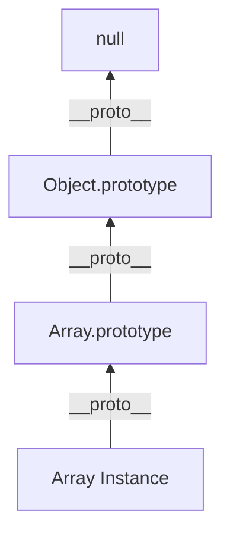

# JavaScript Interview Questions (60+ Deep Dive Q&A)

## 1. Core Engine & Internals (V8)

<AccordionGroup>
<Accordion title="1. The Event Loop (Visualized)">
**Answer**:
JS is Single-Threaded but Non-Blocking.
**Components**:
1.  **Call Stack**: Sync code execution.
2.  **Web APIs**: Browser threads (Timer, Fetch, DOM).
3.  **Callback Queue (Macrotask)**: `setTimeout`, `setInterval`.
4.  **Microtask Queue**: `Promise.then`, `MutationObserver`. **Higher Priority**.

```mermaid
graph TD
    Stack[Call Stack]
    Web[Web APIs]
    Micro[Microtask Queue (Promises)]
    Macro[Macrotask Queue (Timers)]
    EventLoop{Event Loop}

    Stack --> Web
    Web --> Macro
    Web --> Micro
    EventLoop -->|1. Stack Empty?| Micro
    EventLoop -->|2. Micro Empty?| Macro
    Macro --> Stack
    Micro --> Stack
```
**Execution Order**:
Sync Code -> All Microtasks -> **One** Macrotask -> Render -> Repeat.
</Accordion>

<Accordion title="2. Execution Context & Hoisting">
**Answer**:
*   **Creation Phase**: Scanner runs. `var` initialized to `undefined`. `function` declarations stored fully in memory (**Hoisting**). `let`/`const` enter **Temporal Dead Zone (TDZ)**.
*   **Execution Phase**: Code runs line by line.

**Code**:
```javascript
console.log(a); // undefined (Hoisted)
var a = 5;

console.log(b); // ReferenceError (TDZ)
let b = 10;
```
</Accordion>

<Accordion title="3. Closure Scope Chain">
**Answer**:
A function bundled with references to its surrounding state (Lexical Environment).
**Memory**: Even if outer function returns, the inner function holds a reference to outer variables, preventing Garbage Collection.
**Use**: Data Privacy, Currying, Factory Functions.

```javascript
function createCounter() {
    let count = 0; // Private
    return {
        inc: () => ++count,
        get: () => count
    };
}
```
</Accordion>

<Accordion title="4. `this` Binding Rules">
**Answer**:
Priority Order:
1.  **New Binding**: `new Constructor()`. `this` = new object.
2.  **Explicit Binding**: `call`, `apply`, `bind`.
3.  **Implicit Binding**: `obj.method()`. `this` = `obj`.
4.  **Default**: `window` or `undefined` (strict mode).
**Arrow Functions**: Lexical `this`. They inherit `this` from the outer scope execution context.
</Accordion>

<Accordion title="5. Prototype Chain vs Class">
**Answer**:
`class` is syntax sugar over Prototypal Inheritance.
*   **Prototype**: Every object has `__proto__` pointing to another object (or null).
*   **Lookup**: If property not in `obj`, check `obj.__proto__`, then `obj.__proto__.__proto__`.


</Accordion>

<Accordion title="6. Garbage Collection (Mark and Sweep)">
**Answer**:
*   **Roots**: Global execution context, window.
*   **Mark**: Traverse from roots. Mark reachable objects.
*   **Sweep**: Delete unreachable (unmarked) objects.
**Leak Types**:
1.  Accidental Globals (`window.x = 5`).
2.  Forgotten Timers.
3.  Closures holding huge objects.
4.  Detached DOM nodes.
</Accordion>

<Accordion title="7. V8 Hidden Classes (Optimization)">
**Answer**:
V8 creates hidden classes (Shapes) on the fly.
If two objects have same props in **same order**, they share a Shape.
Adding props in different order creates different Shapes (De-optimization).
**Perf Tip**: Initialize all properties in Constructor. Don't add props dynamically (`delete` is also bad).
</Accordion>

<Accordion title="8. JIT Compilation (Hot & Cold)">
**Answer**:
*   **Interpreter (Ignition)**: Runs bytecode fast. Profiles code ("Cold").
*   **Compiler (TurboFan)**: Takes "Hot" (frequently used) code, assumes types (e.g., "always integer"), and compiles to Optimized Machine Code.
*   **De-opt**: If type assumption fails (e.g., passed a string), JIT bails out to Interpreter.
</Accordion>

<Accordion title="9. Strict Mode (`'use strict'`)">
**Answer**:
1.  Prevents accidental globals.
2.  `this` is `undefined` in standalone functions (not `window`).
3.  Disables `with`.
4.  Throws error on assignment to read-only props.
</Accordion>

<Accordion title="10. WeakMap vs Map">
**Answer**:
| Feature | Map | WeakMap |
| :--- | :--- | :--- |
| **Keys** | Any type | **Objects only** |
| **Iteration** | Iterable | Not iterable |
| **GC** | Prevents GC of keys | **Allows GC** of keys |
| **Use** | Caches, dictionaries | DOM Node metadata |
</Accordion>
</AccordionGroup>

## 2. Async Patterns

<AccordionGroup>
<Accordion title="11. Promise Internals (Polyfill)">
**Answer**:
A State Machine: Pending -> Fulfilled | Rejected.
Implements `then` (Observer pattern).
**Microtask**: Callbacks are executed asynchronously via Microtask Queue.

```javascript
class MyPromise {
    constructor(executor) {
        this.state = 'PENDING';
        this.handlers = [];
        const resolve = (val) => {
            this.state = 'FULFILLED';
            this.value = val;
            this.handlers.forEach(h => h(val));
        };
        executor(resolve, reject);
    }
    then(cb) {
        if (this.state === 'FULFILLED') cb(this.value);
        else this.handlers.push(cb);
    }
}
```
</Accordion>

<Accordion title="12. Async/Await (Generator + Promise)">
**Answer**:
Syntactic sugar for Generators yielding Promises.
Error handling via `try/catch` is sync-style.
**Parallelism**:
*   **Bad**: `await a(); await b();` (Sequential).
*   **Good**: `await Promise.all([a(), b()])` (Parallel).
</Accordion>

<Accordion title="13. `Promise.all` vs `allSettled` vs `race`">
**Answer**:
*   **all**: Fails fast. If one rejects, implementation throws immediately.
*   **allSettled**: Waits for ALL. Returns `{ status: 'fulfilled' | 'rejected' }`.
*   **race**: Returns first to settle (resolve OR reject).
*   **any**: Returns first to **resolve** (ignores rejections unless all fail).
</Accordion>

<Accordion title="14. AbortController (Cancelling Fetch)">
**Answer**:
Standard way to cancel async tasks.
```javascript
const controller = new AbortController();
fetch(url, { signal: controller.signal });

// Cancel it
controller.abort(); // Throws AbortError
```
</Accordion>

<Accordion title="15. Microtask vs Macrotask Queue (Quiz)">
**Code**:
```javascript
console.log(1);
setTimeout(() => console.log(2), 0);
Promise.resolve().then(() => console.log(3));
console.log(4);
```
**Order**: `1, 4, 3, 2`.
Sync -> Sync -> Microtask -> Macrotask.
</Accordion>
</AccordionGroup>

## 3. DOM & Browser APIs

<AccordionGroup>
<Accordion title="16. Bubbling vs Capturing (Event Delegation)">
**Answer**:
*   **Capture Phase**: Window -> Target.
*   **Target Phase**: At element.
*   **Bubble Phase**: Target -> Window.
**Delegation**: Attach listener to Parent. Use `e.target` to find Child. Saves memory (1 listener vs 1000).
**Stop**: `e.stopPropagation()` stops bubbling.
</Accordion>

<Accordion title="17. Debounce vs Throttle">
**Answer**:
*   **Debounce**: "Group calls". Run only after X ms of **silence**. (Search Box).
*   **Throttle**: "Rate limit". Run at most once every X ms. (Scroll event).
```javascript
// Debounce
const debounce = (fn, delay) => {
    let id;
    return (...args) => {
        clearTimeout(id);
        id = setTimeout(() => fn(...args), delay);
    }
}
```
</Accordion>

<Accordion title="18. Critical Rendering Path">
**Answer**:
1.  HTML -> DOM Tree.
2.  CSS -> CSSOM Tree.
3.  DOM + CSSOM -> **Render Tree**.
4.  **Reflow (Layout)**: Calculate geometry (width, height).
5.  **Repaint**: Fill pixels (color, shadow).
6.  **Composite**: Layer assembly (GPU).
**Reflow** is expensive.
</Accordion>

<Accordion title="19. Efficient DOM Manipulation (DocumentFragment)">
**Answer**:
Touching DOM triggers Reflow.
**Bad**: Append 1000 items in loop.
**Good**: Append to `DocumentFragment` (Virtual DOM node), then append Fragment once. `display: none` also works.
</Accordion>

<Accordion title="20. LocalStorage vs SessionStorage vs Cookies">
**Answer**:
| | LocalStorage | SessionStorage | Cookies |
| :--- | :--- | :--- | :--- |
| **Capacity** | 5-10MB | 5MB | 4KB |
| **Expiry** | Never | Tab Close | Manual |
| **Server** | Client only | Client only | Sent on every req |
| **Access** | `setItem` | `setItem` | HTTP Header |
</Accordion>

<Accordion title="21. IntersectionObserver (Infinite Scroll)">
**Answer**:
Async API to detect visibility.
Replaces expensive `scroll` event listeners.
```javascript
const observer = new IntersectionObserver((entries) => {
    if (entries[0].isIntersecting) loadMore();
});
observer.observe(footerRef);
```
</Accordion>

<Accordion title="22. Shadow DOM">
**Answer**:
Component encapsulation.
Styles inside Shadow DOM don't leak out. Global styles don't leak in.
Basis of **Web Components**.
`element.attachShadow({ mode: 'open' })`.
</Accordion>

<Accordion title="23. Web Workers">
**Answer**:
Run JS in background thread.
Communication via `postMessage`.
**Limitations**: No DOM access. No `window`.
**Use**: Image processing, Heavy calculation.
</Accordion>

<Accordion title="24. Service Workers (PWA)">
**Answer**:
Network Proxy.
Runs separate from page.
**Features**: Offline support (Cache API), Push Notifications, Background Sync.
Lifecycle: Install -> Activate -> Fetch.
</Accordion>

<Accordion title="25. CORS (Cross-Origin Resource Sharing)">
**Answer**:
Browser security. Blocks reqs from Domain A to Domain B.
**Fix**: Server B must send header `Access-Control-Allow-Origin: *`.
**Preflight**: OPTIONS request sent before complex requests (PUT/DELETE/Custom Headers).
</Accordion>
</AccordionGroup>

## 4. ES6+ Modern Features

<AccordionGroup>
<Accordion title="26. Proxy & Reflect">
**Answer**:
Intercept object operations (get, set, delete).
Basis of Vue 3 Reactivity.
```javascript
const handler = {
    get: (target, prop) => {
        console.log(`Accessing ${prop}`);
        return target[prop] || 'Default';
    }
};
const p = new Proxy(target, handler);
```
</Accordion>

<Accordion title="27. Generators (`function*`)">
**Answer**:
Functions that can Pause (`yield`) and Resume (`next`).
**Use**: Audio streaming, Massive iterators, Redux-Saga.
Two-way communication: `iter.next(value)` passes value BACK into generator.
</Accordion>

<Accordion title="28. Modules (ESM vs CommonJS)">
**Answer**:
*   **CommonJS**: Node default. `require()`. Sync. Dynamic (can require in `if`).
*   **ESM**: Browser standard. `import`. Async / Static analysis (Tree Shaking). Top-level await.
</Accordion>

<Accordion title="29. Symbol Type">
**Answer**:
Unique primitive.
`Symbol('foo') !== Symbol('foo')`.
**Use**: Private properties, Iterator Protocol (`Symbol.iterator`).
</Accordion>

<Accordion title="30. Tagged Templates">
**Answer**:
Custom template literal parsing.
```javascript
function highlight(strings, ...values) {
    // Custom logic
}
const msg = highlight`Value is ${val}`;
```
Used in `styled-components` and GraphQL (`gql`).
</Accordion>

<Accordion title="31. Optional Chaining & Nullish Coalescing">
**Answer**:
*   `obj?.prop`: Returns undefined if null, doesn't throw.
*   `??`: Returns RHS only if LHS is `null` or `undefined`.
    *   `0 || 5` -> 5 (Buggy if 0 is valid).
    *   `0 ?? 5` -> 0 (Correct).
</Accordion>

<Accordion title="32. `Set` and `Map` complexity">
**Answer**:
Implemented as Hash Tables (mostly).
Access/Delete/Insert: **O(1)** on average.
`Set` is best way to remove duplicates: `[...new Set(array)]`.
</Accordion>

<Accordion title="33. BigInt">
**Answer**:
Integers larger than `2^53 - 1` (MaxSafeInteger).
Suffix `n`: `1234567890123456789n`.
Cannot mix with Number (must cast).
</Accordion>
</AccordionGroup>

## 5. Functional Programming patterns

<AccordionGroup>
<Accordion title="34. Currying">
**Answer**:
Transforming `f(a, b, c)` into `f(a)(b)(c)`.
**Use**: Partial Application. Reusable helpers.
```javascript
const add = a => b => a + b;
const addFive = add(5);
console.log(addFive(10)); // 15
```
</Accordion>

<Accordion title="35. Pure Functions">
**Answer**:
1.  **Deterministic**: Same Input -> Same Output.
2.  **No Side Effects**: No HTTP calls, no mutating global state, no logging.
**Benefit**: Testable, Memoizable.
</Accordion>

<Accordion title="36. Higher Order Functions (HOF)">
**Answer**:
Functions that take functions as args OR return functions.
Examples: `map`, `filter`, `reduce`, `debounce`.
</Accordion>

<Accordion title="37. Composition (`pipe`)">
**Answer**:
Applying functions right-to-left. `f(g(x))`.
```javascript
const compose = (...fns) => x => fns.reduceRight((v, f) => f(v), x);
```
</Accordion>

<Accordion title="38. Immutability">
**Answer**:
Never mutate data. Return new copy.
Crucial for Redux/React (Reference equality check).
`Object.freeze()` (Shallow). `Immer.js` (Draft state).
</Accordion>
</AccordionGroup>

## 6. Tricky Code Snippets

<AccordionGroup>
<Accordion title="39. `[] == ![]`">
**Answer**:
**True**.
1.  `![]` -> `false` (Array is truthy).
2.  `[] == false` -> `[] == 0` (Type coercion).
3.  `'' == 0` -> `0 == 0`. -> **True**.
</Accordion>

<Accordion title="40. `typeof null`">
**Answer**:
`'object'`.
Historical bug in JS execution of `typeof`. Null reference check.
</Accordion>

<Accordion title="41. `var` Scope Leak">
**Code**:
```javascript
for(var i=0; i<3; i++) {
    setTimeout(() => console.log(i), 100);
}
```
**Output**: `3, 3, 3`.
**Reason**: `var` is function scoped. Shared reference `i`.
**Fix**: `let i` (Block scoped) or IIFE.
</Accordion>

<Accordion title="42. `NaN == NaN`">
**Answer**:
**False**.
Unique value.
Use `Number.isNaN()` or `Object.is(NaN, NaN)`.
</Accordion>

<Accordion title="43. Object Key Coercion">
**Code**:
```javascript
const a = {}, b = {key:'b'}, c = {key:'c'};
a[b] = 123;
a[c] = 456;
console.log(a[b]);
```
**Output**: `456`.
**Reason**: Keys become string `"[object Object]"`. `a` has only one key.
</Accordion>

<Accordion title="44. `0.1 + 0.2 === 0.3`">
**Answer**:
**False**. (`0.30000000000000004`).
IEEE 754 Floating Point logic.
**Fix**: `Math.abs(a - b) < Number.EPSILON`.
</Accordion>

<Accordion title="45. Array Holes (`map` behavior)">
**Code**:
```javascript
const a = new Array(3);
a.map(v => 1);
```
**Output**: `[empty x 3]`.
`map` skips empty slots.
**Fix**: `a.fill(0).map(...)`.
</Accordion>
</AccordionGroup>

## 7. Performance & Security

<AccordionGroup>
<Accordion title="46. Memory Leaks">
**Answer**:
*   **Global Variables**: `window.data = hugeArray`.
*   **EventListeners**: Forgetting `removeEventListener` (SPA navigation).
*   **Intervals**: `setInterval` running forever.
*   **Tools**: Chrome DevTools Memory Tab (Heap Snapshot).
</Accordion>

<Accordion title="47. XSS (Cross Site Scripting)">
**Answer**:
Attacker injects malicious JS.
**Reflected**: URL param. **Stored**: DB.
**Prevention**:
1.  **Sanitize Input** (DOMPurify).
2.  **Escape Output** (React/Angular do this auto).
3.  **CSP (Content Security Policy)** header.
</Accordion>

<Accordion title="48. CSRF (Cross Site Request Forgery)">
**Answer**:
Attacker tricks user browser into sending req (with cookies) to valid site.
**Prevention**:
1.  **SameSite Cookie Attribute** (`Strict/Lax`).
2.  **CSRF Token** (Hidden input sync with server).
</Accordion>

<Accordion title="49. Keyed Collections (`WeakSet`) in Security">
**Answer**:
`WeakMap` is essentially secure storage for private data if the key (object) is kept private.
Used in "Private Class Fields" polyfills.
</Accordion>

<Accordion title="50. Web Assembly (Wasm)">
**Answer**:
Binary instruction format. Near-native speed.
Written in C++/Rust -> Compiled to .wasm.
Can run alongside JS.
**Use**: Video editing (Figma), Games, Image Logic.
</Accordion>

<Accordion title="51. Tree Shaking">
**Answer**:
Dead code elimination during build (Webpack/Rollup).
Relies on **ES Modules (Static structure)**.
CommonJS (`require`) is hard to shake.
</Accordion>

<Accordion title="52. Lazy Loading (Dynamic Import)">
**Answer**:
Split code into chunks. Load only when needed.
```javascript
import('./module').then(m => m.func());
```
Reduces Initial Bundle Size (TTI).
</Accordion>

<Accordion title="53. Preload vs Prefetch">
**Answer**:
*   **Preload**: "I need this **NOW**". High priority. (Hero Image, Main Font).
*   **Prefetch**: "I might need this **LATER**". Low priority. (Next page JS).
</Accordion>

<Accordion title="54. Virtualization (Windowing)">
**Answer**:
Rendering large lists (10k items).
DOM is slow. Only render items in **Viewport**.
Recycle DOM nodes as you scroll.
(e.g., `react-window`).
</Accordion>

<Accordion title="55. Deep Clone Performance">
**Answer**:
`JSON.parse(JSON.stringify(obj))` is slow and loses Date/RegExp/undefined.
**Better**: `structuredClone()` (Native API).
</Accordion>
</AccordionGroup>

## 8. Miscellaneous

<AccordionGroup>
<Accordion title="56. `requestAnimationFrame`">
**Answer**:
Syncs updates with Browser Refresh Rate (60fps).
Better than `setTimeout` for animations (Pauses in background tab).
Prevents screen tearing.
</Accordion>

<Accordion title="57. `Intl` API">
**Answer**:
Native formatting for Dates, Numbers, Currencies.
Don't use Moment.js for simple things.
`new Intl.NumberFormat('en-US', { style: 'currency', currency: 'USD' })`.
</Accordion>

<Accordion title="58. `Object.seal` vs `Object.freeze`">
**Answer**:
*   **Seal**: Cannot Add/Delete props. Can **Modify** existing values.
*   **Freeze**: Absolute immutable. Can't Add/Delete/Modify.
</Accordion>

<Accordion title="59. Iterators & Layout Thrashing">
**Answer**:
Reading and Writing DOM properties interleaved causing multiple Reflows.
**Bad**:
```javascript
h1 = box.offsetHeight; // Read
box.style.height = h1 + 10; // Write (Invalidates layout)
h2 = box.offsetHeight; // Read (Forces Reflow again)
```
**Fix**: Read all first, Write all later.
</Accordion>

<Accordion title="60. TCO (Tail Call Optimization)">
**Answer**:
If last action of function is a call to another function (or itself), stack frame can be reused.
Prevents Stack Overflow in recursion.
**Note**: Only Safari supports this strictly currently.
</Accordion>
</AccordionGroup>
