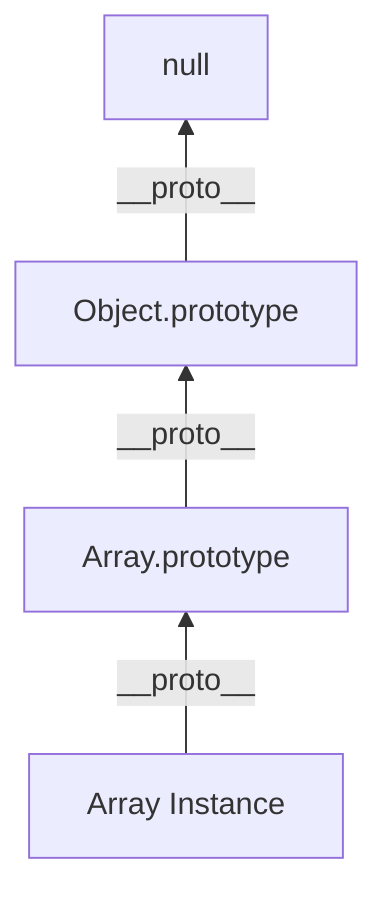

# JavaScript Interview Questions (60+ Deep Dive Q&A)

## 1. Core Engine & Internals (V8)

<AccordionGroup>
<Accordion title="1. The Event Loop (Visualized)">
**Answer**:
JS is Single-Threaded but Non-Blocking.
**Components**:
1.  **Call Stack**: Sync code execution.
2.  **Web APIs**: Browser threads (Timer, Fetch, DOM).
3.  **Callback Queue (Macrotask)**: `setTimeout`, `setInterval`.
4.  **Microtask Queue**: `Promise.then`, `MutationObserver`. **Higher Priority**.

```mermaid
graph TD
    Stack[Call Stack]
    Web[Web APIs]
    Micro[Microtask Queue (Promises)]
    Macro[Macrotask Queue (Timers)]
    EventLoop{Event Loop}

    Stack --> Web
    Web --> Macro
    Web --> Micro
    EventLoop -->|1. Stack Empty?| Micro
    EventLoop -->|2. Micro Empty?| Macro
    Macro --> Stack
    Micro --> Stack
```

**Execution Order**:
Sync Code -> All Microtasks -> **One** Macrotask -> Render -> Repeat.

**Practical Example**:
```javascript
console.log('1: Sync');

setTimeout(() => console.log('2: Macrotask'), 0);

Promise.resolve().then(() => console.log('3: Microtask 1'))
  .then(() => console.log('4: Microtask 2'));

console.log('5: Sync');

// Output: 1, 5, 3, 4, 2
// Explanation: All sync code runs first (1, 5)
// Then ALL microtasks drain (3, 4)
// Finally ONE macrotask executes (2)
```

**Why Microtasks Have Priority**: They enable immediate promise resolution without waiting for the next event loop tick, crucial for responsive UIs.
</Accordion>

<Accordion title="2. Execution Context & Hoisting">
**Answer**:
*   **Creation Phase**: Scanner runs. `var` initialized to `undefined`. `function` declarations stored fully in memory (**Hoisting**). `let`/`const` enter **Temporal Dead Zone (TDZ)**.
*   **Execution Phase**: Code runs line by line.

**Code**:
```javascript
console.log(a); // undefined (Hoisted)
var a = 5;

console.log(b); // ReferenceError (TDZ)
let b = 10;
```
</Accordion>

<Accordion title="3. Closure Scope Chain">
**Answer**:
A function bundled with references to its surrounding state (Lexical Environment).
**Memory**: Even if outer function returns, the inner function holds a reference to outer variables, preventing Garbage Collection.
**Use**: Data Privacy, Currying, Factory Functions.

```javascript
function createCounter() {
    let count = 0; // Private
    return {
        inc: () => ++count,
        get: () => count
    };
}

const counter = createCounter();
counter.inc(); // 1
counter.inc(); // 2
counter.get(); // 2
// 'count' is NOT accessible from outside, but persists in memory
```

**Memory Retention Example**:
```javascript
function heavyOperation() {
    const largeArray = new Array(1000000).fill('data');
    
    return function() {
        // This closure keeps largeArray in memory!
        return largeArray.length;
    };
}

const fn = heavyOperation();
// largeArray cannot be garbage collected while fn exists
```

**Common Memory Leak Pattern**:
```javascript
// BAD: Creates new closure on every render
function Component() {
    const [data, setData] = useState([]);
    
    // This creates a new function (and closure) every render
    return <button onClick={() => processData(data)}>Click</button>;
}

// GOOD: Memoize the callback
function Component() {
    const [data, setData] = useState([]);
    const handleClick = useCallback(() => processData(data), [data]);
    
    return <button onClick={handleClick}>Click</button>;
}
```
</Accordion>

<Accordion title="4. `this` Binding Rules">
**Answer**:
Priority Order:
1.  **New Binding**: `new Constructor()`. `this` = new object.
2.  **Explicit Binding**: `call`, `apply`, `bind`.
3.  **Implicit Binding**: `obj.method()`. `this` = `obj`.
4.  **Default**: `window` or `undefined` (strict mode).
**Arrow Functions**: Lexical `this`. They inherit `this` from the outer scope execution context.

**Detailed Examples**:
```javascript
const obj = {
    name: 'Object',
    regular: function() { console.log(this.name); },
    arrow: () => { console.log(this.name); }
};

obj.regular(); // 'Object' (implicit binding)
obj.arrow();   // undefined (lexical this = window/global)

const fn = obj.regular;
fn(); // undefined (default binding, lost context)

// Explicit binding
fn.call(obj);  // 'Object'
fn.apply(obj); // 'Object'
const bound = fn.bind(obj);
bound(); // 'Object' (permanently bound)
```

**Performance Comparison**:
```javascript
// bind creates a new function (memory overhead)
const boundFn = fn.bind(obj); // ~10-20% slower

// Arrow functions are slightly faster (no this binding)
const arrowFn = () => {}; // Fastest

// call/apply have minimal overhead
fn.call(obj); // ~5% slower than direct call
```

**Common Pitfall**:
```javascript
class Component {
    constructor() {
        this.data = [];
    }
    
    // BAD: loses 'this' when passed as callback
    handleClick() {
        console.log(this.data); // undefined!
    }
    
    // GOOD: arrow function preserves 'this'
    handleClickArrow = () => {
        console.log(this.data); // works!
    }
}
```
</Accordion>

<Accordion title="5. Prototype Chain vs Class">
**Answer**:
`class` is syntax sugar over Prototypal Inheritance.
*   **Prototype**: Every object has `__proto__` pointing to another object (or null).
*   **Lookup**: If property not in `obj`, check `obj.__proto__`, then `obj.__proto__.__proto__`.



**Custom Inheritance Example**:
```javascript
// Constructor function approach
function Animal(name) {
    this.name = name;
}

Animal.prototype.speak = function() {
    console.log(`${this.name} makes a sound`);
};

function Dog(name, breed) {
    Animal.call(this, name); // Call parent constructor
    this.breed = breed;
}

// Set up prototype chain
Dog.prototype = Object.create(Animal.prototype);
Dog.prototype.constructor = Dog;

Dog.prototype.bark = function() {
    console.log(`${this.name} barks!`);
};

const dog = new Dog('Rex', 'Labrador');
dog.speak(); // 'Rex makes a sound' (inherited)
dog.bark();  // 'Rex barks!' (own method)

// Prototype chain: dog -> Dog.prototype -> Animal.prototype -> Object.prototype -> null
```

**Class Syntax (Same Result)**:
```javascript
class Animal {
    constructor(name) {
        this.name = name;
    }
    speak() {
        console.log(`${this.name} makes a sound`);
    }
}

class Dog extends Animal {
    constructor(name, breed) {
        super(name);
        this.breed = breed;
    }
    bark() {
        console.log(`${this.name} barks!`);
    }
}
```

**Performance Note**: Deep prototype chains (>3-4 levels) can slow down property lookups. V8 optimizes with inline caches.
</Accordion>

<Accordion title="6. Garbage Collection (Mark and Sweep)">
**Answer**:
*   **Roots**: Global execution context, window.
*   **Mark**: Traverse from roots. Mark reachable objects.
*   **Sweep**: Delete unreachable (unmarked) objects.
**Leak Types**:
1.  Accidental Globals (`window.x = 5`).
2.  Forgotten Timers.
3.  Closures holding huge objects.
4.  Detached DOM nodes.
</Accordion>

<Accordion title="7. V8 Hidden Classes (Optimization)">
**Answer**:
V8 creates hidden classes (Shapes) on the fly.
If two objects have same props in **same order**, they share a Shape.
Adding props in different order creates different Shapes (De-optimization).
**Perf Tip**: Initialize all properties in Constructor. Don't add props dynamically (`delete` is also bad).

**Optimization Example**:
```javascript
// GOOD: Same shape (optimized)
function Point(x, y) {
    this.x = x;
    this.y = y;
}

const p1 = new Point(1, 2);
const p2 = new Point(3, 4);
// p1 and p2 share the same hidden class!

// BAD: Different shapes (deoptimized)
const p3 = {};
p3.x = 1; // Shape 1
p3.y = 2; // Shape 2 (different from Point)

const p4 = {};
p4.y = 2; // Shape 3 (different order!)
p4.x = 1; // Shape 4
```

**Performance Benchmark**:
```javascript
// Optimized version (same shape)
class OptimizedPoint {
    constructor(x, y) {
        this.x = x;
        this.y = y;
    }
}

// Deoptimized version (dynamic properties)
class DeoptimizedPoint {
    constructor() {
        // Properties added later
    }
}

const points1 = [];
for (let i = 0; i < 1000000; i++) {
    points1.push(new OptimizedPoint(i, i));
}

const points2 = [];
for (let i = 0; i < 1000000; i++) {
    const p = new DeoptimizedPoint();
    p.x = i;
    p.y = i;
    points2.push(p);
}

// Optimized version is ~2-3x faster for property access!
```

**What Breaks Optimization**:
1. Adding properties after construction
2. Deleting properties (`delete obj.prop`)
3. Adding properties in different order
4. Changing property types (number → string)
</Accordion>

<Accordion title="8. JIT Compilation (Hot & Cold)">
**Answer**:
*   **Interpreter (Ignition)**: Runs bytecode fast. Profiles code ("Cold").
*   **Compiler (TurboFan)**: Takes "Hot" (frequently used) code, assumes types (e.g., "always integer"), and compiles to Optimized Machine Code.
*   **De-opt**: If type assumption fails (e.g., passed a string), JIT bails out to Interpreter.

**Optimization Example**:
```javascript
// This function will be optimized by TurboFan
function add(a, b) {
    return a + b;
}

// Call it many times with numbers (Hot path)
for (let i = 0; i < 100000; i++) {
    add(i, i + 1); // V8 assumes: a and b are always numbers
}

// TurboFan compiles optimized machine code:
// "Just add two integers, no type checking needed"

// Now break the assumption (Deoptimization)
add("hello", "world"); // String concatenation!
// V8 deoptimizes: "My assumption was wrong, back to interpreter"
```

**Performance Impact**:
```javascript
function polymorphic(x) {
    return x.value; // Property access
}

// Monomorphic (optimized) - always same type
const obj1 = { value: 1 };
for (let i = 0; i < 1000000; i++) {
    polymorphic(obj1); // Fast! ~10ns per call
}

// Polymorphic (deoptimized) - multiple types
const obj2 = { value: 1, extra: 2 }; // Different shape
for (let i = 0; i < 1000000; i++) {
    polymorphic(i % 2 ? obj1 : obj2); // Slow! ~50ns per call
}
```

**Best Practices**:
1. Keep function arguments consistent types
2. Avoid changing object shapes
3. Don't mix integers and floats
4. Avoid `arguments` object (use rest parameters)
</Accordion>


<Accordion title="9. Strict Mode (`'use strict'`)">
**Answer**:
1.  Prevents accidental globals.
2.  `this` is `undefined` in standalone functions (not `window`).
3.  Disables `with`.
4.  Throws error on assignment to read-only props.
</Accordion>

<Accordion title="10. WeakMap vs Map">
**Answer**:
| Feature | Map | WeakMap |
| :--- | :--- | :--- |
| **Keys** | Any type | **Objects only** |
| **Iteration** | Iterable | Not iterable |
| **GC** | Prevents GC of keys | **Allows GC** of keys |
| **Use** | Caches, dictionaries | DOM Node metadata |
</Accordion>
</AccordionGroup>

## 2. Async Patterns

<AccordionGroup>
<Accordion title="11. Promise Internals (Polyfill)">
**Answer**:
A State Machine: Pending -> Fulfilled | Rejected.
Implements `then` (Observer pattern).
**Microtask**: Callbacks are executed asynchronously via Microtask Queue.

```javascript
class MyPromise {
    constructor(executor) {
        this.state = 'PENDING';
        this.handlers = [];
        const resolve = (val) => {
            this.state = 'FULFILLED';
            this.value = val;
            this.handlers.forEach(h => h(val));
        };
        executor(resolve, reject);
    }
    then(cb) {
        if (this.state === 'FULFILLED') cb(this.value);
        else this.handlers.push(cb);
    }
}
```
</Accordion>

<Accordion title="12. Async/Await (Generator + Promise)">
**Answer**:
Syntactic sugar for Generators yielding Promises.
Error handling via `try/catch` is sync-style.
**Parallelism**:
*   **Bad**: `await a(); await b();` (Sequential).
*   **Good**: `await Promise.all([a(), b()])` (Parallel).
</Accordion>

<Accordion title="13. `Promise.all` vs `allSettled` vs `race`">
**Answer**:
*   **all**: Fails fast. If one rejects, implementation throws immediately.
*   **allSettled**: Waits for ALL. Returns `{ status: 'fulfilled' | 'rejected' }`.
*   **race**: Returns first to settle (resolve OR reject).
*   **any**: Returns first to **resolve** (ignores rejections unless all fail).
</Accordion>

<Accordion title="14. AbortController (Cancelling Fetch)">
**Answer**:
Standard way to cancel async tasks.
```javascript
const controller = new AbortController();
fetch(url, { signal: controller.signal });

// Cancel it
controller.abort(); // Throws AbortError
```
</Accordion>

<Accordion title="15. Microtask vs Macrotask Queue (Quiz)">
**Code**:
```javascript
console.log(1);
setTimeout(() => console.log(2), 0);
Promise.resolve().then(() => console.log(3));
console.log(4);
```
**Order**: `1, 4, 3, 2`.
Sync -> Sync -> Microtask -> Macrotask.
</Accordion>
</AccordionGroup>

## 3. DOM & Browser APIs

<AccordionGroup>
<Accordion title="16. Bubbling vs Capturing (Event Delegation)">
**Answer**:
*   **Capture Phase**: Window -> Target.
*   **Target Phase**: At element.
*   **Bubble Phase**: Target -> Window.
**Delegation**: Attach listener to Parent. Use `e.target` to find Child. Saves memory (1 listener vs 1000).
**Stop**: `e.stopPropagation()` stops bubbling.
</Accordion>

<Accordion title="17. Debounce vs Throttle">
**Answer**:
*   **Debounce**: "Group calls". Run only after X ms of **silence**. (Search Box).
*   **Throttle**: "Rate limit". Run at most once every X ms. (Scroll event).
```javascript
// Debounce
const debounce = (fn, delay) => {
    let id;
    return (...args) => {
        clearTimeout(id);
        id = setTimeout(() => fn(...args), delay);
    }
}
```
</Accordion>

<Accordion title="18. Critical Rendering Path">
**Answer**:
1.  HTML -> DOM Tree.
2.  CSS -> CSSOM Tree.
3.  DOM + CSSOM -> **Render Tree**.
4.  **Reflow (Layout)**: Calculate geometry (width, height).
5.  **Repaint**: Fill pixels (color, shadow).
6.  **Composite**: Layer assembly (GPU).
**Reflow** is expensive.
</Accordion>

<Accordion title="19. Efficient DOM Manipulation (DocumentFragment)">
**Answer**:
Touching DOM triggers Reflow.
**Bad**: Append 1000 items in loop.
**Good**: Append to `DocumentFragment` (Virtual DOM node), then append Fragment once. `display: none` also works.
</Accordion>

<Accordion title="20. LocalStorage vs SessionStorage vs Cookies">
**Answer**:
| | LocalStorage | SessionStorage | Cookies |
| :--- | :--- | :--- | :--- |
| **Capacity** | 5-10MB | 5MB | 4KB |
| **Expiry** | Never | Tab Close | Manual |
| **Server** | Client only | Client only | Sent on every req |
| **Access** | `setItem` | `setItem` | HTTP Header |
</Accordion>

<Accordion title="21. IntersectionObserver (Infinite Scroll)">
**Answer**:
Async API to detect visibility.
Replaces expensive `scroll` event listeners.
```javascript
const observer = new IntersectionObserver((entries) => {
    if (entries[0].isIntersecting) loadMore();
});
observer.observe(footerRef);
```
</Accordion>

<Accordion title="22. Shadow DOM">
**Answer**:
Component encapsulation.
Styles inside Shadow DOM don't leak out. Global styles don't leak in.
Basis of **Web Components**.
`element.attachShadow({ mode: 'open' })`.
</Accordion>

<Accordion title="23. Web Workers">
**Answer**:
Run JS in background thread.
Communication via `postMessage`.
**Limitations**: No DOM access. No `window`.
**Use**: Image processing, Heavy calculation.
</Accordion>

<Accordion title="24. Service Workers (PWA)">
**Answer**:
Network Proxy.
Runs separate from page.
**Features**: Offline support (Cache API), Push Notifications, Background Sync.
Lifecycle: Install -> Activate -> Fetch.
</Accordion>

<Accordion title="25. CORS (Cross-Origin Resource Sharing)">
**Answer**:
Browser security. Blocks reqs from Domain A to Domain B.
**Fix**: Server B must send header `Access-Control-Allow-Origin: *`.
**Preflight**: OPTIONS request sent before complex requests (PUT/DELETE/Custom Headers).
</Accordion>
</AccordionGroup>

## 4. ES6+ Modern Features

<AccordionGroup>
<Accordion title="26. Proxy & Reflect">
**Answer**:
Intercept object operations (get, set, delete).
Basis of Vue 3 Reactivity.
```javascript
const handler = {
    get: (target, prop) => {
        console.log(`Accessing ${prop}`);
        return target[prop] || 'Default';
    }
};
const p = new Proxy(target, handler);
```
</Accordion>

<Accordion title="27. Generators (`function*`)">
**Answer**:
Functions that can Pause (`yield`) and Resume (`next`).
**Use**: Audio streaming, Massive iterators, Redux-Saga.
Two-way communication: `iter.next(value)` passes value BACK into generator.
</Accordion>

<Accordion title="28. Modules (ESM vs CommonJS)">
**Answer**:
*   **CommonJS**: Node default. `require()`. Sync. Dynamic (can require in `if`).
*   **ESM**: Browser standard. `import`. Async / Static analysis (Tree Shaking). Top-level await.
</Accordion>

<Accordion title="29. Symbol Type">
**Answer**:
Unique primitive.
`Symbol('foo') !== Symbol('foo')`.
**Use**: Private properties, Iterator Protocol (`Symbol.iterator`).
</Accordion>

<Accordion title="30. Tagged Templates">
**Answer**:
Custom template literal parsing.
```javascript
function highlight(strings, ...values) {
    // Custom logic
}
const msg = highlight`Value is ${val}`;
```
Used in `styled-components` and GraphQL (`gql`).
</Accordion>

<Accordion title="31. Optional Chaining & Nullish Coalescing">
**Answer**:
*   `obj?.prop`: Returns undefined if null, doesn't throw.
*   `??`: Returns RHS only if LHS is `null` or `undefined`.
    *   `0 || 5` -> 5 (Buggy if 0 is valid).
    *   `0 ?? 5` -> 0 (Correct).
</Accordion>

<Accordion title="32. `Set` and `Map` complexity">
**Answer**:
Implemented as Hash Tables (mostly).
Access/Delete/Insert: **O(1)** on average.
`Set` is best way to remove duplicates: `[...new Set(array)]`.
</Accordion>

<Accordion title="33. BigInt">
**Answer**:
Integers larger than `2^53 - 1` (MaxSafeInteger).
Suffix `n`: `1234567890123456789n`.
Cannot mix with Number (must cast).
</Accordion>
</AccordionGroup>

## 5. Functional Programming patterns

<AccordionGroup>
<Accordion title="34. Currying">
**Answer**:
Transforming `f(a, b, c)` into `f(a)(b)(c)`.
**Use**: Partial Application. Reusable helpers.
```javascript
const add = a => b => a + b;
const addFive = add(5);
console.log(addFive(10)); // 15
```
</Accordion>

<Accordion title="35. Pure Functions">
**Answer**:
1.  **Deterministic**: Same Input -> Same Output.
2.  **No Side Effects**: No HTTP calls, no mutating global state, no logging.
**Benefit**: Testable, Memoizable.
</Accordion>

<Accordion title="36. Higher Order Functions (HOF)">
**Answer**:
Functions that take functions as args OR return functions.
Examples: `map`, `filter`, `reduce`, `debounce`.
</Accordion>

<Accordion title="37. Composition (`pipe`)">
**Answer**:
Applying functions right-to-left. `f(g(x))`.
```javascript
const compose = (...fns) => x => fns.reduceRight((v, f) => f(v), x);
```
</Accordion>

<Accordion title="38. Immutability">
**Answer**:
Never mutate data. Return new copy.
Crucial for Redux/React (Reference equality check).
`Object.freeze()` (Shallow). `Immer.js` (Draft state).
</Accordion>
</AccordionGroup>

## 6. Tricky Code Snippets

<AccordionGroup>
<Accordion title="39. `[] == ![]`">
**Answer**:
**True**.
1.  `![]` -> `false` (Array is truthy).
2.  `[] == false` -> `[] == 0` (Type coercion).
3.  `'' == 0` -> `0 == 0`. -> **True**.
</Accordion>

<Accordion title="40. `typeof null`">
**Answer**:
`'object'`.
Historical bug in JS execution of `typeof`. Null reference check.
</Accordion>

<Accordion title="41. `var` Scope Leak">
**Code**:
```javascript
for(var i=0; i<3; i++) {
    setTimeout(() => console.log(i), 100);
}
```
**Output**: `3, 3, 3`.
**Reason**: `var` is function scoped. Shared reference `i`.
**Fix**: `let i` (Block scoped) or IIFE.
</Accordion>

<Accordion title="42. `NaN == NaN`">
**Answer**:
**False**.
Unique value.
Use `Number.isNaN()` or `Object.is(NaN, NaN)`.
</Accordion>

<Accordion title="43. Object Key Coercion">
**Code**:
```javascript
const a = {}, b = {key:'b'}, c = {key:'c'};
a[b] = 123;
a[c] = 456;
console.log(a[b]);
```
**Output**: `456`.
**Reason**: Keys become string `"[object Object]"`. `a` has only one key.
</Accordion>

<Accordion title="44. `0.1 + 0.2 === 0.3`">
**Answer**:
**False**. (`0.30000000000000004`).
IEEE 754 Floating Point logic.
**Fix**: `Math.abs(a - b) < Number.EPSILON`.
</Accordion>

<Accordion title="45. Array Holes (`map` behavior)">
**Code**:
```javascript
const a = new Array(3);
a.map(v => 1);
```
**Output**: `[empty x 3]`.
`map` skips empty slots.
**Fix**: `a.fill(0).map(...)`.
</Accordion>
</AccordionGroup>

## 7. Performance & Security

<AccordionGroup>
<Accordion title="46. Memory Leaks">
**Answer**:
*   **Global Variables**: `window.data = hugeArray`.
*   **EventListeners**: Forgetting `removeEventListener` (SPA navigation).
*   **Intervals**: `setInterval` running forever.
*   **Tools**: Chrome DevTools Memory Tab (Heap Snapshot).
</Accordion>

<Accordion title="47. XSS (Cross Site Scripting)">
**Answer**:
Attacker injects malicious JS.
**Reflected**: URL param. **Stored**: DB.
**Prevention**:
1.  **Sanitize Input** (DOMPurify).
2.  **Escape Output** (React/Angular do this auto).
3.  **CSP (Content Security Policy)** header.
</Accordion>

<Accordion title="48. CSRF (Cross Site Request Forgery)">
**Answer**:
Attacker tricks user browser into sending req (with cookies) to valid site.
**Prevention**:
1.  **SameSite Cookie Attribute** (`Strict/Lax`).
2.  **CSRF Token** (Hidden input sync with server).
</Accordion>

<Accordion title="49. Keyed Collections (`WeakSet`) in Security">
**Answer**:
`WeakMap` is essentially secure storage for private data if the key (object) is kept private.
Used in "Private Class Fields" polyfills.
</Accordion>

<Accordion title="50. Web Assembly (Wasm)">
**Answer**:
Binary instruction format. Near-native speed.
Written in C++/Rust -> Compiled to .wasm.
Can run alongside JS.
**Use**: Video editing (Figma), Games, Image Logic.
</Accordion>

<Accordion title="51. Tree Shaking">
**Answer**:
Dead code elimination during build (Webpack/Rollup).
Relies on **ES Modules (Static structure)**.
CommonJS (`require`) is hard to shake.
</Accordion>

<Accordion title="52. Lazy Loading (Dynamic Import)">
**Answer**:
Split code into chunks. Load only when needed.
```javascript
import('./module').then(m => m.func());
```
Reduces Initial Bundle Size (TTI).
</Accordion>

<Accordion title="53. Preload vs Prefetch">
**Answer**:
*   **Preload**: "I need this **NOW**". High priority. (Hero Image, Main Font).
*   **Prefetch**: "I might need this **LATER**". Low priority. (Next page JS).
</Accordion>

<Accordion title="54. Virtualization (Windowing)">
**Answer**:
Rendering large lists (10k items).
DOM is slow. Only render items in **Viewport**.
Recycle DOM nodes as you scroll.
(e.g., `react-window`).
</Accordion>

<Accordion title="55. Deep Clone Performance">
**Answer**:
`JSON.parse(JSON.stringify(obj))` is slow and loses Date/RegExp/undefined.
**Better**: `structuredClone()` (Native API).
</Accordion>
</AccordionGroup>

## 8. Miscellaneous

<AccordionGroup>
<Accordion title="56. `requestAnimationFrame`">
**Answer**:
Syncs updates with Browser Refresh Rate (60fps).
Better than `setTimeout` for animations (Pauses in background tab).
Prevents screen tearing.
</Accordion>

<Accordion title="57. `Intl` API">
**Answer**:
Native formatting for Dates, Numbers, Currencies.
Don't use Moment.js for simple things.
`new Intl.NumberFormat('en-US', { style: 'currency', currency: 'USD' })`.
</Accordion>

<Accordion title="58. `Object.seal` vs `Object.freeze`">
**Answer**:
*   **Seal**: Cannot Add/Delete props. Can **Modify** existing values.
*   **Freeze**: Absolute immutable. Can't Add/Delete/Modify.
</Accordion>

<Accordion title="59. Iterators & Layout Thrashing">
**Answer**:
Reading and Writing DOM properties interleaved causing multiple Reflows.
**Bad**:
```javascript
h1 = box.offsetHeight; // Read
box.style.height = h1 + 10; // Write (Invalidates layout)
h2 = box.offsetHeight; // Read (Forces Reflow again)
```
**Fix**: Read all first, Write all later.
</Accordion>

<Accordion title="60. TCO (Tail Call Optimization)">
**Answer**:
If last action of function is a call to another function (or itself), stack frame can be reused.
Prevents Stack Overflow in recursion.
**Note**: Only Safari supports this strictly currently.
</Accordion>
</AccordionGroup>

## 9. ES6+ Features (Medium Level)

<AccordionGroup>
<Accordion title="61. Spread Operator vs Rest Parameters">
**Answer**:
*   **Spread (...)**: Expands an iterable into individual elements.
*   **Rest (...)**: Collects multiple elements into an array.

```javascript
// Spread: Expand array
const arr1 = [1, 2, 3];
const arr2 = [...arr1, 4, 5]; // [1, 2, 3, 4, 5]

// Rest: Collect function arguments
function sum(...numbers) {
    return numbers.reduce((a, b) => a + b, 0);
}
sum(1, 2, 3, 4); // 10
```
</Accordion>

<Accordion title="62. Array Methods: map, filter, reduce, flatMap">
**Answer**:
*   **map**: Transform each element.
*   **filter**: Select elements matching condition.
*   **reduce**: Accumulate to single value.
*   **flatMap**: Map + flatten one level.

```javascript
const nums = [1, 2, 3, 4, 5];
nums.map(n => n * 2); // [2, 4, 6, 8, 10]
nums.filter(n => n % 2 === 0); // [2, 4]
nums.reduce((sum, n) => sum + n, 0); // 15

// flatMap
[[1, 2], [3, 4]].flatMap(arr => arr.map(n => n * 2)); // [2, 4, 6, 8]
```
</Accordion>

<Accordion title="63. Object Destructuring with Defaults">
**Answer**:
Extract properties with fallback values.

```javascript
const user = { name: 'Alice', age: 30 };
const { name, age, city = 'Unknown' } = user;

// Renaming
const { name: userName } = user;

// Function parameters
function greet({ name, age = 18 }) {
    console.log(`${name} is ${age}`);
}
```
</Accordion>

<Accordion title="64. Template Literals and Tagged Templates">
**Answer**:
**Template Literals**: String interpolation.
**Tagged Templates**: Custom string processing.

```javascript
const name = 'World';
const greeting = `Hello, ${name}!`;

// Tagged template
function highlight(strings, ...values) {
    return strings.reduce((result, str, i) => {
        return result + str + (values[i] ? `<mark>${values[i]}</mark>` : '');
    }, '');
}
```
</Accordion>

<Accordion title="65. Default Parameters">
**Answer**:
Default values for function parameters.

```javascript
function greet(name = 'Guest', greeting = 'Hello') {
    return `${greeting}, ${name}!`;
}

// Destructuring with defaults
function config({ port = 3000, host = 'localhost' } = {}) {
    return { port, host };
}
```
</Accordion>

<Accordion title="66. Array.from() and Array.of()">
**Answer**:
*   **Array.from()**: Create array from iterable.
*   **Array.of()**: Create array from arguments.

```javascript
Array.from('hello'); // ['h', 'e', 'l', 'l', 'o']
Array.from([1, 2, 3], x => x * 2); // [2, 4, 6]
Array.from({ length: 5 }, (_, i) => i); // [0, 1, 2, 3, 4]

Array.of(1, 2, 3); // [1, 2, 3]
Array.of(5); // [5] (not empty array)
```
</Accordion>

<Accordion title="67. Object.assign() vs Spread Operator">
**Answer**:
Both merge objects, but with differences.

```javascript
const target = { a: 1 };
const source = { b: 2 };

// Object.assign() - mutates target
Object.assign(target, source);

// Spread - creates new object
const merged = { ...target, ...source };

// Deep clone (use structuredClone)
const deepClone = structuredClone(obj);
```
</Accordion>

<Accordion title="68. for...of vs for...in Loops">
**Answer**:
*   **for...of**: Iterate over **values** (iterables).
*   **for...in**: Iterate over **keys** (properties).

```javascript
const arr = ['a', 'b', 'c'];

for (const value of arr) {
    console.log(value); // 'a', 'b', 'c'
}

for (const index in arr) {
    console.log(index); // '0', '1', '2'
}
```
</Accordion>

<Accordion title="69. String Methods: includes, startsWith, endsWith">
**Answer**:
Modern string searching.

```javascript
const str = 'Hello, World!';
str.includes('World'); // true
str.startsWith('Hello'); // true
str.endsWith('!'); // true
```
</Accordion>

<Accordion title="70. Number Methods: isNaN, isFinite">
**Answer**:
Robust number validation.

```javascript
Number.isNaN(NaN); // true
Number.isNaN('hello'); // false
Number.isFinite(42); // true
Number.isFinite(Infinity); // false
Number.isInteger(42.5); // false
```
</Accordion>

<Accordion title="71. JSON.stringify() and JSON.parse() Edge Cases">
**Answer**:
Serialization gotchas.

```javascript
JSON.stringify({
    fn: function() {}, // Omitted!
    undef: undefined,  // Omitted!
    date: new Date(),  // Converted to string
    nan: NaN,          // Becomes null
});

// Custom serialization
const obj = {
    name: 'Bob',
    toJSON() {
        return { name: this.name };
    }
};
```
</Accordion>

<Accordion title="72. Regular Expressions Basics">
**Answer**:
Pattern matching in strings.

```javascript
/\d+/.test('abc123'); // true
'abc123def456'.match(/\d+/g); // ['123', '456']
'hello world'.replace(/world/, 'there');

// Named groups
const regex = /(?<year>\d{4})-(?<month>\d{2})/;
const { groups } = '2024-01'.match(regex);
```
</Accordion>

<Accordion title="73. Error Handling: try/catch/finally">
**Answer**:
Exception handling.

```javascript
try {
    throw new Error('Something went wrong');
} catch (error) {
    console.error(error.message);
} finally {
    console.log('Cleanup');
}

// Async
async function fetchData() {
    try {
        const response = await fetch('/api/data');
        return await response.json();
    } catch (error) {
        console.error('Fetch failed:', error);
    }
}
```
</Accordion>

<Accordion title="74. setTimeout vs setInterval">
**Answer**:
*   **setTimeout**: Execute once after delay.
*   **setInterval**: Execute repeatedly.

```javascript
const timeoutId = setTimeout(() => {
    console.log('After 1 second');
}, 1000);
clearTimeout(timeoutId);

// Better than setInterval: recursive setTimeout
function repeat() {
    heavyOperation();
    setTimeout(repeat, 1000);
}
```
</Accordion>

<Accordion title="75. Fetch API Basics">
**Answer**:
Modern HTTP requests.

```javascript
async function getData() {
    const response = await fetch('/api/data');
    if (!response.ok) throw new Error(`HTTP ${response.status}`);
    return await response.json();
}

// POST
fetch('/api/users', {
    method: 'POST',
    headers: { 'Content-Type': 'application/json' },
    body: JSON.stringify({ name: 'Alice' })
});

// Abort
const controller = new AbortController();
fetch('/api/data', { signal: controller.signal });
controller.abort();
```
</Accordion>

<Accordion title="76. FormData API">
**Answer**:
Handle form submissions and file uploads.

```javascript
const formData = new FormData();
formData.append('username', 'alice');
formData.append('avatar', fileInput.files[0]);

fetch('/api/upload', {
    method: 'POST',
    body: formData
});

// Iterate
for (const [key, value] of formData.entries()) {
    console.log(key, value);
}
```
</Accordion>

<Accordion title="77. URL and URLSearchParams">
**Answer**:
Parse and manipulate URLs.

```javascript
const url = new URL('https://example.com/path?name=alice&age=30');
console.log(url.hostname); // 'example.com'
console.log(url.pathname); // '/path'

const params = new URLSearchParams(url.search);
params.get('name'); // 'alice'
params.set('age', 31);
params.delete('name');
```
</Accordion>

<Accordion title="78. Blob and File APIs">
**Answer**:
Handle binary data.

```javascript
const blob = new Blob(['Hello'], { type: 'text/plain' });

// Create download
const url = URL.createObjectURL(blob);
const a = document.createElement('a');
a.href = url;
a.download = 'file.txt';
a.click();
URL.revokeObjectURL(url);

// Convert canvas
canvas.toBlob((blob) => {
    const formData = new FormData();
    formData.append('image', blob, 'screenshot.png');
});
```
</Accordion>

<Accordion title="79. Canvas API Basics">
**Answer**:
Draw graphics programmatically.

```javascript
const canvas = document.querySelector('canvas');
const ctx = canvas.getContext('2d');

// Rectangle
ctx.fillStyle = 'blue';
ctx.fillRect(10, 10, 100, 50);

// Circle
ctx.beginPath();
ctx.arc(100, 100, 50, 0, Math.PI * 2);
ctx.fill();

// Export
canvas.toDataURL('image/png');
```
</Accordion>

<Accordion title="80. Local Storage vs Session Storage">
**Answer**:
Client-side storage.

```javascript
// localStorage: persists
localStorage.setItem('user', 'Alice');
localStorage.getItem('user');

// sessionStorage: cleared when tab closes
sessionStorage.setItem('temp', 'data');

// Store objects
const user = { name: 'Bob' };
localStorage.setItem('user', JSON.stringify(user));
const stored = JSON.parse(localStorage.getItem('user'));

// Storage event (cross-tab)
window.addEventListener('storage', (e) => {
    console.log(e.key, e.newValue);
});
```
</Accordion>
</AccordionGroup>

## 10. Advanced JavaScript Patterns

<AccordionGroup>
<Accordion title="81. Proxy Traps and Reflect API">
**Answer**:
Intercept object operations.

```javascript
const handler = {
    get(target, prop) {
        return Reflect.get(target, prop);
    },
    set(target, prop, value) {
        if (prop === 'age' && typeof value !== 'number') {
            throw new TypeError('Age must be number');
        }
        return Reflect.set(target, prop, value);
    }
};

const obj = new Proxy({}, handler);
```
</Accordion>

<Accordion title="82. WeakMap and WeakSet Use Cases">
**Answer**:
Weak references for private data.

```javascript
const privateData = new WeakMap();

class User {
    constructor(name) {
        privateData.set(this, { password: 'secret' });
        this.name = name;
    }
}
```
</Accordion>

<Accordion title="83. Symbol.iterator and Custom Iterables">
**Answer**:
Make objects iterable.

```javascript
const range = {
    from: 1,
    to: 5,
    [Symbol.iterator]() {
        let current = this.from;
        return {
            next: () => ({
                value: current,
                done: current++ > this.to
            })
        };
    }
};

for (const num of range) console.log(num);
```
</Accordion>

<Accordion title="84. Generator Delegation with yield*">
**Answer**:
Delegate to another generator.

```javascript
function* flatten(arr) {
    for (const item of arr) {
        if (Array.isArray(item)) {
            yield* flatten(item);
        } else {
            yield item;
        }
    }
}

[...flatten([1, [2, [3]]])]; // [1, 2, 3]
```
</Accordion>

<Accordion title="85. Async Generators">
**Answer**:
Asynchronous iteration.

```javascript
async function* fetchPages(url) {
    let page = 1;
    while (page <= 3) {
        const response = await fetch(`${url}?page=${page++}`);
        yield await response.json();
    }
}

for await (const data of fetchPages('/api')) {
    console.log(data);
}
```
</Accordion>

<Accordion title="86. SharedArrayBuffer and Atomics">
**Answer**:
Shared memory between workers.

```javascript
const buffer = new SharedArrayBuffer(1024);
const view = new Int32Array(buffer);
Atomics.add(view, 0, 5);
Atomics.wait(view, 0, 0);
```
</Accordion>

<Accordion title="87. FinalizationRegistry">
**Answer**:
Track garbage collection.

```javascript
const registry = new FinalizationRegistry((value) => {
    console.log(`${value} was GC'd`);
});

let obj = { name: 'Alice' };
registry.register(obj, 'Alice');
obj = null; // Will be GC'd
```
</Accordion>

<Accordion title="88. Private Class Fields">
**Answer**:
True private fields.

```javascript
class BankAccount {
    #balance = 0;
    
    deposit(amount) {
        this.#balance += amount;
    }
    
    getBalance() {
        return this.#balance;
    }
}
```
</Accordion>

<Accordion title="89. Static Initialization Blocks">
**Answer**:
Initialize static fields.

```javascript
class Config {
    static apiUrl;
    
    static {
        this.apiUrl = process.env.API_URL || 'http://localhost';
    }
}
```
</Accordion>

<Accordion title="90. Top-Level Await">
**Answer**:
Use await at module top level.

```javascript
// module.js
const data = await fetch('/api/config').then(r => r.json());
export const config = data;
```
</Accordion>

<Accordion title="91. Dynamic import()">
**Answer**:
Load modules on demand.

```javascript
button.addEventListener('click', async () => {
    const module = await import('./heavy-module.js');
    module.doSomething();
});
```
</Accordion>

<Accordion title="92. Observable Pattern">
**Answer**:
Reactive programming.

```javascript
class Observable {
    constructor(subscribe) {
        this.subscribe = subscribe;
    }
    
    map(fn) {
        return new Observable(observer => {
            return this.subscribe({
                next: (value) => observer.next(fn(value))
            });
        });
    }
}
```
</Accordion>

<Accordion title="93. Memoization">
**Answer**:
Cache function results.

```javascript
function memoize(fn) {
    const cache = new Map();
    return (...args) => {
        const key = JSON.stringify(args);
        if (cache.has(key)) return cache.get(key);
        const result = fn(...args);
        cache.set(key, result);
        return result;
    };
}
```
</Accordion>

<Accordion title="94. Debounce vs Throttle">
**Answer**:
Rate limiting.

```javascript
function debounce(fn, delay) {
    let timeoutId;
    return (...args) => {
        clearTimeout(timeoutId);
        timeoutId = setTimeout(() => fn(...args), delay);
    };
}

function throttle(fn, limit) {
    let inThrottle;
    return (...args) => {
        if (!inThrottle) {
            fn(...args);
            inThrottle = true;
            setTimeout(() => inThrottle = false, limit);
        }
    };
}
```
</Accordion>

<Accordion title="95. Event Delegation">
**Answer**:
Handle events on parent.

```javascript
document.querySelector('.list').addEventListener('click', (e) => {
    if (e.target.matches('.item')) {
        console.log('Item clicked');
    }
});
```
</Accordion>

<Accordion title="96. Custom Events">
**Answer**:
Create custom events.

```javascript
const event = new CustomEvent('userLogin', {
    detail: { userId: 123 }
});

window.addEventListener('userLogin', (e) => {
    console.log(e.detail.userId);
});

window.dispatchEvent(event);
```
</Accordion>

<Accordion title="97. Performance API">
**Answer**:
Measure performance.

```javascript
performance.mark('start');
// ... work
performance.mark('end');
performance.measure('work', 'start', 'end');

const measure = performance.getEntriesByName('work')[0];
console.log(measure.duration);
```
</Accordion>

<Accordion title="98. IntersectionObserver">
**Answer**:
Detect element visibility.

```javascript
const observer = new IntersectionObserver((entries) => {
    entries.forEach(entry => {
        if (entry.isIntersecting) {
            const img = entry.target;
            img.src = img.dataset.src;
            observer.unobserve(img);
        }
    });
});

document.querySelectorAll('img[data-src]').forEach(img => {
    observer.observe(img);
});
```
</Accordion>

<Accordion title="99. MutationObserver">
**Answer**:
Observe DOM changes.

```javascript
const observer = new MutationObserver(mutations => {
    mutations.forEach(mutation => {
        console.log('Added:', mutation.addedNodes);
    });
});

observer.observe(element, {
    childList: true,
    attributes: true,
    subtree: true
});
```
</Accordion>

<Accordion title="100. Web Workers">
**Answer**:
Background threads.

```javascript
// Main thread
const worker = new Worker('worker.js');
worker.postMessage({ data: [1, 2, 3] });
worker.onmessage = (e) => {
    console.log('Result:', e.data);
};

// worker.js
self.onmessage = (e) => {
    const result = e.data.data.reduce((a, b) => a + b, 0);
    self.postMessage(result);
};
```
</Accordion>
</AccordionGroup>
