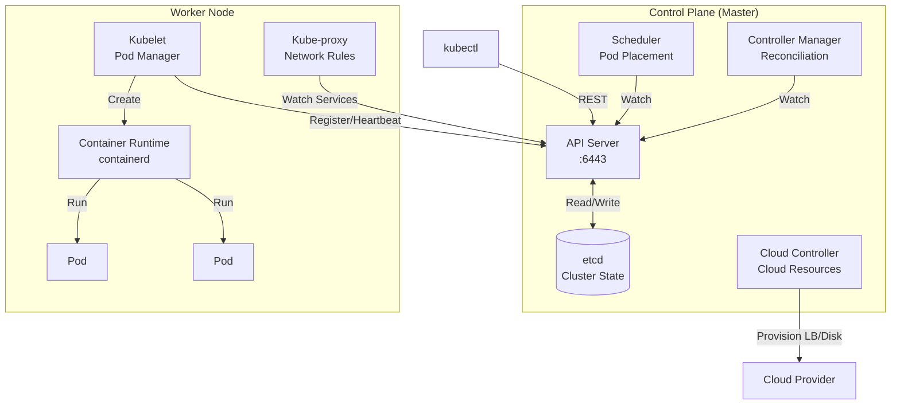

# Kubernetes Interview Questions (50+ Detailed Q&A)

## 1. Architecture & Components

<AccordionGroup>
<Accordion title="1. K8s Architecture Diagram">
**Answer**:
*   **Control Plane (Master)**:
    *   **API Server**: Gateway. Only component talking to etcd.
    *   **Etcd**: Key-Value store. Source of truth.
    *   **Scheduler**: Assigns Pods to Nodes.
    *   **Controller Manager**: Reconciles state (ReplicaSet, Node).
    *   **Cloud Controller**: Talks to AWS/GCP (LBs, Disk).
*   **Worker Node**:
    *   **Kubelet**: Agent talking to API Server. Manages Pods.
    *   **Kube-proxy**: Network rules (IPTables).
    *   **Runtime**: Docker/Containerd.



**Request Flow (Creating a Deployment)**:
1. `kubectl apply -f deployment.yaml` \u2192 API Server
2. API Server validates, writes to etcd
3. Deployment Controller sees new Deployment \u2192 creates ReplicaSet
4. ReplicaSet Controller sees new RS \u2192 creates Pod specs
5. Scheduler sees unscheduled Pods \u2192 assigns to Nodes
6. Kubelet on Node sees new Pod assignment \u2192 pulls image, starts container
7. Kube-proxy updates iptables rules for Service

**Component Failure Scenarios**:
- **API Server down**: Cluster unmanageable (but existing Pods keep running)
- **etcd down**: Cluster state lost (catastrophic)
- **Scheduler down**: New Pods stay Pending
- **Kubelet down**: Node marked NotReady, Pods evicted after timeout
</Accordion>


<Accordion title="2. Role of Etcd">
**Answer**:
Distributed KV Store.
Stores Cluster State (Config, Secrets, Metadata).
Consistent (Raft Consensus).
**Critical**: If etcd is lost, cluster is lost. Needs High Availability (3-5 nodes).
</Accordion>

<Accordion title="3. Kube-proxy modes">
**Answer**:
*   **IPTables**: Default. Fast. Linux Kernel routing.
*   **IPVS**: For massive scale (thousands of services). Hash table based.
*   **Userspace**: Old, slow.
</Accordion>

<Accordion title="4. API Server Role">
**Answer**:
Authentication -> Authorization -> Admission Control -> Write to Etcd.
Stateless. Can be scaled horizontally.
</Accordion>

<Accordion title="5. Scheduler Logic">
**Answer**:
1.  **Filtering**: Which nodes meet requirements? (RAM, CPU, Taints).
2.  **Scoring**: Rank valid nodes (Least load, Image affinity).
3.  **Binding**: Notify API Server.
</Accordion>

<Accordion title="6. Controller Pattern">
**Answer**:
Infinite Loop: Watch Current State -> Compare with Desired State -> Make changes.
Example: ReplicaSet sees 2 pods, wants 3. Creates 1.
</Accordion>

<Accordion title="7. CRI, CNI, CSI">
**Answer**:
Interfaces to make K8s modular.
*   **CRI** (Runtime): Swap Docker for Containerd/CRI-O.
*   **CNI** (Network): Swap Flannel for Calico.
*   **CSI** (Storage): Swap EBS for PD-SSD.
</Accordion>

<Accordion title="8. Pause Container">
**Answer**:
Small container holding the Network Namespace for the Pod.
If app container dies, Pause stays alive so IP is kept.
</Accordion>

<Accordion title="9. Pod Lifecycle">
**Answer**:
Pending -> ContainerCreating -> Running -> Succeeded/Failed.
**CrashLoopBackOff**: Repeated failure.
</Accordion>

<Accordion title="10. Static Pods">
**Answer**:
Managed directly by Kubelet (Manifests in `/etc/kubernetes/manifests`).
Not managed by API Server/scheduler.
Used for Control Plane components (etcd, apiserver) in self-hosted clusters.
</Accordion>
</AccordionGroup>

## 2. Workloads & Scheduling

<AccordionGroup>
<Accordion title="11. Deployment vs StatefulSet vs DaemonSet">
**Answer**:
*   **Deployment**: Stateless. Random names (`app-xyz`). Easy update/rollback.
*   **StatefulSet**: Sticky identity (`app-0`, `app-1`). Ordered startup. Persistent storage attachment.
*   **DaemonSet**: One pod per Node. (Logs, Monitoring).
</Accordion>

<Accordion title="12. Jobs vs CronJobs">
**Answer**:
*   **Job**: Run to completion (Batch). Retries on failure.
*   **CronJob**: Time-based schedule.
</Accordion>

<Accordion title="13. Taints & Tolerations">
**Answer**:
Node says "Stay away" (Taint). Pod says "I can handle it" (Toleration).
**Use**: Dedicated hardware (GPU nodes), Master nodes (NoSchedule).
</Accordion>

<Accordion title="14. Node Affinity vs Selector">
**Answer**:
*   **Selector**: Simple equality (`disk=ssd`). Hard rule.
*   **Affinity**: Expressive (`Not In`, `Exists`). Soft rules (`preferredDuringScheduling`).
</Accordion>

<Accordion title="15. Init Containers">
**Answer**:
Run *before* main container. Sequential.
**Use**: Wait for DB service, Download assets.
If fails, Pod restarts.
</Accordion>

<Accordion title="16. Sidecar Pattern">
**Answer**:
Helper container running alongside main app.
**Use**: Log shipping (Fluentd), Proxy (Envoy/Istio), Config watcher.
</Accordion>

<Accordion title="17. Resource Requests vs Limits">
**Answer**:
*   **Request**: Guaranteed. Used for Scheduling.
*   **Limit**: Max cap. If CPU exceeded -> Throttle. If RAM exceeded -> OOMKill.
</Accordion>

<Accordion title="18. Pod Disruption Budget (PDB)">
**Answer**:
Limit how many pods can be down simultaneously during voluntary disruptions (Node Drain/Upgrade).
"Always keep min 2 pods up".
</Accordion>

<Accordion title="19. Rolling Update vs Recreate">
**Answer**:
*   **Rolling**: New pod up -> Old pod down. Zero downtime.
*   **Recreate**: All old down -> All new up. Downtime.
</Accordion>

<Accordion title="20. QoS Classes">
**Answer**:
1.  **Guaranteed**: Limit == Request for all. (Last to be evicted).
2.  **Burstable**: Request < Limit.
3.  **BestEffort**: No requests. (First to be evicted).
</Accordion>
</AccordionGroup>

## 3. Networking & Service Discovery

<AccordionGroup>
<Accordion title="21. Pod-to-Pod Networking Rules">
**Answer**:
1.  Every Pod gets an IP.
2.  All Pods can talk to all Pods without NAT.
</Accordion>

<Accordion title="22. Service Types">
**Answer**:
*   **ClusterIP**: Internal VIP.
*   **NodePort**: Random port (30000+) on Node IP.
*   **LoadBalancer**: Cloud LB.
*   **ExternalName**: DNS alias to external service.
</Accordion>

<Accordion title="23. How does Service Discovery work?">
**Answer**:
**CoreDNS**.
Watches API for new Services. Adds A-record: `my-svc.my-ns.svc.cluster.local`.
</Accordion>

<Accordion title="24. Ingress vs Ingress Controller">
**Answer**:
*   **Ingress**: The Rule (Resource). "Route /api to Service B".
*   **Controller**: The Implementation (Nginx Pod). Reads Rule, updates `nginx.conf`.
</Accordion>

<Accordion title="25. Network Policies">
**Answer**:
K8s Firewall. Deny all by default. Allow specific traffic.
Implemented by CNI (Calico).
</Accordion>

<Accordion title="26. Headless Service">
**Answer**:
`ClusterIP: None`.
DNS returns List of Pod IPs directly, not VIP.
Used for StatefulSets (Direct peering).
</Accordion>

<Accordion title="27. Service Mesh (Istio)">
**Answer**:
Sidecar proxy (Envoy) in every pod.
Features: mTLS, Canary, Circuit Breaking, Tracing.
</Accordion>

<Accordion title="28. CNI Plugins (Flannel vs Calico)">
**Answer**:
*   **Flannel**: VXLAN Overlay. Simple. No NetPol.
*   **Calico**: Layer 3 BGP. Complex. Supports NetPol.
</Accordion>

<Accordion title="29. Gateway API">
**Answer**:
Next-gen Ingress. Standardization. Role separation (Infra vs App).
</Accordion>

<Accordion title="30. Port Forwarding">
**Answer**:
Dev tool. Tunnels local machine port to Pod port via API Server.
</Accordion>
</AccordionGroup>

## 4. Storage & Config

<AccordionGroup>
<Accordion title="31. PV vs PVC">
**Answer**:
*   **PV**: Physical volume (Disk). Admin creates it.
*   **PVC**: Claim (Request). User creates it.
</Accordion>

<Accordion title="32. StorageClass">
**Answer**:
Dynamic Provisioning.
PVC asks for "Standard". StorageClass talks to AWS -> Creates EBS -> Creates PV -> Binds.
</Accordion>

<Accordion title="33. Access Modes">
**Answer**:
*   **RWO**: ReadWriteOnce (1 Node). Block storage.
*   **RWX**: ReadWriteMany (Multiple Nodes). NFS/EFS.
</Accordion>

<Accordion title="34. ConfigMap vs Secret">
**Answer**:
*   **Conf**: Plain text. Env vars, files.
*   **Secret**: Base64. Encrypted at rest (if configured).
</Accordion>

<Accordion title="35. Downward API">
**Answer**:
Expose Pod info (Name, IP, Namespace) to container as Env/File.
</Accordion>

<Accordion title="36. EmptyDir">
**Answer**:
Ephemeral volume. Starts empty. Dies with Pod. Good for cache.
</Accordion>
</AccordionGroup>

## 5. Troubleshooting & Security (Deep Dive)

<AccordionGroup>
<Accordion title="37. `CrashLoopBackOff` Debugging">
**Answer**:
1.  `kubectl logs` (App error).
2.  `kubectl describe` (Liveness probe failed? OOM?).
3.  `kubectl get events`.
</Accordion>

<Accordion title="38. `ImagePullBackOff`">
**Answer**:
Bad tag? Private registry auth missing (ImagePullSecrets)? Network?
</Accordion>

<Accordion title="39. `Pending` State">
**Answer**:
Scheduler cannot find a node.
Insufficient CPU/RAM? Taints? Affinity Rules? PVC pending?
</Accordion>

<Accordion title="40. `Terminating` Stuck">
**Answer**:
Finalizers? Unresponsive Storage?
**Force**: `delete pod --grace-period=0 --force`.
</Accordion>

<Accordion title="41. RBAC (Role vs ClusterRole)">
**Answer**:
*   **Role**: Namespaced (Can read Pods in 'dev').
*   **ClusterRole**: Global (Can read Nodes).
*   **Binding**: Connects User to Role.
</Accordion>

<Accordion title="42. ServiceAccount">
**Answer**:
Identity for Pods.
Pods use SA token to talk to API Server.
</Accordion>

<Accordion title="43. Security Context">
**Answer**:
`runAsUser: 1000`. `readOnlyRootFilesystem`.
Defines privileges at Pod/Container level.
</Accordion>

<Accordion title="44. Admission Controllers">
**Answer**:
Interceptors before persistence.
*   **Validating**: "No, wrong schema". (OPA Gatekeeper).
*   **Mutating**: "I'll add a sidecar automatically".
</Accordion>

<Accordion title="45. OPA (Open Policy Agent)">
**Answer**:
Policy as Code. "Registry must be internal", "Ingress must be HTTPS".
</Accordion>

<Accordion title="46. Etcd Encryption">
**Answer**:
Secrets are base64 by default. Must enable EncryptionAtRest provider to encrypt etcd data.
</Accordion>

<Accordion title="47. Network Policies Default">
**Answer**:
Apps are insecure by default (Allow All).
First step: Deny All Ingress. Then whitelist.
</Accordion>

<Accordion title="48. Container Runtime Security">
**Answer**:
gVisor / Kata Containers. Sandbox containers with distinct Kernel for high isolation.
</Accordion>

<Accordion title="49. Upgrading Cluster">
**Answer**:
1.  Upgrade Master components.
2.  Drain Node (Evict pods).
3.  Upgrade Kubelet.
4.  Uncordon.
</Accordion>

<Accordion title="50. Helm vs Kustomize">
**Answer**:
*   **Helm**: Templating (`{{ .Values }}`). Package Management. Complex.
*   **Kustomize**: Overlay/Patching. Native to Kubectl. Cleaner (No templates).
</Accordion>
</AccordionGroup>

## 6. Kubernetes Medium Level Questions

<AccordionGroup>
<Accordion title="51. DaemonSet">
**Answer**:
Ensures one pod per node.

```yaml
apiVersion: apps/v1
kind: DaemonSet
metadata:
  name: fluentd
spec:
  selector:
    matchLabels:
      app: fluentd
  template:
    metadata:
      labels:
        app: fluentd
    spec:
      containers:
      - name: fluentd
        image: fluentd:latest
```

**Use cases**: Logging agents, monitoring agents, network plugins.
</Accordion>

<Accordion title="52. StatefulSet">
**Answer**:
For stateful applications with stable network identity.

```yaml
apiVersion: apps/v1
kind: StatefulSet
metadata:
  name: mysql
spec:
  serviceName: mysql
  replicas: 3
  selector:
    matchLabels:
      app: mysql
  template:
    metadata:
      labels:
        app: mysql
    spec:
      containers:
      - name: mysql
        image: mysql:8.0
        volumeMounts:
        - name: data
          mountPath: /var/lib/mysql
  volumeClaimTemplates:
  - metadata:
      name: data
    spec:
      accessModes: ["ReadWriteOnce"]
      resources:
        requests:
          storage: 10Gi
```

**Features**: Ordered deployment, stable pod names (mysql-0, mysql-1).
</Accordion>

<Accordion title="53. Job and CronJob">
**Answer**:
```yaml
# Job: run once
apiVersion: batch/v1
kind: Job
metadata:
  name: backup
spec:
  template:
    spec:
      containers:
      - name: backup
        image: backup:latest
      restartPolicy: Never
  backoffLimit: 3

# CronJob: scheduled
apiVersion: batch/v1
kind: CronJob
metadata:
  name: daily-backup
spec:
  schedule: "0 2 * * *"
  jobTemplate:
    spec:
      template:
        spec:
          containers:
          - name: backup
            image: backup:latest
          restartPolicy: Never
```
</Accordion>

<Accordion title="54. Init Containers">
**Answer**:
Run before app containers.

```yaml
spec:
  initContainers:
  - name: wait-for-db
    image: busybox
    command: ['sh', '-c', 'until nc -z db 5432; do sleep 1; done']
  containers:
  - name: app
    image: myapp
```
</Accordion>

<Accordion title="55. Sidecar Pattern">
**Answer**:
Helper container alongside main container.

```yaml
spec:
  containers:
  - name: app
    image: myapp
  - name: log-shipper
    image: fluentd
    volumeMounts:
    - name: logs
      mountPath: /var/log
  volumes:
  - name: logs
    emptyDir: {}
```
</Accordion>

<Accordion title="56. Resource Requests and Limits">
**Answer**:
```yaml
resources:
  requests:
    memory: "256Mi"
    cpu: "500m"
  limits:
    memory: "512Mi"
    cpu: "1000m"
```

*   **Requests**: Minimum guaranteed
*   **Limits**: Maximum allowed
</Accordion>

<Accordion title="57. Pod Disruption Budget">
**Answer**:
Ensure minimum availability during disruptions.

```yaml
apiVersion: policy/v1
kind: PodDisruptionBudget
metadata:
  name: myapp-pdb
spec:
  minAvailable: 2
  selector:
    matchLabels:
      app: myapp
```
</Accordion>

<Accordion title="58. Network Policies">
**Answer**:
Control pod-to-pod traffic.

```yaml
apiVersion: networking.k8s.io/v1
kind: NetworkPolicy
metadata:
  name: allow-frontend
spec:
  podSelector:
    matchLabels:
      app: backend
  ingress:
  - from:
    - podSelector:
        matchLabels:
          app: frontend
    ports:
    - protocol: TCP
      port: 8080
```
</Accordion>

<Accordion title="59. Ingress Controllers">
**Answer**:
```yaml
apiVersion: networking.k8s.io/v1
kind: Ingress
metadata:
  name: myapp
  annotations:
    nginx.ingress.kubernetes.io/rewrite-target: /
spec:
  rules:
  - host: myapp.example.com
    http:
      paths:
      - path: /
        pathType: Prefix
        backend:
          service:
            name: myapp
            port:
              number: 80
```
</Accordion>

<Accordion title="60. Service Mesh (Istio)">
**Answer**:
Traffic management, security, observability.

```yaml
apiVersion: networking.istio.io/v1beta1
kind: VirtualService
metadata:
  name: myapp
spec:
  hosts:
  - myapp
  http:
  - route:
    - destination:
        host: myapp
        subset: v1
      weight: 90
    - destination:
        host: myapp
        subset: v2
      weight: 10
```
</Accordion>
</AccordionGroup>

## 7. Kubernetes Advanced Level Questions

<AccordionGroup>
<Accordion title="61. Custom Resource Definitions (CRDs)">
**Answer**:
Extend Kubernetes API.

```yaml
apiVersion: apiextensions.k8s.io/v1
kind: CustomResourceDefinition
metadata:
  name: databases.example.com
spec:
  group: example.com
  versions:
  - name: v1
    served: true
    storage: true
    schema:
      openAPIV3Schema:
        type: object
        properties:
          spec:
            type: object
            properties:
              size:
                type: string
  scope: Namespaced
  names:
    plural: databases
    singular: database
    kind: Database
```
</Accordion>

<Accordion title="62. Operators">
**Answer**:
Automate application management.

```go
// Reconcile loop
func (r *DatabaseReconciler) Reconcile(ctx context.Context, req ctrl.Request) (ctrl.Result, error) {
    var db examplev1.Database
    if err := r.Get(ctx, req.NamespacedName, &db); err != nil {
        return ctrl.Result{}, err
    }
    
    // Create/update resources based on spec
    // ...
    
    return ctrl.Result{}, nil
}
```
</Accordion>

<Accordion title="63. Admission Controllers">
**Answer**:
Intercept API requests before persistence.

```yaml
apiVersion: admissionregistration.k8s.io/v1
kind: ValidatingWebhookConfiguration
metadata:
  name: pod-policy
webhooks:
- name: validate.example.com
  clientConfig:
    service:
      name: webhook
      namespace: default
      path: /validate
  rules:
  - operations: ["CREATE"]
    apiGroups: [""]
    apiVersions: ["v1"]
    resources: ["pods"]
```
</Accordion>

<Accordion title="64. Pod Security Standards">
**Answer**:
```yaml
apiVersion: v1
kind: Namespace
metadata:
  name: production
  labels:
    pod-security.kubernetes.io/enforce: restricted
    pod-security.kubernetes.io/audit: restricted
    pod-security.kubernetes.io/warn: restricted
```

**Levels**: Privileged, Baseline, Restricted.
</Accordion>

<Accordion title="65. RBAC Advanced Patterns">
**Answer**:
```yaml
# ClusterRole for cross-namespace access
apiVersion: rbac.authorization.k8s.io/v1
kind: ClusterRole
metadata:
  name: secret-reader
rules:
- apiGroups: [""]
  resources: ["secrets"]
  verbs: ["get", "list"]
  resourceNames: ["my-secret"]

# RoleBinding in specific namespace
apiVersion: rbac.authorization.k8s.io/v1
kind:RoleBinding
metadata:
  name: read-secrets
  namespace: production
subjects:
- kind: ServiceAccount
  name: myapp
roleRef:
  kind: ClusterRole
  name: secret-reader
  apiGroup: rbac.authorization.k8s.io
```
</Accordion>

<Accordion title="66. Cluster Autoscaler">
**Answer**:
Automatically adjust cluster size.

```yaml
apiVersion: apps/v1
kind: Deployment
metadata:
  name: cluster-autoscaler
  namespace: kube-system
spec:
  template:
    spec:
      containers:
      - image: k8s.gcr.io/autoscaling/cluster-autoscaler:v1.25.0
        command:
        - ./cluster-autoscaler
        - --cloud-provider=gce
        - --nodes=1:10:node-pool-1
```
</Accordion>

<Accordion title="67. Pod Priority and Preemption">
**Answer**:
```yaml
apiVersion: scheduling.k8s.io/v1
kind: PriorityClass
metadata:
  name: high-priority
value: 1000000
globalDefault: false
description: "High priority pods"

---
apiVersion: v1
kind: Pod
metadata:
  name: critical-app
spec:
  priorityClassName: high-priority
  containers:
  - name: app
    image: myapp
```
</Accordion>

<Accordion title="68. Taints and Tolerations">
**Answer**:
```bash
# Taint node
kubectl taint nodes node1 key=value:NoSchedule

# Pod with toleration
spec:
  tolerations:
  - key: "key"
    operator: "Equal"
    value: "value"
    effect: "NoSchedule"
```
</Accordion>

<Accordion title="69. Pod Affinity and Anti-Affinity">
**Answer**:
```yaml
spec:
  affinity:
    podAntiAffinity:
      requiredDuringSchedulingIgnoredDuringExecution:
      - labelSelector:
          matchExpressions:
          - key: app
            operator: In
            values:
            - myapp
        topologyKey: kubernetes.io/hostname
```

**Use case**: Spread pods across nodes for HA.
</Accordion>

<Accordion title="70. Troubleshooting Techniques">
**Answer**:
```bash
# Pod logs
kubectl logs pod-name -c container-name --previous

# Exec into pod
kubectl exec -it pod-name -- /bin/sh

# Describe for events
kubectl describe pod pod-name

# Port forward
kubectl port-forward pod-name 8080:80

# Debug with ephemeral container
kubectl debug pod-name -it --image=busybox

# Node issues
kubectl get nodes
kubectl describe node node-name
kubectl top nodes

# Network debugging
kubectl run tmp --image=nicolaka/netshoot -it --rm
```
</Accordion>
</AccordionGroup>
