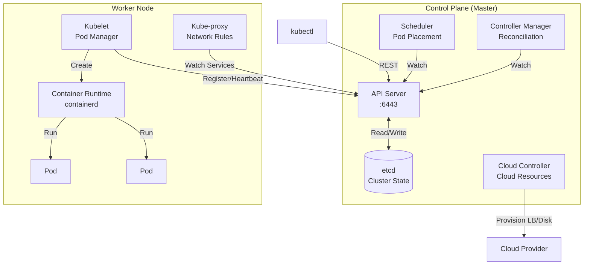

# Kubernetes Interview Questions (70+ Detailed Q&A)

## 1. Architecture & Components

<AccordionGroup>
<Accordion title="1. K8s Architecture Diagram">
**Answer**:
*   **Control Plane (Master)**:
    *   **API Server**: Gateway. Only component talking to etcd.
    *   **Etcd**: Key-Value store. Source of truth.
    *   **Scheduler**: Assigns Pods to Nodes.
    *   **Controller Manager**: Reconciles state (ReplicaSet, Node).
    *   **Cloud Controller**: Talks to AWS/GCP (LBs, Disk).
*   **Worker Node**:
    *   **Kubelet**: Agent talking to API Server. Manages Pods.
    *   **Kube-proxy**: Network rules (IPTables).
    *   **Runtime**: Docker/Containerd.


```mermaid
graph TD
    subgraph Control_Plane["Control Plane (Master)"]
        API[API Server<br/>:6443]
        ETCD[(etcd<br/>Cluster State)]
        Scheduler[Scheduler<br/>Pod Placement]
        CM[Controller Manager<br/>Reconciliation]
        CCM[Cloud Controller<br/>Cloud Resources]
    end
    
    subgraph Worker_Node["Worker Node"]
        Kubelet[Kubelet<br/>Pod Manager]
        KubeProxy[Kube-proxy<br/>Network Rules]
        Runtime[Container Runtime<br/>containerd]
        Pod1[Pod]
        Pod2[Pod]
    end
    
    User[kubectl] -->|REST| API
    API <-->|Read/Write| ETCD
    Scheduler -->|Watch| API
    CM -->|Watch| API
    Kubelet -->|Register/Heartbeat| API
    Kubelet -->|Create| Runtime
    Runtime -->|Run| Pod1
    Runtime -->|Run| Pod2
    KubeProxy -->|Watch Services| API
    CCM -->|Provision LB/Disk| Cloud[Cloud Provider]
```

**Request Flow (Creating a Deployment)**:
1. `kubectl apply -f deployment.yaml` \u2192 API Server
2. API Server validates, writes to etcd
3. Deployment Controller sees new Deployment \u2192 creates ReplicaSet
4. ReplicaSet Controller sees new RS \u2192 creates Pod specs
5. Scheduler sees unscheduled Pods \u2192 assigns to Nodes
6. Kubelet on Node sees new Pod assignment \u2192 pulls image, starts container
7. Kube-proxy updates iptables rules for Service

**Component Failure Scenarios**:
- **API Server down**: Cluster unmanageable (but existing Pods keep running)
- **etcd down**: Cluster state lost (catastrophic)
- **Scheduler down**: New Pods stay Pending
- **Kubelet down**: Node marked NotReady, Pods evicted after timeout
</Accordion>


<Accordion title="2. Role of Etcd">
**What interviewers are really testing:** Do you understand why etcd is the single most critical component in Kubernetes, how Raft consensus works at a high level, and what operational practices keep it alive in production?

**Answer**:
etcd is a distributed, strongly-consistent key-value store that serves as the **single source of truth** for the entire Kubernetes cluster.

*   **What it stores**: Every Kubernetes object -- Pods, Services, Secrets, ConfigMaps, RBAC rules, lease objects for leader election -- is serialized as protobuf and stored in etcd under a key like `/registry/pods/default/my-pod`.
*   **Consistency model**: Uses the **Raft consensus algorithm**. One node is elected leader; all writes go through the leader and are replicated to a majority (quorum) before being acknowledged. This guarantees linearizable reads (if configured with `--serializable=false`).
*   **Cluster sizing**: Always run an **odd number** of nodes -- 3 (tolerates 1 failure) or 5 (tolerates 2 failures). Running 4 nodes gives no advantage over 3 because quorum for 4 is still 3.
*   **Performance characteristics**: etcd is sensitive to disk latency. Production recommendation is SSD-backed storage with &lt;10ms fsync latency. On GKE/EKS, the managed control plane handles this, but on self-managed clusters (kubeadm), slow disks are the number-one etcd killer.
*   **Backup strategy**: `etcdctl snapshot save /backup/etcd-$(date +%Y%m%d).db` run as a CronJob every 1-4 hours. Without this, losing etcd quorum means rebuilding the cluster from scratch.

**Production war story**: A team ran etcd on nodes with spinning disks in a 200-node cluster. During peak load, etcd fsync latency spiked to 200ms, leader elections started flipping every few seconds, and the entire cluster became unresponsive -- kubectl commands timed out, new deployments froze. The fix was migrating etcd to dedicated nodes with NVMe SSDs and setting `--heartbeat-interval=250` and `--election-timeout=2500`.

**Red flag answer:** "etcd is just a database for Kubernetes." This misses the consensus model, the quorum requirement, the operational criticality, and the performance sensitivity that make etcd unique.

**Follow-up:**
1. **"What happens if 2 out of 3 etcd nodes go down simultaneously?"** -- The cluster loses quorum. etcd becomes read-only (no writes can be committed). The API Server can still serve cached/stale reads but cannot accept any create/update/delete operations. You must restore from snapshot or bring at least one node back to regain quorum.
2. **"How would you migrate etcd from 3 nodes to 5 nodes without downtime?"** -- Add one node at a time using `etcdctl member add`. Each new node joins as a learner, syncs data, then promotes to full voter. Never add 2 nodes simultaneously because it changes the quorum size mid-operation and can cause split-brain.
3. **"Why not just use PostgreSQL or MySQL instead of etcd?"** -- Kubernetes needs a distributed consensus store with watch semantics (clients subscribe to changes on keys). etcd provides this natively via gRPC watch streams. Traditional RDBMS would need polling, which does not scale to thousands of controllers watching thousands of resources in real-time.
</Accordion>

<Accordion title="3. Kube-proxy modes">
**What interviewers are really testing:** Do you understand how Service networking actually works at the kernel level, and can you reason about when default settings break at scale?

**Answer**:
Kube-proxy runs on every node and programs the kernel to route traffic from a Service's virtual IP (ClusterIP) to the actual Pod endpoints. It operates in one of three modes:

*   **iptables mode** (default since K8s 1.2): Creates iptables rules in the KUBE-SERVICES and KUBE-SVC-* chains. For each Service, there is a chain of rules that DNAT (destination NAT) traffic to one of the backend Pod IPs using probabilistic matching. For example, a Service with 3 Pods gets rules with 33%/50%/100% probability splits. **Pros**: Fast (kernel-space, no userspace hop), simple. **Cons**: O(n) rule evaluation -- with 5,000 Services, iptables has ~25,000+ rules, and rule updates cause full-table rewrites that can take seconds, causing packet drops during updates.
*   **IPVS mode** (stable since K8s 1.11): Uses Linux IPVS (IP Virtual Server) kernel module. Hash-table based lookups give **O(1) performance** regardless of Service count. Supports multiple load-balancing algorithms: round-robin, least-connections, source-hash, shortest-expected-delay. **When to switch**: When you have &gt;1,000 Services or notice kube-proxy taking &gt;5 seconds to sync iptables rules. Enable with `--proxy-mode=ipvs` on kube-proxy.
*   **Userspace mode** (legacy, pre-1.2): Traffic goes to kube-proxy process in userspace, then back to kernel. Round-trip through userspace adds 1-3ms latency per packet. No one runs this in production anymore.

**Real-world metric**: At a cluster with 3,000 Services, switching from iptables to IPVS reduced kube-proxy sync time from 12 seconds to under 200ms and eliminated the intermittent connection timeouts users were seeing during Service endpoint updates.

**Red flag answer:** "Kube-proxy is a proxy that forwards traffic." This misses that kube-proxy does not actually proxy traffic in iptables/IPVS mode -- it programs kernel rules and gets out of the data path entirely.

**Follow-up:**
1. **"If kube-proxy crashes on a node, do existing connections break?"** -- No. The iptables/IPVS rules are already programmed in the kernel. Existing connections continue to work. However, no new rule updates will happen, so new Services or endpoint changes will not be reflected on that node until kube-proxy restarts.
2. **"How does kube-proxy know which Pods back a Service?"** -- It watches EndpointSlice objects (or legacy Endpoints) from the API Server. When a Pod becomes Ready (passes readiness probe), the Endpoints controller adds it to the EndpointSlice, and kube-proxy picks up the change via its watch stream.
3. **"What is nftables mode and why does it matter?"** -- Starting in K8s 1.29 (alpha) and graduating in 1.31, nftables mode is the successor to iptables mode. It uses the newer Linux nftables subsystem which has atomic rule updates (no full-table rewrite), better performance than iptables at scale, and a cleaner rule structure. It is expected to eventually replace iptables mode as the default.
</Accordion>

<Accordion title="4. API Server Role">
**What interviewers are really testing:** Can you walk through the full request pipeline inside the API Server? Do you understand the difference between authentication, authorization, and admission control -- and why the ordering matters?

**Answer**:
The API Server (kube-apiserver) is the **only** component that reads from and writes to etcd. Every interaction in the cluster -- kubectl, kubelet, controllers, external CI/CD -- goes through it. Here is the full request pipeline:

1.  **Authentication** (Who are you?): Supports multiple methods simultaneously -- x509 client certificates, bearer tokens, OIDC (Google/Azure AD), webhook token review. If all authenticators reject, you get a 401. In production, most teams use OIDC for human users and ServiceAccount tokens for Pods.
2.  **Authorization** (Are you allowed?): Default is RBAC (Role-Based Access Control). The API Server checks if the authenticated identity has a RoleBinding/ClusterRoleBinding granting the requested verb (`get`, `list`, `create`, `delete`) on the requested resource. Also supports ABAC (legacy), Webhook, and Node authorization.
3.  **Admission Control** (Should we allow/modify this?): Two phases run sequentially:
    *   **Mutating admission** (runs first): Can modify the request. Examples: Istio sidecar injector adds an Envoy container, `LimitRanger` sets default resource requests, `ServiceAccount` admission controller mounts SA tokens.
    *   **Validating admission** (runs second): Can only accept or reject. Examples: OPA Gatekeeper blocks images from untrusted registries, `PodSecurity` admission enforces Pod Security Standards.
4.  **Persistence**: Object is serialized (protobuf) and written to etcd.
5.  **Response**: API Server returns the created/updated object to the client, and all watchers (controllers, kubelet) are notified via their watch streams.

**Scaling**: The API Server is **stateless** -- all state is in etcd. You can run 3-5 replicas behind a load balancer (GKE does this by default). The bottleneck is usually etcd, not the API Server itself.

**Key detail most people miss**: The API Server also serves as the **aggregation layer** for extension API servers (like metrics-server, custom CRDs with aggregated API servers). When you run `kubectl top pods`, the request goes to the API Server, which proxies it to the metrics-server.

**Red flag answer:** "The API Server stores data and serves it to kubectl." This misses the entire authentication/authorization/admission pipeline, which is the core of Kubernetes security.

**Follow-up:**
1. **"If a mutating webhook is down, what happens to all Pod create requests?"** -- By default, if a webhook has `failurePolicy: Fail` (the default), all requests matching its rules will be rejected with a 500 error. This is why webhook availability is critical -- a broken sidecar injector can bring all deployments to a halt. Use `failurePolicy: Ignore` for non-critical webhooks and set `timeoutSeconds` to something low like 5s.
2. **"Why do mutating webhooks run before validating webhooks?"** -- Because validating webhooks need to see the final form of the object. If validation ran first, it might approve an object that a mutating webhook then changes into something invalid.
3. **"How would you debug slow API Server responses?"** -- Check API Server audit logs for slow requests, look at etcd latency metrics (`etcd_request_duration_seconds`), check if admission webhooks are slow (webhook latency is additive), and verify watch cache is healthy with `apiserver_cache_list_total` metrics. The `--audit-policy-file` flag lets you log every request for forensic analysis.
</Accordion>

<Accordion title="5. Scheduler Logic">
**What interviewers are really testing:** Do you understand the two-phase scheduling algorithm, can you name specific filter/score plugins, and do you know how to influence scheduling decisions for real workloads?

**Answer**:
The scheduler watches for Pods with an empty `spec.nodeName` and assigns them to nodes using a plugin-based, two-phase algorithm:

1.  **Filtering (Predicates)** -- Eliminates nodes that cannot run the Pod:
    *   `NodeResourcesFit`: Does the node have enough allocatable CPU/memory for the Pod's requests?
    *   `NodeAffinity`: Does the node match `requiredDuringSchedulingIgnoredDuringExecution` rules?
    *   `TaintToleration`: Does the Pod tolerate the node's taints?
    *   `PodTopologySpread`: Would placing this Pod violate `maxSkew` constraints?
    *   `VolumeBinding`: Can the required PersistentVolumes be bound on this node/zone?
    If zero nodes pass filtering, the Pod stays `Pending`.
2.  **Scoring (Priorities)** -- Ranks the remaining nodes 0-100:
    *   `LeastAllocated`: Prefer nodes with more free resources (spreads load).
    *   `MostAllocated`: Prefer fuller nodes (bin-packing for cost savings -- useful in autoscaled clusters).
    *   `ImageLocality`: Prefer nodes that already have the container image cached (saves pull time).
    *   `InterPodAffinity`: Score based on `preferredDuringScheduling` affinity/anti-affinity rules.
    *   `NodeResourcesBalancedAllocation`: Prefer nodes where CPU and memory utilization are balanced.
3.  **Binding** -- The highest-scoring node wins. Scheduler writes `spec.nodeName` to the Pod object via the API Server, and the Kubelet on that node picks it up.

**Scheduler Profiles** (since v1.18): You can run multiple scheduling profiles in a single scheduler, each with different plugin configurations. For example, one profile for general workloads (LeastAllocated) and another for batch jobs (MostAllocated/bin-packing).

**Performance**: The scheduler processes ~100 Pods/second by default. For large clusters, it uses `percentageOfNodesToScore` (default 50% for clusters &gt;100 nodes) to avoid scoring every single node -- it stops scoring once it has found enough feasible nodes.

**Red flag answer:** "The scheduler just picks the node with the most resources." This misses the entire plugin framework, the filter/score distinction, and the many factors beyond raw resources.

**Follow-up:**
1. **"A Pod is Pending and events show 'insufficient CPU'. But `kubectl top nodes` shows plenty of CPU free. What is going on?"** -- `kubectl top` shows **actual usage**, but the scheduler looks at **requests** (allocated capacity), not usage. The node might have 8 CPU cores, only 2 cores actually in use, but 7.5 cores worth of resource requests already allocated. The remaining 0.5 cores of allocatable CPU is not enough for the new Pod's request. This is the #1 scheduling confusion in production.
2. **"How would you force a critical Pod to schedule even when the cluster is full?"** -- Use PriorityClasses with preemption. Create a `PriorityClass` with a high value and `preemptionPolicy: PreemptLowerPriority`. The scheduler will evict lower-priority Pods to make room. But be careful -- preemption can cascade and kill important workloads if priority values are not well-planned.
3. **"Can you bypass the scheduler entirely?"** -- Yes, set `spec.nodeName` directly in the Pod manifest. The Pod goes straight to the Kubelet without scheduler involvement. This is how static Pods work and can be used for emergency debugging, but it bypasses all filter checks, so you might overcommit a node.
</Accordion>

<Accordion title="6. Controller Pattern">
**What interviewers are really testing:** Do you understand the declarative reconciliation model that underpins all of Kubernetes? Can you explain level-triggered vs edge-triggered, and why idempotency matters?

**Answer**:
The controller pattern is the **core design principle** of Kubernetes. Every controller runs an infinite reconciliation loop:

1.  **Watch**: Subscribe to API Server events for specific resource types (via informers/watch streams).
2.  **Compare**: Read the current state of the world and compare it to the desired state declared in the resource spec.
3.  **Reconcile**: Take the minimum action needed to make current state match desired state.

**Key design properties**:
*   **Level-triggered, not edge-triggered**: Controllers do not react to "what happened" (edge) -- they react to "what is the current delta between desired and actual" (level). If a controller crashes and misses 10 events, when it restarts it simply compares current vs desired and fixes any drift. This is what makes Kubernetes self-healing.
*   **Idempotent**: Running a reconciliation twice with no state change in between should produce no side effects. Controllers use `create-if-not-exists` and `update-if-changed` patterns.
*   **Optimistic concurrency**: etcd uses resource versions. If two controllers try to update the same object, one gets a conflict error and retries with the latest version.

**Built-in controllers** (inside kube-controller-manager): ReplicaSet, Deployment (manages rollouts via ReplicaSets), StatefulSet, DaemonSet, Job, CronJob, Node (marks unhealthy nodes), EndpointSlice, Namespace (cleanup on deletion), ServiceAccount (creates default SA per namespace), and ~20 more.

**Example walkthrough**: ReplicaSet controller sees `spec.replicas: 3` but only 2 matching Pods exist. It creates 1 new Pod object (with `nodeName` empty). It does not care **why** there are only 2 -- maybe one crashed, maybe someone deleted one manually, maybe the cluster just scaled up. The controller only cares about the delta.

**Red flag answer:** "Controllers are like cron jobs that check things periodically." Controllers use watch streams (real-time push notifications), not polling. The informer framework maintains a local cache and delivers events with minimal latency.

**Follow-up:**
1. **"What is the difference between a controller and an operator?"** -- An operator IS a controller, but specifically one that encodes domain-specific operational knowledge for a complex stateful application. All operators are controllers; not all controllers are operators. For example, the ReplicaSet controller is a generic controller. The Prometheus Operator is a controller that knows how to deploy, configure, and upgrade Prometheus instances, handle shard rebalancing, etc.
2. **"What happens if the controller manager crashes for 10 minutes and 5 Pods die during that time?"** -- When the controller manager restarts, it re-lists all resources from the API Server, rebuilds its local cache, and reconciles. It sees 5 fewer Pods than desired and creates 5 new ones. No events were "lost" because the system is level-triggered -- it does not need to replay the history of what happened.
3. **"How do you avoid thundering herd problems when many controllers reconcile simultaneously after a restart?"** -- Controllers use work queues with rate limiting, exponential backoff, and jitter. The `client-go` `workqueue` package provides `RateLimitingQueue` that prevents a controller from hammering the API Server with thousands of reconcile calls at once.
</Accordion>

<Accordion title="7. CRI, CNI, CSI">
**What interviewers are really testing:** Do you understand Kubernetes' plugin architecture and why these interfaces exist? Can you explain the practical impact of swapping implementations?

**Answer**:
Kubernetes uses three standardized plugin interfaces to decouple core orchestration from infrastructure implementation. This is what makes K8s portable across clouds, runtimes, and storage backends.

*   **CRI (Container Runtime Interface)**: Defines how the kubelet talks to the container runtime. Before CRI, Kubernetes had Docker hardcoded into the kubelet (the infamous "dockershim"). CRI abstracts this behind a gRPC API so you can swap runtimes without changing Kubernetes itself.
    *   **containerd**: The production standard since K8s 1.24 removed dockershim. Lightweight, OCI-compliant, used by GKE/EKS/AKS by default.
    *   **CRI-O**: Red Hat's alternative, purpose-built for Kubernetes. Used in OpenShift. Slightly smaller footprint than containerd.
    *   **gVisor (runsc)**: Google's sandboxed runtime. Runs containers with a user-space kernel for strong isolation. 5-15% performance overhead but prevents container escapes. Used for multi-tenant clusters.
    *   **Kata Containers**: Runs each container inside a lightweight VM. Strongest isolation (hardware-level) but highest overhead (~50-100ms startup penalty).
*   **CNI (Container Network Interface)**: Defines how Pods get their network interfaces and IP addresses. The kubelet calls the CNI plugin binary when a Pod starts/stops.
    *   **Flannel**: VXLAN overlay. Simple, no NetworkPolicy support. Good for dev clusters.
    *   **Calico**: L3 BGP routing or VXLAN. Full NetworkPolicy support, high performance, used in most production clusters.
    *   **Cilium**: eBPF-based. Replaces kube-proxy, provides L7 NetworkPolicies, built-in observability (Hubble). The current momentum leader for production clusters.
    *   **AWS VPC CNI**: Assigns real VPC IPs to Pods. No overlay overhead but limited by ENI IP quotas per instance type.
*   **CSI (Container Storage Interface)**: Defines how Kubernetes provisions, attaches, and mounts storage volumes. Replaced the old "in-tree" volume plugins that were compiled into Kubernetes itself.
    *   **EBS CSI Driver**: For AWS EBS volumes. Supports snapshots, encryption, io2 provisioned IOPS.
    *   **GCE PD CSI Driver**: For Google Persistent Disks. Supports regional PDs for HA.
    *   **Longhorn/Rook-Ceph**: Open-source distributed storage for bare-metal clusters.

**Why this matters**: When someone says "we're migrating from Docker to containerd," they are changing the CRI implementation. The Pods, images, and YAML do not change. When someone says "we're switching from Flannel to Cilium," they are changing the CNI -- existing Pod IPs will change (requires rolling restart), but the application code is untouched. This plug-and-play architecture is what lets teams run the same Kubernetes workloads on AWS, GCP, on-prem, and edge devices.

**Red flag answer:** "CRI is Docker, CNI is the network, CSI is storage." This shows zero understanding of why these interfaces exist or that they are pluggable abstractions, not specific implementations.

**Follow-up:**
1. **"Kubernetes 1.24 removed dockershim. What actually changed for teams still using Docker images?"** -- Nothing for images. OCI images are a standard -- containerd runs the same images Docker built. What changed is the runtime: the kubelet no longer talks to the Docker daemon. Teams that relied on Docker-specific features (like `docker exec` on the node, or building images inside Pods using the Docker socket) had to adapt. The images themselves are 100% compatible.
2. **"Why would you choose Cilium over Calico for a new production cluster?"** -- Cilium uses eBPF programs loaded into the kernel, which means it can do packet filtering without iptables, provides L7 policy enforcement (e.g., allow HTTP GET but block POST), and gives you Hubble for network observability without additional tooling. Calico is more mature and battle-tested. The tradeoff is complexity: Cilium requires a newer kernel (&gt;= 4.19, ideally &gt;= 5.10) and has a steeper learning curve.
3. **"If a CSI driver crashes on a node, what happens to Pods using volumes from that driver?"** -- Existing mounted volumes continue to work (they are already mounted in the kernel). But new Pods that need volume attach/mount will fail, and volume expansion or snapshot operations will hang. The kubelet retries CSI calls with exponential backoff until the driver recovers.
</Accordion>

<Accordion title="8. Pause Container">
**What interviewers are really testing:** Do you understand the Linux namespace model that underpins Pod networking? This is a "do you actually know what a Pod is at the OS level" question.

**Answer**:
The pause container (also called the "infrastructure container" or "sandbox container") is the first container started in every Pod and the last to be terminated. It serves as the **namespace anchor** for the Pod.

*   **What it does**: The pause container creates and holds the Linux network namespace (and optionally IPC and PID namespaces) that all other containers in the Pod share. Its process is literally the `pause` syscall -- it does nothing except exist and hold the namespace open.
*   **Why it exists**: Linux namespaces are tied to processes. If your app container is the only process and it crashes, the network namespace is destroyed, the Pod IP is released, and every other container in the Pod loses networking. The pause container prevents this -- since it never crashes (it is a ~700KB statically-linked binary that calls `pause()`), the namespace survives app container restarts.
*   **Pod networking model**: When the CNI plugin assigns an IP to a Pod, it actually assigns it to the pause container's network namespace. All app containers in the Pod see the same `eth0` interface, the same IP, and can communicate via `localhost`. This is why two containers in the same Pod cannot bind to the same port -- they share the network stack.
*   **Image**: `registry.k8s.io/pause:3.9` (or similar version). It is cached on every node. The image is ~700KB and never needs updating in practice.
*   **What `kubectl describe pod` shows**: You will not see the pause container listed under `Containers:` in describe output. It is hidden from the Kubernetes API. But if you SSH to the node and run `crictl ps`, you will see it alongside the app containers.

**Red flag answer:** "The pause container is used to pause the application" or "I've never heard of the pause container." The first shows a fundamental misunderstanding, the second suggests the candidate has never looked beneath the Kubernetes API surface.

**Follow-up:**
1. **"If you run two containers in a Pod, can they see each other's processes?"** -- Only if the Pod spec sets `shareProcessNamespace: true`. By default, containers share the network and IPC namespaces (via the pause container) but have separate PID namespaces. With shared PID namespace, `ps aux` in one container shows processes from all containers, and you can send signals across containers -- useful for sidecar debugging but a security consideration.
2. **"What happens during a Pod restart -- does the pause container get recreated?"** -- No. When an app container crashes, only that container is restarted (the kubelet calls the CRI to create a new container in the existing sandbox). The pause container and its network namespace persist. A full Pod restart (e.g., from a liveness probe failure with `restartPolicy: Always`) also reuses the sandbox unless the Pod is deleted and recreated.
3. **"How does this relate to the Pod sandbox concept in CRI?"** -- In the CRI specification, the pause container IS the "PodSandbox." When the kubelet calls `RunPodSandbox()`, the runtime creates the pause container and sets up namespaces. All subsequent `CreateContainer()` calls join that sandbox's namespaces. Different runtimes implement the sandbox differently -- containerd uses the pause image, Kata Containers creates a lightweight VM as the sandbox.
</Accordion>

<Accordion title="9. Pod Lifecycle">
**What interviewers are really testing:** Can you trace the full journey of a Pod from creation to termination, including what happens at each phase and what can go wrong? This separates operators who debug daily from candidates who only read tutorials.

**Answer**:
A Pod moves through distinct phases, and understanding each one is critical for debugging:

1.  **Pending**: The Pod object exists in etcd but is not yet running on a node. Sub-states:
    *   *Waiting for scheduling*: The scheduler has not yet found a suitable node. Check `kubectl describe pod` for events like `FailedScheduling`.
    *   *Waiting for image pull*: The kubelet is pulling the container image. For large images (2-5GB ML models), this can take minutes.
    *   *Waiting for volume mount*: A PVC is not yet bound, or a CSI driver is provisioning a disk.
2.  **ContainerCreating**: The kubelet has the Pod assigned and is setting up the sandbox (pause container), running init containers, and creating app containers. Network and volumes are being attached.
3.  **Running**: At least one container is running. This does NOT mean the app is healthy -- a container can be Running but failing readiness probes.
4.  **Succeeded**: All containers exited with code 0. Typical for Jobs and one-shot Pods. The Pod stays in this state for inspection until garbage collected.
5.  **Failed**: All containers have terminated and at least one exited with a non-zero code.
6.  **Unknown**: The kubelet on the node stopped reporting status. Usually means the node is unreachable.

**Critical sub-states most people miss:**

*   **CrashLoopBackOff**: The container starts, crashes, kubelet restarts it (per `restartPolicy`), it crashes again. Kubelet applies exponential backoff: 10s, 20s, 40s, ... up to 5 minutes between restarts. The container itself is not running during backoff -- it is waiting. Debug with `kubectl logs <pod> --previous` to see the last crash's logs.
*   **ImagePullBackOff**: Image pull failed (wrong tag, auth failure, network issue). Kubelet backs off before retrying. Check `kubectl describe pod` for the exact pull error.
*   **OOMKilled**: Container exceeded its memory limit. The kernel's OOM killer terminates the process. You see this in `kubectl describe pod` under `Last State: Terminated, Reason: OOMKilled`. Fix: increase memory limits or fix the memory leak.
*   **Evicted**: The node is under resource pressure (disk, memory, PID). Kubelet evicts BestEffort Pods first, then Burstable, then Guaranteed. `kubectl get pods --field-selector=status.phase=Failed` to find evicted Pods.

**Pod Termination Sequence** (equally important and often asked):
1.  Pod is set to `Terminating` state. Endpoints controllers remove it from Service endpoints.
2.  `preStop` hook runs (if defined). Example: `sleep 5` to allow in-flight requests to drain.
3.  SIGTERM is sent to PID 1 in each container.
4.  Kubelet waits up to `terminationGracePeriodSeconds` (default 30s) for graceful shutdown.
5.  SIGKILL is sent if the process has not exited.
6.  Pod is deleted from the API.

**Red flag answer:** "Pods go from Pending to Running to Completed." Missing the failure states, sub-states, and termination sequence shows the candidate has never debugged a production Pod issue.

**Follow-up:**
1. **"A Pod is in CrashLoopBackOff but `kubectl logs` shows no output. How do you debug?"** -- The container might be crashing before the application writes any logs (e.g., missing shared library, bad entrypoint, segfault). Use `kubectl logs <pod> --previous` to see the last run. If still empty, check `kubectl describe pod` for container exit codes. Exit code 137 = OOMKilled (SIGKILL). Exit code 139 = segfault. Use `kubectl debug -it <pod> --image=busybox --target=<container>` to attach an ephemeral debug container sharing the PID namespace.
2. **"Why is the termination sequence order important for zero-downtime deployments?"** -- There is a race condition: the Pod receives SIGTERM at the same time endpoints are being removed from Services. If the endpoint removal propagates slowly (kube-proxy or ingress controller has stale rules), traffic can still be routed to a terminating Pod. The `preStop: sleep 5` hack gives time for endpoint removal to propagate before the app starts shutting down. Without it, you get 502 errors during rolling updates.
3. **"What is the difference between `restartPolicy: Always`, `OnFailure`, and `Never`? When would you use each?"** -- `Always` (default for Deployments): container is always restarted, even on exit code 0. Used for long-running services. `OnFailure`: restart only on non-zero exit. Used for Jobs where you want retry on failure but not on success. `Never`: never restart. Used for one-shot debugging Pods or when the Job controller handles retries at the Pod level via `backoffLimit`.
</Accordion>

<Accordion title="10. Static Pods">
**What interviewers are really testing:** Do you understand the bootstrap problem in Kubernetes -- how do control plane components run as Pods before the control plane exists? This question tests understanding of the kubelet's standalone capabilities.

**Answer**:
Static Pods are managed directly by the kubelet on a specific node, without any involvement from the API Server or scheduler.

*   **How they work**: The kubelet watches a directory on the local filesystem (default: `/etc/kubernetes/manifests/`) for YAML Pod manifests. When it finds one, it creates the Pod directly using the container runtime. No scheduler, no API Server, no controllers involved.
*   **Mirror Pods**: The kubelet creates a "mirror Pod" object in the API Server so that `kubectl get pods` can see the static Pod. But this is read-only -- you cannot delete a static Pod via `kubectl delete`. You must remove the manifest file from the node's filesystem.
*   **The bootstrap problem this solves**: In `kubeadm`-provisioned clusters, the API Server, etcd, scheduler, and controller manager all run as static Pods. But if they are Pods, who schedules them? Nobody -- the kubelet runs them directly from manifest files. This is how Kubernetes bootstraps itself: kubelet starts static Pods for the control plane, which then bootstraps the rest of the cluster.
*   **What you find in `/etc/kubernetes/manifests/`** on a kubeadm master node: `kube-apiserver.yaml`, `kube-controller-manager.yaml`, `kube-scheduler.yaml`, `etcd.yaml`.
*   **Use cases beyond bootstrapping**: Running critical node-level agents that must survive API Server outages (monitoring agents, security agents). DaemonSets are preferred in most cases, but static Pods have no dependency on the control plane.

**Managed Kubernetes note**: On GKE, EKS, and AKS, you never see static Pods because the control plane is managed by the cloud provider and hidden from you. This question is most relevant for self-managed clusters (kubeadm, k3s, bare-metal).

**Red flag answer:** "Static Pods are Pods that don't move between nodes." That describes Pods in general once scheduled. The defining characteristic of static Pods is kubelet-local management without API Server involvement.

**Follow-up:**
1. **"If you edit a static Pod manifest file on disk, what happens?"** -- The kubelet detects the file change (it polls the directory, typically every 20 seconds) and recreates the Pod with the new spec. This is how you upgrade control plane components in kubeadm: you modify the manifest files, and the kubelet handles the restart. `kubeadm upgrade apply` does exactly this behind the scenes.
2. **"Can you use a static Pod with a PersistentVolumeClaim?"** -- No, because PVC binding requires the API Server and the PV controller. Static Pods can use `hostPath` or `emptyDir` volumes but not PVCs. This is why etcd's static Pod manifest uses `hostPath` to mount the etcd data directory directly from the node's filesystem.
3. **"What happens to the static Pods on a node if the API Server goes down permanently?"** -- The static Pods keep running. The kubelet does not need the API Server to manage static Pods -- it works purely from the local manifest files. The mirror Pods in the API become stale, but the actual containers continue running. This is the key resilience property of static Pods.
</Accordion>
</AccordionGroup>

## 2. Workloads & Scheduling

<AccordionGroup>
<Accordion title="11. Deployment vs StatefulSet vs DaemonSet">
**What interviewers are really testing:** Can you pick the right workload controller for a given scenario and articulate *why*? This is fundamentally a design judgment question.

**Answer**:
These three controllers cover 95% of workload patterns. The key is understanding what guarantees each provides:

*   **Deployment** (stateless workloads):
    *   Pods get random names like `api-7d4b8f6c9-x2k5q`. Identity does not matter.
    *   Scaling up/down creates/destroys Pods in any order. All Pods are interchangeable.
    *   Rolling updates create a new ReplicaSet, scale it up, and scale the old one down. Rollback is instant -- just switch back to the old ReplicaSet.
    *   Pods share no persistent storage by default. If you attach a PVC, all replicas fight over the same volume (usually wrong).
    *   **Use for**: Web servers, APIs, microservices, stateless workers, anything where you can lose a Pod and another one picks up the work.

*   **StatefulSet** (stateful workloads):
    *   Pods get stable, predictable names: `mysql-0`, `mysql-1`, `mysql-2`. This identity is preserved across restarts and rescheduling.
    *   Pods are created in order (0, 1, 2) and terminated in reverse order (2, 1, 0). This matters for databases that need a primary to start before replicas.
    *   Each Pod gets its own PersistentVolumeClaim via `volumeClaimTemplates`. `mysql-0` always gets `data-mysql-0`, even after rescheduling. This is the killer feature.
    *   Requires a Headless Service (`clusterIP: None`) for stable DNS names: `mysql-0.mysql.default.svc.cluster.local`.
    *   **Use for**: Databases (PostgreSQL, MySQL, MongoDB), distributed systems (Kafka, Elasticsearch, ZooKeeper), anything that needs stable identity or dedicated storage.

*   **DaemonSet** (per-node workloads):
    *   Runs exactly one Pod on every node (or a subset of nodes via `nodeSelector`/tolerations).
    *   When a new node joins the cluster, the DaemonSet controller automatically schedules a Pod on it. When a node is removed, the Pod is garbage collected.
    *   Updates can be `RollingUpdate` (default) or `OnDelete` (manual per-node control).
    *   **Use for**: Log collectors (Fluentd/Fluent Bit), node monitoring (Prometheus Node Exporter, Datadog agent), CNI plugins (Calico, Cilium), storage drivers (CSI node plugins), security agents.

**Decision framework**: Ask yourself: "If I replace this Pod with a brand-new one, does anything break?" If yes -- StatefulSet. "Does this need to run on every node?" If yes -- DaemonSet. Otherwise -- Deployment.

**Red flag answer:** "StatefulSet is for databases and Deployment is for everything else." This misses that many databases now run fine on Deployments with external storage (e.g., a single PostgreSQL instance with a PVC and Deployment works for many use cases). The real differentiator is whether you need stable identity and ordered operations, not just "is it a database."

**Follow-up:**
1. **"Can you run a database on a Deployment instead of a StatefulSet? When would that be appropriate?"** -- Yes, for single-instance databases where you do not need stable network identity or multiple replicas with dedicated volumes. A single PostgreSQL with a Deployment + PVC (ReadWriteOnce) works fine. StatefulSet becomes necessary when you need a multi-replica cluster (e.g., PostgreSQL with streaming replication) where each replica needs its own volume and stable DNS name for peer discovery.
2. **"What happens if a DaemonSet Pod is evicted due to node pressure? Does it come back?"** -- Yes. The DaemonSet controller sees that the node exists but has no matching Pod, so it recreates one. However, if the node is under memory pressure, the new Pod may also be evicted immediately, creating a restart loop. This is why DaemonSet Pods should use `Guaranteed` QoS (requests == limits) and have high PriorityClass values to survive eviction.
3. **"You need to deploy a log collector that runs on every node including master nodes. What tolerations do you need?"** -- Master/control-plane nodes have taints `node-role.kubernetes.io/control-plane:NoSchedule`. The DaemonSet Pod spec needs a toleration for that taint. Also tolerate `node.kubernetes.io/not-ready:NoExecute` and `node.kubernetes.io/unreachable:NoExecute` so the agent stays running even on degraded nodes.
</Accordion>

<Accordion title="12. Jobs vs CronJobs">
**What interviewers are really testing:** Do you understand batch workload semantics in Kubernetes, including parallelism, failure handling, and the operational gotchas of CronJobs that bite teams in production?

**Answer**:

*   **Job**: Creates one or more Pods and ensures they run to successful completion.
    *   `completions: 5` -- the Job needs 5 successful Pod completions to finish.
    *   `parallelism: 3` -- run up to 3 Pods concurrently. Useful for batch processing (process 1000 items with 10 parallel workers).
    *   `backoffLimit: 4` -- after 4 failed Pods, the Job is marked as Failed. Backoff is exponential: 10s, 20s, 40s, etc.
    *   `activeDeadlineSeconds: 600` -- hard timeout. If the Job has not completed in 10 minutes, all Pods are terminated. Critical for preventing runaway batch jobs.
    *   `ttlSecondsAfterFinished: 3600` -- auto-delete the Job (and its Pods) 1 hour after completion. Without this, completed Job Pods accumulate and clutter `kubectl get pods`.
    *   **Indexed Jobs** (since K8s 1.21): Each Pod gets an index (`JOB_COMPLETION_INDEX` env var). Useful for partitioned workloads: "Pod 0 processes items 0-99, Pod 1 processes 100-199."

*   **CronJob**: Creates Job objects on a cron schedule.
    *   `schedule: "0 2 * * *"` -- runs daily at 2 AM (UTC by default, configurable with `timeZone` since K8s 1.27).
    *   `concurrencyPolicy`:
        *   `Allow` (default): Multiple Jobs can run simultaneously. **Dangerous** if runs overlap.
        *   `Forbid`: Skip the new run if the previous one is still running.
        *   `Replace`: Kill the running Job and start a new one.
    *   `startingDeadlineSeconds: 200` -- if the CronJob misses its scheduled time by more than 200 seconds (e.g., because the controller was down), skip it. Without this, a CronJob controller restart can trigger a burst of missed runs.
    *   `successfulJobsHistoryLimit` / `failedJobsHistoryLimit` -- how many completed/failed Jobs to keep for inspection. Defaults are 3/1.

**Production gotchas:**
*   CronJobs that take longer than their interval will pile up if `concurrencyPolicy` is `Allow`. A nightly backup that takes 2 hours running on a 1-hour schedule creates 24 concurrent Jobs. Set `Forbid` for idempotent jobs.
*   CronJobs do NOT alert you on failure by default. A silently failing nightly backup can go unnoticed for weeks. Always add monitoring: check for `kube_job_status_failed` in Prometheus or set up alerts on missing `kube_job_status_succeeded` within expected windows.
*   Time zones: Before K8s 1.27, CronJob schedules were always UTC. Teams running `0 2 * * *` thinking it was 2 AM local time got a rude surprise.

**Red flag answer:** "CronJobs are like cron on Linux." While the scheduling is similar, this misses the Kubernetes-specific semantics: concurrency policies, missed schedule handling, history limits, and the fact that CronJobs create Job objects (not Pods directly).

**Follow-up:**
1. **"A CronJob that runs every 5 minutes has been silently failing for a week. How would you have caught this?"** -- Set up a Prometheus alert on `kube_job_status_failed > 0` for jobs in the namespace. Alternatively, use a dead man's switch pattern: the CronJob pushes a heartbeat to a monitoring service (like Healthchecks.io or Prometheus Pushgateway) on success, and if the heartbeat is missed for 15 minutes, alert fires.
2. **"How do you handle a Job that processes a queue of 10,000 items where each item takes 1-60 seconds?"** -- Use an Indexed Job with `completions: 10000` and `parallelism: 50`. Or better, use a work-queue pattern: `completions: null` with `parallelism: 50`, where each Pod pulls items from a shared queue (Redis, SQS) and exits when the queue is empty. The second pattern is more efficient because fast items do not leave workers idle.
3. **"What happens if the CronJob controller is down for 3 hours and a CronJob was supposed to run every hour?"** -- When the controller restarts, it checks how many runs were missed. If fewer than 100 runs were missed, it schedules them. If more than 100, it logs an error and does not schedule any (to avoid a thundering herd). The `startingDeadlineSeconds` field controls whether individual missed runs are skipped.
</Accordion>

<Accordion title="13. Taints & Tolerations">
**Answer**:
Node says "Stay away" (Taint). Pod says "I can handle it" (Toleration).
**Use**: Dedicated hardware (GPU nodes), Master nodes (NoSchedule).
</Accordion>

<Accordion title="14. Node Affinity vs Selector">
**Answer**:
*   **Selector**: Simple equality (`disk=ssd`). Hard rule.
*   **Affinity**: Expressive (`Not In`, `Exists`). Soft rules (`preferredDuringScheduling`).
</Accordion>

<Accordion title="15. Init Containers">
**Answer**:
Run *before* main container. Sequential.
**Use**: Wait for DB service, Download assets.
If fails, Pod restarts.
</Accordion>

<Accordion title="16. Sidecar Pattern">
**Answer**:
Helper container running alongside main app.
**Use**: Log shipping (Fluentd), Proxy (Envoy/Istio), Config watcher.
</Accordion>

<Accordion title="17. Resource Requests vs Limits">
**Answer**:
*   **Request**: Guaranteed. Used for Scheduling.
*   **Limit**: Max cap. If CPU exceeded -> Throttle. If RAM exceeded -> OOMKill.
</Accordion>

<Accordion title="18. Pod Disruption Budget (PDB)">
**Answer**:
Limit how many pods can be down simultaneously during voluntary disruptions (Node Drain/Upgrade).
"Always keep min 2 pods up".
</Accordion>

<Accordion title="19. Rolling Update vs Recreate">
**Answer**:
*   **Rolling**: New pod up -> Old pod down. Zero downtime.
*   **Recreate**: All old down -> All new up. Downtime.
</Accordion>

<Accordion title="20. QoS Classes">
**Answer**:
1.  **Guaranteed**: Limit == Request for all. (Last to be evicted).
2.  **Burstable**: Request < Limit.
3.  **BestEffort**: No requests. (First to be evicted).
</Accordion>
</AccordionGroup>

## 3. Networking & Service Discovery

<AccordionGroup>
<Accordion title="21. Pod-to-Pod Networking Rules">
**Answer**:
1.  Every Pod gets an IP.
2.  All Pods can talk to all Pods without NAT.
</Accordion>

<Accordion title="22. Service Types">
**Answer**:
*   **ClusterIP**: Internal VIP.
*   **NodePort**: Random port (30000+) on Node IP.
*   **LoadBalancer**: Cloud LB.
*   **ExternalName**: DNS alias to external service.
</Accordion>

<Accordion title="23. How does Service Discovery work?">
**Answer**:
**CoreDNS**.
Watches API for new Services. Adds A-record: `my-svc.my-ns.svc.cluster.local`.
</Accordion>

<Accordion title="24. Ingress vs Ingress Controller">
**Answer**:
*   **Ingress**: The Rule (Resource). "Route /api to Service B".
*   **Controller**: The Implementation (Nginx Pod). Reads Rule, updates `nginx.conf`.
</Accordion>

<Accordion title="25. Network Policies">
**Answer**:
K8s Firewall. Deny all by default. Allow specific traffic.
Implemented by CNI (Calico).
</Accordion>

<Accordion title="26. Headless Service">
**Answer**:
`ClusterIP: None`.
DNS returns List of Pod IPs directly, not VIP.
Used for StatefulSets (Direct peering).
</Accordion>

<Accordion title="27. Service Mesh (Istio)">
**Answer**:
Sidecar proxy (Envoy) in every pod.
Features: mTLS, Canary, Circuit Breaking, Tracing.
</Accordion>

<Accordion title="28. CNI Plugins (Flannel vs Calico)">
**Answer**:
*   **Flannel**: VXLAN Overlay. Simple. No NetPol.
*   **Calico**: Layer 3 BGP. Complex. Supports NetPol.
</Accordion>

<Accordion title="29. Gateway API">
**Answer**:
Next-gen Ingress. Standardization. Role separation (Infra vs App).
</Accordion>

<Accordion title="30. Port Forwarding">
**Answer**:
Dev tool. Tunnels local machine port to Pod port via API Server.
</Accordion>
</AccordionGroup>

## 4. Storage & Config

<AccordionGroup>
<Accordion title="31. PV vs PVC">
**Answer**:
*   **PV**: Physical volume (Disk). Admin creates it.
*   **PVC**: Claim (Request). User creates it.
</Accordion>

<Accordion title="32. StorageClass">
**Answer**:
Dynamic Provisioning.
PVC asks for "Standard". StorageClass talks to AWS -> Creates EBS -> Creates PV -> Binds.
</Accordion>

<Accordion title="33. Access Modes">
**Answer**:
*   **RWO**: ReadWriteOnce (1 Node). Block storage.
*   **RWX**: ReadWriteMany (Multiple Nodes). NFS/EFS.
</Accordion>

<Accordion title="34. ConfigMap vs Secret">
**Answer**:
*   **Conf**: Plain text. Env vars, files.
*   **Secret**: Base64. Encrypted at rest (if configured).
</Accordion>

<Accordion title="35. Downward API">
**Answer**:
Expose Pod info (Name, IP, Namespace) to container as Env/File.
</Accordion>

<Accordion title="36. EmptyDir">
**Answer**:
Ephemeral volume. Starts empty. Dies with Pod. Good for cache.
</Accordion>
</AccordionGroup>

## 5. Troubleshooting & Security (Deep Dive)

<AccordionGroup>
<Accordion title="37. `CrashLoopBackOff` Debugging">
**Answer**:
1.  `kubectl logs` (App error).
2.  `kubectl describe` (Liveness probe failed? OOM?).
3.  `kubectl get events`.
</Accordion>

<Accordion title="38. `ImagePullBackOff`">
**Answer**:
Bad tag? Private registry auth missing (ImagePullSecrets)? Network?
</Accordion>

<Accordion title="39. `Pending` State">
**Answer**:
Scheduler cannot find a node.
Insufficient CPU/RAM? Taints? Affinity Rules? PVC pending?
</Accordion>

<Accordion title="40. `Terminating` Stuck">
**Answer**:
Finalizers? Unresponsive Storage?
**Force**: `delete pod --grace-period=0 --force`.
</Accordion>

<Accordion title="41. RBAC (Role vs ClusterRole)">
**Answer**:
*   **Role**: Namespaced (Can read Pods in 'dev').
*   **ClusterRole**: Global (Can read Nodes).
*   **Binding**: Connects User to Role.
</Accordion>

<Accordion title="42. ServiceAccount">
**Answer**:
Identity for Pods.
Pods use SA token to talk to API Server.
</Accordion>

<Accordion title="43. Security Context">
**Answer**:
`runAsUser: 1000`. `readOnlyRootFilesystem`.
Defines privileges at Pod/Container level.
</Accordion>

<Accordion title="44. Admission Controllers">
**Answer**:
Interceptors before persistence.
*   **Validating**: "No, wrong schema". (OPA Gatekeeper).
*   **Mutating**: "I'll add a sidecar automatically".
</Accordion>

<Accordion title="45. OPA (Open Policy Agent)">
**Answer**:
Policy as Code. "Registry must be internal", "Ingress must be HTTPS".
</Accordion>

<Accordion title="46. Etcd Encryption">
**Answer**:
Secrets are base64 by default. Must enable EncryptionAtRest provider to encrypt etcd data.
</Accordion>

<Accordion title="47. Network Policies Default">
**Answer**:
Apps are insecure by default (Allow All).
First step: Deny All Ingress. Then whitelist.
</Accordion>

<Accordion title="48. Container Runtime Security">
**Answer**:
gVisor / Kata Containers. Sandbox containers with distinct Kernel for high isolation.
</Accordion>

<Accordion title="49. Upgrading Cluster">
**Answer**:
1.  Upgrade Master components.
2.  Drain Node (Evict pods).
3.  Upgrade Kubelet.
4.  Uncordon.
</Accordion>

<Accordion title="50. Helm vs Kustomize">
**Answer**:
*   **Helm**: Templating (`{{ .Values }}`). Package Management. Complex.
*   **Kustomize**: Overlay/Patching. Native to Kubectl. Cleaner (No templates).
</Accordion>
</AccordionGroup>

## 6. Kubernetes Medium Level Questions

<AccordionGroup>
<Accordion title="51. DaemonSet">
**Answer**:
Ensures one pod per node.

```yaml
apiVersion: apps/v1
kind: DaemonSet
metadata:
  name: fluentd
spec:
  selector:
    matchLabels:
      app: fluentd
  template:
    metadata:
      labels:
        app: fluentd
    spec:
      containers:
      - name: fluentd
        image: fluentd:latest
```

**Use cases**: Logging agents, monitoring agents, network plugins.
</Accordion>

<Accordion title="52. StatefulSet">
**Answer**:
For stateful applications with stable network identity.

```yaml
apiVersion: apps/v1
kind: StatefulSet
metadata:
  name: mysql
spec:
  serviceName: mysql
  replicas: 3
  selector:
    matchLabels:
      app: mysql
  template:
    metadata:
      labels:
        app: mysql
    spec:
      containers:
      - name: mysql
        image: mysql:8.0
        volumeMounts:
        - name: data
          mountPath: /var/lib/mysql
  volumeClaimTemplates:
  - metadata:
      name: data
    spec:
      accessModes: ["ReadWriteOnce"]
      resources:
        requests:
          storage: 10Gi
```

**Features**: Ordered deployment, stable pod names (mysql-0, mysql-1).
</Accordion>

<Accordion title="53. Job and CronJob">
**Answer**:
```yaml
# Job: run once
apiVersion: batch/v1
kind: Job
metadata:
  name: backup
spec:
  template:
    spec:
      containers:
      - name: backup
        image: backup:latest
      restartPolicy: Never
  backoffLimit: 3

# CronJob: scheduled
apiVersion: batch/v1
kind: CronJob
metadata:
  name: daily-backup
spec:
  schedule: "0 2 * * *"
  jobTemplate:
    spec:
      template:
        spec:
          containers:
          - name: backup
            image: backup:latest
          restartPolicy: Never
```
</Accordion>

<Accordion title="54. Init Containers">
**Answer**:
Run before app containers.

```yaml
spec:
  initContainers:
  - name: wait-for-db
    image: busybox
    command: ['sh', '-c', 'until nc -z db 5432; do sleep 1; done']
  containers:
  - name: app
    image: myapp
```
</Accordion>

<Accordion title="55. Sidecar Pattern">
**Answer**:
Helper container alongside main container.

```yaml
spec:
  containers:
  - name: app
    image: myapp
  - name: log-shipper
    image: fluentd
    volumeMounts:
    - name: logs
      mountPath: /var/log
  volumes:
  - name: logs
    emptyDir: {}
```
</Accordion>

<Accordion title="56. Resource Requests and Limits">
**Answer**:
```yaml
resources:
  requests:
    memory: "256Mi"
    cpu: "500m"
  limits:
    memory: "512Mi"
    cpu: "1000m"
```

*   **Requests**: Minimum guaranteed
*   **Limits**: Maximum allowed
</Accordion>

<Accordion title="57. Pod Disruption Budget">
**Answer**:
Ensure minimum availability during disruptions.

```yaml
apiVersion: policy/v1
kind: PodDisruptionBudget
metadata:
  name: myapp-pdb
spec:
  minAvailable: 2
  selector:
    matchLabels:
      app: myapp
```
</Accordion>

<Accordion title="58. Network Policies">
**Answer**:
Control pod-to-pod traffic.

```yaml
apiVersion: networking.k8s.io/v1
kind: NetworkPolicy
metadata:
  name: allow-frontend
spec:
  podSelector:
    matchLabels:
      app: backend
  ingress:
  - from:
    - podSelector:
        matchLabels:
          app: frontend
    ports:
    - protocol: TCP
      port: 8080
```
</Accordion>

<Accordion title="59. Ingress Controllers">
**Answer**:
```yaml
apiVersion: networking.k8s.io/v1
kind: Ingress
metadata:
  name: myapp
  annotations:
    nginx.ingress.kubernetes.io/rewrite-target: /
spec:
  rules:
  - host: myapp.example.com
    http:
      paths:
      - path: /
        pathType: Prefix
        backend:
          service:
            name: myapp
            port:
              number: 80
```
</Accordion>

<Accordion title="60. Service Mesh (Istio)">
**Answer**:
Traffic management, security, observability.

```yaml
apiVersion: networking.istio.io/v1beta1
kind: VirtualService
metadata:
  name: myapp
spec:
  hosts:
  - myapp
  http:
  - route:
    - destination:
        host: myapp
        subset: v1
      weight: 90
    - destination:
        host: myapp
        subset: v2
      weight: 10
```
</Accordion>
</AccordionGroup>

## 7. Kubernetes Advanced Level Questions

<AccordionGroup>
<Accordion title="61. Custom Resource Definitions (CRDs)">
**Answer**:
Extend Kubernetes API.

```yaml
apiVersion: apiextensions.k8s.io/v1
kind: CustomResourceDefinition
metadata:
  name: databases.example.com
spec:
  group: example.com
  versions:
  - name: v1
    served: true
    storage: true
    schema:
      openAPIV3Schema:
        type: object
        properties:
          spec:
            type: object
            properties:
              size:
                type: string
  scope: Namespaced
  names:
    plural: databases
    singular: database
    kind: Database
```
</Accordion>

<Accordion title="62. Operators">
**Answer**:
Automate application management.

```go
// Reconcile loop
func (r *DatabaseReconciler) Reconcile(ctx context.Context, req ctrl.Request) (ctrl.Result, error) {
    var db examplev1.Database
    if err := r.Get(ctx, req.NamespacedName, &db); err != nil {
        return ctrl.Result{}, err
    }
    
    // Create/update resources based on spec
    // ...
    
    return ctrl.Result{}, nil
}
```
</Accordion>

<Accordion title="63. Admission Controllers">
**Answer**:
Intercept API requests before persistence.

```yaml
apiVersion: admissionregistration.k8s.io/v1
kind: ValidatingWebhookConfiguration
metadata:
  name: pod-policy
webhooks:
- name: validate.example.com
  clientConfig:
    service:
      name: webhook
      namespace: default
      path: /validate
  rules:
  - operations: ["CREATE"]
    apiGroups: [""]
    apiVersions: ["v1"]
    resources: ["pods"]
```
</Accordion>

<Accordion title="64. Pod Security Standards">
**Answer**:
```yaml
apiVersion: v1
kind: Namespace
metadata:
  name: production
  labels:
    pod-security.kubernetes.io/enforce: restricted
    pod-security.kubernetes.io/audit: restricted
    pod-security.kubernetes.io/warn: restricted
```

**Levels**: Privileged, Baseline, Restricted.
</Accordion>

<Accordion title="65. RBAC Advanced Patterns">
**Answer**:
```yaml
# ClusterRole for cross-namespace access
apiVersion: rbac.authorization.k8s.io/v1
kind: ClusterRole
metadata:
  name: secret-reader
rules:
- apiGroups: [""]
  resources: ["secrets"]
  verbs: ["get", "list"]
  resourceNames: ["my-secret"]

# RoleBinding in specific namespace
apiVersion: rbac.authorization.k8s.io/v1
kind:RoleBinding
metadata:
  name: read-secrets
  namespace: production
subjects:
- kind: ServiceAccount
  name: myapp
roleRef:
  kind: ClusterRole
  name: secret-reader
  apiGroup: rbac.authorization.k8s.io
```
</Accordion>

<Accordion title="66. Cluster Autoscaler">
**Answer**:
Automatically adjust cluster size.

```yaml
apiVersion: apps/v1
kind: Deployment
metadata:
  name: cluster-autoscaler
  namespace: kube-system
spec:
  template:
    spec:
      containers:
      - image: k8s.gcr.io/autoscaling/cluster-autoscaler:v1.25.0
        command:
        - ./cluster-autoscaler
        - --cloud-provider=gce
        - --nodes=1:10:node-pool-1
```
</Accordion>

<Accordion title="67. Pod Priority and Preemption">
**Answer**:
```yaml
apiVersion: scheduling.k8s.io/v1
kind: PriorityClass
metadata:
  name: high-priority
value: 1000000
globalDefault: false
description: "High priority pods"

---
apiVersion: v1
kind: Pod
metadata:
  name: critical-app
spec:
  priorityClassName: high-priority
  containers:
  - name: app
    image: myapp
```
</Accordion>

<Accordion title="68. Taints and Tolerations">
**Answer**:
```bash
# Taint node
kubectl taint nodes node1 key=value:NoSchedule

# Pod with toleration
spec:
  tolerations:
  - key: "key"
    operator: "Equal"
    value: "value"
    effect: "NoSchedule"
```
</Accordion>

<Accordion title="69. Pod Affinity and Anti-Affinity">
**Answer**:
```yaml
spec:
  affinity:
    podAntiAffinity:
      requiredDuringSchedulingIgnoredDuringExecution:
      - labelSelector:
          matchExpressions:
          - key: app
            operator: In
            values:
            - myapp
        topologyKey: kubernetes.io/hostname
```

**Use case**: Spread pods across nodes for HA.
</Accordion>

<Accordion title="70. Troubleshooting Techniques">
**Answer**:
```bash
# Pod logs
kubectl logs pod-name -c container-name --previous

# Exec into pod
kubectl exec -it pod-name -- /bin/sh

# Describe for events
kubectl describe pod pod-name

# Port forward
kubectl port-forward pod-name 8080:80

# Debug with ephemeral container
kubectl debug pod-name -it --image=busybox

# Node issues
kubectl get nodes
kubectl describe node node-name
kubectl top nodes

# Network debugging
kubectl run tmp --image=nicolaka/netshoot -it --rm
```
</Accordion>
</AccordionGroup>

## Advanced Scenario-Based Questions

<AccordionGroup>
<Accordion title="Scenario 1: Pod Scheduling Failures — The Mystery Pending Pod">
**Scenario:**
Your team deploys a new microservice on Monday morning. The Deployment creates 5 replicas, but 2 Pods are stuck in `Pending` state. The cluster has 12 nodes with plenty of aggregate CPU and memory free. `kubectl describe pod` shows the event: `0/12 nodes are available: 4 node(s) had taints that the pod didn't tolerate, 8 node(s) didn't match Pod's node affinity.` The service was working fine in staging. What is happening, and how do you systematically resolve it?

**What weak candidates say:**
- "Just remove the taints from the nodes" without understanding why they exist.
- "Add more nodes to the cluster" — throwing resources at a config problem.
- "I'd check if there's enough CPU" — ignoring the explicit error message that says affinity and taints are the problem, not resources.
- Cannot articulate the difference between taints/tolerations and node affinity, or how they interact during scheduling.

**What strong candidates say:**
- "The error message tells me two things are blocking scheduling simultaneously. Let me break it down."
- **Step 1 — Inspect the Pod spec**: `kubectl get pod <name> -o yaml | grep -A 20 affinity` and `kubectl get pod <name> -o yaml | grep -A 10 tolerations`. Check if someone added a `nodeAffinity` rule pointing to a label like `topology.kubernetes.io/zone: us-east-1a` that doesn't match the 8 untainted nodes.
- **Step 2 — Inspect the Nodes**: `kubectl get nodes --show-labels` and `kubectl describe node <name> | grep Taints`. Cross-reference which nodes have the required label AND don't have blocking taints.
- **Step 3 — Root cause**: This often happens when a Helm values file has environment-specific node affinity (e.g., staging uses `env=staging` labels, production uses `env=prod`) and someone copy-pasted the staging values without updating the affinity selector. Or a platform team added taints for a GPU node pool and the new service doesn't tolerate them.
- **Step 4 — The fix depends on intent**: If the affinity is wrong, update the Deployment spec. If the taints are intentional, add tolerations. If the labels are missing from nodes, add them with `kubectl label nodes <node> key=value`. Never blindly remove taints — they exist for a reason (dedicated workloads, spot instances, GPU isolation).
- "In a previous role, we had this exact issue when our platform team rolled out a `dedicated=monitoring:NoSchedule` taint across a new node pool, but forgot to update the internal wiki. Five teams filed tickets that morning. We ended up adding a CI check that validates toleration/affinity combinations against actual cluster node labels before deploy."

**Follow-up:**
1. What happens if you have both `requiredDuringSchedulingIgnoredDuringExecution` and `preferredDuringSchedulingIgnoredDuringExecution` affinity rules? How does the scheduler evaluate them?
2. If a node's labels change AFTER a Pod is already scheduled there, does the Pod get evicted? What about `requiredDuringSchedulingRequiredDuringExecution` — does it exist yet?
3. You have a mixed cluster: 4 on-demand nodes and 8 spot nodes with a `cloud.google.com/gke-spot=true:NoSchedule` taint. How would you design your Deployments so that stateless workloads prefer spot but fall back to on-demand, while stateful workloads never land on spot?
</Accordion>

<Accordion title="Scenario 2: Network Policy Debugging — The Silent Drop">
**Scenario:**
Your backend Pod (`app=order-service` in namespace `production`) suddenly cannot reach a PostgreSQL Pod (`app=postgres` in namespace `databases`). Nothing changed in the application code. `curl` from inside the order-service Pod to `postgres.databases.svc.cluster.local:5432` hangs and times out. `kubectl get networkpolicy -A` shows several policies exist. The Pods are running, DNS resolves correctly, and the postgres Pod is accepting connections from other services. How do you debug this?

**What weak candidates say:**
- "Restart the pods" or "delete the network policy" as a first instinct.
- "Check if the service is running" — the problem statement already says postgres is accepting connections from other services.
- Cannot explain how NetworkPolicies are evaluated (they are additive for allow, but a default-deny changes the model entirely).

**What strong candidates say:**
- "Network policies are the most likely culprit since other services can still reach postgres. The key insight is that NetworkPolicies are scoped by namespace and are **additive for allow but become restrictive once any policy selects a pod**. Let me trace both sides."
- **Step 1 — Check egress on the source**: `kubectl get networkpolicy -n production -o yaml`. If there's an egress policy selecting `app=order-service`, it must explicitly allow traffic to the `databases` namespace on port 5432. A common mistake: someone added an egress policy that allows DNS (port 53) and traffic to a new external API, but forgot to include the existing postgres rule. Once ANY egress policy selects a pod, all non-matching egress is denied.
- **Step 2 — Check ingress on the destination**: `kubectl get networkpolicy -n databases -o yaml`. The postgres ingress policy must allow traffic from pods with label `app=order-service` in namespace `production`. Cross-namespace policies require a `namespaceSelector` — a plain `podSelector` only matches within the same namespace.
- **Step 3 — Verify CNI support**: Flannel does NOT enforce NetworkPolicies. If someone migrated from Calico to a CNI that doesn't support policies, they'd silently stop working. `kubectl get pods -n kube-system` to confirm Calico/Cilium is running.
- **Step 4 — Use Cilium/Calico debugging tools**: `kubectl exec -n kube-system <calico-node-pod> -- calico-node -felix-live` or with Cilium: `kubectl exec -n kube-system <cilium-pod> -- cilium monitor --type drop`. This shows real-time dropped packets with the exact policy that caused the drop.
- "The 'nothing changed in application code' is a red herring that weaker candidates latch onto. The change was almost certainly a new or modified NetworkPolicy, possibly applied by a different team. I'd check `kubectl get events -n production` and audit logs for recent NetworkPolicy changes. In one incident at a previous company, a security team rolled out a blanket default-deny egress policy across all production namespaces via GitOps at 2 AM, and we spent 4 hours the next morning debugging connection failures across 12 services before someone thought to check the policy repo's commit history."

**Follow-up:**
1. How do you test NetworkPolicies before applying them to production? Is there a dry-run or simulation tool?
2. Explain how a default-deny policy works. If you apply `podSelector: `{}`` with no ingress rules, what happens? What if you apply it with an empty ingress array vs. no ingress field at all?
3. Your company wants to enforce that no Pod in any namespace can reach the internet (egress to `0.0.0.0/0`) except for explicitly allowlisted services. How would you implement this at scale across 50 namespaces without maintaining 50 separate policies?
</Accordion>

<Accordion title="Scenario 3: HPA Not Scaling — Flat Under Load">
**Scenario:**
You have an HPA configured for your `api-gateway` Deployment: `minReplicas: 2`, `maxReplicas: 20`, target CPU utilization 60%. During a load test pushing 10x normal traffic, CPU on existing Pods hits 95%, response latency spikes to 8 seconds, but the HPA stubbornly stays at 2 replicas. `kubectl get hpa` shows `TARGETS: <unknown>/60%`. What is going wrong and how do you fix it?

**What weak candidates say:**
- "Increase maxReplicas" — the HPA isn't scaling at all, not hitting a ceiling.
- "The load test isn't generating enough traffic" — the problem statement says CPU is at 95%.
- Don't recognize that `<unknown>` in the TARGETS column is the critical clue.

**What strong candidates say:**
- "The `<unknown>` in TARGETS is the dead giveaway. It means the HPA cannot read metrics. This is almost always one of two things: metrics-server is not installed/broken, or the Pod spec is missing resource requests."
- **Root cause 1 — No resource requests**: HPA calculates scaling based on the ratio of current usage to requested resources. If `resources.requests.cpu` is not set in the container spec, HPA literally cannot compute a percentage. `kubectl get pod <name> -o yaml | grep -A 5 resources` — if it's empty, that's the problem. Fix: add `requests.cpu: "500m"` (or whatever's appropriate) to the Deployment spec.
- **Root cause 2 — Metrics Server is down**: `kubectl get pods -n kube-system | grep metrics-server`. If it's `CrashLoopBackOff` or missing entirely, HPA has no data source. Verify with `kubectl top pods` — if that returns an error, metrics-server is broken. Common causes: metrics-server can't reach kubelets (certificate issues in clusters with `--kubelet-insecure-tls` missing), or it was accidentally deleted during a cluster upgrade.
- **Root cause 3 — API registration**: `kubectl get apiservice v1beta1.metrics.k8s.io` — if it shows `False` under AVAILABLE, the metrics API is registered but not serving. This happens when metrics-server exists but is unhealthy.
- **The fix sequence**: Confirm resource requests exist. Confirm metrics-server is running and healthy. Verify `kubectl top pods` returns data. Then watch `kubectl get hpa -w` to see the HPA pick up metrics and begin scaling.
- "I've seen this in production where a team optimized their Dockerfile, redeployed, and the new Helm chart template had a typo that dropped the `resources` block entirely. Everything worked fine until the next traffic spike, because HPA silently stops working without requests — it doesn't alert you. We added an OPA Gatekeeper policy after that incident requiring all Deployments to have resource requests. Cost us about 45 minutes of downtime during a Black Friday warm-up test."

**Follow-up:**
1. CPU-based HPA has a known lag problem. Walk me through the timing: how long does it take from a traffic spike to new Pods actually serving traffic? What are all the delays in the chain?
2. When would you use custom metrics (e.g., requests-per-second from Prometheus) instead of CPU for HPA? What are the pitfalls of custom metrics HPA?
3. Your HPA keeps flapping between 4 and 12 replicas every 2 minutes. What's causing this, and how do you stabilize it? Talk about `stabilizationWindowSeconds` and the `behavior` field.
</Accordion>

<Accordion title="Scenario 4: PersistentVolume Data Loss — The StatefulSet Disaster">
**Scenario:**
Your team runs a 3-node Elasticsearch StatefulSet. After a cluster upgrade, `elasticsearch-2` comes back up but reports an empty data directory. The PVC is bound, the PV exists, but `/usr/share/elasticsearch/data` inside the container is empty. The other two nodes (`elasticsearch-0` and `elasticsearch-1`) are fine. You're now running a degraded cluster with missing shards. What happened, and how do you prevent this in the future?

**What weak candidates say:**
- "The data was deleted during the upgrade" — too vague, doesn't explain the mechanism.
- "Just re-index from the primary" — ignores root cause analysis and assumes Elasticsearch replication will handle it (it might, but that's not the question).
- Cannot explain the relationship between PV, PVC, StorageClass reclaim policies, and what happens during node drain.

**What strong candidates say:**
- "There are several possible causes, and I'd investigate in this order."
- **Cause 1 — Reclaim policy was `Delete`**: If the StorageClass has `reclaimPolicy: Delete` and the PVC was somehow deleted and recreated during the upgrade (perhaps by a misconfigured Helm upgrade that recreated the StatefulSet), the underlying cloud disk was destroyed. Check: `kubectl get pv <pv-name> -o yaml | grep persistentVolumeReclaimPolicy`. If it says `Delete`, that's a design flaw. StatefulSet PVCs should always use `Retain`.
- **Cause 2 — Volume mounted to wrong path**: A spec change during upgrade altered the `volumeMounts.mountPath`, so the PV is mounted but at a different path than where Elasticsearch reads data. The container sees an empty directory at the expected path (which is now an `emptyDir` or the container's root filesystem). Check: compare the current Pod spec's `volumeMounts` against the previous revision.
- **Cause 3 — Node-local storage was used**: If the PV was `hostPath` or `local` type, and the Pod got rescheduled to a different node after the upgrade, the data is physically on the old node. `kubectl get pv <pv-name> -o yaml | grep -A 5 nodeAffinity`. Local PVs have node affinity constraints — if the node was replaced rather than upgraded in-place, the disk is gone.
- **Cause 4 — `fsGroup` or permission change**: The upgrade changed the Pod's `securityContext.fsGroup`, and now the container process can't read the existing files. The directory appears empty because of permission denied errors, but `ls -la` from a debug container would show the files are actually there.
- **Prevention checklist**: Always use `reclaimPolicy: Retain` for stateful workloads. Use `volumeClaimTemplates` in StatefulSets (never manually manage PVCs). Take VolumeSnapshots before cluster upgrades using the CSI snapshot controller. Test upgrades in a staging cluster with actual data. Set up alerts on PV reclaim events.
- "At a previous job, we lost a 500GB Cassandra node's data during a GKE upgrade because the default StorageClass had `reclaimPolicy: Delete` and our Helm chart was configured with `--force` which deleted and recreated the StatefulSet (and its PVCs). After that, we switched every production StorageClass to `Retain`, added a Gatekeeper policy blocking `Delete` reclaim policies in production namespaces, and implemented nightly VolumeSnapshot CronJobs. Total recovery took 6 hours of streaming data from replicas."

**Follow-up:**
1. Explain the full lifecycle of a PV when a StatefulSet is scaled down from 3 to 2 replicas. What happens to the PVC for `elasticsearch-2`? What if you scale back up to 3?
2. Your cloud provider bill shows 200 orphaned persistent disks costing $3,000/month. How did they get there, and how do you clean them up safely?
3. Walk me through how VolumeSnapshots work with CSI. Can you use them for point-in-time recovery? What are the limitations compared to application-level backups (like `pg_dump`)?
</Accordion>

<Accordion title="Scenario 5: Rolling Update Stuck — Deployment Stalled at 50%">
**Scenario:**
You pushed a new image tag for your `payment-service` Deployment (20 replicas). The rollout gets stuck: `kubectl rollout status` shows `Waiting for deployment "payment-service" rollout to finish: 10 of 20 updated replicas are available`. 10 new Pods are Running and Ready, but the remaining 10 old Pods refuse to terminate. This has been stuck for 30 minutes. Production is split between old and new versions, and some users are seeing inconsistent behavior. What is happening and what do you do?

**What weak candidates say:**
- "Just force delete the old pods" — dangerous in a payment service, could cause transaction corruption.
- "Rollback with `kubectl rollout undo`" — reasonable instinct but doesn't explain why it's stuck, and rollback might also get stuck for the same reason.
- Cannot explain `maxSurge`, `maxUnavailable`, or how PodDisruptionBudgets interact with rolling updates.

**What strong candidates say:**
- "A rollout stuck at exactly 50% with old Pods not terminating screams PodDisruptionBudget conflict or finalizer issues. Let me investigate both."
- **Check 1 — PodDisruptionBudget**: `kubectl get pdb -n <namespace>`. If there's a PDB with `minAvailable: 15` on a 20-replica Deployment, and the rolling update strategy has `maxUnavailable: 25%` (5 pods), the math breaks. The update wants to terminate old Pods, but the PDB says "you must keep 15 available." With 10 new + 10 old, only the 10 Ready new Pods count as available — so the PDB blocks termination of any old Pod because removing even one would drop below 15. **Deadlock**.
- **Check 2 — Readiness probe on new Pods**: `kubectl describe pod <new-pod>`. If the new Pods are Running but not Ready (readiness probe failing), the Deployment controller won't count them as "available" and won't proceed. Check: `kubectl get pods -l app=payment-service -o custom-columns=NAME:.metadata.name,READY:.status.conditions[?(@.type=='Ready')].status`.
- **Check 3 — Stuck terminatingPods with finalizers**: `kubectl get pods | grep Terminating`. If old Pods have finalizers (from a service mesh, backup controller, or custom operator), they'll hang in Terminating state, blocking the rollout.
- **Check 4 — `progressDeadlineSeconds`**: By default this is 600 seconds (10 minutes). After that, the Deployment marks itself as `Failed` condition, but it does NOT automatically roll back. You have to do that manually or have a CD tool watching for it. Check: `kubectl get deployment payment-service -o yaml | grep progressDeadline`.
- **Immediate mitigation for the split-version problem**: If this is a payment service and data consistency matters, temporarily scale the old ReplicaSet to 0 manually (`kubectl scale rs <old-rs> --replicas=0`) after verifying the new version is healthy. Or adjust the PDB temporarily: `kubectl patch pdb payment-pdb -p '{"spec":{"minAvailable":5}}'` to unblock the rollout, then restore it after.
- "I hit exactly this PDB deadlock at a fintech company. We had a PDB of `minAvailable: 80%` on a 10-replica service and a rolling update with `maxUnavailable: 1`. The update got stuck at 8 new / 2 old because PDB required 8 available, but only the new Pods counted. We fixed it by switching PDB to use `maxUnavailable: 2` instead of `minAvailable`, which plays better with rolling updates. We also added a Datadog alert on `kube_deployment_status_observed_generation != kube_deployment_metadata_generation` lasting more than 10 minutes to catch stuck rollouts early."

**Follow-up:**
1. Explain the exact relationship between Deployment `strategy.rollingUpdate.maxSurge`, `maxUnavailable`, and PDB. How do you set these three values so they never deadlock?
2. Your team wants zero-downtime deployments for a gRPC service. Rolling updates cause connection resets for in-flight RPCs. How do you solve this? Talk about `preStop` hooks, connection draining, and `terminationGracePeriodSeconds`.
3. When would you use a blue-green deployment or canary in Kubernetes instead of a rolling update? How would you implement canary with just native K8s resources (no Istio or Argo Rollouts)?
</Accordion>

<Accordion title="Scenario 6: RBAC Misconfiguration — The Mysterious Forbidden Error">
**Scenario:**
A developer reports that their CI/CD pipeline suddenly started failing with: `Error from server (Forbidden): deployments.apps is forbidden: User "system:serviceaccount:ci:deployer" cannot create resource "deployments" in API group "apps" in the namespace "production"`. The pipeline was working yesterday. The ServiceAccount `deployer` in namespace `ci` exists, and there's a ClusterRoleBinding that should grant it permissions. Nothing in the RBAC config was changed (according to Git history). What happened?

**What weak candidates say:**
- "Just give the service account cluster-admin" — the nuclear option that bypasses all security.
- "Recreate the service account and binding" — shotgun approach without understanding the root cause.
- Cannot explain the difference between Role/ClusterRole, RoleBinding/ClusterRoleBinding, and how namespace scoping works.

**What strong candidates say:**
- "RBAC 'nothing changed' mysteries usually fall into a few categories. Let me walk through the debugging."
- **Debug Step 1 — Verify the binding actually matches**: `kubectl get clusterrolebinding -o yaml | grep -A 10 deployer`. The most common silent break: the ClusterRoleBinding references `namespace: ci-cd` but the ServiceAccount is in `namespace: ci`. A namespace rename or a different SA in a different namespace looks correct at a glance but doesn't match. Check: `kubectl auth can-i create deployments --as=system:serviceaccount:ci:deployer -n production`.
- **Debug Step 2 — Check if it's a ClusterRoleBinding vs. RoleBinding issue**: A RoleBinding only grants permissions in its own namespace. If someone "cleaned up" RBAC and changed the ClusterRoleBinding to a RoleBinding in namespace `ci`, the SA can now only create deployments in `ci`, not `production`. `kubectl get rolebindings,clusterrolebindings -A -o yaml | grep -B 5 deployer`.
- **Debug Step 3 — Token expiration**: Kubernetes 1.24+ stopped auto-mounting long-lived SA tokens. If the cluster was upgraded, the CI pipeline might still be using a cached token that's now expired. Check: `kubectl get secret -n ci | grep deployer` — if there's no token secret and the pipeline uses a mounted token, it may be using a bound token that expired. Regenerate: the pipeline needs to use `kubectl create token deployer -n ci` or a projected volume.
- **Debug Step 4 — Admission webhook blocking**: Even if RBAC allows the action, a validating webhook might reject it. Check: `kubectl get validatingwebhookconfigurations` — a newly deployed OPA/Kyverno policy could be returning Forbidden for deploys to `production` namespace by non-admin users. The error message sometimes looks identical to an RBAC denial.
- **Debug Step 5 — Check aggregated ClusterRoles**: If the ClusterRole uses `aggregationRule` with label selectors, and someone deleted or relabeled one of the component roles, the aggregated role silently loses permissions. `kubectl get clusterrole <name> -o yaml | grep -A 10 aggregationRule`.
- "The cluster upgrade scenario (Step 3) bit us hard. We upgraded from 1.23 to 1.25, and 15 CI pipelines broke simultaneously because they all relied on auto-created SA token secrets that Kubernetes stopped generating. The fix was migrating all pipelines to use short-lived tokens via the TokenRequest API. Took half a day to fix because every team had hardcoded the old `kubectl --token=$(cat /var/run/secrets/...)` pattern."

**Follow-up:**
1. How would you audit what permissions a ServiceAccount actually has across all namespaces? Is there a single command or tool for this?
2. Your security team wants to enforce that no ServiceAccount in any namespace can have `cluster-admin` privileges except the ones they explicitly approve. How do you implement this guardrail?
3. Explain the RBAC evaluation logic. If a user has both an allow (via RoleBinding) and no explicit deny, what happens? Does Kubernetes RBAC support deny rules?
</Accordion>

<Accordion title="Scenario 7: Resource Quota Battles — Namespace Starvation">
**Scenario:**
Your platform team set ResourceQuotas on all production namespaces. The `team-alpha` namespace has a quota of 16 CPU cores and 32Gi memory. Team Alpha has 8 microservices each requesting 2 CPU and 4Gi RAM, perfectly fitting the quota. But now they cannot deploy a 9th service, and even scaling existing services fails with `exceeded quota`. Team Alpha is furious because their actual CPU usage (from `kubectl top pods`) is only 30% of requested. They say the quota system is broken. Is it?

**What weak candidates say:**
- "Just increase the quota" — doesn't understand why usage vs. request matters.
- "The quota is based on actual usage" — incorrect, quotas are based on requests.
- Cannot explain the difference between resource requests (scheduling guarantee) and actual utilization.

**What strong candidates say:**
- "The quota is working exactly as designed. ResourceQuotas enforce on *requests*, not on actual usage. This is the most misunderstood aspect of K8s resource management."
- **The fundamental problem**: Quotas sum up `resources.requests` across all Pods in the namespace. 8 services * 2 CPU * (let's say 2 replicas) = 32 CPU requests, which already hits the 16-core quota if they have more replicas — or 8 * 2 = 16 CPU if single replica, leaving zero headroom. The 30% actual usage is irrelevant because the scheduler and quota system work on requests, not utilization. This is by design — requests are the guarantee, and over-committing requests defeats the purpose of guaranteed scheduling.
- **Solution 1 — Right-size requests**: Use Vertical Pod Autoscaler (VPA) in recommendation mode: `kubectl get vpa -o yaml` to see what the actual recommended requests are. If services request 2 CPU but use 0.3 CPU, drop requests to 500m. This is the correct fix 90% of the time. Teams routinely over-request by 3-10x because they copy-paste from docs or guess.
- **Solution 2 — Use LimitRanges with defaults**: Set a LimitRange that provides default requests/limits so teams can't accidentally request 2 CPU for a service that uses 100m. `kubectl get limitrange -n team-alpha -o yaml`.
- **Solution 3 — Separate quota for different priority tiers**: Create two quotas scoped by PriorityClass. Critical services get guaranteed requests from a "premium" quota, while batch/dev workloads use a "burstable" quota with higher limits but lower priority.
- **Solution 4 — Overcommit intentionally with Burstable QoS**: Set requests low (matching actual usage) and limits high. This allows scheduling more Pods but with the risk of OOMKill under pressure. Appropriate for stateless services, dangerous for stateful ones.
- **The organizational fix**: Quotas are a blunt instrument. In practice, implement a chargeback model: show teams a dashboard of "quota allocated vs. actually used" and let them self-optimize. We used Kubecost at a previous company — once teams saw they were requesting $12,000/month of compute but using $3,600, they right-sized within a week without any platform team intervention.

**Follow-up:**
1. A namespace has both a ResourceQuota and a LimitRange. A developer creates a Pod without specifying any resource requests or limits. What happens? Walk through the interaction between LimitRange defaults and quota enforcement.
2. How does the Vertical Pod Autoscaler (VPA) work internally? What are the three modes, and why is `Auto` mode dangerous for certain workloads?
3. Your cluster has 100 CPU cores total. Five teams each have a quota of 30 cores (150 total, intentionally overcommitted). What happens when all five teams actually try to use their full quota simultaneously? How does this play out at the node scheduling level vs. the namespace quota level?
</Accordion>

<Accordion title="Scenario 8: etcd Performance Degradation — The Slow Cluster">
**Scenario:**
Your 200-node production cluster starts behaving strangely. `kubectl get pods` takes 12 seconds to return. Deployments take 3-4 minutes to start rolling out instead of seconds. Nodes are sometimes marked `NotReady` briefly, then recover. The API server logs show `etcdserver: request timed out` and `took too long (2.5s) to execute`. The etcd cluster is a 3-node setup. Disk I/O metrics on one etcd node show 95th percentile `fsync` latency of 250ms. What is happening, and what is your remediation plan?

**What weak candidates say:**
- "Restart etcd" — risky on a production cluster and doesn't fix the root cause.
- "Add more etcd nodes" — more nodes actually makes Raft consensus slower if the issue is disk latency.
- Cannot explain what etcd does under the hood (Raft, WAL, fsync) or why disk latency matters.

**What strong candidates say:**
- "This is a classic etcd performance degradation caused by slow disk I/O. etcd is extremely sensitive to disk latency because every write must be fsync'd to the WAL (Write-Ahead Log) before it's acknowledged. A healthy etcd needs sub-10ms fsync latency. 250ms is catastrophic."
- **Why everything is slow**: Every K8s operation goes through the API server to etcd. `kubectl get pods` reads from etcd. Deployments write to etcd. Kubelet heartbeats are stored in etcd. When etcd is slow, the entire control plane becomes slow. The `NotReady` flapping happens because kubelet heartbeats time out — the API server doesn't receive them fast enough, so it marks nodes as NotReady.
- **Root cause investigation**:
  - `etcdctl endpoint status --write-out=table` — check which member has the highest Raft index lag or is the leader. If the slow-disk node is the leader, the entire cluster is bottlenecked.
  - Check if something else is competing for disk I/O on that node: another process, a noisy neighbor VM on the same physical host, or the etcd data directory sharing a disk with something else. `iostat -x 1` on the etcd node.
  - `etcdctl alarm list` — if there's a `NOSPACE` alarm, the db has hit its quota (default 2GB). Compaction and defrag needed.
  - Check etcd db size: `etcdctl endpoint status --write-out=json | jq '.[] | .Status.dbSize'`. If it's over 4-6GB, you likely have too many Kubernetes objects (excessive Events, CRDs, ConfigMaps) or compaction isn't running.
- **Immediate remediation**:
  - If the slow node is the leader, force a leader transfer: `etcdctl move-leader <healthy-member-id>`. This gives immediate relief while you fix the disk.
  - If disk I/O is the issue, migrate that etcd member to SSD storage. etcd should always be on dedicated SSDs — never shared storage, never network-attached HDD, never the same disk as the OS.
  - Run compaction and defrag: `etcdctl compact $(etcdctl endpoint status --write-out=json | jq -r '.[0].Status.header.revision')` then `etcdctl defrag --endpoints=<each-member>` (one at a time, never all simultaneously).
- **Long-term prevention**:
  - Use dedicated NVMe/SSD disks for etcd. On cloud, use provisioned IOPS volumes (e.g., `io2` on AWS, `pd-ssd` on GCP).
  - Monitor: export etcd metrics to Prometheus. Key alerts: `etcd_disk_wal_fsync_duration_seconds` p99 > 10ms, `etcd_server_slow_apply_total` increasing, `etcd_mvcc_db_total_size_in_bytes` approaching quota.
  - Set up periodic compaction (Kubernetes does this automatically via `--etcd-compaction-interval` on the API server, default 5m, but verify it's working).
  - For 200+ node clusters, consider segregating Events into a separate etcd cluster to reduce write pressure on the main cluster.
- "At a previous company running 400 nodes on GKE, we hit etcd slowness during a marketing event that created 5,000 CronJobs. Each CronJob generates Events on every run, and the etcd db ballooned from 2GB to 7GB in a day. Compaction wasn't keeping up. We had to emergency defrag during a maintenance window, set up a separate etcd for Events, and added a CronJob that prunes Events older than 1 hour. The total cluster blackout was 0 — but `kubectl` was unusable for about 90 minutes until we moved the leader off the slow member."

**Follow-up:**
1. Explain the Raft consensus algorithm at a high level. Why does etcd need an odd number of nodes? What happens if you lose 2 out of 3 etcd members simultaneously?
2. Your etcd cluster has 3 members spread across 3 availability zones. One AZ goes down, taking one etcd member with it. Does the cluster still function? What about if 2 AZs go down? How does this inform your etcd topology decisions?
3. Someone proposes running etcd on Kubernetes itself (self-hosted etcd). What are the chicken-and-egg problems with this approach, and how do projects like `etcd-operator` handle them?
</Accordion>
</AccordionGroup>
