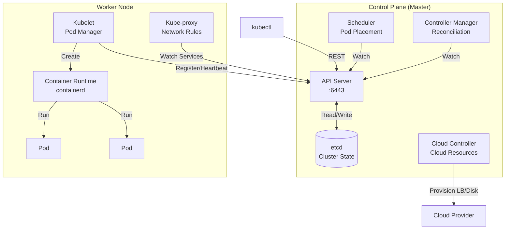

# Kubernetes Interview Questions (70+ Detailed Q&A)

## 1. Architecture & Components

<AccordionGroup>
<Accordion title="1. K8s Architecture Diagram">
**Answer**:
*   **Control Plane (Master)**:
    *   **API Server**: Gateway. Only component talking to etcd.
    *   **Etcd**: Key-Value store. Source of truth.
    *   **Scheduler**: Assigns Pods to Nodes.
    *   **Controller Manager**: Reconciles state (ReplicaSet, Node).
    *   **Cloud Controller**: Talks to AWS/GCP (LBs, Disk).
*   **Worker Node**:
    *   **Kubelet**: Agent talking to API Server. Manages Pods.
    *   **Kube-proxy**: Network rules (IPTables).
    *   **Runtime**: Docker/Containerd.


```mermaid
graph TD
    subgraph Control_Plane["Control Plane (Master)"]
        API[API Server<br/>:6443]
        ETCD[(etcd<br/>Cluster State)]
        Scheduler[Scheduler<br/>Pod Placement]
        CM[Controller Manager<br/>Reconciliation]
        CCM[Cloud Controller<br/>Cloud Resources]
    end
    
    subgraph Worker_Node["Worker Node"]
        Kubelet[Kubelet<br/>Pod Manager]
        KubeProxy[Kube-proxy<br/>Network Rules]
        Runtime[Container Runtime<br/>containerd]
        Pod1[Pod]
        Pod2[Pod]
    end
    
    User[kubectl] -->|REST| API
    API <-->|Read/Write| ETCD
    Scheduler -->|Watch| API
    CM -->|Watch| API
    Kubelet -->|Register/Heartbeat| API
    Kubelet -->|Create| Runtime
    Runtime -->|Run| Pod1
    Runtime -->|Run| Pod2
    KubeProxy -->|Watch Services| API
    CCM -->|Provision LB/Disk| Cloud[Cloud Provider]
```

**Request Flow (Creating a Deployment)**:
1. `kubectl apply -f deployment.yaml` \u2192 API Server
2. API Server validates, writes to etcd
3. Deployment Controller sees new Deployment \u2192 creates ReplicaSet
4. ReplicaSet Controller sees new RS \u2192 creates Pod specs
5. Scheduler sees unscheduled Pods \u2192 assigns to Nodes
6. Kubelet on Node sees new Pod assignment \u2192 pulls image, starts container
7. Kube-proxy updates iptables rules for Service

**Component Failure Scenarios**:
- **API Server down**: Cluster unmanageable (but existing Pods keep running)
- **etcd down**: Cluster state lost (catastrophic)
- **Scheduler down**: New Pods stay Pending
- **Kubelet down**: Node marked NotReady, Pods evicted after timeout

<Note>
**Senior vs Staff perspective**
- **Senior**: Can diagram all components, explain request flow, debug component-level failures, and operate production clusters.
- **Staff**: Designs multi-cluster topologies (hub-spoke, fleet management), decides when to use managed vs self-managed control planes, builds platform abstractions that hide cluster complexity from app teams, and defines SLOs for the control plane itself (e.g., "API Server p99 latency &lt;500ms").
</Note>

**Follow-up chain:**
1. "If the API Server is running but etcd is partitioned, what can you still do with `kubectl`?" -- You can read cached/stale data if the API Server's watch cache is populated, but all writes fail. `kubectl get` may work intermittently; `kubectl create/apply` will timeout.
2. "How would you design a Kubernetes control plane for 99.99% availability?" -- Multi-zone etcd with 5 nodes across 3 AZs, 3+ API Server replicas behind a load balancer, separate etcd for Events, dedicated control plane nodes with taints, and automated etcd backup/restore pipelines.
3. "What is the blast radius if the controller manager crashes but everything else is healthy?" -- Existing Pods keep running, Services keep routing, but no new reconciliation happens. ReplicaSets won't create replacement Pods, Deployments won't progress rollouts, and garbage collection stops. The cluster drifts from desired state silently until the controller manager recovers.

<Tip>
**Structured Answer Template**
1. Start with the two-plane model: Control Plane (brain) vs Worker Node (muscle).
2. Name the 5 control plane components and their single responsibilities (API Server, etcd, Scheduler, Controller Manager, Cloud Controller).
3. Name the 3 worker node components (Kubelet, Kube-proxy, Runtime).
4. Walk one end-to-end request flow (kubectl apply -> etcd -> scheduler -> kubelet).
5. Close with failure modes per component -- interviewers love "what breaks if X dies".
</Tip>

**Real-World Example:** Shopify runs multiple hundred-node clusters where the API Server and etcd are split onto dedicated control-plane nodes with `node-role.kubernetes.io/control-plane:NoSchedule` taints, and etcd lives on NVMe-backed instances separate from the API Server nodes. When they hit scaling issues, they sharded Events into a separate etcd cluster -- a classic staff-level move that shows up in their engineering blog posts on Kubernetes at scale.

<Note>
**Big Word Alert -- etcd quorum:** A majority of etcd nodes that must agree before a write is committed. Say "we need quorum" when explaining why 3-node clusters tolerate 1 failure but 2 failures make writes impossible.
</Note>

<Note>
**Big Word Alert -- Reconciliation loop:** The continuous compare-and-correct cycle that every Kubernetes controller runs. Use it as the mental model for "how does Kubernetes self-heal" -- controllers don't react to events, they constantly reconcile desired vs actual state.
</Note>

**Follow-up Q&A Chain:**

**Q:** Why does the API Server talk to etcd directly while everything else watches the API Server?
**A:** To enforce a single write path and apply auth + admission control uniformly. If Kubelet wrote to etcd directly, you'd need to enforce RBAC, validation, and mutation at every client -- which is unmaintainable. Funneling through the API Server gives you one choke point for security and audit.

**Q:** How does the scheduler know which nodes exist and their current load?
**A:** It watches Node and Pod objects via the API Server's watch stream and maintains an in-memory cache. It never queries nodes directly. This is why a scheduler-level decision can be stale by a few hundred milliseconds -- it's working from cached state.

**Q:** What's the difference between kube-apiserver and kube-controller-manager from a scaling standpoint?
**A:** API Server is stateless and scales horizontally (run 3-5 replicas behind an LB). Controller Manager uses leader election -- only one replica is active at a time, the others are hot standbys. Scaling the control plane is really about scaling etcd and the API Server; the controller manager is an HA concern, not a throughput one.

<Info>
**Further Reading**
- kubernetes.io/docs -- "Kubernetes Components" (official component overview)
- learnk8s.io -- "The architecture of Kubernetes" (deep visual walkthroughs)
- Google SRE Book -- chapter on Borg (the system Kubernetes is modeled on)
</Info>
</Accordion>


<Accordion title="2. Role of Etcd">
**What interviewers are really testing:** Do you understand why etcd is the single most critical component in Kubernetes, how Raft consensus works at a high level, and what operational practices keep it alive in production?

**Answer**:
etcd is a distributed, strongly-consistent key-value store that serves as the **single source of truth** for the entire Kubernetes cluster.

*   **What it stores**: Every Kubernetes object -- Pods, Services, Secrets, ConfigMaps, RBAC rules, lease objects for leader election -- is serialized as protobuf and stored in etcd under a key like `/registry/pods/default/my-pod`.
*   **Consistency model**: Uses the **Raft consensus algorithm**. One node is elected leader; all writes go through the leader and are replicated to a majority (quorum) before being acknowledged. This guarantees linearizable reads (if configured with `--serializable=false`).
*   **Cluster sizing**: Always run an **odd number** of nodes -- 3 (tolerates 1 failure) or 5 (tolerates 2 failures). Running 4 nodes gives no advantage over 3 because quorum for 4 is still 3.
*   **Performance characteristics**: etcd is sensitive to disk latency. Production recommendation is SSD-backed storage with &lt;10ms fsync latency. On GKE/EKS, the managed control plane handles this, but on self-managed clusters (kubeadm), slow disks are the number-one etcd killer.
*   **Backup strategy**: `etcdctl snapshot save /backup/etcd-$(date +%Y%m%d).db` run as a CronJob every 1-4 hours. Without this, losing etcd quorum means rebuilding the cluster from scratch.

**Production war story**: A team ran etcd on nodes with spinning disks in a 200-node cluster. During peak load, etcd fsync latency spiked to 200ms, leader elections started flipping every few seconds, and the entire cluster became unresponsive -- kubectl commands timed out, new deployments froze. The fix was migrating etcd to dedicated nodes with NVMe SSDs and setting `--heartbeat-interval=250` and `--election-timeout=2500`.

**Red flag answer:** "etcd is just a database for Kubernetes." This misses the consensus model, the quorum requirement, the operational criticality, and the performance sensitivity that make etcd unique.

**Follow-up:**
1. **"What happens if 2 out of 3 etcd nodes go down simultaneously?"** -- The cluster loses quorum. etcd becomes read-only (no writes can be committed). The API Server can still serve cached/stale reads but cannot accept any create/update/delete operations. You must restore from snapshot or bring at least one node back to regain quorum.
2. **"How would you migrate etcd from 3 nodes to 5 nodes without downtime?"** -- Add one node at a time using `etcdctl member add`. Each new node joins as a learner, syncs data, then promotes to full voter. Never add 2 nodes simultaneously because it changes the quorum size mid-operation and can cause split-brain.
3. **"Why not just use PostgreSQL or MySQL instead of etcd?"** -- Kubernetes needs a distributed consensus store with watch semantics (clients subscribe to changes on keys). etcd provides this natively via gRPC watch streams. Traditional RDBMS would need polling, which does not scale to thousands of controllers watching thousands of resources in real-time.

<Tip>
**Structured Answer Template**
1. Define: distributed KV store, Raft consensus, source of truth for the cluster.
2. Storage model: every K8s object as a key under `/registry/...`, protobuf-serialized.
3. Consistency: Raft -> leader -> quorum write -> linearizable reads.
4. Sizing: odd number of nodes (3 or 5), quorum math.
5. Operational pain points: disk latency sensitivity, backup strategy, defrag cadence.
6. Close with a war story about what happens when etcd gets slow.
</Tip>

**Real-World Example:** GitHub's engineering blog has documented their Kubernetes cluster etcd incident where the WAL fsync latency spiked due to a noisy-neighbor VM, causing API Server timeouts for about 90 minutes. The fix was migrating etcd to dedicated NVMe-backed instances and setting tighter heartbeat/election timeouts -- a classic case of "etcd is only as fast as its slowest disk."

<Note>
**Big Word Alert -- Raft consensus:** The algorithm etcd uses so that a majority of nodes agree on every write before it's acknowledged. Say "Raft requires a leader + quorum" when explaining why you need an odd node count.
</Note>

<Note>
**Big Word Alert -- fsync latency:** How long the OS takes to flush a write to physical disk. Bring this up when someone asks "why is etcd slow?" -- it's almost always fsync, which is why SSDs matter so much.
</Note>

**Follow-up Q&A Chain:**

**Q:** Why protobuf and not JSON for etcd storage?
**A:** Size and parse speed. A Pod object in JSON is ~5x larger than in protobuf, and API Server does millions of parses per second. Protobuf also gives backward-compatible schema evolution, which matters when upgrading clusters.

**Q:** What's the compaction problem in etcd and how does Kubernetes handle it?
**A:** etcd keeps every revision of every key for watch history. Without compaction, the DB grows unbounded. Kubernetes runs auto-compaction every 5 minutes by default (via `--etcd-compaction-interval` on the API Server). You still need periodic `defrag` to reclaim disk -- compaction marks space reclaimable, defrag actually frees it.

**Q:** How big can a single etcd object be, and why does that matter?
**A:** Hard limit is 1.5MB per value. If a ConfigMap or CRD instance grows beyond that, writes fail with "etcdserver: request is too large". This is why you don't stuff large blobs (model weights, binaries) into ConfigMaps -- use object storage with a pointer stored in etcd.

<Info>
**Further Reading**
- etcd.io documentation -- "Tuning etcd" guide for production hardware
- kubernetes.io/docs -- "Operating etcd clusters for Kubernetes"
- CNCF blog -- "etcd performance tuning at scale" by the CoreOS/Red Hat team
</Info>
</Accordion>

<Accordion title="3. Kube-proxy modes">
**What interviewers are really testing:** Do you understand how Service networking actually works at the kernel level, and can you reason about when default settings break at scale?

**Answer**:
Kube-proxy runs on every node and programs the kernel to route traffic from a Service's virtual IP (ClusterIP) to the actual Pod endpoints. It operates in one of three modes:

*   **iptables mode** (default since K8s 1.2): Creates iptables rules in the KUBE-SERVICES and KUBE-SVC-* chains. For each Service, there is a chain of rules that DNAT (destination NAT) traffic to one of the backend Pod IPs using probabilistic matching. For example, a Service with 3 Pods gets rules with 33%/50%/100% probability splits. **Pros**: Fast (kernel-space, no userspace hop), simple. **Cons**: O(n) rule evaluation -- with 5,000 Services, iptables has ~25,000+ rules, and rule updates cause full-table rewrites that can take seconds, causing packet drops during updates.
*   **IPVS mode** (stable since K8s 1.11): Uses Linux IPVS (IP Virtual Server) kernel module. Hash-table based lookups give **O(1) performance** regardless of Service count. Supports multiple load-balancing algorithms: round-robin, least-connections, source-hash, shortest-expected-delay. **When to switch**: When you have &gt;1,000 Services or notice kube-proxy taking &gt;5 seconds to sync iptables rules. Enable with `--proxy-mode=ipvs` on kube-proxy.
*   **Userspace mode** (legacy, pre-1.2): Traffic goes to kube-proxy process in userspace, then back to kernel. Round-trip through userspace adds 1-3ms latency per packet. No one runs this in production anymore.

**Real-world metric**: At a cluster with 3,000 Services, switching from iptables to IPVS reduced kube-proxy sync time from 12 seconds to under 200ms and eliminated the intermittent connection timeouts users were seeing during Service endpoint updates.

**Red flag answer:** "Kube-proxy is a proxy that forwards traffic." This misses that kube-proxy does not actually proxy traffic in iptables/IPVS mode -- it programs kernel rules and gets out of the data path entirely.

**Follow-up:**
1. **"If kube-proxy crashes on a node, do existing connections break?"** -- No. The iptables/IPVS rules are already programmed in the kernel. Existing connections continue to work. However, no new rule updates will happen, so new Services or endpoint changes will not be reflected on that node until kube-proxy restarts.
2. **"How does kube-proxy know which Pods back a Service?"** -- It watches EndpointSlice objects (or legacy Endpoints) from the API Server. When a Pod becomes Ready (passes readiness probe), the Endpoints controller adds it to the EndpointSlice, and kube-proxy picks up the change via its watch stream.
3. **"What is nftables mode and why does it matter?"** -- Starting in K8s 1.29 (alpha) and graduating in 1.31, nftables mode is the successor to iptables mode. It uses the newer Linux nftables subsystem which has atomic rule updates (no full-table rewrite), better performance than iptables at scale, and a cleaner rule structure. It is expected to eventually replace iptables mode as the default.

<Tip>
**Structured Answer Template**
1. State the purpose: kube-proxy implements Service virtual IP -> Pod IP translation per node.
2. Name the three modes: iptables (default), IPVS (for scale), userspace (legacy).
3. Explain the performance model: iptables is O(n), IPVS is O(1) via hash tables.
4. Describe the "when to switch" signal: &gt;1000 Services, or sync times &gt;5s.
5. Close with: kube-proxy programs rules then gets out of the data path -- it's not actually proxying.
</Tip>

**Real-World Example:** Lyft's platform team documented switching from iptables to IPVS when their ride-hailing microservices grew past 3000 Services per cluster. Kube-proxy sync time dropped from ~12 seconds to under 200ms, and they eliminated the intermittent connection resets users saw during Service endpoint updates.

<Note>
**Big Word Alert -- DNAT (Destination NAT):** Rewriting the destination IP of a packet. Use it when explaining "a client sends traffic to the ClusterIP, iptables DNATs it to a specific Pod IP". This is the core mechanism of Service load balancing.
</Note>

<Note>
**Big Word Alert -- conntrack:** The kernel's connection tracking table that remembers in-flight NAT translations. When someone asks "why did my connection break when the Pod was replaced?" the answer usually involves conntrack holding a stale mapping.
</Note>

**Follow-up Q&A Chain:**

**Q:** If kube-proxy is not in the data path, what is?
**A:** The Linux kernel's netfilter stack (iptables or IPVS rules). Kube-proxy's job is to keep those rules synced with the current EndpointSlices. Once rules are programmed, packets flow through the kernel without any userspace hop.

**Q:** Can you run without kube-proxy entirely?
**A:** Yes, if your CNI handles Service routing. Cilium can replace kube-proxy using eBPF -- it programs packet forwarding directly in the kernel's socket layer, giving you O(1) Service routing and removing iptables rules altogether. You set `kubeProxyReplacement=true` in Cilium's config and remove the kube-proxy DaemonSet.

**Q:** Why is IPVS better at scale but not the default?
**A:** IPVS needs the `ip_vs` kernel modules loaded on every node, which some minimal distros don't ship by default. Also, not all CNI plugins played nicely with IPVS historically, and some kernel bugs in older versions caused issues. iptables "just works" everywhere, so it remained the default for compatibility.

<Info>
**Further Reading**
- kubernetes.io/docs -- "Kubernetes Services" and "Virtual IPs and Service proxies"
- learnk8s.io -- "Comparing kube-proxy modes: iptables or IPVS?"
- Cilium blog -- "Kube-proxy replacement with eBPF"
</Info>
</Accordion>

<Accordion title="4. API Server Role">
**What interviewers are really testing:** Can you walk through the full request pipeline inside the API Server? Do you understand the difference between authentication, authorization, and admission control -- and why the ordering matters?

**Answer**:
The API Server (kube-apiserver) is the **only** component that reads from and writes to etcd. Every interaction in the cluster -- kubectl, kubelet, controllers, external CI/CD -- goes through it. Here is the full request pipeline:

1.  **Authentication** (Who are you?): Supports multiple methods simultaneously -- x509 client certificates, bearer tokens, OIDC (Google/Azure AD), webhook token review. If all authenticators reject, you get a 401. In production, most teams use OIDC for human users and ServiceAccount tokens for Pods.
2.  **Authorization** (Are you allowed?): Default is RBAC (Role-Based Access Control). The API Server checks if the authenticated identity has a RoleBinding/ClusterRoleBinding granting the requested verb (`get`, `list`, `create`, `delete`) on the requested resource. Also supports ABAC (legacy), Webhook, and Node authorization.
3.  **Admission Control** (Should we allow/modify this?): Two phases run sequentially:
    *   **Mutating admission** (runs first): Can modify the request. Examples: Istio sidecar injector adds an Envoy container, `LimitRanger` sets default resource requests, `ServiceAccount` admission controller mounts SA tokens.
    *   **Validating admission** (runs second): Can only accept or reject. Examples: OPA Gatekeeper blocks images from untrusted registries, `PodSecurity` admission enforces Pod Security Standards.
4.  **Persistence**: Object is serialized (protobuf) and written to etcd.
5.  **Response**: API Server returns the created/updated object to the client, and all watchers (controllers, kubelet) are notified via their watch streams.

**Scaling**: The API Server is **stateless** -- all state is in etcd. You can run 3-5 replicas behind a load balancer (GKE does this by default). The bottleneck is usually etcd, not the API Server itself.

**Key detail most people miss**: The API Server also serves as the **aggregation layer** for extension API servers (like metrics-server, custom CRDs with aggregated API servers). When you run `kubectl top pods`, the request goes to the API Server, which proxies it to the metrics-server.

**Red flag answer:** "The API Server stores data and serves it to kubectl." This misses the entire authentication/authorization/admission pipeline, which is the core of Kubernetes security.

**Follow-up:**
1. **"If a mutating webhook is down, what happens to all Pod create requests?"** -- By default, if a webhook has `failurePolicy: Fail` (the default), all requests matching its rules will be rejected with a 500 error. This is why webhook availability is critical -- a broken sidecar injector can bring all deployments to a halt. Use `failurePolicy: Ignore` for non-critical webhooks and set `timeoutSeconds` to something low like 5s.
2. **"Why do mutating webhooks run before validating webhooks?"** -- Because validating webhooks need to see the final form of the object. If validation ran first, it might approve an object that a mutating webhook then changes into something invalid.
3. **"How would you debug slow API Server responses?"** -- Check API Server audit logs for slow requests, look at etcd latency metrics (`etcd_request_duration_seconds`), check if admission webhooks are slow (webhook latency is additive), and verify watch cache is healthy with `apiserver_cache_list_total` metrics. The `--audit-policy-file` flag lets you log every request for forensic analysis.

<Tip>
**Structured Answer Template**
1. Position it: API Server is the only thing that talks to etcd; everything else goes through it.
2. Walk the request pipeline in order: Auth -> AuthZ -> Admission (Mutating then Validating) -> Persist -> Notify watchers.
3. For each stage, name the mechanism (OIDC/RBAC/webhook) and an example of what runs there.
4. Mention stateless scaling: run 3+ replicas behind an LB, bottleneck is etcd.
5. Close with "aggregation layer" (how CRDs + metrics-server extend it).
</Tip>

**Real-World Example:** Airbnb's platform team wrote about a production incident where a misconfigured mutating admission webhook (Istio sidecar injector) with `failurePolicy: Fail` went unreachable during a control-plane rollout. Every Pod create request failed for about 20 minutes until they flipped the failurePolicy and restored the webhook. It's a canonical "webhook availability = cluster availability" lesson.

<Note>
**Big Word Alert -- Admission webhook:** An external HTTP endpoint the API Server calls to validate or mutate objects before persistence. Use the term when explaining "policy as code" -- OPA Gatekeeper and Kyverno are both admission webhooks.
</Note>

<Note>
**Big Word Alert -- Aggregation layer:** The mechanism by which the API Server forwards requests for specific API groups to extension servers (like metrics-server). Say "it's aggregated" when someone asks how `kubectl top pods` works under the hood.
</Note>

**Follow-up Q&A Chain:**

**Q:** What's the difference between a CRD and an aggregated API server?
**A:** CRD: you define a schema, API Server stores instances in etcd for you, no code needed. Aggregated API server: you run a separate HTTP server that implements the Kubernetes API, and the main API Server proxies requests to it. Aggregation is for cases where you need custom storage or complex validation logic that CRD admission can't handle (e.g., metrics-server serving live data, not stored objects).

**Q:** Why does the API Server have a "watch cache"?
**A:** To avoid hitting etcd on every client watch. When many controllers watch the same resource type (e.g., Pods), they'd otherwise each open an etcd watch. The watch cache maintains one etcd watch per resource type and fans out to all clients, reducing etcd load by 10-100x.

**Q:** What's the practical limit for total admission webhook latency?
**A:** Rule of thumb: all admission webhooks combined should be &lt;1 second. Webhook latency is additive -- if you have 5 webhooks at 200ms each, every Pod create takes 1+ second. Set `timeoutSeconds: 5` max, and `failurePolicy: Ignore` for anything non-critical.

<Info>
**Further Reading**
- kubernetes.io/docs -- "The Kubernetes API" and "Extending the Kubernetes API"
- learnk8s.io -- "API Server request flow" series
- CNCF blog -- "Securing the Kubernetes API Server"
</Info>
</Accordion>

<Accordion title="5. Scheduler Logic">
**What interviewers are really testing:** Do you understand the two-phase scheduling algorithm, can you name specific filter/score plugins, and do you know how to influence scheduling decisions for real workloads?

**Answer**:
The scheduler watches for Pods with an empty `spec.nodeName` and assigns them to nodes using a plugin-based, two-phase algorithm:

1.  **Filtering (Predicates)** -- Eliminates nodes that cannot run the Pod:
    *   `NodeResourcesFit`: Does the node have enough allocatable CPU/memory for the Pod's requests?
    *   `NodeAffinity`: Does the node match `requiredDuringSchedulingIgnoredDuringExecution` rules?
    *   `TaintToleration`: Does the Pod tolerate the node's taints?
    *   `PodTopologySpread`: Would placing this Pod violate `maxSkew` constraints?
    *   `VolumeBinding`: Can the required PersistentVolumes be bound on this node/zone?
    If zero nodes pass filtering, the Pod stays `Pending`.
2.  **Scoring (Priorities)** -- Ranks the remaining nodes 0-100:
    *   `LeastAllocated`: Prefer nodes with more free resources (spreads load).
    *   `MostAllocated`: Prefer fuller nodes (bin-packing for cost savings -- useful in autoscaled clusters).
    *   `ImageLocality`: Prefer nodes that already have the container image cached (saves pull time).
    *   `InterPodAffinity`: Score based on `preferredDuringScheduling` affinity/anti-affinity rules.
    *   `NodeResourcesBalancedAllocation`: Prefer nodes where CPU and memory utilization are balanced.
3.  **Binding** -- The highest-scoring node wins. Scheduler writes `spec.nodeName` to the Pod object via the API Server, and the Kubelet on that node picks it up.

**Scheduler Profiles** (since v1.18): You can run multiple scheduling profiles in a single scheduler, each with different plugin configurations. For example, one profile for general workloads (LeastAllocated) and another for batch jobs (MostAllocated/bin-packing).

**Performance**: The scheduler processes ~100 Pods/second by default. For large clusters, it uses `percentageOfNodesToScore` (default 50% for clusters &gt;100 nodes) to avoid scoring every single node -- it stops scoring once it has found enough feasible nodes.

**Red flag answer:** "The scheduler just picks the node with the most resources." This misses the entire plugin framework, the filter/score distinction, and the many factors beyond raw resources.

**Follow-up:**
1. **"A Pod is Pending and events show 'insufficient CPU'. But `kubectl top nodes` shows plenty of CPU free. What is going on?"** -- `kubectl top` shows **actual usage**, but the scheduler looks at **requests** (allocated capacity), not usage. The node might have 8 CPU cores, only 2 cores actually in use, but 7.5 cores worth of resource requests already allocated. The remaining 0.5 cores of allocatable CPU is not enough for the new Pod's request. This is the #1 scheduling confusion in production.
2. **"How would you force a critical Pod to schedule even when the cluster is full?"** -- Use PriorityClasses with preemption. Create a `PriorityClass` with a high value and `preemptionPolicy: PreemptLowerPriority`. The scheduler will evict lower-priority Pods to make room. But be careful -- preemption can cascade and kill important workloads if priority values are not well-planned.
3. **"Can you bypass the scheduler entirely?"** -- Yes, set `spec.nodeName` directly in the Pod manifest. The Pod goes straight to the Kubelet without scheduler involvement. This is how static Pods work and can be used for emergency debugging, but it bypasses all filter checks, so you might overcommit a node.

<Tip>
**Structured Answer Template**
1. Frame it: scheduler is a two-phase pluggable pipeline (filter then score).
2. Name 3-5 filter plugins and what they check.
3. Name 3-5 score plugins and how they rank.
4. Mention scheduler profiles (multiple configs in one process).
5. Close with the gotcha: scheduler works on `requests`, not actual usage.
</Tip>

**Real-World Example:** Spotify's engineering team has written about using the `MostAllocated` score plugin in their autoscaled clusters to bin-pack Pods onto fewer nodes, letting cluster-autoscaler remove underutilized nodes and cut spend by ~20% on their non-latency-sensitive batch tiers. They use a separate scheduler profile with `LeastAllocated` for latency-critical services.

<Note>
**Big Word Alert -- Scheduling predicates:** The old name for filter plugins -- hard rules that eliminate nodes. Use it in conversation if the interviewer uses it first (older docs still do).
</Note>

<Note>
**Big Word Alert -- Preemption:** The scheduler killing lower-priority Pods to make room for higher-priority ones. Say "preemption" when explaining how PriorityClass works during resource pressure.
</Note>

**Follow-up Q&A Chain:**

**Q:** Why does the scheduler use `percentageOfNodesToScore`?
**A:** In clusters with thousands of nodes, scoring every feasible node is wasteful -- the marginal improvement from picking the "best" vs a "good enough" node is tiny. Defaulting to 50% (for &gt;100 nodes) cuts scheduling latency significantly with negligible quality loss.

**Q:** Can you write a custom scheduler plugin?
**A:** Yes, via the Scheduler Framework. You write Go code implementing interfaces like `FilterPlugin` or `ScorePlugin`, register it in a scheduler profile, and run your scheduler alongside the default. Common use cases: gang scheduling for MPI/ML jobs, topology-aware placement for NUMA.

**Q:** What happens if two schedulers try to schedule the same Pod?
**A:** Pods have a `schedulerName` field. Only the scheduler whose name matches will process it. You run multiple schedulers by giving them distinct `schedulerName` values and having Pods opt into one via spec. The default value is `default-scheduler`.

<Info>
**Further Reading**
- kubernetes.io/docs -- "Kubernetes Scheduler" and "Scheduling Framework"
- learnk8s.io -- "A visual guide to Kubernetes scheduling"
- Google Research -- "Large-scale cluster management at Google with Borg"
</Info>
</Accordion>

<Accordion title="6. Controller Pattern">
**What interviewers are really testing:** Do you understand the declarative reconciliation model that underpins all of Kubernetes? Can you explain level-triggered vs edge-triggered, and why idempotency matters?

**Answer**:
The controller pattern is the **core design principle** of Kubernetes. Every controller runs an infinite reconciliation loop:

1.  **Watch**: Subscribe to API Server events for specific resource types (via informers/watch streams).
2.  **Compare**: Read the current state of the world and compare it to the desired state declared in the resource spec.
3.  **Reconcile**: Take the minimum action needed to make current state match desired state.

**Key design properties**:
*   **Level-triggered, not edge-triggered**: Controllers do not react to "what happened" (edge) -- they react to "what is the current delta between desired and actual" (level). If a controller crashes and misses 10 events, when it restarts it simply compares current vs desired and fixes any drift. This is what makes Kubernetes self-healing.
*   **Idempotent**: Running a reconciliation twice with no state change in between should produce no side effects. Controllers use `create-if-not-exists` and `update-if-changed` patterns.
*   **Optimistic concurrency**: etcd uses resource versions. If two controllers try to update the same object, one gets a conflict error and retries with the latest version.

**Built-in controllers** (inside kube-controller-manager): ReplicaSet, Deployment (manages rollouts via ReplicaSets), StatefulSet, DaemonSet, Job, CronJob, Node (marks unhealthy nodes), EndpointSlice, Namespace (cleanup on deletion), ServiceAccount (creates default SA per namespace), and ~20 more.

**Example walkthrough**: ReplicaSet controller sees `spec.replicas: 3` but only 2 matching Pods exist. It creates 1 new Pod object (with `nodeName` empty). It does not care **why** there are only 2 -- maybe one crashed, maybe someone deleted one manually, maybe the cluster just scaled up. The controller only cares about the delta.

**Red flag answer:** "Controllers are like cron jobs that check things periodically." Controllers use watch streams (real-time push notifications), not polling. The informer framework maintains a local cache and delivers events with minimal latency.

**Follow-up:**
1. **"What is the difference between a controller and an operator?"** -- An operator IS a controller, but specifically one that encodes domain-specific operational knowledge for a complex stateful application. All operators are controllers; not all controllers are operators. For example, the ReplicaSet controller is a generic controller. The Prometheus Operator is a controller that knows how to deploy, configure, and upgrade Prometheus instances, handle shard rebalancing, etc.
2. **"What happens if the controller manager crashes for 10 minutes and 5 Pods die during that time?"** -- When the controller manager restarts, it re-lists all resources from the API Server, rebuilds its local cache, and reconciles. It sees 5 fewer Pods than desired and creates 5 new ones. No events were "lost" because the system is level-triggered -- it does not need to replay the history of what happened.
3. **"How do you avoid thundering herd problems when many controllers reconcile simultaneously after a restart?"** -- Controllers use work queues with rate limiting, exponential backoff, and jitter. The `client-go` `workqueue` package provides `RateLimitingQueue` that prevents a controller from hammering the API Server with thousands of reconcile calls at once.

<Tip>
**Structured Answer Template**
1. Name it: the reconciliation loop -- the universal pattern behind every K8s controller.
2. Walk the loop: Watch -> Compare (desired vs actual) -> Act (minimum change).
3. Emphasize level-triggered: you don't care what happened, only the current delta.
4. Mention idempotency and optimistic concurrency (resource versions).
5. Close with an example: ReplicaSet controller and "the controller doesn't care why".
</Tip>

**Real-World Example:** The Prometheus Operator is a canonical production operator: it watches `Prometheus` and `ServiceMonitor` CRDs and reconciles them into StatefulSets, ConfigMaps, and Services. CoreOS (now part of Red Hat) open-sourced it after running it internally, and its reconciliation loop has survived kernel upgrades, cluster reboots, and deliberate chaos-testing without losing Prometheus scrape state.

<Note>
**Big Word Alert -- Level-triggered:** Responding to current state, not to events. Say "Kubernetes is level-triggered" when explaining why missing an event doesn't break the system -- the next reconcile picks up the delta.
</Note>

<Note>
**Big Word Alert -- Informer:** The client-go abstraction that wraps a watch stream with a local cache + event handlers. Use it when explaining how controllers stay efficient -- they read from the cache, not the API directly.
</Note>

**Follow-up Q&A Chain:**

**Q:** What's the difference between "reconcile" and "control loop"?
**A:** They're often used interchangeably, but strictly: the control loop is the infinite `for` loop, and reconcile is the single pass that handles one object. Each reconcile is idempotent and independent -- you should be able to call it twice in a row with no ill effect.

**Q:** How do you handle deletion in a controller?
**A:** Finalizers. You add a finalizer string to the object's `metadata.finalizers`; the API Server won't fully delete until the finalizer is removed. Your controller detects `DeletionTimestamp`, does cleanup (e.g., release external resources), then removes its finalizer. This is how cloud controllers deprovision load balancers before the Service object disappears.

**Q:** Why doesn't Kubernetes just use message queues for controller events?
**A:** Messages can be lost, duplicated, or delayed. Level-triggered reconciliation is immune to all three -- the next reconcile reads current state directly, so nothing is "missed." This is a conscious design choice borrowed from Google's Borg and is arguably the most important architectural decision in Kubernetes.

<Info>
**Further Reading**
- kubernetes.io/docs -- "Controllers" and "Operator pattern"
- learnk8s.io -- "Writing Kubernetes controllers"
- Kubebuilder Book -- canonical guide to building controllers in Go
</Info>
</Accordion>

<Accordion title="7. CRI, CNI, CSI">
**What interviewers are really testing:** Do you understand Kubernetes' plugin architecture and why these interfaces exist? Can you explain the practical impact of swapping implementations?

**Answer**:
Kubernetes uses three standardized plugin interfaces to decouple core orchestration from infrastructure implementation. This is what makes K8s portable across clouds, runtimes, and storage backends.

*   **CRI (Container Runtime Interface)**: Defines how the kubelet talks to the container runtime. Before CRI, Kubernetes had Docker hardcoded into the kubelet (the infamous "dockershim"). CRI abstracts this behind a gRPC API so you can swap runtimes without changing Kubernetes itself.
    *   **containerd**: The production standard since K8s 1.24 removed dockershim. Lightweight, OCI-compliant, used by GKE/EKS/AKS by default.
    *   **CRI-O**: Red Hat's alternative, purpose-built for Kubernetes. Used in OpenShift. Slightly smaller footprint than containerd.
    *   **gVisor (runsc)**: Google's sandboxed runtime. Runs containers with a user-space kernel for strong isolation. 5-15% performance overhead but prevents container escapes. Used for multi-tenant clusters.
    *   **Kata Containers**: Runs each container inside a lightweight VM. Strongest isolation (hardware-level) but highest overhead (~50-100ms startup penalty).
*   **CNI (Container Network Interface)**: Defines how Pods get their network interfaces and IP addresses. The kubelet calls the CNI plugin binary when a Pod starts/stops.
    *   **Flannel**: VXLAN overlay. Simple, no NetworkPolicy support. Good for dev clusters.
    *   **Calico**: L3 BGP routing or VXLAN. Full NetworkPolicy support, high performance, used in most production clusters.
    *   **Cilium**: eBPF-based. Replaces kube-proxy, provides L7 NetworkPolicies, built-in observability (Hubble). The current momentum leader for production clusters.
    *   **AWS VPC CNI**: Assigns real VPC IPs to Pods. No overlay overhead but limited by ENI IP quotas per instance type.
*   **CSI (Container Storage Interface)**: Defines how Kubernetes provisions, attaches, and mounts storage volumes. Replaced the old "in-tree" volume plugins that were compiled into Kubernetes itself.
    *   **EBS CSI Driver**: For AWS EBS volumes. Supports snapshots, encryption, io2 provisioned IOPS.
    *   **GCE PD CSI Driver**: For Google Persistent Disks. Supports regional PDs for HA.
    *   **Longhorn/Rook-Ceph**: Open-source distributed storage for bare-metal clusters.

**Why this matters**: When someone says "we're migrating from Docker to containerd," they are changing the CRI implementation. The Pods, images, and YAML do not change. When someone says "we're switching from Flannel to Cilium," they are changing the CNI -- existing Pod IPs will change (requires rolling restart), but the application code is untouched. This plug-and-play architecture is what lets teams run the same Kubernetes workloads on AWS, GCP, on-prem, and edge devices.

**Red flag answer:** "CRI is Docker, CNI is the network, CSI is storage." This shows zero understanding of why these interfaces exist or that they are pluggable abstractions, not specific implementations.

**Follow-up:**
1. **"Kubernetes 1.24 removed dockershim. What actually changed for teams still using Docker images?"** -- Nothing for images. OCI images are a standard -- containerd runs the same images Docker built. What changed is the runtime: the kubelet no longer talks to the Docker daemon. Teams that relied on Docker-specific features (like `docker exec` on the node, or building images inside Pods using the Docker socket) had to adapt. The images themselves are 100% compatible.
2. **"Why would you choose Cilium over Calico for a new production cluster?"** -- Cilium uses eBPF programs loaded into the kernel, which means it can do packet filtering without iptables, provides L7 policy enforcement (e.g., allow HTTP GET but block POST), and gives you Hubble for network observability without additional tooling. Calico is more mature and battle-tested. The tradeoff is complexity: Cilium requires a newer kernel (&gt;= 4.19, ideally &gt;= 5.10) and has a steeper learning curve.
3. **"If a CSI driver crashes on a node, what happens to Pods using volumes from that driver?"** -- Existing mounted volumes continue to work (they are already mounted in the kernel). But new Pods that need volume attach/mount will fail, and volume expansion or snapshot operations will hang. The kubelet retries CSI calls with exponential backoff until the driver recovers.

<Tip>
**Structured Answer Template**
1. Frame the purpose: standardized plugin interfaces that keep Kubernetes portable.
2. Name each: CRI (runtime), CNI (network), CSI (storage).
3. For each, give 2-3 popular implementations and their tradeoffs.
4. Close with why it matters: you can swap implementations without changing K8s or your app manifests.
</Tip>

**Real-World Example:** Shopify migrated a production cluster from Flannel to Cilium to get eBPF-powered network policies and Hubble observability. Because CNI is a standardized interface, zero application manifests had to change -- the migration was a DaemonSet swap + rolling restart of Pods to pick up new IPs from the new IPAM.

<Note>
**Big Word Alert -- Overlay network:** A virtual network layered on top of physical networks, typically via VXLAN encapsulation. Use it when someone asks "how do Pods on different nodes talk" -- "it's an overlay" is the one-liner answer for Flannel/Weave.
</Note>

<Note>
**Big Word Alert -- eBPF:** Kernel-level programmable packet processing without modifying kernel source. Drop "eBPF" when discussing Cilium -- it's the feature that separates modern CNIs from the iptables generation.
</Note>

**Follow-up Q&A Chain:**

**Q:** Why was CRI introduced after Kubernetes was already popular?
**A:** Originally, Kubernetes had Docker hardcoded into kubelet via "dockershim." When alternative runtimes (rkt, containerd) emerged, maintaining Docker-specific code inside Kubernetes became unmaintainable. CRI extracted the runtime interface so the kubelet could speak to any OCI-compliant runtime via gRPC.

**Q:** What's the difference between an "in-tree" and "CSI" storage driver?
**A:** In-tree drivers (like the legacy AWS EBS volume type) were compiled into the Kubernetes binary itself -- every release shipped every driver. CSI moves drivers out of Kubernetes core into separate DaemonSets/Deployments. This decouples driver release cycles from Kubernetes and lets cloud vendors ship storage features without waiting for a K8s release.

**Q:** Can you use multiple CNIs in the same cluster?
**A:** Yes, via "chained" plugins (e.g., Multus CNI) that attach multiple network interfaces per Pod. Use cases: SR-IOV for high-performance workloads, or a secondary network for management traffic. It's operationally complex; most clusters use a single CNI.

<Info>
**Further Reading**
- kubernetes.io/docs -- "Container Runtime Interface (CRI)", "Network Plugins", "Volume Plugins and CSI"
- CNCF blog -- "A Kubernetes user's guide to CNI plugins"
- Cilium docs -- "Cilium vs Calico vs Flannel comparison"
</Info>
</Accordion>

<Accordion title="8. Pause Container">
**What interviewers are really testing:** Do you understand the Linux namespace model that underpins Pod networking? This is a "do you actually know what a Pod is at the OS level" question.

**Answer**:
The pause container (also called the "infrastructure container" or "sandbox container") is the first container started in every Pod and the last to be terminated. It serves as the **namespace anchor** for the Pod.

*   **What it does**: The pause container creates and holds the Linux network namespace (and optionally IPC and PID namespaces) that all other containers in the Pod share. Its process is literally the `pause` syscall -- it does nothing except exist and hold the namespace open.
*   **Why it exists**: Linux namespaces are tied to processes. If your app container is the only process and it crashes, the network namespace is destroyed, the Pod IP is released, and every other container in the Pod loses networking. The pause container prevents this -- since it never crashes (it is a ~700KB statically-linked binary that calls `pause()`), the namespace survives app container restarts.
*   **Pod networking model**: When the CNI plugin assigns an IP to a Pod, it actually assigns it to the pause container's network namespace. All app containers in the Pod see the same `eth0` interface, the same IP, and can communicate via `localhost`. This is why two containers in the same Pod cannot bind to the same port -- they share the network stack.
*   **Image**: `registry.k8s.io/pause:3.9` (or similar version). It is cached on every node. The image is ~700KB and never needs updating in practice.
*   **What `kubectl describe pod` shows**: You will not see the pause container listed under `Containers:` in describe output. It is hidden from the Kubernetes API. But if you SSH to the node and run `crictl ps`, you will see it alongside the app containers.

**Red flag answer:** "The pause container is used to pause the application" or "I've never heard of the pause container." The first shows a fundamental misunderstanding, the second suggests the candidate has never looked beneath the Kubernetes API surface.

**Follow-up:**
1. **"If you run two containers in a Pod, can they see each other's processes?"** -- Only if the Pod spec sets `shareProcessNamespace: true`. By default, containers share the network and IPC namespaces (via the pause container) but have separate PID namespaces. With shared PID namespace, `ps aux` in one container shows processes from all containers, and you can send signals across containers -- useful for sidecar debugging but a security consideration.
2. **"What happens during a Pod restart -- does the pause container get recreated?"** -- No. When an app container crashes, only that container is restarted (the kubelet calls the CRI to create a new container in the existing sandbox). The pause container and its network namespace persist. A full Pod restart (e.g., from a liveness probe failure with `restartPolicy: Always`) also reuses the sandbox unless the Pod is deleted and recreated.
3. **"How does this relate to the Pod sandbox concept in CRI?"** -- In the CRI specification, the pause container IS the "PodSandbox." When the kubelet calls `RunPodSandbox()`, the runtime creates the pause container and sets up namespaces. All subsequent `CreateContainer()` calls join that sandbox's namespaces. Different runtimes implement the sandbox differently -- containerd uses the pause image, Kata Containers creates a lightweight VM as the sandbox.

<Tip>
**Structured Answer Template**
1. Start with what it is: the "infrastructure container" that anchors the Pod's namespaces.
2. Explain why: Linux namespaces die with their last process -- the pause container never exits.
3. Describe what shares it: all app containers in the Pod share the network namespace via pause.
4. Note it's hidden from `kubectl describe pod` (visible only via `crictl ps` on the node).
5. Close with the CRI connection: pause container == PodSandbox.
</Tip>

**Real-World Example:** When GKE published metrics showing Pod startup latency, the pause container contributed &lt;50ms to startup because its image (700KB) is pre-pulled on every node and containerd reuses the namespace bundle. Teams optimizing for cold-start latency (like Knative services) pay close attention to this -- the pause container is one of the few things you can't shrink further.

<Note>
**Big Word Alert -- Network namespace:** A Linux kernel feature that gives a process group its own isolated network stack (interfaces, routes, iptables). Use it when explaining "how do two containers in one Pod share an IP?" -- they share a network namespace held open by pause.
</Note>

<Note>
**Big Word Alert -- PodSandbox:** The CRI term for the Pod-level isolation boundary. When a runtime engineer talks about "sandbox creation" they mean the pause container step.
</Note>

**Follow-up Q&A Chain:**

**Q:** Why not just have the CNI create the namespace directly?
**A:** Namespaces need a process to "own" them -- an unowned namespace is garbage collected. You need a process that does nothing but exist, which is exactly what pause does: `pause()` syscall in a loop.

**Q:** What happens on `kubectl exec` -- does it enter the pause container?
**A:** No. `kubectl exec` enters the target app container's namespaces via `nsenter`-like calls. The pause container is effectively invisible from the outside; you can only see it via the container runtime CLI on the node.

**Q:** Is the pause image the same across all runtimes?
**A:** No. Each runtime ships its own or can be configured. containerd uses `registry.k8s.io/pause`, CRI-O has its own, and Kata Containers replaces the concept entirely with a lightweight VM. The interface (PodSandbox) is standardized; the implementation varies.

<Info>
**Further Reading**
- kubernetes.io/docs -- "Pod Lifecycle" and "Container Runtime Interface"
- Ian Lewis blog -- "Almighty Pause Container" (canonical article on the topic)
- containerd docs -- "Pod sandbox implementation details"
</Info>
</Accordion>

<Accordion title="9. Pod Lifecycle">
**What interviewers are really testing:** Can you trace the full journey of a Pod from creation to termination, including what happens at each phase and what can go wrong? This separates operators who debug daily from candidates who only read tutorials.

**Answer**:
A Pod moves through distinct phases, and understanding each one is critical for debugging:

1.  **Pending**: The Pod object exists in etcd but is not yet running on a node. Sub-states:
    *   *Waiting for scheduling*: The scheduler has not yet found a suitable node. Check `kubectl describe pod` for events like `FailedScheduling`.
    *   *Waiting for image pull*: The kubelet is pulling the container image. For large images (2-5GB ML models), this can take minutes.
    *   *Waiting for volume mount*: A PVC is not yet bound, or a CSI driver is provisioning a disk.
2.  **ContainerCreating**: The kubelet has the Pod assigned and is setting up the sandbox (pause container), running init containers, and creating app containers. Network and volumes are being attached.
3.  **Running**: At least one container is running. This does NOT mean the app is healthy -- a container can be Running but failing readiness probes.
4.  **Succeeded**: All containers exited with code 0. Typical for Jobs and one-shot Pods. The Pod stays in this state for inspection until garbage collected.
5.  **Failed**: All containers have terminated and at least one exited with a non-zero code.
6.  **Unknown**: The kubelet on the node stopped reporting status. Usually means the node is unreachable.

**Critical sub-states most people miss:**

*   **CrashLoopBackOff**: The container starts, crashes, kubelet restarts it (per `restartPolicy`), it crashes again. Kubelet applies exponential backoff: 10s, 20s, 40s, ... up to 5 minutes between restarts. The container itself is not running during backoff -- it is waiting. Debug with `kubectl logs <pod> --previous` to see the last crash's logs.
*   **ImagePullBackOff**: Image pull failed (wrong tag, auth failure, network issue). Kubelet backs off before retrying. Check `kubectl describe pod` for the exact pull error.
*   **OOMKilled**: Container exceeded its memory limit. The kernel's OOM killer terminates the process. You see this in `kubectl describe pod` under `Last State: Terminated, Reason: OOMKilled`. Fix: increase memory limits or fix the memory leak.
*   **Evicted**: The node is under resource pressure (disk, memory, PID). Kubelet evicts BestEffort Pods first, then Burstable, then Guaranteed. `kubectl get pods --field-selector=status.phase=Failed` to find evicted Pods.

**Pod Termination Sequence** (equally important and often asked):
1.  Pod is set to `Terminating` state. Endpoints controllers remove it from Service endpoints.
2.  `preStop` hook runs (if defined). Example: `sleep 5` to allow in-flight requests to drain.
3.  SIGTERM is sent to PID 1 in each container.
4.  Kubelet waits up to `terminationGracePeriodSeconds` (default 30s) for graceful shutdown.
5.  SIGKILL is sent if the process has not exited.
6.  Pod is deleted from the API.

**Red flag answer:** "Pods go from Pending to Running to Completed." Missing the failure states, sub-states, and termination sequence shows the candidate has never debugged a production Pod issue.

**Follow-up:**
1. **"A Pod is in CrashLoopBackOff but `kubectl logs` shows no output. How do you debug?"** -- The container might be crashing before the application writes any logs (e.g., missing shared library, bad entrypoint, segfault). Use `kubectl logs <pod> --previous` to see the last run. If still empty, check `kubectl describe pod` for container exit codes. Exit code 137 = OOMKilled (SIGKILL). Exit code 139 = segfault. Use `kubectl debug -it <pod> --image=busybox --target=<container>` to attach an ephemeral debug container sharing the PID namespace.
2. **"Why is the termination sequence order important for zero-downtime deployments?"** -- There is a race condition: the Pod receives SIGTERM at the same time endpoints are being removed from Services. If the endpoint removal propagates slowly (kube-proxy or ingress controller has stale rules), traffic can still be routed to a terminating Pod. The `preStop: sleep 5` hack gives time for endpoint removal to propagate before the app starts shutting down. Without it, you get 502 errors during rolling updates.
3. **"What is the difference between `restartPolicy: Always`, `OnFailure`, and `Never`? When would you use each?"** -- `Always` (default for Deployments): container is always restarted, even on exit code 0. Used for long-running services. `OnFailure`: restart only on non-zero exit. Used for Jobs where you want retry on failure but not on success. `Never`: never restart. Used for one-shot debugging Pods or when the Job controller handles retries at the Pod level via `backoffLimit`.

<Tip>
**Structured Answer Template**
1. List the phases: Pending -> ContainerCreating -> Running -> Succeeded/Failed.
2. Call out the sub-states that dominate real debugging: CrashLoopBackOff, ImagePullBackOff, OOMKilled, Evicted.
3. Walk termination sequence: Terminating -> preStop -> SIGTERM -> graceperiod -> SIGKILL.
4. Finish with the insight: readiness probe status decides traffic routing, not phase.
</Tip>

**Real-World Example:** Lyft's SRE team standardized a `preStop: sleep 5` pattern across all HTTP services after a postmortem showed they were 502-ing ~0.3% of requests during rolling deploys. The 5-second sleep gives kube-proxy and load balancers enough time to remove the Pod from rotation before the app starts shutting down -- a cheap fix that dropped deploy-related errors to near-zero.

<Note>
**Big Word Alert -- OOMKilled:** Process killed by the kernel's Out-Of-Memory killer for exceeding its memory limit. Exit code 137 = SIGKILL. Say "OOMKilled" when you see exit code 137 and memory in the limits.
</Note>

<Note>
**Big Word Alert -- Eviction:** Kubelet proactively terminating a Pod due to node-level resource pressure (memory, disk, PIDs). Distinct from OOMKill -- eviction is orderly and obeys QoS; OOMKill is the kernel kicking in when eviction was too slow.
</Note>

<Note>
**Big Word Alert -- terminationGracePeriodSeconds:** The max wait time between SIGTERM and SIGKILL. Use it when explaining why shutdowns take exactly 30 seconds (default) -- it's the app failing to exit before the timeout.
</Note>

**Follow-up Q&A Chain:**

**Q:** What's the difference between a CrashLoopBackOff and a container that just keeps crashing?
**A:** CrashLoopBackOff is the kubelet's backoff state -- during this window, the container isn't running, it's waiting. Backoff starts at 10s and doubles up to 5 minutes. Without it, a fast-crashing container would spam restarts and crush the node.

**Q:** How can a Pod be Running but not Ready?
**A:** Readiness is a separate signal from container lifecycle. The container can be up but the readiness probe is failing -- maybe it's still loading a large model, warming cache, or waiting for an external dependency. Services and Ingresses route based on readiness, not running status.

**Q:** What triggers the `preStop` hook -- is it guaranteed to run?
**A:** It runs when the kubelet starts terminating the Pod. It's best-effort: if the node crashes, preStop doesn't run. It also shares the graceperiod budget with SIGTERM -- if preStop takes 30s and graceperiod is 30s, SIGTERM never gets a chance before SIGKILL.

<Info>
**Further Reading**
- kubernetes.io/docs -- "Pod Lifecycle" (comprehensive reference)
- learnk8s.io -- "Graceful shutdown and zero downtime deployments in Kubernetes"
- Lyft engineering blog -- "Graceful shutdown in Kubernetes deployments"
</Info>
</Accordion>

<Accordion title="10. Static Pods">
**What interviewers are really testing:** Do you understand the bootstrap problem in Kubernetes -- how do control plane components run as Pods before the control plane exists? This question tests understanding of the kubelet's standalone capabilities.

**Answer**:
Static Pods are managed directly by the kubelet on a specific node, without any involvement from the API Server or scheduler.

*   **How they work**: The kubelet watches a directory on the local filesystem (default: `/etc/kubernetes/manifests/`) for YAML Pod manifests. When it finds one, it creates the Pod directly using the container runtime. No scheduler, no API Server, no controllers involved.
*   **Mirror Pods**: The kubelet creates a "mirror Pod" object in the API Server so that `kubectl get pods` can see the static Pod. But this is read-only -- you cannot delete a static Pod via `kubectl delete`. You must remove the manifest file from the node's filesystem.
*   **The bootstrap problem this solves**: In `kubeadm`-provisioned clusters, the API Server, etcd, scheduler, and controller manager all run as static Pods. But if they are Pods, who schedules them? Nobody -- the kubelet runs them directly from manifest files. This is how Kubernetes bootstraps itself: kubelet starts static Pods for the control plane, which then bootstraps the rest of the cluster.
*   **What you find in `/etc/kubernetes/manifests/`** on a kubeadm master node: `kube-apiserver.yaml`, `kube-controller-manager.yaml`, `kube-scheduler.yaml`, `etcd.yaml`.
*   **Use cases beyond bootstrapping**: Running critical node-level agents that must survive API Server outages (monitoring agents, security agents). DaemonSets are preferred in most cases, but static Pods have no dependency on the control plane.

**Managed Kubernetes note**: On GKE, EKS, and AKS, you never see static Pods because the control plane is managed by the cloud provider and hidden from you. This question is most relevant for self-managed clusters (kubeadm, k3s, bare-metal).

**Red flag answer:** "Static Pods are Pods that don't move between nodes." That describes Pods in general once scheduled. The defining characteristic of static Pods is kubelet-local management without API Server involvement.

**Follow-up:**
1. **"If you edit a static Pod manifest file on disk, what happens?"** -- The kubelet detects the file change (it polls the directory, typically every 20 seconds) and recreates the Pod with the new spec. This is how you upgrade control plane components in kubeadm: you modify the manifest files, and the kubelet handles the restart. `kubeadm upgrade apply` does exactly this behind the scenes.
2. **"Can you use a static Pod with a PersistentVolumeClaim?"** -- No, because PVC binding requires the API Server and the PV controller. Static Pods can use `hostPath` or `emptyDir` volumes but not PVCs. This is why etcd's static Pod manifest uses `hostPath` to mount the etcd data directory directly from the node's filesystem.
3. **"What happens to the static Pods on a node if the API Server goes down permanently?"** -- The static Pods keep running. The kubelet does not need the API Server to manage static Pods -- it works purely from the local manifest files. The mirror Pods in the API become stale, but the actual containers continue running. This is the key resilience property of static Pods.

<Tip>
**Structured Answer Template**
1. Define: Pods managed by the kubelet locally, not through the API Server.
2. Explain the mechanism: kubelet watches `/etc/kubernetes/manifests/`, creates Pods directly via CRI.
3. Mention mirror Pods: a read-only API representation for visibility.
4. State the killer use case: bootstrapping the control plane itself (kubeadm pattern).
5. Close with the resilience property: static Pods survive API Server outages.
</Tip>

**Real-World Example:** Every kubeadm-provisioned control plane node in production -- including the self-managed clusters at GitHub, Shopify, and many on-prem banks -- runs `kube-apiserver`, `etcd`, `kube-scheduler`, and `kube-controller-manager` as static Pods from `/etc/kubernetes/manifests/`. When GitHub documented their Kubernetes upgrade process, they described `kubeadm upgrade apply` as essentially "edit the static manifest files and let the kubelet do the rest."

<Note>
**Big Word Alert -- Mirror Pod:** The read-only API Server representation of a static Pod. You can `kubectl get` it but you cannot edit or delete it via the API -- the source of truth is the manifest file on disk.
</Note>

<Note>
**Big Word Alert -- Bootstrap problem:** The chicken-and-egg situation where the control plane itself needs to run as Pods, but you need a control plane to schedule Pods. Static Pods break the cycle by giving the kubelet scheduling autonomy.
</Note>

**Follow-up Q&A Chain:**

**Q:** Can the scheduler ever schedule anything onto a node before its kubelet is running?
**A:** No. The scheduler only writes `spec.nodeName` -- the kubelet is what actually creates containers. This is why kubelet is the one component that must run first on every node, and why it can operate in "static Pod only" mode without any control plane.

**Q:** If I delete a mirror Pod with `kubectl delete pod`, what happens?
**A:** The API object is briefly deleted, but within ~20 seconds the kubelet recreates the mirror Pod because the manifest file still exists on disk. The underlying container never restarts -- only the API view flaps.

**Q:** Why do managed Kubernetes services (GKE, EKS) hide static Pods from customers?
**A:** The control plane runs on nodes the cloud provider manages -- customers don't SSH into them, so there's no `/etc/kubernetes/manifests/` to see. The static Pod pattern still exists underneath, it's just abstracted away behind the managed control plane SLA.

<Info>
**Further Reading**
- kubernetes.io/docs -- "Static Pods" (official reference)
- kubernetes.io/docs -- "Creating a cluster with kubeadm" (shows static Pods in action)
- learnk8s.io -- "Kubernetes control plane deep dive"
</Info>
</Accordion>
</AccordionGroup>

## 2. Workloads & Scheduling

<AccordionGroup>
<Accordion title="11. Deployment vs StatefulSet vs DaemonSet">
**What interviewers are really testing:** Can you pick the right workload controller for a given scenario and articulate *why*? This is fundamentally a design judgment question.

**Answer**:
These three controllers cover 95% of workload patterns. The key is understanding what guarantees each provides:

*   **Deployment** (stateless workloads):
    *   Pods get random names like `api-7d4b8f6c9-x2k5q`. Identity does not matter.
    *   Scaling up/down creates/destroys Pods in any order. All Pods are interchangeable.
    *   Rolling updates create a new ReplicaSet, scale it up, and scale the old one down. Rollback is instant -- just switch back to the old ReplicaSet.
    *   Pods share no persistent storage by default. If you attach a PVC, all replicas fight over the same volume (usually wrong).
    *   **Use for**: Web servers, APIs, microservices, stateless workers, anything where you can lose a Pod and another one picks up the work.

*   **StatefulSet** (stateful workloads):
    *   Pods get stable, predictable names: `mysql-0`, `mysql-1`, `mysql-2`. This identity is preserved across restarts and rescheduling.
    *   Pods are created in order (0, 1, 2) and terminated in reverse order (2, 1, 0). This matters for databases that need a primary to start before replicas.
    *   Each Pod gets its own PersistentVolumeClaim via `volumeClaimTemplates`. `mysql-0` always gets `data-mysql-0`, even after rescheduling. This is the killer feature.
    *   Requires a Headless Service (`clusterIP: None`) for stable DNS names: `mysql-0.mysql.default.svc.cluster.local`.
    *   **Use for**: Databases (PostgreSQL, MySQL, MongoDB), distributed systems (Kafka, Elasticsearch, ZooKeeper), anything that needs stable identity or dedicated storage.

*   **DaemonSet** (per-node workloads):
    *   Runs exactly one Pod on every node (or a subset of nodes via `nodeSelector`/tolerations).
    *   When a new node joins the cluster, the DaemonSet controller automatically schedules a Pod on it. When a node is removed, the Pod is garbage collected.
    *   Updates can be `RollingUpdate` (default) or `OnDelete` (manual per-node control).
    *   **Use for**: Log collectors (Fluentd/Fluent Bit), node monitoring (Prometheus Node Exporter, Datadog agent), CNI plugins (Calico, Cilium), storage drivers (CSI node plugins), security agents.

**Decision framework**: Ask yourself: "If I replace this Pod with a brand-new one, does anything break?" If yes -- StatefulSet. "Does this need to run on every node?" If yes -- DaemonSet. Otherwise -- Deployment.

**Red flag answer:** "StatefulSet is for databases and Deployment is for everything else." This misses that many databases now run fine on Deployments with external storage (e.g., a single PostgreSQL instance with a PVC and Deployment works for many use cases). The real differentiator is whether you need stable identity and ordered operations, not just "is it a database."

**Follow-up:**
1. **"Can you run a database on a Deployment instead of a StatefulSet? When would that be appropriate?"** -- Yes, for single-instance databases where you do not need stable network identity or multiple replicas with dedicated volumes. A single PostgreSQL with a Deployment + PVC (ReadWriteOnce) works fine. StatefulSet becomes necessary when you need a multi-replica cluster (e.g., PostgreSQL with streaming replication) where each replica needs its own volume and stable DNS name for peer discovery.
2. **"What happens if a DaemonSet Pod is evicted due to node pressure? Does it come back?"** -- Yes. The DaemonSet controller sees that the node exists but has no matching Pod, so it recreates one. However, if the node is under memory pressure, the new Pod may also be evicted immediately, creating a restart loop. This is why DaemonSet Pods should use `Guaranteed` QoS (requests == limits) and have high PriorityClass values to survive eviction.
3. **"You need to deploy a log collector that runs on every node including master nodes. What tolerations do you need?"** -- Master/control-plane nodes have taints `node-role.kubernetes.io/control-plane:NoSchedule`. The DaemonSet Pod spec needs a toleration for that taint. Also tolerate `node.kubernetes.io/not-ready:NoExecute` and `node.kubernetes.io/unreachable:NoExecute` so the agent stays running even on degraded nodes.

<Tip>
**Structured Answer Template**
1. Frame the three with one sentence each: Deployment (stateless, replaceable), StatefulSet (stable identity + storage), DaemonSet (one-per-node).
2. For each, name the two features that differentiate it: random vs ordered names, shared vs dedicated PVCs, replica count vs node count.
3. Give a canonical workload example for each.
4. Close with the decision framework: replaceability test -> identity test -> per-node test.
</Tip>

**Real-World Example:** Spotify's platform runs stateless backend services as Deployments, its Cassandra clusters as StatefulSets (each node gets a stable DNS name and its own PVC for SSTables), and Fluent Bit log forwarders plus their eBPF security agent as DaemonSets on every node. Their engineering blog has described using StatefulSet's ordered rollout to safely upgrade Cassandra one replica at a time, relying on the stable identity to preserve token ring positions.

<Note>
**Big Word Alert -- volumeClaimTemplates:** The StatefulSet feature that auto-creates a dedicated PVC per Pod (e.g., `data-mysql-0`, `data-mysql-1`). Say "volumeClaimTemplates" instead of "each Pod gets its own disk" -- it shows you know the exact API.
</Note>

<Note>
**Big Word Alert -- Headless Service:** A Service with `clusterIP: None` that returns individual Pod IPs via DNS rather than a load-balanced VIP. Required for StatefulSet peer discovery (e.g., `mysql-0.mysql.default.svc`).
</Note>

**Follow-up Q&A Chain:**

**Q:** Why does StatefulSet scale Pods sequentially but Deployment in parallel?
**A:** Stateful systems often have ordering requirements -- a primary must be up before replicas can bootstrap from it, a Kafka broker 0 must exist before broker 1 can join the quorum. Sequential creation makes these safe by default. Deployment assumes fungibility so it parallelizes for speed.

**Q:** Can you have a DaemonSet that only runs on some nodes?
**A:** Yes. Use `nodeSelector` (e.g., `gpu=true`) or `nodeAffinity` to target a subset. Classic example: NVIDIA's device plugin DaemonSet only schedules on nodes labeled with GPU presence, not on general-purpose nodes.

**Q:** What happens to StatefulSet PVCs when you scale down from 3 replicas to 1?
**A:** The PVCs for `pod-1` and `pod-2` are NOT deleted by default -- Kubernetes preserves them in case you scale back up. This is deliberate data-safety behavior. To clean them up automatically, set `persistentVolumeClaimRetentionPolicy: { whenScaled: Delete }` (v1.27+).

<Info>
**Further Reading**
- kubernetes.io/docs -- "Workloads" section (Deployment, StatefulSet, DaemonSet)
- learnk8s.io -- "Running databases on Kubernetes: when and when not"
- Kubernetes blog -- "StatefulSet Basics" tutorial with MySQL example
</Info>
</Accordion>

<Accordion title="12. Jobs vs CronJobs">
**What interviewers are really testing:** Do you understand batch workload semantics in Kubernetes, including parallelism, failure handling, and the operational gotchas of CronJobs that bite teams in production?

**Answer**:

*   **Job**: Creates one or more Pods and ensures they run to successful completion.
    *   `completions: 5` -- the Job needs 5 successful Pod completions to finish.
    *   `parallelism: 3` -- run up to 3 Pods concurrently. Useful for batch processing (process 1000 items with 10 parallel workers).
    *   `backoffLimit: 4` -- after 4 failed Pods, the Job is marked as Failed. Backoff is exponential: 10s, 20s, 40s, etc.
    *   `activeDeadlineSeconds: 600` -- hard timeout. If the Job has not completed in 10 minutes, all Pods are terminated. Critical for preventing runaway batch jobs.
    *   `ttlSecondsAfterFinished: 3600` -- auto-delete the Job (and its Pods) 1 hour after completion. Without this, completed Job Pods accumulate and clutter `kubectl get pods`.
    *   **Indexed Jobs** (since K8s 1.21): Each Pod gets an index (`JOB_COMPLETION_INDEX` env var). Useful for partitioned workloads: "Pod 0 processes items 0-99, Pod 1 processes 100-199."

*   **CronJob**: Creates Job objects on a cron schedule.
    *   `schedule: "0 2 * * *"` -- runs daily at 2 AM (UTC by default, configurable with `timeZone` since K8s 1.27).
    *   `concurrencyPolicy`:
        *   `Allow` (default): Multiple Jobs can run simultaneously. **Dangerous** if runs overlap.
        *   `Forbid`: Skip the new run if the previous one is still running.
        *   `Replace`: Kill the running Job and start a new one.
    *   `startingDeadlineSeconds: 200` -- if the CronJob misses its scheduled time by more than 200 seconds (e.g., because the controller was down), skip it. Without this, a CronJob controller restart can trigger a burst of missed runs.
    *   `successfulJobsHistoryLimit` / `failedJobsHistoryLimit` -- how many completed/failed Jobs to keep for inspection. Defaults are 3/1.

**Production gotchas:**
*   CronJobs that take longer than their interval will pile up if `concurrencyPolicy` is `Allow`. A nightly backup that takes 2 hours running on a 1-hour schedule creates 24 concurrent Jobs. Set `Forbid` for idempotent jobs.
*   CronJobs do NOT alert you on failure by default. A silently failing nightly backup can go unnoticed for weeks. Always add monitoring: check for `kube_job_status_failed` in Prometheus or set up alerts on missing `kube_job_status_succeeded` within expected windows.
*   Time zones: Before K8s 1.27, CronJob schedules were always UTC. Teams running `0 2 * * *` thinking it was 2 AM local time got a rude surprise.

**Red flag answer:** "CronJobs are like cron on Linux." While the scheduling is similar, this misses the Kubernetes-specific semantics: concurrency policies, missed schedule handling, history limits, and the fact that CronJobs create Job objects (not Pods directly).

**Follow-up:**
1. **"A CronJob that runs every 5 minutes has been silently failing for a week. How would you have caught this?"** -- Set up a Prometheus alert on `kube_job_status_failed > 0` for jobs in the namespace. Alternatively, use a dead man's switch pattern: the CronJob pushes a heartbeat to a monitoring service (like Healthchecks.io or Prometheus Pushgateway) on success, and if the heartbeat is missed for 15 minutes, alert fires.
2. **"How do you handle a Job that processes a queue of 10,000 items where each item takes 1-60 seconds?"** -- Use an Indexed Job with `completions: 10000` and `parallelism: 50`. Or better, use a work-queue pattern: `completions: null` with `parallelism: 50`, where each Pod pulls items from a shared queue (Redis, SQS) and exits when the queue is empty. The second pattern is more efficient because fast items do not leave workers idle.
3. **"What happens if the CronJob controller is down for 3 hours and a CronJob was supposed to run every hour?"** -- When the controller restarts, it checks how many runs were missed. If fewer than 100 runs were missed, it schedules them. If more than 100, it logs an error and does not schedule any (to avoid a thundering herd). The `startingDeadlineSeconds` field controls whether individual missed runs are skipped.

<Tip>
**Structured Answer Template**
1. Job = run-to-completion. CronJob = Job creator on a schedule.
2. Call out the five knobs that matter: `completions`, `parallelism`, `backoffLimit`, `activeDeadlineSeconds`, `ttlSecondsAfterFinished`.
3. For CronJob, emphasize `concurrencyPolicy` (Allow/Forbid/Replace) -- this is the #1 production bug.
4. Name the three production gotchas: overlapping runs, silent failures, timezone surprises.
5. Close with observability: CronJobs need alerting because Kubernetes won't page you when a cron silently fails.
</Tip>

**Real-World Example:** Airbnb's engineering blog described a CronJob incident where their nightly search index rebuild started taking 3 hours instead of 40 minutes. Because `concurrencyPolicy` was the default `Allow`, each hour a new Job piled on top of the previous one -- by mid-morning 10 Jobs were running simultaneously, each fighting for the same Elasticsearch cluster. The fix: `concurrencyPolicy: Forbid` plus a Prometheus alert on `kube_job_status_active > 1`.

<Note>
**Big Word Alert -- Indexed Job:** A Job where each Pod gets a unique integer index via `JOB_COMPLETION_INDEX` env var (Kubernetes 1.21+). Use it for "Pod 0 processes shard 0" patterns. Say "indexed Job" when asked about partitioned batch work.
</Note>

<Note>
**Big Word Alert -- Work-queue pattern:** A Job with `parallelism: N` and no fixed `completions` where each Pod pulls work from a shared queue (Redis/SQS) and exits when the queue is empty. More efficient than indexed Jobs when item durations are uneven.
</Note>

**Follow-up Q&A Chain:**

**Q:** Why is `ttlSecondsAfterFinished` so important?
**A:** Without it, completed Jobs and their Pods stick around forever. A CronJob running every 5 minutes generates 288 Pod objects per day, each consuming etcd space. After a few weeks of production traffic, `kubectl get pods` becomes unusable. Setting `ttlSecondsAfterFinished: 3600` auto-cleans Pods an hour after completion.

**Q:** What's the right way to make a Job idempotent?
**A:** The Job controller may create replacement Pods if the first one fails, so your workload must handle "this step may run twice." Use an external lock (Redis SETNX), a checkpoint file in object storage, or a database transaction with a deterministic idempotency key. Never assume a Job runs exactly once.

**Q:** When should you use a CronJob vs an external scheduler (Airflow, Argo Workflows)?
**A:** CronJobs are fine for single-step, independent tasks (nightly backup, cache warmup). For multi-step DAGs, dependencies between tasks, human approval gates, or retry-with-context, use Argo Workflows or Airflow. CronJobs give you cron semantics; workflow engines give you orchestration.

<Info>
**Further Reading**
- kubernetes.io/docs -- "Jobs" and "CronJob" (official reference with all fields)
- learnk8s.io -- "Kubernetes Jobs and CronJobs in production"
- Kubernetes blog -- "Indexed Job for Parallel Processing" announcement post
</Info>
</Accordion>

<Accordion title="13. Taints & Tolerations">
**What interviewers are really testing:** Can you explain the push-pull model between nodes repelling Pods and Pods opting in? Do you know all three taint effects and their real-world implications?

**Answer**:
Taints and tolerations work together as a **node-side repulsion mechanism**. A taint on a node says "stay away unless you explicitly tolerate me." A toleration on a Pod says "I can handle that taint."

*   **Three taint effects**:
    *   `NoSchedule`: Hard rule -- new Pods without a matching toleration will never be scheduled here. Existing Pods are unaffected.
    *   `PreferNoSchedule`: Soft rule -- scheduler tries to avoid this node but will place Pods here if no other option exists.
    *   `NoExecute`: Hard rule that also evicts existing Pods that do not tolerate the taint. The `tolerationSeconds` field controls how long existing Pods can stay before eviction (e.g., `tolerationSeconds: 300` gives 5 minutes to drain).

*   **Common production taints**:
    *   `node-role.kubernetes.io/control-plane:NoSchedule` -- keeps workloads off master nodes.
    *   `nvidia.com/gpu=present:NoSchedule` -- reserves GPU nodes for ML workloads only.
    *   `cloud.google.com/gke-spot=true:NoSchedule` -- marks spot/preemptible nodes so only cost-tolerant workloads land there.
    *   `node.kubernetes.io/not-ready:NoExecute` -- automatically added by the node controller when a node becomes unhealthy.

*   **Key distinction from affinity**: Taints/tolerations are node-centric (node repels, Pod opts in). Affinity is Pod-centric (Pod attracts itself to a node). Use them together: taint GPU nodes so only GPU workloads land there, AND add nodeAffinity on GPU Pods to target GPU nodes. Without both, non-GPU Pods are repelled but GPU Pods might still land on non-GPU nodes.

**What weak candidates say:** "Taints are like labels for scheduling." -- Fundamentally wrong. Labels + selectors attract; taints repel. The mental model is inverted.

**What strong candidates say:** "The way I think about it is: nodeAffinity is the Pod saying 'I want to go there,' and taints are the node saying 'you can't come here unless you opt in.' You typically need both to fully isolate a workload to specific nodes."

**Follow-up chain:**
1. "A node gets tainted with `NoExecute` at runtime. What happens to all running Pods on that node?" -- Every Pod that does not tolerate the taint is evicted. Pods with a matching toleration and `tolerationSeconds` are evicted after that timeout. Pods with a matching toleration and no `tolerationSeconds` stay indefinitely. This is how Kubernetes handles node problems -- the node controller automatically adds `NoExecute` taints for conditions like `NotReady` and `Unreachable`.
2. "How would you set up a cluster with dedicated node pools for three teams that cannot schedule onto each other's nodes?" -- Taint each pool (`team=alpha:NoSchedule`, `team=beta:NoSchedule`, `team=gamma:NoSchedule`). Each team's Deployments must include the matching toleration. Also add nodeAffinity to prevent Pods from landing on the wrong pool even if someone accidentally removes a taint.
3. "Can a taint have an empty value? What does `key:NoSchedule` (no value) mean?" -- Yes. A toleration can match it with `operator: Exists` which matches any value (or no value) for that key. This is commonly used for broad tolerations like "tolerate all taints with key `node.kubernetes.io/not-ready`."

<Tip>
**Structured Answer Template**
1. Frame the mental model: taints = nodes repel, tolerations = Pods opt in.
2. List the three effects: `NoSchedule`, `PreferNoSchedule`, `NoExecute` (with what's different about NoExecute).
3. Contrast with nodeAffinity: one is node-centric push, the other is Pod-centric pull -- you often need both together.
4. Give a production example: GPU nodes or spot instances, with the combined pattern.
5. Close with automatic taints: `node.kubernetes.io/not-ready` is how Kubernetes itself reacts to node problems.
</Tip>

**Real-World Example:** Lyft uses taints to isolate spot/preemptible nodes from critical workloads. Spot nodes carry `cloud.google.com/gke-spot=true:NoSchedule`, and only stateless batch services carry the matching toleration. When a spot node is reclaimed, the NoExecute taint evicts its Pods gracefully with `tolerationSeconds: 30` -- giving their batch workers a drain window before SIGKILL.

<Note>
**Big Word Alert -- Taint:** A key-value-effect tuple attached to a node (e.g., `gpu=nvidia:NoSchedule`) that repels Pods without a matching toleration. Say "taint" and "effect" together when explaining -- the effect is what actually determines behavior.
</Note>

<Note>
**Big Word Alert -- tolerationSeconds:** How long a Pod with a matching toleration is allowed to stay on a node after a `NoExecute` taint is added. Omit it and the Pod stays forever; set it to 30s and the Pod is evicted after 30 seconds. This is how Kubernetes implements "evict-after-5-minutes-of-NotReady" behavior.
</Note>

**Follow-up Q&A Chain:**

**Q:** Can you taint and tolerate on the same key but different values?
**A:** Yes -- the toleration matches by `key` + `operator` + `value` + `effect`. With `operator: Equal` (default), the value must match exactly. With `operator: Exists`, any value for that key matches, which is useful for broad "tolerate any variant of this problem" patterns.

**Q:** Why are `NoExecute` taints added automatically on node problems?
**A:** The node controller adds `node.kubernetes.io/not-ready:NoExecute` or `node.kubernetes.io/unreachable:NoExecute` when a node stops reporting. This is what actually triggers Pod eviction after the 5-minute (default) `tolerationSeconds` window -- that window is a default toleration auto-injected into every Pod.

**Q:** Taints prevent new scheduling but don't evict existing Pods -- true or false?
**A:** Only true for `NoSchedule` and `PreferNoSchedule`. `NoExecute` is the one that also evicts existing non-tolerating Pods. This is often the source of "I tainted a node and all my Pods disappeared" surprises.

<Info>
**Further Reading**
- kubernetes.io/docs -- "Taints and Tolerations" (official reference with all operators)
- learnk8s.io -- "Dedicated node pools with taints and tolerations"
- Google Cloud docs -- "Using taints and tolerations with GKE" (real spot/preemptible example)
</Info>
</Accordion>

<Accordion title="14. Node Affinity vs Selector">
**What interviewers are really testing:** Do you understand the evolution from simple selectors to expressive affinity rules, and can you articulate when soft vs hard constraints matter in production?

**Answer**:
Both `nodeSelector` and `nodeAffinity` control which nodes a Pod can land on, but they differ in power and flexibility:

*   **nodeSelector** (legacy, simple):
    *   Simple key-value equality matching: `nodeSelector: { disk: ssd }` means "only schedule on nodes with label `disk=ssd`."
    *   Hard constraint only -- if no node matches, the Pod stays Pending forever.
    *   No support for `NotIn`, `Exists`, `Gt`, `Lt` operators.
    *   Still works and is fine for simple cases, but `nodeAffinity` supersedes it.

*   **nodeAffinity** (modern, expressive):
    *   `requiredDuringSchedulingIgnoredDuringExecution` -- hard constraint, same as nodeSelector but with richer operators (`In`, `NotIn`, `Exists`, `DoesNotExist`, `Gt`, `Lt`).
    *   `preferredDuringSchedulingIgnoredDuringExecution` -- soft constraint with a weight (1-100). Scheduler prefers matching nodes but will use non-matching ones if needed. Example: "prefer nodes in `us-east-1a` (weight 80) but fall back to `us-east-1b` (weight 20)."
    *   Can combine multiple match expressions with AND/OR logic.

*   **The `IgnoredDuringExecution` part**: Both flavors ignore label changes after the Pod is already scheduled. If you remove the `disk=ssd` label from a node, Pods already running there are NOT evicted. `requiredDuringSchedulingRequiredDuringExecution` was proposed but never implemented as of K8s 1.30.

**What weak candidates say:** "nodeSelector and nodeAffinity do the same thing." -- Misses the soft/hard distinction and the richer operator set.

**What strong candidates say:** "I use nodeSelector for quick-and-dirty one-label constraints and nodeAffinity when I need soft preferences, multi-label matching, or negation. In practice, most production configs use affinity because you almost always want a fallback path -- hard constraints that cannot be satisfied mean Pods stuck Pending with no automatic recovery."

**Follow-up chain:**
1. "What is the difference between nodeAffinity and podAffinity?" -- nodeAffinity attracts Pods to *nodes*. podAffinity attracts Pods to *other Pods* (co-location). Example: schedule a cache Pod on the same node as the API Pod for low-latency access. podAntiAffinity is the inverse -- spread replicas across nodes for HA.
2. "You want 70% of traffic-heavy Pods in zone A and 30% in zone B. Can you do this with affinity alone?" -- Not precisely. Affinity weights influence individual scheduling decisions but do not guarantee global distribution percentages. For precise zone distribution, use `topologySpreadConstraints` with `maxSkew: 1` and `topologyKey: topology.kubernetes.io/zone`.
3. "What happens if you set both `nodeSelector` and `nodeAffinity` on the same Pod?" -- Both must be satisfied. The Pod must match the nodeSelector AND the required nodeAffinity rules. They are additive (AND), not alternatives (OR).

<Tip>
**Structured Answer Template**
1. Start with: both control scheduling; nodeAffinity is strictly more powerful.
2. nodeSelector: simple equality, hard-only, no operators -- keep for trivial cases.
3. nodeAffinity: required (hard) vs preferred (soft with weights), rich operators (In, NotIn, Exists, Gt, Lt).
4. Call out `IgnoredDuringExecution`: label changes after scheduling don't evict existing Pods.
5. Close with: in production, use nodeAffinity + podAntiAffinity + topologySpread together for HA.
</Tip>

**Real-World Example:** Airbnb's multi-region clusters use `preferredDuringSchedulingIgnoredDuringExecution` with weights to bias workloads toward availability zones that still have spare capacity while allowing overflow to other zones. They combine this with `topologySpreadConstraints` so critical services are never concentrated in a single AZ -- a pattern they documented after an AWS us-east-1 AZ outage took down services that had all replicas in one zone.

<Note>
**Big Word Alert -- requiredDuringSchedulingIgnoredDuringExecution:** A hard scheduling constraint that must match at schedule time but is ignored for already-running Pods. The mouthful name spells out exactly what it does -- use the exact term, interviewers expect it.
</Note>

<Note>
**Big Word Alert -- Affinity weight:** A 1-100 integer used to rank feasible nodes when using `preferredDuringScheduling`. Higher weight = stronger preference. Multiple soft rules' weights are summed per node.
</Note>

**Follow-up Q&A Chain:**

**Q:** Why does `IgnoredDuringExecution` exist -- why not evict Pods when labels change?
**A:** Safety. Imagine renaming a node label and suddenly evicting half your cluster's Pods. Eviction on label change would turn routine ops into outage events. The Kubernetes community proposed `RequiredDuringExecution` variants but never shipped them because the blast radius is terrifying.

**Q:** podAffinity vs nodeAffinity -- when do you reach for each?
**A:** nodeAffinity = "I want to be on a node with property X" (e.g., GPU, SSD, specific zone). podAffinity = "I want to be near another Pod" (co-location for latency). podAntiAffinity = "I want to be away from another Pod" (HA spreading). You often combine: nodeAffinity to get on GPU nodes, podAntiAffinity to spread your replicas across them.

**Q:** What's the practical difference between podAntiAffinity and topologySpreadConstraints?
**A:** podAntiAffinity is binary (don't co-locate with matching Pods). topologySpreadConstraints gives you graduated control via `maxSkew: 1` -- "keep replica counts per zone within 1 of each other." For 2-replica services, antiAffinity works; for 50-replica services across 3 zones, spread constraints are the correct tool.

<Info>
**Further Reading**
- kubernetes.io/docs -- "Assigning Pods to Nodes" (affinity, nodeSelector, topology spread)
- learnk8s.io -- "Kubernetes Pod scheduling deep dive"
- Airbnb engineering blog -- "Kubernetes at Airbnb" (multi-zone scheduling patterns)
</Info>
</Accordion>

<Accordion title="15. Init Containers">
**What interviewers are really testing:** Do you understand the Pod startup sequence, why init containers exist separately from app containers, and can you identify real-world use cases beyond the obvious?

**Answer**:
Init containers run **sequentially** before any app container starts. They must each exit successfully (exit code 0) before the next one runs. If any init container fails, the kubelet restarts the Pod (subject to `restartPolicy`).

*   **Key properties**:
    *   Run to completion -- they are not long-running like sidecar containers.
    *   Run one at a time, in order. Init container 1 must succeed before init container 2 starts.
    *   Have their own image, resources, and security context -- independent from app containers.
    *   Can access Secrets and ConfigMaps that the app container cannot (useful for bootstrapping).
    *   Share volumes with app containers via `emptyDir` -- init container writes, app container reads.

*   **Common production use cases**:
    *   **Dependency waiting**: `until nc -z db-service 5432; do sleep 1; done` -- block until the database Service is reachable.
    *   **Schema migration**: Run `flyway migrate` or `alembic upgrade head` before the app starts.
    *   **Secret bootstrapping**: Fetch secrets from Vault, write them to a shared `emptyDir` volume that the app container mounts.
    *   **Configuration rendering**: Template config files using environment-specific values, then write them to a shared volume.
    *   **File permission setup**: `chown`/`chmod` files on a PVC that was provisioned with root ownership.

*   **Init containers vs. sidecar containers** (K8s 1.28+ native sidecars): Init containers run to completion before app starts. Native sidecar containers (using `restartPolicy: Always` in an init container spec) start before app containers but keep running alongside them. This solves the "Istio sidecar starts after the app and the app fails on startup because the proxy isn't ready" problem.

**What weak candidates say:** "Init containers are for running setup scripts." -- Too vague, does not explain the sequential guarantee, failure behavior, or why you would not just put setup logic in the app container's entrypoint.

**What strong candidates say:** "Init containers give you a clean separation of concerns for startup dependencies. The key advantage over putting logic in the entrypoint is that init containers can use a completely different image (e.g., a `kubectl` image to check cluster state, a `vault` image to fetch secrets) without bloating the app image. They also make failure explicit -- if the DB is not ready, the Pod stays in `Init:0/2` state which is immediately visible in `kubectl get pods`."

**Follow-up chain:**
1. "An init container that waits for a database is blocking Pod startup for 5 minutes because the database is slow to start. How do you handle this without removing the init container?" -- Set a `startupProbe` on the init container (K8s 1.28+), add a timeout to the wait script, or use a sidecar pattern where the app starts with a retry loop instead of blocking on init.
2. "What happens to resource accounting for init containers? If your init container requests 2 CPU but your app container requests 500m, what does the scheduler allocate?" -- The scheduler takes the **maximum** of init container requests vs. the sum of app container requests. So if init needs 2 CPU and the single app container needs 500m, the scheduler reserves 2 CPU for the Pod. This catches people off guard -- heavy init containers inflate scheduling requirements.
3. "Can init containers access the same ServiceAccount token as the app container?" -- Yes, they share the Pod's ServiceAccount and its projected token volume. This is why init containers can call the Kubernetes API, but it is also a security consideration -- if your init container image is compromised, it has the same API access as the app.

<Tip>
**Structured Answer Template**
1. Frame: init containers run to completion sequentially before any app container starts.
2. Walk the properties: own image/resources/securityContext, share volumes via `emptyDir`.
3. List 3-4 production use cases: dependency wait, schema migration, secret bootstrap, config render, permission fix.
4. Note the scheduling trap: scheduler reserves `max(initContainer requests, sum(app container requests))`.
5. Close with Kubernetes 1.28 native sidecars: the successor pattern for long-running helpers.
</Tip>

**Real-World Example:** Shopify's microservices use init containers to run Rails database migrations before the app container starts -- `bundle exec rake db:migrate` as an init container guarantees the schema is current before Puma begins serving requests. If the migration fails, the Pod stays in `Init:Error` and Kubernetes retries, keeping broken app Pods from ever receiving traffic.

<Note>
**Big Word Alert -- emptyDir:** A Pod-scoped ephemeral volume that exists only for the Pod's lifetime. It's the canonical way to pass data between init and app containers -- init writes, app reads, then it's gone when the Pod dies.
</Note>

<Note>
**Big Word Alert -- Native sidecar container:** An init container with `restartPolicy: Always` (K8s 1.28+) that starts before app containers and runs for the full Pod lifetime. Use the term to distinguish from legacy "sidecar = regular container" usage.
</Note>

**Follow-up Q&A Chain:**

**Q:** Why not just put the wait-for-DB logic in the app's entrypoint script?
**A:** Three reasons: (1) init containers can use a different image (e.g., busybox with `nc`) without bloating the app image, (2) init failures are visible in `kubectl get pods` as `Init:Error` rather than appearing as app crashes, (3) separation of concerns -- the app image stays focused on serving traffic.

**Q:** What's the scheduling gotcha with init containers and resource requests?
**A:** The scheduler reserves `max(init_requests, sum(app_requests))`, not the sum. So a 2-CPU init container + 500m app container reserves 2 CPU, not 2.5. Heavy init containers inflate cluster capacity requirements even though they run briefly.

**Q:** Can a native sidecar start *after* the app container?
**A:** No -- native sidecars (restartPolicy: Always init containers) always start before app containers and become Ready before app containers start. This is the whole point; it fixes the classic Istio problem where Envoy wasn't ready when the app began sending traffic.

<Info>
**Further Reading**
- kubernetes.io/docs -- "Init Containers" and "Sidecar Containers" (1.28+ native sidecars)
- learnk8s.io -- "The guide to Kubernetes init containers"
- Kubernetes blog -- "Sidecar Containers in Kubernetes 1.28" announcement
</Info>
</Accordion>

<Accordion title="16. Sidecar Pattern">
**What interviewers are really testing:** Do you understand the multi-container Pod design patterns, when sidecars are the right choice vs. alternatives, and the operational complexity they introduce?

**Answer**:
A sidecar container runs alongside the main application container in the same Pod, sharing the network namespace (`localhost`) and optionally volumes. It extends or enhances the app without modifying the app's code or image.

*   **Common sidecar patterns in production**:
    *   **Service mesh proxy**: Envoy (Istio), Linkerd-proxy. Handles mTLS, retries, circuit breaking, traffic routing. The app talks to `localhost:port` and the proxy handles everything else.
    *   **Log shipping**: Fluent Bit reads log files from a shared `emptyDir` volume and ships them to Elasticsearch/CloudWatch.
    *   **Config reloading**: A watcher container polls a ConfigMap or Vault, and when config changes, writes new files to a shared volume. The app detects the file change and reloads.
    *   **Authentication proxy**: OAuth2-proxy or cloud-sql-proxy. The app never handles auth directly.

*   **Native sidecar containers (K8s 1.28+)**: Before 1.28, sidecar containers were just regular containers in the Pod spec -- they had no guaranteed startup order relative to the app container and no special shutdown handling. K8s 1.28 introduced native sidecar support via init containers with `restartPolicy: Always`. These start before app containers and shut down after them, solving the classic "proxy sidecar isn't ready when the app starts" and "proxy exits before the app finishes draining" problems.

*   **Resource overhead**: Every sidecar consumes CPU and memory. A 3-replica Deployment with an Envoy sidecar requesting 100m CPU and 128Mi memory adds 300m CPU and 384Mi across the cluster. At scale (500 microservices), sidecar overhead becomes a significant cost line item -- one reason teams adopt ambient mesh (Cilium, Istio ambient mode) to eliminate per-Pod proxies.

**What weak candidates say:** "A sidecar is just another container in the Pod." -- Technically true but misses the design intent, lifecycle concerns, and operational implications.

**What strong candidates say:** "Sidecars are the Kubernetes embodiment of the single-responsibility principle -- the app container does business logic, the sidecar handles cross-cutting concerns. The tradeoff is resource overhead and debugging complexity. When a request fails, you now have to determine whether it failed in the app or the sidecar, which doubles the logs you need to trace."

**Follow-up chain:**
1. "How do you ensure a sidecar proxy (like Envoy) is ready before the app container starts sending traffic?" -- Before K8s 1.28, the common hack was a `postStart` lifecycle hook that waits for the proxy's health endpoint. With native sidecars, the init container with `restartPolicy: Always` starts and becomes Ready before the app container starts. Istio also injects a `holdApplicationUntilProxyStarts` annotation.
2. "During Pod termination, the app container receives SIGTERM but the sidecar also receives SIGTERM simultaneously. What problem does this cause?" -- The sidecar proxy might shut down before the app finishes draining in-flight requests, causing connection resets. With native sidecars, they terminate last (after app containers). Without that, the workaround is a `preStop` hook on the sidecar with a sleep longer than the app's drain time.
3. "Your cluster has 200 microservices, each with an Envoy sidecar requesting 100m CPU and 128Mi memory. What is the total sidecar overhead, and how would you reduce it?" -- 200 services * avg 3 replicas = 600 sidecars. That is 60 CPU cores and 75Gi memory just for proxies. Options: switch to Istio ambient mode (per-node proxy instead of per-Pod), use Cilium's eBPF-based mesh (no sidecar at all), or right-size sidecar resources based on actual usage.

<Tip>
**Structured Answer Template**
1. Define: a helper container in the same Pod that shares network and (optionally) volumes with the app.
2. Name 3-4 production patterns: service mesh proxy, log shipper, auth proxy, config reloader.
3. Contrast pre-1.28 vs native sidecars: ordering + termination guarantees were the pain point.
4. Quantify the cost: per-Pod CPU/memory overhead scales linearly with service count.
5. Close with alternatives at scale: ambient mesh, eBPF-based meshes.
</Tip>

**Real-World Example:** Lyft open-sourced Envoy after running it as a sidecar in every service Pod at their scale -- tens of thousands of instances. Their engineering blog documented how the sidecar gave them unified observability, retries, and circuit breaking across polyglot services without touching application code. They later contributed "xDS" (the Envoy config protocol) which became the basis for Istio's control plane.

<Note>
**Big Word Alert -- Ambient mesh:** A service mesh architecture that puts the proxy on the *node* (shared by all Pods on that node) instead of per-Pod. Istio's ambient mode and Cilium's mesh are the main implementations -- they trade some L7 features for much lower per-Pod overhead.
</Note>

<Note>
**Big Word Alert -- Mutating admission webhook:** The mechanism Istio and other meshes use to auto-inject sidecar containers into Pod specs at creation time. The Pod spec you submit doesn't have the sidecar -- the webhook adds it before etcd persistence.
</Note>

**Follow-up Q&A Chain:**

**Q:** What's the "one-process-per-container" rule, and does the sidecar pattern violate it?
**A:** The rule is actually "one concern per container" -- business logic in the app container, cross-cutting concerns (mesh, logging, auth) in sidecars. Multiple containers in one Pod is fine; the anti-pattern is running multiple unrelated processes inside a *single* container (e.g., app + cron + sshd jammed together).

**Q:** How does a sidecar share logs with the app container?
**A:** Both containers mount the same `emptyDir` volume at a shared path (e.g., `/var/log/app`). The app writes log files; the sidecar (Fluent Bit, Filebeat) tails them and ships to the aggregator. The `emptyDir` is Pod-scoped so logs disappear when the Pod dies -- the sidecar must keep up or logs are lost.

**Q:** Can a sidecar outlive the app container?
**A:** Before native sidecars, no -- if the app crashed and the Pod restarted, the sidecar restarted too. Native sidecars (restartPolicy: Always) live for the full Pod lifecycle and terminate last, giving the app time to drain before the proxy shuts down.

<Info>
**Further Reading**
- kubernetes.io/docs -- "Sidecar Containers" (native sidecars documentation)
- learnk8s.io -- "Multi-container Pod design patterns"
- Istio docs -- "Ambient mesh architecture" (the post-sidecar evolution)
</Info>
</Accordion>

<Accordion title="17. Resource Requests vs Limits">
**What interviewers are really testing:** Do you deeply understand the difference between scheduling guarantees and runtime enforcement, and can you explain why getting this wrong costs money or causes outages?

**Answer**:
Resource requests and limits are the two most misunderstood settings in Kubernetes and arguably the most impactful for cluster stability and cost.

*   **Requests** (scheduling guarantee):
    *   The scheduler uses requests to find a node with enough **allocatable** capacity. A Pod requesting 500m CPU and 256Mi memory will only be placed on a node that has at least that much unreserved.
    *   Requests are a *guarantee* -- the kubelet reserves this capacity for the container via Linux cgroups. Even if the node is loaded, the container gets its requested resources.
    *   If you set requests too high, you waste money (low bin-packing efficiency). If you set them too low, the scheduler overcommits nodes and Pods compete for resources under load.

*   **Limits** (runtime enforcement):
    *   **CPU limit exceeded**: The container is **throttled** via CFS bandwidth control. It is not killed, but it gets less CPU time. This manifests as increased latency, not crashes. CFS throttling is one of the most common hidden performance killers in Kubernetes -- a container hitting its CPU limit looks healthy but responds slowly.
    *   **Memory limit exceeded**: The container is **OOMKilled** by the kernel's OOM killer. This is harsh and immediate -- the process receives SIGKILL (not SIGTERM), meaning no graceful shutdown. The container restarts per `restartPolicy`.
    *   Setting limits too low causes throttling (CPU) or OOMKills (memory). Setting them too high (or not at all) means a runaway container can starve others on the node.

*   **The controversial take on CPU limits**: Many experienced platform engineers recommend **not setting CPU limits** at all, only requests. The reasoning: CPU is a compressible resource. If a node has spare CPU, why throttle a container that could use it? CFS throttling causes unpredictable latency spikes that are extremely hard to debug. Set memory limits (memory is incompressible -- a leak will eat the node), but let CPU burst freely. Google's internal Borg system and some GKE best practices follow this approach.

**What weak candidates say:** "Requests are the minimum and limits are the maximum." -- Directionally correct but misses the mechanism (scheduling vs. runtime enforcement) and the critical difference between CPU throttling and memory OOMKill.

**What strong candidates say:** "Requests drive scheduling, limits drive enforcement. The key nuance is that CPU and memory behave completely differently when limits are hit -- CPU throttles silently (your app slows down but stays alive), memory kills instantly. This is why I always set memory limits but am cautious about CPU limits. In my experience, CPU throttling has caused more production latency incidents than almost any other Kubernetes misconfiguration."

**Follow-up chain:**
1. "A Pod has `requests.cpu: 100m` and `limits.cpu: 100m`. Another Pod has `requests.cpu: 100m` and `limits.cpu: 1000m`. How do they differ in QoS class and behavior under node pressure?" -- The first Pod is Guaranteed QoS (requests == limits), the second is Burstable. Under node pressure, the Burstable Pod is evicted before the Guaranteed one. The Burstable Pod can burst to 1 CPU when available but gets throttled back to 100m under contention.
2. "How do you determine the right request values for a service you have never run in production?" -- Start with generous limits and no CPU limits in a staging environment under realistic load. Use VPA in recommendation mode or Prometheus metrics (`container_cpu_usage_seconds_total`, `container_memory_working_set_bytes`) to observe actual usage over several days. Set requests at p95 of observed usage, memory limits at 1.5-2x of peak usage.
3. "Explain CFS throttling. Why does a container with 500m CPU limit sometimes appear to use only 200m CPU but still experience throttling?" -- CFS enforces limits in 100ms periods. A 500m limit means 50ms of CPU time per 100ms period. If the container needs a burst of 40ms of CPU in a single 10ms window, it can exhaust its budget early in the period and get throttled for the remaining 60ms, even though average usage over a second is only 200m. This burst-then-throttle pattern is invisible in Prometheus metrics that average over scrape intervals.

<Tip>
**Structured Answer Template**
1. Split the two concepts: requests drive *scheduling*, limits drive *runtime enforcement*.
2. Explain the asymmetry: CPU throttles (compressible), memory OOMKills (incompressible).
3. Give the QoS link: Guaranteed (req=lim), Burstable (req&lt;lim), BestEffort (neither).
4. Share the controversial take: many practitioners omit CPU limits but always set memory limits.
5. Close with observability: CFS throttling is invisible in averaged metrics -- use p99 or `container_cpu_cfs_throttled_seconds_total`.
</Tip>

**Real-World Example:** GitHub's engineering team published data showing that removing CPU limits on their latency-sensitive services cut p99 latency by 30% by eliminating CFS throttling spikes. They kept memory limits (to prevent one service from OOMing a node) but let CPU burst freely, relying on requests-based scheduling to prevent starvation. Similar patterns are documented by Buffer, Grafana Labs, and Datadog.

<Note>
**Big Word Alert -- CFS throttling:** Linux's Completely Fair Scheduler enforces CPU limits in 100ms windows. If a container exhausts its quota early, it's paused until the next window -- visible as latency spikes, not crashes. The exact term to drop when someone asks "why is my container slow?"
</Note>

<Note>
**Big Word Alert -- cgroups:** Linux kernel control groups -- the mechanism that actually enforces CPU and memory limits. Say "the kubelet writes to the container's cgroup" when explaining how requests/limits become real kernel constraints.
</Note>

**Follow-up Q&A Chain:**

**Q:** What's the difference between memory `requests` and `limits` at the cgroup level?
**A:** Requests reserve capacity for scheduling but don't enforce a cap -- the container can exceed its request as long as node memory is available. Limits set `memory.max` in cgroup v2 -- the hard kernel ceiling. Exceed it and the OOM killer terminates your process.

**Q:** Why doesn't the JVM/Node.js auto-detect container memory limits?
**A:** Before modern runtime fixes, they read `/proc/meminfo` which showed host memory. Java 10+ fixes this with `-XX:+UseContainerSupport` (on by default). Node.js recommends setting `--max-old-space-size` to ~75% of the container limit. Without these, your app thinks it has 128GB on a 512MB container and OOMKills on first GC pressure.

**Q:** How do you size requests without guessing?
**A:** Run VPA in `updateMode: Off` (recommendation-only) for a week under realistic load. Read the recommended values from `kubectl get vpa <name> -o yaml`. Cross-check with Prometheus `container_memory_working_set_bytes` p95 and `rate(container_cpu_usage_seconds_total[5m])` p95. Set requests at p95 actual, limits at 1.5-2x requests for memory.

<Info>
**Further Reading**
- kubernetes.io/docs -- "Resource Management for Pods and Containers"
- learnk8s.io -- "Setting Kubernetes CPU and memory requests and limits correctly"
- Omio engineering blog -- "Kubernetes CPU limits considered harmful" (canonical no-CPU-limits article)
</Info>
</Accordion>

<Accordion title="18. Pod Disruption Budget (PDB)">
**What interviewers are really testing:** Do you understand the difference between voluntary and involuntary disruptions, and can you reason about PDB interactions with rolling updates, cluster autoscaler, and node drains?

**Answer**:
A PodDisruptionBudget (PDB) limits how many Pods from a set can be **voluntarily** disrupted at any given time. It is a safety net for planned operations -- not for crashes or hardware failures.

*   **Voluntary vs. involuntary disruptions**:
    *   **Voluntary**: `kubectl drain`, node upgrades, cluster autoscaler scale-down, rolling updates. PDB is respected.
    *   **Involuntary**: Node crash, kernel panic, OOMKill, hardware failure. PDB is NOT respected -- Kubernetes cannot prevent hardware from dying.

*   **Two modes**:
    *   `minAvailable: 2` -- at least 2 Pods must remain Running and Ready during disruptions.
    *   `maxUnavailable: 1` -- at most 1 Pod can be down at any time.
    *   You cannot set both. For rolling updates, `maxUnavailable` tends to work better because it scales naturally with replica count. `minAvailable: 2` on a 3-replica Deployment means only 1 Pod can be disrupted at a time. On a 20-replica Deployment, 18 Pods can be disrupted simultaneously -- probably not what you intended.

*   **PDB + rolling update deadlock** (the #1 gotcha): If a Deployment has `strategy.rollingUpdate.maxUnavailable: 1` and a PDB with `minAvailable` set too high, the rolling update cannot terminate old Pods (PDB blocks it) and cannot create enough new Pods (maxSurge limit). Result: the rollout hangs indefinitely. This is the most common PDB-related production incident.

*   **PDB + cluster autoscaler**: The autoscaler respects PDBs when draining nodes for scale-down. If a PDB prevents draining a node, the autoscaler skips that node. If all candidate nodes have PDB-protected Pods, scale-down stalls and you keep paying for idle nodes.

**What weak candidates say:** "PDB prevents Pods from dying." -- No, it only constrains voluntary disruptions. A node crashing will kill Pods regardless of PDB.

**What strong candidates say:** "PDBs are about protecting availability during planned maintenance. The biggest operational lesson I've learned is to always test PDB + rolling update interactions before production. A PDB that looks correct in isolation can deadlock your deploys when combined with your Deployment's update strategy."

**Follow-up chain:**
1. "You run `kubectl drain node-5` and it hangs for 10 minutes because a PDB is blocking eviction. How do you investigate and resolve this?" -- `kubectl get pdb -A` to find which PDB is blocking. Check `status.disruptionsAllowed` -- if it is 0, you cannot evict any more Pods. Either wait for a disrupted Pod to recover, or temporarily relax the PDB (increase `maxUnavailable` or decrease `minAvailable`). As a last resort, `kubectl drain --disable-eviction` bypasses PDB but risks availability.
2. "Should every Deployment have a PDB?" -- In production, yes. Without a PDB, a `kubectl drain` during a node upgrade can evict ALL Pods of a service simultaneously if they happen to be on the same node. But for dev/staging environments, PDBs slow down operations unnecessarily.
3. "What is an `unhealthyPodEvictionPolicy` and why was it introduced in K8s 1.27?" -- Before this field, PDB counted unhealthy (not-Ready) Pods as "disrupted," which meant if Pods were already failing, PDB would block drain operations to "protect" Pods that were not serving traffic anyway. `unhealthyPodEvictionPolicy: AlwaysAllow` lets the drain proceed for unhealthy Pods, preventing the "PDB deadlock on already-broken Pods" scenario.

<Tip>
**Structured Answer Template**
1. Define: voluntary disruption budget -- only affects planned operations, not crashes.
2. Name the two fields: `minAvailable` (absolute or %) and `maxUnavailable` (absolute or %). Never both.
3. Clarify the scope: respected by drain/autoscaler/rolling update; ignored by node failures/OOMKills.
4. Call out the #1 gotcha: PDB + rolling update deadlock when math doesn't align.
5. Close with the production rule: every production Deployment/StatefulSet should have a PDB.
</Tip>

**Real-World Example:** Shopify's platform team wrote about a production incident where a PDB set to `minAvailable: 90%` on a 10-replica service combined with a rolling update's `maxUnavailable: 1` caused deploys to deadlock -- the update wanted to terminate an old Pod but PDB blocked it. They standardized on `maxUnavailable` (not `minAvailable`) in PDBs and added a CI check that validates PDB + Deployment strategy compatibility before PRs merge.

<Note>
**Big Word Alert -- Eviction API:** The API endpoint (`POST /pods/NAME/eviction`) that respects PDBs. `kubectl drain` uses it. This is why drain can hang -- PDBs can return 429 (too many evictions), and drain retries with backoff.
</Note>

<Note>
**Big Word Alert -- Voluntary disruption:** Planned operations that kill Pods deliberately -- drain, upgrade, autoscaler scale-down, rolling update. PDBs only govern these. Involuntary disruptions (node crash, kernel panic) bypass PDBs entirely.
</Note>

**Follow-up Q&A Chain:**

**Q:** Why should you prefer `maxUnavailable` over `minAvailable` in most PDBs?
**A:** `maxUnavailable` scales proportionally with replica count -- set it to `25%` and it works correctly for 4-replica or 40-replica Deployments. `minAvailable: 2` works for 3 replicas but over-protects at 20 replicas (where 18 can be disrupted) and is too strict at 2 replicas (where no disruption is allowed).

**Q:** What happens if a PDB selects zero Pods?
**A:** It's inert -- `ALLOWED DISRUPTIONS` shows 0, but drain operations for Pods not matching the selector proceed normally. A common footgun is a PDB whose selector doesn't match the Deployment's actual Pods (e.g., after a label rename). Check `kubectl describe pdb` -- it shows `STATUS` and `Selector` so you can verify.

**Q:** Can you have multiple PDBs selecting the same Pod?
**A:** Yes, and each must be satisfied -- they're ANDed. This rarely helps and often causes confusion. Standard is one PDB per workload, created together with the Deployment.

<Info>
**Further Reading**
- kubernetes.io/docs -- "Specifying a Disruption Budget for your Application"
- learnk8s.io -- "Zero downtime Kubernetes deployments"
- Kubernetes blog -- "Introducing unhealthyPodEvictionPolicy for PodDisruptionBudgets"
</Info>
</Accordion>

<Accordion title="19. Rolling Update vs Recreate">
**What interviewers are really testing:** Do you understand the mechanics of both strategies, when Recreate is actually the correct choice, and how `maxSurge`/`maxUnavailable` control the rollout pace?

**Answer**:

*   **RollingUpdate** (default):
    *   Creates new Pods (new ReplicaSet) while terminating old Pods (old ReplicaSet) incrementally.
    *   `maxSurge: 25%` -- how many extra Pods above the desired count can exist during the update. More surge = faster rollout but more temporary resource usage.
    *   `maxUnavailable: 25%` -- how many Pods can be unavailable during the update. More unavailable = faster rollout but lower capacity.
    *   With 10 replicas, defaults create up to 13 Pods total (3 surge) while allowing up to 2 unavailable at a time.
    *   **Zero-downtime** when readiness probes are properly configured and the app handles graceful shutdown.

*   **Recreate**:
    *   Terminates ALL old Pods first, then creates ALL new Pods. Guaranteed downtime window.
    *   **When Recreate is correct**: (1) The app cannot run two versions simultaneously (schema-incompatible database migrations, singleton workers with exclusive locks). (2) The old and new versions fight over a shared resource (a single RWO PVC that cannot be mounted by both versions). (3) You explicitly want a clean-break deploy for stateful applications.

*   **The hidden third option -- Blue-Green with native resources**: Create a second Deployment with the new version, verify it is healthy, then switch the Service selector to point to the new Deployment. Zero downtime without mixed-version traffic. More resource-heavy (double the Pods temporarily) but cleanest for critical services.

**What weak candidates say:** "Always use RollingUpdate because it has zero downtime." -- Ignores valid Recreate use cases and oversimplifies. Rolling updates can still cause issues with mixed-version traffic, in-flight request failures, and cache invalidation.

**What strong candidates say:** "RollingUpdate is the default for a reason -- zero downtime for stateless services. But I've used Recreate intentionally for database-coupled services where running two versions against the same schema is dangerous. The key decision factor is: can your system handle mixed-version traffic for the duration of the rollout?"

**Follow-up chain:**
1. "Your rolling update rolls out 10 new Pods but 3 of them fail readiness probes. What happens to the rollout?" -- The Deployment controller stops progressing because it counts failed Pods against `maxUnavailable`. After `progressDeadlineSeconds` (default 600s), the Deployment condition is marked as `Progressing=False`. It does NOT auto-rollback -- you must run `kubectl rollout undo` manually or have your CD tool detect the stalled condition.
2. "How do you implement canary deployments with just native Kubernetes resources (no Argo Rollouts or Istio)?" -- Create a second Deployment with the new version and 1 replica, using the same Pod labels so the Service routes to both. Adjust replica counts to control traffic split (e.g., 9 old + 1 new = ~10% canary). This is coarse-grained (no percentage-based routing) but works without extra tools.
3. "What is `revisionHistoryLimit` and why does it matter?" -- Controls how many old ReplicaSets the Deployment keeps. Default is 10. Each old ReplicaSet enables `kubectl rollout undo --to-revision=N` instant rollback. Setting it to 0 saves etcd space but removes rollback capability. In a cluster with thousands of Deployments, old ReplicaSets pile up in etcd.

<Tip>
**Structured Answer Template**
1. RollingUpdate: incremental replace with `maxSurge` + `maxUnavailable` knobs (default).
2. Recreate: kill all, start all -- guaranteed downtime window. Justified when mixed versions are unsafe.
3. Mention blue-green and canary as native-primitives options beyond the two strategies.
4. The deciding question: can your system handle two versions serving traffic simultaneously?
5. Close with `progressDeadlineSeconds` -- deploys stall silently if you don't set it.
</Tip>

**Real-World Example:** GitHub's deploy tooling defaults to RollingUpdate with `maxSurge: 25%` and `maxUnavailable: 0` for their Rails monolith, giving zero-downtime deploys at the cost of briefly running double capacity. For their scheduled Jobs that can't tolerate multiple instances (legacy cron semantics), they use Recreate explicitly -- accepting the 30-second downtime as safer than mixed-version execution.

<Note>
**Big Word Alert -- maxSurge:** How many extra Pods beyond `replicas` can exist during a rolling update. `maxSurge: 25%` on 20 replicas allows up to 25 Pods temporarily -- faster rollout, more peak capacity needed.
</Note>

<Note>
**Big Word Alert -- progressDeadlineSeconds:** How long the Deployment waits for progress before marking the rollout `Progressing=False`. Default 600s. After this, `kubectl rollout status` exits with error -- but the deploy does NOT auto-rollback; you must run `kubectl rollout undo`.
</Note>

**Follow-up Q&A Chain:**

**Q:** Why doesn't `progressDeadlineSeconds` auto-rollback?
**A:** Deliberate safety choice. Auto-rollback assumes the old version is healthy, but in practice old Pods may also be in bad state (e.g., during a cascading failure). Kubernetes surfaces the failed condition and leaves the decision to you or your CD tool (ArgoCD, Flux, Spinnaker all detect and react).

**Q:** How do you do a canary without Istio or Argo Rollouts?
**A:** Create a second Deployment with the new version and 1 replica, using the same Pod labels so the Service selects both. Adjust replica counts to control rough traffic split (e.g., 9 stable + 1 canary = 10% canary). Coarse-grained but zero extra tools needed.

**Q:** What's the interaction between `maxUnavailable` in RollingUpdate and PDB?
**A:** PDB constraints are enforced on top of Deployment strategy. If PDB says `minAvailable: 18` on a 20-replica Deployment and Deployment says `maxUnavailable: 25%` (5 pods), PDB wins -- only 2 pods can be down at a time. Set them consistently or rollouts deadlock.

<Info>
**Further Reading**
- kubernetes.io/docs -- "Deployments" (complete rolling update reference)
- learnk8s.io -- "Kubernetes rolling updates: advanced patterns"
- Argo Rollouts docs -- "Canary and blue-green patterns" (for when native isn't enough)
</Info>
</Accordion>

<Accordion title="20. QoS Classes">
**What interviewers are really testing:** Do you understand how Kubernetes decides which Pods to kill when a node runs out of resources, and can you design resource configs that protect critical workloads?

**Answer**:
QoS (Quality of Service) classes determine the **eviction priority** when a node runs low on memory or ephemeral storage. Kubernetes assigns QoS automatically based on how requests and limits are configured:

1.  **Guaranteed** (highest priority, last to be evicted):
    *   Every container in the Pod has `requests == limits` for both CPU and memory.
    *   Example: `requests: { cpu: "500m", memory: "256Mi" }`, `limits: { cpu: "500m", memory: "256Mi" }`.
    *   The container gets exactly what it asked for, no more, no less. Cannot burst.
    *   **Use for**: Databases, payment services, anything where OOMKill would cause data loss or outage.

2.  **Burstable** (medium priority):
    *   At least one container has requests &lt; limits, or only requests are set (no limits).
    *   Can burst above requests when spare resources exist, but gets throttled (CPU) or killed (memory) when hitting limits.
    *   **Use for**: Most stateless microservices. The typical production pattern.

3.  **BestEffort** (lowest priority, first to be evicted):
    *   No requests or limits set on any container.
    *   Gets whatever is left on the node. First to die under memory pressure.
    *   **Use for**: Only batch jobs or non-critical dev workloads you can afford to lose.

*   **Eviction order under memory pressure**: BestEffort first, then Burstable (sorted by how far they exceed their requests), then Guaranteed (only if the node is truly out of memory, which should not happen if requests are accurate).

*   **The kubelet eviction thresholds**: The kubelet starts evicting Pods when `memory.available` drops below `100Mi` (default) or `nodefs.available` drops below `15%`. These are configurable via `--eviction-hard` and `--eviction-soft` flags.

**What weak candidates say:** "QoS just determines Pod priority." -- Conflates QoS with PriorityClass. QoS affects eviction under resource pressure; PriorityClass affects scheduling preemption. They are independent mechanisms.

**What strong candidates say:** "QoS classes are the kernel-level eviction tiebreaker. The key design decision is: for critical services, I always set requests equal to limits to get Guaranteed QoS, accepting that I give up burst capability. For less critical services, I use Burstable to get better bin-packing. I never deploy BestEffort in production -- it is too unpredictable."

**Follow-up chain:**
1. "A Guaranteed Pod is running on a node that runs out of memory because a BestEffort Pod consumed everything. Does the Guaranteed Pod survive?" -- Yes. The kubelet evicts BestEffort Pods first, freeing memory. The Guaranteed Pod's memory is reserved via cgroups, so it should not be affected unless the kubelet's eviction cannot free enough memory fast enough (extreme edge case).
2. "How do QoS classes interact with PriorityClass? If a BestEffort Pod has a PriorityClass of 1000000 and a Guaranteed Pod has default priority, which gets evicted first under memory pressure?" -- QoS class determines kubelet eviction order (node-level). PriorityClass determines scheduler preemption (cluster-level). At the node level during eviction, PriorityClass is also considered within the same QoS class, but BestEffort is still evicted before Guaranteed regardless of priority. The official kubelet eviction algorithm considers QoS first, then priority within QoS tiers.
3. "Your team deployed a service with Guaranteed QoS but it keeps getting OOMKilled. How is that possible?" -- The container's memory usage exceeds its limit (which equals its request in Guaranteed QoS). The kernel OOM killer terminates it. Guaranteed QoS protects against kubelet-level eviction (other Pods being killed to make room), not against the container exceeding its own limit. The fix is either to increase the limit or fix the memory leak.

<Tip>
**Structured Answer Template**
1. Three classes: Guaranteed (req=lim for all containers), Burstable (any requests set), BestEffort (none).
2. Kubernetes assigns automatically -- you don't set QoS directly; you set requests/limits.
3. Eviction order under node pressure: BestEffort -> Burstable -> Guaranteed.
4. Distinguish from PriorityClass: QoS = node-level eviction; Priority = cluster-level preemption.
5. Close with production rule: Guaranteed for databases, Burstable for typical services, never BestEffort in prod.
</Tip>

**Real-World Example:** Shopify runs their core databases (Redis, MySQL replicas) as Guaranteed QoS Pods so the kubelet won't evict them under memory pressure -- eviction would mean data layer outage. Their stateless Rails Pods run as Burstable for better bin-packing efficiency. They enforce this via an OPA Gatekeeper policy that rejects any BestEffort Pod landing in production namespaces.

<Note>
**Big Word Alert -- Eviction:** Kubelet proactively terminating Pods due to node-level resource pressure. Distinct from OOMKill (kernel, when a container exceeds its own limit). QoS governs eviction order; PriorityClass can influence it too.
</Note>

<Note>
**Big Word Alert -- oom_score_adj:** The Linux kernel score the OOM killer uses to pick a victim when the node is truly out of memory. Kubernetes sets it based on QoS: BestEffort = 1000 (most killable), Guaranteed = -997 (least killable).
</Note>

**Follow-up Q&A Chain:**

**Q:** What's the actual difference in how requests=limits vs requests&lt;limits affects the cgroup?
**A:** With requests=limits (Guaranteed), both `memory.low` and `memory.max` are set to the same value. With requests&lt;limits (Burstable), `memory.low` is the request and `memory.max` is the limit -- the kernel prefers to reclaim from containers above their `memory.low` first under pressure.

**Q:** Is there a way to make a Pod "un-evictable"?
**A:** Not fully, but close. Use Guaranteed QoS + a high PriorityClass (e.g., `system-cluster-critical`) + add a `priorityClassName` that the kubelet eviction manager respects. Static Pods are completely un-evictable because the kubelet owns them. For DaemonSets, add `priorityClassName: system-node-critical`.

**Q:** How does BestEffort interact with HPA?
**A:** HPA needs requests to compute usage percentages. A BestEffort Pod (no requests) shows `TARGETS: <unknown>/50%` and HPA never scales. You literally cannot autoscale a BestEffort workload -- this alone is reason to set at least CPU requests on every production service.

<Info>
**Further Reading**
- kubernetes.io/docs -- "Configure Quality of Service for Pods"
- kubernetes.io/docs -- "Node-pressure Eviction"
- learnk8s.io -- "Kubernetes QoS classes explained"
</Info>
</Accordion>
</AccordionGroup>

## 3. Networking & Service Discovery

<AccordionGroup>
<Accordion title="21. Pod-to-Pod Networking Rules">
**What interviewers are really testing:** Do you understand the Kubernetes networking model at the CNI level, and can you explain why flat networking was chosen over alternatives?

**Answer**:
The Kubernetes networking model has three fundamental rules that every CNI plugin must implement:

1.  **Every Pod gets its own unique cluster-wide IP address** -- no port-mapping, no NAT between Pods. Containers within a Pod share this IP and communicate via `localhost`.
2.  **All Pods can communicate with all other Pods without NAT** -- a Pod on Node A can reach a Pod on Node B using its Pod IP directly. The network must be a flat L3 network (or emulate one via overlay).
3.  **Agents on a node (kubelet, kube-proxy) can communicate with all Pods on that node** -- no special network config needed for node-to-Pod traffic.

*   **How CNI plugins implement this**:
    *   **Overlay networks** (Flannel VXLAN, Calico VXLAN): Encapsulate Pod-to-Pod traffic in UDP/VXLAN packets between nodes. Adds ~50 bytes overhead per packet and slight latency (~0.1-0.5ms). Simple, works anywhere.
    *   **BGP routing** (Calico BGP): Advertises Pod CIDR routes between nodes using BGP. No encapsulation overhead. Requires BGP-capable network infrastructure or a route reflector. Best performance but more complex setup.
    *   **Cloud-native routing** (AWS VPC CNI, GKE VPC-native): Assigns real VPC IPs to Pods. No overlay, no encapsulation, native VPC routing. Highest performance but limited by cloud quotas (ENI limits on AWS, alias IP limits on GCP).
    *   **eBPF-based** (Cilium): Bypasses iptables entirely, programs network behavior directly in the kernel via eBPF. Lowest latency, most observable, but requires kernel &gt;= 5.10 for full features.

**What weak candidates say:** "Pods can talk to each other using Services." -- Confuses Pod-to-Pod networking (L3 connectivity) with Service discovery (L4/L7 abstraction). Pods can communicate directly by IP without any Service object.

**What strong candidates say:** "The flat networking model is what makes Kubernetes portable. Applications do not need to know they are in a container -- they bind to ports, get a real IP, and communicate normally. The CNI plugin is what makes this magic work underneath. The choice of CNI has real performance and operational implications at scale."

**Follow-up chain:**
1. "If every Pod gets a unique IP, what happens when you have 10,000 Pods? How big is the Pod CIDR, and what happens when it runs out?" -- The default Pod CIDR is `/16` (65,536 IPs). Each node gets a `/24` (256 IPs). With 10,000 Pods across 50 nodes, you are fine. But if you run out, you must resize the cluster CIDR -- which is a disruptive operation on most platforms. On AWS VPC CNI, you are further limited by the number of ENI secondary IPs per instance type (e.g., a `t3.medium` supports only 18 Pod IPs).
2. "Can a Pod on your cluster reach a Pod in a different cluster by its Pod IP?" -- Not by default. Pod CIDRs are cluster-scoped. For multi-cluster communication, you need a multi-cluster mesh (Istio multi-cluster, Cilium ClusterMesh) or a VPN/peering between cluster VPCs with non-overlapping Pod CIDRs.
3. "A developer reports that Pod-to-Pod traffic works within a node but fails across nodes. What is wrong?" -- The CNI overlay or routing is broken on at least one node. Check: Is the CNI DaemonSet running on all nodes? Are VXLAN tunnels established? On cloud-native CNI, check that VPC route tables have entries for Pod CIDRs on each node. `kubectl exec` into a Pod and `traceroute` the destination Pod IP to see where packets get dropped.

<Tip>
**Structured Answer Template**
1. Start with the three rules: unique Pod IP, no-NAT Pod-to-Pod, node-to-Pod reachable.
2. Explain why the flat model: no port mapping, apps look "normal" from inside the container.
3. Name the four CNI implementation styles: overlay, BGP routing, cloud-native, eBPF.
4. Call out the scale constraint: Pod CIDR sizing and cloud-specific IP quotas.
5. Close with: the CNI choice is one of the highest-leverage infra decisions in a cluster.
</Tip>

**Real-World Example:** Airbnb documented migrating from a Flannel overlay to Calico BGP mode when they outgrew VXLAN's performance ceiling -- Calico's route advertisement gave them ~5% higher throughput and simpler packet tracing since there's no encapsulation. More recently, teams like Datadog and Cilium's own customers have moved to eBPF-based CNIs to eliminate iptables entirely at scale.

<Note>
**Big Word Alert -- VXLAN:** A tunneling protocol that encapsulates L2 Ethernet frames inside UDP packets, letting Pods on different nodes appear as if on the same L2 network. It's what Flannel and Calico-with-overlay use. Mention it when someone asks "how do Pods on different nodes talk?"
</Note>

<Note>
**Big Word Alert -- Overlay network:** Any virtual network built on top of a physical one, typically via encapsulation (VXLAN, Geneve). The alternative is "underlay routing" where Pod IPs are real IPs on the physical network (BGP, cloud-native CNIs).
</Note>

**Follow-up Q&A Chain:**

**Q:** Why is no-NAT between Pods important to applications?
**A:** Apps see their real source IP when making calls, and receive connections at their real IP. Without this, apps would need to parse `X-Forwarded-For` headers for basic identity (like in a classic proxy-heavy setup). It also means IP-based ACLs work natively, and distributed tracing is cleaner.

**Q:** What's the tradeoff between overlay and cloud-native CNIs?
**A:** Overlay: works anywhere (including on-prem), one `/16` Pod CIDR scales to thousands of nodes, but ~5% throughput overhead. Cloud-native (AWS VPC CNI, GCP alias IPs): native performance, integrates with cloud networking, but limited by per-instance IP quotas (e.g., `t3.medium` on AWS supports only ~18 Pods).

**Q:** How does a CNI actually assign an IP to a Pod?
**A:** The kubelet calls the CNI binary with the Pod's network namespace. The CNI plugin runs IPAM (IP Address Management) -- picks a free IP from the node's allocated CIDR, creates a veth pair (one end in the Pod's netns as `eth0`, the other attached to the bridge or routed). It returns the assigned IP to the kubelet, which stores it in the Pod status.

<Info>
**Further Reading**
- kubernetes.io/docs -- "Cluster Networking" (the networking model)
- learnk8s.io -- "Kubernetes networking from scratch"
- Cilium docs -- "eBPF-based networking: why and how"
</Info>
</Accordion>

<Accordion title="22. Service Types">
**What interviewers are really testing:** Can you explain the Service type hierarchy, how each one builds on the previous, and when to use (or avoid) each one?

**Answer**:
Kubernetes Service types form a hierarchy -- each type includes the capabilities of the previous:

*   **ClusterIP** (default): Assigns a virtual IP (VIP) reachable only from inside the cluster. kube-proxy programs iptables/IPVS rules to load-balance traffic across Pod endpoints. **Use for**: Internal microservice-to-microservice communication. This is 90% of production Services.
*   **NodePort** (extends ClusterIP): Opens a static port (default range 30000-32767) on every node. Traffic to `<NodeIP>:<NodePort>` is forwarded to the ClusterIP. **Use for**: Exposing services when you do not have a cloud load balancer (bare-metal, dev environments). **Avoid in production**: Exposes ports on every node (security surface), requires external load balancer config, and port range is limited.
*   **LoadBalancer** (extends NodePort): Provisions a cloud load balancer (AWS NLB/ALB, GCP LB) that routes traffic to NodePorts. **Use for**: Exposing services to the internet on cloud platforms. Each LoadBalancer Service creates a separate cloud LB -- at $15-20/month each, this adds up fast with many services. Consolidate with Ingress instead.
*   **ExternalName**: Does not create any proxy rules. Simply returns a CNAME DNS record pointing to an external hostname. `my-db.default.svc.cluster.local` resolves to `db.external-company.com`. **Use for**: Abstracting external dependencies behind a Kubernetes-native DNS name. No load balancing, no health checking -- purely DNS aliasing.

**What weak candidates say:** "LoadBalancer is for production, NodePort is for dev." -- Oversimplified. LoadBalancer is expensive at scale and often replaced by Ingress controllers (one LB routing to many Services via path/host rules).

**What strong candidates say:** "The key design decision is: do you need one LB per service (LoadBalancer type) or one LB for all services (Ingress controller behind a single LoadBalancer Service)? In production, I almost always use Ingress for HTTP services and a single LoadBalancer-type Service for the Ingress controller itself. For non-HTTP (gRPC, TCP, databases), LoadBalancer or NodePort may be necessary."

**Follow-up chain:**
1. "You have 50 microservices that need internet access. If each is a LoadBalancer Service, what is the cost? How do you optimize this?" -- 50 LBs at ~$18/month (AWS NLB) = $900/month just for load balancers. Use an Ingress controller (Nginx, Traefik, or AWS ALB Ingress Controller) with a single LoadBalancer Service. All 50 services share one LB via host/path-based routing. Drops cost to ~$18/month.
2. "What happens to in-flight TCP connections when a Pod backing a Service is terminated?" -- The Service's EndpointSlice is updated to remove the Pod. kube-proxy removes the iptables/IPVS rule. But existing connections to the old Pod IP may still be in the kernel's conntrack table, causing connection resets. The `preStop` hook + `terminationGracePeriodSeconds` pattern helps drain existing connections before the Pod is killed.
3. "How does `externalTrafficPolicy: Local` differ from the default `Cluster` policy?" -- `Cluster` (default): kube-proxy distributes traffic across all Pods on all nodes, which causes an extra hop and loses the client's source IP (SNAT). `Local`: traffic is only routed to Pods on the node that received it. No extra hop, client source IP is preserved, but load distribution is uneven -- nodes with more Pods get more traffic. Use `Local` when you need client IP preservation (geo-routing, rate limiting by IP).
</Accordion>

<Accordion title="23. How does Service Discovery work?">
**What interviewers are really testing:** Do you know the DNS-based discovery mechanism end to end, including how CoreDNS works, what records are created, and what goes wrong in production?

**Answer**:
Kubernetes service discovery is primarily DNS-based, powered by **CoreDNS** (replaced kube-dns in K8s 1.13):

*   **How it works**: CoreDNS runs as a Deployment in `kube-system`, watches the API Server for Service and Endpoint objects, and serves DNS records. Every Pod's `/etc/resolv.conf` is configured with CoreDNS's ClusterIP as the nameserver.
*   **DNS record types**:
    *   **ClusterIP Service**: A-record `my-svc.my-ns.svc.cluster.local` resolves to the Service's virtual IP.
    *   **Headless Service** (`clusterIP: None`): A-record returns the individual Pod IPs directly. Each Pod also gets an A-record: `pod-name.my-svc.my-ns.svc.cluster.local`.
    *   **SRV records**: `_http._tcp.my-svc.my-ns.svc.cluster.local` returns port information. Used by some service mesh tools.
    *   **ExternalName Service**: CNAME record pointing to the external hostname.
*   **DNS search domains**: Pods get search domains `my-ns.svc.cluster.local`, `svc.cluster.local`, `cluster.local`. This is why `curl my-svc` works without the full FQDN within the same namespace, and `curl my-svc.other-ns` works across namespaces.

*   **Production gotcha -- `ndots:5`**: By default, Pods have `ndots:5` in resolv.conf, meaning any name with fewer than 5 dots is treated as a relative name and searched against all search domains first. A request to `api.example.com` (2 dots) triggers 4 DNS lookups before trying the absolute name. This adds latency and hammers CoreDNS. Fix: set `dnsConfig.options: [{name: ndots, value: "2"}]` in the Pod spec, or always use trailing dots (`api.example.com.`).

**What weak candidates say:** "Kubernetes uses DNS for service discovery." -- Correct but surface-level. Misses the mechanics, record types, search domains, and the `ndots` trap.

**What strong candidates say:** "CoreDNS is the backbone of service discovery. The most common production issue I've seen is DNS latency caused by the `ndots:5` default -- it silently adds 3-4 extra DNS lookups per external request. I always set `ndots:2` or add trailing dots to external hostnames. The other gotcha is CoreDNS being a bottleneck at scale -- a 500-node cluster can generate thousands of DNS queries per second. We solved that with NodeLocal DNSCache."

**Follow-up chain:**
1. "CoreDNS is returning stale records -- a Pod was terminated 30 seconds ago but DNS still resolves to its IP. Why?" -- CoreDNS caches records (default TTL 30s). The EndpointSlice is updated quickly, but CoreDNS may serve the cached record until the TTL expires. Reduce the `ttl` in CoreDNS Corefile for the `kubernetes` plugin, or implement client-side retries with exponential backoff.
2. "What is NodeLocal DNSCache and when would you deploy it?" -- It runs a DNS caching DaemonSet on every node. Pods talk to a local cache via a link-local IP instead of hitting CoreDNS over the cluster network. Reduces latency (~1ms vs ~5-10ms for cross-node DNS), reduces load on CoreDNS, and avoids conntrack race conditions (a known Linux kernel bug where UDP DNS packets get dropped under high load).
3. "Can you use external DNS providers (Route53, CloudDNS) for Kubernetes service discovery?" -- Yes, via the ExternalDNS project. It watches Service and Ingress objects and creates/updates DNS records in external providers. This lets external clients discover Kubernetes services by DNS name without needing cluster access.
</Accordion>

<Accordion title="24. Ingress vs Ingress Controller">
**What interviewers are really testing:** Do you understand the separation between the routing rules (Ingress resource) and the data plane that implements them (controller), and can you compare Ingress to the newer Gateway API?

**Answer**:

*   **Ingress resource**: A Kubernetes API object that declares HTTP/HTTPS routing rules. "Route requests with host `api.example.com` and path `/v1` to Service `api-svc` on port 80." It is purely declarative -- it does nothing on its own.
*   **Ingress Controller**: A Pod (Deployment/DaemonSet) that watches Ingress resources and configures a reverse proxy to implement the rules. Without a controller, Ingress resources are ignored.
    *   **Nginx Ingress Controller**: Generates and reloads `nginx.conf` from Ingress specs. Most popular, battle-tested, rich annotation set.
    *   **Traefik**: Auto-discovers Ingress rules, built-in Let's Encrypt, good for smaller clusters.
    *   **AWS ALB Ingress Controller**: Provisions an actual AWS Application Load Balancer per Ingress (or shared via IngressGroups). Native AWS integration.
    *   **Envoy-based** (Contour, Emissary): Higher performance, better gRPC support, designed for large-scale routing.

*   **Key limitations of Ingress** (and why Gateway API exists):
    *   HTTP/HTTPS only -- no TCP/UDP routing.
    *   No standard way to split traffic (canary/weighted routing) -- requires controller-specific annotations.
    *   No role separation -- the same person defines the Ingress and the infrastructure config.
    *   Controller-specific annotations create vendor lock-in.

*   **Gateway API** (the successor): Introduced role-oriented resources: `GatewayClass` (infra team defines provider), `Gateway` (platform team configures listeners/TLS), `HTTPRoute`/`TCPRoute`/`GRPCRoute` (app team defines routing). Standardizes traffic splitting, header matching, and redirects. Graduating to GA and replacing Ingress in new clusters.

**What weak candidates say:** "Ingress is like a load balancer." -- Conflates the L7 routing abstraction with the L4 load balancing of Service type LoadBalancer.

**What strong candidates say:** "Ingress defines intent (route this traffic here), the controller implements it. In new clusters, I'd recommend Gateway API over Ingress because it standardizes features that Ingress only supported through annotations, and it separates infra concerns from app routing concerns -- which matters a lot when platform teams manage the gateway and app teams manage their own routes."

**Follow-up chain:**
1. "You have 100 Ingress resources. Every time one changes, the Nginx controller reloads its config. What is the impact and how do you mitigate it?" -- Each reload causes a brief interruption of in-flight connections (~100-500ms). With frequent changes across 100 Ingress resources, you get reloads every few seconds, causing intermittent 502 errors. Mitigations: use Nginx's dynamic upstream configuration (avoids full reload for endpoint changes), batch Ingress changes, or switch to Envoy-based controllers that support hot configuration without reload.
2. "How do you implement TLS termination with Ingress? What about end-to-end encryption?" -- TLS termination: reference a `tls` Secret in the Ingress spec. The controller terminates TLS and forwards plain HTTP to the backend. End-to-end: configure the controller to use HTTPS backends (annotation-dependent, e.g., `nginx.ingress.kubernetes.io/backend-protocol: HTTPS`) so traffic is re-encrypted between the controller and the Pod.
3. "Explain the Gateway API resource model. Who creates what, and why is role separation important?" -- Infra admin creates `GatewayClass` (defines the controller, like "use AWS ALB"). Platform team creates `Gateway` (defines listeners, TLS certs, allowed routes). App team creates `HTTPRoute` (defines path/host routing to their Services). Role separation prevents app teams from modifying gateway-level config (ports, TLS) while still giving them autonomy over their own routing.
</Accordion>

<Accordion title="25. Network Policies">
**What interviewers are really testing:** Do you understand the default-open networking model, how NetworkPolicies change it to default-deny, and the subtle rule evaluation semantics that trip up even experienced engineers?

**Answer**:
NetworkPolicies are the Kubernetes-native firewall for Pod-to-Pod and Pod-to-external traffic. The key mental model:

*   **Default behavior (no policies)**: All Pods can talk to all other Pods and the internet. Kubernetes is **open by default** -- this is a security risk.
*   **Once a NetworkPolicy selects a Pod**: Only traffic explicitly allowed by a policy is permitted. All other traffic matching the policy's direction (ingress/egress) is denied. This is the "implicit deny" model.
*   **Policies are additive**: Multiple policies selecting the same Pod are OR'd together. There is no "deny" rule -- you control access by the absence of allow rules.

*   **Policy structure**:
    *   `podSelector`: Which Pods this policy applies to. `{}` means all Pods in the namespace.
    *   `policyTypes: [Ingress, Egress]`: Which direction to control. If you specify `Ingress` with no `ingress` rules, all ingress is denied. If you omit `Egress` from `policyTypes`, egress is unrestricted.
    *   `ingress.from` / `egress.to`: Selectors for allowed traffic sources/destinations. Can match by `podSelector`, `namespaceSelector`, `ipBlock`, or combinations.

*   **The cross-namespace gotcha**: A `podSelector` alone only matches Pods in the same namespace. To allow traffic from Pods in a different namespace, you MUST use `namespaceSelector` (and optionally combine it with `podSelector` for specificity). This is the #1 NetworkPolicy bug in production.

*   **CNI support requirement**: NetworkPolicies are only enforced if your CNI supports them. **Flannel does NOT**. Calico, Cilium, Weave, and Antrea do. Applying policies on a Flannel cluster gives a false sense of security -- the policies exist as API objects but are never enforced.

**What weak candidates say:** "NetworkPolicies block traffic by default." -- Wrong. By default, nothing is blocked. The implicit deny only kicks in when at least one policy selects a Pod.

**What strong candidates say:** "The first thing I do in any production namespace is apply a default-deny-all policy for both ingress and egress, then explicitly allowlist what's needed. Without that starting point, NetworkPolicies are opt-in and easy to miss. I also always verify the CNI actually enforces them -- I've seen teams spend weeks writing policies on a Flannel cluster that were completely ignored."

**Follow-up chain:**
1. "Write a default-deny-all policy for a namespace. What does it look like?" -- `podSelector: {}` (selects all Pods), `policyTypes: [Ingress, Egress]`, with no `ingress` or `egress` rules. This blocks all traffic to and from every Pod in the namespace. Then you add allowlist policies on top.
2. "A policy allows ingress from `podSelector: { app: frontend }` AND `namespaceSelector: { env: prod }`. Does this mean 'frontend Pods in prod namespace' or 'all frontend Pods OR all Pods in prod namespace'?" -- This is the classic gotcha. If both selectors are in the **same `from` entry**, it's AND (frontend Pods in prod namespace). If they are in **separate `from` entries**, it's OR (all frontend Pods from same namespace OR all Pods in prod namespace). The YAML indentation determines the logical operator, and getting this wrong either over-permits or under-permits traffic.
3. "How do you allow DNS resolution in a namespace with default-deny egress?" -- You must explicitly allow egress to the CoreDNS Pods (or the `kube-dns` Service IP) on port 53 (TCP and UDP). Without this, Pods cannot resolve any DNS names and all Service discovery breaks. This is the most commonly forgotten rule when implementing egress policies.
</Accordion>

<Accordion title="26. Headless Service">
**What interviewers are really testing:** Do you understand when and why you would bypass the ClusterIP load balancing layer, and how headless Services enable StatefulSet peer discovery?

**Answer**:
A headless Service (`clusterIP: None`) tells Kubernetes to skip the virtual IP assignment and instead let DNS return the individual Pod IPs directly.

*   **Normal Service**: DNS `my-svc.ns.svc.cluster.local` returns the ClusterIP. kube-proxy load-balances to Pods.
*   **Headless Service**: DNS returns an A-record for each Pod endpoint. The client decides which Pod to connect to.

*   **Primary use case -- StatefulSet peer discovery**: Each StatefulSet Pod gets a stable DNS name: `pod-0.my-headless-svc.ns.svc.cluster.local`. This is how database replicas discover each other. Kafka broker `kafka-0` can find `kafka-1` and `kafka-2` by DNS name, regardless of what node they are on or what IP they have.

*   **Other use cases**:
    *   Client-side load balancing (gRPC): gRPC maintains persistent connections, so ClusterIP routing is useless (all requests go to one Pod). Headless Services let gRPC clients discover all endpoints and load-balance across them.
    *   External service mesh discovery tools (Consul, Eureka) that need the full list of Pod IPs.

**What weak candidates say:** "Headless Services have no IP." -- Misses the point. They have no *virtual* IP, but the Pods behind them still have IPs. The key difference is in DNS behavior, not IP existence.

**What strong candidates say:** "I use headless Services in two contexts: StatefulSets that need peer discovery, and gRPC services where ClusterIP's random L4 load balancing defeats the purpose of persistent connections. For gRPC specifically, you either use a headless Service with client-side load balancing or an L7-aware proxy like Envoy."

**Follow-up chain:**
1. "If a StatefulSet Pod restarts and gets a new IP, does the headless Service DNS update immediately?" -- The DNS record updates when the EndpointSlice controller updates the EndpointSlice object (within seconds). However, DNS caching at the client or CoreDNS level can serve stale records for the TTL duration (default 30s). For StatefulSet Pods, this is usually fine because the Pod name-to-IP mapping is updated in the same DNS name.
2. "Can a headless Service be used with a regular Deployment (not StatefulSet)?" -- Yes. DNS returns all Pod IPs. But Deployment Pods have random names and unstable IPs, so you lose the stable DNS name per Pod. This is useful for client-side load balancing but not for peer discovery.
3. "How does a Kubernetes-native database cluster (e.g., CockroachDB) use headless Services for gossip protocol?" -- Each CockroachDB Pod uses the headless Service DNS to discover all peers. On startup, a node queries the headless Service FQDN, gets all Pod IPs, and initiates gossip connections. The stable DNS names (via StatefulSet) ensure that even after Pod restarts, peers can reconnect by name rather than tracking ephemeral IPs.
</Accordion>

<Accordion title="27. Service Mesh (Istio)">
**What interviewers are really testing:** Do you understand why service meshes exist, the sidecar vs. sidecar-less architectures, and can you justify the operational overhead?

**Answer**:
A service mesh provides infrastructure-layer capabilities (security, observability, traffic management) transparently to applications, typically via proxy injection.

*   **The Istio model (sidecar-based)**: An Envoy proxy sidecar is injected into every Pod (via mutating admission webhook). All inbound/outbound traffic passes through Envoy. The Istio control plane (`istiod`) configures all Envoy proxies with routing rules, mTLS certificates, and telemetry collection.
*   **Core capabilities**:
    *   **mTLS everywhere**: Automatic mutual TLS between all meshed services. No application code changes. Istio's Citadel (now part of `istiod`) issues and rotates certificates automatically.
    *   **Traffic management**: Canary deployments (route 5% traffic to v2), retries, timeouts, circuit breakers, fault injection -- all configured via CRDs (`VirtualService`, `DestinationRule`), not application code.
    *   **Observability**: Envoy emits L7 metrics (request rate, error rate, latency per service), distributed traces (Jaeger/Zipkin), and access logs without any application instrumentation.
    *   **Authorization policies**: L7-aware access control (e.g., "only service A can POST to service B's `/admin` endpoint").

*   **The cost of a sidecar mesh**: Every Pod gets an Envoy sidecar (~50-100m CPU, 64-128Mi memory per sidecar). For 1,000 Pods, that is 50-100 CPU cores and 64-128Gi of memory just for proxies. Plus the control plane, plus operational complexity (upgrades, debugging proxy misconfiguration, certificate rotation failures).

*   **Sidecar-less alternatives**: Istio Ambient Mode (per-node ztunnel proxy instead of per-Pod sidecar), Cilium Service Mesh (eBPF-based, no sidecar). These reduce resource overhead at the cost of some L7 features.

**What weak candidates say:** "Istio is for microservices communication." -- Too vague. Does not explain what problem it solves that Services and NetworkPolicies cannot.

**What strong candidates say:** "The way I evaluate whether a team needs a service mesh is: do they need mTLS between services (compliance requirement), canary traffic splitting (progressive delivery), or L7 observability (understanding inter-service dependencies)? If yes to two or more, the mesh pays for itself. If it's just mTLS, consider alternatives like cert-manager with application-level TLS, which is simpler."

**Follow-up chain:**
1. "How does Istio inject the Envoy sidecar? What if you don't want it in certain Pods?" -- A mutating admission webhook intercepts Pod creation. If the namespace has `istio-injection=enabled` label, the webhook adds the Envoy container to the Pod spec. Opt out per Pod with `sidecar.istio.io/inject: 'false'` annotation. Opt out per namespace by removing the label.
2. "Your team adopted Istio and now inter-service latency increased by 2ms per hop. A 5-hop request chain adds 10ms. Is this acceptable?" -- It depends on the SLA. For an e-commerce checkout flow with a 200ms budget, 10ms is 5% overhead -- likely acceptable. For a high-frequency trading system, it is not. The latency comes from userspace proxy processing (TCP -> Envoy -> TCP). Ambient mesh or Cilium can reduce this because eBPF operates in kernel space.
3. "How do you upgrade Istio without disrupting production traffic?" -- Canary upgrade the control plane first (run two versions of `istiod`), then do a rolling restart of data plane proxies namespace by namespace. Use `istioctl proxy-status` to verify all proxies connect to the new control plane. The critical risk is a control plane/data plane version mismatch causing misrouted traffic -- always check Istio's version compatibility matrix.
</Accordion>

<Accordion title="28. CNI Plugins (Flannel vs Calico vs Cilium)">
**What interviewers are really testing:** Can you compare CNI implementations, explain the networking models (overlay vs. routing vs. eBPF), and recommend the right one for a given scenario?

**Answer**:
The CNI plugin is one of the most impactful infrastructure decisions for a Kubernetes cluster. The three major options:

*   **Flannel**: VXLAN overlay. Every node gets a `/24` subnet. Cross-node traffic is encapsulated in UDP/VXLAN. **Pros**: Dead simple to install, works anywhere. **Cons**: No NetworkPolicy enforcement, VXLAN overhead (~5% throughput penalty), no observability features. **When to use**: Dev/test clusters, learning environments. Not recommended for production.

*   **Calico**: Supports both BGP routing (L3, no encapsulation, best performance on supported networks) and VXLAN overlay (for environments where BGP is not available). **Pros**: Full NetworkPolicy support (including egress and CIDR-based rules), battle-tested at massive scale (5,000+ node clusters), flexible networking modes, IPAM management. **Cons**: More complex to configure than Flannel, BGP mode requires network infrastructure support. **When to use**: Most production clusters, especially on-prem or hybrid environments.

*   **Cilium**: eBPF-based networking. Replaces kube-proxy entirely by programming packet forwarding in the kernel via eBPF programs. **Pros**: O(1) service routing (no iptables), L7 NetworkPolicy enforcement (allow HTTP GET but block POST), built-in observability via Hubble (network flow visualization), transparent encryption (WireGuard), can replace kube-proxy. **Cons**: Requires kernel &gt;= 5.10 for full features, steeper learning curve, younger than Calico. **When to use**: New production clusters where you want a modern, observability-first network stack. The current industry momentum leader.

*   **Cloud-native CNIs**: AWS VPC CNI (real VPC IPs, limited by ENI quotas), Azure CNI (VNet IPs), GKE VPC-native (alias IPs). Best performance on their respective clouds but not portable.

**What weak candidates say:** "Flannel is simple and Calico is complex." -- This tells the interviewer nothing about when you would choose one over the other or why the complexity matters.

**What strong candidates say:** "My decision framework: if the team needs NetworkPolicies (and in production, they should), Flannel is immediately disqualified. Between Calico and Cilium, I lean Cilium for greenfield clusters because of the eBPF performance benefits and Hubble observability. For existing clusters with Calico already running well, the migration cost usually isn't justified unless you need L7 policies or kube-proxy replacement."

**Follow-up chain:**
1. "You are migrating a 200-node cluster from Flannel to Cilium. What is the migration plan and what can go wrong?" -- This is a disruptive operation. Every Pod IP changes because the IPAM changes. Plan: (1) Deploy Cilium in "chaining" mode alongside Flannel initially, (2) cordon and drain nodes one at a time, reinstall the CNI, uncordon, (3) verify network connectivity after each node. Risk: if the CNI switch fails mid-migration, you have a split-brain network. Always have a rollback plan (keep Flannel binaries on nodes).
2. "How does Cilium replace kube-proxy? What happens to iptables rules?" -- Cilium implements Service load balancing directly in eBPF at the socket level and XDP layer. When enabled, kube-proxy's iptables rules are not needed. You deploy Cilium with `kubeProxyReplacement=true` and remove the kube-proxy DaemonSet. The benefit is O(1) Service routing instead of O(n) iptables chain traversal.
3. "What is Hubble and why does it matter for security teams?" -- Hubble is Cilium's observability layer. It captures network flows (source Pod, destination Pod, port, protocol, L7 path, verdict: allowed/dropped) and visualizes them. Security teams use it to audit what is actually communicating with what, verify NetworkPolicy effectiveness, and detect unexpected traffic patterns -- all without application instrumentation.
</Accordion>

<Accordion title="29. Gateway API">
**What interviewers are really testing:** Do you understand why the Kubernetes community built Gateway API to replace Ingress, and can you articulate the resource model and role-based separation?

**Answer**:
Gateway API is the next-generation traffic routing specification in Kubernetes, designed to address the limitations of the Ingress resource. It graduated to GA in K8s 1.26 for core HTTP routing.

*   **Why Ingress was not enough**:
    *   HTTP/HTTPS only -- no standard TCP/UDP/gRPC routing.
    *   Feature gaps filled by controller-specific annotations (Nginx annotations do not work on Traefik, creating vendor lock-in).
    *   No role separation -- one resource controls both infrastructure config (TLS, ports) and application routing (path matching).
    *   No standard traffic splitting, header matching, or URL rewriting.

*   **Gateway API resource model** (role-oriented):
    *   **GatewayClass** (Infra provider/admin): Defines the controller implementation. Like StorageClass for storage. Example: "Use the Envoy-based controller" or "Use AWS ALB."
    *   **Gateway** (Platform/cluster operator): Configures listeners (ports, protocols, TLS certificates), which namespaces can attach routes. Example: "Listen on port 443 with TLS cert from Secret `wild-card-cert`, allow routes from namespaces labeled `team=alpha`."
    *   **HTTPRoute / GRPCRoute / TCPRoute / TLSRoute** (Application developer): Defines routing rules. Example: "Route `api.example.com/v2` to Service `api-v2` with 10% traffic weight."

*   **Key capabilities over Ingress**: Weighted traffic splitting (canary), header-based routing, URL rewriting, request mirroring, cross-namespace routing (with explicit permission via `ReferenceGrant`), gRPC-native routing.

**What weak candidates say:** "Gateway API is just a newer version of Ingress." -- Misses the fundamental architectural shift to role-based resources and the elimination of annotation-driven configuration.

**What strong candidates say:** "Gateway API solves the two biggest Ingress problems: vendor lock-in from annotations and the lack of role separation. In a platform engineering context, this matters a lot -- the platform team manages the Gateway and GatewayClass (TLS, ports, security), while app teams manage their own HTTPRoutes independently. No more app teams accidentally misconfiguring TLS or opening new ports."

**Follow-up chain:**
1. "Can you run Gateway API and Ingress side by side during a migration?" -- Yes. Most controllers (Nginx, Envoy Gateway, Cilium) support both simultaneously. You can migrate routes one at a time from Ingress to HTTPRoute without downtime.
2. "What is a `ReferenceGrant` and why does it exist?" -- It allows cross-namespace references (e.g., an HTTPRoute in namespace `app` routing to a Service in namespace `backend`). Without a ReferenceGrant in the `backend` namespace explicitly allowing this, the route is rejected. This prevents one team from routing traffic to another team's services without permission.
3. "How would you implement canary deployments using Gateway API?" -- Create an HTTPRoute with two `backendRefs` pointing to the stable and canary Services with different weights: `weight: 90` for stable, `weight: 10` for canary. Adjust weights as confidence increases. This is a first-class feature, not an annotation hack.
</Accordion>

<Accordion title="30. Port Forwarding">
**What interviewers are really testing:** Do you know how `kubectl port-forward` works under the hood and its limitations vs. alternatives for debugging?

**Answer**:
`kubectl port-forward` creates a TCP tunnel from your local machine to a Pod, Service, or Deployment through the Kubernetes API Server.

*   **How it works**: Your local kubectl opens a connection to the API Server using SPDY/WebSocket. The API Server proxies the connection to the kubelet on the target node, which connects to the target Pod. Traffic flows: `localhost:8080` -> API Server -> kubelet -> Pod:80. This means all traffic routes through the API Server, which adds latency and becomes a bottleneck under load.

*   **Use cases**: Debugging a Pod that has no Service or Ingress exposed, accessing a database Pod from your local machine for ad-hoc queries, reaching internal dashboards (Prometheus, Grafana, Kibana) without exposing them externally.

*   **Limitations**:
    *   Single TCP connection through the API Server -- not suitable for high-throughput traffic.
    *   Only supports TCP, not UDP.
    *   Connection drops if the API Server, kubelet, or Pod restarts.
    *   Not for production access -- use Services and Ingress for that.

*   **Alternatives for debugging**: `kubectl exec -it <pod> -- sh` for interactive access, ephemeral debug containers (`kubectl debug`) for distroless images, `kubectl cp` for file transfer, and `kubectl run tmp --image=nicolaka/netshoot -it --rm` for network debugging from inside the cluster.

**Follow-up chain:**
1. "A developer is using `kubectl port-forward` to access a production database for queries. What are the risks?" -- All traffic goes through the API Server (audit log captures it, but it is not encrypted end-to-end unless the application uses TLS). The developer has direct database access bypassing application-level access controls. If the developer's laptop is compromised, the tunnel provides a path into the cluster. Better approach: use a bastion Pod with RBAC restrictions or a dedicated query interface like a read replica behind an authenticated proxy.
2. "Can you port-forward to a Service instead of a Pod? What is the difference?" -- Yes, `kubectl port-forward svc/my-svc 8080:80` works. It forwards to one of the Service's backing Pods (essentially picks one randomly). The difference from Pod-level forwarding is that if the Pod restarts, the Service-level forward may reconnect to a different Pod (implementation-dependent).
</Accordion>
</AccordionGroup>

## 4. Storage & Config

<AccordionGroup>
<Accordion title="31. PV vs PVC">
**What interviewers are really testing:** Do you understand the abstraction layer between physical storage and application consumption, and the lifecycle of volume binding?

**Answer**:
PV and PVC implement a **producer/consumer abstraction** for storage, separating infrastructure provisioning from application usage:

*   **PersistentVolume (PV)**: A cluster-level resource representing a piece of physical storage (an EBS volume, a GCE PD, an NFS share, a local SSD). Created by admins or dynamically by a StorageClass. Has a lifecycle independent of any Pod.
*   **PersistentVolumeClaim (PVC)**: A namespace-level resource representing a request for storage. Created by developers. Specifies desired size, access mode, and optionally a StorageClass. Kubernetes matches the PVC to an available PV (or dynamically creates one).

*   **Binding lifecycle**: PVC is created -> Kubernetes finds a matching PV (size &gt;= requested, matching access mode and StorageClass) -> PV and PVC are bound (1:1 relationship) -> Pod mounts the PVC -> Pod terminates -> PVC can be reused or deleted -> PV reclaim policy determines what happens to the underlying storage.

*   **Reclaim policies** (critical for data safety):
    *   `Retain`: PV is kept after PVC deletion. Data is preserved but PV must be manually cleaned and rebound. **Use for production stateful workloads**.
    *   `Delete`: PV and underlying storage are deleted when PVC is deleted. **Dangerous for databases**. Default for many cloud StorageClasses.
    *   `Recycle` (deprecated): Runs `rm -rf /volume/*` and makes PV available again. Insecure and removed in modern K8s.

**What weak candidates say:** "PV is the disk and PVC is the request." -- Technically correct but misses the reclaim policy implications, binding mechanics, and the dynamic provisioning flow.

**What strong candidates say:** "The PV/PVC abstraction is Kubernetes' answer to 'how do developers get storage without knowing the infrastructure.' The critical operational detail is the reclaim policy -- the default `Delete` on most cloud StorageClasses means deleting a PVC deletes the cloud disk. I always change production StatefulSet-related StorageClasses to `Retain` and add alerts on PVC deletion events."

**Follow-up chain:**
1. "A PVC has been in `Pending` state for 10 minutes. What are the possible causes?" -- No matching PV exists (size too large, wrong access mode, wrong StorageClass). The StorageClass provisioner is not running or erroring. The requested zone does not have capacity. Check `kubectl describe pvc` for events and `kubectl get events` for provisioner errors.
2. "Can two Pods mount the same PVC simultaneously?" -- Only if the PV's access mode supports it. `ReadWriteOnce` (RWO): only one node can mount read-write. `ReadWriteMany` (RWX): multiple nodes can mount simultaneously. `ReadOnlyMany` (ROX): multiple nodes read-only. Most block storage (EBS, GCE PD) only supports RWO. NFS and EFS support RWX.
3. "How do you resize a PVC without downtime?" -- If the StorageClass has `allowVolumeExpansion: true`, you can edit the PVC and increase the `spec.resources.requests.storage`. The CSI driver expands the underlying volume. For file systems, the kubelet resizes the filesystem on the next mount (or online if supported). Shrinking is never supported.
</Accordion>

<Accordion title="32. StorageClass">
**What interviewers are really testing:** Do you understand dynamic provisioning, the parameters that matter for production, and how StorageClass choice impacts performance and cost?

**Answer**:
StorageClass enables **dynamic provisioning** -- PVCs automatically create PVs (and underlying cloud disks) without admin intervention.

*   **How it works**: A PVC references a StorageClass by name (or uses the default). The StorageClass specifies a CSI provisioner (e.g., `ebs.csi.aws.com`), parameters (disk type, IOPS, encryption), and reclaim/binding policies. When the PVC is created, the provisioner creates the physical disk, creates a PV, and binds it to the PVC.

*   **Key fields**:
    *   `provisioner`: Which CSI driver to use. `ebs.csi.aws.com`, `pd.csi.storage.gke.io`, `disk.csi.azure.com`.
    *   `parameters`: Provider-specific. `type: gp3`, `iopsPerGB: "50"`, `encrypted: "true"`, `fsType: ext4`.
    *   `reclaimPolicy: Retain | Delete` -- always set `Retain` for production data.
    *   `volumeBindingMode: WaitForFirstConsumer | Immediate` -- `WaitForFirstConsumer` delays PV creation until a Pod using the PVC is scheduled. This ensures the disk is created in the same AZ as the node. `Immediate` creates the disk right away, which can cause AZ mismatches.
    *   `allowVolumeExpansion: true` -- enables PVC resizing without recreation.

*   **Production best practice**: Create distinct StorageClasses for different workload tiers. Example: `fast-ssd` (gp3 with 3000 IOPS, Retain), `standard` (gp3 default, Delete), `high-iops` (io2 with provisioned IOPS, Retain). Tag each with cost information so teams make informed choices.

**What weak candidates say:** "StorageClass automatically creates disks." -- Misses the binding mode, reclaim policy, and parameter tuning that make the difference between a well-run cluster and a data-loss incident.

**What strong candidates say:** "The two StorageClass settings I always configure first are `reclaimPolicy: Retain` for any class used by stateful workloads, and `volumeBindingMode: WaitForFirstConsumer` to avoid AZ mismatch issues. The default `Immediate` binding mode has caused countless 'PVC bound in us-east-1a but Pod scheduled in us-east-1b' incidents."

**Follow-up chain:**
1. "What happens if you have no default StorageClass and a PVC does not specify one?" -- The PVC stays Pending forever because no provisioner knows to act on it. `kubectl describe pvc` will show no events. Set a default with the `storageclass.kubernetes.io/is-default-class: "true"` annotation on one StorageClass.
2. "How does `WaitForFirstConsumer` work with StatefulSets?" -- The PV is not created until the StatefulSet Pod is scheduled to a specific node. The provisioner then creates the disk in the same AZ as the node. This is essential for multi-AZ clusters to avoid "volume is in zone A but Pod wants zone B" scheduling deadlocks.
3. "Your team has 500 PVCs across the cluster. How do you audit which ones are orphaned (no Pod using them) and costing money?" -- `kubectl get pvc -A -o json | jq` to list all PVCs. Cross-reference with Pods that mount them. Tools like Kubecost or `kubectl-df-pv` can show PVC usage and identify unbound or unused PVCs. Orphaned cloud disks (PVs with `Retain` whose PVCs were deleted) require checking the cloud provider's disk inventory.
</Accordion>

<Accordion title="33. Access Modes">
**What interviewers are really testing:** Do you understand the practical constraints of each access mode and how they affect workload design?

**Answer**:
Access modes define how a PersistentVolume can be mounted by nodes:

*   **ReadWriteOnce (RWO)**: The volume can be mounted as read-write by **a single node**. All Pods on that node can read/write. This is what block storage supports (EBS, GCE PD, Azure Disk). Most common mode. If a Pod using an RWO volume gets rescheduled to a different node, the volume must detach and reattach -- causing downtime (~30-60s on cloud providers).
*   **ReadOnlyMany (ROX)**: Multiple nodes can mount the volume as read-only. Useful for shared config or static assets that many Pods need to read but none should modify.
*   **ReadWriteMany (RWX)**: Multiple nodes can mount the volume as read-write simultaneously. Requires a distributed filesystem: NFS, AWS EFS, Azure Files, GCP Filestore, CephFS. Higher latency than block storage but enables shared-state patterns.
*   **ReadWriteOncePod (RWOP)** (K8s 1.27 GA): Stricter than RWO -- only **one Pod** (not one node) can mount the volume read-write. Prevents accidental multi-Pod writes on the same node. Use for databases that must guarantee single-writer access.

**What weak candidates say:** "RWO means one Pod." -- Wrong until RWOP. RWO means one *node*, not one Pod. Multiple Pods on the same node can mount an RWO volume simultaneously, which can cause data corruption for databases.

**What strong candidates say:** "The RWO vs RWOP distinction is subtle but critical for databases. Before RWOP, if you ran a Deployment with 2 replicas and an RWO PVC, and both replicas happened to land on the same node, both would mount the volume and potentially corrupt each other's writes. RWOP closes that gap."

**Follow-up chain:**
1. "Your team needs shared storage for a machine learning pipeline where 10 worker Pods read and write training data. What access mode and storage backend do you choose?" -- RWX with EFS (on AWS) or Filestore (on GCP). Alternatives: use object storage (S3/GCS) instead of shared filesystem for better scalability. The tradeoff: NFS-based RWX has higher latency than block storage and can become a bottleneck with many concurrent writers.
2. "What happens if you try to schedule a second Pod using an RWO PVC on a different node while the first Pod is still running?" -- The second Pod stays in `ContainerCreating` state. The kubelet tries to attach the volume but fails because it is already attached to another node. `kubectl describe pod` shows `Multi-Attach error for volume`. The Pod hangs until the first Pod releases the volume.
</Accordion>

<Accordion title="34. ConfigMap vs Secret">
**What interviewers are really testing:** Do you understand the real security properties of Secrets (spoiler: base64 is not encryption), and how to properly manage configuration in production?

**Answer**:

*   **ConfigMap**: Stores non-sensitive configuration as key-value pairs. Can be mounted as files in a volume or exposed as environment variables. Examples: application config files, feature flags, nginx.conf templates.
*   **Secret**: Stores sensitive data (passwords, API keys, TLS certificates). Values are base64-encoded (NOT encrypted). Consumed the same way as ConfigMaps (env vars, volume mounts).

*   **The security reality of Secrets**:
    *   Base64 is encoding, not encryption. `echo "password" | base64` is not security. Anyone with RBAC access to read Secrets can decode them trivially.
    *   **Encryption at rest**: By default, Secrets are stored in etcd in plaintext (base64). You must explicitly configure an `EncryptionConfiguration` with a provider (AES-CBC, AES-GCM, KMS) to encrypt Secret data in etcd. On managed K8s, this is usually enabled by default (GKE uses Google KMS, EKS uses AWS KMS).
    *   **RBAC**: Restrict `get`/`list` permissions on Secrets to only the ServiceAccounts that need them. A common mistake: granting `get secrets` at the ClusterRole level, allowing any SA to read Secrets in any namespace.
    *   **External secret managers**: For production, many teams use External Secrets Operator (syncs from AWS Secrets Manager, Vault, GCP Secret Manager into Kubernetes Secrets) or the Vault CSI Provider (mounts Vault secrets directly as files). This keeps the source of truth outside the cluster.

*   **ConfigMap update behavior**: When a ConfigMap is mounted as a volume, Kubernetes updates the files in the Pod automatically (kubelet polls every ~60s). But when exposed as environment variables, the Pod must be restarted to pick up changes -- env vars are set at Pod creation time and are immutable.

**What weak candidates say:** "Secrets are secure because they are base64." -- This is a red flag. Base64 is trivially reversible and provides zero security.

**What strong candidates say:** "Kubernetes Secrets provide a convenient abstraction for sensitive data, but the security comes from layers: RBAC to restrict access, encryption at rest in etcd, and ideally an external secret manager as the source of truth. Base64 encoding is for binary safety, not security. I treat any cluster without etcd encryption as having plaintext passwords in its database."

**Follow-up chain:**
1. "A developer committed a Secret YAML with a hardcoded password to Git. The Secret is already applied to the cluster. What do you do?" -- Rotate the credential immediately (the password is compromised in Git history). Remove the Secret YAML from the repo, scrub Git history with `git filter-repo`. Migrate to External Secrets Operator or Sealed Secrets so raw Secret values never appear in Git. Add a pre-commit hook that scans for base64-encoded Secrets in YAML files.
2. "How does Sealed Secrets work, and when would you use it over External Secrets Operator?" -- Sealed Secrets encrypts Secrets client-side using a public key. The encrypted `SealedSecret` resource is safe to commit to Git. The Sealed Secrets controller in the cluster decrypts it using the private key and creates a regular Secret. Use Sealed Secrets when you want GitOps-native secret management without an external vault. Use External Secrets Operator when you already have a centralized secret manager (Vault, AWS SM).
3. "How do you ensure your application picks up ConfigMap changes without a Pod restart?" -- Mount the ConfigMap as a volume (not env var). The kubelet updates the files in-place. The application must watch for file changes (inotify, polling) and reload. Alternatively, use a sidecar like `configmap-reload` that sends an HTTP signal to the main container when the file changes.
</Accordion>

<Accordion title="35. Downward API">
**What interviewers are really testing:** Do you know how to inject Pod metadata (name, namespace, labels, resource limits) into the container without hardcoding? This is how runtime introspection works in Kubernetes without giving Pods API Server access.

**Answer**:
The Downward API exposes Pod-level and container-level metadata to the running container via environment variables or mounted files. It's read-only and requires no RBAC -- the kubelet writes the info directly.

- **Via env vars**: `env: [{ name: POD_NAME, valueFrom: { fieldRef: { fieldPath: metadata.name } } }]`. Common fields: `metadata.name`, `metadata.namespace`, `metadata.uid`, `status.podIP`, `spec.nodeName`, `spec.serviceAccountName`.
- **Via volume (downwardAPI)**: Writes the values as files. Required for labels and annotations (they can't be exposed as env vars since they change). Files are updated when labels change.
- **Resource fields**: `resourceFieldRef` exposes a container's requests/limits as env vars (`CPU_REQUEST`, `MEMORY_LIMIT`) -- useful for auto-configuring app settings like JVM heap size.

**Use cases**: Structured logging that tags every log line with Pod name, JVM that reads its memory limit from an env var and sets `-Xmx` accordingly, application that reports its own Pod identity to a service registry.

**Red flag answer:** "Use the Kubernetes API from inside the Pod to query this." The Downward API exists precisely to avoid that -- it gives you metadata without auth, RBAC, or network round-trips.

<Tip>
**Structured Answer Template**
1. Define: a way to expose Pod metadata to containers without API Server calls.
2. Two injection modes: env vars (static values) and volume files (labels/annotations, dynamic).
3. Name the typical fields: name, namespace, IP, node, resource limits.
4. Give the killer use case: JVM heap auto-sizing via `resourceFieldRef`.
5. Close with why it exists: no RBAC, no network, no tokens -- pure kubelet metadata.
</Tip>

**Real-World Example:** Spotify's services inject `POD_NAME`, `POD_IP`, and `NODE_NAME` via the Downward API so every log line carries the identity -- their centralized logging pipeline uses these fields for routing and debugging. Their JVM services also read `MEMORY_LIMIT` from the Downward API to set `-Xmx` dynamically, avoiding the classic "JVM sees host memory and OOMKills" bug on containerized nodes.

<Note>
**Big Word Alert -- fieldRef:** The API path used in Downward API to select a Pod field (e.g., `fieldPath: metadata.labels['app']`). Pairs with `resourceFieldRef` for container resource values.
</Note>

<Note>
**Big Word Alert -- Projected volume:** A volume type that combines multiple sources (Downward API + ConfigMap + Secret + ServiceAccount token) into a single mount point. Modern best practice uses projected volumes to present all Pod identity info in one place.
</Note>

**Follow-up Q&A Chain:**

**Q:** Can the Downward API expose a Secret value?
**A:** No -- the Downward API only exposes Pod metadata. For Secret values, use `secretKeyRef` in env vars or mount the Secret as a volume. The separation is intentional: Secrets have RBAC, Downward API doesn't.

**Q:** How do label updates reach a running Pod through the Downward API?
**A:** When using the downwardAPI volume, the kubelet updates the files atomically when labels change on the Pod object. The container must read the files periodically (not rely on env vars, which are fixed at Pod creation). Polling every few seconds is the usual pattern.

**Q:** What's the connection between Downward API and sidecars?
**A:** Sidecars often use the Downward API to learn their Pod identity. The Istio sidecar injector uses it to inject `POD_NAME`, `POD_NAMESPACE`, and `INSTANCE_IP` into Envoy's startup config so Envoy can report itself to the control plane correctly.

<Info>
**Further Reading**
- kubernetes.io/docs -- "Expose Pod Information to Containers Through Environment Variables" and "...Through Files"
- kubernetes.io/docs -- "Projected Volumes"
- learnk8s.io -- "Kubernetes Downward API patterns"
</Info>
</Accordion>

<Accordion title="36. EmptyDir">
**What interviewers are really testing:** Do you understand Pod-scoped ephemeral storage, its use cases (sharing between containers, scratch space), and the gotchas around memory-backed emptyDir and node disk pressure?

**Answer**:
`emptyDir` is a Pod-scoped ephemeral volume that's created when a Pod is assigned to a node and deleted when the Pod leaves that node. All containers in the Pod can read and write it.

- **Backing storage**: Default is the node's local disk (in `/var/lib/kubelet/pods/<pod-uid>/volumes/...`). Set `medium: Memory` to use tmpfs (RAM-backed) -- fast but counts against the container's memory limit.
- **Size limit**: Set `sizeLimit: 1Gi` (K8s 1.25+) to cap the volume. Without a limit, a runaway process can fill the node's disk and trigger node-level eviction.
- **Lifecycle**: Survives container restarts (e.g., a liveness probe failure) but dies when the Pod is deleted or migrated to another node.

**Common patterns**:
- **Sharing data between containers**: Init container writes config, app container reads it.
- **Scratch space**: Temporary files during computation, not needed after.
- **Sidecar log shipping**: App writes logs to `emptyDir`, sidecar tails them and ships to aggregator.
- **Memory-backed cache**: `medium: Memory` tmpfs for ultra-fast caches (careful with size limits).

**Red flag answer:** "EmptyDir is like a volume that persists data." It doesn't -- it dies with the Pod. For persistence, you need PVCs.

<Tip>
**Structured Answer Template**
1. Define: Pod-scoped ephemeral storage, dies with the Pod.
2. Backing: node disk by default, RAM via `medium: Memory`.
3. Three classic use cases: init ↔ app data, scratch space, sidecar log shipping.
4. Mention `sizeLimit` -- critical to prevent filling the node disk.
5. Close with the boundary: emptyDir survives container restarts but not Pod deletion.
</Tip>

**Real-World Example:** Airbnb's Rails Pods use an `emptyDir` shared between the Puma app container and a Fluent Bit log shipper sidecar -- Puma writes to `/var/log/app.log` in the emptyDir, Fluent Bit tails it and forwards to their logging pipeline. Because the emptyDir is Pod-scoped, logs don't survive Pod deletion -- but by then Fluent Bit has already shipped them remotely.

<Note>
**Big Word Alert -- tmpfs:** A RAM-backed filesystem in Linux. `emptyDir: { medium: Memory }` uses tmpfs -- reads/writes at memory speed, but the space counts against the container's memory limit and is lost on node reboot.
</Note>

<Note>
**Big Word Alert -- Ephemeral storage:** The broader category of Pod-local storage that doesn't survive rescheduling -- includes emptyDir, the writable container layer, and log files. The kubelet tracks ephemeral storage requests/limits to prevent disk-pressure evictions.
</Note>

**Follow-up Q&A Chain:**

**Q:** What happens if a Pod with an emptyDir is rescheduled to another node?
**A:** The emptyDir is destroyed on the old node and a fresh empty one is created on the new node. This is why emptyDir is never a substitute for persistent storage -- the data doesn't follow the Pod. For that, use PVCs with appropriate access modes.

**Q:** Does memory-backed emptyDir count against the Pod's memory limit?
**A:** Yes. Writing 500MB to a `medium: Memory` emptyDir consumes 500MB of the container's memory budget. Exceed the limit and the OOM killer fires. This is why `sizeLimit` is critical -- it prevents a runaway write from OOMing the Pod.

**Q:** What's the difference between emptyDir and a hostPath volume?
**A:** emptyDir is Pod-scoped (dies with the Pod) and isolated per Pod. hostPath mounts a node directory directly (survives Pod death) but is shared across Pods and creates tight coupling to the node. hostPath is a security risk (lets Pods escape to node data) and is banned in most production clusters.

<Info>
**Further Reading**
- kubernetes.io/docs -- "Volumes" (emptyDir section)
- kubernetes.io/docs -- "Ephemeral Volumes"
- learnk8s.io -- "Kubernetes storage primer: emptyDir, hostPath, and persistent volumes"
</Info>
</Accordion>
</AccordionGroup>

## 5. Troubleshooting & Security (Deep Dive)

<AccordionGroup>
<Accordion title="37. `CrashLoopBackOff` Debugging">
**What interviewers are really testing:** Can you systematically triage a failing Pod without hand-waving, and do you know the *ordering* of causes from most-common to least-common?

**Answer**:
CrashLoopBackOff is not a root cause -- it is a symptom meaning "the container started, exited, and the kubelet is now backing off (exponential: 10s, 20s, 40s... capped at 5min) before restarting it." Your job is to find *why* it exited.

**Diagnostic ladder (run in this order):**
1.  **`kubectl logs <pod> --previous`** -- the `--previous` flag is critical. You want the logs from the last *crashed* container, not the one that is mid-restart. If this shows a stack trace or config error, you are done.
2.  **`kubectl describe pod <pod>`** -- look at `Last State: Terminated`, `Reason`, and `Exit Code`. Exit code 137 = OOMKilled (SIGKILL from cgroups memory limit). Exit code 143 = SIGTERM (graceful). Exit code 1 = app panic. Exit code 139 = segfault.
3.  **`kubectl get events --sort-by=.lastTimestamp`** -- surface scheduling, probe, and image-pull events you might have missed.
4.  **Check liveness probe config** -- a probe that is too aggressive (e.g., 1s timeout on a JVM app that takes 20s to warm up) will kill a healthy-but-slow app in a loop. Add `initialDelaySeconds` or use a `startupProbe`.
5.  **Exec into a debug container** -- if logs are empty, run an ephemeral debug container with `kubectl debug -it <pod> --image=busybox --target=<container>` to inspect the filesystem and env.

**The top 5 causes in production** (rough frequency):
1. OOMKilled (exit 137) -- memory limit too low or memory leak.
2. Config error -- missing ConfigMap/Secret key, malformed env var, wrong DB URL.
3. Liveness probe too aggressive -- kills the app during warmup.
4. Missing dependency at startup -- DB not ready yet, no retry logic.
5. Image entrypoint crash -- wrong command, missing binary, permission denied on writable path.

<Note>
**Senior vs Staff perspective**
- **Senior**: Walks the diagnostic ladder, identifies the root cause, and fixes it (adjust probe, raise memory limit, add retry logic).
- **Staff**: Builds the platform guardrails so this never happens silently -- Prometheus alerts on `kube_pod_container_status_restarts_total` rate, default `startupProbe` templates in Helm charts, a retry-with-backoff library mandated for DB connections, and a post-incident review that turns one CrashLoop into a fleet-wide prevention.
</Note>

**Follow-up chain:**
1. "The logs are completely empty and exit code is 0. What does that mean?" -- Exit 0 means the container ran to completion successfully. Kubelet restarts it because `restartPolicy: Always` treats even successful exits as "needs restart." This is usually a misconfigured entrypoint (e.g., running `echo hello` instead of a long-running server) or a process that forks into the background and the foreground exits.
2. "Exit code 137 but the container was only using 100Mi -- well below its 512Mi limit. What is going on?" -- The *container* was under its limit, but the *Pod* or *cgroup parent* may have hit a limit. Or the OOM came from the node itself (node-level OOM killer picks victims by oom_score, not just limit). Check `dmesg` on the node and `kubectl describe node` for MemoryPressure.
3. "How would you debug a CrashLoopBackOff where the container exits too fast to `kubectl logs` it?" -- Override the entrypoint to `sleep 3600` via `kubectl debug` or a patched manifest, exec in, and run the original command manually to see stderr. Or enable `terminationMessagePolicy: FallbackToLogsOnError` so the last few lines of logs are preserved in Pod status.
4. "Have you seen CrashLoop cascade to a node-level outage?" -- Yes: hundreds of Pods in CrashLoop generate image pulls, log writes, and kubelet churn. On a busy node this can push kubelet past its PLEG (Pod Lifecycle Event Generator) threshold, marking the node NotReady, which triggers Pod evictions and more CrashLoop elsewhere. The fix is circuit-breaking the deployment (pause the rollout) before the blast radius grows.

**Work-sample scenario:** Your payments service is in CrashLoopBackOff across all 3 replicas in prod. `kubectl logs --previous` shows `panic: dial tcp: lookup redis-master on 10.0.0.10:53: no such host`. Walk through your diagnosis.
- Step 1: Confirm Redis is actually running -- `kubectl get pods -n data -l app=redis-master`. If it is missing, the upstream team broke something.
- Step 2: If Redis is up, test DNS from inside the namespace -- `kubectl run -it --rm dnstest --image=busybox -- nslookup redis-master.data.svc.cluster.local`.
- Step 3: Check CoreDNS health -- `kubectl -n kube-system get pods -l k8s-app=kube-dns` and its logs for SERVFAIL spikes.
- Step 4: Check NetworkPolicy -- did someone deploy a default-deny policy that blocks egress to kube-dns or the data namespace?
- Step 5: Short-term mitigation: add a startup retry loop to the app so DNS blips do not crash the container. Long-term: add readiness gates on the Redis dependency and alerts on CoreDNS SERVFAIL rate.

**What weak candidates say:** "I'd restart the pod" or "I'd increase the memory limit." -- Treating the symptom without diagnosing the cause.

**What strong candidates say:** "CrashLoopBackOff is a symptom. I'd pull `--previous` logs first, then `describe` for exit code, then cross-check liveness probe timing. In my experience, ~60% of these are either OOMKill or a misconfigured probe, and the rest are config/dependency issues. I'd also want to know if it is isolated to one Pod, one node, or the whole Deployment -- the blast radius tells you whether it is an app bug, a node problem, or a platform issue."
</Accordion>

<Accordion title="38. `ImagePullBackOff`">
**What interviewers are really testing:** Can you systematically rule out the 4-5 common causes of image pull failures, and do you know how private registry authentication works end-to-end?

**Answer**:
`ImagePullBackOff` means the kubelet tried to pull the image, failed, and is now backing off before retrying (exponential backoff up to 5 minutes). The error before backoff is `ErrImagePull`.

**Diagnostic ladder:**
1. **`kubectl describe pod <name>`** -- the `Events` section shows the exact pull error.
2. **Check the image name**: typo in tag, wrong registry URL, or using `latest` when it doesn't exist (e.g., internal registries that don't auto-tag `latest`).
3. **Check registry auth**: private registries need `imagePullSecrets`. Without them, you get "401 Unauthorized" or "no basic auth credentials". Create the Secret with `kubectl create secret docker-registry` and attach it to the Pod (or its ServiceAccount).
4. **Check network reachability**: on-prem registries behind a corporate proxy, air-gapped clusters without a mirror, or firewall rules blocking egress to public registries.
5. **Check rate limits**: Docker Hub's pull rate limit (100 anonymous / 200 authenticated per 6h) is a common production foot-gun. Use a pull-through cache (Harbor, ECR) or auth tokens.

<Tip>
**Structured Answer Template**
1. Split the two states: `ErrImagePull` (first failure) vs `ImagePullBackOff` (retrying).
2. Run `kubectl describe pod` first -- the Events message tells you which of the 5 causes.
3. Walk the causes: typo, missing auth, network, rate limit, manifest/arch mismatch.
4. For private registries: `imagePullSecrets` on the Pod or ServiceAccount.
5. Close with the production fix: pull-through cache + node pre-pulling for critical images.
</Tip>

**Real-World Example:** GitHub's Kubernetes team ran into Docker Hub rate limits company-wide after an autoscaler spun up 200 nodes simultaneously, each pulling the same base image. Moved to a GitHub Container Registry pull-through cache and authenticated all Dockerfile `FROM` references. Cut image pull failures from ~3% of Pod starts to near zero.

<Note>
**Big Word Alert -- imagePullSecrets:** A reference on the Pod (or ServiceAccount) to a Secret of type `kubernetes.io/dockerconfigjson` containing registry credentials. The kubelet uses them to authenticate to private registries before pulling.
</Note>

<Note>
**Big Word Alert -- Pull-through cache:** A registry configured to forward pulls for unknown images to an upstream registry (e.g., Docker Hub), then cache the result. Harbor and ECR both support this -- eliminates rate limits and external bandwidth.
</Note>

**Follow-up Q&A Chain:**

**Q:** The image pulls manually via `docker pull` on the node, but the Pod gets ImagePullBackOff. What's different?
**A:** The kubelet uses the Pod's `imagePullSecrets` and ServiceAccount, not the node's docker config. Your manual pull used credentials in `~/.docker/config.json` on the node; the kubelet doesn't see those. Attach the right imagePullSecret to the Pod.

**Q:** Can `imagePullPolicy: Always` cause ImagePullBackOff?
**A:** It can expose transient registry outages as failures. `imagePullPolicy: Always` pulls on every Pod start (not just first time). If the registry flickers, a restart fails. `IfNotPresent` (default for non-`:latest` tags) uses cached images, avoiding this -- at the cost of not picking up image updates for the same tag.

**Q:** How do you pre-pull critical images on all nodes?
**A:** Run a DaemonSet with an init container that runs `crictl pull <image>` or use a simple `sleep infinity` container on the target image -- the kubelet's image GC won't remove images referenced by running containers. This is the classic "warmup DaemonSet" pattern.

<Info>
**Further Reading**
- kubernetes.io/docs -- "Pull an Image from a Private Registry"
- kubernetes.io/docs -- "Images" (pull policies and secrets)
- learnk8s.io -- "Speeding up Kubernetes image pulls"
</Info>
</Accordion>

<Accordion title="39. `Pending` State">
**What interviewers are really testing:** Can you decompose "Pending" into its specific sub-causes and walk a structured triage path? This is a daily operational question.

**Answer**:
A Pod is `Pending` when it exists in etcd but isn't yet fully running. It decomposes into several sub-states, each with different causes.

**Sub-state triage:**
1. **Unscheduled** (scheduler hasn't placed it): `kubectl describe pod` shows `FailedScheduling` events.
   - **Insufficient resources**: node free capacity &lt; Pod requests. Check `kubectl describe nodes` -> `Allocated resources`.
   - **Taints not tolerated**: `N nodes had untolerated taint {...}`.
   - **Affinity/antiAffinity violated**: `N nodes didn't match Pod affinity rules`.
   - **PVC not bound**: `N nodes had volume node affinity conflict` or PVC stuck Pending.
2. **Scheduled, stuck in ContainerCreating**: scheduler placed it, kubelet can't start it.
   - **Image pull in progress** (could transition to ImagePullBackOff).
   - **Volume attach/mount stuck** (CSI driver issue, wrong zone).
   - **Network setup failure** (CNI plugin error).
3. **Waiting for init containers**: Pod shows `Init:0/3` -- init container is still running.

**The #1 confusion**: `kubectl top nodes` shows *actual usage*, but the scheduler looks at *requests*. A node with 8 CPU cores and 2 in actual use but 7.5 already allocated via requests has 0.5 CPU allocatable for a new Pod.

<Tip>
**Structured Answer Template**
1. Run `kubectl describe pod` first -- the Events section decomposes Pending into its sub-cause.
2. Classify: unscheduled (scheduler issue) vs ContainerCreating (kubelet issue).
3. For unscheduled: check resources (via describe nodes), taints, affinity, PVC binding.
4. For ContainerCreating: image pull, volume attach, CNI errors.
5. Close with the scheduler-vs-actual-usage distinction -- this trips up most teams.
</Tip>

**Real-World Example:** Lyft's platform team noticed Pods stuck Pending during a traffic spike because their HPA scaled up faster than the cluster autoscaler could add nodes. The Pods weren't failing, just waiting. They added a custom metric alert on `kube_pod_status_phase{phase="Pending"} > 0 for 2 minutes` and tuned the autoscaler to maintain a buffer of empty nodes for traffic surges.

<Note>
**Big Word Alert -- Allocatable:** A node's usable capacity after subtracting kubelet/system reservations. `kubectl describe node` shows both `Capacity` (total hardware) and `Allocatable` (what the scheduler can assign to Pods). Always reason against Allocatable, not Capacity.
</Note>

<Note>
**Big Word Alert -- WaitForFirstConsumer:** A StorageClass `volumeBindingMode` that delays PV provisioning until a Pod using the PVC is scheduled. Prevents the classic "PV created in zone A but Pod scheduled in zone B" Pending loop.
</Note>

**Follow-up Q&A Chain:**

**Q:** A Pod is Pending for 10 minutes and `kubectl describe pod` shows no events. What do you do?
**A:** Check `kubectl get events --sort-by=.lastTimestamp` -- events may have aged out of the Pod's describe view. Also check the scheduler's logs (`kubectl logs -n kube-system kube-scheduler-*`) -- sometimes scheduler errors don't surface as Pod events.

**Q:** Your Pod requests 100m CPU and all nodes have 1+ CPU free. Why is it still Pending?
**A:** The CPU free is *unallocated* capacity, but the scheduler may be blocked by other constraints -- taints, nodeSelector mismatch, PVC zone affinity, or topologySpreadConstraints that can't be satisfied. "Insufficient resources" is just one of many scheduling predicates.

**Q:** How do you force a Pod to land on a specific node as a debugging tactic?
**A:** Set `spec.nodeName` directly (bypasses the scheduler). The Pod goes straight to that node's kubelet. Useful for debugging but dangerous -- it skips all filter checks, so you can overcommit or violate affinity.

<Info>
**Further Reading**
- kubernetes.io/docs -- "Scheduling, Preemption and Eviction"
- kubernetes.io/docs -- "Troubleshooting Pods and Services"
- learnk8s.io -- "Debugging Pods stuck in Pending state"
</Info>
</Accordion>

<Accordion title="40. `Terminating` Stuck">
**What interviewers are really testing:** Do you know the three main causes of stuck terminations (finalizers, unresponsive processes, unresponsive volume unmount) and the right vs wrong way to resolve each?

**Answer**:
A Pod enters `Terminating` when `kubectl delete pod` is called or a controller (Deployment, StatefulSet) replaces it. Normally it finishes in &lt;30s (default `terminationGracePeriodSeconds`). Stuck means hours, not seconds.

**Top causes:**
1. **Finalizers**: the Pod has `metadata.finalizers` entries (e.g., service mesh, backup controller, custom operator). Deletion blocks until every finalizer is removed. Check `kubectl get pod <name> -o yaml | grep finalizers`.
2. **App not handling SIGTERM**: the kubelet sends SIGTERM, app ignores it, kubelet waits `terminationGracePeriodSeconds` then sends SIGKILL. Appears as "stuck for 30s every time."
3. **Volume unmount stuck**: the CSI node plugin can't unmount (e.g., NFS server unreachable, EBS detach hung). Pod stays `Terminating` until unmount succeeds.
4. **Node NotReady**: the kubelet is gone, so the Pod never reports termination. Force-delete is safe here since the workload isn't running.

**Resolution (in order of preference):**
- Fix the app's SIGTERM handling (correct fix for cause #2).
- Identify and remove the problematic finalizer (for cause #1): `kubectl patch pod <name> -p '{"metadata":{"finalizers":[]}}' --type=merge`. Only after understanding *what* the finalizer was doing.
- Investigate the CSI driver (for cause #3): `kubectl logs` the CSI node plugin, check cloud provider console for stuck disk operations.
- **Force delete as last resort**: `kubectl delete pod <name> --grace-period=0 --force`. Dangerous for stateful workloads -- a StatefulSet Pod force-deleted while still running elsewhere can corrupt state.

<Tip>
**Structured Answer Template**
1. Normal termination is fast (&lt;30s). Stuck means minutes to hours.
2. Diagnose in order: finalizers, SIGTERM handling, volume unmount, node NotReady.
3. For each cause, walk the specific fix -- not the force-delete shortcut.
4. Force-delete bypasses safety: explain when it's safe (node dead) vs dangerous (StatefulSet running).
5. Close with the prevention rule: implement SIGTERM handlers and review finalizer use.
</Tip>

**Real-World Example:** GitHub's Kubernetes team wrote about a PVC with the `kubernetes.io/pv-protection` finalizer getting stuck in Terminating because a Pod still referenced it. Force-deleting the PVC led to an orphaned EBS volume that continued billing them for months before someone noticed. They added monitoring for PVs/PVCs that have been in `Terminating` for >1h as a signal to investigate finalizers properly.

<Note>
**Big Word Alert -- Finalizer:** A string in `metadata.finalizers` that blocks object deletion until removed. Controllers use finalizers to run cleanup (e.g., deprovision a cloud load balancer before the Service disappears). Never blindly remove them -- they exist for a reason.
</Note>

<Note>
**Big Word Alert -- terminationGracePeriodSeconds:** The max wait between SIGTERM and SIGKILL (default 30s). Set higher for apps that need long drain (e.g., Kafka consumers finishing batches) and lower for stateless apps.
</Note>

**Follow-up Q&A Chain:**

**Q:** Why is force-delete dangerous for StatefulSet Pods specifically?
**A:** StatefulSet guarantees at-most-one Pod per ordinal (e.g., only one `mysql-0`). If the kubelet is actually still running the Pod but the node is unreachable, force-delete creates a *new* `mysql-0` while the old one is still running -- you now have two primaries writing to the same PVC, causing data corruption.

**Q:** How do you know which finalizer is blocking deletion?
**A:** `kubectl get pod <name> -o json | jq '.metadata.finalizers'` lists them. Each finalizer is a string like `kubernetes.io/pv-protection` or `my-operator.example.com/cleanup`. Research what each one does before removing -- the matching controller is responsible for removing it after cleanup.

**Q:** What's `preStop` and how does it help with clean termination?
**A:** A lifecycle hook that runs *before* SIGTERM is sent. Common use: `sleep 5` to give kube-proxy and load balancers time to remove the Pod from service endpoints before the app starts shutting down. Prevents "502 during rolling deploy" issues.

<Info>
**Further Reading**
- kubernetes.io/docs -- "Pod Lifecycle" (termination section)
- kubernetes.io/docs -- "Using Finalizers to Control Deletion"
- learnk8s.io -- "Graceful shutdown in Kubernetes"
</Info>
</Accordion>

<Accordion title="41. RBAC (Role vs ClusterRole)">
**What interviewers are really testing:** Do you understand the *matrix* of Role/ClusterRole x RoleBinding/ClusterRoleBinding, and can you design least-privilege access without getting trapped in wildcards?

**Answer**:
Kubernetes RBAC has four object types arranged in a 2x2 matrix:

| | Role (namespaced) | ClusterRole (cluster-wide) |
|---|---|---|
| **RoleBinding (namespaced)** | Grant rights *in one namespace* | Grant rights *in one namespace* using a shared ClusterRole definition |
| **ClusterRoleBinding (cluster-wide)** | **Invalid** -- you cannot cluster-bind a namespaced Role | Grant rights *across all namespaces* |

*   **Role**: Defines permissions within a single namespace. Example: "list Pods in `dev`."
*   **ClusterRole**: Defines permissions at the cluster scope OR defines a reusable permission set that RoleBindings can reference per-namespace. Also required for cluster-scoped resources (Nodes, PersistentVolumes, Namespaces themselves).
*   **RoleBinding**: Binds a subject (User, Group, ServiceAccount) to a Role *or* ClusterRole, scoped to one namespace.
*   **ClusterRoleBinding**: Binds a subject to a ClusterRole across the entire cluster. Use sparingly -- this is where privilege escalation usually hides.

**Hardening patterns:**
*   **Avoid `verbs: ["*"]` and `resources: ["*"]`** -- enumerate exactly what the workload needs. Use `kubectl auth can-i --list --as=system:serviceaccount:ns:sa` to audit effective permissions.
*   **Never bind `cluster-admin` to a workload ServiceAccount** -- this is the #1 compromise vector. An attacker with a Pod in a namespace can impersonate that SA and own the cluster.
*   **Use `resourceNames` for fine-grained control** -- instead of "get all Secrets," write `resourceNames: ["app-tls-cert"]` to lock the SA to one specific Secret.
*   **Watch for dangerous verbs**: `impersonate`, `escalate`, `bind`. Granting `escalate` on Roles lets a subject create Roles with permissions beyond their own. `bind` lets them attach arbitrary Roles to arbitrary subjects.
*   **Aggregated ClusterRoles** (`aggregationRule`) let you build composite roles from labeled sub-roles -- good for operator ecosystems, but a review trap because the effective permissions are the union of all matching rules.

<Note>
**Senior vs Staff perspective**
- **Senior**: Writes narrow Roles, uses RoleBindings over ClusterRoleBindings, and knows the dangerous verbs.
- **Staff**: Designs the org-wide RBAC strategy -- ServiceAccount-per-workload as policy, SA token projection with audience binding, OPA/Kyverno rules that reject PRs containing `cluster-admin` bindings, and a quarterly RBAC audit pipeline that flags unused permissions. Also thinks about the identity plane end-to-end: OIDC groups mapped to ClusterRoles, short-lived tokens via Workload Identity, and blast-radius SLOs per namespace.
</Note>

**Follow-up chain:**
1. "An attacker compromises a Pod. What RBAC mistakes would let them escalate to cluster-admin?" -- (a) A workload SA with `*` on `secrets` can read the `kube-system` SA tokens and use them. (b) `escalate` on Roles lets them rewrite their own Role to add any permission. (c) `bind` on ClusterRoleBindings lets them self-bind to `cluster-admin`. (d) `create` on Pods in a privileged namespace lets them launch a hostPath Pod and read node credentials.
2. "How do you audit who can delete Pods in production?" -- `kubectl auth can-i delete pods --all-namespaces --as=user@company.com` for a specific user, or walk RoleBindings: `kubectl get rolebindings,clusterrolebindings -A -o json | jq` filtered to the Role name. Tools like `rbac-lookup` and `krane` make this easier.
3. "What is the security difference between `kubectl exec` and `kubectl logs`?" -- Both require verbs on the `pods` resource, but `exec` requires the `pods/exec` subresource and `logs` requires `pods/log`. `exec` is effectively shell access inside the container -- often equivalent to root on the workload. `logs` is read-only. In production, most engineers should have `logs` but only SREs should have `exec`.
4. "Your compliance team wants 'no one should have persistent cluster-admin.' How do you implement this?" -- Break-glass pattern: remove all permanent cluster-admin bindings, add a just-in-time elevation system (e.g., Teleport, Entitle) that issues a time-bound ClusterRoleBinding on approval. Audit every elevation via API audit logs forwarded to SIEM.

**Work-sample scenario:** Dev team says "our CI ServiceAccount can't deploy -- it gets 'forbidden: cannot create deployments.apps'." Walk through your diagnosis.
- Step 1: `kubectl auth can-i create deployments -n target-ns --as=system:serviceaccount:ci:deployer` -- confirms the denial.
- Step 2: `kubectl get rolebindings,clusterrolebindings -A -o wide | grep ci:deployer` -- find what is actually bound.
- Step 3: If a RoleBinding exists but points to a ClusterRole, inspect the ClusterRole's rules -- often it has `apps/deployments` but missing `apps/replicasets` (Deployments need RS create permission under the hood).
- Step 4: Check for OPA/Kyverno policies that might be denying on top of RBAC -- `kubectl get constrainttemplates,constraints`.
- Step 5: Fix forward with a minimal Role including `deployments`, `replicasets`, `pods` (create/get/list), not a blanket `*`.

**What weak candidates say:** "Just give them cluster-admin, it's faster." -- Zero security awareness; this is how breaches happen.

**What strong candidates say:** "I treat RBAC as a code-reviewed artifact. Every new workload starts with zero permissions, and we add specific verbs only when something breaks, with a comment explaining why. I'd rather ship a PR 30 minutes late with a narrow Role than deploy with `*` and promise to fix it later -- 'temporary' RBAC lasts forever."
</Accordion>

<Accordion title="42. ServiceAccount">
**Answer**:
Identity for Pods.
Pods use SA token to talk to API Server.
</Accordion>

<Accordion title="43. Security Context">
**Answer**:
`runAsUser: 1000`. `readOnlyRootFilesystem`.
Defines privileges at Pod/Container level.
</Accordion>

<Accordion title="44. Admission Controllers">
**Answer**:
Interceptors before persistence.
*   **Validating**: "No, wrong schema". (OPA Gatekeeper).
*   **Mutating**: "I'll add a sidecar automatically".
</Accordion>

<Accordion title="45. OPA (Open Policy Agent)">
**Answer**:
Policy as Code. "Registry must be internal", "Ingress must be HTTPS".
</Accordion>

<Accordion title="46. Etcd Encryption">
**Answer**:
Secrets are base64 by default. Must enable EncryptionAtRest provider to encrypt etcd data.
</Accordion>

<Accordion title="47. Network Policies Default">
**Answer**:
Apps are insecure by default (Allow All).
First step: Deny All Ingress. Then whitelist.
</Accordion>

<Accordion title="48. Container Runtime Security">
**Answer**:
gVisor / Kata Containers. Sandbox containers with distinct Kernel for high isolation.
</Accordion>

<Accordion title="49. Upgrading Cluster">
**Answer**:
1.  Upgrade Master components.
2.  Drain Node (Evict pods).
3.  Upgrade Kubelet.
4.  Uncordon.
</Accordion>

<Accordion title="50. Helm vs Kustomize">
**Answer**:
*   **Helm**: Templating (`{{ .Values }}`). Package Management. Complex.
*   **Kustomize**: Overlay/Patching. Native to Kubectl. Cleaner (No templates).
</Accordion>
</AccordionGroup>

## 6. Kubernetes Medium Level Questions

<AccordionGroup>
<Accordion title="51. DaemonSet">
**Answer**:
Ensures one pod per node.

```yaml
apiVersion: apps/v1
kind: DaemonSet
metadata:
  name: fluentd
spec:
  selector:
    matchLabels:
      app: fluentd
  template:
    metadata:
      labels:
        app: fluentd
    spec:
      containers:
      - name: fluentd
        image: fluentd:latest
```

**Use cases**: Logging agents, monitoring agents, network plugins.
</Accordion>

<Accordion title="52. StatefulSet">
**Answer**:
For stateful applications with stable network identity.

```yaml
apiVersion: apps/v1
kind: StatefulSet
metadata:
  name: mysql
spec:
  serviceName: mysql
  replicas: 3
  selector:
    matchLabels:
      app: mysql
  template:
    metadata:
      labels:
        app: mysql
    spec:
      containers:
      - name: mysql
        image: mysql:8.0
        volumeMounts:
        - name: data
          mountPath: /var/lib/mysql
  volumeClaimTemplates:
  - metadata:
      name: data
    spec:
      accessModes: ["ReadWriteOnce"]
      resources:
        requests:
          storage: 10Gi
```

**Features**: Ordered deployment, stable pod names (mysql-0, mysql-1).
</Accordion>

<Accordion title="53. Job and CronJob">
**Answer**:
```yaml
# Job: run once
apiVersion: batch/v1
kind: Job
metadata:
  name: backup
spec:
  template:
    spec:
      containers:
      - name: backup
        image: backup:latest
      restartPolicy: Never
  backoffLimit: 3

# CronJob: scheduled
apiVersion: batch/v1
kind: CronJob
metadata:
  name: daily-backup
spec:
  schedule: "0 2 * * *"
  jobTemplate:
    spec:
      template:
        spec:
          containers:
          - name: backup
            image: backup:latest
          restartPolicy: Never
```
</Accordion>

<Accordion title="54. Init Containers">
**Answer**:
Run before app containers.

```yaml
spec:
  initContainers:
  - name: wait-for-db
    image: busybox
    command: ['sh', '-c', 'until nc -z db 5432; do sleep 1; done']
  containers:
  - name: app
    image: myapp
```
</Accordion>

<Accordion title="55. Sidecar Pattern">
**Answer**:
Helper container alongside main container.

```yaml
spec:
  containers:
  - name: app
    image: myapp
  - name: log-shipper
    image: fluentd
    volumeMounts:
    - name: logs
      mountPath: /var/log
  volumes:
  - name: logs
    emptyDir: {}
```
</Accordion>

<Accordion title="56. Resource Requests and Limits">
**Answer**:
```yaml
resources:
  requests:
    memory: "256Mi"
    cpu: "500m"
  limits:
    memory: "512Mi"
    cpu: "1000m"
```

*   **Requests**: Minimum guaranteed
*   **Limits**: Maximum allowed
</Accordion>

<Accordion title="57. Pod Disruption Budget">
**Answer**:
Ensure minimum availability during disruptions.

```yaml
apiVersion: policy/v1
kind: PodDisruptionBudget
metadata:
  name: myapp-pdb
spec:
  minAvailable: 2
  selector:
    matchLabels:
      app: myapp
```
</Accordion>

<Accordion title="58. Network Policies">
**Answer**:
Control pod-to-pod traffic.

```yaml
apiVersion: networking.k8s.io/v1
kind: NetworkPolicy
metadata:
  name: allow-frontend
spec:
  podSelector:
    matchLabels:
      app: backend
  ingress:
  - from:
    - podSelector:
        matchLabels:
          app: frontend
    ports:
    - protocol: TCP
      port: 8080
```
</Accordion>

<Accordion title="59. Ingress Controllers">
**Answer**:
```yaml
apiVersion: networking.k8s.io/v1
kind: Ingress
metadata:
  name: myapp
  annotations:
    nginx.ingress.kubernetes.io/rewrite-target: /
spec:
  rules:
  - host: myapp.example.com
    http:
      paths:
      - path: /
        pathType: Prefix
        backend:
          service:
            name: myapp
            port:
              number: 80
```
</Accordion>

<Accordion title="60. Service Mesh (Istio)">
**Answer**:
Traffic management, security, observability.

```yaml
apiVersion: networking.istio.io/v1beta1
kind: VirtualService
metadata:
  name: myapp
spec:
  hosts:
  - myapp
  http:
  - route:
    - destination:
        host: myapp
        subset: v1
      weight: 90
    - destination:
        host: myapp
        subset: v2
      weight: 10
```
</Accordion>
</AccordionGroup>

## 7. Kubernetes Advanced Level Questions

<AccordionGroup>
<Accordion title="61. Custom Resource Definitions (CRDs)">
**Answer**:
Extend Kubernetes API.

```yaml
apiVersion: apiextensions.k8s.io/v1
kind: CustomResourceDefinition
metadata:
  name: databases.example.com
spec:
  group: example.com
  versions:
  - name: v1
    served: true
    storage: true
    schema:
      openAPIV3Schema:
        type: object
        properties:
          spec:
            type: object
            properties:
              size:
                type: string
  scope: Namespaced
  names:
    plural: databases
    singular: database
    kind: Database
```
</Accordion>

<Accordion title="62. Operators">
**Answer**:
Automate application management.

```go
// Reconcile loop
func (r *DatabaseReconciler) Reconcile(ctx context.Context, req ctrl.Request) (ctrl.Result, error) {
    var db examplev1.Database
    if err := r.Get(ctx, req.NamespacedName, &db); err != nil {
        return ctrl.Result{}, err
    }
    
    // Create/update resources based on spec
    // ...
    
    return ctrl.Result{}, nil
}
```
</Accordion>

<Accordion title="63. Admission Controllers">
**Answer**:
Intercept API requests before persistence.

```yaml
apiVersion: admissionregistration.k8s.io/v1
kind: ValidatingWebhookConfiguration
metadata:
  name: pod-policy
webhooks:
- name: validate.example.com
  clientConfig:
    service:
      name: webhook
      namespace: default
      path: /validate
  rules:
  - operations: ["CREATE"]
    apiGroups: [""]
    apiVersions: ["v1"]
    resources: ["pods"]
```
</Accordion>

<Accordion title="64. Pod Security Standards">
**Answer**:
```yaml
apiVersion: v1
kind: Namespace
metadata:
  name: production
  labels:
    pod-security.kubernetes.io/enforce: restricted
    pod-security.kubernetes.io/audit: restricted
    pod-security.kubernetes.io/warn: restricted
```

**Levels**: Privileged, Baseline, Restricted.
</Accordion>

<Accordion title="65. RBAC Advanced Patterns">
**What interviewers are really testing:** Have you actually hardened RBAC in production, or do you just know what the objects are?

**Answer**:
Beyond basic Role/RoleBinding, production RBAC involves several advanced patterns:

**1. ClusterRole + RoleBinding (namespaced application of shared roles):**
```yaml
apiVersion: rbac.authorization.k8s.io/v1
kind: ClusterRole
metadata:
  name: secret-reader
rules:
- apiGroups: [""]
  resources: ["secrets"]
  verbs: ["get", "list"]
  resourceNames: ["my-secret"]
---
apiVersion: rbac.authorization.k8s.io/v1
kind: RoleBinding
metadata:
  name: read-secrets
  namespace: production
subjects:
- kind: ServiceAccount
  name: myapp
  namespace: production
roleRef:
  kind: ClusterRole
  name: secret-reader
  apiGroup: rbac.authorization.k8s.io
```
This pattern lets you define one `secret-reader` ClusterRole and apply it per-namespace via RoleBindings -- DRY without granting cluster-wide access.

**2. Aggregated ClusterRoles** -- compose roles from labels:
```yaml
apiVersion: rbac.authorization.k8s.io/v1
kind: ClusterRole
metadata:
  name: monitoring
aggregationRule:
  clusterRoleSelectors:
  - matchLabels:
      rbac.example.com/aggregate-to-monitoring: "true"
rules: []  # Auto-filled from matching roles
```
Any ClusterRole labeled `rbac.example.com/aggregate-to-monitoring: "true"` has its rules merged into `monitoring`. Useful for operator ecosystems where multiple components each contribute permissions.

**3. Workload Identity / SA token projection** -- bind short-lived tokens to audience:
```yaml
spec:
  serviceAccountName: myapp
  containers:
  - volumeMounts:
    - name: token
      mountPath: /var/run/secrets/tokens
  volumes:
  - name: token
    projected:
      sources:
      - serviceAccountToken:
          audience: vault
          expirationSeconds: 3600
          path: vault-token
```
The token is bound to a specific audience (`vault`), not the generic Kubernetes API, and expires in 1 hour. Compromised tokens have tiny blast radius.

**4. Dangerous verbs to audit:**
- `impersonate` -- can act as any user/group.
- `escalate` on `roles`/`clusterroles` -- can grant themselves more permissions.
- `bind` on `rolebindings`/`clusterrolebindings` -- can attach themselves to cluster-admin.
- `create` on `pods/exec`, `pods/attach` -- shell access to any Pod.
- `create` on `pods` in a namespace with privileged nodes -- can mount hostPath, read node secrets.

<Note>
**Senior vs Staff perspective**
- **Senior**: Writes ClusterRole + RoleBinding patterns, knows SA token projection, audits dangerous verbs before approving PRs.
- **Staff**: Defines the org-wide RBAC model -- one ServiceAccount per workload, mandatory namespace-level admin not cluster-admin, OIDC group -> ClusterRole mapping via IDP claims, and an automated compliance check that blocks any PR adding `*` verbs or `cluster-admin` bindings. Also designs the break-glass process and audit trail.
</Note>

**Follow-up chain:**
1. "A developer asks for `get/list/watch` on all Secrets cluster-wide for their 'config reloader.' Is this OK?" -- No. Secrets include TLS keys, DB passwords, and SA tokens for every namespace. A compromised Pod with this permission owns the cluster. Scope it to specific namespaces with RoleBinding, or better, use the Secrets CSI driver so the app mounts only the Secrets it needs as files.
2. "How do you prevent a ServiceAccount from being able to list Pods in namespaces it should not see?" -- RoleBinding (not ClusterRoleBinding) scopes the permission to one namespace. If you bind with ClusterRoleBinding, even specifying `namespace` in the subject does not restrict the grant -- `namespace` in the subject selects *which* SA, not *which* namespaces it gets access to.
3. "What is the 'confused deputy' risk with controllers/operators?" -- An operator running as `cluster-admin` acts on behalf of users who only have namespace-level access. If the operator reads a CRD and creates cluster-scoped resources based on it, a namespace user can escalate by crafting a malicious CRD. Fix: use `SubjectAccessReview` inside the operator to verify the *original* user has permission before acting.
4. "Your SIEM flags a spike in `kubectl auth can-i` calls from a specific SA. Should you be worried?" -- Yes. Attackers use `can-i` for reconnaissance to find which permissions they have before trying to escalate. A legitimate app rarely calls `can-i` in a loop. Investigate the source Pod, pull its image, and check for known offensive tooling.

**Work-sample scenario:** Audit finding: "the `default` ServiceAccount in the `payments` namespace has unknown broad permissions." Walk through your investigation.
- Step 1: `kubectl auth can-i --list --as=system:serviceaccount:payments:default -n payments` -- dump effective permissions.
- Step 2: `kubectl get rolebindings,clusterrolebindings -A -o json | jq '.items[] | select(.subjects[]?.name=="default" and .subjects[]?.namespace=="payments")'` -- find all bindings targeting that SA.
- Step 3: Trace each binding to its Role/ClusterRole and list rules.
- Step 4: Remediation: (a) set `automountServiceAccountToken: false` on the `default` SA so Pods do not mount its token, (b) create named SAs per workload, (c) move Pods to use the named SAs, (d) remove the broad bindings.
- Step 5: Add a Kyverno policy that rejects Pods using the `default` SA in production namespaces.

**What weak candidates say:** "RBAC is just role + binding, you bind a user to a role." -- Technically correct but misses the security craft.

**What strong candidates say:** "The tricky parts of RBAC are the subresources (`pods/exec`, `pods/log`), the dangerous verbs (`escalate`, `bind`, `impersonate`), and the trap of ClusterRoleBinding where a `namespace` field in the subject does not restrict the scope. I audit RBAC the same way I'd audit code -- specific diffs reviewed line by line, never a wildcard merged 'temporarily.'"
</Accordion>

<Accordion title="66. Cluster Autoscaler (and HPA vs KEDA)">
**What interviewers are really testing:** Do you understand the three-layer scaling model (Pod count, Pod size, Node count) and when each autoscaler is the right tool?

**Answer**:
Kubernetes has three autoscalers that operate at different layers -- they compose; they do not replace each other.

**1. HPA (Horizontal Pod Autoscaler)** -- scales replicas of a Deployment/StatefulSet based on metrics.
- Pulls metrics from metrics-server (CPU/memory) or Prometheus adapter (custom metrics).
- Evaluates every 15s (configurable via `--horizontal-pod-autoscaler-sync-period`).
- Requires `resources.requests` to be set -- HPA computes `currentUsage / request` as a percentage. Without requests, HPA shows `TARGETS: <unknown>` and never scales.
- Control loop: `desiredReplicas = ceil(currentReplicas * (currentMetric / targetMetric))`.

**2. KEDA (Kubernetes Event-Driven Autoscaling)** -- HPA on steroids, driven by external event sources.
- Built on top of HPA (KEDA creates an HPA under the hood) but adds *scalers* for 70+ sources: Kafka lag, RabbitMQ queue depth, SQS, Pub/Sub, Prometheus queries, cron schedules, Azure Service Bus, Redis lists.
- Can scale to zero -- vanilla HPA has `minReplicas: 1` as a floor; KEDA can hibernate a Deployment when the queue is empty and spin it back up when a message arrives.
- Activation vs scaling: KEDA has a separate threshold (`activationQueueLength`) that moves from 0 to 1, distinct from the metric target that drives scale-up past 1.

**3. VPA (Vertical Pod Autoscaler)** -- adjusts Pod *size* (requests/limits), not replica count. Restarts Pods to apply new sizes in `Auto` mode. Do not use VPA and HPA on the same metric for the same workload -- they fight.

**4. Cluster Autoscaler (CA)** -- adds/removes Nodes when Pods cannot be scheduled or when Nodes are underutilized.
- Triggers scale-up when a Pod is `Pending` with reason `Unschedulable` due to insufficient resources.
- Triggers scale-down when a Node is under 50% utilized (default) for 10+ minutes AND all its Pods can be rescheduled elsewhere.
- Respects PDBs, local storage, and `safe-to-evict: false` annotations.

**5. Karpenter** (AWS, now open-sourced) -- replacement for CA that is node-type-agnostic. Provisions nodes from raw EC2 capacity based on Pod requirements, not pre-defined node groups. Faster (30-60s) and cheaper (bin-packs better).

**HPA vs KEDA decision matrix:**

| Scenario | Use |
|---|---|
| CPU/memory-bound web service | HPA |
| Queue consumer (Kafka/SQS/RabbitMQ) | KEDA |
| Need scale-to-zero | KEDA |
| Cron-based scaling (warm up before 9am) | KEDA |
| Custom Prometheus metric (e.g., p99 latency) | HPA + prometheus-adapter, OR KEDA |
| Event-driven job processing | KEDA (ScaledJob) |

**Common HPA gotcha**: HPA's scale-up is bounded by `behavior.scaleUp.policies`. Default is +100% or +4 pods per 15s, whichever is larger. If your traffic spikes 10x in 30s, HPA will take 2-3 minutes to catch up -- plan for pre-warming or surge capacity.

<Note>
**Senior vs Staff perspective**
- **Senior**: Configures HPA with correct metrics and behavior, knows when to add KEDA for queue workloads, and understands the CA/PDB interaction.
- **Staff**: Designs the scaling strategy end-to-end -- capacity planning with load forecasts, cost models (spot vs on-demand, node-group shapes, Karpenter vs CA tradeoffs), SLOs that drive autoscale targets (e.g., "scale to keep p99 latency &lt;200ms"), and a chaos-test plan that validates scale-up during a real traffic surge. Also owns the "why did we not scale" postmortem playbook.
</Note>

**Follow-up chain:**
1. "Your HPA scales up fast but scales down too aggressively during brief traffic dips, causing flapping. How do you fix it?" -- Set `behavior.scaleDown.stabilizationWindowSeconds: 300` (wait 5 minutes of sustained low metrics before scaling down) and cap `policies` at something like `-10% per 60s`. This smooths out noise at the cost of slightly higher cost during dips.
2. "KEDA vs a simple HPA on a Prometheus adapter -- why would you pick one over the other?" -- KEDA is better for event-driven (queue-based) workloads and scale-to-zero. HPA + prometheus-adapter is better when you already have Prometheus, want tighter control over the metric pipeline, and do not need scale-to-zero. KEDA also has cron triggers, activation thresholds, and ScaledJob for one-shot workloads -- HPA has none of those.
3. "Cluster Autoscaler vs Karpenter -- which would you pick for a greenfield EKS cluster in 2025?" -- Karpenter. It provisions faster (no node-group management), bin-packs better (picks the smallest node that fits the pending Pods), handles spot/on-demand diversification natively, and consolidates underutilized nodes automatically. CA is still relevant for GKE/AKS where Karpenter is not native, and for teams that want predictable node-group management.
4. "Your queue is backing up but KEDA isn't scaling. How do you debug?" -- Check the ScaledObject status (`kubectl describe scaledobject`), verify the KEDA operator Pod is running, check that the trigger auth (SASL/IAM) can actually reach the queue, and confirm `pollingInterval` (default 30s) is reasonable. Also verify the underlying HPA KEDA creates -- `kubectl get hpa` should show one named `keda-hpa-<name>`.

**Work-sample scenario:** Your Kafka consumer service has a `minReplicas: 3, maxReplicas: 50` HPA on CPU. Lag is growing to 10M messages during a backfill, but CPU stays at 40% and HPA never scales. Walk through your fix.
- Diagnosis: CPU is the wrong signal for a queue consumer. The app is I/O-bound (waiting on Kafka fetch + downstream DB writes), not CPU-bound. A bigger consumer count would drain the queue, but CPU-based HPA has no visibility into lag.
- Fix: Replace the HPA with a KEDA ScaledObject using the Kafka scaler, targeting `lagThreshold: 1000` per partition. Bound by `maxReplicaCount: <partition count>` (no point running more consumers than partitions for a single consumer group).
- Long-term: Add a Prometheus metric for consumer lag and an alert at 5M backlog. Add a runbook that distinguishes "consumer is slow" (scale up) vs "downstream is slow" (scaling up does not help).

**What weak candidates say:** "Just increase maxReplicas" or "Use HPA for everything." -- Misses the root cause (wrong metric) and conflates horizontal replica scaling with the right scaling strategy for the workload type.

**What strong candidates say:** "Picking between HPA, KEDA, VPA, and CA/Karpenter is really about matching the scaling signal to the bottleneck. CPU for CPU-bound services, queue depth for queue consumers, requests-per-second for latency-sensitive services. And I always design the autoscaler with the cluster autoscaler in mind -- there is no point scaling Pods to 50 replicas if the cluster can't add nodes fast enough."
</Accordion>

<Accordion title="67. Pod Priority and Preemption">
**Answer**:
```yaml
apiVersion: scheduling.k8s.io/v1
kind: PriorityClass
metadata:
  name: high-priority
value: 1000000
globalDefault: false
description: "High priority pods"

---
apiVersion: v1
kind: Pod
metadata:
  name: critical-app
spec:
  priorityClassName: high-priority
  containers:
  - name: app
    image: myapp
```
</Accordion>

<Accordion title="68. Taints and Tolerations">
**Answer**:
```bash
# Taint node
kubectl taint nodes node1 key=value:NoSchedule

# Pod with toleration
spec:
  tolerations:
  - key: "key"
    operator: "Equal"
    value: "value"
    effect: "NoSchedule"
```
</Accordion>

<Accordion title="69. Pod Affinity and Anti-Affinity">
**Answer**:
```yaml
spec:
  affinity:
    podAntiAffinity:
      requiredDuringSchedulingIgnoredDuringExecution:
      - labelSelector:
          matchExpressions:
          - key: app
            operator: In
            values:
            - myapp
        topologyKey: kubernetes.io/hostname
```

**Use case**: Spread pods across nodes for HA.
</Accordion>

<Accordion title="70. Troubleshooting Techniques">
**Answer**:
```bash
# Pod logs
kubectl logs pod-name -c container-name --previous

# Exec into pod
kubectl exec -it pod-name -- /bin/sh

# Describe for events
kubectl describe pod pod-name

# Port forward
kubectl port-forward pod-name 8080:80

# Debug with ephemeral container
kubectl debug pod-name -it --image=busybox

# Node issues
kubectl get nodes
kubectl describe node node-name
kubectl top nodes

# Network debugging
kubectl run tmp --image=nicolaka/netshoot -it --rm
```
</Accordion>
</AccordionGroup>

## Advanced Scenario-Based Questions

<AccordionGroup>
<Accordion title="Scenario 1: Pod Scheduling Failures — The Mystery Pending Pod">
**Scenario:**
Your team deploys a new microservice on Monday morning. The Deployment creates 5 replicas, but 2 Pods are stuck in `Pending` state. The cluster has 12 nodes with plenty of aggregate CPU and memory free. `kubectl describe pod` shows the event: `0/12 nodes are available: 4 node(s) had taints that the pod didn't tolerate, 8 node(s) didn't match Pod's node affinity.` The service was working fine in staging. What is happening, and how do you systematically resolve it?

**What weak candidates say:**
- "Just remove the taints from the nodes" without understanding why they exist.
- "Add more nodes to the cluster" — throwing resources at a config problem.
- "I'd check if there's enough CPU" — ignoring the explicit error message that says affinity and taints are the problem, not resources.
- Cannot articulate the difference between taints/tolerations and node affinity, or how they interact during scheduling.

**What strong candidates say:**
- "The error message tells me two things are blocking scheduling simultaneously. Let me break it down."
- **Step 1 — Inspect the Pod spec**: `kubectl get pod <name> -o yaml | grep -A 20 affinity` and `kubectl get pod <name> -o yaml | grep -A 10 tolerations`. Check if someone added a `nodeAffinity` rule pointing to a label like `topology.kubernetes.io/zone: us-east-1a` that doesn't match the 8 untainted nodes.
- **Step 2 — Inspect the Nodes**: `kubectl get nodes --show-labels` and `kubectl describe node <name> | grep Taints`. Cross-reference which nodes have the required label AND don't have blocking taints.
- **Step 3 — Root cause**: This often happens when a Helm values file has environment-specific node affinity (e.g., staging uses `env=staging` labels, production uses `env=prod`) and someone copy-pasted the staging values without updating the affinity selector. Or a platform team added taints for a GPU node pool and the new service doesn't tolerate them.
- **Step 4 — The fix depends on intent**: If the affinity is wrong, update the Deployment spec. If the taints are intentional, add tolerations. If the labels are missing from nodes, add them with `kubectl label nodes <node> key=value`. Never blindly remove taints — they exist for a reason (dedicated workloads, spot instances, GPU isolation).
- "In a previous role, we had this exact issue when our platform team rolled out a `dedicated=monitoring:NoSchedule` taint across a new node pool, but forgot to update the internal wiki. Five teams filed tickets that morning. We ended up adding a CI check that validates toleration/affinity combinations against actual cluster node labels before deploy."

**Follow-up:**
1. What happens if you have both `requiredDuringSchedulingIgnoredDuringExecution` and `preferredDuringSchedulingIgnoredDuringExecution` affinity rules? How does the scheduler evaluate them?
2. If a node's labels change AFTER a Pod is already scheduled there, does the Pod get evicted? What about `requiredDuringSchedulingRequiredDuringExecution` — does it exist yet?
3. You have a mixed cluster: 4 on-demand nodes and 8 spot nodes with a `cloud.google.com/gke-spot=true:NoSchedule` taint. How would you design your Deployments so that stateless workloads prefer spot but fall back to on-demand, while stateful workloads never land on spot?
</Accordion>

<Accordion title="Scenario 2: Network Policy Debugging — The Silent Drop">
**Scenario:**
Your backend Pod (`app=order-service` in namespace `production`) suddenly cannot reach a PostgreSQL Pod (`app=postgres` in namespace `databases`). Nothing changed in the application code. `curl` from inside the order-service Pod to `postgres.databases.svc.cluster.local:5432` hangs and times out. `kubectl get networkpolicy -A` shows several policies exist. The Pods are running, DNS resolves correctly, and the postgres Pod is accepting connections from other services. How do you debug this?

**What weak candidates say:**
- "Restart the pods" or "delete the network policy" as a first instinct.
- "Check if the service is running" — the problem statement already says postgres is accepting connections from other services.
- Cannot explain how NetworkPolicies are evaluated (they are additive for allow, but a default-deny changes the model entirely).

**What strong candidates say:**
- "Network policies are the most likely culprit since other services can still reach postgres. The key insight is that NetworkPolicies are scoped by namespace and are **additive for allow but become restrictive once any policy selects a pod**. Let me trace both sides."
- **Step 1 — Check egress on the source**: `kubectl get networkpolicy -n production -o yaml`. If there's an egress policy selecting `app=order-service`, it must explicitly allow traffic to the `databases` namespace on port 5432. A common mistake: someone added an egress policy that allows DNS (port 53) and traffic to a new external API, but forgot to include the existing postgres rule. Once ANY egress policy selects a pod, all non-matching egress is denied.
- **Step 2 — Check ingress on the destination**: `kubectl get networkpolicy -n databases -o yaml`. The postgres ingress policy must allow traffic from pods with label `app=order-service` in namespace `production`. Cross-namespace policies require a `namespaceSelector` — a plain `podSelector` only matches within the same namespace.
- **Step 3 — Verify CNI support**: Flannel does NOT enforce NetworkPolicies. If someone migrated from Calico to a CNI that doesn't support policies, they'd silently stop working. `kubectl get pods -n kube-system` to confirm Calico/Cilium is running.
- **Step 4 — Use Cilium/Calico debugging tools**: `kubectl exec -n kube-system <calico-node-pod> -- calico-node -felix-live` or with Cilium: `kubectl exec -n kube-system <cilium-pod> -- cilium monitor --type drop`. This shows real-time dropped packets with the exact policy that caused the drop.
- "The 'nothing changed in application code' is a red herring that weaker candidates latch onto. The change was almost certainly a new or modified NetworkPolicy, possibly applied by a different team. I'd check `kubectl get events -n production` and audit logs for recent NetworkPolicy changes. In one incident at a previous company, a security team rolled out a blanket default-deny egress policy across all production namespaces via GitOps at 2 AM, and we spent 4 hours the next morning debugging connection failures across 12 services before someone thought to check the policy repo's commit history."

**Follow-up:**
1. How do you test NetworkPolicies before applying them to production? Is there a dry-run or simulation tool?
2. Explain how a default-deny policy works. If you apply `podSelector: `{}`` with no ingress rules, what happens? What if you apply it with an empty ingress array vs. no ingress field at all?
3. Your company wants to enforce that no Pod in any namespace can reach the internet (egress to `0.0.0.0/0`) except for explicitly allowlisted services. How would you implement this at scale across 50 namespaces without maintaining 50 separate policies?
</Accordion>

<Accordion title="Scenario 3: HPA Not Scaling — Flat Under Load">
**Scenario:**
You have an HPA configured for your `api-gateway` Deployment: `minReplicas: 2`, `maxReplicas: 20`, target CPU utilization 60%. During a load test pushing 10x normal traffic, CPU on existing Pods hits 95%, response latency spikes to 8 seconds, but the HPA stubbornly stays at 2 replicas. `kubectl get hpa` shows `TARGETS: <unknown>/60%`. What is going wrong and how do you fix it?

**What weak candidates say:**
- "Increase maxReplicas" — the HPA isn't scaling at all, not hitting a ceiling.
- "The load test isn't generating enough traffic" — the problem statement says CPU is at 95%.
- Don't recognize that `<unknown>` in the TARGETS column is the critical clue.

**What strong candidates say:**
- "The `<unknown>` in TARGETS is the dead giveaway. It means the HPA cannot read metrics. This is almost always one of two things: metrics-server is not installed/broken, or the Pod spec is missing resource requests."
- **Root cause 1 — No resource requests**: HPA calculates scaling based on the ratio of current usage to requested resources. If `resources.requests.cpu` is not set in the container spec, HPA literally cannot compute a percentage. `kubectl get pod <name> -o yaml | grep -A 5 resources` — if it's empty, that's the problem. Fix: add `requests.cpu: "500m"` (or whatever's appropriate) to the Deployment spec.
- **Root cause 2 — Metrics Server is down**: `kubectl get pods -n kube-system | grep metrics-server`. If it's `CrashLoopBackOff` or missing entirely, HPA has no data source. Verify with `kubectl top pods` — if that returns an error, metrics-server is broken. Common causes: metrics-server can't reach kubelets (certificate issues in clusters with `--kubelet-insecure-tls` missing), or it was accidentally deleted during a cluster upgrade.
- **Root cause 3 — API registration**: `kubectl get apiservice v1beta1.metrics.k8s.io` — if it shows `False` under AVAILABLE, the metrics API is registered but not serving. This happens when metrics-server exists but is unhealthy.
- **The fix sequence**: Confirm resource requests exist. Confirm metrics-server is running and healthy. Verify `kubectl top pods` returns data. Then watch `kubectl get hpa -w` to see the HPA pick up metrics and begin scaling.
- "I've seen this in production where a team optimized their Dockerfile, redeployed, and the new Helm chart template had a typo that dropped the `resources` block entirely. Everything worked fine until the next traffic spike, because HPA silently stops working without requests — it doesn't alert you. We added an OPA Gatekeeper policy after that incident requiring all Deployments to have resource requests. Cost us about 45 minutes of downtime during a Black Friday warm-up test."

**Follow-up:**
1. CPU-based HPA has a known lag problem. Walk me through the timing: how long does it take from a traffic spike to new Pods actually serving traffic? What are all the delays in the chain?
2. When would you use custom metrics (e.g., requests-per-second from Prometheus) instead of CPU for HPA? What are the pitfalls of custom metrics HPA?
3. Your HPA keeps flapping between 4 and 12 replicas every 2 minutes. What's causing this, and how do you stabilize it? Talk about `stabilizationWindowSeconds` and the `behavior` field.
</Accordion>

<Accordion title="Scenario 4: PersistentVolume Data Loss — The StatefulSet Disaster">
**Scenario:**
Your team runs a 3-node Elasticsearch StatefulSet. After a cluster upgrade, `elasticsearch-2` comes back up but reports an empty data directory. The PVC is bound, the PV exists, but `/usr/share/elasticsearch/data` inside the container is empty. The other two nodes (`elasticsearch-0` and `elasticsearch-1`) are fine. You're now running a degraded cluster with missing shards. What happened, and how do you prevent this in the future?

**What weak candidates say:**
- "The data was deleted during the upgrade" — too vague, doesn't explain the mechanism.
- "Just re-index from the primary" — ignores root cause analysis and assumes Elasticsearch replication will handle it (it might, but that's not the question).
- Cannot explain the relationship between PV, PVC, StorageClass reclaim policies, and what happens during node drain.

**What strong candidates say:**
- "There are several possible causes, and I'd investigate in this order."
- **Cause 1 — Reclaim policy was `Delete`**: If the StorageClass has `reclaimPolicy: Delete` and the PVC was somehow deleted and recreated during the upgrade (perhaps by a misconfigured Helm upgrade that recreated the StatefulSet), the underlying cloud disk was destroyed. Check: `kubectl get pv <pv-name> -o yaml | grep persistentVolumeReclaimPolicy`. If it says `Delete`, that's a design flaw. StatefulSet PVCs should always use `Retain`.
- **Cause 2 — Volume mounted to wrong path**: A spec change during upgrade altered the `volumeMounts.mountPath`, so the PV is mounted but at a different path than where Elasticsearch reads data. The container sees an empty directory at the expected path (which is now an `emptyDir` or the container's root filesystem). Check: compare the current Pod spec's `volumeMounts` against the previous revision.
- **Cause 3 — Node-local storage was used**: If the PV was `hostPath` or `local` type, and the Pod got rescheduled to a different node after the upgrade, the data is physically on the old node. `kubectl get pv <pv-name> -o yaml | grep -A 5 nodeAffinity`. Local PVs have node affinity constraints — if the node was replaced rather than upgraded in-place, the disk is gone.
- **Cause 4 — `fsGroup` or permission change**: The upgrade changed the Pod's `securityContext.fsGroup`, and now the container process can't read the existing files. The directory appears empty because of permission denied errors, but `ls -la` from a debug container would show the files are actually there.
- **Prevention checklist**: Always use `reclaimPolicy: Retain` for stateful workloads. Use `volumeClaimTemplates` in StatefulSets (never manually manage PVCs). Take VolumeSnapshots before cluster upgrades using the CSI snapshot controller. Test upgrades in a staging cluster with actual data. Set up alerts on PV reclaim events.
- "At a previous job, we lost a 500GB Cassandra node's data during a GKE upgrade because the default StorageClass had `reclaimPolicy: Delete` and our Helm chart was configured with `--force` which deleted and recreated the StatefulSet (and its PVCs). After that, we switched every production StorageClass to `Retain`, added a Gatekeeper policy blocking `Delete` reclaim policies in production namespaces, and implemented nightly VolumeSnapshot CronJobs. Total recovery took 6 hours of streaming data from replicas."

**Follow-up:**
1. Explain the full lifecycle of a PV when a StatefulSet is scaled down from 3 to 2 replicas. What happens to the PVC for `elasticsearch-2`? What if you scale back up to 3?
2. Your cloud provider bill shows 200 orphaned persistent disks costing $3,000/month. How did they get there, and how do you clean them up safely?
3. Walk me through how VolumeSnapshots work with CSI. Can you use them for point-in-time recovery? What are the limitations compared to application-level backups (like `pg_dump`)?
</Accordion>

<Accordion title="Scenario 5: Rolling Update Stuck — Deployment Stalled at 50%">
**Scenario:**
You pushed a new image tag for your `payment-service` Deployment (20 replicas). The rollout gets stuck: `kubectl rollout status` shows `Waiting for deployment "payment-service" rollout to finish: 10 of 20 updated replicas are available`. 10 new Pods are Running and Ready, but the remaining 10 old Pods refuse to terminate. This has been stuck for 30 minutes. Production is split between old and new versions, and some users are seeing inconsistent behavior. What is happening and what do you do?

**What weak candidates say:**
- "Just force delete the old pods" — dangerous in a payment service, could cause transaction corruption.
- "Rollback with `kubectl rollout undo`" — reasonable instinct but doesn't explain why it's stuck, and rollback might also get stuck for the same reason.
- Cannot explain `maxSurge`, `maxUnavailable`, or how PodDisruptionBudgets interact with rolling updates.

**What strong candidates say:**
- "A rollout stuck at exactly 50% with old Pods not terminating screams PodDisruptionBudget conflict or finalizer issues. Let me investigate both."
- **Check 1 — PodDisruptionBudget**: `kubectl get pdb -n <namespace>`. If there's a PDB with `minAvailable: 15` on a 20-replica Deployment, and the rolling update strategy has `maxUnavailable: 25%` (5 pods), the math breaks. The update wants to terminate old Pods, but the PDB says "you must keep 15 available." With 10 new + 10 old, only the 10 Ready new Pods count as available — so the PDB blocks termination of any old Pod because removing even one would drop below 15. **Deadlock**.
- **Check 2 — Readiness probe on new Pods**: `kubectl describe pod <new-pod>`. If the new Pods are Running but not Ready (readiness probe failing), the Deployment controller won't count them as "available" and won't proceed. Check: `kubectl get pods -l app=payment-service -o custom-columns=NAME:.metadata.name,READY:.status.conditions[?(@.type=='Ready')].status`.
- **Check 3 — Stuck terminatingPods with finalizers**: `kubectl get pods | grep Terminating`. If old Pods have finalizers (from a service mesh, backup controller, or custom operator), they'll hang in Terminating state, blocking the rollout.
- **Check 4 — `progressDeadlineSeconds`**: By default this is 600 seconds (10 minutes). After that, the Deployment marks itself as `Failed` condition, but it does NOT automatically roll back. You have to do that manually or have a CD tool watching for it. Check: `kubectl get deployment payment-service -o yaml | grep progressDeadline`.
- **Immediate mitigation for the split-version problem**: If this is a payment service and data consistency matters, temporarily scale the old ReplicaSet to 0 manually (`kubectl scale rs <old-rs> --replicas=0`) after verifying the new version is healthy. Or adjust the PDB temporarily: `kubectl patch pdb payment-pdb -p '{"spec":{"minAvailable":5}}'` to unblock the rollout, then restore it after.
- "I hit exactly this PDB deadlock at a fintech company. We had a PDB of `minAvailable: 80%` on a 10-replica service and a rolling update with `maxUnavailable: 1`. The update got stuck at 8 new / 2 old because PDB required 8 available, but only the new Pods counted. We fixed it by switching PDB to use `maxUnavailable: 2` instead of `minAvailable`, which plays better with rolling updates. We also added a Datadog alert on `kube_deployment_status_observed_generation != kube_deployment_metadata_generation` lasting more than 10 minutes to catch stuck rollouts early."

**Follow-up:**
1. Explain the exact relationship between Deployment `strategy.rollingUpdate.maxSurge`, `maxUnavailable`, and PDB. How do you set these three values so they never deadlock?
2. Your team wants zero-downtime deployments for a gRPC service. Rolling updates cause connection resets for in-flight RPCs. How do you solve this? Talk about `preStop` hooks, connection draining, and `terminationGracePeriodSeconds`.
3. When would you use a blue-green deployment or canary in Kubernetes instead of a rolling update? How would you implement canary with just native K8s resources (no Istio or Argo Rollouts)?
</Accordion>

<Accordion title="Scenario 6: RBAC Misconfiguration — The Mysterious Forbidden Error">
**Scenario:**
A developer reports that their CI/CD pipeline suddenly started failing with: `Error from server (Forbidden): deployments.apps is forbidden: User "system:serviceaccount:ci:deployer" cannot create resource "deployments" in API group "apps" in the namespace "production"`. The pipeline was working yesterday. The ServiceAccount `deployer` in namespace `ci` exists, and there's a ClusterRoleBinding that should grant it permissions. Nothing in the RBAC config was changed (according to Git history). What happened?

**What weak candidates say:**
- "Just give the service account cluster-admin" — the nuclear option that bypasses all security.
- "Recreate the service account and binding" — shotgun approach without understanding the root cause.
- Cannot explain the difference between Role/ClusterRole, RoleBinding/ClusterRoleBinding, and how namespace scoping works.

**What strong candidates say:**
- "RBAC 'nothing changed' mysteries usually fall into a few categories. Let me walk through the debugging."
- **Debug Step 1 — Verify the binding actually matches**: `kubectl get clusterrolebinding -o yaml | grep -A 10 deployer`. The most common silent break: the ClusterRoleBinding references `namespace: ci-cd` but the ServiceAccount is in `namespace: ci`. A namespace rename or a different SA in a different namespace looks correct at a glance but doesn't match. Check: `kubectl auth can-i create deployments --as=system:serviceaccount:ci:deployer -n production`.
- **Debug Step 2 — Check if it's a ClusterRoleBinding vs. RoleBinding issue**: A RoleBinding only grants permissions in its own namespace. If someone "cleaned up" RBAC and changed the ClusterRoleBinding to a RoleBinding in namespace `ci`, the SA can now only create deployments in `ci`, not `production`. `kubectl get rolebindings,clusterrolebindings -A -o yaml | grep -B 5 deployer`.
- **Debug Step 3 — Token expiration**: Kubernetes 1.24+ stopped auto-mounting long-lived SA tokens. If the cluster was upgraded, the CI pipeline might still be using a cached token that's now expired. Check: `kubectl get secret -n ci | grep deployer` — if there's no token secret and the pipeline uses a mounted token, it may be using a bound token that expired. Regenerate: the pipeline needs to use `kubectl create token deployer -n ci` or a projected volume.
- **Debug Step 4 — Admission webhook blocking**: Even if RBAC allows the action, a validating webhook might reject it. Check: `kubectl get validatingwebhookconfigurations` — a newly deployed OPA/Kyverno policy could be returning Forbidden for deploys to `production` namespace by non-admin users. The error message sometimes looks identical to an RBAC denial.
- **Debug Step 5 — Check aggregated ClusterRoles**: If the ClusterRole uses `aggregationRule` with label selectors, and someone deleted or relabeled one of the component roles, the aggregated role silently loses permissions. `kubectl get clusterrole <name> -o yaml | grep -A 10 aggregationRule`.
- "The cluster upgrade scenario (Step 3) bit us hard. We upgraded from 1.23 to 1.25, and 15 CI pipelines broke simultaneously because they all relied on auto-created SA token secrets that Kubernetes stopped generating. The fix was migrating all pipelines to use short-lived tokens via the TokenRequest API. Took half a day to fix because every team had hardcoded the old `kubectl --token=$(cat /var/run/secrets/...)` pattern."

**Follow-up:**
1. How would you audit what permissions a ServiceAccount actually has across all namespaces? Is there a single command or tool for this?
2. Your security team wants to enforce that no ServiceAccount in any namespace can have `cluster-admin` privileges except the ones they explicitly approve. How do you implement this guardrail?
3. Explain the RBAC evaluation logic. If a user has both an allow (via RoleBinding) and no explicit deny, what happens? Does Kubernetes RBAC support deny rules?
</Accordion>

<Accordion title="Scenario 7: Resource Quota Battles — Namespace Starvation">
**Scenario:**
Your platform team set ResourceQuotas on all production namespaces. The `team-alpha` namespace has a quota of 16 CPU cores and 32Gi memory. Team Alpha has 8 microservices each requesting 2 CPU and 4Gi RAM, perfectly fitting the quota. But now they cannot deploy a 9th service, and even scaling existing services fails with `exceeded quota`. Team Alpha is furious because their actual CPU usage (from `kubectl top pods`) is only 30% of requested. They say the quota system is broken. Is it?

**What weak candidates say:**
- "Just increase the quota" — doesn't understand why usage vs. request matters.
- "The quota is based on actual usage" — incorrect, quotas are based on requests.
- Cannot explain the difference between resource requests (scheduling guarantee) and actual utilization.

**What strong candidates say:**
- "The quota is working exactly as designed. ResourceQuotas enforce on *requests*, not on actual usage. This is the most misunderstood aspect of K8s resource management."
- **The fundamental problem**: Quotas sum up `resources.requests` across all Pods in the namespace. 8 services * 2 CPU * (let's say 2 replicas) = 32 CPU requests, which already hits the 16-core quota if they have more replicas — or 8 * 2 = 16 CPU if single replica, leaving zero headroom. The 30% actual usage is irrelevant because the scheduler and quota system work on requests, not utilization. This is by design — requests are the guarantee, and over-committing requests defeats the purpose of guaranteed scheduling.
- **Solution 1 — Right-size requests**: Use Vertical Pod Autoscaler (VPA) in recommendation mode: `kubectl get vpa -o yaml` to see what the actual recommended requests are. If services request 2 CPU but use 0.3 CPU, drop requests to 500m. This is the correct fix 90% of the time. Teams routinely over-request by 3-10x because they copy-paste from docs or guess.
- **Solution 2 — Use LimitRanges with defaults**: Set a LimitRange that provides default requests/limits so teams can't accidentally request 2 CPU for a service that uses 100m. `kubectl get limitrange -n team-alpha -o yaml`.
- **Solution 3 — Separate quota for different priority tiers**: Create two quotas scoped by PriorityClass. Critical services get guaranteed requests from a "premium" quota, while batch/dev workloads use a "burstable" quota with higher limits but lower priority.
- **Solution 4 — Overcommit intentionally with Burstable QoS**: Set requests low (matching actual usage) and limits high. This allows scheduling more Pods but with the risk of OOMKill under pressure. Appropriate for stateless services, dangerous for stateful ones.
- **The organizational fix**: Quotas are a blunt instrument. In practice, implement a chargeback model: show teams a dashboard of "quota allocated vs. actually used" and let them self-optimize. We used Kubecost at a previous company — once teams saw they were requesting $12,000/month of compute but using $3,600, they right-sized within a week without any platform team intervention.

**Follow-up:**
1. A namespace has both a ResourceQuota and a LimitRange. A developer creates a Pod without specifying any resource requests or limits. What happens? Walk through the interaction between LimitRange defaults and quota enforcement.
2. How does the Vertical Pod Autoscaler (VPA) work internally? What are the three modes, and why is `Auto` mode dangerous for certain workloads?
3. Your cluster has 100 CPU cores total. Five teams each have a quota of 30 cores (150 total, intentionally overcommitted). What happens when all five teams actually try to use their full quota simultaneously? How does this play out at the node scheduling level vs. the namespace quota level?
</Accordion>

<Accordion title="Scenario 8: etcd Performance Degradation — The Slow Cluster">
**Scenario:**
Your 200-node production cluster starts behaving strangely. `kubectl get pods` takes 12 seconds to return. Deployments take 3-4 minutes to start rolling out instead of seconds. Nodes are sometimes marked `NotReady` briefly, then recover. The API server logs show `etcdserver: request timed out` and `took too long (2.5s) to execute`. The etcd cluster is a 3-node setup. Disk I/O metrics on one etcd node show 95th percentile `fsync` latency of 250ms. What is happening, and what is your remediation plan?

**What weak candidates say:**
- "Restart etcd" — risky on a production cluster and doesn't fix the root cause.
- "Add more etcd nodes" — more nodes actually makes Raft consensus slower if the issue is disk latency.
- Cannot explain what etcd does under the hood (Raft, WAL, fsync) or why disk latency matters.

**What strong candidates say:**
- "This is a classic etcd performance degradation caused by slow disk I/O. etcd is extremely sensitive to disk latency because every write must be fsync'd to the WAL (Write-Ahead Log) before it's acknowledged. A healthy etcd needs sub-10ms fsync latency. 250ms is catastrophic."
- **Why everything is slow**: Every K8s operation goes through the API server to etcd. `kubectl get pods` reads from etcd. Deployments write to etcd. Kubelet heartbeats are stored in etcd. When etcd is slow, the entire control plane becomes slow. The `NotReady` flapping happens because kubelet heartbeats time out — the API server doesn't receive them fast enough, so it marks nodes as NotReady.
- **Root cause investigation**:
  - `etcdctl endpoint status --write-out=table` — check which member has the highest Raft index lag or is the leader. If the slow-disk node is the leader, the entire cluster is bottlenecked.
  - Check if something else is competing for disk I/O on that node: another process, a noisy neighbor VM on the same physical host, or the etcd data directory sharing a disk with something else. `iostat -x 1` on the etcd node.
  - `etcdctl alarm list` — if there's a `NOSPACE` alarm, the db has hit its quota (default 2GB). Compaction and defrag needed.
  - Check etcd db size: `etcdctl endpoint status --write-out=json | jq '.[] | .Status.dbSize'`. If it's over 4-6GB, you likely have too many Kubernetes objects (excessive Events, CRDs, ConfigMaps) or compaction isn't running.
- **Immediate remediation**:
  - If the slow node is the leader, force a leader transfer: `etcdctl move-leader <healthy-member-id>`. This gives immediate relief while you fix the disk.
  - If disk I/O is the issue, migrate that etcd member to SSD storage. etcd should always be on dedicated SSDs — never shared storage, never network-attached HDD, never the same disk as the OS.
  - Run compaction and defrag: `etcdctl compact $(etcdctl endpoint status --write-out=json | jq -r '.[0].Status.header.revision')` then `etcdctl defrag --endpoints=<each-member>` (one at a time, never all simultaneously).
- **Long-term prevention**:
  - Use dedicated NVMe/SSD disks for etcd. On cloud, use provisioned IOPS volumes (e.g., `io2` on AWS, `pd-ssd` on GCP).
  - Monitor: export etcd metrics to Prometheus. Key alerts: `etcd_disk_wal_fsync_duration_seconds` p99 > 10ms, `etcd_server_slow_apply_total` increasing, `etcd_mvcc_db_total_size_in_bytes` approaching quota.
  - Set up periodic compaction (Kubernetes does this automatically via `--etcd-compaction-interval` on the API server, default 5m, but verify it's working).
  - For 200+ node clusters, consider segregating Events into a separate etcd cluster to reduce write pressure on the main cluster.
- "At a previous company running 400 nodes on GKE, we hit etcd slowness during a marketing event that created 5,000 CronJobs. Each CronJob generates Events on every run, and the etcd db ballooned from 2GB to 7GB in a day. Compaction wasn't keeping up. We had to emergency defrag during a maintenance window, set up a separate etcd for Events, and added a CronJob that prunes Events older than 1 hour. The total cluster blackout was 0 — but `kubectl` was unusable for about 90 minutes until we moved the leader off the slow member."

**Follow-up:**
1. Explain the Raft consensus algorithm at a high level. Why does etcd need an odd number of nodes? What happens if you lose 2 out of 3 etcd members simultaneously?
2. Your etcd cluster has 3 members spread across 3 availability zones. One AZ goes down, taking one etcd member with it. Does the cluster still function? What about if 2 AZs go down? How does this inform your etcd topology decisions?
3. Someone proposes running etcd on Kubernetes itself (self-hosted etcd). What are the chicken-and-egg problems with this approach, and how do projects like `etcd-operator` handle them?
</Accordion>
</AccordionGroup>
