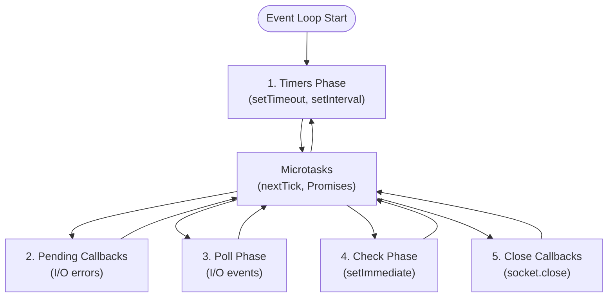

# Node.js Interview Questions (50+ Detailed Q&A)

## 1. Runtime & Core Architecture

<AccordionGroup>
<Accordion title="1. What is Node.js? Is it a framework?">
**Answer**:
No, it is a **Runtime Environment** for executing JS outside the browser.
Built on **Chrome V8 Engine** (JS -> Machine Code) and **Libuv** (Async I/O, Event Loop).
Single-threaded, Non-blocking I/O model.
</Accordion>

<Accordion title="2. Single Threaded but Scalable? How?">
**Answer**:
Node uses a **Single Main Thread** for JS execution (Event Loop).
Heavy I/O (File, Network) is delegated to **Libuv** which uses the OS Kernel (epoll/kqueue) or a C++ Thread Pool (default 4 threads) for blocking ops.
The main thread creates requests and handles callbacks, never blocking.
</Accordion>

<Accordion title="3. Event Loop Phases (Deep Dive)">
**Answer**:
1.  **Timers**: `setTimeout`, `setInterval`.
2.  **Pending Callbacks**: OS system errors.
3.  **Idle/Prepare**: Internal.
4.  **Poll**: Retrieve new I/O events, execute I/O callbacks. (Main phase).
5.  **Check**: `setImmediate`.
6.  **Close Callbacks**: `socket.on('close')`.
**Microtasks** (`nextTick`, Promises) run *between* phases.



**Execution Order Example**:
```javascript
setTimeout(() => console.log('timeout'), 0);
setImmediate(() => console.log('immediate'));
process.nextTick(() => console.log('nextTick'));
Promise.resolve().then(() => console.log('promise'));

console.log('sync');

// Output:
// sync
// nextTick
// promise
// timeout (or immediate, depends on timing)
// immediate (or timeout)
```

**Why Order Varies**: If we're already past the timers phase when the timeout is registered, `setImmediate` runs first.
</Accordion>

<Accordion title="4. `process.nextTick` vs `setImmediate`">
**Answer**:
*   `nextTick`: Runs **immediately** after current operation, before the loop continues. (Starvation risk).
*   `setImmediate`: Runs in the **Check** phase (next tick of the loop technically).

**Starvation Example**:
```javascript
// BAD: Infinite nextTick loop blocks everything!
function recursiveNextTick() {
    process.nextTick(recursiveNextTick);
}
recursiveNextTick();
// Event loop NEVER proceeds to other phases!

// GOOD: setImmediate allows other phases to run
function recursiveImmediate() {
    setImmediate(recursiveImmediate);
}
recursiveImmediate();
// Event loop can still handle I/O, timers, etc.
```

**Use Cases**:
- `nextTick`: When you need to execute before ANY I/O (e.g., emit events after constructor)
- `setImmediate`: When you want to execute after I/O events (preferred for recursion)
</Accordion>

<Accordion title="5. V8 Engine Memory Limit">
**Answer**:
Defaults (approx): 1.4GB (64-bit).
Can increase: `node --max-old-space-size=4096 app.js`.
</Accordion>

<Accordion title="6. Garbage Collection in Node">
**Answer**:
V8 uses **Generational GC**.
*   **Scavenge**: Minor GC (New Space). Fast. Moves live objects to Old Space.
*   **Mark-Sweep-Compact**: Major GC (Old Space). Stops execution.
</Accordion>

<Accordion title="7. Global Objects">
**Answer**:
`global`, `process`, `Buffer`, `__dirname` (Module scope), `__filename`, `require`, `module`.
(Window is not available).
</Accordion>

<Accordion title="8. CommonJS vs ESM">
**Answer**:
*   CJS: `require()`. Sync. Dynamic. `module.exports`.
*   ESM: `import`. Async. Static. `export default`.
</Accordion>

<Accordion title="9. `exports` vs `module.exports`">
**Answer**:
`exports` is a reference to `module.exports`.
`exports.a = 1` works.
`exports = { a: 1 }` BREAKS the link. Always use `module.exports` if assigning object.
</Accordion>

<Accordion title="10. Handling CPU Intensive Tasks">
**Answer**:
Node is bad for CPU tasks (blocks Event Loop).
**Solutions**:
1.  **Worker Threads** (Parallel execution).
2.  **Child Process** (Fork new process).
3.  **Offload** to other service (Go/Rust/Queue).
</Accordion>
</AccordionGroup>

## 2. Streams, Buffers, I/O

<AccordionGroup>
<Accordion title="11. What is a Buffer?">
**Answer**:
Fixed-size chunk of memory allocated **outside** the V8 Heap (C++ side).
Used to handle raw binary data (Streams, File I/O).
`Buffer.from('hello')`.
</Accordion>

<Accordion title="12. Streams: 4 Types">
**Answer**:
1.  **Readable**: `fs.createReadStream`.
2.  **Writable**: `res` (Response), `fs.createWriteStream`.
3.  **Duplex**: Sockets (Read/Write).
4.  **Transform**: Zlib (Compress), Crypto. (Modify data passing through).
</Accordion>

<Accordion title="13. Pipe & Backpressure">
**Answer**:
**Backpressure**: Data coming faster than can be written. RAM fills up.
`read.pipe(write)` handles this automatically (Pauses read until write drains).
</Accordion>

<Accordion title="14. `fs.readFile` vs `fs.createReadStream`">
**Answer**:
*   `readFile`: Loads **entire file** into RAM (Buffer). Crashes on large files.
*   `readStream`: Reads in **Chunks**. Memory efficient. Constant RAM usage regardless of file size.
</Accordion>

<Accordion title="15. Event Emitter Pattern">
**Answer**:
`events` module. Pub/Sub.
`const e = new EventEmitter();`
`e.on('event', cb)`;
`e.emit('event', data)`.
Node streams/server inherit from this.
</Accordion>

<Accordion title="16. Handling uncaught exceptions">
**Answer**:
`process.on('uncaughtException')`.
**Best Practice**: Log error and **Restart Process** (State might be corrupted).
`process.on('unhandledRejection')` for Promises.
</Accordion>

<Accordion title="17. Synchronous vs Asynchronous API">
**Answer**:
`fs.readFileSync` blocks the thread.
Only use Sync methods at **Startup** (config loading). Never in Request Handler.
</Accordion>

<Accordion title="18. Zlib and Compression">
**Answer**:
Module for Gzip/Deflate.
Can be piped: `src.pipe(zlib.createGzip()).pipe(dest)`.
</Accordion>

<Accordion title="19. REPL">
**Answer**:
Read-Eval-Print-Loop. The Node console shell for testing.
</Accordion>

<Accordion title="20. OS Module">
**Answer**:
`os.cpus()`, `os.freemem()`, `os.networkInterfaces()`.
Used for Cluster setup or monitoring.
</Accordion>
</AccordionGroup>

## 3. Web & Network (HTTP/Express)

<AccordionGroup>
<Accordion title="21. Anatomy of HTTP Server">
**Answer**:
`http.createServer((req, res) => ...)`
`req`: Readable Stream (Incoming data).
`res`: Writable Stream (Outgoing data).
</Accordion>

<Accordion title="22. Middleware (Express)">
**Answer**:
Function with access to `req, res, next`.
Chain of responsibility.
Global (`app.use`) or Route specific.
Calls `next()` to pass control.
</Accordion>

<Accordion title="23. Error Handling Middleware">
**Answer**:
Must have **4 arguments**: `(err, req, res, next)`.
Express recognizes arity.
Placed at the **end** of the stack.
</Accordion>

<Accordion title="24. Body Parsing">
**Answer**:
Native: Listen to `data` events on `req` stream and concatenate.
Express: `express.json()` middleware. Parsing JSON/URL-encoded bodies.
</Accordion>

<Accordion title="25. CORS in Node">
**Answer**:
Set headers: `Access-Control-Allow-Origin`.
Middleware: `cors` package.
Handle `OPTIONS` preflight requests.
</Accordion>

<Accordion title="26. JWT (JSON Web Token)">
**Answer**:
Stateless auth.
**Structure**: Header.Payload.Signature.
**Storage**: HttpOnly Cookie (Best) or LocalStorage.
**Verification**: `jwt.verify(token, secret)`.
</Accordion>

<Accordion title="27. Cookies vs Sessions">
**Answer**:
*   **Session**: ID stored in cookie. Data stored in Server Memory/Redis. Stateful.
*   **Cookie**: Data stored in Browser. Sent with requests.
</Accordion>

<Accordion title="28. File Uploads">
**Answer**:
Streams (`busbody`) or Middleware (`multer`).
Handle `multipart/form-data`.
Don't save to Disk in serverless. Stream to S3.
</Accordion>

<Accordion title="29. WebSockets (`socket.io`)">
**Answer**:
Persistent bi-directional connection.
Handshake (HTTP Upgrade) -> TCP Socket.
Real-time chat, notifications.
</Accordion>

<Accordion title="30. Keep-Alive Agent">
**Answer**:
HTTP/1.1 creates new TCP connection per request by default in old Node.
Use `http.Agent({ keepAlive: true })` to reuse connections (Connection Pooling).
</Accordion>
</AccordionGroup>

## 4. Scaling & Performance

<AccordionGroup>
<Accordion title="31. Cluster Module">
**Answer**:
Spawns child processes (Workers) sharing same Port.
Master process balances load (Round Robin).
Utilizes all CPU cores.
</Accordion>

<Accordion title="32. PM2 Process Manager">
**Answer**:
Deamonizes app.
Features: Auto-restart on crash, Cluster mode (`-i max`), Logs, Monitoring.
</Accordion>

<Accordion title="33. Worker Threads">
**Answer**:
Threads sharing memory.
For CPU tasks (Crypto, Compression, Image).
Unlike Cluster (Separate Memory), Workers are lightweight but complex (Locking needed if sharing ArrayBuffer).
</Accordion>

<Accordion title="34. Memory Leaks Causes">
**Answer**:
1.  Global variables.
2.  Unclosed Event Listeners (adding listener on every req).
3.  Closures holding large objects.
4.  Cache without TTL.
</Accordion>

<Accordion title="35. N+1 Problem (GraphQL/ORM)">
**Answer**:
Fetching list of 10 users (1 query).
Looping to fetch address for each (10 queries). total 11.
**Fix**: DataLoader (Batching).
</Accordion>

<Accordion title="36. Database Connection Pooling">
**Answer**:
Opening TCP connection is expensive (Handshake).
Pool maintains open connections. Reuses them.
`pg.Pool` or Mongoose built-in pool.
</Accordion>

<Accordion title="37. Caching Strategies">
**Answer**:
1.  **In-Memory (Node)**: Fast, but clears on restart, duplicates RAM in cluster.
2.  **Distributed (Redis)**: Shared, Persistent, Fast.
</Accordion>

<Accordion title="38. Profiling Node App">
**Answer**:
`--inspect`. Chrome DevTools.
Flame Graphs (0x, Clinic.js). shows CPU time per function.
</Accordion>

<Accordion title="39. Event Loop Block Loophole">
**Answer**:
`JSON.parse` or `JSON.stringify` on massive objects blocks the loop.
Regex DoD (Denial of Service).
</Accordion>

<Accordion title="40. Microservices Communication">
**Answer**:
*   **HTTP/REST**: Simple, slow (JSON).
*   **gRPC**: Protobuf (Binary), fast, strict contract.
*   **Message Queues** (RabbitMQ/Kafka): Async, Decoupled.
</Accordion>
</AccordionGroup>

## 5. Security & Testing

<AccordionGroup>
<Accordion title="41. SQL Injection & NoSQL Injection">
**Answer**:
*   **SQL**: User input concatenating query. Fix: Prepared Statements.
*   **NoSQL**: Mongo query `{ username: req.body.user }`. If user sends `{"$ne": null}`, they bypass login. Fix: Sanitize input.
</Accordion>

<Accordion title="42. XSS (Cross Site Scripting)">
**Answer**:
Attacker injects script.
Backend defense: Sanitize output, set CSP (Content Security Policy) headers.
</Accordion>

<Accordion title="43. CSRF (Cross Site Request Forgery)">
**Answer**:
Malicious site forces user browser to request bank.com.
Defense: CSRF Token, SameSite=Strict cookies.
</Accordion>

<Accordion title="44. Helmet.js">
**Answer**:
Middleware setting security headers (HSTS, X-Frame-Options, No-Sniff).
</Accordion>

<Accordion title="45. Rate Limiting">
**Answer**:
Prevent DDOS / Brute Force.
`express-rate-limit` (Memory/Redis).
Strategies: Fixed Window, Token Bucket.
</Accordion>

<Accordion title="46. Unit Testing (Jest/Mocha)">
**Answer**:
Testing functions in isolation.
Mocking dependencies/DB calls.
</Accordion>

<Accordion title="47. Dependency Injection">
**Answer**:
Passing dependencies (DB, Config) into function/class instead of requiring them.
Makes testing easy (Pass mock DB).
`class Service { constructor(db) ... }`
</Accordion>

<Accordion title="48. TDD (Test Driven Development)">
**Answer**:
Red (Fail) -> Green (Pass) -> Refactor.
</Accordion>

<Accordion title="49. Environment Variables">
**Answer**:
`.env` files. `dotenv` package.
Separates Config from Code. Secrets (API Keys) should never be in git.
</Accordion>

<Accordion title="50. Logging Best Practices">
**Answer**:
Don't use `console.log` (Sync, blocking in TTY).
Use Logger (Winston/Pino) -> JSON output -> Stdout.
Log Levels (Info, Error, Debug).
Correlation IDs for tracing.
</Accordion>
</AccordionGroup>

## 6. Node.js Medium Level Questions

<AccordionGroup>
<Accordion title="51. Express Middleware Order">
**Answer**:
Middleware executes in order of definition.

```javascript
app.use(express.json());  // 1. Parse JSON
app.use(logger);          // 2. Log request
app.get('/api', handler); // 3. Route handler
app.use(errorHandler);    // 4. Error handling (last)
```
</Accordion>

<Accordion title="52. Route Parameters and Query Strings">
**Answer**:
```javascript
// Route params: /users/:id
app.get('/users/:id', (req, res) => {
    const id = req.params.id;
});

// Query strings: /search?q=node&limit=10
app.get('/search', (req, res) => {
    const { q, limit } = req.query;
});
```
</Accordion>

<Accordion title="53. Body Parsing">
**Answer**:
```javascript
// JSON
app.use(express.json());

// URL-encoded
app.use(express.urlencoded({ extended: true }));

// Multipart (use multer)
const multer = require('multer');
const upload = multer({ dest: 'uploads/' });
app.post('/upload', upload.single('file'), handler);
```
</Accordion>

<Accordion title="54. Cookie and Session Management">
**Answer**:
```javascript
const cookieParser = require('cookie-parser');
const session = require('express-session');

app.use(cookieParser());
app.use(session({
    secret: 'secret-key',
    resave: false,
    saveUninitialized: true
}));

// Set cookie
res.cookie('name', 'value', { maxAge: 900000 });

// Access session
req.session.userId = 123;
```
</Accordion>

<Accordion title="55. Error Handling in Express">
**Answer**:
```javascript
// Error middleware (4 params)
app.use((err, req, res, next) => {
    console.error(err.stack);
    res.status(500).json({ error: err.message });
});

// Async error handling
const asyncHandler = fn => (req, res, next) => {
    Promise.resolve(fn(req, res, next)).catch(next);
};

app.get('/api', asyncHandler(async (req, res) => {
    const data = await fetchData();
    res.json(data);
}));
```
</Accordion>

<Accordion title="56. CORS Configuration">
**Answer**:
```javascript
const cors = require('cors');

// Allow all
app.use(cors());

// Custom config
app.use(cors({
    origin: 'https://example.com',
    credentials: true,
    methods: ['GET', 'POST']
}));
```
</Accordion>

<Accordion title="57. Rate Limiting">
**Answer**:
```javascript
const rateLimit = require('express-rate-limit');

const limiter = rateLimit({
    windowMs: 15 * 60 * 1000, // 15 minutes
    max: 100 // limit each IP to 100 requests per windowMs
});

app.use('/api/', limiter);
```
</Accordion>

<Accordion title="58. Input Validation">
**Answer**:
```javascript
const { body, validationResult } = require('express-validator');

app.post('/user',
    body('email').isEmail(),
    body('age').isInt({ min: 0 }),
    (req, res) => {
        const errors = validationResult(req);
        if (!errors.isEmpty()) {
            return res.status(400).json({ errors: errors.array() });
        }
        // Process valid data
    }
);
```
</Accordion>

<Accordion title="59. Database Connection Pooling">
**Answer**:
```javascript
// PostgreSQL with pg
const { Pool } = require('pg');
const pool = new Pool({
    max: 20,
    connectionTimeoutMillis: 2000
});

const result = await pool.query('SELECT * FROM users');
```
</Accordion>

<Accordion title="60. MongoDB with Mongoose">
**Answer**:
```javascript
const mongoose = require('mongoose');

const userSchema = new mongoose.Schema({
    name: String,
    email: { type: String, unique: true }
});

const User = mongoose.model('User', userSchema);

// Create
await User.create({ name: 'Alice', email: 'alice@example.com' });

// Find
const users = await User.find({ name: 'Alice' });
```
</Accordion>

<Accordion title="61. JWT Authentication">
**Answer**:
```javascript
const jwt = require('jsonwebtoken');

// Generate token
const token = jwt.sign({ userId: 123 }, 'secret', { expiresIn: '1h' });

// Verify middleware
const auth = (req, res, next) => {
    const token = req.headers.authorization?.split(' ')[1];
    try {
        const decoded = jwt.verify(token, 'secret');
        req.userId = decoded.userId;
        next();
    } catch (err) {
        res.status(401).json({ error: 'Invalid token' });
    }
};
```
</Accordion>

<Accordion title="62. Password Hashing with bcrypt">
**Answer**:
```javascript
const bcrypt = require('bcrypt');

// Hash password
const hash = await bcrypt.hash('password123', 10);

// Compare
const isValid = await bcrypt.compare('password123', hash);
```
</Accordion>

<Accordion title="63. File Uploads with Multer">
**Answer**:
```javascript
const multer = require('multer');

const storage = multer.diskStorage({
    destination: 'uploads/',
    filename: (req, file, cb) => {
        cb(null, Date.now() + '-' + file.originalname);
    }
});

const upload = multer({ storage });

app.post('/upload', upload.single('file'), (req, res) => {
    res.json({ filename: req.file.filename });
});
```
</Accordion>

<Accordion title="64. Email Sending with Nodemailer">
**Answer**:
```javascript
const nodemailer = require('nodemailer');

const transporter = nodemailer.createTransport({
    service: 'gmail',
    auth: { user: 'user@gmail.com', pass: 'password' }
});

await transporter.sendMail({
    from: 'sender@example.com',
    to: 'recipient@example.com',
    subject: 'Hello',
    text: 'Hello world'
});
```
</Accordion>

<Accordion title="65. Testing with Jest">
**Answer**:
```javascript
// sum.test.js
const sum = require('./sum');

test('adds 1 + 2 to equal 3', () => {
    expect(sum(1, 2)).toBe(3);
});

// Async test
test('fetches data', async () => {
    const data = await fetchData();
    expect(data).toBeDefined();
});
```
</Accordion>

<Accordion title="66. Mocking with Jest">
**Answer**:
```javascript
// Mock function
const mockFn = jest.fn();
mockFn.mockReturnValue(42);

// Mock module
jest.mock('./api');
const api = require('./api');
api.fetchData.mockResolvedValue({ data: 'test' });
```
</Accordion>

<Accordion title="67. Environment Variables">
**Answer**:
```javascript
require('dotenv').config();

const PORT = process.env.PORT || 3000;
const DB_URL = process.env.DATABASE_URL;
```
</Accordion>

<Accordion title="68. Logging with Winston">
**Answer**:
```javascript
const winston = require('winston');

const logger = winston.createLogger({
    level: 'info',
    format: winston.format.json(),
    transports: [
        new winston.transports.File({ filename: 'error.log', level: 'error' }),
        new winston.transports.File({ filename: 'combined.log' })
    ]
});

logger.info('Server started');
logger.error('Error occurred', { error: err });
```
</Accordion>

<Accordion title="69. HTTP Request Logging">
**Answer**:
```javascript
const morgan = require('morgan');

// Predefined format
app.use(morgan('combined'));

// Custom format
app.use(morgan(':method :url :status :response-time ms'));
```
</Accordion>

<Accordion title="70. Static File Serving">
**Answer**:
```javascript
// Serve static files from 'public' directory
app.use(express.static('public'));

// With prefix
app.use('/static', express.static('public'));
```
</Accordion>
</AccordionGroup>

## 7. Node.js Advanced Level Questions

<AccordionGroup>
<Accordion title="71. Custom Stream Implementation">
**Answer**:
```javascript
const { Readable } = require('stream');

class MyReadable extends Readable {
    constructor(data) {
        super();
        this.data = data;
        this.index = 0;
    }
    
    _read() {
        if (this.index < this.data.length) {
            this.push(this.data[this.index++]);
        } else {
            this.push(null); // End stream
        }
    }
}
```
</Accordion>

<Accordion title="72. Transform Streams">
**Answer**:
```javascript
const { Transform } = require('stream');

class UpperCase extends Transform {
    _transform(chunk, encoding, callback) {
        this.push(chunk.toString().toUpperCase());
        callback();
    }
}

process.stdin.pipe(new UpperCase()).pipe(process.stdout);
```
</Accordion>

<Accordion title="73. Backpressure Handling">
**Answer**:
```javascript
const readable = getReadableStream();
const writable = getWritableStream();

readable.on('data', (chunk) => {
    const canContinue = writable.write(chunk);
    if (!canContinue) {
        readable.pause(); // Backpressure!
    }
});

writable.on('drain', () => {
    readable.resume(); // Resume reading
});
```
</Accordion>

<Accordion title="74. Child Processes">
**Answer**:
```javascript
const { spawn, exec, fork } = require('child_process');

// spawn: stream-based
const ls = spawn('ls', ['-lh']);
ls.stdout.on('data', data => console.log(data.toString()));

// exec: buffer-based
exec('ls -lh', (err, stdout) => console.log(stdout));

// fork: Node.js processes
const child = fork('worker.js');
child.send({ task: 'process' });
child.on('message', msg => console.log(msg));
```
</Accordion>

<Accordion title="75. Cluster Module">
**Answer**:
```javascript
const cluster = require('cluster');
const os = require('os');

if (cluster.isMaster) {
    const numCPUs = os.cpus().length;
    for (let i = 0; i < numCPUs; i++) {
        cluster.fork();
    }
    cluster.on('exit', (worker) => {
        console.log(`Worker ${worker.id} died`);
        cluster.fork(); // Restart
    });
} else {
    // Worker process
    require('./server');
}
```
</Accordion>

<Accordion title="76. Worker Threads">
**Answer**:
```javascript
const { Worker } = require('worker_threads');

const worker = new Worker('./worker.js', {
    workerData: { value: 42 }
});

worker.on('message', msg => console.log(msg));
worker.on('error', err => console.error(err));
worker.on('exit', code => console.log(`Exit code: ${code}`));

// worker.js
const { parentPort, workerData } = require('worker_threads');
parentPort.postMessage(workerData.value * 2);
```
</Accordion>

<Accordion title="77. Performance Hooks">
**Answer**:
```javascript
const { PerformanceObserver, performance } = require('perf_hooks');

const obs = new PerformanceObserver((items) => {
    items.getEntries().forEach(entry => {
        console.log(`${entry.name}: ${entry.duration}ms`);
    });
});
obs.observe({ entryTypes: ['measure'] });

performance.mark('start');
// ... work
performance.mark('end');
performance.measure('work', 'start', 'end');
```
</Accordion>

<Accordion title="78. Heap Snapshots">
**Answer**:
```javascript
const v8 = require('v8');
const fs = require('fs');

// Take snapshot
const snapshot = v8.writeHeapSnapshot();
console.log(`Snapshot written to ${snapshot}`);

// Analyze with Chrome DevTools
```
</Accordion>

<Accordion title="79. CPU Profiling">
**Answer**:
```bash
# Start with profiling
node --prof app.js

# Process profile
node --prof-process isolate-*.log > processed.txt
```
</Accordion>

<Accordion title="80. HTTP/2 Server">
**Answer**:
```javascript
const http2 = require('http2');
const fs = require('fs');

const server = http2.createSecureServer({
    key: fs.readFileSync('key.pem'),
    cert: fs.readFileSync('cert.pem')
});

server.on('stream', (stream, headers) => {
    stream.respond({ ':status': 200 });
    stream.end('Hello HTTP/2');
});

server.listen(8443);
```
</Accordion>

<Accordion title="81. WebSocket Server">
**Answer**:
```javascript
const WebSocket = require('ws');

const wss = new WebSocket.Server({ port: 8080 });

wss.on('connection', (ws) => {
    ws.on('message', (message) => {
        console.log('received:', message);
        ws.send('Echo: ' + message);
    });
    
    ws.send('Welcome!');
});
```
</Accordion>

<Accordion title="82. GraphQL Server">
**Answer**:
```javascript
const { ApolloServer, gql } = require('apollo-server');

const typeDefs = gql`
    type Query {
        hello: String
    }
`;

const resolvers = {
    Query: {
        hello: () => 'Hello world!'
    }
};

const server = new ApolloServer({ typeDefs, resolvers });
server.listen().then(({ url }) => console.log(`Server at ${url}`));
```
</Accordion>

<Accordion title="83. Message Queues with RabbitMQ">
**Answer**:
```javascript
const amqp = require('amqplib');

// Producer
const conn = await amqp.connect('amqp://localhost');
const channel = await conn.createChannel();
await channel.assertQueue('tasks');
channel.sendToQueue('tasks', Buffer.from('Task data'));

// Consumer
channel.consume('tasks', (msg) => {
    console.log(msg.content.toString());
    channel.ack(msg);
});
```
</Accordion>

<Accordion title="84. Redis Caching">
**Answer**:
```javascript
const redis = require('redis');
const client = redis.createClient();

// Set with expiration
await client.set('key', 'value', 'EX', 3600);

// Get
const value = await client.get('key');

// Cache pattern
async function getCachedData(key) {
    const cached = await client.get(key);
    if (cached) return JSON.parse(cached);
    
    const data = await fetchFromDB();
    await client.set(key, JSON.stringify(data), 'EX', 3600);
    return data;
}
```
</Accordion>

<Accordion title="85. Graceful Shutdown">
**Answer**:
```javascript
const server = app.listen(3000);

process.on('SIGTERM', () => {
    console.log('SIGTERM received, closing server');
    server.close(() => {
        console.log('Server closed');
        // Close database connections
        mongoose.connection.close();
        process.exit(0);
    });
});
```
</Accordion>

<Accordion title="86. Health Checks">
**Answer**:
```javascript
app.get('/health', async (req, res) => {
    const checks = {
        uptime: process.uptime(),
        message: 'OK',
        timestamp: Date.now(),
        database: await checkDatabase(),
        redis: await checkRedis()
    };
    
    const status = checks.database && checks.redis ? 200 : 503;
    res.status(status).json(checks);
});
```
</Accordion>

<Accordion title="87. Request Timeout Handling">
**Answer**:
```javascript
const timeout = require('connect-timeout');

app.use(timeout('5s'));
app.use((req, res, next) => {
    if (!req.timedout) next();
});

// Or manual
const controller = new AbortController();
const timeoutId = setTimeout(() => controller.abort(), 5000);

fetch(url, { signal: controller.signal })
    .finally(() => clearTimeout(timeoutId));
```
</Accordion>

<Accordion title="88. Memory Leak Detection">
**Answer**:
```javascript
// Monitor memory usage
setInterval(() => {
    const used = process.memoryUsage();
    console.log(`Heap: ${Math.round(used.heapUsed / 1024 / 1024)}MB`);
}, 5000);

// Use heapdump
const heapdump = require('heapdump');
heapdump.writeSnapshot(`${Date.now()}.heapsnapshot`);
```
</Accordion>

<Accordion title="89. Native Addons with N-API">
**Answer**:
```cpp
// addon.cc
#include <napi.h>

Napi::Number Add(const Napi::CallbackInfo& info) {
    Napi::Env env = info.Env();
    double a = info[0].As<Napi::Number>().DoubleValue();
    double b = info[1].As<Napi::Number>().DoubleValue();
    return Napi::Number::New(env, a + b);
}

Napi::Object Init(Napi::Env env, Napi::Object exports) {
    exports.Set("add", Napi::Function::New(env, Add));
    return exports;
}

NODE_API_MODULE(addon, Init)
```
</Accordion>

<Accordion title="90. Microservices Communication">
**Answer**:
```javascript
// Service A
app.post('/api/order', async (req, res) => {
    // Create order
    const order = await createOrder(req.body);
    
    // Notify other services
    await fetch('http://inventory-service/api/reserve', {
        method: 'POST',
        body: JSON.stringify({ orderId: order.id })
    });
    
    res.json(order);
});

// Use service mesh or API gateway for production
```
</Accordion>
</AccordionGroup>
