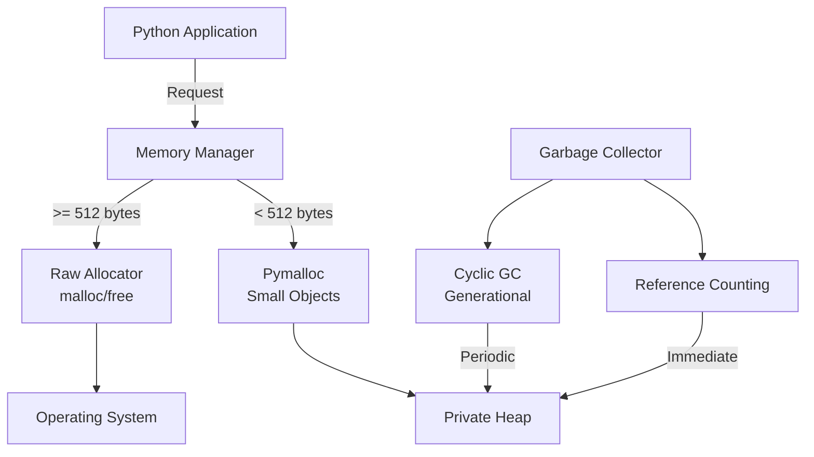
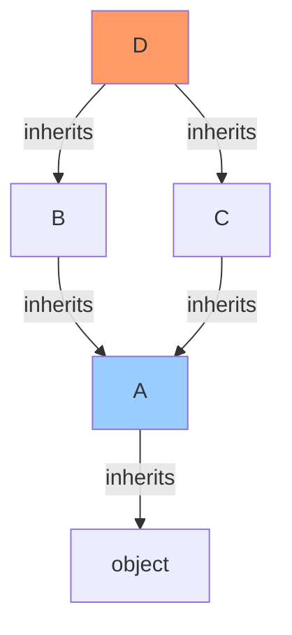

# Python Interview Questions (60+ Deep Dive Q&A)

## 1. Core Language & Data Structures

<AccordionGroup>
<Accordion title="1. Python Memory Management (The 3 Pillars)">
**Answer**:
1.  **Private Heap**: Where all objects/data live. Managed by Memory Manager.
2.  **Raw Memory Allocator**: Interaction with OS (malloc).
3.  **Object-Specific Allocators**: Pymalloc (for small objects < 512 bytes). Optimize fragmentation.
**Garbage Collection**: Reference Counting (Primary) + Cyclic GC (Secondary).



**Reference Counting Example**:
```python
import sys

a = []  # refcount = 1
b = a   # refcount = 2
c = a   # refcount = 3

print(sys.getrefcount(a))  # 4 (includes temporary reference in getrefcount)

del b   # refcount = 2
del c   # refcount = 1
del a   # refcount = 0 -> IMMEDIATELY freed
```

**Cyclic GC (Handles Circular References)**:
```python
import gc

class Node:
    def __init__(self):
        self.ref = None

# Create circular reference
a = Node()
b = Node()
a.ref = b
b.ref = a  # Circular!

del a
del b
# Reference counting can't free these (refcount never hits 0)
# Cyclic GC will detect and collect them

gc.collect()  # Force collection
print(gc.get_count())  # (generation0, generation1, generation2)
```

**Memory Leak Prevention**:
```python
# BAD: Circular reference with __del__
class BadClass:
    def __del__(self):
        pass  # Prevents GC from collecting cycles!

# GOOD: Use weakref for circular references
import weakref

class GoodClass:
    def __init__(self):
        self.ref = None  # Use weakref.ref() for circular refs
```
</Accordion>


<Accordion title="2. List vs Tuple vs Set vs Dictionary">
**Answer**:
| Type | Mutable | Ordered | Allow Duplicates | Lookup Cost |
| :--- | :--- | :--- | :--- | :--- |
| **List** | Yes | Yes | Yes | O(N) |
| **Tuple** | No | Yes | Yes | O(N) |
| **Set** | Yes | No | No | O(1) |
| **Dict** | Yes | Yes (3.7+) | Keys: No | O(1) |
</Accordion>

<Accordion title="3. `__init__` vs `__new__` (Diagram)">
**Answer**:
*   `__new__`: The **Allocating** phase. Returns the object. (Static method).
*   `__init__`: The **Initializing** phase. Sets attributes. (Instance method).
**Flow**: `Class()` call -> `__new__` -> creates instance -> `__init__(instance)` -> sets props.
</Accordion>

<Accordion title="4. MRO (Method Resolution Order)">
**Answer**:
Algorithm to determine which class method to call in Multiple Inheritance.
**C3 Linearization**.
Ensures subclasses are checked before parents, and order of parents is preserved.
`ClassName.mro()` or `help(ClassName)` calls show the order.

**Diamond Problem Example**:
```python
class A:
    def method(self):
        print("A")

class B(A):
    def method(self):
        print("B")

class C(A):
    def method(self):
        print("C")

class D(B, C):  # Diamond inheritance!
    pass

# Which method() gets called?
d = D()
d.method()  # "B" (follows MRO)

print(D.mro())
# [D, B, C, A, object]
# Left-to-right, depth-first, but respecting order
```



**MRO Resolution**: D → B → C → A → object
</Accordion>

<Accordion title="5. Decorators (Internals)">
**Answer**:
Functions that modify other functions.
A decorator `wraps` the target.
```python
def log(func):
    def wrapper(*args):
        print("Call")
        return func(*args)
    return wrapper

@log
def add(): pass
# Equivalent to: add = log(add)
```

**Decorator with Arguments (Factory Pattern)**:
```python
def repeat(times):
    def decorator(func):
        def wrapper(*args, **kwargs):
            for _ in range(times):
                result = func(*args, **kwargs)
            return result
        return wrapper
    return decorator

@repeat(times=3)
def greet(name):
    print(f"Hello {name}")

greet("Alice")  # Prints 3 times
```

**Class Decorator**:
```python
def singleton(cls):
    instances = {}
    def get_instance(*args, **kwargs):
        if cls not in instances:
            instances[cls] = cls(*args, **kwargs)
        return instances[cls]
    return get_instance

@singleton
class Database:
    pass

db1 = Database()
db2 = Database()
assert db1 is db2  # Same instance!
```

**Preserving Metadata**:
```python
from functools import wraps

def my_decorator(func):
    @wraps(func)  # Preserves __name__, __doc__, etc.
    def wrapper(*args, **kwargs):
        return func(*args, **kwargs)
    return wrapper
```
</Accordion>

<Accordion title="6. Generators vs Iterators">
**Answer**:
All Generators are Iterators, but not vice versa.
*   **Iterator**: Class with `__next__` and `__iter__`. State managed manually.
*   **Generator**: Function with `yield`. State managed auto. Pauses execution. High memory efficiency.
</Accordion>

<Accordion title="7. Context Managers (The `with` statement)">
**Answer**:
Ensures resource cleanup (Files, Locks, DB).
Implements `__enter__` (setup) and `__exit__` (teardown).
**Exception Handling**: `__exit__` receives exception details. Return `True` to suppress.
</Accordion>

<Accordion title="8. Lambdas">
**Answer**:
Anonymous one-line functions.
`lambda x: x * 2`.
Limited: No statements (assignment, while), only expressions.
Used often with `map`, `filter`, `sort(key=...)`.
</Accordion>

<Accordion title="9. `*args` and `**kwargs`">
**Answer**:
Variable length arguments.
*   `*args`: Tuple of positional args.
*   `**kwargs`: Dictionary of keyword args.
**Unpacking**: `func(*my_list)` expands list into args.
</Accordion>

<Accordion title="10. Shallow vs Deep Copy">
**Code**:
```python
l1 = [[1], 2]
l2 = copy.copy(l1)    # Shallow: l2[0] POINTS TO same list as l1[0]
l3 = copy.deepcopy(l1)# Deep: l3[0] is a NEW list
```
</Accordion>
</AccordionGroup>

## 2. Advanced OOP

<AccordionGroup>
<Accordion title="11. Encapsulation (Public, Protected, Private)">
**Answer**:
*   `name`: Public.
*   `_name`: Protected (Convention only). "Internal use".
*   `__name`: Private (Name Mangling). Becomes `_Class__name`. Harder to access.
python has no strict enforcement (we are all consenting adults).
</Accordion>

<Accordion title="12. Abstract Base Classes (ABC)">
**Answer**:
Enforce Interface implementation.
```python
from abc import ABC, abstractmethod
class Animal(ABC):
    @abstractmethod
    def speak(self): pass
```
Cannot instantiate `Animal`. Subclass MUST implement `speak`.
</Accordion>

<Accordion title="13. `__slots__` Optimization">
**Answer**:
By default, objects store attributes in a `__dict__` (dynamic). Uses RAM.
`__slots__ = ['x', 'y']` tells Python "This class ONLY has x and y".
Allocates fixed array. Saves memory for millions of objects.
</Accordion>

<Accordion title="14. Property Decorators (Getters/Setters)">
**Answer**:
Pythonic way to encapsulate.
```python
@property
def age(self): return self._age
@age.setter
def age(self, val): self._age = val
```
Access as `obj.age` (looks like attribute, runs like method).
</Accordion>

<Accordion title="15. Duck Typing vs Static Typing">
**Answer**:
*   **Duck**: "If it has `quack()`, it's a Duck". Runtime check.
*   **Static (Hints)**: `def quack(d: Duck) -> None:`. Analysis tool check (Mypy).
</Accordion>

<Accordion title="16. Composition vs Inheritance">
**Answer**:
*   **Inheritance**: "Is-A". `Car` is a `Vehicle`. Rigid.
*   **Composition**: "Has-A". `Car` has an `Engine`. Flexible.
**Prefer Composition** to avoid Deep Inheritance hierarchies (Fragile Base Class problem).
</Accordion>

<Accordion title="17. Method Overloading?">
**Answer**:
Python does **NOT** support traditional overloading (multiple methods same name, diff args). Last one defined wins.
**Solution**:
1.  Default args (`def f(a, b=None)`).
2.  `*args`.
3.  `@functools.singledispatch`.
</Accordion>

<Accordion title="18. Singletons">
**Answer**:
Ensure one instance exists.
1.  **Module**: Modules are singletons.
2.  **`__new__`**: Check `if cls._instance is None`.
3.  **Decorator**: Wrap class.
</Accordion>

<Accordion title="19. Enum Class">
**Answer**:
`from enum import Enum`.
Immutable constants.
`Color.RED` is distinct from string "RED" and int 1.
</Accordion>

<Accordion title="20. Dataclasses (3.7+)">
**Answer**:
Boilerplate generator.
Auto generates `__init__`, `__repr__`, `__eq__`.
```python
@dataclass
class Point:
    x: int
    y: int
```
</Accordion>
</AccordionGroup>

## 3. Asyncio & Concurrency

<AccordionGroup>
<Accordion title="21. Threading vs Multiprocessing vs Asyncio">
**Answer**:
*   **Threading**: OS Threads. 1 CPU core (GIL). Good for I/O blocking (Network).
*   **Multiprocessing**: OS Processes. All cores. Good for CPU Heavy. High overhead.
*   **Asyncio**: Single Thread. Cooperative Multitasking. Good for Massive I/O (10k connections).
</Accordion>

<Accordion title="22. GIL (Global Interpreter Lock)">
**Answer**:
Mutex protecting Python objects.
Only one thread executes Bytecode at a time.
Why? CPython memory management is not thread-safe.
**Impact**: Multi-threaded CPU tasks (Matrix mult) are SLOWER than single thread.

**Performance Benchmark**:
```python
import time
import threading
import multiprocessing

def cpu_bound_task(n):
    """CPU-intensive: calculate sum"""
    total = 0
    for i in range(n):
        total += i ** 2
    return total

# Single-threaded baseline
start = time.time()
cpu_bound_task(10_000_000)
print(f"Single thread: {time.time() - start:.2f}s")  # ~1.5s

# Multi-threading (GIL limits this!)
def threaded_approach():
    threads = []
    for _ in range(4):
        t = threading.Thread(target=cpu_bound_task, args=(10_000_000,))
        threads.append(t)
        t.start()
    for t in threads:
        t.join()

start = time.time()
threaded_approach()
print(f"4 threads: {time.time() - start:.2f}s")  # ~1.5s (NO speedup!)

# Multi-processing (bypasses GIL!)
def multiprocess_approach():
    with multiprocessing.Pool(4) as pool:
        pool.map(cpu_bound_task, [10_000_000] * 4)

start = time.time()
multiprocess_approach()
print(f"4 processes: {time.time() - start:.2f}s")  # ~0.4s (4x speedup!)
```

**I/O-Bound Tasks (Threading Works!)**:
```python
import requests
import threading

def fetch_url(url):
    response = requests.get(url)
    return len(response.content)

urls = ['https://example.com'] * 10

# Single-threaded
start = time.time()
for url in urls:
    fetch_url(url)
print(f"Sequential: {time.time() - start:.2f}s")  # ~5s

# Multi-threaded (GIL released during I/O!)
threads = []
start = time.time()
for url in urls:
    t = threading.Thread(target=fetch_url, args=(url,))
    threads.append(t)
    t.start()
for t in threads:
    t.join()
print(f"Threaded: {time.time() - start:.2f}s")  # ~0.5s (10x speedup!)
```

**Key Takeaway**:
- **CPU-bound**: Use `multiprocessing` or `asyncio` with C extensions
- **I/O-bound**: Use `threading` or `asyncio` (GIL released during I/O wait)
</Accordion>


<Accordion title="23. Event Loop Explained">
**Answer**:
Infinite loop: "Is new task ready? No. Is IO complete? Yes -> Resume callback".
**Coroutines** (`async def`) yield control (`await`) when blocked.
Loop runs other tasks.
</Accordion>

<Accordion title="24. `await` keyword">
**Answer**:
"Pause execution of this coroutine, yield control to loop, and come back when result is ready".
Can only be used inside `async def`.
</Accordion>

<Accordion title="25. Race Conditions in Asyncio?">
**Answer**:
Yes!
Asyncio is cooperatively scheduled, but if two tasks modify shared state across `awaits`, race happens.
Locking is still needed (`asyncio.Lock`).
</Accordion>

<Accordion title="26. Blocking Code in Async">
**Answer**:
Disaster. `time.sleep(10)` blocks the **entire Loop**. No other interaction possible.
**Fix**: `await asyncio.sleep(10)`.
For CPU logic: `loop.run_in_executor` (Offload to ThreadPool).
</Accordion>

<Accordion title="27. `asyncio.gather`">
**Answer**:
Run multiple awaitables concurrently.
Waits for all to finish.
`results = await asyncio.gather(task1(), task2())`.
</Accordion>

<Accordion title="28. Async Context Managers">
**Answer**:
`async with conn.transaction():`.
Methods `__aenter__` and `__aexit__`.
Needed for async cleanup (e.g., closing DB pool).
</Accordion>

<Accordion title="29. Async Iterators">
**Answer**:
`async for item in fetch_stream():`.
Methods `__aiter__` and `__anext__`.
Used for streaming data.
</Accordion>

<Accordion title="30. UVLoop">
**Answer**:
Fast implementation of Event Loop using `libuv` (Node.js engine).
Makes Python Asyncio 2-4x faster.
</Accordion>
</AccordionGroup>

## 4. Backend & Web (Django/FastAPI)

<AccordionGroup>
<Accordion title="31. WSGI vs ASGI">
**Answer**:
*   **WSGI**: Sync Standard (Flask, Django). Blocking.
*   **ASGI**: Async Standard (FastAPI, Django Channels). Supports WebSockets, HTTP2.
</Accordion>

<Accordion title="32. FastAPI Features">
**Answer**:
1.  **Speed**: Native Async/Starlette.
2.  **Validation**: Pydantic models.
3.  **Docs**: Auto Swagger/OpenAPI.
4.  **DI**: Powerful Dependency Injection system.
</Accordion>

<Accordion title="33. Django ORM N+1 Problem">
**Answer**:
Looping over objects and hitting DB for each relation.
**Code**: `for book in books: print(book.author.name)`.
**Fix**: `select_related` (Join / FK) or `prefetch_related` (M2M / Reverse FK).
</Accordion>

<Accordion title="34. Middleware">
**Answer**:
Hooks processed **Before** view and **After** view.
Use: Auth, Logging, CORS, GZip.
</Accordion>

<Accordion title="35. CSRF in Django">
**Answer**:
Cross Site Request Forgery.
Django checks for `csrf_token` in POST data matching the cookie.
Prevents external forms from posting to your server.
</Accordion>

<Accordion title="36. Gunicorn vs Uvicorn">
**Answer**:
*   **Gunicorn**: Process Manager. For Production. Spawns workers.
*   **Uvicorn**: ASGI Worker. Runs the Async code.
*   **Setup**: Gunicorn manages Uvicorn workers.
</Accordion>

<Accordion title="37. REST vs GraphQL">
**Answer**:
*   **REST**: Multiple endpoints. Fixed structure. Over/Under fetching.
*   **GraphQL**: Single Endpoint. Client defines structure. Exact fetching. Complex caching.
</Accordion>

<Accordion title="38. DB Migrations">
**Answer**:
Version Control for Database Schema.
(Alembic, Django Migrations).
Applying changes (Up) or Reverting (Down) reproducibly.
</Accordion>

<Accordion title="39. Session vs JWT Auth">
**Answer**:
*   **Session**: Server stores state (Memory/Redis). Cookie ID. Revocable.
*   **JWT**: Client stores state (Signature). Stateless. Scalable. Hard to revoke.
</Accordion>

<Accordion title="40. Dependency Injection">
**Answer**:
Passing dependencies (DB connection, Config) to function instead of hardcoding.
FastAPI: `def route(db: Session = Depends(get_db)):`.
Unit testing becomes easy (Pass Mock DB).
</Accordion>
</AccordionGroup>

## 5. Coding Scenarios & Snippets

<AccordionGroup>
<Accordion title="41. Flatten Nested List (Recursive)">
**Code**:
```python
def flatten(l):
    res = []
    for i in l:
        if isinstance(i, list): res.extend(flatten(i))
        else: res.append(i)
    return res
```
</Accordion>

<Accordion title="42. LRU Cache Implementation (Concept)">
**Answer**:
Doubly Linked List (Order) + Hash Map (Lookup).
Get: O(1). Move Node to Head.
Put: O(1). Add Head. If full, Remove Tail.
Python: `@functools.lru_cache`.
</Accordion>

<Accordion title="43. Singleton Decorator">
**Code**:
```python
def singleton(cls):
    instances = {}
    def wrapper(*args, **kwargs):
        if cls not in instances:
            instances[cls] = cls(*args, **kwargs)
        return instances[cls]
    return wrapper
```
</Accordion>

<Accordion title="44. Reverse String (Slicing)">
**Code**:
`s[::-1]`.
Detailed: `s[start:stop:step]`. Step -1 implies reverse.
</Accordion>

<Accordion title="45. Find Duplicates">
**Code**:
```python
from collections import Counter
counts = Counter(nums)
dups = [k for k,v in counts.items() if v > 1]
```
</Accordion>

<Accordion title="46. Binary Search (Bisect)">
**Answer**:
`import bisect`.
`bisect.bisect_left(arr, x)` returns index.
Array must be sorted.
</Accordion>

<Accordion title="47. Context Manager Class">
**Code**:
```python
class MyFile:
    def __enter__(self):
        self.f = open('a.txt')
        return self.f
    def __exit__(self, type, value, tb):
        self.f.close()
```
</Accordion>

<Accordion title="48. Merge Dictionaries">
**Code**:
`z = {**x, **y}` or `x | y` (Py 3.9).
</Accordion>

<Accordion title="49. Reading Huge File">
**Code**:
Don't use `read()`. Use iterator.
```python
with open('big.log') as f:
    for line in f:
        process(line)
```
</Accordion>

<Accordion title="50. Sort list of dicts by key">
**Code**:
```python
data.sort(key=lambda x: x['age'])
```
</Accordion>
</AccordionGroup>

## 6. Edge Cases & Trivia

<AccordionGroup>
<Accordion title="51. `is` vs `==`">
**Answer**:
*   `==`: Value equality (`__eq__`).
*   `is`: Identity equality (Memory Address).
`a = [1]; b = [1]`. `a == b` (True). `a is b` (False).
</Accordion>

<Accordion title="52. Mutable Default Args">
**Answer**:
Default args evaluated **once** at definition.
`def f(l=[])`: `l` is shared across all calls.
**Fix**: `l=None`.
</Accordion>

<Accordion title="53. Python Bytecode">
**Answer**:
Python compiles `.py` to `.pyc` (Bytecode). Stack-based VM executes it.
`import dis; dis.dis(func)`.
</Accordion>

<Accordion title="54. `__name__ == '__main__'`">
**Answer**:
Guard clause.
Runs code only if script is executed directly (`python app.py`), not when imported (`import app`).
</Accordion>

<Accordion title="55. Monkey Patching">
**Answer**:
Runtime modification of class/module.
Use: Testing (Mocking).
Risk: Hard to debug.
</Accordion>

<Accordion title="56. `pass` vs `...` (Ellipsis)">
**Answer**:
*   `pass`: No-op statement.
*   `...`: Singleton object. Used in Type Hinting (`Callable[..., int]`) or Slicing.
</Accordion>

<Accordion title="57. Pickling security">
**Answer**:
Pickle defines how to construct objects.
Malicious pickle can execute arbitrary code during unpickling.
**Never** unpickle untrusted data.
</Accordion>

<Accordion title="58. `__dict__`">
**Answer**:
Dictionary storing object attributes.
`obj.x` -> `obj.__dict__['x']`.
Classes using `__slots__` don't have this.
</Accordion>

<Accordion title="59. Python Path">
**Answer**:
`sys.path`. List of directories Python searches for imports.
First entry is current directory.
</Accordion>

<Accordion title="60. PyPy vs CPython">
**Answer**:
*   **CPython**: Standard interpreter. C. Uses Ref Counting.
*   **PyPy**: JIT Compiler. Fast. Uses Tracing JIT. Bad for C-Extensions (NumPy).
</Accordion>
</AccordionGroup>

## 7. Python Medium Level Questions

<AccordionGroup>
<Accordion title="61. List Comprehensions vs Generator Expressions">
**Answer**:
List comprehensions create full list in memory. Generators are lazy.

```python
# List comprehension
squares = [x**2 for x in range(1000000)]  # All in memory

# Generator expression
squares = (x**2 for x in range(1000000))  # Lazy evaluation
next(squares)  # 0
```
</Accordion>

<Accordion title="62. Dictionary and Set Comprehensions">
**Answer**:
```python
# Dict comprehension
{x: x**2 for x in range(5)}  # {0: 0, 1: 1, 2: 4, 3: 9, 4: 16}

# Set comprehension
{x**2 for x in [-2, -1, 0, 1, 2]}  # {0, 1, 4}
```
</Accordion>

<Accordion title="63. *args and **kwargs Unpacking">
**Answer**:
```python
def func(*args, **kwargs):
    print(args)    # Tuple of positional args
    print(kwargs)  # Dict of keyword args

func(1, 2, a=3, b=4)
# (1, 2)
# {'a': 3, 'b': 4}

# Unpacking
nums = [1, 2, 3]
func(*nums)  # Same as func(1, 2, 3)
```
</Accordion>

<Accordion title="64. Lambda Functions and Functional Programming">
**Answer**:
```python
# Lambda
square = lambda x: x**2

# Map, filter, reduce
from functools import reduce
nums = [1, 2, 3, 4, 5]
list(map(lambda x: x**2, nums))  # [1, 4, 9, 16, 25]
list(filter(lambda x: x % 2 == 0, nums))  # [2, 4]
reduce(lambda a, b: a + b, nums)  # 15
```
</Accordion>

<Accordion title="65. Collections Module">
**Answer**:
```python
from collections import Counter, defaultdict, OrderedDict, deque

# Counter
Counter(['a', 'b', 'a', 'c', 'b', 'a'])  # Counter({'a': 3, 'b': 2, 'c': 1})

# defaultdict
dd = defaultdict(list)
dd['key'].append(1)  # No KeyError

# deque (double-ended queue)
dq = deque([1, 2, 3])
dq.appendleft(0)  # O(1)
```
</Accordion>

<Accordion title="66. Itertools Module">
**Answer**:
```python
from itertools import chain, combinations, permutations, cycle

# Chain
list(chain([1, 2], [3, 4]))  # [1, 2, 3, 4]

# Combinations
list(combinations([1, 2, 3], 2))  # [(1, 2), (1, 3), (2, 3)]

# Permutations
list(permutations([1, 2, 3], 2))  # [(1, 2), (1, 3), (2, 1), ...]
```
</Accordion>

<Accordion title="67. Functools Module">
**Answer**:
```python
from functools import partial, lru_cache, wraps

# Partial
def power(base, exp):
    return base ** exp

square = partial(power, exp=2)
square(5)  # 25

# LRU Cache
@lru_cache(maxsize=128)
def fibonacci(n):
    if n < 2: return n
    return fibonacci(n-1) + fibonacci(n-2)
```
</Accordion>

<Accordion title="68. String Formatting">
**Answer**:
```python
name, age = 'Alice', 30

# f-strings (best)
f'{name} is {age}'

# format()
'{} is {}'.format(name, age)

# % formatting (old)
'%s is %d' % (name, age)
```
</Accordion>

<Accordion title="69. File Handling with Context Manager">
**Answer**:
```python
# Auto-closes file
with open('file.txt', 'r') as f:
    content = f.read()

# Multiple files
with open('in.txt') as f_in, open('out.txt', 'w') as f_out:
    f_out.write(f_in.read())
```
</Accordion>

<Accordion title="70. Exception Handling">
**Answer**:
```python
try:
    result = 10 / 0
except ZeroDivisionError as e:
    print(f'Error: {e}')
except Exception as e:
    print(f'Unexpected: {e}')
else:
    print('Success')  # Runs if no exception
finally:
    print('Cleanup')  # Always runs
```
</Accordion>

<Accordion title="71. Custom Exceptions">
**Answer**:
```python
class ValidationError(Exception):
    def __init__(self, field, message):
        self.field = field
        super().__init__(message)

raise ValidationError('email', 'Invalid format')
```
</Accordion>

<Accordion title="72. Regular Expressions">
**Answer**:
```python
import re

# Match
re.match(r'\d+', '123abc')  # Matches from start

# Search
re.search(r'\d+', 'abc123')  # Finds anywhere

# Findall
re.findall(r'\d+', 'a1b2c3')  # ['1', '2', '3']

# Sub
re.sub(r'\d+', 'X', 'a1b2')  # 'aXbX'
```
</Accordion>

<Accordion title="73. Datetime and Timezone">
**Answer**:
```python
from datetime import datetime, timedelta
import pytz

# Current time
now = datetime.now()

# Timedelta
tomorrow = now + timedelta(days=1)

# Timezone
utc = pytz.UTC
eastern = pytz.timezone('US/Eastern')
utc_time = datetime.now(utc)
eastern_time = utc_time.astimezone(eastern)
```
</Accordion>

<Accordion title="74. Pathlib">
**Answer**:
```python
from pathlib import Path

# Path operations
p = Path('folder/file.txt')
p.exists()
p.is_file()
p.parent  # Path('folder')
p.name    # 'file.txt'
p.suffix  # '.txt'

# Create directory
Path('new_folder').mkdir(parents=True, exist_ok=True)
```
</Accordion>

<Accordion title="75. JSON and Pickle">
**Answer**:
```python
import json
import pickle

# JSON (text, cross-language)
data = {'name': 'Alice', 'age': 30}
json.dumps(data)  # String
json.dump(data, file)  # To file

# Pickle (binary, Python-only)
pickle.dumps(data)  # Bytes
pickle.dump(data, file)  # To file
```
</Accordion>

<Accordion title="76. CSV Parsing">
**Answer**:
```python
import csv

# Read
with open('data.csv') as f:
    reader = csv.DictReader(f)
    for row in reader:
        print(row['name'], row['age'])

# Write
with open('out.csv', 'w', newline='') as f:
    writer = csv.DictWriter(f, fieldnames=['name', 'age'])
    writer.writeheader()
    writer.writerow({'name': 'Alice', 'age': 30})
```
</Accordion>

<Accordion title="77. Logging Module">
**Answer**:
```python
import logging

logging.basicConfig(level=logging.INFO)
logger = logging.getLogger(__name__)

logger.debug('Debug message')
logger.info('Info message')
logger.warning('Warning message')
logger.error('Error message')
logger.critical('Critical message')
```
</Accordion>

<Accordion title="78. Enumerate and Zip">
**Answer**:
```python
# Enumerate
for i, value in enumerate(['a', 'b', 'c'], start=1):
    print(i, value)  # 1 a, 2 b, 3 c

# Zip
names = ['Alice', 'Bob']
ages = [30, 25]
for name, age in zip(names, ages):
    print(name, age)
```
</Accordion>

<Accordion title="79. Any and All">
**Answer**:
```python
# Any: True if at least one is True
any([False, False, True])  # True

# All: True if all are True
all([True, True, False])  # False

# Check if all positive
all(x > 0 for x in [1, 2, 3])  # True
```
</Accordion>

<Accordion title="80. Sorted and Sort">
**Answer**:
```python
nums = [3, 1, 4, 1, 5]

# sorted() - returns new list
sorted(nums)  # [1, 1, 3, 4, 5]

# sort() - in-place
nums.sort()

# Custom key
sorted(['apple', 'pie', 'a'], key=len)  # ['a', 'pie', 'apple']
```
</Accordion>
</AccordionGroup>

## 8. Python Advanced Level Questions

<AccordionGroup>
<Accordion title="81. Metaclasses">
**Answer**:
Classes that create classes.

```python
class Meta(type):
    def __new__(cls, name, bases, attrs):
        attrs['created_by'] = 'Meta'
        return super().__new__(cls, name, bases, attrs)

class MyClass(metaclass=Meta):
    pass

MyClass.created_by  # 'Meta'
```
</Accordion>

<Accordion title="82. Descriptors">
**Answer**:
Control attribute access.

```python
class Descriptor:
    def __get__(self, obj, objtype=None):
        return obj._value
    
    def __set__(self, obj, value):
        if value < 0:
            raise ValueError('Must be positive')
        obj._value = value

class MyClass:
    value = Descriptor()
```
</Accordion>

<Accordion title="83. Abstract Base Classes">
**Answer**:
```python
from abc import ABC, abstractmethod

class Animal(ABC):
    @abstractmethod
    def speak(self):
        pass

class Dog(Animal):
    def speak(self):
        return 'Woof'

# Animal() raises TypeError
```
</Accordion>

<Accordion title="84. Type Hints and Typing">
**Answer**:
```python
from typing import List, Dict, Optional, Union

def greet(name: str, age: int) -> str:
    return f'{name} is {age}'

def process(data: List[Dict[str, Union[str, int]]]) -> Optional[str]:
    return data[0]['name'] if data else None
```
</Accordion>

<Accordion title="85. Generics and TypeVar">
**Answer**:
```python
from typing import TypeVar, Generic

T = TypeVar('T')

class Stack(Generic[T]):
    def __init__(self):
        self.items: List[T] = []
    
    def push(self, item: T) -> None:
        self.items.append(item)
```
</Accordion>

<Accordion title="86. Asyncio Coroutines">
**Answer**:
```python
import asyncio

async def fetch_data(url):
    await asyncio.sleep(1)  # Simulate I/O
    return f'Data from {url}'

async def main():
    results = await asyncio.gather(
        fetch_data('url1'),
        fetch_data('url2')
    )
    print(results)

asyncio.run(main())
```
</Accordion>

<Accordion title="87. Asyncio Tasks and Futures">
**Answer**:
```python
async def main():
    task = asyncio.create_task(fetch_data('url'))
    # Do other work
    result = await task
```
</Accordion>

<Accordion title="88. Context Variables">
**Answer**:
```python
from contextvars import ContextVar

request_id = ContextVar('request_id')

async def handle_request():
    request_id.set('123')
    await process()

async def process():
    print(request_id.get())  # '123'
```
</Accordion>

<Accordion title="89. Memory Views">
**Answer**:
```python
# Zero-copy slicing
data = bytearray(b'hello')
view = memoryview(data)
view[0] = ord('H')  # Modifies original
```
</Accordion>

<Accordion title="90. C Extensions with ctypes">
**Answer**:
```python
from ctypes import cdll, c_int

libc = cdll.LoadLibrary('libc.so.6')
libc.printf(b'Hello from C\n')
```
</Accordion>

<Accordion title="91. Profiling with cProfile">
**Answer**:
```python
import cProfile

def slow_function():
    total = 0
    for i in range(1000000):
        total += i
    return total

cProfile.run('slow_function()')
```
</Accordion>

<Accordion title="92. Memory Profiling">
**Answer**:
```python
import tracemalloc

tracemalloc.start()
# Code to profile
snapshot = tracemalloc.take_snapshot()
top_stats = snapshot.statistics('lineno')
for stat in top_stats[:10]:
    print(stat)
```
</Accordion>

<Accordion title="93. Debugging with pdb">
**Answer**:
```python
import pdb

def buggy_function():
    x = 10
    pdb.set_trace()  # Debugger stops here
    y = x / 0

# Or use breakpoint() (Python 3.7+)
breakpoint()
```
</Accordion>

<Accordion title="94. Import System and importlib">
**Answer**:
```python
import importlib

# Dynamic import
module = importlib.import_module('math')
module.sqrt(16)  # 4.0

# Reload module
importlib.reload(module)
```
</Accordion>

<Accordion title="95. Slots for Memory Optimization">
**Answer**:
```python
class Point:
    __slots__ = ['x', 'y']  # No __dict__
    
    def __init__(self, x, y):
        self.x = x
        self.y = y

# Saves memory for millions of instances
```
</Accordion>

<Accordion title="96. Property Decorators Advanced">
**Answer**:
```python
class Temperature:
    def __init__(self):
        self._celsius = 0
    
    @property
    def celsius(self):
        return self._celsius
    
    @celsius.setter
    def celsius(self, value):
        if value < -273.15:
            raise ValueError('Below absolute zero')
        self._celsius = value
    
    @property
    def fahrenheit(self):
        return self._celsius * 9/5 + 32
```
</Accordion>

<Accordion title="97. Dataclasses">
**Answer**:
```python
from dataclasses import dataclass, field

@dataclass
class User:
    name: str
    age: int
    email: str = field(default='')
    
    def __post_init__(self):
        if self.age < 0:
            raise ValueError('Age must be positive')
```
</Accordion>

<Accordion title="98. Protocol Classes">
**Answer**:
```python
from typing import Protocol

class Drawable(Protocol):
    def draw(self) -> None: ...

def render(obj: Drawable):
    obj.draw()  # Duck typing with type checking
```
</Accordion>

<Accordion title="99. AST Manipulation">
**Answer**:
```python
import ast

code = "x = 1 + 2"
tree = ast.parse(code)
print(ast.dump(tree))

# Modify AST
for node in ast.walk(tree):
    if isinstance(node, ast.Num):
        node.n *= 2
```
</Accordion>

<Accordion title="100. Bytecode Inspection">
**Answer**:
```python
import dis

def add(a, b):
    return a + b

dis.dis(add)  # Shows bytecode instructions
```
</Accordion>
</AccordionGroup>
