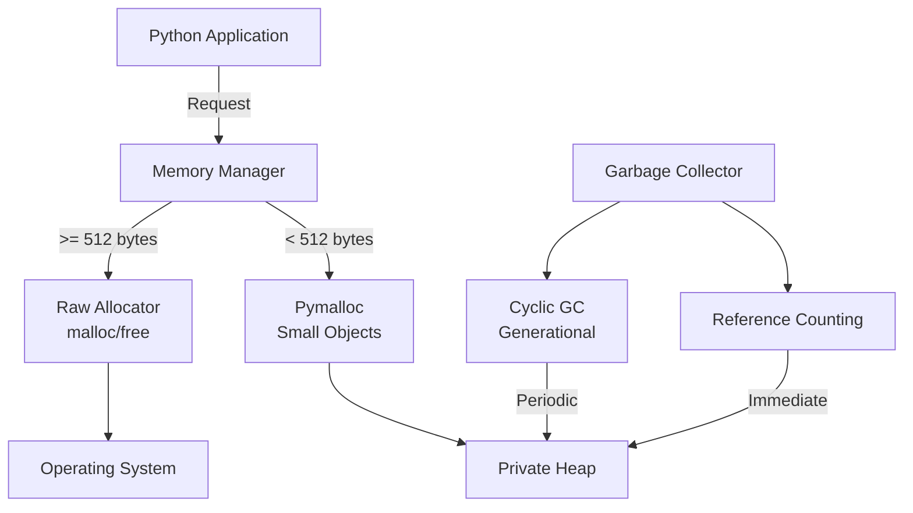
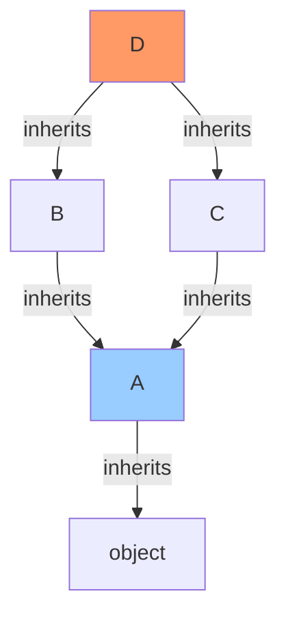

# Python Interview Questions (100+ Deep Dive Q&A)

## 1. Core Language & Data Structures

<AccordionGroup>
<Accordion title="1. Python Memory Management (The 3 Pillars)">
**Answer**:

**What interviewers are really testing:** Whether you understand memory at a systems level or just write Python like a scripting language. Senior engineers who understand memory management write code that scales to production workloads without mysterious OOM kills at 3 AM.

1.  **Private Heap**: Where all objects/data live. Managed by Memory Manager. Python abstracts all heap management away from the developer -- you never call `malloc` directly. This is why you cannot control memory layout the way you can in C/Rust.
2.  **Raw Memory Allocator**: Interaction with OS (`malloc`). Used for objects >= 512 bytes. When Python needs large chunks, it goes straight to the OS allocator.
3.  **Object-Specific Allocators**: Pymalloc (for small objects &lt; 512 bytes). Python pre-allocates arenas of 256KB, divided into 4KB pools, further divided into fixed-size blocks. This dramatically reduces fragmentation and `malloc` overhead for the millions of tiny objects (ints, short strings) a typical Python program creates.

**Garbage Collection**: Reference Counting (Primary) + Cyclic GC (Secondary).
- **Reference Counting** is immediate -- the moment refcount hits 0, memory is freed. This is why Python's memory behavior is more predictable than Java's GC pauses.
- **Cyclic GC** uses a generational approach (3 generations). New objects start in gen0. Objects that survive a collection get promoted. Gen2 collections are expensive and infrequent. You can tune thresholds with `gc.set_threshold(700, 10, 10)`.

**Real-world gotcha**: In production, the biggest memory issue is not cycles -- it is **memory fragmentation**. CPython's allocator rarely returns memory to the OS. A spike that allocates 2GB will keep that 2GB resident even after objects are freed. This is why long-running Python services (Celery workers, Django with gunicorn) often use `--max-requests` to periodically restart workers.


```mermaid
graph TD
    App[Python Application]
    MemMgr[Memory Manager]
    Pymalloc[Pymalloc<br/>Small Objects]
    RawAlloc[Raw Allocator<br/>malloc/free]
    Heap[Private Heap]
    OS[Operating System]
    
    App -->|Request| MemMgr
    MemMgr -->|< 512 bytes| Pymalloc
    MemMgr -->|>= 512 bytes| RawAlloc
    Pymalloc --> Heap
    RawAlloc --> OS
    
    GC[Garbage Collector]
    RefCount[Reference Counting]
    CyclicGC[Cyclic GC<br/>Generational]
    
    GC --> RefCount
    GC --> CyclicGC
    RefCount -->|Immediate| Heap
    CyclicGC -->|Periodic| Heap
```

**Reference Counting Example**:
```python
import sys

a = []  # refcount = 1
b = a   # refcount = 2
c = a   # refcount = 3

print(sys.getrefcount(a))  # 4 (includes temporary reference in getrefcount)

del b   # refcount = 2
del c   # refcount = 1
del a   # refcount = 0 -> IMMEDIATELY freed
```

**Cyclic GC (Handles Circular References)**:
```python
import gc

class Node:
    def __init__(self):
        self.ref = None

# Create circular reference
a = Node()
b = Node()
a.ref = b
b.ref = a  # Circular!

del a
del b
# Reference counting can't free these (refcount never hits 0)
# Cyclic GC will detect and collect them

gc.collect()  # Force collection
print(gc.get_count())  # (generation0, generation1, generation2)
```

**Memory Leak Prevention**:
```python
# BAD: Circular reference with __del__
class BadClass:
    def __del__(self):
        pass  # Prevents GC from collecting cycles!

# GOOD: Use weakref for circular references
import weakref

class GoodClass:
    def __init__(self):
        self.ref = None  # Use weakref.ref() for circular refs
```

**Red flag answer:** "Python handles memory automatically so I don't need to think about it." This shows a candidate who has never debugged a production memory issue. Every senior Python developer has war stories about memory.

**Follow-up:**
1. "Your Celery worker's memory grows from 200MB to 4GB over 12 hours but never shrinks. gc.collect() doesn't help. What's happening?" (Tests understanding of arena fragmentation vs actual leaks.)
2. "When would you disable the cyclic GC entirely, and what's the risk?" (Instagram famously disabled GC in production to avoid copy-on-write overhead in forked processes, saving ~10% memory across their fleet.)
3. "How does Python's memory model differ from Java's, and what are the practical consequences for long-running services?"
</Accordion>


<Accordion title="2. List vs Tuple vs Set vs Dictionary — When Each Wins">
**Answer**:

**What interviewers are really testing:** Not whether you can recite the table, but whether you pick the right data structure for a given problem in production code. The choice between list and set for a membership check is the difference between O(n) and O(1) -- at 10M elements, that is the difference between 10 seconds and 10 microseconds.

| Type | Mutable | Ordered | Allow Duplicates | Lookup Cost | Memory |
| :--- | :--- | :--- | :--- | :--- | :--- |
| **List** | Yes | Yes | Yes | O(n) | Contiguous array of pointers |
| **Tuple** | No | Yes | Yes | O(n) | Smaller than list (no over-allocation) |
| **Set** | Yes | No | No | O(1) avg | Hash table, ~3-4x memory of list |
| **Dict** | Yes | Yes (3.7+) | Keys: No | O(1) avg | Compact dict since 3.6, surprisingly memory-efficient |

**Deep internals that matter:**
- **Lists** over-allocate by ~12.5% to amortize `append()` to O(1). A list of 1M elements uses ~8MB (64-bit pointers) but the actual objects pointed to use far more.
- **Tuples** are immutable, so CPython caches small tuples (length 0-20) for reuse. Creating `(1, 2, 3)` repeatedly may return the same object. Tuples are also valid as dict keys and set members because they are hashable (if their contents are hashable).
- **Sets** use open addressing with a hash table. Worst case degrades to O(n) on pathological hash collisions, but Python's hash randomization (PYTHONHASHSEED) mitigates this for strings since 3.3.
- **Dicts** since Python 3.6 use a compact representation: a dense array of entries + a sparse hash table of indices. This made dicts 20-25% smaller than Python 2 dicts and insertion-ordered as a side effect (guaranteed in 3.7+).

**Practical decision framework:**
- Need order + duplicates + index access? **List**
- Need immutable sequence (dict key, function return)? **Tuple**
- Need fast "is X in this collection?" membership tests? **Set**
- Need key-value mapping? **Dict**
- Need ordered unique elements? **`dict.fromkeys(items)`** (preserves insertion order, deduplicates)

**Red flag answer:** Only reciting the table without explaining *when* to pick each one, or not knowing that dict is ordered in 3.7+.

**Follow-up:**
1. "You have a list of 50M user IDs and need to check if incoming request IDs are in that list. What structure do you use and what's the memory impact?" (Set wins on speed but uses ~3-4x memory of a sorted list + bisect approach.)
2. "Why can't you use a list as a dictionary key, and what would you use instead?"
3. "When would a `collections.deque` be better than a list, and why?"
</Accordion>

<Accordion title="3. `__init__` vs `__new__` — Object Creation Deep Dive">
**Answer**:

**What interviewers are really testing:** Whether you understand Python's two-phase object creation, and whether you have ever needed to customize allocation (singletons, immutable types, ORMs).

*   `__new__`: The **Allocation** phase. It is a static method (though you do not explicitly declare it). Receives the class as first argument. Responsible for creating and returning the instance. This is where memory is actually allocated.
*   `__init__`: The **Initialization** phase. Instance method that receives the already-created instance. Sets attributes on it. Does NOT return anything.

**Flow**: `Class()` call -> `type.__call__` -> `__new__(cls)` -> creates instance -> `__init__(instance)` -> sets attributes -> returns instance.

**When you actually override `__new__`:**
1. **Singletons**: Return the cached instance instead of creating a new one.
2. **Immutable types**: `int`, `str`, `tuple` subclasses must be customized in `__new__` because by the time `__init__` runs, the object is already frozen.
3. **Metaclass patterns**: ORMs like Django and SQLAlchemy use `__new__` in metaclasses to intercept class creation and register models.

```python
class Singleton:
    _instance = None
    
    def __new__(cls, *args, **kwargs):
        if cls._instance is None:
            cls._instance = super().__new__(cls)
        return cls._instance
    
    def __init__(self, value):
        self.value = value  # WARNING: runs every time Singleton() is called!

s1 = Singleton(1)
s2 = Singleton(2)
print(s1 is s2)    # True
print(s1.value)    # 2 -- __init__ ran again and overwrote!
```

**The gotcha** most candidates miss: `__init__` runs every time you call `Class()`, even if `__new__` returns an existing instance. For a proper singleton, you need to guard `__init__` with a flag or move all setup into `__new__`.

**Red flag answer:** "I've never needed to override `__new__`" without being able to explain when you would. Or confusing `__new__` with `__init__`.

**Follow-up:**
1. "If `__new__` returns an instance of a *different* class, does `__init__` still run?" (No. `__init__` only runs if `__new__` returns an instance of the original class.)
2. "How does this relate to how Django's Model metaclass works?"
3. "What happens if `__new__` returns `None`?"
</Accordion>

<Accordion title="4. MRO (Method Resolution Order) — The Diamond Problem">
**Answer**:

**What interviewers are really testing:** Whether you understand multiple inheritance well enough to use it safely (or argue convincingly for avoiding it). Python is one of the few mainstream languages that supports MI, and the MRO is the mechanism that makes it work without ambiguity.

**C3 Linearization** is the algorithm Python uses. It guarantees:
1. Subclasses are checked before parents (children first).
2. The order of parents in the class definition is preserved (left-to-right).
3. A parent class appears only once in the MRO.

`ClassName.mro()` or `help(ClassName)` shows the order.

**Diamond Problem Example**:
```python
class A:
    def method(self):
        print("A")

class B(A):
    def method(self):
        print("B")

class C(A):
    def method(self):
        print("C")

class D(B, C):  # Diamond inheritance!
    pass

# Which method() gets called?
d = D()
d.method()  # "B" (follows MRO)

print(D.mro())
# [D, B, C, A, object]
# Left-to-right, depth-first, but respecting order
```


```mermaid
graph TD
    Object[object]
    A[A]
    B[B]
    C[C]
    D[D]
    
    D -->|inherits| B
    D -->|inherits| C
    B -->|inherits| A
    C -->|inherits| A
    A -->|inherits| Object
    
    style D fill:#f96
    style A fill:#9cf
```

**MRO Resolution**: D -> B -> C -> A -> object

**Why `super()` matters here:** `super()` does not simply call the parent class -- it calls the *next class in the MRO*. This is crucial for cooperative multiple inheritance:

```python
class A:
    def method(self):
        print("A")

class B(A):
    def method(self):
        print("B")
        super().method()  # Calls C.method, NOT A.method!

class C(A):
    def method(self):
        print("C")
        super().method()

class D(B, C):
    def method(self):
        print("D")
        super().method()

D().method()  # D -> B -> C -> A (follows MRO chain)
```

**Real-world usage:** Django's class-based views rely heavily on mixins and cooperative MI. `LoginRequiredMixin` + `ListView` + `FormMixin` all chain via `super()` through the MRO. Understanding this is essential for debugging why a view is not behaving as expected.

**Red flag answer:** "super() calls the parent class" -- this shows a candidate who has only used single inheritance. Or not knowing that Python uses C3 linearization.

**Follow-up:**
1. "Can you construct a class hierarchy where C3 linearization fails (raises TypeError)?" (Yes: `class X(A, B)` and `class Y(B, A)` then `class Z(X, Y)` creates an inconsistent MRO.)
2. "When would you prefer composition over multiple inheritance, and why?" (Most of the time -- MI creates tight coupling and makes the codebase harder to reason about.)
3. "How does Django's CBV mixin pattern depend on MRO, and what breaks if you get the mixin order wrong?"
</Accordion>

<Accordion title="5. Decorators — From Basics to Production Patterns">
**Answer**:

**What interviewers are really testing:** Decorators reveal whether a candidate truly understands closures, first-class functions, and higher-order programming. They are also the gateway to understanding frameworks (Flask routes, pytest fixtures, Django `@login_required`).

A decorator is a function that takes a function and returns a modified function. The `@` syntax is syntactic sugar.

```python
def log(func):
    def wrapper(*args):
        print("Call")
        return func(*args)
    return wrapper

@log
def add(): pass
# Equivalent to: add = log(add)
```

**Decorator with Arguments (Factory Pattern)** -- three levels of nesting:
```python
def repeat(times):
    def decorator(func):
        def wrapper(*args, **kwargs):
            for _ in range(times):
                result = func(*args, **kwargs)
            return result
        return wrapper
    return decorator

@repeat(times=3)
def greet(name):
    print(f"Hello {name}")

greet("Alice")  # Prints 3 times
```

**Class Decorator** -- useful for singletons, registries, and memoization:
```python
def singleton(cls):
    instances = {}
    def get_instance(*args, **kwargs):
        if cls not in instances:
            instances[cls] = cls(*args, **kwargs)
        return instances[cls]
    return get_instance

@singleton
class Database:
    pass

db1 = Database()
db2 = Database()
assert db1 is db2  # Same instance!
```

**Preserving Metadata** -- this is the mark of a professional:
```python
from functools import wraps

def my_decorator(func):
    @wraps(func)  # Preserves __name__, __doc__, __module__, __qualname__, __dict__
    def wrapper(*args, **kwargs):
        return func(*args, **kwargs)
    return wrapper
```

Without `@wraps`, debugging becomes a nightmare: stack traces show "wrapper" everywhere instead of actual function names. Sphinx documentation breaks. Introspection-based frameworks fail.

**Production patterns:**
- **Retry decorators**: `@retry(max_attempts=3, backoff=2.0)` for flaky network calls
- **Rate limiting**: `@rate_limit(calls=100, period=60)` using a token bucket internally
- **Caching**: `@functools.lru_cache(maxsize=1024)` -- but beware, this holds strong references to arguments and can cause memory leaks with large objects
- **Auth**: Flask's `@login_required`, which redirects unauthenticated users

**Red flag answer:** Cannot explain the three-level nesting for decorators with arguments. Does not mention `@wraps`. Cannot explain that decorators are just closures.

**Follow-up:**
1. "How would you write a decorator that works on both sync and async functions?" (You need to inspect `asyncio.iscoroutinefunction(func)` and return an async wrapper accordingly.)
2. "What happens to `@lru_cache` in a multi-threaded environment? Is it thread-safe?" (Yes, since Python 3.2, `lru_cache` is thread-safe internally. But the cached function itself must be thread-safe.)
3. "How would you write a decorator that logs execution time and sends it to a metrics service like Datadog?"
</Accordion>

<Accordion title="6. Generators vs Iterators — Lazy Evaluation in Practice">
**Answer**:

**What interviewers are really testing:** Whether you reach for generators when processing large datasets, or whether you load everything into memory. This is a proxy for "have you worked with data at scale?"

All Generators are Iterators, but not vice versa.
*   **Iterator**: Class implementing `__next__` and `__iter__`. State managed manually. More boilerplate but more control (can implement `__len__`, custom `send()`, etc.).
*   **Generator**: Function with `yield`. State managed automatically by Python (frame object suspended on the stack). Pauses execution at each `yield`, resumes on next `next()` call. Extremely memory efficient.

**Why generators matter in production:**
- Processing a 50GB log file? Generator reads line by line: ~0 MB overhead vs 50 GB for `readlines()`.
- ETL pipeline streaming 100M database rows? Generator yields batches instead of materializing everything.
- Real-time event processing? Generator pipelines chain transformations lazily.

```python
# Generator pipeline for processing a large CSV
def read_lines(filepath):
    with open(filepath) as f:
        for line in f:
            yield line.strip()

def parse_csv(lines):
    for line in lines:
        yield line.split(',')

def filter_active(rows):
    for row in rows:
        if row[2] == 'active':
            yield row

# Entire pipeline processes ONE row at a time -- constant memory
pipeline = filter_active(parse_csv(read_lines('users.csv')))
for row in pipeline:
    process(row)
```

**`yield from`** -- delegates to a sub-generator, essential for recursive generators:
```python
def flatten(nested):
    for item in nested:
        if isinstance(item, list):
            yield from flatten(item)  # Delegates to sub-generator
        else:
            yield item
```

**Generator `.send()` and `.throw()`** -- for coroutine-style patterns (pre-asyncio):
```python
def accumulator():
    total = 0
    while True:
        value = yield total
        if value is None:
            break
        total += value

gen = accumulator()
next(gen)        # Prime the generator -> 0
gen.send(10)     # -> 10
gen.send(20)     # -> 30
```

**Red flag answer:** "Generators are just like lists but lazy." This misses the critical point about memory efficiency and does not demonstrate understanding of `yield` as a suspension mechanism.

**Follow-up:**
1. "What's the memory difference between `[x**2 for x in range(10_000_000)]` and `(x**2 for x in range(10_000_000))`?" (List: ~80MB. Generator: ~120 bytes. The generator stores only the frame state.)
2. "When would you NOT want to use a generator?" (When you need random access, length, or to iterate multiple times. Generators are single-pass.)
3. "How do generator pipelines compare to tools like Apache Beam or Spark for data processing?"
</Accordion>

<Accordion title="7. Context Managers — Resource Management Done Right">
**Answer**:

**What interviewers are really testing:** Whether you handle resource cleanup properly or leave file handles, DB connections, and locks dangling in production.

Ensures resource cleanup (Files, Locks, DB connections, Network sockets).
Implements `__enter__` (setup/acquire) and `__exit__` (teardown/release).

**Exception Handling**: `__exit__` receives exception details (`exc_type`, `exc_val`, `exc_tb`). Return `True` to suppress the exception, `False` (or `None`) to propagate it.

**Class-based context manager:**
```python
class DatabaseConnection:
    def __enter__(self):
        self.conn = psycopg2.connect(DSN)
        return self.conn
    
    def __exit__(self, exc_type, exc_val, exc_tb):
        if exc_type is not None:
            self.conn.rollback()
        else:
            self.conn.commit()
        self.conn.close()
        return False  # Don't suppress exceptions
```

**`contextlib` shortcut** -- the Pythonic way for simple cases:
```python
from contextlib import contextmanager

@contextmanager
def timer(label):
    start = time.perf_counter()
    try:
        yield  # Code inside `with` block runs here
    finally:
        elapsed = time.perf_counter() - start
        print(f"{label}: {elapsed:.3f}s")

with timer("query"):
    db.execute("SELECT * FROM users")
```

**Production patterns:**
- **Temporary directory cleanup**: `with tempfile.TemporaryDirectory() as tmpdir:`
- **Database transactions**: `with db.begin() as txn:`
- **Lock acquisition**: `with threading.Lock():`
- **Suppressing specific exceptions**: `with contextlib.suppress(FileNotFoundError):`

**Red flag answer:** Only knows the `with open()` pattern. Cannot explain `__exit__` parameters or exception suppression.

**Follow-up:**
1. "What happens if `__enter__` itself raises an exception? Does `__exit__` still run?" (No. `__exit__` only runs if `__enter__` completed successfully.)
2. "How would you write a context manager that acquires multiple locks in a consistent order to avoid deadlocks?"
3. "Explain `contextlib.ExitStack` and when you'd use it." (For managing a dynamic number of context managers -- e.g., opening N files where N is not known at write-time.)
</Accordion>

<Accordion title="8. Lambdas — Anonymous Functions and Their Limits">
**Answer**:

**What interviewers are really testing:** Whether you understand lambdas as a tool with a specific (narrow) use case, or whether you overuse them and produce unreadable code.

Anonymous one-line functions. `lambda x: x * 2`.

**Key limitations:**
- No statements (no assignment, no `while`, no `if/else` blocks -- only ternary `a if cond else b`)
- Only a single expression
- No type annotations
- Harder to debug (stack traces show `<lambda>` instead of a name)

**When to use:** Short, throwaway key functions for `sort`, `map`, `filter`, `max`, `min`.

**When NOT to use:** If the lambda is more than ~40 characters, use a named function. Named functions are self-documenting, testable, and produce better stack traces.

```python
# GOOD: Short, clear intent
users.sort(key=lambda u: u.last_login)
max(products, key=lambda p: p.price)

# BAD: Complex lambda that should be a named function
process = lambda x: (x.strip().lower().replace('-', '_') if x else 'default')
# Better:
def normalize_key(x):
    """Normalize input string to snake_case key."""
    if not x:
        return 'default'
    return x.strip().lower().replace('-', '_')
```

**The classic closure trap:**
```python
# Bug: all lambdas capture the SAME variable `i`
funcs = [lambda: i for i in range(5)]
print([f() for f in funcs])  # [4, 4, 4, 4, 4] -- NOT [0, 1, 2, 3, 4]

# Fix: capture by default argument
funcs = [lambda i=i: i for i in range(5)]
print([f() for f in funcs])  # [0, 1, 2, 3, 4]
```

**Red flag answer:** Using lambdas for everything because "it's more Pythonic." It is not. PEP 8 explicitly recommends named functions over lambdas assigned to variables.

**Follow-up:**
1. "Why does the closure trap happen? Explain the scoping." (Lambdas close over the *variable*, not the *value*. By the time the lambda runs, `i` is 4.)
2. "In what scenario would `functools.partial` be a better choice than a lambda?"
3. "How do lambdas interact with Python's `pickle` module?" (Lambdas cannot be pickled because they have no qualified name. This matters for multiprocessing.)
</Accordion>

<Accordion title="9. `*args` and `**kwargs` — Flexible Function Signatures">
**Answer**:

**What interviewers are really testing:** Whether you can design flexible APIs and understand Python's argument passing mechanics at a deep level.

Variable length arguments:
*   `*args`: Collects extra positional arguments into a tuple.
*   `**kwargs`: Collects extra keyword arguments into a dictionary.
**Unpacking**: `func(*my_list)` expands list into positional args. `func(**my_dict)` expands dict into keyword args.

**The full argument order (must be memorized):**
```python
def f(positional, /, normal, *, keyword_only, **kwargs):
    pass
# positional: positional-only (Python 3.8+, before /)
# normal: positional or keyword
# keyword_only: keyword-only (after *)
# **kwargs: remaining keyword arguments
```

**Real-world patterns:**
```python
# 1. Decorator pass-through (the most common use)
def decorator(func):
    @wraps(func)
    def wrapper(*args, **kwargs):
        # Can inspect/modify args before passing through
        return func(*args, **kwargs)
    return wrapper

# 2. Configuration merging
def create_connection(host, port, **options):
    defaults = {'timeout': 30, 'retry': 3, 'ssl': True}
    config = {**defaults, **options}  # options override defaults
    return connect(host, port, **config)

# 3. Forwarding to parent class
class CustomWidget(BaseWidget):
    def __init__(self, color, *args, **kwargs):
        self.color = color
        super().__init__(*args, **kwargs)  # Forward everything else
```

**Red flag answer:** Cannot explain the difference between `*` in function definition (packing) vs function call (unpacking). Does not know about keyword-only arguments.

**Follow-up:**
1. "What's the difference between `def f(a, b)` and `def f(a, /, b)` in Python 3.8+?" (The `/` makes `a` positional-only, preventing `f(a=1, b=2)`.)
2. "Can you unpack a dictionary into another dictionary? What happens with key conflicts?" (`{**d1, **d2}` -- later dict wins on conflicts.)
3. "Why is `**kwargs` useful for maintaining backward compatibility in library APIs?"
</Accordion>

<Accordion title="10. Shallow vs Deep Copy — The Trap That Bites Everyone">
**Answer**:

**What interviewers are really testing:** Whether you understand Python's object reference model. This question catches people who think `=` copies data.

```python
import copy

l1 = [[1, 2], 3, 4]
l2 = copy.copy(l1)    # Shallow: l2[0] POINTS TO same inner list as l1[0]
l3 = copy.deepcopy(l1)# Deep: l3[0] is a completely independent NEW list

l1[0].append(99)
print(l2[0])  # [1, 2, 99] -- AFFECTED by mutation!
print(l3[0])  # [1, 2]     -- NOT affected
```

**Three levels of "copying":**
1. **Assignment (`b = a`)**: No copy at all. Same object, same reference. `b is a` is True.
2. **Shallow copy (`copy.copy(a)` or `a[:]` or `list(a)`)**: New outer container, but inner objects are still shared references. Fine for flat structures.
3. **Deep copy (`copy.deepcopy(a)`)**: Recursively copies everything. New objects all the way down. Handles circular references via a memo dict.

**Performance consideration:** `deepcopy` is slow -- it traverses the entire object graph. For a nested dict with 1M entries, it can take seconds. In hot paths, consider structural sharing (immutable data structures) or explicit copy logic.

**Custom copy behavior:**
```python
class Connection:
    def __copy__(self):
        # Shallow copy: share the socket, copy config
        new = Connection.__new__(Connection)
        new.config = self.config.copy()
        new.socket = self.socket  # Shared!
        return new
    
    def __deepcopy__(self, memo):
        # Deep copy: new socket, new config
        new = Connection.__new__(Connection)
        new.config = copy.deepcopy(self.config, memo)
        new.socket = create_new_socket()  # Fresh!
        return new
```

**Red flag answer:** Not knowing that `b = a` does not copy anything in Python. Or thinking shallow copy is "the same as deep copy for simple objects" without qualifying what "simple" means.

**Follow-up:**
1. "A junior developer reports that modifying a function's default argument affects subsequent calls. What's happening?" (Mutable default argument trap -- the default list/dict is shared across calls.)
2. "When would `deepcopy` cause an infinite loop, and how does Python prevent it?" (Circular references. `deepcopy` uses a `memo` dictionary to track already-copied objects.)
3. "How does the copy behavior interact with `__slots__`?" (Objects with `__slots__` do not have `__dict__`, so `copy.copy` uses `__getstate__`/`__setstate__` or slot iteration.)
</Accordion>
</AccordionGroup>

## 2. Advanced OOP

<AccordionGroup>
<Accordion title="11. Encapsulation (Public, Protected, Private) — Python's Honor System">
**Answer**:

**What interviewers are really testing:** Whether you understand that Python's access control is convention-based and whether you know *why* that design choice was made (and its consequences).

*   `name`: Public. Accessible from anywhere. The default.
*   `_name`: Protected (Convention only). "Internal use -- don't touch this unless you know what you're doing." Not enforced by the interpreter.
*   `__name`: Private (Name Mangling). Becomes `_ClassName__name` internally. Not truly private -- just harder to accidentally override in subclasses. The purpose is to prevent *accidental* name collisions in inheritance, NOT to enforce encapsulation.

**Python's philosophy**: "We are all consenting adults here." The language trusts developers to follow conventions rather than enforcing access control at runtime (unlike Java's `private`).

```python
class BankAccount:
    def __init__(self):
        self.holder = "Alice"       # Public
        self._balance = 1000        # Protected by convention
        self.__pin = 1234           # Name-mangled to _BankAccount__pin

acc = BankAccount()
print(acc.holder)              # Fine
print(acc._balance)            # Works (just a warning to other devs)
print(acc._BankAccount__pin)   # Works! Name mangling is NOT security
```

**When name mangling actually helps:**
```python
class Base:
    def __init__(self):
        self.__id = 1  # Becomes _Base__id

class Child(Base):
    def __init__(self):
        super().__init__()
        self.__id = 2  # Becomes _Child__id -- no collision!
```

**Red flag answer:** "Double underscore makes it private and inaccessible." This is factually wrong and shows the candidate learned from a superficial tutorial.

**Follow-up:**
1. "If Python doesn't enforce access control, how do you prevent misuse of internal APIs in a large codebase?" (Linting rules, `__all__` exports, documentation, code review, type checkers.)
2. "How does `__all__` interact with `from module import *`?"
3. "Compare Python's approach to encapsulation with TypeScript's `private` keyword. Which is more useful in practice?"
</Accordion>

<Accordion title="12. Abstract Base Classes (ABC) — Contracts in Python">
**Answer**:

**What interviewers are really testing:** Whether you understand interface-driven design and when enforcing contracts matters more than duck typing.

```python
from abc import ABC, abstractmethod

class PaymentProcessor(ABC):
    @abstractmethod
    def charge(self, amount: float) -> bool:
        """Process a payment. Returns True on success."""
        pass
    
    @abstractmethod
    def refund(self, transaction_id: str) -> bool:
        pass
    
    def validate_amount(self, amount: float) -> bool:
        """Concrete method -- shared logic all processors use."""
        return amount > 0 and amount < 100_000

class StripeProcessor(PaymentProcessor):
    def charge(self, amount):
        # Must implement or TypeError on instantiation
        return stripe.Charge.create(amount=amount)
    
    def refund(self, transaction_id):
        return stripe.Refund.create(charge=transaction_id)
```

Cannot instantiate `PaymentProcessor` directly. Subclass MUST implement all `@abstractmethod`s or you get `TypeError` at instantiation time (not at call time -- fail fast).

**ABCs vs Protocols:**
- **ABCs (nominal typing)**: Subclass must explicitly inherit from the ABC. Checked at instantiation.
- **Protocols (structural typing, Python 3.8+)**: Any class with the right methods satisfies the protocol. No inheritance needed. Checked by type checkers like mypy, not at runtime.

```python
from typing import Protocol

class Drawable(Protocol):
    def draw(self) -> None: ...

# No inheritance needed -- if it has draw(), it's Drawable
class Circle:
    def draw(self) -> None:
        print("drawing circle")

def render(shape: Drawable):  # mypy checks this
    shape.draw()
```

**When to use ABCs vs Protocols:** Use ABCs when you want runtime enforcement (plugin systems, payment processors). Use Protocols when you want flexibility and duck typing with type safety (library APIs, testing).

**Red flag answer:** Cannot articulate when to use ABCs vs just duck typing. Or does not know about Protocols.

**Follow-up:**
1. "Can you have abstract properties? Abstract class methods?" (Yes to both: `@property` + `@abstractmethod` combined, `@classmethod` + `@abstractmethod` combined.)
2. "How does `collections.abc` use ABCs and why would you inherit from `Mapping` instead of `dict`?"
3. "What's the `__subclasshook__` method and when would you implement it?"
</Accordion>

<Accordion title="13. `__slots__` Optimization — Memory at Scale">
**Answer**:

**What interviewers are really testing:** Whether you have worked with enough objects in memory to care about per-instance overhead. This is a clear signal of production experience at scale.

By default, objects store attributes in a `__dict__` (a hash table). This uses ~104 bytes on 64-bit Python just for an empty dict, plus the space for key-value pairs.

`__slots__ = ['x', 'y']` tells Python: "This class ONLY has x and y." Python allocates a fixed-size array of pointers instead of a dict.

**Memory savings are dramatic at scale:**
```python
import sys

class WithDict:
    def __init__(self, x, y):
        self.x = x
        self.y = y

class WithSlots:
    __slots__ = ['x', 'y']
    def __init__(self, x, y):
        self.x = x
        self.y = y

d = WithDict(1, 2)
s = WithSlots(1, 2)

# sys.getsizeof does not include __dict__ contents
# Total with dict: ~152 bytes per instance
# Total with slots: ~56 bytes per instance
# At 10M objects: 1.52 GB vs 560 MB -- saves ~1 GB of RAM
```

**Trade-offs:**
- Cannot add arbitrary attributes at runtime (no `__dict__`)
- Cannot use `__weakref__` unless you include it in `__slots__`
- Inheritance gets tricky: if parent uses `__dict__` and child uses `__slots__`, you get BOTH (no savings)
- Breaks pickling unless you implement `__getstate__`/`__setstate__`

**Red flag answer:** Knowing `__slots__` exists but not being able to quantify the memory savings or explain the trade-offs.

**Follow-up:**
1. "What happens if you define `__slots__` in a child class but not the parent?" (The child still has `__dict__` from the parent. You need `__slots__` in every class in the hierarchy.)
2. "When would you choose `__slots__` over a `namedtuple` or `dataclass(slots=True)`?" (Python 3.10+ `@dataclass(slots=True)` gives you slots + all the dataclass conveniences. Prefer it.)
3. "Have you used `__slots__` in production? What was the context?" (Good answer: ORM model instances, graph nodes, particle simulations -- anywhere you have millions of uniform objects.)
</Accordion>

<Accordion title="14. Property Decorators — The Python Way to Do Getters/Setters">
**Answer**:

**What interviewers are really testing:** Whether you design clean APIs that look like attribute access but have validation/computation behind them.

```python
class User:
    def __init__(self, email):
        self._email = None
        self.email = email  # Triggers the setter with validation!
    
    @property
    def email(self):
        return self._email
    
    @email.setter
    def email(self, value):
        if '@' not in value:
            raise ValueError(f"Invalid email: {value}")
        self._email = value.lower().strip()
    
    @email.deleter
    def email(self):
        self._email = None
```

Access as `obj.email` -- looks like an attribute, runs like a method. The caller does not need to know about the validation logic.

**When properties shine:**
1. **Adding validation to an existing attribute** without changing the API (backward compatible).
2. **Computed attributes**: `@property def full_name(self)` that derives from first + last.
3. **Lazy loading**: Expensive computation deferred until first access.
4. **Deprecation**: Property getter that logs a warning before returning the old attribute.

**Gotcha: properties and inheritance:**
```python
class Base:
    @property
    def value(self):
        return self._value

class Child(Base):
    @Base.value.setter  # Must reference Base.value explicitly!
    def value(self, val):
        self._value = val
```

**Red flag answer:** Writing explicit `get_email()` / `set_email()` methods in Python. That is Java style, not Pythonic.

**Follow-up:**
1. "What's the performance overhead of a property vs direct attribute access?" (~2-5x slower due to descriptor protocol overhead. Usually negligible, but matters in tight loops over millions of iterations.)
2. "How are properties implemented under the hood?" (They are descriptors -- classes with `__get__`, `__set__`, `__delete__` methods.)
3. "How would you implement a cached property that computes once and then behaves like a normal attribute?" (`functools.cached_property` in 3.8+ -- it replaces itself on the instance dict after first computation.)
</Accordion>

<Accordion title="15. Duck Typing vs Static Typing — The Python Typing Spectrum">
**Answer**:

**What interviewers are really testing:** Whether you have opinions (backed by experience) on when to add type hints and when duck typing is sufficient.

*   **Duck Typing**: "If it has `quack()`, it is a Duck." Python checks nothing at definition time. Errors appear at runtime when a method does not exist. Maximum flexibility, minimum safety.
*   **Static Type Hints**: `def quack(d: Duck) -> None:`. Checked by tools like mypy, pyright, or pytype at CI time. No runtime enforcement by default (unless you use libraries like `beartype` or Pydantic).

**The spectrum in practice:**
- **No types**: Quick scripts, prototypes, exploratory data analysis. Fine for &lt;500 lines.
- **Partial types**: Type public API surfaces (function signatures, class interfaces). Skip internals. Best ROI for most projects.
- **Full types**: Large codebases (1M+ lines), many contributors, critical infrastructure. Google, Dropbox, Instagram all adopted gradual typing.

```python
# Modern Python typing (3.10+)
def process(items: list[str | int]) -> dict[str, int]:
    result: dict[str, int] = {}
    for item in items:
        match item:
            case str() as s:
                result[s] = len(s)
            case int() as n:
                result[str(n)] = n
    return result
```

**Protocols bridge duck typing and static typing:**
```python
from typing import Protocol

class Renderable(Protocol):
    def render(self) -> str: ...

# Any class with render() -> str satisfies this, no inheritance needed
```

**Red flag answer:** "I never use type hints because Python is dynamically typed." This is a red flag for any senior role. Or conversely, "Everything must be typed" without understanding the cost-benefit.

**Follow-up:**
1. "How does mypy's `--strict` mode differ from default, and when would you turn it on?" (Strict disallows implicit `Any`, requires return types, etc. Turn it on for new projects; too expensive to retrofit onto legacy code.)
2. "What's the difference between `typing.Protocol` and `abc.ABC`?" (Protocol is structural/duck typing with type checker support. ABC is nominal typing with runtime enforcement.)
3. "Have you seen type hints catch real bugs that tests missed?"
</Accordion>

<Accordion title="16. Composition vs Inheritance — The Design Principle That Matters Most">
**Answer**:

**What interviewers are really testing:** Design maturity. Junior developers reach for inheritance because it feels natural. Senior developers reach for composition because they have been burned by deep hierarchies.

*   **Inheritance**: "Is-A". `Dog` is an `Animal`. Creates a tight coupling between parent and child. Changes to the parent ripple through all descendants (Fragile Base Class problem).
*   **Composition**: "Has-A". `Car` has an `Engine`. Each component is independent and swappable. Changes are localized.

**Why composition wins in most cases:**

```python
# BAD: Deep inheritance hierarchy
class Animal:
    def move(self): ...
class FlyingAnimal(Animal):
    def fly(self): ...
class SwimmingAnimal(Animal):
    def swim(self): ...
class Duck(FlyingAnimal, SwimmingAnimal):  # Diamond! Fragile!
    pass

# GOOD: Composition with strategy pattern
class Animal:
    def __init__(self, movement_strategy, sound_strategy):
        self.movement = movement_strategy
        self.sound = sound_strategy

duck = Animal(
    movement_strategy=FlyAndSwim(),
    sound_strategy=Quack()
)
```

**When inheritance IS appropriate:**
1. True "is-a" relationships where the taxonomy is stable (rarely changes).
2. Framework extension points designed for inheritance (Django models, Flask views).
3. Abstract base classes defining a contract (abc.ABC).

**Quantified rule of thumb**: If your inheritance tree is deeper than 3 levels, refactor to composition. If you find yourself using `isinstance()` checks frequently, your design is wrong.

**Red flag answer:** "Always use inheritance because it enables code reuse." Code reuse through inheritance is the most abused pattern in OOP.

**Follow-up:**
1. "Give me an example of a real codebase where deep inheritance caused problems." (Django's old generic views were notoriously hard to customize because of the deep CBV hierarchy. Many teams switched to function-based views for clarity.)
2. "How does the Strategy pattern relate to composition?"
3. "What is the Liskov Substitution Principle and how does it guide the inheritance vs composition decision?"
</Accordion>

<Accordion title="17. Method Overloading in Python — It Doesn't Exist (But Here's What Does)">
**Answer**:

**What interviewers are really testing:** Whether you understand Python's dynamic dispatch model vs static dispatch in languages like Java/C++.

Python does **NOT** support traditional overloading (multiple methods with the same name but different signatures). Defining a method with the same name simply overwrites the previous one. The last definition wins.

**Why?** Python resolves methods by name at runtime, not by signature. The method is just a name in the class's `__dict__`.

**Solutions:**
1. **Default arguments**: `def process(data, format=None, validate=True)`
2. **`*args` / `**kwargs`**: Accept anything, dispatch internally
3. **`@functools.singledispatch`**: Type-based dispatch (Python 3.4+)
4. **`@typing.overload`**: For type checkers only (not runtime)

```python
from functools import singledispatch

@singledispatch
def process(data):
    raise NotImplementedError(f"Cannot process {type(data)}")

@process.register(str)
def _(data):
    return data.upper()

@process.register(list)
def _(data):
    return [process(item) for item in data]

@process.register(int)
def _(data):
    return data * 2

process("hello")  # "HELLO"
process(42)       # 84
process([1, 2])   # [2, 4]
```

**`@typing.overload` for type checker hints (no runtime effect):**
```python
from typing import overload

@overload
def get(key: str) -> str: ...
@overload
def get(key: int) -> int: ...

def get(key):  # Actual implementation
    return cache[key]
```

**Red flag answer:** "Just use if/elif on the type." This works but is not extensible. `singledispatch` allows third parties to register new types.

**Follow-up:**
1. "How does `singledispatch` differ from `singledispatchmethod` (Python 3.8+)?" (The method version works with class methods and respects `self`.)
2. "How would you implement multiple dispatch (dispatching on 2+ argument types)?" (Use libraries like `multipledispatch` or `plum`. Not in stdlib.)
3. "Why doesn't Python support overloading natively? What's the design philosophy behind this?"
</Accordion>

<Accordion title="18. Singletons — Three Ways and When You Should Not">
**Answer**:

**What interviewers are really testing:** Whether you understand the pattern AND its problems. Singletons are one of the most overused patterns.

Three implementation approaches:
1.  **Module-level**: The simplest. Python modules are singletons by nature (cached in `sys.modules`). Just put your instance at module level:
```python
# db.py
_connection = DatabaseConnection()

def get_connection():
    return _connection
```

2.  **`__new__` override**:
```python
class Singleton:
    _instance = None
    def __new__(cls):
        if cls._instance is None:
            cls._instance = super().__new__(cls)
        return cls._instance
```

3.  **Decorator** (see Q5).

**Why singletons are often an anti-pattern:**
- Global mutable state makes testing hard (tests share state, order-dependent).
- Hidden dependencies (functions use the singleton implicitly instead of receiving it as a parameter).
- Thread safety issues (double-checked locking needed in threaded code).

**What to use instead:** Dependency injection. Pass the shared resource explicitly. This makes testing trivial (inject a mock) and dependencies visible.

```python
# INSTEAD of a singleton DB:
def create_user(db: Database, user_data: dict):
    db.execute("INSERT INTO users ...")

# In tests: create_user(mock_db, test_data)
# In production: create_user(real_db, user_data)
```

**Red flag answer:** Enthusiastically explaining singleton implementations without mentioning the drawbacks or DI alternatives.

**Follow-up:**
1. "How would you make a singleton thread-safe?" (Use `threading.Lock()` in `__new__`, but better yet, use module-level initialization which is inherently thread-safe in Python due to the import lock.)
2. "How does Django's `settings` module work as a singleton?"
3. "If singletons are bad, why does Python's `logging` module use them?" (Because the logging hierarchy IS global state by nature -- you want one consistent config.)
</Accordion>

<Accordion title="19. Enum Class — Type-Safe Constants">
**Answer**:

**What interviewers are really testing:** Whether you use proper enums or string/int constants scattered across the codebase.

```python
from enum import Enum, auto, IntEnum

class Status(Enum):
    PENDING = auto()   # 1
    ACTIVE = auto()    # 2
    DISABLED = auto()  # 3

# Type-safe comparisons
status = Status.ACTIVE
status == Status.ACTIVE   # True
status == 2               # False! (not equal to int)
status == "ACTIVE"        # False! (not equal to string)

# Iteration
for s in Status:
    print(s.name, s.value)  # PENDING 1, ACTIVE 2, DISABLED 3
```

**`IntEnum` vs `Enum`:** `IntEnum` members compare equal to integers (`Status.ACTIVE == 2` is True). Use this only for backward compatibility with code that expects ints. Prefer `Enum` for new code.

**Production pattern -- Enum with methods:**
```python
class Color(Enum):
    RED = "#FF0000"
    GREEN = "#00FF00"
    BLUE = "#0000FF"
    
    @property
    def rgb_tuple(self):
        hex_val = self.value.lstrip('#')
        return tuple(int(hex_val[i:i+2], 16) for i in (0, 2, 4))

Color.RED.rgb_tuple  # (255, 0, 0)
```

**Red flag answer:** Using string constants like `STATUS_ACTIVE = "active"` everywhere instead of enums. Enums prevent typos (`Statsu.ACTIVE` raises AttributeError), enable IDE autocomplete, and make refactoring safe.

**Follow-up:**
1. "How do Enums interact with JSON serialization?" (They do not serialize by default. You need a custom encoder or use `.value`.)
2. "What's `@unique` and when would you use it?" (Ensures no two members have the same value. Good for catching copy-paste errors.)
3. "How would you store an Enum in a database column using SQLAlchemy?"
</Accordion>

<Accordion title="20. Dataclasses (3.7+) — Modern Python Data Containers">
**Answer**:

**What interviewers are really testing:** Whether you use modern Python features or still write boilerplate `__init__`/`__repr__`/`__eq__` by hand.

Boilerplate generator. Auto-generates `__init__`, `__repr__`, `__eq__`, and optionally `__hash__`, `__lt__`, etc.

```python
from dataclasses import dataclass, field

@dataclass(frozen=True)  # Immutable + hashable
class Point:
    x: float
    y: float

@dataclass
class User:
    name: str
    age: int
    tags: list = field(default_factory=list)  # MUST use field() for mutable defaults
    
    def __post_init__(self):
        if self.age < 0:
            raise ValueError("Age must be non-negative")
```

**Dataclass vs NamedTuple vs Pydantic:**
| Feature | `dataclass` | `NamedTuple` | `Pydantic BaseModel` |
| :--- | :--- | :--- | :--- |
| Mutable | Yes (default) | No | Yes |
| Validation | Manual (`__post_init__`) | None | Automatic + coercion |
| Performance | Fast | Fastest | Slower (validation overhead) |
| Serialization | Manual | `_asdict()` | `.model_dump()`, `.model_dump_json()` |
| Use case | Internal data | Simple immutable records | API request/response models |

**Python 3.10+ features:**
- `@dataclass(slots=True)` -- auto-generates `__slots__` for memory savings
- `@dataclass(kw_only=True)` -- all fields keyword-only (prevents positional arg confusion)
- `@dataclass(match_args=True)` -- enables structural pattern matching

**Red flag answer:** "I just use dictionaries for everything." Dicts have no structure, no IDE support, no validation. Dataclasses provide typed, self-documenting data containers.

**Follow-up:**
1. "What's the gotcha with mutable default values in dataclasses?" (Must use `field(default_factory=list)` instead of `tags: list = []` -- same mutable default trap as regular functions.)
2. "When would you choose Pydantic over dataclasses?" (When you need runtime validation, JSON serialization, or are building APIs with FastAPI.)
3. "How does `frozen=True` make a dataclass hashable and what are the performance implications?" (Frozen dataclasses implement `__hash__` based on all fields. But computing hash on every dict/set operation can be expensive for dataclasses with many fields.)
</Accordion>
</AccordionGroup>

## 3. Asyncio & Concurrency

<AccordionGroup>
<Accordion title="21. Threading vs Multiprocessing vs Asyncio — The Decision Framework">
**Answer**:

**What interviewers are really testing:** Whether you can correctly diagnose a workload as I/O-bound or CPU-bound and choose the appropriate concurrency model. Wrong choice means either no speedup or worse performance.

| Model | Mechanism | CPU Cores | Best For | Overhead |
| :--- | :--- | :--- | :--- | :--- |
| **Threading** | OS threads, shared memory | 1 (GIL) | I/O blocking (network, disk) | ~8MB stack per thread |
| **Multiprocessing** | OS processes, separate memory | All | CPU-heavy (number crunching) | Process spawn + IPC |
| **Asyncio** | Single thread, cooperative | 1 | Massive I/O (10K+ connections) | ~2KB per coroutine |

**Decision tree:**
1. Is the bottleneck **CPU computation** (matrix math, image processing, hashing)? -> **multiprocessing** or C extension (NumPy, Rust via PyO3)
2. Is the bottleneck **I/O wait** with &lt;100 concurrent operations? -> **threading** (simpler to reason about)
3. Is the bottleneck **I/O wait** with 1000+ concurrent operations? -> **asyncio** (threads do not scale to 10K)
4. Do you need **both CPU and I/O** concurrency? -> **asyncio + `ProcessPoolExecutor`** for CPU offloading

**Real-world example:** A web scraper hitting 10,000 URLs.
- **Sequential**: 10,000 * 0.5s = 5,000 seconds (83 minutes)
- **Threading (100 threads)**: ~50 seconds. But 100 threads = 800MB stack memory.
- **Asyncio (10,000 coroutines)**: ~5 seconds. 10,000 coroutines = ~20MB total.

**Red flag answer:** "Use threading for everything" or "asyncio is always better." Each model has a sweet spot, and choosing wrong leads to GIL contention or unnecessary complexity.

**Follow-up:**
1. "You have a FastAPI endpoint that calls a machine learning model (CPU-bound) and then writes results to S3 (I/O-bound). How do you architect this?" (Use `loop.run_in_executor(ProcessPoolExecutor, model.predict, data)` for the ML call, then `await` the async S3 upload.)
2. "What happens if you create 10,000 OS threads in Python? At what point does threading break down?" (Context switching overhead + stack memory. Typically &gt;1000 threads causes thrashing.)
3. "How does Python 3.12+'s per-interpreter GIL / free-threaded Python (3.13) change this picture?"
</Accordion>

<Accordion title="22. GIL (Global Interpreter Lock) — The Most Misunderstood Thing in Python">
**Answer**:

**What interviewers are really testing:** Whether you understand WHY the GIL exists, what it actually prevents, and when it does NOT matter. Many candidates either overstate its impact ("Python can't do concurrency") or understate it ("just use threads").

The GIL is a mutex in CPython that ensures only one thread executes Python bytecode at a time. It protects CPython's memory management (reference counting) from race conditions.

**What the GIL prevents:** Parallel execution of Python bytecode on multiple CPU cores.

**What the GIL does NOT prevent:**
- I/O operations releasing the GIL (network, disk, sleep). Threads waiting on I/O do not hold the GIL.
- C extensions releasing the GIL (NumPy, OpenCV, hashlib all release it during computation).
- Multiprocessing (separate processes, separate GILs).

**Performance Benchmark**:
```python
import time
import threading
import multiprocessing

def cpu_bound_task(n):
    """CPU-intensive: calculate sum"""
    total = 0
    for i in range(n):
        total += i ** 2
    return total

# Single-threaded baseline
start = time.time()
cpu_bound_task(10_000_000)
print(f"Single thread: {time.time() - start:.2f}s")  # ~1.5s

# Multi-threading (GIL limits this!)
def threaded_approach():
    threads = []
    for _ in range(4):
        t = threading.Thread(target=cpu_bound_task, args=(10_000_000,))
        threads.append(t)
        t.start()
    for t in threads:
        t.join()

start = time.time()
threaded_approach()
print(f"4 threads: {time.time() - start:.2f}s")  # ~1.5s (NO speedup!)

# Multi-processing (bypasses GIL!)
def multiprocess_approach():
    with multiprocessing.Pool(4) as pool:
        pool.map(cpu_bound_task, [10_000_000] * 4)

start = time.time()
multiprocess_approach()
print(f"4 processes: {time.time() - start:.2f}s")  # ~0.4s (4x speedup!)
```

**I/O-Bound Tasks (Threading Works!)**:
```python
import requests
import threading

def fetch_url(url):
    response = requests.get(url)
    return len(response.content)

urls = ['https://example.com'] * 10

# Single-threaded
start = time.time()
for url in urls:
    fetch_url(url)
print(f"Sequential: {time.time() - start:.2f}s")  # ~5s

# Multi-threaded (GIL released during I/O!)
threads = []
start = time.time()
for url in urls:
    t = threading.Thread(target=fetch_url, args=(url,))
    threads.append(t)
    t.start()
for t in threads:
    t.join()
print(f"Threaded: {time.time() - start:.2f}s")  # ~0.5s (10x speedup!)
```

**Key Takeaway**:
- **CPU-bound**: Use `multiprocessing` or C extensions that release the GIL
- **I/O-bound**: Use `threading` or `asyncio` (GIL released during I/O wait)

**The future:** Python 3.13 introduced an experimental free-threaded mode (no GIL, `--disable-gil`). Python 3.14+ makes it more stable. This is the biggest change to CPython's execution model in 30 years. But it requires all C extensions to be updated for thread safety, so adoption will be gradual.

**Red flag answer:** "The GIL makes Python single-threaded." This confuses concurrent with parallel. Python IS concurrent (threading, asyncio) but NOT parallel for CPU-bound Python bytecode (until free-threading).

**Follow-up:**
1. "Instagram runs one of the largest Python deployments in the world. How do they work around the GIL?" (Multi-process model with gunicorn, shared-nothing architecture, memory savings via disabling GC in forked workers.)
2. "Why did CPython choose reference counting + GIL instead of tracing GC without a GIL?" (Reference counting gives deterministic destruction and lower latency, but requires the GIL for thread safety. Tracing GC has stop-the-world pauses but enables true parallelism.)
3. "How does `nogil` / free-threaded Python 3.13 handle reference counting without a GIL?" (Biased reference counting, deferred reference counting, and per-object locks for containers.)
</Accordion>


<Accordion title="23. Event Loop — The Heart of Asyncio">
**Answer**:

**What interviewers are really testing:** Whether you understand cooperative multitasking at a mechanical level, or just know how to `await` things.

The event loop is an infinite loop that:
1. Checks for ready callbacks/tasks
2. Polls for I/O completions (using `epoll` on Linux, `kqueue` on macOS, `IOCP` on Windows)
3. Runs ready callbacks
4. Repeats

**Coroutines** (`async def`) yield control (`await`) when they hit an I/O operation. The loop then runs other tasks. When the I/O completes, the loop resumes the coroutine.

**Critical mental model:** There is NO preemption. If a coroutine does not `await`, it holds the loop hostage. This is both asyncio's strength (no race conditions between await points) and weakness (one blocking call freezes everything).

```python
import asyncio

async def fetch(url, delay):
    print(f"Start {url}")
    await asyncio.sleep(delay)  # Yields control to loop
    print(f"Done {url}")
    return url

async def main():
    # These run concurrently, NOT sequentially
    results = await asyncio.gather(
        fetch("A", 2),
        fetch("B", 1),
        fetch("C", 3),
    )
    # Total time: ~3s (not 6s), because they overlap during sleep

asyncio.run(main())
```

**Internals worth knowing:**
- `asyncio.run()` creates a new event loop, runs the coroutine, and closes the loop. Use this as the entry point.
- `loop.call_soon()` schedules a callback for the next iteration.
- `loop.call_later(delay, callback)` schedules after a delay.
- `loop.create_future()` creates a low-level Future (the primitive that Tasks are built on).

**Red flag answer:** "The event loop just runs async functions." This is too vague. Must understand the polling mechanism and why blocking calls break everything.

**Follow-up:**
1. "What happens internally when you `await asyncio.sleep(1)`?" (The coroutine registers a callback with `call_later`, yields control, and the loop resumes it after 1 second.)
2. "How does the event loop integrate with OS-level I/O multiplexing (`epoll`/`kqueue`)?" (The loop wraps `selectors` module which abstracts `epoll`/`kqueue`/`select`. File descriptors are registered for read/write readiness.)
3. "Can you have multiple event loops in one process?" (Possible but discouraged. Use `asyncio.run()` for the main loop. Background threads can have their own loop via `asyncio.new_event_loop()`.)
</Accordion>

<Accordion title="24. `await` Keyword — Suspension Points and Concurrency">
**Answer**:

**What interviewers are really testing:** Whether you understand that `await` is the point where concurrency happens in asyncio. Everything between `await`s is atomic.

`await` means: "Pause execution of this coroutine, yield control to the event loop, and resume when the awaited result is ready."

Can only be used inside `async def`. Can only `await` awaitables (coroutines, Tasks, Futures, objects with `__await__`).

**The key insight most candidates miss:**
```python
async def transfer(from_acct, to_acct, amount):
    balance = from_acct.balance  # Atomic
    # NO other task can run here (no await between reads)
    if balance >= amount:
        from_acct.balance -= amount
        # If another task modifies from_acct between these two awaits, you have a bug
        await db.save(from_acct)  # SUSPENSION POINT: other tasks run here!
        to_acct.balance += amount
        await db.save(to_acct)
```

Between two `await`s, your code runs atomically. But *across* `await`s, other tasks can interleave. This is where asyncio race conditions live.

**Common pitfalls:**
- Forgetting to `await`: `result = fetch_data()` gives you a coroutine object, not the result. No error, just wrong behavior.
- Awaiting in a loop sequentially when you want concurrency: `for url in urls: await fetch(url)` is sequential. Use `asyncio.gather()` or `asyncio.TaskGroup` (3.11+).

**Red flag answer:** "await just waits for the result." It does much more -- it yields control, enabling concurrency.

**Follow-up:**
1. "What is the difference between `await coro()` and `asyncio.create_task(coro())`?" (`await` suspends and waits. `create_task` schedules it to run concurrently and returns a Task handle you can await later.)
2. "What happens if you never `await` a coroutine?" (It never runs. Python will emit a `RuntimeWarning: coroutine was never awaited`.)
3. "How does `asyncio.TaskGroup` (Python 3.11+) improve on `asyncio.gather()`?" (Structured concurrency -- if one task fails, all others are cancelled and the exception propagates cleanly.)
</Accordion>

<Accordion title="25. Race Conditions in Asyncio — Yes, They Exist">
**Answer**:

**What interviewers are really testing:** Whether you understand that single-threaded does NOT mean race-condition-free. This is a subtle and critical distinction.

Yes! Asyncio is cooperatively scheduled on a single thread, but if two tasks modify shared state across `await` points, races happen.

```python
balance = 100

async def withdraw(amount):
    global balance
    current = balance
    await asyncio.sleep(0)  # Yield to event loop -- another task can run!
    balance = current - amount

# Both tasks read balance=100, both write back 100-50=50
# Expected final balance: 0, Actual: 50 (lost update!)
await asyncio.gather(withdraw(50), withdraw(50))
print(balance)  # 50, not 0!
```

**Fix with `asyncio.Lock`:**
```python
lock = asyncio.Lock()

async def safe_withdraw(amount):
    global balance
    async with lock:
        current = balance
        await asyncio.sleep(0)
        balance = current - amount

await asyncio.gather(safe_withdraw(50), safe_withdraw(50))
print(balance)  # 0, correct!
```

**Other synchronization primitives:**
- `asyncio.Semaphore(n)`: Limit concurrent access to n (e.g., rate limiting API calls)
- `asyncio.Event()`: One task signals, others wait
- `asyncio.Queue()`: Producer-consumer pattern (bounded, prevents backpressure)
- `asyncio.Condition()`: Complex wait/notify patterns

**Rule of thumb:** Code between two `await`s is atomic. If your shared-state read and write are separated by an `await`, you need a lock.

**Red flag answer:** "Asyncio is single-threaded so it can't have race conditions." This is dangerously wrong and will lead to data corruption bugs.

**Follow-up:**
1. "How do asyncio locks differ from threading locks?" (Asyncio locks are not OS-level mutexes -- they are cooperative. A coroutine holding an asyncio lock will not block the event loop; it will `await` until the lock is available.)
2. "How would you implement a rate limiter using `asyncio.Semaphore`?"
3. "What's the asyncio equivalent of a thread-safe queue for producer-consumer patterns?"
</Accordion>

<Accordion title="26. Blocking Code in Async — The Silent Killer">
**Answer**:

**What interviewers are really testing:** Whether you have debugged "my async server stopped responding" in production. This is the number one asyncio mistake.

A single blocking call in an async context freezes the **entire event loop**. No other request, no other coroutine, nothing runs.

```python
# DISASTER: blocks the ENTIRE event loop for 10 seconds
async def handler(request):
    time.sleep(10)  # BLOCKING! Not async!
    return Response("done")
# During these 10 seconds, ALL other requests queue up

# FIX 1: Use async equivalent
async def handler(request):
    await asyncio.sleep(10)  # Non-blocking. Loop runs other tasks.
    return Response("done")

# FIX 2: Offload CPU-bound work to a thread pool
async def handler(request):
    loop = asyncio.get_event_loop()
    result = await loop.run_in_executor(None, cpu_heavy_function, arg)
    return Response(result)

# FIX 3: Offload to process pool for true CPU parallelism
from concurrent.futures import ProcessPoolExecutor
executor = ProcessPoolExecutor(max_workers=4)

async def handler(request):
    loop = asyncio.get_event_loop()
    result = await loop.run_in_executor(executor, cpu_heavy_function, arg)
    return Response(result)
```

**Common blocking offenders in production:**
- `requests.get()` -- use `aiohttp` or `httpx` instead
- `time.sleep()` -- use `asyncio.sleep()`
- Synchronous DB drivers (`psycopg2`) -- use `asyncpg` or `databases`
- File I/O (`open().read()`) -- use `aiofiles` or `run_in_executor`
- DNS resolution (hidden blocking in `socket.getaddrinfo`) -- use `aiodns`

**How to detect blocking calls:** Use `loop.slow_callback_duration` (default 0.1s). The loop logs warnings when a callback takes too long. In production, instrument with tools like `aiomonitor` or custom middleware that times each request handler.

**Red flag answer:** Not knowing that `requests.get()` blocks the event loop, or not knowing about `run_in_executor`.

**Follow-up:**
1. "Your FastAPI service's p99 latency spikes from 50ms to 30 seconds intermittently. All endpoints are async. How do you diagnose?" (Likely a blocking call somewhere. Enable `PYTHONASYNCIODEBUG=1` to get warnings. Check for sync DB drivers, sync HTTP calls, or CPU-bound code in handlers.)
2. "What's the difference between `ThreadPoolExecutor` and `ProcessPoolExecutor` in `run_in_executor`?" (Thread pool for blocking I/O, process pool for CPU-bound. Thread pool shares GIL, process pool does not.)
3. "How does Starlette/FastAPI handle sync route handlers vs async ones?" (Sync handlers are auto-wrapped in `run_in_executor` with a thread pool. Async handlers run directly on the event loop.)
</Accordion>

<Accordion title="27. `asyncio.gather` vs `TaskGroup` — Concurrent Task Execution">
**Answer**:

**What interviewers are really testing:** Whether you know the modern way to run concurrent tasks and understand error handling semantics.

**`asyncio.gather`** -- runs multiple awaitables concurrently, waits for all to finish:
```python
results = await asyncio.gather(
    fetch("url1"),
    fetch("url2"),
    fetch("url3"),
    return_exceptions=True,  # Don't crash on first failure
)
# results = ["data1", "data2", ConnectionError(...)]
```

**`asyncio.TaskGroup` (Python 3.11+)** -- structured concurrency, the modern replacement:
```python
async with asyncio.TaskGroup() as tg:
    task1 = tg.create_task(fetch("url1"))
    task2 = tg.create_task(fetch("url2"))
    task3 = tg.create_task(fetch("url3"))
# All tasks guaranteed complete (or cancelled) when exiting the block
# If any task raises, all others are cancelled and ExceptionGroup is raised
```

**Key differences:**
- **Error handling**: `gather` with `return_exceptions=False` cancels remaining tasks on first failure but can leave orphaned tasks. `TaskGroup` uses structured concurrency -- clean cancellation of all tasks on any failure.
- **Cancellation**: `TaskGroup` cancels siblings automatically. `gather` requires manual handling.
- **Exception type**: `TaskGroup` raises `ExceptionGroup` (PEP 654), enabling handling of multiple simultaneous failures.

**When to use which:**
- **`gather`**: Simple fan-out where you want all results, fine with legacy code.
- **`TaskGroup`**: New code on Python 3.11+. Prefer it for correctness.

**Red flag answer:** Not knowing about `TaskGroup` or not understanding the error handling difference.

**Follow-up:**
1. "What is `ExceptionGroup` and how do you catch specific exceptions from it?" (Use `except*` syntax: `except* ValueError as eg:` catches only ValueError instances from the group.)
2. "How would you limit concurrency to 10 simultaneous tasks when processing 10,000 URLs?" (Use `asyncio.Semaphore(10)` inside each task, or batch with manual chunking.)
3. "What happens if you cancel the parent task while a `TaskGroup` is running?"
</Accordion>

<Accordion title="28. Async Context Managers and Async Iterators">
**Answer**:

**What interviewers are really testing:** Whether you can design async-aware resource management and streaming APIs.

**Async Context Managers** -- for resources that need async setup/teardown:
```python
class AsyncDBPool:
    async def __aenter__(self):
        self.pool = await asyncpg.create_pool(DSN)
        return self.pool
    
    async def __aexit__(self, exc_type, exc_val, exc_tb):
        await self.pool.close()

async with AsyncDBPool() as pool:
    result = await pool.fetch("SELECT * FROM users")
```

**`@asynccontextmanager` shortcut:**
```python
from contextlib import asynccontextmanager

@asynccontextmanager
async def get_connection():
    conn = await asyncpg.connect(DSN)
    try:
        yield conn
    finally:
        await conn.close()
```

**Async Iterators** -- for streaming data without loading everything in memory:
```python
class AsyncPaginator:
    def __init__(self, url):
        self.url = url
        self.page = 0
    
    def __aiter__(self):
        return self
    
    async def __anext__(self):
        self.page += 1
        data = await fetch_page(self.url, self.page)
        if not data:
            raise StopAsyncIteration
        return data

async for page in AsyncPaginator("/api/users"):
    process(page)
```

**Async generator (simpler syntax):**
```python
async def stream_events(channel):
    async with connect_to_redis() as redis:
        while True:
            event = await redis.blpop(channel)
            yield event

async for event in stream_events("notifications"):
    handle(event)
```

**Red flag answer:** Not knowing the difference between `__enter__`/`__exit__` and `__aenter__`/`__aexit__`, or when you need the async variants.

**Follow-up:**
1. "When must you use `async with` vs regular `with`?" (When the setup or teardown involves I/O -- DB connections, network sockets, file I/O with `aiofiles`.)
2. "How would you implement backpressure in an async generator that produces data faster than the consumer can handle?" (Use an `asyncio.Queue` with a `maxsize` between producer and consumer.)
3. "What's the difference between `async for` and calling `gather` on a list of tasks?"
</Accordion>

<Accordion title="29. UVLoop — Making Asyncio Production-Fast">
**Answer**:

**What interviewers are really testing:** Whether you have tuned asyncio for production workloads.

UVLoop is a drop-in replacement for asyncio's default event loop, built on top of `libuv` (the same C library that powers Node.js's event loop). It is written in Cython and provides 2-4x performance improvement for asyncio applications.

```python
import uvloop
# Option 1: Set as default policy
uvloop.install()

# Option 2: Explicit (legacy)
import asyncio
loop = uvloop.new_event_loop()
asyncio.set_event_loop(loop)
```

**Why it is faster:** The default asyncio loop is pure Python. UVLoop replaces the event loop, I/O polling, timers, signal handling, and DNS resolution with C implementations via `libuv`. The biggest gains come from:
- Faster I/O polling (efficient `epoll`/`kqueue` wrappers)
- Faster timer management
- Reduced Python-level overhead per iteration

**Benchmarks (rough):**
- HTTP requests/sec: ~2.5x improvement
- WebSocket throughput: ~3x improvement
- TCP echo server: ~4x improvement

**Used by:** FastAPI recommends it, Sanic uses it by default, and most high-performance Python async services deploy with it.

**Limitation:** Linux/macOS only. No Windows support. Does not work with `asyncio.subprocess` on some platforms.

**Red flag answer:** "I've never heard of uvloop" is okay for a junior, but a red flag for anyone claiming production asyncio experience.

**Follow-up:**
1. "What other performance optimizations would you apply to a production asyncio service?" (Connection pooling with `asyncpg`/`aioredis`, `orjson` instead of `json`, HTTP/2 via `hypercorn`, `--workers` for multi-process.)
2. "How does UVLoop compare to the new `asyncio` improvements in Python 3.12+?" (CPython has been steadily improving the default loop. The gap is narrowing but UVLoop is still faster.)
3. "When might UVLoop cause problems?" (C extension incompatibilities, debugging is harder since the loop is opaque C code, and some asyncio debug features do not work.)
</Accordion>
</AccordionGroup>

## 4. Backend & Web (Django/FastAPI)

<AccordionGroup>
<Accordion title="30. WSGI vs ASGI — The Foundation of Python Web">
**Answer**:

**What interviewers are really testing:** Whether you understand the protocol layer beneath your web framework, not just the framework's API.

*   **WSGI (Web Server Gateway Interface)**: Synchronous standard (PEP 3333). One request = one thread/process. Used by Flask, Django (traditional), Bottle. Cannot handle WebSockets or long-polling natively.
*   **ASGI (Asynchronous Server Gateway Interface)**: Async standard. Supports HTTP, WebSockets, HTTP/2, Server-Sent Events. Used by FastAPI, Django Channels, Starlette.

**WSGI callable:**
```python
def application(environ, start_response):
    start_response('200 OK', [('Content-Type', 'text/plain')])
    return [b'Hello World']
```

**ASGI callable:**
```python
async def application(scope, receive, send):
    await send({
        'type': 'http.response.start',
        'status': 200,
        'headers': [[b'content-type', b'text/plain']],
    })
    await send({
        'type': 'http.response.body',
        'body': b'Hello World',
    })
```

**When ASGI matters:** If your app needs WebSocket connections, streaming responses, long-polling, or you want to handle 1000+ concurrent connections efficiently. A WSGI app handling 1000 concurrent requests needs 1000 threads/processes. An ASGI app needs 1 process.

**Red flag answer:** Not knowing the difference, or thinking "ASGI is just faster." ASGI is a different protocol, not just a speed improvement.

**Follow-up:**
1. "Can you run a Django app on both WSGI and ASGI? What changes?" (Yes. Django 3.0+ supports both. ASGI enables Channels for WebSockets. But ORM calls are still sync by default -- need `sync_to_async` or async ORM in Django 4.1+.)
2. "What's the role of Daphne in the Django ASGI ecosystem?"
3. "How does ASGI handle the lifespan protocol (startup/shutdown events)?"
</Accordion>

<Accordion title="31. FastAPI Features — Why It Won the Python API Framework War">
**Answer**:

**What interviewers are really testing:** Whether you understand FastAPI's architectural decisions, not just how to use it.

1.  **Speed**: Built on Starlette (ASGI) + Uvicorn. Native async support. On par with Node.js/Go for I/O-bound workloads.
2.  **Validation**: Pydantic models for automatic request/response validation with detailed error messages. Coerces types (string "42" -> int 42).
3.  **Auto Docs**: Swagger UI + ReDoc generated from type hints. Zero extra code.
4.  **Dependency Injection**: Powerful DI system via `Depends()`. Handles auth, DB sessions, rate limiting, feature flags. Dependencies can be async.
5.  **Type-first**: Uses Python type hints as the source of truth for validation, serialization, and documentation.

```python
from fastapi import FastAPI, Depends, HTTPException
from pydantic import BaseModel, EmailStr

class UserCreate(BaseModel):
    email: EmailStr
    name: str
    age: int  # Auto-validates, auto-documents

app = FastAPI()

async def get_db():
    db = await create_connection()
    try:
        yield db  # Generator-based DI with cleanup
    finally:
        await db.close()

@app.post("/users", status_code=201)
async def create_user(user: UserCreate, db = Depends(get_db)):
    # user is already validated Pydantic model
    return await db.insert_user(user.model_dump())
```

**FastAPI vs Django REST Framework vs Flask:**
- **FastAPI**: Async-first, type-driven, best for APIs. No built-in ORM/admin.
- **Django REST**: Batteries-included (ORM, admin, auth). Sync-first. Best for full web apps.
- **Flask**: Minimal, sync, maximum flexibility. Best for microservices that need custom everything.

**Red flag answer:** "FastAPI is just Flask but faster." This misses the fundamental architectural differences (async-native, Pydantic integration, DI system).

**Follow-up:**
1. "How does FastAPI's Depends system handle nested dependencies and caching within a request?" (Dependencies are resolved as a DAG. `Depends(func, use_cache=True)` ensures a dependency is only called once per request even if multiple endpoints depend on it.)
2. "What's the performance difference between a sync and async FastAPI endpoint?" (Sync endpoints are run in a thread pool, adding ~0.1ms overhead. For CPU-bound handlers, sync is fine. For I/O-bound, async avoids the thread pool overhead.)
3. "How would you handle background tasks in FastAPI?" (`BackgroundTasks` for lightweight work, Celery/Dramatiq for heavy work.)
</Accordion>

<Accordion title="32. Django ORM N+1 Problem — The Query That Kills Performance">
**Answer**:

**What interviewers are really testing:** Whether you have profiled real Django queries or just write ORM code blindly. The N+1 problem is the single most common Django performance issue.

**The problem:** Looping over objects and hitting the DB for each related object.
```python
# N+1 QUERIES: 1 query for books + N queries for authors
books = Book.objects.all()  # SELECT * FROM books (1 query)
for book in books:
    print(book.author.name)  # SELECT * FROM authors WHERE id=? (N queries!)
# 1000 books = 1001 queries. Each query has ~1-5ms network round trip.
# Total: 1-5 SECONDS for what should be a 10ms query.
```

**Fixes:**
```python
# select_related: SQL JOIN (for ForeignKey / OneToOne)
books = Book.objects.select_related('author').all()
# SELECT books.*, authors.* FROM books JOIN authors ON ... (1 query!)

# prefetch_related: Separate query + Python-side join (for ManyToMany / Reverse FK)
authors = Author.objects.prefetch_related('books').all()
# SELECT * FROM authors; SELECT * FROM books WHERE author_id IN (...) (2 queries)

# Prefetch with custom queryset
from django.db.models import Prefetch
Author.objects.prefetch_related(
    Prefetch('books', queryset=Book.objects.filter(published=True).order_by('-date'))
)
```

**Detection tools:**
- `django-debug-toolbar`: Shows query count per page. If you see 200+ queries, you have N+1.
- `nplusone` library: Raises exceptions on N+1 queries in development.
- `LOGGING` setting with `django.db.backends` logger: Logs every SQL query.

**Red flag answer:** "Just use `select_related` everywhere." Over-joining can be worse than N+1 for large tables. You need to measure and choose between `select_related` (JOIN) and `prefetch_related` (2 queries) based on data shape.

**Follow-up:**
1. "When is `prefetch_related` better than `select_related`?" (When the related set is large or ManyToMany. JOINs create cartesian products that can explode result set size. Prefetch keeps queries separate.)
2. "How does Django 4.2+'s async ORM change N+1 detection?" (Async ORM makes it even easier to accidentally trigger N+1 because attribute access in async context raises `SynchronousOnlyOperation`.)
3. "How would you handle N+1 in a GraphQL API using Django?" (Use `graphene-django` with `DataLoader` pattern to batch and cache related object fetches.)
</Accordion>

<Accordion title="33. Middleware — Request/Response Processing Pipeline">
**Answer**:

**What interviewers are really testing:** Whether you understand the onion-layer architecture of web frameworks and can implement cross-cutting concerns cleanly.

Middleware processes every request **before** the view and every response **after** the view. Think of it as an onion: each middleware wraps around the next one.

**Common middleware use cases:**
- **Authentication**: Verify JWT/session before the request reaches the view.
- **Logging/Metrics**: Log request duration, status codes to Datadog/Prometheus.
- **CORS**: Add `Access-Control-Allow-Origin` headers.
- **Rate Limiting**: Track requests per IP, return 429 if exceeded.
- **Request ID Injection**: Generate UUID, attach to request, include in all logs for tracing.
- **Compression**: GZip responses above a size threshold.

**FastAPI middleware example:**
```python
from fastapi import FastAPI, Request
import time
import uuid

app = FastAPI()

@app.middleware("http")
async def add_process_time_header(request: Request, call_next):
    request_id = str(uuid.uuid4())
    request.state.request_id = request_id
    
    start = time.perf_counter()
    response = await call_next(request)
    duration = time.perf_counter() - start
    
    response.headers["X-Request-ID"] = request_id
    response.headers["X-Process-Time"] = f"{duration:.4f}"
    
    logger.info(f"[{request_id}] {request.method} {request.url.path} -> {response.status_code} ({duration:.3f}s)")
    return response
```

**Ordering matters:** Middleware executes in definition order on the way in, and reverse order on the way out. Put security middleware first (outermost layer) so it runs before anything else.

**Red flag answer:** "Middleware is just for authentication." Shows limited architectural awareness.

**Follow-up:**
1. "How do you handle middleware that needs to read the request body? What's the gotcha?" (Request body is a stream -- once read, it is consumed. You need to cache and re-attach it. In Starlette: `body = await request.body()` caches it.)
2. "What's the difference between Django middleware and ASGI middleware?"
3. "How would you implement a circuit breaker as middleware?"
</Accordion>

<Accordion title="34. CSRF in Django — Understanding the Attack">
**Answer**:

**What interviewers are really testing:** Whether you understand web security fundamentals or just copy-paste `csrf_token` in templates.

**Cross Site Request Forgery**: An attacker tricks a logged-in user's browser into making an unwanted request to your server. The browser automatically sends cookies (including session cookies), so your server thinks it is a legitimate request.

**Django's defense (double-submit cookie pattern):**
1. Django sets a `csrftoken` cookie.
2. For POST/PUT/DELETE requests, Django requires the token in either the form data (`csrfmiddlewaretoken`) OR the `X-CSRFToken` header.
3. Server verifies the submitted token matches the cookie token.

**Why this works:** An attacker's page can trigger a request that sends your cookies, but it CANNOT read your cookies (Same-Origin Policy) to include the token in the form body or header.

```html
<!-- In Django templates -->
<form method="POST">
    
    <input type="text" name="amount" value="1000">
    <button>Transfer</button>
</form>
```

**For AJAX/SPA applications:**
```javascript
// Read token from cookie, send in header
const csrftoken = document.cookie.match(/csrftoken=([^;]+)/)?.[1];
fetch('/api/transfer', {
    method: 'POST',
    headers: {'X-CSRFToken': csrftoken},
    body: JSON.stringify({amount: 1000})
});
```

**When to use `@csrf_exempt`:** API endpoints using token-based auth (JWT, API keys). Since there is no cookie-based session, CSRF is not applicable. But never exempt cookie-authenticated endpoints.

**Red flag answer:** "Just disable CSRF, it causes problems with AJAX." This is a security vulnerability waiting to happen.

**Follow-up:**
1. "Why doesn't SameSite cookie attribute make CSRF tokens unnecessary?" (SameSite=Lax still allows GET requests from cross-origin. SameSite=Strict breaks legitimate use cases like following links. CSRF tokens are defense-in-depth.)
2. "How does CSRF protection work differently for API-only backends using JWT?"
3. "What's the difference between CSRF and XSS, and why does protecting against one not protect against the other?"
</Accordion>

<Accordion title="35. Gunicorn vs Uvicorn — Production Deployment Architecture">
**Answer**:

**What interviewers are really testing:** Whether you have deployed Python web services to production or only run `python app.py` locally.

*   **Gunicorn**: A pre-fork worker model process manager. Spawns multiple worker processes, each handling requests independently. Handles worker lifecycle (restart on crash, graceful reload). Does NOT understand async.
*   **Uvicorn**: An ASGI server. Runs async Python code on the event loop. Single-process by default.
*   **Production setup**: Gunicorn as process manager, Uvicorn as the worker class:

```bash
# Production command
gunicorn app:app \
    --workers 4 \
    --worker-class uvicorn.workers.UvicornWorker \
    --bind 0.0.0.0:8000 \
    --timeout 120 \
    --graceful-timeout 30 \
    --max-requests 10000 \
    --max-requests-jitter 1000 \
    --access-logfile -
```

**Worker count formula:** `workers = 2 * CPU_CORES + 1` for sync workers. For async workers (Uvicorn), fewer workers needed since each handles many concurrent requests: `workers = CPU_CORES` is usually sufficient.

**Why `--max-requests`:** Python processes accumulate memory over time (fragmentation, caches, leaked references). `--max-requests 10000` with `--max-requests-jitter 1000` restarts workers after 10,000-11,000 requests, preventing gradual memory growth. The jitter prevents all workers from restarting simultaneously.

**Red flag answer:** Running Uvicorn directly in production (`uvicorn app:app`). No process management, no worker restart, no graceful shutdown.

**Follow-up:**
1. "What happens during a graceful reload (`kill -HUP`) of Gunicorn?" (New workers spawn with new code, old workers finish current requests and die. Zero-downtime deployment.)
2. "How does this compare to running behind nginx?" (Nginx handles TLS termination, static files, load balancing, and connection buffering. Gunicorn/Uvicorn handles Python app logic.)
3. "When would you use Hypercorn instead of Uvicorn?" (HTTP/2 support, HTTP/3/QUIC support, more ASGI features.)
</Accordion>

<Accordion title="36. REST vs GraphQL — API Design Trade-offs">
**Answer**:

**What interviewers are really testing:** Whether you can make informed API design decisions based on the specific use case, not just follow trends.

| Aspect | REST | GraphQL |
| :--- | :--- | :--- |
| Endpoints | Multiple (`/users`, `/posts`) | Single (`/graphql`) |
| Data shape | Fixed by server | Defined by client |
| Over-fetching | Common (all fields returned) | Eliminated (request only needed fields) |
| Under-fetching | Common (need multiple calls) | Eliminated (nested queries) |
| Caching | HTTP caching (CDN, browser) works natively | Complex (no URL-based caching, need Persisted Queries) |
| Versioning | URL or header versioning (`/v2/users`) | Schema evolution (deprecate fields) |
| Tooling | Mature, universal | Growing, sometimes heavy (Apollo, Relay) |

**When REST wins:**
- Simple CRUD APIs with well-defined resources
- Public APIs where caching at CDN/proxy level matters (GitHub, Stripe, Twilio all use REST)
- Team does not have GraphQL expertise

**When GraphQL wins:**
- Multiple client types needing different data shapes (mobile vs web vs internal dashboard)
- Complex nested data (e.g., social graph: user -> friends -> posts -> comments)
- Rapid frontend iteration without backend changes

**Red flag answer:** "GraphQL is always better because it solves over-fetching." This ignores caching complexity, N+1 resolver problems, rate limiting difficulty, and operational overhead.

**Follow-up:**
1. "How do you prevent a malicious GraphQL query like `user -> friends -> friends -> friends ...` (depth 100) from taking down your server?" (Query depth limiting, query complexity analysis, persisted queries, timeout enforcement.)
2. "How does caching work in GraphQL vs REST?" (REST: HTTP caching headers + CDN. GraphQL: Apollo Client normalized cache, Persisted Queries for CDN, Dataloader for server-side batching.)
3. "What about gRPC? When would you choose it over both REST and GraphQL?"
</Accordion>

<Accordion title="37. DB Migrations — Version Control for Your Schema">
**Answer**:

**What interviewers are really testing:** Whether you have managed database schema changes in production without downtime. Migrations are easy in development and terrifying in production.

Version Control for Database Schema. Tools: Alembic (SQLAlchemy), Django Migrations.
Applying changes (Up) or Reverting (Down) reproducibly.

**Production migration best practices:**
1. **Always make migrations reversible.** Write the `down` migration. You will need it when a deploy goes wrong at 2 AM.
2. **Never modify a migration that has been applied to production.** Create a new migration instead.
3. **Separate schema changes from data migrations.** Schema = add column. Data = backfill column. Different migrations, different risk profiles.
4. **Use online schema changes for large tables.** Adding a column to a 500M-row table with a default value locks the table in PostgreSQL &lt;11. Use `ADD COLUMN ... DEFAULT NULL` then backfill, or use `pg_repack`/`gh-ost`.

```python
# Alembic migration example
def upgrade():
    # SAFE: Adding nullable column does not lock table
    op.add_column('users', sa.Column('phone', sa.String(20), nullable=True))

def downgrade():
    op.drop_column('users', 'phone')

# DANGEROUS: Adding NOT NULL column with default on large table
# This rewrites the entire table in PostgreSQL < 11!
def upgrade():
    op.add_column('users', sa.Column('status', sa.String(10), 
                                      nullable=False, server_default='active'))
```

**Red flag answer:** "I just run `migrate` and it works." Shows no awareness of zero-downtime migration strategies or the risks of schema changes on large production databases.

**Follow-up:**
1. "How would you rename a column in production without downtime?" (Add new column, dual-write, backfill, switch reads, drop old column. Multiple deploys over days.)
2. "What's the difference between `op.execute()` for raw SQL in migrations vs Django's `RunPython`?"
3. "How do you handle migration conflicts when two developers add migrations to the same app simultaneously?"
</Accordion>

<Accordion title="38. Session vs JWT Auth — The Statefulness Trade-off">
**Answer**:

**What interviewers are really testing:** Whether you understand the security and scalability implications of each approach, not just the mechanics.

| Aspect | Session | JWT |
| :--- | :--- | :--- |
| State | Server-side (Redis/DB) | Client-side (token contains claims) |
| Revocation | Instant (delete session) | Hard (token valid until expiry) |
| Scalability | Requires shared session store | Stateless, any server can verify |
| Size | Small cookie (~32 bytes ID) | Large cookie (~800+ bytes for payload + signature) |
| XSS Risk | Cookie with HttpOnly flag is safe | If stored in localStorage, vulnerable to XSS |
| CSRF Risk | Vulnerable (cookie auto-sent) | Not vulnerable if sent in header |

**Session-based (traditional):**
```python
# Server creates session, stores in Redis
session_id = uuid4()
redis.set(f"session:{session_id}", json.dumps({"user_id": 42}), ex=3600)
response.set_cookie("session_id", session_id, httponly=True, secure=True, samesite="Lax")
```

**JWT-based:**
```python
import jwt
token = jwt.encode(
    {"user_id": 42, "exp": datetime.utcnow() + timedelta(hours=1)},
    SECRET_KEY, algorithm="HS256"
)
# Client sends: Authorization: Bearer <token>
```

**When to use which:**
- **Sessions**: Traditional web apps, need instant revocation (admin bans user), simpler security model.
- **JWT**: Microservices (avoid shared session store), mobile apps, third-party auth, short-lived access + long-lived refresh token pattern.

**JWT revocation workarounds:** Short expiry (15 min) + refresh tokens, token blocklist in Redis (defeats the "stateless" benefit), token versioning per user.

**Red flag answer:** "JWT is always better because it's stateless." Ignoring the revocation problem is a security risk. Or storing JWTs in localStorage without understanding XSS implications.

**Follow-up:**
1. "How do you implement 'log out of all devices' with JWTs?" (Increment a `token_version` in the user record. All existing tokens with old version are rejected. Requires a DB check per request -- partially defeats statelessness.)
2. "What's the refresh token rotation pattern and why is it important?"
3. "How does OAuth 2.0's token model differ from simple JWT auth?"
</Accordion>

<Accordion title="39. Dependency Injection — Testable, Composable Code">
**Answer**:

**What interviewers are really testing:** Whether you write testable code by default or produce tightly-coupled modules that require mocking gymnastics to test.

Passing dependencies (DB connection, Config, external services) to a function instead of hardcoding or importing them globally. The function declares what it needs, the caller provides it.

**FastAPI's DI system:**
```python
from fastapi import Depends

async def get_db():
    db = SessionLocal()
    try:
        yield db  # Generator-based: cleanup runs after request
    finally:
        db.close()

async def get_current_user(token: str = Depends(oauth2_scheme), db = Depends(get_db)):
    user = await db.query(User).filter(User.id == decode_token(token).sub).first()
    if not user:
        raise HTTPException(401)
    return user

@app.get("/profile")
async def profile(user: User = Depends(get_current_user)):
    return user  # Both DB and auth handled by DI chain
```

**Testing becomes trivial:**
```python
# Override dependencies in tests
async def mock_get_db():
    return FakeDB()

async def mock_current_user():
    return User(id=1, name="test")

app.dependency_overrides[get_db] = mock_get_db
app.dependency_overrides[get_current_user] = mock_current_user
```

**DI vs Global Imports:**
```python
# BAD: Tight coupling, hard to test
from myapp.db import database  # Global singleton
def get_user(user_id):
    return database.query(User, user_id)  # How do you test without a real DB?

# GOOD: Dependency injection
def get_user(user_id, db: Database):
    return db.query(User, user_id)  # Pass FakeDB in tests
```

**Red flag answer:** "I just mock everything with `unittest.mock.patch`." Excessive mocking is a code smell -- it means your code is too tightly coupled. DI reduces the need for mocking.

**Follow-up:**
1. "How does FastAPI's `Depends` handle dependency caching within a single request?" (By default, a dependency called multiple times in the same request is cached -- called once, result reused.)
2. "What's the difference between DI and the Service Locator pattern?"
3. "How would you implement DI in a Django project that doesn't have a built-in DI framework?" (Use constructor injection, factory functions, or libraries like `django-injector` or `dependency-injector`.)
</Accordion>
</AccordionGroup>

## 5. Coding Scenarios & Snippets

<AccordionGroup>
<Accordion title="40. Flatten Nested List (Recursive) — Beyond the One-Liner">
**Answer**:

**What interviewers are really testing:** Recursion, edge case handling, and whether you think about stack depth limits.

```python
def flatten(lst):
    result = []
    for item in lst:
        if isinstance(item, list):
            result.extend(flatten(item))
        else:
            result.append(item)
    return result

flatten([1, [2, [3, [4]], 5]])  # [1, 2, 3, 4, 5]
```

**Generator version (memory efficient):**
```python
def flatten_gen(lst):
    for item in lst:
        if isinstance(item, list):
            yield from flatten_gen(item)
        else:
            yield item
```

**Edge cases to handle:**
- Empty lists: `flatten([])` -> `[]`
- Non-list iterables: Should `flatten("hello")` flatten to `['h','e','l','l','o']`? Usually no. Check `isinstance(item, (list, tuple))` specifically.
- Recursion depth: Python default limit is 1000. For deeply nested structures, use an iterative approach with an explicit stack.

**Iterative version (no recursion limit):**
```python
def flatten_iter(lst):
    stack = list(reversed(lst))
    result = []
    while stack:
        item = stack.pop()
        if isinstance(item, list):
            stack.extend(reversed(item))
        else:
            result.append(item)
    return result
```

**Red flag answer:** Only the recursive version without mentioning stack depth limits or the generator approach.

**Follow-up:**
1. "What happens if you flatten a list nested 2000 levels deep with the recursive approach?" (`RecursionError`. Use iterative version.)
2. "How would you modify this to flatten arbitrary iterables (tuples, generators) but NOT strings?"
</Accordion>

<Accordion title="41. LRU Cache Implementation — Data Structure Design">
**Answer**:

**What interviewers are really testing:** Whether you can combine data structures to achieve optimal time complexity, and whether you understand cache eviction strategies.

**Structure**: Doubly Linked List (maintains access order) + Hash Map (O(1) lookup).
- **Get(key)**: O(1). Look up in hash map, move node to head (most recently used).
- **Put(key, value)**: O(1). Add to head. If at capacity, remove tail (least recently used).

```python
from collections import OrderedDict

class LRUCache:
    def __init__(self, capacity: int):
        self.cache = OrderedDict()
        self.capacity = capacity
    
    def get(self, key):
        if key not in self.cache:
            return -1
        self.cache.move_to_end(key)  # Mark as recently used
        return self.cache[key]
    
    def put(self, key, value):
        if key in self.cache:
            self.cache.move_to_end(key)
        self.cache[key] = value
        if len(self.cache) > self.capacity:
            self.cache.popitem(last=False)  # Remove oldest (LRU)
```

**Python's built-in**: `@functools.lru_cache(maxsize=128)` -- thread-safe, C-optimized.

**Production considerations:**
- `lru_cache` holds strong references to all arguments. If arguments are large objects, you leak memory. Use `weakref` or manual cache management.
- For distributed systems, use Redis with TTL instead of in-process LRU.
- Consider TTL (time-to-live) expiration in addition to LRU eviction.

**Red flag answer:** Cannot explain why you need both a hash map AND a linked list. Or not knowing about `functools.lru_cache`.

**Follow-up:**
1. "What's the difference between LRU, LFU, and FIFO eviction? When would you choose each?" (LRU for recency-biased workloads, LFU for frequency-biased, FIFO for simplicity.)
2. "How would you make this cache work across multiple processes?" (External cache like Redis or Memcached.)
3. "What's `functools.cache` (Python 3.9+) and how does it differ from `lru_cache`?" (Unbounded cache -- no maxsize. Equivalent to `lru_cache(maxsize=None)` but cleaner.)
</Accordion>

<Accordion title="42. Reading Huge Files — Production File Processing">
**Answer**:

**What interviewers are really testing:** Whether you instinctively avoid loading entire files into memory.

```python
# BAD: Loads entire file into memory
with open('50gb_log.txt') as f:
    data = f.read()  # OOM kill on a 4GB machine

# GOOD: Iterator reads one line at a time (~0 memory overhead)
with open('50gb_log.txt') as f:
    for line in f:
        process(line)

# GOOD: Chunked reading for binary files
with open('50gb.bin', 'rb') as f:
    while chunk := f.read(8192):  # 8KB chunks (walrus operator)
        process_chunk(chunk)

# GOOD: Memory-mapped files for random access
import mmap
with open('large.bin', 'rb') as f:
    mm = mmap.mmap(f.fileno(), 0, access=mmap.ACCESS_READ)
    data = mm[1000:2000]  # Read bytes 1000-2000 without loading entire file
```

**For structured data:**
```python
# CSV: Use iterator, not read all
import csv
with open('huge.csv') as f:
    for row in csv.DictReader(f):
        process(row)

# JSON Lines (JSONL): One JSON object per line
with open('events.jsonl') as f:
    for line in f:
        event = json.loads(line)

# Parquet: Use column pruning
import pyarrow.parquet as pq
table = pq.read_table('huge.parquet', columns=['name', 'age'])  # Only needed columns
```

**Red flag answer:** Using `f.read()` or `f.readlines()` on large files. Not knowing about chunked reading or memory mapping.

**Follow-up:**
1. "How would you process a 500GB file that does not fit on a single machine?" (Distributed processing: Spark, Dask, or split + parallel process.)
2. "What's the difference between `mmap` and regular file reading for a search operation?"
3. "How does Python's file iterator interact with OS-level buffering?"
</Accordion>

<Accordion title="43. Sort List of Dicts by Key — Practical Python">
**Answer**:

**What interviewers are really testing:** Knowledge of sorting APIs and when to use `operator.itemgetter` vs lambda.

```python
data = [
    {"name": "Alice", "age": 30},
    {"name": "Bob", "age": 25},
    {"name": "Charlie", "age": 35},
]

# Lambda approach
data.sort(key=lambda x: x['age'])

# operator.itemgetter (faster for simple key access)
from operator import itemgetter
data.sort(key=itemgetter('age'))

# Multiple keys
data.sort(key=lambda x: (x['age'], x['name']))

# Reverse
data.sort(key=itemgetter('age'), reverse=True)
```

**`sorted()` vs `.sort()`:**
- `sorted(data)`: Returns NEW list, original unchanged. Works on any iterable.
- `data.sort()`: In-place, returns `None`. Only works on lists. Slightly more memory efficient.

**Timsort** is Python's sorting algorithm: hybrid merge sort + insertion sort. O(n log n) worst case, O(n) best case (already sorted data). Stable sort (preserves relative order of equal elements).

**Red flag answer:** Not knowing the difference between `sorted()` and `.sort()`, or using bubble sort manually.

**Follow-up:**
1. "How would you sort a list of objects where some might be missing the key?" (Use `key=lambda x: x.get('age', float('inf'))` to push missing to the end.)
2. "Why is Timsort particularly good for real-world data?" (Exploits existing runs of sorted data, which are common in practice.)
</Accordion>
</AccordionGroup>

## 6. Edge Cases & Trivia

<AccordionGroup>
<Accordion title="44. `is` vs `==` — Identity vs Equality">
**Answer**:

**What interviewers are really testing:** Whether you understand Python's object model at the reference level.

*   `==`: Value equality. Calls `__eq__`. Two different objects can be equal.
*   `is`: Identity equality. Checks if same object in memory (`id(a) == id(b)`).

```python
a = [1, 2, 3]
b = [1, 2, 3]
a == b   # True (same values)
a is b   # False (different objects in memory)

c = a
a is c   # True (same object)
```

**The integer cache trap:**
```python
x = 256
y = 256
x is y   # True! (CPython caches integers -5 to 256)

x = 257
y = 257
x is y   # False in REPL, may be True in script (compiler optimization)
```

**When to use `is`:** Only for singletons: `None`, `True`, `False`.
```python
if x is None:    # CORRECT
if x == None:    # WRONG (triggers __eq__, could be overridden)
```

**Red flag answer:** Using `is` for string or number comparison ("it works in my tests" -- because of interning, which is an implementation detail).

**Follow-up:**
1. "Why does CPython cache small integers?" (Performance. Small ints are used constantly. Caching avoids millions of allocations.)
2. "What is string interning and when does Python do it?" (Short strings that look like identifiers are cached. `"hello" is "hello"` may be True, but `"hello world" is "hello world"` may not.)
3. "Can you override `is` behavior?" (No. `is` always checks `id()`. Only `==` is customizable via `__eq__`.)
</Accordion>

<Accordion title="45. Mutable Default Arguments — Python's Most Famous Gotcha">
**Answer**:

**What interviewers are really testing:** Understanding of when Python evaluates default arguments (at definition time, not call time).

```python
# THE BUG:
def append_to(element, target=[]):
    target.append(element)
    return target

append_to(1)  # [1]
append_to(2)  # [1, 2] -- NOT [2]! Same list object!
append_to(3)  # [1, 2, 3]

# THE FIX:
def append_to(element, target=None):
    if target is None:
        target = []
    target.append(element)
    return target
```

**Why this happens:** Default argument expressions are evaluated ONCE when the function is defined (at import time), not each time the function is called. The default `[]` is a single list object stored in `func.__defaults__`.

```python
def f(x=[]):
    x.append(1)
    return x

print(f.__defaults__)  # ([],) initially
f()
print(f.__defaults__)  # ([1],) -- mutated!
f()
print(f.__defaults__)  # ([1, 1],) -- mutated again!
```

**This applies to ALL mutable defaults:** lists, dicts, sets, and mutable objects.

**Intentional use (memoization trick):**
```python
def expensive_func(n, _cache={}):
    if n not in _cache:
        _cache[n] = compute(n)  # Cached across calls
    return _cache[n]
```

**Red flag answer:** Not knowing this exists, or not knowing WHY it happens (evaluation timing).

**Follow-up:**
1. "Where is the default value stored, and how would you inspect it?" (`func.__defaults__` for positional, `func.__kwdefaults__` for keyword-only.)
2. "Is this behavior a bug or a feature? Defend your answer." (Feature -- it enables memoization patterns and was a deliberate design choice. But it violates principle of least surprise.)
</Accordion>

<Accordion title="46. Python Bytecode — Under the Hood">
**Answer**:

**What interviewers are really testing:** Whether you understand Python's execution model beyond "Python is interpreted."

Python is both compiled AND interpreted:
1. **Compilation**: `.py` source -> `.pyc` bytecode (stored in `__pycache__/`). This is a stack-based instruction set, NOT machine code.
2. **Interpretation**: CPython's virtual machine executes the bytecode instruction by instruction.

```python
import dis

def add(a, b):
    return a + b

dis.dis(add)
#   0 LOAD_FAST    0 (a)
#   2 LOAD_FAST    1 (b)
#   4 BINARY_ADD
#   6 RETURN_VALUE
```

**Why this matters:**
- **Performance tuning**: Understanding bytecode helps you write faster Python. `x = x + 1` generates different bytecode than `x += 1` (INPLACE_ADD is optimized for some types).
- **Debugging**: `dis` can reveal why two seemingly identical pieces of code behave differently.
- **Security**: Bytecode can be decompiled (`uncompyle6`), so `.pyc` files are NOT protection for proprietary code.

**Red flag answer:** "Python is purely interpreted." It is compiled to bytecode first.

**Follow-up:**
1. "What's the difference between CPython bytecode and Java bytecode?" (CPython bytecode is not standardized -- it changes between Python versions. Java bytecode is a stable contract.)
2. "How does PyPy's JIT compiler relate to bytecode?" (PyPy traces the bytecode execution, identifies hot loops, and compiles them to machine code at runtime.)
3. "Can you modify bytecode at runtime?" (Yes, using the `bytecode` library or manual `code` object manipulation. Used by some testing frameworks and code instrumentation tools.)
</Accordion>

<Accordion title="47. Monkey Patching — Runtime Modification">
**Answer**:

**What interviewers are really testing:** Whether you understand the power and danger of Python's dynamic nature.

Runtime modification of a class or module's attributes/methods. Python's dynamic nature makes this trivially easy.

```python
# Replace a method at runtime
import some_module

original_func = some_module.dangerous_func

def safe_func(*args, **kwargs):
    log("Called dangerous_func")
    return original_func(*args, **kwargs)

some_module.dangerous_func = safe_func
```

**Legitimate uses:**
- **Testing**: `unittest.mock.patch` is structured monkey patching. Replace external service calls with mocks.
- **Hotfixing**: Patch a third-party library bug without waiting for a release.
- **Instrumentation**: Add timing/logging to library functions (APM tools like Datadog do this).

**Dangers:**
- Other code that imported the original function before your patch will not see the change (they hold a direct reference).
- Breaks IDE navigation and static analysis.
- Makes debugging extremely difficult ("where did this behavior come from?").
- Upgrade the library and your patch silently does the wrong thing.

```python
# The import-order gotcha:
# module_a.py
from requests import get  # Direct reference, not affected by patching requests.get

# module_b.py
import requests
requests.get = my_mock  # Only affects code that does requests.get, not module_a's `get`
```

**Red flag answer:** "Monkey patching is fine, Python is dynamic." Shows no awareness of the maintenance and debugging costs.

**Follow-up:**
1. "How does `unittest.mock.patch` handle the import-order problem?" (You must patch where the function is *looked up*, not where it is *defined*: `@patch('module_a.get')` not `@patch('requests.get')`.)
2. "What's `gevent.monkey.patch_all()` and why is it so controversial?" (Patches stdlib to be async-compatible. Powerful but makes debugging nearly impossible.)
3. "How would you patch a C extension function?" (You generally cannot -- C functions are not Python objects. You must wrap at the Python level.)
</Accordion>

<Accordion title="48. Pickling Security — Deserialization Attacks">
**Answer**:

**What interviewers are really testing:** Security awareness. This is one of the most exploited vulnerability classes in Python applications.

Pickle serializes Python objects by recording instructions for reconstructing them. A malicious pickle can execute **arbitrary code** during unpickling.

```python
import pickle
import os

class Exploit:
    def __reduce__(self):
        return (os.system, ('rm -rf /',))

# Serializing this is safe, but deserializing is DANGEROUS
payload = pickle.dumps(Exploit())

# THIS EXECUTES rm -rf / !!!
pickle.loads(payload)
```

**Rules:**
1. **NEVER** unpickle data from untrusted sources (user input, network, external APIs).
2. Use JSON, MessagePack, or Protocol Buffers for data exchange.
3. If you must use pickle (ML models, caching), use HMAC signing to verify integrity.
4. Use `pickle.Unpickler` with `find_class` override to whitelist allowed classes.

**Where pickle is used (and thus vulnerable):**
- Redis/Memcached caching (if pickle is the serializer)
- Celery task arguments (default serializer was pickle, now JSON)
- ML model files (`.pkl`, `.joblib`)
- Python's `shelve` module

**Red flag answer:** "Pickle is just like JSON but for Python objects." Missing the critical security dimension.

**Follow-up:**
1. "How would you safely load an ML model file from an untrusted source?" (Use SafeTensors for model weights. Verify file hash. Run in a sandboxed environment.)
2. "Why did Celery change its default serializer from pickle to JSON?"
3. "How does `__reduce__` enable code execution, and can you prevent it?" (`__reduce__` returns a callable + args for reconstruction. Restrict with custom `Unpickler.find_class`.)
</Accordion>

<Accordion title="49. PyPy vs CPython — When Alternative Interpreters Win">
**Answer**:

**What interviewers are really testing:** Whether you know that Python-the-language is not the same as CPython-the-interpreter, and when to reach for alternatives.

*   **CPython**: The standard (reference) interpreter. Written in C. Uses reference counting + cyclic GC. Executes bytecode on a stack-based VM.
*   **PyPy**: Alternative interpreter with a JIT (Just-In-Time) compiler. Written in RPython. Uses tracing JIT that compiles hot loops to machine code at runtime.

**Performance comparison:**
- Pure Python code: PyPy is typically 4-10x faster than CPython.
- Numeric computation: CPython + NumPy is often faster than PyPy (NumPy's C extensions are already optimized).
- Startup time: PyPy is slower to start (JIT warm-up).

**When to use PyPy:**
- Long-running servers with CPU-bound Python code
- Algorithmic code that cannot easily use NumPy/C extensions
- When you cannot rewrite in Cython/Rust

**When NOT to use PyPy:**
- Heavy use of C extensions (NumPy, SciPy, pandas) -- compatibility issues via `cpyext` (slow compatibility layer)
- Short-running scripts (JIT warmup negates benefits)
- When you need the latest Python version (PyPy typically lags 1-2 versions)

**Other interpreters:**
- **GraalPython**: On GraalVM, good Java interop
- **Cython**: Compile Python to C (not an interpreter but a compiler)
- **Mypyc**: Compile type-annotated Python to C extensions

**Red flag answer:** "Just use PyPy for everything." Ignores the C extension compatibility problem that affects most data science and ML workloads.

**Follow-up:**
1. "How does PyPy's tracing JIT differ from Java's HotSpot JIT?" (PyPy traces through entire loops including function calls, generating specialized machine code. HotSpot compiles individual methods.)
2. "What is the free-threaded CPython (3.13+) and does it make PyPy less relevant?"
3. "When would you choose Cython over PyPy for performance?" (When you need C-level speed for specific functions while keeping CPython compatibility for the rest.)
</Accordion>
</AccordionGroup>

## 7. Python Medium Level Questions

<AccordionGroup>
<Accordion title="50. List Comprehensions vs Generator Expressions — Memory vs Speed">
**Answer**:

**What interviewers are really testing:** Whether you think about memory when writing Python, or just default to list comprehensions everywhere.

```python
# List comprehension: creates full list in memory
squares = [x**2 for x in range(1_000_000)]  # ~8MB in memory
type(squares)  # list

# Generator expression: lazy evaluation, ~120 bytes
squares = (x**2 for x in range(1_000_000))
type(squares)  # generator
next(squares)  # 0 (computed on demand)
```

**Decision framework:**
- Need to iterate once? **Generator expression.** Saves memory.
- Need to index, slice, or iterate multiple times? **List comprehension.**
- Need length? **List comprehension** (generators have no `len()`).
- Passing to a function that consumes once (`sum`, `max`, `''.join`)? **Generator expression.**

```python
# Generator expression directly in function call (no extra parens needed)
total = sum(x**2 for x in range(1_000_000))  # Memory: ~120 bytes
# vs
total = sum([x**2 for x in range(1_000_000)])  # Memory: ~8MB (unnecessary!)
```

**Nested comprehensions:**
```python
# Flatten 2D -> 1D
matrix = [[1, 2], [3, 4], [5, 6]]
flat = [x for row in matrix for x in row]  # [1, 2, 3, 4, 5, 6]
# Read as: for row in matrix: for x in row: append x
```

**Red flag answer:** Always using list comprehensions. Or not knowing the syntax for generator expressions.

**Follow-up:**
1. "Can you nest generator expressions? What are the readability trade-offs?" (Yes, but beyond one level of nesting, use explicit loops for clarity.)
2. "What's the performance difference between `sum(x for x in range(N))` and `sum(range(N))`?" (The latter is faster because `sum` has a fast path for `range` objects.)
</Accordion>

<Accordion title="51. Collections Module — Beyond Built-in Data Structures">
**Answer**:

**What interviewers are really testing:** Whether you reach for the right specialized data structure or reinvent the wheel with dicts and lists.

```python
from collections import Counter, defaultdict, OrderedDict, deque, namedtuple, ChainMap

# Counter: frequency counting in one line
words = ['apple', 'banana', 'apple', 'cherry', 'banana', 'apple']
Counter(words)  # Counter({'apple': 3, 'banana': 2, 'cherry': 1})
Counter(words).most_common(2)  # [('apple', 3), ('banana', 2)]

# defaultdict: auto-initialize missing keys
graph = defaultdict(list)
graph['A'].append('B')  # No KeyError! Auto-creates list
graph['A'].append('C')
# Great for grouping: defaultdict(list), counting: defaultdict(int)

# deque: O(1) append/pop from BOTH ends (list is O(n) for left operations)
dq = deque([1, 2, 3], maxlen=5)  # Bounded deque -- auto-evicts oldest
dq.appendleft(0)   # O(1) -- list.insert(0, x) is O(n)!
dq.rotate(1)        # Rotate right

# ChainMap: layer multiple dicts (config with defaults + overrides)
defaults = {'color': 'red', 'size': 10}
overrides = {'color': 'blue'}
config = ChainMap(overrides, defaults)
config['color']  # 'blue' (first dict wins)
config['size']   # 10 (falls through to defaults)
```

**When each shines:**
- **Counter**: Log analysis, word frequency, histogram data.
- **defaultdict**: Building adjacency lists, grouping records by key.
- **deque**: Sliding windows, BFS queues, bounded buffers, undo history.
- **ChainMap**: Layered configuration (env vars > config file > defaults).

**Red flag answer:** Writing manual `if key not in dict: dict[key] = []` instead of using `defaultdict(list)`.

**Follow-up:**
1. "What's the time complexity difference between `deque.appendleft()` and `list.insert(0, x)`?" (deque: O(1). list: O(n) because it shifts all elements.)
2. "When would you use `Counter` subtraction?" (`c1 - c2` removes counts. Useful for finding "what's missing" in inventory systems.)
3. "How does `defaultdict` handle nested defaults?" (Need `defaultdict(lambda: defaultdict(int))` for nested. Or use a recursive defaultdict factory.)
</Accordion>

<Accordion title="52. Itertools Module — Efficient Iteration Patterns">
**Answer**:

**What interviewers are really testing:** Whether you know the standard library well enough to avoid writing custom loop logic.

```python
from itertools import chain, combinations, permutations, cycle, islice, groupby, product, accumulate

# chain: flatten iterables without concatenation
list(chain([1, 2], [3, 4], [5]))  # [1, 2, 3, 4, 5]
list(chain.from_iterable([[1, 2], [3, 4]]))  # [1, 2, 3, 4]

# combinations and permutations
list(combinations('ABC', 2))   # [('A','B'), ('A','C'), ('B','C')] -- order doesn't matter
list(permutations('ABC', 2))   # [('A','B'), ('A','C'), ('B','A'), ...] -- order matters

# islice: slice an iterator (can't use [] on generators)
from itertools import islice
gen = (x**2 for x in range(1000000))
first_10 = list(islice(gen, 10))  # [0, 1, 4, 9, 16, ...]

# groupby: group consecutive elements (data MUST be sorted by key first!)
from itertools import groupby
data = sorted(records, key=lambda r: r['department'])
for dept, group in groupby(data, key=lambda r: r['department']):
    print(dept, list(group))

# product: cartesian product (replaces nested loops)
list(product('AB', '12'))  # [('A','1'), ('A','2'), ('B','1'), ('B','2')]
```

**Common interview trick:** `itertools.groupby` requires the input to be sorted by the grouping key. If it is not sorted, you get wrong groups. Use `defaultdict(list)` for unsorted grouping.

**Red flag answer:** Writing nested loops for cartesian products or manual accumulation when `itertools` has optimized versions.

**Follow-up:**
1. "What's the difference between `itertools.groupby` and SQL `GROUP BY`?" (itertools only groups *consecutive* equal elements. SQL groups all matching elements regardless of order.)
2. "How would you implement a sliding window using itertools?" (`itertools.islice` + `collections.deque` or the `more_itertools.windowed` recipe.)
3. "What's `itertools.starmap` and when is it more readable than `map`?"
</Accordion>

<Accordion title="53. Functools Module — Higher-Order Function Utilities">
**Answer**:

**What interviewers are really testing:** Whether you use the standard library for common patterns like caching, partial application, and dispatch.

```python
from functools import partial, lru_cache, wraps, reduce, singledispatch, cached_property

# partial: freeze some arguments
def power(base, exp):
    return base ** exp

square = partial(power, exp=2)
cube = partial(power, exp=3)
square(5)  # 25
cube(3)    # 27

# lru_cache: memoization with bounded cache
@lru_cache(maxsize=128)
def fibonacci(n):
    if n < 2: return n
    return fibonacci(n-1) + fibonacci(n-2)

fibonacci(100)  # Instant (without cache: heat death of universe)
fibonacci.cache_info()  # CacheInfo(hits=98, misses=101, maxsize=128, currsize=101)

# reduce: accumulate with binary function
from functools import reduce
reduce(lambda a, b: a * b, [1, 2, 3, 4, 5])  # 120 (factorial of 5)

# total_ordering: generate comparison methods from __eq__ and one of __lt__ etc.
from functools import total_ordering

@total_ordering
class Student:
    def __init__(self, gpa):
        self.gpa = gpa
    def __eq__(self, other):
        return self.gpa == other.gpa
    def __lt__(self, other):
        return self.gpa < other.gpa
    # __le__, __gt__, __ge__ auto-generated!
```

**`cached_property` (3.8+):**
```python
class DataSet:
    @cached_property
    def processed(self):
        # Expensive computation, runs ONCE, then stored as instance attribute
        return heavy_computation(self.raw_data)
```

**Red flag answer:** Reimplementing caching logic manually when `lru_cache` exists. Or not knowing `partial` for configuration injection.

**Follow-up:**
1. "What are the memory implications of `lru_cache` with large arguments?" (It holds strong references to all arguments as dict keys. Large objects will not be garbage collected.)
2. "How do you clear an `lru_cache`?" (`func.cache_clear()`. Important for testing and memory management.)
3. "When would you use `reduce` over a simple loop?" (Rarely in modern Python. Loops are more readable. Guido wanted to remove `reduce` from builtins.)
</Accordion>

<Accordion title="54. Exception Handling — Beyond try/except">
**Answer**:

**What interviewers are really testing:** Whether you handle errors surgically or use broad `except Exception` everywhere.

```python
try:
    result = 10 / 0
except ZeroDivisionError as e:
    print(f'Specific error: {e}')
except (ValueError, TypeError) as e:
    print(f'Multiple types: {e}')
except Exception as e:
    print(f'Unexpected: {e}')
    raise  # Re-raise! Don't swallow unexpected errors
else:
    print('Success')    # Runs ONLY if no exception was raised
finally:
    print('Cleanup')    # ALWAYS runs, even if return/break in try

# Exception chaining (Python 3)
try:
    connect_to_db()
except ConnectionError as e:
    raise ApplicationError("Failed to initialize") from e
    # Preserves original traceback as __cause__
```

**Best practices:**
1. **Catch specific exceptions**, never bare `except:` or `except Exception:` in production code.
2. **Use `else` clause** to separate "normal flow" from "error handling" -- code in `else` only runs if `try` succeeded.
3. **Re-raise or chain** unknown exceptions. `except Exception: pass` is the worst anti-pattern.
4. **Use `finally` for cleanup** or better, use context managers.
5. **Exception groups (Python 3.11+)**: `except* ValueError` for handling multiple simultaneous exceptions from `TaskGroup`.

**Custom exceptions with context:**
```python
class APIError(Exception):
    def __init__(self, status_code, message, response=None):
        self.status_code = status_code
        self.response = response
        super().__init__(f"[{status_code}] {message}")

# Rich error context for debugging
raise APIError(503, "Service unavailable", response=resp)
```

**Red flag answer:** `except Exception: pass` -- silently swallowing all errors. Or not knowing about `else`/`finally` semantics.

**Follow-up:**
1. "What's the difference between `raise` and `raise e` inside an except block?" (`raise` preserves the original traceback. `raise e` resets it to the current line.)
2. "When would you use `except* ` (exception groups) from Python 3.11+?" (When using `asyncio.TaskGroup` where multiple tasks can fail simultaneously.)
3. "How does `contextlib.suppress` compare to try/except for ignoring specific exceptions?"
</Accordion>

<Accordion title="55. Regular Expressions — Pattern Matching in Python">
**Answer**:

**What interviewers are really testing:** Whether you can write correct regexes and know when NOT to use them.

```python
import re

# Key functions
re.match(r'\d+', '123abc')      # Match from START of string only
re.search(r'\d+', 'abc123')     # Find FIRST match anywhere
re.findall(r'\d+', 'a1b2c3')    # ALL matches as list: ['1', '2', '3']
re.finditer(r'\d+', 'a1b2c3')   # Iterator of Match objects (memory efficient)
re.sub(r'\d+', 'X', 'a1b2')     # Replace: 'aXbX'
re.split(r'[,;]', 'a,b;c')      # Split on pattern: ['a', 'b', 'c']

# Compilation for reuse (faster if used multiple times)
pattern = re.compile(r'^(?P<year>\d{4})-(?P<month>\d{2})-(?P<day>\d{2})$')
match = pattern.match('2024-03-15')
match.group('year')  # '2024' (named group)

# Common patterns
email = r'^[a-zA-Z0-9._%+-]+@[a-zA-Z0-9.-]+\.[a-zA-Z]{2,}$'
ip_addr = r'\b\d{1,3}\.\d{1,3}\.\d{1,3}\.\d{1,3}\b'
```

**Performance trap:** Catastrophic backtracking. Certain patterns on certain inputs cause exponential time:
```python
# DANGEROUS: (a+)+ on "aaaaaaaaaaaaaaaaab" causes catastrophic backtracking
re.match(r'(a+)+b', 'a' * 30)  # Takes MINUTES due to exponential backtracking
```

**When NOT to use regex:** Simple string operations. `'hello' in text` is 10x faster than `re.search(r'hello', text)`. Use `str.startswith()`, `str.endswith()`, `str.split()` when possible.

**Red flag answer:** Using regex for everything including simple `in` checks. Or not knowing about named groups and `re.compile`.

**Follow-up:**
1. "How would you prevent ReDoS (Regular Expression Denial of Service) attacks?" (Use `re2` library which guarantees linear time. Or set timeout. Avoid nested quantifiers like `(a+)+`.)
2. "What's the difference between greedy and non-greedy matching?" (`.*` is greedy (match as much as possible), `.*?` is non-greedy (match as little as possible).)
3. "When would you use `re.VERBOSE` flag?" (For complex patterns -- allows whitespace and comments for readability.)
</Accordion>

<Accordion title="56. Logging Module — Production Observability">
**Answer**:

**What interviewers are really testing:** Whether you use `print()` debugging in production or have proper structured logging.

```python
import logging

# Basic setup (DON'T use in production -- use dictConfig)
logging.basicConfig(level=logging.INFO)
logger = logging.getLogger(__name__)  # Module-level logger

# Levels: DEBUG < INFO < WARNING < ERROR < CRITICAL

# GOOD: Lazy string formatting (format string only evaluated if level is enabled)
logger.info("User %s logged in from %s", user_id, ip_address)

# BAD: Eager f-string (always evaluated even if DEBUG is disabled)
logger.debug(f"Processing {expensive_computation()}")
```

**Production logging configuration:**
```python
LOGGING = {
    'version': 1,
    'disable_existing_loggers': False,
    'formatters': {
        'json': {
            'class': 'pythonjsonlogger.jsonlogger.JsonFormatter',
            'format': '%(asctime)s %(name)s %(levelname)s %(message)s',
        },
    },
    'handlers': {
        'console': {
            'class': 'logging.StreamHandler',
            'formatter': 'json',
        },
    },
    'root': {
        'level': 'INFO',
        'handlers': ['console'],
    },
}
```

**Structured logging with `structlog`:**
```python
import structlog
logger = structlog.get_logger()
logger.info("payment_processed", user_id=42, amount=99.99, currency="USD")
# Output: {"event": "payment_processed", "user_id": 42, "amount": 99.99, "currency": "USD", "timestamp": "..."}
```

**Key practices:**
- Use `__name__` for logger names (creates hierarchy matching module structure).
- Use JSON format in production (parseable by ELK, Datadog, Splunk).
- Never log sensitive data (passwords, tokens, PII).
- Use lazy formatting (`%s`) not f-strings in log calls.
- Include request IDs for distributed tracing.

**Red flag answer:** Using `print()` in production code. Or logging with f-strings that evaluate expensive expressions at every call.

**Follow-up:**
1. "How does Python's logging hierarchy work? If you set `logging.getLogger('app.db')` to WARNING, what happens to `logging.getLogger('app.db.queries')` messages?" (Child inherits parent level unless explicitly set.)
2. "What's the difference between `logger.exception()` and `logger.error()`?" (`exception()` automatically includes the traceback from the current exception context.)
3. "How would you add a request ID to every log message in a Django/FastAPI app?" (Middleware sets a context variable, custom log filter or `structlog` processor adds it.)
</Accordion>
</AccordionGroup>

## 8. Python Advanced Level Questions

<AccordionGroup>
<Accordion title="57. Metaclasses — Classes That Create Classes">
**Answer**:

**What interviewers are really testing:** Deep understanding of Python's object model. If you understand metaclasses, you understand Python's type system completely. Most candidates do not need this day-to-day, but it reveals conceptual depth.

Everything in Python is an object. Classes are objects too. Metaclasses are the classes of classes.
- `type` is the default metaclass. `type('MyClass', (BaseClass,), {'method': func})` creates a class.
- Custom metaclasses intercept class creation to modify, validate, or register classes.

```python
class ValidateFields(type):
    def __new__(mcs, name, bases, namespace):
        # Enforce that all classes using this metaclass have a 'validate' method
        if 'validate' not in namespace and name != 'BaseModel':
            raise TypeError(f"{name} must implement validate()")
        
        # Auto-register all subclasses
        cls = super().__new__(mcs, name, bases, namespace)
        if hasattr(mcs, '_registry'):
            mcs._registry[name] = cls
        return cls

class BaseModel(metaclass=ValidateFields):
    _registry = {}

class UserModel(BaseModel):
    def validate(self):
        return True  # Must implement or TypeError at CLASS DEFINITION time

# UserModel is auto-registered in BaseModel._registry
```

**Real-world uses:**
- **Django ORM**: `ModelBase` metaclass registers models, collects field definitions, creates database table mappings.
- **SQLAlchemy**: Uses metaclasses for declarative model definition.
- **Abstract Base Classes**: `ABCMeta` is a metaclass that enforces `@abstractmethod` contracts.
- **Pydantic v1**: Used metaclasses for model creation (v2 switched to `__init_subclass__`).

**When NOT to use metaclasses:** Almost always. Prefer `__init_subclass__` (Python 3.6+) or class decorators. "Metaclasses are deeper magic than 99% of users should ever worry about" -- Tim Peters.

```python
# PREFER this over metaclass for most use cases:
class Base:
    def __init_subclass__(cls, **kwargs):
        super().__init_subclass__(**kwargs)
        if not hasattr(cls, 'validate'):
            raise TypeError(f"{cls.__name__} must implement validate()")
```

**Red flag answer:** Cannot explain the relationship between `type`, classes, and instances. Or using metaclasses when `__init_subclass__` or a decorator would suffice.

**Follow-up:**
1. "What's the difference between `__new__` in a metaclass vs `__new__` in a regular class?" (Metaclass `__new__` creates the *class object*. Regular `__new__` creates an *instance*.)
2. "How does Django's `ModelBase` metaclass work internally?" (It collects Field instances from the class namespace, moves them to `_meta`, creates the db table mapping, and registers the model.)
3. "When would you use `__init_subclass__` instead of a metaclass?"
</Accordion>

<Accordion title="58. Descriptors — The Mechanism Behind Properties, Methods, and Slots">
**Answer**:

**What interviewers are really testing:** Whether you understand HOW Python's attribute access works, not just how to use it. Descriptors are the mechanism behind `@property`, `@classmethod`, `@staticmethod`, `__slots__`, and even regular method binding.

A descriptor is any object that defines `__get__`, `__set__`, or `__delete__`. When such an object is a class attribute, Python invokes the descriptor protocol instead of normal attribute access.

**Two types:**
- **Data descriptor**: Defines `__set__` or `__delete__`. Takes priority over instance `__dict__`.
- **Non-data descriptor**: Only defines `__get__`. Instance `__dict__` takes priority.

```python
class Validated:
    """Reusable descriptor for validated attributes."""
    def __init__(self, min_val=None, max_val=None):
        self.min_val = min_val
        self.max_val = max_val
    
    def __set_name__(self, owner, name):
        self.name = name  # Python 3.6+: auto-captures attribute name
    
    def __get__(self, obj, objtype=None):
        if obj is None:
            return self  # Accessed from class, return descriptor itself
        return obj.__dict__.get(self.name)
    
    def __set__(self, obj, value):
        if self.min_val is not None and value < self.min_val:
            raise ValueError(f"{self.name} must be >= {self.min_val}")
        if self.max_val is not None and value > self.max_val:
            raise ValueError(f"{self.name} must be <= {self.max_val}")
        obj.__dict__[self.name] = value

class Product:
    price = Validated(min_val=0)
    quantity = Validated(min_val=0, max_val=10000)
    
    def __init__(self, price, quantity):
        self.price = price        # Triggers Validated.__set__
        self.quantity = quantity

p = Product(29.99, 100)
p.price = -5  # ValueError: price must be >= 0
```

**The lookup chain:**
1. Data descriptors on the class (and its MRO)
2. Instance `__dict__`
3. Non-data descriptors on the class

**How `@property` works internally:** It is a data descriptor with `__get__`, `__set__`, and `__delete__`.

**How methods work:** Functions are non-data descriptors. `func.__get__(obj, type)` returns a bound method.

**Red flag answer:** Not knowing that `@property` is implemented via descriptors. Or conflating descriptors with decorators.

**Follow-up:**
1. "Why do data descriptors take priority over instance attributes, but non-data descriptors don't?" (Design choice: data descriptors need to intercept writes to validate/transform. Non-data descriptors should allow instance attributes to shadow them.)
2. "How would you implement `@classmethod` from scratch using descriptors?"
3. "What does `__set_name__` do and why was it added in Python 3.6?" (Auto-provides the attribute name to the descriptor, eliminating the need for redundant `name = Validated('name')` patterns.)
</Accordion>

<Accordion title="59. Type Hints and Generics — Modern Python Typing">
**Answer**:

**What interviewers are really testing:** Whether you use Python's type system effectively for large-scale codebases.

```python
# Python 3.10+ syntax (no imports needed for built-in generics)
def process(items: list[str | int]) -> dict[str, int]:
    ...

# Optional (can be None)
def find_user(id: int) -> User | None:  # 3.10+
    ...

# TypeVar for generics
from typing import TypeVar, Generic

T = TypeVar('T')

class Stack(Generic[T]):
    def __init__(self) -> None:
        self.items: list[T] = []
    
    def push(self, item: T) -> None:
        self.items.append(item)
    
    def pop(self) -> T:
        return self.items.pop()

# Constrained TypeVar
Number = TypeVar('Number', int, float)
def add(a: Number, b: Number) -> Number:
    return a + b

# Protocol (structural typing)
from typing import Protocol

class Sized(Protocol):
    def __len__(self) -> int: ...

def print_size(obj: Sized) -> None:
    print(len(obj))  # Works with ANY object that has __len__
```

**Advanced typing features:**
```python
from typing import TypedDict, Literal, TypeGuard, Final

# TypedDict: typed dictionaries
class UserDict(TypedDict):
    name: str
    age: int
    email: str | None

# Literal: restrict to specific values
def set_mode(mode: Literal['read', 'write', 'append']) -> None: ...

# Final: prevent reassignment
MAX_RETRIES: Final = 3

# TypeGuard: narrow types in conditionals
def is_string_list(val: list[object]) -> TypeGuard[list[str]]:
    return all(isinstance(x, str) for x in val)
```

**Tooling ecosystem:** mypy, pyright (Microsoft, faster), pytype (Google), beartype (runtime checking).

**Red flag answer:** "Type hints slow down Python." They do not -- they are completely ignored at runtime (unless you use runtime checkers). Or treating `Any` as the default type hint.

**Follow-up:**
1. "What's the difference between `TypeVar('T', bound=Base)` and `TypeVar('T', int, str)`?" (Bound means T is a subclass of Base. Constrained means T is exactly int or str.)
2. "How does `ParamSpec` (PEP 612) help with decorator typing?" (Captures the parameter signature of the wrapped function, enabling correct type checking through decorators.)
3. "When would you use `@overload` from typing?" (To give different return types based on input types for the type checker.)
</Accordion>

<Accordion title="60. Asyncio Tasks and Futures — Concurrency Primitives">
**Answer**:

**What interviewers are really testing:** Whether you understand the low-level building blocks of asyncio or just use high-level APIs.

**Coroutine vs Task vs Future:**
- **Coroutine**: An `async def` function call. Does nothing until awaited or scheduled.
- **Task**: A coroutine wrapped for concurrent execution. Created by `asyncio.create_task()`. Starts running immediately on the event loop. Is a subclass of Future.
- **Future**: A low-level promise of a future result. You rarely create these directly. Tasks use them internally.

```python
async def main():
    # SEQUENTIAL (wrong for concurrent work):
    result1 = await fetch("url1")  # Waits for completion
    result2 = await fetch("url2")  # Only starts after url1 finishes
    
    # CONCURRENT (right way):
    task1 = asyncio.create_task(fetch("url1"))  # Starts immediately
    task2 = asyncio.create_task(fetch("url2"))  # Starts immediately
    
    # Do other work while tasks run...
    
    result1 = await task1  # Get result (may already be done)
    result2 = await task2
    
    # Or use TaskGroup (Python 3.11+):
    async with asyncio.TaskGroup() as tg:
        task1 = tg.create_task(fetch("url1"))
        task2 = tg.create_task(fetch("url2"))
    # Both guaranteed done here
    print(task1.result(), task2.result())
```

**Task cancellation:**
```python
task = asyncio.create_task(long_running())
task.cancel()  # Raises CancelledError in the task at next await point

# Handle cancellation gracefully:
async def long_running():
    try:
        while True:
            await asyncio.sleep(1)
            do_work()
    except asyncio.CancelledError:
        await cleanup()  # Graceful shutdown
        raise  # Re-raise to confirm cancellation
```

**Red flag answer:** Not knowing the difference between `await coro()` (sequential) and `create_task(coro())` (concurrent).

**Follow-up:**
1. "What happens to unfinished tasks when the event loop closes?" (They get cancelled. If you do not `await` them, you get `RuntimeWarning: coroutine was never awaited`.)
2. "How does `asyncio.wait()` differ from `asyncio.gather()`?" (`wait` returns two sets: done and pending. Supports `return_when=FIRST_COMPLETED` for racing pattern.)
3. "How would you implement a timeout for an async operation?" (`async with asyncio.timeout(5):` in Python 3.11+, or `await asyncio.wait_for(coro(), timeout=5)`.)
</Accordion>

<Accordion title="61. Context Variables — Async-Safe Thread-Local Storage">
**Answer**:

**What interviewers are really testing:** Whether you know how to pass request-scoped data through async call stacks without threading.local() (which breaks with asyncio).

```python
from contextvars import ContextVar, copy_context

# Create a context variable
request_id: ContextVar[str] = ContextVar('request_id', default='unknown')

async def middleware(request, handler):
    token = request_id.set(request.headers['X-Request-ID'])
    try:
        return await handler(request)
    finally:
        request_id.reset(token)  # Clean up

async def db_query(sql):
    # Access request_id anywhere in the async call chain
    rid = request_id.get()
    logger.info(f"[{rid}] Executing: {sql}")
    return await execute(sql)
```

**Why not `threading.local()`?** In asyncio, multiple coroutines share a single thread. `threading.local()` would give ALL coroutines the SAME value. `ContextVar` gives each task its own copy.

**Production use cases:**
- Request ID propagation for distributed tracing
- Current user / tenant in multi-tenant applications
- Database transaction context
- Locale / timezone per request

**Red flag answer:** Using global variables or `threading.local()` for request-scoped data in async code.

**Follow-up:**
1. "How do ContextVars interact with `asyncio.create_task()`?" (Tasks inherit a copy of the current context. Changes in the task do not affect the parent.)
2. "How does Starlette/FastAPI use ContextVars internally?"
3. "What's the `copy_context()` function for?" (Creates a snapshot of current context that can be run in a different thread/task.)
</Accordion>

<Accordion title="62. Memory Views and Buffer Protocol — Zero-Copy Data Access">
**Answer**:

**What interviewers are really testing:** Whether you have worked with binary data at scale where copy overhead matters.

```python
# Without memoryview: slicing creates a COPY
data = bytearray(b'Hello, World!')
chunk = data[0:5]  # New bytearray allocated, data copied

# With memoryview: slicing is ZERO-COPY
data = bytearray(b'Hello, World!')
view = memoryview(data)
chunk = view[0:5]   # No copy! Points to same memory
chunk[0] = ord('h') # Modifies original data!
print(data)          # bytearray(b'hello, World!')
```

**When this matters:**
- Processing large binary files (images, video, network packets)
- High-performance networking (receiving MB of data, slicing into messages)
- Scientific computing (NumPy arrays expose the buffer protocol)

```python
# Network example: parse a binary protocol without copies
buffer = bytearray(65536)
view = memoryview(buffer)

bytes_received = socket.recv_into(buffer)  # Read directly into buffer
header = view[:4]    # Zero-copy header extraction
payload = view[4:bytes_received]  # Zero-copy payload

# NumPy interop
import numpy as np
arr = np.array([1, 2, 3, 4], dtype=np.int32)
view = memoryview(arr)
view.tobytes()  # b'\x01\x00\x00\x00\x02\x00\x00\x00...'
```

**Red flag answer:** "I've never needed memoryview." Fair for web development, but a red flag for anyone working on data processing or networking.

**Follow-up:**
1. "What types support the buffer protocol?" (`bytes`, `bytearray`, `array.array`, `numpy.ndarray`, `mmap` objects, `ctypes` arrays.)
2. "How does `socket.recv_into()` + memoryview reduce memory allocations compared to `socket.recv()`?" (`recv()` allocates a new bytes object each call. `recv_into()` writes to an existing buffer.)
3. "How does this relate to Python's `struct` module for binary data parsing?"
</Accordion>

<Accordion title="63. Profiling with cProfile and Memory Profiling — Finding Bottlenecks">
**Answer**:

**What interviewers are really testing:** Whether you can systematically find performance bottlenecks instead of guessing.

**CPU Profiling:**
```python
import cProfile
import pstats

# Profile a function
cProfile.run('my_function()', 'output.prof')

# Analyze results
stats = pstats.Stats('output.prof')
stats.sort_stats('cumulative')  # Sort by cumulative time
stats.print_stats(20)  # Top 20 functions

# Or from command line:
# python -m cProfile -o output.prof script.py
# Then visualize with snakeviz: snakeviz output.prof
```

**Line-level profiling (more precise):**
```bash
pip install line_profiler
```
```python
@profile  # Add this decorator
def slow_function():
    result = []
    for i in range(1000):
        result.append(expensive_call(i))  # Which line is slow?
    return result
# Run: kernprof -l -v script.py
```

**Memory Profiling:**
```python
import tracemalloc

tracemalloc.start()
# ... code to profile ...
snapshot = tracemalloc.take_snapshot()
top_stats = snapshot.statistics('lineno')
for stat in top_stats[:10]:
    print(stat)

# Or use memory_profiler for line-by-line:
from memory_profiler import profile

@profile
def memory_hungry():
    big_list = [i for i in range(1_000_000)]
    return sum(big_list)
```

**Production profiling tools:**
- **py-spy**: Sampling profiler. Attaches to running process. No code changes needed. Low overhead.
- **Pyroscope / Datadog APM**: Continuous profiling in production.
- **objgraph**: Find memory leaks by tracing object references.

**The profiling workflow:**
1. Measure first, optimize second. Never guess.
2. Profile in conditions similar to production (data size, concurrency).
3. Look at cumulative time (the hot path), not just self time.
4. Optimize the top bottleneck, then re-profile. Repeat.

**Red flag answer:** Optimizing code without profiling first. "I think this function is slow because..." -- measure, do not guess.

**Follow-up:**
1. "How would you profile a running production process without restarting it?" (`py-spy top --pid 12345` or `py-spy record --pid 12345 -o profile.svg` for flame graphs.)
2. "What's the difference between `cProfile` (deterministic) and `py-spy` (sampling)?" (cProfile hooks into every function call -- high overhead. py-spy samples the stack periodically -- low overhead, suitable for production.)
3. "How do you find memory leaks in a long-running Python service?" (Take `tracemalloc` snapshots at intervals, compare them. Or use `objgraph.show_growth()` to find types with increasing counts.)
</Accordion>

<Accordion title="64. Protocol Classes (Structural Typing) — Duck Typing with Type Safety">
**Answer**:

**What interviewers are really testing:** Whether you understand the bridge between Python's duck typing philosophy and static type checking.

```python
from typing import Protocol, runtime_checkable

@runtime_checkable  # Enables isinstance() checks (optional, adds overhead)
class Renderable(Protocol):
    def render(self) -> str: ...

class HTMLWidget:
    def render(self) -> str:
        return "<div>widget</div>"

class JSONResponse:
    def render(self) -> str:
        return '{"status": "ok"}'

# Both satisfy Renderable WITHOUT inheriting from it
def display(obj: Renderable) -> None:
    print(obj.render())

display(HTMLWidget())     # Works!
display(JSONResponse())   # Works!
display("not renderable") # mypy error, runtime error with @runtime_checkable
```

**Protocol vs ABC:**
| Aspect | Protocol | ABC |
| :--- | :--- | :--- |
| Type checking | Structural (has the right methods) | Nominal (inherits from the ABC) |
| Runtime enforcement | Optional (`@runtime_checkable`) | Always (`TypeError` on instantiation) |
| Third-party classes | Can satisfy without modification | Must be subclassed or registered |
| Best for | Library APIs, loose coupling | Plugin systems, strict contracts |

**Advanced: Protocols with attributes and properties:**
```python
class Configurable(Protocol):
    name: str  # Must have 'name' attribute
    
    @property
    def is_valid(self) -> bool: ...  # Must have is_valid property
```

**Red flag answer:** Not knowing Protocols exist or always using ABCs when structural typing would be more flexible.

**Follow-up:**
1. "Can a Protocol have default implementations?" (Yes, but then classes must explicitly inherit from it to get the defaults. This defeats the structural typing advantage.)
2. "How do Protocols compare to Go's interfaces?" (Very similar -- both are structural. Go's are implicit, Python's are checked by tools like mypy.)
3. "What's the overhead of `@runtime_checkable` and when should you avoid it?" (It uses `isinstance` checks which inspect the class MRO. Acceptable for occasional checks, not in hot loops.)
</Accordion>

<Accordion title="65. AST Manipulation — Code as Data">
**Answer**:

**What interviewers are really testing:** Whether you understand that Python code can be programmatically analyzed and transformed. This is how linters, code formatters, and macro systems work.

```python
import ast

# Parse code into AST
code = """
def greet(name):
    return f"Hello, {name}!"
"""
tree = ast.parse(code)
print(ast.dump(tree, indent=2))

# Walk the AST to find all function definitions
for node in ast.walk(tree):
    if isinstance(node, ast.FunctionDef):
        print(f"Function: {node.name}, args: {[a.arg for a in node.args.args]}")

# Transform AST: add logging to every function
class AddLogging(ast.NodeTransformer):
    def visit_FunctionDef(self, node):
        log_stmt = ast.parse(f'print("Entering {node.name}")').body[0]
        node.body.insert(0, log_stmt)
        ast.fix_missing_locations(node)
        return node

transformed = AddLogging().visit(tree)
exec(compile(transformed, '<string>', 'exec'))
greet("World")  # Prints "Entering greet" then "Hello, World!"
```

**Real-world uses:**
- **Linters (flake8, pylint)**: Parse AST to detect code smells, unused imports, complexity.
- **Code formatters (Black)**: Parse AST, format, verify AST is unchanged (semantic equivalence).
- **Coverage tools**: Instrument AST to track which branches execute.
- **Security scanners (Bandit)**: Detect dangerous patterns (e.g., `eval()`, `pickle.loads()` with untrusted input).
- **Macro systems (MacroPy)**: Extend Python's syntax via AST transformation at import time.

**Red flag answer:** "I've never used the ast module." That is fine, but claiming to understand Python's internals without knowing code can be parsed and transformed is a gap.

**Follow-up:**
1. "How does `ast.literal_eval()` differ from `eval()` and why is it safer?" (`literal_eval` only evaluates literals (strings, numbers, tuples, lists, dicts, booleans, None). Cannot execute arbitrary code.)
2. "How does Black ensure it doesn't change code behavior when reformatting?" (It compares the AST before and after formatting. If the ASTs differ, it refuses to format.)
3. "How would you write a custom linting rule that detects `print()` statements in production code?"
</Accordion>
</AccordionGroup>

## 9. Advanced Patterns & Production Python

<AccordionGroup>
<Accordion title="66. The GIL-Free Future: Python 3.13+ Free-Threading">
**Answer**:

**What interviewers are really testing:** Whether you are aware of the most significant change to CPython in its history and can reason about its implications.

Python 3.13 introduced experimental free-threaded mode (`--disable-gil` / `PYTHON_GIL=0`). Python 3.14+ stabilizes it further. This removes the Global Interpreter Lock, allowing true parallel execution of Python threads.

**What changes:**
- CPU-bound multi-threaded Python code can now use all CPU cores.
- Reference counting becomes thread-safe via biased reference counting (fast path for the owning thread, atomic operations for cross-thread access).
- Container operations use per-object locks instead of the GIL.
- `threading.Thread` can achieve true parallelism for the first time.

**What does NOT change:**
- Asyncio still works the same way (single-threaded cooperative multitasking).
- Multiprocessing still works the same way.
- You still need locks for shared mutable state (the GIL was never a substitute for proper synchronization).

**Migration concerns:**
- C extensions must be updated for thread safety. NumPy, pandas, and major libraries are actively working on this.
- Code that accidentally relied on the GIL for thread safety will break.
- Performance of single-threaded code is ~5-10% slower due to thread-safety overhead.

```python
# With free-threading enabled:
import threading

def cpu_work(n):
    return sum(i * i for i in range(n))

threads = [threading.Thread(target=cpu_work, args=(10_000_000,)) for _ in range(4)]
for t in threads: t.start()
for t in threads: t.join()
# Actually runs on 4 cores! Not possible with GIL.
```

**Red flag answer:** "The GIL is being removed so Python is now as fast as C." The GIL removal enables parallelism, not raw speed improvement. Single-threaded performance is actually slightly worse.

**Follow-up:**
1. "What code that works today might break with free-threading?" (Code that mutates shared data structures from multiple threads without locks, relying on the GIL for implicit synchronization.)
2. "How does biased reference counting work?" (Each object has an owner thread that uses fast non-atomic refcount operations. Other threads use slower atomic operations. When the owner thread changes, ownership is transferred.)
3. "Should you rewrite your multiprocessing code to use threading now?" (Not immediately. Free-threading is experimental, C extension compatibility is incomplete, and multiprocessing's process isolation has advantages for fault tolerance.)
</Accordion>

<Accordion title="67. Pattern Matching (match/case) — Python 3.10+">
**Answer**:

**What interviewers are really testing:** Whether you have adopted modern Python features and understand structural pattern matching (which is much more powerful than a switch statement).

```python
# Basic value matching
def http_status(status):
    match status:
        case 200:
            return "OK"
        case 404:
            return "Not Found"
        case 500:
            return "Internal Server Error"
        case _:
            return "Unknown"

# Structural matching -- the REAL power
def process_command(command):
    match command:
        case {"action": "create", "name": str(name), "type": str(kind)}:
            return create_resource(name, kind)
        case {"action": "delete", "id": int(id_val)}:
            return delete_resource(id_val)
        case {"action": "list", "filter": {"status": status}}:
            return list_resources(status=status)
        case _:
            raise ValueError(f"Unknown command: {command}")

# Class pattern matching (with dataclasses)
from dataclasses import dataclass

@dataclass
class Point:
    x: float
    y: float

@dataclass
class Circle:
    center: Point
    radius: float

def describe(shape):
    match shape:
        case Circle(center=Point(x=0, y=0), radius=r):
            return f"Circle at origin with radius {r}"
        case Circle(center=Point(x=x, y=y), radius=r) if r > 100:
            return f"Large circle at ({x}, {y})"
        case _:
            return "Some other shape"

# Guard clauses
match value:
    case x if x > 0:
        print("Positive")
    case x if x < 0:
        print("Negative")
    case 0:
        print("Zero")
```

**This is NOT a switch statement.** It does structural decomposition, type checking, guard clauses, and variable binding all in one construct. Closest analog is Rust's `match` or Scala's pattern matching.

**Red flag answer:** "It's just Python's version of switch/case." This misses the structural matching, destructuring, and guard clause capabilities.

**Follow-up:**
1. "How does pattern matching interact with custom classes? What's `__match_args__`?" (Classes can define `__match_args__` to specify which positional patterns map to which attributes. Dataclasses set this automatically.)
2. "When would you choose pattern matching over if/elif chains?" (When you are destructuring data -- parsing API responses, handling message types, processing AST nodes.)
3. "Can you use pattern matching with type narrowing in mypy?" (Limited support. mypy is still catching up with match/case type narrowing.)
</Accordion>

<Accordion title="68. Pydantic v2 — Data Validation at Production Scale">
**Answer**:

**What interviewers are really testing:** Whether you validate data at system boundaries or trust user input.

Pydantic is the de facto standard for data validation in Python, especially in FastAPI. V2 was rewritten with a Rust core (pydantic-core) for 5-50x speedup over v1.

```python
from pydantic import BaseModel, Field, field_validator, model_validator
from datetime import datetime

class UserCreate(BaseModel):
    model_config = {"strict": False}  # Allow coercion (str -> int etc.)
    
    name: str = Field(min_length=1, max_length=100)
    email: str = Field(pattern=r'^[\w.-]+@[\w.-]+\.\w+$')
    age: int = Field(ge=0, le=150)
    created_at: datetime = Field(default_factory=datetime.utcnow)
    tags: list[str] = Field(default_factory=list, max_length=10)
    
    @field_validator('name')
    @classmethod
    def name_must_be_titlecase(cls, v):
        if not v[0].isupper():
            raise ValueError('Name must start with uppercase')
        return v.strip()
    
    @model_validator(mode='after')
    def check_consistency(self):
        if self.age < 13 and 'admin' in self.tags:
            raise ValueError('Users under 13 cannot be admins')
        return self

# Validation happens on instantiation
user = UserCreate(name="Alice", email="alice@example.com", age="25")  # age coerced str->int
print(user.model_dump())       # Dict
print(user.model_dump_json())  # JSON string

# Validation error
try:
    UserCreate(name="", email="invalid", age=-1)
except ValidationError as e:
    print(e.errors())  # Detailed error list with field paths
```

**Pydantic v2 vs dataclasses:**
- Pydantic: Runtime validation, serialization, JSON schema generation. Best for API boundaries.
- Dataclasses: No validation overhead, faster instantiation. Best for internal data.

**Red flag answer:** "I just use dictionaries and check types manually." This leads to scattered, inconsistent validation logic.

**Follow-up:**
1. "How does Pydantic v2's Rust core achieve 5-50x speedup over v1?" (Core validation logic written in Rust, compiled as a Python C extension. Avoids Python-level overhead for type checking and coercion.)
2. "When would you use Pydantic's `strict=True` mode?" (When you want exact types -- no coercion. `"42"` would NOT be accepted for an `int` field. Good for internal APIs where you control the caller.)
3. "How does Pydantic's `model_config` `from_attributes=True` work for ORM integration?" (Allows creating Pydantic models from ORM objects like SQLAlchemy models by reading attributes instead of dict keys.)
</Accordion>

<Accordion title="69. Celery and Task Queues — Background Processing at Scale">
**Answer**:

**What interviewers are really testing:** Whether you understand when to move work out of the request cycle and how to handle distributed background processing.

Celery is a distributed task queue for Python. Architecture: **Producer** (web app) -> **Broker** (Redis/RabbitMQ) -> **Worker** (Celery process) -> **Result Backend** (Redis/DB).

```python
from celery import Celery

app = Celery('tasks', broker='redis://localhost:6379/0')

@app.task(bind=True, max_retries=3, default_retry_delay=60)
def send_email(self, user_id, template):
    try:
        user = get_user(user_id)
        email_service.send(user.email, template)
    except EmailServiceDown as exc:
        raise self.retry(exc=exc)  # Retry with exponential backoff

# Call from web handler
send_email.delay(user_id=42, template='welcome')  # Non-blocking
send_email.apply_async(args=[42, 'welcome'], countdown=300)  # Delay 5 min
```

**When to use a task queue:**
- Sending emails/notifications
- Image/video processing
- PDF generation
- Data import/export
- Periodic jobs (cron replacement with Celery Beat)
- Any work taking &gt;500ms that should not block the HTTP response

**Production configuration concerns:**
- **Idempotency**: Tasks may execute more than once (at-least-once delivery). Make them idempotent.
- **Visibility timeout**: If a worker crashes, the task is re-queued after the timeout. If your task takes 30 min, set the timeout accordingly.
- **Prefetch limit**: Controls how many tasks a worker grabs at once. Set to 1 for long-running tasks to avoid starvation.
- **Monitoring**: Use Flower for real-time monitoring. Track queue depth, task latency, failure rate.
- **Serializer**: Use JSON (not pickle!) for security. Celery's default changed from pickle to JSON.

**Red flag answer:** "I just use `threading` for background work in my web app." This does not survive process restarts, cannot distribute across machines, and loses tasks on crashes.

**Follow-up:**
1. "What happens if a Celery worker crashes mid-task?" (The task becomes invisible for the visibility timeout period, then reappears in the queue. Another worker picks it up. This is why idempotency matters.)
2. "How would you handle a task that must run exactly once?" (Extremely difficult in distributed systems. Use idempotency keys + database constraints. "Exactly once" is technically impossible in distributed systems -- aim for "effectively once" via idempotent operations.)
3. "When would you choose Dramatiq or Huey over Celery?" (Dramatiq: simpler API, better defaults, built-in rate limiting. Huey: lightweight, good for small projects. Celery: most mature, largest ecosystem, best for complex workflows.)
</Accordion>

<Accordion title="70. Python Packaging and Dependency Management — The Modern Stack">
**Answer**:

**What interviewers are really testing:** Whether you can set up a professional Python project or just `pip install` things globally.

**The modern stack (2024+):**
- **`pyproject.toml`**: Single config file replacing `setup.py`, `setup.cfg`, `MANIFEST.in`. PEP 621 standard.
- **`uv`**: Extremely fast package installer and resolver (written in Rust by Astral). 10-100x faster than pip.
- **`ruff`**: Extremely fast linter + formatter (also Rust/Astral). Replaces flake8, isort, Black, pyflakes.

```toml
# pyproject.toml
[project]
name = "myapp"
version = "1.0.0"
requires-python = ">= 3.11"
dependencies = [
    "fastapi>=0.100",
    "pydantic>=2.0",
    "asyncpg>=0.28",
]

[project.optional-dependencies]
dev = ["pytest", "ruff", "mypy"]

[tool.ruff]
line-length = 100
select = ["E", "F", "I", "UP"]  # pycodestyle, pyflakes, isort, pyupgrade

[tool.mypy]
strict = true
```

**Dependency management approaches:**
| Tool | Lock file | Speed | Virtual env |
| :--- | :--- | :--- | :--- |
| **pip + venv** | `requirements.txt` (manual) | Slow | Manual |
| **Poetry** | `poetry.lock` (auto) | Medium | Built-in |
| **PDM** | `pdm.lock` (auto) | Medium | PEP 582 support |
| **uv** | `uv.lock` (auto) | Very fast | Built-in |

**Docker best practice:**
```dockerfile
FROM python:3.12-slim
COPY --from=ghcr.io/astral-sh/uv:latest /uv /usr/local/bin/uv
COPY pyproject.toml uv.lock ./
RUN uv sync --frozen --no-dev  # Reproducible install from lock file
COPY . .
CMD ["uvicorn", "app:app", "--host", "0.0.0.0"]
```

**Red flag answer:** `pip install` into global Python. No virtual environment. No lock file. No `pyproject.toml`.

**Follow-up:**
1. "What's the difference between `requirements.txt` and a lock file like `poetry.lock`?" (Lock file pins exact versions of ALL dependencies including transitive ones. `requirements.txt` typically only pins direct dependencies unless you run `pip freeze`.)
2. "How would you handle a dependency conflict where library A needs `X>=2.0` and library B needs `X<2.0`?" (Dependency resolution failure. Options: find compatible versions, fork one library, use separate virtual environments, or contact maintainers.)
3. "What's `uv` and why is it replacing pip in many workflows?" (Written in Rust, 10-100x faster than pip for resolution and installation. Drop-in replacement with better UX.)
</Accordion>

<Accordion title="71. Testing Best Practices — pytest and Beyond">
**Answer**:

**What interviewers are really testing:** Whether you write production-quality tests or just "tests that pass."

```python
import pytest
from unittest.mock import patch, MagicMock, AsyncMock

# Fixtures: reusable test setup
@pytest.fixture
def db_session():
    session = create_test_session()
    yield session  # Test runs here
    session.rollback()  # Cleanup after test

@pytest.fixture
def sample_user(db_session):
    user = User(name="Alice", email="alice@test.com")
    db_session.add(user)
    db_session.flush()
    return user

# Parametrize: test multiple inputs
@pytest.mark.parametrize("input_val,expected", [
    ("hello", "HELLO"),
    ("", ""),
    ("Hello World", "HELLO WORLD"),
    ("123", "123"),
])
def test_uppercase(input_val, expected):
    assert input_val.upper() == expected

# Async tests
@pytest.mark.asyncio
async def test_fetch_user(db_session, sample_user):
    result = await fetch_user(sample_user.id)
    assert result.name == "Alice"

# Mocking external services (mock WHERE IT'S USED, not where defined)
@patch('myapp.services.email_client.send')
def test_registration(mock_send, db_session):
    register_user("bob@test.com")
    mock_send.assert_called_once_with(to="bob@test.com", template="welcome")

# Testing exceptions
def test_invalid_age():
    with pytest.raises(ValueError, match="Age must be positive"):
        User(name="Bob", age=-1)
```

**Testing pyramid:**
- **Unit tests (70%)**: Fast, isolated, test single functions. Mock external dependencies.
- **Integration tests (20%)**: Test component interactions. Real database, real cache.
- **E2E tests (10%)**: Full system. Slow, expensive, but catch integration issues.

**Key practices:**
- Test behavior, not implementation. Tests should not break when you refactor internals.
- One assertion per concept (not necessarily one per test).
- Use factories (`factory_boy`) instead of fixtures for complex test data.
- Measure coverage but do not worship it. 80% coverage with meaningful tests beats 100% with trivial ones.

**Red flag answer:** "I test by running the code manually" or writing tests that test framework code instead of business logic.

**Follow-up:**
1. "How do you test code that calls external APIs without hitting the real API?" (Mock at the HTTP level with `responses` or `httpx.MockTransport`, or mock the client at the function level.)
2. "What's the difference between `unittest.mock.patch` target syntax and `monkeypatch`?" (pytest's `monkeypatch` is scoped to the test automatically. `patch` requires explicit context management or decorator.)
3. "How do you handle flaky tests in CI?" (Mark with `@pytest.mark.flaky(reruns=3)`, but also investigate the root cause. Common causes: time-dependent logic, shared state, network calls.)
</Accordion>
</AccordionGroup>
