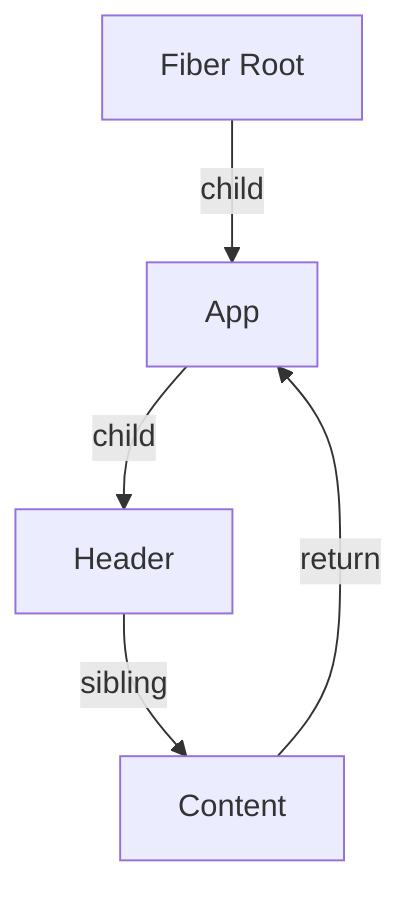

# React Interview Questions (60+ Deep Dive Q&A)

## 1. Core Architecture (Fiber)

<AccordionGroup>
<Accordion title="1. What is React Fiber? (Visualized)">
**Answer**:
Fiber is the complete rewrite of React's Reconciliation engine (v16).
**Goal**: Enable **Time Slicing** (Splitting work into chunks) and Concurrency.
**Structure**: A Linked List of Fiber nodes. Can pause/abort work.


**Phases**:
1.  **Render Phase** (Async, Interruptible): Diffing, calculating changes. Is pure (no side effects).
2.  **Commit Phase** (Sync, Uninterruptible): DOM updates, Lifecycle methods.
</Accordion>

<Accordion title="2. Reconciliation (Diffing Algorithm)">
**Answer**:
Heuristic O(N) algorithm (not O(N^3)).
**Assumptions**:
1.  Different Component Types -> Different Trees (Destroy old, build new).
2.  **Key Prop**: Detecting moved elements in lists.
**Process**: Compares Virtual DOM (Current vs WorkInProgress). Flags changes (Effect Tag).
</Accordion>

<Accordion title="3. Virtual DOM works how?">
**Answer**:
V-DOM is a Javascript Object representation of UI.
1.  `render()` creates V-DOM tree.
2.  Diff with previous V-DOM.
3.  Calculate minimal batch of updates.
4.  Apply to Real DOM (`ReactDOM.render`).
**Why?**: Batching updates is faster than touching DOM 50 times.
</Accordion>

<Accordion title="4. React 18 Concurrency (Concurrent Features)">
**Answer**:
Rendering is interruptible.
**Features**:
*   `useTransition`: Mark state update as low priority (UI remains responsive).
*   `useDeferredValue`: Debounce value (like user input).
*   **Automatic Batching**: Batches updates inside promises/timeouts now too.
</Accordion>

<Accordion title="5. Synthetic Events">
**Answer**:
Cross-browser wrapper around Native Events.
**Event Delegation**: React attaches **ONE** listener to Root (document/app container).
Dispatches events to components via internal lookup.
**Pooling**: (Removed in React 17) Objects used to be reused/nullified.
</Accordion>
</AccordionGroup>

## 2. Hooks Deep Dive

<AccordionGroup>
<Accordion title="6. Why Hooks cannot be conditional?">
**Answer**:
React stores Hooks in a **Linked List** on the Fiber Node.
`idx=0 (useState) -> idx=1 (useEffect) -> ...`
If you put a hook in `if`, the order shifts on next render.
React loses track of which state belongs to which hook.
</Accordion>

<Accordion title="7. `useEffect` vs `useLayoutEffect`">
**Answer**:
*   **useEffect**: Async. Runs **after** paint. Good for data fetch, subscriptions.
*   **useLayoutEffect**: Sync. Runs **after** DOM mutation but **before** paint.
    *   **Use**: Measuring DOM layout (width/height) to prevent flickering.
</Accordion>

<Accordion title="8. `useMemo` vs `useCallback`">
**Answer**:
*   **useMemo**: Caches a **Value**. `const v = useMemo(() => compute(x), [x])`.
*   **useCallback**: Caches a **Function Reference**. `const f = useCallback(() => {}, [])`.
    *   Crucial for passing functions to `React.memo` children (prevents re-render).
</Accordion>

<Accordion title="9. `useRef` Internals">
**Answer**:
Returns a plain object `{ current: initialValue }`.
Mutating `current` does **NOT** trigger re-render.
**Use**: Accessing DOM elements, Storing Mutable variables (timers, prevProps) without render.
</Accordion>

<Accordion title="10. `useReducer` vs `useState`">
**Answer**:
`useState` is internally implemented using `useReducer`.
**Use Reducer when**:
1.  Complex state logic (sub-values).
2.  Next state depends on previous state complexly.
3.  Testing logic in isolation (Reducer is pure function).
```javascript
const [state, dispatch] = useReducer(reducer, initialState);
```
</Accordion>

<Accordion title="11. Custom Hooks Pattern">
**Answer**:
Mechanism to reuse **Stateful Logic**. (Components reuse UI, Hooks reuse logic).
Must start with `use`.
```javascript
function useWindowSize() {
  const [size, setSize] = useState(window.innerWidth);
  useEffect(() => { ... }, []);
  return size;
}
```
</Accordion>

<Accordion title="12. `useContext` + `useReducer` Pattern">
**Answer**:
Poor man's Redux.
1.  Create Context.
2.  Provider holds `useReducer` state/dispatch.
3.  Pass `dispatch` down.
**Issue**: Context changes re-render ALL consumers.
</Accordion>
</AccordionGroup>

## 3. Component Patterns

<AccordionGroup>
<Accordion title="13. Higher Order Components (HOC)">
**Code**:
Function taking Component -> Returns Enhanced Component.
```javascript
const withAuth = (Component) => (props) => {
    return isAuth ? <Component {...props} /> : <Login />;
}
```
**Issues**: Prop Drill confusion, Naming collisions. Replaced by Hooks.
</Accordion>

<Accordion title="14. Render Props">
**Code**:
Sharing code using a prop whose value is a function.
```javascript
<MouseTracker render={({ x, y }) => (
  <h1>Position: {x}, {y}</h1>
)} />
```
</Accordion>

<Accordion title="15. Compound Components">
**Answer**:
Components that share implicit state. (Select & Option, Tabs & Tab).
Uses `React.Children.map` or `Context`.
```javascript
<Menu>
  <Menu.Item />
  <Menu.Item />
</Menu>
```
</Accordion>

<Accordion title="16. Controlled vs Uncontrolled">
**Answer**:
*   **Controlled**: React manages state. `value={state}` `onChange={setState}`. Single Source of Truth.
*   **Uncontrolled**: DOM manages state. Use `useRef` to pull value. `<input defaultValue="Hi" />`.
</Accordion>

<Accordion title="17. Error Boundaries">
**Answer**:
Class Component implementing `componentDidCatch` or `getDerivedStateFromError`.
Catches errors in **Child Component Tree**.
Displays Fallback UI.
**Note**: Cannot catch errors in Event Handlers or Async code (use Try/Catch there).
</Accordion>

<Accordion title="18. Portals">
**Answer**:
Render a child into a different part of DOM (outside parent hierarchy).
`ReactDOM.createPortal(child, container)`.
**Use**: Modals, Tooltips (z-index issues).
**Event Bubbling**: Events still bubble up the React Tree (Virtual), even if DOM is far away.
</Accordion>
</AccordionGroup>

## 4. Performance Optimization

<AccordionGroup>
<Accordion title="19. `React.memo`">
**Answer**:
HOC for Functional Components. PureComponent equivalent.
Memoizes result. Skips render if props match (Shallow Compare).
`React.memo(Comp, (prev, next) => areEqual)`.
**Trap**: Passing new object/function reference on every render kills Memo.
</Accordion>

<Accordion title="20. Code Splitting (Lazy & Suspense)">
**Answer**:
Dynamic Import.
```javascript
const Other = React.lazy(() => import('./Other'));

<Suspense fallback={<Spinner />}>
    <Other />
</Suspense>
```
Splits bundle. Loads chunk on demand.
</Accordion>

<Accordion title="21. Excessive Re-renders Fix">
**Audit**:
1.  React DevTools Profiler ("Why did this render?").
2.  Check context consumers being too broad.
3.  Check object references in `useEffect` dependencies.
4.  Move state down (Composition).
</Accordion>

<Accordion title="22. List Virtualization">
**Answer**:
Rendering 10,000 rows freezes DOM.
Use `react-window` / `react-virtualized`.
Render only visible slice + buffer.
</Accordion>

<Accordion title="23. Key Prop anti-pattern">
**Answer**:
Using `index` as key.
If list is re-ordered or filtered, React reuses wrong components (state issues).
**Always** use Stable ID (`item.id`).
</Accordion>

<Accordion title="24. Immutable State Why?">
**Answer**:
React uses Shallow Compare (`prevProps === nextProps`).
If you mutate object: `obj.a = 1`, the reference is same. React won't see change.
Must create new object: `setObj({ ...obj, a: 1 })`.
</Accordion>
</AccordionGroup>

## 5. Ecosystem & Advanced

<AccordionGroup>
<Accordion title="25. Redux vs Context">
**Answer**:
*   **Context**: DI (Dependency Injection). Good for static/low-frequency global data (Theme, User). Re-renders ALL consumers.
*   **Redux/Zustand**: State Management. Good for high-frequency updates. Selectors prevent unnecessary re-renders. Middleware (Thunk/Saga).
</Accordion>

<Accordion title="26. SSR (Server Side Rendering) vs CSR">
**Answer**:
*   **CSR**: Empty HTML. JS downloads -> Renders. Slow TTI. SEO Bad.
*   **SSR (Next.js)**: Server renders HTML -> Client Hydrates (Attaches listeners). Fast FCP. SEO Good.
*   **Hydration Error**: Server HTML != Client HTML (e.g., `Date.now()`, `window` usage).
</Accordion>

<Accordion title="27. React Server Components (RSC)">
**Answer**:
Components that run **ONLY** on server. Zero Bundle size.
Can access DB directly.
Cannot use Hooks or Event Listeners.
Streamed to client.
</Accordion>

<Accordion title="28. Testing (RTL vs Enzyme)">
**Answer**:
*   **Enzyme**: Implementation detail testing ("Does state 'count' equal 1?"). Fragile.
*   **RTL (React Testing Library)**: Behavior testing ("Do I see text '1'?"). Mimics user. Recommended.
</Accordion>

<Accordion title="29. Strict Mode effects">
**Answer**:
Dev only.
1.  Renders components **Twice** (Detect impure renderers).
2.  Runs Effects **Twice** (Mount -> Unmount -> Mount). Checks cleanup logic.
3.  Warns deprecated API.
</Accordion>

<Accordion title="30. Prop Drilling Solutions">
**Answer**:
1.  **Context**.
2.  **Composition**: Pass components as props (`children`, `slot`).
    ```javascript
    <Layout content={<Inner />} /> // Inner doesn't need to pass through Layout
    ```
3.  **State Management Lib** (Redux/Zustand).
</Accordion>
</AccordionGroup>

## 6. Coding Scenarios

<AccordionGroup>
<Accordion title="31. Implement a Counter (Hooks)">
**Code**:
```javascript
const Counter = () => {
    const [count, setCount] = useState(0);
    return <button onClick={() => setCount(c => c+1)}>{count}</button>;
}
```
**Note**: Use functional update `c => c+1` for safety.
</Accordion>

<Accordion title="32. Fetch Data with useEffect">
**Code**:
```javascript
useEffect(() => {
    let ignore = false;
    async function fetch() {
        const res = await call();
        if(!ignore) setData(res);
    }
    fetch();
    return () => { ignore = true; }; // Cleanup race condition
}, [id]);
```
</Accordion>

<Accordion title="33. Implement `usePrevious` Hook">
**Code**:
Stores value from previous render.
```javascript
function usePrevious(value) {
    const ref = useRef();
    useEffect(() => {
        ref.current = value;
    }, [value]); // Updates AFTER render
    return ref.current; // Returns BEFORE update
}
```
</Accordion>

<Accordion title="34. Implement `useDebounce` Hook">
**Code**:
```javascript
function useDebounce(value, delay) {
    const [debounced, set] = useState(value);
    useEffect(() => {
        const handler = setTimeout(() => set(value), delay);
        return () => clearTimeout(handler);
    }, [value, delay]);
    return debounced;
}
```
</Accordion>

<Accordion title="35. Optimize a heavy list (React.memo)">
**Code**:
```javascript
const Item = React.memo(({ item, onClick }) => {
    console.log("Render Item");
    return <li onClick={() => onClick(item.id)}>{item.name}</li>;
});

const List = () => {
    // Must useCallback or onClick will change every render, breaking Memo
    const handleDelete = useCallback((id) => setList(l => l.filter...), []);
    return list.map(i => <Item key={i.id} item={i} onClick={handleDelete} />);
}
```
</Accordion>

<Accordion title="36. Force Update (Hack)">
**Code**:
```javascript
const [, forceUpdate] = useReducer(x => x + 1, 0);
```
</Accordion>

<Accordion title="37. Modal with Portal">
**Code**:
```javascript
const Modal = ({ children }) => {
    return ReactDOM.createPortal(
        <div className="overlay">{children}</div>,
        document.getElementById('modal-root')
    );
}
```
</Accordion>

<Accordion title="38. Focus Input on Mount">
**Code**:
```javascript
const el = useRef(null);
useEffect(() => {
    el.current.focus();
}, []);
return <input ref={el} />;
```
</Accordion>

<Accordion title="39. Context API basic implementation">
**Code**:
```javascript
const ThemeCtx = createContext('light');
const App = () => (
    <ThemeCtx.Provider value="dark">
        <Toolbar />
    </ThemeCtx.Provider>
);
const Toolbar = () => {
    const theme = useContext(ThemeCtx);
    return <div>{theme}</div>;
}
```
</Accordion>

<Accordion title="40. Catch 404 in Router">
**Code**:
(React Router v6)
```javascript
<Routes>
    <Route path="/" element={<Home />} />
    <Route path="*" element={<NotFound />} />
</Routes>
```
</Accordion>
</AccordionGroup>

## 7. Edge Cases & Trivia

<AccordionGroup>
<Accordion title="41. Can you use Hooks in Class Components?">
**Answer**:
No.
**Workaround**: Create a Wrapper Functional Component that uses the hook and passes data as props to the Class.
</Accordion>

<Accordion title="42. What happens if you call setState in render?">
**Answer**:
Infinite Loop. Stack Overflow.
Render -> SetState -> Re-render -> SetState...
</Accordion>

<Accordion title="43. Is `setState` async?">
**Answer**:
It acts async (batches updates).
In React 18, it is **always** batched.
To read value immediately after, use `useEffect` or the callback (in class components).
</Accordion>

<Accordion title="44. `super(props)` purpose">
**Answer**:
(Class components).
Passes props to parent `Component` constructor.
Enables `this.props` access in the constructor.
</Accordion>

<Accordion title="45. Why does React require a Root element?">
**Answer**:
React components must return a single node (Virtual DOM tree structure).
Fragment `<></>` allows returning multiple siblings without adding DOM node.
</Accordion>

<Accordion title="46. React vs Angular vs Vue">
**Answer**:
*   **React**: Library. Virtual DOM. JSX. Flexible. One-way binding.
*   **Angular**: Framework. Real DOM (mostly). Templates. Opiniated (DI, HTTP included). Two-way binding.
*   **Vue**: Hybrid. Virtual DOM. Templates. Reactive mutable state.
</Accordion>

<Accordion title="47. Closures in Hooks (Stale Closures)">
**Answer**:
If you access state inside `useEffect` without adding it to dependency array, you see the **old** value from the render closure where the effect was created.
**Fix**: Add to dependency array or use Functional State Update.
</Accordion>

<Accordion title="48. `dangerouslySetInnerHTML`">
**Answer**:
React's replacement for `innerHTML`.
Named dangerously to warn about XSS attacks.
Required for rendering CMS content.
</Accordion>

<Accordion title="49. PureComponent vs Component">
**Answer**:
`PureComponent` implements `shouldComponentUpdate` with shallow prop comparison automatically.
`Component` re-renders always unless manually stopped.
</Accordion>

<Accordion title="50. Flux Architecture pattern">
**Answer**:
Action -> Dispatcher -> Store -> View.
Unidirectional Data Flow.
Predecessor to Redux.
</Accordion>
</AccordionGroup>

## 8. React 19 & Future (Bonus)

<AccordionGroup>
<Accordion title="51. React Compiler (Forget)">
**Answer**:
Auto-memoization.
No need for `useMemo` / `useCallback`.
Compiler detects what needs caching.
</Accordion>

<Accordion title="52. `use` Hook">
**Answer**:
Read promises or context.
Can be used in loops/ifs (unlike other hooks).
`const data = use(fetchData())`.
</Accordion>

<Accordion title="53. Actions (Server Functions)">
**Answer**:
`<form action={serverAction} />`.
Seamless RPC. Handle form submission on server.
Manages pending state automatically.
</Accordion>

<Accordion title="54. `useOptimistic`">
**Answer**:
Show expected result immediately (Optimistic UI) while waiting for server response.
Rollback if fails.
</Accordion>

<Accordion title="55. Document Metadata">
**Answer**:
Native support for `<title>` and `<meta>` tags inside components.
Hoisted to `<head>`. Replaces `react-helmet`.
</Accordion>

<Accordion title="56. Asset Loading">
**Answer**:
Suspense support for Stylesheets, Fonts, Scripts.
React manages loading order.
</Accordion>

<Accordion title="57. Web Components support">
**Answer**:
Full compatibility in React 19.
Pass properties/events correctly to Custom Elements.
</Accordion>

<Accordion title="58. Ref as a Prop">
**Answer**:
No more `forwardRef`.
Just pass `ref` as a normal prop to Function Components.
</Accordion>

<Accordion title="59. `<Context>` instead of `<Context.Provider>`">
**Answer**:
Simplified API.
`<ThemeContext value="dark">` works directly.
</Accordion>

<Accordion title="60. Directives ('use client', 'use server')">
**Answer**:
*   `'use server'`: Marks function as Server Action or component as Server Component.
*   `'use client'`: Opts back into Client Side Rendering (Hooks, Event Listeners).
</Accordion>
</AccordionGroup>
