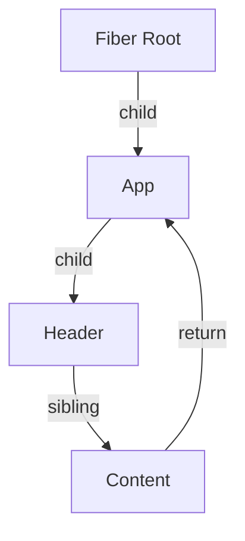

# React Interview Questions (68+ Deep Dive Q&A)

## 1. Core Architecture (Fiber)

<AccordionGroup>
<Accordion title="1. What is React Fiber? (Visualized)">
**Answer**:
Fiber is the complete rewrite of React's Reconciliation engine introduced in React 16, replacing the old "Stack Reconciler" that processed the entire tree synchronously in one pass.

**The Core Problem Fiber Solves**: The Stack Reconciler was blocking. A 10,000-node tree update would lock the main thread for 100ms+, causing dropped frames (janky scrolling, unresponsive inputs). Fiber makes rendering **interruptible**.

**Structure**: Each React element gets a corresponding Fiber node. These nodes form a linked list tree with three pointer types:
- `child` - first child
- `sibling` - next sibling
- `return` - parent


```mermaid
graph TD
    Root[Fiber Root] -->|child| App
    App -->|child| Header
    Header -->|sibling| Content
    Content -->|return| App
```

**Key Fiber Node Fields**: `type`, `stateNode` (DOM node or class instance), `pendingProps`, `memoizedState` (hooks linked list), `effectTag` (what changed), `lanes` (priority bits).

**Phases**:
1.  **Render Phase** (Async, Interruptible): Walks the Fiber tree, diffs current vs `workInProgress`, calculates changes. This phase is **pure** -- no side effects, no DOM mutations. Can be paused via `shouldYield()` (checks if the browser needs the main thread back, typically every ~5ms using `requestIdleCallback` or `MessageChannel`).
2.  **Commit Phase** (Sync, Uninterruptible): Applies all collected effects to the real DOM in one batch. Runs lifecycle methods (`componentDidMount`, `useLayoutEffect`). Cannot be interrupted because partial DOM updates would leave the UI in a broken state.

**Double Buffering**: Fiber maintains two trees -- `current` (what is on screen) and `workInProgress` (being built). On commit, React swaps pointers: `workInProgress` becomes `current`. This is analogous to double buffering in graphics rendering.

**What interviewers are really testing:** Whether you understand *why* React needed a rewrite (not just what Fiber is), and whether you grasp the render/commit phase split and its implications for side effects.

**Red flag answer:** "Fiber is React's virtual DOM" or "It makes React faster." Fiber is specifically about the *reconciler* architecture, not the virtual DOM concept itself. And it does not make React faster per se -- it makes React more *responsive* by breaking work into chunks.

**Follow-up:**
1. Why can't the commit phase be interruptible? What would go wrong if React paused mid-DOM-update?
2. How does Fiber's priority system (`lanes`) decide which updates to process first? Give an example of a high-priority vs low-priority update.
3. In React 16-17, `componentWillMount` / `componentWillUpdate` could fire multiple times under Fiber. Why, and why were they deprecated?
</Accordion>

<Accordion title="2. Reconciliation (Diffing Algorithm)">
**Answer**:
React's reconciliation is a heuristic O(n) diffing algorithm. A naive tree diff is O(n^3) which would mean 1 billion operations for a 1,000-node tree -- completely impractical.

**The Two Heuristics That Make O(n) Possible**:
1.  **Different element types produce different trees.** If a `<div>` becomes a `<span>`, React destroys the entire subtree and rebuilds. No attempt to reuse children. This sounds wasteful but in practice, cross-type morphing is rare and the simplification saves enormous complexity.
2.  **The `key` prop identifies stable elements across renders.** Without keys, React matches children by index position. With keys, React can detect insertions, deletions, and moves.

**The Actual Process**:
1. React walks both the current Fiber tree and the new element tree simultaneously.
2. For each node, compares `type` and `key`.
3. Same type + same key = **update** (reuse Fiber, apply new props).
4. Different type = **replace** (delete old subtree, create new).
5. Extra old children = **deletion**. Extra new children = **placement**.
6. Changes are flagged as `effectTag` on the Fiber node (e.g., `Placement`, `Update`, `Deletion`).

**List Reconciliation Details**: For lists, React builds a Map of `key -> old Fiber`, then iterates new children. For each, it looks up by key in O(1). This is why keys matter so much -- without them, inserting at the top of a 1,000-item list causes React to update all 1,000 items (it thinks every item shifted).

**Real-World Impact**: At a company rendering a dashboard with 500+ chart components, switching from index keys to stable IDs reduced reconciliation time from ~120ms to ~15ms on filter changes because React could correctly identify that most charts were unchanged.

**What interviewers are really testing:** Do you understand the *trade-offs* React made (heuristic accuracy vs performance), and can you explain why keys exist at a mechanical level?

**Red flag answer:** "React compares the real DOM to the virtual DOM." No -- React compares the *previous* virtual DOM (current Fiber tree) to the *new* virtual DOM (elements from render). The real DOM is only touched in the commit phase.

**Follow-up:**
1. What happens if two sibling elements have the same key? What bug does this cause?
2. Walk me through what happens when you insert an item at the beginning of a 100-item list with index keys vs stable ID keys.
3. Why doesn't React use a more sophisticated diffing algorithm? What would you gain and lose?
</Accordion>

<Accordion title="3. Virtual DOM works how?">
**Answer**:
The Virtual DOM is a lightweight JavaScript object tree that mirrors the structure of the real DOM. Think of it as a blueprint -- cheap to create and compare, unlike the actual DOM which is expensive (a single DOM node has 200+ properties).

**How It Actually Works End-to-End**:
1.  Component `render()` / function body returns JSX, which Babel compiles to `React.createElement()` calls (or the new JSX transform's `jsx()` calls).
2.  `createElement` produces plain objects: `{ type: 'div', props: { className: 'app', children: [...] } }`. This is the V-DOM.
3.  React diffs the new V-DOM tree against the previous one (reconciliation).
4.  Produces a minimal list of "effects" -- the actual DOM operations needed.
5.  Applies these in a single batch during the commit phase via `ReactDOM`.

**Why Not Just Update the DOM Directly?**
- DOM manipulation is not slow per se -- *layout thrashing* is. Reading `offsetHeight` after writing `style.height` forces a synchronous reflow. The V-DOM pattern naturally batches all writes together, avoiding read-write-read-write patterns.
- The abstraction also enables React Native, React Three Fiber (3D), React PDF, etc. -- same reconciler, different "renderers."

**Common Misconception**: "Virtual DOM is always faster than real DOM." It is not. Svelte and SolidJS compile away the V-DOM entirely and can be faster for fine-grained updates. The V-DOM is a *trade-off*: you pay the cost of diffing to get a simpler programming model (declarative UI) and cross-platform portability.

**Numbers**: Creating 10,000 V-DOM nodes takes ~1-2ms. Creating 10,000 real DOM nodes takes ~50-100ms. The diff + patch is almost always faster than naive full re-render, but targeted manual DOM manipulation (like what Svelte does) can beat it.

**What interviewers are really testing:** Can you explain the V-DOM without mythologizing it? Do you understand it is a trade-off, not a silver bullet?

**Red flag answer:** "Virtual DOM is what makes React fast" without qualification. This misses that V-DOM has overhead (memory, diffing CPU time) and that frameworks without V-DOM can outperform React.

**Follow-up:**
1. How does React's V-DOM approach compare to Svelte's compile-time approach or SolidJS's fine-grained reactivity? When would each win?
2. What is "layout thrashing" and how does batching DOM writes prevent it?
3. If V-DOM diffing is O(n), at what tree size does this become a bottleneck, and what would you do about it?
</Accordion>

<Accordion title="4. React 18 Concurrency (Concurrent Features)">
**Answer**:
React 18 introduced the **Concurrent Renderer** -- rendering is now interruptible by default when you use `createRoot` (the new API). The key idea: not all state updates are equally urgent.

**Core Mechanism**: React 18 uses a **priority lane system** (31 bit lanes). User interactions (clicks, typing) get high-priority lanes. Transitions get lower-priority lanes. React processes high-priority work first and can *interrupt* in-progress low-priority renders.

**Key Features**:

*   `useTransition`: Marks a state update as non-urgent. Returns `[isPending, startTransition]`. The UI stays responsive during the transition. **Real example**: Filtering a 10,000-row table -- wrap the filter state update in `startTransition` so typing remains smooth while the table re-renders in the background.

```javascript
const [isPending, startTransition] = useTransition();
const handleSearch = (query) => {
  setInputValue(query);          // Urgent: update input immediately
  startTransition(() => {
    setFilteredResults(filter(query)); // Non-urgent: can be interrupted
  });
};
```

*   `useDeferredValue`: Creates a deferred copy of a value. Similar to debouncing but smarter -- React controls the timing based on device capability. Fast devices see updates sooner. **Use case**: Showing a stale list while computing the new one.

*   **Automatic Batching**: In React 17, batching only worked inside React event handlers. In React 18, updates inside `setTimeout`, `Promise.then()`, native event handlers, and any other context are **all batched**. This was a major performance win -- applications saw 20-40% fewer re-renders without code changes.

*   **Suspense for Data Fetching (SSR)**: `<Suspense>` now works with SSR streaming. Server can send HTML for ready parts while slow data sources resolve. This is called **Selective Hydration** -- React hydrates the most urgent components first (e.g., the one the user is trying to click).

**Migration Gotcha**: Simply upgrading React 18 does not enable concurrency. You must switch from `ReactDOM.render()` to `createRoot()`. Without this, you get "legacy mode" with React 17 behavior.

**What interviewers are really testing:** Do you understand the *practical* impact of concurrency? Can you give a real scenario where `useTransition` matters? Do you understand the difference between concurrency and parallelism (React is still single-threaded)?

**Red flag answer:** "React 18 makes everything concurrent automatically" or confusing concurrency with parallelism. React uses cooperative scheduling on a single thread -- it does not use Web Workers or multi-threading.

**Follow-up:**
1. What is the difference between `useTransition` and `useDeferredValue`? When would you pick one over the other?
2. How does Automatic Batching in React 18 change error handling behavior compared to React 17? (Hint: errors in batched updates)
3. Explain Selective Hydration. What happens if a user clicks on a component that has not been hydrated yet?
</Accordion>

<Accordion title="5. Synthetic Events">
**Answer**:
React wraps native browser events in `SyntheticEvent` objects that provide a consistent, cross-browser interface. This normalizes differences across browsers (e.g., IE's `window.event` pattern, differences in `event.target` behavior).

**Event Delegation**: Instead of attaching an event listener to every single button/input, React attaches **one** listener per event type to the root container (`#root` in React 17+, previously `document` in React 16). When a native event fires, React:
1. Captures the native event at the root.
2. Looks up which Fiber node corresponds to the `event.target`.
3. Walks up the Fiber tree, collecting all relevant handlers (simulating bubbling through the React tree).
4. Calls handlers in the correct order with a `SyntheticEvent`.

**React 17 Breaking Change**: Delegation moved from `document` to the React root container. This was critical for **micro-frontends** -- multiple React apps on one page no longer interfere with each other's event systems. Before React 17, two React apps both listening on `document` could cause subtle bugs.

**Event Pooling** (Removed in React 17): In React 16, `SyntheticEvent` objects were recycled for performance. After the event handler returned, all properties were nullified. Accessing `event.target` in a `setTimeout` would return `null`. You had to call `event.persist()`. React 17 removed this because modern JS engines made object creation cheap enough that pooling was no longer worth the developer confusion.

**Practical Implications**:
- `event.nativeEvent` gives you the underlying browser event if needed.
- `event.stopPropagation()` stops propagation in React's synthetic system, not the native DOM (though React 17+ aligns these better).
- `event.preventDefault()` works as expected and delegates to the native event.
- Passive event listeners (for scroll performance) require native `addEventListener` -- React does not support the `passive` option on synthetic events.

**What interviewers are really testing:** Understanding of event delegation at scale, the React 16 to 17 migration implications, and awareness of cases where you need to bypass the synthetic system.

**Red flag answer:** "React creates a new event listener for each onClick" or not knowing that event pooling was removed.

**Follow-up:**
1. Why did React 17 move event delegation from `document` to the root container? What problem does this solve for micro-frontend architectures?
2. When would you need to use native `addEventListener` instead of React's synthetic events? Give a specific example.
3. How does React handle the capture phase vs bubbling phase? How do you add a capture-phase handler in React?
</Accordion>
</AccordionGroup>

## 2. Hooks Deep Dive

<AccordionGroup>
<Accordion title="6. Why Hooks cannot be conditional?">
**Answer**:
React stores hooks as a **linked list** attached to the Fiber node's `memoizedState` field. Each hook call appends to this list, and React identifies hooks purely by their **call order** (position in the list), not by any name or key.

**The Internal Mechanism**:
```
Render 1: useState(0) -> useEffect(fn) -> useMemo(fn)
           idx=0           idx=1           idx=2

Render 2 (with conditional): useEffect(fn) -> useMemo(fn)
                               idx=0           idx=1
```

React now thinks `useEffect` is the `useState` from last render (both at idx=0). It tries to apply `useState` logic to `useEffect` data -- total corruption. You get either wrong state, wrong effects, or a crash.

**Why a Linked List Instead of a Map?** You might think React could use hook names or keys. But hooks do not have names (two `useState` calls are indistinguishable). A Map keyed by something would add API overhead. The linked list approach is zero-overhead -- O(1) per hook call, no hashing, no key management. The trade-off is the ordering constraint.

**The Linter Catches This**: The `eslint-plugin-react-hooks` has a rule `rules-of-hooks` that statically analyzes your code to ensure hooks are not inside conditions, loops, or nested functions. This is a **must-have** lint rule, not optional. In a production codebase, violating this rule can cause bugs that are nearly impossible to debug because state silently shifts between hooks.

**What interviewers are really testing:** Deep understanding of React's internal data structures, not just rote memorization of "rules of hooks."

**Red flag answer:** "Because the docs say so" or "It's a React rule" without being able to explain *why* at the implementation level.

**Follow-up:**
1. Could React have designed hooks differently to allow conditional usage? What trade-offs would that involve?
2. How does the `rules-of-hooks` ESLint plugin actually detect violations? Is it purely syntactic or does it do control flow analysis?
3. The new `use` hook in React 19 *can* be called conditionally. How is this possible without breaking the linked list model?
</Accordion>

<Accordion title="7. `useEffect` vs `useLayoutEffect`">
**Answer**:
Both run side effects after a render, but the **timing** relative to the browser paint is critically different.

**`useEffect`**:
- Runs **asynchronously after the browser has painted** the screen.
- React schedules it via `requestIdleCallback` / `MessageChannel` (not `setTimeout`).
- Users see the updated UI first, then effects run.
- **Use for**: Data fetching, analytics tracking, subscriptions, logging -- anything that does not need to modify what the user sees.

**`useLayoutEffect`**:
- Runs **synchronously after DOM mutations but before the browser paints**.
- Blocks the paint. The user never sees the "before" state.
- **Use for**: Reading DOM layout (measuring element dimensions with `getBoundingClientRect`), adjusting positions, preventing visual flicker.

**Real-World Example -- Tooltip Positioning**:
```javascript
// BAD: useEffect causes visible flicker
useEffect(() => {
  const rect = tooltipRef.current.getBoundingClientRect();
  setPosition({ top: rect.bottom, left: rect.left });
}, []);
// User sees tooltip at (0,0) for one frame, then it jumps

// GOOD: useLayoutEffect prevents flicker
useLayoutEffect(() => {
  const rect = tooltipRef.current.getBoundingClientRect();
  setPosition({ top: rect.bottom, left: rect.left });
}, []);
// User never sees the wrong position
```

**SSR Gotcha**: `useLayoutEffect` fires a warning during SSR because there is no DOM to measure on the server. Common fixes: use `useEffect` with an `isMounted` check, or use a library like `useIsomorphicLayoutEffect` that picks the right one based on environment.

**Performance Warning**: Overusing `useLayoutEffect` blocks painting. If your effect takes 50ms (say, expensive computation), the user sees a 50ms freeze. Only use it when visual consistency requires it.

**What interviewers are really testing:** Whether you understand the browser rendering pipeline (JS execution -> DOM mutation -> layout/paint) and can reason about when code runs relative to what the user sees.

**Red flag answer:** "useLayoutEffect is the same as useEffect but runs first" without explaining *why the timing matters* or being able to give a concrete case where the difference is visible.

**Follow-up:**
1. Draw the timeline: component renders, DOM updates, `useLayoutEffect` runs, browser paints, `useEffect` runs. Where does `requestAnimationFrame` fit?
2. What happens if you call `setState` inside `useLayoutEffect`? Does it cause a visible flicker?
3. In a Server Component world (RSC), how do layout effects work? What happens on the server?
</Accordion>

<Accordion title="8. `useMemo` vs `useCallback`">
**Answer**:
Both are memoization hooks, but they cache different things:

*   **`useMemo`**: Caches a **computed value**. The factory function runs only when dependencies change.
    ```javascript
    const sorted = useMemo(() => expensiveSort(items), [items]);
    ```
*   **`useCallback`**: Caches a **function reference**. Equivalent to `useMemo(() => fn, deps)`.
    ```javascript
    const handleClick = useCallback((id) => deleteItem(id), [deleteItem]);
    ```

**Why `useCallback` Matters**: In JavaScript, `() => {}` !== `() => {}` -- every render creates a new function object. If you pass this to a child wrapped in `React.memo`, the child re-renders every time because its `onClick` prop changed (different reference). `useCallback` preserves the reference.

**When NOT to Use Them (Critical Nuance)**:
- Memoization is **not free**. `useMemo` adds: (1) dependency array comparison cost per render, (2) memory to store the cached value. For cheap computations (`a + b`), the memoization overhead exceeds the computation cost. A benchmark by the React team showed that unnecessary `useMemo` can make renders ~2-5% slower.
- Do not wrap every function in `useCallback`. Only do it when: (a) passed to a memoized child, (b) used as a dependency of another hook, or (c) the function creation itself is expensive.

**The React Compiler (React 19) changes everything**: React Compiler (formerly "React Forget") auto-memoizes at build time. It analyzes your component and inserts memoization where beneficial. This makes manual `useMemo`/`useCallback` largely unnecessary. Existing code still works but new code can skip them.

**Real-World Pattern**:
```javascript
// Parent component
const Parent = () => {
  const [count, setCount] = useState(0);
  const [text, setText] = useState('');

  // Without useCallback: ExpensiveChild re-renders on EVERY parent render
  // (even when only `text` changes)
  const handleIncrement = useCallback(() => {
    setCount(c => c + 1);
  }, []); // stable reference

  return (
    <>
      <input value={text} onChange={e => setText(e.target.value)} />
      <ExpensiveChild onIncrement={handleIncrement} />
    </>
  );
};
const ExpensiveChild = React.memo(({ onIncrement }) => {
  // Renders 500 items... expensive
});
```

**What interviewers are really testing:** Judgment. Do you know *when* to memoize and when it is wasteful? Can you reason about reference equality in JavaScript?

**Red flag answer:** "I always wrap everything in useMemo and useCallback to be safe." This shows lack of understanding of the overhead and when memoization actually helps.

**Follow-up:**
1. Can you implement `useCallback` using only `useMemo`? Show the code.
2. How does the React Compiler eliminate the need for manual memoization? What analysis does it perform?
3. You have a component that re-renders 60 times per second (animation). Should you use `useMemo` for computed values inside it? Why or why not?
</Accordion>

<Accordion title="9. `useRef` Internals">
**Answer**:
`useRef` returns a mutable object `{ current: initialValue }` that persists for the **full lifetime** of the component. The object reference itself never changes across renders.

**Three Key Properties**:
1. **Mutating `.current` does NOT trigger a re-render.** This is fundamental -- `useRef` is escape hatch from React's reactivity system.
2. **The ref object is the same instance across all renders.** Unlike `useState` values which are snapshots, `ref.current` always reflects the latest mutation.
3. **Synchronous access.** You read/write `.current` immediately, unlike `setState` which is batched/async.

**Common Use Cases**:
- **DOM access**: `<input ref={inputRef} />` then `inputRef.current.focus()`.
- **Storing mutable values without re-render**: Interval IDs, previous props, animation frame IDs, WebSocket instances.
- **Tracking "is mounted"** (though React discourages this pattern):
  ```javascript
  const isMounted = useRef(true);
  useEffect(() => () => { isMounted.current = false; }, []);
  ```

**Internal Implementation**: Under the hood, `useRef` is essentially `useMemo(() => ({ current: initialValue }), [])`. The initial value is computed once, and the same object is returned every render. But unlike `useMemo`, React guarantees the ref is never recreated (even if React's cache is evicted).

**`useRef` vs `createRef`**: `createRef()` creates a new ref object **every render**. It was designed for class components. In function components, always use `useRef` -- `createRef` would lose the previous value on each render.

**Subtle Gotcha -- Refs in Closures**:
```javascript
const countRef = useRef(0);
const [count, setCount] = useState(0);

const logValues = () => {
  setTimeout(() => {
    console.log('ref:', countRef.current);  // Always latest
    console.log('state:', count);            // Stale closure value
  }, 3000);
};
```
This is why refs are useful for "escape hatching" out of stale closure problems.

**What interviewers are really testing:** Understanding of the difference between React's reactive model (state/props drive renders) and imperative escape hatches (refs). Also testing awareness of closures and mutability.

**Red flag answer:** "useRef is for accessing DOM elements" -- that is only one use case and misses the broader purpose as a mutable container.

**Follow-up:**
1. Why would you store a WebSocket connection in a ref instead of state? What would go wrong if you used state?
2. Can you explain the "callback ref" pattern (`<div ref={node => ...} />`)? When is it better than `useRef`?
3. In React 19, refs work as regular props (no `forwardRef`). How does this simplify component APIs?
</Accordion>

<Accordion title="10. `useReducer` vs `useState`">
**Answer**:
`useState` is internally implemented as a special case of `useReducer` (the reducer is essentially `(state, action) => action` for direct values or `(state, action) => action(state)` for functional updates).

**When to Pick `useReducer`**:
1.  **Complex state transitions with multiple sub-values**: A form with 10 fields, a data table with sort/filter/pagination state. With `useState`, you end up with 10 separate setter calls in each handler. With `useReducer`, one `dispatch({ type: 'SUBMIT' })` handles everything.
2.  **Next state depends on previous state in complex ways**: State machines, multi-step wizards, undo/redo.
3.  **Testability**: The reducer is a **pure function** -- input state + action = output state. You can test it with zero React dependencies:
    ```javascript
    test('increments count', () => {
      expect(reducer({ count: 0 }, { type: 'INCREMENT' }))
        .toEqual({ count: 1 });
    });
    ```
4.  **Passing dispatch to deep children**: `dispatch` identity is **stable** -- it never changes across renders (unlike setter functions from `useState` when not using functional updates). This means you can pass `dispatch` to deeply nested `React.memo` children without causing re-renders, and without needing `useCallback`.

**When to Stick with `useState`**: Simple, independent values. A boolean toggle, a single input field, a counter. Using `useReducer` for `const [isOpen, toggleOpen]` is over-engineering.

```javascript
const reducer = (state, action) => {
  switch (action.type) {
    case 'SET_FIELD':
      return { ...state, [action.field]: action.value };
    case 'RESET':
      return initialState;
    case 'SUBMIT':
      return { ...state, submitting: true, error: null };
    default:
      return state;
  }
};
const [state, dispatch] = useReducer(reducer, initialState);
```

**Advanced Pattern -- Lazy Initialization**:
```javascript
const [state, dispatch] = useReducer(reducer, props, createInitialState);
// Third argument is an init function -- avoids recreating initial state on every render
```

**What interviewers are really testing:** Engineering judgment -- when to use which tool. Also whether you understand that `useState` and `useReducer` are the same primitive underneath.

**Red flag answer:** "useReducer is for complex state and useState is for simple state" without being able to explain *why* or articulate the specific benefits (testability, stable dispatch, collocated logic).

**Follow-up:**
1. How would you implement an undo/redo system using `useReducer`? Sketch the reducer.
2. `dispatch` is guaranteed stable across renders. Why? How does React achieve this internally?
3. When would you combine `useReducer` with `useContext`? What are the performance implications vs Redux?
</Accordion>

<Accordion title="11. Custom Hooks Pattern">
**Answer**:
Custom hooks are the primary mechanism for **reusing stateful logic** between components. Components reuse UI (via composition), hooks reuse behavior.

**Rules**: Must start with `use` (this enables the linter to enforce Rules of Hooks). Each call to a custom hook gets its own **isolated** state -- two components using `useWindowSize()` each get separate state.

```javascript
function useWindowSize() {
  const [size, setSize] = useState({
    width: window.innerWidth,
    height: window.innerHeight,
  });

  useEffect(() => {
    const handler = () => setSize({
      width: window.innerWidth,
      height: window.innerHeight,
    });
    window.addEventListener('resize', handler);
    return () => window.removeEventListener('resize', handler);
  }, []);

  return size;
}
```

**Why Custom Hooks Beat HOCs and Render Props**:
- **No wrapper nesting hell**: HOCs create `<WithAuth><WithTheme><WithRouter><Actual /></WithRouter></WithTheme></WithAuth>`. Custom hooks are flat function calls.
- **No prop collision**: Two HOCs might both inject `data` prop. Hooks return values you name yourself.
- **Composable**: Hooks call other hooks. `useAuthenticatedFetch` can use `useAuth` + `useFetch` internally.
- **TypeScript friendly**: HOC generic types are painful. Hook return types are simple.

**Real-World Custom Hook Examples**:
- `useDebounce(value, delay)` -- debounce search input
- `useLocalStorage(key, initialValue)` -- synced with localStorage
- `useMediaQuery('(max-width: 768px)')` -- responsive breakpoints
- `useIntersectionObserver(ref, options)` -- lazy loading triggers
- `usePrevious(value)` -- access value from previous render
- `useOnClickOutside(ref, handler)` -- close dropdowns

**Testing Custom Hooks**: Use `renderHook` from `@testing-library/react-hooks` (or `@testing-library/react` v14+):
```javascript
const { result } = renderHook(() => useCounter(0));
act(() => result.current.increment());
expect(result.current.count).toBe(1);
```

**What interviewers are really testing:** Can you identify when logic should be extracted into a hook? Can you design a clean hook API? Do you understand isolation (each call = separate state)?

**Red flag answer:** Treating custom hooks as "just refactoring functions out of components" without understanding that hooks carry state and lifecycle, or not knowing that each hook call gets independent state.

**Follow-up:**
1. Design a `useAsync(asyncFn)` hook that tracks loading, data, and error states. What edge cases would you handle?
2. How would you test a custom hook that depends on `window.addEventListener`? Walk me through the test setup.
3. Can a custom hook return JSX? Should it? What pattern emerges if it does?
</Accordion>

<Accordion title="12. `useContext` + `useReducer` Pattern">
**Answer**:
This pattern combines Context for distribution and `useReducer` for state management -- often called "poor man's Redux." It provides global state without external dependencies.

**Implementation**:
```javascript
const StateContext = createContext();
const DispatchContext = createContext(); // Separate contexts!

function AppProvider({ children }) {
  const [state, dispatch] = useReducer(reducer, initialState);
  return (
    <StateContext.Provider value={state}>
      <DispatchContext.Provider value={dispatch}>
        {children}
      </DispatchContext.Provider>
    </StateContext.Provider>
  );
}
```

**Critical Optimization -- Split State and Dispatch Contexts**: If you put both `state` and `dispatch` in one context value (`value={{ state, dispatch }}`), every consumer re-renders when state changes -- even components that only use `dispatch`. By splitting them, components that only dispatch actions never re-render on state changes.

**The Fundamental Limitation -- No Selectors**: When `state` changes, **ALL** components consuming `StateContext` re-render, even if they only care about `state.user` and only `state.cart` changed. This is because Context uses **reference equality** on the value. A new state object (from the reducer spread) always has a new reference.

**Workarounds**:
1. **Split contexts by domain**: `UserContext`, `CartContext`, `ThemeContext` -- each has its own provider. This limits re-render blast radius.
2. **`useMemo` in consumers**: Compute derived values in the consumer with `useMemo`, though the component still re-renders.
3. **`use-context-selector`** (third-party): Adds selector support to context.
4. **Just use Zustand/Jotai**: If you need selectors, middleware, or devtools, the cost of a ~2KB library is worth it over fighting Context's limitations.

**When Context + Reducer is Actually Fine**: Theme, locale, auth status, feature flags -- data that changes rarely and affects many components. For these, the "all consumers re-render" cost is negligible because changes happen once per session.

**What interviewers are really testing:** Do you understand Context's re-render behavior and can you make an informed decision about when Context is enough vs when you need a dedicated state management library?

**Red flag answer:** "Context + useReducer replaces Redux" without mentioning the re-render problem or understanding when this pattern breaks down.

**Follow-up:**
1. You have 50 components consuming a context, and state updates 10 times per second. What happens? How do you fix it?
2. Compare the re-render behavior of Context vs Zustand's `useStore(selector)`. Why is Zustand more efficient?
3. How would you add middleware-like functionality (logging, async actions) to the Context + Reducer pattern?
</Accordion>
</AccordionGroup>

## 3. Component Patterns

<AccordionGroup>
<Accordion title="13. Higher Order Components (HOC)">
**Answer**:
An HOC is a function that takes a component and returns a new, enhanced component. It is a pattern, not a React API. It leverages JavaScript's higher-order function concept applied to components.

```javascript
const withAuth = (Component) => {
  return function AuthenticatedComponent(props) {
    const { isAuthenticated, user } = useAuth();
    if (!isAuthenticated) return <Redirect to="/login" />;
    return <Component {...props} user={user} />;
  };
};

const ProtectedDashboard = withAuth(Dashboard);
```

**Real-World HOC Examples**: `connect()` from React-Redux, `withRouter` from React Router v5, `withStyles` from Material UI v4.

**The Problems That Led to Hooks**:
1. **Wrapper Hell**: `withAuth(withTheme(withRouter(withAnalytics(Component))))` creates deeply nested component trees. React DevTools shows 8 layers of wrappers. Debugging becomes painful.
2. **Prop Name Collisions**: If `withAuth` injects `data` and `withFetch` also injects `data`, the last HOC wins and the first one's prop is silently lost.
3. **Static Composition Only**: HOCs are applied at definition time, not render time. You cannot dynamically decide which HOCs to apply based on props.
4. **TypeScript Pain**: Properly typing the input component, the injected props, and the output component requires complex generics that many teams get wrong.
5. **Ref Forwarding**: HOCs need explicit `React.forwardRef` to pass refs through to the wrapped component.

**When HOCs Are Still Useful** (even in 2024+): Cross-cutting concerns in class component codebases, decorating third-party components you cannot modify, and composing behaviors declaratively in some meta-framework patterns.

**What interviewers are really testing:** Understanding of composition patterns and their evolution. Can you articulate *why* hooks replaced HOCs, not just that they did?

**Red flag answer:** "HOCs are bad and should never be used." Absolute statements show lack of nuance -- HOCs still have valid use cases.

**Follow-up:**
1. How would you convert an existing HOC (`withAuth`) into a custom hook (`useAuth`)? What changes in the consumer code?
2. What is the "wrapper hell" problem and how does it affect React DevTools debugging?
3. How do you ensure an HOC properly forwards refs? Show the code.
</Accordion>

<Accordion title="14. Render Props">
**Answer**:
A component with a render prop takes a function that returns React elements and calls it instead of implementing its own render logic. It shares code by giving the consumer control over what to render with shared state.

```javascript
class MouseTracker extends React.Component {
  state = { x: 0, y: 0 };

  handleMouseMove = (event) => {
    this.setState({ x: event.clientX, y: event.clientY });
  };

  render() {
    return (
      <div onMouseMove={this.handleMouseMove}>
        {this.props.render(this.state)}
      </div>
    );
  }
}

// Usage - consumer decides what to render
<MouseTracker render={({ x, y }) => (
  <h1>The mouse position is ({x}, {y})</h1>
)} />
```

**Variation -- `children` as a Function** (more common):
```javascript
<MouseTracker>
  {({ x, y }) => <Crosshair x={x} y={y} />}
</MouseTracker>
```

**Render Props vs HOCs**: Render props solve the static composition problem. You can dynamically decide what to render at render time. They also make data flow more explicit (you can see exactly what data is being passed). However, they introduce "callback hell" nesting when composed.

**Performance Gotcha**: If the render prop is an inline function, a new function is created every render. This breaks `shouldComponentUpdate` / `React.memo` on the component receiving the render prop. The fix is to extract the render function:
```javascript
// Bad: new function every render
<DataFetcher render={(data) => <List data={data} />} />

// Better: stable function reference
const renderList = useCallback((data) => <List data={data} />, []);
<DataFetcher render={renderList} />
```

**Modern Status**: Render props are largely replaced by custom hooks for logic sharing. But the pattern survives in libraries like React Spring (`<Spring>{styles => ...}</Spring>`), Formik (`<Field>{(field) => ...}</Field>`), and Downshift.

**What interviewers are really testing:** Understanding of inversion of control as a design principle, and the evolution from render props to hooks.

**Red flag answer:** Not knowing the `children` as function variant, or unable to articulate any downsides (nesting, performance).

**Follow-up:**
1. Convert this render props component to a custom hook. What is gained and lost?
2. How would you handle the case where the render prop function is expensive to execute? What optimization strategies exist?
3. Can you combine render props with hooks? Give a scenario where this makes sense.
</Accordion>

<Accordion title="15. Compound Components">
**Answer**:
Compound components are a pattern where a parent component and its children share **implicit state**, creating a cohesive API that works together. Think HTML's `<select>` and `<option>` -- they communicate internally without you wiring them up.

**Implementation with Context**:
```javascript
const TabsContext = createContext();

function Tabs({ children, defaultIndex = 0 }) {
  const [activeIndex, setActiveIndex] = useState(defaultIndex);
  return (
    <TabsContext.Provider value={{ activeIndex, setActiveIndex }}>
      <div className="tabs">{children}</div>
    </TabsContext.Provider>
  );
}

Tabs.Tab = function Tab({ index, children }) {
  const { activeIndex, setActiveIndex } = useContext(TabsContext);
  return (
    <button
      className={activeIndex === index ? 'active' : ''}
      onClick={() => setActiveIndex(index)}
    >
      {children}
    </button>
  );
};

Tabs.Panel = function Panel({ index, children }) {
  const { activeIndex } = useContext(TabsContext);
  return activeIndex === index ? <div>{children}</div> : null;
};

// Usage -- clean, declarative API
<Tabs defaultIndex={0}>
  <Tabs.Tab index={0}>Profile</Tabs.Tab>
  <Tabs.Tab index={1}>Settings</Tabs.Tab>
  <Tabs.Panel index={0}><ProfileContent /></Tabs.Panel>
  <Tabs.Panel index={1}><SettingsContent /></Tabs.Panel>
</Tabs>
```

**Two Approaches**:
1. **`React.Children.map` + `cloneElement`**: The older approach. Parent iterates children and injects props via `cloneElement`. Brittle -- breaks if you wrap children in a `<div>`.
2. **Context-based** (modern, preferred): Parent provides context, children consume it. Works regardless of DOM nesting depth. More flexible.

**Real-World Libraries Using This Pattern**: Radix UI, Headless UI, Reach UI, Chakra UI, Material UI's `<Accordion>`, `<Tabs>`, `<Menu>` components.

**What interviewers are really testing:** Component API design skills. Can you design APIs that are intuitive for consumers? Do you understand implicit vs explicit state sharing?

**Red flag answer:** Only knowing the `cloneElement` approach, or not being able to articulate why compound components are better than passing everything as props to a single component.

**Follow-up:**
1. What are the trade-offs between `cloneElement`-based vs Context-based compound components?
2. How would you make compound components type-safe with TypeScript so that `Tabs.Tab` cannot be used outside `Tabs`?
3. How do headless component libraries (Radix, Headless UI) use compound components to separate logic from styling?
</Accordion>

<Accordion title="16. Controlled vs Uncontrolled">
**Answer**:
This distinction is about **who owns the state** -- React or the DOM.

*   **Controlled**: React is the single source of truth. The component's value is driven by state (`value={state}`), and changes flow through an `onChange` handler that calls `setState`. Every keystroke goes: DOM event -&gt; handler -&gt; `setState` -&gt; re-render -&gt; DOM updated.

*   **Uncontrolled**: The DOM itself holds the state. You use `defaultValue` to set the initial value and a `ref` to read the current value when needed (e.g., on form submit). React does not track intermediate changes.

**When to Use Which**:
- **Controlled**: When you need real-time validation, conditional disabling, formatting-as-you-type (phone numbers, credit cards), or when multiple components need to stay in sync with the same value.
- **Uncontrolled**: Simple forms where you only need values on submit, integrating with non-React libraries (e.g., a jQuery datepicker), or file inputs (`<input type="file" />` is always uncontrolled -- React cannot set file values for security reasons).

**Performance Consideration**: A controlled input with a complex parent component triggers a full re-render on every keystroke. In a form with 50 fields, this can cause lag. Solutions: (1) isolate input state into a small component, (2) use `useDeferredValue`, or (3) use a form library like React Hook Form which uses **uncontrolled** inputs by default with refs for performance.

**React Hook Form vs Formik**: This is the controlled vs uncontrolled debate in library form. Formik uses controlled components (re-renders on every change). React Hook Form uses uncontrolled with refs (minimal re-renders). On forms with 50+ fields, React Hook Form can be 5-10x more performant in terms of re-renders.

**What interviewers are really testing:** Understanding of data flow, performance implications of each approach, and practical judgment about when to use which.

**Red flag answer:** "Always use controlled components because they're the React way." This ignores valid use cases for uncontrolled components and performance trade-offs.

**Follow-up:**
1. You have a form with 100 fields and users report input lag. How would you diagnose and fix this?
2. What happens if you set `value` on an input without an `onChange` handler? What does React do?
3. How does React Hook Form achieve better performance than Formik? What is the architectural difference?
</Accordion>

<Accordion title="17. Error Boundaries">
**Answer**:
Error Boundaries are React's equivalent of try/catch for the component tree. They catch JavaScript errors during rendering, lifecycle methods, and constructors of their **child** component tree, and display a fallback UI instead of crashing the entire app.

**Implementation** (must be a class component -- no hook equivalent yet):
```javascript
class ErrorBoundary extends React.Component {
  state = { hasError: false, error: null };

  static getDerivedStateFromError(error) {
    // Update state to render fallback
    return { hasError: true, error };
  }

  componentDidCatch(error, errorInfo) {
    // Log to error reporting service (Sentry, DataDog, etc.)
    logErrorToService(error, errorInfo.componentStack);
  }

  render() {
    if (this.state.hasError) {
      return <FallbackUI error={this.state.error} />;
    }
    return this.props.children;
  }
}
```

**What Error Boundaries Do NOT Catch**:
1. **Event handlers** -- use regular try/catch. Event handler errors do not corrupt the render tree.
2. **Async code** (setTimeout, Promises) -- errors happen outside React's call stack.
3. **Server-side rendering** -- different error handling mechanism.
4. **Errors in the boundary itself** -- only catches errors in children, not in itself.

**Strategic Placement**: Do not put one boundary at the root and call it done. Use **granular boundaries**:
- Route-level: Each page gets its own boundary. A crash in `/settings` does not break `/dashboard`.
- Feature-level: A failing chart widget does not take down the sidebar.
- Critical vs non-critical: Show a generic error for the chat widget but show a full-page error for the main content.

**Production Pattern with Reset**:
```javascript
<ErrorBoundary
  fallback={<RetryButton />}
  onReset={() => queryClient.resetQueries()}
  resetKeys={[userId]}  // Auto-reset when userId changes
>
  <UserProfile />
</ErrorBoundary>
```

Libraries like `react-error-boundary` by Brian Vaughn provide this with hooks support and retry functionality.

**What interviewers are really testing:** Error handling strategy and resilience thinking. Where do you place boundaries? How do you handle recovery? Do you know the limitations?

**Red flag answer:** "Error boundaries catch all errors in React" or placing a single boundary at the root without considering granularity.

**Follow-up:**
1. Why is there no hook-based Error Boundary? What technical limitation prevents it?
2. How would you implement a "retry" mechanism in an error boundary? What state needs to reset?
3. How do Error Boundaries interact with Suspense boundaries? Can you combine them?
</Accordion>

<Accordion title="18. Portals">
**Answer**:
Portals allow you to render a child component into a DOM node that exists outside the parent component's DOM hierarchy, while maintaining the React tree hierarchy for events and context.

```javascript
const Modal = ({ children, isOpen }) => {
  if (!isOpen) return null;
  return ReactDOM.createPortal(
    <div className="modal-overlay">
      <div className="modal-content">{children}</div>
    </div>,
    document.getElementById('modal-root')
  );
};
```

**Why Portals Exist**: CSS `overflow: hidden`, `z-index` stacking contexts, and `position` constraints. A modal inside a `<div style="overflow: hidden">` gets clipped. A tooltip inside a scrolling container scrolls with it. Portals break out of these CSS constraints by rendering into a different DOM location.

**The Magic -- Event Bubbling Through Portals**: This is the most commonly missed detail. Even though the portal renders into `#modal-root` (outside the parent in the DOM), events still bubble up through the **React tree** (virtual hierarchy). A click inside a portal still triggers `onClick` on the React parent component:
```
DOM tree: #root > App, #modal-root > Modal
React tree: App > Modal (parent-child)
Click in Modal bubbles to App in React, NOT to #modal-root's parent in DOM
```

**Context Also Flows Through Portals**: A portaled component still has access to its parent's Context. This is because React's context traversal follows the Fiber tree, not the DOM tree.

**Common Portal Use Cases**:
- Modals and dialogs
- Tooltips and popovers
- Toast notifications
- Dropdown menus that need to escape `overflow: hidden`
- Full-screen overlays

**Accessibility Consideration**: Portals require extra care for focus management. When a modal opens, focus should move to the modal. When it closes, focus should return to the trigger. Screen readers need `aria-modal="true"` and proper `role="dialog"`. Libraries like Radix UI and Headless UI handle this automatically.

**What interviewers are really testing:** Understanding of the DOM vs React tree distinction, CSS stacking context issues, and awareness of accessibility implications.

**Red flag answer:** Not knowing that events bubble through the React tree (not DOM tree) for portals, or not mentioning accessibility/focus management.

**Follow-up:**
1. Explain a scenario where event bubbling through a portal could cause a bug. How would you handle it?
2. How do you handle keyboard focus trapping inside a modal rendered via a portal?
3. Can you create a portal to an element inside an iframe? What challenges arise?
</Accordion>
</AccordionGroup>

## 4. Performance Optimization

<AccordionGroup>
<Accordion title="19. `React.memo`">
**Answer**:
`React.memo` is a higher-order component that memoizes functional components. It performs a **shallow comparison** of props -- if all props are equal by reference (or value for primitives), the component skips re-rendering and reuses the previous render output.

```javascript
const ExpensiveList = React.memo(function ExpensiveList({ items, onSelect }) {
  return items.map(item => <ListItem key={item.id} item={item} onSelect={onSelect} />);
});

// Custom comparator for complex cases
const OptimizedChart = React.memo(ChartComponent, (prevProps, nextProps) => {
  return prevProps.data.length === nextProps.data.length &&
         prevProps.data.every((d, i) => d.id === nextProps.data[i].id);
});
```

**The #1 Trap -- Unstable References**: `React.memo` is rendered useless if the parent creates new objects/functions every render:
```javascript
// BROKEN: memo never helps because style and onClick are new every render
const Parent = () => {
  return (
    <MemoChild
      style={{ color: 'red' }}            // New object every render
      onClick={() => doSomething()}         // New function every render
    />
  );
};
```

**The Fix**: Stabilize references with `useMemo` for objects and `useCallback` for functions. Or better, restructure to pass primitives:
```javascript
// Pass primitives instead of objects
<MemoChild color="red" fontSize={14} onClick={stableCallback} />
```

**When NOT to Memo**: If a component is cheap to render (a few DOM elements, no computation), the overhead of shallow comparison on every render can exceed the cost of just re-rendering. Profile first with React DevTools Profiler, then memo the actual bottlenecks.

**Measuring Impact**: React DevTools Profiler shows "Why did this render?" and render duration. Before adding `React.memo`, establish a baseline. After adding it, verify the component actually skips renders. At a dashboard with 200+ widgets, strategically applying `React.memo` to widget containers reduced average frame time from 33ms to 8ms during filter operations.

**What interviewers are really testing:** Do you understand reference equality in JavaScript? Can you identify the real performance bottleneck before reaching for `memo`?

**Red flag answer:** "I wrap every component in React.memo for performance" -- shows premature optimization without understanding the overhead and the reference stability requirement.

**Follow-up:**
1. If `React.memo` uses shallow comparison, what exactly does "shallow" mean? How deep does it go?
2. When would you write a custom comparison function for `React.memo`? What are the risks?
3. How does the React Compiler in React 19 change the need for `React.memo`?
</Accordion>

<Accordion title="20. Code Splitting (Lazy & Suspense)">
**Answer**:
Code splitting breaks your JavaScript bundle into smaller chunks that load on demand, reducing the initial load time. React provides `React.lazy` and `Suspense` as first-class APIs for this.

```javascript
// Lazy-loaded component -- webpack/vite creates a separate chunk
const Settings = React.lazy(() => import('./Settings'));
const AdminPanel = React.lazy(() => import('./AdminPanel'));

function App() {
  return (
    <Suspense fallback={<LoadingSpinner />}>
      <Routes>
        <Route path="/settings" element={<Settings />} />
        <Route path="/admin" element={<AdminPanel />} />
      </Routes>
    </Suspense>
  );
}
```

**How It Works Under the Hood**:
1. `React.lazy` takes a function that returns a `Promise<{ default: Component }>` (the dynamic `import()` spec).
2. On first render, the component is not loaded. React "suspends" -- throws a Promise.
3. The nearest `Suspense` boundary catches the Promise and shows the `fallback`.
4. When the chunk loads (Promise resolves), React re-renders with the real component.

**Strategic Splitting Points**:
- **Route-level splitting**: Each page is a separate chunk. Most impactful because users only load the page they visit. Can reduce initial bundle from 2MB to 200KB.
- **Heavy library splitting**: Import `chart.js` or `monaco-editor` only when the chart/editor component mounts.
- **Below-the-fold splitting**: Content not visible on initial load does not need to be in the main bundle.
- **Modal/dialog splitting**: Admin settings modals loaded only when opened.

**Prefetching and Preloading**:
```javascript
// Prefetch on hover (load chunk before user clicks)
const Settings = React.lazy(() => import('./Settings'));
const prefetchSettings = () => import('./Settings'); // triggers chunk download

<Link to="/settings" onMouseEnter={prefetchSettings}>
  Settings
</Link>
```

**Error Handling**: Combine `Suspense` with an Error Boundary to handle chunk load failures (network errors):
```javascript
<ErrorBoundary fallback={<ChunkLoadError />}>
  <Suspense fallback={<Spinner />}>
    <LazyComponent />
  </Suspense>
</ErrorBoundary>
```

**Bundle Analysis**: Use `webpack-bundle-analyzer` or `vite-plugin-visualizer` to identify which chunks are large and what dependencies they pull in. A common finding: moment.js (300KB) pulled into the main bundle because one component uses it.

**What interviewers are really testing:** Do you think about performance holistically? Can you identify the right splitting boundaries? Do you handle failure cases?

**Red flag answer:** Only knowing the syntax without understanding splitting strategy, prefetching, or error handling for failed chunk loads.

**Follow-up:**
1. How would you implement a "retry on failure" mechanism for a failed lazy-loaded chunk?
2. What is the difference between `React.lazy` and dynamic `import()` with manual state management? When would you choose one over the other?
3. How does React Suspense for data fetching differ from Suspense for code splitting?
</Accordion>

<Accordion title="21. Excessive Re-renders Fix">
**Answer**:
Excessive re-renders are the #1 React performance issue in production. A component that renders 100 times when it should render once can make the difference between 60fps and 15fps.

**Systematic Debugging Approach**:

1.  **React DevTools Profiler** (first tool, always): Enable "Record why each component rendered." Run the Profiler, perform the slow interaction, stop recording. Look for:
    - Components rendering many times (high render count).
    - Components with long render durations.
    - The "Why did this render?" column -- shows "Props changed", "State changed", "Parent rendered", or "Hooks changed."

2.  **`console.log` or `useWhyDidYouRender`**: For quick debugging, add a log at the top of the component. The `why-did-you-render` library patches React to log exactly which prop/state change triggered the re-render.

3.  **Common Root Causes and Fixes**:

    **Cause**: Context value changes too often.
    **Fix**: Split context, memoize the value, or move to Zustand/Jotai for high-frequency state.

    **Cause**: Parent passes new object/function references.
    **Fix**: `useMemo` for objects, `useCallback` for functions, or restructure to pass primitives.

    **Cause**: State too high in the tree.
    **Fix**: Move state down to the component that actually needs it (composition pattern / "lift state down").

    **Cause**: Subscribing to an entire store instead of a slice.
    **Fix**: Use selectors (`useStore(state => state.count)` in Zustand).

    **Cause**: `useEffect` dependency array creates a loop (effect updates state that is in its own deps).
    **Fix**: Use functional state updates or extract the logic.

4.  **Nuclear Option -- Composition Refactor**: Sometimes the component tree structure itself is the problem. Splitting a "god component" into smaller, focused components with clear data boundaries can eliminate 80% of unnecessary re-renders.

**Real-World Case**: A data table component re-rendering all 500 rows on every sort/filter. Root cause: the `columns` config array was recreated every render in the parent. Fix: `useMemo` on the columns array. Result: sort operation went from 400ms to 12ms.

**What interviewers are really testing:** Systematic debugging methodology. Do you reach for the right tools? Can you identify root causes vs symptoms?

**Red flag answer:** "Just wrap everything in React.memo and useMemo" -- this is a shotgun approach that shows no diagnostic skill.

**Follow-up:**
1. Walk me through how you would profile a specific slow interaction step by step using React DevTools.
2. What is the "composition pattern" for avoiding re-renders, and how does moving state down help?
3. How do you distinguish between re-renders that are expensive (need fixing) vs re-renders that are cheap (acceptable)?
</Accordion>

<Accordion title="22. List Virtualization">
**Answer**:
Rendering thousands of DOM nodes simultaneously destroys performance. A list of 10,000 items creates 10,000 `<div>` elements, each taking ~1KB of memory and requiring layout calculation. Virtualization solves this by rendering only the **visible slice** of the list (typically 20-50 items) plus a small buffer, and dynamically swapping elements as the user scrolls.

**How It Works Internally**:
1. Calculate which items are visible based on scroll position and container height.
2. Render only those items, absolutely positioned at their correct offset.
3. Set the total container height to simulate the full list (so the scrollbar looks correct).
4. On scroll, recalculate visible range and swap items.

**Libraries**:
- **`react-window`** (Brian Vaughn, React core team): Lightweight (~6KB), covers 90% of use cases. Fixed and variable size lists/grids.
- **`react-virtuoso`**: More features out of the box (grouped lists, reverse scrolling for chat, table support).
- **`@tanstack/react-virtual`**: Headless (no DOM opinions), framework-agnostic, great TypeScript support.

```javascript
import { FixedSizeList } from 'react-window';

const Row = ({ index, style }) => (
  <div style={style}>Row {index}</div>
);

<FixedSizeList
  height={600}
  width={400}
  itemCount={10000}
  itemSize={35}
>
  {Row}
</FixedSizeList>
```

**Variable-Size Items (Harder Problem)**: When items have different heights (chat messages, feed posts), you need `VariableSizeList` with a size estimator function. You often need to measure items after render and update the cache, which `react-virtuoso` handles better out of the box.

**Gotchas**:
- **Search/Find on page** (Ctrl+F): Browser search cannot find text in non-rendered items. Workaround: add invisible text or use a custom search UI.
- **Accessibility**: Screen readers may not announce total list size. Add `aria-rowcount` and `aria-rowindex`.
- **Scroll restoration**: Navigating away and back loses scroll position. Store scroll offset and restore on mount.
- **Dynamic content loading**: Combine virtualization with infinite scroll (load more data as user approaches the bottom).

**What interviewers are really testing:** Do you know when to virtualize (not for 50 items), the library landscape, and the accessibility/UX trade-offs?

**Red flag answer:** "Just use react-window" without understanding the trade-offs or knowing about alternatives for complex cases (variable heights, bi-directional scrolling).

**Follow-up:**
1. How would you implement virtualization for a grid (2D) vs a list (1D)? What additional complexity arises?
2. At what item count does virtualization become worthwhile? How would you benchmark this?
3. How do you handle items with unknown/dynamic heights in a virtualized list?
</Accordion>

<Accordion title="23. Key Prop anti-pattern">
**Answer**:
Using array `index` as a key is one of the most common React anti-patterns, and it causes **silent, hard-to-debug state corruption** in specific scenarios.

**Why Index Keys Break**:
When you use `key={index}`, React identifies elements by their position. If the list is reordered, filtered, or has items inserted/deleted at the beginning or middle:

1. React sees `key=0` still exists, `key=1` still exists, etc.
2. It **reuses** the Fiber nodes (and their state) for those keys.
3. But the *data* at each position has changed.
4. Result: Component at position 0 shows the *state* of the old item 0 (input values, selection state, animation state) but the *props* of the new item 0.

**Concrete Bug Example**:
```
Each TodoItem has a controlled input for editing
List: ["Buy milk", "Walk dog", "Read book"]
Keys: [0, 1, 2]
User edits "Walk dog" input to "Walk cat"
User deletes "Buy milk"
New list: ["Walk dog", "Read book"], keys: [0, 1]
Bug: Item at key=0 ("Walk dog") still shows the INPUT STATE from old key=0 ("Buy milk")
The edited text "Walk cat" is GONE
```

**When Index Keys Are Actually Safe**: When the list is **static** (never reordered, filtered, or modified), or the items have no state (pure display components). But even then, using stable IDs is a better habit.

**Generating Stable Keys**: Use `item.id` from the database. If no ID exists, generate one when the data is created (not during render -- `uuid()` in render creates new keys every render, which destroys all component instances every time):
```javascript
// BAD: new key every render, destroys and recreates all components
items.map(item => <Item key={uuid()} />)

// GOOD: stable ID from data
items.map(item => <Item key={item.id} />)
```

**What interviewers are really testing:** Understanding of how React uses keys for reconciliation at a deep level, and ability to predict bugs from incorrect key usage.

**Red flag answer:** "Index keys are bad for performance" -- it is not about performance, it is about **correctness**. State corruption is the real issue.

**Follow-up:**
1. Give me a scenario where using `index` as key causes a visible bug. Walk through the reconciliation step by step.
2. What happens if two siblings have the same key? Does React crash or silently misbehave?
3. Can you use the `key` prop to intentionally reset a component's state? When is this useful?
</Accordion>

<Accordion title="24. Immutable State Why?">
**Answer**:
React's reactivity system is built on **reference equality checks** (`===`). When you call `setState`, React compares the new value to the old value. For primitives (numbers, strings), this checks the value. For objects and arrays, this checks the **memory reference**.

**The Core Problem**:
```javascript
// WRONG: Mutation -- same reference, React sees no change
const handleClick = () => {
  user.name = 'Alice';  // Mutating existing object
  setUser(user);         // Same reference! React skips re-render
};

// RIGHT: New object -- new reference, React detects change
const handleClick = () => {
  setUser({ ...user, name: 'Alice' }); // Spread creates new object
};
```

**Why React Chose Reference Equality Over Deep Equality**:
- Deep comparison is O(n) where n is the total size of the object tree. For a Redux store with 10,000 entries, deep comparing on every update would be more expensive than just re-rendering.
- Reference equality is O(1) -- a single pointer comparison.
- The trade-off: developers must create new references when data changes. This is the "immutable update" pattern.

**Immutability Beyond React**: Immutable state also enables:
1. **Time-travel debugging** (Redux DevTools): Each state snapshot is a separate object, so you can replay them.
2. **Structural sharing**: Libraries like Immer only clone the changed branches, reusing unchanged sub-trees. This is memory-efficient.
3. **Predictable state**: No spooky action at a distance. If you hold a reference to the old state, it never changes.

**Immer Makes This Ergonomic**:
```javascript
import { produce } from 'immer';

// Instead of deeply nested spreads:
const next = {
  ...state,
  user: { ...state.user, address: { ...state.user.address, city: 'NYC' } }
};

// Immer lets you write "mutations" that produce immutable results:
const next = produce(state, draft => {
  draft.user.address.city = 'NYC';
});
```

Redux Toolkit uses Immer internally in `createSlice` reducers, which is why you can write "mutating" code in RTK reducers.

**What interviewers are really testing:** Understanding of JavaScript reference semantics, why React made this design choice, and practical strategies for working with immutable data.

**Red flag answer:** "Because React requires immutability" without explaining *why* (reference equality) or knowing about tools like Immer that make it ergonomic.

**Follow-up:**
1. How does Immer achieve "mutable syntax, immutable results" under the hood? (Hint: Proxy)
2. What is structural sharing and why does it matter for performance when dealing with large state trees?
3. How do signals-based frameworks (SolidJS, Angular Signals) handle reactivity differently than React's immutable reference model?
</Accordion>
</AccordionGroup>

## 5. Ecosystem & Advanced

<AccordionGroup>
<Accordion title="25. Redux vs Context">
**Answer**:
This comparison is one of the most misunderstood topics in React. Context and Redux solve **different problems**, and the right answer depends on what you are actually building.

**Context (React Built-in)**:
- **Purpose**: Dependency injection. Passing values down without prop drilling.
- **Best for**: Static or low-frequency global data -- theme, locale, auth status, feature flags.
- **Re-render behavior**: When the context value changes, **every** component calling `useContext(ThatContext)` re-renders, regardless of whether they use the specific piece that changed. No selector mechanism.
- **Async**: No built-in support. You handle loading/error states yourself.
- **Devtools**: React DevTools shows context values but no action history or time travel.

**Redux / Zustand / Jotai (External Libraries)**:
- **Purpose**: Predictable state management with fine-grained subscriptions.
- **Best for**: High-frequency updates, complex state logic, state shared across many components with different access patterns.
- **Re-render behavior**: Selectors (`useSelector`, `useStore(s => s.count)`) let components subscribe to specific slices. Only re-renders when the selected value changes.
- **Middleware**: Thunks, sagas, logging, persistence, optimistic updates.
- **Devtools**: Full action history, time-travel debugging, state diff visualization.

**The Real Decision Framework**:
1. **How often does the data change?** Once per session (auth, theme) -&gt; Context. Multiple times per second (form input, real-time data) -&gt; External library.
2. **How many components consume it?** A few -&gt; Context is fine. Dozens with different access patterns -&gt; Need selectors.
3. **Do you need middleware?** Async flows, logging, persistence -&gt; External library.
4. **Team size and complexity?** 2-person project -&gt; Context + useReducer. 20-person team with complex state -&gt; Redux/Zustand for the dev tools and predictability.

**Modern Landscape** (2024+): Redux is no longer the default. Zustand (~2KB, minimal boilerplate), Jotai (atomic state), and TanStack Query (server state) have captured significant market share. The "right" answer depends on the specific problem.

**What interviewers are really testing:** Can you reason about trade-offs instead of reciting "Redux vs Context" dogma? Do you understand the re-render implications?

**Red flag answer:** "Context replaces Redux" or "Always use Redux for state management." Both are overly simplistic.

**Follow-up:**
1. Design a scenario where Context causes a performance problem. How would you detect and fix it?
2. Compare Zustand, Jotai, and Redux Toolkit. When would you pick each one?
3. How does TanStack Query change the "which state manager?" question? What state does it handle that Redux/Context should not?
</Accordion>

<Accordion title="26. SSR (Server Side Rendering) vs CSR">
**Answer**:
The rendering strategy determines when the user sees content and when the page becomes interactive.

**CSR (Client Side Rendering)**:
- Server sends a nearly empty HTML file with a `<script>` tag.
- Browser downloads JS bundle (often 500KB-2MB), parses, executes.
- React mounts and renders the entire UI.
- **FCP (First Contentful Paint)**: Slow (2-5s on average connections). User stares at a white screen.
- **TTI (Time to Interactive)**: Same as FCP since JS is already loaded.
- **SEO**: Bad -- Google crawler sees empty HTML (though Googlebot does execute JS now, it is slower and less reliable).
- **Use case**: Internal dashboards, authenticated apps where SEO does not matter.

**SSR (Server Side Rendering)**:
- Server runs React, generates full HTML string, sends it.
- Browser renders HTML immediately (fast FCP, 200-500ms).
- JS bundle downloads in parallel.
- **Hydration**: React "attaches" event listeners to the existing server-rendered HTML. During hydration, React reconstructs the component tree and binds interactivity.
- **TTI**: Slower than FCP -- user sees content but cannot interact until hydration completes.
- **SEO**: Excellent -- crawler gets full HTML.

**SSG (Static Site Generation)**: HTML generated at **build time**, not request time. Fastest possible FCP (served from CDN). Works for content that does not change per-request (blogs, docs, marketing pages). Next.js `getStaticProps`, Astro, Gatsby.

**Hydration Errors -- The #1 SSR Bug**: If the server-rendered HTML does not match what the client renders, React throws a hydration mismatch error. Common causes:
- `Date.now()` or `Math.random()` in render (different on server vs client)
- `window`/`document` access during render (does not exist on server)
- Browser extensions injecting attributes
- **Fix**: Use `useEffect` for client-only logic (it only runs on the client).

**React 18 Streaming SSR**: Instead of waiting for the entire page to render, the server streams HTML as components resolve. Combined with `<Suspense>`, slow data sources do not block the fast parts. The user sees progressive content. This is a major improvement over blocking SSR.

**What interviewers are really testing:** Understanding of the full rendering pipeline, performance metrics (FCP vs TTI), and practical experience with SSR challenges (hydration errors, server/client mismatch).

**Red flag answer:** "SSR is always better than CSR" or not knowing about hydration errors.

**Follow-up:**
1. Explain the "uncanny valley" problem in SSR -- the page looks ready but is not interactive. How does React 18 Streaming mitigate this?
2. What is Selective Hydration in React 18? How does it decide which components to hydrate first?
3. Compare Next.js App Router (RSC + streaming) vs Pages Router (traditional SSR). What are the trade-offs?
</Accordion>

<Accordion title="27. React Server Components (RSC)">
**Answer**:
RSC is a paradigm shift -- components that execute **exclusively on the server**, never ship JavaScript to the client, and can directly access server-side resources (databases, file systems, APIs) without an API layer.

**Key Properties**:
- **Zero bundle size**: RSC code is not included in the client JavaScript bundle. A component importing a 500KB Markdown parser adds 0 bytes to the client bundle.
- **Direct backend access**: Can query databases, read files, call internal microservices directly in the component body.
- **No hooks, no state, no event listeners**: RSCs are purely for rendering. They are essentially server-side templates with full React composition.
- **Serializable output**: RSCs produce a **serialized React tree** (RSC payload) that is streamed to the client, not HTML. The client React runtime reconstructs the tree.

**The Server/Client Component Boundary**:
```javascript
// ServerComponent.jsx (default in Next.js App Router)
import { db } from './database';

async function UserProfile({ userId }) {
  const user = await db.user.findUnique({ where: { id: userId } });
  return (
    <div>
      <h1>{user.name}</h1>
      <LikeButton initialCount={user.likes} />
    </div>
  );
}

// LikeButton.jsx
'use client';
import { useState } from 'react';

function LikeButton({ initialCount }) {
  const [count, setCount] = useState(initialCount);
  return <button onClick={() => setCount(c => c + 1)}>{count} Likes</button>;
}
```

**Mental Model**: Think of Server Components as the "shell" (layout, data fetching, content) and Client Components as the "interactive islands" (buttons, forms, animations). This is similar to the "islands architecture" popularized by Astro.

**RSC Payload vs HTML**: RSCs do not produce HTML (that is SSR). They produce a JSON-like serialized tree that the client runtime can reconcile and update. This enables: (1) Preserving client state during server re-renders, (2) Streaming updates, (3) Merging server and client trees.

**What This Changes for Architecture**: Instead of the traditional API layer pattern (React client -&gt; REST/GraphQL API -&gt; Database), you can colocate data access with the UI component that needs it. No more waterfall fetch chains. No more client-side loading spinners for data that could have been loaded on the server.

**What interviewers are really testing:** Whether you understand the paradigm shift, the boundary between server and client components, and the architectural implications.

**Red flag answer:** "RSC is just SSR with a new name" -- they are fundamentally different. SSR renders to HTML strings; RSC renders to a serialized tree and does not re-run on the client.

**Follow-up:**
1. What can you NOT pass from a Server Component to a Client Component as props? (Hint: functions, classes, non-serializable values)
2. How does RSC handle data fetching compared to `useEffect` + loading states? What is the waterfall problem it solves?
3. What is the difference between `'use server'` and `'use client'` directives? Can a Server Component import a Client Component and vice versa?
</Accordion>

<Accordion title="28. Testing (RTL vs Enzyme)">
**Answer**:
This question is really about testing **philosophy**, not just library syntax.

**Enzyme (Airbnb, deprecated)**:
- Tests **implementation details**: checks state values, instance methods, component structure.
- `wrapper.state('count')` -- directly reads component state.
- `wrapper.instance().handleClick()` -- calls methods on the instance.
- **Problem**: Refactoring the component (changing state names, extracting hooks, restructuring) breaks tests even if behavior is identical. Tests become a refactoring tax.

**React Testing Library (Kent C. Dodds, recommended)**:
- Tests **user behavior**: what the user sees and interacts with.
- Queries by role, text, label -- the way a user finds elements.
- `screen.getByRole('button', { name: 'Submit' })` -- finds the submit button.
- `userEvent.click(button)` -- simulates real user interaction.
- **Principle**: "The more your tests resemble the way your software is used, the more confidence they can give you."

```javascript
// Enzyme style (fragile)
test('increments count', () => {
  const wrapper = shallow(<Counter />);
  expect(wrapper.state('count')).toBe(0);
  wrapper.find('button').simulate('click');
  expect(wrapper.state('count')).toBe(1);
});

// RTL style (resilient)
test('increments count', () => {
  render(<Counter />);
  const button = screen.getByRole('button', { name: /count: 0/i });
  fireEvent.click(button);
  expect(screen.getByRole('button', { name: /count: 1/i })).toBeInTheDocument();
});
```

**The Testing Trophy** (Kent C. Dodds model): Instead of the classic test pyramid, React teams benefit from:
- **Static analysis** (TypeScript, ESLint): Catch typos, type errors, unused imports. Free, fast.
- **Unit tests**: Pure functions, reducers, utils. Fast, focused.
- **Integration tests** (RTL): Render a component with its children, test user flows. This is where most value lies.
- **E2E tests** (Cypress, Playwright): Full browser, real API. Slow but catches integration issues.

**Modern Testing Stack (2024+)**: Vitest (fast, ESM-native) + RTL + MSW (Mock Service Worker for API mocking) + Playwright (E2E). Jest is still widely used but Vitest is gaining rapidly due to Vite integration and speed.

**What interviewers are really testing:** Testing philosophy. Do you test behavior or implementation? Do you know what the right level of testing is for different scenarios?

**Red flag answer:** "I use Enzyme because it gives more control" -- shows outdated thinking and likely brittle test patterns.

**Follow-up:**
1. How do you test a component that fetches data from an API? Walk me through the full test setup with MSW.
2. What is the difference between `fireEvent.click` and `userEvent.click` in RTL? When does it matter?
3. How would you test a component that uses Context? What about one that uses Redux?
</Accordion>

<Accordion title="29. Strict Mode effects">
**Answer**:
`<React.StrictMode>` is a development-only tool that enables additional checks and warnings. It has **no effect in production builds** -- it is stripped out entirely.

**What It Does (React 18)**:

1.  **Double-invokes render functions**: Calls your component function twice per render (discarding the first result). This catches **impure renders** -- if your component produces different output on second call (because it mutates external state during render), StrictMode exposes it.

2.  **Double-invokes effects** (Mount -&gt; Unmount -&gt; Mount): Calls `useEffect` setup, then cleanup, then setup again. This tests whether your cleanup logic is correct. **Real-world implication**: If your effect opens a WebSocket connection, StrictMode verifies that the cleanup closes it and the re-setup opens it again without issues. Without StrictMode, a missing cleanup would only manifest when the component actually unmounts (often in production, under specific navigation patterns).

3.  **Warns about deprecated APIs**: `findDOMNode`, `UNSAFE_componentWillMount`, string refs, legacy context API.

4.  **Detects unexpected side effects**: Since the render phase in Concurrent Mode can be interrupted and restarted, any side effects in render are bugs. Double invocation catches these.

**Why Developers Get Confused**: The double-effect behavior causes API calls to fire twice in development, database records to be created twice, etc. This is **by design** -- it reveals missing cleanup. The fix is not to remove StrictMode, but to add proper cleanup:
```javascript
// Bug: no cleanup -- connection leaks on unmount
useEffect(() => {
  const ws = new WebSocket(url);
  ws.onmessage = handleMessage;
}, [url]);

// Fixed: cleanup closes connection
useEffect(() => {
  const ws = new WebSocket(url);
  ws.onmessage = handleMessage;
  return () => ws.close(); // StrictMode tests this
}, [url]);
```

**What interviewers are really testing:** Do you understand the purpose of StrictMode's seemingly annoying behaviors? Do you write proper effect cleanup?

**Red flag answer:** "I remove StrictMode because it causes double API calls" -- this means you have effects without proper cleanup, and StrictMode is correctly identifying the problem.

**Follow-up:**
1. StrictMode double-renders in development but not production. Could this mask a bug that only appears in production?
2. How does StrictMode's double-effect behavior help prepare for features like Offscreen (activity) in future React versions?
3. What specific class component lifecycles does StrictMode intentionally double-invoke, and why?
</Accordion>

<Accordion title="30. Prop Drilling Solutions">
**Answer**:
Prop drilling is passing props through multiple intermediate components that do not use them, just to reach a deeply nested component. It is not inherently bad (explicit data flow is good), but it becomes a maintenance burden beyond 2-3 levels.

**Solutions Ranked by Simplicity**:

1.  **Component Composition (often overlooked, most underrated)**:
    Instead of drilling props through intermediaries, pass the *entire component* as a prop. The key insight: if `Layout` does not need `user`, do not make it pass `user` through:
    ```javascript
    // BAD: Layout receives and forwards user for no reason
    <Layout user={user}> ... </Layout>
    // Layout: <Content user={props.user} />

    // GOOD: Layout just renders children, user goes directly
    <Layout>
      <Content user={user} />
    </Layout>
    // or
    <Layout content={<Content user={user} />} />
    ```
    This is the "inversion of control" pattern. Components higher in the tree decide *what* to render, passing assembled components down. The intermediary components are just containers.

2.  **Context API**: For truly global data accessed by many components at different tree depths (theme, auth, locale). Use sparingly -- Context is not a general state management tool.

3.  **State Management Library** (Zustand/Jotai/Redux): When you have complex global state with multiple consumers needing different slices. The "store" is accessible from anywhere without threading through the tree.

4.  **URL State**: Often overlooked. For state that should persist across navigation or be shareable (filters, sort, pagination), use URL params. Libraries: `nuqs`, React Router's `useSearchParams`.

**When Prop Drilling Is Actually Fine**: 1-2 levels deep, especially for closely related components (a form and its fields, a table and its rows). The explicitness helps when debugging -- you can trace data flow by reading the code.

**What interviewers are really testing:** Architecture taste. Do you reach for Context/Redux immediately, or do you consider composition first? The best React developers solve most prop drilling with composition.

**Red flag answer:** "Use Context or Redux" as the only answer, without mentioning component composition.

**Follow-up:**
1. Refactor a 5-level prop drilling chain using the composition pattern. Show before and after.
2. When is prop drilling actually *preferable* to Context? Give a specific scenario.
3. How does the "slots" pattern (named children) help with prop drilling in design systems?
</Accordion>
</AccordionGroup>

## 6. Coding Scenarios

<AccordionGroup>
<Accordion title="31. Implement a Counter (Hooks)">
**Answer**:
A simple counter tests understanding of state management, functional updates, and event handling.

```javascript
const Counter = () => {
  const [count, setCount] = useState(0);

  return (
    <div>
      <p>Count: {count}</p>
      <button onClick={() => setCount(c => c + 1)}>Increment</button>
      <button onClick={() => setCount(c => c - 1)}>Decrement</button>
      <button onClick={() => setCount(0)}>Reset</button>
    </div>
  );
};
```

**Why Functional Update (`c => c + 1`) Matters**: If you call `setCount(count + 1)` three times in the same event handler, you get `count + 1` (not `count + 3`) because `count` is a stale closure value from the current render. With `c => c + 1`, each call gets the latest pending state.

```javascript
// BUG: All three use the same count value
const handleTripleIncrement = () => {
  setCount(count + 1); // count is 0 -> sets 1
  setCount(count + 1); // count is still 0 -> sets 1
  setCount(count + 1); // count is still 0 -> sets 1
};

// CORRECT: Each gets the latest pending value
const handleTripleIncrement = () => {
  setCount(c => c + 1); // 0 -> 1
  setCount(c => c + 1); // 1 -> 2
  setCount(c => c + 1); // 2 -> 3
};
```

**What interviewers are really testing:** Do you understand React's batching behavior and the closure model? The counter is trivial -- the follow-ups are what matter.

**Red flag answer:** Using `setCount(count + 1)` and not knowing why it might cause bugs with rapid updates or multiple calls.

**Follow-up:**
1. What happens if you call `setCount(count + 1)` inside a `setTimeout`? How does React 18's automatic batching change this?
2. How would you add a "step" feature where the increment amount is configurable? Should `step` be state or a prop?
3. Add keyboard shortcuts (arrow keys) to this counter. What hook do you use and how do you handle cleanup?
</Accordion>

<Accordion title="32. Fetch Data with useEffect">
**Answer**:
Data fetching in `useEffect` requires handling the **race condition** where a component unmounts or the dependency changes before the fetch completes.

```javascript
function UserProfile({ userId }) {
  const [user, setUser] = useState(null);
  const [loading, setLoading] = useState(true);
  const [error, setError] = useState(null);

  useEffect(() => {
    let cancelled = false; // Race condition guard

    async function fetchUser() {
      setLoading(true);
      setError(null);
      try {
        const response = await fetch(`/api/users/${userId}`);
        if (!response.ok) throw new Error(`HTTP ${response.status}`);
        const data = await response.json();
        if (!cancelled) {
          setUser(data);
          setLoading(false);
        }
      } catch (err) {
        if (!cancelled) {
          setError(err.message);
          setLoading(false);
        }
      }
    }

    fetchUser();
    return () => { cancelled = true; }; // Cleanup on unmount or re-fetch
  }, [userId]);

  if (loading) return <Spinner />;
  if (error) return <ErrorMessage error={error} />;
  return <UserCard user={user} />;
}
```

**The Race Condition Explained**: User navigates to profile A -&gt; fetch starts -&gt; user navigates to profile B -&gt; fetch for B starts -&gt; fetch A completes -&gt; without the `cancelled` flag, `setUser` sets profile A's data even though we are now looking at profile B.

**Modern Alternative -- `AbortController`**:
```javascript
useEffect(() => {
  const controller = new AbortController();
  fetch(`/api/users/${userId}`, { signal: controller.signal })
    .then(res => res.json())
    .then(data => setUser(data))
    .catch(err => {
      if (err.name !== 'AbortError') setError(err.message);
    });
  return () => controller.abort(); // Actually cancels the network request
}, [userId]);
```

`AbortController` is better than the boolean flag because it actually cancels the in-flight HTTP request, saving bandwidth and server resources.

**Why Not Just Use TanStack Query?**: In production, you almost always should. TanStack Query (React Query) handles caching, deduplication, retry, background refetch, stale-while-revalidate, pagination, infinite scroll, and optimistic updates. The `useEffect` + `fetch` pattern is educational but lacks production resilience.

**What interviewers are really testing:** Do you handle race conditions? Do you know about `AbortController`? Are you aware that `useEffect` for data fetching is a solved problem (use a library)?

**Red flag answer:** No cleanup function, no race condition handling, no loading/error states.

**Follow-up:**
1. What is the difference between the boolean cancellation flag and `AbortController`? When does the difference matter?
2. How would you add caching to avoid refetching data the user already viewed? Sketch the approach.
3. React docs now recommend against `useEffect` for data fetching. What do they recommend instead, and why?
</Accordion>

<Accordion title="33. Implement `usePrevious` Hook">
**Answer**:
Stores and returns the value from the **previous render**. This leverages the timing difference between `useRef` mutations (which persist immediately) and `useEffect` (which runs after render).

```javascript
function usePrevious(value) {
  const ref = useRef();

  useEffect(() => {
    ref.current = value; // Updates AFTER render completes
  }, [value]);

  return ref.current; // Returns the OLD value (before effect runs)
}

// Usage
function PriceDisplay({ price }) {
  const prevPrice = usePrevious(price);
  const direction = price > prevPrice ? 'up' : price < prevPrice ? 'down' : 'same';

  return (
    <span className={`price ${direction}`}>
      ${price} {direction === 'up' ? '(arrow up)' : direction === 'down' ? '(arrow down)' : ''}
    </span>
  );
}
```

**How the Timing Works**:
1. Component renders with `price = 100`. `ref.current` is `undefined` (initial).
2. After render, `useEffect` runs: `ref.current = 100`.
3. Next render with `price = 105`. `usePrevious` returns `ref.current` which is `100` (the old value).
4. After this render, `useEffect` updates `ref.current = 105`.

**Edge Case -- First Render**: `prevPrice` is `undefined` on the first render. Handle this in the consumer: `if (prevPrice === undefined) return;`.

**Alternative without `useEffect`** (updates synchronously):
```javascript
function usePrevious(value) {
  const ref = useRef({ current: value, prev: undefined });
  if (ref.current.current !== value) {
    ref.current.prev = ref.current.current;
    ref.current.current = value;
  }
  return ref.current.prev;
}
```

**What interviewers are really testing:** Understanding of React's render lifecycle, the timing of `useEffect` vs render, and how `useRef` enables persistence without re-render.

**Red flag answer:** Using `useState` instead of `useRef` (would cause an infinite render loop), or not understanding why the value is "previous."

**Follow-up:**
1. Why does this hook use `useRef` instead of `useState`? What would happen with `useState`?
2. Modify this hook to track the last N values (e.g., `usePreviousN(value, 5)` returns the last 5 values).
3. When would you use `usePrevious` in production? Give a real-world example beyond price comparison.
</Accordion>

<Accordion title="34. Implement `useDebounce` Hook">
**Answer**:
Debouncing delays processing a rapidly changing value until changes stop for a specified period. Critical for search inputs, auto-save, resize handlers, and any user input that triggers expensive operations.

```javascript
function useDebounce(value, delay = 300) {
  const [debouncedValue, setDebouncedValue] = useState(value);

  useEffect(() => {
    const timer = setTimeout(() => setDebouncedValue(value), delay);
    return () => clearTimeout(timer); // Cancel previous timer on new value
  }, [value, delay]);

  return debouncedValue;
}

// Usage
function SearchPage() {
  const [query, setQuery] = useState('');
  const debouncedQuery = useDebounce(query, 300);

  useEffect(() => {
    if (debouncedQuery) {
      fetchSearchResults(debouncedQuery); // Only fires 300ms after typing stops
    }
  }, [debouncedQuery]);

  return <input value={query} onChange={e => setQuery(e.target.value)} />;
}
```

**How It Works Step by Step**:
1. User types "a" -&gt; `value` = "a" -&gt; timer set for 300ms.
2. User types "ab" (within 300ms) -&gt; cleanup clears old timer -&gt; new timer set for 300ms.
3. User types "abc" (within 300ms) -&gt; cleanup clears old timer -&gt; new timer set for 300ms.
4. User stops typing -&gt; 300ms passes -&gt; `setDebouncedValue("abc")` fires.
5. Consumer effect sees `debouncedQuery` change -&gt; fires API call once.

Without debouncing, the above scenario fires 3 API calls. With debouncing: 1 call. For a search API at 1,000 concurrent users each typing 5 characters, that is 5,000 calls reduced to 1,000.

**Debounce vs Throttle**: Debounce waits until activity stops. Throttle fires at a fixed interval during activity. Use throttle for scroll handlers, resize handlers, and real-time position tracking. Use debounce for search inputs, auto-save, and validation.

**React 18 Alternative -- `useDeferredValue`**: Instead of debouncing with a fixed delay, `useDeferredValue` lets React decide when to update based on device capability. Fast devices see updates sooner. It also integrates with Concurrent features (interruptible rendering).

**What interviewers are really testing:** Understanding of timers, cleanup, and the performance implications of rapid-fire updates. Also: do you know when `useDeferredValue` is a better choice?

**Red flag answer:** Not including the cleanup function (leads to memory leaks and stale updates), or not knowing about `useDeferredValue` as a modern alternative.

**Follow-up:**
1. Implement a `useThrottle` hook. How does the implementation differ from `useDebounce`?
2. When would `useDeferredValue` be better than `useDebounce`? When would it not?
3. How would you add a "leading edge" option to the debounce (fire immediately on first call, then debounce subsequent calls)?
</Accordion>

<Accordion title="35. Optimize a heavy list (React.memo)">
**Answer**:
This is a common interview coding challenge that tests your understanding of memoization, reference stability, and React's re-render mechanics.

```javascript
const Item = React.memo(function Item({ item, onDelete, onToggle }) {
  console.log(`Rendering item ${item.id}`);
  return (
    <li>
      <span style={{ textDecoration: item.done ? 'line-through' : 'none' }}>
        {item.text}
      </span>
      <button onClick={() => onToggle(item.id)}>Toggle</button>
      <button onClick={() => onDelete(item.id)}>Delete</button>
    </li>
  );
});

const TodoList = () => {
  const [items, setItems] = useState(initialItems);
  const [filter, setFilter] = useState('');

  // Stable callback references -- critical for React.memo to work
  const handleDelete = useCallback((id) => {
    setItems(prev => prev.filter(item => item.id !== id));
  }, []);

  const handleToggle = useCallback((id) => {
    setItems(prev => prev.map(item =>
      item.id === id ? { ...item, done: !item.done } : item
    ));
  }, []);

  // Memoize filtered list to avoid recalculation
  const filteredItems = useMemo(
    () => items.filter(item => item.text.includes(filter)),
    [items, filter]
  );

  return (
    <div>
      <input value={filter} onChange={e => setFilter(e.target.value)} />
      <ul>
        {filteredItems.map(item => (
          <Item
            key={item.id}
            item={item}
            onDelete={handleDelete}
            onToggle={handleToggle}
          />
        ))}
      </ul>
    </div>
  );
};
```

**Why Each Optimization Matters**:
1. **`React.memo` on `Item`**: Skips re-render when props have not changed.
2. **`useCallback` on handlers**: Without this, `onDelete` and `onToggle` are new functions every render, defeating `React.memo`.
3. **Functional state updates** (`prev => ...`): Allows `useCallback` to have `[]` deps (no dependency on `items`), keeping the reference stable.
4. **`useMemo` on filtered list**: Avoids re-filtering 10,000 items on every render that does not change `items` or `filter`.
5. **`key={item.id}`**: Stable keys prevent unnecessary unmount/remount cycles.

**The Trap Most Candidates Miss**: Even with `React.memo`, if `item` objects are recreated upstream (e.g., the parent maps over data and creates new objects), every child re-renders. Ensure the `items` array and its individual objects maintain reference stability where possible.

**What interviewers are really testing:** Can you build a complete, production-quality optimized list? Do you understand the chain of reference stability from parent to child?

**Red flag answer:** Only applying `React.memo` without `useCallback`/`useMemo`, which means the memo has zero effect.

**Follow-up:**
1. What if `handleDelete` needed to access `filter` state? How would you keep the callback stable while depending on state?
2. At 50,000 items, even the optimized version would be slow. What would you do next? (Hint: virtualization)
3. How would you verify that your optimizations are actually working? Walk me through the profiling process.
</Accordion>

<Accordion title="36. Force Update (Hack)">
**Answer**:
Sometimes you need to force a re-render without a meaningful state change. This is a hack and almost always indicates a design problem, but it is useful to know:

```javascript
const [, forceUpdate] = useReducer(x => x + 1, 0);

// Usage: call forceUpdate() to trigger re-render
```

**How It Works**: The reducer always produces a new value (`x + 1`), so React always sees a state change and re-renders. The `0` initial state is meaningless.

**When You Might Actually Need This**:
- Integrating with non-React libraries that mutate external data (e.g., a canvas library, a legacy jQuery component).
- Using `useRef` to store mutable state that you occasionally want to "sync" to the UI.
- Quick prototyping or debugging.

**Why It Is a Hack**: If you need to force a re-render, it means React's state model is not aware of some change. The proper fix is to make that change go through `useState` or `useReducer` so React knows about it. Force update breaks the predictability of React's rendering model.

**Class Component Equivalent**: `this.forceUpdate()` -- built-in method but equally discouraged.

**What interviewers are really testing:** Do you know this trick? More importantly, do you understand *why* it is usually wrong?

**Red flag answer:** Using this pattern regularly or recommending it without explaining that it indicates an architectural issue.

**Follow-up:**
1. Name a real scenario where `forceUpdate` is justified. Now, can you redesign it to not need `forceUpdate`?
2. What is `useSyncExternalStore` and how does it replace the need for `forceUpdate` when subscribing to external stores?
3. Does calling `forceUpdate` cause child components to re-render? How does this interact with `React.memo`?
</Accordion>

<Accordion title="37. Modal with Portal">
**Answer**:
A production-quality modal requires portals (for CSS stacking), focus management (for accessibility), and scroll locking (for UX).

```javascript
function Modal({ children, isOpen, onClose }) {
  // Lock body scroll when modal is open
  useEffect(() => {
    if (isOpen) {
      document.body.style.overflow = 'hidden';
      return () => { document.body.style.overflow = ''; };
    }
  }, [isOpen]);

  // Close on Escape key
  useEffect(() => {
    if (!isOpen) return;
    const handleEscape = (e) => {
      if (e.key === 'Escape') onClose();
    };
    document.addEventListener('keydown', handleEscape);
    return () => document.removeEventListener('keydown', handleEscape);
  }, [isOpen, onClose]);

  if (!isOpen) return null;

  return ReactDOM.createPortal(
    <div className="modal-overlay" onClick={onClose} role="dialog" aria-modal="true">
      <div className="modal-content" onClick={e => e.stopPropagation()}>
        {children}
      </div>
    </div>,
    document.getElementById('modal-root')
  );
}
```

**Production-Level Additions**:
- **Focus trap**: When modal opens, focus moves to the first focusable element. Tab cycles within the modal. On close, focus returns to the trigger button. Libraries: `focus-trap-react`.
- **Animation**: `framer-motion` for enter/exit animations. Requires delaying unmount until exit animation completes.
- **Stacking**: If multiple modals can open (confirmation dialog over a settings modal), manage z-index and focus trap nesting.
- **SSR safety**: Check `typeof document !== 'undefined'` before using `document.getElementById`.

**What interviewers are really testing:** Do you build accessible modals? Do you think about edge cases (scroll lock, escape key, focus trap)?

**Red flag answer:** Just the 3-line portal version without any consideration for accessibility, scroll locking, or keyboard interaction.

**Follow-up:**
1. How would you implement focus trapping without a library? Walk through the logic.
2. What is the accessibility implication of `aria-modal="true"` and how does it differ from `role="dialog"`?
3. How would you add enter/exit animations to this modal without unmounting before the animation completes?
</Accordion>

<Accordion title="38. Focus Input on Mount">
**Answer**:
Auto-focusing an input on mount is a common pattern for search bars, login forms, and dialog inputs.

```javascript
function AutoFocusInput({ placeholder }) {
  const inputRef = useRef(null);

  useEffect(() => {
    inputRef.current?.focus();
  }, []); // Empty deps = run once on mount

  return <input ref={inputRef} placeholder={placeholder} />;
}
```

**Simpler Alternative -- `autoFocus` Prop**:
```javascript
<input autoFocus placeholder="Search..." />
```
React supports the `autoFocus` prop which calls `element.focus()` after mount. However, it has limitations: it does not work reliably inside portals, dynamically rendered content, or when the element is inside a `<Suspense>` boundary that resolves later.

**Callback Ref Pattern (Most Robust)**:
```javascript
function AutoFocusInput() {
  const focusRef = useCallback(node => {
    if (node !== null) {
      node.focus(); // Called when the DOM node is attached
    }
  }, []);

  return <input ref={focusRef} />;
}
```
The callback ref fires exactly when the DOM node is created, making it more reliable than `useEffect` + `useRef` for timing-sensitive operations.

**Accessibility Note**: Auto-focus can disorient screen reader users by moving focus unexpectedly. Use it judiciously -- primarily for primary actions in newly opened dialogs or dedicated search pages, not for every form field on the page.

**What interviewers are really testing:** Do you know multiple approaches (useRef + useEffect, autoFocus prop, callback ref) and their trade-offs?

**Red flag answer:** Only knowing the `useRef` approach or using `autoFocus` without knowing its limitations.

**Follow-up:**
1. What is the difference between `useRef` + `useEffect` and a callback ref for DOM operations? When is the callback ref better?
2. How would you focus the *second* input in a form when the first one is already filled? Show the logic.
3. What accessibility considerations should you account for when auto-focusing elements?
</Accordion>

<Accordion title="39. Context API basic implementation">
**Answer**:
Context API provides a way to pass data through the component tree without manually threading props at every level.

```javascript
// 1. Create context with default value
const ThemeContext = createContext('light');

// 2. Provider wraps the tree and supplies value
function App() {
  const [theme, setTheme] = useState('dark');
  return (
    <ThemeContext.Provider value={theme}>
      <div className={`app ${theme}`}>
        <Toolbar />
        <button onClick={() => setTheme(t => t === 'dark' ? 'light' : 'dark')}>
          Toggle Theme
        </button>
      </div>
    </ThemeContext.Provider>
  );
}

// 3. Consumer reads the value anywhere in the tree
function Toolbar() {
  return <ThemedButton />;
}

function ThemedButton() {
  const theme = useContext(ThemeContext);
  return (
    <button className={`btn-${theme}`}>
      Current theme: {theme}
    </button>
  );
}
```

**Key Implementation Details**:
- **Default value**: `createContext('light')` -- this value is used **only** when there is no Provider above the consumer in the tree. Common for testing.
- **Value identity**: If the Provider's `value` prop is a new object every render (`value={{ theme, user }}`), all consumers re-render every time the Provider renders, even if `theme` and `user` have not changed. Fix: `useMemo` on the value or split into separate contexts.
- **Multiple contexts**: A component can consume multiple contexts (`useContext(ThemeCtx)`, `useContext(AuthCtx)`). Each is independent.
- **Nesting**: Providers can be nested. The nearest ancestor Provider wins for a given context type.

**Common Pattern -- Context + Custom Hook**:
```javascript
function useTheme() {
  const context = useContext(ThemeContext);
  if (context === undefined) {
    throw new Error('useTheme must be used within a ThemeProvider');
  }
  return context;
}
```
This pattern adds a guard that catches misuse (consuming without a Provider) and provides a clean API surface.

**What interviewers are really testing:** Do you understand the re-render implications and know how to mitigate them?

**Red flag answer:** Not knowing that a new object as `value` causes all consumers to re-render, or not knowing about the default value behavior.

**Follow-up:**
1. What happens if you consume a context without any Provider ancestor? What value do you get?
2. How would you prevent re-renders when only one part of the context value changes?
3. In React 19, you can use `<ThemeContext value="dark">` instead of `<ThemeContext.Provider value="dark">`. What else changed about Context in React 19?
</Accordion>

<Accordion title="40. Catch 404 in Router">
**Answer**:
React Router v6 uses a `path="*"` catch-all route to handle unmatched URLs:

```javascript
import { BrowserRouter, Routes, Route } from 'react-router-dom';

function App() {
  return (
    <BrowserRouter>
      <Routes>
        <Route path="/" element={<Home />} />
        <Route path="/about" element={<About />} />
        <Route path="/users/:id" element={<UserProfile />} />
        <Route path="*" element={<NotFound />} />
      </Routes>
    </BrowserRouter>
  );
}

function NotFound() {
  const location = useLocation();
  return (
    <div>
      <h1>404 - Page Not Found</h1>
      <p>No match for <code>{location.pathname}</code></p>
      <Link to="/">Go Home</Link>
    </div>
  );
}
```

**Nested Routes 404**: In nested route configurations, you may want scoped 404 handling:
```javascript
<Route path="/dashboard" element={<DashboardLayout />}>
  <Route index element={<Overview />} />
  <Route path="settings" element={<Settings />} />
  <Route path="*" element={<DashboardNotFound />} />
</Route>
```

**SSR Consideration**: For server-side rendering (Next.js, Remix), the 404 page should return an actual HTTP 404 status code, not just render a "not found" component with a 200 status. Search engines differentiate between a soft 404 (200 status, "not found" message) and a real 404 (404 status). Soft 404s can hurt SEO.

**Error Boundary Integration (React Router v6.4+)**:
```javascript
<Route
  path="/users/:id"
  element={<UserProfile />}
  errorElement={<RouteErrorBoundary />}
/>
```

**What interviewers are really testing:** Basic routing knowledge, plus awareness of nested routing and SSR status codes.

**Red flag answer:** Using `<Redirect>` (that is React Router v5 API) or not knowing about nested catch-all routes.

**Follow-up:**
1. How would you handle a 404 within a data loader (the URL matches but the resource does not exist in the database)?
2. What is the difference between `errorElement` and a catch-all `*` route in React Router v6?
3. How do you implement authenticated routes that redirect to login if the user is not logged in?
</Accordion>
</AccordionGroup>

## 7. Edge Cases & Trivia

<AccordionGroup>
<Accordion title="41. Can you use Hooks in Class Components?">
**Answer**:
No. Hooks rely on the Fiber node's `memoizedState` linked list, which is only populated when React calls a function component. Class components use a different internal mechanism (instance-based state).

**Workaround -- Wrapper Component**:
```javascript
// Hook you want to use
function useWindowWidth() {
  const [width, setWidth] = useState(window.innerWidth);
  useEffect(() => {
    const handler = () => setWidth(window.innerWidth);
    window.addEventListener('resize', handler);
    return () => window.removeEventListener('resize', handler);
  }, []);
  return width;
}

// Wrapper that bridges hooks to class component
function withWindowWidth(ClassComponent) {
  return function Wrapper(props) {
    const width = useWindowWidth();
    return <ClassComponent {...props} windowWidth={width} />;
  };
}

// Usage
class LegacyComponent extends React.Component {
  render() {
    return <div>Window width: {this.props.windowWidth}</div>;
  }
}
export default withWindowWidth(LegacyComponent);
```

**Migration Strategy**: In large codebases with hundreds of class components, you do not rewrite everything at once. Use the wrapper pattern to incrementally adopt hooks at the boundary while the class component internals remain unchanged. Over time, convert class components to function components as they need significant changes.

**What interviewers are really testing:** Understanding of React's internal architecture (why the limitation exists) and practical migration strategies.

**Red flag answer:** "You cannot use hooks with class components at all" -- technically correct but misses the wrapper pattern that is essential for incremental migration.

**Follow-up:**
1. Why did React not add hook support to class components? What would be the technical challenge?
2. What is your strategy for migrating a large codebase from class to function components? Do you do it all at once?
3. Are there any class component features that hooks cannot replicate? (Hint: `getSnapshotBeforeUpdate`, Error Boundaries)
</Accordion>

<Accordion title="42. What happens if you call setState in render?">
**Answer**:
Calling `setState` (or `setCount`, etc.) directly in the render body (not inside an event handler, effect, or callback) causes an **infinite render loop**:

```
Render -> setState called -> triggers re-render -> setState called -> triggers re-render -> ...
```

React detects this and throws: "Too many re-renders. React limits the number of renders to prevent an infinite loop." (The limit is 50 nested updates in React's current implementation.)

**Exception -- Conditional setState Based on Props (Derived State Pattern)**:
```javascript
function List({ items }) {
  const [prevItems, setPrevItems] = useState(items);
  const [selection, setSelection] = useState(null);

  // This is OK -- React allows setState during render IF it is conditional
  // and will not loop (it immediately re-renders with updated state)
  if (items !== prevItems) {
    setPrevItems(items);
    setSelection(null); // Reset selection when items change
  }

  return /* ... */;
}
```

This pattern (updating state during render based on changed props) is React's recommended replacement for the old `getDerivedStateFromProps` lifecycle. React handles it by immediately re-rendering with the new state, without committing the intermediate state to the DOM. But you must guard it with a condition to prevent the loop.

**What interviewers are really testing:** Understanding of React's render cycle and the subtle exception for derived state.

**Red flag answer:** Only saying "infinite loop" without knowing about the conditional exception, or conversely, using the conditional pattern without understanding that it causes an extra render.

**Follow-up:**
1. How does React detect the infinite loop? What is the threshold before it throws?
2. Explain the "derived state during render" pattern. How is it different from `useEffect` for the same purpose?
3. What about calling `setState` inside `useLayoutEffect` -- does that cause a visible flicker?
</Accordion>

<Accordion title="43. Is `setState` async?">
**Answer**:
`setState` is not truly async (it does not return a Promise). It is **batched**. React collects multiple state updates and processes them together in a single re-render, rather than re-rendering after each `setState` call.

**React 18 Behavior (Automatic Batching)**: ALL updates are batched, regardless of where they originate:
```javascript
// React 18: One re-render for all three updates
setTimeout(() => {
  setCount(1);
  setFlag(true);
  setName('Alice');
  // React batches these -> single re-render
}, 1000);

// Same for Promise.then, native event handlers, etc.
fetch('/api').then(() => {
  setData(response);
  setLoading(false);
  // Batched -> single re-render
});
```

**React 17 Behavior**: Only updates inside React event handlers were batched. Updates in `setTimeout`, `Promise.then`, and native event handlers triggered separate re-renders for each `setState`.

**Opting Out of Batching** (rare): Use `flushSync` to force immediate processing:
```javascript
import { flushSync } from 'react-dom';

flushSync(() => {
  setCount(1); // Re-renders immediately
});
// DOM is updated here
flushSync(() => {
  setFlag(true); // Another immediate re-render
});
```

**Reading Updated State**: You cannot read the new state immediately after `setState`:
```javascript
setCount(count + 1);
console.log(count); // Still the old value!

// Solution 1: useEffect
useEffect(() => { console.log(count); }, [count]);

// Solution 2: functional update (for computations, not reading)
setCount(prev => {
  const next = prev + 1;
  console.log(next); // Correct value
  return next;
});
```

**What interviewers are really testing:** Understanding of React's batching mechanism and how it evolved across versions.

**Red flag answer:** "setState is asynchronous" without qualification, or not knowing about the React 17 to 18 batching changes.

**Follow-up:**
1. What is `flushSync` and when would you use it? Give a real scenario.
2. How does automatic batching in React 18 affect error handling? If the first `setState` in a batch throws, what happens to the rest?
3. In class components, `setState` has a callback parameter. What is the equivalent in function components?
</Accordion>

<Accordion title="44. `super(props)` purpose">
**Answer**:
In class components, `super(props)` calls the parent `React.Component` constructor with the component's props, which stores them as `this.props`.

```javascript
class MyComponent extends React.Component {
  constructor(props) {
    super(props); // Must be first line
    // Now this.props is available
    this.state = { value: props.initialValue };
  }
}
```

**What Happens Without `super(props)`**:
- Calling `super()` (without props) means `this.props` is `undefined` inside the constructor. It will work correctly in `render()` and other methods because React assigns `this.props` externally after construction.
- Not calling `super()` at all causes a ReferenceError -- you cannot use `this` before calling `super()` in a derived class (ES6 specification requirement).

**Modern Relevance**: Class fields syntax eliminates the need for constructors in most cases:
```javascript
class MyComponent extends React.Component {
  state = { value: this.props.initialValue }; // Works without constructor
}
```

This is mostly a trivia question now since the ecosystem has shifted to function components and hooks.

**What interviewers are really testing:** JavaScript class inheritance knowledge and understanding of React's class component initialization. This is becoming a "legacy knowledge" question.

**Red flag answer:** Not knowing this is about JavaScript class inheritance, or confusing it with React-specific behavior.

**Follow-up:**
1. Why can you access `this.props` in `render()` even if you called `super()` without props?
2. What did `super(props)` have to do with the older `createReactClass` API?
3. This is a JavaScript/ES6 question at its core. Explain `super()` in the context of general class inheritance.
</Accordion>

<Accordion title="45. Why does React require a Root element?">
**Answer**:
React's reconciliation algorithm operates on a **tree** data structure. A tree has exactly one root. If a component returned multiple adjacent elements without a wrapper, it would be multiple roots -- not a valid tree.

Under the hood, `React.createElement` returns a single object. Multiple adjacent elements would need to return multiple objects, which was not supported until Fragments.

**Fragment (`<>...</>`)** solves this by providing a virtual wrapper that does not create a real DOM node:
```javascript
// Before Fragments: forced to add a meaningless <div>
return (
  <div>
    <Header />
    <Content />
  </div>
);

// With Fragments: no extra DOM node
return (
  <>
    <Header />
    <Content />
  </>
);

// Keyed Fragment (needed in lists)
return items.map(item => (
  <React.Fragment key={item.id}>
    <dt>{item.term}</dt>
    <dd>{item.definition}</dd>
  </React.Fragment>
));
```

**When Fragment Matters for Layout**: Extra `<div>` wrappers break CSS Flexbox and Grid layouts. If a parent is `display: flex` and you add a wrapping `<div>` around flex children, the layout breaks because the `<div>` becomes the single flex child instead of the intended multiple children.

**What interviewers are really testing:** Understanding of React's tree model and the practical implications of unnecessary DOM nodes.

**Red flag answer:** Not knowing about `React.Fragment` or when to use the keyed version.

**Follow-up:**
1. When must you use `<React.Fragment key={...}>` instead of the shorthand `<>...</>`?
2. How do unnecessary wrapper divs affect CSS layouts, accessibility, and performance?
3. Some frameworks (Svelte, SolidJS) allow returning multiple root elements. How do they handle this differently?
</Accordion>

<Accordion title="46. React vs Angular vs Vue">
**Answer**:
This is a framework comparison question that tests architectural understanding, not brand loyalty.

| Aspect | React | Angular | Vue |
|--------|-------|---------|-----|
| **Type** | Library (UI layer only) | Full framework (batteries included) | Progressive framework |
| **DOM Strategy** | Virtual DOM + reconciliation | Incremental DOM (Ivy renderer) + change detection | Virtual DOM + reactivity tracking |
| **Language** | JSX (JS + HTML mixed) | TypeScript + HTML templates | Templates (HTML-based) or JSX |
| **Data Binding** | One-way (explicit `setState`) | Two-way (`[(ngModel)]`) | Two-way (`v-model`) with one-way as default |
| **State Management** | BYO (Redux, Zustand, Jotai) | RxJS + Services (built-in) | Pinia (official), Vuex (legacy) |
| **Learning Curve** | Low entry, high ceiling | Steep (DI, RxJS, decorators, modules) | Low entry, moderate ceiling |
| **Bundle Size** | ~45KB (core + DOM) | ~150KB+ (full framework) | ~35KB (core) |
| **Ecosystem** | Massive but fragmented | Cohesive but opinionated | Growing, more unified |

**Key Architectural Differences**:
- **React** gives you a render function and says "figure out the rest." This flexibility is both its strength (choose the best tool for each job) and weakness (decision fatigue, inconsistent projects).
- **Angular** provides everything: routing, HTTP, forms, DI, testing, i18n. This consistency helps large teams but the learning curve is steep.
- **Vue** sits in between: provides official solutions for common needs (Pinia, Vue Router) but makes them optional.

**Change Detection**: React re-renders entire component subtrees and diffs. Angular uses Zone.js to monkey-patch async operations and trigger change detection. Vue uses Proxies for fine-grained reactivity tracking (similar to SolidJS/Svelte). Vue's approach is theoretically more efficient but React's approach is simpler to reason about.

**What interviewers are really testing:** Can you compare frameworks on architectural merits rather than personal preference? Do you understand the trade-offs?

**Red flag answer:** "React is the best" or any tribal answer without trade-off analysis.

**Follow-up:**
1. If you were starting a new enterprise project with a team of 30 engineers, which would you choose and why?
2. How does Angular's change detection with Zone.js compare to React's re-render + diff model?
3. What is the "signals" movement (SolidJS, Angular Signals, Vue reactivity, potential React signals) and how might it change this landscape?
</Accordion>

<Accordion title="47. Closures in Hooks (Stale Closures)">
**Answer**:
Stale closures are the **#1 source of subtle bugs in React hooks**. They occur because each render creates a new closure that captures the state/props values from that specific render.

**The Mechanism**:
```javascript
function Counter() {
  const [count, setCount] = useState(0);

  useEffect(() => {
    const interval = setInterval(() => {
      console.log(count); // Always logs 0!
      setCount(count + 1); // Always sets to 1!
    }, 1000);
    return () => clearInterval(interval);
  }, []); // Empty deps: effect captures count=0 and never updates
}
```

**Why**: The `useEffect` callback is created during the first render when `count = 0`. The `[]` dependency array means React never re-creates this callback. The `count` variable inside the closure is forever `0`.

**Fix 1 -- Add to dependency array**:
```javascript
useEffect(() => {
  const interval = setInterval(() => {
    console.log(count);
    setCount(count + 1);
  }, 1000);
  return () => clearInterval(interval);
}, [count]); // Re-creates interval every time count changes
// Problem: clears and sets interval on every count change
```

**Fix 2 -- Functional state update (preferred)**:
```javascript
useEffect(() => {
  const interval = setInterval(() => {
    setCount(c => c + 1); // c is always current, no closure dependency
  }, 1000);
  return () => clearInterval(interval);
}, []); // Safe with empty deps
```

**Fix 3 -- useRef for latest value**:
```javascript
const countRef = useRef(count);
countRef.current = count; // Sync on every render

useEffect(() => {
  const interval = setInterval(() => {
    console.log(countRef.current); // Always latest
  }, 1000);
  return () => clearInterval(interval);
}, []);
```

**Real Production Bug**: A chat application where `useEffect` sets up a WebSocket message handler that accesses `messages` state. With `[]` deps, the handler always sees the initial empty array. New messages are lost because `setMessages([...messages, newMsg])` spreads an empty array. Fix: `setMessages(prev => [...prev, newMsg])`.

**What interviewers are really testing:** Deep understanding of JavaScript closures and how they interact with React's render model. This separates mid-level from senior developers.

**Red flag answer:** Not being able to explain *why* the closure is stale, or solving it by removing the dependency array entirely (causes the effect to run every render).

**Follow-up:**
1. Write a `useLatest(value)` hook that always returns a ref with the latest value. When is this useful?
2. How does `useEvent` (proposed React RFC) solve the stale closure problem? What would its API look like?
3. Can stale closures occur with `useCallback`? Give an example and the fix.
</Accordion>

<Accordion title="48. `dangerouslySetInnerHTML`">
**Answer**:
React's replacement for the DOM's `innerHTML` property. Named deliberately to warn developers about the security risk of injecting unescaped HTML.

```javascript
function RichContent({ htmlContent }) {
  return (
    <div dangerouslySetInnerHTML={{ __html: htmlContent }} />
  );
}
```

**Why the Weird API**: The double-nested object (`{{ __html: ... }}`) is intentional friction. You cannot accidentally use it -- the explicitness forces you to acknowledge the risk.

**XSS (Cross-Site Scripting) Risk**: If `htmlContent` comes from user input or an untrusted source, an attacker can inject:
```html

```

**Mitigation Strategies**:
1. **DOMPurify**: Sanitize HTML before injection. Removes all scripts, event handlers, and dangerous attributes:
   ```javascript
   import DOMPurify from 'dompurify';
   const clean = DOMPurify.sanitize(dirtyHTML);
   <div dangerouslySetInnerHTML={{ __html: clean }} />
   ```
2. **Allowlisting tags**: Only permit specific HTML tags (e.g., `<p>`, `<strong>`, `<em>`, `<a>`).
3. **Markdown rendering**: Use a Markdown parser (like `react-markdown`) that produces React elements, not raw HTML.

**Legitimate Use Cases**: CMS content, rich text editors, email templates, syntax-highlighted code blocks, embedded widgets.

**What interviewers are really testing:** Security awareness. Can you explain XSS and mitigation strategies? Do you reach for sanitization libraries?

**Red flag answer:** Using `dangerouslySetInnerHTML` without mentioning sanitization or XSS risks.

**Follow-up:**
1. What specific XSS attack vectors does `dangerouslySetInnerHTML` expose? Name at least three.
2. How does DOMPurify work under the hood? What does it strip out?
3. What is a Content Security Policy (CSP) and how does it provide defense-in-depth against XSS even if sanitization fails?
</Accordion>

<Accordion title="49. PureComponent vs Component">
**Answer**:
`PureComponent` automatically implements `shouldComponentUpdate` with a **shallow comparison** of props and state. `Component` always re-renders when `setState` is called or the parent re-renders, unless you manually implement `shouldComponentUpdate`.

```javascript
// Always re-renders when parent re-renders
class RegularComponent extends React.Component {
  render() {
    return <div>{this.props.name}</div>;
  }
}

// Skips re-render if props and state are shallowly equal
class OptimizedComponent extends React.PureComponent {
  render() {
    return <div>{this.props.name}</div>;
  }
}
```

**Shallow Comparison Means**: For each prop/state key, checks `prevValue === nextValue`. This works for primitives but fails for objects/arrays that are recreated each render (same data, different reference).

**The Same Trap as `React.memo`**: If the parent passes `style={{ color: 'red' }}` inline, the object reference is new every render, defeating `PureComponent`.

**Modern Equivalent**: `React.memo` for function components is the modern replacement. Most new code uses function components + `React.memo` instead of `PureComponent`.

**What interviewers are really testing:** Understanding of shallow comparison and when it helps vs when it is defeated by new references.

**Red flag answer:** "PureComponent is always better than Component" -- misses the overhead of shallow comparison and the new-reference trap.

**Follow-up:**
1. What exactly does "shallow comparison" check? Walk through the algorithm.
2. Can `PureComponent` cause bugs? Give a scenario where it skips a necessary re-render.
3. Why is `React.memo` preferred over `PureComponent` in modern React?
</Accordion>

<Accordion title="50. Flux Architecture pattern">
**Answer**:
Flux is Facebook's original application architecture pattern for managing data flow in React applications, introduced in 2014 to solve the "bidirectional data flow chaos" problem.

**The Problem Flux Solved**: In traditional MVC, models and views could update each other in unpredictable cycles. Facebook's notification system famously had a bug where the unread count badge and the actual unread messages would get out of sync because multiple models and views were updating each other. Flux enforced strict unidirectional flow.

**The Flow**:
```
Action -> Dispatcher -> Store -> View -> (user interaction) -> Action
```

1. **Action**: A plain object describing what happened (e.g., `{ type: 'ADD_TODO', text: 'Buy milk' }`).
2. **Dispatcher**: Central hub that receives ALL actions and broadcasts them to ALL registered stores. Only one dispatcher per app.
3. **Store**: Holds state and logic. Receives actions from the dispatcher, updates internal state, emits a "change" event.
4. **View (React Components)**: Listen to store change events, re-render with new data.

**Flux to Redux Evolution**: Redux simplified Flux by:
- Replacing multiple stores with a single store.
- Replacing the dispatcher with a pure `reduce` function.
- Making state immutable (enables time-travel debugging).
- Adding middleware for side effects.

**Modern Relevance**: Nobody uses raw Flux anymore, but the concepts are everywhere: Redux, Zustand, and even `useReducer` follow the same unidirectional data flow principle. Understanding Flux helps you understand *why* modern state management works the way it does.

**What interviewers are really testing:** Historical context and architectural thinking. Can you trace the evolution from MVC to Flux to Redux to modern state managers?

**Red flag answer:** Not knowing that Flux is the predecessor to Redux, or confusing Flux with Redux.

**Follow-up:**
1. What specific problems did bidirectional data flow cause at Facebook that motivated Flux?
2. How did Redux improve upon Flux's architecture? What did it simplify?
3. Is the "unidirectional data flow" principle still relevant in a world of Server Components and server actions?
</Accordion>
</AccordionGroup>

## 8. React 19 & Future (Bonus)

<AccordionGroup>
<Accordion title="51. React Compiler (Forget)">
**Answer**:
The React Compiler (originally codenamed "React Forget") is a **build-time compiler** that automatically adds memoization to your React code. It analyzes your components and hooks at compile time and inserts `useMemo`, `useCallback`, and `React.memo`-equivalent optimizations where beneficial.

**How It Works**:
1. Analyzes the component's data flow using **Static Single Assignment (SSA)** form.
2. Identifies which values depend on which inputs.
3. Wraps computations and function creations with memoization guards.
4. Produces optimized JavaScript that is functionally equivalent to hand-written memoization but comprehensive and consistent.

**What This Means for Developers**:
- No more manual `useMemo`, `useCallback`, or `React.memo`. The compiler handles it.
- No more "did I forget to memoize this callback?" performance bugs.
- The compiler memoizes more aggressively and correctly than humans typically do.
- Existing code with manual memoization still works -- the compiler respects it.

**Requirements**: The compiler assumes your code follows **the Rules of React** (pure render functions, no mutating props, hooks follow rules). If your code violates these, the compiler cannot optimize it correctly. There is a `'use no memo'` directive to opt out specific components.

**Adoption**: The React Compiler is available in React 19 and can be added via a Babel plugin. Instagram's web app has been running it in production. Meta reported measurable performance improvements across their apps.

**What interviewers are really testing:** Awareness of the React ecosystem's direction and understanding of *why* automatic memoization is possible (pure function assumption).

**Red flag answer:** "The compiler makes React faster" without understanding what it actually does (memoization) or what assumptions it requires (purity).

**Follow-up:**
1. What happens if a component has impure behavior (mutates external state in render)? Can the compiler handle this?
2. How does the compiler decide what is worth memoizing vs what is too cheap to bother?
3. Does the React Compiler make learning `useMemo`/`useCallback` unnecessary? Should bootcamps still teach them?
</Accordion>

<Accordion title="52. `use` Hook">
**Answer**:
The `use` hook is a new React 19 primitive that reads the value of a resource (a Promise or a Context). Its most revolutionary property: it **can be called conditionally** -- unlike all other hooks.

```javascript
// Reading a Promise
function UserProfile({ userPromise }) {
  const user = use(userPromise); // Suspends until resolved
  return <h1>{user.name}</h1>;
}

// Reading Context (alternative to useContext)
function ThemedButton() {
  const theme = use(ThemeContext); // Same as useContext(ThemeContext)
  return <button className={theme}>Click</button>;
}

// Conditional usage -- this is new!
function UserProfile({ userPromise, showDetails }) {
  const user = use(userPromise);

  if (showDetails) {
    const details = use(detailsPromise); // OK! Conditional hook call!
    return <DetailedView user={user} details={details} />;
  }

  return <BasicView user={user} />;
}
```

**Why `use` Can Be Conditional**: Unlike `useState`/`useEffect` which store state on the Fiber's linked list (position-dependent), `use` is a read-only operation. It does not store anything -- it reads from a resource. No linked list slot is consumed, so call order does not matter.

**`use` with Promises**: When `use` encounters an unresolved Promise, it **throws** the Promise (Suspense protocol). The nearest `<Suspense>` boundary catches it and shows the fallback. When the Promise resolves, React re-renders and `use` returns the value.

**`use` with Context**: Functionally equivalent to `useContext`, but with conditional call capability. This simplifies patterns where you want to read context only in certain branches.

**What interviewers are really testing:** Understanding of how `use` breaks the "rules of hooks" and *why* it can, and how it integrates with Suspense.

**Red flag answer:** Not knowing that `use` can be conditional, or confusing it with a data-fetching hook (it reads resources, it does not initiate fetches).

**Follow-up:**
1. How does `use` interact with Suspense? What happens when the Promise rejects?
2. Why can `use` be called conditionally when `useState` cannot? Explain the internal difference.
3. How would you use `use` to replace the `useEffect` + loading state pattern for data fetching?
</Accordion>

<Accordion title="53. Actions (Server Functions)">
**Answer**:
Actions are React 19's first-class support for submitting data to the server, integrating form handling, pending states, error handling, and optimistic updates into React's core.

```javascript
// Server Action (runs on the server)
'use server';
async function updateProfile(formData) {
  const name = formData.get('name');
  await db.user.update({ where: { id: userId }, data: { name } });
  revalidatePath('/profile');
}

// Client Component using the action
function ProfileForm() {
  return (
    <form action={updateProfile}>
      <input name="name" />
      <SubmitButton />
    </form>
  );
}

function SubmitButton() {
  const { pending } = useFormStatus(); // Reads form submission state
  return <button disabled={pending}>{pending ? 'Saving...' : 'Save'}</button>;
}
```

**What Actions Replace**: The traditional pattern was: `onSubmit` handler -&gt; `event.preventDefault()` -&gt; `setState(loading: true)` -&gt; `fetch('/api/...')` -&gt; `setState(loading: false, data/error)`. Actions collapse this into a declarative API with automatic pending states.

**`useActionState` (formerly `useFormState`)**:
```javascript
const [state, formAction, isPending] = useActionState(updateProfile, initialState);
// state: the returned value from the action
// formAction: the bound action to pass to <form>
// isPending: boolean for loading state
```

**Progressive Enhancement**: Forms with server actions work without JavaScript. The `<form action={...}>` degrades to a standard HTML form submission. When JS loads, React enhances it with client-side handling and pending states. This is a major win for slow connections and accessibility.

**What interviewers are really testing:** Understanding of the new data mutation model and how it simplifies form handling. Also: awareness of progressive enhancement.

**Red flag answer:** Thinking server actions are just API endpoints -- they are deeply integrated with React's rendering, caching, and revalidation model.

**Follow-up:**
1. How do server actions differ from a regular API endpoint? What serialization/deserialization does React handle?
2. What is progressive enhancement in the context of server actions? Why does it matter?
3. How do you handle validation errors in server actions? Where does the error state live?
</Accordion>

<Accordion title="54. `useOptimistic`">
**Answer**:
`useOptimistic` shows the expected result to the user immediately while a server action is in progress, then reconciles with the actual response.

```javascript
function TodoList({ todos, addTodoAction }) {
  const [optimisticTodos, addOptimisticTodo] = useOptimistic(
    todos,
    (currentTodos, newTodo) => [...currentTodos, { ...newTodo, pending: true }]
  );

  async function handleSubmit(formData) {
    const newTodo = { text: formData.get('text'), id: crypto.randomUUID() };
    addOptimisticTodo(newTodo); // Immediately shows the new todo
    await addTodoAction(formData); // Server processes in background
    // When action completes, todos prop updates and optimistic state resolves
  }

  return (
    <form action={handleSubmit}>
      <input name="text" />
      <button type="submit">Add</button>
      <ul>
        {optimisticTodos.map(todo => (
          <li key={todo.id} style={{ opacity: todo.pending ? 0.5 : 1 }}>
            {todo.text}
          </li>
        ))}
      </ul>
    </form>
  );
}
```

**How It Works Internally**:
1. `useOptimistic` takes the "real" state (from server/props) and an update function.
2. When you call `addOptimisticTodo`, it immediately applies the update function to produce a "temporary" state.
3. The component re-renders with the optimistic data (the new todo appears instantly).
4. When the action resolves and the real `todos` prop updates, the optimistic state is replaced by the real state.
5. If the action **fails**, the optimistic state is automatically rolled back to the last known real state.

**Real-World Use Cases**: Like buttons (Instagram-style instant feedback), message sending (Slack shows your message immediately), shopping cart (item appears in cart before server confirms).

**The UX Difference**: Without optimistic UI, clicking "Like" shows a spinner for 200-500ms. With optimistic UI, the like appears instantly. This is the difference between an app that feels "native" and one that feels "web-y."

**What interviewers are really testing:** Understanding of optimistic updates as a UX pattern, the rollback mechanism on failure, and the integration with React 19 Actions.

**Red flag answer:** Not understanding the rollback behavior on failure, or confusing this with simple client-side state management.

**Follow-up:**
1. What happens if the server action fails? How does the rollback work visually?
2. Before `useOptimistic`, how would you implement optimistic updates with `useState` and `useEffect`? What is the complexity?
3. When should you NOT use optimistic updates? Give a scenario where showing premature confirmation is dangerous.
</Accordion>

<Accordion title="55. Document Metadata">
**Answer**:
React 19 natively supports rendering `<title>`, `<meta>`, and `<link>` tags inside any component, and React automatically **hoists** them to the document `<head>`.

```javascript
function BlogPost({ post }) {
  return (
    <article>
      <title>{post.title} - My Blog</title>
      <meta name="description" content={post.excerpt} />
      <meta property="og:title" content={post.title} />
      <meta property="og:image" content={post.coverImage} />
      <link rel="canonical" href={`https://myblog.com/posts/${post.slug}`} />

      <h1>{post.title}</h1>
      <p>{post.body}</p>
    </article>
  );
}
```

**What This Replaces**: `react-helmet` (or `react-helmet-async`) -- a popular third-party library that intercepted `<title>` and `<meta>` rendering and moved them to `<head>`. Now this behavior is built into React.

**How It Works**: React recognizes these specific HTML tags and during the commit phase, inserts/updates them in the document `<head>` rather than where they appear in the component tree. This includes deduplication -- if two components set `<title>`, the last one rendered wins.

**SSR Integration**: Document metadata works with React's streaming SSR. Metadata is included in the initial HTML response, which is critical for SEO (search engine crawlers need `<title>` and `<meta>` in the initial HTML, not injected by client-side JS).

**What interviewers are really testing:** Awareness of the evolving React API and the SEO implications of metadata management.

**Red flag answer:** Still recommending `react-helmet` without knowing about native support.

**Follow-up:**
1. How does React handle duplicate/conflicting metadata (e.g., two components both set `<title>`)? What is the resolution strategy?
2. Why was managing metadata in React traditionally hard? How did the component model conflict with the `<head>` placement requirement?
3. How does this interact with SSR streaming? When does the metadata get sent in the HTML stream?
</Accordion>

<Accordion title="56. Asset Loading">
**Answer**:
React 19 integrates asset loading (stylesheets, fonts, scripts) with Suspense, giving React control over the loading order and preventing layout shifts and flash-of-unstyled-content (FOUC).

```javascript
function Dashboard() {
  return (
    <Suspense fallback={<Skeleton />}>
      <link rel="stylesheet" href="/dashboard.css" precedence="default" />
      <script async src="/analytics.js" />
      <DashboardContent />
    </Suspense>
  );
}
```

**The Key Feature -- `precedence`**: The `precedence` prop on `<link rel="stylesheet">` tells React the importance order. React ensures higher-precedence stylesheets are loaded first, preventing FOUC. Without this, dynamically loaded CSS can flash unstyled content.

**What Changes**:
- Stylesheets declared in components are deduplicated (same `href` loaded once).
- React waits for critical stylesheets to load before revealing the Suspense boundary content.
- Fonts can preload so they are available before the component that uses them renders.
- Scripts are deduplicated and loaded in the correct order.

**Before React 19**: You either put all CSS in the main bundle (large initial load) or manually managed loading states with `onLoad` callbacks. Libraries like `loadable-components` handled some of this.

**What interviewers are really testing:** Understanding of web performance concepts (FOUC, CLS, font loading) and how React 19 addresses them.

**Red flag answer:** Not understanding the `precedence` prop or why stylesheet loading order matters.

**Follow-up:**
1. What is Flash of Unstyled Content (FOUC) and how does React 19's stylesheet support prevent it?
2. How does this interact with Suspense? What happens if a stylesheet takes 5 seconds to load?
3. Compare this approach to CSS-in-JS (styled-components, Emotion) in terms of performance and developer experience.
</Accordion>

<Accordion title="57. Web Components support">
**Answer**:
React 19 adds full interoperability with Web Components (Custom Elements), resolving long-standing issues with property passing and event handling.

**Previous Issues (React 18 and earlier)**:
- React treated all Custom Element attributes as strings (HTML attributes), not properties. Complex values (objects, arrays) were serialized to `[object Object]`.
- Custom Events from Web Components were not handled by React's synthetic event system.
- `ref` on Custom Elements worked, but property setting was inconsistent.

**React 19 Fixes**:
- React now distinguishes between attributes (string-serializable) and properties (any JS value). If a prop matches a property on the element, React sets it as a property.
- Event listeners for custom events work with `onEventName` props.
- `className` vs `class` is handled correctly for Custom Elements.

```javascript
// React 19: works correctly
function App() {
  return (
    <my-component
      user={{ name: 'Alice', age: 30 }}
      onItemSelected={handleSelect}
    />
  );
}
```

**Why This Matters**: Teams using design systems built with Web Components (Salesforce Lightning, Adobe Spectrum, SAP UI5) can now integrate them into React without wrappers or hacks.

**What interviewers are really testing:** Awareness of the Web Components standard and the historical friction with React.

**Red flag answer:** Not knowing there was ever a problem with Web Components in React, or confusing Web Components with React components.

**Follow-up:**
1. What is the difference between HTML attributes and DOM properties? Why does this matter for Custom Elements?
2. When would you choose Web Components over React components? What are the trade-offs?
3. How do Shadow DOM encapsulation and React's event system interact?
</Accordion>

<Accordion title="58. Ref as a Prop">
**Answer**:
React 19 allows passing `ref` as a regular prop to function components, eliminating the need for `forwardRef`.

**Before (React 18 and earlier)**:
```javascript
// Had to wrap with forwardRef -- verbose and confusing
const Input = React.forwardRef(function Input(props, ref) {
  return <input ref={ref} {...props} />;
});
```

**After (React 19)**:
```javascript
// ref is just a prop -- clean and simple
function Input({ ref, ...props }) {
  return <input ref={ref} {...props} />;
}
```

**Why `forwardRef` Existed**: Function components are not instances (unlike class components). There is no "this" to attach a ref to. `forwardRef` was the mechanism to explicitly thread the ref through. But it added boilerplate, confused TypeScript generics, and was a common source of bugs.

**Impact on Component Libraries**: Design systems with dozens of forwarded-ref components (every input, button, and container) can now remove `forwardRef` wrappers, simplifying code significantly.

**Cleanup Callbacks** (new in React 19): Ref callbacks can now return a cleanup function:
```javascript
<input ref={(node) => {
  // Setup: called when node mounts
  node.focus();
  return () => {
    // Cleanup: called when node unmounts
    console.log('Input unmounted');
  };
}} />
```

**What interviewers are really testing:** Understanding of why `forwardRef` existed and how React 19 simplifies the ref API.

**Red flag answer:** Not knowing what `forwardRef` was or why it was needed.

**Follow-up:**
1. Can you explain why class components did not need `forwardRef` but function components did?
2. How does the ref cleanup callback change how we handle DOM side effects?
3. What TypeScript changes are needed when migrating from `forwardRef` to the new ref-as-prop pattern?
</Accordion>

<Accordion title="59. `<Context>` instead of `<Context.Provider>`">
**Answer**:
React 19 simplifies the Context API by allowing you to render `<Context>` directly as a provider, instead of `<Context.Provider>`.

**Before (React 18)**:
```javascript
const ThemeContext = createContext('light');

function App() {
  return (
    <ThemeContext.Provider value="dark">
      <Content />
    </ThemeContext.Provider>
  );
}
```

**After (React 19)**:
```javascript
function App() {
  return (
    <ThemeContext value="dark">
      <Content />
    </ThemeContext>
  );
}
```

**Why the Change**: `Context.Provider` was an unnecessary layer of abstraction. Every React developer had to learn that Context objects have a `.Provider` property and that you render the Provider, not the Context itself. This was confusing, especially for newcomers.

**Deprecation**: `<Context.Provider>` still works but is deprecated. It will be removed in a future major version. Migration is straightforward -- just drop the `.Provider` part.

**What interviewers are really testing:** Awareness of React 19 API changes and the principle of API simplification.

**Red flag answer:** Not knowing about this change (forgivable if not yet using React 19) or thinking Context's behavior changed (it did not -- only the JSX syntax).

**Follow-up:**
1. Does this change affect how Context values are compared or how re-renders work? (No -- purely syntactic.)
2. What other React 19 API simplifications follow this same principle of reducing boilerplate?
3. How would you approach migrating a large codebase to the new Context syntax? Can you codemods this?
</Accordion>

<Accordion title="60. Directives ('use client', 'use server')">
**Answer**:
Directives are string literals at the top of a file that tell the bundler where this code should run. They are not React-specific syntax -- they are a convention that bundlers (Next.js, Remix, etc.) interpret.

**`'use client'`**: Marks a file as a **Client Component boundary**. The component and everything it imports will be included in the client JavaScript bundle. It can use hooks, event handlers, browser APIs, and state.

```javascript
'use client';
import { useState } from 'react';

export function LikeButton() {
  const [liked, setLiked] = useState(false);
  return <button onClick={() => setLiked(!liked)}>{liked ? 'Liked' : 'Like'}</button>;
}
```

**`'use server'`**: Marks a file (or individual functions) as **Server Actions**. These functions execute on the server and can be called from client components. The framework serializes the arguments, sends them to the server, executes the function, and returns the result.

```javascript
'use server';

export async function addTodo(formData) {
  const text = formData.get('text');
  await db.todo.create({ data: { text } });
  revalidatePath('/todos');
}
```

**Mental Model**:
- By default (in Next.js App Router), all components are **Server Components** (no directive needed).
- `'use client'` opts a component into the client bundle -- you are crossing the server-to-client boundary.
- `'use server'` creates a server-callable function -- you are exposing a server endpoint that the client can invoke like an RPC call.

**The Boundary Rule**: A Server Component can import and render a Client Component. A Client Component **cannot** import a Server Component (it can receive one as `children` props though). This is because client code ships to the browser and cannot import server-only code.

**Security Consideration**: `'use server'` functions are public API endpoints. Any client can call them with arbitrary arguments. **Always validate and authorize** inside server functions -- do not trust the input just because it comes from your own UI.

**What interviewers are really testing:** Understanding of the server/client component model, the boundary rules, and the security implications.

**Red flag answer:** Thinking `'use server'` makes a component a Server Component (it does not -- it creates server-callable functions). Also: not mentioning the security implications of server functions.

**Follow-up:**
1. What happens if you try to import `useState` in a file without `'use client'`? What error do you get?
2. Explain the serialization boundary between Server and Client components. What types can cross the boundary?
3. How do you handle authentication/authorization in `'use server'` functions? Walk through a secure implementation.
</Accordion>
</AccordionGroup>

## 9. Advanced Topics (New Questions)

<AccordionGroup>
<Accordion title="61. React Hydration Deep Dive">
**Answer**:
Hydration is the process where React attaches event listeners and interactivity to server-rendered HTML, making it a fully interactive React application. It is the bridge between SSR's fast First Contentful Paint and a fully interactive SPA.

**How Hydration Works Internally**:
1. Server renders the component tree to an HTML string and sends it to the client.
2. Browser renders the HTML immediately (fast FCP).
3. React's client-side code loads and calls `hydrateRoot(document.getElementById('root'), <App />)`.
4. React walks the existing DOM and the virtual DOM it would have produced, attaching event listeners and internal Fiber structures **without recreating the DOM**.
5. After hydration, the app behaves as a normal React SPA.

**Hydration Mismatches**: If the server-rendered HTML does not match what the client would render, React throws a hydration error. Common causes:
- **Time-dependent values**: `new Date()`, `Date.now()`, `Math.random()` produce different values on server vs client.
- **Browser-only APIs**: `window.innerWidth`, `localStorage`, `navigator.userAgent` do not exist on the server.
- **Browser extensions**: Extensions inject elements/attributes into the DOM.
- **Conditional rendering based on auth**: Server may not have the same auth state as the client.

**Debugging Hydration Errors**: React 19 provides improved error messages that show the exact HTML mismatch. The `suppressHydrationWarning` prop silences warnings for known mismatches (e.g., server-rendered timestamps).

**Performance Impact**: Hydration is **not free**. React must walk the entire DOM tree, which for large pages can take 100ms+. This creates the "uncanny valley" -- the page looks ready but clicks do not work.

**React 18 Solutions**:
- **Selective Hydration**: React prioritizes hydrating components the user is interacting with (clicking/typing).
- **Streaming SSR with Suspense**: Server streams HTML progressively. Components inside `<Suspense>` boundaries are hydrated independently.

**What interviewers are really testing:** Understanding of the SSR-to-SPA transition, performance implications, and common pitfalls.

**Red flag answer:** "Hydration is when React renders the page on the client" -- no, that is CSR. Hydration specifically attaches to existing server-rendered DOM.

**Follow-up:**
1. What is the "Time to Interactive" penalty of hydration? How can you measure it?
2. Explain Selective Hydration. What happens if a user clicks a button that has not been hydrated yet?
3. How do "Islands Architecture" frameworks (Astro) avoid the hydration cost that React pays? What is the trade-off?
</Accordion>

<Accordion title="62. Suspense Boundaries Strategy">
**Answer**:
Suspense boundaries define the loading UI granularity of your application. Where you place `<Suspense>` determines what the user sees while content loads -- and getting this wrong leads to bad UX.

**The Strategic Decisions**:

**Too few boundaries (one at root)**: The entire app shows a spinner until everything loads. Slow but simple.
```javascript
// BAD: Everything or nothing
<Suspense fallback={<FullPageSpinner />}>
  <App />
</Suspense>
```

**Too many boundaries**: Every component has its own spinner. The page becomes a popcorn of loading states.

**The Right Approach -- Meaningful Loading States**:
```javascript
<Suspense fallback={<NavSkeleton />}>
  <Navigation />
</Suspense>
<Suspense fallback={<ContentSkeleton />}>
  <MainContent />
  <Suspense fallback={<SidebarSkeleton />}>
    <Sidebar />
  </Suspense>
</Suspense>
```

**Rules of Thumb**:
1. **Wrap independent content sections**: Navigation, main content, sidebar each get their own boundary. If the sidebar data is slow, the main content still shows.
2. **Group related content**: A product card's image, title, and price should load together (one boundary), not individually (three boundaries).
3. **Consider the skeleton**: Each Suspense boundary needs a meaningful fallback. If you cannot design a good skeleton for a boundary, it is probably too granular.
4. **Nested boundaries**: Suspense boundaries compose. An inner boundary's fallback shows only if the outer boundary's content has resolved.

**What interviewers are really testing:** UX design sense and architectural thinking. This is a staff-level question about system design, not just API knowledge.

**Red flag answer:** Placing a single Suspense at the root or wrapping every component -- both show lack of UX consideration.

**Follow-up:**
1. How do you decide where to place Suspense boundaries? What factors influence the decision?
2. How does Suspense interact with Error Boundaries? Can a component both suspend and throw an error?
3. What is the difference between Suspense for code splitting vs Suspense for data fetching?
</Accordion>

<Accordion title="63. State Management Architecture Decision">
**Answer**:
Choosing a state management solution is one of the most impactful architectural decisions in a React application. The answer is not "use X" -- it is "categorize your state, then choose the right tool for each category."

**State Categories**:

1. **Local UI State**: Open/closed toggles, input values, hover states. **Tool**: `useState`. Never goes global. If two components need the same toggle, lift state up, do not reach for a library.

2. **Server/Remote State**: Data from APIs -- user profiles, product lists, search results. **Tool**: TanStack Query (React Query) or SWR. These handle caching, deduplication, background refresh, pagination, optimistic updates. **Do not** put server data in Redux -- you end up reimplementing caching poorly.

3. **Global Client State**: Theme, auth, feature flags, sidebar collapsed state. **Tool**: Context (for low-frequency) or Zustand/Jotai (for high-frequency). If state changes rarely, Context is fine. If it changes often and has many consumers, use a library with selectors.

4. **URL State**: Filters, sort, pagination, search query -- anything the user should be able to bookmark or share. **Tool**: URL search params. Libraries: `nuqs`, React Router's `useSearchParams`.

5. **Form State**: Form values, validation, dirty tracking, submission state. **Tool**: React Hook Form or Formik. Do not build this yourself -- form state is deceptively complex (touched, dirty, validation, array fields, dynamic fields).

**The "Zustand Is the New Default" Argument**: For global client state, Zustand has emerged as the pragmatic choice: 2KB, no boilerplate, TypeScript-native, selector support, middleware, devtools. It does not require a Provider wrapper. Many teams are replacing Redux with Zustand for client state + TanStack Query for server state.

**Anti-Pattern -- Putting Everything in One Store**: Redux-era thinking of "single source of truth" led to massive stores that held everything: server data, UI state, form state. Modern best practice is to use the right tool for each state category.

**What interviewers are really testing:** Architectural judgment. Can you categorize state and match tools to categories? Or do you reach for one hammer for every nail?

**Red flag answer:** "We use Redux for everything" or "Just use Context" -- both indicate lack of nuanced thinking about state categories.

**Follow-up:**
1. Your team has Redux managing server data, client state, and form state in one store. How would you incrementally migrate to a better architecture?
2. Compare the mental model of atomic state (Jotai) vs store-based state (Zustand). When does each shine?
3. How does TanStack Query's stale-while-revalidate model change the way you think about "loading states"?
</Accordion>

<Accordion title="64. React Performance Profiling (Production)">
**Answer**:
Profiling React performance goes beyond the DevTools Profiler. In production, you need to measure Real User Metrics (RUM), identify slow components, and correlate React rendering with browser rendering pipeline stages.

**Level 1 -- React DevTools Profiler (Development)**:
- Record a session, perform the interaction.
- **Flamegraph view**: Shows render duration per component, nested by tree structure. Look for wide bars (slow components) and unnecessary re-renders.
- **Ranked view**: Components sorted by render time. Focus on the top offenders.
- **"Why did this render?"**: Identifies the trigger -- prop change, state change, parent render, or hook change.

**Level 2 -- Browser Performance Tab (Development)**:
- Record a performance trace during the slow interaction.
- Look for **long tasks** (blocks main thread for 50ms+).
- Identify if the bottleneck is React rendering (JavaScript), layout/reflow, or paint.
- Check for layout thrashing (forced synchronous reflows).

**Level 3 -- Production Monitoring (Real Users)**:
- **React Profiler API**: Wrap components in `<Profiler onRender={callback}>` to measure render duration in production:
  ```javascript
  <Profiler id="Dashboard" onRender={(id, phase, actualDuration) => {
    analytics.track('component_render', { id, phase, duration: actualDuration });
  }}>
    <Dashboard />
  </Profiler>
  ```
- **Core Web Vitals**: LCP (Largest Contentful Paint), INP (Interaction to Next Paint), CLS (Cumulative Layout Shift). Tools: Google Lighthouse, `web-vitals` library, Vercel Analytics.
- **Custom performance marks**: `performance.mark('dashboard-loaded')` + `performance.measure()` for custom timing.

**Common Performance Patterns and Fixes**:
| Symptom | Likely Cause | Fix |
|---------|-------------|-----|
| Slow initial render | Large bundle | Code splitting |
| Janky scrolling | Too many DOM nodes | Virtualization |
| Slow typing in input | Parent re-renders on each keystroke | Isolate input state, `useDeferredValue` |
| Slow filter/sort | Expensive computation on each render | `useMemo` |
| Slow list updates | All items re-render | `React.memo` + stable keys + stable callbacks |

**What interviewers are really testing:** Do you have a systematic profiling methodology? Can you use the right tool for each level of investigation?

**Red flag answer:** "Use React.memo everywhere" or not knowing about the React DevTools Profiler.

**Follow-up:**
1. Walk me through profiling a specific slow interaction. What tools, in what order?
2. How would you set up performance monitoring for a React app in production? What metrics would you track?
3. What is INP (Interaction to Next Paint) and why is it replacing FID (First Input Delay) as a Core Web Vital?
</Accordion>

<Accordion title="65. Accessibility in React Applications">
**Answer**:
Accessibility (a11y) in React is not about sprinkling `aria-` attributes -- it is about building experiences that work for all users, including those using screen readers, keyboard navigation, voice control, and alternative input devices.

**Core Principles**:

1. **Semantic HTML First**: Use `<button>` not `<div onClick>`. Use `<nav>`, `<main>`, `<article>`, `<header>`. Semantic elements provide free accessibility -- built-in keyboard handling, screen reader announcements, and proper focus management.

2. **Keyboard Navigation**: Every interactive element must be reachable and usable with keyboard alone. Tab order should be logical. Custom components need `onKeyDown` handlers for Enter/Space (buttons), arrow keys (menus/tabs), Escape (close dialogs).

3. **Focus Management**: When a modal opens, move focus into it. When it closes, return focus to the trigger. When content updates (SPA navigation), announce it to screen readers. `useRef` + `element.focus()` + `aria-live` regions.

4. **ARIA When Necessary**:
   ```javascript
   <div
     role="tablist"
     aria-label="Account Settings"
   >
     <button role="tab" aria-selected={activeTab === 0} aria-controls="panel-0">
       Profile
     </button>
   </div>
   <div role="tabpanel" id="panel-0" aria-labelledby="tab-0">
     {/* Panel content */}
   </div>
   ```

**React-Specific Patterns**:
- **`aria-live` for dynamic content**: When React updates content (search results, notifications), screen readers do not automatically announce changes. Use `aria-live="polite"` for non-urgent updates and `aria-live="assertive"` for urgent ones.
- **Route change announcements**: SPA navigation does not trigger a page reload, so screen readers do not announce the new page. Use a visually hidden live region that announces the new page title.
- **`htmlFor` instead of `for`**: JSX uses `htmlFor` on `<label>` elements.

**Tooling**:
- `eslint-plugin-jsx-a11y`: Catches common issues at lint time (missing `alt` on images, click handlers without keyboard support).
- `@testing-library/react`: Queries by role encourage accessible markup.
- Axe DevTools: Browser extension for runtime a11y auditing.
- Lighthouse a11y audit: Automated scoring.

**What interviewers are really testing:** Do you think about accessibility as a core part of development, not an afterthought? Can you identify and fix common a11y issues?

**Red flag answer:** "We add ARIA labels at the end" or not knowing about keyboard navigation requirements.

**Follow-up:**
1. How would you make a custom dropdown/select component fully accessible? Walk through the keyboard and screen reader requirements.
2. What is the difference between `aria-label`, `aria-labelledby`, and `aria-describedby`? When do you use each?
3. How do you announce SPA route changes to screen readers in a React Router application?
</Accordion>

<Accordion title="66. Micro-Frontend Architecture with React">
**Answer**:
Micro-frontends extend the microservices concept to the frontend: independent teams own and deploy independent UI features that compose into a single user-facing application.

**Approaches**:

1. **Build-Time Integration (Module Federation)**: Webpack Module Federation or Vite's federation plugins allow separate builds to share modules at runtime. App Shell loads remote components from different bundles:
   ```javascript
   // App Shell (host)
   const RemoteCheckout = React.lazy(() => import('checkout/CheckoutPage'));

   function App() {
     return (
       <Suspense fallback={<Loading />}>
         <RemoteCheckout />
       </Suspense>
     );
   }
   ```

2. **Runtime Integration (iframes)**: Each micro-frontend runs in an iframe. Complete isolation but poor UX (no shared state, routing coordination is complex, performance overhead).

3. **Runtime Integration (Web Components)**: Each micro-frontend exposes a Custom Element. Framework-agnostic but loses React-specific benefits (Context, Suspense).

4. **Runtime Integration (Single-SPA)**: A meta-framework that mounts/unmounts different React (or non-React) apps based on URL routes. Each app is fully independent.

**Challenges**:
- **Shared dependencies**: If both micro-frontends bundle React, the user downloads it twice. Module Federation solves this with shared singleton modules.
- **Consistent styling**: Different teams may use different CSS approaches. Design tokens and a shared component library help.
- **Routing coordination**: URL changes need to be handled consistently across micro-frontends.
- **Shared state**: Auth tokens, user preferences, and cart state need to flow across boundaries. Options: shared event bus, URL state, or a minimal shared store.

**When Micro-Frontends Are Worth It**: Large organizations (50+ frontend developers), multiple autonomous teams, need to deploy independently, different feature cadences. For teams under 10 engineers, micro-frontends add complexity without proportional benefit.

**What interviewers are really testing:** Architectural thinking at scale. Do you understand when this pattern helps vs when it is over-engineering?

**Red flag answer:** Recommending micro-frontends for a small team or not knowing about the challenges (shared deps, routing, styling consistency).

**Follow-up:**
1. How does Module Federation handle shared React instances? What happens if two micro-frontends need different React versions?
2. What is the impact of micro-frontends on Core Web Vitals? How do you optimize performance?
3. Compare Module Federation vs Single-SPA vs iframes. When would you choose each?
</Accordion>

<Accordion title="67. `useSyncExternalStore` Hook">
**Answer**:
`useSyncExternalStore` is a React 18 hook designed for subscribing to external data sources (third-party stores, browser APIs, legacy pub/sub systems) in a way that is **safe under Concurrent Mode**.

**Why It Exists**: In Concurrent Mode, React can read an external store's value at the start of rendering and then again at commit time. If the value changed between reads (because the store was updated externally), the UI would show inconsistent data -- a "tearing" bug. `useSyncExternalStore` guarantees consistency.

```javascript
import { useSyncExternalStore } from 'react';

// External store (e.g., a vanilla JS store, browser API)
const store = {
  state: { count: 0 },
  listeners: new Set(),
  subscribe(listener) {
    this.listeners.add(listener);
    return () => this.listeners.delete(listener);
  },
  getSnapshot() {
    return this.state;
  },
  increment() {
    this.state = { count: this.state.count + 1 };
    this.listeners.forEach(l => l());
  },
};

function Counter() {
  const state = useSyncExternalStore(
    store.subscribe.bind(store),    // subscribe function
    store.getSnapshot.bind(store),  // getSnapshot (client)
    store.getSnapshot.bind(store),  // getServerSnapshot (SSR, optional)
  );
  return <div>{state.count}</div>;
}
```

**Real-World Use Cases**:
- **Browser APIs as stores**: `matchMedia`, `navigator.onLine`, `window.innerWidth` -- these are external data sources that change outside React's control.
- **Third-party state libraries**: Zustand, Jotai, and Redux all use `useSyncExternalStore` internally.
- **Legacy code integration**: Subscribing to an existing event emitter or MobX observable from a React component.

**`getServerSnapshot`**: The third argument provides a value during SSR (where browser APIs like `matchMedia` do not exist). This prevents hydration mismatches.

```javascript
// Browser online status hook
function useOnlineStatus() {
  return useSyncExternalStore(
    (callback) => {
      window.addEventListener('online', callback);
      window.addEventListener('offline', callback);
      return () => {
        window.removeEventListener('online', callback);
        window.removeEventListener('offline', callback);
      };
    },
    () => navigator.onLine,       // Client snapshot
    () => true,                    // Server snapshot (assume online)
  );
}
```

**What interviewers are really testing:** Understanding of tearing in Concurrent Mode, and awareness of the correct way to integrate external stores with React.

**Red flag answer:** Using `useState` + `useEffect` to subscribe to external stores (this can cause tearing in Concurrent Mode) or not knowing what "tearing" means.

**Follow-up:**
1. What is "tearing" in the context of Concurrent Rendering? Give a concrete example of how it manifests.
2. Before `useSyncExternalStore`, how did libraries like Redux subscribe to stores? What bug did this fix?
3. How do Zustand and Jotai use `useSyncExternalStore` under the hood?
</Accordion>

<Accordion title="68. React Design Patterns for Scale">
**Answer**:
At scale (50+ components, multiple teams), the patterns you use determine whether your codebase is maintainable or a nightmare. These are the patterns senior engineers reach for.

**1. Feature-Based Architecture (Vertical Slices)**:
Instead of grouping by type (`/components`, `/hooks`, `/utils`), group by feature:
```
/features
  /checkout
    CheckoutPage.tsx
    useCheckout.ts
    checkoutApi.ts
    checkout.test.tsx
  /product-listing
    ProductGrid.tsx
    useProducts.ts
    productApi.ts
```
Each feature is self-contained. Teams can own features without stepping on each other. Deleting a feature is a single folder deletion.

**2. Container/Presenter Pattern (Evolved)**:
Separate data fetching and business logic from pure rendering:
```javascript
// Container: handles data and logic
function UserProfileContainer({ userId }) {
  const { data, isLoading } = useQuery(['user', userId], fetchUser);
  const { mutate: updateUser } = useMutation(updateUserApi);
  if (isLoading) return <Skeleton />;
  return <UserProfileView user={data} onUpdate={updateUser} />;
}

// Presenter: pure rendering, easy to test and Storybook
function UserProfileView({ user, onUpdate }) {
  return (
    <div>
      <h1>{user.name}</h1>
      <button onClick={() => onUpdate({ name: 'New Name' })}>Edit</button>
    </div>
  );
}
```

**3. Headless Component Pattern**: Components that provide logic and state but no UI. Used by libraries like Radix, Headless UI, TanStack Table, and Downshift:
```javascript
function useToggle(initial = false) {
  const [on, setOn] = useState(initial);
  const toggle = useCallback(() => setOn(o => !o), []);
  const handlers = { onClick: toggle };
  return { on, toggle, getTogglerProps: () => handlers };
}
```

**4. Provider Pattern (Layered Providers)**: Structure providers from most-stable (outermost) to least-stable (innermost):
```javascript
function Providers({ children }) {
  return (
    <QueryClientProvider>
      <AuthProvider>
        <ThemeProvider>
          <ToastProvider>
            {children}
          </ToastProvider>
        </ThemeProvider>
      </AuthProvider>
    </QueryClientProvider>
  );
}
```

**5. API Layer Abstraction**: Never call `fetch` directly in components. Create an API layer that handles auth tokens, base URLs, error transformation, and retry logic:
```javascript
// api/users.ts
export const usersApi = {
  getById: (id) => httpClient.get(`/users/${id}`),
  update: (id, data) => httpClient.patch(`/users/${id}`, data),
};
```

**What interviewers are really testing:** Can you think about code organization at scale? Do you have opinions about architecture that are grounded in experience?

**Red flag answer:** "We just put everything in `/components`" or not having opinions about code organization.

**Follow-up:**
1. How would you enforce feature boundaries to prevent features from importing each other's internals?
2. Compare the container/presenter pattern with the custom hook pattern. When is each more appropriate?
3. How do you handle cross-cutting concerns (auth, analytics, error tracking) that span multiple features?
</Accordion>
</AccordionGroup>
